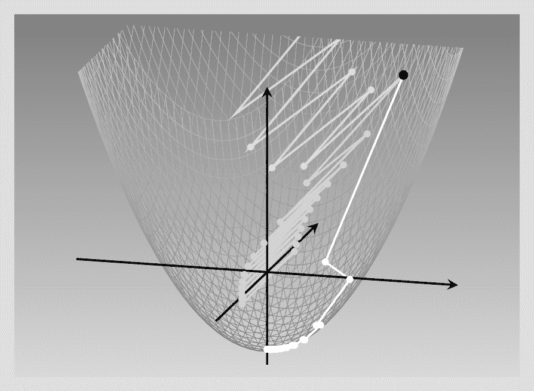
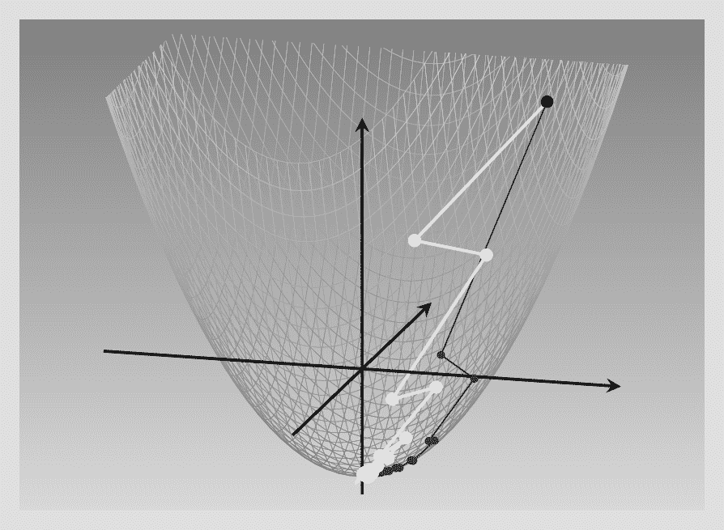
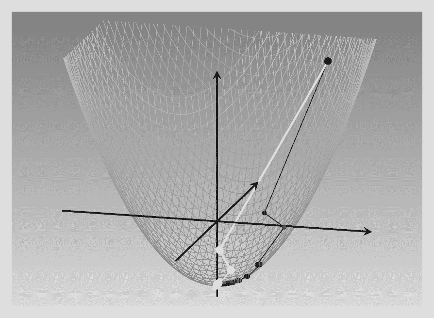
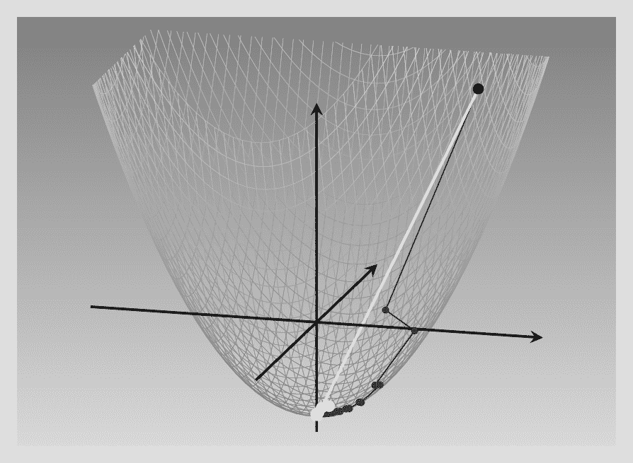
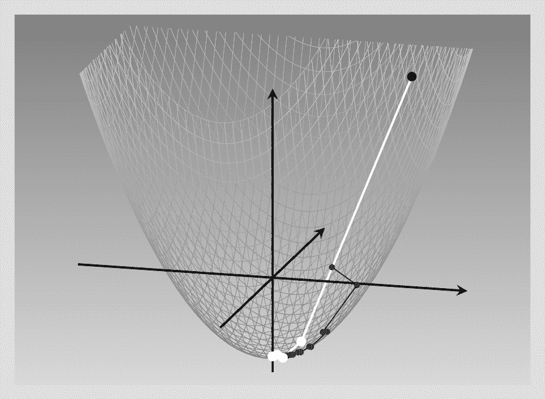

# 8  优化器

> 原文：[`skeydan.github.io/Deep-Learning-and-Scientific-Computing-with-R-torch/optimizers.html`](https://skeydan.github.io/Deep-Learning-and-Scientific-Computing-with-R-torch/optimizers.html)

到目前为止，我们已经对张量、自动微分和模块进行了相当详细的介绍。在本章中，我们将探讨核心 `torch` 中的最后一个主要概念：*优化器*。模块封装了层和模型逻辑，而优化器则封装了优化策略。

让我们先思考一下为什么拥有优化器对象如此有用。

## 8.1 为什么需要优化器？

对于这个问题，主要有两种类型的答案。首先，是技术性的答案。

如果你回顾一下我们编写的第一个神经网络，你会看到我们是这样做的：

+   计算预测（前向传递），

+   计算损失，

+   让 *autograd* 计算偏导数（调用 `loss$backward()`），并

+   更新参数，从每个参数中减去一些梯度的分数。

最后这部分代码如下所示：

```r
library(torch)

# compute gradient of loss w.r.t. all tensors with
# requires_grad = TRUE
loss$backward()

### -------- Update weights -------- 

# Wrap in with_no_grad() because this is a part we don't 
# want to record for automatic gradient computation
with_no_grad({
 w1 <- w1$sub_(learning_rate * w1$grad)
 w2 <- w2$sub_(learning_rate * w2$grad)
 b1 <- b1$sub_(learning_rate * b1$grad)
 b2 <- b2$sub_(learning_rate * b2$grad) 

 # Zero gradients after every pass, as they'd accumulate
 # otherwise
 w1$grad$zero_()
 w2$grad$zero_()
 b1$grad$zero_()
 b2$grad$zero_() 
})
```

*现在这是一个小型的网络——想象一下，如果要在有数十或数百层的架构上编写这样的逻辑！当然，这不可能是一个深度学习框架的开发者希望用户去做的。因此，权重更新由专门的对象——即优化器来处理。*

因此，技术性的答案类型涉及可用性和便利性。但还有更多。使用上述方法，几乎无法通过其他方式找到好的学习率，除非是通过试错。而且，在整个训练过程中可能甚至没有最优的学习率。幸运的是，丰富的传统研究已经提出了一系列经过验证的更新策略。这些策略通常涉及在操作之间保持的 *状态*。这也是为什么，就像模块一样，优化器也是 `torch` 中的对象。

在我们深入探讨这些策略之前，让我们看看如何用使用优化器的版本来替换上述手动权重更新过程。*  *## 8.2 使用内置的 `torch` 优化器

优化器需要知道它应该优化什么。在神经网络模型的上下文中，这将是指网络的参数。然而，由于“模型模块”和“层模块”之间没有真正的区别，我们可以使用单个内置模块，如 `nn_linear()`，来演示它是如何工作的。

在这里，我们实例化了一个梯度下降优化器，它被设计用来处理某些线性模块的参数：

```r
l <- nn_linear(10, 2)

opt <- optim_sgd(l$parameters, lr = 0.1)
```

*除了始终需要引用要优化的张量之外，`optim_sgd()` 只有一个非可选参数：`lr`，即学习率。*

一旦我们有了优化器对象，参数更新将通过调用其 `step()` 方法来触发。尽管如此，有一件事没有改变。我们仍然需要确保梯度在训练迭代中不会累积。这意味着我们仍然调用 `zero_grad()` ——但这次是在优化器对象上。

这是替换上述手动过程的完整代码：

```r
# compute gradient of loss w.r.t. all tensors with
# requires_grad = TRUE
# no change here
loss$backward()

# Still need to zero out gradients before the backward pass,
# only this time, on the optimizer object
optimizer$zero_grad()

# use the optimizer to update model parameters
optimizer$step()
```

*我相信你们会同意，在可用性方面，这是一个巨大的改进。现在，让我们回到我们最初的问题——为什么需要优化器？——并更深入地讨论答案的第二部分，即战略部分。**  **## 8.3 参数更新策略

通过试错来寻找一个好的学习率是代价高昂的。而且，我们不确定的不仅仅是学习率。它只是指定了要迈出多大的一步。然而，这并不是唯一未解决的问题。

到目前为止，我们一直假设最速下降的方向，即由梯度给出的方向，是最好的前进方式。但这并不总是如此。因此，我们对参数更新的幅度和方向都存在不确定性。

幸运的是，在过去十年中，关于神经网络权重更新方面的研究取得了显著进展。在这里，我们来看看涉及的主要考虑因素，并将一些由`torch`提供的最流行优化器置于适当的环境中。

我们比较的基准是 *梯度下降* 或 *最速下降*，这是我们用于手动实现函数最小化和神经网络训练的算法。让我们快速回顾一下其背后的指导原则。

### 8.3.1 梯度下降（又称最速下降，又称随机梯度下降（SGD））

梯度——部分导数的向量，每个输入特征一个——指示函数增加最快的方向。朝相反方向前进意味着我们可以以最快的速度下降。或者，是这样吗？

不幸的是，事情并不那么简单。它取决于我们周围的景观，或者说得更技术一点，是我们想要最小化的函数的轮廓。为了说明这一点，比较两种情况。

第一个是我们在学习自动微分时遇到的。那里的例子是二维空间中的二次函数。当时我们没有对此给予太多关注，但关于这个特定函数的一个重要观点是，它在两个维度上的斜率是相同的。在这种条件下，最速下降是最优的。

让我们验证一下。函数是：$f(x_1, x_2) = 0.2 {x_1}² + 0.2 {x_2}² - 5$，其梯度为$\begin{bmatrix}0.4\\0.4 \end{bmatrix}$。现在假设我们处于点$(x1, x2) = (6,6)$。对于每个坐标，我们减去其当前值的 0.4 倍。或者更确切地说，如果我们必须使用学习率为 1 的话，那会是这样。但我们不必这样做。如果我们选择学习率为 2.5，我们可以一步到达最小值：$(x_1, x_2) = (6 - 2.5*0.4*6, 6 - 2.5*0.4*6) = (0,0)$。下面将展示每种情况下发生的情况的插图(图 8.1)。


图 8.1：使用不同学习率在各向同性抛物面上进行最速下降。

简而言之，因此，对于这种各向同性的函数——方差在两个方向上相同——“仅仅”是正确设置学习率的问题。

现在比较一下，如果两个方向上的斜率明显不同会发生什么。

这次，$x_2$的系数是$x_1$的十倍：我们有$f(x_1, x_2) = 0.2 {x_1}² + 2 {x_2}² - 5$。这意味着当我们沿$x_2$方向前进时，函数值急剧增加，而在$x_1$方向上，它上升得要慢得多。因此，在梯度下降过程中，我们在一个方向上的进展远大于另一个方向。

再次，我们调查了不同学习率下会发生什么。下面，我们对比了三种不同的设置。在最低学习率下，过程最终达到最小值，但比对称情况慢得多。在略高的学习率下，下降过程陷入无休止的曲折，在更有影响力的变量$x_2$的正负值之间振荡。最后，一个仅略高于最小值的学习率产生了灾难性的影响：函数值爆炸，曲折上升直至无穷大(图 8.2)。



图 8.2：使用（最小程度地！）不同的学习率在非各向同性抛物面上进行最速下降。

这应该相当有说服力——即使是一个只有两个变量的相当传统的函数，最速下降也远非万能！在深度学习中，损失函数的行为将远不如预期。这就是需要更复杂算法的地方：再次出现——优化器。

### 8.3.2 重要的因素

从概念上讲，对最速下降的主要修改可以根据推动它们的考虑因素进行分类，或者等价地，根据它们试图解决的问题进行分类。在这里，我们关注三个这样的考虑因素。

首先，每次重新计算梯度时，我们可能不想完全从一个全新的方向开始——保持动量，用技术术语来说。这应该有助于避免上述例子中看到的低效的之字形运动。

第二，回顾一下仅那个最小化非对称函数的例子……为什么，实际上，我们应该被限制在为所有变量使用相同的学习率呢？当很明显所有变量并不以相同的程度变化时，为什么我们不分别以适当的方式更新它们呢？

第三——这是针对那些只有在采取了降低过度影响特征的学习率的行动后才会出现的问题的修复——你还要确保学习仍在进行，参数仍在更新。

这些考虑在优化算法的一些经典例子中得到了很好的说明。

### 8.3.3 保持轨迹：带有动量的梯度下降

在带有动量的梯度下降中，我们并不*直接*使用梯度来更新权重。相反，你可以想象权重更新就像在轨迹上移动的粒子：它们想要继续沿着它们正在去的方向前进——保持它们的*动量*，用物理学的术语来说——但会不断地被碰撞所偏转。这些“碰撞”是对梯度在*当前*位置的友好推动。这些动力学导致了两步更新逻辑。

在下面的公式中，符号的选择反映了物理类比。$\mathbf{x}$是位置，“我们在参数空间中的位置”——或者更简单地说，是参数的当前值。时间演化由上标表示，$\mathbf{y}^{(k)}$代表变量$\mathbf{y}$在当前时间$k$的状态。时间$k$的瞬时速度就是梯度$\mathbf{g}^{(k)}$所测量的。但在更新位置时，我们不会直接使用它。相反，在每次迭代中，更新速度是旧速度——由*动量*参数$m$加权——和新鲜计算的梯度（由学习率加权）的组合。两步逻辑的第一步捕捉了这种策略：

$$ \mathbf{v}^{(k+1)} = m \ \mathbf{v}^{(k)} + lr \ \mathbf{g}^{(k)} \tag{8.1}$$

那么第二步就是由于这种“妥协”速度$\mathbf{v}$导致的$\mathbf{x}$的更新。

$$ \mathbf{x}^{(k+1)} = \mathbf{x}^{(k)} - \mathbf{v}^{(k+1)} \tag{8.2}$$

除了物理类比之外，还有一个你可能觉得有用的类比，它利用了时间序列分析中的一个突出概念。如果我们选择$m$和$lr$使得它们相加等于 1，结果就是一个*指数加权移动平均*。（虽然我认为这种概念化有助于理解，但在实践中没有必要让$m$和$lr$相加等于 1，尽管如此）。

现在，让我们回到非各向同性的抛物面，比较带有和没有动量的 SGD。对于后者（亮曲线），我使用了$lr = 0.5$和$\mu = 0.1$的组合。对于 SGD——暗曲线——学习率是上图中的“好”学习率。毫无疑问，具有动量的 SGD 需要更少的步骤才能达到最小值（fig. 8.3）。



图 8.3：具有动量的 SGD（白色），与普通 SGD（灰色）相比。

### 8.3.4 Adagrad

我们还能做得更好吗？现在，我们知道在我们的运行示例中，真正减慢优化的是其中一个特征比另一个变化得快得多。因此，每个参数有单独的学习率显然是我们想要的。事实上，大多数在深度学习中流行的优化器都有每个参数的学习率。但你是如何实际确定这些学习率的呢？

这就是不同算法的不同之处。例如，Adagrad 将每个参数的更新除以其偏导数的累积和（精确地说，是平方），其中“累积”意味着我们从第一次迭代开始就跟踪它们。如果我们称那个“累积变量”为$s$，用$i$来指代相关的参数，并用$k$来计数迭代，这给了我们以下公式来更新$s$：

$$ s_i^{(k)} = \sum_{j=1}^k (g_i^{(j)})² \tag{8.3}$$

（顺便说一句，如果你不喜欢公式，可以随意跳过。我正在尽力用文字解释它们的作用，所以你不应该错过任何关键信息。）

现在，每个参数的更新规则减去了一部分梯度，就像普通的快速下降一样——但这次，这部分不仅由（全局）学习率决定，还由上述平方偏导数的累积和决定。这个和越大——也就是说，在训练期间梯度越大——调整就越小：¹

$$ x_i^{(k+1)} = x_i^{(k)} - \frac{lr}{\epsilon + \sqrt{s_i^{(k)}}}\ g_i^{(k)}\\ \tag{8.4}$$

这种策略的净效应是，如果一个参数的梯度始终很高，其影响会被减弱。另一方面，那些习惯上梯度很小的参数，一旦发生变化，可以肯定会受到很多关注。

使用这个算法，全局学习率$lr$的重要性较小。在我们的运行示例中，结果是，为了获得最佳结果，我们可以（并且应该）使用一个非常高的学习率：3.7！这里（图 8.4fig. 8.4）是结果，再次与普通梯度下降（灰色曲线）进行比较：



图 8.4：Adagrad（白色），与标准 SGD（灰色）比较。

在我们的例子中，因此，Adagrad 表现得非常好。但在训练神经网络时，我们往往需要进行 *很多* 迭代。然后，随着梯度的累积方式，有效学习率会越来越低，最终达到一个死胡同。

是否有其他方法可以实现每个参数的独立学习率？

### 8.3.5 RMSProp

RMSProp 用加权平均策略替换了 Adagrad 中发现的累积梯度策略。在每一个点上，“账本”，每个参数变量 $s_i$ 是其先前值和先前（平方）梯度的加权平均：

$$ s_i^{(k+1)} = \gamma \ s_i^{(k)} + (1-\gamma) \ (g_i^{(k)})² \tag{8.5}$$

更新看起来与 Adagrad 类似：

$$ x_i^{(k+1)} = x_i^{(k)} - \frac{lr}{\epsilon + \sqrt{s_i^{(k)}}}\ g_i^{(k)}\\ \tag{8.6}$$

这样，每个参数更新都得到了适当的加权，而整体学习速度不会减慢。

这里是结果，再次与 SGD 基线（fig. 8.5）进行比较）：



图 8.5：RMSProp（白色），与标准 SGD（灰色）比较。

截至 today，RMSProp 是深度学习中应用最广泛的优化器之一，可能只有 Adam（将在下一节介绍）更为流行。

### 8.3.6 Adam

Adam 结合了我们已经看到的概念：动量 – 以保持“在轨道上” – 和参数依赖的更新，以避免过度依赖快速变化的参数。逻辑是这样的。²

首先，就像在带有动量的 SGD 中一样，我们保持梯度的指数加权平均。这里，加权系数 $\gamma_v$ 通常设置为 0.9。

$$ v_i^{(k+1)} = \gamma_v \ v_i^{(k)} + (1-\gamma_v) \ g_i^{(k)} \tag{8.7}$$

此外，就像在 RMSProp 中一样，存在平方梯度的指数加权平均，权重系数 $\gamma_s$ 通常设置为 0.999。

$$ s_i^{(k+1)} = \gamma_s \ s_i^{(k)} + (1-\gamma_s) \ (g_i^{(k)})² \tag{8.8}$$

参数更新现在以以下方式利用该信息。速度决定了更新的方向，而速度和梯度的幅度（连同学习率 $lr$）决定了其大小：

$$ x_i^{(k+1)} = x_i^{(k)} - \frac{lr \ v_i^{(k+1)}}{\epsilon + \sqrt{s_i^{(k+1)}}}\ \\ \tag{8.9}$$

让我们通过在我们的运行示例上测试 Adam 来结束这一章(图 8.6)。



图 8.6：Adam（白色），与普通 SGD（灰色）的比较。

接下来，我们将转向损失函数，在我们重新构建回归网络和函数最小化示例以利用`torch`模块和优化器之前，这是我们需要考虑的最后一个构建块。

* * *

1.  在这里，$\epsilon$仅仅是一个很小的值，用于避免除以零。↑

1.  实际实现通常包含一个额外的步骤，但在这里没有必要深入细节。↑

