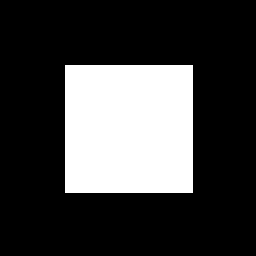
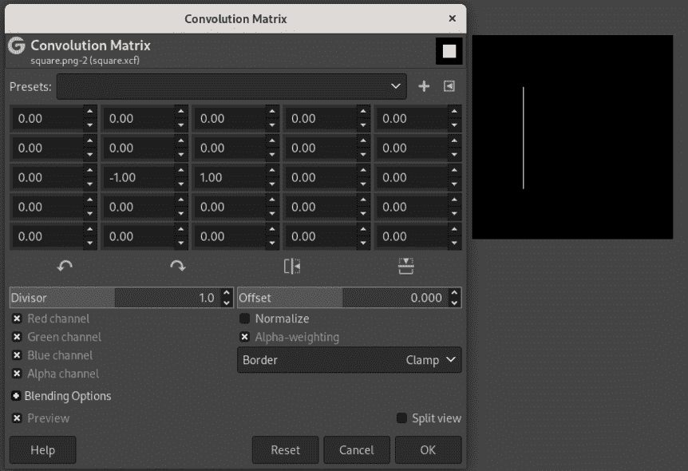
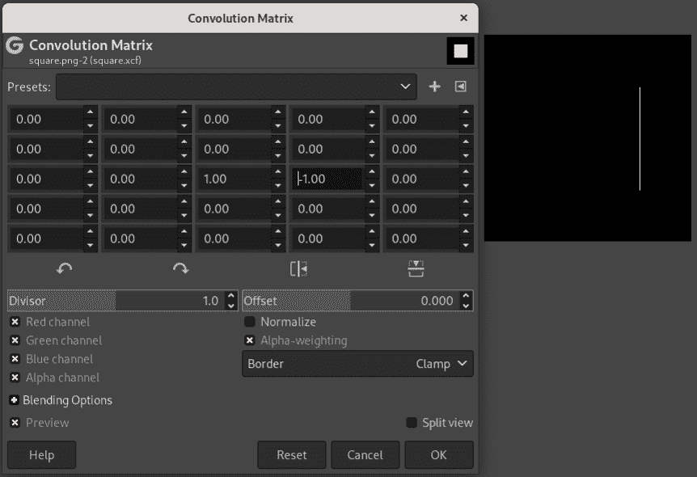
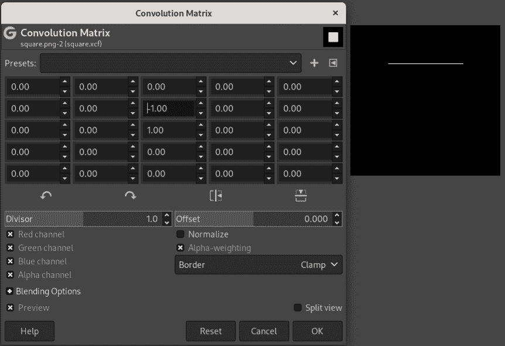
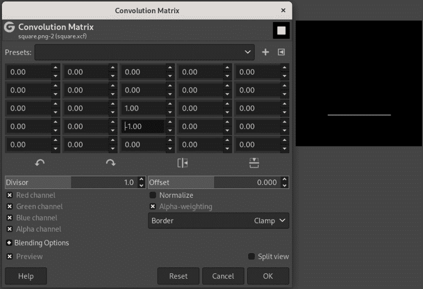
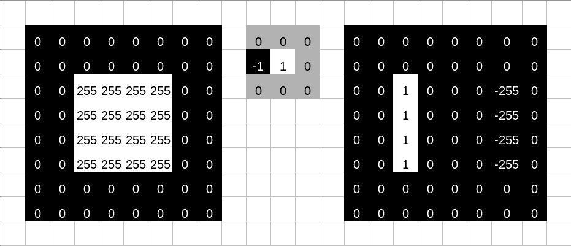
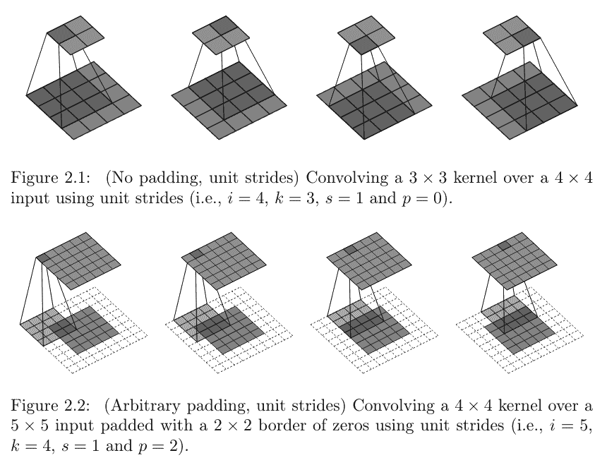
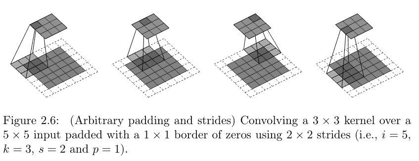
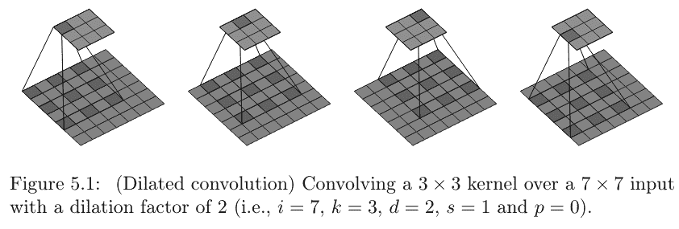
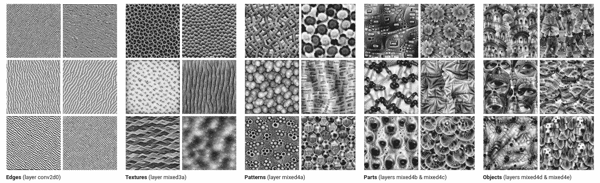

# 15  图像分类的第一步

> 原文：[`skeydan.github.io/Deep-Learning-and-Scientific-Computing-with-R-torch/image_classification_1.html`](https://skeydan.github.io/Deep-Learning-and-Scientific-Computing-with-R-torch/image_classification_1.html)

## 15.1 分类图像需要什么？

想想我们作为人类，如何说出“那是一只猫”，或者：“这是一条狗”。通常情况下，不需要任何有意识的处理。（通常是这样的。）

为什么？涉及到的神经科学和认知心理学超出了本书的范围；但从高层次来看，我们可以假设至少有两个先决条件：首先，我们的视觉系统能够从较低级的特征中构建复杂的表示，其次，我们有一套概念可以映射到这些高级表示。因此，一个预期执行相同任务的算法需要具备这些相同的特性。

在本章的背景下，专注于图像分类，第二个先决条件是自动满足的。分类作为一种监督机器学习的变体，其概念是通过目标来给出的。然而，第一个先决条件至关重要。我们再次可以区分两个组成部分：检测低级特征的能力，以及将它们连续组合成更高级特征的能力。

以一个简单的例子来说明。要识别一个矩形需要什么？矩形由边缘组成：视觉印象（例如颜色）发生变化的直边。因此，首先，算法必须能够识别单个边缘。我们可能称之为“边缘提取器”，它将在图像中标记所有四个边缘。在这种情况下，不需要进一步的特征组合；我们可以直接推断出概念。

另一方面，假设图像显示的是由砖块建造的房子。那么，就会有多个矩形，共同构成房子的墙壁；另一个矩形是门；还有几个更进一步的矩形，是窗户。可能还会有不同排列的边缘，比如三角形形状的屋顶。这意味着，仅仅边缘检测器是不够的：我们还需要“矩形检测器”、“三角形检测器”、“墙壁检测器”、“屋顶检测器”……等等。显然，这些检测器不能预先全部编程。它们将是算法的涌现属性：在我们的情况下，是神经网络。

## 15.2 用于特征检测和特征出现的神经网络

根据我们提出的要求，用于图像分类的神经网络需要（1）能够检测特征，并且（2）构建这样的特征层次。既然是网络，我们可以安全地假设（1）将由专门的层（模块）处理，而（2）将通过连接几个层来实现。

### 15.2.1 使用交叉相关检测低级特征

本章是关于“卷积”神经网络；所讨论的专用模块是“卷积”模块。那么，我为什么要谈论交叉相关呢？这是因为神经网络人士所说的`*convolution*`在技术上实际上是`*cross-correlation*`。（别担心——我将在概念介绍中区分这一点；之后我会像其他人一样说“卷积”。）

那我为什么坚持这一点呢？有两个原因。首先，这本书实际上确实有一个关于卷积的章节——“真正的卷积”；它出现在第三部分，位于矩阵运算和离散傅里叶变换之间。其次，虽然在形式上差异可能很小，但在语义上以及在数学地位上，卷积和交叉相关是明显不同的。大致来说：

卷积可能是所有信号处理中最基本的操作，其基础性就像加法和乘法一样。它可以作为一个`*filter*`，一种信号空间变换，旨在达到期望的结果。例如，移动平均滤波器可以编程为卷积。然而，也可以是相反的东西：强调差异的过滤器。（边缘增强器就是后者的一个例子。）

相比之下，交叉相关更专业。它`*finds*`事物，或者换句话说：它发现了相似性。这就是图像识别中需要的东西。为了展示它是如何工作的，我们从单维开始。

#### 15.2.1.1 一维交叉相关

假设我们有一个信号——一个一元时间序列——看起来像这样：`0,1,1,1,-1,0,-1,-1,1,1,1,-1`。我们想要找到连续出现三个`*one*`的位置。为此，我们使用了一个同样有三个连续`*one*`的过滤器：`1,1,1`。

那个过滤器，也称为`*kernel*`，将在输入序列上滑动，在每个位置产生一个输出值。更准确地说：相关的输出值将被映射到与核中心值`*co-located*`的输入值。那么，我们如何为第一个输入值获得输出呢？这个输入值无法映射到核的中心？为了使这起作用，输入序列被填充了零：一个在前面，一个在后面。新的信号看起来像这样：`0,0,1,1,1,-1,0,-1,-1,1,1,1,-1,0`。

现在，我们将核在信号上滑动。就像这样：

```r
0,0,1,1,1,-1,0,-1,-1,1,1,1,-1,0
1,1,1

0,0,1,1,1,-1,0,-1,-1,1,1,1,-1,0
   1,1,1

0,0,1,1,1,-1,0,-1,-1,1,1,1,-1,0
      1,1, 1
```

等等。

在每个位置，计算映射输入和核值之间的乘积，然后，将这些乘积相加，以得到中心位置的输出值。例如，这就是在非常第一次匹配时计算的内容：`0*1 + 0*1 + 1*1 = 1`。将输出追加，我们得到一个新的序列：`1,2,3,1,0,-2,-2,-1,1,3,1,0`。

这如何帮助我们找到三个连续的 1？好吧，只有当核找到这样的位置时，才能得到 3。因此，使用这种核的选择，我们将输出中的每个`3`视为我们正在寻找的目标序列的中心。

#### 15.2.1.2 二维交叉相关

本章是关于图像的；这种逻辑如何扩展到二维？

一切都和以前一样；只是现在，输入信号扩展到两个维度，核也是二维的。再次强调，输入被填充；例如，对于 3x3 大小的核，顶部和底部各添加一行，左右各添加一列。再次强调，核在图像上逐行逐列滑动。在每一个点上，它计算一个总和，即点积。从数学上来说，这就是*点积*。

为了了解这是如何工作的，我们来看一个简单的例子：一个白色正方形在黑色背景上（图 15.1）。



图 15.1：黑色背景上的白色正方形。

开源图形程序 Gimp 有一个功能，允许用户尝试自定义过滤器（“过滤器”->“自定义”->“卷积矩阵”）。我们可以构建核并直接观察它们的效果。

假设我们要找到正方形的左边缘。我们正在寻找颜色在水平方向上从黑色变为白色的位置。这可以通过一个看起来像这样的 3x3 核来实现（图 15.2）：

```r
 0 0 0
-1 1 0
 0 0 0
```

这个核与我们所感兴趣的边缘类型相似，因为它在第二行中有一个从-1 到 1 的水平过渡。

类似地，可以构建提取右侧（图 15.3）、顶部（图 15.4）和底部（图 15.5）边缘的核。



图 15.2：检测左侧边缘的 Gimp 卷积矩阵。



图 15.3：检测右侧边缘的 Gimp 卷积矩阵。



图 15.4：检测顶部边缘的 Gimp 卷积矩阵。



图 15.5：Gimp 卷积矩阵，用于检测底部边缘。

为了从数值上理解这一点，我们可以模拟一个微小的图像(图 15.6，左侧)。这些数字代表一个灰度图像，其值范围从 0 到 255。在其右侧，我们有核；这是我们用来检测左侧边缘的核。由于该核在图像上滑动，我们获得了右侧的“图像”。由于`0`是可能的最小值，负像素最终变为黑色，我们在黑色背景上获得了一个白色边缘，就像我们在 Gimp 中看到的那样。



图 15.6：输入图像、滤波器和像素值的结果。由于像素值不可能是负数，-255 将最终变为 0。

现在，我们已经讨论了很多关于构建核的内容。神经网络都是关于*学习*特征检测器，而不是预先编程。因此，学习一个滤波器意味着有一个层类型，其权重体现了这种逻辑。

#### 15.2.1.3 `torch`中的卷积层

到目前为止，我们看到的唯一一种学习权重的层类型是`nn_linear()`。`nn_linear()`执行仿射操作：它接受一个输入张量，将其与其权重矩阵$\mathbf{W}$进行矩阵乘法，并加上偏置向量$\mathbf{b}$。虽然每个层只有一个偏置，与其包含的神经元数量无关，但对于权重来说并非如此：输入张量中的每个特征与层的每个神经元之间都有一个独特的连接。

这对于`nn_conv2d()`，`torch`（二维）卷积层¹并不成立。

回到卷积层与线性层不同的地方。我们已经看到了层的预期效果：*核*应该在它的输入上滑动，在每个位置生成一个输出值。现在，对于卷积层，核正是其权重矩阵。核在输入图像上滑动意味着每次它移动位置时都会重用权重。因此，权重的数量由核的大小决定，而不是输入的大小。因此，卷积层比线性层要经济得多。

另一种表达方式如下。

从概念上讲，我们希望在任何图像中出现的地方找到相同的东西。以最标准的标准图像分类基准 MNIST 为例。它关于对阿拉伯数字 0-9 的图像进行分类。比如说我们想要学习 2 的形状。2 可能位于图像的中央，或者它可能被移到左边（比如说）。算法应该能够识别它无论在哪里。额外的要求取决于任务。如果我们只需要能够说“那是 2”，我们可以使用一个**平移不变**的算法：它独立于可能发生的任何位移输出相同的结果。对于分类来说，这完全没问题：2 就是 2 就是 2。

然而，另一个重要的任务是图像分割（我们将在下一章中探讨）。在分割中，我们希望根据像素是否属于某个对象来标记图像中的所有像素。例如，考虑肿瘤细胞。2 仍然是 2，但我们确实需要知道它在图像中的位置。现在要使用的算法必须是**平移等变**的：如果发生了位移，目标仍然被检测到，但位置发生了变化。考虑到卷积算法，平移等变正是它所要求的。

因此，我们现在有了如何使用`torch`在图像中检测单个特征的想法。这给了我们愿望清单中的第一条。第二条是关于组合特征检测器，即建立层次结构，以便区分越来越多地专门化的对象类型。这意味着从单个层开始，我们转向一个层网络。

### 15.2.2 构建特征层次结构

对于图像分类，一个典型的卷积神经网络将链接着由三种类型的层组成的块：卷积层（`nn_conv1d()`、`nn_conv2d()`或`nn_conv3d()`，取决于我们所在的维度），激活层（例如，`nn_relu()`）和池化层（例如，`nn_maxpool1d()`、`nn_maxpool2d()`、`nn_maxpool3d()`）。

我们还没有讨论过的唯一类型是池化层。就像激活层一样，这些层没有参数；它们所做的是聚合邻近的张量值。要总结的区域大小由层构造函数的参数指定。有各种类型的聚合方式可用：`nn_maxpool<n>d()`选择最高值，而`nn_avg_pool<n>d()`计算平均值。

为什么人们想要执行这些类型的聚合？从实际的角度来看，如果想要得到每个图像的输出（而不是每个像素的输出），就必须这样做。但我们不能随意选择任何空间排列值的聚合方式。例如，想象一下，一个平均值，其中图像块的内部像素比外部像素的权重更高。那么，块中某个对象的位置就会有所不同。但对于分类来说，这种情况不应该发生。与分割不同，对于分类，我们想要平移*不变性*——不仅仅是*等变性*，这是我们刚才说的卷积所具有的性质。而平移不变性正是像`nn_maxpool2d()`、`nn_avgpool2d()`等层所具有的。

#### 15.2.2.1 典型卷积网络

一个卷积网络的模板，从现在起称为“convnet”，可能看起来如下。为了预防任何可能的混淆：尽管在上面，我提到了三种类型的*层*，但实际上代码中只有一种类型：卷积层。为了简洁，ReLU 激活和最大池化都实现了作为函数。

这里是一个可能的模板。这并不是作为一个建议（例如，关于滤波器数量、核大小或其他超参数）——只是为了说明机制。更详细的注释如下。

```r
library(torch)

convnet <- nn_module(
 "convnet",

 initialize = function() {

 # nn_conv2d(in_channels, out_channels, kernel_size)
 self$conv1 <- nn_conv2d(1, 16, 3)
 self$conv2 <- nn_conv2d(16, 32, 3)
 self$conv3 <- nn_conv2d(32, 64, 3)

 self$output <- nn_linear(2304, 3)

 },

 forward = function(x) {

 x %>% 
 self$conv1() %>% 
 nnf_relu() %>%
 nnf_max_pool2d(2) %>%
 self$conv2() %>% 
 nnf_relu() %>%
 nnf_max_pool2d(2) %>%
 self$conv3() %>% 
 nnf_relu() %>%
 nnf_max_pool2d(2) %>%
 torch_flatten(start_dim = 2) %>%
 self$output()

 }
)

model <- convnet()
```

*为了理解正在发生的事情，我们需要知道图像在`torch`中的表示方式。本身，一个图像被表示为一个三维张量，其中一个维度索引到可用的通道（包 luz）（一个用于灰度图像，三个用于 RGB，可能还有更多用于不同类型的成像输出），其他两个维度对应于两个空间轴，高度（行）和宽度（列）。在深度学习中，我们处理批次；因此，还有一个额外的维度——第一个维度——它指的是批次编号。

让我们看看一个可能用于上述模板的示例图像：

```r
img <- torch_randn(1, 1, 64, 64)
```

*我们这里有一个图像，或者更准确地说，一个包含单个图像的批次，该图像只有一个通道，大小为 64 x 64。

话虽如此，上面的模板假设以下内容：

1.  输入图像有一个通道。这就是为什么当我们构建第一个卷积层时，`nn_conv2d()`的第一个参数是`1`。 （另一方面，没有对输入图像的大小做出假设。）

1.  我们想要区分三个不同的目标类别。这意味着输出层，一个线性模块，需要有三个输出通道。

为了测试代码，我们可以将未训练的模型调用到我们的示例图像上：

```r
model(img)
```

```r
torch_tensor
0.01 *
 6.4821  3.4166 -5.6050
[ CPUFloatType{1,3} ][ grad_fn = <AddmmBackward0> ]
```

关于该模板的最后一项注意。当你阅读上面的代码时，可能有一行会显得突出：

```r
self$output <- nn_linear(2304, 3)
```

*那个 2304，即 `nn_linear()` 的输入连接数是如何得来的？这是由于（1）一系列减少空间分辨率的操作，加上（2）一个移除除批量维度之外所有维度信息的展平操作的结果。一旦我们讨论了相关层的参数，这就会更加有意义。但有一件事需要提前说明：*如果这听起来像是魔法，有一个简单的方法可以让魔法消失。* 也就是说，一个简单的方法来了解网络中任何阶段的张量形状，就是注释 `forward()` 中后续的所有操作，并调用修改后的模型。当然，这不应该取代理解，但这是一个在遇到形状错误时避免失去耐心的好方法。

现在，关于层参数。
  
#### 15.2.2.2 `nn_conv2d()` 的参数

在上面，我们向 `nn_conv2d()` 函数传递了三个参数：`in_channels`、`out_channels` 和 `kernel_size`。但这并不是参数的完整列表。剩余的参数都有默认值，但了解它们的存在是很重要的。我们将详细说明其中的三个，这些参数在你将模板应用于具体任务时可能会用到。它们都会影响输出大小。其中两个强制参数 `out_channels` 和 `kernel_size` 也是如此：

+   `out_channels` 指的是学习到的核（在这个上下文中通常称为 *filters*）的数量。它的值会影响输出张量的四个维度中的第二个；但它不会影响空间分辨率。学习更多的核会增加网络的容量，因为它增加了权重的数量。

+   另一方面，`kernel_size` *确实* 会改变空间分辨率——除非其值为 1，在这种情况下，核永远不会超出图像边界。像 `out_channels` 一样，它也是实验的候选者。不过，一般来说，建议保持核的大小较小，并串联更多的卷积层，而不是在“浅层”网络中增大核的大小。

现在来探索三个非强制参数。

1.  `padding` 是我们之前遇到过的东西。任何超过单个像素的核在滑动到图像上时都会移动到有效区域之外；核越大，这种情况就越明显。一般的选择是（1）要么对图像进行填充（例如使用零），要么（2）只在可能的情况下计算点积。在后一种情况下，空间分辨率会降低。这本身可能不是问题；就像许多事情一样，这是一个实验的问题。默认情况下，`torch` 不对图像进行填充；然而，通过传递大于 `0` 的 `padding` 值，你可以确保无论核的大小如何，空间分辨率都得到保留。比较 图 15.7，它来自 Dumoulin 和 Visin 的出色汇编（2016），以了解填充的影响。

1.  `stride`指的是核在图像上移动的方式。当`stride`大于`1`时，它以某种“跳跃”的方式移动 – 见图 15.8。这导致拍摄的“快照”更少。因此，空间分辨率降低。

1.  当`dilation`的设置大于`1`时，也会导致拍摄的快照更少，但原因不同。现在，并不是核移动得更快。相反，它所应用的像素不再相邻。它们被分散开 – 分散的程度取决于参数的值。见图 15.9。



图 15.7：卷积和填充效果。版权所有杜莫林和维辛 (2016)，在[MIT 许可证](https://github.com/vdumoulin/conv_arithmetic/blob/master/LICENSE)下复制。



图 15.8：卷积和步长的影响。版权所有杜莫林和维辛 (2016)，在[MIT 许可证](https://github.com/vdumoulin/conv_arithmetic/blob/master/LICENSE)下复制。



图 15.9：卷积和`dilation`的影响。版权所有杜莫林和维辛 (2016)，在[MIT 许可证](https://github.com/vdumoulin/conv_arithmetic/blob/master/LICENSE)下复制。

对于非强制性的参数`padding`、`stride`和`dilation`，表 15.1 总结了默认值和效果。

表 15.1：你可能想要实验的`nn_conv_2d()`函数的参数 – 默认值和非默认操作。

| 参数 | 默认值 | 操作（如果非默认） |
| --- | --- | --- |
| `padding` | 0 | 在图像周围添加虚拟的行/列 |
| `stride` | 1 | 核在图像上以更大的步长移动（“跳过”像素） |
| `dilation` | 1 | 核应用于扩展图像像素（核中的“空洞”） |

#### 15.2.2.3 池化层的参数

池化层计算相邻像素的聚合。每个维度上聚合的像素数由层构造函数的第一个参数指定（或者相应函数的第二个参数）。稍微有些误导的是，这个参数被称为`kernel_size`，尽管其中不涉及权重：例如，在上面的模板中，我们无条件地取 2 x 2 大小区域内的最大像素值。

与卷积层类似，池化层也接受`padding`和`stride`参数。然而，它们很少被使用。

#### 15.2.2.4 缩放视图

我们已经讨论了很多关于层及其参数的内容。现在让我们退一步，回顾一下通用模板，以及它试图实现的目标。

我们正在链式连接执行卷积、应用非线性函数和空间聚合结果的块。每个块的权重充当特征检测器，除了第一个块之外，每个块都接收已经应用了一个或多个特征检测器的结果作为输入。发生神奇的事情，也是卷积网络成功的原因，是通过链式连接层，构建了一个*特征层次结构*。早期层检测边缘和纹理，后面的层检测各种复杂性的模式，最后的层检测物体及其部分（参见图 15.10，这是从 Olah、Mordvintsev 和 Schubert（2017）复制的美丽可视化）。



图 15.10：GoogleNet 部分层的特征可视化。图来自 Olah、Mordvintsev 和 Schubert（2017），在[Creative Commons Attribution CC-BY 4.0](https://creativecommons.org/licenses/by/4.0/)许可下未经修改复制。

我们现在对编码卷积网络及其工作原理有了足够的了解，可以探索一个真实示例。
  
## 15.3 在 Tiny Imagenet 上的分类

在我们开始编码之前，让我先设定一下你的期望。在本章中，我们将从头开始设计和训练一个基本的卷积网络。至于数据预处理，我们只做必要的，不做多余。在接下来的两章中，我们将学习用于提高模型训练质量及速度的常见技术。一旦我们覆盖了这些内容，我们就会继续本章的结尾，并将其中的一些技术应用于当前任务。因此，我们在这里所做的只是建立一个基线，用于与更复杂的方法进行比较。这只是一个开始。

### 15.3.1 数据预处理

除了`torch`和`luz`，我们还从`torch`生态系统中加载了第三个包：`torchvision`。`torchvision`提供了图像操作，以及一组预训练模型和常见的基准数据集。

```r
library(torch)
library(torchvision)
library(luz)
```

*我们使用的数据集是“Tiny Imagenet”。Tiny Imagenet 是[ImageNet](https://image-net.org/index.php)的一个子集，一个包含超过一千万张图片的巨大集合，最初通过 2012 年至 2017 年举办的“ImageNet 大规模视觉识别挑战赛”而广受欢迎。在挑战赛中，最受欢迎的任务是多类别分类，有 1000 个不同的类别可供选择。

一千个类别很多；而且图像通常以 256 x 256 的分辨率进行处理，即使在豪华硬件上训练模型也需要很长时间。因此，作为斯坦福大学流行深度学习图像课程[卷积神经网络用于视觉识别（CS231n）](http://cs231n.stanford.edu/)的一部分，创建了一个更易于管理的版本。浓缩的数据集有二百个类别，每个类别有五百个训练图像。二百个类别仍然很多！（大多数入门示例都会做“猫对狗”，或其他一些二元问题。）因此，这不是一个简单的任务。

我们首先开始下载数据。

```r
set.seed(777)
torch_manual_seed(777)

dir <- "~/.torch-datasets"

train_ds <- tiny_imagenet_dataset(
 dir,
 download = TRUE,
 transform = function(x) {
 x %>%
 transform_to_tensor() 
 }
)

valid_ds <- tiny_imagenet_dataset(
 dir,
 split = "val",
 transform = function(x) {
 x %>%
 transform_to_tensor()
 }
)
```

*注意`tiny_imagenet_dataset()`函数接受一个名为`transform`的参数。这个参数用于指定作为输入管道一部分要执行的操作。在这里，并没有发生太多事情：我们只是将图像转换为可以工作的张量。然而，很快我们就会看到这个参数被用来指定一系列变换，如调整大小、裁剪、旋转等。

剩下的工作是要创建数据加载器。

```r
train_dl <- dataloader(train_ds,
 batch_size = 128,
 shuffle = TRUE
)
valid_dl <- dataloader(valid_ds, batch_size = 128)
```

*图像是 RGB 格式，大小为 64 x 64：

```r
batch <- train_dl %>%
 dataloader_make_iter() %>%
 dataloader_next()

dim(batch$x)
```

```r
[1] 128   3  64  64
```

类别是介于 1 到 200 之间的整数：

```r
batch$y
```

```r
torch_tensor
 172
  17
  76
  78
 111
  57
   8
 166
 146
 114
  41
  28
 138
  98
  57
  98
  25
 148
 166
 135
  31
 182
  48
 184
 160
 166
  40
 115
 161
  21
... [the output was truncated (use n=-1 to disable)]
[ CPULongType{128} ]
```

现在我们定义一个卷积神经网络，并用`luz`对其进行训练。
  
### 15.3.2 从零开始进行图像分类

这里是一个典型的卷积神经网络，基于我们的模板，但更强大。

除了我们已经看到的，代码还展示了如何模块化代码，将层组织成三个组：

+   一个（大型的）特征检测器，作为一个整体，是平移等变的；

+   一个平移不变池化层(`nn_adaptive_avg_pool2d()`)，允许我们指定所需的输出分辨率；以及

+   一个前馈神经网络，它接受计算出的特征并使用它们来生成最终得分：对于批次中的每个项目，有二百个值，对应二百个类别。

```r
convnet <- nn_module(
 "convnet",
 initialize = function() {
 self$features <- nn_sequential(
 nn_conv2d(3, 64, kernel_size = 3, padding = 1),
 nn_relu(),
 nn_max_pool2d(kernel_size = 2),
 nn_conv2d(64, 128, kernel_size = 3, padding = 1),
 nn_relu(),
 nn_max_pool2d(kernel_size = 2),
 nn_conv2d(128, 256, kernel_size = 3, padding = 1),
 nn_relu(),
 nn_max_pool2d(kernel_size = 2),
 nn_conv2d(256, 512, kernel_size = 3, padding = 1),
 nn_relu(),
 nn_max_pool2d(kernel_size = 2),
 nn_conv2d(512, 1024, kernel_size = 3, padding = 1),
 nn_relu(),
 nn_adaptive_avg_pool2d(c(1, 1))
 )
 self$classifier <- nn_sequential(
 nn_linear(1024, 1024),
 nn_relu(),
 nn_linear(1024, 1024),
 nn_relu(),
 nn_linear(1024, 200)
 )
 },
 forward = function(x) {
 x <- self$features(x)$squeeze()
 x <- self$classifier(x)
 x
 }
)
```

*现在，我们开始训练网络。分类器输出的是原始的对数几率，而不是概率；这意味着我们需要使用`nn_cross_entropy_loss()`。我们训练了五十个 epoch：

```r
fitted <- convnet %>%
 setup(
 loss = nn_cross_entropy_loss(),
 optimizer = optim_adam,
 metrics = list(
 luz_metric_accuracy()
 )
 ) %>%
 fit(train_dl,
 epochs = 50,
 valid_data = valid_dl,
 verbose = TRUE
 )
```

*经过五十个 epoch 后，训练集和测试集上的准确率分别为 0.92 和 0.22。这是一个相当大的差异！在训练集上，这个模型几乎是完美的；在测试集上，它只能正确识别到每第四张图像。

```r
Epoch 1/50
Train metrics: Loss: 5.0822 - Acc: 0.0146                                     
Valid metrics: Loss: 4.8564 - Acc: 0.0269
Epoch 2/50
Train metrics: Loss: 4.5545 - Acc: 0.0571                                     
Valid metrics: Loss: 4.2592 - Acc: 0.0904
Epoch 3/50
Train metrics: Loss: 4.0727 - Acc: 0.1122                                     
Valid metrics: Loss: 3.9097 - Acc: 0.1381
...
...
Epoch 48/50
Train metrics: Loss: 0.3033 - Acc: 0.9064                                     
Valid metrics: Loss: 10.2999 - Acc: 0.2188
Epoch 49/50
Train metrics: Loss: 0.2932 - Acc: 0.9098                                     
Valid metrics: Loss: 10.7348 - Acc: 0.222
Epoch 50/50
Train metrics: Loss: 0.2733 - Acc: 0.9152                                     
Valid metrics: Loss: 10.641 - Acc: 0.2204
```

在两百个选项中选择，“每四个”似乎并不那么糟糕；然而，当我们看到两个指标之间巨大的差异时，似乎有些不对劲。模型严重地**过拟合**了训练集——换句话说，就是记住了训练样本。过拟合不仅限于深度学习；它是所有机器学习的宿敌。我们将在下一章专门讨论这个话题。

在结束之前，让我们看看如何使用`luz`来获取预测结果：

```r
preds <- last %>% predict(valid_dl)
```

*`predict()`直接返回模型输出的内容：每个项目的两百个非归一化分数。这是因为模型的最后一层是一个线性模块，没有应用激活函数。（还记得损失函数`nn_cross_entropy_loss()`在计算交叉熵之前应用了*softmax*操作吗？）

现在，我们当然可以自己调用`nnf_softmax()`，将`predict()`的输出转换为概率：

```r
preds <- nnf_softmax(preds, dim = 2)
```

*然而，如果我们只是想确定最可能的类别，我们也可以跳过归一化步骤，直接为每个批次的每个项目选择最高值：

```r
torch_argmax(preds, dim = 2)
```

```r
torch_tensor
  55
   1
   1
   1
   1
   1
   1
  89
  45
   1
   1
  19
   1
 190
  14
   1
 185
   1
   1
 150
  77
  37
 131
 193
  80
   1
   1
  45
   1
 131
... [the output was truncated (use n=-1 to disable)]
[ CUDALongType{10000} ]
```

我们现在可以继续比较预测结果与实际类别，寻找可以做得更好的灵感。但在这个阶段，还有很多地方可以改进！我们将在适当的时候回到这个应用，但首先，我们需要了解过拟合以及加快模型训练的方法。

Dumoulin, Vincent, and Francesco Visin. 2016\. “A guide to convolution arithmetic for deep learning.” *arXiv e-Prints*, March, arXiv:1603.07285\. [`arxiv.org/abs/1603.07285`](https://arxiv.org/abs/1603.07285).Olah, Chris, Alexander Mordvintsev, and Ludwig Schubert. 2017\. “Feature Visualization.” *Distill*. [`doi.org/10.23915/distill.00007`](https://doi.org/10.23915/distill.00007).
 
 * *

1.  就像我上面说的，从现在起，我将使用已建立的术语“卷积”。实际上——鉴于权重是*学习得到的*——这并不那么重要。↩︎

