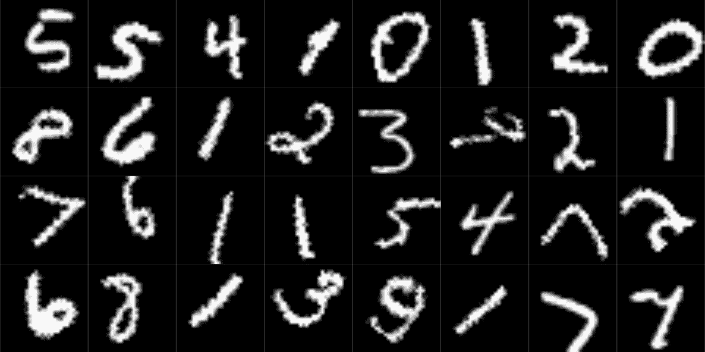
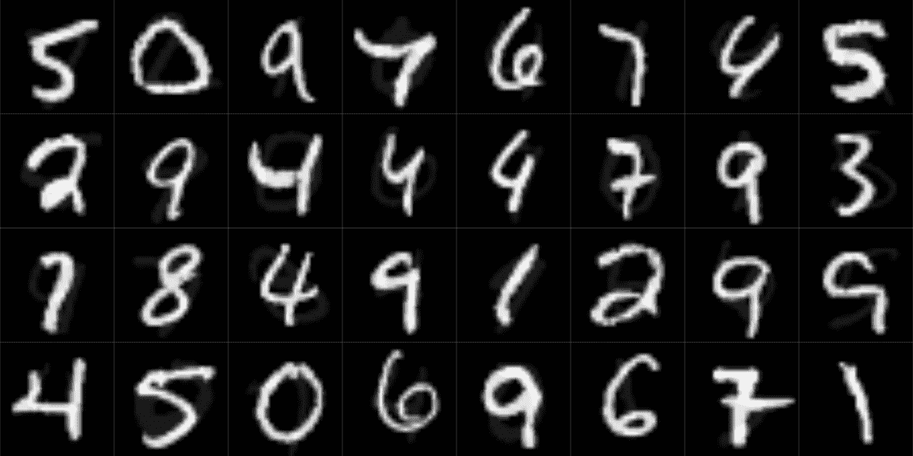
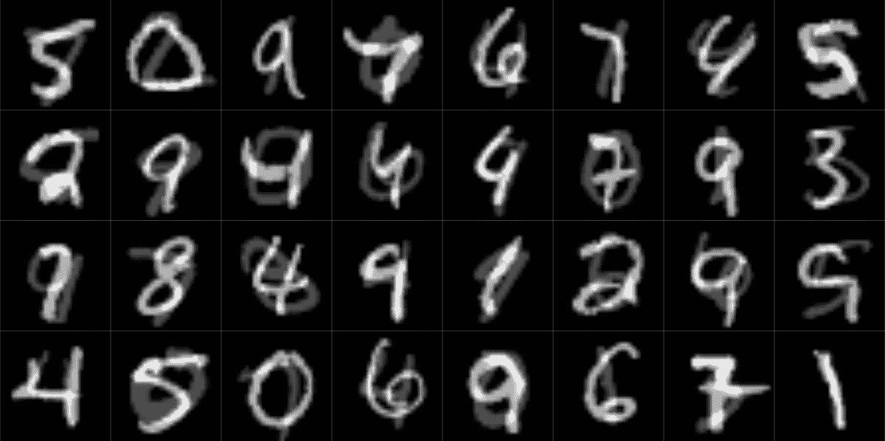
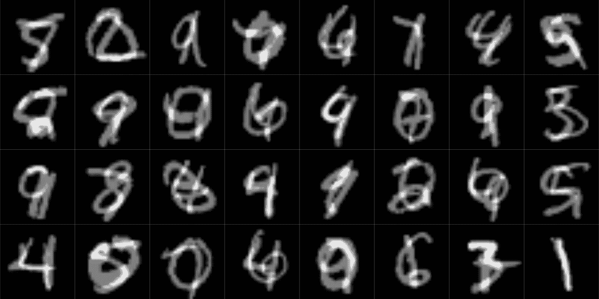

# 16  使模型泛化

> [`skeydan.github.io/Deep-Learning-and-Scientific-Computing-with-R-torch/overfitting.html`](https://skeydan.github.io/Deep-Learning-and-Scientific-Computing-with-R-torch/overfitting.html)

在深度学习，就像在机器学习一般，我们面临一个泛化问题。毕竟，训练集是有限的。没有保证模型所学的知识可以推广到“外部世界”。

这个问题有多大？这取决于。当我们自己构建一个玩具问题时，我们可以积极确保训练集和测试集来自完全相同的分布。在光谱的另一端是那些从一开始就知道存在显著结构差异的配置。在后一种情况下，本章中描述的措施将是有用的，但不足以解决问题。相反，需要专家领域知识和适当的流程（重新）设计。

在两个极端之间，存在广泛的可能。例如：

+   一个图像数据集使用了优秀的摄影设备拍摄的所有图片，并且从 180 度的角度进行观察；但是预测将在“野外”进行，使用手机。

+   一个用于诊断皮肤癌的应用程序主要是在白人男性身上训练的，但应该由任何性别和/或肤色的人使用。

第二个例子应该清楚地表明，缺乏泛化（即*过拟合*¹](#fn1)）——绝对不是一个纯粹的技术问题。代表性不足，甚至*缺乏*代表性，是*数据集偏差*的主要表现之一。在我们下面讨论的防止过拟合的措施中，只有一项——最重要的——适用于第二种场景。（这本书是关于技术主题的；但如前言所强调的，我们生活在一个“现实世界”中，这个世界不仅极其复杂，而且充满了不平等、不公正和不正义。无论我们的技术焦点有多强，这都是我们永远不应该忽视的事情。）

我将要介绍的对策可以根据它们在机器学习工作流程中应用的阶段进行排序：数据收集、数据预处理、模型定义和模型训练。正如你现在所期望的，最重要的措施，如上所述，是收集更多具有代表性的数据。

## 16.1 通往王者的道路：更多——更多代表性！——的数据

根据你的情况，你可能被迫使用现有的数据集。在这种情况下，你仍然可以选择用你自己收集的数据补充外部来源，尽管数量较少。

在下一章中，我们将遇到迁移学习的技术。迁移学习意味着利用**预训练**的模型，将它们用作你“下游”任务的特性提取器。通常，这些模型已经在大型数据集上进行了训练。因此，它们不仅“非常擅长它们所做的事情”，而且它们还能泛化到未见过的数据——**前提**是新数据与它们训练过的数据相似。如果它们不相似怎么办？对于许多任务，仍然可以使用预训练模型：按照原样使用它，并继续训练它——但现在，添加你希望它泛化的数据类型。

当然，能够添加任何你自己的数据可能仍然是一个梦想。在这种情况下，你所能做的就是深思熟虑你的结果将如何产生偏差，并且对此保持诚实。

现在，假设你已经深思熟虑，并且自信你的训练数据中没有系统性缺陷，这会阻止它们泛化到现实世界的用例。或者，也许你已经根据需要限制了你的模型的应用领域。那么，如果你有一个小的训练集并且希望它尽可能泛化，你能做什么呢？

## 16.2 预处理阶段：数据增强

数据增强意味着取你已有的数据并对其进行修改，以便迫使算法抽象出某些事物。是什么事物？这取决于操作的领域。这应该通过一个具体的例子变得清晰。

在本章中，我将介绍两种流行的数据增强变体：一个我将称之为“经典”，另一个被称为“mixup”。

### 16.2.1 经典数据增强

传统上，当人们谈论（图像）数据增强时，他们心中所想的是以下内容。你取一张图片，并对其应用一些随机变换。这种变换可以是几何变换，例如旋转、平移或缩放图片。或者，不是移动物体，操作可以影响颜色，例如改变亮度或饱和度。其他选项包括模糊图像，或者相反，锐化图像。技术上，你可以自由实现你想要的任何算法——你不必使用`torchvision`提供的（众多！）任何变换。然而，在实践中，你可能会发现你需要的许多变换已经可用。

在我们的运行示例中，我们将使用 MNIST，这是我们之前已经快速使用过的图像分类数据集的“Hello World”。它包含 70,000 个数字`0`到`9`的图像，以六比一的比例分为训练集和测试集。像以前一样，我们从`torchvision`获取数据。

要查看没有数据增强的数字是如何出现的，请查看测试集中的前 32 个图像（图 16.1）：

```r
library(torch)
library(torchvision)
library(luz)

dir <- "~/.torch-datasets"

valid_ds <- mnist_dataset(
 dir,
 download = TRUE,
 train = FALSE,
 transform = transform_to_tensor
)

valid_dl <- dataloader(valid_ds, batch_size = 128)

# a convenient way to obtain individual images without 
# manual iteration
test_images <- coro::collect(
 valid_dl, 1
)[[1]]$x[1:32, 1, , ] %>% as.array()

par(mfrow = c(4, 8), mar = rep(0, 4), mai = rep(0, 4))
test_images %>%
 purrr::array_tree(1) %>%
 purrr::map(as.raster) %>%
 purrr::iwalk(~ {
 plot(.x)
 })
```

*![三十二位数字，直立站立。（图片路径：../Images/79ad6250a77b4c2a00a0d16af75da4eb.png）*

图 16.1：MNIST：测试集中的前 32 个图像。

现在，我们使用训练集来实验数据增强。就像我们在上一章中使用的`dogs_vs_cats_dataset()`一样——实际上，就像所有`torchvision`数据集一样——`mnist_dataset()`接受一个`transform`参数，允许你传入任意变换来对输入图像进行操作。在下面的代码片段中出现的四种变换中，我们已经见过一种：`transform_to_tensor()`，用于将 R `double`s 转换为`torch`张量。其他三种，都带有后缀`_random_`，都会触发非确定性的数据增强：无论是通过水平翻转图像(`transform_random_horizontal_flip()`)或垂直翻转(`transform_random_vertical_flip()`)，还是通过旋转和平移(`transform_random_affine()`)。在所有情况下，扭曲的程度都是可配置的。

```r
train_ds <- mnist_dataset(
 dir,
 download = TRUE,
 transform = . %>%
 transform_to_tensor() %>%
 # flip horizontally, with a probability of 0.5
 transform_random_horizontal_flip(p = 0.5) %>%
 # flip vertically, with a probability of 0.5
 transform_random_vertical_flip(p = 0.5) %>%
 # (1) rotate to the left or the right,
 #     up to respective angles of 45 degrees
 # (2) translate vertically or horizontally,
 #     not exceeding 10% of total image width/height
 transform_random_affine(
 degrees = c(-45, 45),
 translate = c(0.1, 0.1)
 )
)
```

*再次，让我们看看一个样本结果(图 16.2)。

```r
train_dl <- dataloader(
 train_ds,
 batch_size = 128,
 shuffle = TRUE
)

train_images <- coro::collect(
 train_dl, 1
)[[1]]$x[1:32, 1, , ] %>% as.array()

par(mfrow = c(4, 8), mar = rep(0, 4), mai = rep(0, 4))
train_images %>%
 purrr::array_tree(1) %>%
 purrr::map(as.raster) %>%
 purrr::iwalk(~ {
 plot(.x)
 })
```

*

图 16.2：MNIST，带有随机旋转、平移和翻转。

这些效果非常明显，旋转和平移选择的范围看起来也很有道理。但是，让我们思考一下翻转。包含翻转是否真的*有意义*？

通常，这取决于数据集，甚至更多，取决于任务。想象一下一只猫，舒适地坐在蓬松的沙发上。如果猫朝右边看而不是朝左边看，它仍然是一只猫；如果它倒置了，我们可能会认为图像加载错误了。这两种变换都不会影响它的“猫性”。然而，对于数字来说就不同了。翻转的$1$和$1$在默认情况下并不相同。因此，对于 MNIST，我宁愿只使用旋转和平移：

```r
train_ds <- mnist_dataset(
 dir,
 download = TRUE,
 transform = . %>%
 transform_to_tensor() %>%
 transform_random_affine(
 degrees = c(-45, 45), translate = c(0.1, 0.1)
 )
)

train_dl <- dataloader(train_ds,
 batch_size = 128,
 shuffle = TRUE
)
```

*现在，为了比较增强和不增强的情况，你需要分别训练两个模型，一个用于增强版本，另一个用于非增强版本的训练集。以下是一个示例设置：

```r
convnet <- nn_module(
 "convnet",
 initialize = function() {
 # nn_conv2d(in_channels, out_channels, kernel_size, stride)
 self$conv1 <- nn_conv2d(1, 32, 3, 1)
 self$conv2 <- nn_conv2d(32, 64, 3, 2)
 self$conv3 <- nn_conv2d(64, 128, 3, 1)
 self$conv4 <- nn_conv2d(128, 256, 3, 2)
 self$conv5 <- nn_conv2d(256, 10, 3, 2)
 },
 forward = function(x) {
 x %>%
 self$conv1() %>%
 nnf_relu() %>%
 self$conv2() %>%
 nnf_relu() %>%
 self$conv3() %>%
 nnf_relu() %>%
 self$conv4() %>%
 nnf_relu() %>%
 self$conv5() %>%
 torch_squeeze()
 }
)

fitted <- convnet %>%
 setup(
 loss = nn_cross_entropy_loss(),
 optimizer = optim_adam,
 metrics = list(
 luz_metric_accuracy()
 )
 ) %>%
 fit(train_dl, epochs = 5, valid_data = valid_dl)
```

*对于 MNIST，我们有一个巨大的训练集，同时我们处理的是一个非常同质化的领域。这正是我们不期望看到过度拟合²的情况。

然而，即使对于 MNIST，你也会注意到，在增强以及其他即将介绍的“过度拟合解药”的情况下，在训练集上取得更好的性能比在测试集上（如果训练集上真的有更好的性能）要花更长的时间！例如，在上面的设置中，没有应用数据增强的情况下，从第三个 epoch 开始，训练集的准确率就超过了测试集；而使用增强的情况下，我在训练的五个 epoch 中都没有看到过度拟合的迹象。

接下来——仍然在数据增强的领域内——我们来看一种与领域无关的技术；也就是说，它可以应用于各种数据，而不仅仅是图像。
  
### 16.2.2 Mixup

经典的数据增强，无论它对涉及的实体做了什么——移动它们、扭曲它们、模糊它们——它都使它们保持 *完整*。一个旋转的猫仍然是猫。*Mixup* (张等人 2017)，另一方面，将两个实体“混合在一起”。使用 mixup，我们可能会有半猫半松鼠的东西。或者更确切地说，在实践中，使用强不平等的 *混合权重*，可能百分之九十是松鼠，百分之十是猫。

作为一种想法，mixup 可以推广到任何领域。我们可以混合时间序列，或者任何类型的分类数据。我们也可以混合数值数据，尽管不清楚我们为什么要这样做。毕竟，mixup 什么也不是，只是线性组合：取两个值 $x1$ 和 $x2$，构造 $x3 = w1 x1 + w2 x2$，其中 $w1$ 和 $w2$ 是加起来等于一的权重。在神经网络中，数值值的线性组合（“自动 mixup”）一直在发生，所以通常我们不会期望“手动 mixup”能增加多少价值。

然而，为了视觉演示，图像仍然是最好的。从 MNIST 的测试集开始，我们可以应用具有不同权重模式的 mixup——相等、非常不平等，以及介于两者之间——并看看会发生什么。`luz` 有一个名为 `nnf_mixup()` 的函数，让你可以玩转这个功能。

（顺便说一下，我引入这个函数只是为了让你（字面上！）想象一下正在发生的事情。实际上 *使用* mixup，所需的一切只是将适当的回调传递给 `fit()`，并让 `setup()` 知道你想要使用哪种损失函数。）

除了输入和目标批次外，`nnf_mixup()` 需要传递 *混合权重*，每个批次项一个值。我们首先从最“驯服”的变体开始：不同类之间的权重非常不平等。每个结果图像将由该位置的原始项目组成，占九十 percent，以及随机选择的不同项目占十 percent（图 16.3）：

```r
first_batch <- coro::collect(valid_dl, 1)[[1]]

mixed <- nnf_mixup(x = first_batch$x,
 y = first_batch$y,
 weight = torch_tensor(rep(0.9, 128)))
```

*

图 16.3：使用 0.9 的混合权重混合 MNIST。

你是否同意混合的数字几乎看不见，如果有的话？尽管如此，回调的默认配置导致混合比例相当接近这个值。对于 MNIST 来说，这可能是过于谨慎的选择。但是，想想那些对象形状不那么明显、边缘不那么锐利的数据集。以大致相等的比例混合两个景观，将导致完全的混乱。在这里，任务也起到了作用；不仅仅是数据集本身。如果我们寻找的是更高层次的概念——一种类型的大集，那么苹果和橙子一对一的混合是有意义的。但如果我们只是想正确区分看起来有点像苹果的橙子，或者含有“橙味”的苹果，那么 9:1 的比例可能就足够了。

为了了解其他比例会发生什么，让我们逐步使混合比例更加均衡。

首先，这里（图 16.4）是 0.7：

```r
mixed <- nnf_mixup(x = first_batch$x,
 y = first_batch$y,
 weight = torch_tensor(rep(0.7, 128)))
```

*

图 16.4：MNIST 的混合，混合权重为 0.7。

而这里（图 16.5），0.5：

```r
mixed <- nnf_mixup(x = first_batch$x,
 y = first_batch$y,
 weight = torch_tensor(rep(0.5, 128)))
```

*

图 16.5：MNIST 的混合，混合权重为 0.5。

要在训练时使用 mixup，你只需要做的是：

1.  将`luz_callback_mixup()`添加到传递给`luz::fit()`的回调列表中。该回调有一个可选参数`alpha`，用于确定混合比例。不过，我建议从默认值开始，然后从那里开始调整。

1.  将用于任务的损失（这里，交叉熵）包裹在`nn_mixup_loss()`中。

1.  使用损失，而不是准确率指标来监控训练进度，因为在这种情况下准确率没有很好地定义。

这里有一个例子：

```r
# redefine the training set to not use augmentation
train_ds <- mnist_dataset(
 dir,
 download = TRUE,
 transform = transform_to_tensor
)

train_dl <- dataloader(train_ds,
 batch_size = 128,
 shuffle = TRUE
)

fitted <- convnet %>%
 setup(
 loss = nn_mixup_loss(torch::nn_cross_entropy_loss()),
 optimizer = optim_adam
 ) %>%
 fit(
 train_dl,
 epochs = 5,
 valid_data = valid_dl,
 callbacks = list(luz_callback_mixup())
 )
```

*Mixup 是一种吸引人的技术，它有很多直观的意义。如果你愿意，可以尝试在不同任务和不同类型的数据上对其进行实验。

接下来，我们继续到工作流程的下一阶段：模型定义。
  
## 16.3 模型阶段：dropout 和正则化

在神经网络中，有两种“数据”：*激活*——从一层传播到下一层的张量——和*权重*，与单个层关联的张量。在本节中我们将探讨的两种技术中，一种（*dropout*）影响前者；另一种（*正则化*）影响后者。

### 16.3.1 Dropout

Dropout (Srivastava et al. 2014)仅在训练期间发生。在每次前向传递中，单个激活——传递中的张量中的单个值——会*丢弃*（即：设置为 0），具有可配置的概率。由于随机性，张量中零值的位置在每次传递中都会变化。

换句话说：动态且可逆地，单个神经元之间的连接会被“切断”。为什么这有助于避免过拟合？

如果神经元之间的不同连接可以在不可预见的时间被丢弃，那么整个网络最好不要过于依赖单个单元之间的合作。但正是这种个体间的合作导致了在训练期间呈现的示例的强大记忆。如果这变得不可能，整个网络就必须专注于更一般化的特征，这些特征来自更分布、更随机的合作。换句话说，我们引入了**随机性**或**噪声**，没有任何高度专业化的模型能够处理这种情况。

在 `torch` 中应用这种技术非常简单。一个专门的层负责它：`nn_dropout()`。通过“负责”我指的是：

+   在其 `forward()` 方法中，该层检查我们是否处于训练或测试模式。如果是后者，则不执行任何操作。

+   如果我们在训练，它将使用初始化时设置的丢弃概率 $p$ 来将输入张量的部分置零。

+   部分归零的张量通过 $1-p$ 的逆来放大，以保持张量的整体幅度不变。然后结果传递到下一层。

这里是我们的卷积神经网络，其中穿插了一些丢弃层：

```r
convnet <- nn_module(
 "convnet",

 initialize = function() {
 # nn_conv2d(in_channels, out_channels, kernel_size, stride)
 self$conv1 <- nn_conv2d(1, 32, 3, 1)
 self$conv2 <- nn_conv2d(32, 64, 3, 2)
 self$conv3 <- nn_conv2d(64, 128, 3, 1)
 self$conv4 <- nn_conv2d(128, 256, 3, 2)
 self$conv5 <- nn_conv2d(256, 10, 3, 2)

 self$drop1 <- nn_dropout(p = 0.2)
 self$drop2 <- nn_dropout(p = 0.2)
 },
 forward = function(x) {
 x %>% 
 self$conv1() %>% 
 nnf_relu() %>%
 self$conv2() %>%
 nnf_relu() %>% 
 self$drop1() %>%
 self$conv3() %>% 
 nnf_relu() %>% 
 self$conv4() %>% 
 nnf_relu() %>% 
 self$drop2() %>%
 self$conv5() %>%
 torch_squeeze()
 }
)
```

*就像往常一样，实验将有助于确定一个好的丢弃率，以及引入的丢弃层数量。你可能想知道——这种技术与我们之前介绍的数据相关技术是如何结合在一起的？

在实践中（在“现实世界”中），你基本上总是使用数据增强。至于丢弃，它可能是这个领域的**首选**技术。事先，没有理由**不**将它们一起使用——毕竟两者都是可配置的。一种看待它的方法是：你有一个固定的随机性预算；你使用的每个增加随机性的技术都会占用一些预算。你怎么知道你是否超过了预算？通过观察训练集上没有（或不足）进展。这里的优先级排序很明确：只要模型根本不学习，就没有必要担心泛化到测试集。首要要求始终是首先让模型学习。*  *### 16.3.2 正则化

丢弃和正则化都会影响模型内部的工作方式，但它们在精神上非常不同。

丢弃引入了随机性。在机器学习整体中寻找类比，它与集成建模有共同之处。（顺便说一句，集成思想在理论上既适用于神经网络，也适用于其他算法。只是它并不那么受欢迎，因为训练神经网络需要很长时间。）

正则化，另一方面，类似于——正则化。如果你知道在机器学习一般意义上这个术语的含义，你就知道在深度学习中的含义。然而，在深度学习中，它通常被不同的名字所称呼：“权重衰减”。我个人觉得这个名称有点误导。 “衰减”似乎暗示着某种*时间*上的发展；实际上，这正是“学习率衰减”这个训练策略的含义，它利用随时间降低的学习率。

然而，在权重衰减或正则化中，根本不涉及任何动态。相反，我们遵循一个固定的规则。这个规则是：在计算损失时，向其中添加一个与权重总和成比例的量。其想法是保持权重小而均匀，以防止损失函数中出现尖锐的悬崖和峡谷。

在深度学习中，正则化作为一种策略，其重要性远不如数据增强或 dropout，因此我不会详细介绍。如果你想了解更多，可以查看关于统计学习的大量优秀介绍之一。

在数据科学家中，正则化最常与线性回归的不同变体相关联。这些变体在“与权重成比例的惩罚”这一概念上有所不同。在*岭回归*中，这个量将是平方权重总和的一部分；在*Lasso*中，是它们的绝对值。只有前者在`torch`中实现。

虽然从语义上讲，正则化是“业务逻辑”的一部分——这就是为什么我将其列入“模型”部分——但从技术上讲，它是作为优化器对象的一部分实现的。所有的经典优化器——SGD、RMSProp、Adam 及其相关优化器——都接受一个`weight_decay`参数，用于指示你希望添加到损失中的平方权重总和的分数。

在我们的示例中，你会像这样将此参数传递给`luz::set_opt_hparams()`：

```r
fitted <- convnet %>%
 setup(
 loss = nn_cross_entropy_loss(),
 optimizer = optim_adam,
 metrics = list(luz_metric_accuracy())
 ) %>%
 set_opt_hparams(weight_decay = 0.00001) %>%
 fit(train_dl, epochs = 5, valid_data = valid_dl)
```

*如上所述，正则化在神经网络的应用中并不常见。尽管如此，鉴于深度学习应用的范围广泛，了解其可用性是很好的。**  **## 16.4 训练阶段：提前停止

我们以一个既不复杂但非常有效的训练技术——提前停止——来结束本章。到目前为止，在我们的运行示例中，我们总是让模型学习预定的多个时期。多亏了回调的存在——那些“钩子”可以让你动态地修改“几乎所有”内容——然而，训练时间不必一开始就固定。

与学习率相关的几个回调之一——除了例如`luz_callback_lr_scheduler()`，它允许你在训练过程中动态调整学习率之外——`luz_callback_early_stopping()`一旦满足某些可配置的条件，就会触发提前退出。

不带参数调用时，它将监控验证集上的损失，一旦验证损失停止下降，它将立即导致训练停止。然而，也可以有更宽松的策略。例如，`luz_callback_early_stopping(patience = 2)`将允许在触发退出之前有两个连续的 epoch 没有改进。

要使用`luz_callback_early_stopping()`，你需要在`fit()`中的回调列表中添加它：

```r
fitted <- convnet %>%
 setup(
 loss = nn_cross_entropy_loss(),
 optimizer = optim_adam,
 metrics = list(luz_metric_accuracy())
 ) %>%
 fit(train_dl,
 epochs = 5,
 valid_data = valid_dl,
 callbacks = list(
 luz_callback_early_stopping()
 )
 )
```

在深度学习中，提前停止无处不在；很难想象为什么有人会*不*想使用它。

讨论了过拟合之后，我们现在转向模型训练的一个互补方面：是的，我们希望我们的模型能够泛化；但我们还希望它们能够快速学习。这就是下一章要讨论的内容。

Srivastava, Nitish, Geoffrey Hinton, Alex Krizhevsky, Ilya Sutskever, and Ruslan Salakhutdinov. 2014\. “Dropout: A Simple Way to Prevent Neural Networks from Overfitting.” *《机器学习研究杂志》* 15 (1): 1929–58.Zhang, Hongyi, Moustapha Cisse, Yann N. Dauphin, and David Lopez-Paz. 2017\. “mixup: Beyond Empirical Risk Minimization.” *arXiv e-Prints*, October, arXiv:1710.09412\. [`arxiv.org/abs/1710.09412`](https://arxiv.org/abs/1710.09412).* ** * *

1.  意味着“过度拟合”模型到训练数据上。↩︎

1.  我选择 MNIST 作为这个概述的例子，因为它可以轻松地辨别各种增强技术（尤其是我们接下来要讨论的那个）的效果。↩︎

