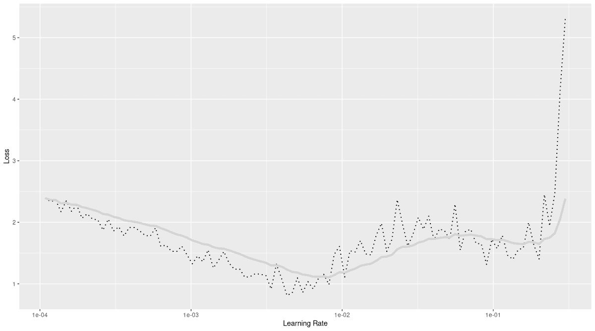

# 17  加快训练速度

> 原文：[`skeydan.github.io/Deep-Learning-and-Scientific-Computing-with-R-torch/training_efficiency.html`](https://skeydan.github.io/Deep-Learning-and-Scientific-Computing-with-R-torch/training_efficiency.html)

你可以说，本章和前一章讨论的主题就像不可协商的和可取的。泛化，即抽象单个实例的能力，是一个好模型不可或缺的；然而，我们需要在合理的时间内达到这样的模型（这里的合理在不同的上下文中意味着不同的事情）。

这次，在介绍技术时，我将采取不同的策略，不是按照工作流程的阶段来排序，而是按照增加的普遍性来排序。我们将探讨三个非常不同、非常成功（每种方式都有其独特之处）的想法：

1.  批量归一化。*批归一化*——为了引入一个流行的缩写——向模型中添加层以稳定训练，从而加快训练速度。

1.  在训练开始时确定一个合适的学习率，并在训练过程中动态调整它。你可能还记得我们关于优化的实验，学习率对训练速度和稳定性有着巨大的影响。

1.  迁移学习。应用于神经网络，这个术语通常指的是使用预训练模型进行特征检测，并在下游任务中使用这些特征。

## 17.1 批量归一化

批量归一化的想法（Ioffe 和 Szegedy (2015）直接源于反向传播的基本机制。

在反向传播中，每一层的权重都是从最后一层到第一层进行适应的。现在，让我们专注于第 17 层。当进行下一次前向传递时，它将根据之前的批次更新其权重。然而——它前面的那一层也会更新其权重。同样，它前面的那一层，再前面的那一层……你明白这个道理。因此，由于所有之前的层现在以不同的方式处理它们的输入，第 17 层将不会得到它预期的结果。因此，之前看似最优的策略可能不再适用。

虽然这个问题本身是算法固有的，但随着模型的深入，它更有可能显现出来。由于由此产生的不稳定性，你需要用较低的学习率进行训练。反过来，这意味着训练将需要更多的时间。

Ioffe 和 Szegedy 提出的解决方案如下。在每次遍历中，对于每一层，都规范化激活。然而，如果只有这些，就会发生某种平衡。这是因为每一层现在都必须调整其激活，使它们的均值为零，标准差为之一。实际上，这样的要求不仅会在层之间起到均衡器的作用，而且也会在层内起到作用：这意味着它会使每一层创建尖锐内部区分变得更加困难。

因此，均值和标准差不仅仅是计算出来的，而是*学习得到的*。换句话说，它们变成了*模型参数*。

到目前为止，我们一直在概念上讨论这个概念，暗示了一个实现，其中每个层都负责这个任务。然而，这并不是它的实现方式。相反，我们有专门的层，*批量归一化层*，它们会归一化和重新缩放它们的输入。它们是具有可学习参数的均值和标准差。

在我们的 MNIST 示例中，为了使用批量归一化，我们在网络中穿插批量归一化层，每个卷积块之后都有一个。它们有三种类型，分别对应一维、二维和三维输入（例如时间序列、图像和视频）。所有这些都会对每个通道单独计算统计数据，输入通道的数量是它们构造函数的唯一必需参数。

```r
library(torch)
library(torchvision)
library(luz)

convnet <- nn_module(
 "convnet",
 initialize = function() {
 # nn_conv2d(in_channels, out_channels, kernel_size, stride)
 self$conv1 <- nn_conv2d(1, 32, 3, 1)
 self$conv2 <- nn_conv2d(32, 64, 3, 2)
 self$conv3 <- nn_conv2d(64, 128, 3, 1)
 self$conv4 <- nn_conv2d(128, 256, 3, 2)
 self$conv5 <- nn_conv2d(256, 10, 3, 2)

 self$bn1 <- nn_batch_norm2d(32)
 self$bn2 <- nn_batch_norm2d(64)
 self$bn3 <- nn_batch_norm2d(128)
 self$bn4 <- nn_batch_norm2d(256)
 },
 forward = function(x) {
 x %>%
 self$conv1() %>%
 nn_relu() %>%
 self$bn1() %>%
 self$conv2() %>%
 nn_relu() %>%
 self$bn2() %>%
 self$conv3() %>%
 nn_relu() %>%
 self$bn3() %>%
 self$conv4() %>%
 nn_relu() %>%
 self$bn4() %>%
 self$conv5() %>%
 torch_squeeze()
 }
)
```

*不过，你可能想知道的是：测试期间会发生什么？如果我们将同样的逻辑应用到那里，整个测试的概念就会变得荒谬。相反，在评估时，我们使用在训练集上确定的均值和标准差。因此，批量归一化与 dropout 一样，它们在不同阶段的行为不同。

批量归一化可以非常成功，尤其是在图像处理中。这是一个你应该始终考虑的技术。更重要的是，它经常被发现有助于泛化，以及*第 17.2 节 动态学习率*。

你可能不会对学习率是训练性能的核心感到惊讶。在反向传播中，层权重会根据当前损失的方向进行修改；学习率影响更新的大小。

通过非常小的更新，网络可能会朝着正确的方向移动，最终到达损失函数的令人满意的局部最小值。但这个过程会很漫长。另一方面，更新越大，就越有可能“跳过”那个最小值。想象一下沿着抛物线的一侧移动。也许更新太大，我们不仅会落在另一侧（损失等效），甚至可能在一个“更高”的位置（损失）。接下来的更新将再次将我们送回另一侧，到一个更高的位置。不久，损失就会变成无限大——在 R 中令人恐惧的`NaN`。

目标很容易陈述：我们希望以最高可行的学习率进行训练，同时避免“过度”训练。这有两个方面。

首先，我们应该知道什么构成了过高的比率。为此，我们使用一种叫做*学习率查找器*的工具。这种技术得益于[fast.ai](https://docs.fast.ai)库的流行，以及其创造者所教授的深度学习课程。学习率查找器在正式训练之前被调用一次。

第二，我们希望以某种方式组织训练，以便在每次训练时使用最佳学习率。关于“最佳”学习率是什么，观点各不相同，它取决于阶段。`torch` 提供了一套所谓的 *学习率调度器*，实现了各种广泛采用的技术。调度器不仅策略不同，而且调整学习率的频率也不同。

### 17.2.1 学习率查找器

学习率查找器的想法如下。你用一个非常低的率开始训练网络，然后在一个周期内，通过循环批次，不断增大学习率，直到达到一个非常高的值。在循环过程中，你同时跟踪学习率和相应的损失。实验结束后，你将学习率和损失绘制成图表。然后，你选择一个比损失最小值低，但不是非常低的学习率。通常建议选择比最小值小一个数量级的值。例如，如果最小值出现在 `0.01`，你将选择 `0.001`。

很好，我们不需要自己编写代码：`luz::lr_finder()` 会为我们运行实验。我们只需要检查生成的图表——然后做出决定！

为了演示，让我们首先从上一章复制一些先决条件。我们使用 MNIST，并使用数据增强。在模型方面，我们基于 CNN 的默认版本进行构建，并添加了批量归一化。`lr_finder()` 预期模型已经被 `setup()` 配置了损失函数和优化器：

```r
library(torch)
library(torchvision)
library(luz)

dir <- "~/.torch-datasets" 

train_ds <- mnist_dataset(
 dir,
 download = TRUE,
 transform = . %>%
 transform_to_tensor() %>%
 transform_random_affine(
 degrees = c(-45, 45), translate = c(0.1, 0.1)
 )
)

train_dl <- dataloader(train_ds, batch_size = 128, shuffle = TRUE)

valid_ds <- mnist_dataset(
 dir,
 train = FALSE,
 transform = transform_to_tensor
)

valid_dl <- dataloader(valid_ds, batch_size = 128)

convnet <- nn_module(
 "convnet",
 initialize = function() {
 # nn_conv2d(in_channels, out_channels, kernel_size, stride)
 self$conv1 <- nn_conv2d(1, 32, 3, 1)
 self$conv2 <- nn_conv2d(32, 64, 3, 2)
 self$conv3 <- nn_conv2d(64, 128, 3, 1)
 self$conv4 <- nn_conv2d(128, 256, 3, 2)
 self$conv5 <- nn_conv2d(256, 10, 3, 2)

 self$bn1 <- nn_batch_norm2d(32)
 self$bn2 <- nn_batch_norm2d(64)
 self$bn3 <- nn_batch_norm2d(128)
 self$bn4 <- nn_batch_norm2d(256)
 },
 forward = function(x) {
 x %>%
 self$conv1() %>%
 nnf_relu() %>%
 self$bn1() %>%
 self$conv2() %>%
 nnf_relu() %>%
 self$bn2() %>%
 self$conv3() %>%
 nnf_relu() %>%
 self$bn3() %>%
 self$conv4() %>%
 nnf_relu() %>%
 self$bn4() %>%
 self$conv5() %>%
 torch_squeeze()
 }
)

model <- convnet %>%
 setup(
 loss = nn_cross_entropy_loss(),
 optimizer = optim_adam,
 metrics = list(luz_metric_accuracy())
 )
```

*当使用默认参数调用时，`lr_finder()` 将从学习率 `1e-7` 开始，经过一百步增加，直到达到 `0.1`。所有这些值——最小学习率、步数和最大学习率——都可以修改。对于 MNIST，我知道较高的学习率应该是可行的；所以我将这个范围稍微向右移动了一些：

```r
rates_and_losses <- model %>%
 lr_finder(train_dl, start_lr = 0.0001, end_lr = 0.3)
```

*将记录的损失与它们的率绘制成图表，我们得到确切值（每个步骤一个），以及一个指数平滑版本（图 17.1）。

```r
rates_and_losses %>% plot()
```

*

图 17.1：在 MNIST 上运行 `luz` 的学习率查找器的输出。

在这里，我们看到当学习率超过大约 0.01 的值时，损失变得嘈杂并增加。然而，最终的爆炸似乎只有在学习率超过 0.1 时才会触发。因此，你可能会决定不完全遵循“一个数量级”的建议，并尝试一个学习率为 0.01 的值——至少在你接下来要做的，即使用这个确定的学习率作为最大值，而不是固定的时间值时，是这样的。
  
### 17.2.2 学习率调度器

一旦我们确定了学习率的上限，我们就可以利用`torch`的学习率调度器来在训练过程中调整学习率。我们将选择一个调度器对象，并将其传递给一个专门的`luz`回调函数：`callback_lr_scheduler()`。

传统上，一个流行且直观的方案是以下这种。在训练的早期阶段，尝试一个合理高的学习率，以便快速取得进展；然而，一旦这样做了，就要减速，确保不要在（并远离）一个可能找到的局部最小值周围震荡。

同时，更复杂的方案已经被开发出来。

一系列的想法不断出现，它们会周期性地调整学习率。这个家族的成员，例如，被称为“周期性学习率”（Smith (2015))，或者（某种形式的）“带重启的退火”（例如，Loshchilov 和 Hutter (2016))。这个家族的成员之间的区别在于结果学习率曲线的形状和重启的频率（即你多久再次提高速率，以开始新的下降周期）。在`torch`中，这个家族的流行代表例如`lr_cyclic()`和`lr_cosine_annealing_warm_restarts()`。

另一种非常不同的方法是*单周期*学习率策略（Smith 和 Topin (2017))。在这个方案中，我们从某个初始的（相对较低）学习率开始，将其增加到用户指定的最大值，然后再次降低，直到我们达到一个比开始时显著更低的学习率。在`torch`中，这可以通过`lr_one_cycle()`实现，这正是我上面提到的策略。

`lr_one_cycle()`允许用户从多个方面进行调整，在现实生活中的项目中，你可能想要对其众多参数进行一些尝试。在这里，我们使用默认值。然后，我们只需要传递我们确定的最高速率，并决定我们希望学习率多久更新一次。逻辑上似乎是一次每批更新，如果我们传递了 epoch 数和每个 epoch 的步数，这就会发生。

在下面的代码片段中，请注意，参数`max_lr`、`epochs`和`steps_per_epoch`实际上“属于”`lr_one_cycle()`。尽管如此，我们仍然需要将它们传递给回调函数，因为回调函数将实例化调度器。

然而，`call_on`实际上构成了回调逻辑的一部分。这是一个看似无害的参数，但我们仍然需要关注它。调度器在周期是按 epoch 定义还是按 batch 定义上有所不同。`lr_one_cycle()`每批“醒来”一次；但还有其他一些，例如`lr_step()`，它们只在每个 epoch 检查一次是否需要更新。`call_on`的默认值是`on_epoch_end`；因此，对于`lr_one_cycle()`，我们必须覆盖默认值。

```r
num_epochs <- 5 

# the model has already been setup(), we continue from there
fitted <- model %>%
 fit(train_dl,
 epochs = num_epochs,
 valid_data = valid_dl,
 callbacks = list(
 luz_callback_lr_scheduler(
 lr_one_cycle,
 max_lr = 0.01,
 epochs = num_epochs,
 steps_per_epoch = length(train_dl),
 call_on = "on_batch_end"
 )
 )
 )
```

*在这个阶段，我们结束了关于学习率优化的主题。正如深度学习中的许多事情一样，研究进展速度很快，很可能会继续添加新的调度策略。但现在，我们要彻底改变范围。


迁移，作为一个一般概念，是指当我们学会做某件事，并从这些技能中受益于学习其他事情时发生的情况。例如，我们可能已经学会了如何用我们的左腿做一些动作；那么，学会用右腿做同样的动作就会容易得多。或者，我们可能已经学习了拉丁语，然后发现这极大地帮助我们学习了法语。当然，这些都是简单的例子；不同领域和技能之间的类比可能要微妙得多。

相比之下，深度学习中“迁移学习”的典型用法在最初看起来相当狭窄。具体来说，它指的是利用已经在大数据集上长时间训练的巨大、高度有效的模型（通常作为某些库的一部分提供），然后将其用于新的任务。通常，你会加载该模型，移除其输出层，并添加一个较小的序列模块，该模块将模型的最后一层转换为所需的输出类型。在示例任务中，这通常是从广泛到狭窄的转变——就像下面的例子，我们使用在一个千类别图像上训练的模型来区分十种数字类型。

但情况不必如此。在深度学习中，在一个任务上训练的模型也可以用于具有*不同*但并非必然更*领域限制*的任务。截至今天，这种类型的流行例子主要在自然语言处理（NLP）中找到，而这一主题我们在这本书中并未涉及。在那里，你发现的是训练来预测句子如何继续的模型——从而产生关于语言的“一般”知识——用于逻辑上依赖的任务，如翻译、问答或文本摘要。在这种广义上，迁移学习是我们将在不久的将来越来越多地看到的东西。

转移学习的流行还有一个非常重要的方面。当你基于预训练模型构建时，你会吸收它所学习的一切——包括其偏见和先入之见。这在你的环境中有多重要，将取决于你具体在做什么。对我们来说，我们正在对数字进行分类，预训练模型在猫和狗上的表现是否远优于在电动滑板车、智能冰箱或垃圾桶上，这并不重要。但每当模型涉及*人*时，请考虑这一点。通常，这些高性能模型要么是在基准数据集上训练的，要么是从网络上大量抓取的数据。前者在历史上很少关注有关刻板印象和代表性的问题。（希望未来会有所改变。）后者由于定义上的原因，容易受到可用性偏差的影响，以及数据集创建者的独特决策。（希望这些情况和决策已经得到了仔细的记录。这是你需要检查的事情。）

在我们的运行示例中，我们将属于前者：我们将成为基准数据集的下游用户。所讨论的基准数据集是[ImageNet](https://image-net.org/index.php)，这是我们之前在 Tiny Imagenet 的第一次体验中遇到的著名图像集合，那是在两章之前。

在`torchvision`中，我们可以找到许多在 ImageNet 上训练好的可使用模型。其中之一是 ResNet-18（He 等人，2015）。ResNet 中的“Res”代表“残差”，或“残差连接”。在这里，“残差”正如在统计学中常见的那样，用来指代误差项。其想法是让某些层预测，不是全新的东西，而是目标与前一层的预测之间的差异——即误差。如果这听起来很困惑，请不要担心。对我们来说，重要的是由于它们的架构，ResNets 可以承受非常深的网络，而不会变得过于难以训练。这反过来又意味着它们非常高效，并且经常被用作预训练的特征检测器。

第一次使用预训练模型时，其权重会被下载并缓存到操作系统特定的位置。

```r
resnet <- model_resnet18(pretrained = TRUE)
resnet
```

```r
An `nn_module` containing 11,689,512 parameters.

── Modules ───────────────────────────────────────
• conv1: <nn_conv2d> #9,408 parameters
• bn1: <nn_batch_norm2d> #128 parameters
• relu: <nn_relu> #0 parameters
• maxpool: <nn_max_pool2d> #0 parameters
• layer1: <nn_sequential> #147,968 parameters
• layer2: <nn_sequential> #525,568 parameters
• layer3: <nn_sequential> #2,099,712 parameters
• layer4: <nn_sequential> #8,393,728 parameters
• avgpool: <nn_adaptive_avg_pool2d> #0 parameters
• fc: <nn_linear> #513,000 parameters
```

看一下最后一个模块，一个线性层：

```r
resnet$fc
```

*从权重中我们可以看到，这个层将具有 512 个特征的张量映射到具有 1000 个特征的张量——这是 ImageNet 挑战中使用的 1000 种不同的图像类别。为了使这个模型适应我们的目的，我们只需将最后一层替换为一个输出长度为十的特征向量：

```r
resnet$fc <- nn_linear(resnet$fc$in_features, 10)
resnet$fc
```

```r
An `nn_module` containing 5,130 parameters.

── Parameters ───────────────────────────────────────────────────────────────────────────────────────────────
• weight: Float [1:10, 1:512]
• bias: Float [1:10]
```

如果我们现在在 MNIST 上训练修改后的模型会发生什么？由于需要在大网络上传播梯度，训练将像禅宗乌龟一样缓慢。这不仅浪费时间；而且毫无用处。如果我们非常有耐心，甚至可能是有害的：我们可能会破坏预训练模型学习到的复杂特征层次结构。当然，在分类数字时，我们将仅使用学习到的更高阶特征的一个非常小的子集，但这不是问题。无论如何，凭借我们这些凡人可用的资源，我们不太可能改进 ResNet 的数字识别能力。

因此，我们做的是将所有层权重设置为不可训练，除了我们替换的最后一层。

将所有这些放在一起，我们得到了以下简洁的模型定义：

```r
convnet <- nn_module(
 initialize = function() {
 self$model <- model_resnet18(pretrained = TRUE)
 for (par in self$parameters) {
 par$requires_grad_(FALSE)
 }
 self$model$fc <- nn_linear(self$model$fc$in_features, 10)
 },
 forward = function(x) {
 self$model(x)
 }
)
```

*我们现在可以用`luz`来训练，就像之前一样。只需要再进行一个额外的步骤，这仅仅是因为我在使用 MNIST 来举例。由于 ResNet 是在 RGB 图像上训练的，它的第一层期望有三个通道，而不是一个。我们可以通过使用`torch_expand()`将单个灰度通道复用到三个相同的通道上，来解决这个问题。对于重要的实际任务，这可能不是一个最优的解决方案；但对于 MNIST 来说，这已经足够好了。

扩展的一个方便位置是在数据预处理管道中，这里以修改后的形式重复。

```r
train_ds <- mnist_dataset(
 dir,
 download = TRUE,
 transform = . %>%
 transform_to_tensor() %>%
 (function(x) x$expand(c(3, 28, 28))) %>%
 transform_random_affine(
 degrees = c(-45, 45), translate = c(0.1, 0.1)
 )
)

train_dl <- dataloader(
 train_ds,
 batch_size = 128,
 shuffle = TRUE
)

valid_ds <- mnist_dataset(
 dir,
 train = FALSE,
 transform = . %>%
 transform_to_tensor %>%
 (function(x) x$expand(c(3, 28, 28)))
)

valid_dl <- dataloader(valid_ds, batch_size = 128)
```

*训练的代码看起来和往常一样。

```r
model <- convnet %>%
 setup(
 loss = nn_cross_entropy_loss(),
 optimizer = optim_adam,
 metrics = list(luz_metric_accuracy())
 ) %>%
 fit(train_dl,
 epochs = 5,
 valid_data = valid_dl)
```

*在我们结束这两个部分和章节之前，还有一个额外的评论。我们上面采取的方法——用单个模块输出最终分数来替换最后一层——只是最简单、最直接的事情。

对于 MNIST 来说，这已经足够了。也许，在检查时，我们会发现单个数字已经构成了 ResNet 的特征层次结构的一部分；即使不是，一个具有约 5000 个参数的线性层也应该足以学习它们。然而，还有更多“需要学习”的内容——相当于数据集或任务与模型预训练中使用的（完成，分别）有所不同——我们就需要更强大的子模块来串联。我们将在下一章中看到这个例子。

He, Kaiming, Xiangyu Zhang, Shaoqing Ren, and Jian Sun. 2015\. “深度残差学习在图像识别中的应用.” *CoRR* abs/1512.03385\. [`arxiv.org/abs/1512.03385`](http://arxiv.org/abs/1512.03385).Ioffe, Sergey, and Christian Szegedy. 2015\. “批量归一化：通过减少内部协变量偏移来加速深度网络训练.” [`arxiv.org/abs/1502.03167`](https://arxiv.org/abs/1502.03167).Loshchilov, Ilya, and Frank Hutter. 2016\. “SGDR: 带有重启的随机梯度下降.” *CoRR* abs/1608.03983\. [`arxiv.org/abs/1608.03983`](http://arxiv.org/abs/1608.03983).Smith, Leslie N. 2015\. “不再需要繁琐的学习率猜测游戏.” *CoRR* abs/1506.01186\. [`arxiv.org/abs/1506.01186`](http://arxiv.org/abs/1506.01186).Smith, Leslie N., and Nicholay Topin. 2017\. “超级收敛：使用大学习率快速训练残差网络.” *CoRR* abs/1708.07120\. [`arxiv.org/abs/1708.07120`](http://arxiv.org/abs/1708.07120).

