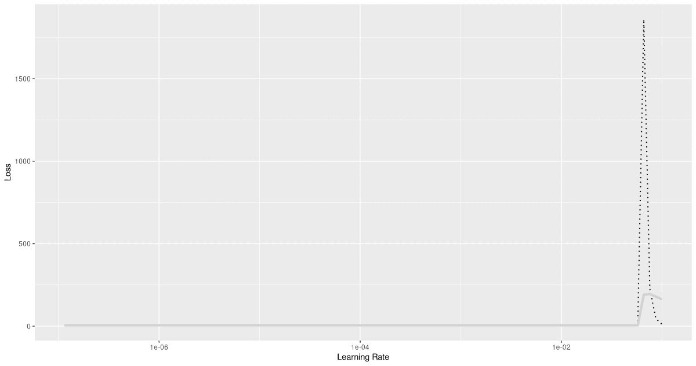
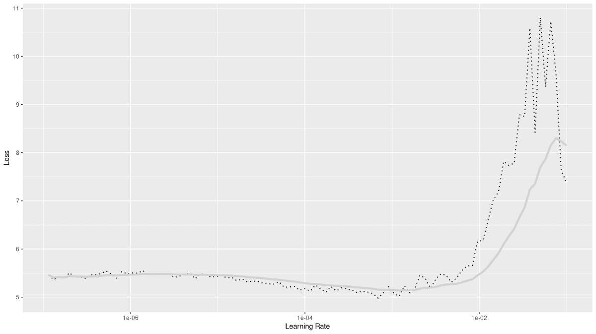
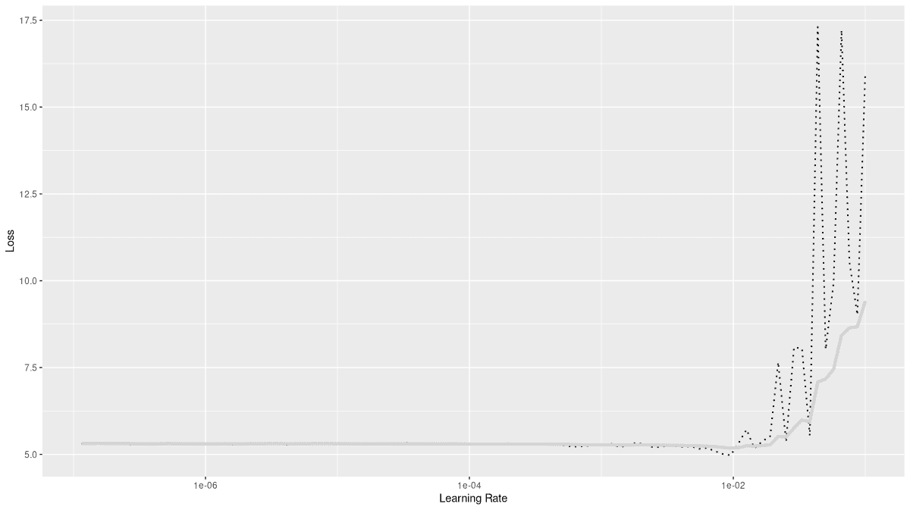

# 18  图像分类，再来一次：提高性能

> 原文：[`skeydan.github.io/Deep-Learning-and-Scientific-Computing-with-R-torch/image_classification_2.html`](https://skeydan.github.io/Deep-Learning-and-Scientific-Computing-with-R-torch/image_classification_2.html)

在最后两章中，我们看到了如何通过改变数据输入、网络架构和训练模式来提高结果，“提高”有两个主要含义：更好地泛化到测试集，以及更快的训练进度。

现在，我们将应用一些这些技术到我们开始真实世界深度学习之旅时的图像分类任务：Tiny Imagenet。为了对抗过拟合，我们将引入数据增强、dropout 层和早期停止。为了加快训练速度，我们使用学习率查找器，添加批归一化层，并集成预训练网络。我们不会逐个添加和删除这些技术，也就是说，我们不会单独评估它们的效果。虽然你可能想自己这样做，但在这里我们想避免给人留下某种固定排名——这是最好的，那是第二……——*独立于数据集和任务*。

Instead, what we do is:

+   总是使用数据增强。几乎在所有情况下，你都会想使用它——除非，当然，你已经使用了不同的数据增强技术。

+   总是启用早期停止运行。这不仅会防止过拟合，还会节省时间。

+   总是使用学习率查找器，结合一周期学习率计划。

+   对于我们的第一个设置，我们使用了三章前的卷积网络，并添加了 dropout 层。

+   在第二个场景中，我们将 dropout 替换为批量归一化。（其他一切保持不变。）

+   第三，我们完全替换了模型，通过一个预训练的特征分类器（ResNet）和一个小型顺序模型链。

## 18.1 数据输入（适用于所有）

所有三次运行都使用相同的数据输入管道。与我们在 Tiny Imagenet 中区分两百个类别的第一次尝试相比，有两点新内容。

首先，我们现在对训练集应用数据增强：旋转和平移，更确切地说。

其次，输入张量按通道归一化到一组给定的均值和标准差。这实际上仅对第三次运行（使用 ResNet）是必需的；我们只是对我们图像做了在训练 ResNet 时所做的操作。（对于在 ImageNet 上训练的大多数预训练模型也是如此。）尽管如此，对第一次和第二次运行做同样的事情实际上并没有问题；因此，归一化是预处理管道的一部分。

```r
library(torch)
library(torchvision)
library(torchdatasets)
library(luz)

set.seed(777)
torch_manual_seed(777)

dir <- "~/.torch-datasets"

train_ds <- tiny_imagenet_dataset(
 dir,
 download = TRUE,
 transform = . %>%
 transform_to_tensor() %>%
 transform_random_affine(
 degrees = c(-30, 30), translate = c(0.2, 0.2)
 ) %>%
 transform_normalize(
 mean = c(0.485, 0.456, 0.406),
 std = c(0.229, 0.224, 0.225)
 )
)

valid_ds <- tiny_imagenet_dataset(
 dir,
 split = "val",
 transform = function(x) {
 x %>%
 transform_to_tensor() %>%
 transform_normalize(
 mean = c(0.485, 0.456, 0.406),
 std = c(0.229, 0.224, 0.225))
 }
)

train_dl <- dataloader(
 train_ds,
 batch_size = 128,
 shuffle = TRUE
)
valid_dl <- dataloader(valid_ds, batch_size = 128)
```

*接下来，我们比较三种不同的配置。*  *## 18.2 运行 1：Dropout

在第一次运行中，我们使用了之前使用的卷积网络，并添加了 dropout 层。

```r
convnet <- nn_module(
 "convnet",
 initialize = function() {
 self$features <- nn_sequential(
 nn_conv2d(3, 64, kernel_size = 3, padding = 1),
 nn_relu(),
 nn_max_pool2d(kernel_size = 2),
 nn_dropout2d(p = 0.05),
 nn_conv2d(64, 128, kernel_size = 3, padding = 1),
 nn_relu(),
 nn_max_pool2d(kernel_size = 2),
 nn_dropout2d(p = 0.05),
 nn_conv2d(128, 256, kernel_size = 3, padding = 1),
 nn_relu(),
 nn_max_pool2d(kernel_size = 2),
 nn_dropout2d(p = 0.05),
 nn_conv2d(256, 512, kernel_size = 3, padding = 1),
 nn_relu(),
 nn_max_pool2d(kernel_size = 2),
 nn_dropout2d(p = 0.05),
 nn_conv2d(512, 1024, kernel_size = 3, padding = 1), 
 nn_relu(),
 nn_adaptive_avg_pool2d(c(1, 1)),
 nn_dropout2d(p = 0.05),
 )
 self$classifier <- nn_sequential(
 nn_linear(1024, 1024),
 nn_relu(),
 nn_dropout(p = 0.05),
 nn_linear(1024, 1024),
 nn_relu(),
 nn_dropout(p = 0.05),
 nn_linear(1024, 200)
 )
 },
 forward = function(x) {
 x <- self$features(x)$squeeze()
 x <- self$classifier(x)
 x
 }
)
```

*接下来，我们运行学习率查找器(图 18.1)。

```r
model <- convnet %>%
 setup(
 loss = nn_cross_entropy_loss(),
 optimizer = optim_adam,
 metrics = list(
 luz_metric_accuracy()
 )
 ) 

rates_and_losses <- model %>% lr_finder(train_dl)
rates_and_losses %>% plot()
```

*

图 18.1：学习率查找器，在 Tiny Imagenet 上运行。具有 dropout 层的卷积网络。

我们已经知道，区分两百个类别是一项耗时的工作；因此，在学习率增加的大部分时间里看到平坦的损失曲线并不奇怪。然而，我们可以得出结论，我们最好不要超过 0.01 的学习率。

在所有后续配置中，我们现在使用一周期学习率调度器进行训练，并启用早期停止。

```r
fitted <- model %>%
 fit(train_dl, epochs = 50, valid_data = valid_dl,
 callbacks = list(
 luz_callback_early_stopping(patience = 2),
 luz_callback_lr_scheduler(
 lr_one_cycle,
 max_lr = 0.01,
 epochs = 50,
 steps_per_epoch = length(train_dl),
 call_on = "on_batch_end"),
 luz_callback_model_checkpoint(path = "cpt_dropout/"),
 luz_callback_csv_logger("logs_dropout.csv")
 ),
 verbose = TRUE)
```

*对我来说，训练在 35 个 epoch 后停止，验证准确率为 0.4，训练准确率略高：0.44。

```r
Epoch 1/50
Train metrics: Loss: 5.116 - Acc: 0.0128                                      
Valid metrics: Loss: 4.9144 - Acc: 0.0217
Epoch 2/50
Train metrics: Loss: 4.7217 - Acc: 0.042                                      
Valid metrics: Loss: 4.4143 - Acc: 0.067
Epoch 3/50
Train metrics: Loss: 4.3681 - Acc: 0.0791                                     
Valid metrics: Loss: 4.1145 - Acc: 0.105
...
...
Epoch 33/50
Train metrics: Loss: 2.3006 - Acc: 0.4304                                     
Valid metrics: Loss: 2.5863 - Acc: 0.4025
Epoch 34/50
Train metrics: Loss: 2.2717 - Acc: 0.4365                                     
Valid metrics: Loss: 2.6377 - Acc: 0.3889
Epoch 35/50
Train metrics: Loss: 2.2456 - Acc: 0.4402                                     
Valid metrics: Loss: 2.6208 - Acc: 0.4043
Early stopping at epoch 35 of 50
```

与最初的 50 个 epoch 后验证准确率为 0.22，训练准确率为 0.92 的方法相比，我们看到过拟合的显著减少。当然，我们在这里不能真正说出 dropout 和数据增强的相对优点。如果你好奇，请继续查找！
  
## 18.3 运行 2：批归一化

在配置编号二，dropout 被批归一化所取代。

```r
convnet <- nn_module(
 "convnet",
 initialize = function() {
 self$features <- nn_sequential(
 nn_conv2d(3, 64, kernel_size = 3, padding = 1),
 nn_batch_norm2d(64),
 nn_relu(),
 nn_max_pool2d(kernel_size = 2),
 nn_conv2d(64, 128, kernel_size = 3, padding = 1),
 nn_batch_norm2d(128),
 nn_relu(),
 nn_max_pool2d(kernel_size = 2),
 nn_conv2d(128, 256, kernel_size = 3, padding = 1),
 nn_batch_norm2d(256),
 nn_relu(),
 nn_max_pool2d(kernel_size = 2),
 nn_conv2d(256, 512, kernel_size = 3, padding = 1),
 nn_batch_norm2d(512),
 nn_relu(),
 nn_max_pool2d(kernel_size = 2),
 nn_conv2d(512, 1024, kernel_size = 3, padding = 1), 
 nn_batch_norm2d(1024),
 nn_relu(),
 nn_adaptive_avg_pool2d(c(1, 1)),
 )
 self$classifier <- nn_sequential(
 nn_linear(1024, 1024),
 nn_relu(),
 nn_batch_norm1d(1024),
 nn_linear(1024, 1024),
 nn_relu(),
 nn_batch_norm1d(1024),
 nn_linear(1024, 200)
 )
 },
 forward = function(x) {
 x <- self$features(x)$squeeze()
 x <- self$classifier(x)
 x
 }
)
```

再次，我们运行了学习率查找器(fig. 18.2)：

```r
model <- convnet %>%
 setup(
 loss = nn_cross_entropy_loss(),
 optimizer = optim_adam,
 metrics = list(
 luz_metric_accuracy()
 )
 ) 

rates_and_losses <- model %>% lr_finder(train_dl)
rates_and_losses %>% plot()
```

*

图 18.2：学习率查找器，在 Tiny Imagenet 上运行。具有批归一化层的卷积网络。

这看起来非常不同！当然，这部分是由于损失轴上的比例；损失没有爆炸得那么厉害，因此我们在早期和中期得到了更好的分辨率。损失没有爆炸本身就是一个有趣的发现；从这个图中我们可以得出的结论是要对学习率更加小心。这次，我们将最大值选择为 0.001。

```r
fitted <- model %>%
 fit(train_dl, epochs = 50, valid_data = valid_dl,
 callbacks = list(
 luz_callback_early_stopping(patience = 2),
 luz_callback_lr_scheduler(
 lr_one_cycle,
 max_lr = 0.001,
 epochs = 50,
 steps_per_epoch = length(train_dl),
 call_on = "on_batch_end"),
 luz_callback_model_checkpoint(path = "cpt_batchnorm/"),
 luz_callback_csv_logger("logs_batchnorm.csv")
 ),
 verbose = TRUE)
```

*与第一种情况相比，我观察到使用批归一化时略微更多的过拟合。

```r
Epoch 1/50
Train metrics: Loss: 4.5434 - Acc: 0.0862                                     
Valid metrics: Loss: 4.0914 - Acc: 0.1332
Epoch 2/50
Train metrics: Loss: 3.9534 - Acc: 0.161                                      
Valid metrics: Loss: 3.7865 - Acc: 0.1809
Epoch 3/50
Train metrics: Loss: 3.6425 - Acc: 0.2054                                     
Valid metrics: Loss: 3.5965 - Acc: 0.2115
...
...
Epoch 19/50
Train metrics: Loss: 2.1063 - Acc: 0.4859                                     
Valid metrics: Loss: 2.621 - Acc: 0.3912
Epoch 20/50
Train metrics: Loss: 2.0514 - Acc: 0.4987                                     
Valid metrics: Loss: 2.6334 - Acc: 0.3914
Epoch 21/50
Train metrics: Loss: 1.9982 - Acc: 0.5069                                     
Valid metrics: Loss: 2.6603 - Acc: 0.3932
Early stopping at epoch 21 of 50
```
  
## 18.4 运行 3：迁移学习

最后，包括迁移学习的设置。使用预训练的 ResNet 进行特征提取，一个小型的顺序模型负责分类。在训练过程中，所有 ResNet 的权重都保持不变。

```r
convnet <- nn_module(
 initialize = function() {
 self$model <- model_resnet18(pretrained = TRUE)
 for (par in self$parameters) {
 par$requires_grad_(FALSE)
 }
 self$model$fc <- nn_sequential(
 nn_linear(self$model$fc$in_features, 1024),
 nn_relu(),
 nn_linear(1024, 1024),
 nn_relu(),
 nn_linear(1024, 200)
 )
 },
 forward = function(x) {
 self$model(x)
 }
)
```

*一如既往，我们运行了学习率查找器(fig. 18.3)。

```r
model <- convnet %>%
 setup(
 loss = nn_cross_entropy_loss(),
 optimizer = optim_adam,
 metrics = list(
 luz_metric_accuracy()
 )
 ) 

rates_and_losses <- model %>% lr_finder(train_dl)
rates_and_losses %>% plot()
```

*

图 18.3：学习率查找器，在 Tiny Imagenet 上运行。具有迁移学习的卷积网络(ResNet)。

0.01 的最大速率看起来可能处于边缘，但我决定试一试。

```r
fitted <- model %>%
 fit(train_dl, epochs = 50, valid_data = valid_dl,
 callbacks = list(
 luz_callback_early_stopping(patience = 2),
 luz_callback_lr_scheduler(
 lr_one_cycle,
 max_lr = 0.01,
 epochs = 50,
 steps_per_epoch = length(train_dl),
 call_on = "on_batch_end"),
 luz_callback_model_checkpoint(path = "cpt_resnet/"),
 luz_callback_csv_logger("logs_resnet.csv")
 ),
 verbose = TRUE)
```

*对我来说，这种配置在九个 epoch 后就已经提前停止，并且取得了迄今为止最好的结果：验证集上的最终准确率为 0.48。有趣的是，在这个设置中，准确率在训练集上最终比在验证集上还要差。

```r
Epoch 1/50
Train metrics: Loss: 3.4036 - Acc: 0.2322                                     
Valid metrics: Loss: 2.5491 - Acc: 0.3884
Epoch 2/50
Train metrics: Loss: 2.7911 - Acc: 0.3436                                     
Valid metrics: Loss: 2.417 - Acc: 0.4233
Epoch 3/50
Train metrics: Loss: 2.6423 - Acc: 0.3726                                     
Valid metrics: Loss: 2.3492 - Acc: 0.4431
...
...
Valid metrics: Loss: 2.1822 - Acc: 0.4868
Epoch 7/50
Train metrics: Loss: 2.4031 - Acc: 0.4198                                     
Valid metrics: Loss: 2.1413 - Acc: 0.4889
Epoch 8/50
Train metrics: Loss: 2.3759 - Acc: 0.4252                                     
Valid metrics: Loss: 2.149 - Acc: 0.4958
Epoch 9/50
Train metrics: Loss: 2.3447 - Acc: 0.433                                      
Valid metrics: Loss: 2.1888 - Acc: 0.484
Early stopping at epoch 9 of 50
```

在下一章中，我们继续探讨领域——图像——但改变任务：我们从分类转向分割。

