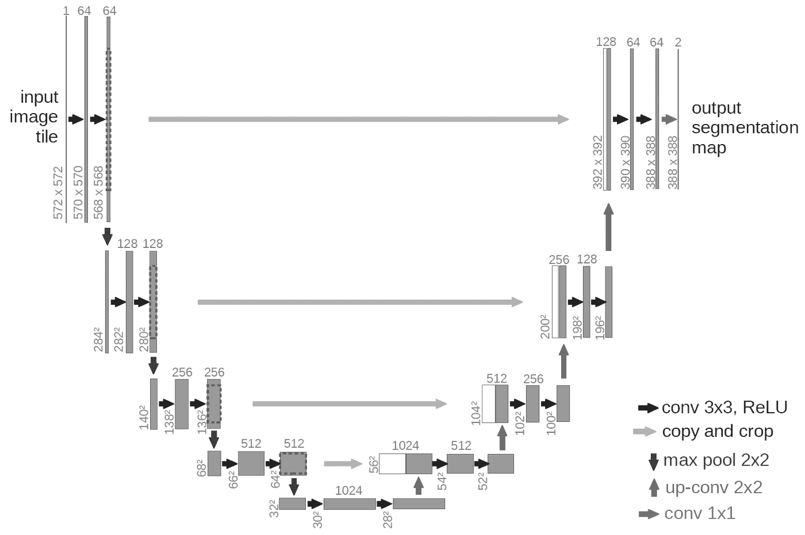
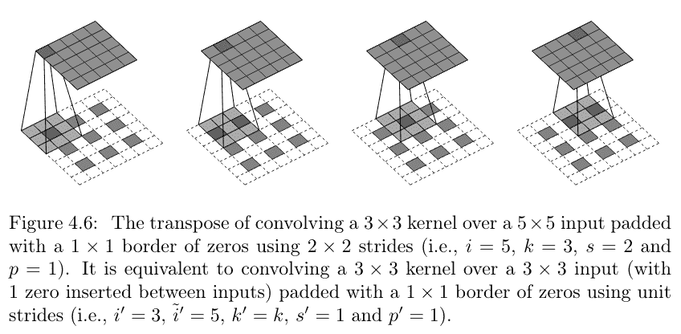
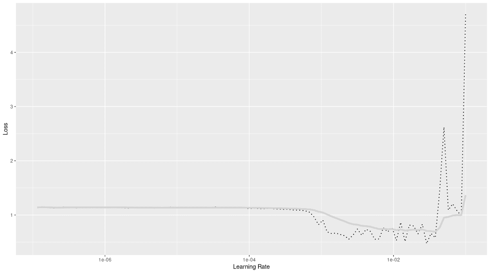
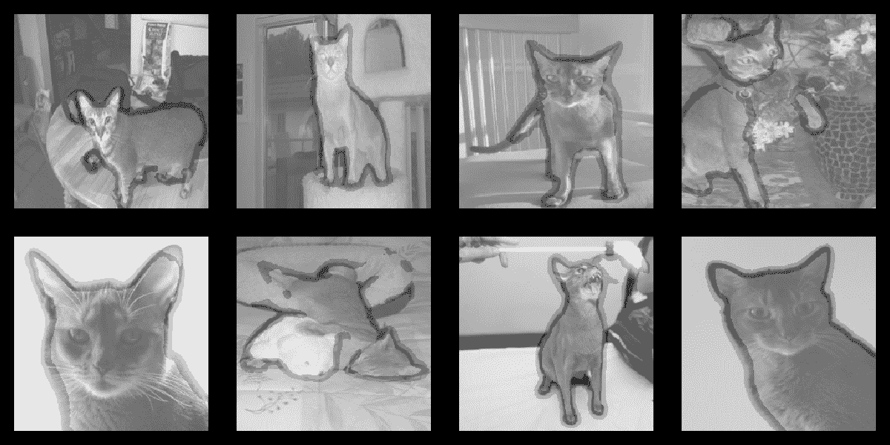

# 19 图像分割

> [`skeydan.github.io/Deep-Learning-and-Scientific-Computing-with-R-torch/image_segmentation.html`](https://skeydan.github.io/Deep-Learning-and-Scientific-Computing-with-R-torch/image_segmentation.html)

## 19.1 分割与分类的比较

分类和分割都是关于标记——但两者并不标记相同的东西。在分类中，是完整的图像被分类；在分割中，是单个像素。对于每个像素，我们问：这个像素是哪个对象，或是什么类型的对象的一部分？我们不再只是对说“这是一只猫”感兴趣；这次，我们需要知道那只猫的确切位置。

注意限定词：正好。这就是它与*目标检测*的区别所在，在目标检测中，找到的类实例被所谓的边界框所包围。这种由这些框（基本上是矩形）提供的定位提示类型对于许多任务来说是不够的，比如在医疗保健、生物学或地球科学中。例如，在分割细胞组织时，我们需要看到细胞类型簇的实际边界，而不是它们的直线版本。

本书不讨论目标检测；但我们已经积累了相当多的分类经验。那么，与分类相比，有什么变化？

记得在图像分类的初始章节中，我们讨论了平移不变性和平移等变性。如果一个算子是平移不变的，那么当它应用于位置 $x$ 和 $x=x+n$ 时，将返回相同的测量值。相反，如果它是平移等变的，它将返回适应新位置的测量值。在分类中，这种差异并不真正重要。但现在，在分割中，我们希望避免非平移等变的变换。我们不能再失去与位置相关的信息了。

技术上，这意味着不应使用任何抽象位置层的层类型。然而，我们刚刚看到典型的卷积架构在关于图像的学习方面是多么成功。我们当然希望尽可能多地重用该架构。

我们将避免使用池化层，因为那些会破坏位置信息。那么，我们如何构建特征层次结构呢？为了出现这种层次结构，似乎必须发生某种形式的**空间下采样**——无论我们如何实现它。而且，确实，这种表示层次结构是我们不能牺牲的：无论下游任务是什么，特征都是模型发展某种“理解”所必需的。但是：如果我们需要标记每个像素，网络必须输出与输入分辨率完全相同的图像！这些是相互冲突的目标——它们能结合在一起吗？

## 19.2 U-Net，图像分割中的“经典”

最初由 Ronneberger、Fischer 和 Brox 在 2015 年描述的通用 U-Net 架构，已被用于无数涉及图像分割的任务，作为众多复合模型的子模块，以及各种独立形式。要解释“U-Net”这个名字，没有比重现论文中的图（图 19.1）更好的方法了：



图 19.1：Ronneberger、Fischer 和 Brox 在 2015 年描述的 U-Net 架构，经主要作者许可重现。

U 的左侧“腿”显示了实现空间分辨率逐步降低的一系列步骤，同时滤波器数量增加。右侧的腿说明了相反的机制：当滤波器数量减少时，空间大小增加，直到我们达到输入的原始分辨率。（这是通过*上采样*实现的，我们将在下面讨论这一技术。）

因此，我们确实建立了一个特征层次结构，同时我们也能够对单个像素进行分类。但是，上采样过程应该导致空间信息的显著损失——我们真的期望得到合理的结果吗？

嗯，如果不是因为上述示意图中也显示的机制，即通过系统引导较低级别的特征图，可能不是这样。这是构成 U-Net 理念的关键：在“下”序列中，当创建高级特征图时，我们不会丢弃较低级别的特征图；相反，我们保留它们，以便最终反馈到“上”序列。在“上”序列中，一旦对小的分辨率输入进行了上采样，就会附加来自“下”过程的匹配尺寸的特征。这意味着每个“上”步骤都在处理一组特征图：在缩小尺寸时保留的，*以及*包含高级信息的那些。

基于 U-Net 的架构被广泛使用的事实，说明了这一想法的力量。

## 19.3 U-Net – `torch`实现

我们的`torch`实现遵循了 U-Net 的一般理念。正如本书中一贯的做法，核大小、滤波器数量以及超参数都应该被视为实验的对象。

实现是模块化的，强调我们可以区分两个阶段，一个编码阶段和一个解码阶段。与许多其他编码器-解码器架构不同，这些阶段是耦合的：由于解码器需要包含来自编码器的“消息”，即保留的特征图，它将需要了解它们的大小。

### 19.3.1 编码器

在最后一章中，我们看到了如何使用预训练的特征提取器来加速训练。现在我们需要在“向下”的过程中保持特征图，我们是否还可以应用这项技术？我们可以，我们很快就会看到如何做到这一点。首先，让我们谈谈我们将使用的预训练模型。

MobileNet v2（Sandler 等人，2018）具有针对移动使用优化的卷积架构。我们这里不会深入细节，但有一件事我们想确认：它是否失去了平移等变性；例如，通过使用局部池化？让我们探索一番，看看结果如何。

```r
library(torch)
library(torchvision)
library(luz)

model <- model_mobilenet_v2(pretrained = TRUE)
model
```

```r
An `nn_module` containing 3,504,872 parameters.

── Modules ──────────────────────────────────────────────────────────────────────────────────
• features: <nn_sequential> #2,223,872 parameters
• classifier: <nn_sequential> #1,281,000 parameters
```

我们立即看到`model_mobilenet_v2()`是一个包含两个模块的序列：一个名为`features`的容器（显然是特征检测器），另一个名为`classifier`（再次，有一个说明性的名字）。我们感兴趣的是前者。

```r
model$features
```

```r
An `nn_module` containing 2,223,872 parameters.

── Modules ──────────────────────────────────────────────────────────────────────────────────
• 0: <conv_bn_activation> #928 parameters
• 1: <inverted_residual> #896 parameters
• 2: <inverted_residual> #5,136 parameters
• 3: <inverted_residual> #8,832 parameters
• 4: <inverted_residual> #10,000 parameters
• 5: <inverted_residual> #14,848 parameters
• 6: <inverted_residual> #14,848 parameters
• 7: <inverted_residual> #21,056 parameters
• 8: <inverted_residual> #54,272 parameters
• 9: <inverted_residual> #54,272 parameters
• 10: <inverted_residual> #54,272 parameters
• 11: <inverted_residual> #66,624 parameters
• 12: <inverted_residual> #118,272 parameters
• 13: <inverted_residual> #118,272 parameters
• 14: <inverted_residual> #155,264 parameters
• 15: <inverted_residual> #320,000 parameters
• 16: <inverted_residual> #320,000 parameters
• 17: <inverted_residual> #473,920 parameters
• 18: <conv_bn_activation> #412,160 parameters
```

因此，MobileNet 主要由许多“残差反转”块组成。这些由什么组成？进一步的探索告诉我们：

```r
model$features[2]$`0`$conv
```

```r
An `nn_module` containing 896 parameters.

── Modules ──────────────────────────────────────────────────────────────────────────────────
• 0: <conv_bn_activation> #352 parameters
• 1: <nn_conv2d> #512 parameters
• 2: <nn_batch_norm2d> #32 parameters
```

如果我们想保持警惕，我们仍然需要检查这些模块中的第一个：

```r
model$features[2]$`0`$conv[1]$`0`
```

```r
An `nn_module` containing 352 parameters.

── Modules ─────────────────────────────────────────────────────────────────────────────────────────────
• 0: <nn_conv2d> #288 parameters
• 1: <nn_batch_norm2d> #64 parameters
• 2: <nn_relu6> #0 parameters
```

看起来真的没有应用池化。那么问题来了，如何获得并保留来自不同阶段的特征图？以下是编码器是如何做到的：

```r
encoder <- nn_module(
 initialize = function() {
 model <- model_mobilenet_v2(pretrained = TRUE)
 self$stages <- nn_module_list(list(
 nn_identity(),
 model$features[1:2],
 model$features[3:4],
 model$features[5:7],
 model$features[8:14],
 model$features[15:18]
 ))
 for (par in self$parameters) {
 par$requires_grad_(FALSE)
 }
 },
 forward = function(x) {
 features <- list()
 for (i in 1:length(self$stages)) {
 x <- self$stages[[i]](x)
 features[[length(features) + 1]] <- x
 }
 features
 }
)
```

*编码器将 MobileNet v2 的特征提取块分成几个阶段，并依次应用一个阶段。相应的结果保存在一个列表中。

我们可以构建一个示例，并检查获得的特征图的大小。对于分辨率为 224 x 224 像素的三通道输入，我们看到：

```r
sample <- torch_randn(1, 3, 224, 224)
sample_features <- encoder()(sample)
purrr::map(sample_features, purrr::compose(dim, as.array))
```

```r
[[1]]
[1]   1   3 224 224

[[2]]
[1]   1  16 112 112

[[3]]
[1]   1  24  56  56

[[4]]
[1]   1  32  28  28

[[5]]
[1]   1  96  14  14

[[6]]
[1]   1 320   7   7
```

接下来，我们看看解码器，它稍微复杂一些。
  
### 19.3.2 解码器

解码器由可配置的块组成。一个块接收两个输入张量：一个是应用前一个解码器块的结果，另一个是在匹配的编码阶段产生的特征图。在正向传播中，首先将前者上采样，并通过非线性函数。然后将中间结果添加到第二个参数，即通道化的特征图。在结果张量上应用卷积，然后应用另一个非线性函数。

```r
decoder_block <- nn_module(
 initialize = function(in_channels,
 skip_channels,
 out_channels) {
 self$upsample <- nn_conv_transpose2d(
 in_channels = in_channels,
 out_channels = out_channels,
 kernel_size = 2,
 stride = 2
 )
 self$activation <- nn_relu()
 self$conv <- nn_conv2d(
 in_channels = out_channels + skip_channels,
 out_channels = out_channels,
 kernel_size = 3,
 padding = "same"
 )
 },
 forward = function(x, skip) {
 x <- x %>%
 self$upsample() %>%
 self$activation()
 input <- torch_cat(list(x, skip), dim = 2)
 input %>%
 self$conv() %>%
 self$activation()
 }
)
```

*我们现在更详细地看看如何实现上采样。技术上，应用的是所谓的转置卷积——因此层的名字叫`nn_conv_transpose2d()`。（如果你对`transpose`感到好奇：字面上，核确实是执行下采样的相应核的转置。）然而，更直观的方式是这样的：首先在单个张量值之间插入零，然后应用步长大于`1`的卷积。参见图 19.2 以获取可视化。



图 19.2：转置卷积。版权所有杜莫林和维辛 (2016)，经[MIT 许可证](https://github.com/vdumoulin/conv_arithmetic/blob/master/LICENSE)重新发布。

尽管我们不会深入技术细节，但我们可以快速检查，实际上，卷积和转置卷积以相反的方式影响分辨率。

我们从一个 1 x 1 的“图像”开始，并应用一个`stride`为 2 的 3 x 3 滤波器。连同填充，这导致一个 3 x 3 大小的输出张量。

```r
img <- torch_randn(1, 1, 5, 5)

conv <- nn_conv2d(
 in_channels = 1,
 out_channels = 1,
 kernel_size = 3,
 stride = 2,
 padding = 1
)

convolved <- conv(img)
convolved
```

```r
torch_tensor
(1,1,.,.) = 
 -0.4996 -0.2898  0.4643
  0.6608  1.2109  0.8377
  0.3615  0.5400  0.1567
[ CPUFloatType{1,1,3,3} ][ grad_fn = <ConvolutionBackward0> ]
```

如果我们使用那个输出，并现在应用一个与上述卷积具有相同内核大小、步长和填充的转置卷积，我们将回到原始的 5 x 5 分辨率：

```r
transposed_conv <- nn_conv_transpose2d(
 in_channels = 1,
 out_channels = 1,
 kernel_size = 3,
 stride = 2,
 padding = 1
)

upsampled <- transposed_conv(convolved)
upsampled
```

```r
torch_tensor
(1,1,.,.) = 
  0.4076  0.0940  0.3424  0.1920  0.1078
  0.2416  0.6456  0.2473  0.6500  0.2643
  0.0467  0.5028 -0.1243  0.6425 -0.0083
  0.2682  0.5003  0.2812  0.4150  0.2720
  0.1398  0.3832  0.0843  0.4155  0.2035
[ CPUFloatType{1,1,5,5} ][ grad_fn = <ConvolutionBackward0> ]
```

在快速检查之后，回到解码器块。它的第一次应用会有什么结果？

在上面，我们看到在“U”的底部，我们将有一个 7 x 7 大小的张量，具有 320 个通道。这个张量将被上采样，并与来自先前“下”阶段的特征图连接。在那个阶段，有 96 个通道。这构成了实例化解码器块所需的信息的三分之二（`in_channels`和`skip_channels`）。缺失的三分之一，`out_channels`，实际上取决于我们。这里我们选择 256。

因此，我们可以实例化一个解码器块：

```r
first_decoder_block <- decoder_block(
 in_channels = 320,
 skip_channels = 96,
 out_channels = 256
)
```

*为了进行前向传递，该块需要传递两个张量：最大处理的特征及其直接的前驱。让我们检查我们的理解是否正确：

```r
first_decoder_block(
 sample_features[[6]],
 sample_features[[5]]
) %>%
 dim()
```

```r
[1]   1 256  14  14
```

让我顺便提一下，这种练习的目的不仅仅是解释某种具体的架构。它们还旨在说明如何使用`torch`，而不是依赖于对某段代码可能做什么的整体想法，你通常可以找到一种方法来*知道*。

既然我们已经详细讨论了解码器块，我们可以快速描述它们的“管理者”类型的解码器模块。它“仅仅”实例化和运行这些块。

```r
decoder <- nn_module(
 initialize = function(
 decoder_channels = c(256, 128, 64, 32, 16),
 encoder_channels = c(16, 24, 32, 96, 320)) {
 encoder_channels <- rev(encoder_channels)
 skip_channels <- c(encoder_channels[-1], 3)
 in_channels <- c(encoder_channels[1], decoder_channels)

 depth <- length(encoder_channels)

 self$blocks <- nn_module_list()
 for (i in seq_len(depth)) {
 self$blocks$append(decoder_block(
 in_channels = in_channels[i],
 skip_channels = skip_channels[i],
 out_channels = decoder_channels[i]
 ))
 }
 },
 forward = function(features) {
 features <- rev(features)
 x <- features[[1]]
 for (i in seq_along(self$blocks)) {
 x <- self$blocks[[i]](x, features[[i + 1]])
 }
 x
 }
)
```
  
### 19.3.3 “U”

在我们采取最后一步并查看顶层模块之前，让我们看看在我们的情况下 U 形是如何产生的。这里有一个表格，显示了“下”和“上”遍历的每个步骤中的“图像”大小，以及负责形状变换的参与者：

表 19.1：编码和解码链中各个阶段的张量大小。

| **编码步骤** |  | **解码步骤** |
| --- | --- | --- |
| **输入**：`224 x 224` (通道：3) |  | **输出**：`224 x 224` (通道：16) |
|  |  |  |
| $\Downarrow$ *卷积（MobileNet）* |  | *上采样* $\Uparrow$ |
|  |  |  |
| `112 x 112` (通道：16) | *附加* $\Rightarrow$ | `112 x 112` (通道：32) |
|  |  |  |
| $\Downarrow$ *卷积(MobileNet)* |  | *上采样* $\Uparrow$ |
|  |  |  |
| `56 x 56` (通道：24) | *附加* $\Rightarrow$ | `56 x 56` (通道：64) |
|  |  |  |
| $\Downarrow$ *卷积(MobileNet)* |  | *上采样* $\Uparrow$ |
|  |  |  |
| `28 x 28` (通道：32) | *附加* $\Rightarrow$ | `28 x 28` (通道：128) |
|  |  |  |
| $\Downarrow$ *卷积(MobileNet)* |  | *上采样* $\Uparrow$ |
|  |  |  |
| `14 x 14` (通道：96) | *附加* $\Rightarrow$ | `14 x 14` (通道：256) |
|  |  |  |
| $\Downarrow$ *卷积(MobileNet)* |  | *上采样* $\Uparrow$ |
|  |  |  |
| `7 x 7` (通道：320) | *用作输入* $\Rightarrow$ | `7 x 7` (通道：320) |

你注意到最终输出有十六个通道吗？最后，我们希望使用*通道*维度来表示类别得分；因此，我们实际上需要与不同“像素类别”数量一样多的通道。这当然取决于任务，因此有一个专门的模块来处理它是有意义的。顶层模块将是“U”部分和最终得分生成层的组合。

### 19.3.4 顶层模块

在我们的任务中，将有三个像素类别。得分生成子模块可以只是一个最终的卷积，生成三个通道：

```r
model <- nn_module(
 initialize = function() {
 self$encoder <- encoder()
 self$decoder <- decoder()
 self$output <- nn_conv2d(
 in_channels = 16,
 out_channels = 3,
 kernel_size = 3,
 padding = "same"
 )
 },
 forward = function(x) {
 x %>%
 self$encoder() %>%
 self$decoder() %>%
 self$output()
 }
)
```

*既然我已经提到将有三种像素类别需要区分，现在是时候完全公开了：那么，我们将使用这个模型来完成什么任务？
  
## 19.4 狗和猫

这次，我们需要一个每个像素都有标签的图像数据集。其中之一，[牛津宠物数据集](https://www.robots.ox.ac.uk/~vgg/data/pets/)，是猫和狗的集合。由`torchdatasets`提供，它包含三种类型的目标数据可供选择：整体类别（猫或狗）、个体品种（共有三十七种），以及具有三个类别的像素级分割：前景、边界和背景。默认情况下，这正是我们所需要的类型：分割图。

```r
library(torchvision)
library(torchdatasets)

dir <- "~/.torch-datasets"

ds <- oxford_pet_dataset(root = dir, download = TRUE)
```

*图片大小各不相同。正如前一章所述，我们希望所有图片都具有相同的分辨率；这个分辨率还要满足 MobileNet v2 的要求。掩码也需要以同样的方式进行缩放。因此，这似乎是我们在上章中遇到的`transform =`和`target_transform =`参数的用例。但如果我们也想应用数据增强，事情就会变得更加复杂。

想象一下，我们使用随机翻转。输入图像将根据某种概率翻转或不翻转。但如果图像翻转了，掩码也最好一起翻转！在这种情况下，输入和目标变换不是独立的。

一个解决方案是创建一个围绕`oxford_pet_dataset()`的包装器，使我们能够“钩入”`.getitem()`方法，如下所示：

```r
pet_dataset <- torch::dataset(
 inherit = oxford_pet_dataset,
 initialize = function(...,
 size,
 normalize = TRUE,
 augmentation = NULL) {
 self$augmentation <- augmentation
 input_transform <- function(x) {
 x <- x %>%
 transform_to_tensor() %>%
 transform_resize(size)
 if (normalize) {
 x <- x %>%
 transform_normalize(
 mean = c(0.485, 0.456, 0.406),
 std = c(0.229, 0.224, 0.225)
 )
 }
 x
 }
 target_transform <- function(x) {
 x <- torch_tensor(x, dtype = torch_long())
 x <- x[newaxis, ..]
 # interpolation = 0 makes sure we
 # still end up with integer classes
 x <- transform_resize(x, size, interpolation = 0)
 x[1, ..]
 }
 super$initialize(
 ...,
 transform = input_transform,
 target_transform = target_transform
 )
 },
 .getitem = function(i) {
 item <- super$.getitem(i)
 if (!is.null(self$augmentation)) {
 self$augmentation(item)
 } else {
 list(x = item$x, y = item$y)
 }
 }
)
```

*有了这个包装器，我们只需要创建一个自定义函数，该函数决定每次输入-目标*对*应用哪种增强，并手动调用相应的变换函数。

在这里，我们每隔一张图像翻转一次（平均来说）。如果我们这样做，我们也会翻转掩码。

```r
augmentation <- function(item) {
 vflip <- runif(1) > 0.5

 x <- item$x
 y <- item$y

 if (vflip) {
 x <- transform_vflip(x)
 y <- transform_vflip(y)
 }

 list(x = x, y = y)
}
```

*既然我们提到了这一点，让我提一下应该有助于任务不同形式化的增强类型。我们为什么不尝试（小到中等）的随机旋转，或者平移，或者两者都尝试？

就像这样：

```r
angle <- runif(1, -12, 12)
x <- transform_rotate(x, angle)

# same effect as interpolation = 0, above
y <- transform_rotate(y, angle, resample = 0)
```

*当前的代码片段不起作用。这是因为旋转会引入黑色像素，或者从技术上讲，在张量中引入零。之前，可能的目标类别从`1`增加到`3`。现在又增加了一个类别，`0`。因此，损失计算将期望模型输出在第二维有四个槽位，而不是三个，从而导致失败。

有几种可能的解决方案。首先，我们可以冒险假设在几乎所有情况下，这只会影响背景像素。在这个假设下，我们可以将所有变为`0`的值设置为`2`，即背景类别。

我们还可以做的一件事是放大图像，触发旋转，然后再缩小：

```r
angle <- runif(1, -12, 12)

x <- transform_resize(x, size = c(268, 268))
y <- transform_resize(
 y,
 size = c(268, 268),
 interpolation = 0
)

x <- transform_rotate(x, angle)
y <- transform_rotate(y, angle, resample = 0)

x <- transform_center_crop(x, size = c(224, 224))
y <- transform_center_crop(y, size = c(224, 224))
```

*然而，在这个特定情况下，仍然存在问题。在我的实验中，训练性能大幅下降。这可能是因为我们有一个“边界”类别。整个*râison d’être*的边界是为了保持锐利；锐利的边界的缺点是它们在调整大小时处理得不好。

然而，在现实世界中，分割要求可能会有很大差异。也许你只有两个类别，前景和背景。也许有很多。尝试旋转（以及也会引入黑色像素的平移）不会有害。

回到主要轨道上，我们现在可以利用数据集包装器`pet_dataset()`来实例化训练集和验证集：

```r
train_ds <- pet_dataset(root = dir,
 split = "train",
 size = c(224, 224),
 augmentation = augmentation)

valid_ds <- pet_dataset(root = dir,
 split = "valid",
 size = c(224, 224))
```

*我们创建了数据加载器，并运行了学习率查找器（图 19.3）：

```r
train_dl <- dataloader(
 train_ds,
 batch_size = 32,
 shuffle = TRUE
)
valid_dl <- dataloader(valid_ds, batch_size = 32)

model <- model %>%
 setup(
 optimizer = optim_adam,
 loss = nn_cross_entropy_loss()
 )

rates_and_losses <- model %>% lr_finder(train_dl)
rates_and_losses %>% plot()
```

*

图 19.3：在牛津宠物数据集上运行的学习率查找器。

从这个图中，我们得出结论，最大学习率为 0.01，至少当使用一周期策略运行时应该可以正常工作。

```r
fitted <- model %>%
 fit(train_dl, epochs = 20, valid_data = valid_dl,
 callbacks = list(
 luz_callback_early_stopping(patience = 2),
 luz_callback_lr_scheduler(
 lr_one_cycle,
 max_lr = 0.01,
 epochs = 20,
 steps_per_epoch = length(train_dl),
 call_on = "on_batch_end")
 ),
 verbose = TRUE)
```

```r
Epoch 1/20
Train metrics: Loss: 0.6782                                               
Valid metrics: Loss: 0.4433
Epoch 2/20
Train metrics: Loss: 0.3705
Valid metrics: Loss: 0.3331
Epoch 3/20
Train metrics: Loss: 0.315
Valid metrics: Loss: 0.2999
...
...
Epoch 11/20
Train metrics: Loss: 0.1803
Valid metrics: Loss: 0.2161
Epoch 12/20
Train metrics: Loss: 0.1751
Valid metrics: Loss: 0.2191
Epoch 13/20
Train metrics: Loss: 0.1708
Valid metrics: Loss: 0.2203
Early stopping at epoch 13 of 20
```

这看起来像是一个不错的改进；但——就像往常一样——我们想看看模型实际上说了什么。为此，我们为验证集的前八个观测值生成分割掩码，并将它们叠加在图像上。（我们可能不需要也显示真实值，因为人类对猫和狗相当熟悉。）

`raster`包提供了一个方便的方法来绘制图像并叠加掩码。

```r
library(raster)
```

*像素强度必须在零到一之间，这就是为什么在数据集包装器中，我们使其能够关闭归一化。为了绘制实际图像，我们只需实例化一个`valid_ds`的克隆，保持像素值不变。（另一方面，预测仍然需要从原始验证集中获得。）

```r
valid_ds_4plot <- pet_dataset(
 root = dir,
 split = "valid",
 size = c(224, 224),
 normalize = FALSE
)
```

*最后，预测被生成，并逐个叠加到图像上（图 19.4）：

```r
indices <- 1:8

preds <- predict(
 fitted,
 dataloader(dataset_subset(valid_ds, indices))
)

png(
 "pet_segmentation.png",
 width = 1200,
 height = 600,
 bg = "black"
)

par(mfcol = c(2, 4), mar = rep(2, 4))

for (i in indices) {
 mask <- as.array(
 torch_argmax(preds[i, ..], 1)$to(device = "cpu")
 )
 mask <- raster::ratify(raster::raster(mask))

 img <- as.array(valid_ds_4plot[i][[1]]$permute(c(2, 3, 1)))
 cond <- img > 0.99999
 img[cond] <- 0.99999
 img <- raster::brick(img)

 # plot image
 raster::plotRGB(img, scale = 1, asp = 1, margins = TRUE)
 # overlay mask
 plot(
 mask,
 alpha = 0.4,
 legend = FALSE,
 axes = FALSE,
 add = TRUE
 )
}

dev.off()
```

*

图 19.4：猫和狗：样本图像和预测的分割掩码。

这看起来相当合理！

现在，是时候让图像自由，看看不同的应用领域了。在下一章，我们将探讨表格数据的深度学习。

Dumoulin, Vincent, 和 Francesco Visin. 2016. “深度学习卷积算术指南。” *arXiv e-Prints*，三月，arXiv:1603.07285。[`arxiv.org/abs/1603.07285`](https://arxiv.org/abs/1603.07285)。Ronneberger, Olaf, Philipp Fischer, 和 Thomas Brox. 2015. “U-Net：用于生物医学图像分割的卷积网络。” *CoRR* abs/1505.04597。[`arxiv.org/abs/1505.04597`](http://arxiv.org/abs/1505.04597)。Sandler, Mark, Andrew G. Howard, Menglong Zhu, Andrey Zhmoginov, 和 Liang-Chieh Chen. 2018. “倒置残差和线性瓶颈：用于分类、检测和分割的移动网络。” *CoRR* abs/1801.04381。[`arxiv.org/abs/1801.04381`](http://arxiv.org/abs/1801.04381)。
