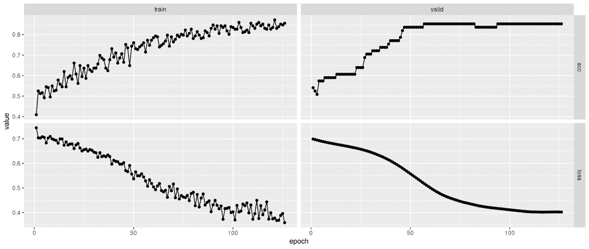
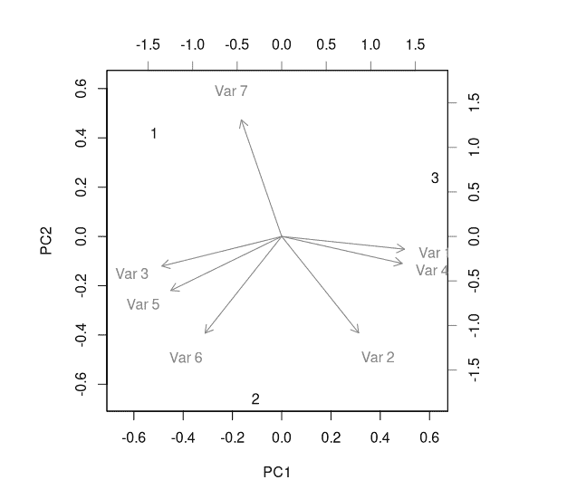
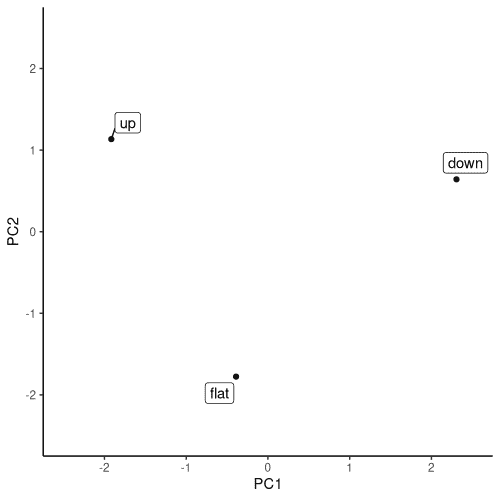

# 20  表格数据

> [原文链接](https://skeydan.github.io/Deep-Learning-and-Scientific-Computing-with-R-torch/tabular_data.html)

到目前为止，我们一直在专门处理图像。对于图像，像素值排列在网格中；或者实际上有多个网格，如果有多个通道的话。无论有多少，所有值都是同一类型的：例如，`0`到`255`之间的整数，或者（当归一化时）在`0`到`1`区间内的浮点数。然而，在表格数据（也称为：电子表格）中，你可能会遇到数字、（单个）字符和（单个或多个标记）文本的混合。

正如我们之前讨论的，在谈论张量创建时，`torch`无法处理非数值数据。因此，字符和文本必须先进行预处理并编码成数值。对于单个字符或单个字符串，这并不会带来太多困难：只需将 R 字符向量转换为因子，然后，将因子转换为整数。然而，对于常规文本的预处理则是一个更加复杂的话题，我们在这里无法深入探讨。

现在，假设我们展示的是一个全数值数据框。（也许它一开始就是全数值的；也许我们已经遵循了上述提到的“通过因子进行整数值化”的配方来做到这一点。）尽管如此，这些数字的含义可能在不同特征之间是不同的。

## 20.1 通过示例了解数值数据的类型

经典的区分在于区间数据、有序数据和分类数据。假设对于三个人，我们被告知在某个特征上，他们各自的得分是`2`、`1`和`3`。我们该如何理解这些数据呢？

首先，这些数字可能只是编码“痕迹”。例如，如果`1`代表*苹果*，`2`代表*橙子*，`3`代表*菠萝*，那么这就是分类数据。

其次，这些数字可能代表成绩，`1`表示最佳，`2`表示次佳，`3`表示之后的一个……以此类推。在这种情况下，值之间存在排名或排序。然而，我们没有理由假设`1`和`2`之间的距离与`2`和`3`之间的距离相同。这些都是有序数据。

最后，也许这些距离*确实是*相同的。现在，我们正在处理区间数据。

以这种方式表达，这种区分可能看起来微不足道。然而，在现实世界的数据集中，了解你正在处理的数据类型并不总是容易的。

为了说明，我们现在检查流行的*心脏病*数据集，该数据集可在[UCI 机器学习仓库](https://archive.ics.uci.edu/ml/index.php)找到。在本章中，我们将使用这个数据集构建一个分类器。

在接下来的内容中，我们的目标不是完全确信我们“理解正确”；相反，它是关于展示如何以一种负责任的方式（如果我可以这么说）来处理任务。

我们首先加载数据集。在这里，`heart_disease`是目标，缺失值用问号表示。

```r
library(torch)
library(luz)

library(purrr)
library(readr)
library(dplyr)

uci <- "https://archive.ics.uci.edu"
ds_path <- "ml/machine-learning-databases/heart-disease"
ds_file <- "processed.cleveland.data"

download.file(
 file.path(uci, ds_path, ds_file),
 destfile = "resources/tabular-heart.csv"
)

heart_df <- read_csv(
 "resources/tabular-heart.csv",
 col_names = c(
 "age", 
 # 1 = male; 0 = female
 "sex", 
 # chest pain type
 # (1 = typical angina, 2 = atypical angina,
 #  3 = non-anginal pain, 4 = asymptomatic)
 "pain_type", 
 # in mm Hg on admission
 "resting_blood_pressure", 
 # serum cholesterol in mg/dl
 "chol", 
 # > 120 mg/dl, true (1) or false (0)
 "fasting_blood_sugar", 
 # 0 = normal, 1 = ST-T wave abnormality
 # (T wave inversions and/or ST elevation
 # or depression of > 0.05 mV),
 # 2 = probable or definite left ventricular
 # hypertrophy by Estes' criteria
 "rest_ecg", 
 # during exercise
 "max_heart_rate", 
 # exercise induced angina (1 = yes, 0 = no),
 "ex_induced_angina",
 # ST depression induced by exercise relative to rest 
 "old_peak", 
 # slope of the peak exercise ST segment
 # (1 = upsloping, 2 = flat, 3 = downsloping) 
 "slope", 
 # number of major vessels (0-3) colored by fluoroscopy
 "ca", 
 # 3 = normal; 6 = fixed defect; 7 = reversible defect
 "thal", 
 # 1-4 = yes; 0 = no
 "heart_disease" 
 ),
 na = "?")
```

*正如你所见，我已经用数据集创建者提供的信息标注了这些特征。

根据这些信息以及数据集中的实际值，以下看起来像是区间数据：

+   `age`,

+   `resting_blood_pressure`,

+   `chol`,

+   `max_heart_rate`, 以及

+   `old_peak` .

在维度的另一端，一些特征显然被构思为二元的：即预测变量 `sex`、`fasting_blood_sugar`、`ex_induced_angina` 以及目标变量 `heart_disease`。二元的预测变量，其值要么为零要么为一，通常被视为数值型。这样不会丢失任何信息。另一种表示方法是使用长度为二的向量：当给定值为 `0` 时为 `[0, 1]`，当给定值为 `1` 时为 `[1, 0]`。这被称为**独热编码**，“独热”指的是向量中只有一个位置是非零的（即对应于所讨论类别的位置）。通常，这只有在有超过两个类别时才会这样做，我们将在实现此问题的 `dataset()` 时再回到这个技术。

现在我们只剩下 `pain_type`、`rest_ecg`、`slope`、`ca` 和 `thal`。其中，`pain_type`、`rest_ecg` 和 `thal` 在某种程度上看起来是分类的，或者可能是有序的。在机器学习中，通常将有序数据视为分类数据，除非不同类别的数量很高，否则这不会导致信息损失显著。

那么 `slope` 呢？对于一个机器学习的人来说，仅仅从命名上似乎就暗示这是一个连续的特征；而像 1、2、3 这样有序排列的值可能会让你认为这个变量至少是有序的。然而，快速的网络搜索已经揭示了一个不同且更为复杂的现实。¹ 因此，我们肯定会想将这个变量作为分类变量处理。（如果这是一个现实世界的任务，我们应该尝试咨询领域专家，以找到更好的解决方案。）

最后，对于 `ca`，我们——或者更准确地说，我——并不清楚有多少主要血管（从零到四条）被**荧光透视**染上了颜色。 (再次强调，如果你能接触到领域专家，请利用这个机会向他们咨询。) 最安全的方法是不要假设测量值之间的距离相等，而是将这个特征视为仅仅有序的，因此，是分类的。

现在我们已经讨论了该怎么做，我们可以实现我们的数据提供者：`heart_dataset()`。

除了足够的特征表示之外，还有一件事需要特别注意。数据集中包含未知值，我们将其编码为 `NA`：

```r
which(is.na(heart_df), arr.ind = TRUE)
```

```r
 row col
[1,] 167  12
[2,] 193  12
[3,] 288  12
[4,] 303  12
[5,]  88  13
[6,] 267  13
```

幸运的是，这些数据只出现在两列中：`thal` 和 `ca`.

```r
heart_df %>% group_by(thal) %>% summarise(n())
```

```r
tibble: 4 × 2
thal `n()`
<dbl> <int>
  1      3   166
  2      6    18
  3      7   117
  4     NA     2
```

```r
heart_df %>% group_by(ca) %>% summarise(n())
```

```r
A tibble: 5 × 2
ca `n()`
<dbl> <int>
  1     0   176
  2     1    65
  3     2    38
  4     3    20
  5    NA     4
```

由于我们对这些缺失值的原因一无所知，并且考虑到——方便的是——这两个特征都是分类的且基数较低，因此，最简单的方法就是用额外的因子值来表示那些 `NA`。

决定之后，我们可以实现`heart_dataset()`。数值特征将被缩放，这是一个在它们具有不同数量级时应该始终采取的措施。这将显著加快训练速度。

关于分类特征，我们可以做的一件事是使用一热编码。例如：

```r
nnf_one_hot(
 torch_tensor(
 heart_df$slope,
 dtype = torch_long()
 )
) %>% print(n = 5)
```

```r
torch_tensor
 0  0  1
 0  1  0
 0  1  0
 0  0  1
 1  0  0
... [the output was truncated (use n=-1 to disable)]
[ CPULongType{303,3} ]
```

在一热编码中，我们保证每个特征值与其他所有特征值完全不同。然而，我们可以做得更好。我们可以使用一种称为*嵌入*的技术，在它们之间不是完全相同程度不同的空间中表示这些特征值。

我们将在构建模型时看到它是如何工作的，但现在，我们需要确保满足先决条件。具体来说，`torch`的嵌入模块期望它们的输入是整数，而不是一热编码的向量（或其他任何东西）。因此，我们将把分类特征转换为因子，然后转换为整数。

将所有这些放在一起，我们得到了以下`dataset()`定义：

```r
heart_dataset <- dataset(
 initialize = function(df) {
 self$x_cat <- self$get_categorical(df)
 self$x_num <- self$get_numerical(df)
 self$y <- self$get_target(df)
 },
 .getitem = function(i) {
 x_cat <- self$x_cat[i, ]
 x_num <- self$x_num[i, ]
 y <- self$y[i]
 list(x = list(x_cat, x_num), y = y)
 },
 .length = function() {
 dim(self$y)[1]
 },
 get_target = function(df) {
 heart_disease <- ifelse(df$heart_disease > 0, 1, 0)
 heart_disease
 },
 get_numerical = function(df) {
 df %>%
 select(
 -(c(
 heart_disease, pain_type,
 rest_ecg, slope, ca, thal
 ))
 ) %>%
 mutate(across(.fns = scale)) %>%
 as.matrix()
 },
 get_categorical = function(df) {
 df$ca <- ifelse(is.na(df$ca), 999, df$ca)
 df$thal <- ifelse(is.na(df$thal), 999, df$thal)
 df %>%
 select(
 pain_type, rest_ecg, slope, ca, thal
 ) %>%
 mutate(
 across(.fns = compose(as.integer, as.factor))
 ) %>%
 as.matrix()
 }
)
```

*让我们看看它产生的输出是否符合我们的预期。

```r
ds <- heart_dataset(heart_df)
ds[1]
```

```r
$x
$x[[1]]
pain_type  rest_ecg     slope        ca      thal 
        1         3         3         1         2 

$x[[2]]
                   age                    sex 
            0.94715962             0.68506916 
resting_blood_pressure                   chol 
            0.75627397            -0.26446281 
   fasting_blood_sugar         max_heart_rate 
            2.39048352             0.01716893 
     ex_induced_angina               old_peak 
           -0.69548004             1.08554229 

$y
[1] 0
```

它确实如此。

这是一个小数据集，所以我们不会创建单独的测试和验证集。

```r
train_indices <- sample(
 1:nrow(heart_df), size = floor(0.8 * nrow(heart_df)))
valid_indices <- setdiff(
 1:nrow(heart_df), train_indices)

train_ds <- dataset_subset(ds, train_indices)
train_dl <- train_ds %>% 
 dataloader(batch_size = 256, shuffle = TRUE)

valid_ds <- dataset_subset(ds, valid_indices)
valid_dl <- valid_ds %>% 
 dataloader(batch_size = 256, shuffle = FALSE)
```

*我们已经准备好进入模型。但在那之前，让我们先谈谈*嵌入*。
  
## 20.3 深度学习中的嵌入：理念

嵌入背后的主要思想，在深度学习中使用这个术语的方式，是超越默认的“所有值彼此完全不同”的分类值表示。

就像在一热编码中，标量被映射到向量中。但这次，没有限制非空槽位的数量，或者它们可能取的值。例如，整数 1、2 和 3 可以被映射到以下张量：

```r
one <- torch_tensor(c(1.555, 0.21, -3.33, 0.0007, 0.07))
two <- torch_tensor(c(0.33, -0.03, -2.177, 1.1, 0.0005))
three <- torch_tensor(c(-0.33, 2.99, 1.77, 1.08, 3.001))
```

*现在，我们可以使用`nnf_cosine_similarity()`来找出这些向量彼此有多接近。为了方便起见，在二维空间中工作，比如说我们有两个平行向量，指向同一方向。它们之间的角度为零，余弦值为一：

```r
nnf_cosine_similarity(
 torch_ones(2),
 torch_ones(2) * 2.5,
 dim = 1
)
```

```r
torch_tensor
1
[ CPUFloatType{} ]
```

因此，值为 1 表示最大相似性。相比之下，现在假设它们仍然是平行的，但指向相反方向。角度是一百八十度，余弦值为负一：

```r
nnf_cosine_similarity(
 torch_ones(2),
 -1.5 * torch_ones(2),
 dim = 1
)
```

```r
torch_tensor
-1
[ CPUFloatType{} ]
```

这些向量之间差异最大。在中间，我们有大约九十度的角度，向量是（大约）正交的；或者用通俗的话说，“独立”。当角度正好是九十度时，余弦值为零：

```r
nnf_cosine_similarity(
 torch_tensor(c(1, 0)),
 torch_tensor(c(0, 1)),
 dim = 1
)
```

```r
torch_tensor
0
[ CPUFloatType{} ]
```

在更高维度中，情况类似。因此，我们可以确定上述向量`one`、`two`和`three`中哪两个彼此最接近：

```r
nnf_cosine_similarity(one, two, dim = 1)
nnf_cosine_similarity(one, three, dim = 1)
nnf_cosine_similarity(two, three, dim = 1)
```

```r
torch_tensor
0.855909
[ CPUFloatType{} ]

torch_tensor
-0.319886
[ CPUFloatType{} ]

torch_tensor
-0.245948
[ CPUFloatType{} ]
```

看看这些是如何定义的，这些值是有意义的。
  
## 20.4 深度学习中的嵌入：实现

到现在为止，你可能同意嵌入是有用的。但我们如何获得它们？

便利的是，这些向量作为模型训练的一部分被学习。*嵌入模块*是接受整数输入并学习将它们映射到向量的模块。

在创建这样的模块时，你指定有多少不同的整数（`num_embeddings`），以及你希望学习到的向量有多长（`embedding_dim`）。这些参数共同告诉模块其权重矩阵应该如何看起来。权重矩阵不过是一个查找表（虽然是可以修改的！）它将整数映射到相应的向量：

```r
module <- nn_embedding(num_embeddings = 3, embedding_dim = 5)
module$weight
```

```r
torch_tensor
 2.3271  0.0894  0.6558 -0.5836 -0.1074
 0.0367  0.1822 -0.0446  0.2059 -0.7540
-0.7577 -1.7773 -0.6619  1.2884  0.3946
[ CPUFloatType{3,5} ][ requires_grad = TRUE ]
```

在模块创建时，这些映射是随机初始化的。尽管如此，我们可以通过在某个特征上调用模块——比如`slope`——来测试代码是否按预期工作。

```r
# slope
module(ds[1]$x[[1]][3])
```

```r
torch_tensor
-0.7577 -1.7773 -0.6619  1.2884  0.3946
[ CPUFloatType{1,5} ][ grad_fn = <EmbeddingBackward0> ]
```

现在，你可能会说，我们以一种某种漫不经心的态度，略过了这些映射是如何优化的这个问题。技术上，这就像任何模块一样工作：通过反向传播。*但是有一个含义：* 这意味着整体模型，更重要的是，给定的*任务*将决定这些学习到的映射“好”的程度。

然而，还有一件更重要的事情：*数据*。

当然，这不用说，你可能认为。但是当使用嵌入时，学习到的映射有时会被呈现为一种额外的结果，一种额外的利益。例如，模型本身可能是一个分类器，预测人们是否会违约。现在假设有一个输入特征——比如种族——它使用嵌入进行处理。一旦模型被训练，获得的表现就会提取出来。反过来，这种表现将反映训练数据集中存在的所有问题——偏见、不公正、扭曲等。

下面，我将展示如何获得和绘制这样的表示。对于一个领域专家来说，这种表示可能或可能不足以令人满意；无论如何，在这个例子中不太可能造成伤害。然而，在处理现实世界任务时，我们总是必须意识到可能造成的伤害，并严格分析训练工作流程中固有的任何偏见和假设。

回到实现上，这是我们用于任务的嵌入模块。实际上，没有*单个*嵌入模块；每个分类特征都有一个。包装器`embedding_module()`将它们都保存在`nn_module_list()`中，并在调用时遍历它们并连接它们的输出：

```r
embedding_module <- nn_module(
 initialize = function(cardinalities, embedding_dim) {
 self$embeddings <- nn_module_list(
 lapply(
 cardinalities,
 function(x) {
 nn_embedding(
 num_embeddings = x, embedding_dim = embedding_dim
 )
 }
 )
 )
 },
 forward = function(x) {
 embedded <- vector(
 mode = "list",
 length = length(self$embeddings)
 )
 for (i in 1:length(self$embeddings)) {
 embedded[[i]] <- self$embeddings[[i]](x[, i])
 }
 torch_cat(embedded, dim = 2)
 }
)
```

*这个包装器——让我们称它为“嵌入器”——将是构成顶级模型的一个模块。


顶级模块的逻辑很简单。对于其输入的分类部分，它委托给嵌入器，并将获得的嵌入附加到数值部分。然后，得到的张量通过一系列线性模块传递：

```r
model <- nn_module(
 initialize = function(cardinalities,
 num_numerical,
 embedding_dim,
 fc1_dim,
 fc2_dim) {
 self$embedder <- embedding_module(
 cardinalities,
 embedding_dim
 )
 self$fc1 <- nn_linear(
 embedding_dim * length(cardinalities) + num_numerical,
 fc1_dim
 )
 self$drop1 <- nn_dropout(p = 0.7)
 self$fc2 <- nn_linear(fc1_dim, fc2_dim)
 self$drop2 <- nn_dropout(p = 0.7)
 self$output <- nn_linear(fc2_dim, 1)
 },
 forward = function(x) {
 embedded <- self$embedder(x[[1]])
 all <- torch_cat(list(embedded, x[[2]]), dim = 2)
 score <- all %>%
 self$fc1() %>%
 nnf_relu() %>%
 self$drop1() %>%
 self$fc2() %>%
 nnf_relu() %>%
 self$drop2() %>%
 self$output()
 score[, 1]
 }
)
```

*查看最终输出，你会发现这些是原始分数，而不是概率。对于二元目标，这意味着我们将使用`nn_bce_with_logits_loss()`来训练模型。

现在，我们仍然需要进行一些维护和配置：

```r
# cardinalities of categorical features
cardinalities <- heart_df %>%
 select(pain_type, rest_ecg, slope, ca, thal) %>%
 mutate(across(.fns = as.factor)) %>%
 summarise(across(.fns = nlevels))

# cardinalities of categorical features,
# adjusted for presence of NAs in ca and thal
cardinalities <- cardinalities + c(0, 0, 0, 1, 1) 

# number of numerical features
num_numerical <- ncol(heart_df) - length(cardinalities) - 1

embedding_dim <- 7

fc1_dim <- 32
fc2_dim <- 32
```

*注意这里请求的嵌入维度（`embedding_dim`）。

通常的最佳实践会选择较低的值，这大致相当于特征基数的一半。例如，如果某个类别的值有三十个不同，我们可能会选择大约十五个长度的向量。当然，如果我有三十个值，我肯定会这么做。但在这个例子中，基数要低得多：两个、三个、四个或五个。（这已经将`NA`视为一个额外的因素值。）将这些数字减半几乎不会留下任何表示能力。因此，在这里，我采取了相反的做法：给模型一个更大的空间来操作。（超过七个，即选择的价值，我没有看到进一步的训练改进。）

所有的准备工作都完成了，我们可以训练模型。通常，在这个时候我们会运行学习率查找器。在这里，数据集真的太小了，以至于这样做没有意义，至少在没有大幅调整学习率查找器的默认设置的情况下。此外，对于如此小的数据集，实验花费的时间非常少；而选择的学习率是基于几次快速实验的。

```r
fitted <- model %>%
 setup(
 optimizer = optim_adam,
 loss = nn_bce_with_logits_loss(),
 metrics = luz_metric_binary_accuracy_with_logits()
 ) %>%
 set_hparams(
 cardinalities = cardinalities,
 num_numerical = num_numerical,
 embedding_dim = embedding_dim,
 fc1_dim = fc1_dim, fc2_dim
 ) %>%
 set_opt_hparams(lr = 0.001) %>%
 fit(train_dl,
 epochs = 200,
 valid_data = valid_dl,
 callbacks = list(
 luz_callback_early_stopping(patience = 10)
 ),
 verbose = TRUE
 )
```

```r
# Epoch 1/200
# Train metrics: Loss: 0.7445 - Acc: 0.4091
# Valid metrics: Loss: 0.6988 - Acc: 0.541
# Epoch 2/200
# Train metrics: Loss: 0.7036 - Acc: 0.5248
# Valid metrics: Loss: 0.6966 - Acc: 0.5246
# Epoch 3/200
# Train metrics: Loss: 0.7029 - Acc: 0.5124
# Valid metrics: Loss: 0.6946 - Acc: 0.5082
# ...
# ...
# Epoch 124/200
# Train metrics: Loss: 0.3884 - Acc: 0.8512
# Valid metrics: Loss: 0.4026 - Acc: 0.8525
# Epoch 125/200
# Train metrics: Loss: 0.3961 - Acc: 0.8471
# Valid metrics: Loss: 0.4023 - Acc: 0.8525
# Epoch 126/200
# Train metrics: Loss: 0.359 - Acc: 0.8554
# Valid metrics: Loss: 0.4019 - Acc: 0.8525
# Early stopping at epoch 126 of 200
```

```r
fitted %>% plot()
```

*

图 20.1：二进制心脏病分类的损失和精度（分别对应训练和验证）。

如您所见（图 20.1），模型训练进展顺利，并产生了良好的精度。

在我们离开表格数据的话题之前，这里是如何提取、后处理和可视化学习表示的。
  
## 20.6 通过示例生成的嵌入表示

这里，以示例方式，是`slope`的权重矩阵。

```r
embedding_weights <- vector(mode = "list")

for (i in 1:length(fitted$model$embedder$embeddings)) {
 embedding_weights[[i]] <-
 fitted$model$embedder$embeddings[[i]]$
 parameters$weight$to(device = "cpu")
}

slope_weights <- embedding_weights[[3]]
slope_weights
```

```r
torch_tensor
-0.9226 -1.0282  0.8935  0.3152  0.5481  0.8376  0.9990
 0.0604  0.1904  0.6788  0.8542  0.8007  1.5226 -0.1789
 1.2504 -0.0827 -0.7259  1.2885 -1.7847  0.1813  0.4418
[ CPUFloatType{3,7} ][ requires_grad = TRUE ]
```

对于可视化，我们希望将七个维度减少到两个。我们可以通过运行 PCA（主成分分析）来实现这一点，使用 R 的内置`prcomp()`函数：

```r
pca <- prcomp(slope_weights, center = TRUE, scale = TRUE)
pca
```

```r
Standard deviations (1, .., p=3):
[1] 2.138539e+00 1.557771e+00 2.173695e-16

Rotation (n x k) = (7 x 3):
            PC1         PC2         PC3
[1,]  0.4650931 -0.06650143  0.18974889
[2,]  0.2915618 -0.50187753  0.42034629
[3,] -0.4539313 -0.15412668  0.46092035
[4,]  0.4562585 -0.14058058 -0.16106015
[5,] -0.4203277 -0.28128658  0.29209764
[6,] -0.2903728 -0.50317497 -0.68060609
[7,] -0.1531762  0.60652402  0.01925451
```

这个打印输出反映了两条信息：主成分的标准差（也作为`pca$sdev`可用），以及变量加载矩阵（也作为`pca$rotation`可用）。

前者反映了结果组件的重要性；我们使用它们来决定是否将组件减少到两个是允许的。以下是每个组件解释的方差量：

```r
(pca$sdev² / sum(pca$sdev²)) %>% round(2)
```

```r
[1] 0.65 0.35 0.00
```

从那个输出中，省略第三个组件是完全可以接受的。

变量加载矩阵另一方面告诉我们每个变量（在这里：学习嵌入中的每个槽位）在确定“意义”方面扮演着多大的角色。在这里，可视化比原始数字更有帮助（图 20.2）：

```r
biplot(pca)
```

*

图 20.2：`heart_disease$slope`：嵌入权重的 PCA，双图可视化因子载荷。

这个图可以理解为，从纯粹的表现力角度来看，即不考虑训练性能，四个嵌入维度就足够了。

最后，我们追求的主要目标是什么：在二维空间中表示斜率类别？

这个信息由`pca$x`提供。它告诉我们原始输入类别如何与主成分相关。

```r
pca$x
```

```r
 PC1        PC2           PC3
[1,] -1.9164879  1.1343079  1.783213e-17
[2,] -0.3903307 -1.7761457  6.993398e-16
[3,]  2.3068187  0.6418377 -4.977644e-16
```

忽略第三个分量，类别在（二维）空间中的分布可以轻松可视化（图 20.3）：

```r
library(ggplot2)
library(ggrepel)

slopes <- c("up", "flat", "down")

pca$x[, 1:2] %>%
 as.data.frame() %>%
 mutate(class = slopes) %>%
 ggplot(aes(x = PC1, y = PC2)) +
 geom_point() +
 geom_label_repel(aes(label = class)) +
 coord_cartesian(
 xlim = c(-2.5, 2.5),
 ylim = c(-2.5, 2.5)
 ) +
 theme(aspect.ratio = 1) +
 theme_classic()
```

*

图 20.3：`heart_disease$slope`：嵌入权重的 PCA，定位原始输入值在二维空间中的位置。

这种表示是否合理，我将留给专家来判断。我的目标在这里是展示这项技术，以便你可以在它*确实*提供一些见解时使用它。即使不这样做，嵌入模块对于分类特征或混合特征数据在训练成功中也做出了重大贡献。
  
 * *

1.  例如，参见[`en.my-ekg.com/how-read-ekg/st-segment.html`](https://en.my-ekg.com/how-read-ekg/st-segment.html)、[`ecg.utah.edu/lesson/10`](https://ecg.utah.edu/lesson/10)或[Wikipedia](https://en.wikipedia.org/wiki/ST_segment)。↩︎

