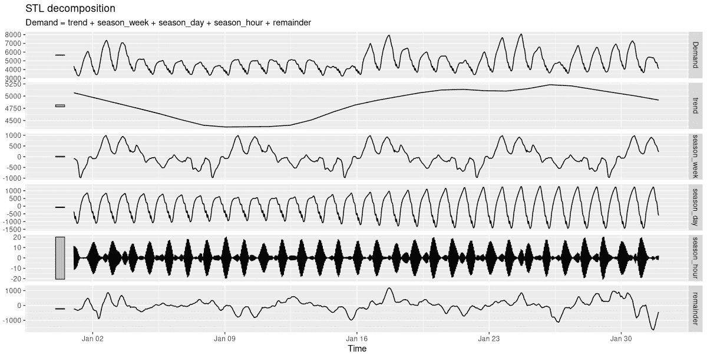
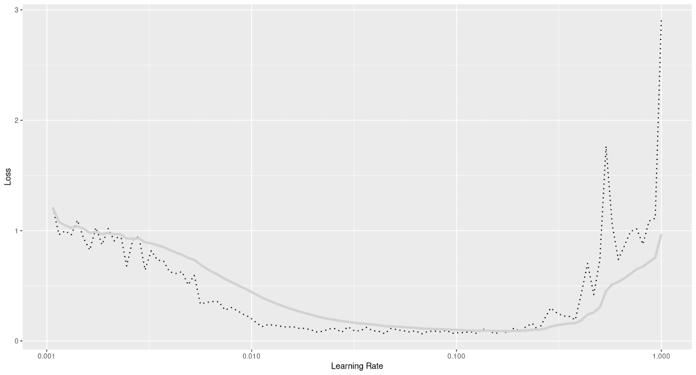
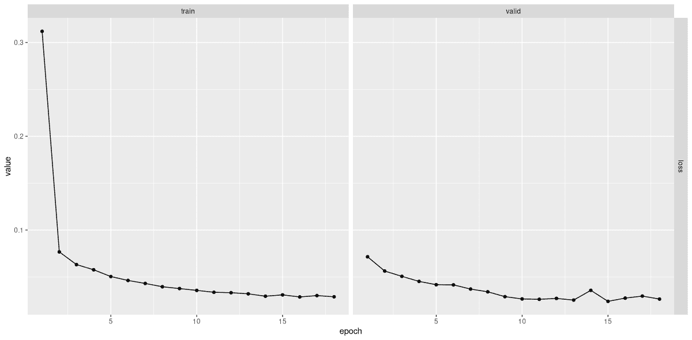
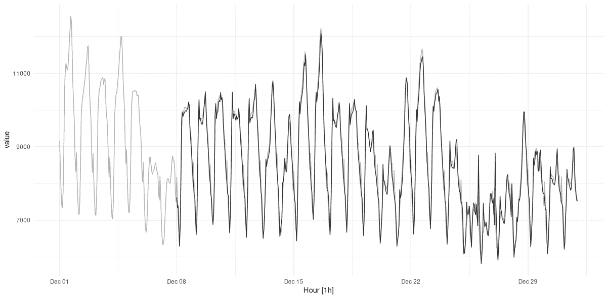
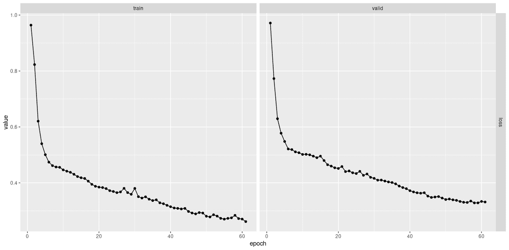
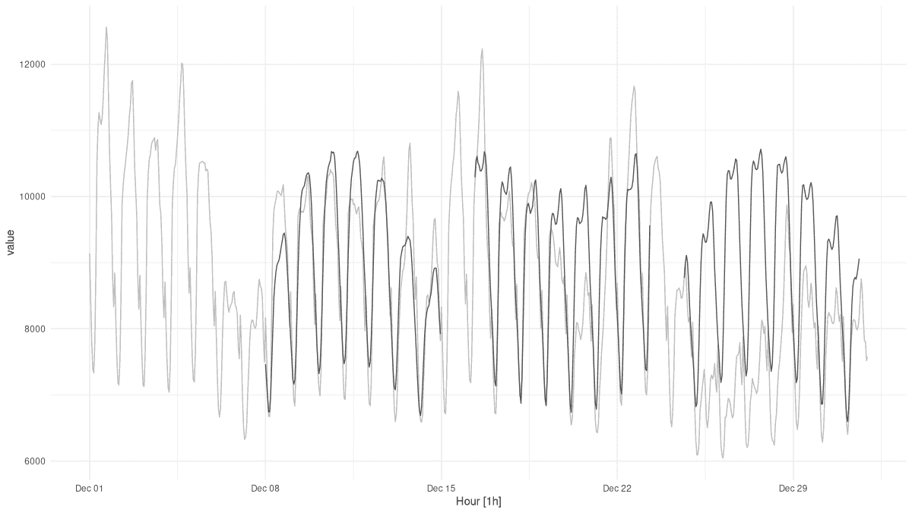

# 21 时间序列

> 原文：[`skeydan.github.io/Deep-Learning-and-Scientific-Computing-with-R-torch/time_series.html`](https://skeydan.github.io/Deep-Learning-and-Scientific-Computing-with-R-torch/time_series.html)

在本章中，我们将再次探讨一种新的数据类型：时间序列。之前，从图像到表格数据的转变，我们发现两者之间有实质性的差异，即图像数据是同质的，而表格数据不是。在图像中，单个值对应于像素，或网格上的位置。在表格数据中，值在原则上可以是“任何东西”；但大多数情况下，我们处理的是类别、顺序和数值数据的混合。然而，这两种类型的应用有一个共同点：所有值都关联到相同的时间点。

在时间序列中，我们面临一个新的情况。假设序列是一维的，也就是说，它只有一个特征。因此，数据类型是同质的。但现在，输入是一个序列。接下来会发生什么？

在之前，当存在多种数据类型混合时，我们发现我们不得不进行一些前置处理。我们也看到，通过添加一种新的模块——嵌入模块，我们可以精炼和增强整体（线性）模型。但现在，我们需要更大的改变。我们又将不得不进行一些前置处理；但这次，我们还需要一种不同类型的顶级 *模型*，这种模型与标准的前馈架构的不同程度，就像我们已研究过的卷积架构一样。

## 21.1 深度学习序列：理念

假设我们有一个由每天的平均气温组成的序列，以摄氏度为单位：`-1.1, 2.0, -0.2, -0.9, 4.5, -3.6, -9.1`。显然，这些值并不是独立的；我们几乎不可能猜测下一个测量值会是`21`。实际上，如果这七个平均值是你所拥有的全部，你对于下一天的最好猜测可能只是`-9.1`。但当我们说“时间序列”时，我们指的是更长的序列。随着序列的变长，你可以尝试检测模式，比如趋势或周期性。这正是时间序列分析中已建立的技术的目的。

为了让深度学习模型做到这一点，首先它必须“感知”单个值作为序列。我们通过增加张量维度性一个维度，并使用额外的维度进行序列排序来实现这一点。现在，模型必须对它做一些有用的事情。回想一下线性模型在做什么：它接受输入 $\mathbf{X}$，乘以其权重矩阵 $\mathbf{W}$，并加上偏置向量 $\mathbf{b}$：

$$ f(\mathbf{X}) = \mathbf{X}\mathbf{W} + \mathbf{b} $$

在序列模型中，这种操作仍然存在；只是现在，它对每个时间步——即序列中的每个位置——独立执行。但这意味着现在，必须处理时间步之间的**关系**。为此，模块使用前一时间步获得的结果，应用不同的权重矩阵，并添加不同的偏置向量。这本身又是一个仿射变换——只是不是对输入，而是对所谓的先前**状态**。将两个仿射计算的结果相加，然后作为下一个时间步计算的前置状态。

换句话说，*在每个时间步*，结合两种类型的信息：当前时间步的（加权变换）输入，以及处理前一时间步产生的（加权变换）状态。用数学表示：

$$ state_{(t)} = f(\mathbf{W_{input}}\mathbf{X_{(t)}} + \mathbf{b_{input}} + \mathbf{W_{state}}\mathbf{X_{(t-1)}} + \mathbf{b_{state}}) $$

这种逻辑指定了一个**递归关系**，实现这种关系的模块被称为**循环神经网络**（RNNs）。在下一节中，我们将自己实现这样一个模块；你将看到在代码中，递归是如何映射到简单的迭代的。在此之前，有两点需要注意。

首先，在上面的公式中，应用于两个变换之和的函数代表一个激活函数；对于循环神经网络来说，通常默认的是双曲正切函数，`torch_tanh()`。

第二，在官方的`torch`文档中，你会看到公式这样写：

$$ h_{(t)} = f(\mathbf{W_{i\_h}\mathbf{X_{(t)}} }+ \mathbf{b_{i\_h}} + \mathbf{W_{h\_h}\mathbf{X}_{(t-1)}} + \mathbf{b}_{h\_h}) $$

这里 $h$ 代表“隐藏”，正如“隐藏状态”中的“隐藏”，下标 $i\_h$ 和 $h\_h$ 分别代表“输入到隐藏”和“隐藏到隐藏”。我想淡化“隐藏状态”中的“隐藏”一词的原因是，在`torch`实现中，状态并不一定是隐藏给用户的。你将在下面看到我的意思。（很快，我将对这个术语放弃抵抗，因为它在描述性文字和代码（例如，关于变量命名）中无处不在。但我至少想明确地说明这一点，这样你就不至于在将你的算法心理模型映射到`torch` RNNs 的行为时感到困惑。）

## 21.2 基本循环神经网络

在上述讨论中，我们确定了循环神经网络必须完成的两个基本任务：(1) 遍历输入序列；以及(2) 执行序列的“业务逻辑”，即结合前一时间步和当前时间步的信息。

通常，这些职责由两个不同的对象分担。一个被称为“细胞”，实现了逻辑。另一个负责迭代。这种模块化的原因在于“内部”和“外部”逻辑都应该可以独立修改。例如，您可能想保持遍历时间步的方式，但修改迭代中的每个点发生的事情。当我们谈到最常用的 RNN 子类型时，这会变得更加具体。

在我们基本实现的简单 RNN 中，细胞和迭代处理程序都是 `nn_module()`。首先，我们有 *cell*。

### 21.2.1 基本的 `rnn_cell()`

逻辑结合了两个仿射操作；仿射操作正是线性模块的作用。因此，我们的细胞只是将任务委托给两个线性模块，将相应的输出附加，并应用一个 *tanh* 激活。

正如上面已经提到的，在命名模块和参数时，我遵循了 `torch` 的约定，因此当我们继续到实际的 `torch` 模块时，这些名称会听起来很熟悉。最值得注意的是，这包括将状态称为“隐藏状态”，因此其维度为 `hidden_size`，尽管状态在特定情况下才对用户隐藏（我们将在后面讨论）。

```r
library(torch)
library(zeallot) # for destructuring using %<-%

rnn_cell <- nn_module(
 initialize = function(input_size, hidden_size) {
 self$linear_i_h <- nn_linear(input_size, hidden_size)
 self$linear_h_h <- nn_linear(hidden_size, hidden_size)
 },
 forward = function(x, prev_state) {
 torch_tanh(self$linear_i_h(x) +
 self$linear_h_h(prev_state))
 }
)
```

*从细胞定义的方式来看，我们可以看到要实例化它，我们需要传递 `hidden_size` 和 `input_size` – 后者指的是数据集中的特征数量。让我们将它们分别设置为 3 和 1：

```r
cell <- rnn_cell(input_size = 1, hidden_size = 3)
```

*作为一个快速测试，我们在一个（微小的）数据批次上调用该模块，传递先前的（或：初始）状态。与实际的 `torch` 实现一样，状态被初始化为一个全零张量：

```r
cell(torch_randn(2, 1), torch_zeros(2, 3))
```

```r
torch_tensor
-0.6340  0.9571 -0.9886
-0.3007  0.9201 -0.9689
[ CPUFloatType{2,3} ][ grad_fn = <TanhBackward0> ]
```

注意输出的维度。对于每个批次项，我们得到一个新状态，大小为 `hidden_size`。

现在通常不应该由用户调用细胞；相反，我们应该调用待定义的 `rnn_module()`。该模块将负责迭代，并在每一步将任务委托给 `rnn_cell()` 的一个实例。让我们接下来实现这个模块。
  
### 21.2.2 基本的 `rnn_module()`

从概念上讲，这个模块很容易描述——它遍历时间点。但在接下来的实现中，还有一些需要注意的事项。

首先，请注意，它期望 `forward()` 接收单个参数，而不是两个——不需要传递初始状态。（在实际的 `torch` 实现中，如果用户想要从某个状态开始，他们可以传递一个初始状态。但如果他们不这样做，状态将从头开始为全零，就像在这个原型中一样。）

其次，也是最重要的一点，让我们谈谈 `x` 的维度，它是单个输入参数。细胞在 `batch_size` 乘以 `num_features` 大小的张量上操作，迭代模块期望其输入有一个额外的维度，插入在第二个位置——正好“在中间”。您可以在以下行中看到这一点：

```r
c(batch_size, timesteps, num_features) %<-% x$size()
```

*这个额外的维度用于捕捉时间的演变。`rnn_module()`将遍历其值，对序列中的每个步骤调用`rnn_cell()`，并跟踪输出：

```r
for (t in 1:timesteps) {
 new_state <- self$cell(x[ , t, ], cur_state)
 states[[t]] <- new_state
 cur_state <- new_state
}
```

*正如你所见，在每次调用`self$cell`时，都会传递前一个状态，履行`rnn_cell$forward()`的合约。

`rnn_module()`的完整代码比 cell 的代码稍微长一点：

```r
rnn_module <- nn_module(
 initialize = function(input_size, hidden_size) {
 self$cell <- rnn_cell(input_size, hidden_size)
 self$hidden_size <- hidden_size
 },
 forward = function(x) {
 c(batch_size, timesteps, num_features) %<-% x$size()
 init_hidden <- torch_zeros(batch_size, self$hidden_size)
 cur_state <- init_hidden

 # list containing the hidden states
 # (equivalently: outputs), of length timesteps
 states <- vector(mode = "list", length = timesteps)

 # loop over time steps
 for (t in 1:timesteps) {
 new_state <- self$cell(x[, t, ], cur_state)
 states[[t]] <- new_state
 cur_state <- new_state
 }

 # put sequence of states in dimension 2
 states <- torch_stack(states, dim = 2)

 list(states, states[, timesteps, ])
 }
)
```

*注意维度二，在输入中持有时间维度的那个维度，现在用于打包每个时间步长获得的状态。我会在下一部分更多地谈论这一点，但首先，让我们测试一下这个模块。我将保持状态大小（`hidden_size`）为三，并使我们的样本输入有四个连续的测量值：

```r
rnn <- rnn_module(input_size = 1, hidden_size = 3)

output <- rnn(torch_randn(2, 4, 1))
output
```

```r
[[1]]
torch_tensor
(1,.,.) = 
 -0.9066  0.8149 -0.3671
 -0.9772  0.2903 -0.7938
 -0.9724  0.6242 -0.7877
 -0.9811  0.4164 -0.8839

(2,.,.) = 
 -0.8901  0.8795  0.3131
 -0.9512  0.4883  0.4991
 -0.9297  0.4875  0.1878
 -0.9420  0.5741  0.1564
[ CPUFloatType{2,4,3} ][ grad_fn = <StackBackward0> ]

[[2]]
torch_tensor
-0.9811  0.4164 -0.8839
-0.9420  0.5741  0.1564
[ CPUFloatType{2,3} ][ grad_fn = <SliceBackward0> ]
```

所以，`rnn_module()`返回一个长度为两个的列表。列表中的第一个是一个 tensor，包含所有时间步长的状态——对于每个批次的项，以及每个状态中的单元。冒着重复的风险，这里是其维度：

```r
# batch_size, timesteps, hidden_size
dim(output[[1]])
```

```r
[1] 2 4 3
```

我之所以强调这一点，是因为你将在实际的`torch`实现中看到相同的惯例再次出现，与处理时间序列数据相关的惯例可能需要一些时间来习惯。

现在，关于第二个 tensor 呢？它确实是第一个的切片——只反映最终状态。相应地，其维度数减少了一个：

```r
# batch_size, hidden_size
dim(output[[2]])
```

```r
[1] 2 3
```

现在，作为用户，我们为什么需要第二个 tensor 呢？

我们不需要。我们可以自己进行切片。记得上面我首先试图避免使用“隐藏状态”这个术语，而是说我更愿意只谈论“状态”吗？这就是原因：状态*是否*真正是隐藏的取决于实现，即*开发者选择*。一个框架可以决定只返回最后一个状态，除非调用者明确要求前一个状态。在这种情况下，谈论“输出”的一方面和“隐藏状态”的序列的另一方面是有意义的。我们*可以*像那样编写我们的示例实现。相反，我们遵循了`torch`的`nn_rnn()`，你将在下一部分遇到。

因此，我想说的是：这一切都是惯例问题。但这并不能解释为什么`torch`开发者选择返回一个额外的、切片到最后一步的 tensor：这显然看起来是多余的。是吗？

嗯，通常是这样的。*是否*是这样取决于，一方面，RNN 的类型。如果你使用`torch`的`nn_rnn()`（一个“简单”的 RNN 实现，在实践中的应用不多）或`nn_gru()`——创建一个默认的*门控循环神经网络*，两种“经典”、经过验证的架构之一——它将是。另一方面，如果你要求`torch`提供一个设置，其中单个 RNN 模块实际上是由层组成的复合体，并且/或者你使用*LSTM*（*长短期记忆*网络，第二种“经典”），那么一个 tensor 将不会是另一个的子集。

到目前为止，确实是时候看看那些`torch`模块了。
  
## 21.3 `torch`中的循环神经网络

这里首先介绍的是 `nn_rnn()`，这是一个功能更丰富，但与我们的原型循环模块精神相似的模块。在实践中，你基本上总是使用 `nn_gru()` 或 `nn_lstm()`，这就是为什么我们不会在这方面花费太多时间。特别是，我们还没有讨论可选参数（尚未），但有两个例外。

```r
rnn <- nn_rnn(input_size = 1, 
 hidden_size = 3, 
 batch_first = TRUE,
 num_layers = 1)
```

*`batch_first` 和 `num_layers` 参数都是可选的。后者 `num_layers` 允许创建一个 RNN 模块的堆叠，而不是单个模块；这很方便，因为用户不必担心如何正确地将它们连接起来。默认值是 `1`：正好是我们上面传递的值。我明确指定它的原因只是让你知道它的存在，并且不会因为模块的输出而感到困惑。具体来说，你会发现 `rnn$forward()` 返回的张量列表中的第二个张量有一个额外的维度，表示层。*

相比之下，`batch_first` 没有设置为默认值；这一点非常重要。默认情况下，RNN 的约定与其他模块不同；如果我们没有传递参数，`torch` 会期望第一个维度代表时间步，而不是批量项。在这本书中，我们总是传递 `batch_first = TRUE`。

现在，调用我们在上面的手动实现中使用的相同测试张量，并检查输出维度，我们看到：

```r
output <- rnn(torch_randn(2, 4, 1))

# output
dim(output[[1]]) # batch_size, timesteps, hidden_size

# last hidden state (per layer)
dim(output[[2]]) # num_layers, batch_size, hidden_size
```

```r
[1] 2 4 3
[1] 1 2 3
```

列表中的第一个张量的形状与我们手动实现返回的完全匹配。

从语义上讲，输出列表中的相应第二个张量也匹配得很好，因为它们都聚焦于最终状态。但是，`torch` 允许在一个模块中链式调用多个 RNN，它返回的是每个层的最终状态。在 `torch` 的实现中，第二个张量是多余的。在我们的例子中确实是。但是，如果我们创建一个多层 RNN，它将提供第一个张量中不包含的信息：即每个非最终层的最后一个隐藏状态。**  **

基本循环神经网络，如 `nn_rnn()` 创建的，对于解释目的来说很好，但在实际应用中几乎从未使用过。原因是当你通过一个长的循环结构进行反向传播时，梯度很可能会“消失”或超出范围。这些被称为“梯度消失”和“梯度爆炸”问题。

在计算和大数据加速的“深度学习时代”三十年前，就已经找到了一个算法解决方案。Hochreiter 和 Schmidhuber 在 1997 中描述的 *长短期记忆网络*，通过引入所谓的 *门* 作为状态线程计算中各个位置的过滤器，使得在合理长的序列上进行训练成为可能。Cho 等人（2014）提出的 *门控循环单元*，在精神上相似，但稍微简单一些。这两个架构共同占据了主导地位。

这些模型引入了额外的逻辑，我们看到了上面提到的分工策略是如何有用的：迭代和状态线程由不同的模块处理。这意味着，原则上，我们可以设计自己的 LSTM 或 GRU *单元*，然后以同样的方式迭代它。当然，没有必要重新实现现有功能。但遵循相同的模块化方法，如果我们想的话，可以很好地对处理逻辑进行变体实验。

现在，让我们看看 `nn_gru()` 和 `nn_lstm()` 返回的内容，这两个构造函数对应于上述架构。在这个时候，我应该快速评论一下之前没有提到的可选参数。

通常情况下，`nn_rnn()`, `nn_gru()` 和 `nn_lstm()` 的参数列表是相同的。

我们必须指明特征的数量（`input_size`）和状态的大小（`hidden_size`）；我们故意传递 `batch_first = TRUE;` 我们可以使用 `num_layers` 将多个 RNN 连接起来。如果我们确实想堆叠层，我们可以使用 `dropout` 来丢弃一部分互连。最后，有 `bidirectional`。默认情况下，此参数设置为 `FALSE`，这意味着我们按时间顺序传递序列。如果 `bidirectional = TRUE`，则还有一个反向顺序的额外传递，并且将两个传递的权重组合起来。本质上，我们正在从过去预测现在，以及从现在预测过去。这听起来可能像是“作弊”，但实际上并不是；这只是充分利用了过去数据中的依赖关系。

为了保持我们的示例同步，我现在将以与上面 `nn_rnn()` 相同的方式实例化 GRU 和 LSTM 模块，使用单层和单方向。

首先，一个 GRU：

```r
gru <- nn_gru(
 input_size = 1, 
 hidden_size = 3, 
 batch_first = TRUE,
 num_layers = 1
)

output <- gru(torch_randn(2, 4, 1))

# output
dim(output[[1]]) # batch_size, timesteps, hidden_size

# last hidden state (per layer)
dim(output[[2]]) # num_layers, batch_size, hidden_size
```

```r
[1] 2 4 3
[1] 1 2 3
```

正如你所见，GRU 返回的输出在维度上与简单 RNN 的输出类似。

然而，对于 LSTM，我们看到了一些不同：

```r
lstm <- nn_lstm(
 input_size = 1,
 hidden_size = 3,
 batch_first = TRUE
)

output <- lstm(torch_randn(2, 4, 1))

# output
dim(output[[1]]) # batch_size, timesteps, hidden_size

# last hidden state (per layer)
dim(output[[2]][[1]]) # num_layers, batch_size, hidden_size

# last cell state (per layer)
dim(output[[2]][[2]]) # num_layers, batch_size, hidden_size
```

```r
[1] 2 4 3
[1] 1 2 3
[1] 1 2 3
```

现在我们有三个张量，而不是两个。第一个和第二个与我们之前看到的不同；也就是说，第二个与 GRU 或简单 RNN 一样冗余。（至少当只有单层时）。第三个呢？从形状上看，它看起来像第二个，我们已知它返回“隐藏状态”。实际上，它反映了一个*额外*的状态，一个在 GRU 中不存在的状态。而且这个状态——通常被称为*单元*状态——对于用户来说，仅在最后一个时间步才真正可用，即使是单层 LSTM。

你可以说，在 LSTM 中，一些隐藏状态比其他状态更隐蔽。

现在我们对 `torch` 的 RNN 相关约定有了更多的了解，我们来看一个实际的时间序列应用。**  **## 21.5 预测电力需求

我们的示例时间序列，称为`vic_elec`，可以从`tsibbledata`包中获取。它反映了澳大利亚维多利亚州半小时间隔的电力需求总和。还包括一些额外的特征（我们在这里不会使用），如温度和假日指示器。数据集覆盖了三年，从 2012 年 1 月到 2014 年 12 月。

在我们开始之前，我们需要定义我们的任务。实际上，会有两个任务。在这两个任务中，我们将尝试根据过去的测量值预测未来的温度。首先，我们将看到如何预测下一个测量值；从测量间隔的角度来看，这是向前一步。然后，我们将修改代码以允许预测几个时间步长。

### 21.5.1 数据检查

由于数据集是时间序列分析包生态系统的一部分，因此在预处理方面没有太多要做。然而，正如往常一样，甚至更加如此，花时间进行数据探索是值得的。

```r
library(dplyr)
library(tidyr)
library(tibble)
library(ggplot2)
library(lubridate)

# Tidy Temporal Data Frames and Tools
library(tsibble) 
# Feature Extraction and Statistics for Time Series
library(feasts) 
# Diverse Datasets for 'tsibble'
library(tsibbledata) 

library(torch)
library(luz)

vic_elec
```

```r
# A tsibble: 52,608 x 5 [30m] <Australia/Melbourne>
   Time                Demand Temperature Date       Holiday
   <dttm>               <dbl>       <dbl> <date>     <lgl>  
 1 2012-01-01 00:00:00  4383\.        21.4 2012-01-01 TRUE   
 2 2012-01-01 00:30:00  4263\.        21.0 2012-01-01 TRUE   
 3 2012-01-01 01:00:00  4049\.        20.7 2012-01-01 TRUE   
 4 2012-01-01 01:30:00  3878\.        20.6 2012-01-01 TRUE   
 5 2012-01-01 02:00:00  4036\.        20.4 2012-01-01 TRUE   
 6 2012-01-01 02:30:00  3866\.        20.2 2012-01-01 TRUE   
 7 2012-01-01 03:00:00  3694\.        20.1 2012-01-01 TRUE   
 8 2012-01-01 03:30:00  3562\.        19.6 2012-01-01 TRUE   
 9 2012-01-01 04:00:00  3433\.        19.1 2012-01-01 TRUE   
10 2012-01-01 04:30:00  3359\.        19.0 2012-01-01 TRUE   
# … with 52,598 more rows
```

具体来说，我们想知道数据中存在哪些类型的周期性。方便的是，我们可以使用`feasts::STL()`将数据分解为趋势、各种季节性成分和剩余部分。以下是针对一年数据的情况（图 21.1）：

```r
decomp <- vic_elec %>% 
 filter(year(Date) == 2012) %>%
 model(STL(Demand)) %>% 
 components()

decomp %>% autoplot()
```

*

图 21.1：一年电需求的分解，包括趋势、季节性成分和剩余部分。

在这个图表中，左侧的刻度条立即表明了一个成分的重要性：刻度条越小，影响越显著。不出所料，星期几和时间对需求有影响。

为了获得更高的粒度，我们聚焦于单一月份（图 21.2）。

```r
decomp <- vic_elec %>% 
 filter(year(Date) == 2012, month(Date) == 1) %>%
 model(STL(Demand)) %>% 
 components()

decomp %>% autoplot()
```

*

图 21.2：单一月份电需求的分解，包括趋势、季节性成分和剩余部分。

在这里，我选择了 1 月，正值炎热的澳大利亚夏季。因此，对电力的需求是由于冷却而不是加热。我们清楚地看到需求在中午最高，在夜间最低。每周，需求在周一和周二达到峰值，在周三下降，在周的后半段基本稳定。

现在，虽然这两个周期很重要，但半小时的节奏显然不是。因此，为了训练网络，我将相邻值对进行聚合，将测量值数量减半。由于现在连续值之间的变化更大，这也使得任务更难。
  
### 21.5.2 预测下一个值

我们从更 modest 的目标开始：预测下一个数据点。首先，我们需要一个定制的 `torch::dataset()`。

#### 21.5.2.1 用于单步预测的 `dataset()`

在我们展示 `torch` RNNs 如何工作的演示中，我们使用了看起来像这样的玩具数据张量：`torch_randn(2, 4, 1)`。

在这里，第一个维度对应于批处理项目；第二个，对应于时间步；第三个，对应于特征。批处理维度将由 `dataloader()` 处理。因此，对于 `dataset()`，返回单个预测器的任务简化为只选择所需数量的连续测量值，并在第一个维度中堆叠它们。在这个第一个设置中，相应的目标应该是预测器序列中最后一步之后的单个测量值。

所以在原则上，`.getitem()` 当被要求返回位置 `i` 的项目时，应该返回以下内容：

```r
list(
 x = self$x[i:(i + self$n_timesteps - 1)],
 y = self$x[self$n_timesteps + i]
)
```

*下面找到的代码是这一主题的变体。根据所涉及的时间序列，连续堆叠测量值可能会使得各个批次看起来几乎没有什么区别。为了避免冗余，我们可以这样做：不是按顺序遍历序列，而是取样本。在构建时，`torch::dataset()` 被告知我们希望在每次 epoch 中提供的数据比例，并准备一组索引。然后在运行时，它遍历这些索引。在当前情况下，采样实际上并不需要，因为我们已经决定按小时聚合，而且时间序列本身一开始就不算特别长。我展示这个技术的原因是，你可能在其他应用中找到它有用。

现在，看看我们是如何初始化 `dataset()` 的。如果它应该堆叠连续的测量值，它必须被告知所需的时间步数。为了便于实验，我们将该参数（称为 `n_timesteps`）作为构造函数的参数。

这里是完整的 `dataset()` 代码：

```r
demand_dataset <- dataset(
 name = "demand_dataset",
 initialize = function(x, n_timesteps, sample_frac = 1) {
 self$n_timesteps <- n_timesteps
 self$x <- torch_tensor((x - train_mean) / train_sd)

 n <- length(self$x) - self$n_timesteps

 self$starts <- sort(sample.int(
 n = n,
 size = n * sample_frac
 ))
 },
 .getitem = function(i) {
 start <- self$starts[i]
 end <- start + self$n_timesteps - 1

 list(
 x = self$x[start:end],
 y = self$x[end + 1]
 )
 },
 .length = function() {
 length(self$starts)
 }
)
```

*鉴于 `vic_elec` 包含三年的数据，按年将数据分为训练集、验证集和测试集似乎是一个合理的选择。在这里，我们在按完整小时聚合后立即进行分割：

```r
demand_hourly <- vic_elec %>%
 index_by(Hour = floor_date(Time, "hour")) %>%
 summarise(
 Demand = sum(Demand))

demand_train <- demand_hourly %>% 
 filter(year(Hour) == 2012) %>%
 as_tibble() %>%
 select(Demand) %>%
 as.matrix()

demand_valid <- demand_hourly %>% 
 filter(year(Hour) == 2013) %>%
 as_tibble() %>%
 select(Demand) %>%
 as.matrix()

demand_test <- demand_hourly %>% 
 filter(year(Hour) == 2014) %>%
 as_tibble() %>%
 select(Demand) %>%
 as.matrix()
```

*在 `dataset()` 定义中，你可能已经注意到了使用 `train_mean` 和 `train_sd` 来标准化数据。现在是计算它们的时候了：

```r
train_mean <- mean(demand_train)
train_sd <- sd(demand_train)
```

*现在，我们已经准备好构建`dataset()`对象——但有一个决定：`n_timesteps`的值是多少才算合适？与每个超参数一样，最终没有什么能胜过实验。但基于数据探索，我们可以确定一个下限：我们肯定想要捕捉到日和周的变化。对于按小时汇总的数据，这给我们一个最小长度为 168：

```r
n_timesteps <- 7 * 24
```

*现在，我们实例化`dataset()`对象，并立即检查张量形状：

```r
train_ds <- demand_dataset(demand_train, n_timesteps)
valid_ds <- demand_dataset(demand_valid, n_timesteps)
test_ds <- demand_dataset(demand_test, n_timesteps)

dim(train_ds[1]$x)
dim(train_ds[1]$y)
```

```r
[1] 168   1
[1] 1
```

接下来，相应的`dataloader()`：

```r
batch_size <- 128

train_dl <- train_ds %>%
 dataloader(batch_size = batch_size, shuffle = TRUE)
valid_dl <- valid_ds %>%
 dataloader(batch_size = batch_size)
test_dl <- test_ds %>%
 dataloader(batch_size = length(test_ds))

b <- train_dl %>%
 dataloader_make_iter() %>%
 dataloader_next()

dim(b$x)
dim(b$y)
```

```r
[1] 128 168   1
[1] 128   1
```

一旦我们处理批量数据，我们确实会看到输入张量所需的三维结构。
  
#### 21.5.2.2 模型

在模型中，主要的工作马是 LSTM。LSTM 内部层的数量是可配置的，默认设置为 1。它的最终输出（或：“隐藏状态”；下面会详细说明）被传递到线性模块，该模块输出一个单一预测。

```r
model <- nn_module(
 initialize = function(input_size,
 hidden_size,
 dropout = 0.2,
 num_layers = 1,
 rec_dropout = 0) {
 self$num_layers <- num_layers

 self$rnn <- nn_lstm(
 input_size = input_size,
 hidden_size = hidden_size,
 num_layers = num_layers,
 dropout = rec_dropout,
 batch_first = TRUE
 )

 self$dropout <- nn_dropout(dropout)
 self$output <- nn_linear(hidden_size, 1)
 },
 forward = function(x) {
 (x %>%
 # these two are equivalent
 # (1)
 # take output tensor,restrict to last time step
 self$rnn())[[1]][, dim(x)[2], ] %>%
 # (2)
 # from list of state tensors,take the first,
 # and pick the final layer
 # self$rnn())[[2]][[1]][self$num_layers, , ] %>%
 self$dropout() %>%
 self$output()
 }
)
```

*注意顶层模块定义的两个要点。首先，它的构造函数接受两个与 dropout 相关的参数。第一个参数`dropout`指定了在 LSTM 和线性模块之间路径上要置零的元素比例；第二个参数`rec_dropout`被传递给 LSTM，用于在各个层之间使用。（如果只有一个层，则此参数必须等于零，这是默认值。）

其次，在`forward()`中，我展示了两种将 LSTM 输出传递到线性模块的等效方式。我们可以要求`torch`提供“输出”，然后只取对应于最后一个时间步的值子集；或者，我们可以提取“隐藏状态”张量并聚焦于最后一层。当然，由于我们做出的任何选择都是可行的，因此没有必要使决策复杂化；我仅仅想借此机会再次说明如何使用`torch`“谈论 RNN”。*  *#### 21.5.2.3 训练

如同往常，我们通过运行学习率查找器来开始训练过程。我们正在训练的模型在大小上相当适中（总共有 12,928 个参数！），但功能强大——这不仅仅是因为 LSTM 层的堆叠。

```r
input_size <- 1
hidden_size <- 32
num_layers <- 2
rec_dropout <- 0.2

model <- model %>%
 setup(optimizer = optim_adam, loss = nn_mse_loss()) %>%
 set_hparams(
 input_size = input_size,
 hidden_size = hidden_size,
 num_layers = num_layers,
 rec_dropout = rec_dropout
 )

rates_and_losses <- model %>% 
 lr_finder(train_dl, start_lr = 1e-3, end_lr = 1)
rates_and_losses %>% plot()
```

*

图 21.3：一步预测模型的学习率查找器输出。

从图(图 21.3)中可以看出，最大学习率 0.1 似乎是一个明智的选择，至少当与单周期学习率调度器结合使用时。确实，我们看到快速进展(图 21.4)：

```r
fitted <- model %>%
 fit(train_dl, epochs = 50, valid_data = valid_dl,
 callbacks = list(
 luz_callback_early_stopping(patience = 3),
 luz_callback_lr_scheduler(
 lr_one_cycle,
 max_lr = 0.1,
 epochs = 50,
 steps_per_epoch = length(train_dl),
 call_on = "on_batch_end")
 ),
 verbose = TRUE)

plot(fitted)
```

```r
Epoch 1/50
Train metrics: Loss: 0.3119
Valid metrics: Loss: 0.0715
Epoch 2/50
Train metrics: Loss: 0.0767
Valid metrics: Loss: 0.0562
...
...
Epoch 17/50
Train metrics: Loss: 0.0301
Valid metrics: Loss: 0.0295
Epoch 18/50
Train metrics: Loss: 0.0288 
Valid metrics: Loss: 0.0263
Early stopping at epoch 18 of 50
```



图 21.4：在`vic_elec`上拟合一步预测模型。**  **#### 21.5.2.4 检查预测

使用`luz::evaluate()`，我们可以检查测试集上的性能是否大致与验证集上的性能相匹配。以下是来自测试集预测的平均平方误差：

```r
evaluate(fitted, test_dl)
```

```r
A `luz_module_evaluation`
── Results ───────────────────────────────────────────────
loss: 0.0364
```

但实际上，这个值告诉我们什么？我们需要真正地*查看*预测来决定预测是否有效。

为了可视化，让我们选择测试数据的一个子集——比如说最后一个月。我们获得预测，并将它们与实际测量值一起显示(图 21.5)：

```r
demand_viz <- demand_hourly %>%
 filter(year(Hour) == 2014, month(Hour) == 12)

demand_viz_matrix <- demand_viz %>%
 as_tibble() %>%
 select(Demand) %>%
 as.matrix()

viz_ds <- demand_dataset(demand_viz_matrix, n_timesteps)
viz_dl <- viz_ds %>% dataloader(batch_size = length(viz_ds))

preds <- predict(fitted, viz_dl)
preds <- preds$to(device = "cpu") %>% as.matrix()
preds <- c(rep(NA, n_timesteps), preds)

pred_ts <- demand_viz %>%
 add_column(forecast = preds * train_sd + train_mean) %>%
 pivot_longer(-Hour) %>%
 update_tsibble(key = name)

pred_ts %>%
 autoplot() +
 scale_colour_manual(values = c("#08c5d1", "#00353f")) +
 theme_minimal() +
 theme(legend.position = "None")
```

*

图 21.5：测试集最后一个月的一步预测。

预测看起来不错！然而，我们知道这只是一个更简单的任务。
  
### 21.5.3 预测多个时间步

在现实中，能够预测单个测量值可能不一定有很大用处。幸运的是，从这种类型的模型中获得多个预测不需要太多调整。原则上，我们只需要修改最终线性层的输出大小。出于性能考虑，我们将进行一些调整，但这仍然是一个适度的变化。

由于目标是序列，我们也必须调整`dataset()`。

#### 21.5.3.1 `Dataset()`适应

就像输入张量中连续测量的数量一样，目标张量的数量也应该可配置。因此，我们引入了一个新的参数，`n_forecast`，它表示期望的长度：

```r
demand_dataset <- dataset(
 name = "demand_dataset",
 initialize = function(x,
 n_timesteps,
 n_forecast,
 sample_frac = 1) {
 self$n_timesteps <- n_timesteps
 self$n_forecast <- n_forecast
 self$x <- torch_tensor((x - train_mean) / train_sd)

 n <- length(self$x) -
 self$n_timesteps - self$n_forecast + 1

 self$starts <- sort(sample.int(
 n = n,
 size = n * sample_frac
 ))
 },
 .getitem = function(i) {
 start <- self$starts[i]
 end <- start + self$n_timesteps - 1

 list(
 x = self$x[start:end],
 y = self$x[(end + 1):(end + self$n_forecast)]$
 squeeze(2)
 )
 },
 .length = function() {
 length(self$starts)
 }
)
```

*我们将尝试预测未来七天的需求。因此，`n_timesteps`和`n_forecast`相等；但这只是一个巧合，并不是必需的。

```r
n_timesteps <- 7 * 24
n_forecast <- 7 * 24

train_ds <- demand_dataset(
 demand_train,
 n_timesteps,
 n_forecast,
 sample_frac = 1
)
valid_ds <- demand_dataset(
 demand_valid,
 n_timesteps,
 n_forecast,
 sample_frac = 1
)
test_ds <- demand_dataset(
 demand_test,
 n_timesteps,
 n_forecast
)

batch_size <- 128
train_dl <- train_ds %>%
 dataloader(batch_size = batch_size, shuffle = TRUE)
valid_dl <- valid_ds %>%
 dataloader(batch_size = batch_size)
test_dl <- test_ds %>%
 dataloader(batch_size = length(test_ds))
```*  **#### 21.5.3.2 模型适应

在模型中，我们将最后的线性层替换为一个微小的多层感知器。它将为每个时间步返回`n_forecast`个预测。

```r
model <- nn_module(
 initialize = function(input_size,
 hidden_size,
 linear_size,
 output_size,
 dropout = 0.2,
 num_layers = 1,
 rec_dropout = 0) {
 self$num_layers <- num_layers

 self$rnn <- nn_lstm(
 input_size = input_size,
 hidden_size = hidden_size,
 num_layers = num_layers,
 dropout = rec_dropout,
 batch_first = TRUE
 )

 self$dropout <- nn_dropout(dropout)
 self$mlp <- nn_sequential(
 nn_linear(hidden_size, linear_size),
 nn_relu(),
 nn_dropout(dropout),
 nn_linear(linear_size, output_size)
 )
 },
 forward = function(x) {
 x <- self$rnn(x)[[2]][[1]][self$num_layers, , ] %>%
 self$mlp()
 }
)
```

*#### 21.5.3.3 训练

毫不奇怪，训练过程没有改变。它再次从运行学习率查找器(图 21.6)开始：

```r
input_size <- 1
hidden_size <- 32
linear_size <- 512
dropout <- 0.5
num_layers <- 2
rec_dropout <- 0.2

model <- model %>%
 setup(optimizer = optim_adam, loss = nn_mse_loss()) %>%
 set_hparams(
 input_size = input_size,
 hidden_size = hidden_size,
 linear_size = linear_size,
 output_size = n_forecast,
 num_layers = num_layers,
 rec_dropout = rec_dropout
 )

rates_and_losses <- model %>% lr_finder(
 train_dl,
 start_lr = 1e-4,
 end_lr = 0.5
)
rates_and_losses %>% plot()
```

*

图 21.6：多步预测的学习率查找器输出。

基于这个结果，这次我将选择一个较低的最大速率。

```r
fitted <- model %>%
 fit(train_dl, epochs = 100, valid_data = valid_dl,
 callbacks = list(
 luz_callback_early_stopping(patience = 3),
 luz_callback_lr_scheduler(
 lr_one_cycle,
 max_lr = 0.01,
 epochs = 100,
 steps_per_epoch = length(train_dl),
 call_on = "on_batch_end")
 ),
 verbose = TRUE)

plot(fitted)
```

```r
Epoch 1/100
Train metrics: Loss: 0.9639                             
Valid metrics: Loss: 0.9714
Epoch 2/100
Train metrics: Loss: 0.823                              
Valid metrics: Loss: 0.7729
...
...
Epoch 21/100
Train metrics: Loss: 0.3833                             
Valid metrics: Loss: 0.4585
Epoch 22/100
Train metrics: Loss: 0.3796                             
Valid metrics: Loss: 0.4404
...
...
Epoch 41/100
Train metrics: Loss: 0.3103                             
Valid metrics: Loss: 0.3677
Epoch 42/100
Train metrics: Loss: 0.3089                             
Valid metrics: Loss: 0.3646
...
...
Epoch 60/100
Train metrics: Loss: 0.2707                             
Valid metrics: Loss: 0.3337
Epoch 61/100
Train metrics: Loss: 0.2617                             
Valid metrics: Loss: 0.3317
Early stopping at epoch 61 of 100
```



图 21.7：在`vic_elec`上拟合多步预测模型。

损失曲线(图 21.7)看起来不错；那么实际的预测呢？**  **#### 21.5.3.4 检查预测

如前所述，我们首先正式检查测试集上的性能是否与验证集上的性能差异不大。

```r
evaluate(fitted, test_dl)
```

```r
A `luz_module_evaluation`
── Results ───────────────────────────────────────────────
loss: 0.3782
```

为了可视化，我们再次只查看最后一个月。

```r
demand_viz <- demand_hourly %>%
 filter(year(Hour) == 2014, month(Hour) == 12)

demand_viz_matrix <- demand_viz %>%
 as_tibble() %>%
 select(Demand) %>%
 as.matrix()

n_obs <- nrow(demand_viz_matrix)

viz_ds <- demand_dataset(
 demand_viz_matrix,
 n_timesteps,
 n_forecast
)
viz_dl <- viz_ds %>%
 dataloader(batch_size = length(viz_ds))

preds <- predict(fitted, viz_dl)
preds <- preds$to(device = "cpu") %>%
 as.matrix()
```

*现在每个预报覆盖一周的测量数据，我们无法在同一个图表中显示所有数据。我们可以做的是选择几个样本索引，这些索引在一个月内分布得很好，并绘制这些数据(图 21.8)：

```r
example_preds <- vector(mode = "list", length = 3)
example_indices <- c(1, 201, 401)

for (i in seq_along(example_indices)) {
 cur_obs <- example_indices[i]
 example_preds[[i]] <- c(
 rep(NA, n_timesteps + cur_obs - 1),
 preds[cur_obs, ],
 rep(
 NA,
 n_obs - cur_obs + 1 - n_timesteps - n_forecast
 )
 )
}

pred_ts <- demand_viz %>%
 select(Demand) %>%
 add_column(
 p1 = example_preds[[1]] * train_sd + train_mean,
 p2 = example_preds[[2]] * train_sd + train_mean,
 p3 = example_preds[[3]] * train_sd + train_mean) %>%
 pivot_longer(-Hour) %>%
 update_tsibble(key = name)

pred_ts %>%
 autoplot() +
 scale_colour_manual(
 values = c(
 "#08c5d1", "#00353f", "#ffbf66", "#d46f4d"
 )
 ) +
 theme_minimal() +
 theme(legend.position = "None")
```

*

图 21.8：测试集最后一个月一周长预报的样本。

仔细观察是有益的。每日和每周的节奏都存在；实际上非常明显。但从模型的角度来看，更难以推断的是我们在一个月内看到的微型趋势。没有任何外部“线索”，它如何知道下周，电力需求将上升（或下降）到当前水平？为了显著提高预测准确性，我们必须纳入额外的数据——例如，温度预报。由于没有一本书能涵盖所有内容，我们在这里不会深入探讨这个话题；相反，我们将继续探讨我们的最后一个深度学习应用：语音话语的分类。

Cho, Kyunghyun, Bart van Merrienboer, Çaglar Gülçehre, Fethi Bougares, Holger Schwenk, 和 Yoshua Bengio. 2014\. “使用 RNN 编码器-解码器学习短语表示用于统计机器翻译。” *CoRR* abs/1406.1078\. [`arxiv.org/abs/1406.1078`](http://arxiv.org/abs/1406.1078).Hochreiter, Sepp, 和 Jürgen Schmidhuber. 1997\. “长短期记忆。” *Neural Computation* 9 (8): 1735–80.

