# 22 音频分类

> 原文：[`skeydan.github.io/Deep-Learning-and-Scientific-Computing-with-R-torch/audio_classification.html`](https://skeydan.github.io/Deep-Learning-and-Scientific-Computing-with-R-torch/audio_classification.html)

在我们关于深度学习的最后一章中，我们将探讨音频信号的迷人主题。在这里，我的部分目标是要说服你（如果你还没有被说服），*领域知识*的重要性无与伦比。让我来解释。

过去，机器学习常常被看作是一种神奇的设备，只要以技术正确的方式使用，就能产生巨大的效果，尽管模型开发者（或用户）对相关领域的了解可能很少。在前面的章节中，我们已经看到这并不正确，甚至在看似“简单”的数据集的情况下也是如此。本质上，我们看到了预处理的重要性——*总是*——以及为了充分预处理数据，我们需要知道它们应该代表什么。然而，将领域知识融入机器学习工作流程的技术可以走得更远。这是一个绝对值得一本自己书籍的主题。但本章希望提供一种前瞻性的东西：在音频信号中，我们将遇到一种技术，它本身就有很大的吸引力，并且具有推广到处理类似数据的广泛应用的强大能力。

让我们先来描述一下这个任务。

## 22.1 语音数据分类

语音命令数据集（Warden (2018））附带 `torchaudio`，这是一个包，它为音频数据做了 `torchvision` 为图像和视频所做的工作。截至本文写作时，有两个版本；由 `torchaudio` 提供的是第一个版本。在那个版本中，数据集包含了不同说话者说出的三十个不同、一或两个音节的单词的录音；总共有大约 65,000 个音频文件。任务是预测音频录音中的单词。

为了了解涉及的内容，我们下载并检查数据。

```r
library(torch)
library(torchaudio)
library(luz)

ds <- speechcommand_dataset(
 root = "~/.torch-datasets", 
 url = "speech_commands_v0.01",
 download = TRUE
)

ds$classes
```

```r
[1]  "bed"    "bird"   "cat"    "dog"    "down"   "eight"
[7]  "five"   "four"   "go"     "happy"  "house"  "left"
[32] " marvin" "nine"   "no"     "off"    "on"     "one"
[19] "right"  "seven" "sheila" "six"    "stop"   "three"
[25]  "tree"   "two"    "up"     "wow"    "yes"    "zero" 
```

随机选择一个样本，我们看到我们需要的信息包含在四个属性中：`波形`、`sample_rate`、`label_index` 和 `label`。

第一个，`波形`，将作为我们的预测器。

```r
sample <- ds[2000]
dim(sample$waveform)
```

```r
[1]     1 16000
```

单个张量值以零为中心，范围在 -1 和 1 之间。共有 16,000 个这样的值，反映了录音持续了一秒钟，并且以每秒 16,000 个样本的速率（或由数据集创建者转换）进行记录。后者信息存储在 `sample$sample_rate` 中：

```r
sample$sample_rate
```

```r
[1] 16000
```

所有录音都以相同的速率进行采样。它们的长度几乎总是等于一秒钟；极少数稍微长一点的，我们可以安全地截断。

最后，目标以整数形式存储在 `sample$label_index` 中，相应的单词可以从 `sample$label` 中获取：

```r
sample$label
sample$label_index
```

```r
[1] "bird"
torch_tensor
2
[ CPULongType{} ]
```

这个音频信号“看起来”如何？（图 22.1）

```r
library(ggplot2)

df <- data.frame(
 x = 1:length(sample$waveform[1]),
 y = as.numeric(sample$waveform[1])
 )

ggplot(df, aes(x = x, y = y)) +
 geom_line(size = 0.3) +
 ggtitle(
 paste0(
 "The spoken word \"", sample$label, "\": Sound wave"
 )
 ) +
 xlab("time") +
 ylab("amplitude") +
 theme_minimal()
```

*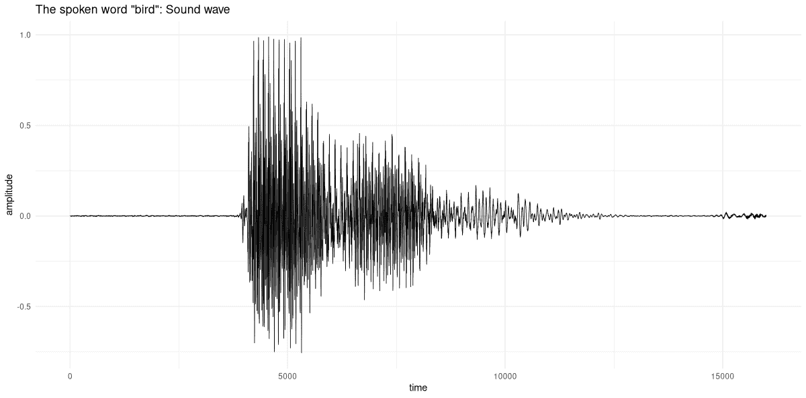

图 22.1：语音“鸟”在时域表示。

我们看到的是一个幅度序列，反映了某人说出“鸟”这个单词时产生的声波。换句话说，我们这里有一个“响度值”的时间序列。即使是专家，猜测*哪个*单词导致了这些幅度也是一个不可能的任务。这就是领域知识相关的地方。专家可能无法从这种表示中获取太多信号；但他们可能知道一种更有效地表示它的方法。

到目前为止，你可能正在想：好吧；但仅仅因为这项任务对人类来说是不可能的，并不意味着对机器也是不可能的！毕竟，神经网络和人类处理信息的方式非常不同。也许一个经过这些波训练的 RNN 可以学会正确地将它们映射到一组单词上！

这确实可能——你可能想尝试——但结果证明，有一种更好的方法，这种方法既满足了我们对理解的需求，又以最有效的方式使用了深度学习。

这种更好的方法归功于一个数学事实——至少对我来说——它永远不会停止激发敬畏和惊奇。
  
## 22.2 两种等效表示

想象一下，如果上述波不是作为随时间变化的幅度序列来表示，而是以完全没有时间信息的方式来表示。接下来，想象我们尝试从那种表示中恢复原始信号。为了做到这一点，新的表示必须以某种方式包含“同样多的”信息，就像我们开始的波一样。这种“同样多的”信息是通过*傅里叶变换*获得的，它由组成信号的各个*频率*的幅度和相位偏移组成。在第三部分，我们将对傅里叶变换进行大量的操作，所以在这里我会保持介绍简短。相反，我将专注于一旦我们到达最终的预处理步骤，将会产生的优雅的共生关系。但我们还没有到达那里。

首先，傅里叶变换后的“鸟”声波看起来是什么样子？我们通过调用`torch_fft_fft()`（其中`fft`代表快速傅里叶变换）来获得它：

```r
dft <- torch_fft_fft(sample$waveform)
dim(dft)
```

```r
[1]     1 16000
```

这个张量的长度是相同的；然而，它的值不是按时间顺序排列的。相反，它们代表的是*傅里叶系数*，对应于信号中包含的频率。它们的幅度越高，对信号的贡献就越大（图 22.2）：

```r
mag <- torch_abs(dft[1, ])

df <- data.frame(
 x = 1:(length(sample$waveform[1]) / 2),
 y = as.numeric(mag[1:8000])
)

ggplot(df, aes(x = x, y = y)) +
 geom_line(size = 0.3) +
 ggtitle(
 paste0(
 "The spoken word \"",
 sample$label,
 "\": Discrete Fourier Transform"
 )
 ) +
 xlab("frequency") +
 ylab("magnitude") +
 theme_minimal()
```

*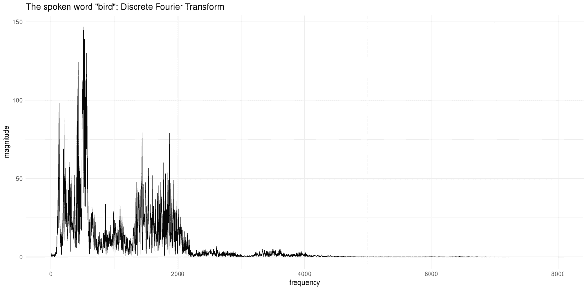

图 22.2：语音“鸟”在频域表示。

从这个表示方法出发，我们可以通过取信号中存在的频率，根据它们的系数进行加权，并将它们相加，回到原始的声波。（这种相反的方向被称为**逆傅里叶变换**，在`torch`中可用`torch_fft_ifft()`实现。）

这本身非常令人着迷；但它如何帮助我们完成音频信号的分类任务呢？如果我们直接处理声波本身，我们会将它们输入到 RNN 中。对于频率来说，没有递归关系；所以 RNN 不是一个选择。然后我们可以使用前馈神经网络。但有一个理由预期这会特别有效。**22.3 结合表示：声谱图**

事实上，真正能帮助我们的是这两种表示方法的综合；某种“既要鱼又要熊掌”的方法。如果我们能将信号分成小块，并对每一块进行傅里叶变换，会怎么样呢？正如你可能从前面的引导中猜到的，这确实是我们能做的事情；它所创建的表示方法被称为**声谱图**。

使用声谱图，我们仍然保留一些时域信息——一些，因为不可避免地会有粒度损失。另一方面，对于每个时间段，我们了解它们的频谱组成。不过，有一个重要的问题需要指出。我们在**时间**和**频率**上得到的分辨率是成反比的。如果我们把信号分成很多块（称为“窗口”），每个窗口的频率表示将不会非常细粒度。相反，如果我们想在频率域中获得更好的分辨率，我们必须选择更长的窗口，从而失去关于频谱组成随时间变化的信息。因此，我们似乎只能吃**一半**的蛋糕，并享受另一半的景象。

好吧，到目前为止所说的都是正确的；但正如你将看到的，这远没有现在看起来那么成问题。

在揭示这个秘密之前，让我们为我们的示例信号创建并检查这样一个声谱图。在下面的代码片段中，重叠窗口的大小被选择，以便在时间和频率域中都有合理的粒度。我们剩下六十三个窗口，并且对于每个窗口，我们获得二百五十七个系数：

```r
fft_size <- 512
window_size <- 512
power <- 0.5

spectrogram <- transform_spectrogram(
 n_fft = fft_size,
 win_length = window_size,
 normalized = TRUE,
 power = power
)

spec <- spectrogram(sample$waveform)$squeeze()
dim(spec)
```

```r
[1]   257 63
```

我们可以直观地显示声谱图（图 22.3）：

```r
bins <- 1:dim(spec)[1]
freqs <- bins / (fft_size / 2 + 1) * sample$sample_rate 
log_freqs <- log10(freqs)

frames <- 1:(dim(spec)[2])
seconds <- (frames / dim(spec)[2]) *
 (dim(sample$waveform$squeeze())[1] / sample$sample_rate)

image(x = as.numeric(seconds),
 y = log_freqs,
 z = t(as.matrix(spec)),
 ylab = 'log frequency [Hz]',
 xlab = 'time [s]',
 col = hcl.colors(12, palette = "Light grays")
)
main <- paste0("Spectrogram, window size = ", window_size)
sub <- "Magnitude (square root)"
mtext(side = 3, line = 2, at = 0, adj = 0, cex = 1.3, main)
mtext(side = 3, line = 1, at = 0, adj = 0, cex = 1, sub)
```

*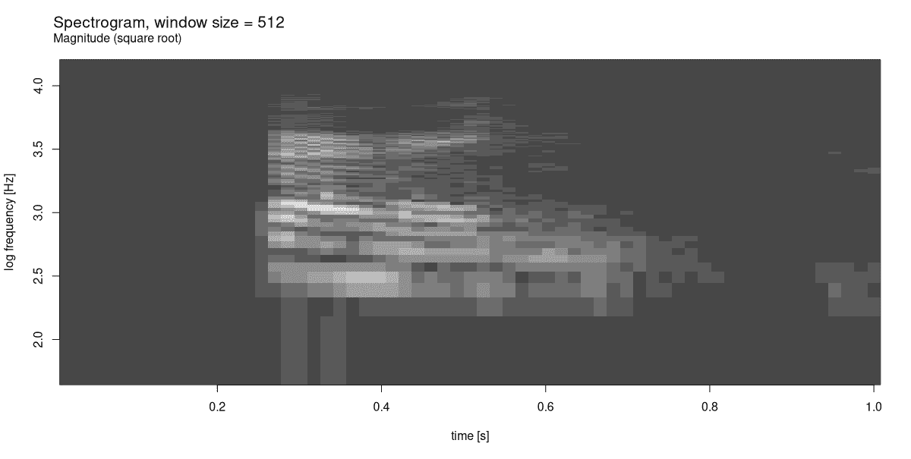

图 22.3：语音“bird”的声谱图。

我们知道我们在时间和频率上丢失了一些分辨率。通过显示系数幅度的平方根——从而增强灵敏度——我们仍然能够获得一个合理的结果。（使用 `浅灰色` 色彩方案，较亮的色调表示较高值的系数；较暗的色调则相反。）

最后，让我们回到关键问题。如果这种表示形式不可避免地是一种妥协——那么，为什么我们还想采用它呢？这就是我们采取深度学习视角的地方。频谱图是一种二维表示：一个图像。对于图像，我们有丰富的技术和架构资源——在深度学习取得成功的所有领域，图像识别仍然突出。很快，你就会看到，对于这个任务，复杂的架构甚至都不是必需的；一个简单的卷积神经网络就能做得很好。**  **## 22.4 训练音频分类模型

计划如下。我们将从头到尾训练一个基线模型，这个模型本身已经表现出色。尽管如此，我们仍将尝试两种想法，看看是否可以改进这个基线。如果结果证明并非如此，我们仍然会学到一些重要的技术。

### 22.4.1 基线设置：在频谱图上训练卷积神经网络

我们首先创建一个 `torch::dataset()`，它从原始的 `speechcommand_dataset()` 开始，为每个样本计算频谱图。

```r
spectrogram_dataset <- dataset(
 inherit = speechcommand_dataset,
 initialize = function(...,
 pad_to = 16000,
 sampling_rate = 16000,
 n_fft = 512,
 window_size_seconds = 0.03,
 window_stride_seconds = 0.01,
 # power = 2 is default for
 # transform_spectrogram()
 # we stay with the default for now,
 # but will make use of this option later
 power = 2,
 # this too will be explained later
 n_mels = 0) {
 self$pad_to <- pad_to
 self$window_size_samples <- sampling_rate *
 window_size_seconds
 self$window_stride_samples <- sampling_rate *
 window_stride_seconds
 self$power <- power
 if (n_mels == 0) {
 self$spectrogram <- transform_spectrogram(
 n_fft = n_fft,
 win_length = self$window_size_samples,
 hop_length = self$window_stride_samples,
 normalized = TRUE,
 power = self$power
 )
 } else {
 self$spectrogram <- transform_mel_spectrogram(
 n_fft = n_fft,
 win_length = self$window_size_samples,
 hop_length = self$window_stride_samples,
 normalized = TRUE,
 power = self$power,
 n_mels = n_mels
 )
 }
 super$initialize(...)
 },
 .getitem = function(i) {
 item <- super$.getitem(i)

 x <- item$waveform
 # make sure all samples have the same length (57)
 # shorter ones will be padded,
 # longer ones will be truncated
 x <- nnf_pad(x, pad = c(0, self$pad_to - dim(x)[2]))
 x <- x %>% self$spectrogram()

 if (is.null(self$power)) {
 # there is an additional dimension now,
 # in position 4,
 # that we want to appear in front
 # (as a second channel)
 x <- x$squeeze()$permute(c(3, 1, 2))
 }

 y <- item$label_index
 list(x = x, y = y)
 }
)
```

*像往常一样，我们立即检查是否一切正常：

```r
ds <- spectrogram_dataset(
 root = "~/.torch-datasets",
 url = "speech_commands_v0.01",
 download = TRUE
)

dim(ds[1]$x)
ds[1]$y
```

```r
[1]   1 257 101
torch_tensor
1
[ CPULongType{} ]
```

接下来，我们将数据拆分，并实例化 `dataset()` 和 `dataloader()` 对象。

```r
train_ids <- sample(
 1:length(ds),
 size = 0.6 * length(ds)
)
valid_ids <- sample(
 setdiff(
 1:length(ds),
 train_ids
 ),
 size = 0.2 * length(ds)
)
test_ids <- setdiff(
 1:length(ds),
 union(train_ids, valid_ids)
)

batch_size <- 128

train_ds <- dataset_subset(ds, indices = train_ids)
train_dl <- dataloader(
 train_ds,
 batch_size = batch_size, shuffle = TRUE
)

valid_ds <- dataset_subset(ds, indices = valid_ids)
valid_dl <- dataloader(
 valid_ds,
 batch_size = batch_size
)

test_ds <- dataset_subset(ds, indices = test_ids)
test_dl <- dataloader(test_ds, batch_size = 64)

b <- train_dl %>%
 dataloader_make_iter() %>%
 dataloader_next()

dim(b$x)
```

```r
[1] 128   1 257 101
```

正如我说的，这个模型是一个简单的卷积神经网络，带有 dropout 和批量归一化。

```r
model <- nn_module(
 initialize = function() {
 self$features <- nn_sequential(
 nn_conv2d(1, 32, kernel_size = 3),
 nn_batch_norm2d(32),
 nn_relu(),
 nn_max_pool2d(kernel_size = 2),
 nn_dropout2d(p = 0.2),
 nn_conv2d(32, 64, kernel_size = 3),
 nn_batch_norm2d(64),
 nn_relu(),
 nn_max_pool2d(kernel_size = 2),
 nn_dropout2d(p = 0.2),
 nn_conv2d(64, 128, kernel_size = 3),
 nn_batch_norm2d(128),
 nn_relu(),
 nn_max_pool2d(kernel_size = 2),
 nn_dropout2d(p = 0.2),
 nn_conv2d(128, 256, kernel_size = 3),
 nn_batch_norm2d(256),
 nn_relu(),
 nn_max_pool2d(kernel_size = 2),
 nn_dropout2d(p = 0.2),
 nn_conv2d(256, 512, kernel_size = 3),
 nn_batch_norm2d(512),
 nn_relu(),
 nn_adaptive_avg_pool2d(c(1, 1)),
 nn_dropout2d(p = 0.2)
 )

 self$classifier <- nn_sequential(
 nn_linear(512, 512),
 nn_batch_norm1d(512),
 nn_relu(),
 nn_dropout(p = 0.5),
 nn_linear(512, 30)
 )
 },
 forward = function(x) {
 x <- self$features(x)$squeeze()
 x <- self$classifier(x)
 x
 }
)
```

*训练这个模型一个好的学习率是多少 (图 22.4)？

```r
model <- model %>%
 setup(
 loss = nn_cross_entropy_loss(),
 optimizer = optim_adam,
 metrics = list(luz_metric_accuracy())
 )

rates_and_losses <- model %>%
 lr_finder(train_dl)
rates_and_losses %>% plot()
```

*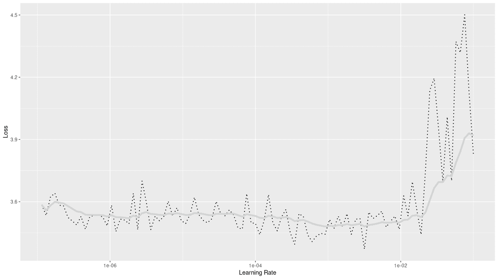

图 22.4：基线模型上的学习率查找器。

根据图表，我决定使用 0.01 作为最大学习率。

```r
fitted <- model %>%
 fit(train_dl,
 epochs = 50, valid_data = valid_dl,
 callbacks = list(
 luz_callback_early_stopping(patience = 3),
 luz_callback_lr_scheduler(
 lr_one_cycle,
 max_lr = 1e-2,
 epochs = 50,
 steps_per_epoch = length(train_dl),
 call_on = "on_batch_end"
 ),
 luz_callback_model_checkpoint(path = "models_baseline/"),
 luz_callback_csv_logger("logs_baseline.csv")
 ),
 verbose = TRUE
 )

plot(fitted)
```

*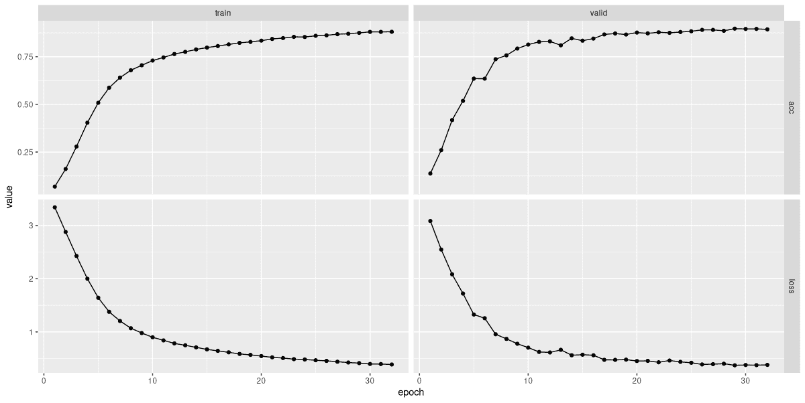

图 22.5：基线模型的拟合。

模型训练在三十二次迭代后停止 (图 22.5)。以下是日志的摘录：

```r
"epoch","set","loss","acc"

1,"train",3.34194613126368,0.0687577255871446
1,"valid",3.08480389211692,0.137438195302843
2,"train",2.87943273042542,0.161155747836836
2,"valid",2.54789054393768,0.260275030902349
3,"train",2.42715575726204,0.279048207663782
3,"valid",2.08232365753136,0.417567985166873
...
...
30,"train",0.397343056799929,0.880098887515451
30,"valid",0.3777267414273,0.895395550061805
31,"train",0.395276123743042,0.880073135558302
31,"valid",0.375300966641482,0.895781829419036
32,"train",0.387298851523524,0.880691182529872
32,"valid",0.379925572989034,0.89323238566131
```

在三十个类别中，大约八十九 percent 的准确率似乎还不错。我们在测试集上再次确认：

```r
evaluate(fitted, test_dl)
```

```r
loss: 0.3776
acc: 0.8898
```

一个有趣的问题是哪些单词最容易被混淆。（当然，更有趣的是错误概率与频谱图特征的关系——但这一点我们只能留给真正的领域专家。）

显示混淆矩阵的一个好方法是创建累积图（图 22.6）。我们看到预测结果在左侧，“流入”目标槽位。（测试集基数小于千分之一的目标-预测对被隐藏。）

```r
preds_baseline <- predict(fitted, test_dl)
preds_baseline <-
 torch_argmax(preds_baseline, dim = 2) %>%
 as.numeric()

test_dl <- dataloader(
 test_ds,
 batch_size = length(test_ds)
)
b <- test_dl %>%
 dataloader_make_iter() %>%
 dataloader_next()
targets_baseline <- b$y$to(device = "cpu") %>%
 as.numeric()

df_baseline <- data.frame(
 preds = preds_baseline,
 targets = targets_baseline
)

classes <- speechcommand_ds$classes

df <- df_baseline %>%
 mutate(correct = preds == targets) %>%
 mutate(
 preds = classes[preds],
 targets = classes[targets]
 ) %>%
 count(preds, targets, correct)

library(alluvial)
alluvial(
 df %>% select(preds, targets),
 freq = df$n,
 col = ifelse(df$correct, "#d1d1d1", "#aaaaaa"),
 border = ifelse(df$correct, "#d1d1d1", "#aaaaaa"),
 hide = df$n < nrow(df_baseline) / 1000
)
```

*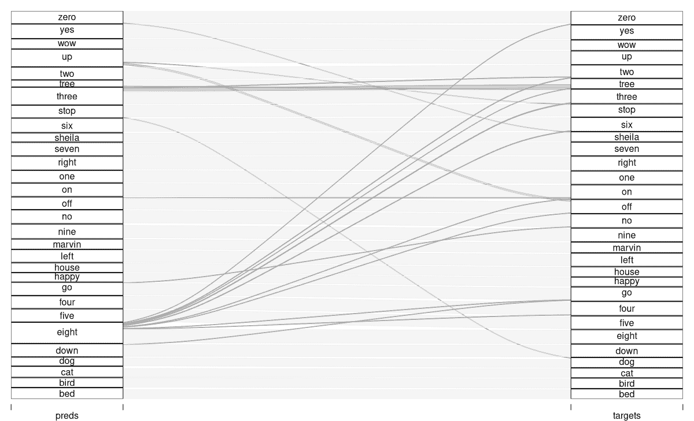

图 22.6：累积图，说明哪些类别最常被混淆。

基线方法就到这里。让我们看看我们是否还能做得更好。
  
### 22.4.2 变化一：使用梅尔尺度频谱图

在经典语音识别中，人们并不一定将预处理限制在傅里叶变换和频谱图上。曾经使用或可能使用的其他步骤，其中一些在神经网络被使用后似乎已经过时。尽管如此，至少有一种技术，很难事先判断它是否有帮助。

由于我们的听觉系统构建方式，人类在频率范围内感知差异的准确性并不相同。例如，一方面，440 Hz 和 480 Hz 之间的距离，另一方面，8000 Hz 和 8040 Hz 之间的距离在数学上是相同的，但后者将更难以感知。（这一点与其他感知模式没有不同——区分一公斤和两公斤很容易，而区分十四公斤和十五公斤则相对困难。

为了适应这种生理先决条件，有时会将傅里叶系数转换为所谓的 *梅尔尺度*。存在各种公式来完成这项工作；以这种方式或那种方式，它们总是包括取对数。但在实践中，通常的做法是创建重叠的滤波器，将傅里叶系数的集合聚合到一个新的表示形式，即梅尔系数。在低频范围内，滤波器较窄，只包含非常少的傅里叶系数。然后，它们依次变宽，直到在非常高频范围内，广泛的傅里叶系数会贡献到一个单一的梅尔值。

我们可以使用 `torch` 辅助函数 `functional_create_fb_matrix()` 来使这一点更加具体。这个函数的作用是从傅里叶空间到梅尔空间的转换矩阵：

c

```r
fb <- functional_create_fb_matrix(
 n_freqs = 257,
 f_min = 0,
 f_max = 8000,
 n_mels = 16,
 sample_rate = 16000
)
dim(fb)
```

```r
[1] 257  16
```

在我们的应用中，我们将使用具有一百二十八系数的梅尔频谱图；鉴于我们正在训练卷积神经网络，我们不想过多地降低空间分辨率。但使用较少的滤波器进行可视化更有帮助——这就是为什么上面我告诉 `torch` 只生成十六个滤波器。这里它们是（图 22.7）：

```r
df <- as_tibble(as.matrix(fb)) %>%
 rowid_to_column("x")

df %>%
 pivot_longer(!x) %>%
 ggplot(
 aes(x = x, y = value, color = name, group = name)
 ) +
 geom_line() +
 xlab("Fourier coefficient") +
 ylab("Contribution to Mel coefficient") +
 theme_minimal() +
 theme(legend.position = "None")
```

*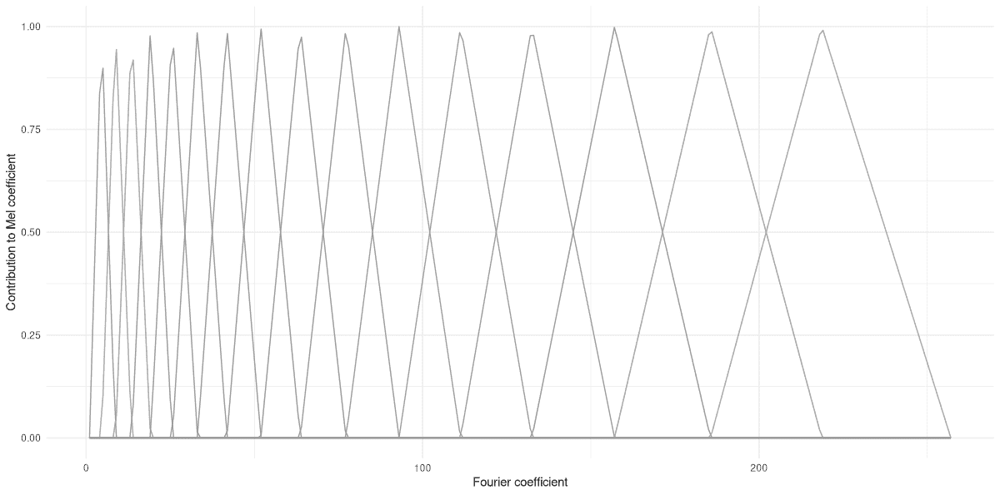

图 22.7：梅尔滤波器组，包含十六个滤波器，应用于 257 个傅里叶系数。

从这张图中，应该可以理解梅尔尺度变换是如何设计用来补偿高频范围内较低的感知分辨率的。

当然，为了使用梅尔频谱图，你不需要自己生成滤波器组。对于训练，我们只需将 `transform_spectrogram()` 替换为 `transform_mel_spectrogram()`。但有时，玩弄辅助函数可以显著帮助理解。例如，使用另一个低级实用工具——`functional_mel_scale()`——我们可以将一组傅里叶系数转换为梅尔尺度，并进行比较。

这里，我选取了样本 2000 的频谱图——我们的“鸟”——并选择了一个感兴趣的时间窗口。然后我使用 `functional_mel_scale()` 获取相应的梅尔尺度表示，并将这两组系数的幅度相互对比（仅显示傅里叶系数的前一半）(图 22.8)：

```r
sample_spec <- ds[2000]$x
win_31 <- sample_spec[1, , 31]

mel_31 <- win_31$unsqueeze(2) %>%
 functional_mel_scale(n_mel = 128)

df <- data.frame(
 coefficient = 1:128,
 fourier = as.numeric(win_31[1:128]),
 mel = as.numeric(mel_31)
)

df %>%
 pivot_longer(
 !coefficient,
 names_to = "type", values_to = "magnitude"
 ) %>%
 ggplot(
 aes(x = coefficient, y = magnitude, color = type)
 ) +
 geom_line() +
 theme_minimal()
```

*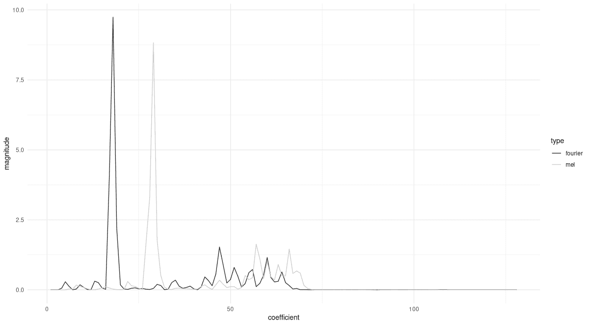

图 22.8：在“鸟”频谱图的一个窗口上比较傅里叶和梅尔系数。

最后，在回到任务之前，让我们快速验证调用 `functional_mel_scale()` 是否等同于手动构建滤波器组并将结果矩阵与傅里叶系数相乘。为此，我们现在创建一个 257 x 128 的矩阵，并将其应用于我们上面提取的频谱图窗口。结果应该相等（除了小的数值误差）：

```r
fb <- functional_create_fb_matrix(
 n_freqs = 257,
 f_min = 0,
 f_max = 8000,
 n_mels = 128,
 sample_rate = 16000
)

(fb$t()$matmul(win_31) - mel_31[1, , 1]) %>%
 torch_max()
```

```r
torch_tensor
5.96046e-08
[ CPUFloatType{} ]
```

现在我们已经了解了梅尔尺度变换的工作原理，并且可能对它是否有助于训练有一个直观的感觉：让我们实际找出答案。必要的修改很少；只涉及 `spectrogram_dataset()` 的参数列表：

```r
ds <- spectrogram_dataset(
 root = "~/.torch-datasets",
 url = "speech_commands_v0.01",
 download = TRUE,
 n_mels = 128
)
```

*模型以及训练代码保持不变。学习率查找器的输出也看起来相当相似 (图 22.9)：

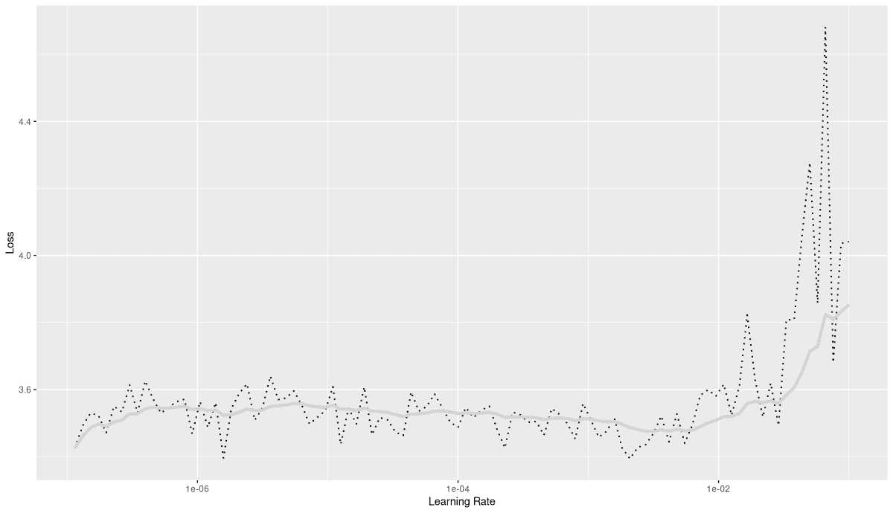

图 22.9：在梅尔变换增强的模型上运行的学习率查找器。

使用与之前相同的学习率，我看到了训练在十九个周期后结束 (图 22.10)。

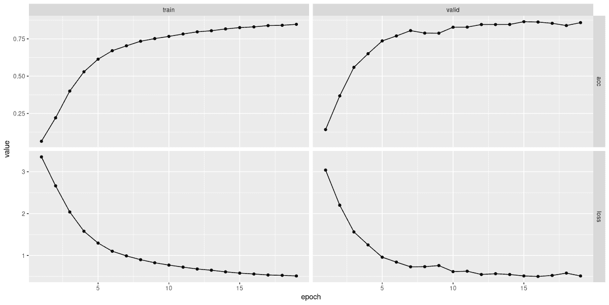

图 22.10：拟合 Mel 变换增强模型。

最终验证准确率约为 0.86，略低于基线模型。

```r
"epoch","set","loss","acc"
1,"train",3.35417570164001,0.0639678615574784
1,"valid",3.03987254348456,0.142228059332509
2,"train",2.6629929004931,0.220874536464771
2,"valid",2.20017999761245,0.367815203955501
3,"train",2.03871287512623,0.400262669962917
3,"valid",1.56310861835293,0.559100741656366
...
...
17,"train",0.534631294167899,0.838715492377421
17,"valid",0.524456901585355,0.854063658838072
18,"train",0.526362751336659,0.840801400906469
18,"valid",0.58039141460961,0.839076019777503
19,"train",0.511069792840216,0.847059126493613
19,"valid",0.511746386686961,0.858544499381953
```

因此，在这个任务中，没有看到通过 Mel 变换带来的改进。但重要的是，我们要意识到这个选项，这样在其他项目中，我们可能会尝试这个技术。

为了完整性，这里再次对测试集进行核对。

```r
evaluate(fitted, test_dl)
```

```r
loss: 0.5081
acc: 0.8555
```

没有惊喜。有趣的是，这次混淆矩阵看起来相当不同，这暗示了内部工作的变化(图 22.11)。（当然，为了确保这一点，我们可能需要运行每个版本几次。）

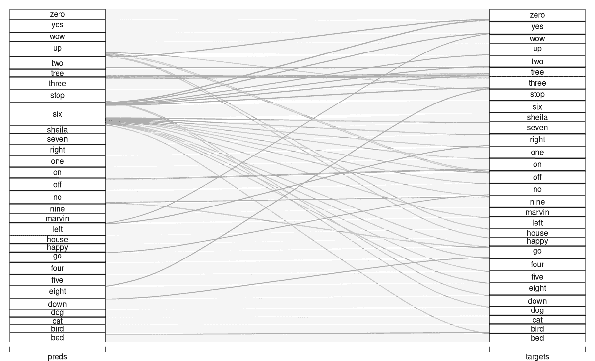

图 22.11：Mel 变换增强设置的冲积图

将进一步的探索留给专家，我们继续到最后一个替代方案。
  
### 22.4.3 变体二：复值频谱图

在引入频谱图时，我专注于它们的二维结构：对一组（重叠的）窗口独立执行傅里叶变换，留下一个网格，其中时间切片和傅里叶系数按行和列排列。我们发现，这个网格可以被看作是一种图像。我没有详细说明的是那个网格中实际包含的值。傅里叶系数是复值的，因此，如果单独考虑，就需要在二维空间中绘制——然后，频谱图反过来就需要是三维的。在实践中，为了显示（和其他）目的，人们经常使用系数的幅度，或者这些幅度的平方。

也许你已经注意到`transform_spectrogram()`函数接受一个参数`power`，我还没有对其进行注释。这个参数允许你指定你是否希望使用平方幅度`(power = 2`，默认值)，绝对值(`power = 1`)，任何其他正数值（例如`0.5`，我们在显示具体示例时使用的值）——或者系数的实部和虚部(`power = NULL`)。到目前为止，我们一直使用默认值。但我们完全可能想知道神经网络是否能从包含在“整个”复数中的额外信息中受益。毕竟，当我们减少到幅度时，我们失去了单个系数的相位变化，这些变化可能包含可用的信息。无论如何，值得一试！

在技术方面，必要的修改（再次）是最小的。调用`spectrogram_dataset()`现在使用了`power`参数。指定`power = NULL`，我们明确请求傅里叶系数的实部和虚部。想法是将它们作为两个单独的*通道*传递给模型的初始`nn_conv2d()`。

```r
ds <- spectrogram_dataset(
 root = "~/.torch-datasets",
 url = "speech_commands_v0.01",
 download = TRUE,
 power = NULL
)

dim(ds[1]$x)
```

```r
[1]   2 257 101
```

相应地，第一个卷积模块现在被设置为处理双通道输入。

```r
model <- nn_module(
 initialize = function() {
 self$features <- nn_sequential(
 nn_conv2d(2, 32, kernel_size = 3),
 nn_batch_norm2d(32),
 nn_relu(),
 nn_max_pool2d(kernel_size = 2),
 nn_dropout2d(p = 0.2),
 nn_conv2d(32, 64, kernel_size = 3),
 nn_batch_norm2d(64),
 nn_relu(),
 nn_max_pool2d(kernel_size = 2),
 nn_dropout2d(p = 0.2),
 nn_conv2d(64, 128, kernel_size = 3),
 nn_batch_norm2d(128),
 nn_relu(),
 nn_max_pool2d(kernel_size = 2),
 nn_dropout2d(p = 0.2),
 nn_conv2d(128, 256, kernel_size = 3),
 nn_batch_norm2d(256),
 nn_relu(),
 nn_max_pool2d(kernel_size = 2),
 nn_dropout2d(p = 0.2),
 nn_conv2d(256, 512, kernel_size = 3),
 nn_batch_norm2d(512),
 nn_relu(),
 nn_adaptive_avg_pool2d(c(1, 1)),
 nn_dropout2d(p = 0.2)
 )

 self$classifier <- nn_sequential(
 nn_linear(512, 512),
 nn_batch_norm1d(512),
 nn_relu(),
 nn_dropout(p = 0.5),
 nn_linear(512, 30)
 )
 },
 forward = function(x) {
 x <- self$features(x)$squeeze()
 x <- self$classifier(x)
 x
 }
)
```

*这是我在运行学习率查找器时看到的情况（图 22.12）：

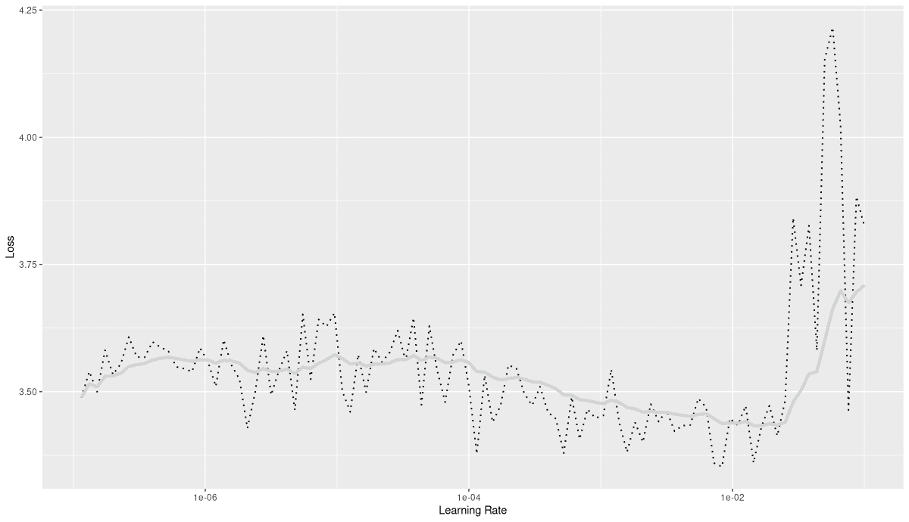

图 22.12：在复频谱模型上运行的学习率查找器。

这次，训练进行了四十个 epoch。

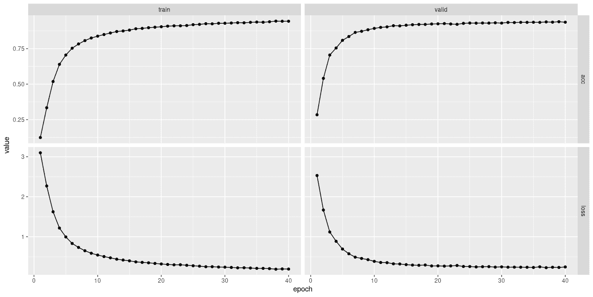

图 22.13：拟合复频谱模型。

从视觉上看，验证集的损失和准确率曲线比其他两种情况都要平滑（图 22.13）。检查准确率，我们发现：

```r
"epoch","set","loss","acc"
1,"train",3.09768574611813,0.12396992171405
1,"valid",2.52993751740923,0.284378862793572
2,"train",2.26747255972008,0.333642356819118
2,"valid",1.66693911248562,0.540791100123609
3,"train",1.62294889937818,0.518464153275649
3,"valid",1.11740599192825,0.704882571075402
...
...
38,"train",0.18717994078312,0.943809229501442
38,"valid",0.23587799138006,0.936418417799753
39,"train",0.19338578602993,0.942882159044087
39,"valid",0.230597475945365,0.939431396786156
40,"train",0.190593419024368,0.942727647301195
40,"valid",0.243536252455384,0.936186650185414
```

准确率达到~0.94，我们现在有了明显的改进。

我们可以在测试集上确认这一点：

```r
evaluate(fitted, test_dl)
```

```r
loss: 0.2373
acc: 0.9324
```

最后，混淆矩阵现在看起来像是基线运行的清理版本（图 22.14）。

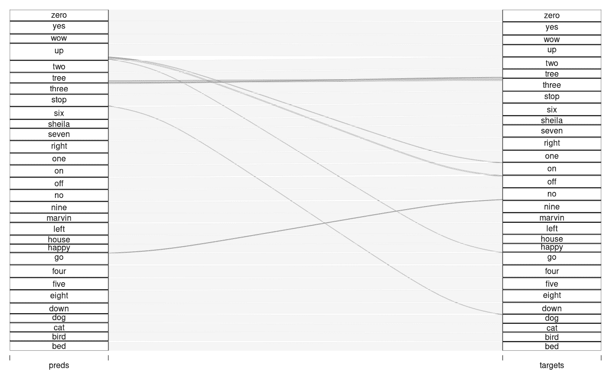

图 22.14：复频谱设置的侵蚀图。

我们可以安全地说，考虑到相位信息显著提高了性能。

通过这种方式，我们结束了深度学习应用的巡礼。但关于神奇的傅里叶变换，我们很快会深入探讨！

Warden, Pete. 2018. “语音命令：一个用于有限词汇语音识别的数据集。” *CoRR* abs/1804.03209. [`arxiv.org/abs/1804.03209`](http://arxiv.org/abs/1804.03209).

