# 26  探索离散傅里叶变换（DFT）

> 原文：[`skeydan.github.io/Deep-Learning-and-Scientific-Computing-with-R-torch/fourier_transform_dft.html`](https://skeydan.github.io/Deep-Learning-and-Scientific-Computing-with-R-torch/fourier_transform_dft.html)

这是第一本专门介绍傅里叶变换的章节，但并不是我们第一次遇到它。在卷积章节中，我顺便提到了，通常在傅里叶域中更经济地实现期望的结果，卷积变成了乘法。更重要的是，我们在音频分类章节中实际上*使用*了 DFT。在那里，对`torchaudio`的`transform_spectrogram()`的调用触发了对原始输入序列构建的一组重叠时间窗口上的大量傅里叶变换的计算。

在本章中，我们不会仅仅满足于调用`torch`提供的函数。相反，我们希望了解实际发生的情况。为此，我们探讨了傅里叶分析背后的思想，并以直接、字面的方式将它们翻译成`torch`。在下一章中，基于我们已经获得的理解，我们将通过实现快速傅里叶变换（FFTs）家族下的一个算法来提高性能。

## 26.1 理解`torch_fft_fft()`的输出

我们的探索从实际操作开始：我们调用与（正向）傅里叶变换相关的主要函数，`torch_fft_fft()` ¹，并看看我们是否能理解其输出。

由于我们关注的是真正的*理解*，所以我们从最简单的可能示例信号开始，即在整个采样周期内完成一次旋转的纯余弦波。

### 26.1.1 起始点：频率为 1 的余弦波

按照我们的设置，将有 64 个样本；因此采样周期等于`N = 64`。`frequency()`的内容，以下用于构建信号的辅助函数，反映了我们如何表示余弦波。具体来说：

$$ f(x) = cos(\frac{2 \pi}{N} \ k \ x) $$

在这里，$x$值随时间（或空间）变化，$k$是*频率索引*。余弦波是周期性的，周期为$2 \pi$；因此，如果我们希望它在 64 个样本后首先返回到其初始状态，并且$x$在零到 63 之间运行，我们将希望$k$等于 1。这样，我们将在位置$x = \frac{2 \pi}{64} * 1 * 64$再次达到初始状态。

```r
library(torch)
library(ggplot2)
library(patchwork)

N <- 64
sample_positions <- 0:(N - 1)

frequency <- function(k, N) {
 (2 * pi / N) * k
}

x <- torch_cos(frequency(1, N) * sample_positions)
```

*让我们快速确认这是否如预期的那样做了（图 26.1）：

```r
df <- data.frame(x = sample_positions, y = as.numeric(x))

ggplot(df, aes(x = x, y = y)) +
 geom_line() +
 xlab("time") +
 ylab("amplitude") +
 theme_minimal()
```

*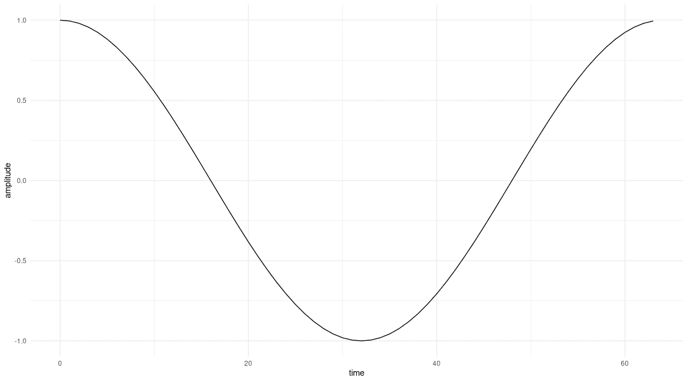

图 26.1：在整个采样周期（64 个样本）内完成一次完整旋转的纯余弦波。

现在我们有了输入信号，`torch_fft_fft()` 为我们计算傅里叶系数，即信号中各种频率的重要性。考虑的频率数量将等于采样点的数量：因此 $X$ 的长度也将是六十四。

（在我们的例子中，你会注意到系数的后半部分在幅度上将与前半部分相等。² 对于每个实值信号，情况都是如此。在这种情况下，你可以使用 `torch_fft_rfft()`，它会产生“更简洁”的（在意义上是更短的）向量来处理。然而，在这里，我想解释一般情况，因为这是你在大多数关于这个主题的阐述中会发现的情况。）

```r
Ft <- torch_fft_fft(x)
```

*即使信号是实数，傅里叶系数也是复数。有四种方法可以检查它们。第一种是提取实部：

```r
real_part <- Ft$real
as.numeric(real_part) %>% round(5)
```

```r
[1]  0 32 0 0 0 0 0 0 0 0 0 0 0 0 0 0 0 0 0 0 0 0 0 0 0 0 0 0
[29] 0 0 0 0 0 0 0 0 0 0 0 0 0 0 0 0 0 0 0 0 0 0 0 0 0 0 0 0 
[57] 0 0 0 0 0 0 0 32
```

只有一个系数是非零的，即位置 1 处的系数。（我们从零开始计数，并且可以丢弃上面解释的第二半部分。）

现在来看虚部，我们发现它始终为零：

```r
imag_part <- Ft$imag
as.numeric(imag_part) %>% round(5)
```

```r
[1]  0 0 0 0 0 0 0 0 0 0 0 0 0 0 0 0 0 0 0 0 0 0 0 0 0 0 0 0
[29] 0 0 0 0 0 0 0 0 0 0 0 0 0 0 0 0 0 0 0 0 0 0 0 0 0 0 0 0
[57] 0 0 0 0 0 0 0 0
```

在这一点上，我们知道信号中只存在一个频率，即 $k = 1$ 处的频率。这与（它必须如此）我们构建信号的方式相匹配：即在整个采样周期内完成一次完整的旋转。

由于理论上每个系数都可能具有非零的实部和虚部，通常你会报告的是幅度（实部和虚部平方和的平方根）：

```r
magnitude <- torch_abs(Ft)
as.numeric(magnitude) %>% round(5)
```

```r
[1]  0 32 0 0 0 0 0 0 0 0 0 0 0 0 0 0 0 0 0 0 0 0 0 0 0 0 0 0
[29] 0 0 0 0 0 0 0 0 0 0 0 0 0 0 0 0 0 0 0 0 0 0 0 0 0 0 0 0 
[57] 0 0 0 0 0 0 0 32
```

这些值正好反映了相应的实部。

最后，是相位，表示信号可能发生的偏移（纯余弦波没有偏移）。在 `torch` 中，我们有 `torch_angle()` 补充 `torch_abs()`，但在这里我们需要考虑舍入误差。我们知道，在除了一个情况之外的所有情况下，实部和虚部都是精确为零的；但由于计算机中数字表示的有限精度，实际值通常不会是零。相反，它们会非常小。如果我们取这些“假非零”中的一个，并将其除以另一个，就像在角度计算中发生的那样，结果可能会很大。为了避免这种情况发生，我们的自定义实现会在触发除法之前对两个输入进行四舍五入。

```r
phase <- function(Ft, threshold = 1e5) {
 torch_atan2(
 torch_abs(torch_round(Ft$imag * threshold)),
 torch_abs(torch_round(Ft$real * threshold))
 )
}

as.numeric(phase(Ft)) %>% round(5)
```

```r
[1]  0 0 0 0 0 0 0 0 0 0 0 0 0 0 0 0 0 0 0 0 0 0 0 0 0 0 0 0
[29] 0 0 0 0 0 0 0 0 0 0 0 0 0 0 0 0 0 0 0 0 0 0 0 0 0 0 0 0
[57] 0 0 0 0 0 0 0 0
```

如预期的那样，信号中没有相位偏移。

让我们可视化我们所发现的内容 (图 26.2)。

```r
create_plot <- function(x, y, quantity) {
 df <- data.frame(
 x_ = x,
 y_ = as.numeric(y) %>% round(5)
 )
 ggplot(df, aes(x = x_, y = y_)) +
 geom_col() +
 xlab("frequency") +
 ylab(quantity) +
 theme_minimal()
}

p_real <- create_plot(
 sample_positions,
 real_part,
 "real part"
)
p_imag <- create_plot(
 sample_positions,
 imag_part,
 "imaginary part"
)
p_magnitude <- create_plot(
 sample_positions,
 magnitude,
 "magnitude"
)
p_phase <- create_plot(
 sample_positions,
 phase(Ft),
 "phase"
)

p_real + p_imag + p_magnitude + p_phase
```

*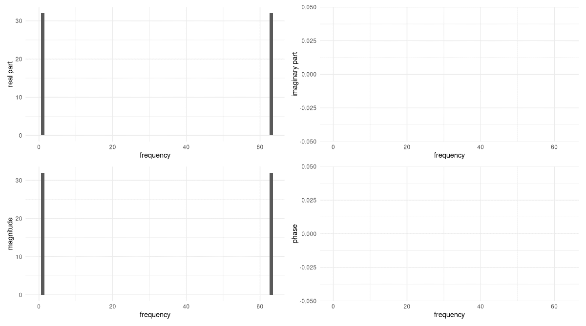

图 26.2：纯余弦波在采样周期内完成一次完整旋转时获得的傅里叶系数的实部、虚部、幅度和相位。虚部和相位都是零。

诚实地讲，我们没有理由怀疑`torch_fft_fft()`函数所做的工作。但是，对于这样一个纯正弦波，我们可以通过自己手动计算 DFT 来确切地了解正在发生什么。现在这样做将大大有助于我们以后编写代码。
  
### 26.1.2 重建魔法

关于本节有一个注意事项。对于一个像傅里叶变换这样丰富的主题，以及一个我设想在数学和科学教育维度上差异很大的受众，我满足您期望的机会几乎为零。尽管如此，我还是想冒险一试。如果您是这些领域的专家，您无论如何也只是在扫描文本，寻找`torch`代码的片段。如果您对 DFT 比较熟悉，您可能仍然喜欢回顾其内部工作原理。最重要的是——如果您对这个主题相对较新，甚至完全陌生——您可能会得到（至少）一点收获：看似宇宙中最大的奇迹之一（假设我们的现实与我们的思维活动以某种方式相对应）可能确实是一个**奇迹**，但既不是“魔法”也不是只有内行人才能理解的东西。

简而言之，傅里叶变换是一种**基变换**。在离散傅里叶变换（DFT）的情况下——时间域和频率域都表示为有限向量，而不是函数——新的基看起来是这样的：

$$ \begin{aligned} &\mathbf{w}^{0n}_N = e^{i\frac{2 \pi}{N}* 0 * n} = 1\\ &\mathbf{w}^{1n}_N = e^{i\frac{2 \pi}{N}* 1 * n} = e^{i\frac{2 \pi}{N} n}\\ &\mathbf{w}^{2n}_N = e^{i\frac{2 \pi}{N}* 2 * n} = e^{i\frac{2 \pi}{N}2n}\\& ... \\ &\mathbf{w}^{(N-1)n}_N = e^{i\frac{2 \pi}{N}* (N-1) * n} = e^{i\frac{2 \pi}{N}(N-1)n}\\ \end{aligned} $$

这里$N$，像之前一样，是样本数（在我们的例子中是 64）；因此，有$N$个基向量。随着$k$遍历基向量，它们可以写成：

$$ \mathbf{w}^{kn}_N = e^{i\frac{2 \pi}{N}k n} \tag{26.1}$$

与$k$一样，$n$从$0$运行到$N-1$。为了理解这些基向量在做什么，暂时切换到一个较短的采样周期，比如$N = 4$，是有帮助的。如果我们这样做，我们就有四个基向量：$\mathbf{w}^{0n}_N$、$\mathbf{w}^{1n}_N$、$\mathbf{w}^{2n}_N$和$\mathbf{w}^{3n}_N$。第一个看起来是这样的：

$$ \mathbf{w}^{0n}_N = \begin{bmatrix} e^{i\frac{2 \pi}{4}* 0 * 0}\\ e^{i\frac{2 \pi}{4}* 0 * 1}\\ e^{i\frac{2 \pi}{4}* 0 * 2}\\ e^{i\frac{2 \pi}{4}* 0 * 3} \end{bmatrix} = \begin{bmatrix} 1\\ 1\\ 1\\ 1\\ \end{bmatrix} $$

第二个，如下所示：

$$ \mathbf{w}^{1n}_N = \begin{bmatrix} e^{i\frac{2 \pi}{4}* 1 * 0}\\ e^{i\frac{2 \pi}{4}* 1 * 1}\\ e^{i\frac{2 \pi}{4}* 1 * 2}\\ e^{i\frac{2 \pi}{4}* 1 * 3} \end{bmatrix} = \begin{bmatrix} 1\\ e^{i\frac{\pi}{2}}\\ e^{i \pi}\\ e^{i\frac{3 \pi}{4}} \end{bmatrix} = \begin{bmatrix} 1\\ i\\ -1\\ -i\\ \end{bmatrix} $$

这是第三个：

$$ \mathbf{w}^{2n}_N = \begin{bmatrix} e^{i\frac{2 \pi}{4}* 2 * 0}\\ e^{i\frac{2 \pi}{4}* 2 * 1}\\ e^{i\frac{2 \pi}{4}* 2 * 2}\\ e^{i\frac{2 \pi}{4}* 2 * 3} \end{bmatrix} = \begin{bmatrix} 1\\ e^{i\pi}\\ e^{i 2 \pi}\\ e^{i\frac{3 \pi}{2}} \end{bmatrix} = \begin{bmatrix} 1\\ -1\\ 1\\ -1\\ \end{bmatrix} $$

最后，第四个：

$$ \mathbf{w}^{3n}_N = \begin{bmatrix} e^{i\frac{2 \pi}{4}* 3 * 0}\\ e^{i\frac{2 \pi}{4}* 3 * 1}\\ e^{i\frac{2 \pi}{4}* 3 * 2}\\ e^{i\frac{2 \pi}{4}* 3 * 3} \end{bmatrix} = \begin{bmatrix} 1\\ e^{i\frac{3 \pi}{2}}\\ e^{i 3 \pi}\\ e^{i\frac{9 \pi}{2}} \end{bmatrix} = \begin{bmatrix} 1\\ -i\\ -1\\ i\\ \end{bmatrix} $$

我们可以用它们的“速度”来描述这四个基向量：它们围绕单位圆移动的速度有多快。要做到这一点，我们只需看看最右边的列向量，那里最终的计算结果出现。该列中的值对应于旋转基向量在不同时间点的指向。这意味着，通过观察单个“位置更新”，我们可以看到向量在单个时间步长内移动的速度。

首先看看 $\mathbf{w}^{0n}_N$，我们看到它根本不动。$\mathbf{w}^{1n}_N$ 从 $1$ 到 $i$ 到 $-1$ 到 $-i$；再走一步，它就会回到起点。这是四步完成一次旋转，或者步长为 $\frac{\pi}{2}$。然后 $\mathbf{w}^{2n}_N$ 以两倍的速度移动，沿着圆周移动的距离为 $\pi$。这样，它总共完成了两次旋转。最后，$\mathbf{w}^{3n}_N$ 完成了三个完整的循环，步长为 $\frac{3 \pi}{2}$。

这些基向量之所以如此有用，是因为它们是相互正交的。也就是说，它们的点积为零：

$$ \langle \mathbf{w}^{kn}_N, \mathbf{w}^{ln}_N \rangle \ = \ \sum_{n=0}^{N-1} ({e^{i\frac{2 \pi}{N}k n}})^* e^{i\frac{2 \pi}{N}l n} = \ \sum_{n=0}^{N-1} ({e^{-i\frac{2 \pi}{N}k n}})e^{i\frac{2 \pi}{N}l n} = 0 \tag{26.2}$$

让我们以 $\mathbf{w}^{2n}_N$ 和 $\mathbf{w}^{3n}_N$ 为例。确实，它们的点积等于零。

$$ \begin{bmatrix} 1 & -1 & 1 & -1\\ \end{bmatrix} \begin{bmatrix} 1\\ -i\\ -1\\ i\\ \end{bmatrix} = 1 + i + (-1) + (-i) = 0 $$

现在，我们将看到傅里叶基的正交性如何大大简化 DFT 的计算。你注意到这些基向量与我们写示例信号的方式之间的相似性了吗？这里再次展示：

$$ f(x) = cos(\frac{2 \pi}{N} k x) $$

如果我们能够用基向量 $\mathbf{w}^{kn}_N = e^{i\frac{2 \pi}{N}k n}$ 来表示这个函数，那么该函数与每个基向量的内积将是零（“默认值”）或一的一个倍数（如果函数有一个与所讨论的基向量匹配的分量）。幸运的是，正弦和余弦可以很容易地转换为复指数。在我们的例子中，就是这样进行的：³

$$ \begin{aligned} \mathbf{x}_n &= cos(\frac{2 \pi}{64} n) \\ &= \frac{1}{2} (e^{i\frac{2 \pi}{64} n} + e^{-i\frac{2 \pi}{64} n}) \\ &= \frac{1}{2} (e^{i\frac{2 \pi}{64} n} + e^{i\frac{2 \pi}{64} 63n}) \\ &= \frac{1}{2} (\mathbf{w}^{1n}_N + \mathbf{w}^{63n}_N) \end{aligned} $$

这里第一步直接来自欧拉公式⁴，第二步反映了傅里叶系数的周期性，频率 -1 与 63 相同，-2 等于 62，依此类推。

现在，第 $k$ 个傅里叶系数是通过将信号投影到基向量 $k$ 上获得的。

由于基向量正交，只有两个系数不会为零：分别是 $\mathbf{w}^{1n}_N$ 和 $\mathbf{w}^{63n}_N$ 的系数。它们是通过计算函数与相关基向量的内积获得的，即通过求和 $n$ 得到的。对于 $0$ 到 $N-1$ 之间的每个 $n$，我们有一个 $\frac{1}{2}$ 的贡献，使得两个系数的最终和为 $32$。例如，对于 $\mathbf{w}^{1n}_N$：

$$ \begin{aligned} X_1 &= \langle \mathbf{w}^{1n}_N, \mathbf{x}_n \rangle \\ &= \langle \mathbf{w}^{1n}_N, \frac{1}{2} (\mathbf{w}^{1n}_N + \mathbf{w}^{63n}_N) \rangle \\ &= \frac{1}{2} * 64 \\ &= 32 \end{aligned} $$

对于 $X_{63}$ 也是类似的。

现在，回顾一下 `torch_fft_fft()` 给我们的结果，我们看到我们能够得到相同的结果。而且我们在过程中学到了一些东西。

只要我们处理由一个或多个基向量组成的信号，我们就可以用这种方法计算 DFT。在本章的结尾，我们将开发适用于所有信号的代码，但首先，让我们看看我们是否可以更深入地了解 DFT 的工作原理。我们将探索三个问题：

+   如果频率发生变化会怎样呢——比如说，旋律以更高的音调演唱？

+   那么，关于振幅变化呢——比如说，音乐被播放得声音大了一倍？

+   那么，关于相位——例如，在作品开始之前有一个偏移量？

在所有情况下，我们只有在自己确定结果后才会调用 `torch_fft_fft()`。

最后，我们将看到由不同成分组成的复正弦波，只要它们可以用构成基的频率来表示，仍然可以用这种方法进行分析。

### 26.1.3 频率变化

假设我们将频率增加到四倍，得到一个看起来像这样的信号：

$$ \mathbf{x}_n = cos(\frac{2 \pi}{N}*4*n) $$

按照上述相同的逻辑，我们可以这样表示：

$$ \mathbf{x}_n = \frac{1}{2} (\mathbf{w}^{4n}_N + \mathbf{w}^{60n}_N) $$

我们已经看到，只有频率索引 $4$ 和 $60$ 才会得到非零系数。选择前者，我们得到

$$ \begin{aligned} X_4 &= \langle \mathbf{w}^{4n}_N, \mathbf{x}_n \rangle \\ &= \langle \mathbf{w}^{4n}_N, \frac{1}{2} (\mathbf{w}^{4n}_N + \mathbf{w}^{60n}_N) \rangle \\ &= 32 \end{aligned} $$

对于后者，我们会得到相同的结果。

现在，让我们确保我们的分析是正确的。以下代码片段没有任何新内容；它生成信号，计算 DFT，并绘制它们（图 26.3）。

```r
x <- torch_cos(frequency(4, N) * sample_positions)

plot_ft <- function(x) {

 df <- data.frame(x = sample_positions, y = as.numeric(x))
 p_signal <- ggplot(df, aes(x = x, y = y)) +
 geom_line() +
 xlab("time") +
 ylab("amplitude") +
 theme_minimal()

 # in the code, I'm using Ft instead of X because not
 # all operating systems treat variables as case-sensitive
 Ft <- torch_fft_fft(x)

 p_real <- create_plot(
 sample_positions,
 Ft$real,
 "real part"
 )
 p_imag <- create_plot(
 sample_positions,
 Ft$imag,
 "imaginary part"
 )
 p_magnitude <- create_plot(
 sample_positions,
 torch_abs(Ft),
 "magnitude"
 )
 p_phase <- create_plot(
 sample_positions,
 phase(Ft),
 "phase"
 )

 (p_signal | plot_spacer()) /
 (p_real | p_imag) /
 (p_magnitude | p_phase)
}

plot_ft(x)
```

*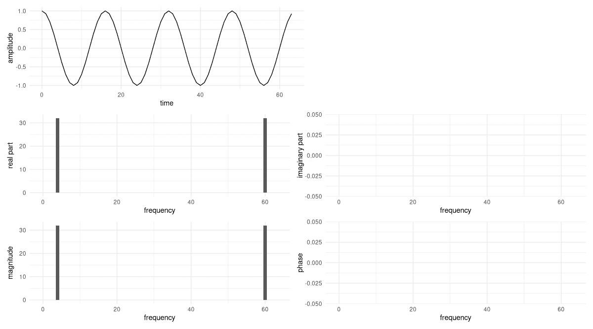

图 26.3：在采样周期内完成四次旋转的纯余弦波及其 DFT。虚部和相位仍然为零。

这确实证实了我们的计算。

当信号频率达到“允许”的最高频率时，即在没有混叠的情况下可检测的频率，会出现一个特殊情况。这将在采样点数的一半处发生。那么，信号将看起来是这样的：

$$ \mathbf{x}_n = \frac{1}{2} (\mathbf{w}^{32n}_N + \mathbf{w}^{32n}_N) $$

因此，我们最终得到一个系数，对应于每样本周期的 32 次旋转频率，其幅度是原来的两倍（64，因此）。以下是信号及其 DFT（图 26.4）：

```r
x <- torch_cos(frequency(32, N) * sample_positions)
plot_ft(x)
```

*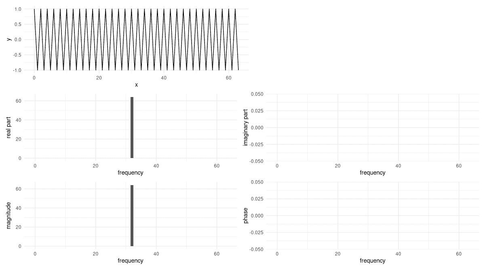

图 26.4：在采样周期内完成 32 次旋转的纯余弦波及其 DFT。这是在给定 64 个样本点的情况下，不会发生混叠的最高频率。虚部和相位仍然为零。**  **### 26.1.4 改变幅度

现在，让我们思考一下当我们改变幅度时会发生什么。例如，假设信号变得响亮了两倍。现在，将有一个 2 的乘数可以移出内积。因此，唯一改变的是系数的幅度。

让我们验证这一点。这次修改基于我们之前最后一个例子，即在采样周期内完成四次旋转的例子（图 26.5）。

```r
x <- 2 * torch_cos(frequency(4, N) * sample_positions)
plot_ft(x)
```

*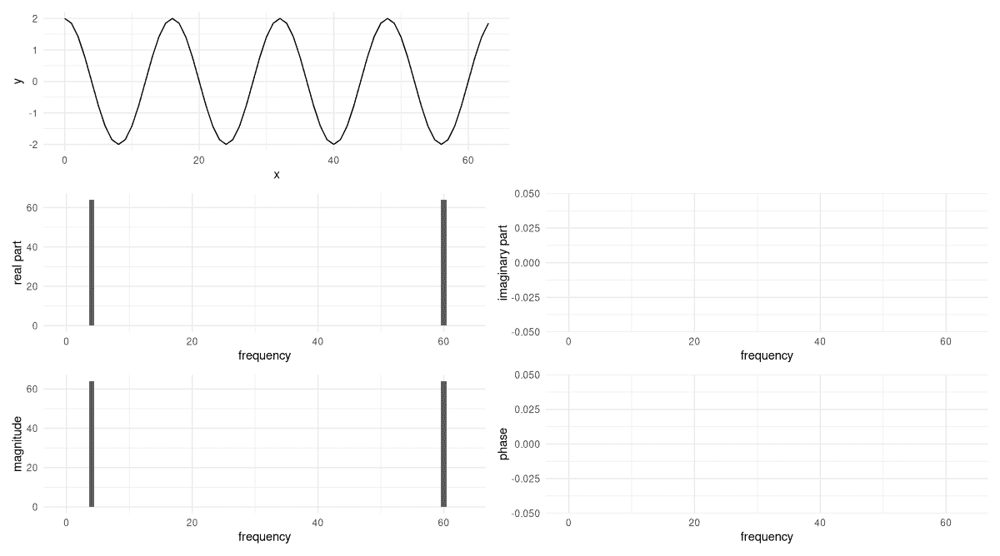

图 26.5：在采样周期内完成四次旋转的纯余弦波，幅度加倍。虚部和相位仍然为零。

到目前为止，我们一次也没有看到虚部非零的系数。为了改变这一点，我们添加了*相位*。*  *### 26.1.5 添加相位

改变信号的相位意味着在时间上移动它。我们的示例信号是一个余弦波，其值在$t=0$时为 1。（这也是信号——任意选择的——起始点。）

现在假设我们将信号向前平移 $\frac{\pi}{2}$。那么我们之前在零处看到的峰值将移动到 $\frac{\pi}{2}$；如果我们仍然从零开始“记录”，我们必须在那里找到一个值为零。描述这一点的方程如下。为了方便起见，我们假设采样周期为 $2 \pi$ 和 $k=1$，这样示例就是一个简单的余弦波：

$$ f(x) = cos(x - \phi) $$

负号一开始可能看起来不太直观。但它确实是有意义的：我们现在希望在 $x=\frac{\pi}{2}$ 处获得值为 1，因此 $x - \phi$ 应该评估为零。（或者任何 $\pi$ 的倍数。）总结来说，时间上的延迟将表现为负相移。

现在，我们将计算我们示例信号的平移版本的正交快速傅里叶变换（DFT）。但如果你愿意，现在可以先看看时域图象的相移版本。你会发现，延迟 $\frac{\pi}{2}$ 的余弦波实际上是从 0 开始的正弦波。

为了计算 DFT，我们遵循现在熟悉的策略。信号现在看起来是这样的：

$$ \mathbf{x}_n = cos(\frac{2 \pi}{N}*4*x - \frac{\pi}{2}) $$

首先，我们用基向量表示它：

$$ \begin{aligned} \mathbf{x}_n &= cos(\frac{2 \pi}{64} 4 n - \frac{\pi}{2}) \\ &= \frac{1}{2} (e^{i\frac{2 \pi}{64} 4n - \frac{pi}{2}} + e^{i\frac{2 \pi}{64} 60n - \frac{pi}{2}}) \\ &= \frac{1}{2} (e^{i\frac{2 \pi}{64} 4n} e^{-i \frac{\pi}{2}} + e^{i\frac{2 \pi}{64} 60n} e^{i\frac{pi}{2}}) \\ &= \frac{1}{2} (e^{-i \frac{\pi}{2}} \mathbf{w}^{4n}_N + e^{i \frac{\pi}{2}} \mathbf{w}^{60n}_N) \end{aligned} $$

再次，我们只有对于频率 $4$ 和 $60$ 有非零系数。但现在它们是复数，并且两个系数不再相同。相反，一个是另一个的复共轭。首先，$X_4$:

$$ \begin{aligned} X_4 &= \langle \mathbf{w}^{4n}_N, \mathbf{x}_n \rangle \\ &=\langle \mathbf{w}^{4n}_N, \frac{1}{2} (e^{-i \frac{\pi}{2}} \mathbf{w}^{4n}_N + e^{i \frac{\pi}{2}} \mathbf{w}^{60n}_N) \rangle\\ &= 32 *e^{-i \frac{\pi}{2}} \\ &= -32i \end{aligned} $$

这里是 $X_{60}$:

$$ \begin{aligned} X_{60} &= \langle \mathbf{w}^{60n}_N, \mathbf{x}_N \rangle \\ &= 32 *e^{i \frac{\pi}{2}} \\ &= 32i \end{aligned} $$

如同往常，我们使用 `torch_fft_fft()` 函数（图 26.6）来检查我们的计算。

```r
x <- torch_cos(frequency(4, N) * sample_positions - pi / 2)

plot_ft(x)
```

*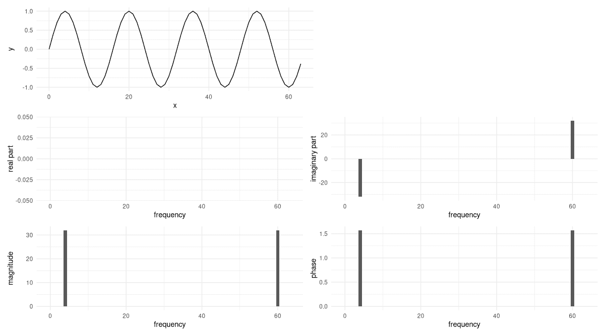

图 26.6：将纯余弦波延迟 $\pi/2$ 得到纯正弦波。现在所有系数的实部都是零；相反，出现非零的虚数值。在这些位置上的相移是 $\pi/2$。

对于一个纯正弦波，非零傅里叶系数是虚数。系数中的相移，报告为 $\frac{\pi}{2}$，反映了我们对信号应用的时间延迟。

最后——在我们编写代码之前——让我们将所有内容整合起来，看看一个具有多个正弦分量的波形。*  *### 26.1.6 正弦波的叠加

我们构建的信号仍然可以用基向量表示，但它不再是纯正弦波。相反，它是由这样的线性组合：

$$ \begin{aligned} \mathbf{x}_n &= 3 \sin\left(\frac{2 \pi}{64} \cdot 4n\right) + 6 \cos\left(\frac{2 \pi}{64} \cdot 2n\right) + 2 \cos\left(\frac{2 \pi}{64} \cdot 8n\right) \end{aligned} $$

我不会详细讲解计算过程，但它与之前的计算没有区别。您为每个三个分量计算 DFT，并将结果组装起来。然而，不进行任何计算，我们也可以说很多：

+   由于信号由两个纯余弦和一个纯正弦组成，将会有四个非零实部系数，以及两个非零虚部系数。后者将是彼此的复共轭。

+   从信号写法来看，很容易找到相应的频率：所有实系数将对应于频率索引 2、8、56 和 62；所有虚系数将对应于索引 4 和 60。

+   最后，幅度将通过将单个正弦波获得的缩放因子乘以 $\frac{64}{2}$ 来得到。

让我们检查 (图 26.7)：

```r
x <- 3 * torch_sin(frequency(4, N) * sample_positions) +
 6 * torch_cos(frequency(2, N) * sample_positions) +
 2 * torch_cos(frequency(8, N) * sample_positions)

plot_ft(x)
```

*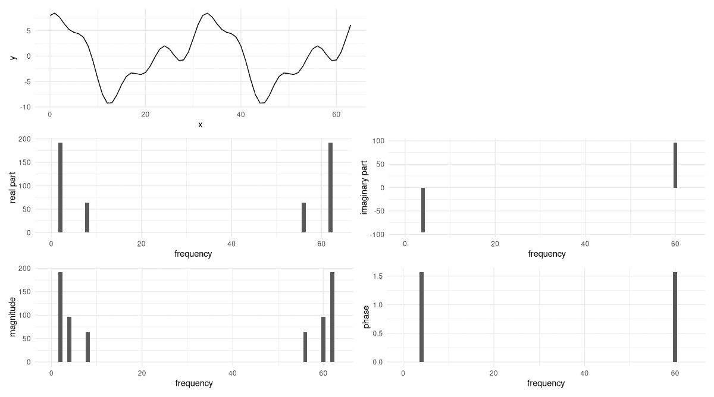

图 26.7：纯正弦波的叠加及其 DFT。

现在，我们如何计算不便于处理的信号的 DFT？
  
## 26.2 编码 DFT

幸运的是，我们已经知道该做什么。我们想要将信号投影到每个基向量上。换句话说，我们将计算一系列内积。从逻辑上讲，没有什么变化：唯一的区别是，通常，我们无法像之前那样只用几个基向量来表示信号。因此，实际上必须计算所有投影。但自动化繁琐的任务不是我们使用计算机的原因之一吗？

让我们首先说明要实现的算法的输入、输出和核心逻辑。正如本章所述，我们保持在一个维度内。因此，输入是一个一维张量，编码一个信号。输出是一个与输入长度相同的一维傅里叶系数向量，每个系数都包含有关一个频率的信息。核心思想是：为了获得一个系数，将信号投影到相应的基向量上。

为了实现这个想法，我们需要创建基向量，并对每个基向量计算其与信号的点积。这可以通过循环完成。令人惊讶的是，完成这个目标所需的代码非常少：

```r
dft <- function(x) {
 n_samples <- length(x)

 n <- torch_arange(0, n_samples - 1)$unsqueeze(1)

 Ft <- torch_complex(
 torch_zeros(n_samples), torch_zeros(n_samples)
 )

 for (k in 0:(n_samples - 1)) {
 w_k <- torch_exp(-1i * 2 * pi / n_samples * k * n)
 dot <- torch_matmul(w_k, x$to(dtype = torch_cfloat()))
 Ft[k + 1] <- dot
 }
 Ft
}
```

*为了测试实现，我们可以取我们最后分析的信号，并与 `torch_fft_fft()` 的输出进行比较。

```r
Ft <- dft(x)
torch_round(Ft$real) %>% as.numeric()
torch_round(Ft$imag) %>% as.numeric()
```

```r
[1]  0 0 192 0 0 0 0 0 64 0 0 0 0 0 0 0 0 0 0 0 0 0 0 0 0 0 0 0
[29] 0 0 0 0 0 0 0 0 0 0 0 0 0 0 0 0 0 0 0 0 0 0 0 0 0 0 0 0 
[57] 64 0 0 0 0 0 192 0

[1]  0 0 0 0 -96 0 0 0 0 0 0 0 0 0 0 0 0 0 0 0 0 0 0 0 0 0 0 0
[29] 0 0 0 0 0 0 0 0 0 0 0 0 0 0 0 0 0 0 0 0 0 0 0 0 0 0 0 0 
[57] 0 0 0 0 96 0 0 0
```

令人放心的是——如果你回顾一下——结果是一样的。

上文，我说“少量代码”吗？事实上，甚至不需要循环。我们不是逐个处理基向量，而是可以将它们堆叠成一个矩阵。然后每一行将持有基向量的共轭，将有 $N$ 个。列对应于位置 $0$ 到 $N-1$；也会有 $N$ 个。例如，这是 $N=4$ 时矩阵的形状：

$$ \mathbf{W}_4 = \begin{bmatrix} e^{-i\frac{2 \pi}{4}* 0 * 0} & e^{-i\frac{2 \pi}{4}* 0 * 1} & e^{-i\frac{2 \pi}{4}* 0 * 2} & e^{-i\frac{2 \pi}{4}* 0 * 3}\\ e^{-i\frac{2 \pi}{4}* 1 * 0} & e^{-i\frac{2 \pi}{4}* 1 * 1} & e^{-i\frac{2 \pi}{4}* 1 * 2} & e^{-i\frac{2 \pi}{4}* 1 * 3}\\ e^{-i\frac{2 \pi}{4}* 2 * 0} & e^{-i\frac{2 \pi}{4}* 2 * 1} & e^{-i\frac{2 \pi}{4}* 2 * 2} & e^{-i\frac{2 \pi}{4}* 2 * 3}\\ e^{-i\frac{2 \pi}{4}* 3 * 0} & e^{-i\frac{2 \pi}{4}* 3 * 1} & e^{-i\frac{2 \pi}{4}* 3 * 2} & e^{-i\frac{2 \pi}{4}* 3 * 3}\\ \end{bmatrix} \tag{26.3}$$

或者，评估表达式：

$$ \mathbf{W}_4 = \begin{bmatrix} 1 & 1 & 1 & 1\\ 1 & -i & -1 & i\\ 1 & -1 & 1 & -1\\ 1 & i & -1 & -i\\ \end{bmatrix} $$

经过那样的修改，代码看起来要优雅得多：

```r
dft_vec <- function(x) {
 n_samples <- length(x)

 n <- torch_arange(0, n_samples - 1)$unsqueeze(1)
 k <- torch_arange(0, n_samples - 1)$unsqueeze(2)

 mat_k_m <- torch_exp(-1i * 2 * pi / n_samples * k * n)

 torch_matmul(mat_k_m, x$to(dtype = torch_cfloat()))
}
```

*正如你很容易验证的那样，结果是相同的。

在我们进入下一章——快速傅里叶变换——之前，我们应该在更复杂的东西上测试我们的实现。


[`sox`](http://sox.sourceforge.net/) 是一个用于处理音频的命令行工具，通常（我想）用于快速播放某些声音文件、重采样或在不同文件格式之间转换。然而，它也可以**生成**声音！（诚然，语法不是最直观的。）以下是我在生成下面分析的测试声音时使用的命令：

```r
sox --combine concatenate \
 "|sox -r 4000 -n -p synth 0.2 \
 sine 941 sine 1336 pinknoise remix -" \
 "|sox -r 4000 -n -p synth 0.2 \
 sine 852 sine 1336 pinknoise remix - pad 0.15 0.15" \
 "|sox -r 4000 -n -p synth 0.2 \
 sine 852 sine 1477 pinknoise remix -" \
 resources/dft-dial.wav
```

*结果是三个不同的声音事件的拼接，持续时间为 `0.2` 秒，由稍微短一点的静默期（`pad 0.15 0.15`）分隔。每个声音事件是三个成分的叠加：两个不同频率的正弦波和粉红噪声。使用的频率组合并非偶然：它们分别代表了 [双音多频信号（DTMF）](https://en.wikipedia.org/wiki/Dual-tone_multi-frequency_signaling) 系统中数字 0、8 和 9 的编码。

对于这个信号，我们在频谱图中期望看到什么？我们期望看到三个明显区分的相位，每个相位都由“无”清晰分隔，并且每个相位都显示两个主要频率。第一和第二个相位应该有一个共同的频率；第二和第三个相位也是如此。此外，对于所有三个相位，我们都应该看到来自所有其他频率的贡献，低频比高频有更强的冲击。（这就是粉红噪声的定义。）

到目前为止，让我再次调用`sox`。如果你之前使用过这个程序，你知道它可以创建声谱图吗？这个单行命令使用了所有默认设置；然而，结果包含了我们想要的所有信息（图 26.8）：

```r
sox resources/dial.wav -n spectrogram \ 
 -m -l -w kaiser -o dial-spectrogram.png
```

*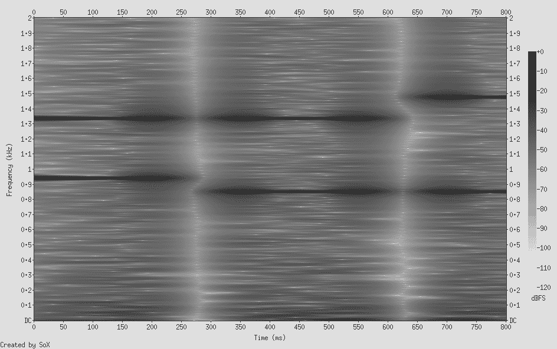

图 26.8：使用`sox resources/dial.wav -n spectrogram -m -l -w kaiser -o dial-spectrogram.png`创建的声谱图。

现在，让我们利用`torchaudio`这个包将文件加载到 R 中，我们在音频分类章节中已经了解过这个包。

```r
library(torchaudio)

wav <- tuneR_loader("resources/dft-dial.wav")
wav
```

```r
WaveMC Object
  Number of Samples:      3600
  Duration (seconds):     0.9
  Samplingrate (Hertz):   4000
  Number of channels:     1
  PCM (integer format):   TRUE
  Bit (8/16/24/32/64):    32
```

从`tuneR`的`WaveMC`对象存储的所有信息中，我们只需要采样率和数据本身。

```r
waveform_and_sample_rate <- transform_to_tensor(wav)
waveform <- waveform_and_sample_rate[[1]]
sample_rate <- waveform_and_sample_rate[[2]]

dim(waveform)
```

```r
[1]    1 3600
```

如预期，幅度随时间变化的图表并没有揭示太多（图 26.9）：

```r
df <- data.frame(
 x = 1:dim(waveform)[2],
 y = as.numeric(waveform$squeeze(1))
)
ggplot(df, aes(x = x, y = y)) +
 geom_line() +
 xlab("time") +
 ylab("amplitude") +
 theme_minimal()
```

*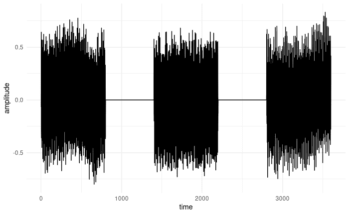

图 26.9：三个连续的铃声，时域表示。

现在，我们将计算傅里叶变换——两次。首先，使用`torch_fft_fft()`，这样我们知道“真相”。然后，使用我们自己的`dft()`函数。对于两者，我们将显示频谱下半部分的幅度，即所有频率直到奈奎斯特率。最后，借助`torch_fft_ifft()`，我们将确保可以从`dft()`给出的结果中重新生成时域表示。

为了创建一个有意义的图表，还需要进行一个额外的步骤。到目前为止，在频域图表中显示的幅度只是简单地按$k$排序，即相关基向量索引。实际上，没有“实际频率”的概念。但现在，我们希望看到频率以我们概念化的方式处理：每秒周期数，以赫兹为单位。

要进行转换，我们需要采样率，这我们已经看到是 4000 赫兹。然后，我们将下半部分的样本索引（`bins_below_nyquist`）映射到实际频率，乘以采样率与总样本数的比率：

```r
num_samples <- dim(waveform)[2]
nyquist_cutoff <- num_samples / 2 + 1
bins_below_nyquist <- 1:nyquist_cutoff

frequencies_per_bin <- sample_rate / num_samples
real_world_frequencies <- frequencies_per_bin *
 bins_below_nyquist
```

*这里，然后，是`torch_fft_fft()`函数的幅度图（图 26.10）：

```r
dial_fft <- torch_fft_fft(waveform)$squeeze()

p_magnitude <- create_plot(
 real_world_frequencies,
 torch_abs(dial_fft)[1:nyquist_cutoff], "magnitude"
)

p_magnitude
```

*

图 26.10：使用`torch_fft_fft()`计算的铃声信号的 DFT。显示的是低于奈奎斯特率的频率幅度。

频谱反映了信号中的噪声成分，但四个峰值（我们知道它们位于 852、941、1336 和 1477 赫兹）清晰可见。

现在，我们手写的代码是否得到相同的结果（图 26.11）？

```r
dial_dft <- dft(waveform$squeeze())

p_magnitude <- create_plot(
 real_world_frequencies,
 torch_abs(dial_fft)[1:nyquist_cutoff], "magnitude"
)

p_magnitude
```

*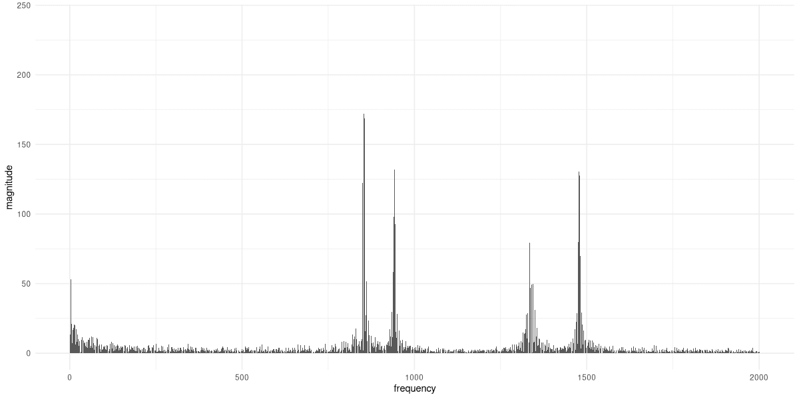

图 26.11：使用我们编写的代码对铃声信号进行 DFT。显示的是低于奈奎斯特频率的频率幅度。

确实如此。最后，让我们使用逆 DFT 来重建信号（图 26.12）。

```r
reconstructed <- torch_fft_ifft(dial_dft)
df <- data.frame(
 x = 1:num_samples,
 y = as.numeric(reconstructed$real)
)

ggplot(df, aes(x = x, y = y)) +
 geom_line() +
 xlab("time") +
 ylab("amplitude") +
 theme_minimal()
```

*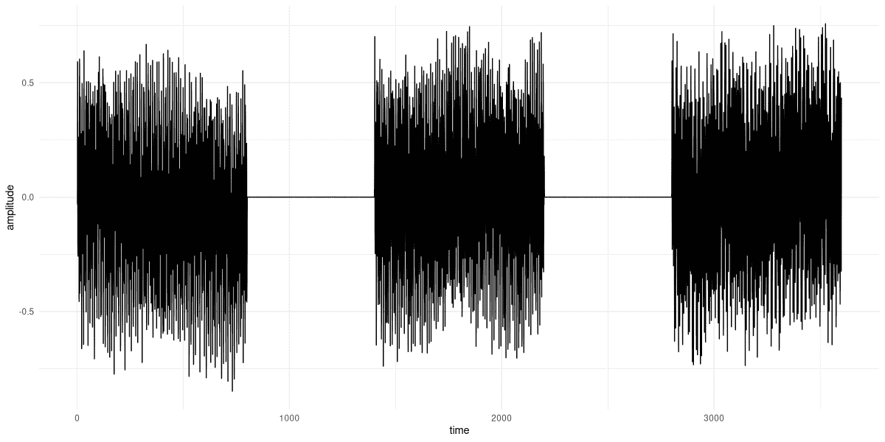

图 26.12：从 `dft()` 输出重建时域信号。

就这样。我们已经自己实现了 DFT，并且在过程中学到了很多。对于下一章的主题快速傅里叶变换（FFT），计划完全相同。
  
 * *

1.  它的对应函数——它将傅里叶表示转换为时域信号——被称为 `torch_fft_ifft()`（其中 `ifft` 代表 *逆傅里叶变换*）。↩︎

1.  在此基础上进一步说明：对于实值信号，对应系数的幅度以及实部是相等的，而相位和虚部是共轭的。换句话说，系数是彼此的复共轭。我们将在后面的例子中看到这一点。↩︎

1.  从现在起，我将用 $\mathbf{x}_n$ 代替 $f(x)$ 来表示我们正在处理离散样本，而不是连续函数本身。↩︎

1.  欧拉公式将复指数与正弦和余弦函数联系起来，表明 \(e^{i \theta} = cos \theta + i sin \theta\。↩︎

