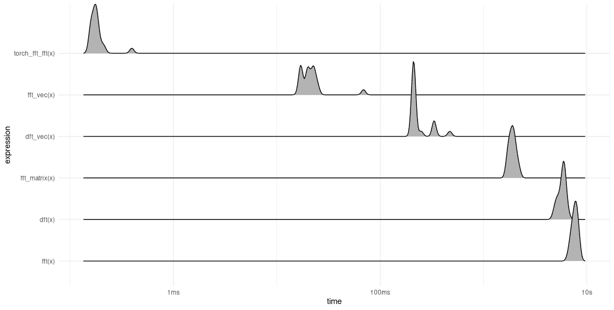
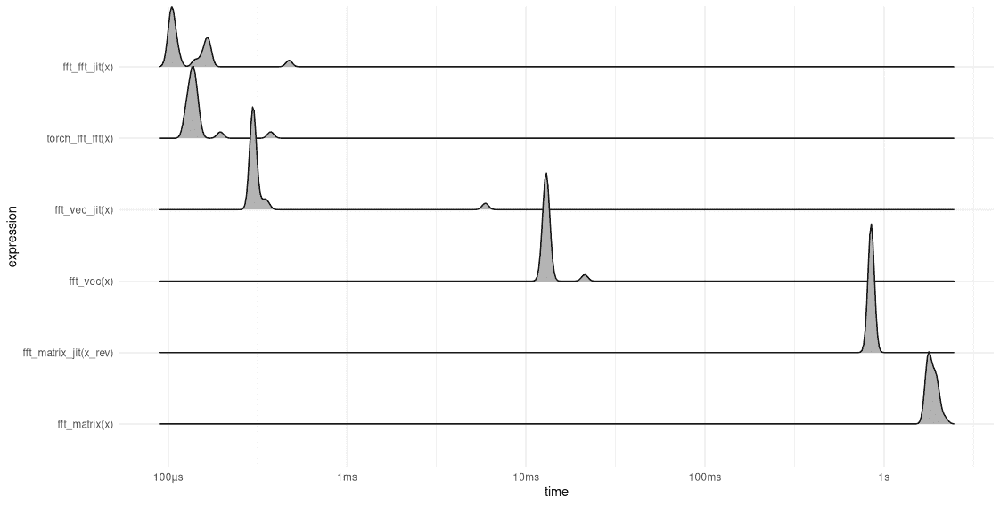

# 27 快速傅里叶变换 (FFT)

> 原文：[`skeydan.github.io/Deep-Learning-and-Scientific-Computing-with-R-torch/fourier_transform_fft.html`](https://skeydan.github.io/Deep-Learning-and-Scientific-Computing-with-R-torch/fourier_transform_fft.html)

在上一章中，我们看到要编写离散傅里叶变换 (DFT) 的代码，只需要几行代码——尽管理论深度和丰富性。令人惊讶的是，FFT（著名的快速傅里叶变换）并没有那么不同。

在本章中，我们首先将探讨快速傅里叶变换（更确切地说：其“最经典”版本）实际上做什么，基于我们在上一章中获得的理解。

然后，我们将编写几个不同的实现，并测量它们的性能。当然，所有手动编写的实现都无法超越 `torch_fft_fft()`，`torch` 将其委托给高度优化的 C++ 代码。但我们的结果在许多方面都很有趣：我们会看到在实践中，不仅仅是算法本身很重要。编程语言也起着至关重要的作用，其属性在很大程度上影响着改进的可行性。换句话说，算法属性和语言固有属性之间存在一种*交互作用*，这将决定最终结果。

首先，本着本书旨在阐明涉及的思想和概念的精神，我们希望了解快速傅里叶变换中涉及的内容。

## 27.1 一些术语

让我一开始就明确指出，与离散傅里叶变换 (DFT) 相比，FFT 并不是另一种变换。它的输出与 DFT 的输出完全相同。使用 FFT，关键在于“快速”。此外，没有“一个”FFT。相反，有不同系列；在每个系列中，都有各种子类型。

这里，我专注于“经典中的经典”：即采用 *radix-2 decimation-in-time (DIT)* 的那个。这里“radix-2”指的是一个实现细节；它表示算法将需要输入大小等于 2 的幂。另一方面，“decimation in time”则与所采用的总体策略相关：分而治之。输入被递归地分成两半，并且以巧妙的方式组合部分结果。（顺便提一下，还有一个非常相似的算法称为“decimation in frequency”。在那里，递归分割发生在频率域。）

现在，我们讨论它是如何工作的。你会看到，一旦我们清楚地确定了我们要做什么，一个（天真）的实现所需的代码并不比上一章中直接使用的 DFT 多。而且请放心，尽管这一节有很多方程式，但每个操作都会用文字解释。

## 27.2 Radix-2 decimation-in-time(DIT) 演示

由 *时间抽取* 导致的简化可以表示为两步逻辑。反映这种观点，并重新使用（具有不同语义）在卷积章节中使用的术语，我可以称它们为“输入视图阶段”和“输出视图阶段”。然而，这些都不是时间意义上的阶段，更重要的是——在以软件为重点的书中——我们将看到，在转换为代码时，它们的影响差异很大。因此，我将用反映重要性的方式命名接下来的两个部分。（我仍然会在这里清楚地说明输入和输出视图的含义。）

### 27.2.1 主要思想：递归拆分

正如我们所期望的，对于分而治之算法，主要且最有影响的观察是，如果输入被递归地拆分，问题可以被分解为越来越容易解决的子问题——前提是我们知道如何将部分结果组合成最终解决方案。

在我们开始之前，让我回顾一下一些符号，并进行一个将证明方便的微小修改。在前一章中，当 $N$ 是输入的大小（等价于结果的频率系数数量）时，$k$（从零到 $N-1$）指的是相关的向量，DFT 基向量被定义为如下：

$$ \mathbf{w}^{kn}_N = e^{i\frac{2 \pi}{N}k n} $$

然后，第 $k$ 个频率系数是通过计算 $\mathbf{w}^{kn}_N$ 和输入 $\mathbf{x}_n$ 的内积得到的：

$$ \begin{aligned} X_k &= \langle \mathbf{w}^{kn}_N, \mathbf{x}_n \rangle \\ &= \sum_{n=0}^{N-1} x[n] \ w^{-nk}_N\\ \end{aligned} $$

在本章中，我们将始终使用基向量的复共轭，因为正是这些向量与输入向量（逐元素）相乘。为了方便起见，我们因此稍微改变了符号，并让 $w^{kn}_N$ 指代共轭复指数¹：

$$ w^{kn}_N = e^{-i\frac{2 \pi}{N}k n} \tag{27.1}$$

然后，抽象地考虑 $n$，我们也有 $$ w^k_N = e^{-i\frac{2 \pi}{N}k} \tag{27.2}$$

也就是说，我们再次声明我们想要计算的内容：频率系数 $X_k$。

$$ \begin{aligned} X_k &= \sum_{n=0}^{N-1} x[n] \ w^{nk}_N\\ \end{aligned} $$

现在是时候提到我想要称之为“输入视图”的内容了。我们取输入序列，并将计算分为两部分。一部分将处理信号的偶数索引，另一部分将处理奇数索引。这样表达，求和只进行到 $N/2 - 1$。

$$ \begin{aligned} X_k &= \sum_{n=0}^{(N/2-1)} x[2n] \ w^{2nk}_N + \sum_{n=0}^{N/2-1} x[2n+1] \ w^{(2n+1)k}_N \\ \end{aligned} \tag{27.3}$$

现在，第二个求和可以重写，将 $w^{2nk+k}_N$ 拆分为两个因子：

$$ \sum_{n=0}^{N/2-1} x[2n+1] \ w^{2nk+k}_N = \sum_{n=0}^{N/2-1} x[2n+1] \ w^{2nk}_N w^{k}_N $$

第二个因子正是我们上面介绍的 $w^{k}_N$。由于它不依赖于 $n$，我们可以将其移出求和符号。这导致

$$ \begin{aligned} X_k &= \sum_{n=0}^{(N/2-1)} x[2n] \ w^{2nk}_N + w^k_N \sum_{n=0}^{N/2-1} x[2n+1] \ w^{2nk}_N \\ \end{aligned} $$

现在，两个求和中指数因子相同。让我们更仔细地检查一下。它是大小为 $N$ 的离散傅里叶变换（DFT）的乘数因子，在（频率-时间）位置 $2nk$。如果我们展开这个表达式，我们会看到我们可以将因子 $2$ 从分数的分子移动到分母：

$$ w^{2nk}_N = e^{-i\frac{2 \pi}{N}2nk} = e^{-i\frac{2 \pi}{N/2}nk} = w^{nk}_{N/2} $$

这有什么意义呢？结果是大小为 $N/2$ 的离散傅里叶变换（DFT）的对应基向量，在位置 $nk$。这意味着现在，我们实际上正在计算大小减半的 DFT – 或者更确切地说，两个这样的 DFT：

$$ X_k = \sum_{n=0}^{(N/2-1)} x[2n] \ w^{nk}_{N/2} + w^k_N \ \sum_{n=0}^{N/2-1} x[2n+1] \ w^{nk}_{N/2} \\ \tag{27.4}$$

让我们以更易读的形式写出：

$$ X_k = X^{even}_k + w^k_N \ X^{odd}_k \tag{27.5}$$

现在，你可能已经看到了这个趋势。我们曾经做过的 – 将计算大小减半 – 我们可以再次做……并且可以一直这样做。正是这种递归的减半使得快速傅里叶变换（FFT）能够获得它著名的计算成本降低。

这是魔法的主要成分，但还不是全部。

### 27.2.2 进一步简化

我们可以做出的一项额外简化。与第一个相比，它在计算性能方面的重要性较小，至少从美学角度来看。然而，它确实很重要。

你有没有注意到我们最终公式中的奇怪之处？我们正在计算大小为 $N/2$ 的 DFT，但仍然，因子 $w^k_N$ 出现了！这不是问题，但也不是“好”的。幸运的是，对于那些在意的人来说，“无关紧要”的影响可以消除。

接下来的是我差点给它命名为“输出端视图”的内容。这是因为现在，我们从计算的输出开始，从后往前整理事情。我们取傅里叶系数集合 $X_k$，并独立考虑前半部分和后半部分。注意，在这里，就像在以输入为中心的视图中一样，我们应用了分割成两半的策略；只是这次，减半的方式不同。

观察这两半部分，我们注意到它们各自都有它们专用的乘数因子 $w^k_N$ 的子集，一个 $k$ 的范围从 $0$ 到 $N/2-1$，另一个从 $N/2$ 到 $N-1$。对于前者，这意味着我们可以改变求和的上限，得到

$$ X^{upper}_k = X^{even}_k + w^k_N \ X^{odd}_k \ , \ \ k = 0 ... N/2-1 $$

对于第二个，我们可以通过在相同的范围内求和，但将 $N/2$ 加到 $k$ 的每个地方来达到预期的结果。

$$ X^{lower}_{k+N/2} = \sum_{n=0}^{N/2-1} x[2n] \ w^{n (k+N/2)}_{N/2} + w^{k+N/2}_N \ \sum_{n=0}^{N/2-1} x[2n + 1] \ w^{n (k+ N/2)}_{N/2} \\ $$

现在，在构成 $X^{lower}$ 的第一个求和中，指数可以分解，我们看到包含 $N/2$ 的因子评估为 $1$（因此，消失）：

$$ \begin{aligned} w^{n(k+N/2)}_{N/2}&= e^{-i\frac{2 \pi}{N/2} n (k + N/2)} \\ &= e^{-i\frac{2 \pi}{N/2}n k} * e^{-i\frac{2 \pi}{N/2}n (N/2)} \\ &= e^{-i\frac{2 \pi}{N/2}n k} * e^{-i\frac{2 \pi}{N/2}(N/2)} \\ &= e^{-i\frac{2 \pi}{N/2}n k} * 1 \end{aligned} $$

因此，第一个和中现在看起来是这样的：

$$ X^{lower}_{k+N/2} = \sum_{n=0}^{N/2-1} x[2n] \ w^{n k}_{N/2} + [...] $$

同样的事情也可以在第二个和中做：

$$ X^{lower}_{k+N/2} = [...] + w^{k+N/2}_N \ \sum_{n=0}^{N/2-1} x[2n + 1] \ w^{n k}_{N/2} \\ $$

现在只剩下最后一个不便的索引 $k + N/2$。一个类似于上面的计算表明我们可以用减号来替换它：

$$ \begin{aligned} w^{k+N/2}_N&= e^{-i\frac{2 \pi}{N} (k + N/2)} \\ &= e^{-i\frac{2 \pi}{N} k} * e^{-i\frac{2 \pi}{N} N/2}\\ &= e^{-i\frac{2 \pi}{N} k} * e^{-i \pi}\\ &= e^{-i\frac{2 \pi}{N} k} * (-1)\\ \end{aligned} $$

因此，完整的第二部分可以写成这样：

$$ X^{lower}_{k+N/2} = \sum_{n=0}^{N/2-1} x[2n] \ w^{n k}_{N/2} - w^k_N \ \sum_{n=0}^{N/2-1} x[2n + 1] \ w^{n k}_{N/2} $$

现在，第二部分看起来几乎和第一部分一样，只是符号发生了变化。因此，下面是最终的算法：

$$ \begin{aligned} & X^{upper}_k = X^{even}_k + w^k_N \ X^{odd}_k \ , \ \ k = 0 ... N/2-1 \\ & X^{lower}_{k+N/2} = X^{even}_k - w^k_N \ X^{odd}_k \ , \ \ k = 0 ... N/2-1 \end{aligned} \tag{27.6} $$

由于一种流行的可视化形式，这种表示通常被称为“蝴蝶”。如果你好奇，你不会在网上找到相关图表有困难。我个人觉得它们不太有帮助，这就是为什么我没有在这里重新制作它们。

总结来说，我们现在已经得到了一个规则，它告诉我们如何通过将其替换为大小为 $N/2$ 的 FFT 来简化大小为 $N$ 的 FFT。完整的算法包括对该规则的递归应用。

我们现在可以开始思考如何实现这一点。

## 27.3 FFT 作为矩阵分解

下面，我们将探讨不同的编码 FFT 的方法。在其中的两种方法中，你将直接识别出规则方程式 27.6。第三种是不同的。它直接利用了事实，即 DFT 矩阵 $\mathbf{W}_N$ 可以分解为三个稀疏矩阵，每个矩阵代表了规则中固有的三个阶段之一：将输入拆分为偶数和奇数索引；计算两个半大小 FFT；重新组合结果。

例如，考虑 $\mathbf{W}_4$，这是我们上一章分析的矩阵：

$$ \mathbf{W}_4 = \begin{bmatrix} 1 & 1 & 1 & 1\\ 1 & -i & -1 & i\\ 1 & -1 & 1 & -1\\ 1 & i & -1 & -i\\ \end{bmatrix} $$

这可以分解为三个矩阵，如下所示：

$$ \begin{aligned} \mathbf{W}_4 &= \begin{bmatrix} 1 & 1 & 1 & 1\\ 1 & -i & -1 & i\\ 1 & -1 & 1 & -1\\ 1 & i & -1 & -i\\ \end{bmatrix} \\ &= \begin{bmatrix} 1 & 0 & 1 & 0\\ 0 & 1 & 0 & -i\\ 1 & 0 & -1 & 0\\ 0 & 1 & 0 & i\\ \end{bmatrix} \begin{bmatrix} 1 & 1 & 0 & 0\\ 1 & -1 & 0 & 0\\ 0 & 0 & 1 & 1\\ 0 & 0 & 1 & -1\\ \end{bmatrix} \begin{bmatrix} 1 & 0 & 0 & 0\\ 0 & 0 & 1 & 0\\ 0 & 1 & 0 & 0\\ 0 & 0 & 0 & 1\\ \end{bmatrix} \end{aligned} $$

最右侧的矩阵（称为 $P$，表示置换）重新排列输入。以下是它在适当大小的输入向量上的作用方式。

$$ \mathbf{P}_4 \mathbf{x} = \begin{bmatrix} 1 & 0 & 0 & 0\\ 0 & 0 & 1 & 0\\ 0 & 1 & 0 & 0\\ 0 & 0 & 0 & 1\\ \end{bmatrix} \begin{bmatrix} x1 \\ x2 \\ x3 \\ x4 \\ \end{bmatrix} = \begin{bmatrix} x1 \\ x3 \\ x2 \\ x4 \\ \end{bmatrix} $$

现在偶数和奇数索引的值已经很好地分离，我们可以构建一个块矩阵，对每个这样的组单独应用 DFT。在这种情况下，所涉及的 DFT 的大小是两个。如果你看看上面的中心矩阵，你会看到它包含两个 $\mathbf{W}_2$ 的实例，其中 $\mathbf{W}_2$ 是

$$ \mathbf{W}_2 = \begin{bmatrix} 1 & 1 \\ 1 & -1 \\ \end{bmatrix} $$

以置换信号 $\mathbf{P}_4 \mathbf{x}$ 作为输入，该块矩阵产生以下输出：

$$ \mathbf{W}_{2*2}\mathbf{P}_{4}\mathbf{x} = \begin{bmatrix} 1 & 1 & 0 & 0\\ 1 & -1 & 0 & 0\\ 0 & 0 & 1 & 1\\ 0 & 0 & 1 & -1\\ \end{bmatrix} \begin{bmatrix} x1 \\ x3 \\ x2 \\ x4 \\ \end{bmatrix} = \begin{bmatrix} x1+x3 \\ x1-x3 \\ x2+x4 \\ x2-x4 \\ \end{bmatrix} $$

接下来，需要以正确的方式将这两组系数重新组合。我个人觉得很难在脑海中想象出分解中左边的矩阵是如何操作的；所以让我们尝试自己构建这个矩阵。

FFT 规则 方程式 27.6 告诉我们必须发生什么。这里再次列出：

$$ X^{upper}_k = X^{even}_k + w^k_N \ X^{odd}_k \ , \ \ k = 0 ... N/2-1 $$

$$ X^{lower}_{k+N/2} = X^{even}_k - w^k_N \ X^{odd}_k \ , \ \ k = 0 ... N/2-1 $$

在这个例子中，$N/2$ 是 2；因此我们需要 $w⁰_4$ 和 $w¹_4$。它们的值如下

$$ \begin{aligned} &w⁰_4 = e^{-i\frac{2 \pi}{4}0} = 1\\ &w¹_4 = e^{-i\frac{2 \pi}{4}1} = -i\\ \end{aligned} $$

作为旁白，我们也可以从变换矩阵 $W_4$ 中读取它们：这些是在 $n=1$ 时计算出的前两个基向量，因此它们正好位于第二列的顶部。

现在，我们只需机械地应用这个规则。

$$ \begin{aligned} &X_0 = X^{upper}_0 = X^{even}_0 + w⁰_4 \ X^{odd}_0 = (x_1 + x_3) + 1 * (x_2 + x_4) \\ &X_1 = X^{upper}_1 = X^{even}_1 + w¹_4 \ X^{odd}_1 = (x_1 - x_3) - i * (x_2 - x_4) \\ &X_2 = X^{lower}_2 = X^{even}_0 - w⁰_4 \ X^{odd}_0 = (x_1 + x_3) - 1 * (x_2 + x_4) \\ &X_3 = X^{lower}_3 = X^{even}_1 - w¹_4 \ X^{odd}_1 = (x_1 - x_3) + i * (x_2 - x_4) \\ \end{aligned} $$

这为我们提供了要应用于向量输入的乘数因子。剩下要做的就是将它们放入一个矩阵中。直接读取上述方程，并在不使用输入时填充零，这就是我们得到的“蝴蝶”矩阵 $\mathbf{B}$：

$$ \mathbf{B}_4 = \begin{bmatrix} 1 & 0 & 1 & 0\\ 0 & 1 & 0 & -i\\ 1 & 0 & -1 & 0\\ 0 & 1 & 0 & i\\ \end{bmatrix} $$

与分解中的最左边的矩阵进行比较，我们看到我们得到了正确的结果。

然而，有一件事并不立即清楚，那就是如何递归地实现它。显然，在每次递归步骤中计算完整的矩阵分解似乎是一个很大的开销。幸运的是，这并不需要。一方面，排序只需在最初进行一次。另一方面，我发现我之前提到的 $\mathbf{W}_{2*2}$ 和 $\mathbf{B}_{4}$ 矩阵密切相关：$\mathbf{B}_{4}$ 是会进入一个块矩阵 $\mathbf{W}_{4*4}$ 的。

然后，递归过程可以非常清晰地展示出来。例如，对于 8 个输入大小的完整过程如下：

$$ \mathbf{W}_8 = \mathbf{B}_8 \begin{bmatrix} \mathbf{B}_4 & \mathbf{0}\\ \mathbf{0} & \mathbf{B}_4\\ \end{bmatrix} \begin{bmatrix} \mathbf{B}_2 & \mathbf{0} & \mathbf{0} & \mathbf{0}\\ \mathbf{0} & \mathbf{B}_2 & \mathbf{0} & \mathbf{0}\\ \mathbf{0} & \mathbf{0} & \mathbf{B}_2 & \mathbf{0}\\ \mathbf{0} & \mathbf{0} & \mathbf{0} & \mathbf{B}_2\\ \end{bmatrix} \mathbf{R} $$

$\mathbf{R}$ 是一个矩阵，它一次就能按照所需的方式对输入进行排序。我将其写作 $\mathbf{R}$ 表示“位反转”，因为这就是实际使用的算法。我们在这里不会深入探讨其工作原理，但网上可以找到相关的解释。

在讨论了 DFT 矩阵分解之后，我们准备查看一些代码。

## 27.4 实现 FFT

我们讨论并比较了三种不同的 FFT 实现以及我们上一章中的两个 DFT 版本的性能。让我先再次列出我们当时所做的工作。

### 27.4.1 DFT，“循环”方式

这就是我们最初编写 DFT 的方式，通过循环计算输入和每个基向量的点积。

```r
library(torch)

dft <- function(x) {
 n_samples <- length(x)
 n <- torch_arange(0, n_samples - 1)$unsqueeze(1)
 F <- torch_complex(
 torch_zeros(n_samples),
 torch_zeros(n_samples)
 )

 for (k in 0:(n_samples - 1)) {
 w_k <- torch_exp(-1i * 2 * pi / n_samples * k * n)
 dot <- torch_matmul(w_k, x$to(dtype = torch_cfloat()))
 F[k + 1] <- dot
 }
 F
}
```

*### 27.4.2 向量化 DFT

接下来，我们继续通过在矩阵中排列基向量来替换循环。

```r
dft_vec <- function(x) {
 n_samples <- length(x)

 n <- torch_arange(0, n_samples - 1)$unsqueeze(1)
 k <- torch_arange(0, n_samples - 1)$unsqueeze(2)
 mat_k_m <- torch_exp(-1i * 2 * pi/n_samples * k * n)

 torch_matmul(mat_k_m, x$to(dtype = torch_cfloat()))
}
```

*### 27.4.3 基数-2 时间抽取 FFT，递归

就像我们对 DFT 算法本身所做的那样，我们可以直接根据规格实现 FFT。这次，逻辑上设计的是递归的，而不是迭代的。在每次调用 `fft()` 时，输入被分成偶数和奇数索引，分别计算相应的一半大小的 FFT，然后将两组输出按要求合并。

```r
# straightforward, recursive implementation of the FFT.
# Expects input size to be a power of 2.
fft <- function(x) {
 n_samples <- length(x)
 if (n_samples == 1) {
 return(x)
 }

 X_upper <- fft(x[1:n_samples:2])
 X_lower <- fft(x[2:n_samples:2])

 w_k <- torch_exp(
 -2 * pi * torch_complex(0, 1) *
 torch_arange(0, n_samples / 2 - 1) / n_samples
 )
 torch_cat(list(
 X_upper + w_k * X_lower,
 X_upper - w_k * X_lower
 ))
}
```

*此函数期望输入大小等于 2 的幂次。*  *### 27.4.4 通过矩阵分解的基数-2 时间抽取 FFT

接下来，我们实现上述描述的矩阵分解策略。`fft_vec()`是 Brad Osgood 在其关于傅里叶变换的精彩书籍中阐述的逻辑的推广（Osgood (2019)）。

我们对输入张量（一次）进行排序，应用连续的加倍大小的“蝴蝶”矩阵块，并将结果与一个与输入数量相匹配的单个蝴蝶矩阵相乘。

可以方便地使用`bitrevorder()`函数进行排序，该函数由 R 包`gsignal`提供。

在循环中，你可以看到蝴蝶矩阵是如何构建的：它们是由单位矩阵和包含$w^k_N$的对角矩阵的组合。

```r
library(torch)
library(gsignal)

# requirements: input length is at least 4, and a power of 2
fft_matrix <- function(x) {

 # perform sorting just once, a the beginning
 x <- torch_tensor(
 bitrevorder(as.numeric(x)),
 dtype = torch_cfloat()
 )

 n_samples <- length(x)

 # smallest butterfly matrix, needed for all valid inputs
 B2 <- torch_tensor(
 c(1, 1, 1, -1),
 dtype = torch_cfloat()
 )$view(c(2, 2))
 B2_block <- torch_block_diag(
 B2$`repeat`(c(n_samples / 2, 1))$split(2)
 )
 acc <- torch_matmul(B2_block, x)

 # iterative implementation then starts with B4
 n <- 4

 while (n <= n_samples) {

 # build up current butterfly matrix
 I <- torch_eye(n / 2)
 O <- torch_diag(
 torch_exp(
 -1i * 2 * pi *
 torch_arange(0, n / 2 - 1) / (n / 2 * 2)
 )
 )
 B <- torch_cat(list(
 torch_cat(list(I, O), dim = 2),
 torch_cat(list(I, -O), dim = 2)
 ), dim = 1)

 # in the final multiplication,
 # B directly matches input length
 if (n == n_samples) {
 return(torch_matmul(B, acc))
 }

 # create block-diagonal matrix from butterflies
 # at each iteration,
 # we need to replicate B {n_samples/rank(B) times}
 # this is achieved by first repeating B row-wise,
 # then splitting up into rank(n) parts)
 B_block <- torch_block_diag(
 B$`repeat`(c(n_samples / n, 1))$split(n)
 )
 acc <- torch_matmul(B_block, acc)
 n <- n * 2
 }
 acc
}
```

*### 27.4.5 基于向量化的 Radix-2 时域分解 FFT

最后，让我再介绍一种实现方式。这是对[Jake van der Plas](http://jakevdp.github.io/blog/2013/08/28/understanding-the-fft/#Vectorized-Numpy-Version)在其博客上发布的 Python 代码的直译。尽管它看起来比上面的递归`fft()`更复杂，但它实际上实现了相同的算法，同时尽可能多地使用了向量化。换句话说，它对`fft()`的作用就像`dft_vec()`对`dft()`的作用一样。

```r
# torch translation of
# http://jakevdp.github.io/blog/2013/08/28/
# understanding-the-fft/#Vectorized-Numpy-Version

fft_vec <- function(x) {
 n_samples <- length(x)
 # could be chosen higher for performance reasons
 n_min <- 2 

 # Perform an O[N²] DFT on all length-N_min 
 # sub-problems at once
 n <- torch_arange(0, n_min - 1)$unsqueeze(1)
 k <- torch_arange(0, n_min - 1)$unsqueeze(2)

 # by starting with one (vectorized-by-matmul)
 # "classic DFT" (instead of a block matrix of B_mins),
 # we don't need the bitrevorder step
 mat_k_m <- torch_exp(-1i * 2 * pi / n_min * k * n)
 F <- torch_matmul(
 mat_k_m,
 x$to(dtype = torch_cfloat())$reshape(list(n_min, -1))
 )

 # build-up each level of the recursive calculation
 # all at once
 while (dim(F)[1] < n_samples) {
 F_first <- F[, 1:(dim(F)[2] / 2)]
 F_second <- F[, (dim(F)[2] / 2 + 1):dim(F)[2]]
 # only need first half of w_ks
 w_k <- torch_exp(
 -1i * pi *
 torch_arange(0, dim(F)[1] - 1) / dim(F)[1]
 )$unsqueeze(2)
 F <- torch_vstack(list(
 F_first + w_k * F_second,
 F_first - w_k * F_second
 ))
 # w_k * F_second multiplies both at once (column-wise)
 }
 F$ravel()
}
```

*### 27.4.6 与`torch_fft_fft()`的比较

现在，在我们比较这五个函数的性能之前，让我们检查它们是否与`torch_fft_fft()`产生相同的结果。我们不期望在大量小数位上完全一致；但了解不同实现之间最终准确性的差异将是有益的。

```r
x <- torch_randn(2¹³)
atol <- 1e-4

y_ref <- torch_fft_fft(x)

y_dft <- dft(x)
y_dft_vec <- dft_vec(x)
y_fft <- fft(x)
y_fft_vec <- fft_vec(x)
y_fft_matrix <- fft_matrix(x)

torch_allclose(y_dft, y_ref, atol = atol)
torch_allclose(y_dft_vec, y_ref, atol = atol)
torch_allclose(y_fft, y_ref, atol = atol)
torch_allclose(y_fft_vec, y_ref, atol = atol)
torch_allclose(y_fft_matrix, y_ref, atol = atol)
```

```r
[1] FALSE
[1] FALSE
[1] TRUE
[1] TRUE
[1] TRUE
```

令人放心的是，FFT 实现似乎都足够准确。*  *### 27.4.7 性能比较

为了评估相对性能，我们再次使用`bench::mark()`，每个函数迭代二十次（图 27.1）。

```r
set.seed(777)
torch_manual_seed(777)
library(bench)
library(dplyr)
library(ggplot2)

res <- mark(dft(x),
 dft_vec(x),
 fft(x),
 fft_vec(x),
 fft_matrix(x),
 torch_fft_fft(x),
 iterations = 20,
 check = FALSE
)

res %>%
 mutate(
 expression =
 forcats::fct_reorder(as.character(expression),
 min,
 .desc = TRUE
 )
 ) %>%
 as_bench_mark() %>%
 autoplot(type = "ridge") + theme_minimal()
```

*

图 27.1：比较各种 FFT 和 DFT 实现（见正文）。还包括`torch_fft_fft()`作为参考。

出乎意料的是，没有任何一种实现接近`torch_fft_fft()`。然而，令人好奇的是，我们在手动实现之间看到了巨大的执行时间差异。这里有一个重要的见解。算法属性就像柏拉图的理念：在理论上纯洁而崇高，但在日常生活中往往难以生动体现。在这里，现实的硬事实涉及一个人所使用的软件栈的定义特征，特别是所涉及编程语言的特征。让我详细说明。

在`torch`以及 R 语言中，向量化的操作比迭代（更不用说递归）要高效得多。从这个角度来看，我们可以这样理解结果：

+   `dft()`和`fft()`，这两种直接实现，由于没有使用向量操作，速度最慢。在这两者中，`fft()`——在理论上应该更优越——由于依赖于递归（在 R 中强烈不建议使用递归）而受到了严重的惩罚。

+   *两种向量化实现，`dft_vec()`和`fft_vec()`，在性能上明显优于它们的非向量化版本。在这些中，`fft_vec()`比`dft_vec()`快得多，这正是我们所期望的。*

+   *鉴于其概念和美学吸引力，`fft_matrix()`的结果有些令人失望。*

*受美好愿望的启发，我们能做些什么呢？* *### 27.4.8 利用即时（JIT）编译*

我们可以尝试。在`torch`中，一个名为即时（JIT）编译的功能允许我们跟踪一个函数或模型，以获得高度优化的图表示。这种能力在许多方面都很有用：显然可以减少执行时间；例如，如果您想在没有安装 R 的环境中部署一个模型（在 R 中训练），这也很有用。如果您感兴趣，请参阅[vignette](https://github.com/mlverse/torch/blob/main/vignettes/torchscript.Rmd)，以及一个专门的[博客文章](https://blogs.rstudio.com/ai/posts/2021-08-10-jit-trace-module/)。在这里，我们只是直接将 JIT 编译应用到实际中。

*我们只需调用一个函数，`jit_trace()`，并传递一个哑变量张量，其形状必须与未来预期输入的形状相匹配。我们希望对两个最有希望的 FFT 实现，`fft_vec()`和`fft_matrix()`，以及`torch`自己的`torch_fft_fft()`进行此操作。需要注意的是，如果我们认为改进是值得的，我们将需要跟踪所有我们感兴趣的输入形状。（考虑到我们的实现期望输入大小是 2 的幂，这不会造成太大的问题。）*

*在上面，我们用于基准测试的输入大小是 2¹³，因此我们也将使用这个大小进行跟踪。在这里，首先，我们运行`jit_trace()`对`fft_vec()`和`torch_fft_fft()`进行跟踪：*

```r
x_trace <- torch_randn(2¹³)

fft_vec_jit <- jit_trace(fft_vec, x_trace)
fft_fft_jit <- jit_trace(torch_fft_fft, x_trace)
```

*`fft_matrix()`的情况却有些特殊：在内部，我们调用了`bitrevorder()`函数，这个函数不应该成为`torch`图的一部分。然而，一个解决方案很快就被找到了：只需将这部分逻辑移出函数之外——无论如何，它对执行时间的影响微乎其微。重新定义的函数现在看起来是这样的：*

```r
fft_matrix_for_jit <- function(x) {
 x <- x$to(dtype = torch_cfloat())

 n_samples <- length(x)

 # smallest butterfly matrix, needed for all valid inputs
 B2 <- torch_tensor(
 c(1, 1, 1, -1),
 dtype = torch_cfloat()
 )$view(c(2, 2))
 B2_block <- torch_block_diag(
 B2$`repeat`(c(n_samples / 2, 1))$split(2)
 )
 acc <- torch_matmul(B2_block, x)

 # iterative implementation then starts with B4
 n <- 4

 while (n <= n_samples) {

 # build up current butterfly matrix
 I <- torch_eye(n / 2)
 O <- torch_diag(
 torch_exp(
 -1i * 2 * pi *
 torch_arange(0, n / 2 - 1) / (n / 2 * 2)
 )
 )
 B <- torch_cat(list(
 torch_cat(list(I, O), dim = 2),
 torch_cat(list(I, -O), dim = 2)
 ), dim = 1)

 # in the final multiplication,
 # B directly matches input length
 if (n == n_samples) {
 return(torch_matmul(B, acc))
 }

 # create block-diagonal matrix from butterflies
 # at each iteration,
 # we need to replicate B {n_samples/rank(B) times}
 # this is achieved by first repeating B row-wise,
 # then splitting up into rank(n) parts)
 B_block <- torch_block_diag(
 B$`repeat`(c(n_samples / n, 1))$split(n)
 )
 acc <- torch_matmul(B_block, acc)
 n <- n * 2
 }
 acc
}
```

*我们使用预先排序的输入进行跟踪：*

```r
fft_matrix_jit <- jit_trace(
 fft_matrix_for_jit,
 torch_tensor(
 bitrevorder(as.numeric(x_trace)),
 dtype = torch_cfloat()
 )
)
```

*在基准测试中，我们也用预先排序的张量调用`fft_matrix_jit()`。以下是`fft_vec()`、`fft_matrix()`、`torch_fft_fft()`及其各自优化版本的比较（图 27.2）：*

```r
x_rev <- torch_tensor(
 bitrevorder(
 as.numeric(x_trace)
 ),
 dtype = torch_cfloat()
)

res <- mark(fft_vec(x),
 fft_matrix(x),
 torch_fft_fft(x),
 fft_vec_jit(x),
 fft_matrix_jit(x_rev),
 fft_fft_jit(x),
 iterations = 20,
 check = FALSE
)

res %>%
 mutate(
 expression = forcats::fct_reorder(
 as.character(expression),
 min,
 .desc = TRUE
 )
 ) %>%
 as_bench_mark() %>%
 autoplot(type = "ridge") + theme_minimal()
```

**

图 27.2：探索即时编译（JIT）对`fft_vec()`、`fft_matrix()`和`torch_fft_fft()`性能的影响。

我认为，这个结果有两个显著之处。首先，这三个实现都从即时编译中受益，即使是`torch_fft_fft()`。

第二，有一个受益**很多**：即`fft_vec()`。在其编译版本中，它的速度几乎与`torch_fft_fft()`相当——请记住，这是一个所有计算都在高度优化的 C++代码中完成的函数。这再次强调了“语言匹配”对最终性能结果产生的巨大影响。

到现在为止，我们已经学到了很多关于离散傅里叶变换的知识，包括如何以高效的方式实现它。有了所有这些知识，我们应该足够自信地直接使用`torch_fft_ftt()`。这正是我们将在下一章——也是最后一章——要做的：我们将经典傅里叶分析与其年轻的同行，*小波*相结合。

Osgood, Brad. 2019\. *傅里叶变换及其应用讲义*. 美国数学会.
 
 * *

1.  注意，现在我们有一个标量，而不是一个向量。↩︎

