# 28  波浪

> 原文：[`skeydan.github.io/Deep-Learning-and-Scientific-Computing-with-R-torch/wavelets.html`](https://skeydan.github.io/Deep-Learning-and-Scientific-Computing-with-R-torch/wavelets.html)

我们用`torch`的实际应用来结束这本书的*波浪分析*。

使用傅里叶变换时，一切都是关于理解概念，所以我们可以自信地使用`torch_fft_ftt()`。这次，没有现成的函数可用；但我们会看到，自己计算波浪变换并不那么困难。（是的，`torch_fft_ftt()`在这里也将占有一席之地。）

波浪是什么？像傅里叶基一样，它们是函数；但它们不无限延伸。相反，它们在时间上局部化：远离中心，它们迅速衰减到零。除了*位置*参数外，它们还有一个*尺度*：在不同的尺度上，它们看起来会被压缩或拉伸。压缩时，它们将更好地检测高频；当它们在时间上拉伸时，情况相反。

波浪变换涉及的基本操作是卷积——让（翻转的）波浪函数在数据上滑动，计算一系列点积。这样，波浪函数基本上是在寻找*相似性*。

至于波浪函数本身，有很多种。在实际应用中，我们想要实验并选择最适合给定数据的那个。与 DFT 和频谱图相比，波浪分析通常需要更多的实验。

在其他方面，波浪的主题与傅里叶变换的主题也非常不同。值得注意的是，在术语、符号的使用和实际实践中，标准化程度要低得多。出于这些原因，我将避免像在 DFT 章节中那样给出系统性的、一般性的介绍。相反，我将主要依赖一个特定的阐述，即 Arnt Vistnes 关于波浪的非常棒的书中的阐述（Vistnes 2018）。换句话说，术语和例子都将反映那本书中的选择。

Vistnes 做出的一个选择是偏好深度而非广度，并专注于一个单一的波浪函数。

## 28.1 Morlet 波浪的介绍

Morlet 波（也称为 Gabor¹）的定义如下：

$$ \Psi_{\omega_{a},K,t_{k}}(t_n) = (e^{-i \omega_{a} (t_n - t_k)} - e^{-K²}) \ e^{- \omega_a² (t_n - t_k )² /(2K )²} \tag{28.1}$$

这个公式适用于离散数据，这是我们实际工作中处理的数据类型。因此，$t_k$和$t_n$代表时间点，或者等价地，单个时间序列样本。

这个方程一开始看起来很吓人，但我们可以通过分析其结构，并指出主要演员来“驯服”它一点。然而，为了具体起见，我们首先看一个示例波浪函数。

我们首先实现方程 28.1：

```r
library(torch)
library(ggplot2)
library(patchwork)
library(tidyr)
library(zeallot)

morlet <- function(omega, K, t_k, t) {
 (torch_exp(-1i * omega * (t - t_k)) -
 torch_exp(-torch_square(K))) *
 torch_exp(-torch_square(omega) * torch_square(t - t_k) /
 torch_square(2 * K))
}
```

*比较代码和数学公式，我们注意到一个差异。函数本身只接受一个参数，$t_n$；它的实现，四个（`omega`，`K`，`t_k`和`t`）。这是因为`torch`代码是向量化的：一方面，`omega`，`K`和`t_k`，在方程 28.1 中对应于$\omega_{a}$，$K$和`t_k`，是标量。（在方程中，它们被认为是固定的。）另一方面，`t`是一个向量；它将包含要分析的序列的测量时间。

我们为`omega`，`K`和`t_k`选择示例值，以及一个时间范围来评估小波，并绘制其值（图 28.1）：

```r
omega <- 6 * pi
K <- 6
t_k <- 5

sample_time <- torch_arange(3, 7, 0.0001)

create_wavelet_plot <- function(omega, K, t_k, sample_time) {
 morlet <- morlet(omega, K, t_k, sample_time)
 df <- data.frame(
 x = as.numeric(sample_time),
 real = as.numeric(morlet$real),
 imag = as.numeric(morlet$imag)
 ) %>%
 pivot_longer(-x, names_to = "part", values_to = "value")
 ggplot(df, aes(x = x, y = value, color = part)) +
 geom_line() +
 scale_colour_grey(start = 0.8, end = 0.4) +
 xlab("time") +
 ylab("wavelet value") +
 ggtitle("Morlet wavelet",
 subtitle = paste0("ω_a = ", omega / pi, "π , K = ", K)
 ) +
 theme_minimal()
}

create_wavelet_plot(omega, K, t_k, sample_time)
```

*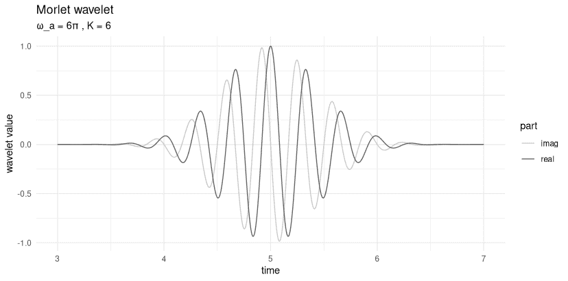

图 28.1：一个 Morlet 小波。

我们在这里看到的是一个复杂的正弦曲线——注意实部和虚部，它们通过$\pi/2$的相位差分开——在中心两侧都衰减。回顾方程 28.1，我们可以识别出导致这两个特征的因素。方程中的第一项，$e^{-i \omega_{a} (t_n - t_k)}$，产生了振荡；第三项，$e^{- \omega_a² (t_n - t_k )² /(2K )²}$，导致中心远离的指数衰减。（如果你对第二项，$e^{-K²}$感到好奇：对于给定的$K$，它只是一个常数。）

第三项实际上是一个高斯函数，其位置参数为$t_k$和尺度$K$。我们很快会详细讨论$K$，但$t_k$又是什么？$t_k$是小波的中心；对于 Morlet 小波，这也是最大振幅的位置。随着与中心距离的增加，值迅速接近零。这就是小波局部化的含义：它们只在短时间内“活跃”。**  **## 28.2 $K$和$\omega_a$的作用

现在，我们之前已经说过，$K$是高斯尺度；因此，它决定了曲线在时间上扩散多远。但还有$\omega_a$。回顾高斯项，它也会影响扩散。

首先，什么是$\omega_a$？下标$a$代表“分析”；因此，$\omega_a$表示一个被探测的单个频率。在此阶段，关于工作流程的快速说明——当我们实际运行小波变换时，这将会变得非常清楚）： 

* * *

一个单一的变换，产生类似频谱的三维输出，作用于一系列分析频率($\omega_a$)，并覆盖整个时间范围($t_n$)。

这种覆盖是通过让小波在输入上滑动来实现的，其位置在每一步由其中心，$t_k$确定。

这种描述中缺少的是$K$。这是因为你需要为感兴趣的每个$K$运行一个单独的小波分析。

* * *

现在，让我们首先从视觉上检查$\omega_a$和$K$的相应影响（图 28.2）。

```r
p1 <- create_wavelet_plot(6 * pi, 4, 5, sample_time)
p2 <- create_wavelet_plot(6 * pi, 6, 5, sample_time)
p3 <- create_wavelet_plot(6 * pi, 8, 5, sample_time)
p4 <- create_wavelet_plot(4 * pi, 6, 5, sample_time)
p5 <- create_wavelet_plot(6 * pi, 6, 5, sample_time)
p6 <- create_wavelet_plot(8 * pi, 6, 5, sample_time)

(p1 | p4) /
 (p2 | p5) /
 (p3 | p6)
```

*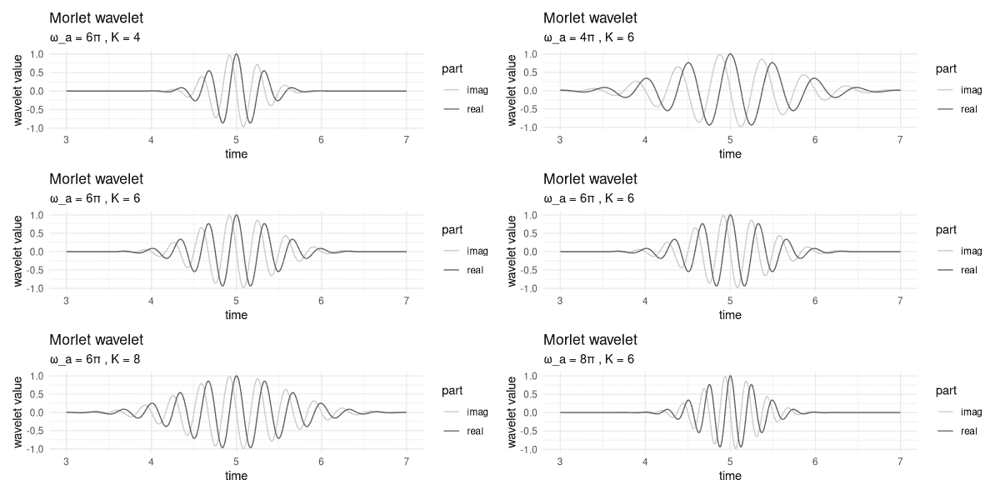

图 28.2：Morlet 小波：尺度和分析频率变化的影响。

在左列，我们保持 $\omega_a$ 不变，而改变 $K$。在右列，$\omega_a$ 发生变化，而 $K$ 保持不变。

首先，我们观察到 $K$ 越高，曲线就越分散。在波小波分析中，这意味着更多的时间点将贡献于变换的输出，从而在频率内容上具有高精度，但在时间上分辨率会降低。（我们很快就会回到这个——核心——权衡。）

关于 $\omega_a$，它的影响有两方面。一方面，在高斯项中，它正好抵消了——甚至——尺度参数 $K$。另一方面，它决定了波的频率，或者说，周期。为了理解这一点，请看一下右列。对应不同的频率，在 4 到 6 的区间内，我们分别有四个、六个或八个峰值。

$\omega_a$ 的这种双重作用是为什么，总的来说，当我们保持 $\omega_a$ 不变而缩小 $K$，或者保持 $K$ 不变而增加 $\omega_a$ 时，这确实会有所不同。

这种情况听起来很复杂，但实际上并没有看起来那么复杂。在实践中，理解 $K$ 的作用很重要，因为我们需要挑选合理的 $K$ 值来尝试。至于 $\omega_a$，另一方面，将会有许多不同的值，对应于我们分析的频率范围。

因此，为了更详细地了解 $K$ 的影响，我们需要首先看一下小波变换。*  *## 28.3 小波变换：直接实现

尽管波小波的主题更加复杂，因此可能比傅里叶分析看起来更加神秘，但变换本身更容易理解。它是一系列小波和信号之间的局部卷积。以下是特定尺度参数 $K$、分析频率 $\omega_a$ 和小波位置 $t_k$ 的公式：

$$ W_{K, \omega_a, t_k} = \sum_n x_n \Psi_{\omega_{a},K,t_{k}}^*(t_n) $$

这只是一个点积，计算的是信号和复共轭小波之间的点积。（在这里，复共轭翻转了小波在时间上的位置，使得这成为*卷积*而不是相关——这是一个非常重要的事实，你很快就会看到。）

相应地，直接实现的结果是一系列点积，每个点积对应于小波和信号的不同对齐方式。在下面的 `wavelet_transform()` 函数中，参数 `omega` 和 `K` 是标量，而 `x`，即信号，是一个向量。结果是针对特定 `K` 和 `omega` 的波变换信号。

```r
wavelet_transform <- function(x, omega, K) {
 n_samples <- dim(x)[1]
 W <- torch_complex(
 torch_zeros(n_samples), torch_zeros(n_samples)
 )
 for (i in 1:n_samples) {
 # move center of wavelet
 t_k <- x[i, 1]
 m <- morlet(omega, K, t_k, x[, 1])
 # compute local dot product
 # note wavelet is conjugated
 dot <- torch_matmul(
 m$conj()$unsqueeze(1),
 x[, 2]$to(dtype = torch_cfloat())
 )
 W[i] <- dot
 }
 W
}
```

*为了测试这一点，我们生成一个简单的正弦波，其第一部分频率为 100 赫兹，第二部分翻倍（图 28.3）。

```r
gencos <- function(amp, freq, phase, fs, duration) {
 x <- torch_arange(0, duration, 1 / fs)[1:-2]$unsqueeze(2)
 y <- amp * torch_cos(2 * pi * freq * x + phase)
 torch_cat(list(x, y), dim = 2)
}

# sampling frequency
fs <- 8000

f1 <- 100
f2 <- 200
phase <- 0
duration <- 0.25

s1 <- gencos(1, f1, phase, fs, duration)
s2 <- gencos(1, f2, phase, fs, duration)

s3 <- torch_cat(list(s1, s2), dim = 1)
s3[(dim(s1)[1] + 1):(dim(s1)[1] * 2), 1] <-
 s3[(dim(s1)[1] + 1):(dim(s1)[1] * 2), 1] + duration

df <- data.frame(
 x = as.numeric(s3[, 1]),
 y = as.numeric(s3[, 2])
)
ggplot(df, aes(x = x, y = y)) +
 geom_line() +
 xlab("time") +
 ylab("amplitude") +
 theme_minimal()
```

*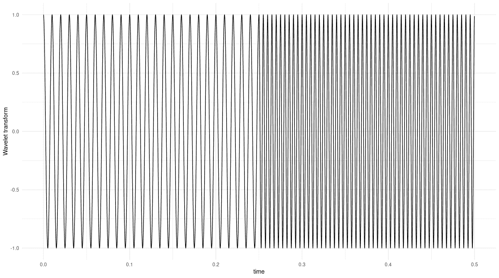

图 28.3：一个示例信号，由低频和高频两部分组成。

现在，我们对这个信号进行小波变换，分析频率为 100 赫兹，`K`参数为 2，这是通过快速实验得出的(图 28.4)：

```r
K <- 2
omega <- 2 * pi * f1

res <- wavelet_transform(x = s3, omega, K)
df <- data.frame(
 x = as.numeric(s3[, 1]),
 y = as.numeric(res$abs())
)

ggplot(df, aes(x = x, y = y)) +
 geom_line() +
 xlab("time") +
 ylab("Wavelet Transform") +
 theme_minimal()
```

*

图 28.4：上述两部分的信号的波 let 变换。分析频率为 100 赫兹。

变换正确地提取了与分析频率匹配的信号部分。如果你愿意，你可以检查一下分析频率为 200 赫兹时会发生什么。

现在，在现实中，我们希望对这个分析不是针对单个频率，而是针对我们感兴趣的频率范围。我们还想尝试不同的`K`尺度。现在，如果你执行了上面的代码，你可能会担心这可能会花费很多时间。

嗯，它必然比其傅里叶类似物频谱图计算时间更长。一方面，这是因为频谱图的分析“只是”二维的，轴是时间和频率。而在小波中，还有不同的尺度需要探索。其次，频谱图在整窗口上操作（具有可配置的重叠）；另一方面，小波在信号上以单位步长滑动。

尽管如此，情况并没有听起来那么严重。由于小波变换是一种**卷积**，我们可以在傅里叶域中实现它。我们很快就会这样做，但首先，如承诺的那样，让我们回顾一下`K`变化的主题。
  
## 28.4 时间分辨率与频率分辨率

我们已经看到，`K`值越高，小波就越分散。我们可以用我们的第一个、最直接简单的例子来调查一个直接后果。例如，当`K`设置为二十时会发生什么(图 28.5)？

```r
K <- 20

res <- wavelet_transform(x = s3, omega, K)
df <- data.frame(
 x = as.numeric(s3[, 1]),
 y = as.numeric(res$abs())
)

ggplot(df, aes(x = x, y = y)) +
 geom_line() +
 xlab("time") +
 ylab("Wavelet Transform") +
 theme_minimal()
```

*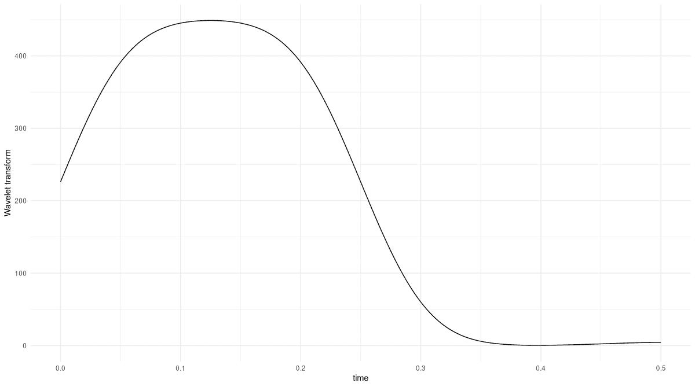

图 28.5：将`K`设置为二十而不是二时，上述两部分的信号的波 let 变换。

小波变换仍然能够正确地提取信号的相应区域——但现在，我们得到的是一个显著平滑的版本，它没有尖锐地分隔这两个区域。

值得注意的是，前 0.05 秒也显示了相当程度的平滑。小波越大，在开始和结束时丢失的元素乘积就越多。这是因为变换是通过将小波对齐到所有信号位置来计算的，从第一个到最后一个。具体来说，当我们计算位置`t_k = 1`处的点积时，只考虑信号的一个样本。

除了可能在边界处引入不可靠性之外，小波尺度如何影响分析？嗯，因为我们正在*相关*（技术上讲是卷积；但在这个情况下，最终的效果是相同的），所以点对点相似性很重要。具体来说，假设信号是一个纯正弦波，我们使用的小波是一个像 Morlet 这样的窗口正弦波，并且我们已经找到了一个很好的`K`来捕捉信号的频率。那么任何其他`K`，无论大小，都会导致更少的点对点重叠。

这引发了一个我们无法回避的问题。*  *## 28.5 这与频谱图有何不同？

很可能你已经在心理上把我们在这里做的事情与傅里叶变换本身进行比较，而不是与其窗口化的后代，即频谱图。两种方法都告诉我们频率成分随时间的变化。两者都涉及频率和时间分辨率之间的权衡。那么，它们有什么不同呢？

让我们从通常如何计算频谱图开始。通常，窗口大小对所有频率范围的选择是相同的。然后，高频的分辨率将优于低频，因为更多的周期可以拟合到一个分析窗口中。

为了对抗这一点，我们可以为不同频率范围选择不同的窗口大小。但然后，你如何做出这些选择呢？在波 let 分析中，实验不同的`K`要方便得多，尤其是随着经验的增长，这些探索将越来越少地像试错过程。

## 28.6 在傅里叶域执行小波变换

很快，我们将对更长的信号运行小波变换。因此，现在是时候加快计算速度了。我们之前已经说过，在这里，我们受益于时域卷积在傅里叶域中等同于乘法。整个过程是这样的：首先，计算信号和小波的 DFT；其次，乘以结果；第三，逆变换回到时域。

使用 Morlet 小波，我们甚至不需要运行 FFT：其傅里叶域表示可以用闭式形式表示。我们将从一开始就利用这个公式。

为了看到这是如何工作的，我们首先手动逐步通过这个过程。在下一节中，我们将把事情打包起来以便快速执行。

这里，首先，是信号。它再次由两个不同的频率组成，100 赫兹和 200 赫兹。但这次，我们重复交替几次，并将这些频率映射到不同的振幅。后者可能看起来是无害的改变，但有一个重要的后果：我们必须调整我们的余弦生成代码来跟踪相位。如果我们不这样做，信号将在过渡点被扭曲。

```r
gencosines <- function(freqs, amps, samples_per_frame, fs) {
 t <- (1:samples_per_frame) / fs
 lastphase <- 0
 x <- torch_zeros(length(freqs), samples_per_frame)

 for (i in 1:length(freqs)) {
 amp <- torch_ones(samples_per_frame) * amps[i]
 freq <- torch_ones(samples_per_frame) * freqs[i]

 phase <- torch_tensor(2 * pi * freq * t + lastphase)
 x_frame <- amp * torch_cos(phase)

 # save phase to be used in next frame
 lastphase <- as.numeric(phase[samples_per_frame]) %%
 (2 * pi)
 x[i, ] <- x_frame
 }

 x$reshape(length(freqs) * samples_per_frame)
}
```

*以下是信号 (图 28.6)：

```r
freqs <- c(100, 200, 100, 200, 100, 200, 100)
amps <- c(1.2, 0.8, 1.2, 0.8, 1.2, 0.8, 1.2)
samples_per_frame <- 100
fs <- 800

x <- gencosines(freqs, amps, samples_per_frame, fs)
df <- data.frame(x = 1:dim(x)[1], y = as.numeric(x))
ggplot(df, aes(x = x, y = y)) +
 geom_line() +
 xlab("sample") +
 ylab("amplitude") +
 theme_minimal()
```

*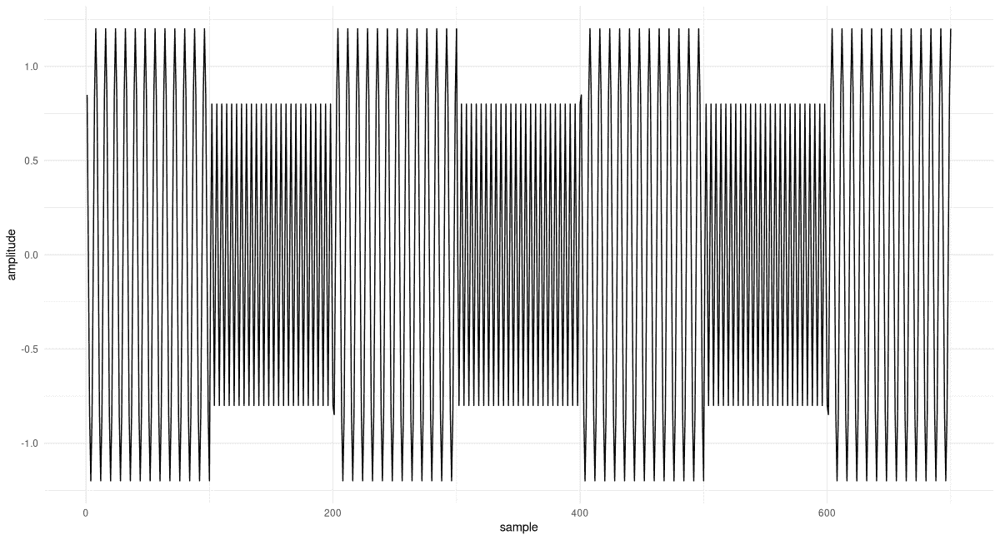

图 28.6：一个由交替、不同幅度低频和高频部分组成的信号。

信号的 DFT 很快就被计算出来：

```r
F <- torch_fft_fft(x)
```

*波 let 的傅里叶域表示由以下给出：

```r
morlet_fourier <- function(K, omega_a, omega) {
 2 * (torch_exp(-torch_square(
 K * (omega - omega_a) / omega_a
 )) -
 torch_exp(-torch_square(K)) *
 torch_exp(-torch_square(K * omega / omega_a)))
}
```

*将这个波 let 的陈述与时域陈述进行比较，我们看到——正如预期的那样——现在它使用的是参数`omega`和`omega_a`，而不是`t`和`t_k`。后者`omega_a`是分析频率，我们正在探测的标量；前者`omega`是信号 DFT 中出现的频率范围。

在实例化小波时，有一件事我们需要特别注意。在 FFT 思维中，频率是桶；它们的数量由信号的长度（这个长度，从其本身来说，直接依赖于采样频率）决定。另一方面，我们的波 let 使用赫兹频率（从用户的角度来看，这是一个很好的单位；因为这个单位对我们来说是有意义的）。这意味着对于`morlet_fourier`，作为`omega_a`，我们需要传递的不是赫兹值，而是相应的 FFT 桶。转换是通过将桶的数量，`dim(x)[1]`，与信号的采样频率`fs`相关联来完成的：

```r
# again look for 100Hz parts
omega <- 2 * pi * f1

# need the bin corresponding to some frequency in Hz
omega_bin <- f1/fs * dim(x)[1]
```

*我们实例化波 let，执行傅里叶域乘法，并对结果进行逆变换：

```r
K <- 3

m <- morlet_fourier(K, omega_bin, 1:dim(x)[1])
prod <- F * m
transformed <- torch_fft_ifft(prod)
```

*这是结果 (图 28.7)：

```r
df <- data.frame(
 x = as.numeric(1:dim(x)[1]) / fs,
 y = as.numeric(transformed$abs())
)
ggplot(df, aes(x = x, y = y)) +
 geom_line() +
 xlab("time") +
 ylab("Wavelet Transform") +
 theme_minimal()
```

*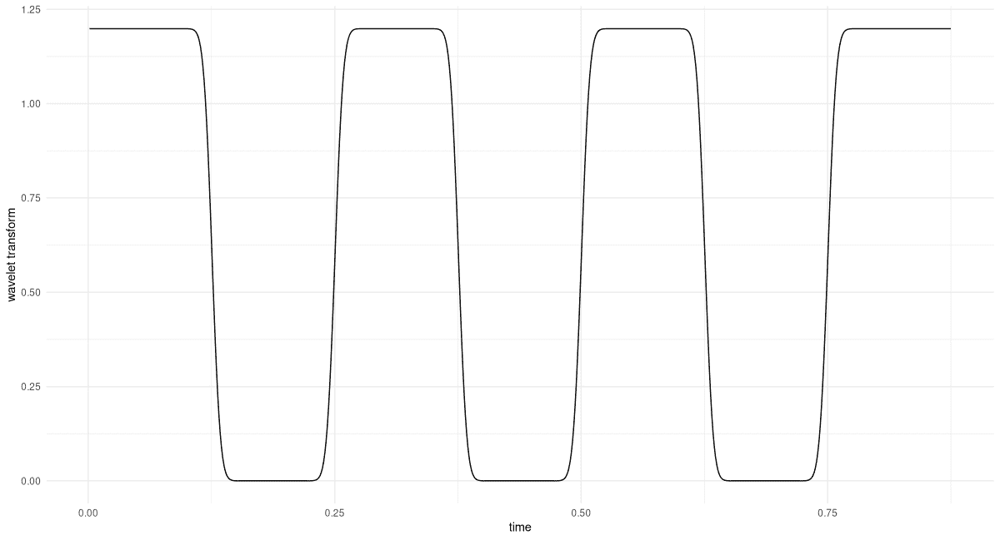

图 28.7：上述交替频率信号的波 let 变换。分析频率为 100 赫兹。

所有 100 赫兹区域都被完美地识别。此外，从 y 轴来看，我们看到幅度是正确的。

将小波实例化和分析涉及的步骤结合起来，我们得到以下内容。（注意现在如何`wavelet_transform_fourier`，我们方便地传递了赫兹频率值。）

```r
wavelet_transform_fourier <- function(x, omega_a, K, fs) {
 N <- dim(x)[1]
 omega_bin <- omega_a / fs * N
 m <- morlet_fourier(K, omega_bin, 1:N)
 x_fft <- torch_fft_fft(x)
 prod <- x_fft * m
 w <- torch_fft_ifft(prod)
 w
}
```

*让我们用这个来探测第二个使用的频率，200 赫兹 (图 28.8)。

```r
K <- 6

transformed <- wavelet_transform_fourier(x, f2, K, fs)
df <- data.frame(
 x = 1:dim(x)[1] / fs,
 y = as.numeric(transformed$abs())
)
ggplot(df, aes(x = x, y = y)) +
 geom_line() +
 xlab("time") +
 ylab("Wavelet Transform") +
 theme_minimal()
```

*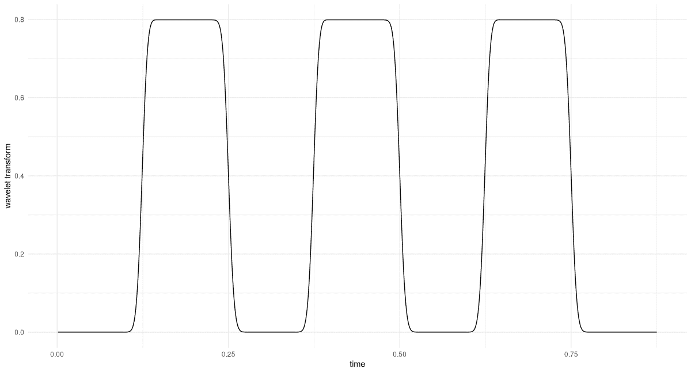

图 28.8：上述交替频率信号的波 let 变换。分析频率为 200 赫兹。

再次，我们发现匹配区域以及幅度都被正确地识别了。

我们已经取得了显著的进展。我们现在准备进行最后一步：对感兴趣频率范围内的分析进行自动化。这将导致一个三维表示，即小波图。
  
28.7 创建小波图

在傅里叶变换中，我们获得的系数数量取决于信号长度，实际上减少到采样频率的一半。与其波 let 类似，因为我们无论如何都在对频率进行循环，我们不妨决定要分析哪些频率。

首先，通过运行 DFT 可以确定感兴趣的频率范围。接下来，问题是关于粒度。在这里，我将遵循 Vistnes 书中给出的建议，该建议基于当前频率值与小波尺度 `K` 之间的关系。

频率的迭代通过循环实现：

```r
wavelet_grid <- function(x, K, f_start, f_end, fs) {
 # downsample analysis frequency range
 # as per Vistnes, eq. 14.17
 num_freqs <- 1 + log(f_end / f_start)/ log(1 + 1/(8 * K))
 freqs <- seq(f_start, f_end, length.out = floor(num_freqs))

 transformed <- torch_zeros(
 num_freqs, dim(x)[1],
 dtype = torch_cfloat()
 )
 for(i in 1:num_freqs) {
 w <- wavelet_transform_fourier(x, freqs[i], K, fs)
 transformed[i, ] <- w
 }
 list(transformed, freqs)
}
```

*调用 `wavelet_grid()` 将会给我们分析频率以及相应的 Wavelet 变换输出。

接下来，我们创建一个可视化结果的实用函数。默认情况下，`plot_wavelet_diagram()` 显示小波变换序列的幅度；然而，它也可以绘制平方幅度，以及它们的平方根，这是一种由 Vistnes 非常推荐的方法，我们很快就能看到其有效性。

这个函数值得进一步讨论。

首先，就像我们对分析频率所做的那样，我们对信号本身进行下采样，避免提出一个实际上并不存在的分辨率。公式再次来自 Vistnes 的书。

然后，我们使用插值来获得新的时频网格。如果我们保持原始网格，这一步甚至可能是必要的，因为当网格点之间的距离非常小的时候，R 的 `image()` 函数可能会拒绝接受等间距的轴。

最后，注意频率是如何以对数尺度排列的。这导致了许多更有用的可视化效果。

```r
plot_wavelet_diagram <- function(x,
 freqs,
 grid,
 K,
 fs,
 f_end,
 type = "magnitude") {
 grid <- switch(type,
 magnitude = grid$abs(),
 magnitude_squared = torch_square(grid$abs()),
 magnitude_sqrt = torch_sqrt(grid$abs())
 )

 # downsample time series
 # as per Vistnes, eq. 14.9
 new_x_take_every <- max(K / 24 * fs / f_end, 1)
 new_x_length <- floor(dim(grid)[2] / new_x_take_every)
 new_x <- torch_arange(
 x[1],
 x[dim(x)[1]],
 step = x[dim(x)[1]] / new_x_length
 )

 # interpolate grid
 new_grid <- nnf_interpolate(
 grid$view(c(1, 1, dim(grid)[1], dim(grid)[2])),
 c(dim(grid)[1], new_x_length)
 )$squeeze()
 out <- as.matrix(new_grid)

 # plot log frequencies
 freqs <- log10(freqs)

 image(
 x = as.numeric(new_x),
 y = freqs,
 z = t(out),
 ylab = "log frequency [Hz]",
 xlab = "time [s]",
 col = hcl.colors(12, palette = "Light grays")
 )
 main <- paste0("Wavelet Transform, K = ", K)
 sub <- switch(type,
 magnitude = "Magnitude",
 magnitude_squared = "Magnitude squared",
 magnitude_sqrt = "Magnitude (square root)"
 )

 mtext(side = 3, line = 2, at = 0, adj = 0, cex = 1.3, main)
 mtext(side = 3, line = 1, at = 0, adj = 0, cex = 1, sub)
}
```

*现在，让我们看看几个波 let 图。我们将比较两个类别的选择。第一个是关于 *显示什么*：幅度、幅度平方还是平方根。由于选项有限，实际上你可以尝试所有这些。然而，第二个是至关重要的：它是关于 `K`，即 Morlet 小波的尺度。

虽然在理论上可能的 `K` 值范围是无限的，但当我们开始增大或缩小 `K` 时，我们会很快看到相应的影响。在出版物中，你当然可以提供几个不同 `K` 的图表。（也许你甚至应该这样做；传达的信息可能是互补的。）

我们从一个固定的 `K` 值 12 开始，并保持默认显示（即幅度；参见 图 28.9）。至于要分析的频率范围，它直接来源于我们自行生成数据。

```r
f_start <- 70
f_end <- 230

K <- 12
c(grid, freqs) %<-% wavelet_grid(
 x, K, f_start, f_end, fs
)
plot_wavelet_diagram(
 torch_tensor(1:dim(grid)[2]), freqs, grid, K, fs, f_end
)
```

*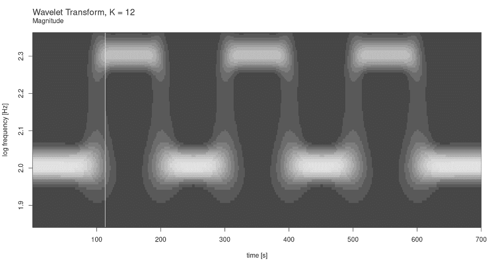

图 28.9：对于 K = 12 的上述交替频率信号的波 let 图。默认显示幅度。

现在比较一下平方幅度的情况（图 28.10）。

```r
plot_wavelet_diagram(
 torch_tensor(1:dim(grid)[2]), freqs, grid, K, fs, f_end,
 type = "magnitude_squared"
)
```

*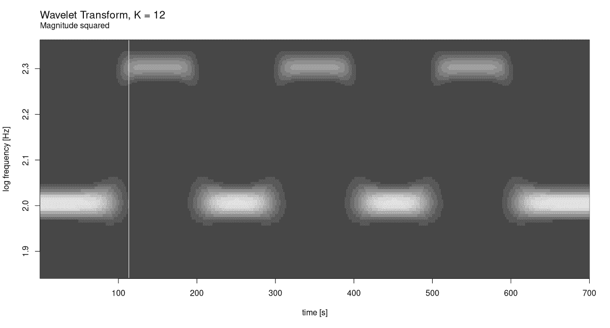

图 28.10：对于 K = 12 的上述交替频率信号的波 let 图。显示幅度平方。

以及平方根（图 28.11）：

```r
plot_wavelet_diagram(
 torch_tensor(1:dim(grid)[2]), freqs, grid, K, fs, f_end,
 type = "magnitude_sqrt"
)
```

*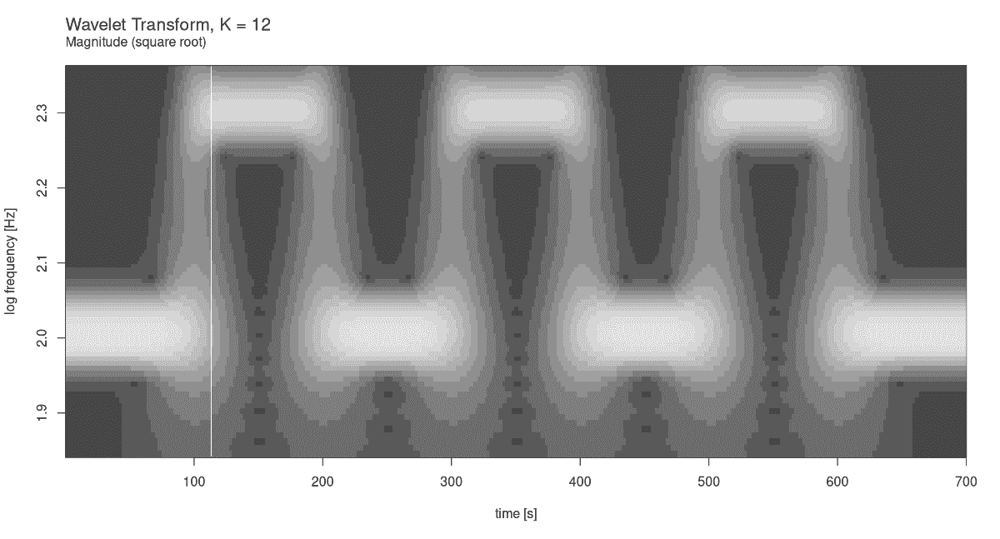

图 28.11：上述交替频率信号的波形图，显示幅度平方根。

在这种情况下，哪种显示模式效果最好是很明显的。但这仅仅是因为我们创建了一个非常规则的信号。

现在，让我们看看对于较小的`K`会发生什么：比如说 6。我们只绘制了幅度平方(图 28.12)。

```r
K <- 6
c(grid, freqs) %<-% wavelet_grid(
 x, K, f_start, f_end, fs
)
plot_wavelet_diagram(
 torch_tensor(1:dim(grid)[2]), freqs, grid, K, fs, f_end,
 type = "magnitude_squared"
)
```

*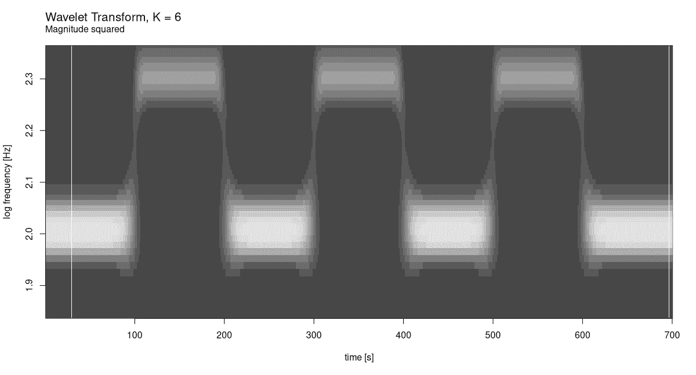

图 28.12：频率为 K = 6 的上述交替频率信号的波形图。

虽然频率分辨率明显变差，但在处理时间方面并没有相应的改进。再次强调，这并不令人惊讶，因为信号本身就是这样的。

那么其他方向呢？对于`K = 24`，我们有(图 28.13)：

```r
K <- 24
c(grid, freqs) %<-% wavelet_grid(
 x, K, f_start, f_end, fs
)
plot_wavelet_diagram(
 torch_tensor(1:dim(grid)[2]), freqs, grid, K, fs, f_end,
 type = "magnitude_squared"
)
```

*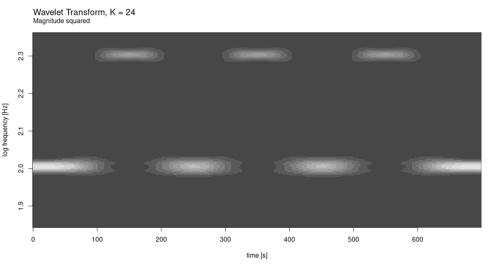

图 28.13：频率为 K = 24 的上述交替频率信号的波形图。

在这个尺度上，我们确实看到了时间分辨率的下降。显然，我们最初选择的 12 是更好的选择。不过，出于好奇，让我们看看对于更大的`K`（图 28.14）会发生什么。

```r
K <- 48
c(grid, freqs) %<-% wavelet_grid(
 x, K, f_start, f_end, fs
)
plot_wavelet_diagram(
 torch_tensor(1:dim(grid)[2]), freqs, grid, K, fs, f_end,
 type = "magnitude_squared"
)
```

*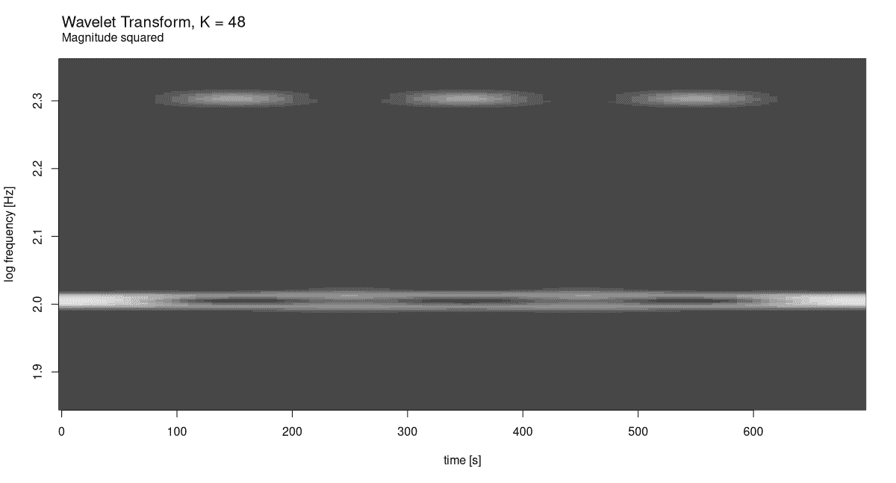

图 28.14：频率为 K = 48 的上述交替频率信号的波形图。

结果不言自明。

最后——现在我们有了可重用的代码片段，并对小波的时间-频率权衡有了初步的了解——我们用一个实际例子来总结。
  
## 28.8 一个现实世界的例子：麻雀的歌声

对于案例研究，我选择了在我看来是 Vistnes 书中最令人印象深刻的波形分析。这是一只麻雀唱歌的样本，可以在 Vistnes 的网站上找到。

```r
url <- "http://www.physics.uio.no/pow/wavbirds/chaffinch.wav"

download.file(
 file.path(url),
 destfile = "resources/chaffinch.wav"
)
```

*我们使用 `torchaudio` 来加载文件，并使用 `tuneR` 的 `mono()` 函数将立体声转换为单声道。（对于我们所做的这种分析，保留两个通道是没有意义的。）

```r
library(torchaudio)
library(tuneR)

wav <- tuneR_loader("resources/chaffinch.wav")
wav <- mono(wav, "both")
wav
```

```r
Wave Object
    Number of Samples:      1864548
    Duration (seconds):     42.28
    Samplingrate (Hertz):   44100
    Channels (Mono/Stereo): Mono
    PCM (integer format):   TRUE
    Bit (8/16/24/32/64):    16 
```

对于分析，我们不需要完整的序列。方便的是，Vistnes 还发布了一项建议，说明应该分析哪些样本范围。

```r
waveform_and_sample_rate <- transform_to_tensor(wav)
x <- waveform_and_sample_rate[[1]]$squeeze()
fs <- waveform_and_sample_rate[[2]]

# http://www.physics.uio.no/pow/wavbirds/chaffinchInfo.txt
start <- 34000
N <- 1024 * 128
end <- start + N - 1
x <- x[start:end]

dim(x)
```

```r
[1] 131072
```

见图 28.15 以查看时域视图。（不要错过在您的笔记本电脑上实际*聆听*它的机会。）

```r
df <- data.frame(x = 1:dim(x)[1], y = as.numeric(x))
ggplot(df, aes(x = x, y = y)) +
 geom_line() +
 xlab("sample") +
 ylab("amplitude") +
 theme_minimal()
```

*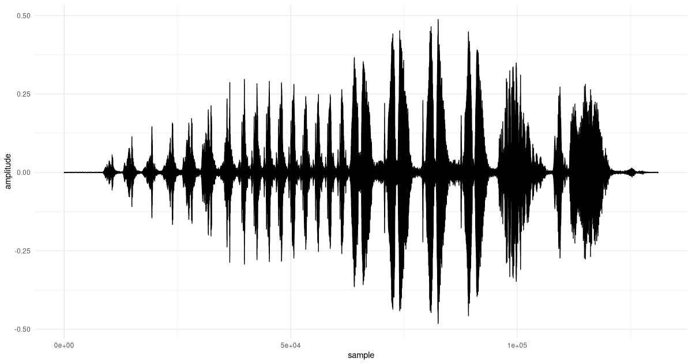

图 28.15：麻雀的歌声。

现在，我们需要确定一个合理的分析频率范围。为此，我们运行 FFT：

```r
F <- torch_fft_fft(x)
```

*在 x 轴上，我们绘制频率，而不是样本数，为了更好的可见性，我们稍微放大了一些(图 28.16)。

```r
bins <- 1:dim(F)[1]
freqs <- bins / N * fs

# the bin, not the frequency
cutoff <- N/4

df <- data.frame(
 x = freqs[1:cutoff],
 y = as.numeric(F$abs())[1:cutoff]
)
ggplot(df, aes(x = x, y = y)) +
 geom_col() +
 xlab("frequency (Hz)") +
 ylab("magnitude") +
 theme_minimal()
```

*

图 28.16：金翅雀的歌声，傅里叶频谱（摘录）。

基于这个分布，我们可以安全地将分析频率的范围限制在大约 1800 到 8500 赫兹之间。（这也是 Vistnes 推荐的范围。）

首先，让我们通过为这个信号创建一个频谱图来锚定期望。通过实验找到了 FFT 大小和窗口大小的合适值。尽管在频谱图中不常看到这样做，但我发现显示系数幅度的平方根可以产生最有信息量的输出。

```r
fft_size <- 1024
window_size <- 1024
power <- 0.5

spectrogram <- transform_spectrogram(
 n_fft = fft_size,
 win_length = window_size,
 normalized = TRUE,
 power = power
)

spec <- spectrogram(x)
dim(spec)
```

```r
[1] 513 257
```

就像我们在小波图中做的那样，我们在对数尺度上绘制频率（图 28.17）。

```r
bins <- 1:dim(spec)[1]
freqs <- bins * fs / fft_size
log_freqs <- log10(freqs)

frames <- 1:(dim(spec)[2])
seconds <- (frames / dim(spec)[2])  * (dim(x)[1] / fs)

image(x = seconds,
 y = log_freqs,
 z = t(as.matrix(spec)),
 ylab = 'log frequency [Hz]',
 xlab = 'time [s]',
 col = hcl.colors(12, palette = "Light grays")
)
main <- paste0("Spectrogram, window size = ", window_size)
sub <- "Magnitude (square root)"
mtext(side = 3, line = 2, at = 0, adj = 0, cex = 1.3, main)
mtext(side = 3, line = 1, at = 0, adj = 0, cex = 1, sub)
```

*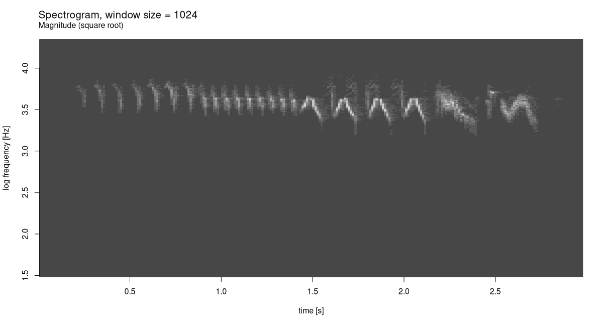

图 28.17：金翅雀的歌声，频谱图。

频谱图已经显示出一种独特的模式。让我们看看小波分析能做什么。经过对几个不同的`K`值进行实验，我同意 Vistnes 的观点，`K = 48`是一个非常好的选择（图 28.18）。

```r
f_start <- 1800
f_end <- 8500

K <- 48
c(grid, freqs) %<-% wavelet_grid(x, K, f_start, f_end, fs)
plot_wavelet_diagram(
 torch_tensor(1:dim(grid)[2]),
 freqs, grid, K, fs, f_end,
 type = "magnitude_sqrt"
)
```

*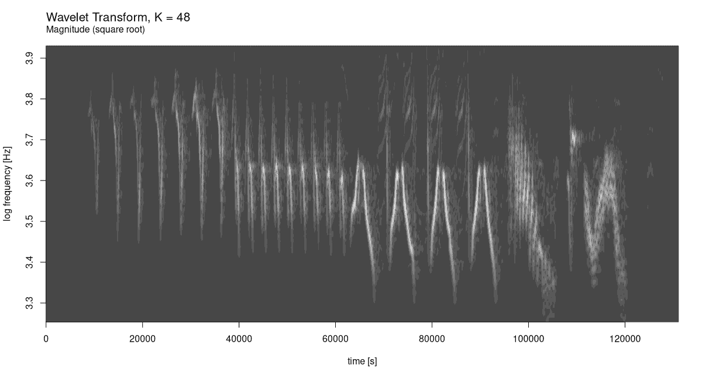

图 28.18：金翅雀的歌声，小波图。

在时间和频率轴上的分辨率提升非常令人印象深刻。

通过这个例子，希望它能够激发灵感，我结束了这一章，以及整本书。我祝愿你们在未来的`torch`探索中一切顺利！

Vistnes, Arnt Inge. 2018\. *振荡和波动的物理. 使用 Matlab 和 Python*. Springer.
 
 * *

1.  在 Dennis Gabor 提出使用高斯窗复指数进行时频分解的想法之后，以及 Jean Morlet 对结果进行阐述和形式化之后。↩︎

