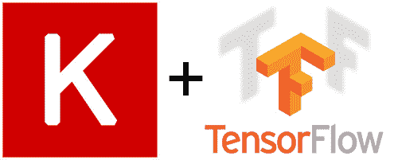

# 如何利用 TensorFlow 的 TFRecord 训练 Keras 模型

> 原文：<https://www.dlology.com/blog/how-to-leverage-tensorflows-tfrecord-to-train-keras-model/>

###### 发布者:[程维](/blog/author/Chengwei/)五年零一个月前

([评论](/blog/how-to-leverage-tensorflows-tfrecord-to-train-keras-model/#disqus_thread))



#### 更新:

*   2019 年 5 月 29 日:  [源代码](https://github.com/Tony607/Keras_catVSdog_tf_estimator) 更新运行在 TensorFlow 1.13 上。

在我们之前的帖子中，我们发现了[如何使用 Keras 模型](https://www.dlology.com/blog/an-easy-guide-to-build-new-tensorflow-datasets-and-estimator-with-keras-model/)为最新的 TensorFlow 1.4.0 构建新的 TensorFlow 数据集和估计器。输入函数将原始图像文件作为输入。在本帖中，我们将继续我们的旅程，利用 Tensorflow **TFRecord** 减少 21%的培训时间。

我会给你看

*   如何把我们的图像文件变成一个 TFRecord 文件？
*   修改我们的输入函数来读取 TFRecord 数据集。

在继续阅读之前，如果你还没有看完我们的[上一篇文章](https://www.dlology.com/blog/an-easy-guide-to-build-new-tensorflow-datasets-and-estimator-with-keras-model/)，建议你去看看。以便您熟悉将 Keras 模型转换为张量流估计量的过程，以及数据集 API 的基础知识。

## 将图像文件转换为 TFRecord 文件

一旦我们有了图像文件和相关标签的列表(0-猫，1-狗)。

```py
['./data/dog_vs_cat_small\\train\\cats\\cat.954.jpg'
 './data/dog_vs_cat_small\\train\\dogs\\dog.240.jpg'
 './data/dog_vs_cat_small\\train\\dogs\\dog.887.jpg'
 './data/dog_vs_cat_small\\train\\cats\\cat.770.jpg'
 './data/dog_vs_cat_small\\train\\dogs\\dog.802.jpg'
 './data/dog_vs_cat_small\\train\\dogs\\dog.537.jpg'
 './data/dog_vs_cat_small\\train\\cats\\cat.498.jpg'
 './data/dog_vs_cat_small\\train\\cats\\cat.554.jpg'
 './data/dog_vs_cat_small\\train\\cats\\cat.589.jpg'
 './data/dog_vs_cat_small\\train\\dogs\\dog.685.jpg' ...]
[0 1 1 0 1 1 0 0 0 1 ...]
```

我们可以编写从磁盘读取图像的函数，并将它们和类标签一起写入 TFRecord 文件。

注意，在`convert`函数中，我们将所有图像的大小调整为(150，150 ),这样我们就不必像上一篇文章那样在训练过程中这样做了，这也使得生成的 TFRecord 文件的大小变小了。

如果我们调用`convert`函数，它将为我们生成训练和测试 TFRecord 文件。

## 输入函数读取 TFRecord 数据集

我们的估计器需要一个新的输入函数来读取 TFRecord 数据集文件，我们调用` tf.data.TFRecordDataset`函数来读取我们之前创建的 TFRecord 文件。

注意，由于图像数据是序列化的，所以我们需要用`tf.reshape`将它转换回原始形状(150，150，3)。

## 训练和评估模型

与前一篇文章类似，`imgs_input_fn`函数获取 TFRecord 文件的路径，并且没有用于**标签**的参数，因为它们已经包含在 TFRecord 文件中。

## 结果

为了向您展示训练速度提升的结果，我们对`tf.estimator.train_and_evaluate`调用的执行进行了计时。

前一篇文章阅读原始图像和标签。

```py
--- 185.2788429260254 seconds ---
```

此帖子以 TFRecord 文件作为数据集。

```py
--- 146.32020020484924 seconds ---
```

## 未来工作

我们在这里使用的猫和狗的数据集相对较小。如果我们正在处理不适合我们的内存的大型数据集。我们在文章中使用的同一个`tf.data.TFRecordDataset`类也使我们能够将多个 TFRecord 文件的内容作为输入管道的一部分进行流式传输。

查看我的 GitHub 中的 [完整源代码](https://github.com/Tony607/Keras_catVSdog_tf_estimator)

进一步阅读

[Tensorflow 指南-数据集-消费 TFRecord 数据](https://www.tensorflow.org/programmers_guide/datasets#consuming_tfrecord_data)

[Share on Twitter](https://twitter.com/intent/tweet?url=https%3A//www.dlology.com/blog/how-to-leverage-tensorflows-tfrecord-to-train-keras-model/&text=How%20to%20leverage%20TensorFlow%27s%20TFRecord%20to%20train%20Keras%20model) [Share on Facebook](https://www.facebook.com/sharer/sharer.php?u=https://www.dlology.com/blog/how-to-leverage-tensorflows-tfrecord-to-train-keras-model/)

*   [←使用 Keras 模型构建新张量流数据集和估计量的简单指南](/blog/an-easy-guide-to-build-new-tensorflow-datasets-and-estimator-with-keras-model/)
*   [一个简单的技巧，通过批量标准化更快地训练 Keras 模型→](/blog/one-simple-trick-to-train-keras-model-faster-with-batch-normalization/)