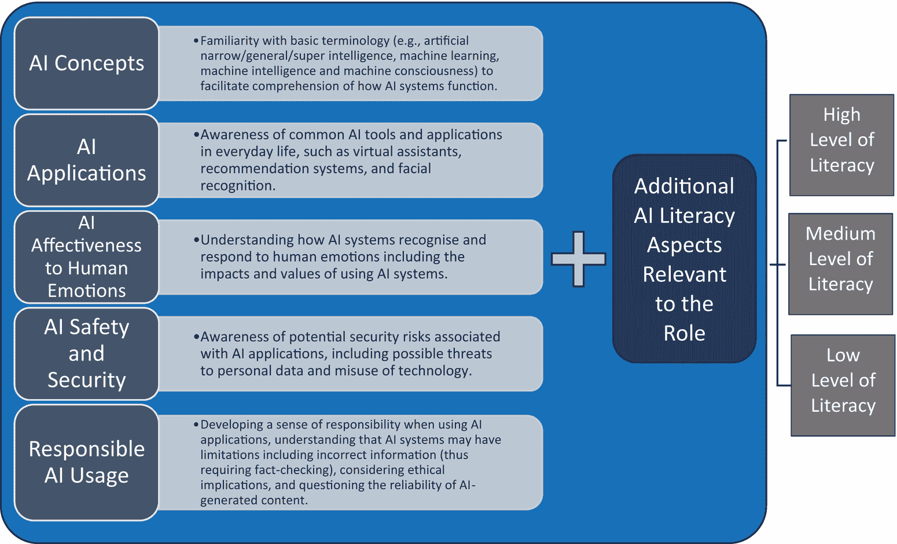

# 2 人工智能素养

DOI: [10.4324/9781003459026-2](https://dx.doi.org/10.4324/9781003459026-2)

> 对于普通人来说，人工智能素养是指理解、评估、与人工智能技术互动以及在日常生活中做出明智决策的能力。它包括理解人工智能的基本原理，识别其应用，了解其伦理、社会和隐私影响，以及理解人工智能对人类和人类情感的影响，同时负责任地与人工智能系统互动。
> 
> 塞西莉亚·K·Y·陈

## 2.1 引言

人工智能（AI）不仅促进了人类之间以及人类与机器之间的沟通，还提供了一系列交互媒介和渠道，包括基于文本的、图形的、音频的、视频的，甚至基于编码的响应。随着人工智能技术的不断进步，其融入社会各个领域的程度变得更加普遍——我们现在看到人工智能在我们的生活的许多角落都产生了影响，无论是在个性化的在线购物推荐，还是我们在屏幕上滚动浏览的社交媒体内容。例如，考虑一下 Netflix 或 YouTube 等平台上的 AI 算法是如何通过推荐新的节目或视频来影响我们观看的内容（Brynjolfsson & McAfee, 2014 [#ref2_3]）。它已经成为一个稳定的伴侣，微妙地塑造着我们的互动、选择和社会结构，因此对于个人来说，发展对其能力和局限性的基础理解变得更加重要（Casal-Otero et al., 2023 [#ref2_6]）。培养人工智能素养使人们能够更好地理解驱动这些系统的潜在机制，识别潜在的偏见，并为关于人工智能技术伦理和社会影响的持续对话做出贡献。而且，即将到来的 AI 原生一代，将是第一个从未生活在没有人工智能技术世界的群体。

本章探讨了在当今数字世界中理解人工智能的重要性，特别是对于高等教育中的学生和教师。简单来说，人工智能素养是了解人工智能如何工作以及如何明智和道德地使用它的能力。这不仅仅是关于技术熟练；它还关乎理解人工智能的影响，做出明智的选择，并意识到它所引发的伦理问题。对于高等教育中的学生和教师来说，具备人工智能素养至关重要，因为人工智能正成为大学学习、研究和管理的一个重要部分。我们将探讨专家对人工智能素养的看法，探讨其含义、为什么需要它以及如何发展它，特别关注其在高等教育中的作用。接下来的部分将分析现有的文献和研究，阐明人工智能素养的概念化、必要性和实施，从而丰富我们的理解，并为在教育范式中有效整合人工智能的未来路径提供支撑。

## 2.2 人工智能素养的重要性

人工智能使用的潜力和陷阱广泛，包括影响隐私、决策和社会经济动态的方面，突显了理解其机制、应用和影响的重要性。因此，人工智能素养成为在技术系统和算法中揭示复杂性和微妙性的关键工具。具备人工智能素养不仅帮助我们更好地使用技术，还提高了我们检查、质疑和引导数字世界发展的能力。通过了解人工智能能做什么和不能做什么，人们可以做出更明智的选择，制定更好的计划，并就技术的使用和控制进行重要讨论。随着人工智能成为我们日常生活越来越大的部分，对每个人来说，对它有一个基本了解至关重要。

在教育环境中，人工智能素养的重要性同样不容忽视。尽管通常人们会重视为学生提供必要的人工智能技能，但认识到教师作为学习的主要渠道，也需要在利用人工智能方面具备熟练度是至关重要的。对于学生来说，这关乎培养一套既技术性强又批判性的技能组合，不仅为他们准备现有的就业市场，还使他们能够道德地、战略性地、创新性地导航未来将无疑更加紧密地与技术交织在一起的地形。对于教育者和管理者来说，人工智能素养对于制定明智的政策至关重要，确保治理和监管框架在解决学术环境中实施人工智能技术的复杂性和伦理困境方面是有效的。此外，对人工智能的深入理解对于战略资源分配至关重要，可以提升机构的运营并创造前瞻性的教育体验。这有助于机构和其社区跟上我们数字和人工智能驱动世界中快速变化的步伐。然而，对于一些教育者来说，发展如人工智能素养等新能力可能颇具挑战；当然，他们转变思维模式和获取这些技能的过程本身可能就会带来一系列挑战。因此，政策制定者也应考虑这些问题，并在解决这些问题时保持警觉。

尽管公众对人工智能（West & Allen, 2018）的理解有限，但已经建立了许多人工智能培训项目，以使劳动力具备更深入的知识（Bughin et al., 2018；Chan, 2023；Kong et al., 2021）。各种公司已经推出了人工智能学习和技能提升计划（Vinuesa et al., 2020），以广泛教育员工并弥合日益增长的技能差距。为儿童设计的项目也表明，即使是 10 岁以下的儿童也能掌握基本概念，并以创新的方式利用它们来解决他们社区的问题（Kahn & Winters, 2017；Wolfram, 2017）。所有这些人工智能培训努力都需要我们在人工智能方面具备基础素养。但什么是人工智能素养？它由什么构成？

## 2.3 数字世界的素养

各种素养的历史揭示了令人着迷的演变，反映了技术和信息访问的进步和扩展（Buckingham, 1993）。最初，信息素养至关重要，它为有效地辨别和利用快速增长且易于获取的信息提供了基础，尤其是在图书馆和研究环境中。然后，随着不同的技术时代的展开，还提出了其他几种素养，以适应新媒体和技术带来的需求和挑战。从理解媒体信息的含义和导航数字世界，到解读数据和与人工智能互动，每种素养都是建立在之前的素养之上的，共同编织出我们当前信息时代所需的多维能力之网。以下，我们整理了一些在数字世界中常用的素养。详细信息可以在表 2.1 中找到。

表 2.1 数字世界的常见素养

| 信息素养： |
| --- |
| 当 | 由信息产业协会主席保罗·祖科夫斯基在 1974 年（[#ref2_38]）提出。 |
| 定义 | 当需要信息时能够识别，并具备定位、评估和有效使用信息的能力，通常在研究和决策环境中。 |
| 重点关注 | 区分可靠信息与不可靠信息，并在信息杂乱的环境中合法、道德地使用信息。它是其他素养的基础。 |
| 媒体素养： |
| 当 | 20 世纪中叶起源，并在 20 世纪后半叶随着大众媒体的兴起而变得突出。 |
| 定义 | 理解、分析和在传统（例如，报纸、电视）和数字平台上创建媒体。 |
| 关注点 | 临界性地分析媒体内容，以理解其创作、目的和信息。索尼娅 Livingstone 的 2004 年模型 强调在各种背景下获取、分析、评估和创造信息。 |
| 数字素养： |
| 何时 | 由保罗·吉尔斯特于 1997 年提出。 |
| 定义 | 能够从广泛来源以多种格式理解和使用信息的能力，尤其是通过计算机和互联网。 |
| 关注点 | 对数字工具/平台的实际理解，导航数字信息空间，评估内容，以及在数字网络中有效参与。 |
| 数据素养： |
| 何时 | 在 21 世纪初大数据时代到来时受到关注，由 Wolff 等人 (2016) 强调。 |
| 定义 | 能够阅读、理解、创建和传达数据作为信息的能力。 |
| 关注点 | 解释、构建、评估数据质量，识别模式/趋势，并基于数据分析做出明智的决策。关键组成部分包括数据探索、管理和使用。 |
| 计算素养： |
| 何时 | 通过珍妮特·M. Wing 的 2006 年论文 获得关注。 |
| 定义 | 强调问题解决过程，并涉及以计算机也能执行的方式制定问题和解决方案。 |
| 关注点 | 在计算机和编程教育中很重要，它强调了在各个学科中解决问题的计算思维。 |
| 人工智能素养： |
| 何时 | 由 Konishi 于 2015 年提出，随后在 Kandlhofer 等人 (2016) 的实证研究中被采用。 |
| 定义 | 对于普通个人而言，人工智能素养是理解、互动并在日常生活中就人工智能技术做出明智决策的能力 (Chan, 2023)。 |
| 关注点 | 涉及理解人工智能的基本原理，识别其应用，并在与人工智能系统负责任互动的同时，意识到伦理、社会和隐私影响。 |

**信息素养**通常被视为一种基础素养。其根源可以追溯到几十年前，信息产业协会主席保罗·祖科夫斯基在 1974 年 提出了这个术语。它涉及在需要信息时能够识别并具备定位、评估和有效使用此类信息的能力，通常在研究和决策的背景下。它构成了其他素养建立的基础。在一个复杂且经常杂乱的信息景观中，区分可靠信息和不可靠信息以及以道德和法律的方式使用这些信息的能力是至关重要的 (Chan, 2021)。

**媒体素养**，虽然起源于 20 世纪中叶，但随着大众媒体的兴起，在世纪末的后半部分变得更加突出，成为研究和讨论的焦点。媒体素养涉及到理解、分析和创建媒体，包括不仅限于报纸、电影和电视等传统媒体，还包括社交媒体和在线内容等数字媒体。这种素养涉及到批判性地理解和分析媒体内容，用敏锐的眼光评估其创作、目的和信息。各种学者和组织都对这一概念做出了贡献，但一个值得注意的重要贡献者是 Sonia Livingstone。在她的 2004 年论文 Livingstone, 2004《什么是媒体素养？》中，她将媒体素养定义为“在各种环境中访问、分析、评估和创建信息的技能”（第 18 页）。Livingstone 包含这些能力的四要素模型进一步强调了它们适用于传统媒体和上述提到的数字媒体新形式。

**数字素养**，由 Paul Gilster 在他的 1997 年著作《数字素养》中提出，不仅包括对如何使用数字工具和平台的实际理解，还包括对如何导航数字信息空间、评估内容和在数字网络中有效参与的更深入理解 Gilster, 1997。他将数字素养定义为“当信息通过计算机呈现时，从广泛来源以多种格式理解和使用信息的能力”，尤其是通过互联网这一媒介（Gilster，如 Pool, 1997 中引用，第 6 页）。

**数据素养**，与此同时，随着 21 世纪初大数据时代的到来而成为一个关注的焦点。它由 Wolff 等人（2016 年）Wolff et al. (2016)提出，强调了理解和解释数据的重要性。数据素养指的是阅读、理解、创建和传达数据作为信息的能力。它包括解释、构建和确定数据质量的能力，这进一步使我们能够以有意义的方式分析和评估数据。例如，通过理解数据的意义和识别模式和趋势，我们能够更好地基于数据分析做出明智的决策。随着数据成为组织和社会决策的一个基本方面，数据素养对于理解大量信息和在各种环境中有效地利用它至关重要。在数据素养的框架方面，有几个关键组成部分经常被强调：

1.  数据探索：这涉及到理解数据的用途或“为什么”。

1.  数据管理：这包括获取和适当存储相关数据。

1.  数据使用：这涉及到对数据的分析、解释、报告等，以满足预期的目的。

**计算素养**，或计算思维，强调解决问题的过程，并涉及以计算机也能执行的方式制定问题和解决方案。它在计算和编程教育的背景下成为一项关键技能。Jeanette M. Wing 在她广受欢迎的 2006 年论文 (Wing, 2006) 中，对于将这一术语引入更广泛的讨论起到了关键作用，强调了计算思维在各个学科解决问题中的重要性。

**人工智能素养**一词是在 2015 年发表的一篇在线文章中提出的 (Konishi, 2015)，随后在实证研究中被采用 (Kandlhofer 等人，2016)。然而，目前还没有广泛接受的人工智能素养定义，关于这一主题的研究仍处于起步阶段。迫切需要细化人工智能素养所涉及的内容，并确定没有该领域专业知识的人需要哪些知识、技能等 (Laupichler 等人，2022)。总的来说，人工智能素养的核心思想是赋予个人批判性地分析、有效地互动和利用人工智能技术的能力，即使他们不知道如何创建 AI 模型。人工智能素养的演变与传统素养的演变相似，从基础理解发展到高等教育层次上的细微理解。定义人工智能素养的努力导致了多个框架和定义的创建，旨在捕捉成为人工智能素养的含义。

## 2.4 人工智能素养框架

人工智能素养的概念相当新颖。特别是像 ChatGPT 这样的 AI 工具自 2022 年 11 月公开以来，这一领域的研究仍然处于初级阶段。迄今为止的大部分工作都是在 2019 年至 2022 年之间发表的，在 ChatGPT 和 GenAI 之前。许多这些研究集中在回顾人工智能素养的现有文献上，例如：Laupichler 等人 (2022) 调查了 30 项关于高等教育和成人教育中人工智能素养的研究；Cetindamar 等人 (2022) 分析了 270 篇文章，以探索数字工作场所中员工的 AI 素养；Ng 等人 (2021) 回顾了 30 篇文章，试图定义 AI 素养。所有这些工作都旨在为教学和评估这种素养奠定坚实的基础，然而，尽管有这些学术追求，人工智能素养的普遍接受框架或定义仍然缺失。现有文献为人工智能素养提供了各种定义和框架，其中一些我们将在下面讨论。

Kandlhofer 等人 (2016) 提出了他们自己的人工智能教育框架，将其与阅读和写作等经典素养进行类比，并针对从幼儿园到大学的教育水平范围。他们的方法旨在定义关键的人工智能素养主题，并精心构建一个包含特定内容、结构和从基础到更复杂形式的应用学习方法的综合性教育概念，随着学生通过不同的教育水平，这些方法会逐渐发展。通过四个概念验证项目进行的实证评估展示了有希望的初步结果。例如，幼儿园学生以游戏的方式参与基本的人工智能概念，而高中生对人工智能素养主题有了坚实的理解。然而，中学生难以将基本的人工智能理解与实际应用联系起来，这表明课程改进可能是必要的。该研究承认其局限性，包括样本量小（除大学水平外）和在小学水平上的实施缺失，这阻碍了结果的更广泛推广。

基于他们对文献的跨学科探索性综述，Long 和 Magerko (2020) 将人工智能素养定义为“一套使个人能够批判性地评估人工智能技术、与人工智能有效沟通和协作，并在网上、家中和工作场所使用人工智能作为工具的能力”。这一定义源于他们努力开发一个概念框架，为人工智能素养的发展提供关键指导方针。在这个框架中，提出了几个设计考虑因素，旨在支持人工智能开发者和教育者创建以学习者为中心的人工智能环境，例如促进人工智能设计的透明度，并鼓励学习者进行批判性思考。

Ng 等人（2021） 进行了一项探索性综述，旨在阐明“人工智能素养”这一新兴概念，寻求一个稳固的理论基础来定义、教授和评估它。基于对 30 篇同行评审文章的分析，人工智能素养在由四个关键方面组成的框架内被概念化：了解和理解人工智能、应用人工智能、用人工智能进行评估和创造，以及解决人工智能伦理问题。这四个方面的前三个方面也被映射到布鲁姆的分类法(布鲁姆等人，1956；胡特，2011)，以进一步概念化它们是依次获得的。作者还强调了在当今时代对人工智能素养不断增长的需求，将其与随着计算机技术的进步，经典素养（例如，在阅读、写作、数学方面）已经扩展到包括数字素养的情况进行了比较。此外，Ng 等人提出的框架鼓励对人工智能进行全面的了解，不仅限于利用，还包括基本功能、伦理使用以及在各种场景中的应用。 “了解和理解人工智能”方面强调获取基本的人工智能概念，并识别日常人工智能应用中的底层技术。 “应用人工智能”方面强调在不同环境中部署人工智能知识的重要性，增强实际理解。 “评估和创造人工智能”鼓励参与高级思维活动，促进对人工智能技术的批判性评估和创造性互动。最后，“人工智能伦理”维度突出了以人为中心的考虑，如公平性、问责制、透明度和伦理，旨在培养负责任的人工智能使用。这种结构化方法促进了人工智能素养的多维理解，将理论洞察与实际应用和伦理考虑相结合，为人工智能素养未来的教育策略、能力发展和评估标准奠定了基础。

在 孔和张（2021） 的会议论文中，他们提出一个围绕认知、情感和社会文化维度构建的三维概念框架，旨在培养人工智能素养，适用于数字时代的公民，因为人工智能技术正日益深入地融入日常生活。认知维度强调对个人进行基本人工智能概念的教育，培养他们对人工智能技术的理解、能力和应用，以评估和理解现实世界场景。情感维度侧重于赋权个人，并使他们具备适应、反应和有效应对人工智能在他们的生活中日益增长影响的技能。社会文化维度鼓励和促进对人工智能的道德考虑和利用，以培养与可持续全球发展和更广泛的社会及全球目标相一致的责任人工智能使用文化。通过这个框架，作者希望发起讨论并引导未来的研究，以设计人工智能素养项目。他们设想他们提出的框架将为研究人员、教育者和政策制定者在培养和参与受过教育的公民的努力中提供一个坚实的基础。

刘和谢（2021） 深入探讨了人工智能在教育领域的影响，重点关注正在接受培训成为中小学教师的中国的大学学生。根据这篇会议论文，将人工智能技术融入教育必将显著改变传统的教学理念和方法，迎来一个以人机合作为常态、终身学习和无处不在学习成为主流的新时代。作者认为编程技能对于人工智能素养是不可或缺的，并进一步提出一个包含人工智能素养三个核心方面的框架：数字素养、计算思维和编程能力。该框架提倡采用多层次方法（基本能力、深化应用和应用创新）作为策略，以培养大学生有效利用和应用人工智能的能力，这既基于他们的学习过程，也基于人工智能教育技术的发展。然而，该论文并未提供人工智能素养的简洁定义，也没有详细说明开发该框架所使用的方法或过程。

Karaca 等人 (2021) 略微偏离了关于人工智能素养的常规讨论，并引入了“人工智能准备度”的概念，这指的是个人，尤其是学生，在专业环境中与人工智能互动的感知准备程度。位于医学教育和数据科学的学科交叉点，作者们通过首先生成一个项目库（通过广泛的文献综述、专家意见和审查）然后建立量表的效度和信度（通过探索性和验证性因素分析）来开发了一个心理测量工具。最终的工具是一个包含在四个因素结构（认知、能力、视野和伦理）中的 22 个项目量表，用于衡量医学生的感知人工智能技术准备度和其在医学中的应用。量表的四个因素进一步反映了人工智能素养的全面理解，不仅包括技术和认知能力，还包括对人工智能在医学中作用的远见卓识和伦理理解。该研究通过提供一种有效且可靠的工具，称为医学生医疗人工智能准备度量表（MAIRS-MS），来填补现有文献中的空白，从而在评估方面做出了贡献，并有助于潜在的课程开发，确保医学生能够应对医学实践不断变化的格局。该研究将技术理解与伦理前瞻性相结合，强调了在医学领域全面发展和具备人工智能素养的重要性，而不仅仅是关注技术本身。

Laupichler 等人 (2022) 是一项范围文献综述，旨在定义高等教育和成人教育中人工智能素养的结构，并探讨其在各个领域普遍影响下的影响。该综述涵盖了人工智能素养的几个重要主题，包括其定义、演变以及在教育环境中的实际应用。它试图提供对人工智能素养的结构化理解，借鉴了各种旨在促进不同目标群体，尤其是非专业人士的人工智能素养的研究和倡议。文章中的一个显著观点是其对人工智能素养的定义，该定义被界定为理解、利用和批判性地评估人工智能技术的能力，而不一定需要具备开发人工智能模型的能力。通过详细讨论各种人工智能素养项目及其设计、目标和目标受众，作者们提供了一个全面的人工智能素养培养努力的视角，并强调了适应不同学习群体需求的教育策略的重要性。关于高等教育和成人教育背景下人工智能素养研究的更深入信息，我们建议阅读 Laupichler 等人的完整文章。

在他们的 2022 年研究中，Markauskaite 等人挑战了“人工智能素养”的概念，并提出了“人工智能能力”的概念，他们认为后者更为全面，因为它将人工智能能力定位为学习者现有技能的延伸。这种观点反映了一种整体方法，并强调了三个关键视角：认知、人文和社会，这三个视角共同将重点从仅仅学习人工智能转向培养在人工智能充斥的世界中繁荣所需的人类认知能力、价值观和共同知识。这种对技术、认知、社会互动和价值观生态的关注，与狭隘的人工智能中心叙事有显著不同，倡导更为细腻和包容的对话。该研究的方法论设计也是独特且协作的，有 11 位合著者参与了一个多声部对话，这是一种半独立和半联合的书面讨论，旨在探索和阐述在人工智能世界中至关重要的能力。这种话语深入到理解、发展和评估这些能力的概念和方法论框架。

然而，这项研究并非没有局限性。尽管探索范围广泛，但由于人工智能在不同部门和地理区域产生的多样化和有时不可预测的影响，似乎难以确定一组必要的核心能力。此外，虽然作者们多样化的学科背景有助于丰富他们的讨论，但也突显了人们对人工智能的理解和期望的多样性，这可能会扭曲对必要能力的识别和评估。尽管如此，这项研究在培养对人工智能能力的多维理解方面迈出了重要一步，并促进了超越技术素养的对话，包括更以人为本和社会的方法。通过他们的对话式知识构建方法，Markauskaite 等人强调了跨学科对话的迫切需要，以及更广泛和丰富的对在人工智能对全球社会复杂性和潜在破坏性影响中导航所必需的能力的理解。

Cetindamar 等人（2022）试图在组织和数字工作场所的背景下定义人工智能素养。基于他们的范围审查，人工智能素养被概念化为四个核心能力的集合：与技术相关、与工作相关、人与机器相关和与学习相关。与技术相关的能力是基础性的，因为人工智能素养根植于技术，包括数据可用性、技术基础设施和技术技能，这些对于在各个领域（例如，收集和分析数据的能力）利用人工智能至关重要。与工作相关的能力使工作场所中有效的人工智能实施成为可能，包括一系列能力，如人工智能使用的伦理考量、批判性思维、问题解决和沟通技巧，所有这些都有助于支持复杂的认知和决策任务。人与机器相关的能力侧重于增强和利用人与人工智能之间的协作，强调几何推理、情境评估、以人为中心的任务规划和提高人工智能的可解释性，以促进真正的人机交互。最后，与学习相关的能力指的是持续终身学习的重要性，以跟上快速演变和动荡的数字景观。这包括培养自学能力、管理技能、问题解决和其他软技能，以确保负责任地使用数字技术并促进与人工智能驱动世界需求相一致的能力发展。

最后，在最近的一篇文章中，Kong 等人（2023）将人工智能素养定义为理解人工智能的基本概念、其应用及其对社会影响的认知能力。他们设计并评估了一个基于多维概念框架的人工智能素养项目，该项目发展了参与者的概念理解、素养、赋权以及伦理意识。

总体而言，这些研究有助于丰富对人工智能素养的理解，将对话扩展到技术维度之外，也涵盖了心理准备、现有能力和人工智能素养本身的渐进式演变。然而，它们揭示了当前存在的模糊性和这一素养的多维本质，这可能会阻碍一个普遍接受的框架或定义的形成。因此，这些学者提供的不同但互补的视角强调了话语的丰富性以及需要在研究和教育实践中采取多方面的方法来培养人工智能素养。

通过将文献中确定的关键组件与我们的持续研究相结合，我在下一节中提出了一种人工智能素养的基础框架，旨在赋予在蓬勃发展的人工智能时代典型个体以力量。

## 2.5 人工智能素养的定义

> 对于典型个体而言，人工智能素养是指理解、评估、互动以及就日常生活中的人工智能技术做出明智决策的能力。它包括理解人工智能的基本原理，识别其应用，了解其伦理、社会和隐私影响，以及理解人工智能对人类和人类情感的影响，同时负责任地与人工智能系统互动。
> 
> Cecilia KY Chan (2023)

能够在数字化世界中导航变得越来越复杂，也越来越不可或缺，这要求每个个体，无论年龄或职业，都必须具备现代技术素养，尤其是在人工智能领域。在一个智能手机已成为执行日常任务（如购物和完成行政程序）的普遍工具的世界里，人工智能素养——以及人工智能素养框架——对于赋权人们并帮助他们以胜任和负责任的方式在人工智能驱动的世界中导航至关重要。

这个基础人工智能素养框架有五个组成部分。

1.  **理解人工智能概念**：这一部分涉及掌握人工智能的基本原理和机制。它使个人能够理解人工智能系统的工作原理，包括机器学习、神经网络和数据处理等概念。理解人工智能概念有助于个人更有效地与人工智能技术互动，做出明智的决策，并了解人工智能系统的能力和局限性。

1.  **人工智能应用意识**：这一部分侧重于识别日常生活中人工智能的多样化应用。它涉及理解人工智能如何融入各个领域，如医疗保健、教育、金融或娱乐。了解人工智能应用使个人能够寻求并利用可以简化任务、提高生产力和改善他们在技术生态系统中的整体体验的人工智能工具和服务。

1.  **人工智能对人类情感的影响**：这一部分强调理解人工智能如何识别、解释和响应人类情感。它涉及认识到情感智能在人工智能系统中的影响以及它们如何根据人类情感线索调整其行为。理解人工智能对人类情感的影响使个人能够与人工智能技术进行更具同理心和情感智能的互动。

1.  **人工智能安全与安全**：这一部分讨论了考虑人工智能安全性和安全性的重要性。它涉及理解与人工智能系统相关的潜在风险，如隐私泄露、算法偏见或意外后果。对人工智能安全性和安全的了解使个人能够保护他们的个人信息、他们的数字足迹，倡导负责任的数据实践，并在使用人工智能技术方面做出明智的选择。

1.  **负责任的人工智能使用**：最后一个组成部分侧重于培养负责任和道德的人工智能使用。它包括识别人工智能系统中涉及的限制、偏见和伦理考量。具有负责任人工智能使用能力的人理解在道德和审慎地使用人工智能技术的重要性，避免过度依赖或滥用。他们积极参与促进人工智能系统中的公平性、透明度和问责制，与技术的平衡和知情关系。

    (Chan, 2024)

这个综合框架，源于数据和文献，不仅增强了个人处理人工智能技术的熟练度，还推动了集体向数字化未来的集体进步，在这个未来中，技术是盟友而非谜团。正如强调的那样，对于普通人来说，基本的人工智能素养对于导航日益人工智能驱动的世界是必不可少的。这种素养不需要深入的技术知识，但应包括对框架五个方面的总体理解，如表 2.2 中总结的。

表 2.2 典型个体的人工智能素养框架基础

| 人工智能素养框架（基础） |
| --- |
| 人工智能概念 | 熟悉基本术语（例如，人工窄/通用/超级智能、机器学习、机器智能和机器意识），以促进对人工智能系统如何运作的理解。 |
| 人工智能应用 | 对日常生活中的常见人工智能工具和应用的认识，包括虚拟助手、推荐系统和面部识别等不同领域的应用。 |
| 人工智能对人类情感的影响 | 理解人工智能系统如何识别和响应人类情感，包括使用人工智能系统的价值和影响。 |
| 人工智能安全和安全 | 对人工智能应用可能涉及的安全风险的认识，包括对个人数据可能的威胁和技术滥用。 |
| 负责任的人工智能使用 | 在使用人工智能应用时培养责任感，理解人工智能系统可能存在局限性，包括错误信息（因此需要事实核查），考虑伦理影响，并质疑人工智能生成内容的可靠性。 |

通过培养这种基础级别的人工智能素养，普通人可以做出更明智和更知情的选择，参与有关人工智能及其影响的实质性讨论，并意识到人工智能技术对其个人和职业生活的影响。|

然而，人工智能的相关性可能取决于具体情境。根据福布斯杂志上一篇文章中 Talagala (2021)的观点，人工智能素养的四个 C 之一是情境，强调人工智能的使用、优势、局限性和适用性可能极其依赖于具体情境。因此，为了有效地准备未来的劳动力，不仅需要探索所有个体都应具备的通用人工智能素养，还需要考虑特定角色或职业（例如，对于教师）的特定人工智能素养需求。换句话说，个人应具备的人工智能素养既包括上述解释的基础人工智能素养水平(Table 2.2)，也包括与其角色或职业相关的任何人工智能素养要求（参见 Figure 2.1，特定角色的动态人工智能素养模型，图示实际在上而非在下）。

图 2.1 特定角色的动态人工智能素养模型（DAILM）。

### 2.5.1 扩展基础人工智能素养框架：纳入角色特定和多级考虑因素

如上所述，拥有基础人工智能素养意味着掌握了在现代技术驱动世界中导航的必要理解，这是每个人，无论其职业环境如何，都需要的。根据五个方面——概念、应用、对人类情感的影响、安全和保障以及负责任的用途——基础框架确实提供了一个广泛的 AI 意识全景，这对于信息交流和决策过程是必要的。

深入探讨，我们还必须承认，人工智能素养需要进一步细分，特别是要考虑不同的专业情境如何改变个人在与人工智能互动时需要了解和做的事情。Talagala (2021)强调了这一点，即考虑“情境”，当思考不同行业如何使用和受到人工智能的影响时，这一点变得更加突出——例如，在医疗保健领域，错误可能是致命的，而在商业领域，人工智能可能被用来影响品牌形象和声誉。

不同专业人士所需知识的深度和具体性不可避免地会有所不同。这意味着，采用分层的方法来构建人工智能素养——即在每个框架的五个组成部分中考虑必要的素养水平（高、中或低），以适应特定的职业和角色——将使基础框架更加全面和适用。这种扩展的框架就是针对特定角色的动态人工智能素养模型（DAILM），如图 2.1 所示。

例如，考虑一下人工智能软件程序员和医疗领域的普通医生之间的区别。前者可能需要在基础框架的五个方面都具备高水平的文化素养，尤其是为了编程人工智能系统本身，而后者可能不需要在五个组成部分上达到相同水平或深度。普通医生的需求和与人工智能的互动可能不同——他们可能主要关注人工智能应用的中等水平，人工智能对人类情感、安全性和负责任使用的影响。医生可能不需要深入了解人工智能系统的创建和发展（即在这个领域有较低的文化素养就足够了），但仍能有效地、负责任地与他们所在环境中遇到的人工智能技术互动。

#### 2.5.1.1 案例研究：不同专业人士之间的人工智能文化素养

为了阐明上述内容，人工智能软件程序员不仅需要理解人工智能系统是什么，还需要积极创新、开发和审查新的人工智能系统和程序。他们需要在基础框架的五个方面具有明显的高水平文化素养，以便深入探索高级概念和应用，包括算法偏差和数据隐私法律。他们在系统设计和部署中需要仔细考虑道德问题，这进一步提高了他们对识别负责任的人工智能使用和安全问题的文化素养的需求。此外，程序员可以开发能够理解和回应人类情感的人工智能系统。这可以导致更个性化和吸引人的用户体验，因为人工智能可以根据用户的情感调整其行为和反应，从而提高用户满意度和参与度。

相反，一个医疗普通医生可能主要通过人工智能在诊断、治疗计划和患者数据管理中的集成来与人工智能互动。因此，尽管在人工智能应用、有效性、安全性和数据安全方面需要中等至高水平的文化素养以确保准确和道德的病人护理，但对人工智能概念的深入理解可能并不那么关键，因此在这个特定角色中只需要低至中等水平的文化素养。

这两个角色的对比突出了一个关键考虑因素：在基础人工智能素养框架中需要增加一个额外因素，根据专业背景突出特定方面，而其他方面则被弱化。任何新的情境或特定角色方面的内容也可以根据需要整合，从而为行业提供灵活性，以各自的实践标准定义 AI 素养。因此，开发一个多方面、基于层级的 AI 素养框架，该框架结合了五个核心方面，并引入了特定角色的补充或扩展，将显著提高 AI 素养在不同专业领域的适用性和价值。

总结来说，尽管基础人工智能素养框架为对人工智能技术的普遍理解和参与奠定了坚实的基石，但其五个方面的多维、特定情境和层级扩展对于真正满足不同专业领域内不同专业人士的多样化、细微需求是必不可少的。提出的增强框架，即针对特定角色的 DAILM，不仅与实际人工智能应用的多元性相一致，而且加强了人工智能用户在与这些技术互动、创新和道德参与时，以符合其特定专业背景的方式实践的能力。

### 2.5.2 教师的人工智能素养

如上一节所述，涵盖人工智能概念、应用、对人类情感的影响、安全性和安全性以及负责任使用等关键领域的基础人工智能素养对所有个人至关重要。大学教师应至少具备中等水平的 AI 技术应用能力，使他们能够更好地理解并互动于 AI 技术，用于教学、学习和研究。

这包括与他们领域相关的 AI 工具和应用的实用技能。良好的 AI 基础使教师能够运用数据分析技术，与自动评估系统互动，并创建个性化的学习体验。这一技术基础对于他们自信地导航教育中的人工智能集成环境，并确保他们能够利用 AI 来提升教学和学习至关重要。此外，鉴于教师在塑造教育体验和道德人工智能讨论中的影响力，需要进一步详细阐述 AI 素养的扩展。基于 DAILM 模型，大学教师应具备的额外素养方面预期包括：（1）教学创新；（2）道德、社会和政策意识；（3）AI 用于社会公益；（4）职业和行业对齐；（5）持续专业发展；（6）研究和学术参与；（7）负责任的人工智能使用和发展。以下将进一步讨论这些 AI 素养方面，这些方面被认为是大学教师必需的。

1.  **教学创新**

    +   将 AI 整合到课程设计和实施中。

    +   利用人工智能进行自动评估和反馈。

    +   利用 AI 促进个性化自适应学习体验。

        大学教师的 AI 素养扩展到利用 AI 技术进行创新教学的能力。这包括在课程设计和实施中整合 AI，利用 AI 进行自动评估和反馈，重新设计评估以接纳 AI 并随后促进和评估高级成果，以及利用 AI 促进个性化自适应学习体验。通过利用 AI 的能力，教师可以创造更吸引人、互动性和定制的教育机会，为学生提供更好的体验，并加深他们对材料的理解和记忆。

1.  **伦理、社会和政策意识**

    +   教授和推广伦理 AI 实践。

    +   理解在教育中实施 AI 的社会和政策影响。

    +   参与关于 AI 中的偏见、隐私和包容性的问题的讨论。

        大学教师需要擅长在接纳 AI 教育的伦理、社会和政策维度中导航。这包括教授和推广伦理 AI 实践，理解 AI 对大学政策的影响，以及参与关于 AI 中的偏见、隐私和包容性的问题的批判性讨论。教师在塑造 AI 在学术界被理解和应用的伦理框架中扮演着关键角色，这使得 AI 素养的这一方面至关重要。

1.  **人工智能用于社会公益**

    +   通过社会影响项目利用 AI 解决现实世界的挑战。

    +   倡导负责任的 AI 政策和实践。

    +   通过 AI 促进社区外展和全球参与。

        利用 AI 进行社会公益的观念应该成为大学教师 AI 素养的核心，尤其是那些参与设计、实施和监督如社区服务这样的体验式学习经历的人。这包括考虑如何将 AI 应用于社会影响项目以解决现实世界的挑战，倡导负责任的 AI 政策和实践，以及参与社区外展和全球参与倡议。通过培养社会责任感和伦理 AI 使用的思维方式，大学教师可以激励学生利用 AI 促进社会变革，使技术进步与人类目标相一致。

1.  **职业和产业对齐**

    +   将课程与新兴的产业趋势和 AI 应用对齐。

    +   为学生准备与 AI 相关的职业。

    +   与行业专业人士建立伙伴关系，弥合学术界和产业之间的差距。

        将学术追求与新兴行业趋势和 AI 应用对齐，对于为学生职业生涯做准备至关重要，尤其是如果他们将从事与 AI 相关的职业。大学教师应与行业专业人士建立伙伴关系，弥合学术界与产业界的差距，确保课程内容与真实世界的 AI 实施和使用保持相关性。这种对齐也促进了体验式学习、实习和职业咨询的机会，帮助学生顺利过渡到专业环境。

1.  **持续专业发展**

    +   通过终身学习保持对不断发展的 AI 技术的了解。

    +   参与与教育中的人工智能相关的专业发展机会。

    +   鼓励同事和学生之间形成专业成长的文化。

        人工智能快速发展的特性要求大学教师做出持续专业发展的承诺。通过终身学习、参与与将人工智能融入教育相关的专业发展机会、参与相关政策制定工作，以及培养专业成长的文化，是保持对不断发展的 AI 技术和方法了解的关键。这种持续学习的承诺也为学生树立了这样的行为榜样，进一步促进终身学习和为下一代做好未来准备。

1.  **研究和学术参与**

    +   在学术研究和学术活动中应用人工智能。

    +   探索跨学科合作以推动学术界的人工智能创新。

    +   为人工智能与教育交叉领域的知识体系做出贡献。

        在学术研究和学术活动中应用人工智能可以显著提升研究过程。大学教师应探索跨学科合作，以推动学术界的人工智能创新，为人工智能与教育交叉领域的知识体系做出贡献。与人工智能在研究中的互动也使大学教师能够站在人工智能发展的最前沿，丰富他们的教学实践和学术贡献。

1.  **负责任的人工智能使用和发展**

    +   在与人工智能互动时培养责任感。

    +   鼓励学生和同事负责任地使用人工智能。

        在大学教师及其学生中培养与人工智能互动时的责任感是至关重要的。这包括理解人工智能系统固有的局限性和潜在偏见，推广负责任的人工智能使用，并可能参与实践和人工智能工具的开发或改进，以更好地维护包容性和伦理标准。通过培养与人工智能的责任感和伦理参与文化，大学教师可以显著贡献于更加负责任的人工智能辅助教育景观。

利用 DAILM 模型来提高大学教师的人工智能素养至关重要，尽管他们应该达到的每个额外维度的素养水平仍有待商榷。教师应该对这些领域掌握到何种程度将很大程度上取决于他们整合人工智能到实践中的意愿，以及他们已经或将要做到的程度。虽然可能存在争议，即这些额外的方面是否已经存在于现有的基础人工智能素养框架的五个方面中，但未来的对话焦点应继续考察他们角色所需的 AI 素养的不同层次和深度。包括上述额外维度的人工智能素养对于大学教师来说，不仅能够使他们能够以变革的方式利用人工智能，而且还能使他们成为在教育环境和更广泛社会中设定人工智能实践标准的基本参与者。

## 2.6 发展人工智能素养的优缺点

在前几节中探讨了人工智能素养的基础理解之后，接下来必须考察在日益数字化的世界中培养这种能力的好处。现在我们将转向为个人和社会整体配备这种素养的具体好处，这些讨论也可以支持教师和政策制定者在资源和政策方面做出明智的决定。接下来的几节将详细阐述这些各种优势，提供一个全面的概述，进一步证实人工智能素养在当代和未来环境中的核心作用。

**发展人工智能素养的优势：**

1.  **信息化的决策制定：**

    发展人工智能素养增强了个人做出明智决策的能力。理解人工智能系统的工作原理将使个人能够理解并评估这些系统做出的任何建议、预测和决策。这在各个行业以及日常生活中都至关重要，因为算法塑造了内容和信息的传播和呈现方式。

1.  **伦理使用和发展：**

    人工智能素养还带来了识别和解决人工智能技术伦理影响的能力。这包括理解和减轻与数据和信息偏差、隐私相关的问题，以及作为用户承担责任。一个具有人工智能素养的个人或团队能够确保他们使用和与人工智能技术的互动是公平的、无偏见的，并将保护用户数据和权利；他们还可以进一步帮助开发符合这些标准的 AI 工具和软件。

1.  **增强就业能力：**

    在就业市场上，人工智能素养正变得越来越有价值的资产。对于许多领域的角色，从市场营销到医疗保健，理解和有效利用人工智能的技能可以是一个重大的优势。通过能够导航和高效使用技术驱动的系统，个人可以增强他们在工作场所的整体能力和表现。

1.  **创新和创造力：**

    理解人工智能为创新和创造力打开了大门，为利用人工智能解决医学、工程和金融等各个领域的复杂问题铺平了道路。了解人工智能系统如何运作的人工智能素养者能够更好地寻求和探索应用这些技术的新方法，创造新颖的解决方案和产品。

1.  **批判性参与：**

    成为人工智能素养者使个人能够批判性地与技术互动，质疑其应用和影响。它使人们能够参与关于人工智能在我们社会中如何使用以及如何监管的重要讨论和辩论。这将有助于确保技术以对所有人都有益的方式开发和实施。

1.  **数字公民：**

    在一个生活的许多方面和治理都在转移到在线平台的时代，人工智能素养培养了负责任和有见地的数字公民。理解人工智能有助于个人明智和道德地与数字平台互动，识别虚假信息，并在网络环境中有效地参与。

随着我们穿越广阔且仍有许多未知的 AI 世界，显然，掌握人工智能素养不仅是有帮助的，而且是至关重要的，尤其是对于即将到来的世代。随着我们的世界日益数字化，了解人工智能现在是我们日常、教育和职业生活中的必修课。人工智能不仅仅是一个工具——它是一种改变我们互动、创造和思考方式的强大力量。

然而，在各个层面发展人工智能素养确实带来了一系列挑战，需要深思熟虑和战略规划。一个主要障碍是人工智能教育可能非常资源密集。确保教育项目既深入又易于获取需要大量的时间、金钱和专业知识，尤其是在可能没有太多余裕的地区或机构（West, 2018）。此外，存在过度依赖人工智能的风险，这可能导致人类决策中微妙而宝贵的方面被忽视或忽略（Bostrom, 2014；Chan & Hu, 2023）。一个例子是，如果一个人过度依赖 GPS 进行导航而忽视发展他们自然的方向感和空间意识；另一个例子是，在教育中，如果学生过度依赖 GenAI 工具来总结和写作，最终会失去自己进行这些工作的基本能力和技能。

在更深层次上，社会经济地位的差异也成为了实现普遍人工智能素养的一个相当大的障碍。存在加剧“数字鸿沟”的真实风险，那些资源较少、在获取技术方面遇到更大困难的人可能会被落下，无法充分参与或从我们的数字世界中受益 (Eubanks, 2018)。此外，由于人工智能始终在发展，它需要一种持续学习和适应的文化。虽然培养这样的文化本质上是一件好事，但它也可能带来压力和挑战，例如，在跟上技术不断进步的持续涌入方面 (Crawford & Calo, 2016)。

最后，潜在的不当行为和安全漏洞也是令人担忧的问题。可能存在这样的情况，自私的个人可能会利用他们对人工智能素养的掌握来操纵或利用人工智能系统，从而引发一系列伦理和实际挑战 (Zuboff, 2019)。例如，黑客可能会操纵人工智能算法或数据以谋取私利；也可能存在通过使用高级深度伪造人工智能技术进行的身份盗窃或诈骗的风险。

因此，当我们致力于建立普遍人工智能素养，结合其益处并应对挑战时，关键是要确保我们以平衡、包容和批判性反思的方式去做。将人工智能素养作为我们未来的一个基本组成部分将要求我们采取团结、深思熟虑和道德的方法，以确保人工智能的益处可以被所有人获取，并且其挑战能够得到仔细和有效的管理。

## 2.7 结论

正如我们在本章中探讨的那样，AI 素养不仅仅是一种技术技能——对我们来说，它对于有效地在我们日益由 AI 驱动的世界中导航至关重要，尤其是在高等教育中。从做出明智的决定到理解技术在我们生活和 society 中的涟漪效应，成为 AI 素养者塑造了我们对道德、战略和创新思维的看法。AI 素养的不同领域的旅程不仅仅是理解机制；它还进一步涉及到引导 AI 本身的道德和包容性发展和应用，在我们的日常生活和教育体系中。基础 AI 素养框架在这一旅程中起着至关重要的作用，为导航 AI 的复杂性提供结构，并强调理解 AI 概念、其应用、对人类情感的影响、安全性和负责任使用的基本组成部分。同时，动态 AI 素养模型（DAILM）通过整合特定角色方法，认识到各个专业领域的多方面互动和道德考量，更进一步。这些框架共同不仅巩固了一般和专业 AI 素养，还确保个人和专业人士以知情、道德和深入其特定背景的方式与 AI 技术互动。通过 DAILM 将基础知识和特定角色素养的综合塑造了一个未来，在那里技术不再是谜团，而是盟友，保护着 AI 驱动时代中的道德、创新和负责任的进步。

## 参考文献

+   Bloom, B. S., Engelhart, M. D., Furst, E. J., Hill, W. H., & Krathwohl, D. R. (1956). 教育目标分类：教育目标的分类。手册 1：认知领域。Longmans。

+   Bostrom, N. (2014). 超智能：路径、危险、策略。牛津大学出版社。

+   Brynjolfsson, E., & McAfee, A. (2014). 第二次机器时代：在卓越技术时代的工作、进步和繁荣。W.W. Norton & Company。

+   Buckingham, D. (1993). 孩子们谈论电视：电视素养的形成。Falmer Press。

+   Bughin, J., Hazan, E., Lund, S., Dahlström, P., Wiesinger, A., & Subramaniam, A. (2018). 技能转变：自动化和未来劳动力。麦肯锡全球研究院，*1*，3–84。

+   Casal-Otero, L., Catala, A., Fernández-Morante, C., Taboada, M., Cebreiro, B., & Barro, S. (2023). K-12 阶段的 AI 素养：系统文献综述。国际 STEM 教育杂志，*10*，29。[`doi.org/10.1186/s40594-023-00418-7`](https://doi.org/10.1186/s40594-023-00418-7)

+   塞廷达马尔，D.，基托，K.，吴，M.，张，Y.，阿贝丁，B.，与奈特，S. (2022). 数字工作场所员工的人工智能素养阐释. IEEE 电气与电子工程师协会工程管理学报. [`doi.org/10.1109/TEM.2021.3138503`](https://doi.org/10.1109/TEM.2021.3138503)

+   陈，C. K. Y. (2021). 信息素养. 全人能力与美德教育. 2023 年 10 月 10 日检索自 [`www.have.hku.hk/information-literacy`](https://www.have.hku.hk)

+   陈，C. K. Y. (2023). 人工智能素养. 全人能力与美德教育. 2023 年 10 月 10 日检索自 [`www.have.hku.hk/ai-literacy`](https://www.have.hku.hk)

+   陈，C. K. Y. (2024). 人工智能素养. 人工智能在教育中的应用. 2024 年 1 月 1 日检索自 [`aied.talic.hku.hk/ai-literacy/`](https://aied.talic.hku.hk)

+   陈，C. K. Y.，与胡，W. (2023). 关于生成式人工智能的学生观点：高等教育中的认知、益处和挑战. 国际高等教育技术杂志, *20*, 43\. [`doi.org/10.1186/s41239-023-00411-8`](https://doi.org/10.1186/s41239-023-00411-8)

+   克劳福德，K.，与卡洛，R. (2016). 人工智能研究中的盲点. 自然, *538*(7625), 311–313\. [`doi.org/10.1038/538311a`](https://doi.org/10.1038/538311a)

+   尤班克斯，V. (2018). 自动化不平等：高科技工具如何对贫困人口进行画像、执法和惩罚. 圣马丁出版社.

+   吉尔斯特，P. (1997). 数字素养. Wiley 计算机出版公司.

+   胡特，W. (2011). 布卢姆等人的认知领域分类法. 教育心理学互动. 瓦尔多斯塔州立大学. 2023 年 10 月 10 日检索自 [`www.edpsycinteractive.org/topics/cogsys/bloom.html`](http://www.edpsycinteractive.org)

+   卡恩，K.，与温特斯，N. (2017). 适合儿童的 AI 云服务编程接口. 在 *数据驱动数字教育方法：2017 年第 12 届欧洲技术增强学习会议，EC-TEL 2017，爱沙尼亚塔林，2017 年 9 月 12-15 日，会议论文集 12* (第 566–570 页). Springer 国际出版公司.

+   坎德霍弗，M.，斯坦鲍尔，G.，希施穆格尔-盖施，S.，与胡贝尔，P. (2016 年 10 月). 教育中的人工智能与计算机科学：从幼儿园到大学. 在 *2016 年 IEEE 教育前沿会议（FIE）* (第 1–9 页). IEEE.

+   卡拉卡，O.，卡拉什坎，S. A.，与德米尔，K. (2021). 医学生医疗人工智能准备量表（MAIRS-MS）的开发、效度和信度研究. BMC 医学教育，*21*，112\. [`doi.org/10.1186/s12909-021-02546-6`](https://doi.org/10.1186/s12909-021-02546-6)

+   孔，S.，张伟明，& 张国强 (2021). 评估针对不同学习背景大学生的人工智能素养课程。计算机与教育：人工智能，*2*，100026。[`doi.org/10.1016/j.caeai.2021.100026`](https://doi.org/10.1016/j.caeai.2021.100026)

+   孔，S.，张伟明，& 张国强 (2023). 评估一项针对发展大学生概念理解、素养、赋权与伦理意识的人工智能素养课程。教育技术与社会，*26*(1)，16–30。[`doi.org/10.30191/ETS.202301_26(1).0002`](https://doi.org/10.30191/ETS.202301_26(1).0002)

+   孔，S. C.，& 张国强 (2021)。为受过教育的公民设计人工智能素养课程的概念框架。在 S. C. 孔，王强，黄瑞，李毅，及许德才 (编者)，第 25 届全球中文计算机教育会议 (GCCCE 2021) 会议论文集（英文论文）(第 11-15 页)。香港教育大学学习、教学与技术中心。

+   近石，Y. (2015). 人工智能素养需要什么？2016 年日本经济优先事项。2023 年 10 月 10 日检索，来自 [`www.rieti.go.jp/en/columns/s16_0014.html`](https://www.rieti.go.jp)

+   劳皮奇勒，M. C.，阿斯特，A.，施里奇，J.，& 罗帕赫，T. (2022). 高等教育与成人教育中的人工智能素养：文献综述。计算机与教育：人工智能，*3*，100101。[`doi.org/10.1016/j.caeai.2022.100101`](https://doi.org/10.1016/j.caeai.2022.100101)

+   刘，S.，& 谢晓曦 (2021). 普通大学生人工智能质量培养与应用能力培训。在 *2021 第 7 届网络与信息系统计算机国际会议 (ICNISC)* 中。IEEE。[`doi.org/10.1109/ICNISC54316.2021.00030`](https://doi.org/10.1109/ICNISC54316.2021.00030)

+   利文斯顿，S. (2004). 什么是媒体素养？跨媒体，*32*(3)。18–20。

+   龙，D.，& 马格尔科，B. (2020). 什么是人工智能素养？能力与设计考虑。在 *2020 年 CHI 计算系统人类因素会议论文集* (第 1-16 页)。计算机协会。

+   马克劳斯卡伊特，L.，马龙内，R.，波凯，O.，奈特，S.，马尔多纳多，R.，霍华德，S.，托内德，J.，德·拉特，M.，舒姆，S. B.，加谢维奇，D.，& 西蒙斯，G. (2022). 重新思考人工智能与人类学习的交织：学习者需要哪些能力才能适应人工智能的世界？计算机与教育：人工智能，*3*，100056。[`doi.org/10.1016/j.caeai.2022.100056`](https://doi.org/10.1016/j.caeai.2022.100056)

+   Ng, D. T. K., Leung, J. K. L., Chu, S. K. W., & Qiao, M.S. (2021). 构念人工智能素养：一项探索性综述。计算机与教育：人工智能，*2*，100041\. [`doi.org/10.1016/j.caeai.2021.100041`](https://doi.org/10.1016/j.caeai.2021.100041)

+   Pool, C. R. (1997). 一种新的数字素养：与保罗·吉尔斯特的对话。教育领导力，*55*(3)，6–11.

+   Talagala, N. (2021, April 4). 人工智能素养的四个 C：构建未来的劳动力。福布斯。2023 年 10 月 10 日检索，来自 [`www.forbes.com/sites/nishatalagala/2021/04/04/the-four-cs-of-ai-literacy-building-the-workforce-of-the-future/?sh=926c58213fbc`](https://www.forbes.com)

+   Vinuesa, R., Azizpour, H., Leite, I., Balaam, M., Dignum, V., Domisch, S., Felländer, A., Langhans, S.D., Tegmark, M., & Nerini, F. F. (2020). 人工智能在实现可持续发展目标中的作用。自然通讯，*11*(1)，233\. [`doi.org/10.1038/s41467-019-14108-y`](https://doi.org/10.1038/s41467-019-14108-y)

+   West, D. M. (2018). 工作的未来：机器人、人工智能和自动化。布鲁金斯学会出版社。

+   West, D. M., & Allen, J. R. (2018, April 24). 人工智能如何改变世界。布鲁金斯学会。2023 年 10 月 10 日检索，来自 [`www.brookings.edu/research/how-artificial-intelligence-is-transforming-the-world/`](https://www.brookings.edu)

+   Wing, J. M. (2006). 计算思维。ACM 通讯，*49*(3)，33–35\. [`doi.org/10.1145/1118178.1118215`](https://doi.org/10.1145/1118178.1118215)

+   Wolff, A., Gooch, D., Cavero Montaner, J. J., Rashid, U., & Kortuem, G. (2016). 建立数据驱动社会对数据素养的理解。社区信息学杂志，*12*(3)，9–26\. [`doi.org/10.15353/joci.v12i3.3275`](https://doi.org/10.15353/joci.v12i3.3275)

+   Wolfram, S. (2017, May 11). 为中学生提供机器学习。斯蒂芬·沃尔夫姆写作。 [`writings.stephenwolfram.com/2017/05/machine-learning-for-middle-schoolers/`](https://writings.stephenwolfram.com)

+   Zuboff, S. (2019). 监视资本主义时代：在新权力前沿为人类未来而战。Profile Books。

+   Zurkowski, P. (1974). *信息服务环境关系与优先级。相关论文编号 5*。美国图书馆与信息科学国家委员会，华盛顿特区，图书馆与信息服务国家项目。2023 年 10 月 10 日检索，来自 [`files.eric.ed.gov/fulltext/ED100391.pdf`](https://files.eric.ed.gov)
