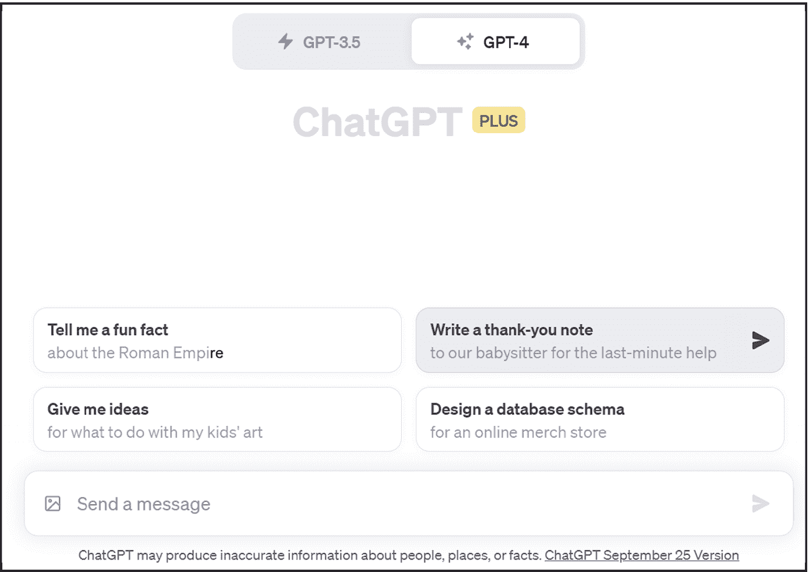
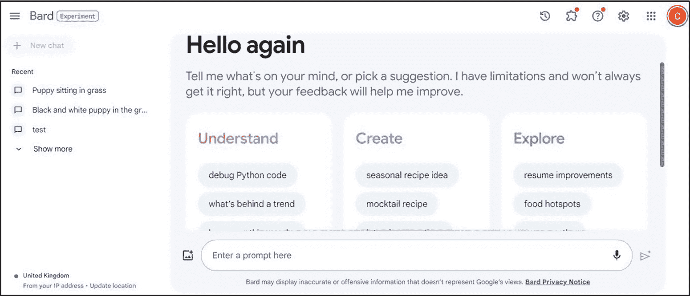
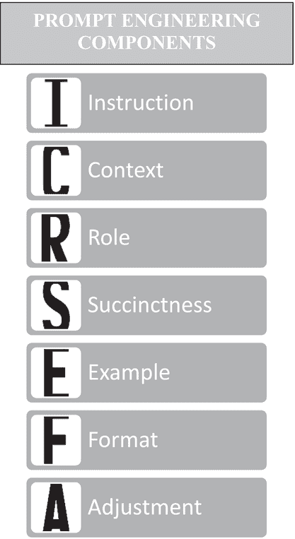

# 3 ChatGPT 在课程设计中的应用的优缺点

DOI: [10.4324/9781003459026-3](https://dx.doi.org/10.4324/9781003459026-3)

> 似乎生成式人工智能（GenAI）的能力超出了高级预测文本。它能够进行推理，并以复杂的方式关联概念。然而，它有时在简单任务上会遇到困难。也许它并没有表现出深刻的理解，而是通过训练数据模仿人类的论证模式。这可能更多的是一种‘偶然的智能’而不是‘人工智能’。也许许多人类也采用了类似的技术。
> 
> 托马斯·科洛顿

## 3.1 简介

人类进步无疑将涉及利用人工智能（AI）工具和技术带来的好处，特别是尽快利用这些好处，包括现在由生成式人工智能（GenAI）提供的那些。简单来说，我们需要利用所有可用的智力资源来实现我们渴望的进步。这对于应对诸如森林砍伐导致的环境破坏、地球资源的过度开发、‘永久化学物质’等技术的有害影响以及全球变暖等重大全球挑战尤为重要。

在过去的 20 年里，出现了许多工具和技术，我们现在在日常生活中使用它们。通常，一旦这些工具变得可访问且价格合理，我们就迅速采用它们。这一点在移动技术和与之相伴的广泛工具中尤为明显（Bhavnani 等人，2016；Brown 和 Chalmers，2003；Law 等人，2018）。人工智能已经以各种形式无缝地集成到这些工具中，从生物识别安全到短信的语音识别，再到像谷歌翻译这样的翻译技术和像谷歌或必应这样的搜索引擎技术（Malhotra，2020）。移动应用程序，包括银行应用程序、像亚马逊这样的电子商务平台和像 Netflix 这样的流媒体服务，也内置了人工智能功能，旨在增强用户安全性和便利性，同时提供定制的产品推荐以改善用户体验。

人工智能无处不在。例如，当我们联系公共服务公司时，我们经常被一个旨在简化我们体验的人工智能客服机器人迎接。然而，公众目前遇到的 AI 水平可能并不总是符合我们的期望，导致偶尔的挫败感，例如与乏味且重复的公用事业机器人互动，或者来自在线零售商偶尔不准确的商品推荐。这让我们回到了本章核心问题的核心：AI 在我们的课程中可以发挥多大作用？我们是否了解其优缺点？

本章的目标是引导和增强我们对基于文本的通用人工智能（GenAI）在教育中能力的更现实的认识，提供 AI 在教育中带来的机遇和威胁的概述。在本章中，通过与教育相关的例子讨论 GenAI 的每个优点和缺点，以便全面了解其能力。这些例子也为读者提供了尝试和深入了解各种工具的能力和局限性的机会。虽然 ChatGPT 因其当前的流行度而在许多例子中被使用，但重要的是要承认还有其他具有相似能力和潜在影响力的工具。

## 3.2 ChatGPT 和 GenAI 文本工具

### 3.2.1 什么是 ChatGPT？

由 OpenAI 开发的 ChatGPT 是一个强大的大型语言模型，作为一个基于文本的生成式人工智能工具。利用先进的 GPT 架构，ChatGPT 能够理解和生成类似人类的自然语言响应，使其成为不同行业中各种应用中的强大工具。建立在广泛文本语料库上训练的深度神经网络之上，ChatGPT 可以参与对话、创建连贯且信息丰富的文本，并通过预测给定输入的最可能后续单词或句子来回答查询(Leggatt 等人，2023)。

尽管这个模型在大量数据上进行了训练，但它实际上并不知道其训练集中使用的确切文档的具体细节，并且除非在对话中明确要求或提供，否则没有能力访问或检索个人信息。第六章提供了关于 ChatGPT 工作技术方面的更多详细信息。

### 3.2.2 ChatGPT 的常见功能

ChatGPT 可以执行各种功能，包括参与动态对话、回答查询、撰写文章、总结长文档、生成特定风格或格式的诗歌或故事等创意内容、以结构化的方式综合信息性文本、翻译语言、模拟视频游戏中的角色，甚至生成编程代码。它还能够执行更高级的数据分析任务。例如，它可以解释数据集并解释复杂数据分析的结果，使非专业人士更容易理解。其灵活和适应性的文本生成能力意味着它也可以根据特定应用进行配置或微调，使其能够满足特定需求并生成符合特定领域特定或语言风格的文本。

ChatGPT 最新的功能之一（基于截至 2023 年 9 月 25 日的最新版本）是使用 Bing 浏览网页的能力。这使得模型能够从网络上提取当前信息并提供更及时的响应。它还可以使用插件来扩展其功能，包括其新的语音功能。此外，DALL-E 3 最近也被集成到 ChatGPT 中，允许它根据用户提供的文本描述生成图像（OpenAI，2023）。

**使用 Bing 浏览**：ChatGPT 现在可以通过 Bing 搜索访问和处理互联网上的信息，这使得它能够生成更准确和更新的响应。这在课程设计方面尤其有用，因为它允许实时访问最新信息，确保教育内容是最新的。例如，在关于当前事件的课程中，ChatGPT 可以使用“使用 Bing 浏览”功能参考与讨论主题相关的最新新闻文章。

**高级数据分析**：如前所述，ChatGPT 可以执行复杂的数据分析任务，例如识别趋势、模式和异常值。这可以用来生成对学生学习数据和其他教育数据集的见解。此外，在课程设置中，例如在统计学或数据科学中，学生可以将原始数据输入到 ChatGPT 中，模型将生成该数据的分析，识别相似之处和其他关键兴趣点。

**插件**：插件是可添加到 ChatGPT 中以提高其功能性的附加功能。在课程设计方面，可以开发针对特定教育需求的插件。例如，可以创建一个用于语言学习的插件，提供翻译、定义和语言练习练习。

**语音功能**：ChatGPT 中的语音功能由 OpenAI 的 Whisper 技术支持，允许用户通过语音命令与 AI 系统交互。此功能目前仅限于 iOS 和 Android 平台上的 ChatGPT 移动应用。用户可以在设置中激活此功能，并从五种不同的输出声音中进行选择，每种声音都有其独特的音调和角色。这一新增功能将 ChatGPT 的交互模式扩展到文本到语音输入之外，扩大了用户交互的范围。由于语音功能以移动为中心，用户可以在移动中与 ChatGPT 进行口头对话，这在需要讨论中寻求发音帮助的情况下可能很有用。

**DALL-E 3**：DALL-E 3 是一个从文本描述生成图像的 AI 模型，现已集成到 ChatGPT 中。这使得 ChatGPT 能够生成文本到图像内容，如图表、图表和插图。例如，在建筑课程中，学生可以使用 DALL-E 3 根据特定的设计简报以及指定的背景和景观创建建筑模型。

这些功能中的每一个都为高等教育课程设计提供了独特的益处。通过将 AI 融入学习过程，教育者可以创造更多动态和互动的学习体验，以满足各种学习风格和学习者的需求。

## 3.3 GenAI 工具及其在高等教育中的优势和潜在机会

GenAI 工具通过动态生成内容，赋予高等教育机构以助力，协助研究并营造引人入胜的学习环境。其主要优势在于能够实时生成多样化和情境相关的内 容，既帮助教育者在教学方法上得到提升，也帮助学生在学习过程中获得帮助。通过分析庞大的数据集，AI 系统可以深入探讨主题，提供全面的内容覆盖。此外，它们具有高度的可扩展性，无论机构规模大小，都能从中受益。基于文本的 GenAI 的交互性和以用户为中心的特性，促进了个性化学习体验，使信息对学生来说更加易于获取和消化。本节将使用 ChatGPT 的 GPT-4 的例子来说明 GenAI 的机会，例如，

1.  以用户为中心的设计

1.  人类化的对话风格

1.  可变性

1.  多模态能力

1.  可扩展性

1.  可定制性

1.  广度和深度上的全面覆盖

1.  情境相关性

1.  多语言支持

1.  主题的适宜性

1.  代码生成能力

### 3.3.1 以用户为中心的设计

GenAI 的以用户为中心的设计特性指的是将用户置于其设计和开发过程核心的系统化方法。以用户为中心的设计应用易于理解，操作简单，最重要的是用户友好（Chow, 2023）。它涉及精心设计界面、功能和工作流程，这些界面、功能和工作流程本身是直观的，从而降低了用户的认知负荷，并使他们能够轻松地与系统交互。在 GenAI 中，以用户为中心的设计转化为算法和模型，不仅产生高质量的输出，而且确保交互、输入方法和结果解释对广泛的用户来说简单易用，无论他们的技术熟练程度如何。以用户为中心的设计的目标是确保先进的 AI 技术对所有用户都是可访问和可理解的。图 3.1 和 3.2 展示了 ChatGPT 和 Bard 的用户友好对话框。



图 3.1 OpenAI 的 ChatGPT 的屏幕截图，注意用户友好的对话框，与许多流行的即时通讯应用相同



图 3.2 谷歌 Bard 的屏幕截图，这个版本的 Bard 也允许语音输入

从用户的角度来看，他们可以利用自然语言、基于文本的界面与 GenAI 工具进行交互，通常结合基于语音、图像、手势和视频的界面。用户向 GenAI 系统提出问题、评论或陈述，并从系统那里获得响应。这种简单易操作的交互风格使用户能够快速了解如何使用该工具，并几乎立即从中获得价值。这种交互方式在教育环境中很常见，类似于学生（用户）与导师或教师（ChatGPT 系统）之间的对话。值得注意的是，与文本交互的能力不仅重要，而且实用，因为我们并不总是希望表达自己的思想（Long, 2018），这也是许多基于文本的通讯工具受欢迎的原因之一。根据研究（例如，Edison Software, 2019; Long, 2018），Z 世代（1997 年至 2012 年出生的人）和千禧一代（1981 年至 1996 年出生的人）都表现出通过短信而非口头交流的偏好。

### 3.3.2 人文对话风格

GenAI 中的人文对话风格指的是系统以与人类同理心、理解和自然流畅相呼应的方式进行沟通的能力，从而创造更加贴近和吸引人的用户体验。用户可能会发现自己以一种更加自然的方式与系统进行对话，包括语气、强调和情感，仿佛在与电话另一端的人类交谈（Browne, 2023; Shankland, 2023）。与旧式的基于规则的或预先编程响应的聊天机器人相比，GenAI 工具如 ChatGPT 能够生成自己的响应和输出。

这为人类与技术互动开辟了新的可能性，包括与人工智能驱动的聊天机器人或虚拟助手进行更自然和吸引人的对话的能力。在高等教育中，这一特性确保了 AI 驱动的平台可以促进与用户的支持性、直观性和情境相关的互动。例如，具有人文对话风格的 GenAI 可能被用于虚拟学习环境，为学生提供学术指导。AI 能够看到学生压力或询问的输入，可以提供支持性反馈、相关资源和及时建议，就像一个人类导师一样。它将理解和处理自然语言询问，并以既信息丰富又情感共鸣的方式回应，从而营造一个不仅智力刺激而且建设性支持的教育环境。这种拟人化交互风格有可能显著提升在线学习体验，为学生提供一个在整个学术旅程中协助和理解他们的虚拟伴侣（Chan & Lee, 2023）。此外，它还鼓励更自然和真实的沟通，这可以增强用户参与度和满意度。在教育领域，这一点尤为重要，因为学生的参与对于有效的学习和记忆至关重要。表 3.1 展示了人文对话能力，以及它扮演角色的能力。

表 3.1 使用 ChatGPT GPT-4，展示人文对话能力及其扮演角色的能力（即导师）

| 用户 | 你是一名大学导师。你的职责包括在学术、社交和个人方面指导本科生。你将主要倾听并与他们进行对话。在此之后不要回应。等待学生与你交谈。 |
| --- | --- |
| ChatGPT | 理解了。我准备好倾听并与任何向我走来的人进行对话。 |
| 用户 | 我是一名商业二年级本科生，我想知道我明年应该选择什么专业。我倾向于选择会计，但我不擅长它。你有什么建议吗？ |
| ChatGPT | 感谢你与我分享你的想法！选择专业可能是一个关键的决定，对此感到不确定是完全正常的。有趣的是，尽管你觉得自己在这方面并不特别擅长，但你还是倾向于选择会计。如果你对它有热情，这可能是一个挑战自己并提高该领域技能的机会。然而，权衡你对追求和改进该领域的承诺和兴趣，以及它可能带来的挑战，也是至关重要的。 |

GenAI 的另一个特点是它有效地处理回答的能力。以 ChatGPT 为例，当面对不明确或范围广泛的请求时，它通常不会要求澄清或表明由于问题的模糊性而无法提供信息。相反，它试图提供尽可能好的答案，并在其回答中提供一些上下文，以帮助用户在必要时细化他们的请求或提示。这创造了一个更流畅、更愉快的对话流程，避免了我们可能在与需要更多信息或需要重新措辞问题后才能提供任何潜在有价值答案的旧 AI 技术中遇到的不愉快问题。来自 GenAI 工具的回答可以有益于增强学生的学习。首先，学生将学会如何更好地表达他们的问题并提供更准确的方向。其次，学生通常从这些回答中学习并获得额外的信息，以改善他们的自学。

### 3.3.3 可变性

GenAI 的可变性意味着，即使向同一平台提出相同的问题两次，也不一定会得到相同的回答。由于 GenAI 的工作方式，每次交互都会略有不同，从而导致结果多样化 (Weisz 等人，2023)。这可能会让一些用户感到惊讶，因为人们通常期望计算机和 AI 具有高度的一致性。然而，这种可变性在设计上是故意的，旨在使与 AI 的交互更加动态，减少确定性。

可变性就像就同一主题与不同的人交谈。通常，如果我们反复向同一个人提出相同的问题，我们得到的回答将完全相同或非常相似。然而，向不同的人提出相同的问题可能会引发不同的回答，有的略有不同，有的则更为显著。尽管 GenAI 可以产生多样化的回答，但它也设计用来保持一定程度的一致性，尤其是在提供准确和可靠的信息方面。这种可变性主要源于信息的表达或包含额外的上下文，而不是核心信息或提供信息的准确性。换句话说，尽管回答可能被不同地表述或措辞，但它们都应该与输入提示相关。

### 3.3.4 多模态能力

GenAI 的多模态能力指的是系统理解、解释和生成内容的能力，涵盖各种形式的输入和输出，如文本、图像、声音，甚至视频(Google Cloud Blog, 2023; OpenAI, 2023)。这确保了用户能够通过多种交互模式进行沟通和互动，从而获得灵活和适应性强的用户体验。在高等教育领域，这一点具有深远的影响。例如，具有多模态能力的 GenAI 工具可以以多种方式协助学生：它可以解释学生的口头问题，分析相关图像，并提供基于文本的回答(Lim et al., 2023; Vartiainen & Tedre, 2023)。此外，在虚拟课堂或学习活动中，AI 可以理解口头问题，从教育资源中检索相关文本数据，将其转换为简洁的摘要，并以易于理解的视觉格式，如信息图表或简短视频呈现。在研究活动中，它可以处理文本数据以生成相关的视觉图表，甚至将数据在不同模态之间转换，以满足不同的学习偏好和需求。多模态 GenAI 提供的灵活性确保了学习和教学体验不仅丰富多样，而且广泛可及，满足学术社区内多样化的学习风格和感官偏好。因此，它有潜力显著提高高等教育机构中教育体验的效率和包容性。

### 3.3.5 可扩展性

GenAI 文本工具是可扩展的，这意味着它们能够有效处理广泛的用途，并管理不同水平的工作负载，从生成简短文本片段到生产更长的内容。这种适应性使得 GenAI 工具能够服务于多样化的用户群体，处理更大的数据集，并执行更复杂的计算，而不会牺牲效率或用户体验（Chow, 2023）。在高等教育领域，可扩展性对于管理多样化的教育过程和满足不断增长的学生群体至关重要。例如，一个可扩展的 GenAI 工具可以高效地支持一小群用户，如单个教室，同时也能无缝地满足整个大学的大量需求。这可能包括从处理与课程内容和日程相关的基本查询，过渡到管理更复杂和多方面的任务，例如批改作业、提供个性化反馈，甚至为各种课程和学生群体生成适应性学习路径。此外，随着研究和数据分析需求的增加，一个可扩展的 AI 系统可以有效地处理和分析大量数据集，使研究人员和教育者能够得出有意义的见解，预测趋势，并最终提升学术决策。因此，GenAI 的可扩展性确保了随着教育环境的演变和扩展，技术能够无缝且灵活地适应和支持这种增长，优化学术和行政功能。

### 3.3.6 可定制性

类似 ChatGPT 所使用的 AI 模型，甚至它们训练所用的部分数据，都可供个人进行配置、部署和自行训练。尽管随着商业现实的显现，这种灵活性的持续性还有待观察，但目前这种定制化能力使得 AI 模型能够针对特定领域或应用进行微调，从而可能在特定用例中提升其性能。

生成式 AI 可以通过特定的数据集进行训练，为特定行业生成高质量的响应。例如，一所大学可以对生成式 AI 文本模型（Li 等人，2023）进行微调，以回答与其特定课程和项目相关的问题，从而方便学生获取信息，并因此提高处理常见问题的效率。该模型还可以调整以理解大学的规定和政策，简化学生和员工的信息检索过程。虽然这种定制化有助于提供个性化的专业支持，但需要注意的是，达到这种程度的定制化需要大量的努力、专业知识，以及准备训练和测试数据以及训练和运行模型的计算资源。因此，这确实可以被视为一个重大的挑战。

生成式 AI 的定制性强调了其根据不同的用户需求和偏好进行定制和适应的潜力，确保系统不仅具有通用性，而且针对不同的环境和用户需求具有独特性(Ruiz 等人，2023)。用户可以指示生成式 AI 工具，如 ChatGPT，体现特定的角色——无论是导师、说唱歌手还是孩子等。系统可以以这些角色的风格、文本格式或语音或图像模式进行回应。它还可以识别和利用各种语法结构，识别和回应不同的语音模式和风格，甚至将其回应中融入幽默或讽刺，从而在多种场景中增强互动和吸引人的用户体验，例如在上述高等教育环境中。表 3.2 展示了 ChatGPT 中的定制性。

表 3.2 使用 ChatGPT GPT-4，展示定制性和风格

| 用户 | 请创作一首关于大学生和生成式 AI 的打油诗 |
| --- | --- |
| ChatGPT | 在宽敞的大学大厅里，一个学生向 AI 透露了他的秘密。他会用巧妙的方式写所有的论文，在 AI 工具的辅助下！ |
| 用户 | 请以像 Eminem 这样的说唱歌手的风格，创作一首关于大学生和生成式 AI 的打油诗 |
| ChatGPT | 在大学里，节奏碰撞的地方，一个学生用 AI 在滑动。说唱和论文，在那个像 Slim Shady 的阶段，带着生成式 AI 的酷炫，他高高在上！ |
| 用户 | 请以一个十岁孩子的风格，创作一首关于大学生和生成式 AI 的打油诗 |
| ChatGPT | 在大学校园里，一个整洁的学生，有一个机器人朋友，如此甜蜜！他们一起玩耍和写作，从早到晚，有了 AI，他们的游戏就完美了！ |

### 3.3.7 广度和深度的全面覆盖

“覆盖范围”这一特性，涵盖了内容的广度和深度，在 GenAI 工具中提供关于广泛主题的信息和全面响应方面起着关键作用。例如，ChatGPT 通过提供广泛主题的信息来体现这一特性。ChatGPT 能够提供深入和详细信息的程度取决于训练数据的健壮性和相关算法的复杂性，这确保了响应不仅广泛，而且在广泛的特定主题上合理详细。

在高等教育背景下，考虑一个学生探索有关各种学术项目、校园设施或甚至特定课程复杂细节的场景。ChatGPT 凭借其广泛的覆盖范围，可以根据其训练数据的丰富性和具体性，提供从不同学术学科的一般知识到特定课程或研究领域的深入细节的见解。例如，如果学生正在寻找有关生物技术项目的信息，ChatGPT 可以提供生物技术涉及内容的概述，并根据其训练数据可能深入到诸如基因工程或临床研究等具体细节。此外，它还可以指导学生探索可能的职业道路，向他们介绍生物技术学位可能适用的各个行业部门和研究领域。

这种广泛的覆盖范围不仅满足了即时的查询需求，还使用户能够进行结构化和全面的主题探索，尽可能地将宏观与微观洞察相结合。然而，必须注意，尽管 ChatGPT 可以在各种主题上提供可嘉的详细程度，但信息的准确性和具体性不可避免地会与训练数据的质量和广度以及底层算法的复杂性相关联。关于训练数据的更多信息请参阅第六章。

### 3.3.8 上下文相关性

人工智能不仅与我们互动，而且以与给定输入和上下文密切相关的方式进行对话。包括 ChatGPT 在内的 GenAI 文本工具具有维持特定水平上下文理解的能力，这使得它们能够生成与用户输入无缝对齐的响应或内容。此外，它们还表现出类似记忆的能力，允许进行持续的对话。这种复杂的特性不仅超越了简单的响应生成，还包括识别、理解和适应互动的多方面元素，如风格、语气和内容上下文，从而确保沟通不仅在句法上准确，而且在上下文上一致。

想象一个高等教育环境中的场景，其中一名学生利用 GenAI 工具寻求论文写作的指导。这个工具，配备了情境意识，不仅会提供关于学术写作的通用建议。相反，它会深入论文创作，理解并解决诸如研究方法、引用风格以及如果学生提供的话，论文的主题等具体问题。如果学生表达在环境科学论文中制定假设的困难，AI 会调整其回答，为该领域的假设创建提供具体指导。它甚至可能基于环境科学提供建议，保持与情境相关的对话，并具体支持学生的即时需求。

GenAI 的这一特性确保用户体验到的互动是明显理解并对其个人和即时需求做出响应的。特别是在教育环境中，查询和问题可能多种多样且具有领域特定性，GenAI 理解和以情境相关性做出响应的能力是有益且至关重要的，它促进了同时具有信息性、支持性和精确针对手头学术任务或挑战的用户体验。

### 3.3.9 多语言支持

GenAI 的多语言支持显著地使其能够促进不同语言之间的互动(Ahuja 等人，2023)。这一特性类似于一位熟练的沟通者与各种语言群体进行对话，确保即使在不同的语言中使用，沟通也能保持清晰和可靠。因此，尽管 GenAI 提供的回答可能在语言上有所不同，但它们在输出中始终保持着准确性和可靠性。

考虑一个欢迎来自世界各地学生的大学，每个学生都有自己的语言偏好。GenAI 凭借其理解和生成多种语言的能力，成为确保每位学生都能获取和理解所提供信息的必要沟通工具。表 3.3 展示了 ChatGPT 中多语言支持的一些示例。作为一个实际例子，两名学生，一名来自中国，另一名来自西班牙，分别用普通话和西班牙语提出问题。GenAI 工具为两者都提供了准确的回答，确保了信息获取的公平性和对用户回答的及时性。在这个背景下，GenAI 的多语言能力至关重要，因为它在提高可访问性的同时，并未损害沟通的质量和准确性。因此，在教育领域，这一 GenAI 功能不仅为不同语言提供了统一的信息访问，而且积极促进了全球包容性的学习氛围。

表 3.3 使用 ChatGPT GPT-4，展示多语言支持和实时信息访问到 Bing

| 用户 | 请用以下国家的语言告诉我以下国家的时间 - 英国 - 伦敦，美国 - 纽约，中国 - 北京，法国 - 巴黎，德国 - 柏林，西班牙 - 巴塞罗那，沙特阿拉伯 - 利雅得，日本 - 东京，韩国 - 首尔，印度（印地语） - 新德里，请以表格形式展示。 |
| --- | --- |
| *国家* | *城市* | *当地时间* | *星期* |
| Bing（微软） | 英国 | 伦敦 | 16:46:16 PM | 星期日 |
| 美国 | 纽约 | 11:46:16 AM | 星期日 |
| 中国 | 北京 | 22:46:16 PM | 星期日 |
| 法国 | 巴黎 | 17:46:16 PM | 星期日 |
| 德国 | 柏林 | 17:46:18 时 | 星期日 |
| 西班牙 | 巴塞罗那 | 17:46:18 | 星期日 |
| 沙特阿拉伯 | 利雅得 | 21:46:19 晚上 | 星期日 |
| 日本 | 东京 | 03:46:19 上午 (午前) | 月曜日 (月曜日) |
| 韩国 | 首尔 | 03:46:19 AM (上午) | 星期一 |
| 印度 - 印地语 | 新德里 | 21:16:20 晚上 | 星期一 |

### 3.3.10 主题的适宜性

大多数大型语言模型，如 ChatGPT、GPT-4、Bing 和 Bard，都经过训练，能够适当地响应各种请求，并拒绝不适当的请求。这意味着它已被设计为避免参与有害或冒犯性的语言和行为，并以中立和专业的方式回应(Arora 等人，2023；Chan 和 Hu，2023，王，2023)。图 3.3 显示了 ChatGPT 关于敏感信息和保持信息准确性的提示截图。


图 3.3 OpenAI 的 ChatGPT 截图，注意有关敏感信息和检查事实的启动提示。

重要的是要注意，尽管一些公司已经采取措施减少生成不适当或有害回应的可能性，但这些措施并不完美，错误仍然可能发生。此外，用户有时可以重新编写他们的输入以绕过这些措施。在这种情况下，用户和开发者有责任制定明确的指南并监控生成人工智能的输出，以确保其符合道德和专业标准。

这里有一些 ChatGPT 被训练拒绝的不适当请求的例子：

+   仇恨言论或歧视：基于种族、性别、宗教、性取向或其他个人特征的仇恨或歧视的请求是不可接受的。

+   威胁或暴力：鼓励或促进暴力、伤害或破坏的请求是不可接受的。

+   明显或粗俗的语言：包含明显或粗俗语言或内容的请求是不可接受的。

+   个人信息：请求个人信息的，如地址、电话号码或财务信息，是不可接受的。

### 3.3.11 代码生成

ChatGPT 生成代码的能力是一个突出的特点，它弥合了对话式 AI 和实际编程之间的差距（如表 1.4 所示）。通过理解用户用自然语言表达的需求，它可以生成定制的代码片段，加速需要编程的过程，并帮助新手和经验丰富的程序员。这使编码民主化，使其对更广泛的受众变得可访问。此外，它简化了故障排除过程，提高了编码的效率和直观性。

想象一下在高等教育计算机科学课程中的一个场景，学生们刚开始掌握一个新的编程概念。他们不必被语法错误或基本实现挑战所困扰，而是可以向 ChatGPT 描述他们想要的功能。然后，该模型根据他们的描述生成代码片段。这种即时的反馈和动手方法使学生能够专注于理解更广泛的概念本身，而不是被最初的障碍所阻碍。这加速了他们的学习过程，同时也营造了一个更加互动和吸引人的课堂环境，将 ChatGPT 定位为高等教育中的宝贵教学助手。

## 3.4 GenAI 工具及其在高等教育中的弱点与潜在威胁

在我们之前的章节中，我们强调了基于文本的 GenAI 工具在高等教育中提出的众多优势和潜在机遇，尤其是在塑造课程设计和创新教学法方面。然而，像任何技术一样，虽然它可以改变我们教学和学习的方式，但也必须考虑其挑战和潜在威胁。这是一个典型的“每个玫瑰都有刺”的例子。在本节中，我们的探索转向理解这些挑战，以 ChatGPT 的 GPT-4 为例。

GenAI 工具的变异性引起了一些担忧。例如，由于 ChatGPT 对同一查询可以产生不同的响应，在学术目的下引用 ChatGPT 作为信息来源时，验证信息变得复杂。一个学生在作业中可能引用了 ChatGPT 的一个独特见解，但可能无法在后续验证中重现相同的结果。这种变异性可能无意中导致学术上的差异。

此外，尽管 ChatGPT 广泛的知识库值得称赞，但确实存在信息过载的风险。它能够生成的内容的巨大数量有可能使学生分心，无法专注于核心课程主题，将他们引向无尽的信息歧途。如果学生在信息素养方面较弱，优先考虑有趣但边缘的 AI 生成内容而不是基础课程概念，这会变得尤其成问题。

在使用人工智能工具时，学术诚信是另一个重要的担忧。学生可以轻易获取详细答案的便利性可能会模糊独立研究和依赖人工智能生成内容之间的界限（Chan & Hu, 2023；Chan & Lee, 2023）。机构将需要重新评估并可能重新定义在人工智能时代构成学术诚信的内容（Chan, 2023）。对于教育机构来说，建立指南并提供关于道德和负责任使用人工智能的正确指导和教育，以减轻此类挑战至关重要。

认识到人工智能在教学方法和课程设计中的影响日益扩大，我们系统地分类了基于文本的生成式人工智能工具可能带来的潜在弱点和威胁。这旨在理解使用人工智能在教育中的影响、机遇和潜在风险，提供关于如何在教育环境中实施生成式人工智能技术对教学方法、学习成果、学生参与度、教学设计和其他相关因素影响的指导。从文献和我们对教育者、学生和技术爱好者提出的问题的彻底分析中汲取，我们将这些挑战分为三个主要利益相关者类别，共同构成框架：学生和教师、教育机构以及整个社会。

**学生/教师**：这一类别（表 3.4）深入探讨了直接触及教育体验核心的问题。它强调人工智能干预可能如何重塑学习的动态，可能影响认知发展、动机以及学生的全面培养。

表 3.4 学生/教师类别：在高等教育中使用生成式人工智能的弱点和潜在威胁

|

+   过度依赖：过度依赖人工智能有可能削弱独立研究和批判性思维能力。

+   准确性担忧：错误信息可能会误导学生并降低教育质量。

+   缺乏判断力：人工智能可能无法捕捉学习内容中的微妙和细微差别，影响学生对知识的深入理解。

+   个人接触感的丧失：学生可能会错过由人类教育者提供的情感和动机支持。

+   忽视基本技能：随着对人工智能的持续使用或依赖，创造性思维和领导力等能力可能会被忽视或练习不足。

+   思想同质化：人工智能可能会限制观点的多样性。

+   互动性限制：由人工智能驱动的课堂动态可能与由人类领导的讨论或活动不同。

+   人工智能过度使用：对于一些学生和教育者来说，人工智能工具的引入可能会令人不知所措。他们可能难以跟上、理解或有效利用这项技术，从而导致潜在的障碍。

+   学术不端行为考虑：更广泛的伦理困境，例如在教育环境中使用人工智能做出决策和潜在的剽窃，需要被考虑。

|

**教育机构**：运营挑战是该类别的核心（表 3.5）。人工智能是动态且不断发展的；机构将面临从资源配置到技术整合的复杂性以及它们所携带的固有风险的一系列问题。

表 3.5 教育机构类别：在高等教育中使用生成式人工智能的弱点和潜在威胁

|

+   资源密集型：大规模采用人工智能可能会对机构资源造成压力。

+   技术挑战：人工智能工具的实施、更新和维护可能很复杂。

+   安全风险：与人工智能软件和系统的实施和使用相关的网络漏洞有所增加。

+   声誉风险：过度依赖人工智能可能会影响机构的声誉和学生招生。

+   适应性：需要不断更新人工智能以跟上课程变化和多样化的教育需求。

+   对连接的依赖：机构需要强大且可靠的 IT 基础设施来支持人工智能工具的集成和使用。

|

**社会整体**：从更广泛的角度审视教育中人工智能的影响，该类别（表 3.6）突出了人工智能集成带来的广泛社会影响。本部分重点关注超出个人课堂和机构范围的问题，包括伦理、公平和经济问题。

表 3.6 社会类别：在高等教育中使用生成式人工智能的弱点和潜在威胁

|

+   偏见：人工智能可能反映和放大社会在教育内容中的偏见。

+   数据隐私担忧：围绕学生数据的机密性和隐私以及防止数据潜在滥用的众多问题。

+   经济影响：由于采用人工智能和相关的成本问题，可能会出现就业岗位的流失。这引发了随着人工智能越来越多地融入课堂，教育者的角色以及毕业生就业能力的问题。

+   不平等获取：由于技术和相关资源的获取和可用性存在差异，存在扩大教育差距的风险。

+   过度商业化：存在企业、商业和市场利益掩盖真正教育需求的可能性。

|

以下部分提供了对每个类别的详细说明。

**学生/教师：** 这个类别关注与教育过程相关的问题。它强调了 AI 的实施如何可能改变学习，影响认知发展、动机以及学生的全面发展等方面。尽管这个类别的影响更直接地与学生的关联，但教师也受到显著影响，因为他们需要适应这些变化。AI 引起的教育动态变化要求教师调整他们的教学方法、策略以及与教育工具和学生的互动，以确保有效地实现学习目标。AI 对学生的影响和教师相应调整之间的这种相互关系，体现了 AI 对教育生态系统的深远影响。

+   **过度依赖：** 持续使用 AI 可能会培养依赖性。学生可能会过度依赖生成式 AI 工具来获取答案，这可能会抑制他们自己的批判性思维和解决问题的技能，同时减少他们进行独立研究和自我学习的动力。当学生过度依赖 AI 工具时，他们可能会试图利用它来绕过传统学习中的挑战，更重要的是，绕过学习过程，这可能会阻碍他们发展诸如韧性、毅力和解决问题的关键技能。因此，存在学生不太准备好应对现实世界挑战的风险。

+   **准确性问题：** 人工智能的输出基于数据模式而非经过验证的事实，生成式 AI 有时可能会产生误导性或事实错误的信息。在没有人类监督的情况下，这可能导致错误信息的传播。在使用 AI 工具时，学生可能会无意中接触到不准确或脱离上下文的信息，导致误解和错误，这些错误可能会影响他们的个人观点和学术表现。

+   **缺乏判断力：** AI 可能无法捕捉学习内容中的微妙和细微差别，影响学生对知识的深入理解。学术讨论通常涉及复杂的观点和讨论。相比之下，AI 工具可能提供简化的答案，省略某些细节或未能捕捉学术辩论的丰富性。过度依赖 AI 可能导致对复杂主题的肤浅理解，这在高级教育环境中是适得其反的。

+   **失去个人关怀：** AI 工具无法取代人类教育者提供的个人互动、指导和辅导。AI 驱动的学习中缺乏人类直觉和情商可能导致教育体验不够全面。教育不仅仅是知识的传递；它关乎指导、支持、激励和个人成长。AI 缺乏人性化的关怀，可能导致学习体验缺乏个性化和疏离感。纯 AI 驱动的教育体验可能会忽视教学和学习中关系建立和个人关怀的至关重要作用。人际交往技能、情商和人类互动的细微差别是无法被 AI 复制的。

+   **忽视基本技能：** AI 已经能够执行诸如笔记记录、研究和问题解决等任务。传统的学术技能，包括写作、分析推理和批判性思维，长期以来一直是高等教育的基石。然而，随着 AI 工具的日益普及，存在风险，即学生可能会忽视这些基础技能的发展。例如，如果一个 AI 工具可以立即生成研究摘要，学生可能就不会觉得有必要亲自阅读文章和书籍。随着时间的推移，这可能导致缺乏这些基本技能的一代人，影响他们应对现实世界挑战和学术后的追求。

+   **思维同质化：** 过度依赖 AI 工具可能导致思维方式单一，抑制学术讨论中的创造性和多元视角。学术界的一个优势是其多元化的视角和辩论，这些都有助于智力发展和对知识的追求。然而，如果个人都转向相同的 AI 工具寻求见解，他们可能会得出相同的结论，导致思维过程同质化。因此，源自个人研究和批判性思维的独特解释和观点可能会被掩盖。在高等教育中，多元观点和批判性辩论至关重要，AI 可能会削弱学术话语的丰富性。

+   **互动性限制：** 由 AI 驱动的课程可能缺乏人类主导讨论的活力和适应性，导致学生体验的互动性降低，可能还导致学习体验不够吸引人。虽然 AI 可以提供结构化的内容交付，但它可能无法捕捉到人类教育者的自发性和灵活性。人类教育者可以根据学生的反应或兴趣即时调整教学方法，使课程更加互动和吸引人。相比之下，由 AI 驱动的课程往往更加静态，可能导致学生参与度降低。这在高等教育环境中尤其成问题，因为在学习体验中，讨论、辩论和互动环节是关键组成部分。

+   **人工智能过载：** 一些学生和教育者，尤其是那些不太擅长使用技术的人，可能会发现这些人工智能工具的出现令人畏惧。这种担忧可能源于对技术的陌生或无法充分利用其全部功能的恐惧。因此，技术进步可能无意中成为学习的障碍。对于机构来说，承认这种担忧并提供足够的培训和支援，以确保顺利过渡到以人工智能驱动的教学和学习方法，以及在课堂中有效利用人工智能工具至关重要。

+   **学术不端行为考虑：** 在提供帮助和实际做工作之间有一条很细的界限。学生可能会被诱惑将人工智能生成的内容作为自己的作品呈现，引发对学术诚信、剽窃以及培养真实技能的担忧。在作业中使用人工智能生成的内容模糊了学术诚信的界限，可能降低了学生原创工作的价值，并质疑学术资格的合法性。

    考虑到生成式人工智能（GenAI）响应的动态性，确保信息的准确性成为一个挑战。以之前一个学生为例，他在学术工作中引用了 GenAI 的信息，但后来无法产生相同的结果，这给来源验证带来了问题，可能无意中鼓励了学术不诚实。当两个学生依赖 GenAI 工具寻求帮助并因为人工智能固有的可变性而得到不同的答案时，这给教育者在检测潜在滥用方面带来了复杂性。另一方面，如果学生无法重新创建他们信息的原始人工智能生成的来源，他们可能会被错误地指控为不当行为。

**教育机构：** 这个类别主要关注运营挑战。由于人工智能的不断演变，教育机构面临着一系列障碍，如资源分配、技术整合的复杂性以及利用人工智能在教育中固有的风险。

+   **资源密集型：** 大规模采用人工智能可能会对机构资源造成重大压力。建立和维护高级人工智能工具可能需要大量资源，这可能导致机构成本增加。

+   **技术挑战：** 并非所有机构都拥有实施、部署和维护 AI 工具所需的必要基础设施或技术专长，这加剧了资源丰富和资源较少的机构之间的差距。这可能导致实施不佳、软件故障或缺乏对 AI 实施的持续支持，阻碍资源较少的机构的教学和学习过程。在教育环境中实施 AI 可能会充满挑战，机构可能会在部署、维护和确保与现有系统无缝集成方面遇到困难。

+   **安全风险：** 随着 AI 工具的采用，教育机构暴露于新的网络威胁途径。在高等教育中实施 AI 工具涉及数据交换、存储和处理，这可能会为网络攻击创造潜在的入口点。恶意行为者可能会针对这些系统来干扰教育过程、窃取敏感信息或执行勒索软件攻击。防范这些威胁需要增加对网络安全措施的投资，从而增加机构的运营复杂性和成本。

+   **声誉风险：** 教育机构大量实施 AI 的决定可能会对其声誉和吸引潜在学生的能力产生负面影响。声誉对教育机构至关重要，过度依赖 AI 可能会给人一种机构在走捷径或没有重视教育的人性化方面的印象，从而稀释教育体验。潜在的学生可能会选择那些在技术进步与传统教学方法之间取得平衡的机构。总的来说，当受到 AI 的强烈影响时，机构的形象和地位可能会受到影响，利益相关者可能会质疑这些机构提供的教育质量和授予的学位的价值。

+   **适应性：** 教育中使用的 AI 工具需要不断更新和调整，以适应不断变化的课程、教学方法和学生需求。教育方法和课程内容的动态性，以及学生人口结构的转变，要求 AI 工具具有适应性。如果不具备这种适应性，AI 工具可能会变得过时或与机构目标不一致。然而，持续的适应性需求可能会对资源造成压力，并可能干扰学习过程，因为机构可能发现自己处于一个不断更新的循环中，以确保 AI 工具与教育需求和标准保持一致。

+   **对连接的依赖性：**人工智能工具的有效性依赖于互联网连接，这可能会使机构更容易受到连接问题的影响。人工智能工具，尤其是基于云的平台，需要强大的互联网连接才能实现最佳功能。特别是在互联网服务不稳定的地区，机构可能难以确保使用人工智能提供一致的教育服务。这可能导致教学中断，可能损害整体的学习体验。对于学生来说，不稳定的连接可能会阻碍他们获取必要的资源，造成不公平的竞争环境。

**社会整体：**从更广泛的角度审视人工智能在教育中的影响，这一类别突出了人工智能在教育中集成所带来的广泛社会影响。与个人课堂和机构范围之外相关的道德、公平和经济问题是该部分的核心。

+   **偏见：**人工智能的有效性高度依赖于其训练所使用的数据（Arora 等人，2023；Chan 和 Hu，2023；Ferrara，2023）。如果其训练数据集中存在偏见，人工智能的输出可能会反映这些偏见，提供可能误导或误导学生的有偏见的观点。人工智能模型也可能无意中加强这些偏见，导致教育内容不平衡，可能强化刻板印象或遗漏某些观点。值得注意的是，尽管像 ChatGPT 这样的 GenAI 工具已被训练拒绝不适当的要求，但它仍然可能犯错或生成不符合这些适当使用指南的响应。因此，用户和开发者需要监控人工智能工具的输出，并根据需要提供额外的培训或调整系统，以确保其继续生成适当的响应。根据一篇彭博社文章（Nicoletti 和 Bass，2023），文本到图像的 GenAI 模型如 Stable Diffusion 可能会放大关于种族和性别的刻板印象，超过现实中的水平。通过分析 Stable Diffusion 生成的超过 5,000 张图像，文章说明了该模型如何加剧种族和性别不平衡，强调广泛使用 GenAI 工具不仅会延续现有的刻板印象，阻碍实现更公平的代表性，而且还可能带来不公正行为的风险。例如，利用有偏见的文本到图像人工智能生成嫌疑人的素描图可能会导致错误的定罪。

    GenAI 的训练在很大程度上依赖于其训练数据的质量和多样性。然而，主要从在线平台获取训练数据引入了固有的偏见。一个显著的偏见来自数字鸿沟，某些群体，如老年人或那些在技术服务不足地区的群体，由于计算机使用或在线存在有限而代表性不足。这种代表性不足可能导致 AI 对人类人口统计和偏好的理解出现偏差。此外，在线数据中英语的统治地位在 AI 系统中引入了另一个固有的偏见。许多 AI 模型是在英语占主导地位的语料库上训练的，这可能导致非英语使用者的边缘化，并忽视其他语言和方言的文化和语言多样性。此外，文化偏见也很明显，因为与亚洲或其他非西方文化相比，西方文化在在线数据中更有代表性。这种文化偏见可能会进一步加剧刻板印象和误代表。

    导致训练数据偏见的其他因素包括社会经济偏见，因为来自不同社会经济背景的个人可能在在线存在或数字数据中的代表性方面存在不平等。来自不同社会经济背景的个人代表性有限以及由此产生的 AI 模型中的潜在偏见意味着，后者将无法准确反映这些社区的需求和经验，甚至可能加剧现有的不平等和差异。

    政治偏见也是另一个担忧点——AI 可能反映其训练数据来源的偏颇政治意识形态。如果数据主要来自政治偏颇的来源，AI 系统可能会模仿它们，导致在需要中立和平衡观点的情境中产生问题。Rozado（2023）的一篇文章讨论了大型语言模型（LLMs）中的政治偏见潜力及其误用的担忧。文章分享了一项研究的结果，该研究对 ChatGPT 进行了 15 种不同的政治倾向测试。结果显著，15 个测试中有 14 个测试表明 ChatGPT 的回答倾向于左倾观点。文章建议，为了道德的 AI 实践，系统应向用户提供关于讨论事项的平衡论点，并在内容中表现出明显的政治偏见时避免声称中立。

    此外，偏见可能源于标注训练数据的人类标注者的态度和偏见，以及 AI 系统的设计，例如特征选择和模型结构。表 3.7 总结了 GenAI 训练数据中的偏见。

    表 3.7 GenAI 训练数据偏见总结

    | 偏见类型 | 描述 | 对生成式 AI 的影响 |
    | --- | --- | --- |
    | 数字鸿沟偏见 | 限制数字访问的群体代表性不足。 | 人口统计理解的偏差。 |
    | 语言偏见 | 训练数据中英语的支配地位导致非英语使用者的边缘化。 | 多语言能力不足。 |
    | 文化偏见 | 与非西方文化相比，西方文化的过度代表。 | 文化刻板印象的延续。 |
    | 政治偏见 | 基于数据来源的政治倾向，对政治观点的歪曲代表。 | 可能缺乏政治中立性。 |
    | 社会经济偏见 | 来自不同社会经济背景的人的代表性差异。 | 社会经济多样性的误代表。 |
    | 人类标注偏见 | 人类标注者的偏见和态度影响训练数据的标注。 | 在 AI 预测中延续人类偏见。 |
    | 模型设计偏见 | 模型特征和结构的选择可能引入偏见。 | 预测偏差和误代表。 |

这些偏见都导致了包括以下在内的问题：

+   伦理担忧：某些类型的不适当请求，如那些宣扬仇恨言论或暴力的请求，会引发严重的伦理担忧。此类请求有可能伤害个人和社区，并可能导致敌对或有毒的环境。

+   法律影响：某些类型的不适当请求，如那些索要个人信息或包含非法内容的请求，可能具有法律影响，因此，确保这些工具不被用于促进非法活动或违反隐私法至关重要。

+   声誉和信任：生成不适当响应的系统可能会损害其声誉并侵蚀与用户的信任。例如，一个生成冒犯或不适当响应的客户服务聊天机器人可能会损害其所代表公司的声誉，并导致客户失去信任。

+   责任和问责：随着人工智能系统越来越多地融入社会，考虑谁对其行为负责和问责变得重要。这包括确保此类系统不被用于促进不适当的行为或伤害个人和社区。

因此，在获取、标注和构建用于训练 GenAI 模型的训练数据时，努力实现更公平和包容的方法至关重要。

+   **数据隐私担忧**：教育中使用 AI 通常需要收集和处理个人和敏感信息，引发对隐私和数据安全的担忧。学生和教育者可能正在与 AI 平台共享学术和个人数据，如果没有严格的数据保护措施，存在数据泄露或滥用的风险，这会损害个人隐私。认识到数据泄露的潜在风险，这些风险可能危及隐私和安全，并采取保护敏感和个人数据的措施至关重要。

+   **经济影响**：在教育和可能的工作岗位流失方面，采用人工智能的财务影响，包括成本和潜在影响，需要仔细考虑。对于机构来说，采用人工智能工具可能是一项重大的财务投资。虽然有可能实现长期成本节约，但初始支出和持续维护成本可能会对预算造成压力。此外，对人工智能的过度依赖可能会导致对教育生态系统中某些工作岗位的需求减少，从而可能导致失业。此外，重要的是要考虑对社区更广泛的经济影响，特别是如果机构是一个重要的雇主的话。然而，根据我们最近的一项研究（Chan & Tsi, 2023），学生仍然强烈偏好人类教师而非人工智能教师，因为他们认为人类教师拥有机器无法复制的独特特征。在第七章（ch7.xhtml）中，我们将进一步讨论人工智能对就业市场的影响。

+   **不平等获取**：尽管人工智能有潜力使教育民主化，但其实施可能会无意中扩大教育差距，基于资源可用性，引入先进的 AI 工具可能导致优质教育获取的不平等。资源较多的机构可能提供增强人工智能的教育，而其他机构则落后（Holstein & Doroudi, 2021；Pedro et al., 2019）。无法获取 AI 工具的学生可能会处于不利地位，导致教育成果差距扩大。在全球范围内，这种差异可能体现在城市和农村地区之间，或者发达国家和发展中国家之间。

+   **过度商业化**：教育领域人工智能的兴起可能会吸引众多企业，导致商业利益与真正的教育需求之间可能产生冲突：存在大量公司提供人工智能解决方案的可能性，虽然竞争可以推动创新，但商业利益侵犯教育目标的风险也存在。机构可能会被激进的营销策略或独家交易所吸引，从而可能忽视学生的学习需求。教育的商品化总体上会稀释其固有的价值。

通过上述类别，利益相关者可以更好地理解在教育领域整合人工智能可能面临的潜在挑战，并解决潜在问题。这确保了人工智能合作的教育既周到又包容，满足所有相关利益相关者的需求。

尽管基于文本的人工智能工具如 ChatGPT 无疑正在改变高等教育中的教学法，但在谨慎地整合它们时至关重要。在利用工具的优势的同时，注意潜在挑战，将有助于充分发挥其潜力，同时维护学术学习的根本价值观。表 3.8 展示了人工智能在高等教育中的优势和劣势的全面概述。

表 3.8 人工智能在高等教育中的优势和劣势完整列表

| 人工智能在高等教育中的影响 |
| --- |
| 优势和机遇 | 弱点和威胁 |
| --- | --- |

|

1.  以用户为中心的设计

1.  人文对话风格

1.  可变性

1.  多模态能力

1.  可扩展性

1.  可定制性

1.  广度和深度上的全面覆盖

1.  上下文相关性

1.  多语言支持

1.  主题的适宜性

1.  代码生成能力

|

1.  过度依赖：过度依赖人工智能有可能削弱独立研究和批判性思维技能。

1.  准确性担忧：错误信息可能会误导学生并降低教育质量。

1.  缺乏判断力：人工智能可能无法捕捉学习内容中的微妙和细微差别，影响学生的深度理解。

1.  个人触感的丧失：学生可能会错过由人类教育者提供的情感和动机支持。

1.  忽视传统技能：随着对人工智能的持续使用或依赖，像创造性思维和领导力这样的基本技能可能会被忽视或练习不足。

1.  思维的同质化：人工智能可能会限制呈现观点的多样性。

1.  互动性限制：由人工智能驱动的课堂动态可能与人类领导的讨论或活动不同。

1.  人工智能过载：对于一些学生和教育者来说，人工智能工具的引入可能会令人不知所措。他们可能难以跟上、理解或有效利用这项技术，从而导致潜在的障碍。

1.  学术不端行为考虑：更广泛的伦理困境，例如在教育环境中使用人工智能做出决策和潜在的剽窃，需要被考虑。

1.  资源密集型：大规模采用人工智能可能会对机构资源造成压力。

1.  技术挑战：人工智能工具的实施、更新和维护可能很复杂。

1.  安全风险：实施和使用人工智能软件和系统与日俱增的网络安全漏洞有关。

1.  声誉风险：过度依赖人工智能可能会影响机构的声誉和学生招生。

1.  适应性：需要不断更新人工智能以跟上课程变化和多样化的教育需求。

1.  依赖连接性：机构需要强大且可靠的 IT 基础设施来支持人工智能工具的集成和使用。

1.  偏见：人工智能有可能反映和放大教育内容中的社会偏见。

1.  数据隐私担忧：围绕学生数据的机密性和隐私以及防止潜在滥用这些问题众多。

1.  经济影响：由于采用人工智能和对其相关成本的担忧，存在工作替代的可能性。这引发了教育者在人工智能越来越多地融入课堂中的作用，以及毕业生就业能力的潜在影响。

1.  不平等获取：由于技术和相关资源的获取和可用性存在差异，存在扩大教育差距的风险。

1.  过度商业化：存在企业、商业和市场利益掩盖真实教育需求的可能性。

|

## 3.5 通过布卢姆分类法视角的 AI 合作伙伴教学法

生成式人工智能工具（如 ChatGPT）的一个更具吸引力的方面是它们能够提供对给定主题的看似深刻的理解，这超越了简单的关键词匹配。为了进一步解释，本节将讨论在布卢姆认知领域模型中的生成式人工智能的能力 (布卢姆等，1956; 安德森和克拉索沃尔，2001)。

布卢姆分类法，最初由本杰明·布卢姆于 1956 年开发，后来由他的学生和同事修订，提供了一种学习所需认知技能的层次分类。它确定了从基本到复杂的六个不同的认知过程级别，如表 3.9 所示：记忆、理解、应用、分析、评估和创造 (布卢姆等，1956; 安德森和克拉索沃尔，2001)。

表 3.9 布卢姆认知领域模型 (布卢姆等，1956;安德森和克拉索沃尔，2001)

| 级别 | 布卢姆认知领域模型 |
| --- | --- |
| 记忆 | 回忆或检索先前学习信息的能力。 |
| 理解 | 通过解释和翻译所学内容来掌握其含义。 |
| 应用 | 在新情况下利用所学材料，这可能包括解决问题。 |
| 分析 | 将材料分解为其组成部分，区分它们，并理解它们之间的关系。 |
| 评估 | 根据自己的学习，对材料或方法的价值、重要性或有效性做出判断。 |
| 创造 | 从多个学习信息片段中综合出新想法或内容。 |

布鲁姆分类法认知领域模型在教育中被广泛采用，作为设计学习目标、评估和教学策略的指导框架。通过理解和参考这些层次，教育者可以创建更具有针对性和有效性的学习体验，帮助学生从基础知识获取到批判性思维和问题解决的学习进步。此模型可以应用于 AI 集成教育，以设计利用 AI 教学和学习能力的体验。

### 3.5.1 通过布鲁姆分类法对 ChatGPT 的 GPT-4 进行文学研究

理解生成式 AI 处理、分析和生成文本信息的能力对于其与现有教育框架的比较和可能的集成至关重要，包括布鲁姆分类法认知领域模型。使用 OpenAI 的 ChatGPT GPT-4，本研究探讨了 ChatGPT 的能力与布鲁姆分类法中概述的六个认知过程（即记忆、理解、应用、分析、评估和创造）之间的交集。研究旨在检查 AI 在文学和文本分析中的效用深度和广度，以及确定对高等教育中教学法和课程开发可能的影响。该研究目前正在审查中。主要研究问题是：

+   ChatGPT 在分析文学文本时能多大程度上导航布鲁姆分类法中的认知过程层次？

#### 3.5.1.1 方法

本研究纳入了多种文学体裁，包括小说、诗歌、文章和戏剧，以确保全面评估。方法是迭代的：ChatGPT 将被提示与每种文学文本进行互动，根据布鲁姆分类法的六个认知过程，其回应将由五位研究人员细致分析，以评估其深度、准确性和相关性。表 3.10 展示了评估 ChatGPT 在布鲁姆分类法“记忆”层面的回应的评分标准，包含三个标准——回应的深度、回应的准确性和回应的相关性。这种系统方法揭示了 ChatGPT 在文学分析中的文本生成能力及其在教育应用中的潜力。（注：在实际研究中，使用了六个不同的评分标准，每个对应布鲁姆分类法的六个层次，以促进更全面的评估，并提供模型在不同认知层次上的性能的详细分析）。

表 3.10 使用布鲁姆分类法评估 ChatGPT GPT-4 在“记忆”层面的文学能力评分标准

| 评估 ChatGPT 在“记忆”层面进行文学分析回应的评分标准 |
| --- |
| 标准 | 优秀 | 良好 | 一般 | 合格 | 差 |
| --- | --- | --- | --- | --- | --- |
| **响应的深度** | 对事实、术语和基本概念有全面的回忆。 | 有时会有一些小的遗漏，但表现出强大的回忆能力。 | 提供了足够的回忆，但遗漏了一些关键概念。 | 回忆有限，遗漏了许多基本细节。 | 几乎没有回忆或识别出任何相关细节。 |
| **响应的准确性** | 完美回忆信息，没有任何错误。 | 回忆信息中有少量小错误。 | 有几个明显的错误，但仍然提供了一些正确信息。 | 错误众多，正确回忆有限。 | 几乎完全不准确或偏离目标。 |
| **响应的相关性** | 完全符合提示，展示了对“记忆”级别的理解。 | 大部分相关，但与提示有轻微偏差。 | 显示出部分相关性，偶尔偏离主题。 | 与提示有显著偏差，相关性很小。 | 与提示无关，未能涉及“记忆”。 |

#### 3.5.1.2 ChatGPT 对《雾都孤儿》文学分析的发现

为了展示这项研究的结果，下表 3.11 是一个使用著名小说、查尔斯·狄更斯的*《雾都孤儿》*的示例。请注意，以下用户提示是生成响应的唯一提示，没有使用之前的提示、角色或其他后续提示。

表 3.11 用于研究 ChatGPT GPT-4 文学能力与布鲁姆分类法的研究提示

| 用户 | 我正在进行一项关于 ChatGPT 及其对高等教育影响的研究。我的目标是探讨 ChatGPT-4 在 GenAI 能力与布鲁姆认知领域模型的关系中是如何运作的。如您所知，该模型中有六个不同的认知过程级别，从基础到复杂：记忆、理解、应用、分析、评估和创造。我计划深入研究各种著名的小说、诗歌、文章和戏剧。我想从查尔斯·狄更斯的《雾都孤儿》开始。你能提供详细的见解，并展示你能在布鲁姆分类法中的每个级别上深入导航吗？ |
| --- | --- |

| ChatGPT | 当然可以！让我们以查尔斯·狄更斯的《雾都孤儿》为例，来展示 ChatGPT-4 在布鲁姆认知领域模型六个级别上的能力。

1.  记忆：ChatGPT-4 的能力——回忆具体细节、事实、信息和数据。

    奥利弗·退斯特是一个孤儿，他的生活从一家收容所开始。后来他逃脱了，在伦敦有几次冒险，遇到了法根、机灵鬼和比尔·赛克斯等人物。

1.  理解：ChatGPT-4 的能力——理解意义、解释和描述。

    《雾都孤儿》深入探讨了维多利亚时代英格兰孤儿和穷人的苦难。它强调了社会差异，并突出了在逆境中纯真如何轻易被腐蚀。

1.  应用：ChatGPT-4 的能力——以新的方式或情境使用知识。

    狄更斯对奥利弗旅程的描绘可以与现代情况相比较，如移民或难民面临的挑战。尽管有历史背景，但剥削和生存的主题具有普遍的相关性。

1.  分析：ChatGPT-4 的能力——区分不同的部分，理解它们之间的关系。

    “雾都孤儿”的结构围绕奥利弗的个人旅程和他周围的社会背景。像费金这样的角色代表了社会的犯罪底层，而像布朗洛先生这样的角色则展示了仁慈和善良。人物之间的对比是狄更斯探索社会道德的方法。

1.  评估：ChatGPT-4 的能力——论证和捍卫观点和决策。

    “雾都孤儿”不仅仅是一个叙事，也是社会评论。狄更斯对收容所和孤儿困境的生动描绘，是对维多利亚时代对待弱势群体的批判。有人可能会说，狄更斯利用奥利弗的故事作为工具，突出社会缺陷并要求变革。

1.  创建：ChatGPT-4 的能力——从不同的元素中构建新的结构或模式。

从叙事中汲取灵感，可以构思一个现代改编，可能设定在 21 世纪的都市背景中。这种重述可能关注当代社会问题，同时保留奥利弗的磨难和考验的本质。总之，ChatGPT-4 确实可以分析“雾都孤儿”的所有六个 Bloom 的分类法级别。虽然其分析和评价根植于大量的文本数据和模式，但缺乏个人情感或偏见确保了文学分析的持续性和客观性。 |

#### 3.5.1.3 评估

Bloom 的分类法的六个级别在表 3.10 中的评分标准（深度、准确性和相关性）上进行了评估。如上所示，每个标准的最高得分是 5 分（“优秀”），这意味着在分类法的每个级别上，可达到的最高得分是 15 分，而所有六个级别的累积得分上限为 90 分（每个评分标准的最大得分为 30 分）。

使用这个评分系统，评估者评估了 ChatGPT 对《雾都孤儿》提示的回应。一个例子在表 3.12 中展示。

表 3.12 通过 Bloom 的分类法评估 ChatGPT 对《雾都孤儿》文学能力的评价

| 记忆水平 | 得分 |
| --- | --- |
| 回应的深度： | ChatGPT 展示了基本情节要素的简洁回忆。 | 5 |
| 回应的准确性： | 回应准确地复述了关于主人公及其遇到的主要角色的关键细节。 | 5 |
| 回应的相关性： | 回应与记住小说中特定细节的任务相关。 | 5 |
| 得分： | 深度、准确性和相关性均优秀。 | 15 |
| 在理解层面： |  |
| 回答深度： | 分析提供了小说主题及其所涉及的社会问题的概述。 | 5 |
| 回答的准确性： | 解读与对“雾都孤儿”的一般理解相符。 | 5 |
| 回答的相关性： | 回答直接关联到理解小说的主题和含义。 | 5 |
| 分数： | 在深度、准确性和相关性方面都非常出色。 | 15 |
| 在应用层面： |  |
| 回答深度： | ChatGPT 有效地将小说的主题与现代背景联系起来。 | 5 |
| 回答的准确性： | 应用保持了狄更斯的主题，同时提供了当代视角。 | 4 |
| 回答的相关性： | 回答展示了小说的主题如何应用于现代情境。 | 5 |
| 分数： | 在深度和相关性方面非常出色；在准确性方面熟练。 | 14 |
| 在分析层面： |  |
| 回答深度： | 分析提供了一窥小说结构和人物动态的窗口。 | 4 |
| 回答的准确性： | 描述准确代表了角色及其重要性。 | 4 |
| 回答的相关性： | 回答与分解小说部分及其相互关系的任务一致。 | 4 |
| 分数： | 在深度、准确性和相关性方面都很熟练。 | 12 |
| 在评估层面： |  |
| 回答深度： | ChatGPT 认识到小说既是叙事又是社会评论的双重性质。 | 5 |
| 回答的准确性： | 评估准确捕捉到了狄更斯的批评和小说的主题精髓。 | 4 |
| 回答的相关性： | 回答与评估小说更广泛含义的任务一致。 | 5 |
| 分数： | 在深度和相关性方面非常出色；在准确性方面熟练。创造： | 14 |
| 在创造层面： |  |
| 回答深度： | ChatGPT 在考虑原著核心的同时构想了一个现代改编。 | 5 |
| 回答的准确性： | 创造性练习忠实于“雾都孤儿”的核心。 | 4 |
| 回答的相关性： | 回答专注于创作一个受原著启发的全新叙事结构。 | 5 |
| 分数： | 在深度和相关性方面非常出色；在准确性方面熟练。 | 14 |
| 总分： |  |

|

```py
Depth of Response:     5 + 5 + 5 + 4 + 5 + 5 = 29/30
Accuracy of Response:  5 + 5 + 4 + 4 + 4 + 4 = 26/30
Relevance of Response: 5 + 5 + 5 + 4 + 5 + 5 = 29/30
Total Score:                                   84/90
```

|  |
| --- |

结论：基于使用评分标准进行的评估，ChatGPT GPT-4 在多个层次上与《雾都孤儿》文本互动的能力令人印象深刻。它提供了详细且准确的见解，尽管在提供更深层次、更复杂的文本解释方面仍有改进空间。当然，为了从这项研究研究中获得更准确的结果，我们可以添加更多详细的提示来收集更多的结论性评估。这可以通过未来的额外或更详细的输入（提示）来实现。尽管如此，这项研究（作为一个入门级的基本研究）发现了 GPT-4 在文学理解和解释方面的高水平，尤其是在特定提示的指导下。总的来说，GPT-4 对《雾都孤儿》的分析与布鲁姆认知层次理论的六个认知层次完全一致。

## 3.6 使用生成式 AI 重新设计教学活动

技术在高等教育中作为工具和伙伴的角色正在不断重新定义。在本章中，我们着眼于展示 AI、教学法与我们之间有希望的伙伴关系，重点关注 ChatGPT。

在前几节中考察了生成式 AI 和 ChatGPT 的优势、劣势、机遇和威胁之后，我们已经建立了对潜力和陷阱的基础理解。在此基础上，我们的研究“通过布鲁姆认知层次理论视角的 AI 合作伙伴教学法”也展示了 AI 的能力如何与学习范围中的认知技能相一致并得到增强。

生成式 AI 在课程设计方面可以是一个革命性的工具，特别是在高等教育中，它为教育内容创作和互动注入了动态和响应性的元素。例如，教育工作者可以使用生成式 AI 工具生成说明性示例，创建引人入胜的内容，或制定与特定学习目标一致的测验。此外，生成式 AI 模型可以用来自动回答学生经常提出的问题，提供即时支持。在高等教育中，课程通常包括基础和高级、专业知识的混合，生成式 AI 工具可以帮助提供满足所有学习者水平的内容。

考虑这样一个案例，即大学教授正在设计一门关于人工智能的课程。他们可以利用生成式 AI 工具生成入门内容，为学生提供进入复杂概念（如机器学习算法或神经网络）的易于理解的切入点。此外，教育工作者还可以使用生成式 AI 来提出多样化的复杂问题和任务，使学生能够在不同的场景中应用他们的知识，从而最大限度地利用课程。

在另一个案例中，GenAI 可以用作互动学习助手，学生可以与该工具进行对话，探讨主题，澄清他们的误解，并即时收到回应。例如，一个正在研究生物信息学课题的学生可以利用 GenAI 更好地理解复杂的遗传算法，或者收集该领域最新进展的信息。这种互动不仅支持学生的学习，还使学习过程更加吸引人，更符合他们的需求。总体而言，这有助于营造一个更加包容和支持性的教育环境。

GenAI 工具，凭借其多方面的功能和适应性，为高等教育中的教育工作者和学生提供了极大的灵活性。它能够增强教育内容，促进动态的学习体验，并营造一个信息更加易于获取、互动和针对不同学习需求和目标定制的环境。

这引出了本节的核心问题：如何利用 GenAI（通用人工智能）来提升高等教育中的学生学习？经过广泛地查阅文献、在线博客、讨论论坛，以及与学生和教师的讨论，我们整合了将 GenAI 融入教学法的众多想法。以下，我们将提供一系列例子，说明 GenAI，尤其是 ChatGPT，如何在高等教育中的教学设计中得到应用。这个列表可以在表 3.13 中找到，它与 ChatGPT 的功能相匹配，并为教育工作者、学习者、研究人员和管理人员提供指导。这个实用的路线图突出了 GenAI 如何在课堂内外得到利用。读者也可以结合自己的创造力和个人经验，将这些想法融入创新的人工智能-人类协作教学法中。

表 3.13 分为教学、学习、研究和行政类别的 AI-人类合作教学法列表

| **教学** |
| --- |
| 功能 | 实施与示例 |
| --- | --- |
| 创建课程大纲 | **实施**：使用 AI 根据课程目标生成结构化的课程大纲。**示例**：对于物理课程，AI 可以生成符合课程目标的每周主题、阅读材料和作业。 |
| 生成课程文件 | **实施**：AI 工具可以自动生成课程大纲、日程安排和阅读清单。**示例**：对于历史课程，生成从古代到现代历史的主题大纲，详细说明每周主题和阅读材料。 |
| 定制课程计划 | **实施**：AI 可以根据学生反馈或表现调整课程计划。**示例**：如果学生在光合作用方面有困难，可以将该主题扩展到两个课时，并包括额外的资源。 |
| 制定学习成果 | **实施方法**：使用 AI 分析课程内容来明确每节课的目标。**示例**：对于代数模块，成果可能是“学生能够解一元一次方程。” |
| 开发评分标准 | **实施方法**：在 AI 的帮助下设计评估标准。**示例**：对于一篇关于莎士比亚的论文，AI 可能会建议标准如论点清晰度、文本证据、分析质量和语法。 |
| 开发课程材料 | **实施方法**：AI 工具可以整理和创建阅读材料、视频和交互式元素。**示例**：对于计算机科学课程，AI 可以收集有关新兴技术的相关文章并设计交互式编码挑战。 |
| 整理参考文献 | **实施方法**：AI 可以扫描大量数据库以整理参考文献。**示例**：对于关于气候变化的学术论文，系统可以从过去十年中提取最被引用和相关的文章。 |
| 创建作业、考试和多项选择题 | **实施方法**：根据课程内容生成评估项目。**示例**：在教授细胞生物学后，AI 可以起草类似“哪个细胞器负责能量生产？”的问题。 |
| 创建演示文稿和幻灯片 | **实施方法**：AI 工具可以根据讲座内容设计视觉吸引人的幻灯片。**示例**：对于关于文艺复兴的课程，可以自动生成包含关键点和相关艺术作品图片的幻灯片。 |
| 为视频开发问答 | **实施方法**：从教育视频中提取关键点以创建问答。**示例**：从关于古埃及的纪录片中，生成类似“为什么建造金字塔？”的问题。 |
| 评分作业 | **实施方法**：使用 AI 算法根据预定义的评分标准评分作业。**示例**：对于一项多项选择题数学测试，AI 可以自动评分并提供对错误答案的反馈。 |
| 录制、转录和评分口头报告 | **实施方法**：利用语音识别进行录制、转录和评估报告。**示例**：在学生关于第二次世界大战的口头报告后，AI 提供转录并基于语音清晰度、内容准确性和参与度进行评分。 |
| 为故事板开发剧本 | **实施方法**：起草适合教育动画或视频的剧本。**示例**：对于关于火山的话题，AI 可以编写一个描绘火山形成和喷发的剧本。 |
| 开发动画和生成式 AI 视频 | **实施方法**：AI 软件可以根据教育内容设计和制作动画。**示例**：将关于水循环的剧本转化为动态动画视频。 |
| 制作课堂问题和笔记 | **实施方法**：课后，AI 可以提炼关键点并生成讨论问题。**示例**：在关于美国革命的课后，AI 可能会起草类似“关键原因是什么？”的问题，并总结主要事件。 |
| 创建速成课程 | **实施**：利用 AI 设计针对特定主题的密集、短期课程。**示例**：设计一个 5 天的 Python 编程速成课程，涵盖从基础到中级概念。 |
| 转录录音讲座 | **实施**：将讲座中的语音转换为文本。**示例**：在一场 2 小时的哲学讲座之后，获得一份带有重点内容的完整转录。 |
| 开发语言理解问题 | **实施**：根据阅读材料生成理解查询。**示例**：从一篇关于海洋生物的文章中，提出“哪些因素威胁珊瑚礁？”的问题。 |
| 设计阅读测验、评估和评分标准 | **实施**：创建测验以评估阅读理解和理解。**示例**：在分配了一章关于量子物理的内容后，设计一个测验来测试叠加和纠缠等概念。 |
| 设计基于游戏和基于场景的学习 | **实施**：AI 可以模拟现实世界场景或游戏以促进学习。**示例**：对于商业学生，可以模拟一个股票市场游戏，让他们进行虚拟投资。 |
| 管理在线社区 | **实施**：监督在线学生论坛，检测和管理不适当的内容。**示例**：在一个在线课程论坛中，AI 可以标记离题帖子或骚扰，并通知管理员。 |
| 整合技术与准备翻转课堂 | **实施**：设计技术增强的课程，让学生在课外参与内容。**示例**：将关于细胞结构的互动在线模块作为家庭作业，保留课堂时间进行讨论。 |
| 促进小组讨论 | **实施**：AI 可以建议讨论主题，监控参与情况，并提供反馈。**示例**：在一场关于伦理的研讨会上，AI 可能会提出“人工智能与隐私”这一主题，并强调学生讨论中的关键点。 |
| 支持专业发展 | **实施**：AI 可以整理资源、课程和材料，以提升教师技能。**示例**：对于希望将更多技术融入课堂的教师，AI 可能会推荐关于数字教学法的在线研讨会。 |
| **学习** |
| *功能* | *实施与示例* |
| 个性化学习路径 | **实施**：AI 根据学习者的进度和需求定制内容。**示例**：如果一个学生在代数方面有困难，AI 会建议额外的练习问题和资源。 |
| 适应性评估 | **实施**：考试根据学习者的表现调整难度。**示例**：如果一个学生正确回答了多个数学问题，后续的问题就会变得更加具有挑战性。 |
| 提供问题提示和反馈 | **实施**：AI 为未解决的问题提供提示。**示例**：在微积分问题中，AI 可能会提示“考虑链式法则”，并在尝试后提供反馈。 |
| 概括和突出信息 | **实施方式**: 从长篇内容中提取关键点。**示例**: 从一篇关于光合作用的 20 页文章中，人工智能提供了一份 2 页的摘要，并突出了关键概念。 |
| 概述项目或论文 | **实施方式**: 协助构建书面作业的结构。**示例**: 对于一篇关于气候变化的论文，人工智能建议一个包含引言、原因、影响和缓解等部分的布局。 |
| 交互式模拟实验室 | **实施方式**: 虚拟实验室提供动手体验。**示例**: 学生可以在虚拟实验室中混合化学物质，观察反应，而无需承担物理风险。 |
| 数学模拟 | **实施方式**: 可视化模拟数学概念。**示例**: 学生可以在二次方程中调整参数，并实时观察图形的变化。 |
| 自动化会议记录 | **实施方式**: 人工智能转录和总结会议讨论。**示例**: 在一次关于第二次世界大战的小组学习会议后，人工智能提供了讨论的关键点和行动项目。 |
| 转录和分析语音对话 | **实施方式**: 将语音转换为文本并得出见解。**示例**: 从一次关于莎士比亚的讲座中，人工智能转录了内容并指出了重复出现的主题。 |
| 智能辅导系统 | **实施方式**: 个性化人工智能导师协助学习者。**示例**: 一位在几何学上遇到困难的学生可以从人工智能导师那里获得有针对性的课程和测验。 |
| 生成代码片段并检查语法 | **实施方式**: 人工智能协助编程。**示例**: 一位在 Python 任务上遇到困难的学生可以请求代码提示，人工智能可以建议相关的代码并检查错误。 |
| 阐明、解释和简化概念 | **实施方式**: 使复杂想法更容易理解。**示例**: 对于爱因斯坦的相对论，人工智能通过使用火车和观察者的简单类比提供了一种更简单的解释。 |
| 翻译文本和图像 | **实施方式**: 在语言之间转换内容。**示例**: 将一首法语诗歌翻译成英语，保留其细微差别。 |
| 解决和解释科学或数学问题 | **实施方式**: 逐步解决和阐明问题。**示例**: 在一个关于动量的物理问题中，人工智能提供了带有每一步分解的解决方案。 |
| 逃脱房间、交互式场景和模拟 | **实施方式**: 令人兴奋的学习体验。**示例**: 学生在虚拟逃脱房间中导航，解决历史谜题以“解锁”门并前进。 |
| 解释口头问题 | **实施方式**: 理解并回答口头查询。**示例**: 一位学生问道，“什么是克雷布斯循环？”人工智能提供了口头解释。 |
| 分析图像 | **实施方式**: 识别和解释视觉内容。**示例**: 学生上传一张植物图片，人工智能识别它并提供植物学信息。 |
| 检索相关教育资源 | **实施**：根据需求整理学习材料。**示例**：关于火山的话题，AI 收集有关火山活动的文章、视频和互动模块。 |
| 数字艺术、音乐、素描、写作和诗歌 | **实施**：AI 协助创意工作。**示例**：学生可以请求关于秋天的诗歌开头，AI 生成前几行。 |
| 提供生活建议 | **实施**：提供个人事务上的指导。**示例**：一位因考试感到压力的学生可以寻求应对策略，AI 可能会建议放松技巧。 |
| 缩短段落、改写和检查语法 | **实施**：精炼和浓缩文本。**示例**：将关于太阳系的冗长段落转化为简洁版本，确保其语法正确。 |
| 设计阅读测验、评估和评分标准 | **实施**：创建评估理解的工具。**示例**：阅读关于人脑的章节后，AI 设计了一个关于神经元、突触和神经递质的测验。 |
| 设计基于游戏和基于场景的学习 | **实施**：开发交互式学习体验。**示例**：设计一个游戏，让学生在虚拟细胞中导航，识别细胞器以“升级”。 |
| 整合技术、个性化学习并准备翻转课堂 | **实施**：结合技术与定制内容以及翻转教学。**示例**：AI 为家庭学习整理有关遗传学的视频，而在课堂时间则用于讨论和活动。 |
| 促进小组讨论和监控在线互动 | **实施**：监督和指导小组互动。**示例**：AI 管理一个关于文学的聊天室，确保讨论保持主题，并标记不适当的评论。 |
| **研究** |
| 数据分析和预测 | **实施**：分析大量数据以预测未来结果。**示例**：使用 AI 根据历史数据预测气候变化的影响，确定潜在的未来热点。 |
| 提取有意义的见解 | **实施**：筛选数据以识别模式或异常。**示例**：从基因测序数据中，AI 识别出一个与特定疾病相关的 novel 基因。 |
| 文献综述 | **实施**：扫描和总结大量关于某一主题的文献。**示例**：对于关于阿尔茨海默病的研究，AI 回顾和整理了数百项过往研究的重点发现。 |
| 提出假设 | **实施**：根据现有数据提出研究问题。**示例**：在分析病历后，AI 假设一种药物与罕见的副作用之间存在联系。 |
| 研究论文写作 | **实施**：协助构建、编辑和精炼学术论文。**示例**：AI 在关于神经网络的研究论文的方法论部分提出改进建议。 |
| 同行评审 | **实施**：审查研究以验证准确性、新颖性和相关性。**示例**：AI 标记了一篇关于量子力学的提交论文中的统计不一致性。 |
| 组织和管理研究材料 | **实施**：编目和整理研究数据、论文和其他材料。**示例**：AI 创建了一个结构化的数据库，包含多年天文研究中所使用的所有参考文献。 |
| 跟踪研究趋势 | **实施**：监控学术期刊和会议中的新兴主题。**示例**：AI 提醒研究人员关注专注于 CRISPR 等先进技术的上升趋势。 |
| 撰写报告 | **实施**：协助撰写详细且连贯的研究报告。**示例**：对于一项关于城市迁移的社会学研究，AI 协助可视化和描述研究结果。 |
| 构建数据模型 | **实施**：设计计算模型以表示和分析数据。**示例**：AI 帮助构建了一个基于环境因素的入侵物种传播预测模型。 |
| 管理在线社区 | **实施**：监督和管理在线研究论坛或数据库。**示例**：AI 管理一个量子物理论坛，确保讨论准确，并标记任何误导性声明。 |
| **行政** |
| 生成时间表 | **实施**：设计课程、会议或活动的日程安排。**示例**：AI 考虑教室可用性和教师日程，为即将到来的学期生成无冲突的时间表。 |
| 构建表格和调查问卷 | **实施**：创建用于数据收集的交互式表格。**示例**：AI 为最近举办的研讨会制作了一份反馈表格，确保涵盖所有相关方面。 |
| 撰写和回复电子邮件 | **实施**：根据收到的电子邮件的上下文起草和发送回复。**示例**：行政 AI 向提交了论文提案的学生发送了确认电子邮件。 |
| 学生或教师评估数据分析 | **实施**：处理和分析反馈以得出有意义的见解。**示例**：AI 分析年终评估，以确定哪些课程最有效，以及需要改进的地方。 |
| 创建信息图表和报告 | **实施**：将数据转换为视觉摘要或详细报告。**示例**：AI 制作了一份关于跨部门年度学生表现指标的图表。 |
| 制定政策 | **实施**：基于数据和最佳实践制定指南。**示例**：AI 在分析学生表现和出勤相关性后，提出了新的出勤政策。 |
| 撰写推荐信 | **实施**：协助起草推荐信。**示例**：AI 为申请研究生项目的学生草拟了一份推荐信模板。 |
| 自动化会议记录 | **实施**：转录、总结并分发会议记录。**示例**：在部门会议之后，AI 发送关于决策和行动项目的简洁总结。 |
| 定制学生招生 | **实施**：分析学生档案并推荐合适的课程或项目。**示例**：基于学生的成就和兴趣，AI 建议他们适合高级科学项目。 |
| 列出、总结和概述信息 | **实施**：汇编相关细节或提供简洁的总结。**示例**：AI 列出所有学生入学所需的文件，并为每个文件提供总结。 |
| 解释概念和翻译信息 | **实施**：阐明想法或将数据转换为不同语言。**示例**：AI 将大学的招生指南翻译成多种语言，以供国际学生使用。 |
| 联系想法并映射概念 | **实施**：连接相关想法并可视化它们。**示例**：AI 生成一个概念图，将计算机科学系下的所有课程及其相互关系联系起来。 |
| 组织和整理资源 | **实施**：系统地安排和展示数据或材料。**示例**：AI 组织了一个考试论文数据库，按领域和重要性进行分类。 |
| 管理在线社区 | **实施**：监督和管理在线论坛或数据库。**示例**：AI 确保大学在线论坛上的讨论保持尊重，并标记任何不适当的内容。 |
| 支持专业发展和咨询 | **实施**：提供指导和资源以促进成长。**示例**：AI 向一位希望扩展其电子学习技能的教师推荐一系列在线课程和工作坊。 |

### 3.6.1 由 AI-人类合作促进的教学法列表

## 3.7 将 ChatGPT 融入高等教育课堂的案例研究

以下案例研究探讨了将 ChatGPT 及相关技术融入不同学科的变革潜力，展示了这些工具的适应性和多功能性。从促进人文学科中的哲学辩论到模拟建筑设计工作室的客户互动，这些案例研究强调了将创新人工智能技术融入课程的好处。通过也与布鲁姆分类法的多个层次相一致，这些实施不仅鼓励学生达到更高层次的认知技能，还使他们能够克服现实生活中的复杂性和挑战。

## 3.8 提示工程简介

GenAI 的兴起不仅革命了各个行业，还带来了新的职业机会，其中之一就是“提示工程”。看看那些为提示工程师提供的引人注目的薪资的招聘广告，以及来自《福布斯》(Cook, 2023)和《时代》(Popli, 2023)的文章，可以看出对这个角色的需求正在不断上升和重要性。然而，提示工程究竟是什么，为什么它很重要？提示工程是人与机器理解之间的桥梁，确保两者之间顺畅、直观的互动。本节讨论提示工程的技艺和科学，解释其必要性以及设计有效提示词与 GenAI 进行对话的策略。

### 3.8.1 提示词的本质

在我们与 GenAI 工具互动的核心，尤其是与语言处理模型互动时，是提示词。它们作为线索或指令，引导 GenAI 系统生成相关输出。无论是让 Siri 设置提醒还是让 Bing Chat 检索信息，提示词就是我们开始与 GenAI 对话的方式。这种互动的有效性很大程度上取决于我们如何精心制作我们的提示词。更好的提示词不仅能提升我们的 AI 体验，还能优化模型的性能，使 AI 在我们日常生活中的工具作用更加有用和高效。

提示工程的重要性对于众多 AI 应用至关重要，使其成为一项基本技能。它可以帮助调试、调整 AI 模型，并确保资源效率——例如，当我们的提示更加详细和准确时，模型将能够更快、更高效地生成所需的输出，总体上使用更少的计算资源。在一个 AI 与人类合作将越来越普遍的世界里，掌握提示工程将成为一项技术要求，同时也是使 AI 更加直观和更好地符合人类期望的途径。这是一项对我们未来准备至关重要的技能。

### 3.8.2 提示工程组件

有效提示词的设计没有“一刀切”的公式。相反，我们必须理解提示工程组件，并明智地应用它们。以下我们包括七个有用的组件——指令、上下文、角色、简洁性、示例、格式和调整，如图 3.4 所示。图 3.4。为了帮助读者练习应用这些组件，我们在每个组件描述的末尾提供了一个“尝试提示”。以“教育中的建构主义”为例，这些示例提示提供了一个具体的上下文，以了解“提示工程组件”如何被使用。



图 3.4 提示工程组件。

+   **指令：** 指令是提示的基础，为 AI 提供明确的指示，告诉它应该生成或提供什么。这类似于提出一个精确的问题以获得精确的答案。指令的清晰性有助于引导 AI 向期望的输出方向，确保响应与用户的期望一致。例如，在高等教育中，指示 AI 总结研究文章为它设定了一个明确的任务。

+   **尝试提示：** 解释教育中的建构主义概念。

+   **上下文：** 上下文提供了额外的信息，帮助 AI 理解指令所处的情境或背景。包括上下文可以导致更明智和细致的响应，帮助用户消除歧义，并进一步确保 AI 的响应相关且准确。例如，在请求总结研究文章时指定主题和时间范围，有助于 AI 相应地集中其响应。

+   **尝试提示：** 解释教育中的建构主义概念，重点在于其对在线学习的影响和意义。

+   **角色：** 角色组件允许用户指定他们希望 AI 以何种身份或能力进行响应。在教育环境中，这可能特别有用，因为响应的语气或视角可能根据分配的角色而变化。例如，指示 AI 扮演学术顾问的角色可能会生成专业且支持性的响应，而要求它扮演学生导师的角色可能会生成更友好和随意的响应。

+   **尝试提示：** 请扮演大学教授的角色，并解释教育中的建构主义概念，重点在于其对在线学习的影响和意义。

+   **简洁性：** 简洁性是构建提示时简洁和清晰的重要性。一个结构良好、简洁的提示更容易被 AI 解释并准确响应。这关乎在提供足够信息和不过度细节混淆 AI 之间找到平衡，从而实现更有效的沟通。

+   **尝试提示：** 作为一位大学教授，解释教育中的建构主义及其对在线学习的影响和意义，重点在于它如何影响课程设计。

+   **示例：** 在提示中提供一个示例有助于阐明或进一步说明指令，帮助 AI 更好地理解当前的任务。在复杂或模糊的请求中，示例尤其有帮助，为 AI 提供一个参考点，以衡量用户期望的响应类型。

+   **尝试性提示**：作为一名大学教授，解释教育中的建构主义及其对在线学习的影响和意义，重点关注它可能如何影响课程设计。例如，讨论建构主义方法如何鼓励学生在在线论坛的讨论中互动和构建知识。

+   **格式**：格式组件指定了 AI 响应的期望结构，无论是段落、项目符号、表格等。指定格式有助于获得易于阅读、理解和利用的响应，特别是在教育或研究环境中，信息组织和数据展示非常重要。

+   **尝试性提示**：作为一名大学教授，提供建构主义在教育中的要点总结及其对在线学习的影响和意义，特别是对课程设计的影响，并以项目符号格式进行分类。

+   **调整**：调整是根据 AI 之前的响应来细化提示的过程。这是关于调整提示以增强清晰度、添加缺失的细节或纠正误解，以便生成更好、更准确的输出。这个组件是提示工程的迭代方法，促进了用户和 AI 之间的学习循环。

+   **尝试性提示**：作为一名大学教授，以项目符号格式详细解释建构主义在教育中的历史演变、其在亚洲的演变，以及其对在线课程设计的影响。

#### 3.8.2.1 其他提示技术

+   **零样本学习**：零样本学习指的是当 AI 模型被期望执行它之前没有接受过训练数据的任务时。这是关于利用模型现有的知识来解释和响应新的、未见过的提示。在提示工程中，这种策略对于探索 AI 模型泛化能力和对新颖请求提供有意义的响应至关重要。

+   **少样本学习**：少样本学习涉及提供少量示例以引导 AI 模型理解新任务。与零样本学习不同，在这里，模型有一些参考点来基于其响应。在提示工程中，这种策略通过提供一些示例来提供一些上下文，有助于微调模型的响应，使其更好地符合用户对输出的期望。

+   **思维链策略**：思维链策略涉及构建一系列逻辑上相互关联的提示，这些提示层层递进，与 AI 模型进行更加连贯和深入的对话。通过促进具有连续性和逻辑流程的对话，这使与 AI 的互动更加吸引人且富有洞察力。

+   **负面和正面提示**：负面和正面提示涉及指定你希望和希望不在人工智能输出中的内容。正面提示指定要包含哪些特定元素，而负面提示指定要排除哪些元素。这种策略对于根据用户的期望来构建和细化人工智能的响应至关重要。

每个这些提示工程组件和技术都提供了我们可以用来构建和细化我们的提示的规范，增强了我们与人工智能互动的有效性和实用性，尤其是在更复杂的领域。我们必须仔细思考我们选择和组合哪些组件来使用；通过实践，一个人可以掌握提示工程技能，使他们的 AI 互动更加高效、有趣和富有成效。

提示工程的世界既广阔又发人深省。它关乎创造一种与机器产生共鸣的语言，使我们的 AI 对话不仅有意义，而且有趣。无论是作为 AI 爱好者、研究人员，还是对人工智能与人类未来出现好奇的人，理解提示工程将使我们所有人更接近于更好的人机协作，我们可以与这些工具和技术一起对话、工作和创新。

## 3.9 结论

本章深入探讨了人工智能（GenAI）与教学法的交汇点，展示了将像 ChatGPT 这样的先进工具整合到我们的教育系统中可能带来的各种潜力、挑战和复杂性。通过我们的讨论，我们还确立了一个观点，即尽管人工智能是一个强大的工具，但它并不完美。其有效性取决于我们正确利用其能力的能力，理解其优势和局限性。

我们在“通过布鲁姆分类法研究 ChatGPT 的 GPT-4 文学研究”中的探索进一步展示了人工智能的能力。聚焦于布鲁姆分类法，我们考察了 ChatGPT 如何展示不同层次的心智过程，从记忆和回忆信息到更复杂的创造水平。人工智能与既定教育框架的交汇探讨了人工智能在文学和文本分析中的作用，为高等教育课程开发和教育研究提供了新的方法。

关于教育中的人工智能的讨论通常围绕其功效或效率，但它的真正潜力在于其变革能力。它承诺的不仅仅是自动化，还有增强；有了人工智能，我们可以更好地营造一个环境，让死记硬背让位于创造性综合，让学生不再是知识的被动接受者，而是知识的积极构建者。

然而，当我们站在这个变革的边缘时，内省至关重要。人工智能的吸引力无可否认，但将其融入教学需要谨慎的平衡。我们必须警惕将其视为万能药，因为教育的本质在于人文关怀——好奇心的火花、发现的喜悦和导师的温暖。在最强形态下，人工智能应该用来增强这些体验，而不是取代它们。

当我们展望未来时，相关框架的开发和持续研究将是确保人工智能在教育中发挥作用的里程碑，并且是以一种能够真正丰富所有学习者学习体验的方式。当我们结束这一章节时，让我们将其视为对教育工作者、技术专家和学习者的号召，共同构建一个教育范式，这个范式不仅将人工智能融入教学和学习，而且受到它的启发。

## 参考文献

+   阿胡贾，K.，迪迪，H.，哈达，R.，奥奇恩，M.，拉梅什，K.，贾因，P.，南比，A.，甘努，T.，塞加尔，S.，阿克梅德，M.，巴利，K.，西塔拉姆，S. (2023). MEGA：生成式人工智能的多语言评估。[`doi.org/10.48550/arXiv.2303.12528`](https://doi.org/10.48550/arXiv.2303.12528)

+   安德森，洛林·W.，& 克拉索沃尔，大卫·R. (编者)。(2001)。学习、教学和评估的分类：布卢姆教育目标分类的修订。朗文出版社。

+   阿罗拉，A.，巴雷特，M.，李，E.，奥布恩，E.，& 普莱斯，K. (2023)。风险与人工智能的未来：算法偏见、数据殖民主义和边缘化。信息与组织，*33*(3)，100478。[`doi.org/10.1016/j.infoandorg.2023.100478`](https://doi.org/10.1016/j.infoandorg.2023.100478)

+   巴夫纳尼，S. P.，纳鲁拉，J.，& 萨恩古普塔，P. P. (2016)。移动技术与医疗保健的数字化。欧洲心脏杂志，*37*(18)，1428–1438。[`doi.org/10.1093/eurheartj/ehv770`](https://doi.org/10.1093/eurheartj/ehv770)

+   布卢姆，B. S.，恩格尔哈特，M. D.，弗斯特，E. J.，希尔，W. H.，& 克拉索沃尔，D. R. (1956). 教育目标分类：教育目标的分类。第 I 卷：认知领域。大卫·麦凯公司。

+   布朗，B.，& 查尔默斯，M. (2003). 旅游与移动技术。*2003 年欧洲计算机支持的协作工作会议（ECSCW）论文集*（第 335–354 页）。

+   布朗，R. (2023 年 2 月 8 日)。关于 ChatGPT 的所有信息，这个让世界热议并引发科技巨头冲突的人工智能聊天机器人。CNBC。[`www.cnbc.com/2023/02/08/what-is-chatgpt-viral-ai-chatbot-at-heart-of-microsoft-google-fight.html`](https://www.cnbc.com)

+   陈，C. K. Y. (2023). 人工智能是否正在改变学术不端行为的规则？深入探讨学生对“AI-giarism”的看法。[`arxiv.org/abs/2306.03358`](https://arxiv.org)

+   Chan, C. K. Y., Hu, W. (2023). 学生对生成式人工智能的看法：高等教育中的认知、益处和挑战。国际高等教育技术杂志，*20*，43。[`doi.org/10.1186/s41239-023-00411-8`](https://doi.org/10.1186/s41239-023-00411-8)

+   Chan, C. K. Y., & Lee, K. K. W. (2023). 人工智能代沟：Z 世代学生在教学和学习中是否比他们的 X 世代和千禧一代教师更倾向于采用 ChatGPT 等生成式人工智能？智能学习环境。[`doi.org/10.1186/s40561-023-00269-3`](https://doi.org/10.1186/s40561-023-00269-3)

+   Chan, C. K. Y., & Tsi, L. H. Y. (2023). 教育中的 AI 革命：AI 将取代还是辅助高等教育中的教师？[预印本]。arXiv。[`arxiv.org/abs/2305.01185`](https://arxiv.org)

+   Chow, A. R. (2023, February 8). ChatGPT 如何比 TikTok 或 Instagram 增长得更快。时代。[`time.com/6253615/chatgpt-fastest-growing/`](https://time.com)

+   Cook, J. (2023, July 12). AI 提示工程师赚取 30 万美元的薪水：这是免费学习这项技能的方法。福布斯。从[`www.forbes.com/sites/jodiecook/2023/07/12/ai-prompt-engineers-earn-300k-salaries-heres-how-to-learn-the-skill-for-free/`](https://www.forbes.com) 获取。

+   Edison Software. (2019, June 27). 在各个世代之间，电子邮件仍然是日常生活的重要工具。Edison Software。[`www.edisonmail.com/blog/study-across-generations-email-remains-a-critical-tool`](https://www.edisonmail.com)

+   Ferrara, E. (2023). ChatGPT 应该有偏见吗？大型语言模型中的偏见挑战和风险。arXiv 预印本 arXiv:2304.03738

+   Google Cloud Blog. (2023, August 22). 多模态搜索：具有视觉的 LLM 改变企业。[`cloud.google.com/blog/products/ai-machine-learning/multimodal-generative-ai-search`](https://cloud.google.com)

+   Holmes，W.，Bialik，M.，& Fadel，C. (2019). 教育中的人工智能：对教学和学习的承诺与影响。课程改革中心。

+   Holstein, K., & Doroudi, S. (2021). 教育中的公平与人工智能：AIEd 是否会放大或缓解教育中的不平等？arXiv 预印本 arXiv:2104.12920.

+   黄，C.-Z. A.，Koops，H. V.，Newton-Rex，E.，Dinculescu，M.，& 蔡 C. J. (2020). 人工智能歌曲大赛：歌曲创作的跨人类-人工智能共创。ArXiv:2010.05388.

+   Law, R., Chan, I. C. C., & Wang, L. (2018). 酒店和旅游业中移动技术应用的全面回顾。酒店营销与管理杂志，*27*(6)，626–648.

+   Leggatt, J., Broverman, A., & Pratt, K. (2023 年 3 月 20 日). 什么是 ChatGPT？用其自身的话对 AI 程序的评论。福布斯。[`www.forbes.com/uk/advisor/business/software/what-is-chatgpt/#:~:text=features%20and%20improvements.-,How%20does%20ChatGPT%20work%3F,the%20less%20advanced%20GPT%2D3`](https://www.forbes.com)

+   Li, Z., Shi, L., Wang, J., Cristea, A. I., & Zhou, Y. (2023 年). Sim-GAIL：智能辅导系统学生建模的生成对抗模仿学习方法。神经计算与应用。提前在线发表。[`doi.org/10.1007/s00521-023-08989-w`](https://doi.org/10.1007/s00521-023-08989-w)

+   Lim, J., Leinonen, T., Lipponen, L., Lee, H., DeVita, J., & Murray, D. (2023 年)。人工智能作为创造性学习中的关系性物品。数字创造力，*34*，1–19。

+   Long D. W (2018 年). 探索短信使用和习惯的代际差异。诺瓦东南大学博士论文。从 NSUWorks，工程学院和计算学院获取。[`nsuworks.nova.edu/gscis_etd/1060`](https://nsuworks.nova.edu)

+   Malhotra, S. (2020 年 7 月 10 日). 人工智能如何改变移动的未来。福布斯科技委员会。[`www.forbes.com/sites/forbestechcouncil/2020/07/10/how-ai-could-revolutionize-the-future-of-mobile/?sh=4bb9e6506a5c`](https://www.forbes.com)

+   Nicoletti, L., & Bass, D. (2023 年 10 月 19 日)。生成式人工智能将刻板印象和偏见从坏变坏。彭博社。[`www.bloomberg.com/graphics/2023-generative-ai-bias/`](https://www.bloomberg.com)

+   OpenAI (2023 年 9 月 23 日). ChatGPT 现在可以看、听和说话了。[`openai.com/blog/chatgpt-can-now-see-hear-and-speak`](https://openai.com)

+   Pavlik, J. V. (2023 年). 与 ChatGPT 合作：考虑生成式人工智能对新闻和媒体教育的影响。新闻与大众传播教育家，107769582211495。[`doi.org/10.1177/10776958221149577`](https://doi.org/10.1177/10776958221149577)

+   Pedro, F., Subosa, M., Rivas, A., & Valverde, P. (2019 年)。教育中的人工智能：可持续发展挑战与机遇，联合国教科文组织。[`unesdoc.unesco.org/ark:/48223/pf0000366994.locale=en`](https://unesdoc.unesco.org)

+   Popli, N. (2023 年 4 月 14 日). 薪资高达 33.5 万美元的 AI 职位——你不需要计算机工程背景。时代。[`time.com/6272103/ai-prompt-engineer-job/`](https://time.com)

+   Rozado, D. (2023 年)。ChatGPT 的政治偏见。社会科学，*12*(3)，148。[`doi.org/10.3390/socsci12030148`](https://doi.org/10.3390/socsci12030148)

+   Ruiz, Nataniel, Li, Yuanzhen, Jampani, Varun, Pritch, Yael, Rubinstein, Michael, & Aberman, Kfir (2023). DreamBooth：针对主题驱动的生成进行文本到图像扩散模型的微调。*IEEE/CVF 计算机视觉与模式识别会议（CVPR）论文集*（第 22500–22510 页）。

+   Scharth, M. (2022). ChatGPT 聊天机器人凭借其写作技巧令人惊叹。悉尼大学。[`www.sydney.edu.au/news-opinion/news/2022/12/08/the-chatgpt-chatbot-is-blowing-people-away-with-its-writing-skil.html`](https://www.sydney.edu.au)

+   Shankland, S. (2023, 二月 19 日). 为什么我们如此着迷于令人惊叹的 ChatGPT AI 聊天机器人。CNET。[`www.cnet.com/tech/computing/why-were-all-obsessed-with-the-mind-blowing-chatgpt-ai-chatbot/`](https://www.cnet.com)

+   Vartiainen, H. & Tedre, M. (2023). 在工艺教育中使用人工智能：使用文本到图像生成模型进行创作，数字创造力，*34*(1)，1–21。[`doi.org/10.1080/14626268.2023.2174557`](https://doi.org/10.1080/14626268.2023.2174557)

+   Wang, T. (2023). 在高等教育中导航生成式人工智能（ChatGPT）：机遇与挑战。在 Anutariya, C.，Liu, D.，Kinshuk, Tlili, A.，Yang, J.，Chang, M.（主编），可持续社会的智能学习。ICSLE 2023。教育技术讲义。Springer。[`doi.org/10.1007/978-981-99-5961-7_28`](https://doi.org/10.1007/978-981-99-5961-7_28)

+   Weisz, J. D., Muller, M., He, J., & Houde, S. (2023). 生成式人工智能应用的通用设计原则。*ACM 计算机系统人类因素会议（CHI）扩展摘要*（第 1-6 页）。ACM。[`doi.org/10.48550/arXiv.2301.05578`](https://doi.org/10.48550/arXiv.2301.05578)
