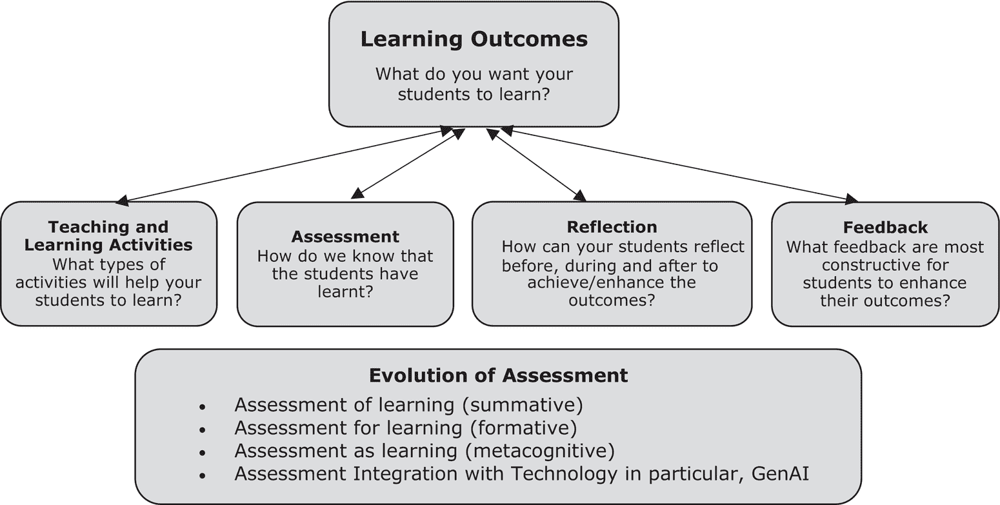
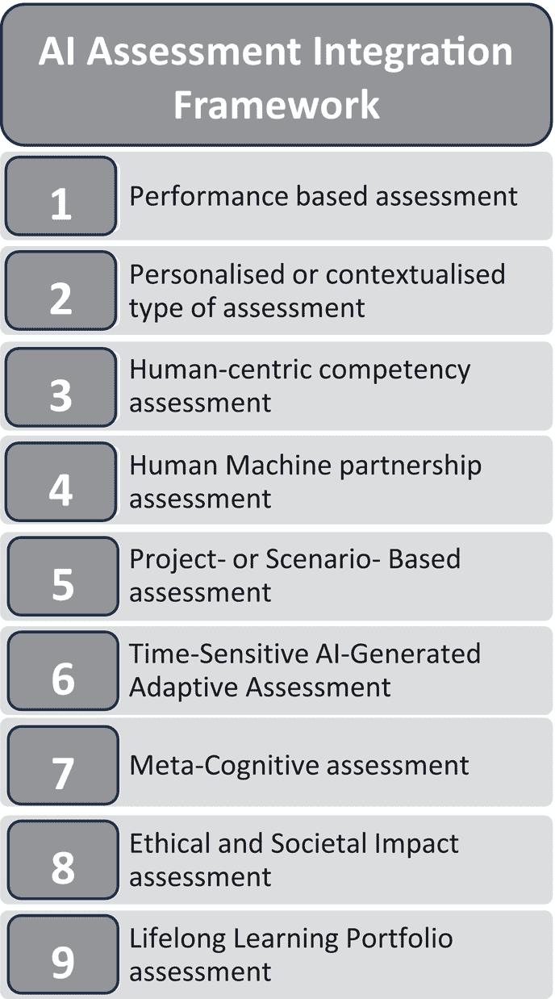

# 4 人工智能时代的评估重构

DOI: [10.4324/9781003459026-4](https://dx.doi.org/10.4324/9781003459026-4)

> 这种评估 GenAI 和学生使用的 AI 工具之间的“军备竞赛”可能导致一个场景，即真正的学习被仅仅“操纵系统”所取代。
> 
> Cecilia KY Chan

## 4.1 引言

当前高等教育教学环境可以被视为一个复杂的网络，其中学习成果、教学法、评估机制相互交织。在其核心，评估既是教育者和学习者的晴雨表，提供了对教育有效性和改进领域的洞察。从课程设计的角度来看，学习成果、教学法、评估工具的三位一体在基础性上发挥着重要作用。虽然学习成果包含了期望的教育目标，教学法概述了实现这些目标的方法。因此，评估作为评估机制，回答了一个关键问题：学生是否真正学到了？

随着我们进入 AI 时代，GenAI 的出现为这个复杂景观带来了一个关键的转变。GenAI 凭借其先进的能力，可以重新定义评估方法，提供实时、自适应和个性化的评估和反馈。虽然其简化并增强评估实践的能力是前所未有的，但它也带来了道德考量，以及在维护学术诚信、公平性和以人为本的冲突中的挑战。GenAI 在评估中的整合超越了传统边界，开辟了新的创新途径，同时也要求我们深思熟虑地权衡其影响。

对于学生来说，评估往往决定了他们的学习方法。正如 Ramsden (2003)所指出的，学生对评估的认识可以深刻影响他们的学习策略，在深入的整体理解和表面层次的记忆之间摇摆。这给教育工作者带来了巨大的责任，他们需要设计评估，不仅评估，还要激发真正的学习。本章将探讨 GenAI 在塑造评估未来方面的多方面作用，反映其近期研究成果中的承诺和风险，并为教师提供一些策略和评估框架，以重新思考和重新设计他们在 GenAI 时代的评估。

## 4.2 高等教育中评估和基于结果学习的演变

在教育领域，评估被视为一个不可动摇的支柱，支撑着学术努力和教学目标的基石。传统上，评估被理解为对学生学习系统的评价，它涵盖了从衡量知识和技能的获得到理解态度和信念的变化这一连续体；简而言之，评估推动学习(Rust, 2002)。这种复杂的测量平衡旨在实现四个主要目的：1). 评估学术成就，2). 保护学术标准和质量，3). 确保对利益相关者的问责制，以及 4). 关键的是，引导学生学习(Chan, 2023, 第三章，第 41 页)。

尽管评估的目的随着时间的推移保持一致，但围绕评估的方法、工具和观点已经发生了演变(Fischer et al., 2023; Scott, 2020)，反映了不断变化的教育哲学和社会需求。例如，历史上，总结性评估，也称为*学习评估*，主要被视为学生学习背后的驱动力。这种评估通常与成绩相关联，发生在学习周期的末尾。这种观点源于对成绩、分数或评估的预期将激励学生学习的信念。本质上，最终评估的潜在存在决定了学生的学习节奏、方法和强度。然而，近年来，对形成性评估日益增长的认可正在学生在学习过程中扮演着重要角色。形成性评估，通常称为*学习评估*(AfL)，是在学习过程中向学生提供反馈的过程，目的是帮助他们提高理解和表现。这种评估通常使用标准参照来比较学生的成就与特定目标或基准。迈克尔·斯克里文在 20 世纪 60 年代引入了形成性评估的概念，以区分它和总结性评估。Black 和 Wiliam (1998)提出，当评估的结果指导并修改教学方法以更好地满足学生的需求时，评估才真正具有形成性。Wiggins (1998)也表达了同样的观点，强调形成性评估的主要目标是促进和提高学生的学习，而不仅仅是监控它。

传统上，总结性评估和形成性评估被视为截然不同的领域；前者侧重于学习结束时的评估，而后者侧重于学习过程中的持续反馈。然而，这种二分法受到了挑战和重塑。例如，在英属哥伦比亚大学，一种两阶段考试方法模糊了这些评估之间的界限(Gilley 和 Clarkston，2014)。在这种方法中，学生最初单独参加考试，然后在小组中进行协作重考。这不仅促进了个人责任，还鼓励了同伴反馈和协作学习，将总结性评估的评价性质与形成性评估的反馈驱动方法相结合。这种创新实践强调了总结性评估和形成性评估不是相互排斥的，而是可以和谐地整合(Chan，2023，第 45 页，第三章；Dixson 和 Worrell，2016)。随着教学研究的进步，这些评估之间的二分法变得不那么明显，认识到它们通常可以服务于双重目的，并相互丰富学习体验。

在 Fischer 等人（2023）最近的一篇文章中，传统的评估视角再次受到挑战。文章展示了评估的当代理解已经超越了其仅仅作为激励者的功能。实际上，在当今的教育环境中，评估的作用不仅仅是衡量学习，而是促进对学科、技能和态度的更深入、更全面的理解（Chan 和 Luk，2022）。这一视角的关键转变之一是认识到高等教育在促进终身学习方面的责任。在这篇论文(Fischer 等人，2023)中，评估被视为支持学生发展评估判断能力——即批判性地评估自己和他人工作的能力——的工具（Tai 等人，2018）。

在高等教育的动态领域，评估格局持续演变，反映了教育旅程的多面性。这一演变的中心是理解真正的学习超越了单纯的知识获取。相反，它包括一个综合的方法，将反馈和反思与传统的学习成果、学习方法和评估方法相结合。

评估通常将反馈降级为次要角色，将其视为评价的副产品。同样，反思，即对学习经历进行内省和批判性思考的过程，在课程设计中仍然是一个无意中的组成部分。然而，为了真正理解和优化学习过程，反馈和反思必须在教育方法的前沿占据其应有的位置。

在我的书《评估体验学习》中，我阐述了反思的概念，即“你在过去、现在和未来如何看待自己；从不同角度如何看待自己；在特定情况或经历之后如何看待自己；在观察他人之后如何看待自己、自己的行为和自己的行为”。这种内省是元认知发展的基础，促进了高级思维过程。此外，从布鲁姆的分类法(Bloom, 1956)到比格斯（Biggs）的 SOLO 分类法(Biggs & Collis, 1982)等确立的教育理论，都强调了反思在深度学习中的重要性。反思不仅滋养了高级认知技能，还促进了转化学习，其中学习者整合新信息，批判性地评估以往的知识，并得出新的见解。

另一方面，反馈不仅仅是对学生表现的回应。本质上，反馈是一种对话——教育者和学习者之间持续的信息交换。正如 Carless 和 Boud（2018）强调的，反馈是一个过程，其中学习者从各种来源解释信息，并利用它来提高他们的工作或学习策略。没有有意义的反馈，学习过程就不完整，限制了学习体验的深度和广度。

*评估即学习*，正如厄尔（2003）所阐述的，是对传统评估范式的深刻转变。它不是将评估视为强加于学生身上的外部过程，而是将评估重新定义为一种自我调节的学习过程。其中核心的是反馈与反思的交织，它们共同构成了一个动态的持续改进和自我意识循环(Carless, 2015，第 199 页)。在评估即学习的方法中，无论是正式还是非正式的反馈，都充当了学生的一面镜子。当学生开始进行自我评估和同伴评估时，反馈成为了一个不可或缺的组成部分，提供了见解、澄清和改进的方向。无论是他们给予自己的反馈，还是同伴或教育者的反馈，它都起着指南针的作用，突出了优势领域和需要进一步发展的领域。虽然反馈提供了方向，但反思是内化这些反馈的机制。通过反思，学生不仅仅是被动地接受反馈，而是积极地与之互动。他们质疑自己的理解，剖析自己的思维过程，最重要的是，他们对自己的学习路径做出有意识的决策。反思反馈使学生能够调整策略，重新定位目标，并巩固他们的理解。

传统的高等教育评估模式，虽然在衡量具体学习成果方面有效，但往往无法全面理解学生的学习历程（Boud & Falchikov, 2006）。主要关注高风险考试的做法促进了死记硬背，不利于培养批判性思维或自我意识（Stobart, 2008；Wiliam, 2011）。当反馈被提供时，通常延迟、泛泛而谈且不具有可操作性，限制了其指导学生表现和改进的潜力。此外，课程设计中缺乏结构化的反思实践意味着学生错过了自我评估和个人成长的机会。尽管反思被认为很重要，但评估反思具有挑战性，主要是因为它需要理解学习者的过去、现在和未来方向（Chan & Lee, 2021）。这种复杂性，加上各种机构和社 会文化因素，往往将反思置于教育过程的边缘。

将反馈和反思融入评估体系，不仅仅是向课程中增加两个更多组件。这是关于重新构想整个教育过程。当学生收到及时、具体且可操作的反馈时，他们成为学习旅程的积极参与者，对自己的成长负责。通过结构化的反思机会，学生可以内省、分析并从他们的经验中得出见解，从而加深对学科和自身的理解。

在这一持续演变的背景下，GenAI 的出现预示着评估维度将发生另一次重大变革。随着我们目前正从强调单纯的知识获取转向更全面、形成性的过程，这个过程优先考虑反馈和反思，GenAI 带来了进一步细化这一转变的潜力。GenAI 无与伦比的数据处理能力和适应性可以增强评估过程，允许提供更细致、实时的反馈和适应学习的方法。然而，作为教育工作者，在利用 GenAI 的力量的同时，我们必须确保评估仍然基于真实的 学习体验，以挑战学生的方式激发真正的反思，发展评估判断力，并培养对学习的更深层次、元认知的方法。随着 GenAI 在教育领域的更深入整合，挑战在于设计或重新设计利用其能力的同时确保重点仍然在于促进深刻、有意义的学习的评估。评估的未来，随着传统教学法与先进 AI 技术的融合，正在地平线上，召唤着教育工作者以热情和洞察力探索这片未知领域。图 4.1 展示了一种修改后的基于成果的方法，强调评估。

图 4.1 基于成果的学生学习反思与反馈方法。

## 4.3 传统时代评估的挑战

学术知识评估的挑战多种多样，几十年来这些挑战已经深深地编织到教育的结构中。这些挑战的核心是评估的多重目的。虽然评估的主要作用理想上应该是指导和提高学生的学习，但它往往扮演着多个角色，有时甚至作为官僚命令或问责检查的工具。 Fendrich (2007) 批判性地观察到，许多当前的评估实践更像是“问责”练习，而不是真正努力提高教育质量。此外，教师和学生对于评估的看法存在明显的差异。虽然教育工作者通常将其视为报告工具，但学生却将其视为一个简单的最终成绩，标志着学习过程的结束 (Chan et al., 2017; Montgomery & Baker, 2007; Sonnleitner & Kovacs, 2020; Van de Watering & Van der Rijt, 2006)。

这种认知困境因评估设计中常见的陷阱而加剧。建设性错位，即学习活动、成果和评估方法之间存在不匹配，仍然很普遍。通常，在需要更深入评估的场景中，会使用简单的评估方法，如多项选择题，而在更简单的背景下，则会错误地应用更复杂的方法。对高风险考试的依赖（Stobart, 2008；Wiliam, 2011）进一步加剧了问题，导致死记硬背，并培养了一种竞争而非协作的学习环境。这类系统，尤其是当它们采用常模参照标准时，往往阻碍了真正的学习和学生之间的协作。

反馈，学习过程中的关键要素，本身也带来了一系列挑战。虽然及时且个性化的反馈可以显著提升学生的学习效果，但它同时也意味着教育工作者需要承担相当大的工作量。在学生人数激增的大规模高等教育时代，这一点尤为明显。尽管小组评估有其潜在的好处，但也会带来后勤管理的噩梦。如果没有明确的目标和期望，它们可能会在学生之间播下不和的种子，并削弱它们本应提供的教育效益。此外，模块化课程体系的日益流行意味着学生需要应对增加的评估工作量，几乎没有时间进行深入的学习。

此外，评估以经验学习类型的教学方法也带来了一些独特的挑战，这些挑战与传统的学术知识评估不同（Kuh, 2008）。一个显著的问题是关于经验学习相关学习成果的不确定性。正如 Luk 和 Chan (2021)所阐明的那样，尽管存在一般的学习成果，但每个学生的经验和动机可能导致特定的成果，从而复杂化了匹配评估的设计。经验学习往往更少关注掌握特定的知识，而是更多地关注获取或提高特定的能力，这需要精心设计的评估方案。

在能力概念化方面存在明显的缺乏清晰性（Chan 等人，2017）。缺乏对学生应发展的能力清晰定义或明确的清单，使得确定评估什么以及如何评估变得具有挑战性。这一点因经验学习成果通常与特定学科没有直接联系而加剧，这使得教育工作者更难进行评估。

在体验式学习中进行评估的物流和实际操作进一步加剧了挑战。鉴于体验式学习通常涉及多个方面，评估可能需要来自多个利益相关者的输入，从而复杂化了物流方面。此外，确定提供反馈的最佳个人、时机和交付方式也带来了一系列困境。确保评估的有效性、可靠性和作为学习旅程有意义整合的部分是体验式学习中的关键而复杂的任务。

除了这些挑战之外，人们对创新评估方法的怀疑态度也在增加。无论是教育工作者还是学生，他们往往对不熟悉的评估技术持谨慎态度，例如同伴评估、自我评估和真实性评估，即使这些方法有可能提高学习成果。另一个挑战在于设计和实施反映现实场景的真实性评估。学生会对他们认为真实的评估产生共鸣，但创建这样的评估需要相当的时间和资源。此外，由于学生个体经验的差异，对真实性的感知也各不相同。全球教育专家呼吁评估更接近现实世界任务的呼声，凸显了对真实性的渴望。

最后，随着合同作弊的兴起，学术不诚实的问题已经演变成一种更为隐蔽的形式，学生可以轻易地购买定制的论文，这从根本上破坏了学术诚信的本质 (Awdry 等人，2022)。

关于评估挑战的更多细节可以在我的开放获取书籍《体验式学习评估》中找到 (Chan，2023，第 39 页，第三章)。

## 4.4 生成式人工智能时代评估的挑战

生成式人工智能在学术评估中的应用既带来了变革性的可能性，也带来了前所未有的挑战。这些挑战中最前沿的是人类中心评估可能受到侵蚀。虽然生成式人工智能可以处理大量数据并提供实时、自适应的评估，但它可能缺乏对个体学习者学习旅程的细微理解，可能导致过度标准化的评估，这些评估无法满足个人的学习风格或文化背景。这增加了简化复杂学习过程和将人类经验简化为数据点的风险。

此外，由 GenAI 驱动的评估的伦理影响非常广泛。数据隐私和安全问题凸显出来，因为学生的学习模式、优势和劣势被分析和存储。如果没有强有力的保障措施，这些敏感信息可能会被滥用或落入错误的手中。此外，GenAI 由于其本质，是根据接收到的数据进行学习和演化的。如果这些数据存在偏见或不具有代表性，它可能会持续甚至加剧现有的教育不平等，强化刻板印象，并进一步边缘化已经处于不利地位的学生群体。例如，在香港大学社会工作与社会行政学院，学院提供了指导方针，以符合社会工作职业的伦理实践和个人数据（隐私）条例的要求，来维护客户数据的机密性。然而，由于大多数 AI 工具使用大型语言模型（LLMs），这些模型通常在云端部署和托管，并且考虑到一些 AI 工具可能用于训练或其他目的，如果学生希望使用 AI 生成的语言模型进行实地课程，就必须提供严格的指导方针和 AI 素养培训。

由 GenAI 驱动的评估的学术诚信也受到审查。随着 AI 工具的日益普及，学生利用高级 AI 工具人为提升成绩或甚至参与复杂形式的作弊的潜在威胁日益严重。这种评估 GenAI 与学生使用的 AI 工具之间的“军备竞赛”可能导致一个场景，即真正的学习被仅仅“操纵系统”所取代。因此，一方面，我们正在努力使我们的学生具备未来所需的 AI 能力，但另一方面，我们担心我们的学生如果以非建设性的方式使用 AI 工具，将缺乏未来对他们所期望的真正知识和技能。在香港大学的一个城市规划与设计课程中，一位教师正在探索使用 GenAI 设计基于论文的评估。这位教师建议学生：i) 使用 GenAI 工具就相关主题生成一篇 2000 字的论文，ii) 反思并批判 AI 生成的作品，分析其优点、缺点和整体连贯性，以及 iii) 根据第 ii 部分的评估和批判撰写自己的综合论文。我被咨询关于这个论文设计。虽然我认为 GenAI 的整合值得赞扬，但教师需要仔细考虑评估和课程的实际目标和结果。如果让学生使用 AI 生成 2000 字论文的目的是仅仅让他们熟悉 GenAI 工具，那么这是学习的一个方面。但如果重点在于第 ii 部分的反思批判和第 iii 部分的论文写作，这些目标必须明确界定。学生是否会因为使用 GenAI 来完成第 iii 部分而受到阻碍，或者这是否被允许？如果允许，那么评估的主要目的又是什么？此外，解决工具的正确归属至关重要。同样重要的是为学生提供明确的评分标准和评分细则。

此外，尽管通用人工智能（GenAI）提供了效率的诱惑，但过度依赖的问题确实存在（Chan & Tsi, 2023）。根据我们的研究 findings，一些学生提到

> “*特别是对于学生来说，这可能会限制在现实世界/未来职业中必要的技能的真实发展。”*
> 
> *“不幸的是，人们可能会变得越来越懒惰，用自己大脑思考得越来越少。”*

一些教师也是

> “*非常担忧。学生们在批判性思维和信息搜索技能方面普遍较差。”*

一位学生实际上说

> “*我认为可以说 ChatGPT 已经宠坏了我，因为它变得越来越难以让我写出一个完整的句子而不想请求 ChatGPT 帮我修正。因为他们总是在你试图表达时使用更好的词语。”*

教育中的人性化，以同理心、理解和指导为特征，面临着

> 被边缘化，导致学生提到的非个人化和疏离的学习环境。在我们的调查中，一些学生和教师并不关心人工智能技术的快速采用和广泛应用，因为他们认为*“人类比人工智能更有创造力和同理心*”。

面对面互动和反馈环节的减少，被自动反馈所取代，可能会剥夺学习过程固有的人际联系。

展望未来，随着通用人工智能（GenAI）在教育体系中的进一步整合，挑战也将在于确保教育工作者和管理人员得到充分的培训，以便理解、解释和采取 GenAI 驱动的见解。如果没有适当的培训，就有误解 GenAI 的使用或在没有批判性评估的情况下过度强调 GenAI 建议的风险。在研究结果中，一位教师强调

> 虽然它可能会深刻地改变教育和工作，但我相信有一条道路可以走，即 AI 工具可以被利用并造福学生、工人和整个社会。但这是一条狭窄的道路，我认为需要非常谨慎的思考，不断对 AI 模型及其演变进行教育，教师与学生或政策制定者与公众之间的沟通，明确界定什么是被允许的，什么是不被允许的等。这是一个快速而负责任地抓住机会的问题。

虽然通用人工智能（GenAI）有望通过使其更加流畅、个性化和数据驱动来革命化学术评估，但它也带来了许多挑战。平衡 GenAI 的潜力与它的缺陷将是至关重要的，确保评估的演变始终扎根于教育的核心原则：培养真正的学习、维护诚信和确保公平。

## 4.5 使用通用人工智能（GenAI）重新设计评估

将通用人工智能（GenAI）融入高等教育提供了变革性的机会，但也带来了独特的挑战，尤其是在评估领域。随着学生能够接触到能够生成详细回复的复杂工具，迫切需要重新定义真实学生工作的样子以及如何有效评估它。重新设计评估不应只强调目标（最终产品、成绩或学位），而应强调学习过程本身（过程）。应对这些挑战需要深入了解 GenAI 的能力和局限性，并辅以强调批判性思维、原创性和对学科内容的全面理解的创新评估策略。

认识到这一新教育环境的复杂性，对于教育工作者和机构来说，制定能够利用人工智能优势同时保护真实学习和学术诚信核心原则的适应性策略变得至关重要。在本节中，我们将探讨旨在在人工智能时代保持评估完整性和提高评估有效性的多种策略。随后，在第 4.6 节中，我们将提供一个框架，突出最适合人工智能驱动环境的评估类型。

这里概述了**六项评估重构关键策略（SARPS）**，每项策略都针对人工智能时代评估的特定方面：

这些策略虽然方法各异，但都汇聚于一个共同的目标，即确保高等教育评估在人工智能时代保持真实、稳健、相关和共鸣。在随后的章节中，我们将深入探讨这些方面的每一个，探索其重要性、应用和改变高等教育评估格局的潜力。

### 4.5.1 整合多种评估方法

评估不仅仅是衡量学生学习成果的手段；它是一个多功能的工具，可以指导教学、激发学习者的积极性，并全面展现学生的技能、知识和理解。在当今复杂的教育环境中，尤其是在人工智能等技术的推动下，依赖单一的方法或评估来源是不够的。以下是原因以及如何通过整合多种评估来源和方法来获得益处的说明：

**通过多种评估来源实现视角的多样性**：

接受多样化的评估来源变得至关重要，以满足学生的多样化需求并确保对其能力的全面评估。这些来源包括：

+   人工智能辅助评估：这些方法利用人工智能的计算能力提供快速和客观的反馈，特别适用于大量学生群体或初步检查。例如，人工智能可以即时批改多项选择题或填空题，确保评估的一致性和无偏见。

+   同行评审评估：让同行参与评审过程可以促进协作学习，并为作品提供不同的视角。同行评审还可以帮助提高软技能，如批判性评估和建设性反馈。此外，通过评估他们的同龄人，学生往往能够反思并加强自己的理解（Chan & Wong, 2021）。

+   教师主导的评估：鉴于反馈的深度和教师带来的洞察力，这些评估方法仍然不可或缺。它们不仅能识别答案的正确性，还能识别背后的思维过程、创造力和解决问题的策略。

+   **缓解偏见和错误：**每种评估方法都有固有的偏见和潜在的错误。例如，AI 评估可能缺乏感知能力，而人类评估有时可能受到隐含偏见的影响。通过整合多种方法，这些偏见可以得到抵消，从而实现更平衡和公正的评估。

+   **全面理解：**不同的方法探测理解的不同方面。虽然 AI 可能在评估定量技能或事实知识方面表现出色，但同伴评审可以揭示沟通技能，而教师可以评估更深层次的认知技能、分析能力和创造力。共同作用，它们为学生能力提供了一个更全面的视角。

+   **灵活性和适应性：**随着课程的进行，教育者可以根据内容的性质或评估的技能选择更倾向于使用一种方法而非另一种。例如，编程作业可能从 AI 评估（用于语法和基本功能）以及同伴/教师评审（用于代码效率、结构和文档）中受益。

+   **反馈丰富性：**多种评估方法确保了多样化的反馈。AI 可以提供即时响应，同伴可以提供相关性以及共享的学习见解，而教师可以提供专家评论。这种丰富性对于学生的成长和理解极为宝贵。

在技术迅速影响教学实践的时代，在人文关怀和计算效率之间取得平衡变得至关重要。通过整合 AI 辅助、同伴评审和教师主导的评估，教育者可以利用每种方法的优点，确保全面、公平和综合的评估过程。

### 4.5.2 在 AI 时代促进真实评估

在一个快速发展的教育环境中，AI 驱动的工具变得越来越复杂，传统的评估方法往往不足。如前所述，衡量学生理解和技能的真正标准超越了死记硬背和机械重复。在这个背景下，真实的评估，即模仿现实世界挑战并要求学生在实际情境中应用其知识的评估，已经成为关键。以下是为什么以及它们如何有益的一些原因。

+   **现实世界应用：**真实评估专注于反映现实世界挑战的任务。例如，而不是仅仅要求商业学生记住营销理论，他们可能被要求为一种产品创建一个完整的营销活动，考虑到当前的市场趋势、预算限制和目标受众。

+   **理解的深度：** 传统的考试可能只测试表面的或非真实的知识，但现实世界的项目和案例研究迫使学生深入挖掘，综合各种信息，并以整体的方式应用他们的知识。这种方法确保学生不仅仅是记忆内容，而是真正理解和内化了它，这对学生来说也更有意义。

+   **多样化的技能评估：** 项目、案例研究和问题解决场景通常需要一系列能力，如研究、协作、批判性思维、创造力和沟通等。这种多方面的方法为学生能力提供了一个更全面的图景。

+   **减少对人工智能助手的依赖：** 口试、演示和面试等任务本质上需要人际互动，这使得学生很难过度依赖人工智能来获取答案。这些格式不仅测试知识，还评估学生的沟通技巧、自信和即兴思考的能力。

+   在人工智能时代，模拟真实世界挑战并整合多种技能的真正评估提供了一种评估和培养学生真实学习和成长的有效方式。此类评估确保了教育的本质，即个人的全面发展，不受损害。

### 4.5.3 在人工智能时代促进学术诚信和真实性

学术领域正面临着前所未有的关于诚信和原创思想的挑战。虽然人工智能提供了众多可以丰富学习体验的工具，但其无处不在的存在可能会诱使学生过度依赖，常常模糊了协助与学术不诚实之间的界限。因此，在学生中建立强大的道德基础并强调真正学术努力的重要性是至关重要的。

+   **理解人工智能在学术界的作用：** 机构应提供人工智能素养研讨会或课程，明确指出人工智能在学术研究和学习中的能力和局限性。通过了解人工智能能做什么和不能做什么，学生可以更好地将其作为工具而不是拐杖来使用。展示人工智能在学术环境中积极和消极应用的案例研究可以帮助学生理解现实世界的含义，例如第二章中提到的人工智能素养课程。

+   **加强学术诚信：** 除了传统的荣誉准则外，机构应制定针对人工智能的具体指南，阐明何为滥用。例如，使用人工智能生成论文内容可能被视为不诚实，而使用人工智能分析论文数据则可能在适当的归属下被认为是可接受的。可以使用多种评估方法，其中人工智能工具可能不太有效，确保学生依赖他们的理解和能力。

+   **道德研讨会：** 定期举办的强调使用 AI 时道德考虑的研讨会可能有益。主题可以从 AI 依赖的哲学影响延伸到关于 AI 时代剽窃的更具体讨论。让学生参与关于这些主题的辩论和讨论，可以培养对学术伦理的更深入理解和欣赏。

+   **后果和责任：** 应明确建立与 AI 相关的学术不当行为的后果。这可能包括重做作业到对重复违规行为采取更严厉的措施。同行评审系统，其中学生评估同行的作品，也有助于维持责任，因为学生成为维护诚信过程的一部分。

+   **庆祝原创思想：** 机构应优先考虑并庆祝真正的学生创新和努力。对杰出的原创研究或项目颁发奖项或认可可以作为激励学生投入真实工作的手段。鼓励学生发表或展示他们的真实工作也可以激励他们追求原创性和深入理解，而不是表面完成任务。

通过全面的指导方针、一致的道德培训以及庆祝原创性的文化，机构可以营造一个环境，让学生们负责任地利用 AI，维护学术追求的纯洁性。

### 4.5.4 将 AI 作为学习伙伴拥抱

人工智能时代的到来极大地改变了教育生态系统。与其对 AI 感到恐惧，仅仅将其视为对学术诚信的挑战，教育工作者和机构可以利用其深刻的潜力来丰富和增强学习体验。通过将 AI 定位为协作工具，而不是仅仅作为潜在问题，学生和教育工作者可以发掘相互学习和推理的新途径，同时保留人类直觉和洞察力的本质。

+   **双重学习的动态：** 提出学生和 AI 共同解决问题的作业。例如，在数学作业中，虽然 AI 可以提供解决方案，但学生可以负责解释推理或甚至识别 AI 方法中的潜在错误。鼓励学生比较他们的推理过程与 AI。这可以是以论文或反思的形式，学生评估两种方法在方法、优点和局限性方面的差异。

+   **在研究中整合 AI：** 学生可以利用 AI 工具进行大量数据分析任务，特别是使用像 Code Interpreter 这样的 AI 工具，使他们能够专注于解释结果、建立联系和制定结论。AI 可以帮助学生在广泛的数据库中搜索相关文献，然后学生进行批判性分析和综合信息。

+   **促进互动学习**：利用人工智能驱动的平台提供个性化的学习体验。这些平台能够识别学生的个体优势和劣势，提供定制化的资源和练习。在某些学科中，人工智能还可以根据学生的假设创建准确的模拟或模型，使他们能够实时测试和改进他们的想法。例如，香港大学护理教育创新中心的护理培训结合了传统护理培训和尖端技术。该中心拥有复杂的计算机化模拟人，以及模拟的临床环境，作为护理学生磨练客户护理和临床决策技能的中心。不同级别的护理学生与逼真的模拟人互动，参与虚拟现实场景，与机器人合作，并利用其他最先进设备在无风险的环境中模拟现实世界的程序和情况。与人工智能的集成有望进一步改善这种学习环境。人工智能驱动的平台可以根据学生的个人表现定制模拟，精确指出具体的优势和劣势。在未来的研究中，这样的平台可以动态调整场景，确保学生持续受到挑战，从而促进更深入的学习和理解。特别是在护理等对精确度至关重要的学科中，人工智能可以生成准确的模拟或模型。这使学生能够测试假设，做出明智的决定，并实时见证结果，而无需承担现实世界后果的影响。

+   **反馈和持续改进**：人工智能可以为学生的作业提供即时反馈，使他们能够理解错误并及时纠正。随着时间的推移，人工智能可以跟踪学生的进度，帮助教育者识别可能需要加强或进一步指导的领域。

+   **促进创造力**：对于艺术和音乐等学科，人工智能工具可以根据当前趋势建议创作或设计，然后学生可以添加他们独特的触感或解释。

在重新构建围绕人工智能的教育叙事时，从单纯的实用或挑战转变为积极的协作伙伴，我们为未来铺平了道路，在那里技术和人类智慧协同工作。这种联盟不仅丰富了学习过程，而且为学生提供了适应一个日益将人工智能融入日常生活结构的世界的技能和视角。通过倡导合作而非对抗，教育者可以在学生和可用的数字工具之间营造一个充满活力、探索和相互尊重的成长环境。

### 4.5.5 人工智能时代评估中优先考虑软技能

虽然人工智能可以筛选大量数据集，为复杂问题生成答案，甚至模拟类似人类的行为，但它仍然无法复制使我们成为人类的基本特质。这些特质通常被称为“软技能”，包括我们的情商、同理心、沟通能力、团队合作、领导力等。优先评估这些技能确保下一代不仅技术熟练，而且在社交和情感上也能胜任。

+   **软技能的独特本质**：软技能复杂且多面，通常由个人经历、文化背景和个人价值观塑造。虽然人工智能可能能够模仿同情反应，但源自理解他人感受的真正同理心仍然是一种独特的人类特质，这就是为什么人工智能对人类情感的影响（即 AI 素养框架的第三要素）很重要（见第二章，第 2.5 节）。团队合作的真正本质在于理解、妥协和相互尊重，这些元素对任何算法来说都是难以完全理解的。软技能的发展超出了任何算法。我们的研究也证实了这一点，一位学生提到“*这可能会导致批判性思维能力的下降，并仅基于人工智能提供的信息做出决策*。”有关软技能的更多信息，请访问整体能力与美德教育网站 – [`www.have.hku.hk/`](https://www.have.hku.hk)。

+   **软技能的长期益处**：正如耶鲁大学现任校长彼得·萨洛维教授恰如其分地所说，“*智商让你被雇佣，但情商让你得到晋升*。”技术技能可能会让你找到一份工作，但往往是软技能推动你晋升、担任领导角色，并支撑长期职业成功。一个个人能够有效沟通、以同理心领导并无缝协作的社会无疑更加坚韧和和谐。

+   **人工智能在提升软技能教育中的作用**：尽管软技能似乎难以被人工智能渗透，但人工智能仍然可以提供帮助。人工智能可以分析虚拟课堂中的学生互动，以确定软技能可能不足的领域，为教育工作者提供调整教学方法的见解。此外，由人工智能驱动的平台可以为学生设计个性化的软技能培训模块，确保满足每个个体的独特需求。

当 AI 继续重塑学术领域时，教育系统不能忽视 AI 无法复制的内在人类品质。通过将软技能评估纳入课程并利用平台，教育者可以确保学生不仅拥有知识，而且拥有在现实世界中应对复杂的人际互动和挑战所必需的基本技能。国际整体能力基金会鼓励开设软技能发展课程，以认证其课程，为学生提供技能的证据和认可。更多详情请见[`www.ihcfoundation.net/`](https://www.ihcfoundation.net)。

### 4.5.6 在 AI 时代优先考虑反馈而非成绩

AI 为我们提供了一个在教育环境中评估学生的范式转变的机会。传统的评分系统通常将学生的表现简化为一个单一的分数，可能无法充分捕捉学生学习旅程的深度和广度。与静态的分数不同，反馈提供了关于学生理解了什么、部分理解了什么或完全错过了什么的洞察。这不仅给学生提供了一个更清晰的关于他们的优势和改进领域的画面，而且也促进了成长心态。学生可以将他们的能力视为固定不变的，而不是将错误视为成长和改进的机会。强调反馈而非成绩通过优先考虑整体理解和持续改进来解决这个问题。

+   **通过 AI 实现即时反馈：** 将 AI 整合到教育过程中的一个优势是它能够提供即时反馈。例如，如果一个学生正在解决数学问题或撰写论文，AI 可以立即指出计算错误或语法错误。这使得学生能够实时纠正并从错误中学习，而不是等待几天或几周后才能收到批改后的论文。众所周知，即时反馈可以增强学习效果，因为行动与后果之间的联系在学生的脑海中是新鲜的。

+   **人机协同反馈：** 虽然 AI 可以迅速对客观元素提供反馈，但人类教师带来的深度和细微差别是 AI 目前无法复制的。他们可以深入研究学生的思维过程，提供关于他们论点有效性的见解，甚至评估并提供关于团队合作或口头演讲等软技能的反馈。这种 AI 的即时性和人类深度的结合确保了一个全面的反馈机制。

+   **减少压力和焦虑：** 传统的评分系统可能会引起显著的压力，因为学生可能会专注于实现特定的分数，而不是真正理解材料。以反馈为中心的系统优先考虑理解和成长，可能减少学生经常感受到的性能压力。此外，由于学生有时会犹豫向教师询问他们认为的小问题反馈，人工智能可以提供帮助而无需学生的任何顾虑。正如一位学生所说，*“ChatGPT 不会评判我。”*

+   **鼓励终身学习：** 在专业领域，持续反馈是一种常态。无论是项目评审、客户反馈还是绩效评估，反馈构成了职业成长的核心。通过强调反馈而非成绩，教育机构能更好地为学生准备面对这一现实，培养适应性强、能够应对人工智能时代不断变化挑战的学习者。

+   **实际考虑因素：** 实施以反馈为中心的系统需要结构性变革。需要平台（可能是人工智能驱动的）允许学生持续提交作业，建立即时反馈循环，并轻松跟踪学生随时间的变化。教师培训也非常关键，确保教育工作者能够提供建设性的反馈并有效地利用人工智能工具。

尽管成绩一直是评估的基石，但人工智能时代提供了一个重新评估其主导地位的好时机。转向以反馈为中心的方法，结合人工智能和人类的见解，确保评估更紧密地与教育的最终目标——即培养理解、好奇心和持续成长——相一致。

## 4.6 人工智能评估整合框架

人工智能不可避免地进入教育领域，促使我们重新思考传统的评估方法。随着教育工作者应对人工智能带来的可能性和挑战，理解其能力并找到将这些能力和谐地整合到评估策略中的方法变得至关重要。人工智能评估整合框架正是这一方向的尝试，它提出了九种不同的评估类型，每一种都精心设计，旨在解决人工智能时代学习和评估的不同方面。

“人工智能评估整合”框架并非完全取代传统的评估方法，而是旨在增强它们，承认虽然人工智能可以成为某些任务的强大工具，但它无法复制独特的技能和能力，这些技能和能力是与我们迄今为止研究并遇到的挑战以及文献中的见解（Dillion 等人，2023；Lichtenthaler，2018）共同发展的。这个框架是以共生为愿景构建的：将人工智能的优势与人类学习经验的深度和广度相结合，如图 4.2 所示。

图 4.2 AI 评估集成框架

“AI 评估集成”框架内的九种评估类型中的每一种都代表了一个独特的视角，通过这个视角可以评估学生的学习。从侧重于知识在现实世界或模拟场景中应用的基于绩效的评估，到强调理解 AI 更广泛影响的道德和社会影响评估，该框架为在教育评估中导航的教师在 AI 和评估的交汇处提供了一份路线图。通过该框架，希望为教师提供一种结构化的方法来理解和利用 AI 在提升教育评估中的潜力。以下列出了九个类别。

1.  基于绩效的评估

1.  个性化或情境化类型的评估

1.  以人为中心的胜任力评估

1.  人机合作伙伴评估

1.  基于项目或场景的评估

1.  时间敏感的 AI 生成自适应评估

1.  元认知评估

1.  道德和社会影响评估

1.  终身学习组合评估

我们现在将深入讨论这些评估，通过案例场景展示教师如何重新设计和整合他们的评估与 AI。

### 4.6.1 基于绩效的评估

基于绩效的评估在教育领域脱颖而出，是其中最真实的一种评估方法。它强调在现实世界或模拟场景中展示技能和知识的应用，与传统测试形成了鲜明的对比。在高等教育中，目标不仅是获取知识，还包括其实际应用，基于绩效的评估变得极其宝贵。它允许学生展示许多能力，如批判性思维和解决问题的能力。

### 4.6.2 个性化或情境化评估

个性化或情境化评估基于的原则是每位学生的学术旅程都是一条独特的轨迹。在高等教育中，每位学生都踏上了一条独特的学习之旅，受到不同的背景、经验和目标的影响。个性化或情境化评估反对通常的一刀切方法，评估提供了学生在个人进步和理解水平上的独特性。当学生在评估中导航时，响应的复杂性和情境会根据他们的学习档案和旅程而变化，提供了学生真实作品的真正体现。

此评估的核心是人工智能的整合。除了作为研究助理的功能外，人工智能工具还充当分析伙伴，建议相关阅读，并提供关键见解。它为文学探索提供了多个深度层次，确保学生有一个全面的理解。然而，人工智能的角色仍然是补充性的；学生仍然必须规划自己的旅程，通过个人的视角来解读诗歌和人工智能的见解。这种技术、文学和个人叙述的结合创造了一种真正丰富的学术体验，推动边界，重新定义现代时代的文学分析。

### 4.6.3 以人为中心的胜任力评估

以人为中心的胜任力评估是一种评估一组独特的人类技能和难以被人工智能复制的技能的方法。这些技能可以从领导力和团队合作到同理心和创造性问题解决。鉴于自动化技术的快速发展，关注这些胜任力确保学生磨炼出既在劳动力市场中有价值又能够抵抗自动化的技能。

### 4.6.4 人机伙伴关系评估

人机伙伴关系评估是一种评估学生有效互动、协作和利用人工智能工具的能力的方法。随着世界越来越将人工智能整合到各个领域，与人工智能协同的能力成为一项至关重要的技能。这种评估侧重于挑战学生利用人工智能工具的任务，同时确保他们的输入和决策对结果至关重要。在此方法中使用的评估类型应涉及评估学生使用这些工具的熟练程度。例如，这可能包括使用人工智能/虚拟现实进行的手术模拟或使用人工智能工具进行 3D 绘图，例如在[Autodesk.com](http://Autodesk.com)上找到的工具。在这些类型的评估中，如果人工智能组件过于先进或做了太多工作，可能会掩盖学生的真实输入。例如，如果一个由人工智能驱动的设计工具自动优化了学生项目的 90%，那么评估学生的实际技能就变得具有挑战性，因此，教师需要适当地决定评估方式。

### 4.6.5 基于项目或情景的评估

基于项目的评估（PBA）是一种评估方法，强调在一段较长时间内，在实践、现实世界环境中应用知识和技能。与可能测试学生特定内容知识的传统评估不同，PBA 侧重于学习过程本身。它通常包括复杂任务，需要研究、协作、批判性思维和展示。当学生在多方面的挑战中工作时，他们不仅展示了理解，还发展了基本的生活技能，如团队合作、问题解决和有效沟通。这些任务的复杂性和多样性，以及涉及的个体和协作思维过程，使得 AI 难以真正复制。

### 4.6.6 时间敏感的 AI 生成自适应评估

时间敏感的 AI 生成自适应评估利用 AI 的计算能力即时生成问题，适应学生的理解水平，确保每个学生都得到一组独特的问题。这些评估有时间限制，使得学生难以咨询外部来源或其他 AI 系统。

### 4.6.7 元认知评估

元认知评估围绕评估学生对自身认知过程的认识和理解。这不仅关乎评估学生知道什么，还关乎他们如何处理和反思学习和问题解决过程。通过这种方法，教育者可以深入了解学生分析策略、预测未来任务表现和反思思维模式的能力。通过专注于这些内省能力，评估集中在 AI 工具目前无法复制的技能上，这使得它在 AI 集成教育环境中特别相关。

### 4.6.8 道德和社会影响评估

道德和社会影响评估是一种评估过程，用于理解、识别、评估和应对特定项目、政策、计划、技术或其他倡议的潜在道德和社会影响。其目的是预测和应对可能出现的意外和不可预见的结果，确保这些倡议与社会主义核心价值观、人权和伦理原则相一致。此类评估通常涉及一种参与式方法，与包括社区成员、专家、政策制定者和可能受该倡议影响的人在内的各种利益相关者进行咨询。道德和社会影响评估不仅评估当前的影响，还试图预测未来的影响，确保长期的社会效应得到考虑。评估通常以一系列建议或策略结束，以减轻负面影响并增强积极成果。虽然人工智能可以识别模式并提供数据驱动的见解，但做出道德判断通常需要人类的直觉。被认为在道德上可接受的东西可能会随时间而变化。依赖于历史数据的 AI 模型可能并不总是适应这些变化。此外，捕捉和解释利益相关者的多样价值观和观点是一项复杂的工作。

### 4.6.9 终身学习组合评估

终身学习组合评估是一种以长期持续自我反思和技能发展为中心的方法，通常涵盖学生的整个学术和职业生涯。通过创建数字组合，学生收集、组织和展示他们的工作、成就和里程碑。这种方法为学生和教育者提供了一个丰富的、纵向的视角，了解学习者的成长、熟练领域以及技能和能力的演变。与传统评估不同，传统评估只捕捉学生在某一时间点的能力快照，终身学习组合评估提供了一个动态的、深入的视角，强调学习过程和自我提升，这些是难以用人工智能工具复制的。

## 4.7 通用人工智能文本检测

在评估章节中不讨论 GenAI 文本检测是不完整的，因为这种 GenAI 文本已成为教育者和学生共同面临的最大担忧之一，尤其是在基于文本的作业方面（Dalalah & Dalalah, 2023；Perkins et al., 2023；Rudolph et al., 2023）。学生使用 GenAI 生成文本作业的便捷性需要一种强大的机制来确保提交作品的真实性和原创性。因此，探索 GenAI 文本检测方法和工具对于维护学术诚信和营造真实的学习环境至关重要。通过文本复杂性分析、困惑度、爆发性和熵分析等多种检测方法，教育者可以区分人类生成的文本和 AI 生成的文本，确保教学和学习活动公平且富有成效。

### 4.7.1 GenAI 文本检测方法

GenAI 文本检测涵盖了多种方法，旨在区分人类生成的文本和由 AI 生成的文本，尤其是大型语言模型（LLMs）。以下是一些方法及其简要描述，以解释每种方法的工作原理：

+   **文本复杂性分析**：分析句法复杂性，这涉及到检查文本的结构复杂性，对于识别 AI 生成的文本至关重要。生成模型可能在复杂性方面表现出与人类撰写的文本不同的模式（Dascalu, 2014）。

+   **风格分析**：这种方法包括分析风格元素，如词汇选择、句子结构和语气，以区分人类和 AI 生成的文本。

+   **困惑度**：困惑度衡量模型根据先前上下文预测后续单词的能力。它是衡量语言模型在单词序列中预测下一个单词的能力的统计指标。较低的困惑度表示更好的预测，这可能是生成模型的标志。它用于评估和比较模型性能（Mukherjee, 2023）。

+   **爆发性**：与困惑度结合，爆发性是衡量某些单词或短语在文本中出现的频率的指标。在检测 GenAI 文本的背景下，爆发性可以用来识别表明机器生成文本的语言使用模式。GenAI 倾向于生成比人类生成的文本变化更少、重复性更高的文本，这可能导致语言使用的爆发性模式（Mukherjee, 2023）。

+   **熵分析**：熵（随机性）度量，反映了语言中可预测性和不可预测性之间的平衡，可以用于分析书面文本。这涉及到分析文本的熵或随机性，这可以表明文本是由机器还是人类生成的。与单词相关的平均选择量的度量可以提供关于人类和 AI 生成的文本词汇使用模式的见解。这些度量可能会揭示人类和 AI 生成的文本之间的区别特征(Bentz 等人，2017；Estevez-Rams，E 等人，2019)。

+   **领域特定知识**：利用领域特定知识，如构建领域特定词汇表，有助于区分人类和机器生成的文本，尤其是在情感分类任务中。这涉及到使用关于特定领域的知识，例如科学或法律写作，以检测文本是否由 AI 生成。

+   **句子长度分布**：生成式 AI 文本的句子长度分布通常比人类撰写的文本更均匀，而人类撰写的文本的句子长度范围更广。这通常涉及分析句子长度的分布，以发现 AI 生成的文本的独特模式。

+   **重复**：生成式 AI 文本可能比人类撰写的文本更频繁地重复某些短语或观点，因为 AI 更有可能生成相似的模式。这涉及到分析单词或短语重复的频率和模式，这些可能在不同的人类和 AI 生成的文本之间有所不同(Jakesch 等人，2023)。

+   **一致性**：生成式 AI 文本可能缺乏一致性，因为它可能生成没有清晰或逻辑结构或流程的文本。这通常涉及评估文本的逻辑一致性和结构，以区分人类和 AI 生成的文本。

这些方法可以单独使用或组合使用，以提高 AI 生成文本检测机制的准确性和鲁棒性。用于检测生成式 AI 文本的不同指标通常与各种方法结合使用。例如，文本复杂度分析和困惑度得分通常与元数据分析结合使用，这涉及到检查诸如作者、出版日期和来源等信息，以确定文本被 AI 生成的可能性。同样，风格分析可以与抄袭检测结合使用，以识别疑似生成式 AI 文本和已知来源之间的写作风格相似性。

总体而言，通常使用不同的方法和指标组合来检测生成式 AI 文本，因为没有单一的方法是万无一失的。通过检查文本的多个方面，研究人员和软件可以提高识别某篇写作是由 AI 生成还是由人类撰写的准确性。在下一节中，我们将综合各种研究关于现有 AI 检测软件工具有效性的研究结果。

### 4.7.2 生成式 AI 文本检测工具

围绕生成式 AI 检测软件的叙述复杂微妙，既有潜在的好处，也存在显著的不足。从《今日美国》的一则标题“学生因使用 AI 作弊被错误指控——而且她不会是最后一个”可以看出，尽管这些工具的开发是为了维护学术诚信，但它们也可能导致不必要的诚信指控。据《今日美国》报道，加州大学戴维斯分校的案例展示了这样一个情况：一名学生被一个生成式 AI 检测工具错误指控作弊，导致了一个压力重重且不公正的场景（Jimenez, 2023）。

加州大学戴维斯分校的事件并非孤立，而是全球教育机构面临的更广泛挑战的一个标志。对学生使用 ChatGPT 等生成式 AI 快速生成可及论文的担忧，导致了初创公司推出旨在区分人类撰写的文本和机器生成文本的产品。然而，这些工具并非完美无缺（Williams, 2023）。由 Weber-Wulff 等人（2023）领导的一项研究评估了包括 Turnitin、GPT Zero 和 Compilatio 等知名在内的 14 个生成式 AI 检测工具。这些工具通常通过识别 AI 生成文本的典型特征，如重复，然后计算文本被 AI 生成的可能性来运作。该研究显示，这些工具在识别经过人类轻微修改或使用改写工具混淆的 ChatGPT 生成的文本时遇到了困难。例如，检测工具可以以 96%的平均准确率识别人类撰写的文本，但在检测 AI 生成的文本时表现显著下降——未修改的 ChatGPT 文本的准确率为 74%，当文本稍作编辑后，准确率进一步下降到 42%。这些发现强调了学生通过仅对 AI 生成的文本进行微小修改就能轻易绕过这些检测工具的便利性。

另一项研究检验了大学评估在检测 Open AI 的 GPT-4 生成的内容方面的有效性，这项研究得到了 Turnitin AI 检测工具的帮助 (Perkins 等人，2023)。尽管该工具将实验提交的 91% 识别为包含 AI 生成的内容，但实际上只有 54.8% 的内容被检测到，这暗示了使用如提示工程等对抗性技术作为有效规避方法。结果表明，需要增强 AI 检测软件，并提高教师利用这些工具的意识和培训，尤其是在真实和 AI 生成的提交之间的评分发现相当接近的情况下。类似的研究 (Khalil 和 Er，2023；Walters，2023) 也产生了类似的结果。Lancaster (2023) 提出了一种数字水印技术作为识别 AI 生成的文本的可能解决方案，尽管一项小规模研究表明，它具有前景但并非万无一失的解决方案来对抗滥用。

研究人员指出，这些工具的主要缺点之一是它们无法履行其关于准确检测 AI 生成的文本的承诺。尽管存在明显的缺陷，但公司仍在推出声称解决 AI 文本检测的产品，尽管成功率各不相同。例如，Turnitin 通过相对较低的误报率实现了一定程度的检测准确性。然而，一些专家的总体观点是，试图识别 AI 编写的文本的整体概念是有缺陷的，这表明应该更加关注解决学术中使用 AI 的根本问题 (Williams，2023)。

这种不断发展的叙事强调了在教育环境中部署 GenAI 检测工具时采取平衡方法的必要性。考虑潜在的误报以及可能由此产生的过度压力和不公平待遇至关重要。虽然有一些工具可用，但它们在准确检测 AI 生成的文本方面的有效性，尤其是在稍作修改的情况下，仍然是一个巨大的挑战。此外，随着这些检测工具的创造者继续对其算法进行改进以应对生成 AI 的不断发展的能力，关于在学术环境中使用此类软件的伦理、有效性和实施方面的对话仍然是一个相关且持续进行的话题。

随着我们继续前进，采取多方面的方法至关重要，包括政策制定、学生和员工培训、学科特定干预、修订评估设计、改进检测技术，以及采用学生伙伴关系方法来维护面对不断发展的 AI 技术的学术诚信。

## 4.8 结论

随着我们站在由 GenAI 的快速进步带来的教育革命的前沿，教育工作者、学习者以及机构进行自我反思、创新和整合变得至关重要。高等教育领域，其错综复杂的学习成果、教学法以及评估工具，正准备经历变革性的变化。但变革伴随着责任。GenAI 的潜力巨大，承诺提供实时、自适应的评估和反馈机制，这可能会重新定义评估的本质。然而，这种潜力必须谨慎利用，确保教育的核心原则——真实性、诚信、公平和真正的学习——始终处于前沿。

在本章中，我们探讨了评估的演变，反思了其在传统和 GenAI 环境中的挑战和创新。传统时代评估的复杂性，以其多方面的目的和常常不一致的感知为标志，为 GenAI 带来的深刻变革奠定了基础。然而，GenAI 的引入也引发了一系列伦理、物流和教学问题。SARPS 和 AI 评估集成框架，其包含九种不同的评估类型，如同灯塔，引导教育工作者穿越 AI 集成评估的未知水域。

但当我们重新构想和重新设计适用于 GenAI 时代的评估时，记住技术，无论多么先进，都应作为工具，而不是替代品。教育的本质——以同理心、辅导和深入了解个人学习旅程为标志——是不可替代的。GenAI 提供了一个平台，以增强这种人文关怀，为教育工作者提供洞察力、自动化和个性化，这些可以提升学习体验。然而，责任仍然在教育工作者身上，确保 GenAI 的集成是有意义的、符合伦理的，并且以学习者为中心。

总之，GenAI 时代召唤我们对学习整体旅程重新关注。重新设计评估不仅关乎利用先进技术，也关乎重新构想整个教育过程。这是关于优先考虑反馈而非成绩、过程而非产品、以及真实的学习体验而非死记硬背。在我们导航这个变革时代的过程中，作为教育工作者、学习者和利益相关者，我们共同的责任是确保评估的未来始终基于定义优质教育的原则。通过深思熟虑的集成、批判性评估和学习者中心的方法，GenAI 时代的评估未来看起来充满希望，充满了深刻、有意义学习的机遇。

## 参考文献

+   奥德利，R.，多森，P.，萨瑟兰-史密斯，W. (2022). 合同作弊：立法还是不立法——这是问题吗？高等教育评估与评价, *47*(5), 712–726\. [`doi.org/10.1080/02602938.2021.1957773`](https://doi.org/10.1080/02602938.2021.1957773)

+   本茨，C.，阿里卡尼奥蒂斯，D.，西索乌，M.，费雷尔-伊-坎乔，R. (2017). 单词的熵——超过 1000 种语言的易学性和表达性. Entropy, *19*(6), 275\. [`doi.org/10.3390/e19060275`](https://doi.org/10.3390/e19060275)

+   比格斯，J.B.，科尔利斯，K.F. (1982). 评估学习质量：SOLO 分类法. 学术出版社.

+   布莱克，P.，威廉姆，D. (1998). 黑箱内部：通过课堂评估提高标准. 菲 Delta Kappan, *80*(2), 139–148.

+   布卢姆，B. (1956). 教育目标分类法. 长曼，格林和公司.

+   鲍德，D.，法利希科夫，N. (2006). 将评估与长期学习相一致. 高等教育评估与评价, *31*(4), 399–413\. [`doi.org/10.1080/02602930600679050`](https://doi.org/10.1080/02602930600679050)

+   卡莱斯，D. (2015). 大学评估中的卓越：从获奖实践中学到的东西. 路透社.

+   卡莱斯，D.，鲍德，D. (2018). 学生反馈素养的发展：促进反馈的采纳. 高等教育评估与评价, *43*(8), 1315–1325\. [`doi.org/10.1080/02602938.2018.1463354`](https://doi.org/10.1080/02602938.2018.1463354)

+   陈，C.K.Y. (2023). 经验学习评估. Taylor & Francis.

+   陈，C.K.Y.，李，K.K.W. (2021). 反思素养：通过综合文献综述对高等教育中反思挑战的多层次视角. 教育研究评论, *32*. [`doi.org/10.1016/j.edurev.2020.100376`](https://doi.org/10.1016/j.edurev.2020.100376)

+   陈，C. K. Y.，蔡，L.H.Y. (2023). 教育领域的 AI 革命：AI 会取代还是辅助高等教育中的教师？*arXiv 预印本*. [`doi.org/10.48550/arXiv.2305.01185`](https://doi.org/10.48550/arXiv.2305.01185)

+   陈，C.K.Y.，陆，Y.Y.L. (2022). 3-3-4 课程改革八年后：香港本科生综合能力发展的现状. 教育评估研究, *74*. [`doi.org/10.1016/j.stueduc.2022.101168`](https://doi.org/10.1016/j.stueduc.2022.101168)

+   陈，C.K.Y. & 王耀华，Y.H.H. (2021). 学生对书面、音频、视频和面对面反思方法的整体能力发展的看法. 高等教育中的主动学习. [`doi.org/10.1177/14697874211054449`](https://doi.org/10.1177/14697874211054449)

+   Chan, C.K.Y., Fong, E.T.Y., Luk, L.Y.Y., & Ho, R. (2017). 对高等教育课程中通用能力开发与实施挑战的文献综述。国际教育发展杂志，*57*，1–10。[`doi.org/10.1016/j.ijedudev.2017.08.010`](https://doi.org/10.1016/j.ijedudev.2017.08.010)

+   Dalalah, D., & Dalalah, O. M. (2023). 教育和学术研究中生成式 AI 检测工具的假阳性和假阴性：以 ChatGPT 为例。国际管理教育杂志，*21*(2)，100822。

+   Dascalu, M. (2014). 分析话语和文本复杂性以促进学习和协作。在《分析话语和文本复杂性以促进学习和协作》（第 1-3 页）。Springer。[`doi.org/10.1007/978-3-319-03419-5`](https://doi.org/10.1007/978-3-319-03419-5)

+   Dillion, D., Tandon, N., Gu, Y., & Gray, K. (2023). 人工智能语言模型能否取代人类参与者？认知科学趋势，*27*(7)，597–600。[`doi.org/10.1016/j.tics.2023.04.008`](https://doi.org/10.1016/j.tics.2023.04.008)

+   Dixson, D.D., & Worrell, F.C. (2016). 课堂中的形成性评估和总结性评估。理论与实践，*55*(2)，153–159。[`doi.org/10.1080/00405841.2016.1148989`](https://doi.org/10.1080/00405841.2016.1148989)

+   Earl, L.M. (2003). 评估即学习：利用课堂评估最大化学生学习。科温出版社。

+   Estevez-Rams, E., Mesa-Rodriguez, A., & Estevez-Moya, D. (2019). 书面语言不同组织层次上的复杂性与熵分析。PLoS ONE，*14*(5)，e0214863。[`doi.org/10.1371/journal.pone.0214863`](https://doi.org/10.1371/journal.pone.0214863)

+   Fendrich, L. (2007). 教育紧身衣。高等教育纪事，*53*(40)，1–5。

+   Fischer, J., Bearman, M., Boud, D., & Tai, J. (2023). 评估如何驱动学习？关注学生评估判断力的发展。高等教育评估与评价。[`doi.org/10.1080/02602938.2023.2206986`](https://doi.org/10.1080/02602938.2023.2206986)

+   Gilley, B.H., & Clarkston, B. (2014). 协作测试：在控制课堂研究中对本科生学习证据的研究。学院科学教学杂志，*43*(3)，83–91。[`doi.org/10.2505/4/jcst14_043_03_83`](https://doi.org/10.2505/4/jcst14_043_03_83)

+   Jakesch, M., Hancock, J. T., & Naaman, M. (2023). 人类对 AI 生成语言的启发式方法是错误的。美国国家科学院院刊，*120*(11)，e2208839120。

+   Jimenez, K. (2023, April 12). 教授们正在使用 ChatGPT 检测工具指控学生作弊。但软件出错怎么办？USA Today. [`eu.usatoday.com/story/news/education/2023/04/12/how-ai-detection-tool-spawned-false-cheating-case-uc-davis/11600777002/`](https://eu.usatoday.com)

+   Khalil, M., & Er, E. (2023). ChatGPT 会抓到您吗？对抄袭检测的重新思考。arXiv:2302.04335v1\. [`doi.org/10.48550/arXiv.2302.04335`](https://doi.org/10.48550/arXiv.2302.04335)

+   Kuh, G.D. (2008). 高影响力教育实践：它们是什么，谁可以接触到它们，以及为什么它们很重要。AAC&U.

+   Lancaster, T. (2023). 人工智能、文本生成工具和 ChatGPT——数字水印能提供解决方案吗？教育诚信国际杂志，*19*(10)，1–16\. 从[`link.springer.com/article/10.1007/s40979-023-00131-6`](https://link.springer.com)检索。

+   Lichtenthaler, U. (2018). 替代或合成：人类与人工智能之间的相互作用。研究-技术管理，*61*(5)，12–14\. [`doi.org/10.1080/08956308.2018.1495962`](https://doi.org/10.1080/08956308.2018.1495962)

+   Luk, Y.Y.L., & Chan, C.K.Y. (2021). 工程实习学生的学习成果：一个初步框架。继续教育研究，*44*(3)，526–545\. [`doi.org/10.1080/0158037X.2021.1917536`](https://doi.org/10.1080/0158037X.2021.1917536)

+   Montgomery, J. L., & Baker, W. (2007). 教师撰写的反馈：学生看法、教师自我评估和实际教师表现。第二语言写作杂志，*16*(2)，82–99\. [`doi.org/10.1016/j.jslw.2007.04.002`](https://doi.org/10.1016/j.jslw.2007.04.002)

+   Mukherjee, S. (2023, June 15). 揭示困惑：衡量 LLMs 和生成式 AI 模型的成功。从[`ramblersm.medium.com/the-significance-of-perplexity-in-evaluating-llms-and-generative-ai-62e290e791bc`](https://ramblersm.medium.com)检索。

+   Perkins, M., Roe, J., Postma, D., McGaughran, J., & Hickerson, D. (2023). 音调游戏：大学评估中教师对 GPT-4 生成内容的检测。arXiv 预印本。arXiv:2305.18081

+   Ramsden, P. (2003). 在高等教育中学习教学。Routledge.

+   Rudolph, J., Tan, S., & Tan, S. (2023). ChatGPT：胡言乱语者还是高等教育传统评估的终结？应用学习与教学杂志，*6*(1)。

+   Rust, C. (2002). 评估对学生学习的影响：研究文献如何实际帮助制定系部评估策略和学习者为中心的评估实践？高等教育中的主动学习，*3*(2)，145–158\. [`doi.org/10.1177/1469787402003002004`](https://doi.org/10.1177/1469787402003002004)

+   Scott, I.M. (2020). 超越“驾驶”：评估、表现和学习之间的关系。医学教育，*54*(1)，54–59\. [`doi.org/10.1111/medu.13935`](https://doi.org/10.1111/medu.13935)

+   Sonnleitner, P., & Kovacs, C. (2020). 学生和教师对公平性的看法差异：探讨自我管理问卷改善教师评估实践潜力的可能性。教育前沿，*5*. [`doi.org/10.3389/feduc.2020.00017`](https://doi.org/10.3389/feduc.2020.00017)

+   Stobart, G. (2008). 测试时刻：评估的用途和滥用。Routledge。

+   Tai, J., Ajjawi, R., Boud, D., Dawson, P., & Panadero, E. (2018). 发展评估判断力：使学生能够对作品质量做出决策。高等教育，*76*(3)，467–481\. [`doi.org/10.1007/s10734-017-0220-3`](https://doi.org/10.1007/s10734-017-0220-3)

+   Van de Watering, G., & Van der Rijt, J. (2006). 教师和学生对评估的看法：综述及对评估项目难度估计能力和准确性的研究。教育研究评论，*1*(2)，133–147\. [`doi.org/10.1016/j.edurev.2006.05.001`](https://doi.org/10.1016/j.edurev.2006.05.001)

+   Walters, W. H. (2023). 设计用于检测 AI 生成写作的软件的有效性：比较 16 种 AI 文本检测器。开放信息科学，*7*(1)，20220158\. [`doi.org/10.1515/opis-2022-0158`](https://doi.org/10.1515/opis-2022-0158)

+   Weber-Wulff, D., Anohina-Naumeca, A., Bjelobaba, S., Foltýnek, T., Guerrero-Dib, J., Popoola, O., Šigut, P., & Waddington, L. (2023). 对 AI 生成文本检测工具的测试。预印本。 [`doi.org/10.48550/arXiv.2306.15666`](https://doi.org/10.48550/arXiv.2306.15666)

+   Wiggins, G. (1998). 教育性评估。设计评估以提供和改进学生表现的信息。Jossey-Bass Publishers

+   Wiliam, D. (2011). 内嵌式形成性评估。Solution Tree Press。

+   Williams, R. (2023, July 7). AI 文本检测工具很容易被欺骗。麻省理工学院技术评论。从[`www.technologyreview.com/2023/07/07/1075982/ai-text-detection-tools-are-really-easy-to-fool/`](https://www.technologyreview.com)获取。
