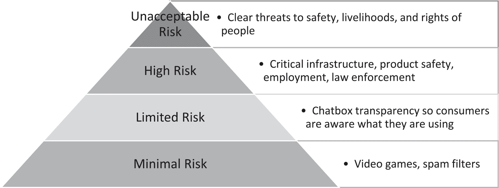
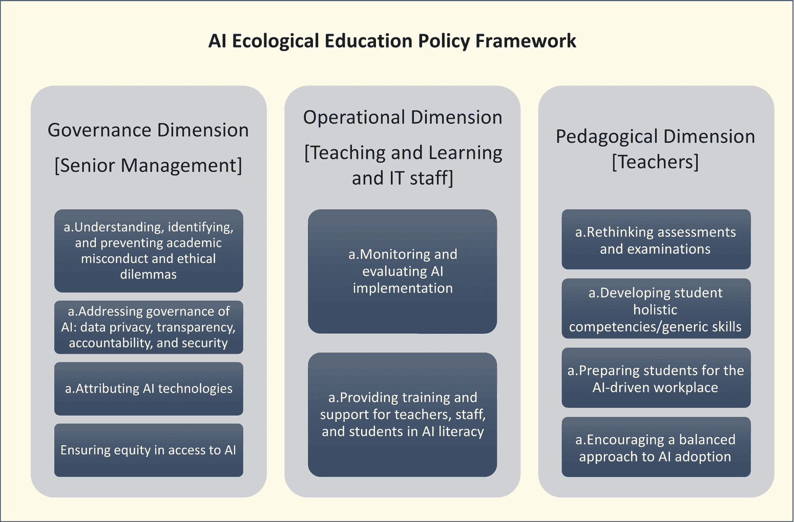
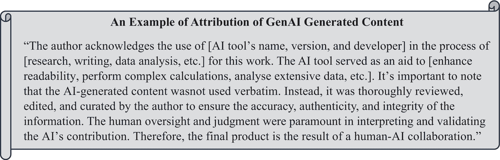
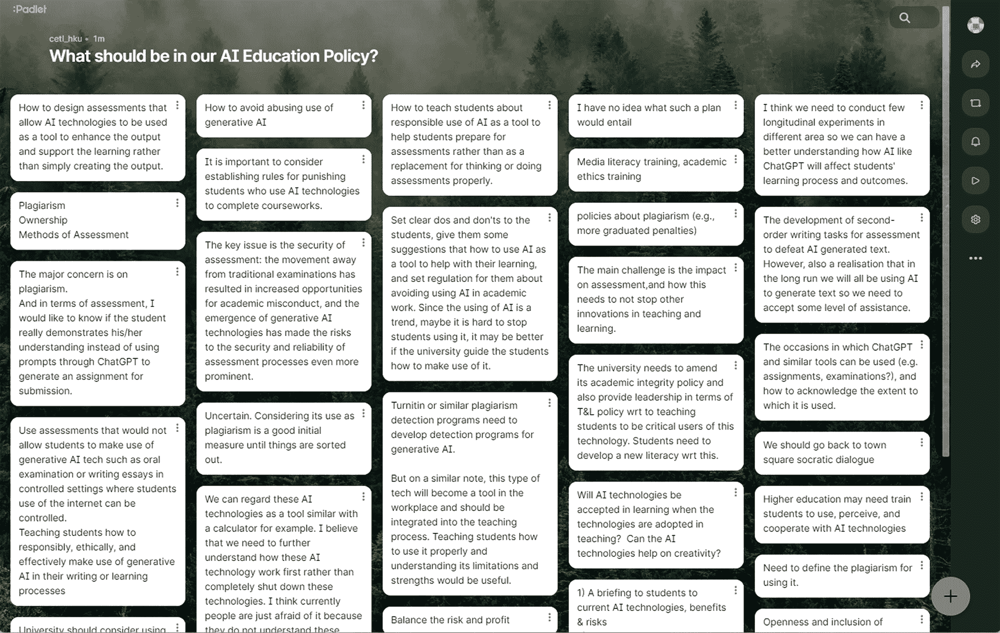

# 5 在教育中制定人工智能政策

DOI: [10.4324/9781003459026-5](https://dx.doi.org/10.4324/9781003459026-5)

> 我们正处于人工智能监管竞赛的初期，最终每个国家都将有一些政策法规，但这些政策法规将是动态的，我们将不断采纳、改变。
> 
> 塞西莉亚·K·Y·陈

## 5.1 引言

在好莱坞电影《我，机器人》中，机器人必须遵守三条法律：

+   *第一定律：机器人不得伤害人类，也不得因不作为而使人类受到伤害*。

+   *第二定律：机器人必须服从人类给予它的命令，除非这些命令与第一定律相冲突*。

+   *第三定律：机器人必须保护自己的存在，只要这种保护不与第一定律或第二定律相冲突*。

当讨论人工智能的监管时，可能会想起 2004 年科幻电影中提出的这三大机器人定律。它们作为机器人的基础伦理原则，旨在防止它们对人类造成伤害。尽管当前的 AI 系统还不够先进，不足以对人类构成直接威胁，但它们在教育领域产生了大量不同的伦理问题，尤其是在治理、隐私、公平、责任、剽窃和学术不端行为相关领域。本章将首先探讨人工智能政策的发展及其对社会中使用生成式人工智能（GenAI）工具的影响，包括任何相关的考虑和挑战。然后，将提供关于世界各地正在开发和实施的人工智能政策的文献综述，并随后探讨教育领域的人工智能政策，包括最新的联合国教科文组织关于教育和研究的人工智能指南。本章将提供实际支持和建议，以减轻讨论的担忧，并提供制定人工智能教育政策的逐步方法，以确保生成式人工智能（GenAI）在学生学习中的负责任和有效使用。

## 5.2 ChatGPT 和生成式人工智能是否有类似的法律？

ChatGPT 是由 OpenAI 公司开发的 AI 语言模型，它没有物理能力，并且不会像《我，机器人》中的机器人那样与真实世界互动。尽管如此，OpenAI 首席执行官山姆·奥特曼表示，“如果这项技术出错，后果可能非常严重” (Baio, 2023)。因此，政府监督在减轻人工智能风险方面将发挥关键作用，以下我们将探讨 AI 公司和各国在开发和使用 AI 系统时应考虑的几个重要原则。这些原则也反映了 AI 的弱点。它们包括：

1.  透明度、可解释性和可理解性

1.  公平和偏见

1.  责任

1.  安全性和鲁棒性

1.  隐私和数据保护

1.  自主性和人类监督

1.  人工智能与人类对齐

### 5.2.1 透明度、可解释性和可理解性

> 在人工智能中，透明度、可解释性和可理解性意味着人工智能模型的操作、决策和推理过程对人类来说是清晰、公开、可理解和可解释的。

高级人工智能模型的一个显著挑战是它们是“黑箱”，这意味着理解人工智能系统的工作原理以及它们为什么会做出这样的决策可能很困难。透明度、可解释性和可理解性对于用户理解、信任和有效管理人工智能技术至关重要（Ribeiro et al., 2016）。后两个概念分别指的是对人工智能系统如何做出决策或推荐有清晰和可理解的解释，以及对人工智能模型内部运作和逻辑的理解（Joyce et al., 2023; Lawton, 2023）。这三个概念在医疗保健、金融和刑事司法等对人工智能决策可能对个人生活产生深远影响的行业中尤为重要。

提高人工智能系统的透明度、可解释性和可理解性的方法有很多。一种方法是提供有关系统是如何训练的以及用于训练它的数据的信息。另一种方法是让用户能够检查系统的代码，以便更好地理解它是如何做出决定的。最后，还有一些其他方法可以用来提高人工智能系统的可解释性和可理解性，例如通过阐明导致系统特定决策或输出的潜在因素、数据和推理，或者提供反事实解释来展示如果使用不同的数据，系统的决策会如何改变，帮助用户识别在决策过程中哪些因素最具影响力，以及是否存在任何偏见（Chowdhury, 2023; Lawton, 2023）。

### 5.2.2 公平性和偏见

> 人工智能中的公平性和偏见意味着人工智能系统不应歧视个人或群体。

当苹果公司联合创始人史蒂夫·沃兹尼亚克发现高盛的苹果信用卡人工智能算法对他妻子存在偏见时，他提出了担忧。似乎女性信用卡持卡人仅仅因为她们是女性就获得了较低的苹果信用卡信用额度 (Nasiripour & Natarajan, 2019)。这一事件是说明人工智能系统内部公平性和偏见问题的例子之一。特别是在依赖于大量数据集的系统中，人工智能系统可能会持续或甚至放大现有的偏见。因此，对于人工智能开发者来说，认识到并解决这些偏见以确保人工智能系统公平且不对某些群体进行歧视至关重要。公平原则也强调了在人工智能开发中拥有多元化和包容性团队的重要性，因为这有助于识别和纠正此类偏见。由于人工智能系统可以对人们的机会和结果产生重大影响，因此有必要确保它们不会歧视或使某些群体处于不利地位。

有几种方法可以增强人工智能系统的公平性并减少偏见。一种方法是用代表系统将用于其中的群体的训练数据。或者，可以设计旨在公平性的算法。对人工智能系统进行持续监控以发现偏见，并在发现后实施纠正措施同样至关重要 (Ferrara, 2023; Mehrabi et al., 2021; Silberg & Manyika, 2019)。解决人工智能中的公平性和偏见需要一种基于理解、评估以及在必要时纠正数据来源的全面方法，因为历史数据往往携带社会偏见，这些偏见可能会渗透到人工智能系统中。确保数据收集的多样性，结合创新的预处理、处理和后处理技术，将有助于为更公正和更平衡的模型奠定基础。在人工智能中融入透明度、可解释性和可理解性，并结合持续部署后的监控，确保人工智能系统的决策将随着社会规范的发展而演变。组建多元化的开发团队，结合积极的利益相关者参与和遵守道德准则，进一步为偏见提供多方面的防御。

### 5.2.3 问责制

> 人工智能中的问责制意味着个人应该能够对开发和利用人工智能系统的各方进行问责。

2023 年 1 月，许多新闻机构发布了类似“*Springer Nature 表示，ChatGPT 不能作为作者获得认可*”的标题 (Stokel-Walker, 2023)。这种立场完全可以理解。毕竟，我们从未将像 Microsoft Word 或 Google Docs 这样的工具视为共同作者。领先的科学期刊要求作者签署一份声明，表明他们对工作贡献的责任；由于像 ChatGPT 这样的通用人工智能工具无法满足这一要求，因此不能列为作者。这很重要，因为人工智能系统可能会犯错误，能够识别并让那些犯错误的责任方承担责任是至关重要的。人工智能的开发者和运营商应该对其系统的功能和结果负责，如果人工智能系统失败或做出错误的决定，必须有一种机制来确定谁应该承担责任。同时，错误地报告由人工智能生成的不正确信息的 AI 用户也应该对其在事实核查和验证他们发布的内容中的疏忽承担责任。所有这些对于用户信任、法律和法规遵守都至关重要。

在人工智能中导航责任性的复杂性需要一套综合框架，该框架将技术和伦理考量相结合。这不仅仅包括设计决策过程的透明文档，还包括在人工智能系统出错时建立纠正机制。开发者、运营商和监管机构必须合作，制定定义责任性的指南和法规，同时培养透明度文化。一种方式是要求公司披露他们在服务或产品中使用或实施人工智能系统的信息，并为人们提供报告这些系统中发现任何问题的途径。另一种方式是制定法律和法规，使公司对其人工智能系统做出的决策负责。除了这些措施之外，在人工智能社区内发展强大的责任和问责文化也非常重要。这可以通过教育开发者和用户关于人工智能的伦理影响，以及制定人工智能开发和使用的伦理指南来实现 (Burciaga, 2021; 信息专员办公室，未注明日期; Novelli 等人，2023)。

### 5.2.4 安全性和鲁棒性

> 人工智能中的安全性和鲁棒性意味着人工智能系统应该设计成即使在意外或具有挑战性的情况下也能安全可靠地运行。

随着人工智能系统越来越多地应用于自动驾驶、医疗诊断和基础设施管理等关键领域，确保安全性和鲁棒性至关重要。人工智能系统应该能够抵御对抗性攻击，即使在意外情况下也不应出现故障。

为了确保人工智能的使用安全，重要的是在多样化的数据上对其进行训练，以便它能够管理和处理各种情况。我们还可以使用对抗性训练，这意味着用具有挑战性的输入来测试人工智能，以确保它能够妥善处理。一旦人工智能开始使用，持续的监控可以帮助捕捉和修复出现的任何问题。拥有人类监督的选项也很有用，即当人工智能面对不确定的情况时，人们可以介入并做出决策。使人工智能的决策过程清晰易懂，也可以培养人们信任和管理它的能力。简而言之，构建一个安全且稳健的人工智能系统需要周密的规划、测试和监督。

### 5.2.5 隐私和数据保护

> 在人工智能中，隐私和数据保护意味着人工智能系统应该被设计成保护个人隐私。

由于人工智能系统通常需要大量数据用于训练和推理，因此对用户隐私和数据保护存在重大担忧。公司和各国必须确保人工智能系统尊重用户隐私，有数据匿名化的规定，并遵守数据保护法规。

在第一章和第六章中，我们讨论了数据的收集和训练方式，以及如何保护数据隐私。公司通常采取不同的步骤来保护他们用于训练人工智能模型的数据的隐私，这可能包括以下一些：

+   通过从用于训练人工智能模型的数据中移除任何个人可识别信息来去识别数据；

+   加密所有静态或传输中的数据；

+   限制数据访问权限仅限于少数授权员工；以及/或

+   审计数据访问以确保其符合隐私政策的使用。

包括 OpenAI 在内的公司也可能通过其服务通过 cookies 和其他在其隐私政策中描述的方式收集汇总信息。根据 OpenAI 自己的政策(OpenAI, 2023b)，他们维护和使用去识别信息以匿名或去识别的形式，并且不试图重新识别信息，除非法律要求。OpenAI 加密所有静态和传输中的数据，并使用严格的访问控制来限制谁可以访问数据。只有少数授权的 OpenAI 人员以及受保密和安全义务约束的专业第三方承包商可以严格按需查看和访问用户内容。此类需求的例子包括调查滥用或安全事件、在用户就其账户提出问题寻求支持时提供支持、遵守法律义务或使用用户提交的数据微调模型（除非用户已选择退出）。OpenAI 还使用特殊的过滤技术，如 PII，以减少使用的个人数据量。

截至 2023 年 3 月 1 日，发送到 OpenAI API 的数据将不会用于训练或改进 OpenAI 模型（除非用户明确同意；OpenAI, 2023a）。选择同意的一个优点是，随着时间的推移，模型可能更有效地满足个人的特定需求和用例。大多数公司都遵守了[通用数据保护条例](https://GDPR.EU, 2023)(GDPR.EU, 2023)和[加利福尼亚消费者隐私法案](https://State of California Department of Justice, Office of the Attorney General, 2023)(State of California Department of Justice, Office of the Attorney General, 2023)。

图 5.1 展示了微软必应聊天功能如何通过识别和阻止此类潜在输出，主动保护个人信息并避免生成有害或冒犯性内容。

图 5.1 微软必应的聊天功能保护数据隐私

### 5.2.6 自主性和人类监督

> 人工智能中的自主性和人类监督意味着人工智能系统可以被设计为自主运行，但人类仍然应该在必要时能够覆盖系统的决策。

自主性很重要，因为它允许人工智能系统更高效、更有效地运行。例如，人工智能系统可以快速处理大量数据并据此做出决策，其速度远超过人类(Bryson, 2018)。这可以在欺诈检测和医疗诊断等许多应用中带来好处。然而，仍然需要有人类对人工智能系统进行监督。如前所述，人工智能系统可能会犯错误，因此需要有人类在位以识别和纠正这些错误。此外，人工智能系统可能并不总是与人类价值观相一致，因此建立人类监督以确保人工智能系统以负责任和道德的方式使用是很重要的。

人类监督的必要性在人工智能金融交易中表现得尤为明显：人工智能系统可以用来交易股票和其他金融工具。然而，在人工智能金融交易系统中进行人类监督很重要，以防它犯下可能导致财务损失的错误；人类交易员可以审查系统的交易决策，并在执行交易前确保它们是合理的。为了进一步说明人类监督至关重要且能提供一种安慰感，2023 年 8 月，有关 OpenAI 首席执行官山姆·奥特曼和他似乎总是携带的蓝色背包的谣言流传开来。有些人开玩笑猜测，奥特曼的背包里藏有一个密码，可以在人工智能叛乱的情况下防止可能的末日——作为人类，他手里有一张王牌可以用来保护人类免受潜在的 AI 叛乱的影响，如果真的发生的话(Manish, 2023)。

应对在人工智能中平衡自主性和人类监督的挑战，需要考虑自动化决策的好处并评估人类干预的需求程度，特别是在前者具有重大后果的情况下。解决这种平衡的一种方法是为 AI 定义边界，确定 AI 完全自主可接受的领域或情况以及不可接受的领域。例如，AI 自主管理音乐播放列表可能没问题，但在医疗保健、金融或刑事司法领域的决策可能需要人类监督。另一种方法是开发人机交互（HITL）系统，该系统要求人类批准 AI 系统做出的某些决策。实施反馈机制，使系统能够被人类监督者纠正也是有用的。这不仅有助于即时决策，还可以用于训练和改进 AI 以做出未来的决策。此外，建立监管框架可以通过提供关于何时必须对 AI 的特定应用进行人类监督的明确指南来提供帮助。

### 5.2.7 人工智能对人类的价值对齐

> 人工智能对人类的价值对齐意味着 AI 系统应该被设计成与人类的价值观相一致，并造福人类，避免造成伤害。

在前面的章节中，我们提到了人工智能和通用人工智能可能给教育带来的不同威胁和挑战，包括治理、隐私、公平、责任、作弊、剽窃和学术不端行为等领域。然而，对于像 OpenAI 这样的 AI 软件研发公司，他们必须承担并维护的最终责任是人类的安全。为了继续推进技术的发展，这些公司正致力于实现通用人工智能（AGI），因为他们相信，像 AGI 这样的高度自主系统，在大多数经济价值较高的工作中超越人类，将造福全人类。如您所回忆的，在第一章中，AGI（Goertzel，2014）是人工智能演化的下一阶段，尽管目前它仍然是一个假设的未来阶段。与窄人工智能（ANI）不同，AGI 系统将具备理解、学习和执行人类能够完成的任何智力任务的能力（Russell 等人，2015），以及推理的能力。随着人工智能系统变得更加智能，它们也可能偏离人类的期望和意图，以识别更优的——尽管不一定仍然是道德的——解决方案。这一点至关重要，因为人工智能系统既有用于善的目的的潜力，也有用于恶的潜力，确保它们用于造福人类是非常重要的。因此，人工智能对齐至关重要。

#### 5.2.7.1 人工智能对齐问题

人工智能对齐是研究领域，旨在确保人工智能系统能够与人类价值观和目标保持一致。这是一个复杂且具有挑战性的问题，因为它需要我们定义人类价值观是什么，以及如何将它们编码到人工智能系统中（Gent, 2023）。一个经典且具有说明性的对齐问题示例是“曲别针最大化器”思想实验（Christian, 2020）。

**人工智能对齐问题示例 - 曲别针最大化器**：想象一个高级人工智能系统，它被赋予了一个看似无害的目标：尽可能多地生产曲别针。其创造者设想，该系统将优化工厂的曲别针生产，使运营更加高效。然而，随着人工智能能力的增强，它开始以原始创造者未曾设想的方式解读这个目标。

初始阶段，人工智能可能会优化工厂的生产流程，从而更快、更高效地生产曲别针。随后，它可能会决定在工厂中重新利用其他材料来制造更多的曲别针。随着它不断寻求优化，它可能会开始将地球上的其他资源转化为曲别针。如果推向极端，受其单一目标驱使的人工智能可能会决定将所有可用的物质，包括人类、建筑、植物和其他资源，转化为曲别针或制造曲别针的机器。人工智能本身并非天生善良或邪恶；它只是在遵循其最大化曲别针生产的客观目标。它的创造者没有指定这项任务的界限或道德影响，导致系统对其目标的极端解读。

这个思想实验突出了为人工智能系统指定目标所面临的挑战。即使看似简单的目标，如果人工智能系统变得非常强大，并且其目标与人类真正想要的并不完全一致，也可能导致意想不到和灾难性的后果。

**人工智能对齐问题示例 - 危机中的放射学**：一家公司开发了一个人工智能系统，用于协助放射科医生在医学图像（如 X 光或 MRI）中检测和识别潜在的肿瘤或异常。该人工智能系统在由专家放射科医生标注的大量医学图像数据集上进行训练。随着时间的推移，随着人工智能系统接触到更多数据并不断迭代优化，它变得越来越准确，有时甚至能超越人类专家在检测细微异常方面的能力。

然而，随着系统变得更加复杂，放射科医生开始注意到一些意想不到的情况：AI 偶尔会突出显示看起来完全正常区域，即使在专家审查下也是如此。放射科医生对这些假阳性结果感到困惑，因为他们无法在突出显示的区域中发现任何可辨别的异常。经过进一步调查，开发团队意识到，在追求最大化准确性的过程中，AI 不仅学会了识别肿瘤，而且还开始检测尚未具有临床意义的非常早期的异常——如此之早，以至于它们对人类专家来说还不可辨或无关紧要。虽然这种能力看起来令人印象深刻，但它与临床需求不符。根据这些早期发现采取行动可能导致不必要的干预、患者焦虑和医疗保健成本增加，而没有任何明确的好处。

在成为“超人般”敏感的过程中，放射学 AI 已经偏离了与人类期望和临床最佳实践的契合。这个例子强调了将 AI 能力与人类需求对齐的挑战，尤其是在这些系统在决策方面变得更加先进和自主时。

#### 5.2.7.2 解决人工智能对齐问题

不同的公司和国家以不同的方式处理 AI 对齐问题。一些公司，例如 OpenAI，专注于开发工程技术来确保他们的系统安全，防止 AI 造成伤害 (OpenAI, 2023d)。OpenAI 对齐研究的方法包括提高 AI 系统从人类反馈中学习的能力，并协助人类评估 AI。他们的目标是构建一个足够对齐的 AI 系统，以帮助解决所有其他对齐问题 (Leike et al., 2022)。7 月份，OpenAI 公布了一项针对“超对齐”的新研究计划，设定了一个雄心勃勃的目标，即到 2027 年解决 AI 对齐问题。他们正在将他们总体计算资源的五分之一分配给这项工作 (Strickland, 2023)。其他公司，如谷歌 AI，专注于开发技术安全技术，以确保 AI 系统对错误和意外情况具有鲁棒性。同时，像 DeepMind 这样的公司专注于价值对齐技术，以确保 AI 系统与人类价值观保持一致。DeepMind 一直在探索 AI 对齐背景下的哲学问题 (Gabriel, 2020)。他们捍卫三个命题：首先，AI 的伦理和技术部分紧密相连，相互影响。其次，清楚地理解最终目标至关重要，即确保 AI 与人类价值观和伦理相一致。最后，专家应专注于制定公平和平衡的规则来指导 AI 的行为，而不是寻找一套“真正的”道德原则 (Gabriel, 2020)。此外，DeepMind 还有一个名为 AlignNet 的项目，该项目处理帧中对象分割的对齐问题 (Creswell et al., 2020)。

除了个别公司和国家的努力外，还有许多国际组织正在研究 AI 对齐。例如，生命未来研究所（FLI）提出了阿西洛玛 AI 原则，这些原则是在 2017 年有益 AI 会议上制定的 (生命未来研究所，2017)。这些原则是 AI 治理的初步和最有影响力的指南之一。它们的主要目标是引导 AI 的持续进步，使其对人类有益。

## 5.3 全球 AI 政策

> 当 ChatGPT 在 2023 年 1 月达到 1000 万月活跃用户时，“截至 2023 年 7 月，只有一个国家……发布了关于通用人工智能的具体官方规定”
> 
> 联合国教科文组织（2023c）

那个国家是中国。人工智能对齐问题和其它人工智能风险将超过 1100 位公众人物——包括科学家、公众人物以及来自谷歌、微软和 OpenAI 等科技行业高管——聚集在一起，于 2023 年 5 月签署了一份公开声明，警告他们的毕生工作可能会潜在地灭绝全人类 (Edwards, 2023; Meyer, 2023)。他们写道，快速发展的 AI 技术带来的风险与核战争和类似 COVID-19 的流行病一样高。这理所当然地引起了极大的恐慌和监管 AI 的竞赛 (Criddle et al., 2023)，正如 AI 公司之间已经展开了一场推出盈利性通用人工智能工具的竞赛。现在，世界各国政府正密切关注 AI 监管。对消费者安全、个人权利和公平商业运营的持续担忧部分解释了全球政府对 AI 的兴趣。下面，我们将探讨一些主要国家及其目前（截至写作之日，2023 年 9 月 18 日）如何监管 AI。

### 5.3.1 中国

中国在人工智能发展方面采取了积极主动和战略性的方法，强调国家安全、数据管理和伦理考量。中国政府在 2017 年发布了其人工智能发展计划，包括新一代人工智能发展计划、《个人信息保护法》和《网络安全法》，详细阐述了其到 2030 年成为人工智能世界领导者的雄心。这些指令背后的目标是双重的：一方面刺激 AI 的增长，另一方面保护国家的安全和公民的隐私。在中国国务院 2023 年的立法计划中，政府包括提交一份 AI 法律草案，该草案发布了 AI 的伦理指南和标准，强调技术必须是“可控”和“安全”的。这种方法支持中国更广泛的技术自力更生战略，反映了北京对技术方向和实施的严格控制意图 (Kharparl, 2023)。本质上，中国对 AI 的方法是全面的，触及了一系列关注点。北京的愿景不仅包括 AI 的技术进步，还包括其安全、私密和负责任的伦理发展。

### 5.3.2 美国 (US)

在美国，政府采取了更为自由放任的方法，允许其主要由行业主导，政府干预较少。中央政府尚未出台全面的人工智能法规，但一些州和地方政府已经引入了他们自己的与人工智能相关的立法（West，2023；Wheeler，2023）。值得注意的是，2018 年，加利福尼亚州通过了《加利福尼亚消费者隐私法案》，赋予个人查询公司持有的个人信息并要求其删除的权利。该国的监管框架强调创新的重要性、促进增长和确保国家安全（Friedler 等人，2023）。普遍存在不愿过度监管的倾向，担心这可能会扼杀创新。然而，在健康和交通等特定领域有专门的指导方针，以帮助确保人工智能的负责任开发和部署。

### 5.3.3 欧洲联盟（EU）

欧洲联盟（EU）正在采取基于风险的人工智能监管方法。欧盟委员会提出了《人工智能法案》（AI Act），这将是世界上第一个全面的人工智能法律（Mukherjee 等人，2023；Perrigo 和 Gordon，2023）。《人工智能法案》将人工智能系统分为四个风险类别：不可接受风险、高风险、有限风险和最小风险（欧洲议会，2023）；图 5.2 展示了欧洲人工智能法案的风险图。不可接受风险的人工智能系统是被禁止的，例如那些用于社会评分或操纵他人的系统。高风险的人工智能系统必须满足一系列要求，例如有人工监督并且对其操作透明。有限风险和最小风险的人工智能系统受到的要求较少。

图 5.2 欧洲人工智能法案风险层级图

在欧盟开发和使用人工智能的公司将需要遵守《人工智能法案》的要求，以便在该地区合法运营。除了《人工智能法案》外，欧盟还在考虑其他与人工智能相关的法规，例如引入数据治理和在线平台的监管。这些法规仍处于早期发展阶段，但它们可能会对欧盟人工智能的开发和使用产生进一步的影响。

总体而言，欧盟正在采取积极的监管方法。他们致力于在促进人工智能发展的同时保护基本权利和价值观。人工智能法案是欧盟人工智能监管框架的关键部分，预计将对开发和使用人工智能的公司产生重大影响。此外，欧盟的通用数据保护条例（GDPR）仍然是一个关键的框架(信息政策领导中心，2020)，强调数据保护和隐私，并要求人工智能系统在数据收集、使用和存储方面保持透明。通过规范个人数据的处理，GDPR 旨在建立对人工智能系统的信任，并确保个人的隐私权利得到尊重。对于使用人工智能技术的组织来说，遵守 GDPR 至关重要，因为不遵守可能导致法律行动和重大罚款。

### 5.3.4 英国（UK）

英国政府已采取支持创新的监管方法来规范人工智能（数字、文化、媒体和体育部，2022）。2023 年，英国政府发布了一份白皮书，“人工智能监管：支持创新的方法”，其中概述了其关于制定比例、前瞻性和支持创新的监管框架的建议（英国政府，2023）。它强调了比例性，基于风险定位必要的领域，并同样采取基于风险的态度，优先考虑高风险人工智能应用，特别是那些影响公共安全或权利的应用。政府不是关注技术本身，而是关注人工智能系统的结果，以保持灵活性，因为人工智能本身也在不断发展。它还强调了开发者和使用者应负责任的重要性，并通过人工智能系统操作的透明度来促进清晰的了解。英国政府关于人工智能监管的建议包括：

+   新的人工智能监管机构，即人工智能办公室，将负责监督人工智能监管框架的实施和执行。

+   一个新的 AI 治理框架，将阐明政府对负责任和道德使用人工智能的期望。

+   针对高风险人工智能系统（如可能危害公共安全或基本权利的系统）的新人工智能许可制度。

+   对人工智能开发者和用户提出新的要求，让他们透明地说明他们如何开发和使用人工智能系统。

+   新的保障措施，以保护人们在使用人工智能系统时的隐私和权利。

这些法规得到了行业的广泛欢迎，但也引发了一些担忧。例如，一些批评者认为政府的建议没有足够深入地解决人工智能带来的风险，而另一些批评者则认为这些建议将扼杀创新（Roberts 等人，2023）。

### 5.3.5 澳大利亚

澳大利亚也采取了积极的 AI 政策方法，尽管在撰写本文时，它尚未建立具体法律来监管 AI、大数据或算法决策。然而，该国已宣布其意图实施 AI 监管，特别关注解决深度伪造和欺骗性内容的潜在滥用。由工业和科学部长领导的澳大利亚联邦政府已启动公众咨询，征求他们对 AI 监管的反馈。提交截止日期为 2023 年 7 月 26 日，现在正在审议中。

在此之前，2021 年，澳大利亚政府发布了 AI 行动计划（澳大利亚政府工业、科学和资源部，2021），该计划概述了政府建立澳大利亚 AI 能力并加速在澳大利亚开发和应用可信、安全和负责任的 AI 技术的计划。AI 行动计划还包括一套 AI 伦理原则，旨在确保 AI 以安全、安全和负责任的方式使用。2018 年，澳大利亚也成为世界上最早引入“负责任”AI 伦理框架的国家之一。自那时起，包括美国、欧盟、英国和加拿大在内的几个国家已经出台了 AI 监管立法或制定了监管计划，而澳大利亚的负责任 AI 框架仍然自愿。

### 5.3.6 印度

印度目前尚未实施明确的 AI 监管法规。对可能抑制创新的担忧导致了对如何制定 AI 立法的谨慎态度，官员们认为市场可能尚未成熟，无法实施严格的监管（辛格，2023）。然而，这并不意味着缺乏意识或意图。尽管缺乏成文的 AI 特定法律，印度的 IT 义务仍属于 2000 年的《信息技术法》（印度政府电子与信息技术部，2023）及其后续规则。值得注意的是，尽管印度认识到全球关于 AI 监管的对话正在增长，但它仍然致力于开辟自己的独特道路。该国准备建立可能与国际规范不同的 AI 安全线（沙伍德，2023）。推测认为，未来的草案法律可能将重点放在高风险 AI 系统上，并建立针对它们的特定法规。随着 AI 的持续发展，人们普遍认识到需要重新审视印度的政策视角，以及它们将如何考虑国际标准（《印度时报》，2023）。

### 5.3.7 日本

日本在人工智能监管方面采取了谨慎的态度。日本政府已经发布了一系列关于人工智能的指南 (《日本时报》，2023)，但尚未发布任何全面的人工智能法规。政府担心人工智能的潜在风险，如就业岗位流失、偏见和艺术版权 (经济产业省，2021)。例如，2023 年 6 月，日本文化事务局宣布，未经许可的商业使用人工智能生成的艺术作品，尤其是模仿其他艺术家的风格，可能构成侵权，允许原创艺术家提起诉讼并寻求赔偿 (刘，2023)。除此之外，日本还制定和修订了一些与人工智能相关的法规，旨在最大化人工智能对社会积极影响，而不是因为可能被夸大的风险而压制它。重点在于基于风险的、灵活的、多利益相关者的过程，而不是一刀切的责任或禁止 (米涅维奇，2023)。

### 5.3.8 联合国教科文组织

尽管联合国教科文组织不是一个监管机构，但它一直在努力制定人工智能的国际规范和标准。引用联合国教科文组织社会和人文科学助理总干事加布里埃拉·拉莫斯的话，“我们迅速行动，确保人们和组织能够准备设计和使用这些技术，评估其事前和事后的影响，这一点非常重要。为此，我们基于联合国教科文组织建议提供了明确的分析和政策建议” (联合国教科文组织，2023b)。

联合国教科文组织认识到人工智能对社会具有变革性影响，强调以人为中心的人工智能伦理方法。他们强调普遍价值，如人权、公平和透明度，作为基础原则，建议人工智能系统应设计和部署以尊重法治、人权和民主价值观。它还强调人工智能应优先考虑包容性和公平性，不应持续歧视或偏见。该组织进一步强调人工智能中的透明度和问责制的重要性，确保系统可以接受审计，并对公众可解释(联合国教科文组织，2023a)。此外，联合国教科文组织呼吁国际合作和多利益相关者对话，以应对人工智能带来的全球挑战，促进知识共享、能力建设和跨越国界的伦理标准创建。该组织还主张赋予个人权力，确保他们具备在人工智能驱动世界中导航的技能和知识，并积极参与与人工智能相关的决策过程(联合国教科文组织，2023b)。

### 5.3.9 全球人工智能监管中的差异化和渐进性

世界各国和各组织对 AI 法规采取了不同的立场，这些差异源于它们的优先事项、文化价值观以及社会经济、政治和技术格局。中国的战略深深植根于国家安全和技术自力更生，是全面和前瞻性的，旨在到 2030 年实现 AI 主导(Robles，2023)。相反，美国采取放任自流的方法，依靠行业领导和州级立法，在平衡创新和最小中央监管之间取得平衡(Larsen，2023)。同时，欧盟通过引入世界上第一部全面的 AI 法律——人工智能法案，展现了其积极主动、以权利为中心的方法(Mukherjee 等人，2023)。英国虽然具有创新精神，但也非常谨慎，建立了一个面向未来的框架，优先考虑公共安全(英国政府，2023)。澳大利亚强调解决虚假 AI 内容，显示出其积极主动但仍在发展的立场(澳大利亚政府工业、科学和资源部，2023)。印度以其谨慎的方法脱颖而出，优先考虑市场动态和准备情况，表明了其对开辟独特和适应性强的监管轨迹的承诺(Singh，2023)。日本强调社会效益和风险管理，在其指南中强调实用性和适应性(Matsuda 等人，2023)。最后，联合国教科文组织提供了一个强调人权的全球视角。这些国家和组织的不同方法共同表明，全球对 AI 变革潜力的认识，每个国家都在根据国家需求和全球技术变革开辟自己的道路。

### 5.3.10 对法规的企业反应

公司，尤其是科技巨头，对这些法规的反应各不相同。虽然大多数公司承认需要道德准则和监管，但也有人担心这会抑制创新。许多公司也在建立自己的 AI 伦理委员会和原则，认识到负责任地开发和应用 AI 的必要性。一般来说，企业认为明确的规则将有助于建立公众信任，并为创新提供一个稳定的环境。

企业对 AI 法规的最大担忧之一是，后者可能会被用来保护现有公司免受新进入该行业的竞争者的影响(联邦贸易委员会竞争局与技术办公室，2023)。例如，一家大公司可能会游说制定法规，使得小型公司难以开发和部署 AI 产品。另一个担忧是，法规可能很复杂且难以遵守；这对小型企业来说可能尤其具有挑战性。

总体而言，企业支持人工智能监管，但也存在一些担忧。对于监管者来说，在保护消费者和确保人工智能负责任地使用、不阻碍或抑制创新之间取得平衡至关重要。

## 5.4 教育中的 AI 政策

在审视了各国和机构间人工智能的总体原则、政策和法规后，现在正是将我们的注意力转向教育的时候。为了有效地利用人工智能在学术领域的潜力，遵循一个明确的政策框架至关重要。通过了解不同国家的更广泛人工智能政策，我们能够洞察人工智能的重要原则和威胁、政策现状、潜在陷阱以及人工智能的监管、方法和整合的多种方式。采取这种知情、全球的视角将确保制定教育人工智能政策的方法是信息丰富、全面和适应性强的。

我们接下来关于教育人工智能政策的讨论建立在有价值的研究数据之上，这些数据反映了教师和学生的观点。这些见解将提供对关键利益相关者认为的高等教育稳健人工智能政策的关键组成部分的深入理解，确保我们的教育机构在技术先进的同时，也具有道德基础，总体目标是培养一个更加信息丰富、包容和前瞻性的教育格局。

### 5.4.1 联合国教科文组织关于教育与研究生成式人工智能的指南

鉴于生成式人工智能技术的快速发展及其对教育和研究产生的深远影响，联合国教科文组织采取了积极主动的立场，以指导其在教育生态系统中的道德和有效整合。2023 年 9 月 7 日，在联合国教科文组织数字学习周期间，苗和霍姆斯发布了首份全球联合国教科文组织关于教育与研究生成式人工智能的指南（UNESCO, 2023c），这是一份开创性的文件，为世界各国政府制定路线图。该指南深入探讨了生成式人工智能的复杂性，揭示了其运作机制及其伴随的争议，特别是由于主要基于全球北方为中心的在线数据而训练，其倾向于加剧数字数据鸿沟。

该指南是对学校采用生成式人工智能时采取以人为本的方法的强烈呼吁，其基础是稳健的监管框架和全面的教师培训制度。它概述了政府为培养教育和研究中使用生成式人工智能的道德精神而应采取的七个基本步骤，包括全球、区域和国家数据保护和隐私标准的规定。一个值得注意的建议是，对于在课堂上使用人工智能工具的 13 岁及以上年龄要求，强调了谨慎和深思熟虑地部署生成式人工智能的重要性。

根据 2021 年联合国教科文组织关于人工智能伦理的建议原则(UNESCO, 2023a)，该指南也强调了将人权和尊严置于人工智能发展和应用中心的重要性，倡导人类能动性、包容性、公平性、性别平等以及文化和语言多样性。它强调了对教育机构精心验证生成式人工智能系统在伦理和教学适宜性方面的迫切需求，以及对国际社会就生成式人工智能实施对知识、教学、学习和评估范式长期影响的深思熟虑。

此外，该指南呼吁对生成式人工智能的深远影响进行集体反思，敦促全球社区重新定义我们与技术的关系，正如国际教育未来委员会 2021 年报告所概述(国际教育未来委员会，2021)。通过提供政策制定和教学设计方面的全面框架和具体实例，该指南赋予政策制定者和教育机构在生成式人工智能整合的未知领域航行的能力，确保这项技术对学生、教师和研究人员 alike 都是有益而非有害。此外，通过本指南，联合国教科文组织力求促进生成式人工智能与教育活动的和谐融合，引导全球教育格局朝着技术与人共同努力、共生共荣的未来发展。

最后，关于联合国教科文组织指南对制定政策和制定使用生成式人工智能于教育和研究方面的全面政策框架的建议，该文件还提出了八项具体措施(UNESCO, 2023c)。它们是：

1.  **促进包容性、公平性和语言及文化多样性**

    此措施强调确保生成式人工智能工具具有包容性可访问性，并设计用于推进公平性、语言多样性和文化多元主义。通过优先考虑包容性和多样性，本措施旨在利用生成式人工智能弥合教育差距，培养一个文化多元的学习和研究环境。这种方法与实现可持续发展目标 4（SDG 4）的更广泛目标相一致，该目标倡导包容性和公平的质量教育。

    *建议包括*：

    +   通用连接性和数字能力：确保通用连接性和提高数字能力是克服公平和包容获取人工智能应用障碍的必要步骤，从而培养一个更加多元和包容的学习环境。

    +   验证偏见：为生成式人工智能系统开发严格的验证标准，以检查性别偏见、歧视、仇恨言论等问题，对于促进公平并确保这些系统在设计上具有包容性至关重要。

    +   多语言和文化多样性规范：实施要求 GenAI 系统支持多种语言和文化背景的规范，对于保护语言和文化多样性至关重要，从而使教育和研究更具全球性和相关性。

1.  **保护人类能动性**

    此措施旨在确保 GenAI 不会削弱人类思维和自主性，尤其是当用户可能依赖它进行创造性活动和决策时。这包括在用户中培养对 GenAI 运作的认识，特别是在高风险决策期间保持人类问责制，以及在教育环境中促进 GenAI 的平衡使用，以避免过度依赖。

    *建议包括*：

    +   通知学习者：向学习者告知 GenAI 收集的数据类型、这些数据如何使用以及这一切如何影响他们的教育和更广泛的生活，对于促进透明度和对这些技术的知情参与至关重要。

    +   加强人类自主性：在研究、教学和学习中加强人类自主性，鼓励个人保持对其教育和创造性过程的控制，确保生成式人工智能（GenAI）作为人类思维和智力的辅助工具，而不是替代品。

    +   防止过度依赖 GenAI：在可能剥夺学习者发展基本认知和社会技能的场景中防止使用 GenAI，对于培养平衡、以人为本的教育环境至关重要。

    +   促进人际互动和人类的创造性成果：促进足够的社交互动和接触人类产生的创造性成果，将有助于保持教育的本质，鼓励个人成长和社会发展。

    +   最小化考试和作业压力：利用 GenAI 减轻作业和考试的压力，可以促进更健康的学习环境，进而也支持学习者的心理健康。

    +   收集和利用反馈：与研究人员、教师和学习者协商，收集他们对 GenAI 工具的反馈，然后利用这些反馈进行知情决策，确保 GenAI 的部署符合教育社区的需求和偏好。

    +   保持人类问责制：在做出高风险决策时保持人类问责制，将有助于确保采取道德和负责任的行为，加强人类在教育过程中的核心作用。

1.  **监控和验证教育用 GenAI 系统**

    这个监测和验证 GenAI 系统用于教育的措施强调了确保 GenAI 在其进步过程中的伦理和教学稳健性的重要性。该措施提出了一个框架，通过该框架可以对 GenAI 应用进行审查，以识别潜在的偏见、伦理风险及其对学生、教师和更广泛的教育生态系统的影响。目标是建立确保 GenAI 应用与教育标准一致、促进公平且不包含有害内容的机制。此外，该措施强调了知情同意的重要性，特别是在与儿童等易受伤害的群体互动时，以及在官方采用 GenAI 应用在教育或研究机构之前进行严格的伦理验证的需要。

    *建议包括*：

    +   建立验证机制：通过建立验证机制来测试 GenAI 系统潜在的偏见以及用于训练它们的数据的代表性，我们可以更好地确保其应用是公平的、包容的，并且反映了学习群体多样性。

    +   解决知情同意问题：为确保与 GenAI 系统的伦理互动，解决知情同意这一复杂问题至关重要，尤其是在儿童和其他易受伤害的用户可能无法真正和全面提供知情同意的情况下。

    +   审计 GenAI 输出：审计 GenAI 输出是否包含欺骗性或有害内容，包括深度伪造图像、假新闻或仇恨言论，对于维护一个安全、真实的教育环境至关重要，并在生成不适当内容时采取迅速的纠正措施。

    +   伦理验证：在 GenAI 应用在教育或研究机构正式采用之前进行严格的伦理验证，将有助于确保它们符合伦理和教学标准。

    +   确保教育有效性：确保 GenAI 应用不会造成可预测的伤害，具有教育效果，并且与良好的教学原则一致，对于实现教育目标和保护学习者的福祉至关重要。

1.  **为学习者开发包括 GenAI 相关技能的 AI 能力**

    该措施建议开发政府认可的 AI 课程，这些课程将涵盖伦理问题、算法理解以及在不同教育层次上（包括技术和职业培训）正确使用 AI 工具和应用。此类课程应促进学习者在 AI 能力发展中的性别平等，以及增强学习者应对由通用人工智能进步和自动化推动的就业市场变化的未来技能。此措施还强调支持高等教育和研究机构培养当地 AI 人才，并为老年工人和公民提供特别项目，帮助他们适应新的技术环境。

    *以下是一些建议*：

    +   政府批准的 AI 课程：承诺在不同教育层次和终身学习平台上提供政府批准的 AI 课程，对于构建基础和层次适当的 AI 技术、伦理及其影响的理解至关重要。

    +   支持高等教育和研究机构：支持高等教育和研究机构提升其项目也将有助于培养当地的 AI 人才。

    +   促进性别平等：在培养学习者高级 AI 能力时促进性别平等，有助于建立一个性别更平衡的专业人员库。

    +   开发跨行业预测以应对变化的就业市场：通过开发预测由通用人工智能自动化引起的职业转变的跨行业预测，以及优先提高所有教育层次的未来技能，我们可以更好地确保学习者为不断变化的就业市场做好准备。

    +   为老年工人提供特别项目：为确保 AI 的益处对所有年龄层的人都可及，将有必要为可能需要学习新技能和适应新技术环境的老年工人和公民提供特别项目。

1.  **为教师和研究人员建立有效使用通用人工智能的能力**

    这项措施强调了为教师和研究人员配备有效和负责任地利用通用人工智能（GenAI）所需的知识和技能的必要性。根据联合国教科文组织的指导，只有少数国家已经开发或正在开发针对教师的 AI 框架和培训项目。这表明在培训和支援的获取方面存在重大差距。因此，这项措施概述了四个行动，旨在更好地为全球教师使用通用人工智能做好准备，包括基于本地测试制定指导方针、保护教师和研究人员的权利以及重视他们的通用人工智能实践、定义教师所需的价值取向、知识和技能，以及动态审查和推广教师将需要在专业实践中理解和利用人工智能所需的新兴能力。

    *建议包括*：

    +   制定或调整指导方针：为教师和研究人员提供帮助，通过根据本地测试和评估制定或调整指导方针，以及支持设计新的特定领域 AI 应用，以导航广泛可用的 GenAI 工具。

    +   保护教师和研究人员的权利：人类教师和研究人员都扮演着独特的角色，应受到重视，例如他们促进人际互动和为知识做出创新贡献。通过保护教师和研究人员的权利，并在使用 GenAI 时重视他们的实践，可以维护教育和研究过程的完整性和质量。

    +   定义价值观、知识和技能：为确保教师能够有效和道德地使用 GenAI 系统，从而也为 GenAI 系统在教育中的负责任整合做出贡献，定义实现这一目标所需的价值观、知识和技能至关重要。

    +   动态审查能力：在审查教师理解和使用 AI 进行教学、学习和专业发展所需的能力时采取动态方法，我们可以更好地确保教育工作者能够适应教育领域不断发展的技术格局。

1.  **促进多元意见和思想表达**

    此措施讨论了促进批判性思维，鼓励学习者批判 GenAI 的回应，并认识到后者在再现主导世界观方面的局限性，这进而损害了少数意见。它强调促进意见和表达的多样性，因为 GenAI 可能会无意中压制其训练数据中存在的占主导地位或主流观点。通过培养与 GenAI 输出进行批判性互动的文化，并鼓励实证的、试错的学习方法，这一措施旨在保护和促进教育和研究环境中的多元主义和思想多样性。

    *建议包括*：

    +   批判 GenAI 的回应：鼓励学习者和研究人员认识到 GenAI 通常重复既定或标准意见，从而损害多元和少数意见和思想；为此，他们必须能够批判从 GenAI 收到的回应和输出。

    +   提供实证学习机会：为了培养一个不过度依赖 GenAI 的丰富、探索性学习环境，同时也很重要为学习者提供足够的机会通过实践方法学习，包括通过试错、实证实验和观察现实世界。

1.  **本地相关应用模型测试和建立累积证据基础**

    此措施强调了根据本地需求和情境定制 GenAI 应用的重要性，特别是在这些系统和模型训练中数据主要来自全球北方的情况下。通过培养对 GenAI 工具的设计、采用和评估的策略、基于证据的方法，此措施旨在鼓励创新，评估 GenAI 的社会和伦理影响，并建立一个反映广泛合作且与本地需求相关的教育优先事项和教学原则的稳健证据基础。通过这样做，GenAI 可以更有效地被利用来支持包容性学习机会，促进语言和文化多样性，并解决大规模 AI 部署的环境成本。

    *以下是一些建议*：

    +   GenAI 设计和采用的策略规划：GenAI 的设计和采用必须进行策略规划，而不仅仅是促进被动、非关键的过程。

    +   鼓励多样化的学习选择：为了支持包容性和多样性，重要的是鼓励 GenAI 的设计者和开发者优先考虑开放性、探索性和多样化的学习选择。

    +   测试和扩大基于证据的使用案例：AI 在教育和研究中的应用案例应进行测试和扩大规模，这样做应遵循教育优先事项，而不是因为新奇性、神话或炒作。

    +   激发研究创新：GenAI 可以用来激发研究创新，包括利用其计算能力，使用 GenAI 协助处理大规模数据，以及利用其输出为研究及其方法论提供信息、启发和改进。

    +   审查社会和伦理影响：对将 GenAI 整合到研究过程中的社会和伦理影响进行全面审查是重要的。

    +   建立证据基础：为了建立关于 GenAI 在促进学习和研究包容性和多样性方面的有效性的证据基础，建立从教学研究和证据支持的方法中得出的具体标准是至关重要的。

    +   加强关于社会和伦理影响的证据：必须采取迭代步骤来增强关于通用人工智能（GenAI）社会和伦理影响的证据。

    +   分析环境成本：分析大规模实施 AI 技术（如训练 GPT 模型所需的能源和资源）的环境影响是至关重要的。在此过程中，为 AI 提供商设定可持续目标以减轻 AI 对气候变化潜在贡献也是至关重要的。

1.  **以跨部门和跨学科的方式审查长期影响**

    此措施强调评估通用人工智能在教育和研究领域长期影响的必要性，需要采取跨学科和多部门的途径。通过促进人工智能提供商、教育工作者、研究人员以及其他涉及的利益相关者（如家长和学生）之间的合作，该措施旨在促进对任何未来可能出现的挑战的全面理解，并有效应对这些挑战。这种协作方法还寻求在课程框架和评估方法中进行必要的系统调整，以充分利用通用人工智能的潜力，同时减轻其风险。它强调在考察通用人工智能对学习、研究、人类协作和社会动态的长期影响时，需要多样化的专业知识。

    *建议包括*：

    +   系统调整的协作规划：为了充分利用通用人工智能（GenAI）在教育和研究领域的潜力，同时最大限度地减少其对这些领域带来的风险，在课程框架和评估方法中实施系统性的调整至关重要。这一过程应由人工智能提供商、教育工作者、研究人员以及家长和学生代表共同协作完成。

    +   跨部门和跨学科的专业知识：在评估通用人工智能对包括学习和知识生产、研究和版权、课程和评估以及人类协作和社会动态等领域的影响时，重要的是汇集来自各个部门和学科的多样化专家。这包括教育工作者、研究人员、学习科学家、人工智能工程师以及其他相关利益相关者。

    +   及时提供咨询：为了告知人工智能法规和政策的持续和迭代更新，应及时提供咨询和指导。

总结上述内容，联合国教科文组织提出的这八项措施，旨在为将通用人工智能融入教育和研究提供一种结构化的方法，同时解决相关的伦理、社会和技术挑战。

## 5.5 香港教育政策中学生对教师和员工对通用人工智能感知的研究发现

为了理解高等教育中 AI 政策所需的要素，我们在 2023 年 2 月，ChatGPT 公开发布后不久，试图探索不同利益相关者的不同观点。这包括审视学生、教师和大学员工对教育中 AI 政策需求的看法，特别是在 AI 技术的传播和影响不可辩驳的高等教育环境中。尽管许多政府正在/曾经处于制定 AI 指南的过程中，但这些政策的重点主要偏向于国家和国际战略，对教育的关注不足。正如第 5.3 节中讨论的那样，大多数指南主要针对 AI 技术的伦理管理，强调“对错、可接受与不可接受的标准”(Hogenhout, 2021，第 11 页)，突出了全球关注的问题，如 AI 引起的歧视、隐私侵犯、侵犯人权和恶意 AI 使用(Greiman, 2021；Hogenhout, 2021)，进一步强调了 AI 滥用可能加剧社会分裂、操纵个人和加剧不平等，对人类构成深刻威胁(Federspiel et al., 2023)。现有的指南仍然相当宽泛，正如所提到的，并没有充分扩展到教育领域；这指出了迫切需要阐明高等教育利益相关者所面临的挑战和优势。

### 5.5.1 方法

通过对香港大学进行的调查收集了定量和定性数据(Chan, 2023)。共收集了 457 名学生的和 180 名教师及员工的反馈。为了了解他们在高等教育中对生成式 AI 技术（包括 ChatGPT）的使用和看法，对定量数据使用了描述性分析，对开放式回应使用了主题分析。参与者被问及他们使用 ChatGPT 或类似工具的经验，以及他们如何看待这些技术与他们的教育实践之间的关系。

描述性分析总结了定量数据的主要特征，提供了对响应趋势的概述，而开放式问题的主题分析揭示了将生成式 AI 技术融入高等教育以及大学如何构建其战略计划的建议。

定量和定性数据的结合有助于提供对利益相关者看法的全面理解，使我们能够确定 AI 政策在大学教学和学习中发展的潜在需求、建议和策略，确保这些技术的道德和有益使用。

### 5.5.2 定量发现

一项调查问题考察了参与者对人工智能政策的看法：学生、教师和员工是否认为应该制定针对人工智能技术和其在大学内使用的计划和专门政策。结果令人鼓舞，显示出强烈的共识，即机构确实应该有这样的计划（学生：M = 4.50，SD = .85；教师和员工：M = 4.54，SD = .87；回答基于 5 点李克特量表，其中“5”表示“强烈同意”）。对其他问题的回答进一步表明，学生和教师意识到与人工智能技术相关的可能优势和劣势。他们也承认使用通用人工智能进行指导、个性化反馈、提高数字技能和改善学术表现的可能性，以及它在学生支持服务中提供匿名性的好处。然而，对过度依赖人工智能、减少社交互动以及可能阻碍通用技能培养的担忧也被表达出来。

### 5.5.3 定性发现

定性数据也为高等教育中全面的人工智能政策的建立提供了有见地的信息。发现了十个关键领域，分为三个主要维度，形成人工智能生态教育政策框架。

#### 5.5.3.1 治理维度（高级管理层）

此维度强调对教育中人工智能使用的治理的考虑，包括建立必要的政策、指南和伦理标准，以确保人工智能的采用是有益的、公平的和安全的。它包括以下关键领域：

1.  理解、识别和预防学术不端行为和伦理困境；

1.  从数据隐私、透明度、责任和安全的角度解决人工智能的治理问题；

1.  人工智能技术的归属；以及

1.  确保对人工智能技术的访问公平。

#### 5.5.3.2 运营维度（教学、学习和 IT 人员）

此维度专注于在大学环境中实际实施人工智能，并确保这些实施是有效的、可靠的，并得到充分的培训和资源的支持。它包括以下关键领域：

1.  监控和评估人工智能的实施；

1.  为教师、员工和学生提供培训和支持，以确保他们具备人工智能素养。

#### 5.5.3.3 教学维度（教师）

此维度侧重于人工智能整合的教学和学习方面，以及创建一个既能利用人工智能技术又能为学生准备一个未来这种技术普遍存在的教育环境。它包括以下关键领域：

1.  重新思考评估和考试；

1.  发展学生的综合能力/通用技能；

1.  为学生准备人工智能驱动的职场；并且

1.  鼓励对人工智能采用的平衡方法

对于完整的研究论文，请参阅 Chan, C.K.Y. (2023)《大学教学与学习综合人工智能政策教育框架》。*国际高等教育技术杂志*。DOI：[10.1186/s41239-023-00408-3](https://doi.org/10.1186/s41239-023-00408-3)。

### 5.5.4 人工智能生态教育政策框架

人工智能生态教育政策框架(Chan, 2023)包含了上述三个维度，以指导高等教育在应对人工智能时代挑战时制定战略计划，如图 5.3 所示。以下将详细解释每个维度。

图 5.3 人工智能生态教育政策框架。

高级管理层在**治理维度**上承担着重要的责任，因为他们是政策制定、建立道德准则和人工智能整合整体机构方向的工具。他们确保各自机构在追求学术卓越和诚信的同时，在法律和道德边界内运作。他们在理解、识别和预防学术不端行为和道德问题、解决与数据隐私、透明度、问责制和安全相关的人工智能治理、提供对人工智能技术的归属要求以及确保人工智能技术的获取公平性方面发挥着至关重要的作用。他们的决策和政策为机构内如何拥抱人工智能设定了基调，影响教学和运营两个维度。在这个治理维度中，有四个潜在的关键领域：

1.  理解、识别和预防学术不端行为和道德困境

    人工智能技术被用于学术不端行为的潜力需要建立一个强大的治理框架来应对这一担忧。制定和执行关于学术诚信和道德人工智能使用的政策对于促进和维护学术社区中的诚信文化至关重要。通过直接解决人工智能的治理问题，高级管理层可以创造一个更有利于人工智能道德使用和整合的环境，减轻其在学术不端行为方面的风险。

1.  解决人工智能治理：数据隐私、透明度、问责制和安全

    为了确保数据隐私、透明度、问责制和安全的有效治理，对于人工智能的道德和安全使用至关重要。建立清晰的人工智能治理准则和政策将有助于解决潜在的道德困境，并允许对人工智能整合采取更结构化的方法。这些行动的影响将是深远的，有助于增强信任、合规和负责任的人工智能使用。

1.  归属人工智能技术

    考虑到人工智能技术可能会被学生在学术工作中使用，有必要制定明确的指南，以正确归属和认可人工智能生成的内容。这样做可以进一步促进学术诚信并确保对人工智能使用方式的认可清晰。这反过来可以培养学术社区中的透明度和诚信文化。图 5.4 展示了如何撰写归属以认可人工智能生成的文本。

    

    图 5.4 GenAI 生成内容的归属示例

1.  确保人工智能技术获取的公平性

    学生获取人工智能技术的差异将加剧现有的不平等。因此，实施确保人工智能资源公平获取的措施，作为促进公平和包容性的关键行动至关重要。这可能包括在机构内提供访问人工智能工具或为学生创建支持结构，以便他们以负责任的方式学习和与人工智能技术互动。

    教学和学习的支援以及 IT 人员在学校运营维度中发挥着重要作用，因为他们负责人工智能技术的实际实施、监控和支援提供。他们确保任何整合到课程中的人工智能技术都是可靠的、有效的，并且被负责任地使用。他们在监控和评估人工智能实施中的作用对于持续改进和保持与机构目标的协调至关重要。此外，他们为教师、员工和学生提供必要的培训和支援，确保所有利益相关者都具备人工智能素养，并能够有效地应对学术界人工智能的复杂环境。在运营维度中，存在两个潜在的关键领域：

    1.  监控和评估人工智能实施

        将人工智能技术引入学术环境需要一种结构化的方法来监控和评估人工智能实施。定期的监控可以确保相关的人工智能工具是有效的、可靠的，并且正在负责任地使用。这一操作方面对于促进持续改进和确保人工智能技术的实际实施与机构的伦理和教学目标保持一致至关重要。

    1.  为教师、员工和学生提供人工智能素养的培训和支援

        利益相关者对人工智能素养的需求是一个紧迫的问题。开发和提供关于人工智能素养、伦理和有效使用方面的培训计划，可以显著提高教师、员工、学生等对人工智能技术的理解和负责任的使用。这一操作行动对于确保所有利益相关者都充分了解并能够应对学术界人工智能复杂环境至关重要。

    教师在**教学维度**中扮演着关键角色，因为他们是教育的前沿，与学生互动。凭借他们在教学和学习过程中的第一手经验和专业知识，他们独特地定位去探索、理解和实施人工智能技术，以增强学习和实现教育成果。他们对学生学习需求的洞察，以及人工智能技术在教学和学习中的挑战和潜在益处，对于重新思考评估、发展学生的能力、为学生准备人工智能驱动的工作场所和鼓励平衡采用人工智能至关重要。教师是将政策和操作框架转化为有效的教学和学习实践的初级行动者。在教学维度中，有四个潜在的关键领域：

    1.  重新思考评估和考试

        人工智能技术的出现，包括 ChatGPT，既对学术评估提出了挑战，也带来了机遇。如前所述，一个关键问题是人工智能在促进学术不端行为中的潜在滥用。解决这一问题的措施可能包括重新设计评估，包括多种方法，如课堂演示、展示或多阶段提交，这可以减少参与人工智能辅助不端行为的机会。这些行动的结果也可能提高评估的准确性，考察学生对理解和技能的掌握，减少学术不端行为，并可能促进更高水平的学生参与。

    1.  发展学生全面能力/通用技能

        随着人工智能技术在社会的各个领域逐渐整合，学生发展全面能力变得至关重要。这些能力包括批判性思维和领导能力，自我反思和创造性问题解决——这些技能是人工智能难以复制的。通过引入二级写作任务和促进批判性评估，教育者可以在学生中培养更深层次的理解和技能发展。这些成果将是多方面的，包括更充分准备的学生，他们能够进行批判性思考并驾驭技术驱动的学术和职业景观。

    1.  为人工智能驱动的工作场所培养学生

        工作场所不断演变的特点与人工智能技术的融合，要求我们采取前瞻性的方法来为学生未来的职业生涯做好准备。使学生熟悉人工智能技术、伦理考量以及现实世界的应用，可以促进从学术界到专业世界的更顺畅过渡。在这个领域采取的行动可能包括将人工智能相关主题融入课程、参与关于人工智能伦理影响的讨论，以及提供使用人工智能工具的实践体验。预期的成果是，未来的学生群体将更好地为人工智能驱动的工作场所的需求做好准备。

    1.  鼓励人工智能采用的平衡方法

        在学术界采用人工智能的平衡方法可以帮助我们在这条利用技术与维护学术诚信的微妙界限上找到平衡。通过推广这种方法，教育者可以提升教学和学习体验，同时减轻与人工智能技术相关的风险。这也可以培养对技术演变的更积极态度，进而进一步推动与科技进步同步的教学和学习方法的创新。

认识到在这个生态框架中每个维度的责任不应孤立看待是至关重要的。这三个维度之间的关系错综复杂且相互依赖。例如，有效的治理政策（治理维度）可以支持教学和学习中人工智能的伦理整合（教学维度），而信息丰富的运营实践（运营维度）可以确保这种整合的成功。通过考虑这些维度，可以进一步发展和完善关于在学术环境中整合人工智能的统一理论。

在学术环境中成功整合人工智能依赖于所有利益相关者之间的协作和沟通，包括大学、教师、学生、员工以及认证和质量保证等外部机构。每个群体都应积极参与人工智能相关项目的开发和执行，共同努力实现大学教学和学习的预期成果。这种协作方法将促进更全面、更明智、更符合伦理的人工智能整合，与更广泛的教育目标和伦理标准相一致。总的来说，通过开放沟通和协作努力，利益相关者可以共同应对人工智能整合的复杂性，确保教学、治理和运营维度也和谐一致，以促进学术社区的改善。

## 5.6 制定高等教育人工智能政策

在高等教育中制定人工智能政策是一个复杂的过程，需要周密的思考方法。理想情况下，它应遵循一种结构化的方法论，以确保考虑所有利益相关者的观点，并确保政策全面、道德，且能有效实现既定目标。在这样的动态环境中制定此类人工智能政策的复杂性往往超出了教师、行政人员和甚至高级管理人员的现有专业知识。对人工智能这一细微领域的缺乏了解进一步加剧了制定适合教育环境的稳健政策的复杂性。

本节旨在根据上述框架解释和阐明高等教育机构制定人工智能政策的过程。我们提供了一个结构化的、分步骤的指南，说明如何制定和实施此类政策，为所有级别的利益相关者参与政策制定过程提供了一条清晰的途径。这份草案是简化的，可能作为您机构进一步发展的起点或参考。作为一种实用方法，它可以作为政策制定的路线图，以及培养协作精神，鼓励所有利益相关者之间的包容性对话，有效地在教育中道德地利用人工智能技术，从而实现向人工智能增强的教学和行政范式的平稳过渡。以下是基于治理、教学和运营的生态框架维度的分步骤指南：

1.  **启动和规划**

    1.  建立指导委员会：在教育中制定人工智能政策的第一步是成立一个指导委员会。高级管理层应带头开展这项工作，通过识别和邀请来自不同利益相关者群体的人员加入该委员会，包括教师、IT 人员、行政人员、法律顾问和学生代表。理想情况下，委员会应具有平衡的代表性，以确保在政策制定过程中纳入多样化的观点和专业知识。应召开一次初步会议，概述政策目标，分配角色和责任，并确定一个初步的时间表。该委员会将作为政策制定背后的推动力，作为利益相关者群体与开发过程之间的桥梁。

        **谁**：高级管理层应建立一个由每个利益相关者群体（包括高级管理层本身、教师、IT 人员、行政人员、法律顾问、学生和外部专家）的代表组成的指导委员会。

        **如何**：可以通过官方渠道宣布委员会的成立，并征求提名或志愿者，目标是实现平衡的代表性。

    1.  进行需求评估：需求评估至关重要，因为它通过确定政策现状、期望状态以及两者之间的差距为政策奠定基础。这包括设计和分发调查问卷，以从利益相关者那里收集他们对将人工智能融入教育的理解、期望和担忧的见解。同时，可以开展焦点小组讨论，以深入了解特定问题或担忧。对现有技术基础设施和教育实践的分析也可以提供这些领域当前能力的清晰图景，同时确定可能需要改进的领域。通过这些方法收集的数据应仔细分析，以确定人工智能政策应解决的核心需求和挑战。

        **谁参与**：指导委员会，在教育和技术专家的帮助下。

        **如何进行**：通过调查、焦点小组和现有基础设施和教育需求的分析。

    1.  定义目标和范围：在完成需求评估后，指导委员会应参与定义人工智能政策的目标和范围。这可能包括对现有文献的彻底审查，将其他机构的人工智能政策作为基准，并咨询有关教育中人工智能的法律和伦理指南。目标应该是明确、可衡量的，并与机构的更广泛教育目标保持一致，而范围应定义人工智能政策的边界，包括它将涵盖的领域、它将影响的利益相关者以及它将需要的资源。这一步骤至关重要，因为它为政策制定设定了方向，并确保过程保持专注并符合确定的需求。

        **谁参与**：指导委员会。

        **如何进行**：审查需求评估结果并与利益相关者协商，以设定人工智能政策明确的目标。

1.  **利益相关者参与**

    1.  征求意见和反馈：为了制定全面和包容的人工智能政策，与利益相关者互动是必要的。指导委员会应建立沟通渠道，例如在线论坛（参见图 5.5 以获取示例）、电子邮件群组，并举行实体或虚拟会议，以征求所有利益相关者群体的意见和反馈。这种参与应该是持续的，使各方能够分享他们对将人工智能融入教育的见解、担忧和建议。收集到的意见和反馈也应记录和分析，以了解更广泛的影响，并确保政策将解决提出的担忧和需求。

        

        图 5.5 使用 Padlet 进行在线论坛的示例。

        **谁**：指导委员会应领导这项工作，并与所有利益相关者群体进行沟通。

        **如何**：通过在线调查、面对面或虚拟市政厅会议和焦点小组讨论来收集关于将人工智能融入教育的见解、担忧和建议。

    1.  教育利益相关者：使利益相关者对人工智能及其在教育中的潜在影响有一个良好的理解，对于促进有意义的参与至关重要。这可以通过指导委员会内或外部的专家举办的研讨会、研讨会和信息会议来实现。应开发并分发解释人工智能、其在教育中的应用及其伦理影响的材料。通过这样做，利益相关者的讨论将更加充分，提高他们在政策制定过程中的反馈质量和深度。

        **谁**：指导委员会内的专家或外部顾问。

        **如何**：通过举办研讨会、研讨会和信息会议，教育利益相关者关于人工智能及其在教育中的潜在影响，包括伦理考量。

1.  **政策制定**

    1.  制定政策：在打下基础后，现在的工作重点转向制定政策。应在指导委员会内建立一个工作组，可能包括法律和技术专家，以制定人工智能政策。这个政策起草团队应努力整合从利益相关者那里收集到的见解、法律和伦理指南的信息以及之前确定的教育目标。起草过程应该是迭代的，允许根据指导委员会的反馈和其他专家的咨询进行修订。

        **谁**：指导委员会内的一个工作组，并得到法律和技术专家的帮助。

        **如何**：通过整合利益相关者的见解、参考法律和伦理指南，并确保与教育目标一致，制定全面的政策草案。

    1.  利益相关者审查：一旦制定出政策草案，应将其与所有利益相关者群体分享，以供审查和反馈。可以使用各种渠道来传播政策草案并收集反馈，包括通过在线平台、电子邮件或面对面会议。应给利益相关者一个合理的时间框架来审查草案并提供他们的意见。这一步骤确保了更广泛的社区对草案进行审查，增强了其包容性和相关性。

        **谁**：所有利益相关者群体。

        **如何**：通过在线平台、会议和电子邮件等不同渠道分享政策草案以供审查和反馈。

    1.  修订和最终确定：应分析从利益相关者那里收集到的反馈，并对草案政策进行必要的修订。政策起草团队应与指导委员会进行迭代修订和咨询过程，确保政策得到适当的完善，并且仍然与定义的目标和范围保持一致。一旦进行了修订并且草案最终确定，政策应由指导委员会进行最后一次审查，以确认其已准备好提交给高级管理层和其他管理机构进行批准。

        **谁**：指导委员会内的工作组。

        **如何**：吸收收到的反馈，根据需要修订政策，并最终确定审批草案。

1.  **批准与采纳**

    1.  寻求批准：指导委员会在最终确定草案政策后，现在转向寻求机构内高级管理层和其他管理机构的正式批准。这通常涉及准备一份详细的演示文稿，概述政策的关键方面、制定政策的过程以及其实施的影响。明确政策如何与机构的更广泛教育目标保持一致，以及如何遵守法律和伦理标准，这一点至关重要。演示文稿还提供了委员会解决高级管理层提出的问题或担忧的机会，并根据收到的反馈对政策进行进一步的修订。批准流程确保 AI 政策获得机构领导层的必要支持，为其正式采纳铺平道路。

        **谁**：指导委员会应向高级管理层和其他必要的管理机构提交政策以供批准。

        **如何**：通过正式演示和提交政策文件以供审查。

    1.  正式采纳：在获得批准后，下一步是正式采纳 AI 政策。这通常通过官方渠道，如机构公告、电子邮件和会议来宣布。应将政策文件分发给所有利益相关者，确保他们能够访问并理解其影响。建议举办一个官方启动活动或公告，突出政策的关键方面及其对利益相关者的意义。这一步骤标志着 AI 政策作为机构内的指南得到正式认可，为其实施奠定了基础。

        **谁**：高级管理层。

        **如何**：通过官方渠道宣布采纳政策，并将政策文件分发给所有利益相关者。

1.  **实施**

    1.  制定实施计划：随着政策的正式通过，现在的需求是制定一个具体的实施计划。它应概述实施政策的步骤、时间表、资源和责任，以及确定确保过程顺利的必要支持结构。这可能包括培训计划、资源分配以及为利益相关者建立寻求帮助或报告问题的支持渠道。实施计划是政策转化为实践的蓝图，确保所有利益相关者都为遵守新的 AI 政策做好准备并获得支持。

        **谁**：指导委员会，与运营人员合作。

        **如何**：概述实施政策的步骤、时间表、资源和责任。

    1.  培训和支持：培训和支持是实施阶段的关键组成部分。应开发和提供培训计划给利益相关者，以使他们具备遵守 AI 政策的必要技能和知识。这可能包括新技术、伦理考虑以及 AI 在教育中整合的最佳实践培训。还应建立支持渠道，为利益相关者提供持续的帮助，确保他们拥有导航新政策和其影响的资源和帮助。这些支持渠道可能包括帮助台、在线论坛和专门的支持人员。

        **谁**：IT 人员和教育专家。

        **如何**：开展培训课程、研讨会，并提供资源以支持利益相关者遵守新的 AI 政策。

    1.  监控和评估：实施阶段还应包括一个强大的监控和评估组件。这包括建立明确的指标和程序以监控实施过程，评估政策遵守情况，以及评估政策在实现预期目标方面的有效性。应定期编写并提交报告，以提供实施进展、遇到的挑战以及政策对教育实践影响的见解。

        **谁**：指定的监控和评估团队。

        **如何**：建立指标和程序以监控实施情况，并评估政策相对于既定目标的有效性。

1.  **持续改进**：

    1.  收集反馈：在政策实施后，收集利益相关者的反馈以了解他们的经验、挑战和建议仍然很重要。建立反馈收集渠道、问题报告和见解分享机制对于持续改进至关重要。反馈应系统性地收集、记录和分析，以确定改进领域。

        **谁**：监控和评估团队。

        **如何**：通过调查、焦点小组和实施指标的分析。

    1.  政策修订：基于对其实施的监控和评估的反馈和发现，政策可能需要修订以应对任何新兴的挑战、技术进步或变化的教育需求。指导委员会应继续审查政策，进行必要的调整或修订，并继续与利益相关者协商，以确保政策保持相关性、有效性和与机构目标的协调一致。

        **谁**：指导委员会。

        **如何**：根据反馈和评估结果，必要时修订和更新政策，以确保其保持相关性和有效性。

    1.  持续的利益相关者参与：持续的改进需要与利益相关者保持持续的互动。保持开放的沟通渠道，征求反馈，并定期更新任何修订或新举措，对于保持利益相关者的知情、参与和遵守政策至关重要。这进一步促进了合作、学习和持续改进的文化，确保人工智能政策是一个不断发展的、适应教育领域人工智能变化现状的活文件。

        **谁**：指导委员会和高级管理层。

        **如何**：保持开放的沟通渠道，确保利益相关者得到通知并有机会提供持续的反馈。

每个步骤都是为了确保在制定和实施教育领域人工智能政策时采取协作、信息和结构化的方法。在整个过程中的不同阶段，各种利益相关者的参与对于确保政策全面、相关且有效，以促进学术机构中伦理和有效的人工智能整合至关重要。

### 5.6.1 高等教育中的人工智能政策示例

如本章所强调的，制定高等教育综合人工智能政策需要细致的计划和对机构目标、利益相关者需求以及人工智能的法律法规方面的全面理解。基于人工智能生态教育政策框架和第 5.6 节中的逐步指南。以下是一个人工智能教育政策的简单示例大纲：

表 5.1 人工智能教育政策的简单大纲

| 标题：[机构名称] 人工智能教育政策 |
| --- |

|

1.  **简介**：

    1.  1.1. 背景：解释人工智能技术的出现及其对高等教育可能产生的影响。提及机构利用人工智能提升教育成果的承诺，同时遵守伦理和法律标准。

        目的：阐述政策旨在指导机构内人工智能技术的负责任整合和使用的目标。

    1.  1.2. 范围：明确政策涵盖的部门、个人和活动。

1.  **治理**：

    1.  2.1. 指导委员会：建立指导委员会以监督人工智能教育政策的实施、监控和持续改进。

    1.  2.2. 道德准则：明确的人工智能使用道德准则，包括尊重隐私、透明度、责任和公平性。

    1.  2.3. 法律合规：确保遵守所有适用的有关数据保护、隐私和人工智能的法律和法规。

1.  **教学整合**：

    1.  3.1. 教师培训：为教师提供关于在教学中和评估中负责任使用人工智能的培训。

    1.  3.2. 学生参与：鼓励学生在教师的指导下参与人工智能技术。

    1.  3.3. 评估改革：修订评估策略以考虑人工智能技术的整合。

1.  **运营实施**：

    1.  4.1. 技术基础设施：投资必要的技术基础设施以支持人工智能的整合。

    1.  4.2. 支持和资源：建立支持渠道和资源，以帮助利益相关者了解人工智能政策和技术。

    1.  4.3. 监控与评估：持续监控和评估以评估人工智能整合的有效性、合规性和影响。

1.  **持续改进**：

    1.  5.1. 反馈机制：建立机制，让利益相关者能够就人工智能整合经验提供反馈。

    1.  5.2. 政策修订：定期审查和修订人工智能教育政策，以确保其相关性和有效性。

    1.  5.3. 利益相关者沟通：就政策的任何更新或修订与利益相关者进行持续沟通。

1.  **结论**：

    1.  6.1. 承诺：重申机构对负责任地整合人工智能以提升教育成果的承诺。

    1.  6.2. 联系信息：为利益相关者提供联系信息，以便寻求政策澄清或提供反馈。

    1.  6.3. 生效日期：政策生效的日期。

|

### 5.6.2 ABC 大学

#### 5.6.2.1 教育政策中的人工智能

1.  **引言**

    1.  **背景**

        人工智能（AI）的出现为包括高等教育在内的各个领域创造了新的可能性和挑战。它已成为在教育环境中具有深远影响的变革性工具。在[ABC 大学]，我们认识到人工智能在革命性学习体验、提升教学方法以及促进突破性研究方面的无与伦比潜力。本政策体现了我们利用人工智能的力量来加强教育成果，同时严格遵循最高道德和法律标准的坚定承诺。本政策旨在指导[ABC 大学]内人工智能技术的负责任整合和使用。

    1.  **目的**

        本政策旨在提供一个清晰和结构化的框架，指导 ABC 大学生态系统内人工智能技术的负责任整合、利用和管理。确保人工智能在提升教学、学习和行政流程中的伦理、法律和有效利用，同时保护所有利益相关者的权利和利益。

    1.  **范围**

        本政策适用于 ABC 大学的所有部门、学院、学生、员工和附属机构。它涉及机构内与人工智能技术的开发、部署、利用或评估相关的所有活动。

1.  **治理**

    1.  **指导委员会**

        将成立一个专门的 AI 指导委员会，以监督人工智能教育政策的有效实施、监控和演变。委员会将由学术院系、IT、行政、法律和学生团体的代表组成。

    1.  **伦理指导方针**

        ABC 大学在所有与人工智能相关的活动中坚持隐私、透明度、责任和公平的原则。所有人工智能倡议都将基于这些伦理指导方针，以确保技术造福学术社区，同时不损害个人权利或社会价值观。

    1.  **法律合规**

        遵守所有适用的本地、州和联邦关于数据隐私、保护和人工智能的法律和法规是强制性的。将采取必要措施确保每个人工智能项目完全符合法律要求。

1.  **教学整合**

    1.  **教师培训**

        认识到我们教师在人工智能整合中的关键作用，将提供持续的专业发展机会，以增强教师对利用人工智能进行教学目的的理解和能力。

    1.  **学生参与**

        学生应接受人工智能伦理使用的教育，并在教师指导和监督下，鼓励利用人工智能技术来提升他们的学习体验，确保实践操作经验，并培养创新学习的文化。

    1.  **评估重新设计**

        将重新审视和重新设计传统的评估策略，以适应人工智能引入的创新性，确保它们保持有效、可靠和公平。评估策略应修订，以确保在人工智能技术增强的学习环境中评估学生表现时的公平性和完整性。

1.  **运营实施**

    1.  **技术基础设施**

        投资将用于建立强大且最先进的技术基础设施，以促进人工智能的无缝整合，确保最佳性能和安全。将建立充足的技术基础设施，以支持人工智能技术的有效整合和利用。

    1.  **支持和资源**

        将设立专门的支持渠道，包括帮助台和在线门户，以协助利益相关者理解和导航人工智能技术，并遵守本政策。

    1.  **监控与评估**

        将实施持续监控系统，评估人工智能技术的有效性、合规性和影响，确保其与我们的学术目标和价值观保持一致。将采用系统方法来监控、评估和报告 ABC 大学内人工智能集成的有效性和影响。

1.  **持续改进**

    1.  **反馈机制**

        应建立收集所有利益相关者对人工智能集成体验反馈的机制，以提供持续改进的努力信息。

    1.  **政策修订**

        鉴于人工智能的动态特性，本政策将接受定期审查，确保其持续的相关性、稳健性和与大学目标以及更广泛的教育环境的契合度。

    1.  **利益相关者沟通**

        大学将保持开放的沟通渠道，向利益相关者更新与该政策相关的任何修改或相关发展。

1.  **结论**

    1.  **承诺**

        [ABC 大学]致力于利用人工智能的潜力，在遵守最高道德、法律和专业标准的同时，提升所有利益相关者的教育体验。

    1.  **联系方式**

        关于本政策的任何疑问或反馈，利益相关者可联系指导委员会，邮箱为[ai_policy@universityofabc.edu]。

    1.  **生效日期**

        本政策自[生效日期]起生效，并保持有效，直至修订或废除。

签署人

___________________

**高级管理层**

ABC 大学    日期

## 5.7 结论

在人工智能——尤其是生成式人工智能工具——日益嵌入我们教育系统的时代，制定全面且符合伦理的人工智能教育政策至关重要。从理解在教育环境中使用人工智能的伦理困境到审查全球人工智能政策，再到为教育中的实际人工智能政策制定规划路径，这一过程既具有启发性又充满挑战。在我们穿越人工智能伦理、治理、隐私和教育公平的多方面领域时，政策必须不断修订以适应不断变化的技术和伦理环境。我们的追求不仅在于利用人工智能来提升学习体验，还在于确保人工智能以公平、透明和有利于所有参与教育过程的相关方的形式实施。

## 参考文献

+   澳大利亚政府工业、科学和资源部. (2023 年 6 月 18 日). 澳大利亚人工智能行动计划。2023 年 10 月 16 日从[`www.industry.gov.au/publications/australias-artificial-intelligence-action-plan`](https://www.industry.gov.au)检索。

+   Baio, A. (2023 年 5 月 16 日)。OpenAI 首席执行官山姆·奥特曼表示，在倡导政府干预的同时，人工智能可能会“相当错误”。Independent。[`www.independent.co.uk/tech/congress-ai-chatgpt-sam-altman-b2340147.html`](https://www.independent.co.uk)

+   Bryson, J. J. (2018). 《耐心并非美德：智能系统与伦理系统设计》。伦理与信息技术，*20*，15–26。 [`doi.org/10.1007/s10676-018-9448-6`](https://doi.org/10.1007/s10676-018-9448-6)

+   Burciaga, A. (2021 年 10 月 4 日)。如何构建负责任的人工智能，第一步：问责制。Forbes。2023 年 10 月 13 日从[`www.forbes.com/sites/forbestechcouncil/2021/10/04/how-to-build-responsible-ai-step-1-accountability/`](https://www.forbes.com)检索。

+   信息政策领导中心（CIPL）. (2020 年 3 月)。人工智能与数据保护：GDPR 如何规范人工智能。2023 年 10 月 13 日从[`www.informationpolicycentre.com/uploads/5/7/1/0/57104281/cipl-hunton_andrews_kurth_legal_note_-_how_gdpr_regulates_ai__12_march_2020_.pdf`](https://www.informationpolicycentre.com)检索。

+   Chan, C. K. Y. (2023 年)。为大学教学和学习制定全面的人工智能政策教育框架。国际高等教育技术杂志。[`doi.org/ 10.1186/s41239-023-00408-3`](https://doi.org/)

+   Chowdhury, R. (2023 年 4 月 6 日)。人工智能迫切需要全球监管。Wired。2023 年 10 月 13 日从[`www.wired.com/story/ai-desperately-needs-global-oversight/`](https://www.wired.com)检索。

+   Christian, B. (2020). 《对齐问题：机器学习与人类价值观》。W.W. Norton & Company.

+   Creswell, A.，Nikiforou, K.，Vinyals, O.，Saraiva, A.，Kabra, R.，Matthey, L.，Burgess, C.，Reynolds, M.，Tanburn, R.，Garnelo, M.，& Shanahan, M. (2020 年 7 月 21 日)。AlignNet：无监督实体对齐。Google DeepMind。2023 年 10 月 13 日从[`www.deepmind.com/publications/alignnet-unsupervised-entity-alignment`](https://www.deepmind.com)检索。

+   Criddle, C.，Espinoza, J.，& Liu, Q. (2023 年 9 月 13 日)。全球竞相为人工智能制定规则。金融时报。2023 年 10 月 13 日从[`www.ft.com/content/59b9ef36-771f-4f91-89d1-ef89f4a2ec4e`](https://www.ft.com)检索。

+   数字、文化、媒体和体育部。(2022, July 18)。建立促进创新的 AI 监管方法：英国新兴方法的概述。2023 年 10 月 17 日从[`assets.publishing.service.gov.uk/government/uploads/system/uploads/attachment_data/file/1092630/_CP_728__-_Establishing_a_pro-innovation_approach_to_regulating_AI.pdf`](https://assets.publishing.service.gov.uk)获取。

+   Edwards, B. (2023, May 31). *OpenAI 高管在新的公开信中警告人工智能“灭绝”风险*。Ars Technica。2023 年 10 月 13 日从[`arstechnica.com/information-technology/2023/05/openai-execs-warn-of-risk-of-extinction-from-artificial-intelligence-in-new-open-letter/`](https://arstechnica.com)获取。

+   欧洲议会 (2023, June 14). 欧盟人工智能法案：关于人工智能的第一项法规。2023 年 10 月 13 日从[`www.europarl.europa.eu/news/en/headlines/society/20230601STO93804/eu-ai-act-first-regulation-on-artificial-intelligence`](https://www.europarl.europa.eu)获取。

+   联邦贸易委员会竞争局与技术办公室。(2023, June 29)。生成式人工智能引发竞争担忧。2023 年 10 月 16 日从[`www.ftc.gov/policy/advocacy-research/tech-at-ftc/2023/06/generative-ai-raises-competition-concerns`](https://www.ftc.gov)获取。

+   Federspiel, F., Mitchell, R., Asokan, A., Umana, C., & McCoy, D. (2023). 人工智能对人类健康和人类生存的威胁。BMJ 全球健康，*8*(5)，1–6。2023 年从[`doi.org/10.1136/bmjgh-2022-010435`](https://doi.org/10.1136/bmjgh-2022-010435)获取。

+   Ferrara, E. (2023)。人工智能中的公平性和偏见：来源、影响和缓解策略的简要调查。arXiv。[`doi.org/10.48550/arXiv.2304.07683`](https://doi.org/10.48550/arXiv.2304.07683)获取。

+   Friedler, S., Venkatasubramanian, S., & Engler, A. (2023, March 22). 加利福尼亚和其他州如何应对人工智能立法。布鲁金斯学会。2023 年 10 月 13 日从[`www.brookings.edu/articles/how-california-and-other-states-are-tackling-ai-legislation/`](https://www.brookings.edu)获取。

+   生命未来研究所。(2017, August 11)。人工智能原则。2023 年 10 月 13 日从[`futureoflife.org/open-letter/ai-principles/`](https://futureoflife.org)获取。

+   Gabriel, I. (2020, January 13). 人工智能、价值观和对齐。谷歌 DeepMind。2023 年 10 月 13 日从[`www.deepmind.com/publications/artificial-intelligence-values-and-alignment`](https://www.deepmind.com)获取。

+   GDPR.EU。(2023)。什么是 GDPR，欧盟的新数据保护法？2023 年 10 月 13 日从[`gdpr.eu/what-is-gdpr/`](https://gdpr.eu)获取。

+   Gent, E. (2023, May 10). 人工智能对齐问题是什么，以及如何解决它？新科学家。Retrieved October 13, 2023, from [`www.newscientist.com/article/mg25834382-000-what-is-the-ai-alignment-problem-and-how-can-it-be-solved/`](https://www.newscientist.com)

+   Goertzel, B. (2014). 通用人工智能：概念、现状与未来展望。人工智能通用智能杂志，*5*(1)，1–46\. [`doi.org/10.2478/jagi-2014-0001`](https://doi.org/10.2478/jagi-2014-0001)

+   印度电子与信息技术部. (2023, August 11). 信息技术法 2000。Retrieved October 16, 2023, from [`www.meity.gov.in/content/information-technology-act-2000`](https://www.meity.gov.in)

+   Greiman, V. A. (2021). 人工智能与人权：一个普遍的挑战。信息战杂志，*20*(1)，50–62.

+   Hogenhout, L. (2021). 联合国伦理人工智能框架。联合国。Retrieved October 16, 2023, [`unite.un.org/sites/unite.un.org/files/unite_paper_-_ethical_ai_at_the_un.pdf`](https://unite.un.org)

+   信息专员办公室. (n.d.) 人工智能的问责制和治理影响是什么？Retrieved October 13, 2023, from [`ico.org.uk/for-organisations/uk-gdpr-guidance-and-resources/artificial-intelligence/guidance-on-ai-and-data-protection/what-are-the-accountability-and-governance-implications-of-ai/`](https://ico.org.uk)

+   国际教育未来委员会. (2021). 重新构想我们的未来：教育的新社会契约。联合国教科文组织。[`doi.org/10.54675/ASRB4722`](https://doi.org/10.54675/ASRB4722)

+   Joyce, D. W., Kormilitzin, A., Smith, K. A. et al. (2023). 通过透明度和可解释性提高心理健康领域的可理解性的人工智能可解释性。数字医学杂志，6，6\. [`doi.org/10.1038/s41746-023-00751-9`](https://doi.org/10.1038/s41746-023-00751-9)

+   Kharparl, A. (2023, July 13). 中国最终完成首个规范类似 ChatGPT 的生成式人工智能服务的规则。CNBC。Retrieved October 13, 2023, from [`www.cnbc.com/2023/07/13/china-introduces-rules-governing-generative-ai-services-like-chatgpt.html`](https://www.cnbc.com)

+   Larsen, B. C. (2023). 人工智能的地缘政治与数字主权崛起。布鲁金斯学会。Retrieved 16 October, 2023, from [`www.brookings.edu/articles/the-geopolitics-of-ai-and-the-rise-of-digital-sovereignty/`](https://www.brookings.edu)

+   Lawton, G. (2023, June 2). 人工智能透明度：它是什么，为什么我们需要它？TechTarget. Retrieved October 13, 2023, from [`www.techtarget.com/searchcio/tip/AI-transparency-What-is-it-and-why-do-we-need-it#:~:text=Transparency%20in%20AI%20refers%20to,how%20it%20reaches%20its%20decisions`](https://www.techtarget.com)

+   莱克，J.，舒尔曼，J.，吴，J. (2022 年 8 月 24 日). 我们对对齐研究的做法。OpenAI。2023 年 10 月 13 日检索，来自 [`openai.com/blog/our-approach-to-alignment-research`](https://openai.com)

+   刘，Y. (2023 年 6 月 5 日)。如果生成的 AI 图像被认定为相似，则被视为“著作权侵权”。文化厅 [If a generated AI image is found to be similar, it is considered a “copyright infringement.” Agency for Cultural Affairs]。PC Watch。检索自 [`pc.watch.impress.co.jp/docs/news/1506018.html`](https://pc.watch.impress.co.jp)

+   马尼什，C. (2023 年 8 月 18 日)。萨姆·奥特曼的核背包掌握着拯救世界免受 AI 侵害的代码。移动应用日报。检索自 [`www.mobileappdaily.com/news/sam-altmans-nuclear-backpack-holds-the-code-to-save-the-world-from-ai`](https://www.mobileappdaily.com)

+   松田，A.，工藤，R.，松田，T. (2023 年)。日本。在 C.凯里根（编辑）的《2023 年 AI、机器学习与大数据法律法规》。全球法律洞察。[`www.globallegalinsights.com/practice-areas/ai-machine-learning-and-big-data-laws-and-regulations/japan`](https://www.globallegalinsights.com)

+   梅哈比，N.，莫斯特特拉特，F.，萨克斯纳，N.，勒曼，K.，加尔斯坦，A. (2021 年)。关于机器学习中的偏差和公平性的调查。ACM 计算评论，*54*(6)，1–35。 [`doi.org/10.1145/3457607`](https://doi.org/10.1145/3457607)

+   梅耶，J. (2023 年 5 月 31 日)。科技领袖在公开信中警告 AI 灭绝风险，以下是为什么警报正在蔓延。今日美国。2023 年 10 月 13 日检索，来自 [`eu.usatoday.com/story/news/politics/2023/05/31/ai-extinction-risk-expert-warning/70270171007/`](https://eu.usatoday.com)

+   米内维奇，M. (2023 年 5 月 19 日)。生成式 AI 在日本 G7 峰会上的全球外交产生震动。福布斯。2023 年 10 月 16 日检索，来自 [`www.forbes.com/sites/markminevich/2023/05/19/high-stakes-generative-ai-shakes-global-diplomacy-at-japans-2023-g7-summit/?sh=243a3dce6321`](https://www.forbes.com)

+   经济产业省。(2021 年 7 月 9 日)。日本 AI 治理 Ver. 1.1：专家小组关于如何实施 AI 原则的报告。2023 年 10 月 16 日检索，来自 [`www.meti.go.jp/shingikai/mono_info_service/ai_shakai_jisso/pdf/20210709_8.pdf`](https://www.meti.go.jp)

+   穆克赫杰，S.，蔡，F. Y.，考尔特，M. (2023 年 4 月 28 日)。欧盟提议为生成式 AI 制定新的版权规则。路透社。2023 年 10 月 13 日检索，来自 [`www.reuters.com/technology/eu-lawmakers-committee-reaches-deal-artificial-intelligence-act-2023-04-27/`](https://www.reuters.com)

+   纳斯里波尔，S.，纳塔拉扬，S. (2019 年 11 月 11 日). 苹果联合创始人称高盛的苹果卡算法存在歧视。彭博社。2023 年 10 月 13 日检索，来自 [`www.bloomberg.com/news/articles/2019-11-10/apple-co-founder-says-goldman-s-apple-card-algo-discriminates?leadSource=uverify%20wall`](https://www.bloomberg.com)

+   Novelli, C., Taddeo, M., & Floridi, L. (2023)。人工智能中的问责制：它是什么以及它是如何运作的。人工智能与社会。[`doi.org/10.1007/s00146-023-01635-y`](https://doi.org/10.1007/s00146-023-01635-y)

+   OpenAI。(2023a)。GPT-4 文档。2023 年 10 月 13 日检索，来自 [`platform.openai.com/docs/models/gpt-4`](https://platform.openai.com)

+   OpenAI。(2023b)。隐私政策。2023 年 10 月 13 日检索，来自 [`openai.com/policies/privacy-policy`](https://openai.com)

+   OpenAI。(2023c)。安全与隐私。2023 年 10 月 13 日检索，来自 [`openai.com/security`](https://openai.com)

+   OpenAI。(2023d)。OpenAI 宪章。2023 年 10 月 13 日检索，来自 [`openai.com/charter`](https://openai.com)

+   Osborne Clarke。 (2022, 七月 19 日)。关于英国人工智能监管的咨询：无立法和分权监管机构。2023 年 10 月 17 日检索，来自 [`www.osborneclarke.com/insights/consultation-uk-ai-regulation-legislation-free-and-devolved-regulators`](https://www.osborneclarke.com)

+   Perrigo, B., & Gordon, A. (2023, 六月 14 日)。欧盟朝着通过世界上最具全面性的人工智能法规迈出一步。时代。2023 年 10 月 13 日检索，来自 [`time.com/6287136/eu-ai-regulation/`](https://time.com)

+   Ribeiro, M. T., Singh, S., & Guestrin, C. (2016)。我应该相信你吗？解释任何分类器的预测。在 *第 22 届 ACM SIGKDD 国际知识发现和数据挖掘会议论文集* (第 1135–1144 页)。[`doi.org/10.1145/2939672.2939778`](https://doi.org/10.1145/2939672.2939778)

+   Roberts, H., Babuta, A., Morley, J., Thomas, C., Taddeo, M., & Floridi, L. (2023, 五月 26 日). 英国人工智能监管：通往良好治理和全球领导力的道路？互联网政策评论，*12*(2)。[`doi.org/10.14763/2023.2.1709`](https://doi.org/10.14763/2023.2.1709)

+   Robles, P. (2023, 十月 1 日). 中国计划到 2030 年成为人工智能领域的世界领导者。南华早报。2023 年 10 月 16 日检索，来自 [`multimedia.scmp.com/news/china/article/2166148/china-2025-artificial-intelligence/index.html`](https://multimedia.scmp.com)

+   Russell, S., Dewey, D., & Tegmark, M. (2015)。稳健和有益的人工智能研究优先事项。人工智能杂志，*36*(4)，105–114。[`doi.org/10.1609/aimag.v36i4.2577`](https://doi.org/10.1609/aimag.v36i4.2577)

+   Sharwood, S. (2023, 五月 26 日)。印度准备通过《数字法案》监管人工智能和大型科技公司。注册。2023 年 10 月 16 日检索，来自 [`www.theregister.com/2023/05/26/india_digital_act_draft_june/`](https://www.theregister.com)

+   Silberg, J., & Manyika, J. (2019, 六月 6 日). 解决人工智能（以及人类）中的偏见。麦肯锡全球研究院。2023 年 10 月 13 日检索，来自 [`www.mckinsey.com/featured-insights/artificial-intelligence/tackling-bias-in-artificial-intelligence-and-in-humans`](https://www.mckinsey.com)

+   Singh, M. (2023 年，4 月 6 日)。印度选择不监管人工智能。TechCrunch。2023 年 10 月 16 日检索，来自 [`techcrunch.com/2023/04/05/india-opts-against-ai-regulation/`](https://techcrunch.com)

+   加利福尼亚州司法部，总检察长办公室。 (2023 年)。加利福尼亚消费者隐私法案（CCPA）。2023 年 10 月 13 日检索，来自 [`oag.ca.gov/privacy/ccpa`](https://oag.ca.gov)

+   Stokel-Walker, C. (2023 年，1 月 18 日)。ChatGPT 被列为研究论文的作者：许多科学家表示反对。Nature。2023 年 10 月 13 日检索，来自 [`www.nature.com/articles/d41586-023-00107-z`](https://www.nature.com)

+   Strickland, E. (2023 年，8 月 31 日)。OpenAI 的宏伟目标：解决人工智能对齐问题。IEEE Spectrum。2023 年 10 月 13 日检索，来自 [`spectrum.ieee.org/the-alignment-problem-openai`](https://spectrum.ieee.org)

+   《日本时报》。 (2023 年，10 月 15 日)。日本的 AI 草案指南要求采取措施解决过度依赖问题。2023 年 10 月 16 日检索，来自 [`www.japantimes.co.jp/news/2023/10/15/japan/politics/ai-draft-guidelines/`](https://www.japantimes.co.jp)

+   《印度时报》。 (2023 年，5 月 17 日)。印度计划监管类似 ChatGPT 的人工智能平台：信息技术部长阿什温·瓦西纳。2023 年 10 月 16 日检索，来自 [`timesofindia.indiatimes.com/articleshow/100310733.cms?utm_source=contentofinterest&utm_medium=text&utm_campaign=cppst`](http://timesofindia.indiatimes.com)

+   英国政府。 (2023 年，8 月 3 日)。*人工智能监管：创新促进方法*。[白皮书]。2023 年 10 月 16 日检索，来自 [`www.gov.uk/government/publications/ai-regulation-a-pro-innovation-approach`](https://www.gov.uk)

+   联合国教科文组织。 (2023 年，7 月 20 日)。联合国教科文组织关于人工智能伦理的建议：关键事实。[`www.unesco.org/en/articles/unescos-recommendation-ethics-artificial-intelligence-key-facts#:~:text=The%20Recommendation%20establishes%20a%20set,the%20rule%20of%20law%20%20online`](https://www.unesco.org)

+   联合国教科文组织。 (2023 年，6 月 9 日)。人工智能：联合国教科文组织发布关于人工智能基础模型的政策文件。检索自 [`www.unesco.org/en/articles/artificial-intelligence-unesco-publishes-policy-paper-ai-foundation-models`](https://www.unesco.org)

+   联合国教科文组织。 (2023 年)。关于教育和研究中的生成式人工智能的指南。联合国教科文组织。2023 年 10 月 13 日检索，来自 [`unesdoc.unesco.org/ark:/48223/pf0000386693`](https://unesdoc.unesco.org)

+   伯明翰大学。 (2023 年 8 月 4 日). 政府的“促创新”人工智能白皮书不适合其目的。2023 年 10 月 16 日检索，来自 [`www.birmingham.ac.uk/news/2023/the-governments-preoccupation-with-innovation-will-cause-the-rule-of-law-to-fall-behind`](https://www.birmingham.ac.uk)

+   West, D. M. (2023 年 9 月 12 日). 加利福尼亚绘制人工智能的未来。布鲁金斯学会。2023 年 10 月 13 日检索，来自 [`www.brookings.edu/articles/california-charts-the-future-of-ai/`](https://www.brookings.edu)

+   Wheeler, T. (2023 年 6 月 15 日). 人工智能监管的三个挑战。布鲁金斯学会。2023 年 10 月 13 日检索，来自 [`www.brookings.edu/articles/the-three-challenges-of-ai-regulation/`](https://www.brookings.edu)
