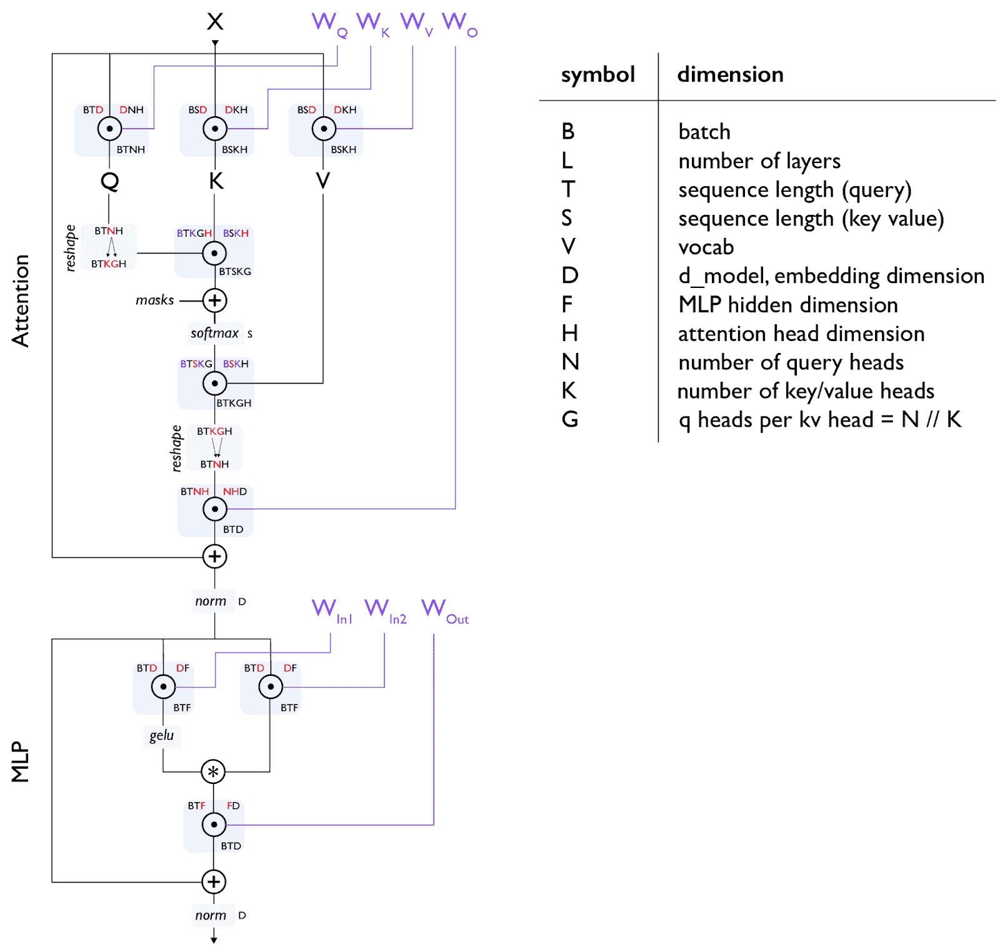

# 如何扩展您的模型

> 原文：[`jax-ml.github.io/scaling-book/index`](https://jax-ml.github.io/scaling-book/index)

TPU 上 LLMs 的系统视角（第零部分：简介 | 第一部分：屋顶线)

训练 LLMs 常常感觉像炼金术，但理解和优化模型性能不必如此。本书旨在揭示扩展语言模型科学的神秘面纱：TPUs（以及 GPU）是如何工作的，它们是如何相互通信的，LLMs 如何在真实硬件上运行，以及如何在训练和推理期间并行化您的模型，以便在大规模上高效运行。如果您曾想过“这个 LLM 的训练成本应该是多少”或“我需要多少内存来自己服务这个模型”或“什么是 AllGather”，我们希望这将对您有所帮助。  ### 内容

高级概要章节链接 <picture></picture>

深度学习的大部分内容仍然归结为一种黑魔法，但优化模型性能不必如此——即使是在巨大规模上！相对简单的原则适用于所有地方——从处理单个加速器到数万个——理解它们让您可以做许多有用的事情：

+   大致估计模型的部分与理论最优值之间的接近程度。

+   在不同规模上做出关于不同并行方案的有信息的选择（如何在多个设备之间分配计算）。

+   估算训练和运行大型 Transformer 模型所需的时间和成本。

+   设计利用[特定](https://arxiv.org/abs/2205.14135) [硬件](https://arxiv.org/abs/1911.02150) [特性](https://arxiv.org/abs/2007.00072)的算法。

+   设计由对当前算法性能限制有明确理解的硬件驱动。

**预期背景：** 我们假设您对 LLMs 和 Transformer 架构有基本的了解，但并不一定了解它们如何在大规模上运行。您应该了解 LLMs 训练的基本知识，并且最好对 JAX 有一些基本的熟悉度。一些有用的背景阅读可能包括关于 Transformer 架构的[这篇博客文章](https://jalammar.github.io/illustrated-transformer/)和[原始的 Transformer 论文](https://arxiv.org/abs/1706.03762)。还可以查看这个列表以获取更多有用的相关和未来阅读材料。

**目标与反馈：** 到最后，您应该能够舒适地估计给定硬件平台上 Transformer 模型的最佳并行方案，以及大致的训练和推理所需时间。如果您觉得还不够，请给我们发邮件或留下评论！我们很乐意知道我们如何使这更清晰。

您可能还会喜欢阅读关于 NVIDIA GPU 的新第十二部分！

### 为什么你应该关心？

三四年前，我认为大多数机器学习研究人员不需要理解这本书中的任何内容。但如今，即使是“小型”模型也运行得如此接近硬件极限，进行新颖的研究需要你思考大规模的效率问题。历史上，机器学习研究在系统创新和软件改进之间遵循某种“周期性”的节奏。亚历克斯·克里泽夫斯基不得不编写不洁的 CUDA 代码来使卷积神经网络（CNN）加速，但几年后，像 Theano 和 TensorFlow 这样的库意味着你不必这样做。也许这里也会发生同样的事情，这本书中的所有内容在几年内都将被抽象化。但是，扩展定律不断推动我们的模型达到硬件的前沿，因此，在可预见的未来，进行前沿研究似乎不可避免地与如何高效地将模型扩展到大型硬件拓扑结构的知识紧密相关。**如果为了获得基准测试的 20%的改进而牺牲了 20%的屋顶线效率，那么这种改进是无关紧要的。**有前途的模型架构通常会失败，要么是因为它们*无法*在大规模上高效运行，要么是因为没有人投入精力使它们这样做。

“**模型扩展**”的目标是在增加用于训练或推理的芯片数量的同时，实现吞吐量的成比例、线性增长。这被称为“**强扩展**”。虽然增加额外的芯片（“并行性”）通常会减少计算时间，但它也带来了芯片间通信的增加成本。当通信时间超过计算时间时，我们就会变成“通信限制”状态，无法进行强扩展。随着计算时间的减少，你通常也会在单个芯片的层面上遇到瓶颈。你那光鲜亮丽的 TPU 或 GPU 可能被评定为每秒执行 500 万亿次操作，但如果你不小心，它也可能只完成十分之一，如果它在内存中移动参数时遇到瓶颈。单个芯片的计算、内存带宽和总内存之间的相互作用对于扩展故事至关重要。如果我们足够了解我们的硬件，能够预测这些瓶颈将在哪里出现，我们就可以设计或重新配置我们的模型来避免它们。硬件设计师面临的是相反的问题：构建提供足够的计算、带宽和内存以适应我们的算法，同时最小化成本的硬件。你可以想象这个“协同设计”问题有多么紧张：你必须对首批芯片实际可用时的算法进行赌注，这通常需要 2 到 3 年的时间。TPU 的故事在这个游戏中是一个响亮的成功。矩阵乘法是一个独特的算法，因为它使用的每字节内存 FLOPs 比几乎所有其他算法都要多（每字节 N FLOPs），而早期的 TPU 及其阵列架构在构建时比当时的 GPU 实现了更好的性能/成本比。TPU 是为 ML 工作负载设计的，而具有 TensorCores 的 GPU 也在迅速改变以填补这一空白。但你可以想象，如果神经网络没有起飞，或者以 TPU（本质上不如 GPU 灵活）无法处理的方式发生了某些根本性的变化，那将花费多少成本。

*本书的目标是解释 TPU（和 GPU）硬件的工作原理以及 Transformer 架构是如何演变以在当前硬件上表现良好的。我们希望这对设计新架构的研究人员以及努力使当前一代 LLM 运行得更快的技术人员都有用。*

## 高级大纲

这本书的整体结构如下：

第一部分解释了屋顶线分析以及哪些因素可以限制我们的扩展能力（通信、计算和内存）。第二部分和第三部分详细介绍了 TPU 的工作原理，包括作为单个芯片以及——至关重要的——作为一个具有有限带宽和延迟的芯片间链路的互联系统。我们将回答以下问题：

+   一个特定大小的矩阵乘法应该需要多长时间？它在计算、内存或通信带宽的哪个点上受到限制？

+   如何将 TPU 连接起来形成训练集群？系统的每一部分有多少带宽？

+   收集、分散或重新分配数组到多个 TPU 需要多长时间？

+   我们如何高效地乘以分布在设备上不同位置的矩阵？

<picture></picture>

**图示：**来自第二部分的图表，展示了 TPU 如何执行逐元素乘法。根据我们数组的尺寸和各个链路的带宽，我们可能会发现自己处于计算受限（使用全部硬件计算能力）或通信受限（由内存加载瓶颈）的状态。

五年前，机器学习领域有着丰富多彩的架构——卷积神经网络（ConvNets）、长短期记忆网络（LSTMs）、多层感知器（MLPs）、Transformer——但现在我们主要只有 Transformer[d-cite key="transformers"]。我们坚信理解 Transformer 架构的每一部分都是值得的：每个矩阵的确切尺寸、归一化发生的位置、每个部分有多少参数和 FLOPs[d-footnote]（基本是所需的总加法和乘法次数）。虽然许多资料将 FLOPs 理解为“每秒操作数”，我们使用 FLOPs/s 来明确表示。。第四部分仔细地解释了这种“Transformer 数学”，展示了如何计算训练和推理时的参数和 FLOPs。这告诉我们模型将使用多少内存，我们将在计算或通信上花费多少时间，以及何时注意力相对于前馈块变得重要。

<picture></picture>

**图示：**一个标准的 Transformer 层，每个矩阵乘法（matmul）都显示为一个圆圈内的点。所有参数（不包括范数）都显示为紫色。第四部分更详细地解释了这个图表。

第五部分：训练和第七部分：推理是本文的核心，我们讨论了基本问题：给定一个大小和芯片数量的模型，我如何并行化我的模型以保持在“强扩展”区域？这是一个简单的问题，但答案却出人意料地复杂。从高层次来看，有 4 种主要的并行技术用于在多个芯片上分割模型（**数据**、**张量**、**流水线**和**专家**），以及一些其他技术来减少内存需求（**重材料化**、**优化器/模型分片（也称为 ZeRO**）、**主机卸载**、**梯度累积**）。我们在这里讨论了许多这些技术。

我们希望到这些章节的结尾，你能够自己选择它们用于新的架构或设置。第六部分和第八部分是实际教程，将这些概念应用于流行的开源模型 LLaMA-3。

最后，第九部分和第十部分探讨了如何在 JAX 中实现这些想法，以及当事情出错时如何进行代码的剖析和调试。第十二部分是一个新的章节，深入探讨了 GPU。

在整个过程中，我们尽量给你提供一些问题让你自己动手解决。请不要感到有压力去阅读所有章节，或者按照顺序阅读。请留下反馈。目前，这是一个草案，并将继续修订。谢谢！

*我们想感谢 James Bradbury 和 Blake Hechtman，他们推导出本文档中的许多想法。*

### 不再拖延，这里是第一部分关于 TPU 屋顶线的内容。

## 部分链接

*这个系列可能比需要的更长，但我们希望这不会让你感到沮丧。前三章是预备知识，如果熟悉可以跳过，尽管它们介绍了后面会用到的符号。最后三章可能是最有实用价值的，因为它们解释了如何与真实模型一起工作。*

**第一部分：预备知识**

+   **第一章：屋顶线分析简介**。算法受限于三个方面：计算、通信和内存。我们可以利用这些来估算我们的算法将运行得多快。

+   **第二章：如何思考 TPU**。TPU 是如何工作的？这对我们可以训练和提供哪些模型有何影响？

+   **第三章：分片矩阵及其乘法**。在这里，我们通过我们最喜欢的操作：（分片）矩阵乘法，解释了模型分片和多 TPU 并行。

**第二部分：Transformer**

+   **第四章：你需要了解的所有 Transformer 数学**。Transformer 在正向和反向传递过程中使用了多少 FLOPs？你能计算参数数量吗？其 KV 缓存的尺寸？我们在这里通过数学推导来解决这个问题。

+   **第五章：如何并行化 Transformer 进行训练**。FSDP。Megatron 分片。管道并行。给定一定数量的芯片，我如何以最高效的方式训练一个给定大小、给定批次的模型？

+   **第六章：在 TPU 上训练 LLaMA 3**。我们如何在 TPU 上训练 LLaMA 3？需要多长时间？需要多少成本？

+   **第七章：关于 Transformer 推理的所有内容**。一旦我们训练了一个模型，我们就必须提供服务。推理增加了一个新的考虑因素——延迟，并改变了内存的格局。我们将讨论如何进行解耦服务以及如何考虑 KV 缓存。

+   **第八章：在 TPU v5e 上提供服务 LLaMA 3**。在 TPU v5e 上提供服务 LLaMA 3 需要多少成本？延迟/吞吐量之间的权衡是什么？

**第三部分：实用教程**

+   **第九章：如何剖析 TPU 代码**。真实的 LLM 永远不像上面的理论那样简单。在这里，我们解释了 JAX + XLA 堆栈以及如何使用 JAX/TensorBoard 剖析器来调试和修复真实问题。

+   **第十章：在 JAX 中编程 TPU**。JAX 提供了一系列用于并行计算的神奇 API，但你需要知道如何使用它们。有趣的示例和已解决的问题。

**第四部分：结论与额外内容**

+   **第十一章：结论与进一步阅读**。关于 TPUs 和 LLMs 的总结性思考及进一步阅读内容。

+   **第十二章：如何思考 GPU**。关于 GPU 的额外章节，包括它们的工作原理、网络方式以及它们的屋顶线与 TPUs 的不同之处。  ### 杂项

^*在 Google DeepMind 完成的工作，现在在 MatX。

### 引用

在学术环境中进行归属引用时，请将此作品引用如下：

```py
 Austin et al., "How to Scale Your Model", Google DeepMind, online, 2025. 
```

或者作为一个 BibTeX 条目：

```py
 @article{scaling-book,
      title = {How to Scale Your Model},
      author = {Austin, Jacob and Douglas, Sholto and Frostig, Roy and Levskaya, Anselm and Chen, Charlie and Vikram, Sharad
      and Lebron, Federico and Choy, Peter and Ramasesh, Vinay and Webson, Albert and Pope, Reiner},
      publisher = {Google DeepMind},
      howpublished = {Online},
      note = {Retrieved from https://jax-ml.github.io/scaling-book/},
      year = {2025}
    } 
``` 
