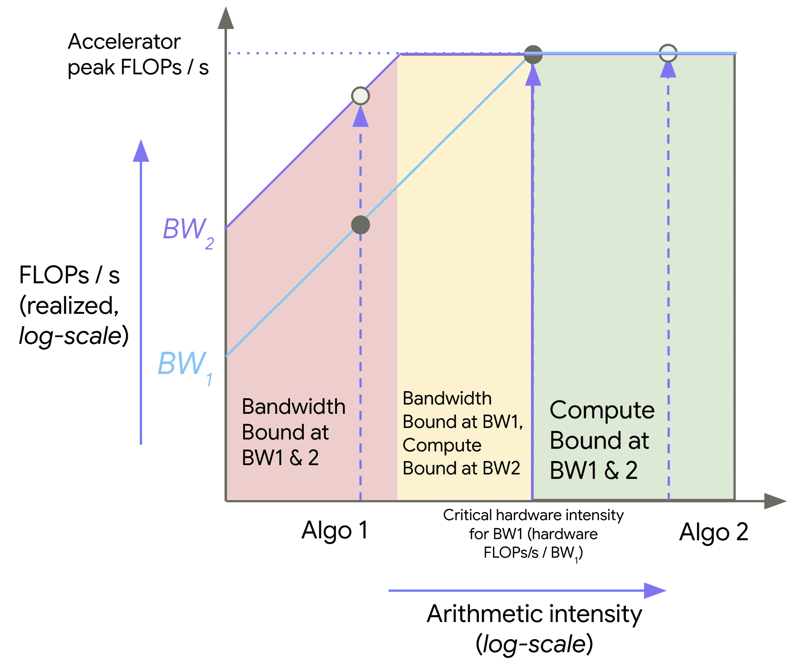
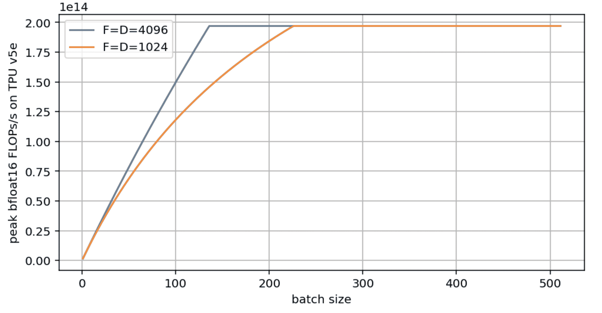

# 所有关于屋顶线的内容

> 原文：[`jax-ml.github.io/scaling-book/roofline`](https://jax-ml.github.io/scaling-book/roofline)

《如何扩展你的模型》的第一部分 How To Scale Your Model (第零部分：介绍 | 第二部分：TPUs)

当我们在硬件上运行算法时，我们受限于三个方面：我们的计算机进行数学运算的速度（每秒 OPs），用于移动数据的可用带宽（每秒字节），以及存储数据的总内存（字节）。这些“屋顶线”约束让我们能够上下界一个给定计算的时间。  ### 内容

时间都去哪儿了？

+   可视化屋顶线

+   矩阵乘法

+   网络通信屋顶线

一些需要解决的问题

## 时间都去哪儿了？

让我们从一个非常简单的问题开始：*为什么算法需要 50ms 而不是 50s 或 5ms*？模型内部实际上发生了什么，需要大量时间，我们应该期望它需要多长时间？

**计算：** 深度学习模型实际上是一系列矩阵乘法，每个乘法由浮点数乘法和加法‘操作’（FLOPs）组成。我们的加速器速度决定了这些计算所需的时间：

\[\begin{equation} T_\text{math} = \frac{\text{计算 FLOPs}}{\text{加速器 FLOPs/s}} \end{equation}\]

例如，NVIDIA H100 可以每秒执行大约 9.89e14 bfloat16 FLOPs，而 TPU v6e 可以执行 9.1e14 FLOPs/s。bf16 是[bfloat16](https://en.wikipedia.org/wiki/Bfloat16_floating-point_format)的缩写，这是一种常用于机器学习的 16 位浮点格式。H100s 和 B200s 通常只能达到声称的峰值 FLOPs 的 80-85%，而 TPUs 在正常使用中可以接近 95%。这意味着在 H100 上执行 1e12 FLOPs 将需要（大约）`1e12 / 9.89e14 = 1.01ms`，而在 TPU v6e 上需要`1e12 / 9.1e14 = 1.1ms`。请注意，这些芯片的价格不同，此比较并未按成本进行归一化。

**芯片内部的通信：** 在一个加速器内部，张量需要在片上内存（HBM）和计算核心之间传输。你将看到这个链路的带宽被称为“HBM 带宽”NVIDIA 也称之为"内存带宽"。在 H100 上，[这个带宽大约是 3.35TB/s](https://www.nvidia.com/en-us/data-center/h100/)，在 TPU v6e 上[这个带宽大约是 1.6TB/s](https://cloud.google.com/tpu/docs/v6e)。

**芯片间的通信：** 当我们将模型*分布到多个加速器上*时，张量经常需要在它们之间传输。在我们的硬件上通常有几个选项（ICI、DCN 和 PCIe），每个选项都有不同的带宽。

不论通信是在芯片内部还是芯片之间，我们用字节/s 来衡量，并用以下公式估计总的通信时间：

\[\begin{equation} T_\text{comms} = \frac{\text{Communication Bytes}}{\text{Network/Memory Bandwidth Bytes/s}} \end{equation}\]

通常（但不总是），单个芯片内的计算可以与芯片内和芯片间的通信重叠。这意味着**我们可以通过使用计算和通信时间的最大值来降低训练和推理时间的下限**。我们也可以**通过它们的和来设定上限**。在实践中，我们针对最大值进行优化，因为代数更简单，我们通常可以通过重叠我们的通信和计算来接近这个界限。如果我们考虑到最大值进行优化，那么下限和上限的差异最多是 2 倍，因为$T_\text{math} + T_\text{comms} \leq 2 * \max(T_\text{math}, T_\text{comms})$。然后我们通过建模“重叠区域”和开销来提高准确性，这些可以由对特定模型和目标系统的分析来指导。

\[\begin{equation} T_\text{lower}=\max(T_\text{math}, T_\text{comms}) \end{equation}\] \[\begin{equation} T_\text{upper} = T_\text{math} + T_\text{comms} \end{equation}\]

如果我们假设可以完美地重叠通信和计算，当$T_\text{math} > T_\text{comms}$时，我们可以从硬件中获得完全的利用率。我们称这为“计算限制”。当$T_\text{comms} > T_\text{math}$时，我们往往处于“通信限制”，并且至少有一部分加速器 FLOPs/s 被浪费在等待数据传输上。判断一个操作是计算限制还是通信限制的一种方法是通过查看其“*算术强度*”或“*操作强度*”。

**定义**：算法的算术强度由其执行的总 FLOPs 与需要通信的字节数之比给出——无论是芯片内部还是芯片之间。

\[\begin{equation} \text{Arithmetic Intensity} = \frac{\text{Computation FLOPs}}{\text{Communication Bytes}} \end{equation}\]

算术强度衡量的是给定操作的“每字节 FLOPs”。在第一阶近似中，当我们的算术强度高时，与$T_\text{comms}$相比，$T_\text{math}$较大，我们通常使用大部分可用的 FLOPs。当情况相反时，我们在通信上花费更多时间，浪费 FLOPs。这种交叉点发生的地方是硬件的“峰值算术强度”，即峰值加速器 FLOPs/s 与加速器带宽的比率。

\[\begin{align*} T_\text{math} > T_\text{comms} \Leftrightarrow \frac{\text{Computation FLOPs}} {\text{Accelerator FLOPs/s}} > \frac{\text{Communication Bytes}}{\text{Bandwidth Bytes/s}} & \\[0.5em] \Leftrightarrow \frac{\text{Computation FLOPs}}{\text{Communication Bytes}} > \frac{\text{Accelerator FLOPs/s}}{\text{Bandwidth Bytes/s}} & \\[0.5em] \Leftrightarrow \text{Intensity}(\text{Computation}) > \text{Intensity}(\text{Accelerator}) & \\ \end{align*}\]

量$\text{Intensity}(\text{Accelerator})$是我们加速器达到其峰值 FLOPs/s 的算术强度。**对于 TPU v5e MXU，这大约是 240 FLOPs/byte**，因为 TPU 可以每秒执行`1.97e14` FLOPs，并从 HBM 以每秒`8.2e11` bytes 的速度加载。MXU 是 TPU 上的矩阵乘法单元。我们在这里指定这一点，因为 TPU 还有其他加速器，如 VPU，它们负责具有不同峰值 FLOPs/s 的逐元素操作。这意味着如果一个算法的算术强度低于 240 FLOPs/byte，它将受到字节加载的限制，因此我们无法充分利用我们的硬件。这仅适用于算法从 HBM 加载权重并在 MXU 上运行的情况。正如我们将在下一节讨论的，我们有时可以将参数存储在具有更高带宽的 VMEM 中。许多算法也在 VPU 上运行，它具有不同的性能特征。让我们看看这样一个例子：

**示例（点积）**：为了以 bfloat16 精度计算两个向量的点积，`x • y: bf16[N], bf16[N] → bf16[1]`，我们需要从内存中加载$x$和$y$，每个都有$2 * N = 2N$字节，执行$N$次乘法和$N-1$次加法，并将$2$字节写回 HBM \(\begin{equation} \text{Intensity}(\text{dot product}) = \frac{\text{Total FLOPs}}{\text{Total Bytes}} = \frac{N + N - 1}{2N + 2N + 2} = \frac{2N - 1}{4N + 2} \rightarrow \frac{1}{2} \end{equation}\)

当$N\rightarrow\infty$时。因此，点积的算术强度为$\frac{1}{2}$，或者换句话说，点积每加载一个字节执行 0.5 次浮点运算。这意味着我们的算术强度低于硬件的算术强度，我们将受到通信限制。上面的 240 数字在这里不是正确的比较，因为正如你将在下一节看到的，点积是在 VPU 上而不是在 MXU 上执行的。TPU v5p VPU 每秒可以执行大约 7e12 FLOPs，因此其关键强度约为 3，这意味着我们在这里仍然有一定的通信限制。无论如何，我们的强度低且恒定的事实意味着在大多数硬件上很难成为计算限制。

### 可视化屋顶线

我们可以使用**屋顶线图**来可视化内存和计算之间的权衡，该图显示了算法在硬件上（y 轴）能达到的最大 FLOPs/s（吞吐量）与该算法的算术强度（x 轴）之间的关系。以下是一个示例对数-对数图：

<picture></picture>

**图示：**一个示例屋顶线图，显示了具有不同算术强度（Algo 1 和 Algo 2）的两种算法及其在不同带宽（BW1 和 BW2）下的对应理论峰值吞吐量。在红色区域，算法在两种带宽下都受带宽限制，并且浪费了硬件峰值 FLOPs/s 的一部分。黄色区域仅在较低带宽（BW1）下受带宽限制。绿色区域在所有带宽下都受计算限制。在这里，我们使用加速器的峰值 FLOPs/s，增加带宽或提高强度不会带来任何好处。

在上方，随着强度的增加（从左到右），我们的算法性能（以 FLOPs/s 计）最初呈线性增长，直到我们达到硬件的关键算术强度，TPU v5e 的情况为 240。任何强度较低的算法都将受带宽（BW）限制，并受限于峰值内存带宽（以红色显示）。任何位于右侧的算法将充分利用我们的 FLOPs（以绿色显示）。在这里，Algo 1 受通信限制，只使用了总硬件 FLOPs/s 的一部分。Algo 2 受计算限制。我们可以通过增加算法的算术强度或增加可用的内存带宽（从 BW1 移动到 BW2）来一般地提高算法的性能。

### 矩阵乘法

让我们看看我们即将喜欢的算法：矩阵乘法（也称为 matmul）。我们写成$X * Y \rightarrow Z$，其中$X$的形状为$\text{bf16}[B, D]$，$Y$的形状为$\text{bf16}[D, F]$，$Z$的形状为$\text{bf16}[B, F]$。要进行 matmul，我们需要加载$2DF + 2BD$字节，执行$2BDF$次浮点运算（FLOPs），并将$2BF$字节写回。技术上我们执行$BF \times (2D - 1)$次 FLOPs，但这已经足够接近了。这来自于$BDF$次乘法和$BF * (D-1)$次加法。第四部分有更多细节。 尽管矩阵乘法的输出在技术上为 float32，我们通常在将其复制回 HBM 之前将其转换为 bfloat16。 因此：

\[\begin{equation} \text{Intensity}(\text{matmul}) = \frac{2BDF}{2BD + 2DF + 2BF} = \frac{BDF}{BD + DF + BF} \end{equation}\]

如果我们假设我们的“批量大小”$B$相对于$D$和$F$较小，那么我们可以得到一个很好的简化。然后我们得到

\[\begin{equation} \frac{BDF}{BD + DF + BF} \approxeq \frac{BDF}{DF} = B \end{equation}\] \[\begin{equation} \text{Intensity}(\text{matmul}) > \text{Intensity}(\text{TPU}) \implies B > \frac{1.97e14}{8.20e11} = 240 \end{equation}\]

对于 Transformer 矩阵乘法来说，这是一个合理的假设，因为我们通常有一个局部（每个副本）的批量大小 $B < 1024$ 个标记（*不是序列*），但 $D$ 和 $F$ 大于 8000。因此，当我们的每个副本的批量大小超过 240 个标记时，我们通常会成为计算瓶颈！我们说每个副本，因为如果我们进行某种模型分片以增加用于矩阵乘法的芯片数量，我们将以相同的数量扩展我们的可用计算和内存带宽。因此，关键的批量大小是针对模型权重的独立副本而言的。

**要点总结：**对于一个 bfloat16 矩阵乘法要在大多数 TPU 上成为计算瓶颈，我们需要我们的每个副本标记批量大小超过 240。请注意，这*不是*通常意义上的批量大小，其中它意味着序列中的批量大小。事实证明，大多数屋顶线纯粹取决于标记的数量，无论它们是否属于同一序列或不同序列。例如，如果你有 512 个序列，每个序列有 4096 个标记，分布在 128 个 GPU 上，你将有总批量大小 `512 * 4096 = 2M` 个标记，局部批量大小为 16k 个标记。

这在下文中的一些注意事项中会有所体现，特别是关于量化（例如，如果我们量化我们的激活但仍然进行全精度 FLOPs），但这是一个值得记住的好规则。对于 GPU 来说，这个数字略高（接近 300），但通常得出相同的结论。当我们[将大矩阵乘法分解成较小的矩阵乘法](https://docs.jax.dev/en/latest/pallas/tpu/matmul.html#your-first-matrix-multiplication-kernel)时，瓦片大小也很重要。当我们进行大矩阵乘法时，我们需要将其分解成适合 VMEM/SMEM/TMEM（片上高带宽内存）的小瓦片。这导致我们多次加载块，因此我们不再只加载 $O(N²)$ 字节。考虑一个 $(m, k) \cdot (k, n)$ 矩阵乘法，瓦片大小为 $bm$，$bk$，$bm$。设 $tm = m / bm$，等等。总的 FLOPs 是 $2 \cdot tm \cdot tn \cdot tk \cdot bm \cdot bn \cdot bk$，总的字节数是 $2 \cdot tm \cdot tn \cdot (tk \cdot (bm \cdot bk + bk \cdot bn) + 2 \cdot bm \cdot bn)$。忽略最后一个项，我们有强度 $bm \cdot bn / (bm + bn)$，这与上面类似。我们将在下一节中讨论更底层的 GPU 和 TPU 细节。下一节。

### 网络通信屋顶线

我们之前讨论的所有屋顶线都是内存带宽屋顶线，*都在单个芯片内*。这不应被视为规则。事实上，本书中我们将关注的许多屋顶线都涉及芯片之间的通信：通常是涉及跨多个 TPU 分片矩阵的矩阵乘法。

为了举一个稍微有些牵强的例子，假设我们想乘以两个大矩阵\(X\sim \text{bfloat16[B, D]}\)和\(Y \sim \text{bfloat16[D, F]}\)，它们在 2 个 TPU/GPU 上均匀分割（沿 D 维度）。为了进行这个乘法（正如我们将在第三部分中看到的那样），我们可以在每个 TPU 上乘以每个矩阵的一半（`A = X[:, :D // 2] @ Y[:D // 2, :]`在 TPU 0 上，`B = X[:, D // 2:] @ Y[D // 2:, :]`在 TPU 1 上）然后将结果“部分和”复制到另一个 TPU 并相加。假设我们可以在每个方向上复制`4.5e10`字节，并在每个芯片上以`1.97e14` FLOPs/s 的速度执行操作。\(T_\text{math}\)和\(T_\text{comms}\)是多少？

\(T_\text{math}\)显然是之前的一半，因为每个 TPU 只做一半的工作，即我们忽略了将两个部分和相加所需的 FLOPs（另一个 BF 加法），但这基本上可以忽略不计。

\[T_\text{math} = \frac{2BDF}{2 \cdot \text{加速器 FLOPs/s}} = \frac{BDF}{1.97e14}\]

那么，\(T_\text{comms}\)又是怎么回事呢？现在它指的是芯片之间的通信时间！这仅仅是发送的总字节数除以网络带宽，即

\[T_\text{comms} = \frac{2BF}{\text{网络带宽}} = \frac{2BF}{4.5e10}\]

因此，当\(\text{Intensity}(\text{matmul (2-chips)}) > \text{Intensity}(\text{TPU w.r.t. inter-chip network})\)或等价地，当\(\frac{BDF}{2BF} = \frac{D}{2} > \frac{1.97e14}{4.5e10} = 4377\)或\(D > 8755\)时，我们变得计算受限（现在与芯片间网络相关）。注意，与之前不同，关键阈值现在取决于\(D\)而不是\(B\)！试着想想为什么是这样。这只是这样一个例子，但我们强调这种 roofline 对于知道何时可以在多个 TPU 上并行化操作至关重要。

## 一些需要解决的问题

**问题 1 [int8 矩阵乘法]**：假设我们想在 int8 精度（每个参数 1 字节）下执行矩阵乘法\(X[B, D] \cdot_D Y[D, F] \rightarrow Z[B, F]\)，而不是 bfloat16。在此以及整个过程中，我们将使用\(A \cdot_D B\)的记法来表示乘法在 D 维度上执行收缩。这是对 einsum 记法的滥用。

1.  需要从内存中加载多少字节？需要写回多少字节到内存？

1.  执行了多少总 OP 操作？

1.  什么是算术强度？

1.  对于\(T_\text{math}\)和\(T_\text{comms}\)的 roofline 估计是什么？整个操作的运行时间有什么合理的上下限？

假设我们的 HBM 带宽为`8.1e11`字节/秒，我们的 int8 峰值 OPs/s 为`3.94e14`（大约是 bfloat16 的两倍）。

点击此处查看答案。

1.  因为我们将参数存储在 int8 格式中，每个参数占用 1 个字节，所以从 HBM 加载了\(BD + DF\)个字节，并写回了\(BF\)个字节。

1.  这与 bfloat16 相同，但在理论上 int8 OPs/s 应该更快。所以这仍然是\(2BDF\) FLOPs。

1.  算术强度是 \(2BDF / (BD + DF + BF)\)。如果我们对\(B \ll D\)和\(B \ll F\)做出相同的假设，我们得到算术强度为\(2B\)，这意味着我们的规则变为$B > \text{HBM int8 arithmetic intensity} / 2$。使用给定的数字，这个 int8 强度是`3.94e14 / 8.1e11 = 486`，所以规则是$B > 486 / 2 = 243$。请注意，这基本上没有变化！

1.  \(T_\text{math} = 2BDF / 3.94e14\) 和 \(T_\text{comms} = (BD + DF + BF) / 8.1e11\)，因此一个合理的下限是 \(\max(T_\text{math}, T_\text{comms})\)，一个上限是 \(T_\text{math} + T_\text{comms}\)。

**问题 2 [int8 + bf16 矩阵乘法]**：在实际操作中，我们经常对权重和激活进行不同的量化，因此我们可能会以非常低的精度存储权重，但保持激活（和计算）以更高的精度。假设我们想以 int8 量化权重，但保持激活（和计算）以 bfloat16 精度。在什么批量大小下我们成为计算限制？假设 bfloat16 FLOPs/s 为`1.97e14`。

*提示：这特别意味着 `bfloat16[B, D] * int8[D, F] -> bfloat16[B, F]` 其中 $B$ 是“批量大小”.*

点击此处查看答案。

再次假设 B 很小，我们有 2BDF bfloat16 FLOPs，但只有 DF 权重（而不是 bfloat16 中的 2DF）。这意味着当\(2B > 240\)或\(B > 120\)时，我们成为计算限制。这要低得多，这意味着如果我们能够进行 int8 权重量化（这相对容易做到），但仍然进行 bfloat16 FLOPs，我们将在效率上获得有意义的提升（尽管 int8 操作会更好）。

**问题 3**：从问题 2 的设置出发，为\(F = D = 4096\)和\(F = D = 1024\)绘制峰值 FLOPs/s 与$B$的关系图。*使用确切的字节数加载，而不是近似值。*

点击此处查看答案。

这里是相关的问题图：

<picture></picture>

注意，这两个模型最终都达到了峰值硬件 FLOPs/s，但更大的 D/F 模型更早实现。D=F=1024 几乎将关键批量大小翻倍。生成此图的代码在此：

```py
import matplotlib.pyplot as plt
import numpy as np

bs = np.arange(1, 512)

def roofline(B, D, F):
  total_flops = 2*B*D*F
  flops_time = total_flops / 1.97e14
  comms_time = (2*B*D + D*F + 2*B*F) / 8.2e11
  total_time = np.maximum(flops_time, comms_time)
  return total_flops / total_time

roofline_big = roofline(bs, 4096, 4096)
roofline_small = roofline(bs, 1024, 1024)

plt.figure(figsize=(8, 4))
plt.plot(bs, roofline_big, label='F=D=4096')
plt.plot(bs, roofline_small, label='F=D=1024')
plt.legend()
plt.xlabel('batch size')
plt.ylabel('peak bfloat16 FLOPs/s on TPU v5e')
plt.grid() 
```

**问题 4**：如果我们想执行$\text{int8[B, D]} *_D \text{int8[B, D, F]} \rightarrow \text{int8[B, F]}$，其中我们想象为每个批量元素有一个不同的矩阵。这个操作的算术强度是多少？

点击此处查看答案。

让我们先看看总的 FLOPs 和通信量。

1.  总 FLOPs：FLOPs 基本上是相同的，因为我们执行相同数量的\(BD \times DF\)矩阵乘法（这将在第四部分中进一步讨论）。所以这仅仅是\(2BDF\)。

1.  总通信量：这里有很多通信：\(BD + BDF + BF\)。

1.  因此，我们的算术强度现在是实际上 \(2BDF / (BD + BDF + BF)\)。由于 \(BDF\) 在分母中占主导地位，这大约是 \(2\)。所以它不再依赖于批量大小，这实际上是常数。这是不好的，因为它意味着我们基本上总是通信限制，无论什么情况。

**问题 5 [GPU 的内存屋顶线]:** 使用 NVIDIA 为 H100 提供的 [规格表](https://www.nvidia.com/en-us/data-center/h100/)，计算矩阵乘法成为计算限制时的批量大小。*注意，由于只有通过结构化稀疏性才能实现，Tensor Core FLOPs 数值是真实值的两倍。*

点击此处查看答案。

从规格表中，我们看到报告的 bfloat16 FLOPs 值为 `1.979e15` FLOPs/s，旁边有一个星号注明“具有稀疏性”。真实值在没有稀疏性的情况下是这一数值的一半，即接近 `1e15` FLOPs/s。内存带宽为 3.35TB/s，或 `3.35e12` 字节/秒。因此 $B_\text{crit}$ 是 `1e15 / 3.35e12 = 298`，与 TPU 非常相似。

### 第一部分到此结束！对于第二部分，我们将探讨真实 TPUs 如何处理 FLOPs 和通信，点击此处。  ### 杂项

^*在 Google DeepMind 完成的工作，现在在 MatX。

### 引用

在学术环境中进行归属时，请引用此工作如下：

```py
 Austin et al., "How to Scale Your Model", Google DeepMind, online, 2025. 
```

或者作为一个 BibTeX 条目：

```py
 @article{scaling-book,
      title = {How to Scale Your Model},
      author = {Austin, Jacob and Douglas, Sholto and Frostig, Roy and Levskaya, Anselm and Chen, Charlie and Vikram, Sharad
      and Lebron, Federico and Choy, Peter and Ramasesh, Vinay and Webson, Albert and Pope, Reiner},
      publisher = {Google DeepMind},
      howpublished = {Online},
      note = {Retrieved from https://jax-ml.github.io/scaling-book/},
      year = {2025}
    } 
``` 
