# 如何思考 TPU

> 原文：[`jax-ml.github.io/scaling-book/tpus`](https://jax-ml.github.io/scaling-book/tpus)

《如何扩展您的模型》第二部分（第一部分：屋顶线 | 第三部分：分片](../sharding))

这一部分全部关于 TPU 的工作原理，它们如何相互连接以实现多芯片训练和推理，以及这对我们最喜欢的算法性能的影响。甚至对 GPU 用户也有一些很好的内容！  ### 内容

什么是 TPU？TPU 网络关键要点

+   TPU 规格

练习题附录

+   附录 A：更多关于 TPU 内部的信息

+   附录 B：脉冲阵列是如何工作的？

您也许还会喜欢阅读关于 NVIDIA GPU 的新第十二部分！

## 什么是 TPU？

**TPU 基本上是一个专注于矩阵乘法（称为 TensorCore）的计算核心，连接到一叠快速内存（称为高带宽内存或 HBM）。** 下面是一个图示：

<picture>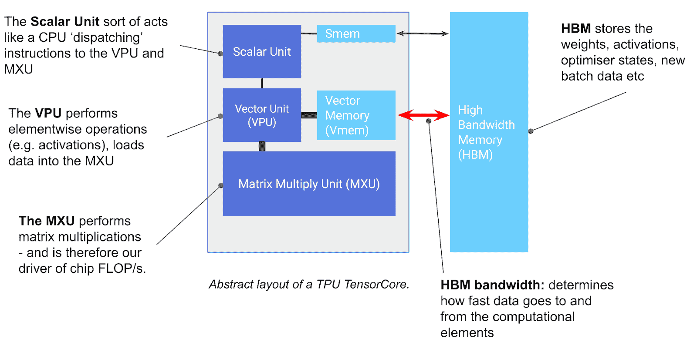</picture>

**图示：** TPU 芯片的基本组件。TensorCore 是左侧的灰色方块，包含矩阵乘法单元（MXU）、向量单元（VPU）和向量内存（VMEM）。

您可以将 TensorCore 视为一个非常好的矩阵乘法机器，但它还有一些值得注意的其他功能。TensorCore 有三个关键单元：

+   **MXU**（矩阵乘法单元）是 TensorCore 的核心。对于大多数 TPU 代系，它每 8 个周期使用脉冲阵列执行一次`bfloat16[8,128] @ bf16[128,128] -> f32[8,128]`矩阵乘法[d-footnote]TPU v6e（Trillium）有一个 256x256 的 MXU，而所有之前的代系都使用 128x128。附录 B 提供了详细信息。

    +   这是在 TPU v5e 上，每个 MXU 在 1.5GHz 时大约有`5e13` bf16 FLOPs/s。大多数 TensorCore 有 2 个或 4 个 MXU，所以例如，TPU v5e 的总 bf16 FLOPs/s 是`2e14`。

    +   TPU 还支持具有更高吞吐量的低精度矩阵乘法（例如，每个 TPU v5e 芯片可以执行`4e14` int8 OPs/s）。

+   **VPU**（向量处理单元）执行一般的数学运算，如 ReLU 激活或向量之间的逐点加法或乘法。这里也执行归约（求和）。附录 A 提供了更多细节。

+   **VMEM**（向量内存）是位于 TensorCore 内部的片上缓存，靠近计算单元。它比 HBM（例如，TPU v5e 上的 128 MiB）小得多，但与 MXU 的带宽要高得多。VMEM 在 CPU 上类似于 L1/L2 缓存，但更大，且由程序员控制。在 TensorCore 对 HBM 中的数据进行任何计算之前，需要将数据复制到 VMEM 中。

**TPU 在矩阵乘法方面非常非常快**。这主要是它们所做的事情，而且做得很好。[TPU v5p](https://cloud.google.com/tpu/docs/v5p#system_architecture)，迄今为止最强大的 TPU 之一，可以做到`2.5e14` bf16 FLOPs/秒/核心或`5e14` bf16 FLOPs/秒/芯片。一个包含 8960 个芯片的单个 pod 可以做到 4 exaflops/秒。这**非常多**。这是世界上最强大的超级计算机之一。而且谷歌拥有很多这样的超级计算机。TPU 及其特定的收缩阵列之所以如此强大的硬件加速器，是因为矩阵乘法是少数几个使用$O(n³)$计算用于$O(n²)$字节的算法之一。这使得普通的 ALU 很容易因为计算而成为瓶颈，而不是因为内存带宽。

上面的图还包含了一些其他组件，如 SMEM 和标量单元，它们用于控制流处理，并在附录 A 中简要讨论，但不是理解的关键。另一方面，HBM 很重要且相对简单：

+   **HBM**（高带宽内存）是一大块快速内存，用于存储 TensorCore 使用的张量。HBM 通常具有数十 GB 的容量（例如，[TPU v5e 具有 16GiB 的 HBM](https://cloud.google.com/tpu/docs/v5e#system_architecture)）。

    +   当需要用于计算时，张量会通过 VMEM（见下文）从 HBM 流出到 MXU，并将结果从 VMEM 写回到 HBM。

    +   HBM 和 TensorCore（通过 VMEM）之间的带宽称为“HBM 带宽”（通常约为 1-2TB/秒），限制了内存密集型工作负载中计算的执行速度。

**一般来说，所有 TPU 操作都是流水线和重叠的**。为了执行矩阵乘法 $X \cdot A \to Y$，TPU 首先需要将矩阵$A$和$X$的块从 HBM 复制到 VMEM，然后将其加载到 MXU 中，MXU 乘以 8x128（对于$X$）和 128x128（对于$A$）的块，然后将结果分块复制回 HBM。为了高效地执行此操作，矩阵乘法是流水线的，因此 VMEM 的复制与 MXU 的工作重叠。这允许 MXU 继续工作，而不是等待内存传输，使矩阵乘法计算密集型，而不是内存密集型。

这里有一个从 HBM 执行逐元素乘积的例子：

<picture>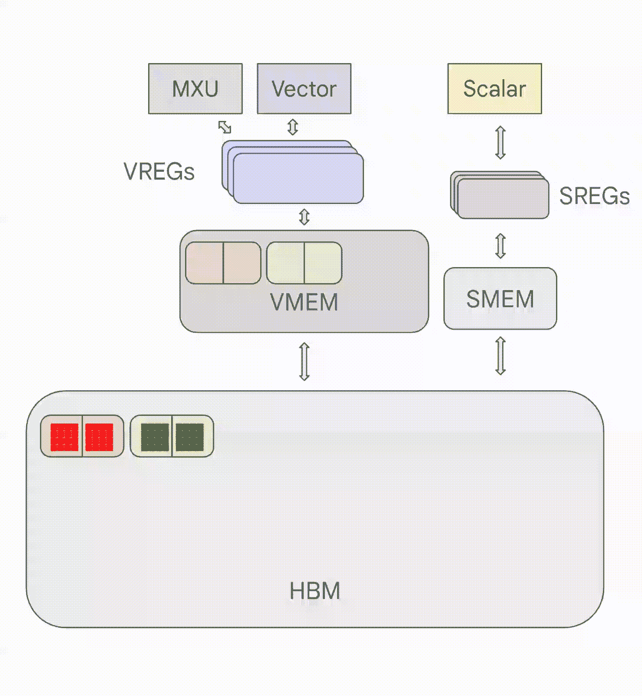</picture>

**图示**：一个在 TPU 上执行逐点乘积的动画，字节从 HBM 加载。注意字节是如何分块从内存中流出，以及部分结果是如何流水线返回，而不需要等待整个数组实现。

矩阵乘法看起来几乎相同，但它会加载到 MXU 而不是 VPU/向量单元，加载和存储的顺序也会不同，因为相同的权重块被用于多个激活块。你可以看到数据块流进 VMEM，然后进入 VREGs（向量寄存器），然后进入向量单元，然后返回 VMEM 和 HBM。正如我们即将看到的，如果从 HBM 到 VMEM 的加载速度慢于向量单元（或 MXU）中的 FLOPs，我们就成为“带宽限制”的，因为我们正在使 VPU 或 MXU 的工作量不足。

**关键要点：** TPUs 非常简单。它们将权重从 HBM 加载到 VMEM，然后从 VMEM 加载到可以每秒执行约 200 万亿乘加操作的 systolic array。HBM $\leftrightarrow$ VMEM 和 VMEM $\leftrightarrow$ systolic array 的带宽设定了 TPU 可以高效执行的计算的基本限制。

**VMEM 和算术强度：** VMEM 的容量远小于 HBM，但它对 MXU 的带宽却要高得多。正如我们在第一部分中看到的，这意味着如果一个算法能够将其所有输入/输出都放入 VMEM 中，那么它遇到通信瓶颈的可能性就小得多。这对于算术强度较差的计算尤其有帮助：VMEM 的带宽大约是 HBM 带宽的 22 倍，这意味着 MXU 从 VMEM 读取或写入操作所需的算术强度仅为 10-20，才能达到峰值 FLOPs 利用率。这意味着如果我们能够将我们的权重放入 VMEM 而不是 HBM，我们的矩阵乘法可以在更小的批量大小下达到 FLOPs 限制。这也意味着那些本质上算术强度较低的算法仍然可以高效运行。VMEM 如此之小，这通常是一个挑战。我们有时会提到 VMEM 预取，这指的是提前在 VMEM 中加载权重，这样我们就可以掩盖加载成本对我们矩阵乘法的影响。例如，在一个普通的 Transformer 中，我们可以在注意力过程中将大的前馈权重加载到 VMEM 中，这样如果我们在内存带宽受限的情况下，可以隐藏权重加载的成本。这要求我们的权重足够小或者足够碎片化，以便将单层放入 VMEM 中，并且还有空间剩余。

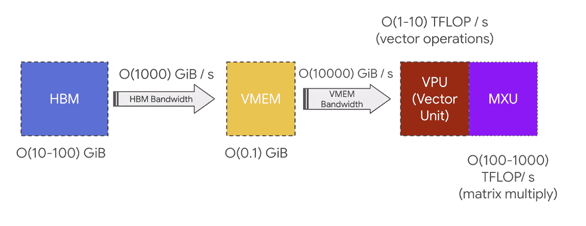

**TPU 芯片通常（但不总是）由两个共享内存的 TPU 核心组成，可以将其视为一个大型加速器**，FLOPs 是两倍（称为“巨核”配置）。自 TPU v4 以来一直如此。较老的 TPU 芯片有独立的内存，被视为两个独立的加速器（TPU v3 及更早版本）。推理优化的芯片，如 TPU v5e，每个芯片只有一个 TPU 核心。

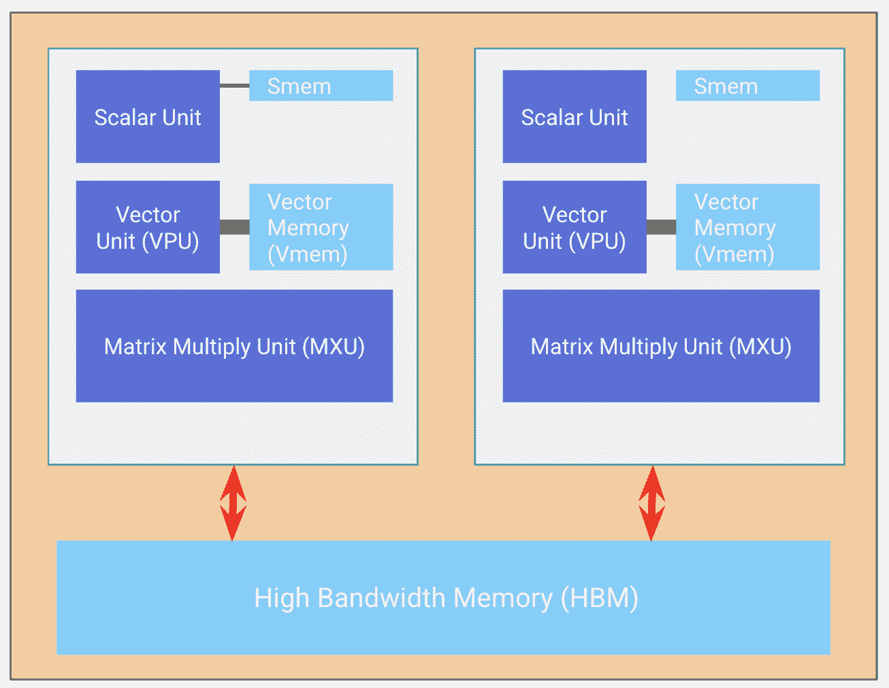

**Chips** are arranged in **sets of 4 on a ‘tray’** connected to a **CPU host via PCIe network.** This is the format most readers will be familiar with, 4 chips (8 cores, though usually treated as 4 logical megacores) exposed through Colab or a single TPU-VM. For inference chips like the TPU v5e, we have 2 trays per host, instead of 1, but also only 1 core per chip, giving us 8 chips = 8 cores.在云 TPU 虚拟机上，每个托盘都作为单独的虚拟机的一部分暴露出来，因此再次有 4 个核心可见。

<picture>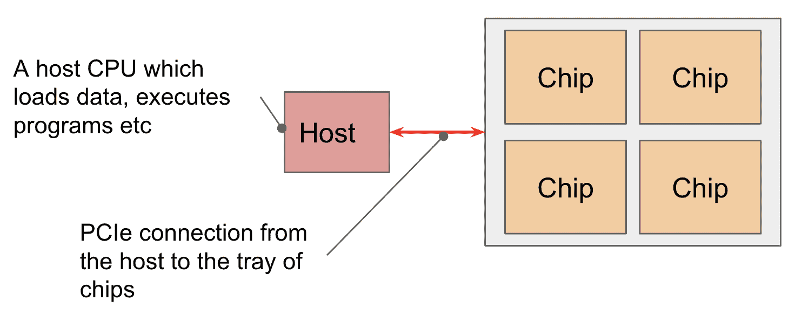</picture>

**PCIe bandwidth is limited:** Like the HBM $\leftrightarrow$ VMEM link, the CPU $\leftrightarrow$ HBM PCIe connection has a specific bandwidth that limits how quickly you can load from host memory to HBM or vice-versa. PCIe bandwidth for TPU v4 is 16GB / second each way, for example, so close to 100x slower than HBM. We *can* load/offload data into the host (CPU) RAM, but not very quickly.

## TPU Networking

**Chips are connected to each other through the ICI network in a Pod**. In older generations (TPU v2 and TPU v3), inference chips (e.g., TPU v5e), and Trilium (TPU v6e), ICI (“inter-chip interconnects”) connects the 4 nearest neighbors (with edge links to form a 2D torus). TPU v4 and TPU v5p are connected to the nearest 6 neighbors (forming a 3D torus). Note these connections do **not** go through their hosts, they are direct links between chips.

<picture>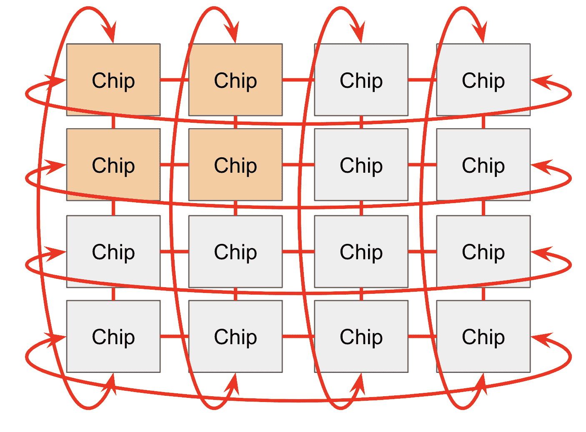</picture>

The toroidal structure reduces the maximum distance between any two nodes from $N$ to $N / 2$, making communication much faster. TPUs also have a “twisted torus” configuration that wraps the torus in a Mobius-strip like topology to further reduce the average distance between nodes.

**TPU pods (connected by ICI) can get really big:** the maximum pod size (called a **superpod**) is `16x16x16` for TPU v4 and `16x20x28` for TPU v5p. These large pods are composed of reconfigurable cubes of `4x4x4` chips connected by [optical wraparound links](https://arxiv.org/pdf/2208.10041)光交换机只是一个具有相同 ICI 带宽的可重构连接。它只是让我们在保持环绕链路的同时连接立方体。 that we can reconfigure to connect very large topologies.

<picture>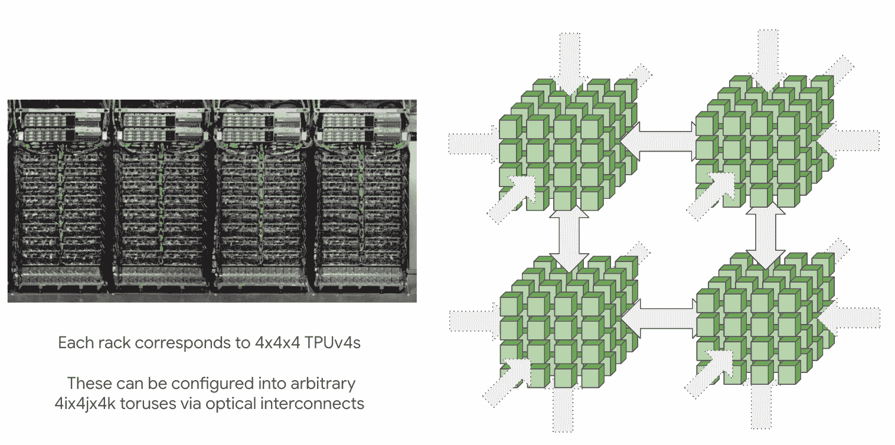</picture>

Smaller topologies (e.g. `2x2x1`, `2x2x2`) can also be requested, albeit with no wraparounds. This is an important caveat, since it typically doubles the time of most communication. Any multiple of a full cube (e.g. `4x4x4` or `4x4x8`) will have wraparounds provided by the optical switches.请注意，`2x2x4` 不会有任何环绕，因为它们由仅在完整立方体上可用的光交换机提供。然而，TPU v5e 8x16 由于不使用可重构光网络，因此在较长的轴上仍然会有环绕。

<picture>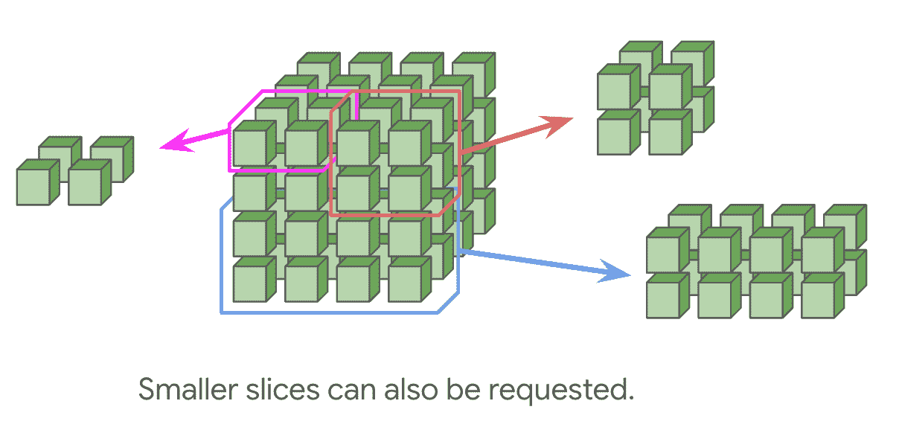</picture>

TPU v5e 和 Trillium pod 由一个`16x16`的二维环面组成，沿任何 16 个尺寸的轴有环绕（这意味着`8x16`在长轴上有环绕）。TPU v5e 和 v6e（Trillium）不能扩展到 16x16 的环面，但 pod 仍然可以通过标准数据中心网络（DCN）相互通信，该网络连接 TPU 主机。再次强调，可以请求较小的拓扑结构，无需在维度$<16$上环绕。

<picture>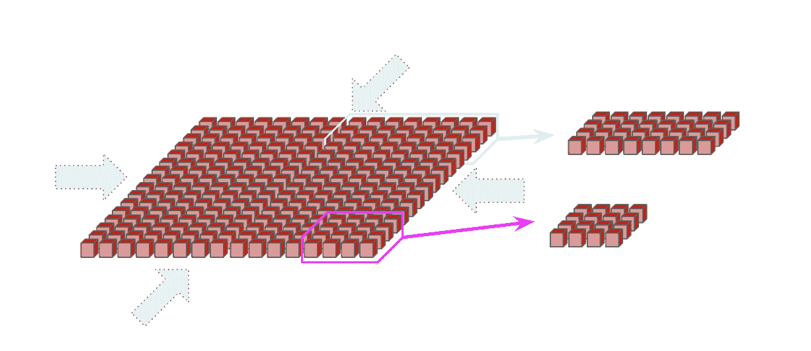</picture>

**这种近邻连接是 TPU 和 GPU 之间的一个关键区别**。GPU 通过一系列交换机连接，这些交换机近似于每个 GPU 之间的点对点连接，而不是像 TPU 那样使用本地连接。通常，节点内的 GPU（H100 有 8 个 GPU 或 B200 NVL72 多达 72 个 GPU）是直接连接的，而较大的拓扑结构需要每个 GPU 之间有 O(log(N))跳。一方面，这意味着 GPU 可以在少量跳数内发送任意数据。另一方面，TPU 的成本大大降低（因为 NVLink 交换机很贵），连接起来更简单，并且可以扩展到更大的拓扑结构，因为每个设备的链接数和带宽是恒定的。更多信息这里。

**相对于 DCN，ICI 非常快，但仍然比 HBM 带宽慢**。例如，一个[TPU v5p](https://cloud.google.com/tpu/docs/v5p#system_architecture)具有：

+   每个芯片的 HBM 带宽为`2.5e12`字节/秒（2.5 TB/秒）。

+   每个轴的 ICI 带宽为`9e10`字节/秒（90 GB/秒），每个芯片有 3 个轴。上面的页面列出了 100 GB/秒的带宽，这与这里列出的略有不同。TPU ICI 链接的带宽根据执行的操作而略有不同。您通常可以放心使用本文档中的数字。

+   每个 TPU 的 DCN（出口）带宽为`6.25e9`字节/秒（6.25 GB/秒）（通过每个主机上的 1-2 个 NIC）。TPU v6e 有`12.5e9`字节/秒，v5e 有`3.125e9`字节/秒。

这意味着当我们跨多个芯片分割模型时，我们需要小心避免使用较慢的跨设备通信来瓶颈 MXU。

**多切片训练**：一组 ICI 连接的 TPU 称为**切片**。不同的切片可以通过 DCN 相互连接，例如连接不同 pod 上的切片。由于 DCN 比 ICI 慢得多，因此应尽量减少我们的计算需要等待从 DCN 获取数据的时间。DCN 是主机到主机的，因此要将缓冲区从 TPU 传输到 TPU 通过 DCN，我们首先需要通过 PCIe 传输到主机，然后通过网络出口，然后通过目标主机网络进入，然后通过 PCIe 进入 HBM。

## 关键要点

+   TPUs（张量处理单元）简单，在大多数情况下可以将其视为连接到内存（超级快速）的矩阵乘法单元，其他芯片通过 ICI（相当快），数据中心的其他部分通过 DCN（稍微快一些）。

+   通信速度受我们各种网络带宽的限制：

    +   HBM 带宽：TensorCore 与其相关 HBM 之间的带宽。

    +   ICI 带宽：TPU 芯片与其最近的 4 个或 6 个邻居之间的带宽。

    +   PCIe 带宽：CPU 主机与其相关托盘的芯片之间的带宽。

    +   DCN 带宽：多个 CPU 主机之间的带宽，通常是未通过 ICI 连接的主机。

+   **在一个切片内，TPU 仅通过 ICI 与其最近的邻居连接。** 这意味着切片中远离芯片之间的 ICI 通信需要先跳过中间的芯片。

+   **权重矩阵在两个维度上都需要填充到至少 128**（在 TPU v6 上为 256）以填充 MXU（实际上，较小的轴填充到 128）。

+   **低精度矩阵乘法通常更快。** 对于支持它的几代 TPU，TPU 可以以大约 2x/4x 的速度比 bfloat16 FLOPs 执行 int8 或 int4 FLOPs。VPU 操作仍在 fp32 下执行。

+   为了避免 TPU 计算单元的瓶颈，我们需要**确保每个通道的通信量与其速度成比例**。

### TPU 规格

这里是我们芯片的一些具体数字：

| 模型 | Pod 大小 | 主机大小 | HBM 容量/芯片 | HBM BW/芯片（字节/秒） | FLOPs/s/芯片（bf16） | FLOPs/s/芯片（int8） |
| --- | --- | --- | --- | --- | --- | --- |
| TPU v3 | 32x32 | 4x2 | 32GB | 9.0e11 | 1.4e14 | 1.4e14 |
| TPU v4p | 16x16x16 | 2x2x1 | 32GB | 1.2e12 | 2.75e14 | 2.75e14 |
| TPU v5p | 16x20x28 | 2x2x1 | 96GB | 2.8e12 | 4.59e14 | 9.18e14 |
| TPU v5e | 16x16 | 4x2 | 16GB | 8.1e11 | 1.97e14 | 3.94e14 |
| TPU v6e | 16x16 | 4x2 | 32GB | 1.6e12 | 9.20e14 | 1.84e15 |

主机大小指的是连接到单个主机的 TPU 拓扑结构（例如，TPU v5e 有一个 CPU 主机连接到 4x2 拓扑中的 8 个 TPU）。以下是互连数据：

| 模型 | ICI BW/链路（单向，字节/秒） | ICI BW/链路（双向，字节/秒） |
| --- | --- | --- |
| **TPU v3** | 1e11 | 2e11 |
| **TPU v4p** | 4.5e10 | 9e10 |
| **TPU v5p** | 9e10 | 1.8e11 |
| **TPU v5e** | 4.5e10 | 9e10 |
| **TPU v6e** | 9e10 | 1.8e11 |

我们包括单向（单向）带宽和双向（双向）带宽，因为单向带宽更接近硬件，但双向带宽在涉及完整环的方程中更常见。双向带宽指的是沿单个链路在两个方向上可以发送的总字节数，或者同样，从单个 TPU 沿特定轴发出的总出站字节数，假设我们可以有效地使用这两个链路。这是在存在功能环时的情况，即在该特定轴上有回绕连接时。这在推理芯片上发生，当我们有完整的 16 轴时，或者在训练芯片（v*p）上，当我们有一个是 4 的倍数的轴时。我们更喜欢使用双向带宽，因为它在涉及双向通信的计算中经常出现。

PCIe 带宽通常是每个 TPU 大约`1.6e10`字节/秒（TPU v6e 为`3.2e10`），而 DCN 带宽通常是每个 TPU 大约`6.25e9`字节/秒（TPU v6e 为`12.5e9`，TPU v5e 为`3.125e9`）。

## 工作问题

这些数字有点枯燥，但它们让你可以对模型性能做出基本的屋顶线估计。让我们解决几个问题来解释为什么这很有用。你将在第三部分看到更多示例。

**问题 1 [LLM 延迟限制]：** 假设你想要从一个分布在 32 个 TPU v4p 上的 200B 参数模型中采样，该模型以 bf16 格式分割。将所有参数从 HBM 加载到阵列中需要多长时间？**提示：使用上面的数字**。

点击此处查看答案。

**答案：** 我们在 32 个芯片上加载`sizeof(bf16) * 200e9 = 400e9`字节，这意味着每个芯片 12.5e9 字节，每个芯片的 HBM 带宽为 1.23e12。所以加载大约需要 10 毫秒。

这相当酷，因为这是从模型中采样**延迟的合理下限**。每个采样步骤都需要从 HBM 加载所有参数，所以它不能少于 10 毫秒。在实践中，在小批量大小的情况下，这几乎是可实现的。

**问题 2 [TPU 细节]：** 考虑一个完整的 TPU v5e pod。总共有多少个 CPU 主机？有多少个 TPU TensorCores？整个 pod 的总 FLOPs/s 是多少？总 HBM 是多少？为 TPU v5p pod 做同样的练习。

点击此处查看答案。

**答案：** 对于 TPU v5e，每个 pod 是`16x16`，每个主机是一个 4x2 的切片，因此我们有`16*16 / 8 = 32`个主机。对于 TPU v5e，每个 TPU 只有一个核心，所以我们有 256 个 TensorCores。总的 FLOPs/s 是`16*16*2e14 = 5.1e16`在 bfloat16 下。每个芯片有 16GB 的 HBM，所以那是`256 * 16 = 4TB`的内存。

对于一个完整的 TPU v5p pod，我们有`16x20x28`个芯片，每个主机是 2x2x1，所以我们有`16*20*28 / 2*2 = 2,240`个主机。对于 TPU v5p，每个 TPU 有两个 TensorCores，所以我们有`8960 * 2 = 17,920`个核心。总的 FLOPs/s 是`8960 * 4.5e14 = 4e18`在 bfloat16 下。每个芯片有 96GB 的 HBM，所以那是`8960 * 96 = 860TB`的内存。

**问题 3 [PCIe 操作强度]：** 假设我们被迫将一个大的权重矩阵$A$（类型$\text{bfloat16}[D, F]$）和一个激活批$ x$（类型$\text{bfloat16}[B, D]$）存储在主机 DRAM 中，并想要对它们进行矩阵乘法。这是在单个主机上运行的，我们使用一个连接到它的单个 TPU v6e 芯片。你可以假设$B \ll D$，且$F = 4D$（我们将在未来的章节中看到为什么这些假设是合理的）。为了保持 PCIe 上的 FLOPs 限制，我们需要最小的批大小$B$是多少？假设 PCIe 带宽为 1.5e10 字节/秒。

点击此处查看答案。

**答案：** 我们必须执行 $2BDF$ 个浮点运算，每个芯片每秒可以执行 `9.2e14` 个浮点运算。这需要 $2BDF / 9.2e14$ 秒来完成。我们必须从 DRAM 加载 $2DF + 2BD$ 字节，并将其写回。由于 PCIe 传输速度是瓶颈，我们需要 $2 \cdot (BD + DF + BF) / 1.5e10$ 秒来传输数据到和从 TPU。由于我们希望计算时间比权重加载时间长，假设我们可以重叠所有权重加载与计算，我们希望 $2BDF / 9.2e14 > 2 \cdot (BD + DF + BF) / 1.5e10$。我们可以通过假设 $B \ll D$ 和 $F = 4D$ 来简化这个不等式

\[\frac{8BD²}{9.2 \times 10^{14}} > \frac{8D²}{1.5 \times 10^{10}}\]

或

\[B > \frac{9.2 \times 10^{14}}{1.5 \times 10^{10}} \simeq 61{,}000\]

**问题 4 [通用矩阵乘法延迟]：** 假设我们想要将大小为 int8[16384, 4096] 的权重矩阵与大小为 int8[B, 4096] 的激活矩阵相乘，其中 B 是某个未知的批量大小。假设我们从 1 个 TPUv5e 开始。

1.  这个乘法作为 B 的函数将花费多长时间？*提示：计算从 HBM 加载数组所需的时间和实际乘法所需的时间可能会有所帮助。哪个是瓶颈？*

1.  如果我们想在 VMEM 中运行这个操作，它将作为 B 的函数花费多长时间？

点击此处查看答案。

**答案：** (1) 我们需要执行的浮点运算次数是 $2 \cdot 4096 \cdot 16384 \cdot B = 1.3 \times 10^{8} \cdot B$。因此，$T_{\text{math}} = (1.3 \times 10^{8} \cdot B) / 3.94 \times 10^{14}$ 秒。我们需要从 HBM 加载 $16384 \cdot 4096 + 4096 \cdot B$ 字节到 VMEM，并将 $16384 \cdot B$ 字节从 VMEM 写回到 HBM。这意味着 $T_{\text{comms}} = (6.7 \times 10^{7} + 2 \times 10^{4} \cdot B) / 8.1 \times 10^{11}$ 秒。假设尽可能多的重叠通信和计算，整个乘法将大约需要

\[\max\{T_{\text{math}}, T_{\text{comms}}\} = \max\left\{ \frac{6.7 \times 10^{7} + 2 \times 10^{4} \cdot B}{8.1 \times 10^{11}}, \frac{1.3 \times 10^{8} \cdot B}{3.94 \times 10^{14}} \right\}\]

当 $\frac{6.7 \times 10^{7} + 2 \times 10^{4} \cdot B}{8.1 \times 10^{11}} < \frac{1.3 \times 10^{8} \cdot B}{3.94 \times 10^{14}}$ 时，我们将受到 FLOPs 的限制，或者说，当 $B > 271$ 时。这比我们下面推导出的 240 个数字略大，因为我们考虑了 $D$ 和 $F$ 的全部影响。

(2) 如果我们从 VMEM 加载，让我们考虑 VMEM 到 MXU 的带宽是 HBM $\leftrightarrow$ VMEM 带宽的 22 倍。这把我们的数据加载分母从 8.1e11 变为 1.78e13，我们得到 $B > 11$。请注意，在实际操作中，我们不能将所有的 VMEM 带宽都用于加载 $W$，因此实际上它将更接近 20。

**问题 5 [ICI 带宽]:** 假设我们有一个 TPU v5e `4x4` 切片。假设我们想将类型为 `bfloat16[8, 128, 8192]` 的数组从 `TPU{0,0}` 发送到 `TPU{3, 3}`。假设 TPU v5e 的每跳延迟为 $1\mu s$。

1.  首个字节何时到达目的地？

1.  总传输需要多长时间？

点击此处查看答案。

**答案:** 在 TPUv5e 中，我们有 2D 连接性。因为我们只有一个 `4x4` 切片（没有大小为 16 的轴），所以我们没有环绕连接。因此，我们的目标芯片可以从两个端口接收数据，同样，我们的源芯片也可以从两个端口发送数据。我们需要传输的数据量是 `2 * 8 * 128 * 8192 = 1.7e7` 字节。我们可以同时从两个端口传输（即向右发送一半数组，向下发送一半），因此我们每秒可以传输 `2 * 4.5e10 = 9e10` 字节，这意味着传输整个数组大约需要 `1.7e7 / 9e10 = 188us`（假设我们受带宽限制）。在 `4x4` 切片中，芯片之间有六个跳（从 $(0, 0)$ 到 $(3, 3)$），因为没有环绕链接用于小于 16 个芯片的轴。由于每个跳的延迟大约为 $1\mu s$，第一个字节将在大约 `6us` 后到达，总传输时间将约为 `188us`。

**问题 6 [整合所有内容，难度大]:** 想象你有一个大的矩阵 **A**: `int8[128 * 1024, 128 * 1024]`，均匀地分布在 TPU v5e 4x4 切片中，但卸载到每个芯片的主机 DRAM 中。假设你想要将整个数组复制到 TPU{0, 0} 并与向量 `bf16[8, 128 * 1024]` 相乘。这将花费多长时间？*提示：使用上面的数字。*

点击此处查看答案。

**答案:** 让我们先概述一下我们必须执行的操作。我们的数组大约是 16GB。从上面的表格中可以看出，一个 TPU v5e 主机具有 4x2 的拓扑结构，因此一个 4x4 有 2 个主机，因此，由于我们的数组是均匀分片的，每个主机实际上包含数组的一半，即 8GB。我们需要将这些块全部复制到 TPU{0,0}，这给我们提供了两个选择：

1.  我们可以复制 DCN，然后通过 PCIe 将整个未分片的数组加载到 HBM 中。

1.  我们可以将我们的分片数组加载到相应的 TPU 上，然后在 ICI 上执行 gather 操作，然后在 TPU{0,0} 上执行矩阵乘法。

应该很明显，选项 (2) 更好。DCN 相比 ICI 较慢，我们更愿意通过多个 PCIe 链路加载一个大数组，而不是仅仅通过几个（主机 0 上的 8 个）。以下是系统部分图示。如上所述，请注意，TPU 通过 ICI 连接到其邻居（甚至跨主机），所有 TPU 都通过 PCIe 连接到其主机 CPU，主机通过 DCN 连接。

<picture>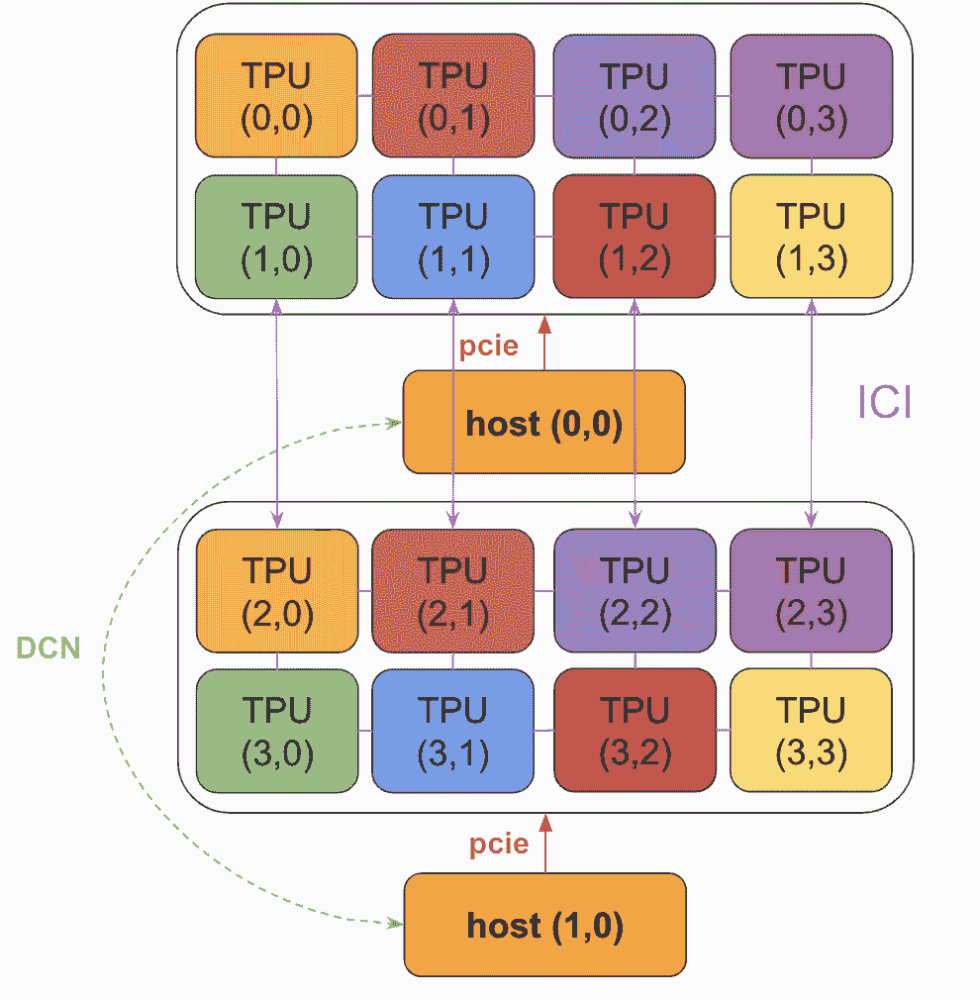</picture>

每个芯片实际上都有其自己的 PCIe 连接到其主机，尽管为了清晰起见这里只显示了一个。

现在我们来计算每个部分将花费多长时间：

1.  **PCIe load**: 我们通过 16 个 PCIe 链路加载 16GB 的数据块，每个链路具有 `1.5e10` 字节/秒的带宽。因此，这将花费大约 66ms。

1.  **ICI copy:** 每个 TPU 现在拥有我们数组的 1GB。我们的 ICI 带宽是每链路每秒 9e10 字节 * 双向，你将从上面的图中注意到，在 TPU v5e 的 4 个 ICI 链路中只有 2 个在此拓扑结构中用于 TPU{0,0}。由于 TPU{0,0} 需要在两个轴上以 `4.5e10` 字节/链路/秒的速度接收总共 15GB 的数据，我们可以将时间下限设定为 `15e9 / (4.5e10 * 2) = 167ms`。实际上，这可能无法实现，因为负载非常不均匀，但可能在大约 2 倍的范围内。正如你在第二部分中看到的，执行完整的 AllGather 也大约需要 `16e9 / (4.5e10 * 2)`，因此这接近最优。

1.  **HBM $\rightarrow$ MXU load:** 为了执行我们的最终矩阵乘法，我们需要将这些 16e9 字节加上 bf16[8, 128 * 1024] 数组（另外 2MB，因此可以忽略不计）通过 HBM 带宽加载到 MXU，这将花费 `16e9 / 8.1e11 = 19ms`。

1.  **FLOPs:** 我们总共执行了 \(2 \cdot 8 \cdot 128 \cdot 1024 \cdot 128 \cdot 1024 = 2.7 \times 10^{11}\) FLOPs，由于我们每秒可以执行 `1.97e14` bf16 FLOPs，因此我们得到 1.3ms。

总时间的上界是所有这些时间的总和，但由于 TPU 通常可以重叠这些操作，我们可以将其视为一个瓶颈由最慢的部分决定的流水线问题。假设这是真的，那么答案大约是 150-200ms。

### 这就是第二部分的所有内容！对于第三部分，涵盖分区和跨 TPU 通信，点击这里。

## 附录

### 附录 A：更多关于 TPU 内部结构

在这里，我们将更深入地探讨 TPU 的内部操作。除非另有说明，我们将提供 TPU v5p 的规格。

### VPU

VPU 是 TPU 的向量算术核心。VPU 由一个二维 SIMD 向量机（**VPU**）组成，执行逐元素算术运算，如 vadd（向量加法）或 vmax（逐元素最大值），以及一组称为 **VREGs** 的向量寄存器，这些寄存器用于存储 VPU 和 MXU 的数据。

**VREGs:** 每个 TPU v5p 核心有 64 个 32 位 VREGs（TPU v4 中有 32 个），总共约为 `64 * 8 * 128 * 4 = 256kB` 的 VREG 内存每个核心（或整个芯片的两倍，因为我们有两个核心）。TPU v5p 每个周期可以从 VMEM 加载 3 个寄存器，并每个周期写入 1 个寄存器到 VMEM。

**VPU：** VPU 是一个形状为 `(8, 128)` 的二维向量算术单元，其中 128 维度被称为通道轴，8 维度被称为子通道轴。v5 上的每个 (通道，子通道) 对包含 4 个标准浮点 ALU，它们彼此独立。VPU 在其每个 ALU 中执行大多数算术指令（如 vadd 或向量加）每个周期一次，延迟为 2 个周期，因此例如在 v5 中，你可以在每个周期内将来自 VREG 的 4 对 f32 值相加。一个典型的 VPU 指令可能看起来像 `{v2 = vadd.8x128.f32 v0, v1}`，其中 v0 和 v1 是输入 VREG，v2 是输出 VREG。

所有通道和子通道在每个周期都以纯 SIMD 方式执行相同的程序，但每个 ALU 可以执行不同的操作。因此，例如，我们可以在单个周期内处理 1 个 vadd 和 1 个 vsub，每个操作都作用于两个完整的 VREG，并将输出写入第三个。

**快速问答 [计算 VPU 吞吐量]：** 使用上述信息，计算 TPU v5p 可以执行多少向量 FLOPs/s。TPU v5p 的时钟速度约为 1.75GHz。

点击此处查看答案。

*答案*：每个周期，每个核心可以在 `8 * 128` ALU 上执行 4 条向量指令。这为我们提供了整个芯片的 `8 * 128 * 4 * 2` FLOPs/cycle，或者 `8 * 128 * 4 * 2 * 1.75e9 = 1.4e13 FLOPs/s`。注意这比大约 `2e14` 的 MXU FLOPs/s 小得多（大约 10 倍）。

**减少（Reductions）：** 通常情况下，跨子通道维度的通信或减少比跨通道维度的通信更容易。例如，VPU 支持一个沿大小为 8 的轴滚动的内部通道洗牌操作，大约在一个周期内完成。这可以用来在子通道维度上执行高效的减少（只需通过 4、2 和 1 洗牌，并进行 3 对逐元素求和）。

跨通道减少更困难，涉及一个称为 XLU 或“跨通道单元”的单独硬件单元，它速度较慢且相对昂贵。

**与 GPU 的比较：** 对于熟悉 NVIDIA GPU 的人来说，VPU 中的每个 ALU 都类似于一个 CUDA 核心，而单个 VPU 通道类似于“Warp Scheduler”，即通常执行 SIMD 算术的 32 个 CUDA 核心集。通道内的减少相对容易，但如果我们需要跨通道，我们需要通过 VMEM/XLU/SMEM 进行转换，这要慢得多。有关更多详细信息，请参阅 GPU 部分。

### 标量核心

标量核心是 TPU 的控制单元。它获取和调度所有指令，并执行从 HBM 到 VMEM 的传输，并且可以编程以执行标量元数据工作。由于标量核心是单线程的，这种做法的一个副作用是，TPU 的每个核心在每个周期只能创建一个 DMA 请求。

为了将这个概念放在上下文中，单个标量核心控制一个 VPU（包含 4096 个 ALU），4 个 MXU，2 个 XLU 和多个 DMA 引擎。每个计算单元的控制高度倾斜是硬件效率的来源，但也限制了以任何有趣的方式执行数据相关向量化。

### 附录 B：收缩阵列是如何工作的？

TPU MXU 的核心是一个 `128x128` 的收缩阵列（在 TPU v6e 上为 `256x256`）。当完全饱和时，收缩阵列可以在 8 个时钟周期内执行一次 `bfloat16[8,128] @ bf16[128x128] -> f32[8,128]`如果你不熟悉这种表示法，它意味着：使用 bfloat16 元素乘以 `8x128` 矩阵和 `128x128` 矩阵，并将结果存储在 `8x128` 矩阵中，该矩阵具有 float32 元素。 乘法。

+   在其核心，收缩阵列是一个 2D `128x128` (`=16,384`) 的 ALU 网格，每个 ALU 都能执行乘加操作。

+   权重（**W**，`128x128` 输入）从上方传递下来（称为 RHS），而输入（**X**，`8x128` 输入）从左侧传入（称为 LHS）。

这里是乘以一组权重（蓝色）和一组激活（绿色）的简化动画。你会注意到权重（RHS）首先部分加载，呈对角线，然后激活也以对角线方式输入。在每个下面的帧中，我们乘以所有重叠的绿色和蓝色单元，将任何从上方传递下来的残留结果相加，然后将结果依次传递给下一个单元。

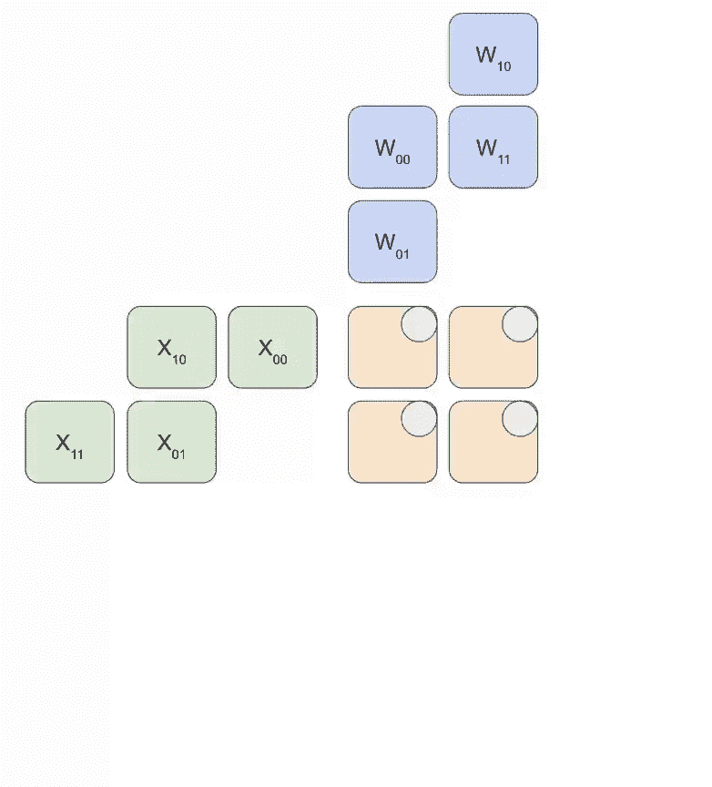

这里有一个更通用的动画版本，展示了计算结果如何被流式传输出来：

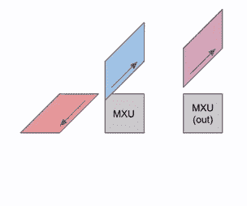

这里有一个图表，展示了如何将这个流水线化到多个 RHS 和 LHS 数组中：

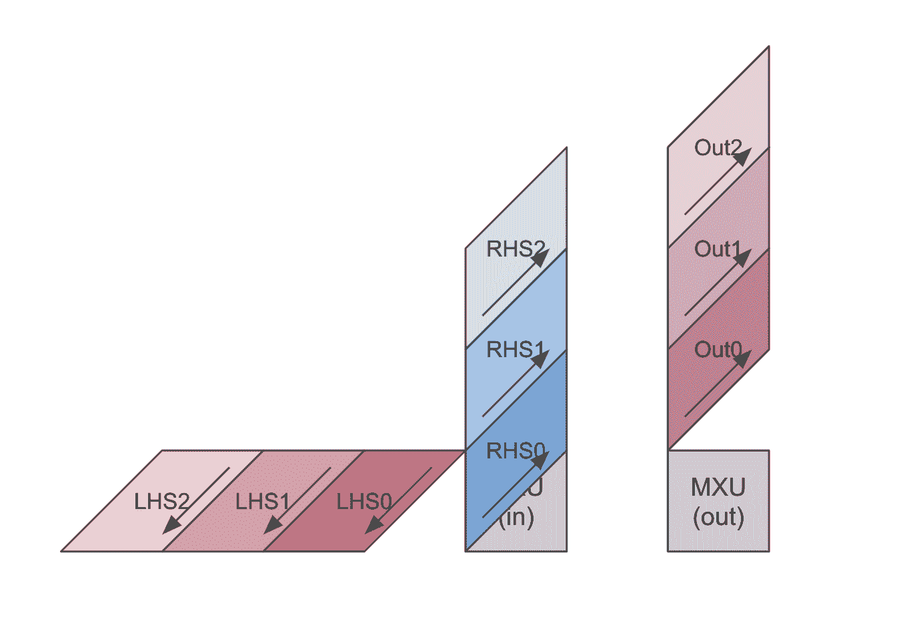

在权重（RHS）和激活（LHS）加载时，存在一个初始的流水线气泡。在那之后，新的输入和权重可以加载而无需额外的气泡。

这里是一个 bf16[2, 3] x bf16[3, 3] 矩阵乘法的糟糕动画，你可以想象成是一个 2x3 权重矩阵与批次大小为 3 的输入激活的 matmul。这与前面的幻灯片相比是旋转的，输入流向右侧而不是向下，但你可以大致看到结构。

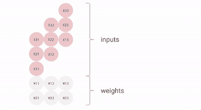

我们可以有效地流水线化这个过程，以在不产生太大的流水线气泡的情况下乘以大型矩阵。换句话说，我们的矩阵的形状必须大于 MXU 的边长维度，MXU 通常是 128x128。一些 TPU（自 TPU v3 以来）有多个 MXU，TPU v3 为 2 个，TPU v4/5 为 4 个，因此我们需要确保分块维度大于 128 乘以 MXU 的数量。[这里有一个动画演示这个概念](https://www.youtube.com/watch?v=sJltBQ4MOHA)。

Trillium (TPU v6e) 拥有 `256x256` 的收缩阵列，这意味着它可以每周期执行 4 倍的 FLOPs。这也意味着您的张量维度需要是两倍大，才能充分利用 MXU。

[这篇博客文章](https://fleetwood.dev/posts/domain-specific-architectures#google-tpu) 有一个关于固定权重矩阵的收缩阵列乘法的另一个优秀动画。  ### 杂项

^*在 Google DeepMind 完成的工作，现在在 MatX。

### 引用

在学术环境中进行归属引用时，请将此作品引用如下：

```py
 Austin et al., "How to Scale Your Model", Google DeepMind, online, 2025. 
```

或者作为 BibTeX 条目：

```py
 @article{scaling-book,
      title = {How to Scale Your Model},
      author = {Austin, Jacob and Douglas, Sholto and Frostig, Roy and Levskaya, Anselm and Chen, Charlie and Vikram, Sharad
      and Lebron, Federico and Choy, Peter and Ramasesh, Vinay and Webson, Albert and Pope, Reiner},
      publisher = {Google DeepMind},
      howpublished = {Online},
      note = {Retrieved from https://jax-ml.github.io/scaling-book/},
      year = {2025}
    } 
``` 
