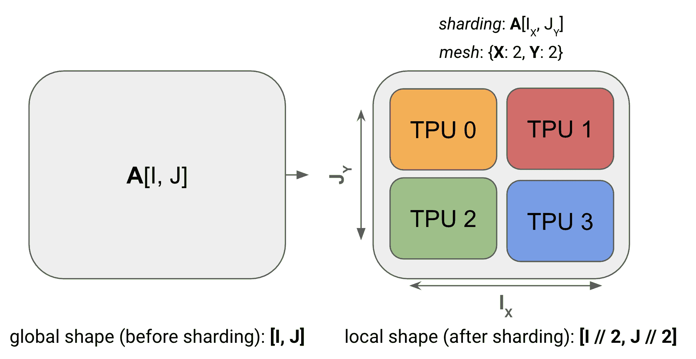
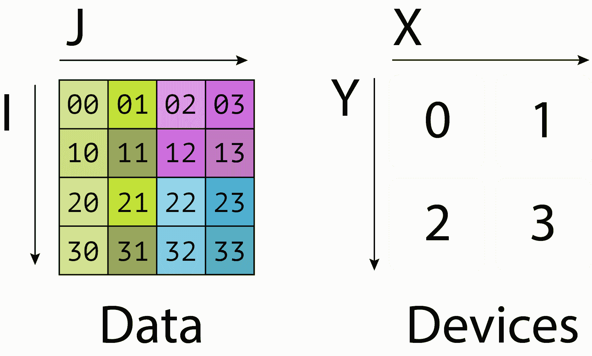
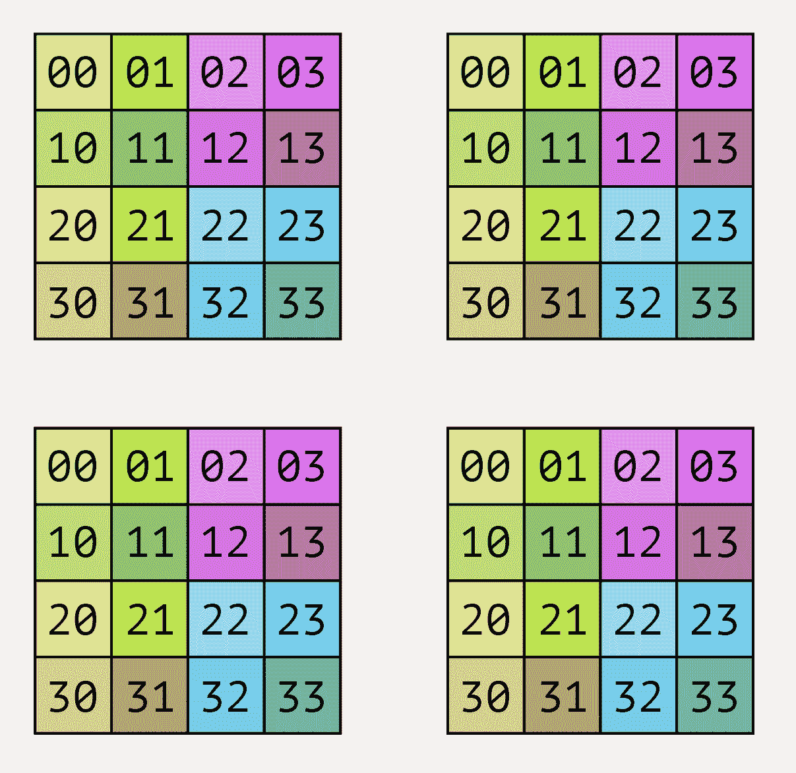
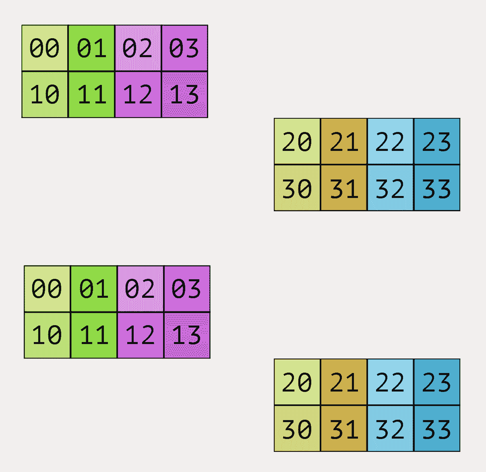
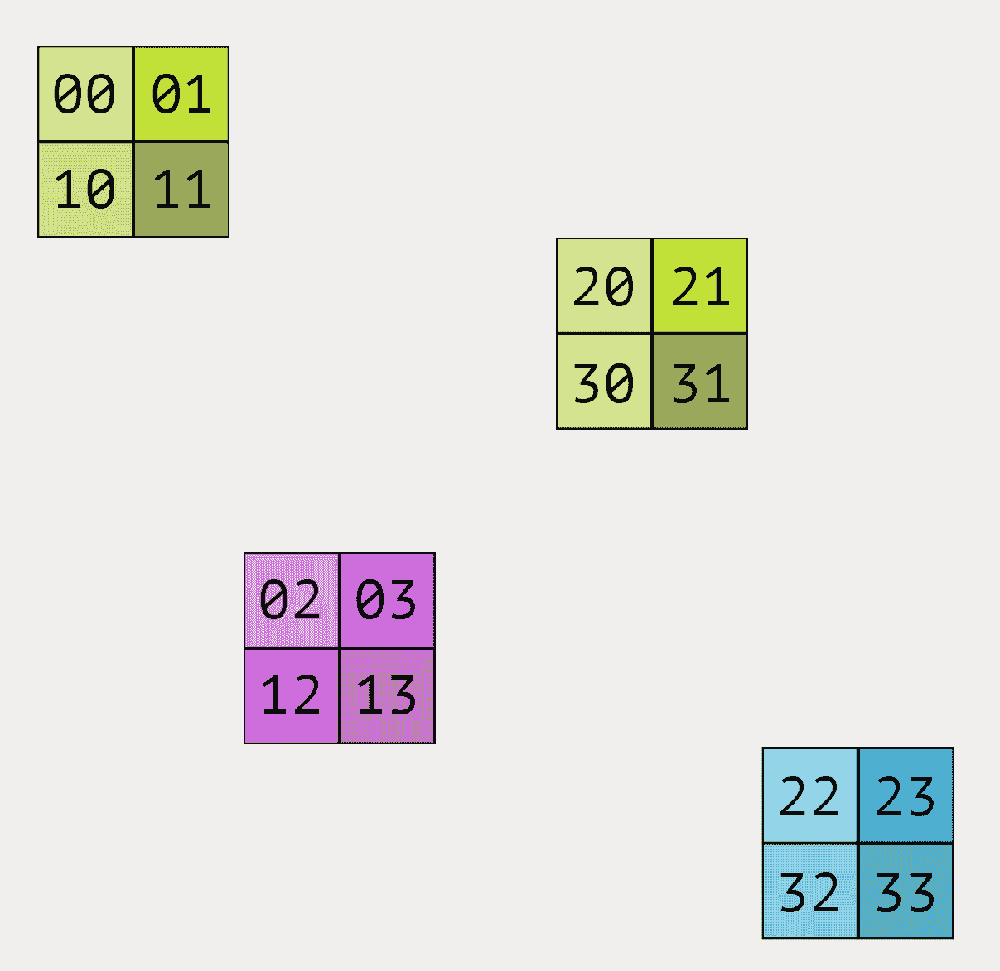
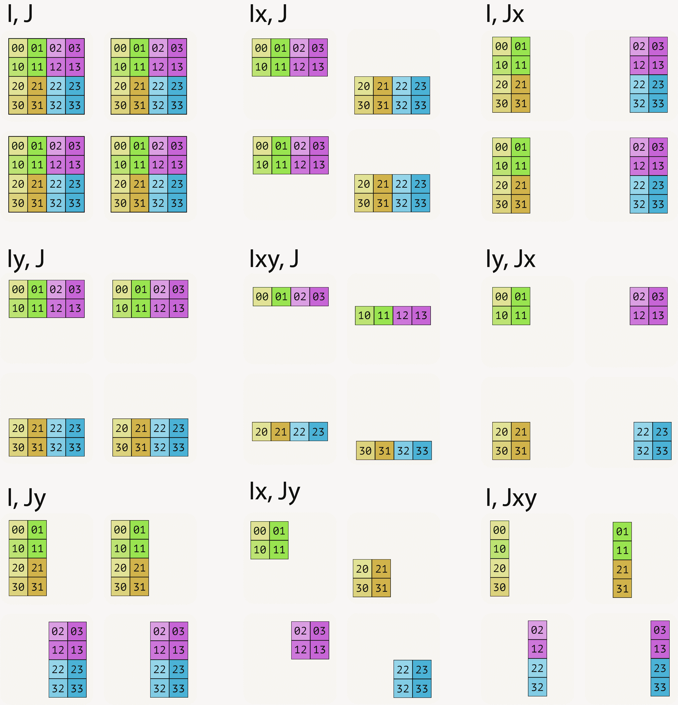
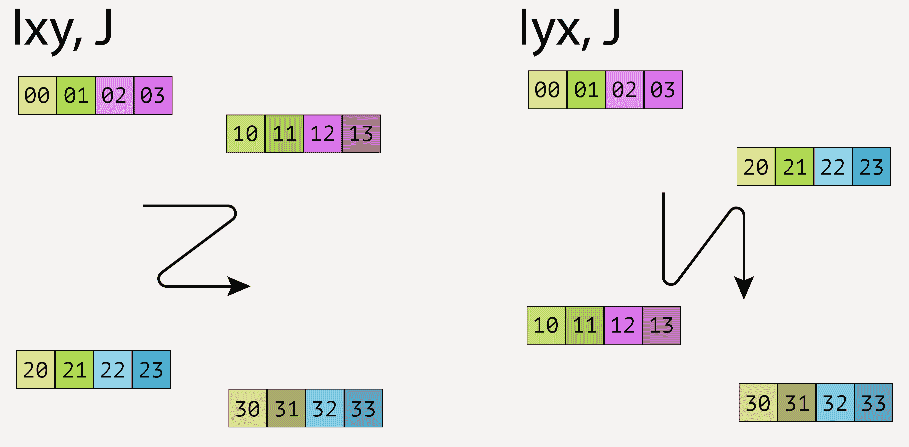
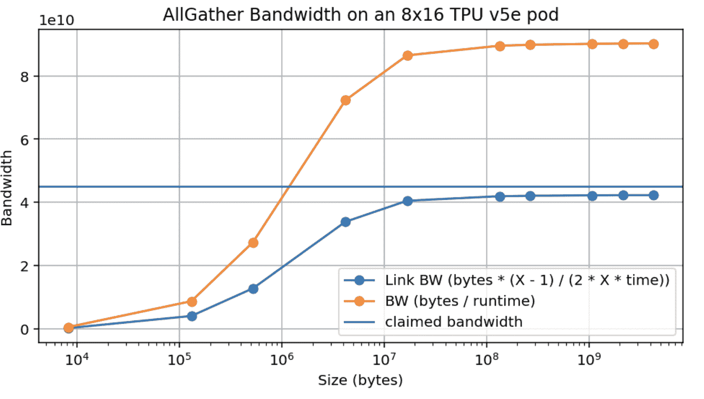
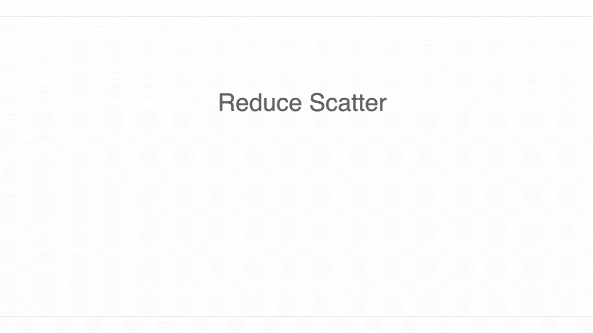
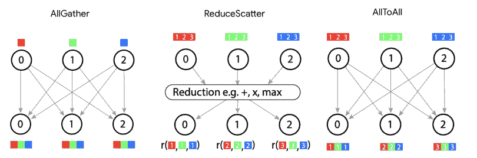

# 分片矩阵及其乘法方法

> 原文：[`jax-ml.github.io/scaling-book/sharding`](https://jax-ml.github.io/scaling-book/sharding)

《如何扩展你的模型》的第三部分（第二部分：TPU | 第四部分：Transformer 数学）

当我们训练大型机器学习模型时，我们必须将它们的参数或输入分割（或称为“分片”）到许多加速器上。由于大型语言模型主要由矩阵乘法组成，理解这一点归结为理解当矩阵在设备之间分割时如何进行矩阵乘法。我们基于 TPU 通信原语的成本开发了一种简单的分片矩阵乘法理论。  ### 内容

分区表示法和集体操作

+   分片统一的表示法

+   我们如何在代码中描述这一点？

使用分片数组进行计算

+   案例 1：两个乘数都没有分片收缩维度

+   案例 2：一个乘数有一个分片收缩维度

+   案例 3：两个乘数都有分片收缩维度

+   案例 4：两个乘数都有沿同一轴分片的非收缩维度

深入探讨 TPU 通信原语

+   我们最终的通信原语：AllToAll

+   更多关于 ReduceScatter 的信息

我们学到了什么？一些需要解决的问题

## 分区表示法和集体操作

当我们在一万个 TPU 或 GPU 上训练 LLM 时，我们仍然在抽象上做与在一个 TPU/GPU 上训练时相同的计算。区别在于**我们的数组无法适应单个 TPU/GPU 的 HBM**，因此我们必须将它们分割开来。值得注意的是，我们也可以选择为了速度而并行化。即使我们可以在更少的芯片上适应，扩展到更多的芯片可以给我们更多的 FLOPs/s。例如，在推理期间，我们有时可以在较小的拓扑结构上适应，但选择扩展到较大的拓扑结构以减少延迟。同样，在训练期间，我们经常扩展到更多的芯片以减少步长时间。我们称这种“*分片*”或“*分区*”为我们的数组。扩展的艺术在于找出如何分片我们的模型，以便计算保持高效。

这里有一个例子，一个 2D 数组**A**被分片到 4 个 TPU 上：

<picture></picture>

**图例**：一个形状为**A**[I, J]的示例数组被分片到 4 个设备上。两个维度都通过分片**A**[I[X], J[Y]]均匀地分片到 2 个设备上。每个 TPU 持有总内存的 1/4。

注意到分片数组仍然具有与未分片数组相同的**全局**或**逻辑形状**，例如`(4, 128)`，但它还有一个**设备本地形状**，例如`(2, 64)`，这给出了每个 TPU 实际持有的字节数（在上述图中，每个 TPU 持有整个数组的 1/4）。现在我们将这一概念推广到任意数组。

### 分片的一个统一表示法

我们使用一种名为轴命名表示法的变体来描述张量如何在设备之间分块：我们假设存在一个称为**设备网格**的 2D 或 3D 设备网格，其中每个轴都已被赋予**网格轴名称**，例如**X**、**Y**和**Z**。然后我们可以通过描述数组的每个命名维度如何分区到物理网格轴上来指定矩阵数据在设备网格上的布局。我们称这种分配为**分片**。

**示例（上图）**：对于上述图，我们有：

+   **网格**：上述`Mesh(devices=((0, 1), (2, 3)), axis_names=('X', 'Y'))`设备网格，这告诉我们我们有一个 2x2 网格中的 4 个 TPU，轴名为$X$和$Y$。

+   **分片**：$A[I_X, J_Y]$，这告诉我们沿着网格轴$X$对第一个轴$I$进行分片，沿着网格轴$Y$对第二个轴$J$进行分片。这种分片告诉我们每个分片持有数组中$1 / (\lvert X\rvert \cdot \lvert Y\rvert)$的部分。

综合来看，我们知道数组的本地形状（单个设备持有的分片大小）是$(\lvert I\rvert / 2, \lvert J\rvert / 2)$，其中$\lvert I\rvert$是 A 的第一个维度的大小，$\lvert J\rvert$是 A 的第二个维度的大小。

**快速问答[1 轴上的 2D 分片]：**考虑一个具有分片$A[I_{XY}, J]$和网格`{'X': 8, 'Y': 2}`的`fp32[1024, 4096]`数组。每个设备持有多少数据？从 HBM 加载这个数组到 H100s 上需要多少时间？（假设每个芯片的内存带宽为`3.4e12`）？

点击此处查看答案。

$A[I_{XY}, J]$沿着 X 和 Y 硬件轴对第一个维度（I）进行分片。在这个例子中，本地形状是$(\lvert I\rvert /(\lvert X\rvert \cdot \lvert Y\rvert), \lvert J\rvert)$。对于给定的例子，全局形状是`fp32[1024, 4096]`，因此本地形状是`fp32[64, 4096]`。

由于每个 GPU 有`4 * 64 * 4096 = 1MiB`字节，这大约需要`1e6 / 3.4e12 = 294ns`，尽管由于各种开销，这可能会显著更多。

**可视化这些分片**：让我们通过查看分片在 4 个设备上的 2D 数据数组来尝试可视化这些分片：

<picture></picture>

我们简单地用 $A[I, J]$ 来表示矩阵的完全复制形式，没有任何分片赋值。这意味着每个设备都包含整个矩阵的完整副本。

<picture></picture>

我们可以用下标网格轴来表示其中一个维度已经在一个网格轴上进行了分区。例如，$A[I_X, J]$ 表示 **I** 逻辑轴已经分区到 **X** 网格维度上，但 **J** 维度没有分区，并且块在 **Y** 网格轴上保持部分复制。

<picture></picture>

$A[I_X, J_Y]$ 表示 **I** 逻辑轴已经分区到 **X** 网格轴上，而 **J** 维度已经分区到 **Y** 网格轴上。

<picture></picture>

我们在下面的图中说明了其他可能性：

<picture></picture>

这里 $A[I_{XY}, J]$ 表示我们将 **X** 和 **Y** 网格轴视为一个更大的扁平维度，并将名为 **I** 的轴分配到所有设备上。多个网格轴下标的顺序很重要，因为它指定了网格中分区遍历的顺序。

<picture></picture>

最后，请注意，我们不能在同一个网格维度上对多个命名轴进行分片。例如，$A[I_X, J_X]$ 是一个无意义的、禁止的分片。一旦网格维度被用来分片数组的某个维度，它就相当于“用完了”。

**快速问答：** 设 **A** 为形状为 `int8[128, 2048]` 的数组，进行 $A[I_{XY}, J]$ 分片，网格 `Mesh({‘X': 2, ‘Y': 8, ‘Z': 2})`（总共有 32 个设备）。**A** 每个设备使用多少内存？所有设备上 **A** 使用多少总内存？

点击此处查看答案。

**答案：** 我们将数组 **A** 在 X 和 Y 上进行分片，在 Z 上进行复制，因此每个设备上的形状为 `int8[128 / (2 * 8), 2048] = int8[8, 2048]`，大小为 `8 * 2048 = 16,384` 字节。因为它在 Z 上进行了复制，所以在 Z 平面内它完全在 X 和 Y 上进行了分片，有 2 个完整的原始数组副本（每个 Z 平面一个）。因此，所有设备上的总大小为：原始数组大小 × Z 副本数 = 128 * 2048 * 2 = 512 KiB 总计。或者，我们可以这样验证：32 个设备 × 每个设备的 16,384 字节 = 512 KiB 总计。

### 我们如何在代码中描述这一点？

到目前为止，我们还没有谈论代码，但现在是一个很好的机会偷看一眼。JAX 使用一个命名的分片语法，它与上面描述的抽象语法非常接近。我们将在 第十部分 中更多地讨论这一点，但这里有一个快速预览。你可以在 Google Colab [这里](https://colab.research.google.com/drive/15cxw66eABwZPG-V4QFmbLfiykPFf_gaP?usp=sharing) 上尝试这个，并分析结果以查看 JAX 如何处理不同的分片。这个片段做了 3 件事：

1.  创建一个 **jax.Mesh**，将我们的 8 个 TPU 映射到一个 4x2 的网格中，两个轴分别命名为‘X’和‘Y’。

1.  创建矩阵 A 和 B，其中 A 在其两个维度上分片，而 B 在输出维度上分片。

1.  编译并执行一个简单的矩阵乘法，返回一个分片数组。

```py
import jax
import jax.numpy as jnp

# Create our mesh! We're running on a TPU v2-8 4x2 slice with names 'X' and 'Y'. assert len(jax.devices()) == 8
mesh = jax.make_mesh(axis_shapes=(4, 2), axis_names=('X', 'Y'))

# A little utility function to help define our sharding. A PartitionSpec is our
# sharding (a mapping from axes to names). def P(*args):
  return jax.NamedSharding(mesh, jax.sharding.PartitionSpec(*args))

# We shard both A and B over the non-contracting dimension and A over the contracting dim. A = jnp.zeros((8, 2048), dtype=jnp.bfloat16, device=P('X', 'Y'))
B = jnp.zeros((2048, 8192), dtype=jnp.bfloat16, device=P(None, 'Y'))

# We can perform a matmul on these sharded arrays! out_shardings tells us how we want
# the output to be sharded. JAX/XLA handles the rest of the sharding for us. y = jax.jit(lambda A, B: jnp.einsum('BD,DF->BF', A, B), out_shardings=P('X', 'Y'))(A, B) 
```

JAX 的酷之处在于这些数组表现得就像它们没有被分片一样！`B.shape` 将告诉我们全局或逻辑形状（2048, 8192）。我们必须实际查看 `B.addressable_shards` 来了解它是如何本地分片的。我们可以对这些数组执行操作，JAX 将尝试找出如何广播或重塑它们以执行操作。例如，在上面的例子中，**A** 的本地形状是 `[2, 1024]`，对于 **B** 是 `[2048, 4096]`。JAX/XLA 将自动在这些数组之间添加必要的通信，以执行最终的乘法。

## 分片数组的计算

如果你有一个数据数组分布在许多设备上，并且希望对它执行数学运算，与分片数据和计算相关的开销是什么？

显然，这取决于涉及的计算。

+   对于 *逐元素* 操作，对分布式数组进行操作没有 **开销**。

+   当我们希望在许多设备上的元素之间执行操作时，事情会变得复杂。幸运的是，对于大多数机器学习，几乎所有计算都以矩阵乘法的形式进行，并且它们相对容易分析。

本节的其余部分将讨论如何乘以分片矩阵。首先近似地，这涉及到移动矩阵的块，以便你可以完全乘法或求和每个块。**每个分片都会涉及不同的通信**。例如，$A[I_X, J] \cdot B[J, K_Y] \to C[I_X, K_Y]$ 可以在不进行任何通信的情况下进行乘法，因为 *收缩维度*（J，我们实际求和的维度）没有被分片。然而，如果我们想要输出未分片（即 $A[I_X, J] \cdot B[J, K_Y] \to C[I, K]$），我们可能需要将 $A$ 和 $B$ 或 $C$ 复制到每个设备上（使用 *AllGather*）。这两个选择有不同的通信成本，因此我们需要计算这个成本并选择最低的一个。

你可以从“块矩阵乘法”的角度来考虑这个问题。

为了理解这一点，回忆一下“块矩阵”的概念可能会有所帮助，或者说是矩阵的嵌套矩阵：

\[\begin{equation} \begin{pmatrix} a_{00} & a_{01} & a_{02} & a_{03} \\ a_{10} & a_{11} & a_{12} & a_{13} \\ a_{20} & a_{21} & a_{22} & a_{23} \\ a_{30} & a_{31} & a_{32} & a_{33} \end{pmatrix} = \left( \begin{matrix} \begin{bmatrix} a_{00} & a_{01} \\ a_{10} & a_{11} \end{bmatrix} \\ \begin{bmatrix} a_{20} & a_{21} \\ a_{30} & a_{31} \end{bmatrix} \end{matrix} \begin{matrix} \begin{bmatrix} a_{02} & a_{03} \\ a_{12} & a_{13} \end{bmatrix} \\ \begin{bmatrix} a_{22} & a_{23} \\ a_{32} & a_{33} \end{bmatrix} \end{matrix} \right) = \begin{pmatrix} \mathbf{A_{00}} & \mathbf{A_{01}} \\ \mathbf{A_{10}} & \mathbf{A_{11}} \end{pmatrix} \end{equation}\]

矩阵乘法有一个很好的特性，即当矩阵乘数以块的形式表示时，乘积可以按照标准规则用块矩阵乘法表示：

\[\begin{equation} \begin{pmatrix} A_{00} & A_{01} \\ A_{10} & A_{11} \end{pmatrix} \cdot \begin{pmatrix} B_{00} & B_{01} \\ B_{10} & B_{11} \end{pmatrix} = \begin{pmatrix} A_{00}B_{00} + A_{01}B_{10} & A_{00}B_{01} + A_{01}B_{11} \\ A_{10}B_{00} + A_{11}B_{10} & A_{10}B_{01} + A_{11}B_{11} \end{pmatrix} \end{equation}\]

这意味着实现分布式矩阵乘法简化为在网络中移动这些数据分片块，在块上执行*局部*矩阵乘法，并汇总其结果。**那么问题就是添加什么通信，以及它的成本如何。**

便利的是，我们可以将所有可能的数据分片简化为大约 4 种需要考虑的情况，每种情况都有一个规则，说明我们需要添加哪种通信。

1.  **情况 1**：输入没有在收缩维度上进行数据分片。*我们可以无需任何通信就乘以局部数据分片*。

1.  **情况 2**：一个输入具有在收缩维度上的数据分片。*我们通常会在收缩维度上对数据分片进行 AllGather*。

1.  **情况 3**：两个输入都在收缩维度上进行数据分片。*我们可以乘以局部数据分片，然后对结果进行 AllReduce*。

1.  **情况 4**：两个输入都在同一轴上具有非收缩维度的数据分片。在没有先对两个输入之一进行 AllGathering 之前，我们无法继续操作。

你可以将这些视为只需遵循的规则，但了解这些规则为何成立以及它们的成本也很宝贵。现在我们将逐一详细解释这些规则。

### 情况 1：没有乘数具有数据分片的收缩维度

**引理**：当乘以数据分片矩阵时，计算是有效的，输出遵循输入的数据分片，*除非*收缩维度也是数据分片或者两个矩阵都在同一轴上进行数据分片。例如，这可以正常工作

\[\begin{equation*} \mathbf{A}[I_X, J] \cdot \mathbf{B}[J, K_Y] \rightarrow \mathbf{C}[I_X, K_Y] \end{equation*}\]

完全没有通信，并导致张量在 X 和 Y 硬件维度上分片。试着想想为什么是这样。基本上，计算是 *独立* 于分片的，因为每个批处理条目都有一些局部块可以乘以并减少。任何这些情况都可以正常工作，并遵循此规则：

\[\begin{align*} \mathbf{A}[I, J] \cdot \mathbf{B}[J, K] \rightarrow &\ \mathbf{C}[I, K] \\ \mathbf{A}[I_X, J] \cdot \mathbf{B}[J, K] \rightarrow &\ \mathbf{C}[I_X, K]\\ \mathbf{A}[I, J] \cdot \mathbf{B}[J, K_Y] \rightarrow &\ \mathbf{C}[I, K_Y]\\ \mathbf{A}[I_X, J] \cdot \mathbf{B}[J, K_Y] \rightarrow &\ \mathbf{C}[I_X, K_Y] \end{align*}\]

因为 **A** 和 **B** 都没有分片收缩维度 **J**，我们可以简单地执行输入和结果的局部块矩阵乘法，结果将 *已经* 按照所需的输出分片进行分片。当两个乘数都有沿同一轴分片的非收缩维度时，这一点不再成立（有关详细信息，请参阅 无效分片 部分）。

### 情况 2：一个乘数具有分片收缩维度

让我们考虑当输入 **A** 沿着收缩的 **J** 维度进行分片，而 **B** 完全复制时应该怎么做：

\[\mathbf{A}[I, J_X] \cdot \mathbf{B}[J, K] \rightarrow \mathbf{C}[I, K]\]

我们不能简单地乘以 **A** 和 **B** 的局部块，因为我们需要在 **A** 的整个收缩维度上求和，而这个维度被沿 X 轴分割。通常，我们首先“**AllGather**” **A** 的分片，以便每个设备都有一个完整的副本，然后才与 **B** 相乘：

\[\textbf{AllGather}_X[I, J_X] \rightarrow \mathbf{A}[I, J]\] \[\mathbf{A}[I, J] \cdot \mathbf{B}[J, K] \rightarrow \mathbf{C}[I, K]\]

这样，实际的乘法可以在每个设备上完全进行。

**要点：** 当乘以矩阵，其中一个矩阵沿收缩维度进行分片时，我们通常首先进行 AllGather，以便收缩不再分片，然后进行局部矩阵乘法。

注意，当 **B** 也没有沿 X 维度进行分片时，我们也可以进行局部部分矩阵乘法，然后对分片的部分和进行求和（或 *AllReduce*），在某些情况下可能会更快。参见问题 4 以下。

**什么是 AllGather？** AllGather 是我们将要讨论的第一个核心 [MPI](https://en.wikipedia.org/wiki/Message_Passing_Interface) 通信原语。AllGather 会 *消除* 沿着轴的划分，并将分布在设备上的分片重新组装到该轴上的 *每个* 设备上。使用上述符号，AllGather 从一组轴中删除下标，例如。

\[\textbf{AllGather}_{XY}(A[I_{XY}, J]) \rightarrow A[I, J]\]

我们不必移除给定维度的所有下标，例如\(A[I_{XY}, J] \rightarrow A[I_Y, J]\)也是一个 AllGather，只是只在单一轴上。此外，我们可能还希望使用 AllGather 来移除*非收缩*维度碎片，例如在矩阵乘法中：

\[A[I_X, J] \cdot B[J, K] \rightarrow C[I, K]\]

我们可以最初对**A**执行 AllGather 以移除输入碎片，或者我们可以先执行碎片化的矩阵乘法，然后对结果**C**执行 AllGather。

**如何实际执行一个 AllGather 操作？** 要在一个单独的 TPU 轴（一个环）周围执行一维 AllGather 操作，我们基本上让每个 TPU 将其碎片在环中传递，直到每个设备都有一个副本。GPU 的 AllGather 也可以这样工作，其中你在一个节点中的 GPU 中创建一个环，并以那个（任意）顺序传递块。下面是一个动画：

<picture></picture>

**图示：** 一个动画，展示了如何在 8 个 TPU 或 GPU 设备周围执行 AllGather 操作。每个设备开始时拥有数组 1/8 的部分，最终得到一个完整的副本。

我们可以沿一个方向或两个方向（上面显示的是两个方向）执行 AllGather 操作。如果我们沿一个方向执行，每个 TPU 将大小为$\text{bytes} / N$的块通过环中的$N - 1$跳发送。如果我们沿两个方向执行，我们就有$\lfoor \frac{N}{2} \rfloor$跳，每跳大小为$2 \cdot \text{bytes} / N$。

**这需要多长时间？** 让我们以双向 AllGather 为例，计算它需要多长时间。设\(V\)为数组中的字节数，\(X\)为收缩维度的碎片数。然后从上面的图中，每个跳在每方向发送$V / \lvert X\rvert$字节，所以每个跳需要

\[T_{hop} = \frac{2 \cdot V}{X \cdot W_\text{ici}}\]

其中$W_\text{ici}$是**双向**ICI 带宽。分子中的 2 因子来自于我们使用的是双向带宽。我们每个方向发送$V / X$，或者总共$2V / X$。我们需要发送总共$\lvert X\rvert / 2$跳才能到达每个 TPU技术上，$\lfloor X / 2 \rfloor$，所以总减少需要

\[T_{total} = \frac{2 \cdot V \cdot X}{2 \cdot X \cdot W_\text{ici}}\] \[T_{total} = \frac{V}{W_\text{ici}}\]

注意，这**不依赖于$X$**！这有点令人惊讶，因为它意味着尽管我们的 TPU 只是本地连接的，但连接的局部性并不重要。我们只是受限于每个链路的速度。

**总结：** 在吞吐量受限的条件下执行 AllGather（或 ReduceScatter 或 AllReduce）时，实际的通信时间只取决于数组的尺寸和可用的带宽，而不是我们的数组碎片化的设备数量！

**关于 ICI 延迟的说明：** 在 ICI 链路上每次跳转都有一些固有的开销，无论数据量大小。这通常大约是 1us。这意味着当我们的数组 \(A\) 非常小，每次跳转小于 1us 时，我们可以进入一个“延迟限制”状态，其中计算 *确实* 依赖于 \(X\)。

要获取完整详情，请点击此处。

令 \(T_\text{min}\) 为单跳的最小时间。那么

\[T_{hop} = \max \left[ T_{min}, \frac{2 \cdot V}{X \cdot W_\text{ici}} \right]\] \[T_{total} = \max \left[ \frac{T_{min} \cdot X}{2}, \frac{V}{W_\text{ici}} \right]\]

因为我们要执行 \(X / 2\) 跳。对于大的缩减或收集，我们完全受带宽限制。我们发送了如此多的数据，以至于每次跳转的开销几乎可以忽略不计。但对于小数组（例如，从模型中采样时），这不可忽略，ICI 带宽也不相关。我们纯粹受延迟限制。另一种说法是，给定一个特定的 TPU，例如 TPU v5e，具有 `4.5e10` 单向 ICI 带宽，发送任何小于 `4.5e10 * 1e-6 = 45kB` 的缓冲区将受延迟限制。

这里是对 TPU v5e 8x16 切片上 AllGather 带宽的实验测量。数组在 16 个轴上碎片化，因此它有一个完整的双向环形。

<picture></picture>

**图示：** TPU v5e 在 AllGather 期间的实验带宽和估计链路带宽。橙色表示实际每秒 AllGather 的字节数，蓝色曲线表示根据已知的集体成本计算的经验单向链路带宽。

注意，我们不仅实现了声称的峰值带宽（`4.5e10`）的大约 95%，而且我们在大约 10MB 时实现了这个峰值，当 16 方碎片化时，每个设备大约有 500kB (*此外：这比 GPU 好得多*)。

**当我们对多个轴进行 AllGather 时会发生什么？** 当我们对多个轴进行 AllGather 时，我们就有多个维度来进行收集。例如，AllGatherXY 在两个硬件网格轴上操作。这增加了带宽的可用性，增加了一个因子 \(N_\text{axes}\)。

考虑延迟时，我们得到一个一般规则：

\[T_{total} = \max \left[ \frac{T_{min} \cdot \sum_{i} |X_i|}{2}, \frac{V}{W_\text{ici} \cdot N_\text{axes}} \right]\]

其中 \(\sum_i \lvert X_i \rvert / 2\) 是 TPU 网格中最长路径的长度。

**Pop Quiz 2 [AllGather 时间]:** 使用 第二部分 中的数字，在 TPUv5e 上执行 AllGatherY → [E, F]，其中 2D 网格 `{'X': 8, 'Y': 4}`，\(E = 2048\)，\(F = 8192\) 使用 bfloat16 需要多少时间？当 \(E=256, F=256\) 时呢？

点击此处获取答案。

**答案：** 让我们从计算一些基本量开始：

1) TPU v5e 每个轴有 4.5e10 字节/秒的单向 ICI 带宽。2) 在 bfloat16 对于 (a)，我们有 $A[E_Y, F]$，因此每个设备持有形状为 bfloat16[512, 8192] 的数组，该数组有 512 * 8192 * 2 = 8.4MB。整个数组的大小为 2048 * 8192 * 2 = 34MB。

*对于部分 (1)*，我们可以使用上面的公式。由于我们正在对一个轴进行 AllGather，我们有 $T_{\text{comms}} = \text{34e6} / \text{9e10} = \text{377us}$。为了检查我们不是受延迟限制的，我们知道在一个大小为 4 的轴上，我们最多有 3 个跳数，因此我们的延迟限制大约是 3us，所以我们并不接近。然而，TPU v5e 只有当轴的大小为 16 时才有环绕连接，所以在这里**实际上我们无法进行完全的双向 AllGather**。我们必须进行 3 个跳数才能让数据从边缘到达另一边缘，因此理论上我们有更多像 $T_{\text{comms}} = 3 * \text{8.4e6} / \text{4.5e10} = 560\mu s$。[**这里**](https://imgur.com/a/RkvpRGQ) **是一个实际的配置文件**，来自 [这个 Colab](https://colab.research.google.com/drive/15tDZMfNqm2vJjvSzw5VC9qtSwc5td-oV?usp=sharing)，它显示 $680 \mu s$，这是合理的，因为我们可能无法获得 100% 的理论带宽！*对于部分 (2)*，每个分片的大小为 `64 * 256 * 2 = 32kB`。32e3 / 4.5e10 = 0.7us，因此我们受延迟限制。由于我们有 3 个跳数，这将大约需要 3 * 1us = 3us。[实际上，它更接近 8us。](https://imgur.com/a/HZLQmYs)

**注意**：当我们有一个像 `{'X': 16, 'Y': 4}` 这样的二维网格时，每个轴不需要对应特定的**硬件**轴。这意味着例如上面的描述可以是一个 4x4x4 的 TPU v5p 立方体，它在 $X$ 轴上有 2 个轴。这将在我们描述在多个轴上的数据并行时发挥作用。

### 情况 3：两个乘数都有分片收缩维度

第三个基本情况是当两个乘数都在它们的收缩维度上分片，沿着相同的网格轴：

\[\textbf{A}[I, J_X] \cdot \textbf{B}[J_X, K] \rightarrow C[I, K]\]

在这种情况下，由于它们将共享相同的收缩索引集，因此本地分片块矩阵乘法至少是**可能的**执行的，但每个乘积将只代表完整所需乘积的**部分和**，沿着**X**维度的每个设备都将留下这个最终所需乘积的不同**部分和**。这种情况很常见，因此我们扩展了我们的符号来明确标记这种条件：

\[\textbf{A}[I, J_X] \cdot_\text{LOCAL} \textbf{B}[J_X, K] \rightarrow C[I, K] \{\ U_X \}\]

符号 **{ U[X] }** 读取为“**未减少**沿 X 网格轴”，并指代操作的状态是“不完整”的，在这种意义上，它将仅在最终求和后完成。$\cdot_\text{LOCAL}$ 语法表示我们执行局部求和，但留下结果未减少。

这可以看作是关于矩阵乘法和外积的以下结果：

\[A \cdot B = \sum_{i=1}^{P} \underbrace{A_{:,i} \otimes B_{i,:}}_{\in \mathbb{R}^{n \times m}}\]

其中 ⊗ 表示外积。因此，如果 TPU **i** 在 **X** 轴上有 **A** 的第 **i** 列和 **B** 的第 **i** 行，我们可以进行局部矩阵乘法以获得 \(A_{:,i} \otimes B_{i,:} \in \mathbb{R}_{n\times m}\)。这个矩阵在每个条目中都有 **A • B** 在该条目处的和的第 **i** 项。我们仍然需要在 **P** 上执行这个和，我们在 **X** 轴的网格上分片，以获得完整的 **A • B**。如果我们按块（即分片）来写 **A** 和 **B**，然后对每个结果分片求和，这也会以相同的方式工作。

我们可以使用跨 **X** 轴的全 **AllReduce** 来执行这个求和，以解决这个问题：

\[\begin{align*} A[I, J_X] \cdot_\text{LOCAL} B[J_X, K] \rightarrow &\ C[I, K] \{ U_X \} \\ \textbf{AllReduce}_X C[I, K] \{ U_X \} \rightarrow &\ C[I, K] \end{align*}\]

AllReduce 移除部分和，导致轴上的每个设备都具有相同的完全求和值。AllReduce 是本节我们将讨论的几个关键通信中的第二个，第一个是 AllGather，其他的是 ReduceScatter 和 AllToAll。AllReduce 接受一个具有未求和（部分求和）轴的数组，并通过在未求和轴上传递这些分片并累积结果来执行求和。其签名是

\[\textbf{AllReduce}_Y A[I_X, J] \{U_Y\} \rightarrow A[I_X, J]\]

这意味着它只是简单地移除了 $\{U_Y\}$ 后缀，但其他方面结果保持不变。

**AllReduce 的成本是多少？** 一个关于如何执行 AllReduce 的心理模型是，每个设备将其分片发送到其邻居，并汇总它接收到的所有分片。显然，这比 AllGather 贵，因为每个“分片”的形状与完整数组相同。一般来说，**AllReduce 的成本是 AllGather 的两倍。一种观察这一点的方法是注意到 **AllReduce** 可以表示为两个其他原语（**ReduceScatter** 和 **AllGather**）的组合。与 AllReduce 类似，ReduceScatter 在数组上解决部分和，但结果输出“分散”或沿给定维度分区。AllGather 收集所有这些部分，并“重新分区/分片/复制”沿该物理轴的逻辑轴。

\[\begin{align*} \textbf{ReduceScatter}_{Y,J} : A[I_X,J] \{U_Y\} \rightarrow &\ A[I_X, J_Y] \\ \textbf{AllGather}_Y : A[I_X, J_Y] \rightarrow &\ A[I_X, J] \end{align*}\]

**ReduceScatter 呢？** 正如 AllReduce 移除下标（如上方的 $F_Y \to F$），ReduceScatter 对未求和/部分求和的数组求和，然后沿相同的网格轴分散（分片）不同的逻辑轴。$[F]\{U_Y\} \to [F_Y]$。动画显示了如何执行此操作：注意，它与 AllGather 非常相似，但不是保留每个分片，而是将它们相加。因此，其延迟大致相同，不包括执行求和所需的时间。

<picture></picture>

每个跃点的通信时间简单地是每分片字节数 $V / Y$ 除以带宽 $W_\text{ici}$，就像 AllGather 一样，所以我们有

\[T_{\text{comms per AllGather or ReduceScatter}} = \frac{V}{W_\text{ici}}\] \[T_{\text{comms per AllReduce}} = 2 \cdot \frac{V}{W_\text{ici}}\]

其中 \(W_\text{ici}\) 是双向带宽，只要我们有一个完整的环来减少。

### 情况 4：两个乘数在相同轴上有非收缩维度分片

在对张量进行分片时，每个网格维度最多只能出现一次。执行上述规则有时会导致违反此规则的情况，例如：

\[A[I_X, J] \cdot B[J, K_X] \rightarrow C[I_X, K_X]\]

这是不合法的，因为给定维度 **X** 上的一个分片，例如 **i**，将会有 **C** 的 **(i, i)** 分片，即对角线元素。由于所有分片之间信息不足，因此无法恢复除了结果的对角线元素之外的内容，因此我们不允许这种分片。

解决这个问题的一种方法是对某些维度进行 AllGather。这里我们有两种选择：

\[\begin{align*} \textbf{AllGather}_X A[I_X, J] \rightarrow &\ A[I, J] \\ A[I, J] \cdot B[J, K_X] \rightarrow &\ C[I, K_X] \end{align*}\]

或

\[\begin{align*} \textbf{AllGather}_X B[J, K_X] \rightarrow &\ B[J, K] \\ A[I_X, J] \cdot B[J, K] \rightarrow &\ C[I_X, K] \end{align*}\]

在任何情况下，结果在其形状中只提到 **X** 一次。我们选择哪一个将取决于后续操作所需的分片方式。

## 深入探讨 TPU 通信原语

前面的 4 个情况介绍了几个用于执行分片矩阵乘法的“核心通信原语”：

1.  **AllGather**：从一个分片中移除下标，收集分片。

1.  **ReduceScatter**：通过在该轴上对分片求和来从数组中移除一个“未减少”的后缀，使数组在第二个轴上分片。

1.  **AllReduce**：移除一个“未减少”的后缀，使数组在该轴上未分片。

在混合专家（MoE）模型和其他计算的情况下，还有一个核心通信原语需要提及：**AllToAll**。

### 我们最终的通信原语：AllToAll

当考虑分片矩阵乘法时，不会自然出现的一个最终基本集体操作，但在实践中却经常出现，是 **AllToAll** 集体操作，或者更确切地说，是 *分片转置* 或重新分片操作的特例。例如：

\[\textbf{AllToAll}_{X, J} A[I_X, J] \rightarrow A[I, J_X]\]

AllToAll 通常需要在不同区域的分片计算中重新排列分片布局，这些区域没有兼容的布局方案。当考虑分片混合专家模型时，它们自然出现。*你可以将 AllToAll 视为将下标从一个轴移动到另一个轴*。因为全到全不需要在环中复制每个分片的全部数据，所以实际上它比 AllGather（因子为 1/4）更便宜。对于偶数大小的双向环，每个设备将向右发送$(N/2 + (N/2-1) + … + 1)$个块，向左发送$((N/2-1) + … + 1)$个块$= 0.5 \cdot (N / 2) \cdot (N/2 + 1) + 0.5 \cdot (N / 2) \cdot (N/2 - 1) = N²/4$。每个块的大小（即分片的分片）是$\text{bytes} / N²$，因此每个设备的成本是$(\text{bytes} / N²) \cdot N² / 4 = \text{bytes} / 4$。这个结果随着总带宽与设备数量的比例而扩展。。

<picture></picture>

如果我们将问题推广到 ND AllToAll，那么在 AxBxC 网格上，一个包含$V$字节的数组的总成本是

\[T_\text{comms per AllToAll} = \frac{V \cdot \max(A, B, C, ...)}{4 \cdot N \cdot W_\text{ici}}\]

其中，$W_\text{ici}$是双向 ICI 带宽。对于 1D 网格，这减少到$V / (4 \cdot W_\text{ici})$，这是 AllReduce 成本的 1/4。在 2D 中，成本实际上随着最小轴的大小而降低。

*旁注：如果你想要一个关于这个事实的手动推导，可以从 1D 环面$\mathbb{Z} / N\mathbb{Z}$开始。如果我们随机选择一个源节点和目标节点，它们平均相距 N / 4 个跳数，这给我们带来了$(V \cdot N) / (4 \cdot N)$的成本。现在如果我们考虑一个 ND 环面，每个轴基本上是独立的。每个节点有$1 / N$字节，并且平均需要跳过其数据$\max(A, B, C, …) / 4$个跳数。*

### 更多关于 ReduceScatter 的信息

ReduceScatter 比最初看起来更基本，因为它实际上是 AllGather 的导数，反之亦然。即如果在正向传递中我们有：

\[\textbf{AllGather}_X A[I_X] \rightarrow A[I]\]

然后我们将逆模式的导数**A’**（通常在每个分片上都是不同的）ReduceScatter 到分片**A’**：

\[\textbf{ReduceScatter}_X A'[I] \{ U_X \} \rightarrow A'[I_X]\]

同样，正向传递中的$\text{ReduceScatter}_X(A[I] \{U_X\}) \to A[I_X]$意味着反向传递中的$\text{AllGather}_{X}(A'[I_X]) \to A'[I]$。

有关如何将 AllGather 和 ReduceScatter 视为彼此的导数，请点击此处。

这源于广播和减少作为线性算子的转置，而 AllGather 和 ReduceScatter 分别是广播和减少的外积（也称为 [克罗内克积](https://en.wikipedia.org/wiki/Kronecker_product)）。具体来说，如果我们有一个向量 $x \in \mathbb{R}^n$，任意数量的设备 $p \in \mathbb{N}$，并且我们让 $u = (1, \ldots, 1) \in \mathbb{R}^p$，我们可以按以下方式定义广播和减少，这应该符合你对它们的直观理解：

\[\begin{align*} \text{broadcast} &: \mathbb{R}^n \rightarrow \mathbb{R}^{p n} \\ \text{broadcast} &= u \otimes \mathbf{I}_n \\ \text{reduce} &: \mathbb{R}^{p n} \rightarrow \mathbb{R}^n \\ \text{reduce} &= u^T \otimes \mathbf{I}_n \end{align*}\]

让我们通过一个例子来看看这个效果，其中 $n = 1$, $p = 2$。如果 $x = (7)$，则 $\text{broadcast}(x) = \left(\begin{pmatrix} 1 \\ 1 \end{pmatrix} \otimes \begin{pmatrix} 1 \end{pmatrix}\right) x = \begin{pmatrix} 1 \\ 1 \end{pmatrix} x = \begin{pmatrix} 7\\ 7 \end{pmatrix} \in \mathbb{R}^{p n}$。这符合我们的预期，将 $\mathbb{R}^n$ 中的向量广播到 $\mathbb{R}^{pn}$。现在让 $y = (8, 9)$，则 $\text{reduce}(y) = \left(\begin{pmatrix} 1 & 1 \end{pmatrix} \otimes \begin{pmatrix} 1\end{pmatrix}\right) y = \begin{pmatrix} 1 & 1 \end{pmatrix} \begin{pmatrix} 8 \\ 9 \end{pmatrix} = \begin{pmatrix} 17 \end{pmatrix}$。这同样符合我们的预期，将 $\mathbb{R}^{p n}$ 中的向量减少到 $\mathbb{R}^{n}$ 中的向量。由于 $(A \otimes B)^T = A^T \otimes B^T$ 对任何两个矩阵 $A$ 和 $B$ 都成立，我们看到 $\text{reduce} = \text{broadcast}^T$。我们恢复 AllGather 和 ReduceScatter 为以下外积：

\[\begin{align*} \text{AllGather} &: \mathbb{R}^{p n} \rightarrow \mathbb{R}^{p² n} \\ \text{AllGather} &= \text{broadcast} \otimes \mathbf{I}_p \\ \text{ReduceScatter} &= \mathbb{R}^{p² n} \rightarrow \mathbb{R}^{p n} \\ \text{ReduceScatter} &= \text{reduce} \otimes \mathbf{I}_p \end{align*}\]

在这里，我们将 $\mathbb{R}^{p² n}$ 视为 $\mathbb{R}^{p \times p n}$，因此每个设备都有一个 $\mathbb{R}^{p n}$ 向量。我们建议通过小例子进行尝试，比如 $n = 2$，$p = 3$，看看这些算子作为矩阵看起来是什么样子。使用相同的转置性质，我们再次得到 $\text{AllGather}^T = \text{ReduceScatter}$，当然 $\text{ReduceScatter}^T = \text{AllGather}$。这种转置将在反向传播中出现，因为如果我们有 $y = Ax$ 对于某个线性算子 $A$，例如 AllGather 或 ReduceScatter，那么在反向传播过程中，我们将有损失相对于 $y$ 的导数 $\frac{\partial L}{\partial y}$，并且我们得到 $\frac{\partial L}{\partial x}$ 作为 $\frac{\partial L}{\partial x} = A^T \frac{\partial L}{\partial y}$。这表明 AllGather 的导数将是 ReduceScatter，反之亦然。

将 AllReduce 转换为 AllGather 和 ReduceScatter 也具有一个方便的特性，即我们可以将最终的 AllGather 延迟到稍后的某个时刻。非常常见的情况是我们宁愿不承担重新组装跨设备复制的完整矩阵乘积的成本。相反，我们希望在将两个具有分片收缩维度的乘数组合的情况下，保留分片状态：

\[A[I, J_X] \cdot B[J_X, K] \rightarrow C[I, K_X]\]

在这种情况下，我们也可以执行 ReduceScatter 而不是 AllReduce，然后可选地在稍后某个时间执行 AllGather，即

\[\begin{align*} A[I, J_X] \cdot_{LOCAL} B[J_X, K] \rightarrow &\ C[I, K] \{ U_X \} \\ \textbf{ReduceScatter}_{X,K} C[I, K] \{ U_X \} \rightarrow &\ C[I, K_X] \end{align*}\]

注意到 ReduceScatter **引入**了一个分片维度，因此在这种情况下，它自然地具有沿着 **I** 或 **K** 命名维度分片的能力。当我们使用 ReduceScatter 时，通常需要选择 **哪个** 命名维度来引入新的分片（尽管选择通常由更大的建模上下文所强制）。这就是为什么我们使用 **ReduceScatter[X,K]** 语法来指定分片轴。

## 我们学到了什么？

+   数组的分片由一个 **Mesh** 指定，它命名了我们的 TPU 网格的物理、硬件轴，以及一个 **Sharding** 将网格轴名称分配给数组的逻辑轴。

    +   例如，**A**[I[XY], J] 描述了一个抽象数组 **A**，其第一维度沿着两个网格轴 X 和 Y 分片。结合 Mesh(mesh_shape=(4, 8), axis_names=(‘X’，‘Y’)) 或缩写形式 Mesh({‘X’: 4, ‘Y’: 8})，这告诉我们我们的数组在第一维度上以 32 种方式分片。

+   **使用分片数组的算术运算与未分片数组的工作方式完全相同，除非你在分片轴上执行收缩**。在这种情况下，我们必须引入一些通信。我们考虑四种情况：

    1.  *两个数组都没有沿着收缩维度分片：不需要通信。

    1.  *一个数组沿着收缩维度分片*（或收缩维度沿着不同的轴分片）：在执行操作之前，我们会对输入中的一个进行 AllGather。

    1.  *两个数组在收缩维度上具有相同的分片：我们在本地乘以分片，然后执行 AllReduce 或 ReduceScatter。

    1.  *两个数组沿着非收缩维度的相同网格轴分片：我们首先对输入中的一个进行 AllGather*。

+   TPUs 使用大约 **4 个核心通信原语**：

    1.  AllGather: $[A_X, B] \to [A, B]$

    1.  ReduceScatter: $[A, B] \{U_X\} \to [A, B_X]$

    1.  AllToAll: $[A, B_X] \to [A_X, B]$

    1.  AllReduce: $[A_X, B]\{U_Y\} \to [A_X, B]$ （技术上不是原语，因为它结合了 ReduceScatter + AllGather）

<picture></picture>

+   这些操作的**成本和延迟**（只要它们是带宽受限的）不依赖于轴的大小，而只依赖于输入数组的大小和链路的带宽。对于一个单向 AllGather/ReduceScatter：

\[T_{\text{comm per AllGather or ReduceScatter}} = \frac{\text{Data volume}}{\text{bandwidth}} \cdot \frac{\text{Axis} - 1}{\text{Axis}} \longrightarrow \frac{\text{Data volume}}{\text{bandwidth (bidirectional)}}\]

+   AllReduce 由一个 ReduceScatter 后跟一个 AllGather 组成，因此成本是上述的两倍。AllToAll 只需在环形中传递部分分片，因此成本是 AllGather 的 1/4。以下是一个总结：

| 操作 | 描述 | 语法 | 运行时间 |
| --- | --- | --- | --- |
| **AllGather** | 沿着一个轴收集一个分片数组的所有分片，并移除下标。 | $[A_X, B] \to [A, B]$ | 字节数 / (双向 ICI 带宽 * 轴数) |
| **ReduceScatter** | 沿着一个轴对部分求和的数组进行求和，并沿另一个轴进行分片（添加下标）。 | $[A, B] \{U_X\} \to [A_X, B]$ | 与 AllGather 相同 |
| **AllReduce** | 沿着一个轴对部分求和的数组进行求和。移除 { U[x] }。结合 AllGather 和 ReduceScatter。 | $[A_X, B]\{U_Y\} \to [A_X, B]$ | 2 * AllGather |
| **AllToAll** | 沿着同一轴收集一个轴并沿同一轴分片另一个维度。 | $[A, B_X] \to [A_X, B]$ | 双向环形 AllGather / 4 |

## 一些需要解决的问题

*这里有一些基于本节内容的指导性问题。目前我们不会包括所有答案，但随着我们的能力增强，我们会写出更多答案。*

**问题 1 [复制分片]**：一个数组以 $A[I_X, J, K, \ldots]$（即仅在 $X$ 上分片）的形式分片，与网格 `Mesh({'X': 4, 'Y': 8, 'Z': 2})` 相对应。$A$ 在所有芯片上占用的总字节数与数组一个副本的大小之比是多少？

点击此处查看答案。

我们数组仅在 X 轴上分片，大小为 4，因此每个分片的有效大小为 $[I / 4, J, K, \ldots] = \text{sizeof}(A) / 4$。由于我们的数组在 Y 和 Z 轴上进行了复制，因此总大小为 $Y \cdot Z \cdot \text{sizeof}(A)$，所以总大小与单个芯片大小之比为 $Y \cdot Z \cdot \text{sizeof}(A) / \text{sizeof}(A) = 16$。

**问题 2 [AllGather 延迟]**：在具有网格 `Mesh({'X': 4, 'Y': 4, 'Z': 4})` 的 TPUv4p 4x4x4 切片中，如果 $B=1024$ 和 $D=4096$ 以 bfloat16 为单位，$\text{AllGather}_X([B_X, D_Y])$ 应该需要多长时间？$\text{AllGather}_{XY}([B_X, D_Y])$ 又如何？$\text{AllReduce}_Z([B_X, D_Y] \{U_Z \})$ 呢？

点击此处查看答案。

由于我们有一个完整的 `4x4x4` 立方体，因此我们在所有轴上都有一个环绕链接，因此我们有 9e10 双向带宽可供使用。

1.  因为我们只是在单个轴上收集，而另一个轴是分片的，所以我们实际上在 1 个轴上收集$2BD / Y$字节。*如果您只考虑 Y 轴上的单个分片，X 轴上的 AllGather 看起来就像一个未分片的 AllGather，字节只有 Y 分之一*。由于我们的 TPU v4p 的 ICI 带宽为 9e10 字节/秒双向，这将需要$2BD / (\text{9e10} \cdot Y) = 2 \cdot 1024 \cdot 4096 / (\text{9e10} \cdot 4) = 23 \mu s$。

1.  我们现在的带宽是之前的两倍，但我们正在全阵列进行 AllGather，所以 `T = 2BD / (2 * W) = 2*1024*4096 / (2 * 9e10) = 46us`。这远低于 4us 的延迟界限（每跳 1us），所以我们没问题。

1.  AllReduce 的成本是 AllGather 的两倍。每个分片的大小为$2BD / (X * Y)$，所以成本大约是$4BD / (X * Y * W)$，或者大约`4 * 1024 * 4096 / (16 * 9e10) = 11.6us`。

**问题 3 [延迟界限 AllGather]**：假设我们正在执行$\text{AllGather}_X([B_X])$，但$B$非常小（比如说 128）。在具有 mesh `Mesh({'X': 4, 'Y': 4, 'Z': 4})`的 TPUv4p 4x4x4 切片上，这需要多长时间？*提示：你可能受延迟限制的影响*。

点击此处查看答案。

我们在 bfloat16 中使用的数组总共只有 256 字节，每个设备只有 64 字节。由于我们在 TPU v4p 上有一个大小为 4 的轴，所以我们有一个环绕链接，因此我们可以向两个方向发送数组。在`4.5e10`的单向带宽下，每个跳转大约需要`64 / 4.5e10 ~ 0`，所以我们肯定受延迟限制。计算跳转次数，我们可以在仅 2 次跳转中完成全部收集，所以大约 2us 是一个好的估计。

**问题 4 [矩阵乘法策略]**：要执行$X[B, D] \cdot_D Y[D_X, F] \to Z[B, F]$，在本节中我们告诉您执行$\text{AllGather}_X(Y[D_X, F])$并乘以完全复制的矩阵（案例 2，*策略 1*）。相反，您也可以像$X[B, D_X] \cdot_D Y[D_X, F] \to Z[B, F] \{U_X\}$（案例 4，*策略 2*）那样乘以局部分片，然后$\text{AllReduce}_X(Z[B, F] \{ U_X\})$。这些操作各自需要多少 FLOPs 和通信？哪个更好，为什么？

点击此处查看答案。

让我们从我们的基线（*策略 1*）开始。正如我们所展示的，AllGather 的成本是$2DF / W_\text{ici}$。一旦我们有了完全复制的数组，总计算时间是$2BDF / C$（其中$C$是我们的加速器 FLOPs/s，因为每个 TPU 执行相同的 FLOPs）。因此我们有

\[T_\text{total (Strategy 1)} = \max\left(\frac{2BDF}{C}, \frac{2DF}{W_\text{ici}}\right)\]

相比之下，新的策略（策略 2）在$2BF$字节上执行 AllReduce，这花费了$4BF / W_\text{ici}$，但 FLOPs 减少了$1 / X$（因为计算是分片的）。这意味着我们执行$2\cdot B\cdot D\cdot F / X$ FLOPs，并且最终的 AllReduce 在 bfloat16 中传输\(2 \cdot 2 \cdot B \cdot F\)字节。因此，我们的*策略 2*（没有 AllGather，稍后进行 AllReduce）的总时间大约是

\[T_\text{total} = \max\left(\frac{2BDF}{X \cdot C}, \frac{4BF}{W_\text{ici}}\right)\]

问题是：*哪个更大？* 当 $D / (X \cdot C) > 2 / W_\text{ici}$ 或 $D / 2X > C / W_\text{ici} \approx 2550 \rightarrow X < D / (2 * 2550)$ 时，策略（2）是计算受限的。我们合理地期望 $D \approx 8k$，这意味着大约 $X < 2$，这是不太可能的——因此，我们基本上总是策略 2 的通信受限。在基线（策略 1）中，当 \(B < C / W_\text{ici} = 2550\) 时，我们通常是通信受限的，但这并不总是正确的。

所以如果 $B < 2550$，我们在两种情况下都是通信受限的，我们有

\[T_\text{comms for Strategy 2} < T_\text{comms for Strategy 1} \Leftrightarrow \frac{4BF}{W_\text{ici}} < \frac{2DF}{W_\text{ici}}\]

当 $D > 2B$ 且 $2B < 5100$ 时，这是真的。这通常是正确的，所以如果我们的批量很小，策略 2 有时会更好。当我们的批量很大（$B > 2550$）时，我们有

\[T_\text{comms for Strategy 2} < T_\text{math for Strategy 1} \Leftrightarrow \frac{4BF}{W_\text{ici}} < \frac{2BDF}{C}\]

当 $2 / W_\text{ici} < D / C$ 或 $D > 2 * 2550 = 5100$ 时，这是真的，这对于大型模型通常是正确的。所以这种替代策略通常更适合大型模型，除非 $D$ 很小。

*我们为什么不总是这样做呢？* 好吧，在实践中我们有时会这样做，但通常情况下，一个输入的收缩维度沿着一个轴分片，而另一个输入没有分片的情况是很少见的。例如，如果我们正在做 FSDP（在第五部分中解释），我们将参数分片到数据维度，但我们的激活也会*沿着数据分片*。所以从这个意义上说，这并不常见。

**问题 5 [最小延迟]**：假设我想在 TPUv5p 4x4x4 上以最低的延迟执行矩阵乘法 $A[I, J] \cdot_J B[J, K] \to C[I, K]$。假设输入可以被任意分片，但结果应该完全复制。我应该如何分片我的输入？总 FLOPs 和通信时间是多少？

点击此处查看（部分）答案。

我们不会在这里提供完整的答案，但我们将首先描述四种最可能的选择：

1.  $A[I_{XYZ}, J] \cdot B[J, K]$ + AG 在最后

1.  $A[I, J] \cdot B[J, K_{XYZ}]$ + AG 在最后

1.  $A[I, J_{XYZ}] \cdot B[J_{XYZ}, K]$ + AR 在最后

1.  $A[I, J] \cdot B[J, K]$（完全复制）

我们也可以考虑沿着不同的网格轴对不同的轴进行分片，但这不太可能改变最终的成本。对于除了（4）之外的所有情况，每个 TPU 的总 FLOPs 是相同的，但通信方式各不相同。我们只需计算每种情况的通信成本，并查看哪种最低。简单来说，（1）和（2）都是同样好的。

**问题 6**：假设我们想在 TPUv5e 4x4 上执行 $A[I_X, J_Y] \cdot_J B[J_Y, K] \to C[I_X, K]$。我们执行什么通信？通信和计算分别花费多少时间？

+   那么 $A[I_X, J] \cdot_J B[J_X, K_Y] \to C[I_X, K_Y]$ 呢？这是训练中最标准的设置，其中我们结合了数据、张量和零分片。

+   那么 $A[I_X, J] \cdot_J B[J, K_Y] \to C[I_X, K_Y]$ 呢？这是推理中的标准设置，我们进行纯张量并行（+数据）。

**问题 7**：一个典型的 Transformer 块有两个矩阵 $W_\text{in}[D, F]$ 和 $W_\text{out}[F, D]$，其中 $F \gg D$。假设我们有一个批大小 B。那么整个块是 $In[B, D] \cdot W_\text{in}[D, F] \cdot W_\text{out}[F, D]$。让我们取 $D=8192$、$F=32768$ 和 $B=128$，并假设所有内容都在 bfloat16。假设我们在 TPUv5e 2x2 切片上运行，但让我们假装每个 TPU 只有 300MB 的空闲内存。In、$W_\text{in}$、$W_\text{out}$ 和 Out 应该如何分片以保持在内存限制以下，同时最小化总体时间？在通信和 FLOPs 上花费了多少时间？*提示：最终输出不需要完全复制，但它应该与输入分片相同，以便“层”可以重复。*

点击此处查看（部分）答案。

首先，让我们考虑内存。我们两个大矩阵中的每一个都使用 `2 * 8192 * 32768 = 536MB`。我们的激活 `In` 的大小为 `128 * 8192 = 1MB`（足够小，无需担心）。由于我们每个设备上只有 300MB 的空闲内存，我们显然需要分片我们的矩阵。

1.  $In[B_X, D] * W_\text{in}[D_{XY}, F] * W_\text{out}[F, D_{XY}] \rightarrow Out[B, D]$ （这通常称为 FSDP）

1.  $In[B, D_{XY}] * W_\text{in}[D, F_{XY}] * W_\text{out}[F_{XY}, D] \rightarrow Out[B, D_{XY}]$ （这被称为张量并行）

第一个很糟糕，因为我们首先需要 AllGather 我们的大权重或我们的激活。第二个需要在开始时进行 AllGather，并在结束时进行 ReduceScatter（这比 AllReduce 更便宜）。我将把它留给练习来做剩下的数学。

**问题 8 [挑战]**：使用上面的简短代码片段作为模板，分配一个分片数组，并使用 pmap 或 shard_map 对 4 个主要的通信原语（AllGather、AllReduce、ReduceScatter 和 AllToAll）进行基准测试。你将需要使用 `jax.lax.all_gather`、`jax.lax.psum`、`jax.lax.psum_scatter` 和 `jax.lax.all_to_all`。你理解这些函数的语义吗？它们需要多长时间？

**问题 9 [分片矩阵的另一种策略？]**：上面 我们声称，当只有 matmul 的一个输入在其收缩维度上分片时，我们应该 AllGather 分片矩阵并在本地执行结果收缩。你可能想到的另一种策略是在分片 matmul 之后 AllReduce 结果（就像两个输入都在收缩维度上分片一样），即通过以下方式 $A[I, J_X] *_J B[J, K] \to C[I, K]$：

1.  $C[I, K] \{ U_X \} = A[I, J_X] \cdot B[J_X, K]$

1.  $C[I, K] = \text{AllReduce}(C[I, K] \{ U_X\})$

回答以下问题：

1.  明确写出这个算法，用于矩阵$A[N, M]$和$B[M, K]$，使用索引来显示在哪个设备上执行了哪些计算。假设$A$被分割为$A[I, J_X]$跨 ND 个设备，并且你希望你的输出在所有设备上复制。 

1.  现在假设你接受最终结果在每个设备上不能重复，而是分割（在 N 或 K 维度上）。上述算法会如何改变？

1.  仅从上述策略的通信成本（部分(b)而不是(a)）来看，这种通信成本与首先 AllGather A 然后执行矩阵乘法的算法的通信成本相比如何？

点击此处查看答案。

1.  首先计算外积，将结果存储在$O[N, K]$中：$o_{kj} = \sum_i a_{ki} b_{ij}$。注意，重复的索引不是正在收缩的索引，因为我们正在做外积。在这里，求和范围跨越了我们正在使用的特定设备上存储的 i 值集合。例如，如果我们有一个大小为 16 的收缩轴和 4 个设备，那么在设备 0 上，i 的范围是从{0, 1, 2, 3}；在设备 1 上，i 的范围是从{4, 5, 6, 7}；在设备 2 上，i 的范围是从{8, 9, 10, 11}；在设备 3 上，i 的范围是从{12, 13, 14, 15}。然后对每个设备上存在的$O[N, K]$的局部和进行 AllReduce，以形成完整的$O[N, K]$。

1.  在步骤 2 中，我们不必执行 AllReduce，我们可以通过沿任意轴使用更便宜的 ReduceScatter 来避免：$[N, K] \{ U_X \} \to [N_X, K]$ 或 $[N, K] \{ U_X \} \to [N, K_X]$。

1.  如上主文中所述，当吞吐量受限时，执行 AllGather 的成本与 ReduceScatter 的成本相同；它简单地由我们正在处理的完整矩阵的大小给出。因此，在先聚集后矩阵乘法算法中，这个比例是$NM$（因为我们正在 AllGather $A$）；在矩阵乘法后 ReduceScatter 算法中，这个比例是$NK$（因为我们正在 reduce-scattering $O$）。因此，两种算法的通信成本比是$M/K$。

**问题 10：AllToAll 的乐趣**：在上面的表中，提到执行 AllToAll 的时间比执行 AllGather 或 ReduceScatter 的时间低一个因子 4（在我们吞吐量受限的情况下）。在这个问题中，我们将看到这个因子 4 从何而来，同时也会看到如果我们只有单向 ICI 链路而不是双向 ICI 链路，这个因子会如何变化。

1.  让我们先从单向情况开始。想象我们有*D*个设备在环形拓扑中，如果我们正在对 N x N 矩阵*A*执行 AllGather 或 ReduceScatter，该矩阵被分割为$A[I_X, J]$（为了简单起见，假设$D$可以整除$N$）。描述这两个集体操作中的通信，并计算在整个算法过程中通过**单个**ICI 链路传输的标量（浮点数或整数）的总数。

1.  现在让我们考虑一个 AllToAll，仍然是在单方向 ICI 的情况下。在这种情况下，算法与全收集情况有何不同？计算在这个算法中通过单个 ICI 链路传输的标量数量。

1.  你应该已经发现，你对部分(a)和部分(b)的答案之间的比率是一个很好的数字。用简单的话解释这个因子从哪里来。

1.  现在让我们添加双向通信。这会如何影响全收集情况下的总时间需求？

1.  添加双向通信如何影响 AllToAll 情况下的总时间需求？

1.  现在简单地解释一下双向环中 AllGather 时间和 AllToAll 时间的比率。

点击此处查看答案。

(1) **解答：** 这个过程很简单：在算法的每一步中，每个设备都会将其矩阵的单个“条带”碎片（总大小为 \(\frac{N}{D} \times N\) 个元素）发送到其最近的邻居。这会发生 \(D-1\) 次，因为每个碎片都需要被通信到除了它开始时的设备以外的所有设备。所以总共，每个设备通过 \(\frac{N²(D-1)}{D}\) 个标量进行传输，即流过单个 ICI 链路。

**答案：** \(N² (1-\frac{1}{D})\)，或者当 \(D >> 1\) 时，简单地 \(N²\)。

(2) **解答：** 从通信的角度来看，AllToAll 和 AllGather 之间的关键区别在于，在 AllToAll 中，不需要将特定设备上存在的整个碎片通信到每个其他设备。想象一下存储在特定设备上的碎片（称之为设备 0）是 \([A, B, C, D]\)（在这里 A、B、C、D 是矩阵，我们为了说明而想象一个有 4 个设备的环）。现在矩阵 \(A\) 不需要被通信到任何地方，矩阵 \(B\) 需要最终到达设备 1；矩阵 \(C\) 最终到达设备 2；矩阵 \(D\) 最终到达设备 3。所以在算法的第一步中，我们向设备 1 发送 \(B\)、\(C\) 和 \(D\)；在下一步中，设备 1 将 \(C\) 和 \(D\) 继续发送到设备 2；在最后一步中，设备 2 只向设备 3 发送 \(D\)。在这种情况下，传输的参数总数是 \((A/B/C/D 的大小) * (3 + 2 + 1)\)。A/B/C/D 的大小（在现在的一般情况下）是 \(\frac{N²}{D²}\)，再次在一般情况下，\((3 + 2 + 1)\) 项变为 \(((D-1) + (D-2) + … + 1)\)，或者 \(\frac{(D)(D-1)}{2}\)。所以通过单个 ICI 链路传输的字节数是 \(\frac{N²(D-1)}{D \times 2}\)。

**答案：** \(\frac{N²}{2}(1-\frac{1}{D})\)，或者当 \(D >> 1\) 时，简单地 \(\frac{N²}{2}\)。

(3) **解决方案**：因子简单地是 \(\frac{1}{2}\)，即 AllToAll 的成本是单向环拓扑上的 all-gather/ReduceScatter 的一半。回顾上面的推导，这最终源于在 all-gather 的情况下，我们每次都转移相同大小的块(D-1)次，即我们执行求和 \(\text{tiny block size} * (D + D + D + … + D)\)，而在 AllToAll 的情况下，我们执行求和 \(\text{tiny block size} * (D + D-1 + D-2 + … + 1)\)。因此，这个因子本质上来源于 \(1 + 2 + \ldots + n = n(n+1)/2\) 的事实。

(4) **解决方案**：由于在双向环中，每个“分片条带”可以同时以两种方式发送，因此任何单个链接必须携带的标量总数现在减少了一半。

(5) **解决方案**：在这种情况下，与单向情况相比，我们赢得了 4 倍的因子。这可以通过考虑单个分片条带中每个大小为(N2/D2)的块的命运来最容易地看出，比如说从设备 0 开始的那个块。而不是（如在单向情况下）将这些块发送到 D-1 的距离，另一个块发送到 D - 2 的距离，以此类推，直到 1，我们现在将条带分成向右或向左移动的块，最大移动距离为 floor(D/2)。因此，相应的和现在变为 \(D/2 + D/2 - 1 + D/2 - 2 + … = D/2 \cdot (D/2+1)/2\)，或者在大 \(D\) 的极限下为 \(D²/8\)。与单向情况下的 \(D²/2\) 相比，我们看到我们赢得了 4 倍的因子。

(6) **解决方案**：在单向环中，我们已经看到 AllToAll 的时间已经是 all-gather 时间的两倍；这源于我们不需要将我们的整个条带发送到每个设备。然后，当我们添加双向性时，我们看到 AllToAll 赢得了 4 倍，而 all-gathers 只赢得了 2 倍。将这些比率结合起来，我们得到了我们想要的 4 倍因子。

### 第三部分到此结束！关于第四部分（关于 Transformer 数学），请点击这里!  ### 杂项

^*在 Google DeepMind 完成的工作，现在在 MatX。

### 引用

在学术环境中进行归属时，请引用本工作如下：

```py
 Austin et al., "How to Scale Your Model", Google DeepMind, online, 2025. 
```

或者作为一个 BibTeX 条目：

```py
 @article{scaling-book,
      title = {How to Scale Your Model},
      author = {Austin, Jacob and Douglas, Sholto and Frostig, Roy and Levskaya, Anselm and Chen, Charlie and Vikram, Sharad
      and Lebron, Federico and Choy, Peter and Ramasesh, Vinay and Webson, Albert and Pope, Reiner},
      publisher = {Google DeepMind},
      howpublished = {Online},
      note = {Retrieved from https://jax-ml.github.io/scaling-book/},
      year = {2025}
    } 
``` 
