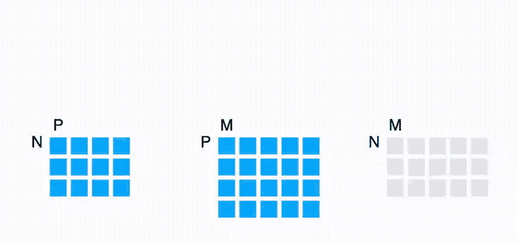
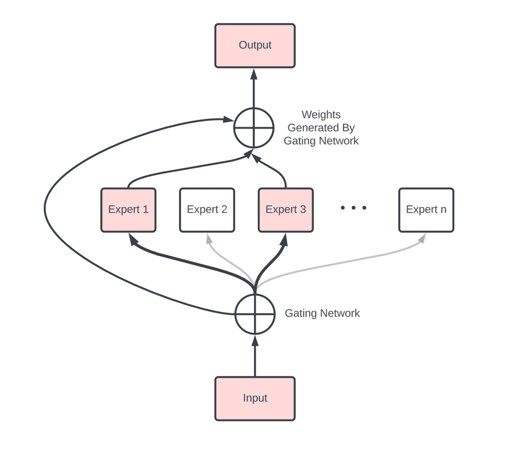
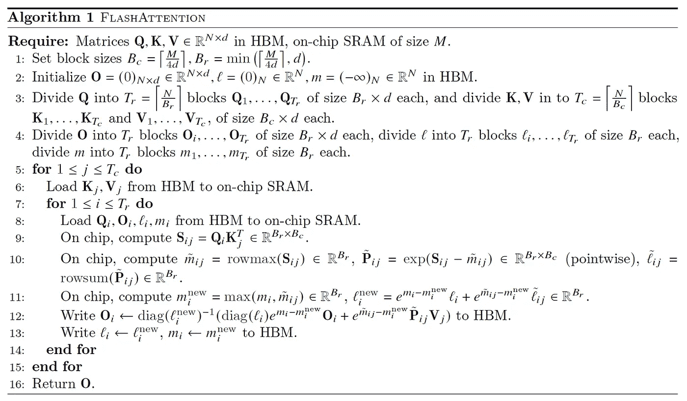

# 你需要了解的所有 Transformer 数学知识

> 原文：[`jax-ml.github.io/scaling-book/transformers`](https://jax-ml.github.io/scaling-book/transformers)

《如何扩展你的模型》第四部分 How To Scale Your Model (第三部分：分片 | 第五部分：训练)

在这里，我们将快速回顾 Transformer 架构，特别是如何计算 FLOPs、bytes 以及其他感兴趣的量。  ### 内容

点积计数

+   正向和反向 FLOPs

Transformer 计费全局 FLOPs 和参数计算其他数学知识

+   稀疏性和专家混合

+   梯度检查点

+   键值（KV）缓存

从这个部分你能学到什么？一些问题供你练习附录

+   附录 A：闪速注意力是如何工作的？

## 点积计数

让我们从以下形状的向量 \(x\)、\(y\) 和矩阵 \(A\)、\(B\) 开始：

\[\def \red#1{\textcolor{red}{#1}} \def \green#1{\textcolor{green}{#1}} \def \blue#1{\textcolor{blue}{#1}} \def \purple#1{\textcolor{purple}{#1}} \def \orange#1{\textcolor{orange}{#1}} \def \gray#1{\textcolor{gray}{#1}} \begin{array}{cc} \textrm{array} & \textrm{shape} \\ \hline x & \textrm{[P]} \\ y & \textrm{[P]} \\ A & \textrm{[N P]} \\ B & \textrm{[P M]} \\ \hline \end {array}\]

+   \(x \cdot y\) 的点积需要 \(P\) 个加法和乘法，总共 \(2P\) 个浮点运算。

+   矩阵-向量乘积 \(Ax\) 在 \(A\) 的行上执行 \(N\) 个点积，需要 \(2NP\) FLOPs。

+   矩阵-矩阵乘积 \(AB\) 对 \(B\) 的每一列执行矩阵-向量乘法，总共需要 \(2NPM\) FLOPs。

+   通常，如果我们有两个高维数组 \(C\) 和 \(D\)，其中一些维度是收缩的，而一些是批处理的。（例如 \(C[\blue{GH}IJ\red{KL}], D[\blue{GH}MN\red{KL}]\)）那么这种收缩的 FLOPs 成本是所有 \(C\) 和 \(D\) 维度的乘积的两倍，其中批处理和收缩维度只计算一次，（例如 \(2\blue{GH}IJMN\red{KL}\)）。注意，一个维度只有在乘数中同时出现时才进行批处理。（注意，如果没有收缩维度，这只是一个逐元素乘积，2 的因子不适用。）

\[\begin{array}{ccc} \textrm{Operation} & \textrm{FLOPs} & \textrm{Data} \\ \hline x \cdot y & 2P & 2P \\ A x & 2NP & NP + P \\ AB & 2NPM & NP + PM \\ [c_0,...,c_N] \cdot [d_0,...,d_N] & 2 \prod c_i \times \prod_{\substack{d_j \notin \blue{BATCH} \\ d_j \notin \red{CONTRACT}}} d_j & \prod c_i + \prod d_j \\ \hline \end {array}\]

请注意，对于一个矩阵-矩阵乘法，*计算*的规模是立方级 \(O(N³)\)，而数据传输的规模是二次级 \(O(N²)\) —— 这意味着随着我们扩大矩阵乘法的大小，达到计算饱和极限会变得*更容易*。这种情况非常不寻常，这也是我们为什么使用以矩阵乘法为主导的架构的主要原因之一——它们易于扩展！

<picture></picture>

### 正向和反向 FLOPs

在训练过程中，我们并不特别关心给定矩阵乘法的结果；我们真正关心的是它的导数。这意味着在反向传播过程中，我们执行了显著更多的浮点运算（FLOPs）。

如果我们想象 **B** 是一个更大网络中的一个矩阵，而 **A** 是我们的输入激活，**C = A B**，则损失 **L** 对 **B** 的导数由链式法则给出：

\[\frac{\partial L}{\partial B} = \frac{\partial L}{\partial C}\frac{\partial C}{\partial B} = A^T \left(\frac{\partial L}{\partial C}\right)\]

这是一个外积，需要 \(2NPM\) FLOPs 来计算（因为它在 \(N\) 维度上收缩）。同样，损失对 **A** 的导数是

\[\frac{\partial L}{\partial A} = \frac{\partial L}{\partial C}\frac{\partial C}{\partial A} = \left(\frac{\partial L}{\partial C}\right) B^T\]

由于 \(\frac{\partial L}{\partial C}\) 是一个大小为 \([N, M]\) 的（共）向量，因此它又是 \(2NPM\) FLOPs，用于计算（例如，正如 \(\frac{\partial L}{\partial C}\) 用于计算 \(\frac{\partial L}{\partial B}\) 上面的导数一样）。

将这些加起来，我们看到在训练过程中，我们总共有 \(6NPM\) FLOPs，而在推理过程中是 \(2NPM\)：正向传递中 \(2NPM\)，反向传递中 \(4NPM\)。由于 PM 是矩阵中的参数数量，这是著名的 \(6 * \text{num parameters} * \text{num tokens}\) 近似公式在训练期间变换器 FLOPs 的最简单形式：每个标记需要 \(6 * \text{num parameters}\) FLOPs。我们将在下面展示一个更准确的推导。

## 变换器会计

变换器是未来的。好吧，至少它们现在是。也许几年前，它们只是众多架构之一。但今天，了解架构的每一个细节都很有价值。我们不会重新介绍架构，但[这篇博客](https://jalammar.github.io/illustrated-transformer/)和[原始的变换器论文](https://arxiv.org/abs/1706.03762)可能是有用的参考资料。

下面是变换器解码器架构的基本图示：

<picture></picture>

**图示**：此图显示了标准 Transformer 的一层，从上到下流动。我们使用单字母约定来描述 Transformer 中数组的形状和布局，再次用红色显示收缩维度，用蓝色显示批量维度。在给定操作中，输入形状位于左上角，参数形状位于右上角，结果形状位于下方，例如，BTD 是门控 einsum 的输入形状，DF 是权重形状。

**注意 [门控 einsum]**：上面的图使用了一个“[门控 einsums](https://arxiv.org/abs/2002.05202)” ，其中我们将上投影矩阵分成两个矩阵（上面的 $W_\text{In1}$ 和 $W_\text{In2}$），它们的输出作为“门控函数”逐元素相乘。并非所有大型语言模型都使用这种方法，因此有时你会看到一个单一的 $W_\text{In}$ 矩阵，总 MLP 参数计数为 2DF 而不是 3DF。通常在这种情况下，D 和 F 将按比例放大以保持参数计数与 3 个矩阵的情况相同。话虽如此，LLAMA、DeepSeek 和许多其他模型都使用某种形式的门控 einsum。

**注意 2 [MHA 注意力]**：在自注意力中，T 和 S 是相同的，但对于交叉注意力，它们可能不同。在标准的多头注意力（MHA）中，N 和 K 是相同的，而对于[多查询注意力](https://arxiv.org/abs/1911.02150)（MQA），K=1，对于[分组 MQA](https://arxiv.org/abs/2305.13245)（GMQA），K 只需将 N 分割。

## 全局 FLOPs 和 Params 计算

对于以下内容，我们将计算每层的 FLOPs 以避免在所有地方都粘附 **L** 的因子。

### MLPs

Transformer 的 MLP 通常由 2 个输入矩阵乘法组成，它们是逐元素组合的，以及一个单独的输出矩阵乘法：

\[\begin{array}{ccc} \textrm{操作} & \textrm{训练 FLOPs} & \textrm{参数} \\ \hline \\ A[B,T,\red{D}] \cdot W_{in1}[\red{D}, F] & 6BTDF & DF \\[10pt] A[B,T,\red{D}] \cdot W_{in2}[\red{D}, F] & 6BTDF & DF \\[10pt] \sigma\left(A_{in1}\right)[B,T, F] * A_{in2}[B,T, F] & \gray{O(BTF)} \\[10pt] A[B,T,\red{F}] \cdot W_{out}[\red{F}, D] & 6BTDF & DF \\[10pt] \hline \\ & \approx 18BTDF & 3DF \end{array}\]

### 注意力

对于具有不同 **Q** 和 **KV** 头数的通用分组查询注意力情况，我们假设 **Q**、**K**、**V** 投影的头部维度 H 相等，并估计 **QKVO** 矩阵乘法的成本：

\[\begin{array}{ccc} \textrm{操作} & \textrm{训练 FLOPs} & \textrm{参数} \\ \hline \\ A[B,T,\red{D}] \cdot W_{Q}[\red{D}, N, H] & 6BTDNH & DNH \\[10pt] A[B,T,\red{D}] \cdot W_{K}[\red{D}, K, H] & 6BTDKH & DKH \\[10pt] A[B,T,\red{D}] \cdot W_{V}[\red{D}, K, H] & 6BTDKH & DKH \\[10pt] A[B,T,\red{N}, \red{H}] \cdot W_{O}[\red{N}, \red{H}, D] & 6BTDNH & DNH \\[10pt] \hline \\ & 12BTD(N+K)H & 2D(N+K)H \end{array}\]

点积注意力操作更为微妙，实际上是一个\(TH \cdot HS\)矩阵乘法，在\(B\)、\(K\)维度上批处理，然后是 softmax，再次是\(TS \cdot SH\)矩阵乘法，在\(B\)、\(K\)维度上批处理。我们用蓝色突出显示批处理维度：

\[\begin{array}{cc} \textrm{operation} & \textrm{train FLOPs} \\ \hline \\[3pt] Q[\blue{B}, T, \blue{K}, G, \red{H}] \cdot K[\blue{B}, S, \blue{K}, \red{H}] & 6BTSKGH = 6BTSNH \\[3pt] \textrm{softmax}_S \;\; L[B, T, S, K, G] & \gray{O(BTSKG) = O(BTSN)} \\[3pt] S[\blue{B}, T, \red{S}, \blue{K}, G] \cdot V[\blue{B}, \red{S}, \blue{K}, H] & 6BTSKGH = 6BTSNH \\[3pt] \hline \\ & \approx 12BTSNH = 12BT²NH \\ \end{array}\]

**注意[因果掩码]**：大多数最近的 Transformer 使用因果掩码而不是全双向注意力。在这种情况下，点积操作的有效 FLOPs 减少了 1/2 倍。为了在实际中实现这种减少，我们需要使用一个注意力内核，而不是简单的 einstein 求和。

### 其他操作

Transformer 中还有其他几个操作。层归一化相对便宜，在第一阶成本估计中可以忽略。还有一个巨大的（尽管不是每层的）反嵌入矩阵乘法。

\[\begin{array}{ccc} \textsf{operation} & \textsf{train FLOPs} & \textsf{params} \\ \hline \\ \textrm{layernorm}_D \;\; A[B,T,\red{D}] & \gray{O\left(BTD\right)} & \gray{D} \\[10pt] A[B,T,\red{D}] \cdot W_{unembed}[\red{D}, V] & 6BTDV & DV \\ \end{array}\]

### Transformer FLOPs 的一般经验法则

如果我们忽略短上下文训练中点积注意力的成本，那么所有层的总 FLOPs 为

\[\begin{align*} (18BTDF + 12BTD(N+K)H)L = 6 *BT * (3DF + 2D(N+K)H)L \\ = 6 * \textrm{num tokens} * \textrm{parameter count} \end{align*}\]

导致估算密集 Transformer FLOP 计数的著名经验法则，忽略注意力 FLOPs。（反嵌入是另一个简单的矩阵乘法，具有$6BSDV$ FLOPs 和$DV$参数，并遵循相同的经验法则。）

### 注意力与上下文长度成比例的成本

如果我们考虑上述点积注意力并假设 \(F=4D\), \(D=NH\)（这是典型的），且 \(N=K\)：

\[\small{\frac{\textrm{attention FLOPs}}{\textrm{matmul FLOPs}} = \frac{12BT²NH}{18BTDF + 24BTDNH} = \frac{12BT²D}{4*18 BTD² + 24 BTD²} = \frac{12BT²D}{96 BTD²} = \frac{T}{8D}}\]

所以，总结来说，**点积注意力 FLOPs 仅在 T>8D 的训练过程中才变得占主导地位**。对于 D ~ 8k，这将大约是 64K 个标记。这有些道理，因为这意味着随着 MLP 大小的增加，注意力 FLOPs 变得不那么关键。对于大型模型，注意力的二次成本实际上并不是长期上下文训练的巨大障碍。然而，对于较小的模型，即使是例如 Gemma-27B，D=4608，这意味着注意力在约 32k 序列长度时变得占主导地位。Flash Attention 也有助于减轻长上下文成本，我们将在附录 A 中简要讨论其工作原理。在附录 A 中讨论 Flash Attention 的工作原理。

## 杂项数学

### 稀疏性和混合专家

我们不能不简要讨论混合专家（MoE）模型[d-cite key="moe"]，它用一组独立的 MLP 替换了标准 Transformer 中的单个密集 MLP 块，这些 MLP 可以在之间动态路由。首先近似地，**MoE 只是一个具有每层 E 个 MLP 块的普通密集模型**，而不是只有一个。每个标记激活 k 个这样的专家，通常 k=2。这增加了参数计数为 O(E)，同时将每个标记激活的总参数数乘以 k，与密集版本相比。

<picture></picture>

**图**：一个具有 n 个专家的 MoE 层的示例。门控专家将每个标记路由到 k 个中，这些 k 个 MLP 的输出被求和。我们的参数计数是每个专家大小的 n 倍，但每个标记只使用 k 个。 [来源](https://deepgram.com/learn/mixture-of-experts-ml-model-guide)。

与密集模型相比，MoE 引入了新的通信，主要是两个 AllToAll（一个在 MoE 块之前，一个在之后），将标记路由到正确的专家，并将它们带回其设备。技术上，这只有在我们的数据或序列在专家相同的轴上分片时才会发生。然而，正如我们在上一节中看到的，每个 AllToAll 的成本仅为沿单个轴可比 AllGather 的四分之一（对于双向环形）。

### 梯度检查点

反向传播作为一种算法，以内存换取计算。而不是反向传递需要\(O(n_\text{layers}²)\) FLOPs，**它需要\(O(n_\text{layers})\)内存**，保存了正向传递过程中生成的所有中间激活。虽然这比二次计算要好，但在内存方面却非常昂贵：一个\(B * T=4M\)（每个批次 4M 个总标记），L=64，D=8192 且避免所有不必要的反向传递计算的模型，将不得不保存大约\(2 * 20 * B * T * D * L = 84TB\)的激活值。20 来自（大致上）计算 Transformer 图中每个中间节点，例如。

\[f(x) = \exp(g(x))\] \[\frac{df}{dx} = \exp(g(x)) \cdot \frac{dg}{dx}\]

为了避免重新计算，我们需要保存前向传递中的 \(g(x)\) 和 \(\exp(g(x))\)。为了避免保存这么多内存，我们可以选择只保存一些中间激活的分数。以下是我们使用的一些策略。

+   **块 remat**：只保存每个层的输入。这是我们使用最激进的策略，每个层只保存一个检查点，这意味着在上面的例子中我们只会保存 4.2TB。这迫使我们在反向传递中重复所有前向传递的 FLOPs，这意味着我们将 FLOPs 从 \(6ND\) 增加到大约 \(8ND\)。

+   **仅大矩阵乘法**：另一个简单的策略是只保存大矩阵乘法的输出。这让我们在反向传递中避免重新计算任何大矩阵乘法，但仍然需要重新计算其他激活函数和注意力的一部分。这将每层的 20 个 FLOPs 减少到更接近 7 个。

这绝不是全面的。当使用 JAX 时，这些通常由 `jax.remat`/`jax.checkpoint` 控制（你可以在这里阅读更多[信息](https://jax.readthedocs.io/en/latest/_autosummary/jax.checkpoint.html)）。

### 键值（KV）缓存

正如我们将在第七部分中看到的那样，LLM 推理有两个关键部分：预填充和生成。

+   **预填充**处理一个长提示并将其注意力激活保存在键值缓存（KV 缓存）中，用于生成，特别是注意力块中的键值投影。

+   **生成**批处理几个这些 KV 缓存，并从中采样标记。

每个 KV 缓存实际上是一个大小为 \([2, S, L, K, H]\) 的数组，其中 2 代表键和值。这相当大！在 int8 中，键值缓存的总量为 \(2SLKH\)。对于一个中等大小的模型，8k 上下文长度，64 层，\(KH = NH = D = 8192\)，这是 \(2 \cdot 8192 \cdot 64 \cdot 8192 = 8\text{GiB}\)。你可以看到为什么我们想要使用 \(K \ll N\) 的 GMQA。

## 你应该从这一节中学到什么？

+   Transformer 的整体参数和 FLOPs 计算相对简单，这里总结了，假设 MHA（具有批大小 B、词汇大小 V、长度为 T 的序列、D=d[model]、F=d[ff]）：

| 组件 | 每层的参数 | 每层的训练 FLOPs |
| --- | --- | --- |
| **MLP** | 3DF | 18BTDF |
| **Attention** | 4DNH | 24BTDNH + 12BT²NH |
| **其他** | D | BTD |
| **Vocab** | DV (total, not per-layer) | 12BTDV |

+   MLP 块的参数计数主导了总参数计数，只要序列长度 \(T < 8D\)，MLP 块也主导了 FLOPs 预算。

+   训练过程中的总 FLOPs 预算可以很好地近似为 \(6 \cdot \text{num_params} \cdot \text{num_tokens}\)，对于合理的上下文长度。

+   在推理过程中，我们的 KV 缓存大约是每个缓存 \(2 \cdot S \cdot L \cdot N \cdot H\)，尽管架构修改通常可以减少这个数值。

## 一些需要解决的问题

**问题 1:** 一个具有 $D=4096$, $F=4 \cdot D$, $V=32,000$, 和 $L=64$ 的模型有多少参数？其中有多少比例是注意力参数？每个标记的 KV 缓存有多大？*你可以假设 $N\cdot H=D$ 并且使用 int8 KVs 的多头注意力。*

点击此处查看答案。

1.  总参数量大约是 \(L \cdot (3DF + 4DNH + D) + 2DV\)。对于给定的数字，这是 \(64 \cdot (3 \cdot 4e3 \cdot 16e3 + 4 \cdot 4e3 \cdot 4e3 + 4e3) + 2 \cdot 4e3 \cdot 32e3 = 16e9\)，或 16B 参数。

1.  一般情况下，注意力参数与总参数的比例是 \(4DNH / (4DNH + 3DF) = 4D² / (4D² + 12D²) = 1/4\)。这意味着大约有 1/4 的参数用于注意力。

1.  每个标记，我们的 KV 缓存是 \(2 \cdot L \cdot N \cdot H = 2 \cdot 64 \cdot 4096\) 在 int8，这相当于 `512kB / token`。

**问题 2:** 在 `{‘X': 4, ‘Y': 8, ‘Z': 4}` 上执行 A[B[X], D[Y]] *[D] W[D[Y], F] 需要多少总的 FLOPs？每个 TPU 执行了多少 FLOPs？

点击此处查看答案。

该操作的“理论”总 FLOPs 是 \(2 \cdot B \cdot D \cdot F\)。然而，因为计算没有在 Z 维度上分片，我们实际上做了 Z 个额外的 FLOPs，这意味着总共有 \(2 \cdot B \cdot D \cdot F \cdot Z\) 个 FLOPs。由于计算在其他维度上进行了分片，因此每个设备的总计算量大约是 \(2 \cdot B \cdot D \cdot F / (X \cdot Y)\)。

**问题 3:** 执行 $A[I,J,K,L] * B[I,J,M,N,O] \rightarrow C[K,L,M,N,O]$ 操作涉及多少 FLOPs？

点击此处查看答案。

依照上述规则，我们有 I 和 J 作为收缩维度，K、L、M、N 和 O 作为非收缩维度。我们没有“批处理维度”，所以这仅仅是 \(2 \cdot I \cdot J \cdot K \cdot L \cdot M \cdot N \cdot O\)，所有轴的总和。如果我们有一个共享的轴，它只会被计算一次。

**问题 4:** 自注意力（忽略 Q/K/V/O 投影）的算术强度是多少？*将答案作为 Q 和 KV 长度 T 和 S 的函数给出。在什么上下文长度下注意力 FLOPs 受限？给定我们 TPUs 的 HBM 带宽，随着上下文长度的增加，绘制注意力相对于 FFW 块的有效相对成本图。

点击此处查看答案。

自注意力需要加载 \(Q\)、\(K\) 和 \(V\) 激活，然后计算 \(\text{softmax}(Q \cdot K) \cdot V\)，然后将结果写回 HBM。这将是使用 Flash Attention 完成的，因此这个数学有一些注意事项，但基本上在 bf16 自注意力执行

\[\text{Q[B,T,N,H]} \rightarrow_\text{reshape} \text{Q[B, T, K, G, H]} \cdot \text{K[B, S, K, H]} \rightarrow \text{O[B, T, S, K, G]}\] \[U=\text{softmax}_S(\text{O[B, T, S, K, G]})\] \[\text{U[B, T, S, K, G]} \cdot \text{V[B, S, K, H]} \rightarrow \text{X[B, T, K, G, H]}\]

因此，我们的总字节数是 \(2 * \text{sizeof}(Q) + 2 * \text{sizeof}(K 或 V)} = 4BTNH + 4BSKH = 4BHK * (TG + S)\)，总 FLOPs 是 \(4BTSNH + O(BTSN)\)，算术强度是 \(4BTSKGH / (4BHK * (TG + S))\)。

所以基本上，在预填充过程中，我们有 \(S=T\)，因此我们的算术强度为 \(4BT²KGH / 4BHKT \cdot (G+1) = TG/(G + 1) = O(T)\)。在生成过程中，\(T=1\)，所以我们有 \(4BSKGH / (4BHK \cdot (G + S)) = SG / (G + S) \rightarrow G\) 假设 \(S\) 非常大。根据你对问题的理解，在预填充或训练自注意力时，假设没有序列分片，在 \(S=240\) 时我们从未达到计算限制。在生成过程中，我们从未达到计算限制，因为 \(G\) 很小。然而，你可以看到，增加 \(G\) 会使我们更接近计算限制。

**问题 5：** 在什么序列长度下，自注意力 FLOPs 等于 QKVO 投影 FLOPs？

点击此处查看答案。

这纯粹是一个关于何时 \(24BTDNH == 12BT²NH\) 的问题。简化后我们得到 \(2D = T\)，例如，对于 \(D=4096\)，这将是 \(8192\)。这告诉我们，对于大多数合理的上下文长度，矩阵乘法浮点运算次数更多。

**问题 6：** 假设我们在正向传播过程中只保存每个 7 个主要矩阵乘法的输出（Q，K，V，O + 三个 FFW 矩阵）。在反向传播过程中我们需要多少额外的 FLOPs 来“重新计算”？

点击此处查看答案。

仅保存七个矩阵乘法输出（Q，K，V，O，W₁，W₂，W₃）意味着反向传播必须重新计算两个注意力矩阵乘法

\[QK^{\top} \quad\text{和}\quad \operatorname{softmax}(QK^{\top})V.\]

每个都是 $T \times T$ 的矩阵乘法，批处理在 $B$ 个序列和 $N$ 个头之间，所以额外的 FLOPs 是

\[4 \; B \, T^{2} \, N \, H.\]

所有其他重新计算的操作都是 $O(BTD)$。

**问题 7：** DeepSeek v3 表示它在 14.8T 个标记上，使用 2.79M H800 小时进行了训练 ([来源](https://arxiv.org/pdf/2412.19437v1))。鉴于它有 37B 个激活参数，他们大约实现了多少硬件利用率？*提示：注意他们使用了无结构稀疏性的 FP8 FLOPs。*

点击此处查看答案。

从规格说明 [这里](https://lenovopress.lenovo.com/lp1814.pdf)，我们找到了具有稀疏性的 3,026 TFLOPs/s 的 FP8 性能，或者通常是没有稀疏性的一半（`1.513e15` FLOPs/s）。2.79M H800 小时意味着 `2.79e6 * 1.513e15 * 60 * 60 = 1.52e25` 总 FLOPs。鉴于 37B 的激活参数数量，这次训练运行应该使用了大约 `6 * 37e9 * 14.8e12 = 3.3e24` FLOPs。这意味着 FLOPs 利用率大约是 `3.3e24 / 1.52e25 = 21.7%`。

**问题 8:** 专家混合（MoE）模型有 $E$ 个标准密集 MLP 块的副本，每个标记激活 $k$ 个这些专家。对于在 TPU v5e 上使用 int8 权重的 MoE，需要多少个标记的批大小才能达到计算限制？对于具有 256 个（路由）专家和 $k=8$ 的 DeepSeek，这个数字是多少？

点击这里查看答案。

因为每个专家有 $E$ 个副本，在 int8 中，我们需要加载 $E \cdot D \cdot F$ 字节。因为每个标记激活 $k$ 个专家，所以我们有 $2\cdot k \cdot B \cdot D \cdot F$ FLOPs。为了使用 bfloat16 FLOPs 达到计算限制，我们需要超过 240 的算术强度，这发生在 $(2\cdot k \cdot BDF) / EDF > 240$ 或 $k \cdot B / E > 120$ 时。

因此，我们需要 $B > 120 \cdot E / k$ 来达到计算限制。对于 DeepSeek，这给我们 $B > 120 \cdot 256 / 8 = 3840$。这在生成时是一个非常大的批大小。

### 第四部分到此结束！对于第五部分（关于 Transformer 训练的扩展），点击这里！

## 附录

### 附录 A：Flash Attention 是如何工作的？

将 Transformers 扩展到非常长的上下文的传统反对意见是，注意力的 FLOPs 和内存使用量与上下文长度成二次关系。虽然注意力 QK 乘积的形状是 $[B, S, T, N]$，其中 B 是批大小，S 和 T 是 Q 和 K 序列维度，N 是头数，但这个说法有一些严重的警告：

1.  正如我们在第四部分中提到的，尽管这是二次的，但注意力 FLOPs 只有在 \(S > 8 \cdot D\) 时才占主导地位，尤其是在训练期间，单个注意力矩阵的内存与所有生活在内存中的权重和激活检查点相比非常小，尤其是在分片的情况下。

1.  我们不需要实现完整的注意力矩阵来计算注意力！我们可以计算局部总和和最大值，并避免实现超过数组一小部分的内容。尽管总的 FLOPs 仍然是二次的，但我们极大地减少了内存压力。

第二个观察结果首先由 [Rabe 等人 2021](https://arxiv.org/abs/2112.05682) 提出，后来在 [Flash Attention 论文](https://arxiv.org/abs/2205.14135)（Dao 等人 2022）中提出。基本思想是分块计算注意力，其中我们在 K/V 块中计算局部 softmax 和一些辅助统计信息，然后将它们传递到下一个块，该块将它们与其局部块结合。具体来说，我们计算

1.  **M:** 在序列维度上 \(q \cdot k\) 的运行最大值

1.  **O:** 在序列维度上的运行全注意力 softmax

1.  **L:** 运行分母 \(\sum_i (q \cdot k_i - \text{running max})\)

使用这些信息，我们只需常数内存量就能计算新的最大值、新的运行总和和新的输出。为了简要描述这是如何工作的，注意力大致是这样的操作：

\[\text{Attn}(Q, K, V) = \sum_i \frac{\exp(Q \cdot K_i - \max_j Q \cdot K_j) V_i}{\sum_l \exp(Q \cdot K_l - \max_j Q \cdot K_j)}\]

为了数值稳定性，减去最大值，并且可以添加而不影响结果，因为 \(\sum_i \exp(a_i + b) = \exp(b) \sum \exp(a)\)。仅看上面的分母，如果我们想象有两个连续的键向量块，\(K¹\)和\(K²\)，并且我们为每个块计算局部 softmax 总和\(L¹\)和\(L²\)，

\[L¹ = \sum_i \exp(Q \cdot K_i¹ - \max_j Q \cdot K_j¹)\] \[L² = \sum_i \exp(Q \cdot K_i² - \max_j Q \cdot K_j²)\]

然后，我们可以通过使用以下方法将这两个块合并为完整的 softmax 总和

\[L^\text{combined} = \exp(M¹ - \max(M¹, M²)) \cdot L¹ + \exp(M² - \max(M¹, M²)) \cdot L²\]

其中

\[M¹ = \max_j Q \cdot K_j¹ \text{ 和 } M² = \max_j Q \cdot K_j²\]

这也可以用于完整的 softmax，为我们提供累积任意大的 softmax 总和的方法。以下是 Flash Attention 论文中的完整算法。

<picture></picture>

从硬件角度来看，这使得我们可以将我们的 Q 块放入 VMEM（上述算法中称为片上 SRAM）中，因此我们只需在每次迭代中加载 KV 块，从而降低算术强度。我们还可以在 VMEM 中保留运行统计信息。

最后一个值得强调的微妙之处是用于使 Flash VJP（逆模式导数）计算对训练实用的注意力 softmax 属性。如果我们定义一个中间 softmax 数组为：

\[S_{ij} = \frac{e^{\tau q_i \cdot k_j}}{\sum_k e^{\tau q_i \cdot k_j}}\]

在注意力中，我们从逆模式的*dO*和*V*数组中获得*dS*：

\[dS_{ij} = dO_{id} \cdot_d V_{jd} = \sum_d dO_{id} V_{jd}\]

在将此梯度反向传播到 Q 和 K 的过程中

\[d(q_i \cdot k_j) = (dS_{ij} - S_{ij} \cdot_j dS_{ij}) S_{ij}\]

我们利用一个恒等式，允许我们将沿着大键**长度**维度的收缩与沿着特征**深度**维度的局部收缩进行交换。

\[\begin{align*} S_{ij} \cdot_j dS_{ij} &= \sum_j \frac{e^{\tau q_i \cdot k_j}}{\sum_k e^{\tau q_i \cdot k_k}} \sum_d dO_{id} V_{jd} \\ &= \sum_d dO_{id} \sum_j \frac{e^{\tau q_i \cdot k_j}}{\sum_k e^{\tau q_i \cdot k_k}} V_{jd} \\ &= \sum_d dO_{id} O_{id} \\ &= dO_{id} \cdot_d O_{id} \end{align*}\]

这种替换对于能够实现 VJP 的序列块**局部**计算至关重要，并使像环注意力这样的进一步巧妙分片方案成为可能。  ### 杂项

^*在 Google DeepMind 完成的工作，现在在 MatX。

### 引用

在学术环境中进行归属时，请引用此工作：

```py
 Austin et al., "How to Scale Your Model", Google DeepMind, online, 2025. 
```

或者作为一个 BibTeX 条目：

```py
 @article{scaling-book,
      title = {How to Scale Your Model},
      author = {Austin, Jacob and Douglas, Sholto and Frostig, Roy and Levskaya, Anselm and Chen, Charlie and Vikram, Sharad
      and Lebron, Federico and Choy, Peter and Ramasesh, Vinay and Webson, Albert and Pope, Reiner},
      publisher = {Google DeepMind},
      howpublished = {Online},
      note = {Retrieved from https://jax-ml.github.io/scaling-book/},
      year = {2025}
    } 
``` 
