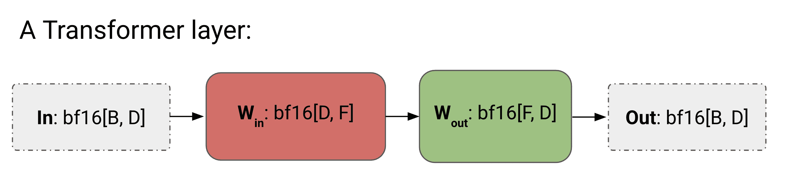
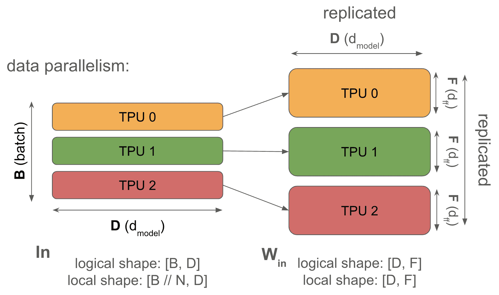
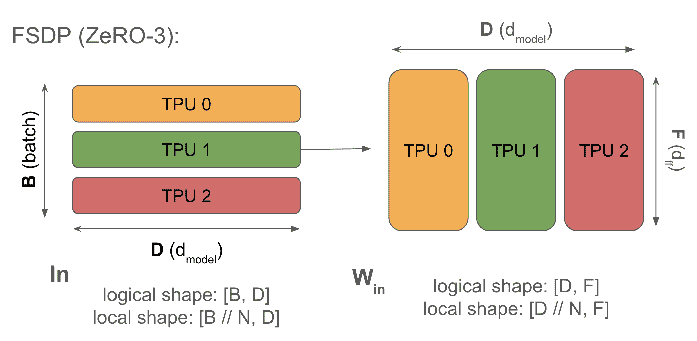
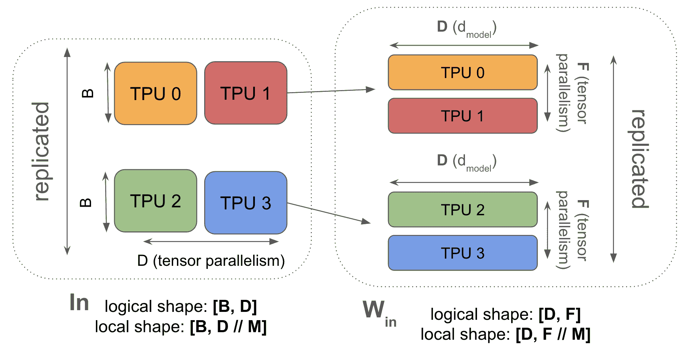
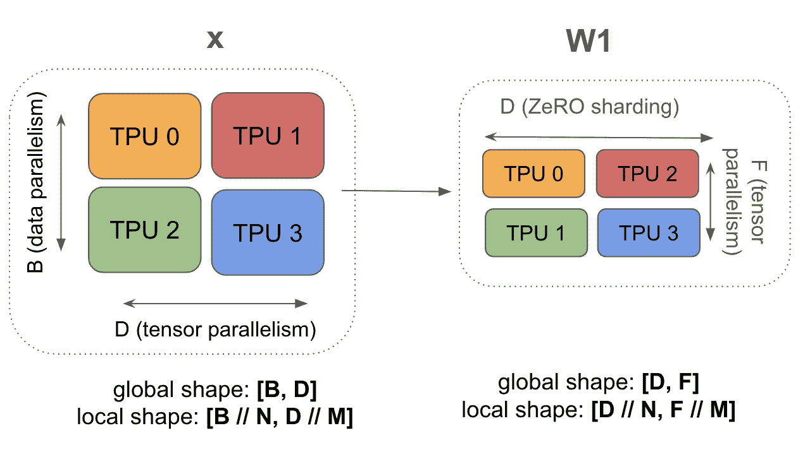
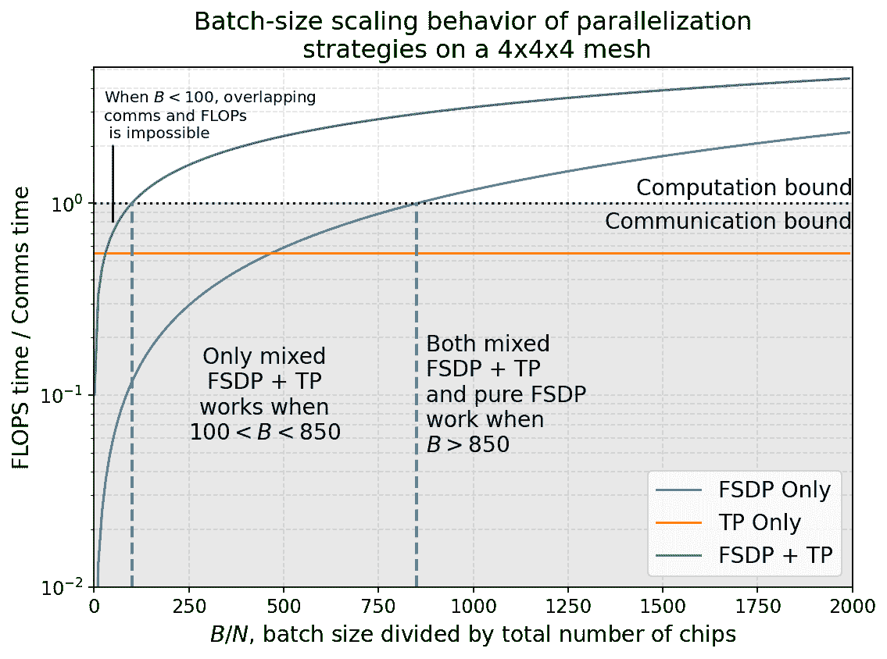
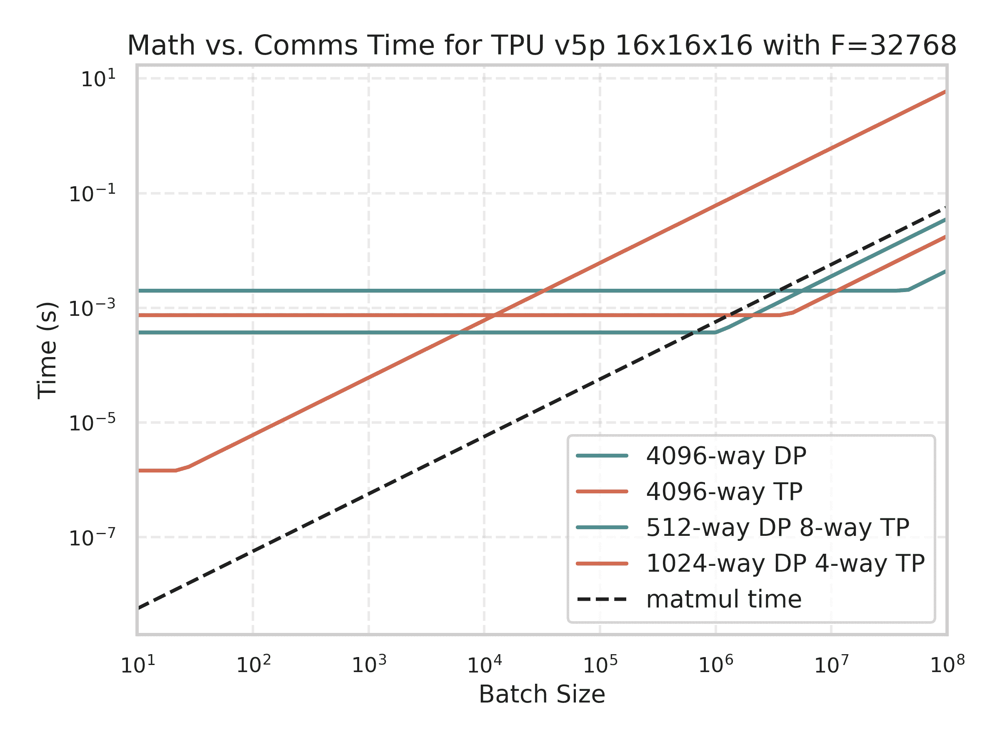
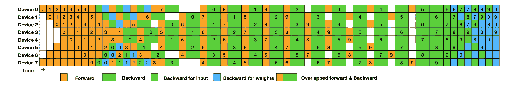

# 如何并行化 Transformer 以进行训练

> 原文：[`jax-ml.github.io/scaling-book/training`](https://jax-ml.github.io/scaling-book/training)

《如何缩放您的模型》第五部分 How To Scale Your Model (第四部分：Transformer | 第六部分：训练 LLaMA)

在此，我们讨论了在 LLM 训练过程中使用的四种主要并行方案：数据并行、全分片数据并行（FSDP）、张量并行和流水线并行。对于每一种方案，我们计算在何时通信成为瓶颈。  ### 内容

我们所说的“缩放”是什么意思？

+   数据并行

+   全分片数据并行（FSDP）

+   张量并行

+   结合 FSDP 和张量并行

+   流水线

+   跨 Pod 缩放

LLM 在 TPU 上训练的启示一些需要解决的问题附录

+   附录 A：推导反向传播通信

## 我们所说的“缩放”是什么意思？

“模型缩放”的目标是在保持吞吐量成比例、线性增加的同时，能够增加用于训练或推理的芯片数量（我们称之为 *强缩放*）。单个芯片的性能取决于内存带宽和浮点运算（FLOPs）之间的权衡，而集群级别的性能则取决于通过重叠有用的 FLOPs 来隐藏芯片间的通信。这并不简单，因为增加芯片数量会增加通信负载，同时减少我们可以用来隐藏通信的每个设备的计算量。正如我们在 第三部分 中所看到的，分片矩阵乘法通常需要昂贵的 AllGathers 或 ReduceScatters，这可能会阻止 TPUs 进行有用的工作。本节的目标是找出这些操作何时变得 *过于昂贵*。

在本节中，我们将讨论四种常见的并行方案：（纯）**数据并行**、**全分片数据并行**（FSDP / ZeRO 分片）、**张量并行**（也称为模型并行）以及（简要地）**流水线并行**。对于每一种方案，我们将展示我们承担的通信成本以及这种成本何时开始成为计算成本的瓶颈。我们将重点关注通信界限——因为虽然内存容量限制很重要，但在使用重材料化（激活检查点）和预训练期间大量芯片时，它们通常不会对我们构成限制。我们也不会在这里讨论 MoE 的专家并行——这大大扩展了设计空间，只讨论密集 Transformer 的基本案例。对于本节，你可以仅关注芯片间的通信成本，因为只要我们有足够大的单个芯片批量大小，从 HBM 到 MXU 的数据传输就已经与计算重叠了。

我们将使用以下符号来简化本节中的计算。

| 符号 | 意义（模型参数） |
| --- | --- |
| D | **d**[model]（隐藏维度/残差流维度） |
| F | **d**[ff]（前馈维度） |
| B | 批量维度（批中标记的数量；总数，而不是每个设备的数量） |
| T | 序列长度 |
| L | 模型中的层数 |
| 符号 | 意义（硬件特性） |
| --- | --- |
| C | 每个芯片的 FLOPS/s |
| W | 网络带宽（双向，通常下标，例如 $W_{\text{ici}}$ 或 $W_{\text{dcn}}$） |
| X | 沿着网格轴 X 的芯片数量 |
| Y | 沿着替代网格轴的芯片数量，标记为 Y |
| Z | 沿着第三个网格轴的芯片数量，标记为 Z |

为了简化起见，**我们将将 Transformer 近似为 MLP 块的堆叠**——正如我们在第四部分中看到的那样，对于较大的模型，注意力占 FLOPs 的比例相对较小。我们还将忽略门控矩阵乘法，使得每一层的结构如下所示：

<picture></picture>

**图：**一个简化的 Transformer 层。我们将每个 FFW 块视为两个矩阵 **W[in]**：`bf16[D, F]`（上投影）和 **W[out]**：`bf16[F, D]`（下投影），输入为 **In**：`bf16[B, D]`。

以下是我们的小型 Transformer（无并行）的完整算法。

**正向传播：**需要计算 Loss[B]

1.  Tmp[B, F] = In[B, D] *[D] W[in][D, F]

1.  Out[B, D] = Tmp[B, F] *[F] W[out][F, D]

1.  损失[B] = …

**反向传播：**需要计算 dW[out][F, D]，dW[in][D, F]

1.  dOut[B, D] = …

1.  dW[out][F, D] = Tmp[B, F] *[B] dOut[B, D]

1.  dTmp[B, F] = dOut[B, D] *[D] W[out][F, D]

1.  dW[in][D, F] = In[B, D] *[B] dTmp[B, F]

1.  dIn[B, D] = dTmp[B, F] *[F] W[in][D, F]（用于前一层）

我们提供这些算法以供比较，其中加入了通信。

这里是我们将要讨论的 4 种并行方案。每种方案都可以被视为由上图中的 **In**、**W[in]**、**W[out]** 和 **Out** 的分片唯一定义。

**1. 数据并行性：** *激活沿批量分片，参数和优化器状态在每个设备上复制。通信仅在反向传播期间发生。*

\[\text{In}[B_X, D] \cdot_D W_\text{in}[D, F] \cdot_F W_\text{out}[F, D] \rightarrow \text{Out}[B_X, D]\]

**2. 完全分片数据并行性（FSDP 或 ZeRO-3）：** *激活沿批量分片（类似于纯数据并行性），参数沿相同的网格轴分片并在正向传播中使用前即时 AllGather。优化器状态也沿批量分片。减少重复内存。*

\[\text{In}[B_X, D] \cdot_D W_\text{in}[D_X, F] \cdot_F W_\text{out}[F, D_X] \rightarrow \text{Out}[B_X, D]\]

**3. 张量并行性（也称为 Megatron 分片或模型并行性）：** *激活沿 D（$d_\text{model}$）分片，参数沿 F（$d_{ff}$）分片。在每个块前后进行 AllGather 和 ReduceScatter 激活。与 FSDP 兼容。*

\[\text{In}[B, D_Y] \cdot_D W_\text{in}[D, F_Y] \cdot_F W_\text{out}[F_Y, D] \rightarrow \text{Out}[B, D_Y]\]

**4. 管道并行性：** *权重沿层维度分片，激活沿层维度微批处理并滚动。管道阶段之间的通信最小（只需移动激活一次）。为了滥用符号：*

\[\text{In}[L_Z, B, D][i] \cdot_D W_\text{in}[L_Z, D, F][i] \cdot_F W_\text{out}[L_Z, F, D][i] \rightarrow \text{Out}[L_Z, B, D][i]\]

### 数据并行性

**语法：** \(\text{In}[B_X, D] \cdot_D W_\text{in}[D, F] \cdot_F W_\text{out}[F, D] \rightarrow \text{Out}[B_X, D]\)

当你的模型即使是在很小的批量大小（>240 个标记，以便成为计算限制）下也能适应单个芯片时，**你应该始终使用简单的数据并行性。** 纯数据并行性将我们的激活分散到任意数量的 TPUs 上，只要 TPUs 的数量小于我们的批量大小。正向传播不涉及任何通信，但在每一步结束时，**每个 TPU 都对其局部梯度执行 AllReduce 操作以同步它们，然后更新参数。**

<picture></picture>

**图：** 纯数据并行性的示意图（正向传播）。我们的激活（左侧）在批量维度上完全分片，我们的权重完全复制，因此每个 TPU 都有一个权重的相同副本。这意味着我们的权重总内存增加了 N 倍，但在正向传播中不需要通信。

这里是正向和反向传播的完整算法。我们滥用符号，将 dL/dOut 写作 dOut，纯粹是为了简洁。

**纯数据并行性算法：**

**正向传播：** 需要计算 Loss[B[X]]

1.  Tmp[B[X], F] = In[B[X], D] *[D] W[in][D, F]

1.  Out[B[X], D] = Tmp[B[X], F] *[F] W[out][F, D]

1.  Loss[B[X]] = …

**反向传播**：需要计算 dW[out][F, D]，dW[in][D, F]

1.  dOut[B[X], D] = …

1.  dW[out][F, D] {U[X]} = Tmp[B[X], F] *[B] dOut[B[X], D]

1.  dW[out][F, D] = **AllReduce**(dW[out][F, D] {U[X]}) (*不在关键路径上，可以异步执行*)

1.  dTmp[B[X], F] = dOut[B[X], D] *[D] W[out][F, D]

1.  dW[in][D, F] {U[X]} = In[B[X], D] *[B] dTmp[B[X], F]

1.  dW[in][D, F] = **AllReduce**(dW[in][D, F] {U[X]}) (*不在关键路径上，可以异步执行*)

1.  dIn[B[X], D] = dTmp[B[X], F] *[F] W[in][D, F] (*用于前一层*)

我们忽略损失函数的细节，并简写 $\text{Tmp} = W_\text{in} \cdot \text{In}$。注意，尽管我们的最终损失是平均 **AllReduce**(Loss[B[X]]), 我们只需要在反向传播时计算平均权重梯度时的 AllReduce。

注意，正向传播没有通信——**所有操作都在反向传播中完成**！反向传播还有一个很好的特性，即 AllReduce 不在“关键路径”上，这意味着每个 AllReduce 都可以在方便的时候执行，不会阻止你执行后续操作。如果通信成本超过我们的总计算成本，整体通信成本 *仍然可能成为瓶颈*，但从实现的角度来看，它要宽容得多。我们将看到模型/张量并行没有这个特性。

**为什么这样做？** 纯数据并行通过将我们的激活分布在批量维度上，减少了激活内存压力，使我们能够几乎任意地增加批量大小，只要我们有更多的芯片来分割批量维度。特别是在训练期间，我们的激活往往占主导地位，这非常有帮助。

**为什么不这样做？** 纯数据并行对减少模型参数或优化器状态带来的内存压力没有作用，这意味着纯数据并行对于有趣的大规模模型很少有用，在这些模型中，我们的参数加优化器状态不适合单个 TPU。为了有一个规模感，如果我们用 bf16 参数和 Adam 优化器状态（fp32）进行训练Adam 存储参数，一阶和二阶累加器。由于参数在 bfloat16 中，优化器状态在 float32 中，这给我们每个参数`2 + 8 = 10`字节。，我们可以适应的最大模型有 \(\text{TPU memory} / 10\) 个参数，例如，在一个 TPUv5p 芯片上，有 96GB 的 HBM 和纯数据并行，这大约是 9B 个参数。

**要点**：我们可以用 Adam 和纯数据并行训练的最大模型是 \(\text{num_params} = \text{HBM per device} / 10\)。对于 TPU v5p，这大约是 9B 个参数。注意，这不包括梯度检查点，所以这实际上并不实用。这是一个绝对的下限，批量大小为 1 个标记。

*为了使这在对真实模型进行训练时有用，我们至少需要部分地分割模型参数或优化器.*

**何时我们成为通信瓶颈？** 如上所示，每层有两个 AllReduce，每个大小为$2DF$（对于 bf16 权重）。何时数据并行使我们成为通信瓶颈？

如上表所示，设 $C$ = 每片芯片的 FLOPs，$W_{\text{ici}}$ = **双向**网络带宽，$X$ = 批量划分的碎片数量<脚注>我们假设这种划分是在 ICI 网格上进行的，因此相关的网络带宽是$W_\text{ici}$</脚注>。让我们计算执行相关矩阵乘法所需的时间$T_\text{math}$和所需的通信时间$T_\text{comms}$。由于这种并行方案在正向传递中不需要通信，我们只需计算反向传递中的这些量。

*通信时间:* 从前面的部分我们知道，在 1D 网格中执行 AllReduce 所需的时间只取决于要执行 AllReduce 的数组的总字节数和 ICI 带宽$W_\text{ici}$；具体来说，AllReduce 时间是$2 \cdot \text{total bytes} / W_\text{ici}$。由于我们需要对$W_\text{in}$和$W_\text{out}$都进行 AllReduce，因此每层有 2 个 AllReduce。每个 AllReduce 都是一个权重矩阵，即$DF$个参数的数组，或$2DF$字节。将这些全部加起来，单个层中 AllReduce 的总时间是

\[\begin{align} T_\text{comms} &= \frac{2 \cdot 2 \cdot 2 \cdot D \cdot F}{W_\text{ici}}. \\ \end{align}\]

*矩阵乘法时间:* 每层在正向传递中包含两个矩阵乘法，或者在反向传递中包含四个矩阵乘法，每个矩阵乘法都需要$2(B/X)DF$ FLOPs。因此，对于反向传递中的单个层，我们有

\[\begin{align} T_\text{math} &= \frac{2 \cdot 2 \cdot 2 \cdot B \cdot D \cdot F}{X \cdot C} \\ \end{align}\]

由于我们重叠，每层的总时间是这两个量中的最大值：

\[\begin{aligned} T &\approx \max(\frac{8 \cdot B \cdot D \cdot F}{X \cdot C}, \frac{8 \cdot D \cdot F}{W_\text{ici}}) \\ T &\approx 8 \cdot D \cdot F \cdot \max(\frac{B}{X \cdot C}, \frac{1}{W_\text{ici}}) \end{aligned}\]

当$T_\text{math}/T_\text{comms} > 1$时，或者当

\[\begin{align} \frac{B}{X} > \frac{C}{W_\text{ici}}. \end{align}\]

结果是，为了在数据并行的情况下保持计算密集型，我们需要每个设备的批量大小$B / X$超过 ICI 的操作强度$C / W_\text{ici}$。这最终是这样一个事实的结果，即计算时间与每个设备的批量大小成比例，而通信时间与这个量无关（因为我们正在传输模型权重）。注意$B > C/W_\text{ici}$条件与单设备计算密集型规则$B > 240$的相似性；在那样的情况下，规则来自计算时间与批量大小成比例，而数据传输大小（在$B \ll F, D$范围内）与批量大小无关。

让我们用一些实际数字来感受一下规模。对于 TPUv5p，1D 数据并行在 ICI 上 `C=4.6e14` 和 `W=2 * 9e10`，因此**我们的每个芯片的批处理大小至少必须是 2,550，以避免成为通信瓶颈**。由于我们可以在多个轴上进行数据并行，如果我们将 TPUv5p pod 的所有三个轴都用于纯数据并行，我们将带宽 $W_\text{ici}$ 增加 3 倍，并且可以将批处理大小降低到每个 TPU 850 或每个 pod（8960 个芯片）7.6M 个标记！**这告诉我们，很难仅通过纯数据并行成为瓶颈！**

**关于上下文并行[注解]：** 在本节中，$B$ 总是指总批处理大小**在标记中**。显然，然而，我们的批处理由许多不同的序列组成，那么这是如何工作的呢？就 MLP 而言，**标记就是标记**！它们属于同一序列还是两个不同的序列无关紧要。因此，我们可以在批处理和序列维度上自由地进行数据并行：我们称之为上下文并行或序列并行，但你可以将其视为另一种数据并行。注意，由于我们在序列间进行一些计算，所以它比 MLP 更复杂，但这可以通过在注意期间收集 KVs 或 Qs 并仔细重叠 FLOPs 和 comms（通常使用所谓的“环形注意”）来处理。在本节中，我们将完全忽略序列维度，并假设一定量的批处理或序列并行。

**关于多个网格轴的注解：** 我们应该迅速指出多个轴如何影响可用带宽。当我们为给定的并行策略使用多个网格轴时，我们获得更多的带宽。

+   **定义：** $M_X$ ($M_Y$, $M_Z$, 等.) 是一个给定的并行策略跨越的硬件网格轴的数量。

+   **效果（带宽限制）：** 使用 $M$ 个轴提供了（约 $M$ 倍）的总链路带宽，因此集体时间与 $1/M_X$ 成正比。

### 完全分片数据并行（FSDP）

**语法：** \(\text{In}[B_X, D] \cdot_D W_\text{in}[D_X, F] \cdot_F W_\text{out}[F, D_X] \rightarrow \text{Out}[B_X, D]\)

完全分片数据并行（通常称为 FSDP 或 ZeRO 分片<sup><a id="zero" href="#zero">[1]</a></sup>）将模型优化器状态和权重分散到数据并行分片中，并按需高效地收集和分散它们。**与纯数据并行相比，FSDP 大幅减少了每个设备的内存使用，并在反向传播 FLOPs 上节省了资源，同时开销非常小。**

<picture></picture>

**图：**FSDP 沿着数据维度分片 Win 的收缩维度和 Wout 的输出维度。这减少了内存需求，但（从第三部分）要求我们在执行矩阵乘法之前收集 W 的权重。请注意，激活（左侧）<it>不是沿着收缩维度分片</it>，这正是我们进行收集的原因。**注意，我们的权重优化器状态同样沿着收缩维度进行分片。**

你会记得（从第三部分），AllReduce 可以被分解为 AllGather 和 ReduceScatter。这意味着，对于标准数据并行，我们不需要对全量梯度进行全量 AllReduce，而可以在芯片间分片权重和优化器状态，在正向传播的每一层进行 AllGather，在反向传播时无需额外成本地对权重进行 ReduceScatter。

这里是 FSDP 的完整算法。

**全分片数据并行（FSDP）：**

**正向传播：**需要计算 Loss[B[X]]

1.  W[in][D, F] = **AllGather**(W[in][D[X], F]) (*不在关键路径上，可以在前一层进行*)

1.  Tmp[B[X], F] = In[B[X], D] *[D] W[in][D, F] (*现在可以丢弃 W[in][D, F]了*)

1.  W[out][F, D] = **AllGather**(W[out][F, D[X]]) (*不在关键路径上，可以在前一层进行*)

1.  Out[B[X], D] = Tmp[B[X], F] *[F] W[out][F, D]

1.  Loss[B[X]] = …

**反向传播：**需要计算 dW[out][F, D[X]], dW[in][D[X], F]

1.  dOut[B[X], D] = …

1.  dW[out][F, D] {U[X]} = Tmp[B[X], F] *[B] dOut[B[X], D]

1.  dW[out][F, D[X]] = **ReduceScatter**(dW[out][F, D] {U[X]}) (*不在关键路径上，可以异步进行*)

1.  W[out][F, D] = **AllGather**(W[out][F, D[X]]) (*可以提前进行*)

1.  dTmp[B[X], F] = dOut[B[X], D] *[D] W[out][F, D] *(这里可以丢弃 W[out][F, D]*) 

1.  dW[in][D,F] {U[X]} = dTmp[B[X], F] *[B] In[B[X], D]

1.  dW[in][D[X], F] = **ReduceScatter**(dW[in][D, F] {U[X]}) *(不在关键路径上，可以异步进行)*

1.  W[in][D, F] = **AllGather**(W[in][D[X], F]) (*可以提前进行*)

1.  dIn[B[X], D] = dTmp[B[X], F] *[F] W[in][D, F] (*用于前一层的计算) (这里可以丢弃 W[in][D, F]*)

这也被称为“ZeRO Sharding”，来源于“ZeRo Overhead sharding”，因为我们不执行任何不必要的计算或存储任何不必要的状态。ZeRO-{1,2,3}分别用来指代以这种方式对优化器状态、梯度和权重进行分片。由于所有这些都具有相同的通信成本<footnote>技术上，FSDP 在正向传播中增加了纯 DP 没有的通信，但这与反向传播的比例相同，因此它应该不会对通信上限产生影响。关键在于 ZeRO-3 将反向传播的全量 AllReduce 转换为 AllGather 和 ReduceScatter，它们的总通信量相同。</footnote>，我们基本上总是可以进行 ZeRO-3 分片，将参数、梯度和优化器状态跨设备分片。

**我们为什么要这样做呢？** 标准数据并行涉及大量的重复工作。每个 TPU AllReduce 都会计算完整的梯度，然后更新完整的优化器状态（所有 TPUs 上相同的工作），然后更新参数（再次，完全重复）。对于 ZeRO 分片（梯度/优化器状态的分片），你可以使用 ReduceScatter 替代 AllReduce，只更新你的优化器状态分片，更新参数的一个分片，然后根据需要 AllGather 参数以进行正向传递。

**我们何时会因通信而成为瓶颈？** 由于反向传递中的每个 AllReduce 都变成了 AllGather + ReduceScatter，我们的相对 FLOPs 和通信成本与纯数据并行完全相同。回想一下，AllReduce 是通过 AllGather 和 ReduceScatter 实现的，每个都具有一半的成本。这里我们模拟正向传递，因为它具有与反向传递相同的 FLOPs 到通信的比率：

\[\begin{aligned} T_\text{math} &= \frac{2 \cdot 2 \cdot B \cdot D \cdot F}{X \cdot C} \\ T_\text{comms} &= \frac{2 \cdot 2 \cdot D \cdot F}{W_\text{ici}} \\ T &\approx \max\left(\frac{4 \cdot B \cdot D \cdot F}{X \cdot C}, \frac{4 \cdot D \cdot F}{W_\text{ici}}\right) \\ T &\approx 4 \cdot D \cdot F \cdot \max\left(\frac{B}{X \cdot C}, \frac{1}{W_\text{ici}}\right) \end{aligned}\]

因此，与纯数据并行一样，当 \(B / X > C / W_\text{ici}\) 时，即当每个设备的批量大小 $B/X$ 超过“ICI 操作强度” $C/W_\text{ici}$（v5p 为 `4.59e14 / 1.8e11 = 2550`）时，我们处于计算限制状态。这对我们来说是个好消息，因为这意味着如果我们的每个设备的批量大小足够大，以至于纯数据并行处于计算限制状态，我们就可以——无需担心离开计算限制状态——简单地升级到 FSDP，从而节省大量的参数和优化器状态内存！尽管我们确实需要在正向传递中添加通信，但这种成本微不足道，因为它只是与正向传递的 FLOPs 重叠。

**总结：** 当每个设备的批量大小小于 $2550 / M_X$，其中 $M_X$ 是网格轴的数量时，FSDP 和纯数据并行在 TPUv5 上都会受到带宽限制。

例如，DeepSeek-V2（最近唯一发布其训练批量大小信息的强大模型之一）使用了大约 ~40M 个标记的批量大小。**这将使我们能够扩展到大约 47,000 个芯片，或者大约 5 个 TPUv5 pod，在达到带宽限制之前。**

对于训练了大约 `6.3e24 (15e12 * 70e9 * 6)` FLOPs 的 LLaMA-3 70B，我们可以将 16M 个标记的批量大小分配到大约 `16e6 / (2550 / 3) = 18,823` 个芯片上（大约 2 个 pod 的 8960 个芯片），每个芯片有 `4.59e14` FLOPs，以 50% 的峰值 FLOPs 利用率运行（通常称为 MFU），**大约在 17 天内完成训练**。还不错！但让我们探索如何做得更好。

**关于关键批次大小的说明**: 有些令人费解的是，随着我们的总批次大小（在芯片数量固定的情况下）减小，我们成为更多通信瓶颈（通信瓶颈）。数据并行和 FSDP 让我们能够扩展到任意多的芯片，只要我们能够不断增加我们的批次大小！然而，在实践中，随着批次大小的增加，我们往往会看到训练的回报递减，因为我们的梯度几乎无噪声。我们有时也会看到训练不稳定。因此，在“无限计算环境”中寻找最佳分片方案的博弈通常从一个固定的批次大小开始，这个批次大小由缩放定律确定，并且有一个已知的（大的）芯片数量，然后目标是找到一个分区，使我们能够将这个小批次大小适应这么多芯片。

### 张量并行

**语法:** \(\text{In}[B, D_Y] \cdot_D W_\text{in}[D, F_Y] \cdot_F W_\text{out}[F_Y, D] \rightarrow \text{Out}[B, D_Y]\) (我们使用 \(Y\) 最终与 FSDP 结合)

在完全分片的数据并行 AllReduce 中，我们在芯片之间移动权重。我们还可以分片模型的正向维度，并在层中移动激活——这被称为“1D 模型并行”或 Megatron 分片。这可以解锁每个 pod 更小的有效批次大小。下面的图示显示了以这种方式分片的单个矩阵的示例：

<picture></picture>

**图示:** 基本张量并行的示例。由于我们只是在 Y 上分片我们的激活（与 FSDP 中的 X 分片不同），我们在 X 上复制我们的激活。使用我们的标准语法，这是 **A**[B, D[Y]] * **B**[D, F[Y]] -> **C**[B, F[Y]]。因为我们只在一个收缩维度上分片，所以我们通常在矩阵乘法之前 AllGather 激活 **A**。

如前所述，**In[B, D[Y]] *[D] W[in][D, F[Y]] *[F] W[out][F[Y], D] -> Out[B, D[Y]] 表示我们必须在第一次矩阵乘法之前收集我们的激活。当激活小于权重时，这比 ZeRO 分片更便宜。** 这通常只在添加了一定数量的 ZeRO 分片（这减少了收集的大小）时才成立。这是我们倾向于混合 ZeRO 分片和张量并行的原因之一。

以下是张量并行的算法！

**张量并行:**

**正向传播:** 需要计算 Loss[B]

1.  In[B, D] = **AllGather**(In[B, D[Y]]) *(在关键路径上)*

1.  Tmp[B, F[Y]] = In[B, D] *[D] W[in][D, F[Y]] *(在收缩方向上未分片，因此没有通信)*

1.  Out[B, D] {U[Y]} = Tmp[B, F[Y]] *[F] W[out][F[Y], D]

1.  Out[B, D[Y]] = **ReduceScatter**(Out[B, D] {U[Y]}) *(在关键路径上)*

1.  Loss[B] = …

**反向传播:** 需要计算 dW[out][F[Y], D], dW[in][D, F[Y]]

1.  dOut[B, D[Y]] = …

1.  dOut[B, D] = **AllGather**(dOut[B, D[Y]]) *(在关键路径上)*

1.  dW[out][F[Y], D] = Tmp[B, F[Y]] *[B] dOut[B, D]

1.  dTmp[B, F[Y]] = dOut[B, D] *[D] W[out][F[Y], D] *(可以在这里丢弃 dOut[B, D])* 

1.  In[B, D] = **AllGather**(In[B, D[Y]]) *(这可以通过与正向传递中的(1)共享来跳过)*

1.  dW[in][D, F[Y]] = dTmp[B, F[Y]] *[B] In[B, D]

1.  dIn[B, D] {U.Y} = dTmp[B, F[Y]] *[F] W[in][D, F[Y]] *(用于前一层)*

1.  dIn[B, D[Y]] = **ReduceScatter**(dIn[B, D] {U.Y}) *(在关键路径上)*

张量并行的一个优点是它与我们的 Transformer 正向传递中的两个矩阵很好地相互作用。直观上，我们会在两个矩阵的每个之后都进行一次 AllReduce。但在这里，我们首先进行**In[B, D[Y]] * W[in][D, F[Y]] -> Tmp[B, F[Y]]**，然后**Tmp[B, F[Y]] * W[out][F[Y], D] -> Out[B, D[Y]]**。这意味着我们在开始时对**In**进行 AllGather，并在结束时对**Out**进行 ReduceScatter，而不是进行一次 AllReduce。

**这是多么昂贵？** 让我们只模拟正向传递 - 反向传递只是这里每个操作的转置。在 1D 张量并行中，我们在第一个矩阵乘法之前对激活进行 AllGather，在第二个之后进行 ReduceScatter，每次发送两个字节（bf16）。让我们找出我们何时受到通信瓶颈的限制。

\[\begin{align} T_\text{math} & = \frac{4 \cdot B \cdot D \cdot F}{Y \cdot C} \\ T_\text{comms} & = \frac{2 \cdot 2 \cdot (B \cdot D)}{W_\text{ici}}\\ \textnormal{T} & \approx \max \left(\frac{4 \cdot B \cdot D \cdot F}{Y \cdot C}, \frac{2 \cdot 2 \cdot (B \cdot D)}{W_\text{ici}}\right) \end{align}\]

注意到我们希望计算成本大于通信成本，我们得到：

\[\begin{align} \frac{4 \cdot B \cdot D \cdot F}{Y \cdot C} > \frac{2 \cdot 2 \cdot (B \cdot D)}{W_\text{ici}} \end{align}\] \[\begin{align} \frac{F}{Y \cdot C} > \frac{1}{W_\text{ici}} \end{align}\] \[\begin{align} F > Y \cdot \frac{C}{W_\text{ici}} \end{align}\]

因此，例如，对于 TPUv5p，bf16 中的\(C / W_{ici} = 2550\)，所以我们只能做到\(Y < F / 2550\)的张量并行。当我们有多个 ICI 轴时，我们的\(T_\text{comms}\)减少了一个因子\(M_Y\)，所以我们得到\(Y < M_Y \cdot F / 2550\)。

**启示**：当\(Y > M_Y \cdot F / 2550\)时，张量并行变为通信受限。对于大多数模型，这通常是 8 到 16 路张量并行。

**注意，这并不依赖于计算的精度**，例如，对于 int8，在 TPUv5p 上，\(C_\text{int8} / W_{ici}\)是\(5100\)而不是\(2550\)，但通信量也减半，所以两个因子相抵消。

**让我们考虑一些例子：**

+   在 TPUv5p 上使用 LLaMA 3-70B，\(D = 8192\)，\(F \approx 30,000\)，我们可以轻松地进行 8 路张量并行，但在 16 路张量并行上将是通信受限。8 路模型分片所需的 F 为 20k。

+   对于 Gemma 7B，\(F \approx 50k\)，所以我们使用 19 路张量并行时将受到通信限制。这意味着我们可能仍然可以进行 16 路并行并看到良好的性能。

### 结合 FSDP 和张量并行

**语法：** \(\text{In}[B_X, D_Y] \cdot_D W_\text{in}[D_X, F_Y] \cdot_F W_\text{out}[F_Y, D_X] \rightarrow \text{Out}[B_X, D_Y]\)

FSDP 和张量并行的优点是它们可以结合使用。通过在两个轴向上对 **W[in]** 和 **W[out]** 进行分片，我们既节省了内存又节省了计算。因为我们沿着 X 轴对 B 进行分片，我们减少了模型并行 AllGathers 的大小，因为我们沿着 Y 轴对 F 进行分片，我们减少了 FSDP 的通信开销。这意味着两者的结合可以让我们达到比上面看到的更低的实际批次大小。

<picture></picture>

**图示:** 结合 FSDP 和张量并行的示意图。与其他情况不同，没有模型参数的重复。

以下是混合 FSDP + 张量并行算法的完整内容。虽然我们有很多通信，但所有我们的 AllGathers 和 ReduceScatters 都更小，因为我们已经对我们的激活进行了批分片，对权重进行了张量分片！

**正向传播:** 需要计算 Loss[B]

1.  In[B[X], D] = **AllGather**Y *(在关键路径上)*

1.  W[in][D, F[Y]] = **AllGather**X *(可以提前完成)*

1.  Tmp[B[X], F[Y]] = In[B[X], D] *[D] W[in][D, F[Y]]

1.  W[out][F[Y], D] = **AllGather**X *(可以提前完成)*

1.  Out[B[X], D] {U.Y} = Tmp[B[X], F[Y]] *[F] W[out][F[Y], D]

1.  Out[B[X], D[Y]] = **ReduceScatter**Y *(在关键路径上)*

1.  Loss[B[X]] = …

**反向传播:** 需要计算 dW[out][F[Y], D[X]], dW[in][D[X], F[Y]]

1.  dOut[B[X], D[Y]] = …

1.  dOut[B[X], D] = **AllGather**Y *(在关键路径上)*

1.  dW[out][F[Y], D] {U.X} = Tmp[B[X], F[Y]] *[B] dOut[B[X], D]

1.  dW[out][F[Y], D[X]] = **ReduceScatter**X

1.  W[out][F[Y], D] = **AllGather**X *(可以提前完成)*

1.  dTmp[B[X], F[Y]] = dOut[B[X], D] *[D] W[out][F[Y], D] *(可以在这里丢弃 dOut[B, D])* 

1.  In[B[X], D] = **AllGather**Y *(不在关键路径上 + 这可以与上一层的(2)共享)*

1.  dW[in][D, F[Y]] {U.X} = dTmp[B[X], F[Y]] *[B] In[B[X], D]

1.  dW[in][D[X], F[Y]] = **ReduceScatter**X

1.  W[in][D, F[Y]] = **AllGather**X *(可以提前完成)*

1.  dIn[B[X], D] {U.Y} = dTmp[B[X], F[Y]] *[F] W[in][D, F[Y]] *(needed for previous layers)*

1.  dIn[B[X], D[Y]] = **ReduceScatter**Y *(在关键路径上)*

**FSDP 和 TP 的正确组合是什么？** 一个简单但关键的原则是，FSDP 移动权重，而张量并行移动激活。这意味着随着我们的批次大小缩小（尤其是当我们进行更多数据并行时），张量并行变得更加便宜，因为我们的每个分片激活更小。

+   张量并行执行 \(\mathbf{AllGather}_Y([B_X, D_Y])\)，随着 \(X\) 的增长而缩小。

+   FSDP 执行 \(\mathbf{AllGather}_X([D_X, F_Y])\)，随着 \(Y\) 的增长而缩小。

因此，通过结合两者，我们可以将每个副本的最小批次大小进一步降低。我们可以像上面一样计算最优的 FSDP 和 TP 数量：

令$X$为专门用于 FSDP 的芯片数量，$Y$为专门用于张量并行的芯片数量。令$N$为我们切片中总芯片数量，其中$N=XY$。令$M_X$和$M_Y$分别为我们进行 FSDP 和 TP 的网格轴数量（这些应该大致相加为 3）。我们将纯粹模拟正向传递，因为它每 FLOP 的通信量最大。然后，将算法中的通信量加起来，我们有

\[T_\text{FSDP comms}(B, X, Y) = \frac{2\cdot 2\cdot D \cdot F}{Y \cdot W_\text{ici} \cdot M_X}\] \[T_\text{TP comms}(B, X, Y) = \frac{2 \cdot 2 \cdot B \cdot D}{X \cdot W_\text{ici} \cdot M_Y}\]

同样，我们的总 FLOPs 时间是

\[T_\text{math} = \frac{2\cdot 2 \cdot B \cdot D \cdot F}{N \cdot C}.\]

为了简化分析，我们做出两个假设：首先，我们允许$X$和$Y$取非整数值（只要它们是正数并且满足$XY=N$）；其次，我们假设我们可以完全重叠$X$和$Y$轴上的通信。在第二个假设下，总的通信时间是

\[T_\text{comms} = \max\left(T_\text{FSDP comms}, T_\text{TP comms}\right)\]

在我们询问在什么条件下我们会成为计算受限之前，让我们找到$X$和$Y$的最佳值以最小化我们的总通信。由于我们的 FLOPs 与$X$和$Y$无关，最佳设置是那些仅最小化通信的设置。为此，让我们将$T_\text{comms}$以上用$X$和$N$（它是我们系统中芯片的数量，因此是固定的）而不是$X$和$Y$来表示：

\[T_\text{comms} (X) = \frac{4D}{W_\text{ici}} \max\left(\frac{F \cdot X}{N \cdot M_X}, \frac{B}{X \cdot M_Y}\right)\]

由于$T_\text{FSDP comms}$在$X$上是单调递增的，而$T_\text{TP comms}$在$X$上是单调递减的，所以当$T_\text{FSDP comms} = T_\text{TP comms}$时，最大值必须最小化，这发生在

\[\begin{align*} \frac{FX_{opt}}{M_X} = \frac{BN}{X_{opt} M_Y} \rightarrow \\ X_{opt} = \sqrt{\frac{B}{F} \frac{M_X}{M_Y} N} \end{align*}\]

这非常有用！这告诉我们，对于给定的$B$，$F$和$N$，最佳的 FSDP 数量是多少。让我们了解一下规模。将现实值代入，即$N = 64$（对应于 4x4x4 的芯片阵列），$B=48,000$，$F=32768$，大约得到$X\approx 13.9$。因此，我们会选择$X$为 16，$Y$为 4，接近我们计算出的最佳值。

**要点**：在一般情况下，在训练过程中，最佳的 FSDP 数量是\(X_{opt} = \sqrt{\frac{B}{F} \frac{M_X}{M_Y} N}\)。

现在让我们回到我们一直在问的所有并行策略的问题：**在什么条件下我们会成为计算受限？**由于我们可以重叠 FLOPs 和通信，当

\[\max\left(T_\text{FSDP comms}, T_\text{TP comms}\right) < T_\text{math}\]

通过让$\alpha \equiv C / W_\text{ici}$，即 ICI 算术强度，我们可以简化：

\[\max\left(\frac{F}{Y \cdot M_X}, \frac{B}{X \cdot M_Y}\right) < \frac{B \cdot F}{N \cdot \alpha}\]

由于我们计算$X_{opt}$是为了使左侧最大值相等，我们可以将其代入任一边（注意$Y_{opt} = N/X_{opt}$），即

\[\frac{F}{N \cdot W_\text{ici} \cdot M_X} \sqrt{\frac{B}{F} \frac{M_X}{M_Y} N} < \frac{B \cdot F}{N \cdot C}\]

进一步简化，我们发现

\[\sqrt{\frac{B\cdot F}{M_X \cdot M_Y \cdot N}} < \frac{B \cdot F}{N \cdot \alpha},\]

其中，左侧与通信时间成正比，右侧与计算时间成正比。请注意，虽然计算时间与批量大小的线性关系成正比（无论并行与否），但通信时间与批量大小的平方根成正比。因此，计算时间与通信时间的比率也随批量大小的平方增长：

\[\frac{T_\text{math}}{T_\text{comms}} = \frac{\sqrt{BF}\sqrt{M_X M_Y}}{\alpha \sqrt{N}}.\]

为了确保这个比率大于 1，我们达到计算受限，我们需要

\[\frac{B}{N} > \frac{\alpha²}{M_X M_Y F}\]

为了得到近似数值，再次将$F=32,768$，$\alpha=2550$，和$M_X M_Y=2$（因为对于 3D 网格来说必须是这样）代入。这大约给出$B/N > 99$。这大约比纯数据并行（或 FSDP）的情况多出八倍，在纯数据并行的情况下，假设 3D 网格，我们计算出$B/N$必须超过约 850 才能达到计算受限。

**总结：** 将张量并行性与 FSDP 结合使用，使我们能够将$B/N$降低到\(2550² / 2F\)。这使得我们能够处理每个芯片上尽可能少的 100 个批次，这大约是我们仅使用 FSDP 所能达到的数量的八分之一。

在下图中，我们绘制了混合 FSDP + TP 的 FLOPs 与通信时间的比率，同时将其与仅张量并行（TP）和仅数据并行（FSDP）进行了比较，在一个代表性的 4x4x4 芯片阵列上。虽然对于非常大的批次大小，纯 FSDP 并行性占主导地位，但在批次大小与芯片数量的比率在约 100 到 850 之间的范围内，需要混合 FSDP + TP 策略才能达到计算受限。

<picture></picture>

**图：** 在 TPUv5p 4x4x4 切片上，最优混合 FSDP/TP 的 FLOPs 与通信时间比率。正如预期的那样，张量并行性与批量大小的比率是固定的；理想的混合 FSDP + TP 随$\sqrt{B}$增长，而 FSDP 随$B$增长。然而，在中间批量大小的范围内，只有 FSDP + TP 实现了大于 1 的比率。

这里是另一个 TPU v5p 16x16x16 的例子，展示了不同分片方案下，批量大小的 FLOPs 和通信时间。

<picture></picture>

**图：** 不同并行方案下的通信时间。黑色虚线是矩阵乘法 FLOPs 所需的时间，因此任何高于此线的曲线都是通信受限。我们注意到，所有策略在批次大小低于 6e5 时都变为通信受限，这与我们的预期 4096 * 2550² / (2 * 8192 * 4) = 4e5 相符。

黑色曲线表示在模型 FLOPs 上花费的时间，这意味着任何这个值低于所有通信成本的批量大小都是严格受通信限制的。你会注意到黑色曲线在大约 `4e5` 处与绿色曲线相交，正如预测的那样。

这里有一个交互式动画，可以用来玩这个，显示不同批量大小下的总计算时间和通信时间：

你会注意到这通常与上面的一致（最小值约为 FSDP=256，TP=16），加上一些波动因素，以反映每个轴数的一些细微差异。

### 流水线

你可能会注意到，在前面的章节中我们几乎没有提到流水线。流水线是 GPU 并行化的主要策略，在 TPU 上则不那么关键。简而言之，流水线训练涉及将模型的层分布在多个设备上，并在正向和反向传递期间在流水线阶段之间传递激活。算法类似于：

1.  在 TPU 0 上初始化你的数据，并将权重在层维度上分片（对于使用 FSDP 和张量并行的流水线，$W_\text{in}[L_Z, D_X, F_Y]$）。

1.  在 TPU 0 上执行第一层，然后将生成的激活复制到 TPU 1，并重复，直到达到最后一个 TPU。

1.  计算损失函数及其导数 $\partial L / \partial x_L$。

1.  对于最后一个管道阶段，计算导数 $\partial L / \partial W_L$ 和 $\partial L / \partial x_{L-1}$，然后将 $\partial L / \partial x_{L-1}$ 复制到上一个管道阶段，并重复，直到达到 TPU 0。

以下是一些（工作）Python 伪代码

这段伪代码应该在 Cloud TPU VM 上运行。虽然它并不非常高效或现实，但它能让你了解数据如何在设备之间传播。

```py
batch_size = 32
d_model = 128
d_ff = 4 * d_model

num_layers = len(jax.devices())

key = jax.random.PRNGKey(0)

# Pretend each layer is just a single matmul. x = jax.random.normal(key, (batch_size, d_model))
weights = jax.random.normal(key, (num_layers, d_model, d_model))

def layer_fn(x, weight):
  return x @ weight

# Assume we have num_layers == num_pipeline_stages intermediates = [x]
for i in range(num_layers):
  x = layer_fn(x, weights[i])
  intermediates.append(x)

  if i != num_layers - 1:
    x = jax.device_put(x, jax.devices()[i+1])

def loss_fn(batch):
  return jnp.mean(batch ** 2)  # make up some fake loss function 
loss, dx = jax.value_and_grad(loss_fn)(x)

for i in range(0, num_layers, -1):
  _, f_vjp = jax.vjp(layer_fn, intermediates[i + 1], weights[i])
  dx, dw = f_vjp(dx)  # compute the jvp dx @ J(L)(x[i], W[i])
  weights[i] = weights[i] - 0.01 * dw  # update our weights 
  if i != 0:
    dx = jax.device_put(dx, jax.devices()[i-1]) 
```

**为什么这是一个好主意？** 流水线有很多优点：它具有低通信成本，这意味着即使使用低带宽互连，你也可以训练非常大的模型。这在 GPU 上非常有用，因为它们不像 TPU 那样通过 ICI 密集连接。

**为什么这很难/令人烦恼？** 你可能已经注意到上面的伪代码中，TPU 0 几乎总是空闲！它只在管道的第一个和最后一个步骤上工作。空闲的这段时间被称为管道气泡，处理起来非常令人烦恼。通常我们首先尝试通过微批处理来减轻这种情况，即通过管道发送多个小批量，使 TPU 0 至少在总步骤时间中占更大的比例。

第二种方法是将前向矩阵乘法 $W_i @ x_i$、反向 $dx$ 矩阵乘法 $W_i @ \partial L / \partial x_{i+1}$ 和 $dW$ 矩阵乘法 $\partial L / \partial x_{i+1} @ x_i$ 仔细重叠。由于这些都需要一些 FLOPs，我们可以重叠它们来完全隐藏气泡。以下是来自最近 DeepSeek v3 论文的图表，展示了他们的“无气泡”管道调度计划：:

<picture></picture>

**图：** DeepSeek v3 流水线调度（来自他们的[最近论文](https://arxiv.org/pdf/2412.19437)）。橙色是前向矩阵乘法，绿色是 dL/dx 矩阵乘法，蓝色是 dL/dW 矩阵乘法。通过优先处理反向 dL/dx 乘法，我们可以避免“闲置”FLOPs。

由于对于 TPU（具有更大的互联 pod）来说这不太关键，所以我们不会深入探讨这个问题，但了解关键流水线瓶颈是一个很好的练习。

### 跨 Pod 扩展

最大的 TPU 切片是一个包含 8960 个芯片（和 2240 个主机）的 TPU v5p SuperPod。当我们想要扩展到这个大小之上时，我们需要跨越数据中心网络（DCN）边界。每个 TPU 主机都配备了一个或多个网络接口卡（NICs），通过以太网将主机连接到其他 TPU v5p pods。如 TPU 部分所述，每个主机大约有 200Gbps（25GB/s）的全双工 DCN 带宽，这大约是每个 TPU 6.25GB/s 的全双工（出站）带宽。

通常，当我们扩展到单个 pod 之外时，我们会在 ICI 域内进行某种形式的模型并行或 FSDP，然后在多个 pod 之间进行纯数据并行。设 $N$ 为我们想要扩展到的 TPU 数量，$M$ 为每个 ICI 连接切片的 TPU 数量。为了在 DCN 上执行 AllReduce，我们可以在 pod 集合上执行环减法，给我们（在反向传递中）：

\[T_\text{math} = \frac{2 \cdot 2 \cdot 2 \cdot BDF}{N \cdot C}\] \[T_\text{comms} = \frac{2 \cdot 2 \cdot 2 \cdot DF}{M \cdot W_\text{dcn}}\]

通信带宽随着 $M$ 的增加而增加，因为与 ICI 不同，总带宽随着我们扩展 ICI 域并获取更多 NICs 而增长。简化后，我们发现当 $T_\text{math} > T_\text{comms}$ 时，

\[\frac{B}{\text{slice}} > \frac{C}{W_\text{dcn}}\]

对于 TPU v5p，$\frac{C}{W_\text{dcn}}$ 大约是 `4.46e14 / 6.25e9 = 71,360`。这告诉我们，为了有效地在 DCN 上扩展，每个 ICI 域需要有一个最小的批量大小，以便每个节点出站。

**这个问题有多严重？** 以一个具体的例子来说，假设我们想在 TPU v5p 上使用 2M 个标记的 BS 训练 LLaMA-3 70B。LLaMA-3 70B 有 $F \approx 30,000$。从上面的章节中，我们知道以下信息：

+   我们可以进行高达 $Y = M_Y \cdot F / 2550 \approx 11 \cdot M_Y$ 的张量并行。

+   只要 $B / N > 2550 / M_X$，我们就可以进行 FSDP。这意味着如果我们想使用 BS=2M 和 3 个数据并行轴进行训练，我们最多只能使用约 2400 个芯片，大约是 TPU v5p pod 的四分之一。

+   当我们结合 FSDP + 张量并行时，当 $B / N < 2550² / 2 * 30,000 = 108$ 时，我们变得通信受限，这使我们能够扩展到大约 18k 个芯片！然而，TPU v5p pod 的最大大小是 8k 个芯片，所以超过这个大小我们就必须使用 DCN。

简而言之，我们有一个很好的 BS=1M 的训练配方，使用大约 X（FSDP）=1024 和 Y（TP）=8，但 BS=2M 时我们需要使用 DCN。如上所述，我们有一个 DCN 算术强度为$\text{71,360}$，所以我们只需要确保每个 ICI 域的批量大小大于这个值。这对我们来说很简单，因为有了 2 个 Pod，每个 Pod 的 BS 将是 1M，每个 GPU 的批量大小将是 111，这很好（可能有点接近，但从理论上来说是合理的）。

**要点**：只要每个 Pod 的批量大小至少为 71k 个标记，使用纯数据并行跨多个 TPU Pod 扩展相对简单。

## 在 TPU 上训练 LLM 的要点

+   增加并行度或减少批量大小都会使我们更受通信限制，因为它们减少了每个芯片上执行的计算量。

+   在合理的内容长度（约 32k）内，我们可以将 Transformer 建模为 MLP 块的堆叠，并通过它们如何分片每层的两个/三个主要矩阵来定义几种并行方案。

+   在训练过程中，我们考虑了 4 种主要的并行方案，每种方案都有自己的带宽和计算需求（数据并行、FSDP、张量并行）。

| **策略** | **描述** |
| --- | --- |
| **数据并行** | 激活是批量分片，其他一切都是完全复制的，我们在反向传播期间进行 all-reduce 梯度。 |
| **FSDP** | 激活、权重和优化器都是批量分片，权重在使用前收集，梯度是 reduce-scattered。 |
| **张量并行（又称 Megatron，模型）** | 激活沿\(d_\text{model}\)分片，权重沿\(d_{ff}\)分片，在 W[in]之前收集激活，在 W[out]之后 reduce-scattered。 |
| **混合 FSDP + 张量并行** | 上述两种，其中 FSDP 收集模型分片权重。 |

这里是每种方法的“公式”：

\[\small \begin{array}{cc} \text{策略} & \text{公式}\\ \hline \text{DP} & \text{In}[B_X, D] \cdot_D W_\text{in}[D, F] \cdot_F W_\text{out}[F, D] \rightarrow \text{Out}[B_X, D] \\ \text{FSDP} & \text{In}[B_X, D] \cdot_D W_\text{in}[D_X, F] \cdot_F W_\text{out}[F, D_X] \rightarrow \text{Out}[B_X, D] \\ \text{TP} & \text{In}[B, D_Y] \cdot_D W_\text{in}[D, F_Y] \cdot_F W_\text{out}[F_Y, D] \rightarrow \text{Out}[B, D_Y] \\ \text{TP + FSDP} & \text{In}[B_X, D_Y] \cdot_D W_\text{in}[D_X, F_Y] \cdot_F W_\text{out}[F_Y, D_X] \rightarrow \text{Out}[B_X, D_Y] \\ \hline \end{array}\]

+   这些策略中的每一个都有一个限制，当它们的每个设备的计算和通信达到这个限制时，它们就会变成网络/通信受限。这里假设\(X\)是 FSDP，\(Y\)是张量并行，以下是每层的计算和通信。

\[\small \begin{array}{ccc} \text{策略} & \text{每层的计算} & \text{每层的通信} \\ & \text{(忽略门控 einstein 求和)} & \text{(字节，正向和反向传递)}\\ \hline \text{DP} & 4BDF/X + 8BDF/X & 0 + 8DF \\ \text{FSDP} & 4BDF/X + 8BDF/X & 4DF + 8DF \\ \text{TP} & 4BDF/Y + 8BDF/Y & 4BD + 4BD \\ \text{FSDP + TP} & 4BDF/(XY) + 8BDF/(XY) & (4BD/X + 4DF/Y) + (8BD/X + 8DF/Y) \\ \hline \end{array}\]

+   纯数据并行很少有用，因为模型及其优化器状态使用的字节数是参数数量的 10 倍。这意味着我们很少能在内存中拟合超过几十亿个参数。

+   当每个分片的数据批量大小小于 \(C / W\)，即网络的算术强度时，数据并行和 FSDP 会变成通信限制。对于 ICI 来说这是 2,550，对于 DCN 来说这是 75,000。这可以通过更多的并行轴来增加。

+   当 \(\lvert Y\rvert > F / 2550\) 时，张量并行会变成通信限制。**这对于大多数模型来说大约是 8-16 路。**这与批量大小无关。

+   混合 FSDP + 张量并行使我们能够将批量大小降低到 \(2550² / 2F \approx 100\)。这非常低。

+   在 Pod 之间进行数据并行需要每个 Pod 的最小批量大小约为 75,000，才能达到 DCN 限制。

+   基本上，如果你的批量大小很大或你的模型很小，事情很简单。你可以进行数据并行或 DCN 上的 FSDP + 数据并行。中间部分是事情变得有趣的地方。

## 一些需要解决的问题

让我们使用 LLaMA-2 13B 作为本节的基本模型。以下是模型详细信息：

| hyperparam | value |
| --- | --- |
| L | 40 |
| D | 5,120 |
| F | 13824 |
| N | 40 |
| K | 40 |
| H | 128 |
| V | 32,000 |

LLaMA-2 有独立的嵌入和输出矩阵以及一个门控 MLP 块。

**问题 1：** LLaMA-2 13B 有多少个参数（我知道这很傻，但做一下数学计算）？*注意，正如在 Transformer Math 中，LLaMA-3 有 3 个大 FFW 矩阵，两个上投影和一个下投影。在本节中，我们忽略了两个“门控”einstein 求和矩阵，但它们在本节中的行为与 W[in]相同。*

点击此处查看答案。

+   FFW 参数：\(3LDF\) = `8.5e9`

+   注意力参数：\(4DNHL\) = `4.2e9`

+   词汇参数：\(2VD\) = `0.3e9`

+   总计：`8.5e9 + 4.2e9 + 0.39e9 = 13.1e9`，正如预期的那样！

**问题 2：** 假设我们使用 BS=16M tokens 和 Adam 进行训练。暂时忽略并行性，模型参数、优化器状态和激活总共使用了多少内存？*假设我们将参数存储在 bf16 中，将优化器状态存储在 fp32 中，并将每层的激活每三次存储（在三个大的矩阵乘法之后）。*

点击此处查看答案。

用于参数（bf16）和两个优化器状态（fp32，第一和第二矩累计器）的总内存是`(2 + 4 + 4) * 13e9 ~ 130GB`。在第一个两个矩阵乘法之后的激活形状是$BF$，在最后一个矩阵乘法之后是$BD$（根据上面的 Transformer 图），所以 bf16 的总内存是$2 \cdot L \cdot (BD + 2 * BF) = 2LB \cdot (D + 2F)$或`2 * 40 * 16e6 * 5,120 * (1 + 2 * 2.7) ~ 4.2e13 = 42TB`，因为`B=16e6`。所有其他激活量或多或少可以忽略不计。

**问题 3**：假设我们想在 TPUv5p 16x16x16 切片上使用 32k 序列长度和 3M 标记的总批量大大小进行训练。假设我们想使用 bfloat16 权重和 float32 优化器，如上所述。

1.  我们能否使用纯数据并行？为什么或为什么不？

1.  我们能否使用纯 FSDP？为什么或为什么不？使用纯 FSDP，每个设备将使用多少内存（假设我们只在 3 个大 FFW 矩阵之后进行梯度检查点）？

1.  我们能否使用混合 FSDP + 张量并行？为什么或为什么不？如果是这样，$X$和$Y$应该是多少？每个设备将存储多少内存？仅使用屋顶线 FLOPs 估计并忽略注意力，每个训练步骤在 40% MFU 下将花费多长时间？

点击此处查看答案。

首先，让我们写下一些数字。在 32k 序列长度和 3M 批量大小的条件下，我们有一个序列批量大小的 96。在一个 TPU v5p 16x16x16 切片上，我们有`393TB`的 HBM。

1.  我们不能使用纯数据并行，因为它在每个芯片上复制了参数和优化器状态，这些状态已经大约有 130GB（来自 Q2），这比我们每个芯片的 HBM（96GB）还要多。

1.  让我们先纯粹地看看内存。在 Q2 中将 BS=16M 替换为 3M，我们得到`~7.86e12`的总检查点激活量，加上 1.3e11 的优化器状态，这使我们几乎正好达到 8e12 = 8TB。TPUv5p 切片总共有`393TB`的 HBM，所以我们安全地低于 HBM 限制。接下来，让我们看看我们是否会受到通信或计算的约束。在 4096 个芯片和 3 个并行轴的情况下，我们可以进行最小批量大小的`850 * 4096 = 3.48M`个标记。这略高于我们的 3M 批量大小的限制。所以实际上我们是通信受限的，这是令人遗憾的。所以一般的答案是**我们不能单独使用 FSDP**。

1.  现在我们知道我们的主要问题是通信受限，所以让我们插入一些数字。首先，我们知道从上面来看，我们的每个芯片的批量大大小于混合 FSDP + 张量并行需要超过$2550² / 2F = 235$。这意味着理论上我们可以做到这一点！让我们弄清楚每一部分是多少。

我们有规则$X_{opt} = \sqrt((F / B) * (M_X / M_Y) * N)$，所以这里我们有`sqrt(3e6 * 2 * 4096 / 13824) = 1333`，这意味着我们将大约进行 1024 路 DP 和 4 路 TP。每个 TPU 的内存将如(2)所示，步骤时间将是`6 * 3e6 * 13e9 / (4096 * 4.6e14 * 0.4) = 300ms`。

### 这就是第五部分的内容！对于第六部分，它将此内容应用于实际的 LLaMA 模型，点击此处！

## 附录

### 附录 A：推导反向传播通信

在上面，我们将 Transformer 层的前向传播简化为 Out[B, D] = In[B, D] *[D] W[in][D, F] *[F] W[out][F, D]。我们如何推导反向传播所需的通信？

这是从上一节中关于单个矩阵乘法规则 Y = X * A 的规则中相当自然地得出的：

\[\frac{dL}{dA} = \frac{dL}{dY}\frac{dY}{dA} = X^T \left(\frac{dL}{dY}\right)\] \[\frac{dL}{dX} = \frac{dL}{dY}\frac{dY}{dX} = \left(\frac{dL}{dY}\right) A^T\]

使用这个，我们得到以下公式（让 Tmp[B, F] 代表 In[B, D] * W[in][D, F]）：

1.  dW[out][F, D] = Tmp[B, F] *[B] dOut[B, D]

1.  dTmp[B, F] = dOut[B, D] *[D] W[out][F, D]

1.  dW[in] = dTmp[B, F] *[B] Tmp[B, F]

1.  dIn[B, D] = dTmp[B, F] *[F] W[in][D, F]

注意，这些公式是数学陈述，没有提及分片。反向传播的任务是计算这四个量。因此，为了确定必要的通信，我们只需取上述四个方程（Tmp, dOut, W[out], W[in]）中所有要矩阵乘的量的分片，这些分片由我们的并行化方案指定，并使用分片矩阵乘的规则来确定我们必须进行的通信。注意，dOut 的分片方式与 Out 相同。  ### 杂项

^*在 Google DeepMind 完成的工作，现在在 MatX。

### 引用

在学术环境中进行归属时，请引用本工作如下：

```py
 Austin et al., "How to Scale Your Model", Google DeepMind, online, 2025. 
```

或者作为一个 BibTeX 条目：

```py
 @article{scaling-book,
      title = {How to Scale Your Model},
      author = {Austin, Jacob and Douglas, Sholto and Frostig, Roy and Levskaya, Anselm and Chen, Charlie and Vikram, Sharad
      and Lebron, Federico and Choy, Peter and Ramasesh, Vinay and Webson, Albert and Pope, Reiner},
      publisher = {Google DeepMind},
      howpublished = {Online},
      note = {Retrieved from https://jax-ml.github.io/scaling-book/},
      year = {2025}
    } 
``` 
