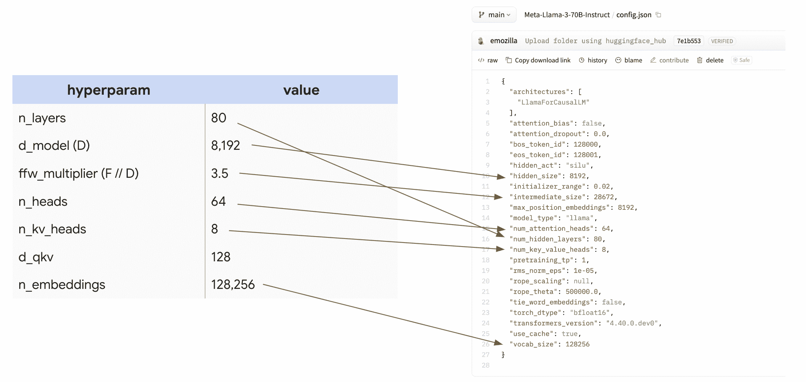

# 在 TPU 上训练 LLaMA 3

> 原文：[`jax-ml.github.io/scaling-book/applied-training`](https://jax-ml.github.io/scaling-book/applied-training)

第六部分如何扩展你的模型 (第五部分：训练 | 第七部分：推理)

让我们仔细看看如何使用上一节学到的知识在 TPU v5p 上训练 LLaMA 3 模型。它们有多大？不同配置的训练成本如何？它们是如何分片的？让我们通过一些粗略估计来看看前几节是如何映射到实际模型上的。

LLaMA 3 长什么样？计算参数和 FLOPs 如何分片训练 LLaMA 3-70B 练习问题

*本节的目标是将前节的结果应用于一个非常实际的问题：训练 LLaMA 3 系列（群）模型。与前面的章节不同，我们希望你自己做很多工作。因此，我们隐藏了每个部分的答案，这样你可以先尝试回答它。试着拿一支笔，手动尝试！*

### LLaMA 3 长什么样？

LLaMA-3 模型家族包括 3 个主要模型：LLaMA 3 8B、70B 和 405B。我们将主要关注 70B，并将 8B 和 405B 留给你在文章末尾的问题部分探索。以下是 LLaMA 3-70B 的架构，摘自 LLaMA [HuggingFace 页面](https://huggingface.co/meta-llama/Meta-Llama-3-70B/blob/main/config.json)。

| **超参数** | **值** |
| --- | --- |
| \(n_\text{layers}\) (L) | 80 |
| \(d_\text{model}\) (D) | 8,192 |
| \(d_{ff}\) (F) | 28,672 |
| \(n_\text{heads}\) (N) | 64 |
| \(n_\text{kv_heads}\) (K) | 8 |
| \(d_\text{qkv}\) (H) | 128 |
| \(n_\text{embeddings}\) (V) | 128,256 |

为了突出这一点有多容易找到，这里提供了配置本身，以及一个映射：

<picture></picture>

*制作一个包含这些数字的大表格，用于比较许多不同的开源 LLM 的设计决策，这样你可以快速比较它们。*

### 计算参数和 FLOPs

**问题：** 从这个表格中，我们能计算出 LLaMA 3-70B 的参数数量吗？🤫 让我们应用第四部分的内容，看看我们是否能得到 70B！

| 参数 | 公式 | 数量 |
| --- | --- | --- |
| FFW 参数 | d_model * d_ff * 3 (for gelu + out-projection) * n_layers | 8,192 * 8,192 * 3.5 * 3 * 80 = **56.3e9** |
| Vocab 参数 | 2 (input and output embeddings) * n_embeddings * d_model | 2 * 128,256 * 8,192 = **2.1e9** |
| Attention 参数 | n_layers * [ 2 (for q embedding and concatenated output projection) * d_model * n_heads * d_qkv + 2 (for k and v) * d_model * n_kv_heads * d_qkv] | 80 * (2 * 8,192 * 64 * 128 + 2 * 8,192 * 8 * 128) = **12e9** |
|   |   | 56.3e9 + 2.1e9 + 12e9 = **70.4e9** |

这太棒了！我们得到了预期的数字。正如预期的那样，你会注意到 FFW 参数在整体参数数量中完全占主导地位，尽管注意力机制并不简单。

**总结：** MLP 块中的 3 个大权重矩阵比 Transformer 中的所有其他数组都要大得多，因此当我们考虑模型内存或 FLOPs 时，通常可以几乎忽略所有其他参数。对于 LLaMA 3-70B 来说，它们代表了 70B 个参数中的 56B。

让我们来看看 FLOPs！*记住 第四部分 中训练的一般规则。*

**问题：** LLaMA-3 每个 token 每个训练步骤执行多少 FLOPs？*这有助于我们确定整个训练过程将有多昂贵。*

点击此处查看答案，在你思考过后！

**答案：** 如 第四部分 所示，我们每 token 大约需要 \(6 \cdot \text{参数数量}\) 个 FLOPs，所以这里大约是 `6 * 70e9 = 4.2e11` FLOPs / token。这意味着每步大约有 0.5 TFLOPs。假设我们受限于计算能力，这应该在单个 TPU v5p 芯片上大约需要 `4.2e11 / 4.59E+14 = 1ms`，假设 FLOPs 利用率完美。

**问题：** LLaMA 3 大约训练了 1500 万亿个 token。这总共需要多少 FLOPs？

点击此处查看答案，在你思考过后！

**答案：** 这很简单，总共只需要 `4.2e11 * 15e12 = 6.3e24 FLOPs`。6.3 yottaFLOPs。这太多了！在一个单独的 TPU 上这将需要 `6.3e24 / 4.59E+14 = 435 years`。这也太多了！

**问题：** 假设我们想在完整的 TPU v5p pod 上进行训练，该 pod 有 16x20x28 = 8960 个芯片。在 40% MFU 下以 bfloat16 格式训练需要多长时间，假设我们受限于计算能力？

点击此处查看答案，在你思考过后！

**答案：** 我们知道每个 TPU v5p 每秒可以执行 4.59e14 个 FLOPs。在 40% MFU 下，这将需要大约 `T = 6.3e24 / (8960 * 4.59e14 * 0.4) = 3.8e6 seconds`。**这大约是 44 天！**这相当合理，假设我们实际上能够达到 40% MFU。

**问题：** LLaMA 3-70B 使用大约 4M 个 token 的批大小进行预训练。为了使用这个批大小进行训练，我们至少需要多少个 TPU？*你可以假设 bfloat16 参数和 float32 优化器状态，并且每层检查梯度 4 次。*

点击此处查看答案，在你思考过后！

**答案：** 这个问题主要询问的是内存使用情况，因为这是唯一严格的计算能力约束。在训练过程中，我们有三个主要的 HBM 使用场景：模型参数、优化器状态和梯度检查点。如果我们假设 bfloat16 权重、float32 优化器状态，以及一个非常保守的梯度检查点方案（每层 4 次），我们有：

| **参数** | 2 * 70GB | ~140GB |
| --- | --- | --- |
| **优化器状态** | 8 * 70GB | ~560GB |
| **梯度检查点** | 2 * 8192 * 4e6 * 4 * 80 | ~20.9TB |
| **总计** |   | ~21.6TB |

总计大约是 21.6TB。你注意到，即使是非常保守的检查点方案，梯度检查点也强烈主导了内存图景。技术上我们可以做到每层一个检查点，或者进行微批处理，但这是一个合理的图景。在这些假设下，由于每个 TPU v5p 有 96GB 的 HBM，我们需要 `21.6e12 / 96e9 = 225` 个 TPU。实际上并不多！

*为什么不这样做呢？* 好吧，因为这需要我们 `44 天 * 8960 / 225 = 1752 天` 来训练。这几乎四年的时间。**这太多了。**尽管如此，这清楚地表明我们使用这些大型集群并不是因为我们受限于内存，而是因为我们需要额外的 FLOPs。

**问题**：在上述问题的相同假设下，如果我们使用 8960 个 TPU v5p 芯片，每片芯片我们将使用多少内存？

点击此处查看答案，在你思考过后！

**答案**：我们的总内存仍然是大约 21.6TB，所以每片芯片我们将使用大约 2.4GB，这基本上不算什么。如果我们进行更激进的检查点，例如每层 12 个检查点，我们每片芯片也只会达到 8GB。在这些规模下，我们在训练过程中根本不会接近内存限制。

**要点**：在技术上，即使在非常小的拓扑结构上训练非常大的模型也是可能的，但前提是它们可能需要很长时间。能够计算训练运行的总体 FLOPs 允许我们通过假设一个适度的 MFU 和已知的拓扑来估算其训练时间。

### 如何为训练分片 LLaMA 3-70B

让我们坚持上面的设置，并说我们想要使用 4M 令牌批大小（每个批次 1024 个长度为 4096 的序列）在 8960 个芯片的 TPU v5p pod 上训练 LLaMA 3-70B。让我们讨论这个模型的最佳分片策略。

**问题**：在上述假设下，我们能否仅使用 FSDP 训练我们的模型？首先，让我们假设我们无法进行任何序列/上下文并行。*这应该是你首先想到的想法，因为它简单，如果可行的话，将不会引入额外的通信。*

点击此处查看答案，在你思考过后！

**答案**：这个答案可能会有些繁琐。如上所述，LLaMA 3-70B 初始训练时使用长度为 4K 的序列，因此 4M 令牌的批大小给我们带来了 *序列批大小* 为 1024。这意味着我们实际上只能做到 1024 个芯片的纯数据并行/FSDP，因为这就是我们必须进行数据并行处理的序列数量。所以在简单意义上，“无额外通信的全数据并行”是不可能的。下一个问题将回答这个问题的稍微不那么繁琐的版本。

**问题**：如果我们放宽不进行任何序列分片的要求。如果我们允许自己在批和序列轴上进行 FSDP，我们能否在 8960 个芯片上仅使用 FSDP 训练 LLaMA 3-70B？

点击此处查看答案，在你思考过后！

**答案**：现在我们允许自己进行序列/上下文并行，我们可以扩展得更多。首先让我们计算我们的每设备批处理大小。如果我们进行 8960 路 FSDP，我们将得到每个 TPU 的批处理大小为`4 * 1024 * 1024 / 8960 = 468 tokens`。从上一节我们知道，当 \(\text{per device batch size} < 2550 / M_X\) 时，我们通过 FSDP 会变成 ICI 受限。由于我们可以在这里使用完整的 3D pod 来分配 3 个轴，这将给我们一个下限为 850，我们远远低于这个值。**所以答案是，即使有 3 个轴，我们也会是通信受限的。**

**问题**：现在让我们看看混合张量并行和 FSDP。是否存在某种组合使我们保持计算受限？如果存在，我们应该进行多少 FSDP 和张量并行？

点击此处查看答案，在你思考过后！

**答案**：首先让我们看看这是否甚至能适应。我们知道如果我们的每片芯片批处理大小小于 $2550² / 2F = 113$，我们将会通信受限。如上所述，我们略高于这个值。所以这很好！现在为了选择最优的 FSDP 数量，我们可以使用以下公式

\[X_{opt} = \sqrt{\frac{2BN}{F}} = \sqrt{\frac{2 \cdot 4.19e6 \cdot 8960}{28672}} = 1618\]

四舍五入到合理的 2 的倍数，这给我们大约 2048 路 FSDP 和 4 路张量并行。这应该会很好！

**要点**：我们可以使用数据并行（1024 路）、序列并行（2 路）和张量并行（4 路）的组合，在完整的 TPU v5p pod 上以 4M token 批处理大小训练 LLaMA-3，而不会受到通信限制。如果我们尝试纯 FSDP 或 FSDP + 序列并行，我们会受到通信限制。我们在上一节中提出的方程非常实用。

## 工作问题

**问题 1 [将 LLaMA 70B 扩展到更多芯片]：**如果我们想在 4 个 pod 上以相同的批处理大小训练 LLaMA 3-70B，我们会使用哪种并行方案？我们会是计算受限还是通信受限？大致需要多长时间来训练？*确保使用正确的 roofline 界限*。

**问题 2 [LLaMA 405B]：**

(a) 使用 LLaMA 3-405B [配置](https://huggingface.co/meta-llama/Llama-3.1-405B/blob/main/config.json)，编写一个包含所有上述关键超参数的表格。这个模型总共有多少个参数？每一步训练有多少个 FLOPs？如果我们训练 15T 个 token，会有多少 FLOPs？

(b) 假设我们想在 8 个 TPU v5p pod 上进行训练。我们会使用哪种并行方案？训练需要多长时间？会是计算受限还是通信受限？

### 这就是第六部分的所有内容。关于第七部分，关于 Transformer 推理，请点击这里。  ### 杂项

^*在 Google DeepMind 完成的工作，现在在 MatX。

### 引用

在学术环境中进行归属时，请引用此工作如下：

```py
 Austin et al., "How to Scale Your Model", Google DeepMind, online, 2025. 
```

或者作为一个 BibTeX 条目：

```py
 @article{scaling-book,
      title = {How to Scale Your Model},
      author = {Austin, Jacob and Douglas, Sholto and Frostig, Roy and Levskaya, Anselm and Chen, Charlie and Vikram, Sharad
      and Lebron, Federico and Choy, Peter and Ramasesh, Vinay and Webson, Albert and Pope, Reiner},
      publisher = {Google DeepMind},
      howpublished = {Online},
      note = {Retrieved from https://jax-ml.github.io/scaling-book/},
      year = {2025}
    } 
```    
