# 所有关于 Transformer 推理的内容

> 原文：[`jax-ml.github.io/scaling-book/inference`](https://jax-ml.github.io/scaling-book/inference)

《如何扩展你的模型》第七部分如何扩展你的模型 (第六部分：训练 LLaMA | 第八部分：服务 LLaMA)

在 Transformer 上执行推理可能与训练非常不同。部分原因是因为推理增加了一个需要考虑的新因素：延迟。在本节中，我们将从从模型中采样单个新标记开始，到作为推理引擎的一部分，高效地扩展大型 Transformer 到许多加速器的多个切片。  ### 内容

Transformer 推理的基础

+   我们实际上想优化什么？

+   线性操作：什么瓶颈了我们？

+   关于注意力呢？

+   LLM 延迟和吞吐量的理论估计

+   关于内存呢？

+   为 LLaMA 2-13B 建模吞吐量和延迟

提高生成吞吐量和延迟的技巧在多个加速器上分配推理

+   预填充

+   生成

+   KV 缓存的分片

设计有效的推理引擎

+   连续批处理

+   前缀缓存

+   让我们看看一个实现：JetStream

练习题附录

## Transformer 推理的基础

因此，你已经训练了一个 Transformer，并希望用它来生成一些新的序列。*最终，基准分数的提升和损失曲线的下降只是对实际应用中是否会发生有趣的事情的代理！*从历史上看，你可以在不接触推理的情况下对 Transformer 进行大量的研究——LLM 损失、多项选择基准可以在没有适当的 KV 缓存或生成循环实现的情况下高效运行。这意味着，特别是在研究代码库中，推理代码路径中往往有很多低垂的果实。

采样在概念上很简单。我们输入一个序列，我们最喜欢的 Transformer 会输出 \(\log p(\text{next token}_i \vert \text{previous tokens})\)，即所有可能下一个标记的对数概率。我们可以从这个分布中进行采样并获得一个新标记。将此标记附加并重复此过程，我们获得一个标记序列，它是提示的延续。

<picture>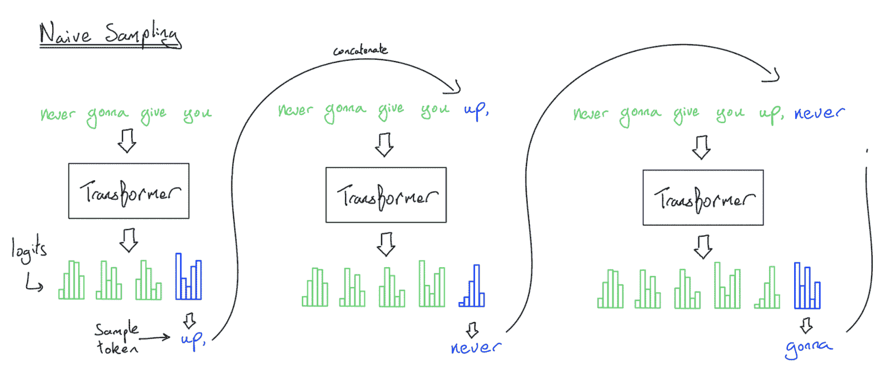</picture>

**图示**：从 Transformer 进行朴素采样。蓝色的对数给我们提供了一个关于下一个标记的分布，我们可以从中采样。请注意，每个步骤都会重新处理整个前缀，导致算法的运行时间为 \(\Theta(n²)\)。

我们刚刚描述了 Transformer 样本的朴素实现，虽然它可行，但我们**从未在实际中这样做**，因为每次生成一个标记时，我们都会重新处理整个序列。这个算法在 FFW 上是 \(O(n²)\)，在生成 \(n\) 个标记的注意力机制上是 \(O(n³)\)！

**我们如何避免这种情况**？不是每次都进行完整的正向传递，实际上我们可以从每次正向传递中保存一些中间激活，这样我们就可以避免重新处理之前的标记。具体来说，由于一个给定的标记在点积注意力中只关注之前的标记，我们可以简单地将每个标记的键和值投影写入一个新的数据结构，称为**键值缓存**。一旦我们为过去的标记保存了这些键/值投影，未来的标记就可以简单地计算它们的 \(q_i \cdot k_j\) 积，而无需在早期标记上执行任何新的浮点运算。太神奇了！

考虑到这一点，推理有两个关键部分：

+   **预填充**：给定一个长的提示，我们同时处理提示中的所有标记，并将生成的激活（特别是键值投影）保存到一个**“键值缓存”**中。我们还将最后一个标记的对数保存起来。

+   **生成**：给定一个键值缓存和前一个对数，我们逐步从一个对数中采样一个标记，将该标记反馈到 Transformer 中，并为下一个步骤生成一组新的对数。我们还把新标记的键值激活追加到键值缓存中。我们重复此过程，直到遇到特殊的 `<EOS>` 标记或达到某个最大长度限制。

下面是使用键值缓存的采样图示：

<picture>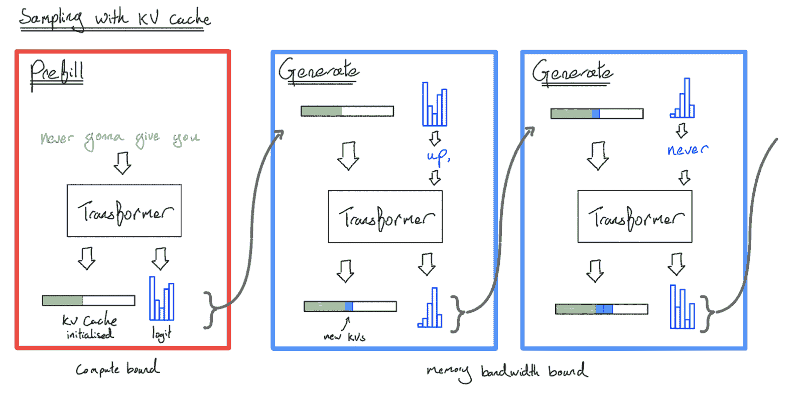</picture>

**图示**：使用键值缓存的效率高的 Transformer 样本图。**预填充**处理我们的提示，并将每个标记的键值激活保存到缓存中。**生成**使用这个缓存（以及最后一个标记的对数），采样一个新的标记，并将这个新标记通过模型传递，关注键值缓存，并将新标记的键值投影保存回缓存。这是 MLP 块中的 \(O(n)\) 算法。

通过使用键值缓存进行采样，我们已经将生成 \(n\) 个标记的时间复杂度降低到 FFW 上的 \(O(n)\) 和注意力机制上的 \(O(n²)\)，因为我们永远不会重新处理之前的标记。然而，仍然需要许多前向传递来生成一个序列——这就是当你查询 Gemini 或 ChatGPT 时发生的事情，结果流回到你这里。每个标记（通常）都是一个单独的（但部分缓存的）Transformer 调用到一个大型模型。

我们很快就会看到，**预填充**和**生成**是两种非常不同的生物——Transformer 推理实际上是两个隐藏的任务！与训练相比，KV 缓存也是一个新颖且重要的复杂性来源。

### 我们实际上想要优化什么？

在我们进一步讨论之前，值得强调推理的一个全新方面：延迟。在训练期间，我们只关心吞吐量（每秒每芯片处理的 token 总数），但在推理期间，我们必须关注我们生成 token 的速度（包括**首次 token 时间（TTFT）**和**每 token 延迟**）。例如：

+   **离线批量推理**仅关注推理的总体成本，对单个样本的延迟视而不见。

+   **聊天界面/流式任务**需要在规模上以低成本运行，同时具有低 TTFT（Token Time To First Token）并快速生成足够的 token 以超过人类阅读速度。

+   **边缘推理**（例如，你的笔记本电脑上的`llama.cpp`）只需要以最低可能的延迟为一次服务一个用户，可能还有重硬件约束。

最大化硬件利用率仍然至关重要，有助于成本和 TTFT，但与训练不同，它并不**必然**会转化为所有场景下单个用户更好的体验。许多在加速器、系统和模型架构层面的优化在延迟、吞吐量、上下文长度甚至模型质量之间做出权衡。

### 对 Transformer 的更细粒度视图

到目前为止，我们主要将 Transformer 视为一系列前馈块。虽然从 FLOPs 和内存的角度来看，这通常是合理的，但它不足以正确地模拟推理。在本节中，你会发现推理远不如训练宽容。我们通常有更少的 FLOPs，更少的批处理机会，以及对延迟的敏感性更大。KV 缓存也极大地复杂化了推理。正如我们在第四部分中看到的那样，Transformer 前向传递的主要组件包括：

1.  **一系列线性操作**，包括 MLP（$W_{in}$, $W_{out}$）和注意力 QKV 投影以及输出投影（$W_Q$, $W_K$, $W_V$, 和 $W_O$）。这些都涉及从 HBM 读取参数和一批激活，进行一些 FLOPs，并将结果写回 HBM。

1.  **点积注意力**。我们需要从 HBM 读取一批键值投影和一批查询激活，进行一些内积和一些 softmax 操作，并将注意力结果写回 HBM。

1.  **其他所有内容**，包括应用层归一化、激活函数、token 采样、更新 KV 缓存和位置嵌入。这些都涉及一些 FLOPs，但主要由上述内容主导或融合。

在接下来的几节中，我们将从预填充和生成的角度逐一审视这些内容，并探讨什么可能成为我们性能的瓶颈。在单个加速器中，我们是计算受限还是内存受限？我们想要强调预填充与生成之间的答案会有多么不同。

### 线性操作：什么成为我们的瓶颈？

我们的所有线性操作在概念上都是相同的，无论是位于 MLP 块还是注意力中。它们的算术强度取决于批量大小。我们在第一部分中进行了这个数学运算，但值得重复。让我们看看单个 $\text{bf16[B, D]}$ 批量与 $\text{bf16[D, F]}$ 矩阵的矩阵乘法。这可能是一个大的 MLP 块（$W_\text{in}$ 或 $W_\text{out}$）或较小的注意力投影之一（$W_Q$，$W_K$，$W_V$，$W_O$）。为了进行这个矩阵乘法，我们需要将这两个数组从 HBM 加载到 MXU 中，进行乘法运算，然后将结果写回 HBM。和之前一样，我们有：

\[T_\text{math} = \frac{\text{计算 FLOPs}}{\text{加速器 FLOPs/s}} = \frac{2BDF}{\text{加速器 FLOPs/s}}\] \[T_\text{comms} = \frac{\text{通信 字节}}{\text{带宽 字节/s}} = \frac{2BD + 2FD + 2BF}{\text{带宽 字节/s}}\]

TPU 或 GPU 可以在计算的同时加载，因此为了成为计算受限，我们需要 \(T_\text{math} \geq T_\text{comms}\)，或者：

\[\frac{2BDF}{2BD + 2DF + 2BF} \geq \frac{\text{加速器 FLOPs/s}}{\text{带宽 字节/s}} \underset{\text{TPU v5e}}{=} \frac{1.97E+14}{8.20E+11} = 240\]

其中，RHS 是我们硬件的算术强度。现在假设 $D$ 和 $F$ 与 $B$ 相比非常大（通常我们的批量大小最多为 500，而 $D$ 和 $F > 10k$），我们可以通过使用 $\small{2BD + 2DF + 2BF \approxeq 2DF}$ 的事实来简化分母，这给我们

\[\begin{align*} \frac{2BDF}{2BD + 2DF + 2BF} \approxeq \frac{2BDF}{2DF} \geq \frac{\text{加速器 FLOPs/s}}{\text{带宽 字节/s}} \\ \underset{\text{TPU v5e}}{=} \frac{1.97E+14}{8.20E+11} \implies B \geq 240 = B_{\text{crit}} \end{align*}\]

如果我们将权重量化或使用较低精度的 FLOPs 进行矩阵乘法，这个关键批量大小可能会改变。例如，如果我们将权重量化为 int8 或 fp8，$B_\text{crit}$ 将减少 2 倍。如果我们使用 int8 或 fp8 进行 FLOPs，$B_\text{crit}$ 将增加 2 倍。因此，如果我们让 $\beta = \text{每参数位} / \text{每激活位}$ 和 $\alpha_\text{hbm} = C / W_\text{hbm}$，我们的关键批量大小实际上是 $B_\text{crit} = \beta \alpha_\text{hbm}$。

**要点：** Transformer 矩阵乘法是计算受限的 *iff* 每个副本的 **token** 批量大小大于 $B_\text{crit} = C / W_\text{hbm} \cdot (\text{每参数位} / \text{每激活位}) = \beta \cdot \alpha_\text{hbm}$。对于 TPU v5e 上的 bf16 激活，这是 240 个 token。对于 H100，大约是 280 个 token。

在训练过程中，由于我们在非常大的批次上重复使用相同的权重，我们将在所有的矩阵乘法中具有高强度。**这种高算术强度会传递到预填充中，因为用户提示通常有数百甚至数千个令牌长。** 如我们所见，TPUv5e 的硬件算术强度为 240，因此如果将超过 240 个令牌的序列输入到运行在 bf16 上的该硬件上的密集模型，我们预计会处于计算限制状态，一切顺利。比这短的提示在技术上可以一起批处理以实现更高的利用率，但这通常不是必要的。

**总结：** 在预填充过程中，所有矩阵乘法基本上总是计算限制的。因此，仅简单地最大化硬件利用率或 MFU（模型 FLOPs 利用率）就足以最大化每芯片的吞吐量（成本）和延迟（以 TTFT 的形式）。除非提示非常短，否则在提示级别进行批处理只会增加延迟，而只会带来预填充吞吐量的微小改进。

然而，在生成过程中，对于每个请求，我们只能一次处理一个令牌，因为步骤之间存在顺序依赖性！因此，我们只能通过将多个请求一起批处理，在批次维度上并行化来（容易地）实现良好的利用率。我们稍后会更多地讨论这个问题，但实际上，在不影响延迟的情况下将许多并发请求一起批处理是很困难的。因此，**使用生成来饱和硬件 FLOPs 要困难得多。**

**总结：** 在生成过程中，总令牌批次大小必须大于$B_{\text{crit}}$，以便在 TPU v5e 上的 bf16 参数的线性/前馈操作上成为计算限制（240）。因为生成是按顺序逐个令牌发生的，这要求我们将多个请求一起批处理，这很困难！

*值得注意的是，这有多么大！* 生成批次大小为 240 意味着同时生成 240 个并发请求，以及为密集模型提供 240 个单独的 KV 缓存。这意味着在实践中很难实现，除了在某些批量推理设置中。相比之下，在预填充期间推送超过 240 个令牌是相当常见的，尽管随着稀疏度的增加需要一些注意。

**请注意，这个确切数字会因量化类型和硬件而异。** 加速器通常可以提供更多低精度的算术运算。例如，如果我们有 int8 参数但以 bf16 进行计算，关键批次大小会降至 120。使用 int8 激活和 int8 参数时，它会跳回到 240，因为 TPUv5e 可以提供 400 TOPs/s 的 int8 x int8。

### 那么，关于注意力呢？

当我们查看点积注意力操作时，事情变得更加复杂，特别是因为我们必须考虑 KV 缓存。让我们只看一个具有纯多头注意力的注意力头。在一个单独的 Flash Attention 融合中，我们<脚注>在这里简化了很多，通过忽略应用 softmax、掩码等时的非矩阵乘法 FLOPs。它们应该与计算或 HBM 读取重叠，但在某些 TPU 生成中可能很复杂。这些细节不会改变主要信息，即 KV 缓存通常受限于内存。</脚注>：

1.  从 HBM 读取形状为 \(\text{bf16[B, T, D]}\) 的 \(Q\) 激活。

1.  从 HBM 读取 \(KV\) 缓存，它是一对来自 HBM 的 \(\text{bf16[B, S, D]}\) 张量。

1.  在 \(QK\) 矩阵乘法中执行 \(2BSTD\) FLOPs。使用 Flash Attention，我们不需要将 \(\text{bf16[B, S, T]}\) 注意力矩阵写回 HBM。

1.  在注意力 \(AV\) 矩阵乘法中执行 \(2BSTD\)。

1.  将结果 \(\text{bf16[B, T, D]}\) 张量写回 HBM。

将所有内容整合起来，我们得到：

\[多头注意力算术强度 = \frac{4BSTD}{4BSD + 4BTD} = \frac{ST}{S+T}\]

对于预填充，由于我们正在进行自注意力，所以 \(S=T\)，这简化为 \(T² / 2T = T / 2\)。这很好，因为它意味着**预填充期间注意力的算术强度为 \(\Theta(T)\)**。这意味着注意力很容易成为计算瓶颈。只要我们的序列长度相当大，我们就没有问题！

但是，由于生成有一个微小的序列维度，且 \(B\) 和 \(D\) 维度相互抵消，我们可以进行如下近似：

\[S \gg T = 1 \implies \frac{ST}{S+T} \approx 1\]

这很糟糕，因为它意味着我们无法提高生成期间注意力的算术强度。我们在加载大量的 KV 缓存时只进行了微量的 FLOPs。**因此，在注意力过程中，我们基本上总是受限于内存带宽！**

**总结：**在预填充期间，对于任何合理的序列长度（大致 \(\gt 480\) 个标记），注意力通常受限于计算，而在生成期间我们的算术强度低且恒定，因此我们总是受限于内存带宽。

*为什么从概念上来说是这样的？* 主要是因为我们在模型的线性部分受限于计算，因为参数（内存带宽重的组件）被许多批处理项重用。然而，每个批处理项都有自己的 KV 缓存，因此更大的批处理大小意味着更多的 KV 缓存。除非架构进行了激进调整，否则我们几乎总是受限于内存带宽。

这也意味着，一旦参数内存与 KV 缓存内存相当，增加批量大小的吞吐量将逐渐减少。这种减少的收益程度取决于单个序列的参数到 KV 缓存字节的比率，即大致的比率 \(2DF / SHK\)。由于 \(HK\approx D\)，这大致取决于 \(F\) 到 \(S\) 的比率，即序列长度。这也取决于使 KV 缓存更小的架构修改（我们稍后会详细介绍）。

### LLM 延迟和吞吐量的理论估计

从这个数学公式中，我们可以得到在优化时应该追求的步时间的良好界限。（注意：如果我们想让读者从整个章节中带走一点东西，那就是以下内容）。对于生成过程中的小批量大小（这是常见的），我们可以通过假设我们在注意力和 MLP 块中都是内存带宽受限来降低每步延迟的下限：

\[\begin{equation*} \text{理论最小步时间} = \frac{\text{批量大小} \times \text{KV 缓存大小} + \text{参数大小}}{\text{总内存带宽}} \end{equation*}\]

同样，对于吞吐量：

\[\begin{equation*} \text{理论最大标记/秒} = \frac{\text{批量大小} \times \text{总内存带宽}}{\text{批量大小} \times \text{KV 缓存大小} + \text{参数大小}} \end{equation*}\]

最终，随着批量大小的增加，FLOPs 开始主导参数加载，因此在实践中我们有一个更通用的方程：

\[\begin{align} \tiny \text{理论步时间（通用）} = \underbrace{\frac{\text{批量大小} \times \text{KV 缓存大小}}{\tiny \text{总内存带宽}}}_{\text{注意（总是带宽受限）}} + \underbrace{\max\left(\frac{2 \times \text{批量大小} \times \text{参数计数}}{\text{总 FLOPs/s}}, \frac{\text{参数大小}}{\text{总内存带宽}}\right)}_{\tiny \text{MLP（可能被计算限制）}} \end{align}\]

其中，注意力组件（左侧）永远不会被计算限制，因此不需要 FLOPs 屋顶线。这些对于估算非常有用，例如。

**快速问答：** 假设我们想要从 30B 参数稠密模型中生成一个包含 4 个标记的批量，在 TPU v5e 4x4 切片上以 int8 精度和 bf16 FLOPs 进行，8192 个上下文和 100 kB / token 的 KV 缓存。这个操作的延迟的合理下限是多少？如果我们想要采样一个包含 256 个标记的批量呢？

点击此处查看答案。

**答案：** 在 int8 中，我们的参数将使用 30e9 字节，并且根据给定的规格，我们的 KV 缓存将使用`100e3 * 8192 = 819MB`。我们有 16 个芯片，每个芯片有`8.1e11`字节/秒的带宽和`1.97e14` bf16 FLOPs/秒。从上述方程中，由于我们的批量大小较小，我们预计我们的步时间至少为`(4 * 819e6 + 30e9) / (16 * 8.1e11) = 2.5 ms`。在 256 个标记时，我们的 MLP 块将进入计算受限区域，因此我们的步时间大约为`(256 * 819e6) / (16 * 8.1e11) + (2 * 256 * 30e9) / (16 * 1.97e14) = 21ms`。

如您所见，在这里，吞吐量和延迟之间存在明显的权衡。小批量处理速度快，但无法充分利用硬件。大批量处理速度慢，但效率高。以下是针对一些较旧的 PaLM 模型计算出的延迟-吞吐量帕累托前沿（来自[ESTI 论文](https://arxiv.org/pdf/2211.05102)）：：

<picture>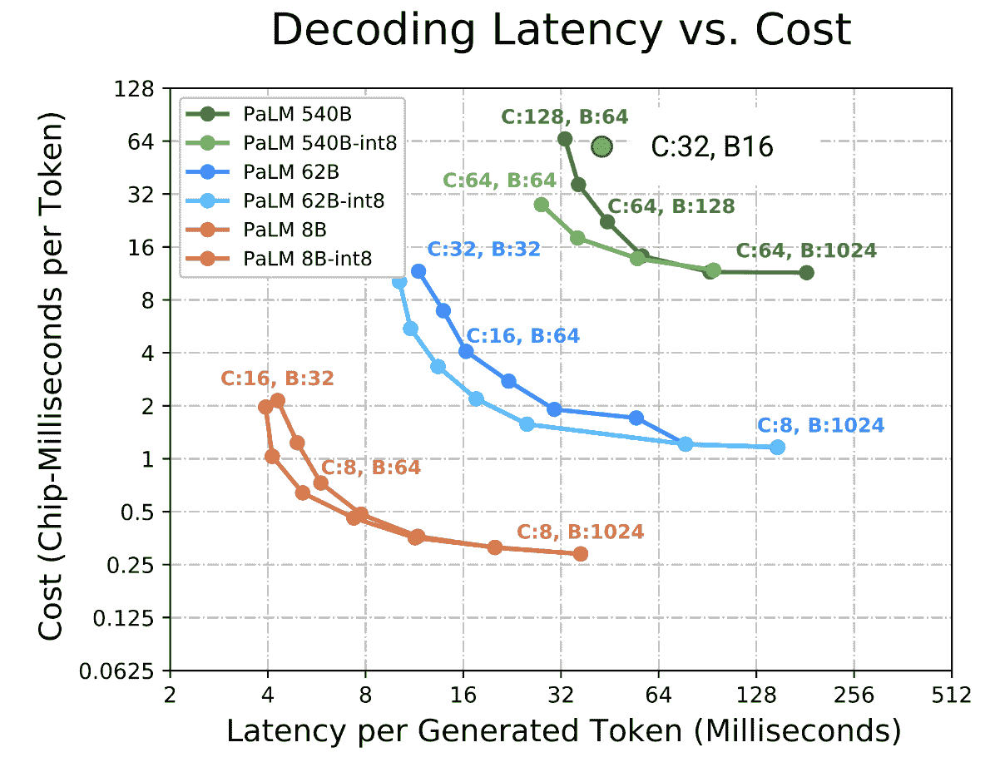</picture>

**图示：** 几个 PaLM 模型的成本（即吞吐量）与延迟的帕累托前沿。注意芯片数量（C）和批处理大小（B）如何沿着帕累托前沿移动，除了绿色点（C:32 B:16 对于 PaLM 540B），在那里可用的内存阻止了设置支持良好的批处理大小，并导致吞吐量下降。注意吞吐量通常在批处理大小 240 之后趋于平坦。int8 权重提供了更好的延迟-吞吐量帕累托最优，但不是更好的最大吞吐量。

我们不仅可以通过批处理大小作为旋钮来权衡延迟和吞吐量，我们还可能更喜欢较大的拓扑结构而不是较小的拓扑结构，这样我们就可以在发现自己受限于 HBM 时适应更大的批处理。下一节 下一节 将更详细地探讨这一点。

**要点：** 如果您关心生成吞吐量，请使用每个芯片可能的最大批处理大小。任何超过 TPU 算术强度（$B_\text{crit}$，通常为 120 或 240）的批处理大小都将最大化吞吐量。您可能需要增加您的拓扑结构来实现这一点。较小的批处理大小将允许您在吞吐量牺牲的情况下提高延迟。

从硬件角度来看，对此有一些注意事项。点击此处查看一些细节。

这一切都是相当理论的。在实践中，我们往往由于几个原因而看不到一个尖锐的上限线：

+   我们假设 HBM 读取将完美重叠与 FLOPs 的假设并不现实，因为我们的编译器（XLA）是可能出错的。

+   对于分片模型，XLA 也经常无法有效地重叠模型分片矩阵乘法的 ICI 通信与 FLOPs 本身，因此我们经常在 \(\text{BS}=32\) 的线性上开始遭受延迟损失。

+   批处理大小超过理论上限时，由于不完全重叠，仍会看到吞吐量的某些改进，但这是一个很好的启发式方法。

### 关于内存呢？

我们花了一些时间查看带宽和 FLOPs，但没有查看内存。由于我们新的数据结构 KV 缓存，内存图在推理时看起来大不相同。对于本节，让我们选择一个真实模型（LLaMA 2-13B）来展示不同的事情看起来如何：

| 超参数 | 值 |
| --- | --- | --- |
| L (num_layers) | 40 |
| D (d_model) | 5,120 |
| F (ffw_dimension) | 13,824 |
| N (num_heads) | 40 |
| K (num_kv_heads) | 40 |
| H (qkv_dim) | 128 |
| V (num_embeddings) | 32,000 |

推理过程中使用了哪些内存？显然，是我们的参数。计算这些参数，我们有：

| 参数 | 公式 | 大小（以字节为单位） |
| --- | --- | --- |
| FFW 参数 | d_model² x ffw_multiplier x 3 (for gelu + out-projection) x n_layers | 5,120 x 5,120 x 2.7 x 3 x 40 = **8.5e9** |
| 词汇参数 | 2 (输入和输出嵌入) x n_embeddings x d_model | 2 x 32,000 x 5,120 = **0.3e9** |
| 注意力参数 | [2 (*q 和输出*) x d_model x n_heads x d_qkv + 2 (*for k 和 v*) x d_model x n_kv_heads x d_qkv] x n_layers | (2 x 5,120 x 40 x 128 + 2 x 5,120 x 40 x 128) x 40 = **4.2e9** |

将这些参数加起来，我们得到 8.5e9 + 4.2e9 + 0.3e9 = **13e9 总参数**，正如预期的那样。正如我们在前面的章节中看到的，在训练过程中，我们可能会用 bfloat16 存储我们的参数，并用 float32 的优化器状态。这可能会使用大约 100GB 的内存。这和我们的梯度检查点相比微不足道，梯度检查点可以使用几个 TB。

**推理有何不同？** 在推理过程中，我们存储参数的一个副本，比如说在 bfloat16 中。这使用了 26GB — 而在实际操作中，我们通常可以通过量化做得更好。没有优化器状态或梯度需要跟踪。因为我们没有检查点（保留激活以供反向传播），所以我们的激活足迹对于预先填充和生成都是微不足道的。如果我们预先填充 8k 个标记，单个激活仅使用大约 `8,192 x 5,120 x 2 字节 = 80MB` 的内存。更长的预先填充可以被分解成许多更小的正向传递，因此对于较长的上下文也不是问题。生成使用的标记甚至更少，因此激活可以忽略不计。

**主要区别在于 KV 缓存**。这些是所有过去标记的键和值投影，其大小仅受最大允许序列长度的限制。对于 \(T\) 个标记的总大小是

\[\text{KV 缓存大小} = 2 \cdot \text{每浮点字节数} \cdot H \cdot K \cdot L \cdot T\]

其中 \(H\) 是每个头的维度，\(K\) 是 KV 头的数量，\(L\) 是层数，2 是存储键和值的倍数。

**这会很快变得很大**，即使对于适度的批量和上下文长度也是如此。对于 LLaMA-13B，一个用于单个 8192 序列的 bf16 KV 缓存

\[8192\ (T) \times 40\ (K) \times 128\ (H) \times 40\ (L) \times 2\ (\text{字节}) \times 2 = 6.7 \text{GB}\]

**仅有 4 个超过了我们参数的内存使用量！** 为了明确起见，LLaMA 2 在较长的上下文中并未针对 KV 缓存大小进行优化（这并不总是这么糟糕，因为通常 $K$ 要小得多，如在 LLaMA-3 中），但这仍然具有说明性。我们在内存或延迟估计中不能忽视这些因素。

### 为 LLaMA 2-13B 模型吞吐量和延迟

让我们看看在 8xTPU v5es 上尝试以不同的批大小进行完美高效的生成会发生什么，直到之前为最大理论吞吐量推导出的临界批大小（240）。

| 批大小 | 1 | 8 | 16 | 32 | 64 | 240 |
| --- | --- | --- | --- | --- | --- | --- |
| KV 缓存内存 (GiB) | 6.7 | 53.6 | 107.2 | 214.4 | 428.8 | 1608 |
| 总内存 (GiB) | 32.7 | 79.6 | 133.2 | 240.4 | 454.8 | 1634 |
| 理论步骤时间 (ms) | 4.98 | 12.13 | 20.30 | 36.65 | 69.33 | 249.09 |
| 理论吞吐量 (tokens/s) | 200.61 | 659.30 | 787.99 | 873.21 | 923.13 | 963.53 |

8x TPU v5es 提供了 128GiB 的 HBM，6.5TiB/s 的 HBM 带宽（每个 0.82TiB/s）和 1600TF/s 的计算能力。

对于这个模型，增加批处理大小确实可以给我们带来更好的吞吐量，但我们会迅速遇到递减的回报。我们超过批处理大小 16 时会 OOM（内存不足），并且需要十倍以上的内存才能接近 240。更大的拓扑结构可以提高延迟，但我们已经遇到了每块芯片吞吐量的瓶颈。

假设我们保持总参数数量不变，但神奇地使 KV 缓存缩小 5 倍（例如，使用 1:5 GMQA，这意味着我们有 8 个 KV 头在 40 个 Q 头之间共享——更多细节请见下一节）。

| 批处理大小 | 1 | 8 | 16 | 32 | 64 | 240 |
| --- | --- | --- | --- | --- | --- | --- |
| KV 缓存内存（GiB） | 1.34 | 10.72 | 21.44 | 42.88 | 85.76 | 321.6 |
| 总内存（GiB） | 27.34 | 36.72 | 47.44 | 68.88 | 111.76 | 347.6 |
| 理论步骤时间（ms） | 4.17 | 5.60 | 7.23 | 10.50 | 17.04 | 52.99 |
| 理论吞吐量（token/s） | 239.94 | 1,429.19 | 2,212.48 | 3,047.62 | 3,756.62 | 4,529.34 |

使用较小的 KV 缓存，我们仍然有递减的回报，但每块芯片的理论吞吐量仍然可以扩展到批处理大小 240。我们可以容纳更大的 64 批处理，并且所有批处理大小的延迟也始终更好。延迟、最大吞吐量和最大批处理大小都显著提高！实际上，后来的 LLaMA 代使用了这种精确的优化——LLaMA-3 8B 有 32 个查询头和 8 个 KV 头（[来源](https://huggingface.co/MaziyarPanahi/Llama-3-13B-Instruct-v0.1/blob/dfdeb40bdb2c149dfa399ea2be0d56eb120f0831/config.json)）。

**总结：** 除了参数之外，KV 缓存的大小对模型的最终推理性能有很大影响。我们希望通过结合架构决策和运行时优化来控制它。

## 提高生成吞吐量和延迟的技巧

自从原始的 [Attention is All You Need 论文](https://arxiv.org/abs/1706.03762) 以来，已经开发了许多技术来提高模型的效率，通常针对 KV 缓存进行优化。一般来说，较小的 KV 缓存使得在不影响延迟的情况下更容易增加生成步骤的批处理大小和上下文长度，并且使围绕 Transformer 的系统（如请求缓存）的生活更加容易。忽略对质量的影响，我们可能会看到：

**分组多查询注意力（简称 GMQA，GQA）：** 我们可以减少 KV 头的数量，并与注意力机制中的许多 Q 头共享。在极端情况下，甚至可能将单个 KV 头跨所有 Q 头共享。这减少了 KV 缓存，相对于纯 MHA，减少了 Q:KV 比例的倍数，并且观察到模型的性能对这种变化相对不敏感。

<picture>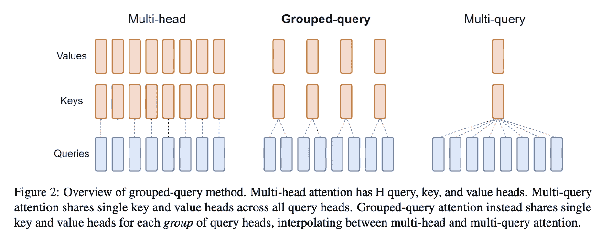</picture>

这也有效地增加了注意力计算的算术强度（参见第四部分中的问题 4）。

**混合一些局部注意力层：** 局部注意力将上下文限制在较小到适中的最大长度。在训练时间和预填充时间，这涉及到将注意力矩阵屏蔽为对角带而不是三角形。这实际上限制了局部层 KV 缓存的最大长度。通过在模型中混合一些局部层和一些全局层，当上下文长度超过局部窗口时，KV 缓存的大小可以大大减少。

**跨层共享 KVs：** 模型可以学习以某种模式在层之间共享相同的 KV 缓存。虽然这确实减少了 KV 缓存的大小，并在增加批次大小、缓存、离线存储等方面提供了好处，但共享的 KV 缓存可能需要多次从 HBM 中读取，*因此并不一定能提高步骤时间。*

<picture>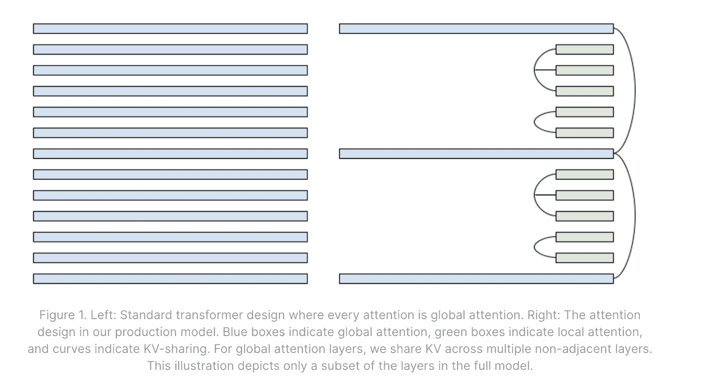</picture>

**左侧：** 多层纯全局注意力。**右侧：** 与相邻层共享的一些全局/局部交错模式示例。来源：[Character.ai 博客](https://research.character.ai/optimizing-inference/?ref=blog.character.ai)。

**量化：** 推理通常对参数和 KVs 的精度不太敏感。通过量化参数和 KV 缓存（例如，到 int8、int4、`fp8` 等），我们可以在两者上节省内存带宽，减少达到计算屋顶线的所需批次大小，并在更大的批次大小下节省内存。量化还有一个额外的优点，即即使模型没有经过量化训练，通常也可以在训练后应用。

**使用杂乱无章的 HBM 读取和分页注意力：** 在上面的计算中，我们为每个 KV 缓存分配了 8k 的上下文，但通常没有必要从内存中读取整个 KV 缓存——请求具有广泛的长度的分布，并且不使用模型的最大上下文，因此我们可以经常实现仅读取 KV 缓存非填充部分的内核（例如，Flash Attention 变体）。

分页注意力 是对此的改进，它将 KV 缓存存储在 OS 风格的页面表中，并且几乎完全避免了填充 KV 缓存。这增加了许多复杂性，但意味着每个批次只使用所需的内存量。这是一个运行时优化，因此它对架构没有影响。

<picture>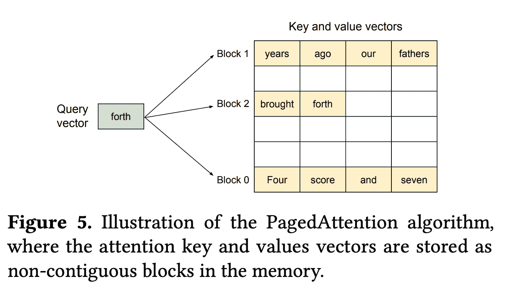</picture>

**图示：** 在生成过程中，单个标记（forth）关注多个 KV 缓存块/页面。通过分页 KV 缓存，我们避免了加载或存储比所需的更多内存。摘自 [PagedAttention 论文](https://arxiv.org/pdf/2309.06180)。

**总体情况：** 总的来说，这些 KV 缓存优化可以将 KV 缓存大小减少一个数量级以上，与标准 MHA Transformer 相比。这可能导致 Transformer 的总体成本提高一个数量级。

## 在多个加速器上分配推理

到目前为止，我们只是泛泛而谈了如何扩展到单个芯片之外。遵循第五部分，让我们探讨我们可用的不同策略及其权衡。一如既往，我们将分别查看预填充和生成。 

### 预填充

从屋顶线角度来看，**预填充几乎与训练相同**，并且几乎所有的技术和权衡都适用——模型（Megatron）并行、序列分片（对于足够长的上下文）、流水线，甚至 FSDP 都是可行的！你只需要保持 KVs 活跃，这样你就可以稍后进行生成。就像训练一样，增加芯片的数量为我们提供了更多的 FLOPs/s（对于可能更低的 TTFT），但增加了通信开销（可能会降低每芯片的吞吐量）。

**分片预填充的一般规则:** 这里有一套关于预填充的一般规则。我们将假设我们只在一个序列上进行预填充（没有批量维度）：

1.  *模型分片:* 我们通常首先进行一定程度的模型并行，直到我们达到 ICI 界限。正如我们在第五部分中看到的，对于 1 个轴来说，这大约是$F / 2200$（通常在 4-8 路分片之间）。

1.  *序列并行性:* 除了这个之外，我们进行序列并行（类似于数据并行，但是在序列维度上进行分片）。虽然序列并行会在注意力中引入一些额外的通信，但在较长的上下文中通常相当小。与训练一样，我们可以重叠通信和计算（使用 Megatron 的集体矩阵乘法和环状注意力分别）。

**要点:** 在预填充期间，几乎任何在训练期间可以工作的分片都可以很好地工作。做到 ICI 界限内的模型并行，然后进行序列并行。

### 生成

生成比预填充更复杂。首先，由于我们需要将许多请求一起批处理，因此更难获得大批量。延迟目标更低。这些共同意味着我们通常更受内存限制，并且对通信开销更敏感，这限制了我们的分片策略：

1.  **FSDP 是不可能的:** 由于我们在从 HBM 到 MXU 加载我们的参数和 KV 缓存时受内存限制，我们不希望通过比 HBM 慢几个数量级的 ICI 来移动它们。*我们希望移动激活而不是权重。* 这意味着类似于 FSDP 的方法通常对于生成来说完全不切实际。《d-footnote>在训练后意外地留下它是一个简单且常见的方法，会导致数量级的退步

1.  **没有必要进行数据并行:** 纯数据并行是无用的，因为它复制了我们的参数，并不能帮助我们更快地加载参数。你最好启动多个模型的副本。《d-footnote>通过这种方式，我们是指，以较小的批量大小启动多个包含模型副本的服务器。在模型级别上的数据并行是严格更差的。

1.  **没有序列就没有序列分片。** 祝你好运进行序列分片。

*这主要让我们只剩下密集模型生成的模型分片变体。* 与预填充一样，我们能做的最简单的事情是简单的模型并行（对于 MLP，激活完全复制，权重在隐藏维度上完全分片），当达到 ICI 约束时，可以达到 4-8 种方式。然而，由于我们通常受内存带宽限制，我们可以超过这个限制来提高延迟！

**关于生成时 ICI 约束的说明：** 在训练过程中，我们希望成为计算受限，因此我们的屋顶线查看当我们的 ICI 通信比 FLOPs 更长时。然而，在生成过程中，如果我们受参数加载的内存带宽限制，我们可以增加模型分片超过这个点，并以最小的吞吐量成本（以每秒每芯片的令牌数为单位）提高延迟。更多的模型分片给我们更多的 HBM 来加载我们的权重，而我们的 FLOPs 并不重要。在 FLOPs 时间不是瓶颈的情况下，我们需要担心的是 ICI 时间超过参数加载时间。 让我们看看在它成为瓶颈之前我们可以进行多少模型并行。 

\[\begin{align*}T_\text{HBM comms} = \frac{2DF}{Y \cdot W_\text{hbm}} && T_\text{ICI comms} = \frac{2BD}{W_\text{ici}}\end{align*}\] \[T_\text{ICI comms} > T_\text{HBM comms} \rightarrow \frac{W_\text{hbm}}{W_\text{ici}} > \frac{F}{Y \cdot B} \rightarrow Y > F / (B \cdot \beta)\]

其中 $\beta = W_\text{hbm} / W_\text{ici}$。这个数字对于 TPU v5e 和 TPU v6e 通常在 8 左右。这意味着例如，如果 $F$ 是 16,384，$B$ 是 32，理论上我们可以做到 `16384 / (32 * 8) = 64` 种方式的模型并行，而不会对吞吐量产生有意义的影响。这假设我们可以完全以 64 方式分片我们的 KV 缓存，这是困难的：我们下面会讨论这个问题。

对于注意力层，我们也以 Megatron 风格对注意力 \(W_Q\) 和 \(W_O\) 进行模型分片。KV 权重相当小，复制它们通常比超过 K 方分片更便宜。

**总结：** 在生成过程中，我们只有模型并行的变体可以选择。我们的目标是移动激活，而不是 KV 缓存或参数，因为它们更大。当我们的批量大小很大时，我们做到 FLOPs-ICI 约束的模型并行（$F / \alpha$）。当我们的批量大小较小时，我们可以通过模型分片来提高延迟（以适度的吞吐量成本为代价）。当我们想要比我们有的 KV 头更多的模型分片方式时，我们也可以沿着批量维度对 KVs 进行分片。

### 分片 KV 缓存

**我们还有一个需要分片的数据结构——KV 缓存。** 同样，我们几乎总是倾向于避免复制缓存，因为它通常是关注延迟的主要来源。为了做到这一点，我们首先沿着头维度对 KVs 进行 Megatron 分片。这限制于 K 方分片，因此对于头数较少的模型，我们尽可能地对头维度进行分片，然后沿着批量维度进行分片，即 $\text{KV}[2, B_Z, S, K_Y, H]$。这意味着 KV 缓存是完全分布的。

<picture>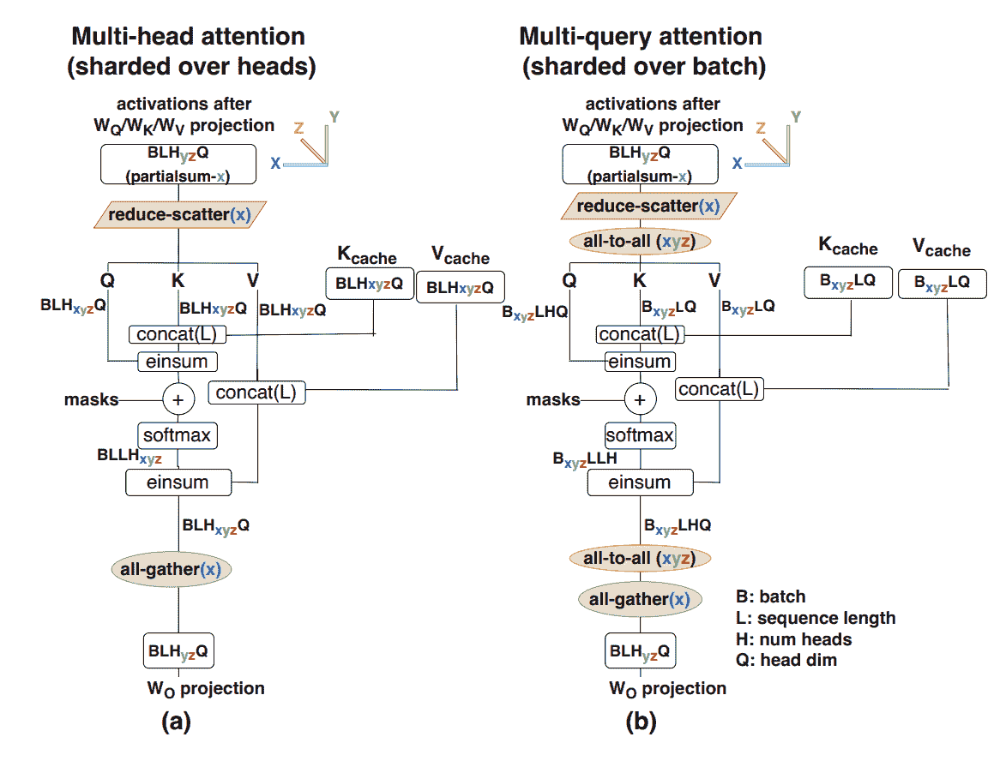</picture>

**图：** 与（a）纯模型分片的多头注意力和（b）KV 缓存批分片的多查询注意力的比较。注意我们为什么需要两个额外的 AllToAll 来将激活从模型分片转移到批分片，以便它们可以作用于 KV 缓存。

这个成本是每个注意力层两个 AllToAll——一个将 Q 激活移至批分片，以便我们可以使用批分片计算注意力，另一个将批分片注意力输出移回纯模型分片。

这里是完整的算法！

在这里，我们将写出在$Y$和$Z$上具有模型并行性的完整注意力算法。我为同时使用$K$作为键张量和 KV 头维度而道歉。设$M=N/K$。

1.  X[B, D] = … (现有激活，来自前一层的未分片)

1.  K[B[Z], S, K[Y], H], V[B[Z], S, K, H] = … (现有的 KV 缓存，批分片)

1.  Q[B, N[YZ], H] = X[B, D] * W[Q][D, N[YZ], H]

1.  Q[B[Z], N[Y], H] = **AllToAll**Z->B

1.  Q[B[Z], K[Y], M, H] = **Reshape**(Q[B[Z], N[Y], H])

1.  O[B[Z], S, K[Y], M] = Q[B[Z], K[Y], M, H] *[H] K[B[Z], S, K[Y], H]

1.  O[B[Z], S, K, M] = **Softmax**S

1.  O[B[Z], K[Y], M, H] = O[B[Z], S, K, M] *[S] V[B[Z], S, K[Y], H]

1.  O[B, K[Y], M[Z], H] = **AllToAll**Z->M

1.  O[B, N[YZ], H] = **Reshape**(O[B, K[Y], M[Z], H])

1.  X[B, D] {U[YZ]} = W[O][N[YZ], H, D] *[N,H] O[B, N[YZ], H]

1.  X[B, D] = **AllReduce**(X[B, D] { U[YZ]})

这相当复杂，但你可以大致了解它是如何工作的。新的通信成本相对较高，因为它们操作的是我们的小激活，而作为回报，我们节省了大量内存带宽来加载 KVs（它们是静态的）。

+   **序列分片：** 如果批大小太小，或者上下文很长，我们可以对 KV 缓存进行序列分片。同样，我们在跨分片累积注意力时支付了集体成本。首先，我们需要 AllGather Q 激活，然后以类似于 Flash Attention 的方式累积 KVs。

## 设计一个有效的推理引擎

到目前为止，我们已经探讨了如何有效地优化和分片单个预填充和生成操作。为了实际有效地使用它们，我们需要设计一个推理引擎，该引擎可以在我们选择的延迟/吞吐量 Pareto 前沿点上提供这两个操作。

最简单的方法是简单地运行一批预填充，然后运行一批生成：

<picture>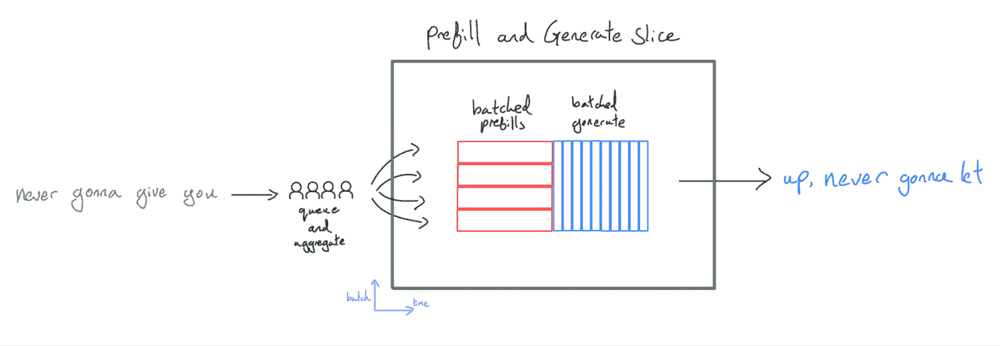</picture>

**图：** 在最简单的设置中，请求被聚合，服务器在运行一批预填充和调用生成函数之间交替，直到所有序列完成。

这很容易实现，并且是大多数代码库中的第一个推理设置，但它有多个缺点：

1.  **延迟非常糟糕。**我们将预填充和生成批量大小结合起来。在大的预填充批量大小下，首次令牌时间（TTFT）非常糟糕——你需要完成所有预填充，然后用户才能看到任何令牌。在小的批量大小下，生成吞吐量也非常糟糕。

1.  **我们阻止较短的生成在较长的生成上执行。**许多序列会在其他序列之前完成，在生成过程中留下空批处理槽位，进一步损害生成吞吐量。随着批量大小和生成长度的增加，这个问题会加剧。

1.  **预填充被填充。**预填充被填充到最长的序列，我们浪费了很多计算资源。对此有解决方案，但历史上 XLA 使跳过这些 FLOPs 变得相当困难。同样，随着批量大小和预填充序列长度的增加，这个问题会变得更糟。

1.  **我们被迫在预填充和生成之间共享一个分片。**预填充和生成都生活在同一个切片上，这意味着我们为两者使用相同的拓扑和分片（除非你保留两个权重的副本），并且通常对性能没有帮助，例如生成需要更多的模型分片。

因此，这种方法仅适用于边缘应用（通常只关注为单个用户提供服务并使用具有较少 FLOPs/byte 的硬件）以及 Transformer 代码库生命周期早期的快速迭代（由于其简单性）。

一种稍微好一点的方法是在批量大小为 1 时执行预填充（此时它是计算受限但具有合理的延迟），但在生成期间将多个请求一起批量处理：

<picture>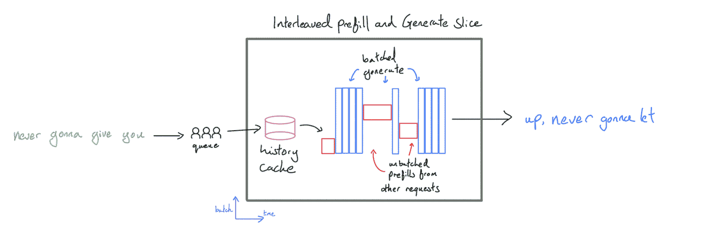</picture>

这将避免批量预填充时的 TTFT 浪费，同时保持生成吞吐量高。我们称这种配置为**交错**配置，因为我们“交错”预填充和生成步骤。这对于像评估这样的批量生成应用非常强大，因为吞吐量是主要目标。协调器可以配置为在任何生成槽位打开时优先预填充，确保即使对于非常大的生成批量大小也能实现高利用率。我们还可以避免将预填充填充到最大长度，因为它不会与另一个请求批量处理。

主要缺点是，当服务器正在执行预填充时，所有其他请求的生成都会暂停，因为所有计算资源都将被预填充消耗。忙于解码响应的用户 A 会被正在发生预填充的用户 B 阻塞。这意味着尽管 TTFT 有所改善，但平均而言，令牌生成将会有所波动且速度较慢，这对许多应用来说并不是一个好的用户体验——其他用户的预填充是请求整体延迟的关键路径。

为了解决这个问题，我们将解码和预填充分开。虽然 Transformer 推理可以在一个服务器上完成，但从延迟的角度来看，通常最好在两套 TPU/GPU 上执行两个不同的任务。预填充服务器生成键值缓存，并将其发送到网络中的生成服务器，生成服务器将多个缓存一起批处理并为每个缓存生成令牌。我们称这种服务为**“解耦”**服务。

<picture>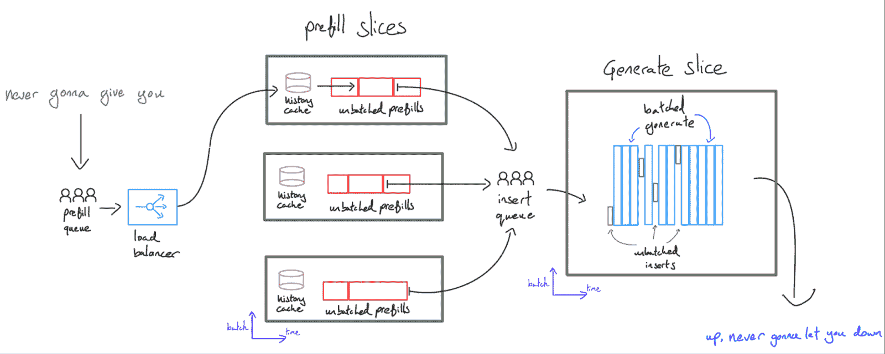</picture>

这提供了一些优势：

1.  **低延迟扩展性**：用户的请求永远不会因为其他用户的请求而阻塞，除非预填充容量不足。请求应立即预填充，然后发送到生成服务器，然后立即放入生成缓冲区。如果我们预计会有许多并发请求到来，我们可以独立于生成服务器的数量扩展预填充服务器的数量，这样用户就不会在预填充队列中等待过长时间。

1.  **专业化**：通常，预填充和生成的延迟最优参数划分策略/硬件拓扑结构相当不同（例如，对于生成来说，更多的模型并行性是有用的，但不适用于预填充）。限制两个操作使用相同的划分会损害两者的性能，并且使用两套权重会占用内存。此外，通过将预填充移动到自己的服务器上，它不需要保留任何除了当前正在处理的键值缓存以外的缓存。这意味着我们有更多的内存可用于历史缓存（见下一节）或优化预填充延迟。

一个缺点是现在需要将键值缓存通过网络传输。这通常是可接受的，但再次为减少键值缓存大小提供了动机。

**要点**：对于对延迟敏感、高吞吐量服务，我们通常需要将预填充和生成分别部署到不同的服务器上，预填充在批次 1 运行，生成将多个并发请求一起批处理。

### 持续批处理

上面的问题（2）促使了**持续批处理**的概念。我们优化和编译：

+   将具有可变上下文长度的多个预填充函数插入到某些键值缓冲区中，一些最大批量和上下文长度/页数。

+   一个生成函数，它接收键值缓存，并为所有当前活跃的请求执行生成步骤。

我们然后将这些函数与一个编排器结合，编排器负责排队处理传入的请求，根据可用的生成槽位调用预填充和生成，处理历史缓存（见下一节）并将令牌流出。

<picture>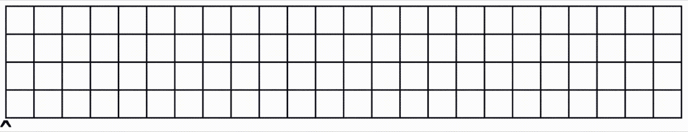</picture>

### 前缀缓存

由于预填充成本高昂且计算密集（给我们留下较少的余量），降低其成本的最佳方法之一是减少预填充的操作。因为大型语言模型（LLMs）是自回归的，所以查询“我喜欢狗”和“我喜欢猫”产生的 KV 缓存在前两个标记上是相同的。这意味着，原则上，如果我们首先计算“我喜欢狗”的缓存，然后计算“我喜欢猫”的缓存，我们只需要进行 1/3 的计算。我们可以通过重用缓存来节省大部分工作。这在一些特定情况下尤其强大：

1.  **聊天机器人**：大多数聊天机器人对话涉及严格追加的来回对话。这意味着如果我们能保存每个对话回合的 KV 缓存，我们就可以跳过除了最新标记之外的所有计算。

1.  **少样本提示**：如果我们有任何类型的少样本提示，这可以免费保存和重用。系统指令通常也有这种形式。

这之所以难以实现，仅仅是因为内存限制。正如我们所见，KV 缓存很大（通常有多个 GB），为了使缓存有用，我们需要在后续查询到达之前将其保留。通常，任何预填充服务器上未使用的 HBM 都可以用于本地缓存系统。此外，加速器通常在其 CPU 主机上拥有大量内存（例如，一个 8xTPUv5e 服务器有 128GiB 的 HBM，但大约有 450GiB 的主机 DRAM）。这种内存比 HBM 慢得多——通常太慢以至于无法进行生成步骤——但对于缓存读取来说足够快。在实践中：

+   由于 KV 缓存位于处理初始请求的 TPUs 集合中，我们需要某种形式的亲和路由来确保后续查询到达相同的副本。这可能会引起负载均衡问题。

+   较小的 KV 缓存是有帮助的（再次）——它使我们能够在相同的空间内保存更多的 KV 缓存，并减少读取时间。

+   KV 缓存及其查找可以非常自然地存储在树或字典树中。淘汰操作可以基于最近最少使用（LRU）原则进行。

<picture>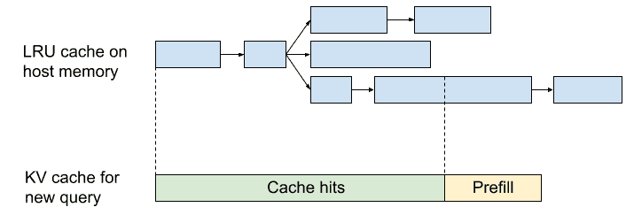</picture>

**图**：将 KV 前缀缓存实现为 LRU 字典树。我们可以通过共享前缀来避免重复 KV 内存。来源：[Character.ai 博客](https://research.character.ai/optimizing-inference/?ref=blog.character.ai)。

### 让我们看看一个实现示例：JetStream

Google 已经开源了一个实现此逻辑的库，称为 [JetStream](https://github.com/google/JetStream)。服务器有一组“预填充引擎”和“生成引擎”，通常位于不同的 TPU 切片上，由单个控制器进行编排。预填充发生在“[预填充线程](https://github.com/AI-Hypercomputer/JetStream/blob/c0f83127c16d7861cacc560303a28404c6cbb24c/jetstream/core/orchestrator.py#L499)”中，而生成发生在“[生成线程](https://github.com/AI-Hypercomputer/JetStream/blob/c0f83127c16d7861cacc560303a28404c6cbb24c/jetstream/core/orchestrator.py#L629)”中。我们还有一个“[传输线程](https://github.com/AI-Hypercomputer/JetStream/blob/c0f83127c16d7861cacc560303a28404c6cbb24c/jetstream/core/orchestrator.py#L592)”来编排将 KV 缓存从预填充复制到生成切片。

引擎接口（在[此处](https://github.com/google/JetStream/blob/445f1aa8e857d0a09d72618e365daf80723bdf4c/jetstream/engine/engine_api.py#L138)实现）是一个通用的接口，任何大型语言模型都必须提供。关键方法包括：

+   **预填充操作**：接受一组输入标记并生成一个 KV 缓存。

+   **插入操作**：接受一个 KV 缓存并将其插入正在生成的 KV 缓存批次中。

+   **生成操作**：接受一组批处理的 KV 缓存并为每个批次条目生成一个标记，将单个标记的 KV 缓存附加到每个标记的解码状态中。

我们也提供了 JetStream 的 PyTorch 版本，[在此处](https://github.com/google/jetstream-pytorch)可以找到。

## 工作问题

我将基于 LLaMA-2 13B 为这一部分发明一个新的模型。以下是详细信息：

| hyperparam | value |
| --- | --- |
| L (num_layers) | 64 |
| D (d_model) | 4,096 |
| F (ffw_dimension) | 16,384 |
| N (num_heads) | 32 |
| K (num_kv_heads) | 8 |
| H (qkv_dim) | 256 |
| V (num_embeddings) | 32,128 |

**问题 1**：上述模型有多少个参数？每个标记的 KV 缓存以 int8 为单位有多大？*你可以假设我们共享输入和输出投影矩阵。*

点击此处查看答案。

**参数数量**：

+   MLP 参数数量：$L * D * F * 3$

+   注意力参数数量：$L * 2 * D * H * (N + K)$

+   词汇参数：$D * V$（因为我们共享这些矩阵）

因此，我们的总参数数量为 $L * D * (3F + 2H * (N + K)) + D * V$。将上面的数字代入，我们得到 `64 * 4096 * (3*16384 + 2 * 256 * (32 + 8)) + 4096 * 32128 = 18.4e9`。因此，这个模型大约有 184 亿个参数。

KV 缓存的大小为每个标记 $2 * L * K * H$，以 int8 为单位，每个标记为 `2 * 64 * 8 * 256 = 262kB`。

**问题 2**：如果我们想在 TPUv5e 4x4 切片上运行此模型，并且可以完全在这个拓扑上分割我们的 KV 缓存，那么我们能够适应的最大批次大小是多少？如果我们把 KV 头的数量减少到 1 呢？

点击此处查看答案。

我们 KV 缓存的大小为每个 token 的$2 \cdot L \cdot K \cdot H$，在 int8 中，或者`2 * 64 * 8 * 256 = 262kB`。对于 128k 序列，这意味着每个批次条目为`262e3 * 128e3 = 33.5GB`。由于每个 TPU 有 16GB 的 HBM，包括我们的参数，我们可以适应的最大批次大小是`(16 * 16e9 - 18.4e9) / 33.5e9 = 7`。如果我们有$K=1$，那么我们将有 8 倍于此，即大约 56。

**问题 3**：假设在 TPU v5e 4x4 切片上完全分片，将所有参数从 HBM 加载到 MXU 需要多长时间？假设参数为 int8。*这是一个很好的每步延迟的下限。*

点击此处查看答案。

我们总共有 18.4B 参数，或者 18.4e9 字节在 int8 中。我们每个芯片有 8.1e11 HBM 带宽，所以如果我们能完全使用我们的 HBM 带宽，大约需要`18e9 / (8.1e11 * 16) = 1.3ms`。

**问题 4**：假设我们想在 TPUv5e 4x4 切片上使用 int8 FLOPs 和参数/激活来提供这个模型。我们将如何为预填充和解码进行分片？*提示：也许先回答这些问题：*

1.  在 4x4 上 ICI 看起来像什么？

1.  张量并行性的 roofline 界限是什么？

1.  我们如何分片 KV 缓存？

对于这种分片，生成的大致每步延迟是多少？

**问题 5**：让我们假设上面的模型实际上是一个 MoE。MoE 模型实际上是一个具有 E 个 FFW 块的密集模型。每个 token 通过 k 个 FFW 块，这些`k`个块被平均以产生输出。让我们使用`E=16`和`k=2`的上述设置。

1.  它有多少总参数和激活参数？*激活参数是指任何给定 token 使用的参数。*

1.  需要多少批次大小才能在 TPU v5e 上成为 FLOPs 限制？

1.  每个 token 的 KV 缓存有多大？

1.  在一个包含 T 个 token 的前向传递中涉及多少 FLOPs？

点击此处查看答案。

(1) 作为 MoE，每个 MLP 块现在有$3 * E * D * F$个参数，比密集版本增加了$E$。因此，它现在有$L * D * (3EF + 2H * (N + K)) + D * V$或`64 * 4096 * (3*16*16384 + 2 * 256 * (32 + 8)) + 4096 * 32128 = 212e9`个总参数，比密集版本增加了约 12 倍。对于激活参数，我们有$k$而不是$E$个激活参数，总共有`64 * 4096 * (3*2*16384 + 2 * 256 * (32 + 8)) + 4096 * 32128 = 31.2e9`，比密集版本增加了不到 2 倍。

(2) 因为我们只有$k$倍更多的 FLOPs 就有$E$倍更多的参数，我们的 HBM roofline 增加了$E/k$倍。这意味着在 TPU v5e 上我们需要大约`240 * (16 / 2) = 1920`个 token。

(3) KV 缓存的大小与 MoE 字符保持一致，因为 MoE 字符没有改变注意力机制。

(4) 这仍然是$2ND$，其中$D$是激活参数的数量。因此，这是$2 * \text{31.2e9} * T$。

**问题 6**：使用 MoEs，我们可以进行“专家分片”，即在网格的一个轴上分割我们的专家。按照我们的标准符号，我们的第一个 FFW 权重形状为 `[E, D, F]`，我们将其分片为 [E[Z], D[X], F[Y]]，其中`X`仅在训练期间作为我们的 FSDP 维度使用。假设我们想在 TPU v5e 上进行推理：

1.  对于 TPU v5e 8x16 切片上上述模型，Y=8，Z=16 的 HBM 权重加载时间是多少？每个 TPU 有多少空闲 HBM？

1.  我们能将模型放入最小的切片中吗？

**问题 7 [2D 模型分片]**：我们将通过[ESTI 论文](https://arxiv.org/pdf/2211.05102)中称为 2D 权重静态分片的数学问题。我们在附录 B 中简要描述了这一点，但先尝试解决这个问题，看看你是否能解决数学问题。2D 权重静态分片的基本思想是沿着$D$和$F$轴分片我们的权重，使得每个块大致为正方形。这减少了通信负载，并允许我们稍微扩展一些。

这是 2D 权重静态分片的算法：

1.  In[B, D[X]] = **AllGather**YZ

1.  Tmp[B, F[YZ]] {U.X} = In[B, D[X]] *[D] W[in][D[X], F[YZ]]

1.  Tmp[B, F[YZ]] = **AllReduce**X

1.  Out[B, D[X]] {U.YZ} = Tmp[B, F[YZ]] *[F] W2[F[YZ], D[X]]

1.  Out[B, D[XYZ]] = **ReduceScatter**YZ

你的目标是计算出这个算法的$T_\text{math}$和$T_\text{comms}$，并找出何时它会优于传统的 3D 模型分片？

点击此处查看答案！

让我们计算出$T_\text{math}$和$T_\text{comms}$。我们所有的 FLOPs 都是完全分片的，所以和之前一样，我们有$T_\text{math} = 4BDF / (N \cdot C)$，但我们的通信现在是

\[\begin{align*} T_\text{2D comms} = \frac{2BD}{2X \cdot W_\text{ici}} + \frac{4BF}{YZ \cdot W_\text{ici}} + \frac{2BD}{2X \cdot W_\text{ici}} = \frac{2BD}{X \cdot W_\text{ici}} + \frac{4BF}{YZ \cdot W_\text{ici}} \end{align*}\]

我们注意到 AllReduce 的成本是两倍，并且我们通过每个操作执行的轴的数量来缩放我们的通信。假设我们有选择拓扑的自由，并且假设$F=4D$（如 LLaMA-2 中所示），我们声称（通过一些基本的微积分）$X$、$Y$和$Z$的最佳值分别是$X = \sqrt{N / 8}$，$YZ = \sqrt{8N}$，因此总的通信量是

\[T_\text{2D comms} = \frac{2B}{W_\text{ici}} \left(\frac{D}{X} + \frac{8D}{YZ}\right) = \frac{\sqrt{128} BD}{\sqrt{N} \cdot W_\text{ici}} \approx \frac{11.3 BD}{\sqrt{N} \cdot W_\text{ici}}\]

首先，从上面复制，正常的 1D 模型并行会有$T_\text{model parallel comms} = 4BD / (3 \cdot W_\text{ici})$，那么何时新的通信会更小？我们有

\[\begin{align*} T_\text{model parallel comms} > T_\text{2D comms} \iff \frac{4BD}{3 \cdot W_\text{ici}} > \frac{\sqrt{128} BD}{\sqrt{N} \cdot W_\text{ici}} \\ \iff N > 128 \cdot \left(\frac{3}{4}\right)² = 81 \end{align*}\]

对于一般的$F$，我们声称这个条件是

\[N > 32 \cdot \left(\frac{F}{D}\right) \cdot \left(\frac{3}{4}\right)²\]

所以这告诉我们，如果我们有超过 81 个芯片，我们最好使用这个新方案。现在这是一个有点奇怪的结果，因为我们历史上在约 20 倍张量并行时发现自己处于 ICI 瓶颈。但在这里，即使我们处于通信瓶颈，我们的总通信量仍然随着总芯片数的增加而持续减少！这告诉我们，我们可以继续增加芯片，增加批量大小，进行更多的参数缩放，并看到延迟的降低。

### 第七部分的内容到此结束！要了解如何在 TPU 上运行 LLaMA 3，请点击这里。

## 附录

### 附录 A：批量大小>240 规则的真实性如何？

我们上面提供的简单规则，即我们的批量大小必须大于 240 个 token 才能成为计算瓶颈，大致上是正确的，但它忽略了 TPU 在执行其他操作（如设备间通信）时预取权重的能力。

这里是一个小型 Transformer 的层时间（以微秒为单位）的经验性图表，其 d[model]为 8192，d[ff]为 32768，并且每层只有 2 个 matmuls。这来自[这个 Colab 笔记本](https://colab.sandbox.google.com/drive/1_6krERgtolH7hbUIo7ewAMLlbA4fqEF8?usp=sharing)。您会看到，步骤时间在约 240 个批次之前增长非常缓慢，然后线性增长。

<picture>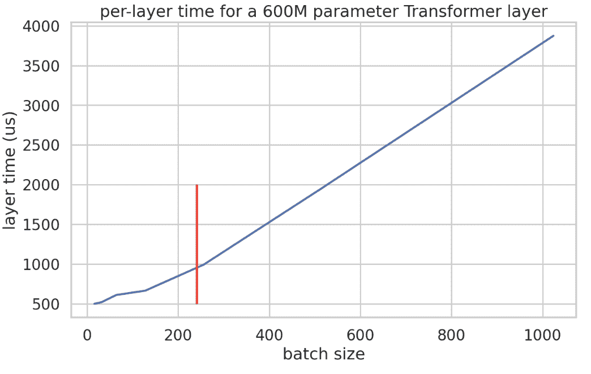</picture>

这里是实际的吞吐量（以 token/μs 为单位）。这使得论点相当清晰。由于我们的层大约有 600M 个参数，分片 4 次，我们预计至少的延迟为 365μs。

<picture></picture>

因此，至少在这个模型中，我们确实看到吞吐量在约 BS240 每个数据并行分片时增加。

### 附录 B：二维权重静态分片

随着拓扑的增长，如果我们能够访问更高维度的网格（如 TPU 的网格），则可以使用“**二维权重分片**”进一步细化。通过引入第二个分片轴。我们称之为“**二维权重静态**”，这在《Efficiently Scaling Transformer Inference》论文中有更详细的描述。[Efficiently Scaling Transformer Inference](https://arxiv.org/abs/2211.05102)。

由于我们在 Megatron 中只分片隐藏的\(F\)维度，一旦芯片数量随着 1D 分片增长而变得很大，它就可以显著小于\(E\)（\(d_\text{model}\)维度）。这意味着在更大的批量大小下，在 MLP 的第一层应用之后在隐藏维度上执行部分集体操作可能更加经济。

<picture>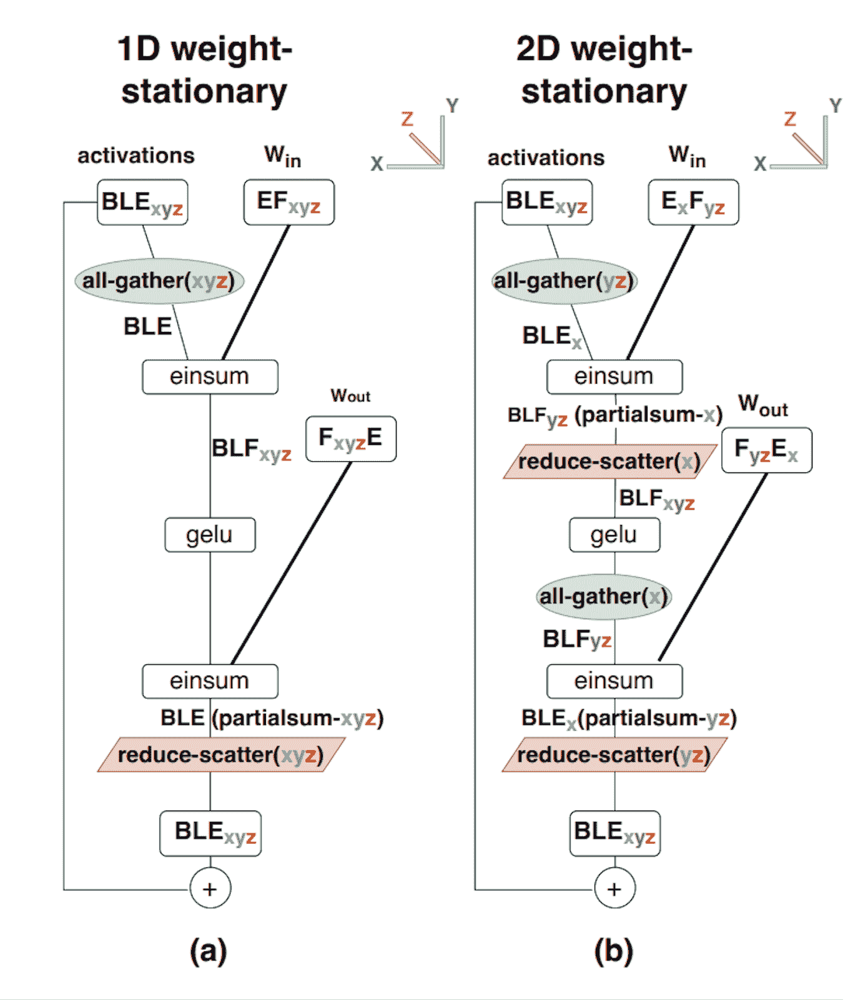</picture>

此图显示了：

1.  一维权重静态分片，也称为纯 Megatron 分片，其中激活在 AllGather 之后完全复制，权重在隐藏的 F 维度上完全分片。

1.  2D 权重静态分片，其中权重在隐藏 F 和减少 E 维度上分片，激活在 E 维度上分片。我们在第一层之前在(yz)轴上进行 AllGather，然后在(x)轴上进行 ReduceScatter。

对于注意力层，Megatron 风格的分片对于较小的芯片数量来说也比较简单。然而，Megatron 是在\(n_\text{heads}\)维度上进行的，这限制了可能进行的分片数量。通过修改 2D 分片（而不是分片隐藏层，而是分片\(n_\text{heads}\)维度），我们获得了进一步扩展的能力。

### 附录 C：延迟限制通信

作为回顾，在第三部分中，我们推导了在每个 TPU 上执行 AllGather 到大小为 B 的张量所需的时间，在 1D 全双工带宽为 WICI 和延迟 Tmin 的环链上的 X 个芯片上。

\[T_{total} = \max\left(\frac{T_{min} \cdot |X|}{2}, \frac{B}{W_{ICI}}\right)\]

对于大的 B，墙钟时间相对恒定，因为当你向系统中添加更多芯片时，你同时增加了执行操作所需的数据移动量以及总带宽。

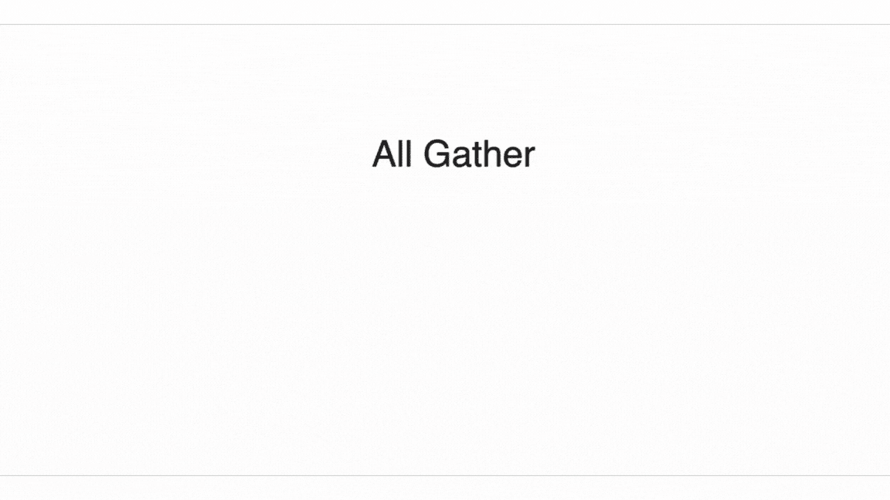

由于在延迟优化推理过程中移动的数据量相对较低，激活上的集体操作通常受延迟项的限制（特别是对于小批量大小）。可以通过计算完成前所需的跳数来很容易地可视化延迟。

在 TPU 上，如果通信的张量大小相关部分小于每跳 1 微秒（跳是指两个相邻设备之间的通信），我们可能会因为实际调度集体操作的固定开销而成为瓶颈。在`4.5e10`单向 ICI 带宽下，当：\((\text{bytes} / n_\text{shards}) / 4.5e10 < 1e-6\)时，ICI 通信变为延迟限制。对于 8 路 Megatron 分片，这是当`buffer_size < 360kB`时。**实际上，在推理过程中并不算小**：在`BS=16`和`D=8192`的 int8 中，我们的激活将使用`16*8192=131kB`，因此我们已经达到延迟限制。

**要点**：当\(\text{total bytes} < W_{ICI} \times 1e-6\)时，我们的通信变为延迟限制。例如，当模型并行超过\(Y\)时，我们在 int8 中成为限制，当\(Y > BD / 45,000\)时。

这里可以与计算屋顶线进行类比——我们正在承担一些小操作（通信的延迟，矩阵乘法的内存带宽）的固定成本。

### 附录 D：推测采样

当我们**真正**关心端到端延迟时，我们可以使用一个额外的技巧，称为推测采样<sup><a id="spec1"></a><a id="spec2"></a></sup>。作为回顾，我们通常逐个从大型 Transformer 生成标记：</sup>

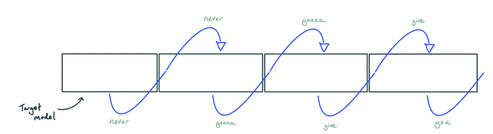

使用推测性采样时，我们使用一个较小、较便宜的小型模型生成标记，然后使用大模型检查结果。这可以通过**贪婪解码**来最容易理解：

<图片>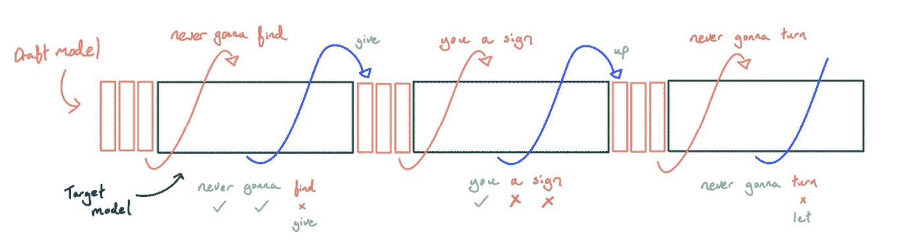</图片>

1.  我们从一些较小、较便宜的小型模型中进行贪婪采样。理想情况下，我们使用训练以匹配较大模型的模型，例如通过蒸馏，但它可能只是简单地使用 n-gram 或与小型文本语料库进行标记匹配。

1.  在我们生成 K 个标记后，我们使用大模型计算到目前为止生成的所有标记的下一个标记的 logits。

1.  由于我们是贪婪解码，我们只需检查较小模型生成的标记是否是所有可能标记中概率最高的。如果其中一个标记是错误的，我们取最长的正确前缀，并用正确的标记替换第一个错误的标记，然后回到（1）。如果所有标记都是正确的，我们可以在回到（1）之前使用最后一个正确的 logit 来采样一个额外的标记。

**为什么这会降低延迟？** 这个方案仍然要求我们对每个标记进行一次大模型的 FLOPs 等效的前向传递，但由于我们可以将大量标记一起批处理，我们可以在一次前向传递中完成所有这些 FLOPs，并利用我们**不是**计算受限的事实来免费为更多标记评分。

每个被接受的标记在平均 FLOPs（因为一些会被拒绝，我们不得不调用一个草稿模型）方面都会变得更贵，但我们从硬件中榨取了更多的 FLOPs，小型模型又很便宜，所以总体上我们是赢家。我们还跨多个步骤共享 KV 缓存加载，因此**推测性解码也可以为长上下文带来吞吐量的提升**。由于一切都已经由大模型检查过，我们根本不需要改变采样分布（尽管非贪婪的情况下，确切的轨迹会有所不同）。

传统上，推测性解码依赖于存在一个与目标模型具有相似采样分布的小型模型，例如 LLaMA-2 2B 用于 LLaMA-2 70B，这通常是不存在的。即使这种模型可用，如果接受率低，较小的草稿模型仍然可能过于昂贵。相反，将草稿模型嵌入到主模型中可能有所帮助，例如通过向基础模型的后几层添加一个专门的草稿头<参考文献 key="eagle"><参考文献 key="medusa"><参考文献 key="DeepSeek3">。因为这个头与主模型共享大多数参数，所以运行速度更快，并且更接近采样分布。</参考文献></参考文献></参考文献>

对于正常的自回归采样，标记/步与步时间相同。我们仍然受制于这里算术强度部分的理论最小步时间（实际上，推测性采样的步时间通常比正常的自回归采样慢得多，但因为我们平均每步可以得到超过 1 个标记，我们可以得到更好的标记/秒）。

<picture>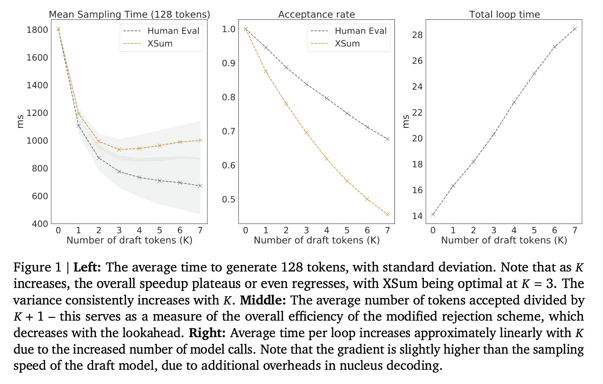</picture>

**图示：** 这张图显示了 Chinchilla（DeepMind 的一个 70B 模型）与一个 4B 参数的 drafter（小型模型）的每步延迟和投机成功率。对于 XSum（一个自然语言数据集），理想的投机量大约是 3-4 个令牌，而 HumanEval（一个编码数据集）则更可预测，并且从更激进的投机中看到收益。

**非贪婪解码是如何工作的？** 这要复杂一些，但本质上归结为一个受 Metropolis-Hastings 启发的算法，其中我们有了从 logits 推导出的 \(P_{\text{draft model}}(\text{chosen token})\) 和 \(P_{\text{target model}}(\text{chosen token})\)，如果这些概率的比率小于某个阈值，则概率性地拒绝所选的令牌。

这两篇[论文](https://arxiv.org/abs/2211.17192) [和这篇](https://arxiv.org/abs/2302.01318) 同时推导出这一结论，并提供了很好的实际应用示例。

**要点总结：** 投机采样是另一种强大的杠杆，可以在吞吐量和每令牌延迟之间进行权衡。然而，在批大小受限的情况下（例如，小硬件占用或大 KV 缓存），它成为一种双赢的局面。  ### 杂项

^*在 Google DeepMind 的工作，现在在 MatX。

### 引用

在学术环境中进行归属时，请引用以下工作：

```py
 Austin et al., "How to Scale Your Model", Google DeepMind, online, 2025. 
```

或者作为一个 BibTeX 条目：

```py
 @article{scaling-book,
      title = {How to Scale Your Model},
      author = {Austin, Jacob and Douglas, Sholto and Frostig, Roy and Levskaya, Anselm and Chen, Charlie and Vikram, Sharad
      and Lebron, Federico and Choy, Peter and Ramasesh, Vinay and Webson, Albert and Pope, Reiner},
      publisher = {Google DeepMind},
      howpublished = {Online},
      note = {Retrieved from https://jax-ml.github.io/scaling-book/},
      year = {2025}
    } 
``` 
