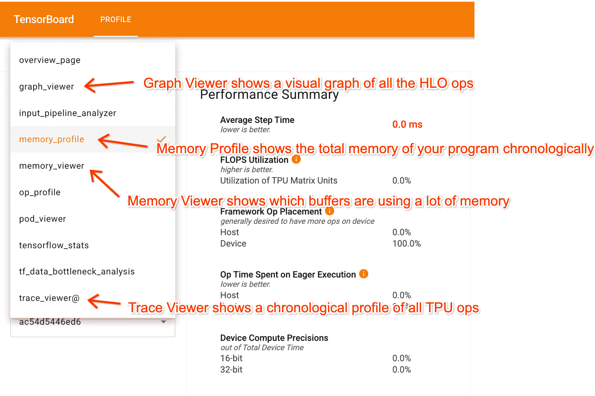
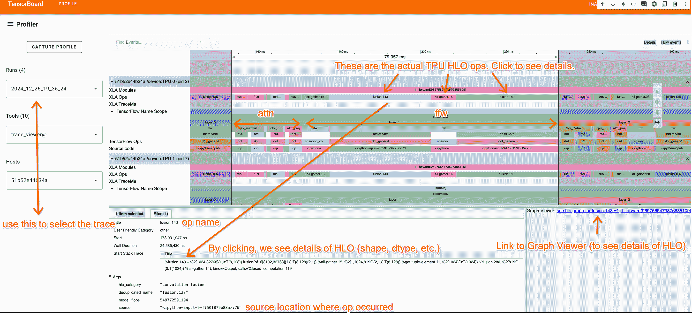
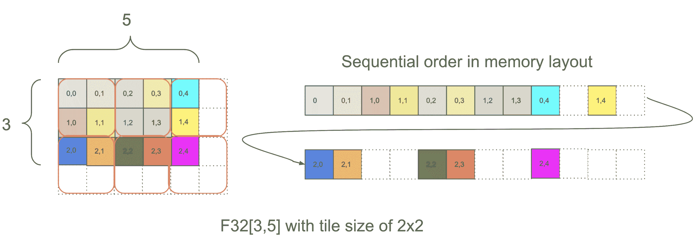
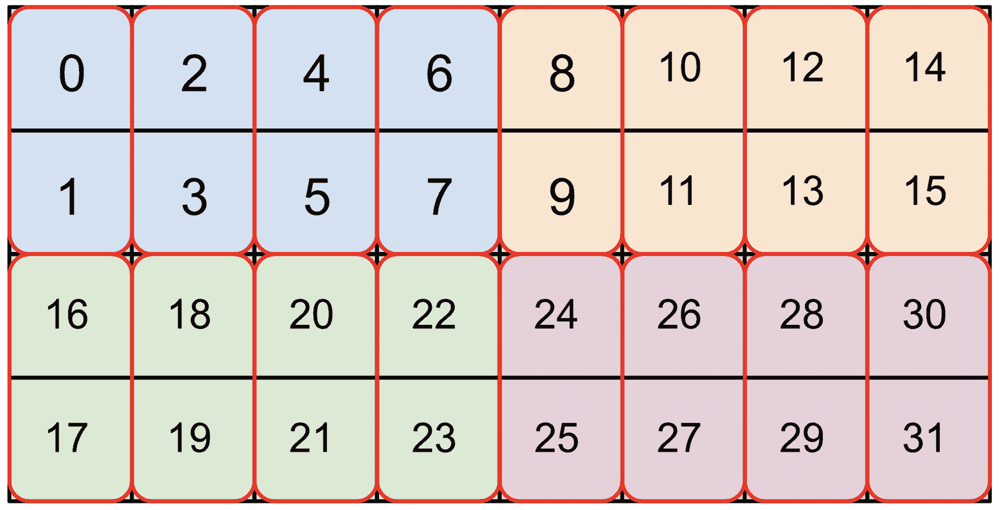
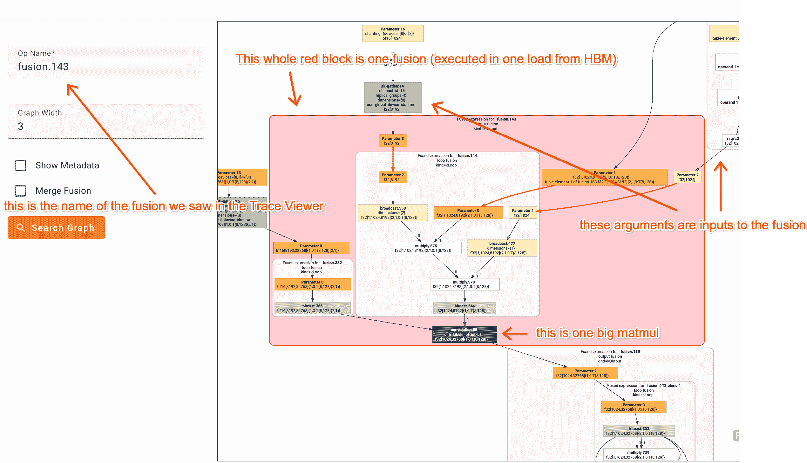
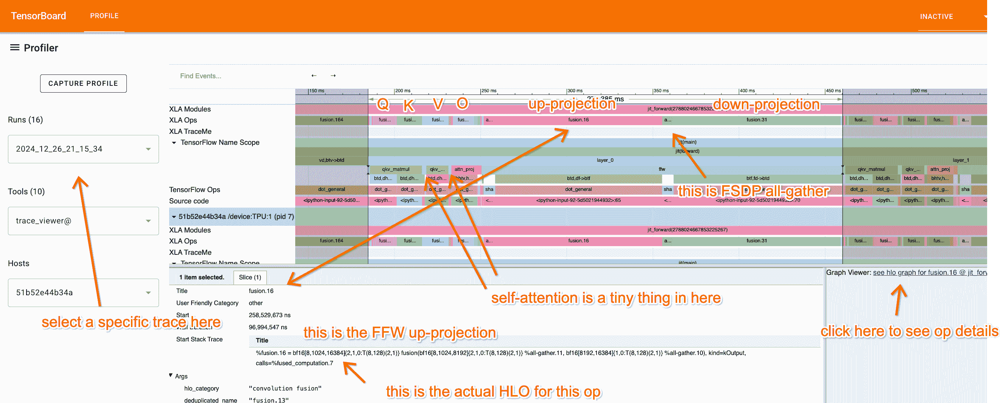
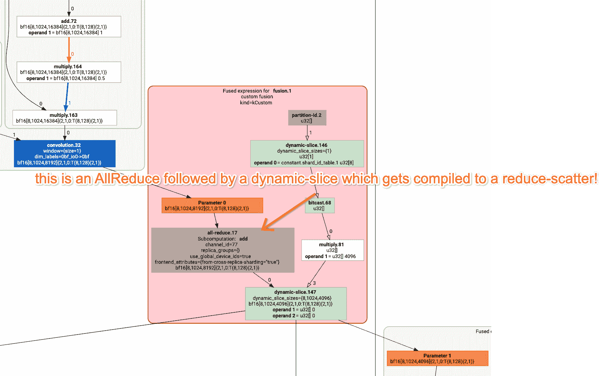
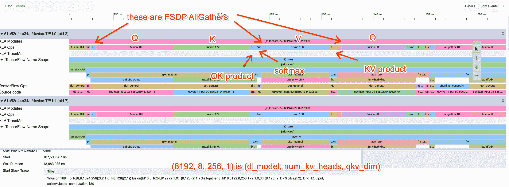
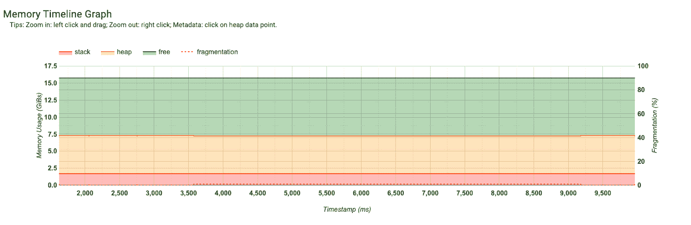
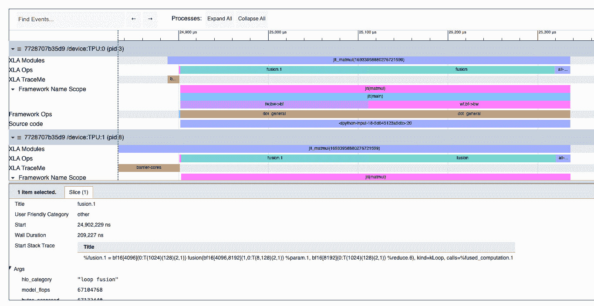

# 如何分析 TPU 程序

> 原文：[`jax-ml.github.io/scaling-book/profiling`](https://jax-ml.github.io/scaling-book/profiling)

《如何扩展你的模型》第九部分如何扩展你的模型 (第八部分：服务 LLaMA | 第十部分：JAX)

到目前为止，这个系列完全是理论性的：基于硬件性能上限的估算。这种理解可以让你走得很远，但很多优化都归结于实际细节：XLA 编译器是如何工作的，以及如何使用像 JAX/Tensorboard 分析器这样的分析工具来找出当它失败时应该做什么。我们在这里讨论这个问题。  ### 内容

TPU 软件栈的千尺观 TensorBoard 分析器：多用途 TPU 分析器

+   跟踪查看器

+   如何阅读 XLA 操作

+   图形查看器

+   查看一个真实（几乎）的示例分析

+   内存分析

练习题

## TPU 软件栈的千尺观

Google 公开了一系列用于编程 TPU 的 API，从高级 JAX 代码到低级 Pallas 或 HLO。大多数程序员只写 JAX 代码，这让你可以编写抽象的 NumPy 风格的线性代数程序，这些程序会自动编译以在 TPU 上高效运行。

这里有一个简单的例子，一个乘以两个矩阵的 JAX 程序：

```py
import jax
import jax.numpy as jnp

def multiply(x, y):
  return jnp.einsum('bf,fd->db', x, y)

y = jax.jit(multiply)(jnp.ones((128, 256)), jnp.ones((256, 16), dtype=jnp.bfloat16)) 
```

通过调用`jax.jit`，我们告诉 JAX 跟踪这个函数并生成一个称为[StableHLO](https://openxla.org/stablehlo)的更低级别的 IR，这是一个用于机器学习的平台无关的 IR，然后由 XLA 编译器将其降低到 HLO。编译器运行多个遍历来确定融合、布局和其他因素，这些因素导致了在 JAX 分析中可观察到的 HLO。这个 HLO 以 LLVM 风格的图形视图表示了 JAX 代码中的所有核心线性代数操作（矩阵乘法、逐点操作、卷积等）。例如，以下是上述程序作为 HLO 的简略版本：要获取这个 HLO，你可以运行`jax.jit(f).lower(*args, **kwargs).compile().as_text()`。

```py
ENTRY %main.5 (Arg_0.1: f32[128,256], Arg_1.2: bf16[256,16]) -> f32[16,128] {
  %Arg_1.2 = bf16[256,16]{1,0} parameter(1), metadata={op_name="y"}
  %convert.3 = f32[256,16]{1,0} convert(bf16[256,16]{1,0} %Arg_1.2),
  %Arg_0.1 = f32[128,256]{1,0} parameter(0), metadata={op_name="x"}
  ROOT %dot.4 = f32[16,128]{1,0} dot(f32[256,16]{1,0} %convert.3, f32[128,256]{1,0} %Arg_0.1), lhs_contracting_dims={0}, rhs_contracting_dims={1},
} 
```

我们将在下一秒解释 HLO 的语法，但在此之前，请注意它实际上与上面的 JAX 代码相当匹配。例如，

```py
ROOT %dot.4 = f32[16,128]{1,0} dot(f32[256,16]{1,0} %convert.3, f32[128,256]{1,0} %Arg_0.1), lhs_contracting_dims={0}, rhs_contracting_dims={1} 
```

是实际上的矩阵乘法，分别沿着 0 和 1 维度乘以两个 f32 矩阵。

**为了将此 HLO 转换为可以在 TPU 上执行的代码，XLA 编译器首先将其降低到 LLO**（低级优化器）IR。LLO 直接编程 TPU，在内存之间调度复制，将数组推送到阵列，等等。LLO 代码包含将缓冲区推送到阵列、提取结果并调度在不同 TPU 内存部分之间通信的 DMAs 的原始代码。一旦降低到 LLO，它就会被编译成加载到 TPU IMEM 并执行的机器代码。

当程序运行速度比我们期望的要慢时，我们主要与 JAX 级别合作以提高性能。然而，这样做通常需要我们理解一些 HLO 的语义以及代码在 TPU 上实际是如何运行的。当在较低级别出现问题时，我们会再找一个逃生口，并在[Pallas](https://jax.readthedocs.io/en/latest/pallas/tpu/details.html)中编写自定义内核。要查看程序的 HLO 及其运行时统计信息，我们使用 JAX 分析器。

## JAX 分析器：多用途 TPU 分析器

JAX 提供了一个多用途的 TPU 分析器，包含一系列有用的工具，用于在程序运行时理解 TPU 上发生的情况。您可以使用`jax.profiler`模块在程序运行时跟踪程序，并记录每个子组件的持续时间、每个程序的 HLO、内存使用情况等等。例如，此代码将跟踪输出到`/tmp/tensorboard`的文件中，可以在 TensorBoard 中查看（[这里](https://docs.jax.dev/en/latest/profiling.html#tensorboard-profiling)是一个逐步指南）。

```py
import jax
with jax.profiler.trace("/tmp/tensorboard"):
  key = jax.random.key(0)
  x = jax.random.normal(key, (1024, 1024))
  y = x @ x
  y.block_until_ready()

# Now you can load TensorBoard in a Google Colab with
#
# !pip install tensorboard tensorboard-plugin-profile
# %load_ext tensorboard
# %tensorboard --logdir=/tmp/tensorboard
#
# or externally with
#
# > tensorboard --logdir=/tmp/tensorboard
# 
```

下面是您可以在分析器中执行的操作概述：

<picture></picture>

一旦进入 TensorBoard，分析器有几个关键标签可以帮助您理解您的程序：

1.  **跟踪查看器**显示了 TPU 上实际发生的详细时间线，作为一个时间线。

1.  **图形查看器**显示了 HLO 图，让您看到程序的哪些部分相互输入，以及事物是如何分片的。

1.  **内存配置文件和内存查看器**：这些显示了您的程序使用了多少内存。

虽然分享配置文件稍微有些困难，但[这里](https://ui.perfetto.dev/#!/?s=fa9f13b487bde622707c1a503f9227c34594760a)是一个 Perfetto 链接，其中包含至少一个简单转换器的跟踪查看器组件。[这个 Colab](https://colab.research.google.com/drive/1_6krERgtolH7hbUIo7ewAMLlbA4fqEF8?usp=sharing)让您可以生成完整的 JAX/TensorBoard 跟踪并与之互动。

### 跟踪查看器

**跟踪查看器可能是分析器中最有用的部分**。下面的示例展示了一个带有注释片段的简单转换器。名称来自代码中提供的标签。

<picture></picture>

跟踪查看器显示了每个 TPU 核心上所有操作的按时间顺序的时间线。我们在这里只查看 TPU:0，因为通常所有 TPU 都执行相同的指令。以下是一些要点：

1.  顶部行（XLA Ops）显示了实际的 TPU 操作（名称是 HLO 名称）。其余一切都是基于`jax.named_scope`、`jax.named_call`和 Python 堆栈跟踪的近似跟踪。

1.  注意重复的块，我们可以在这里隔离一个单独的层。我们还可以通过查看代码/理解 Transformer 的工作原理来了解哪些部分是注意力机制，哪些部分是 MLP。

1.  通过点击 XLA 操作，我们可以查看它在代码中的位置（对于理解跟踪很有用）并查看到图形查看器的链接。

**提示：** 您可以使用“视频游戏”风格的控件导航 Trace Viewer，使用 A/D 键左右平移，使用 W/S 键放大和缩小。这些控件使导航变得更加容易。

### 如何阅读 XLA 操作

HLO 实际上并不难读，并且对于理解上述跟踪的某个部分非常有帮助。以下是一个名为 fusion.3 的示例操作。

```py
%fusion.3 = bf16[32,32,4096]{2,1,0:T(8,128)(2,1)S(1)} fusion(bf16[32,32,8192]{2,1,0:T(8,128)(2,1)S(1)} %fusion.32), kind=kCustom, calls=%all-reduce-scatter.3 
```

让我们将这个分解成它的各个部分。

+   **操作名称：** fusion.3

    +   点或融合操作是一组最多包含 1 次矩阵乘法和可能是一系列相关点积 VPU 操作的运算。

+   **形状/布局：** `bf16[32,32,4096]`

    +   这是操作的输出形状。我们可以看到数据类型是 bf16（每个参数 2 字节）并且`[32,32,4096]`是形状。

+   **布局：** `{2,1,0:T(8,128)(2,1)}`

    +   `{2,1,0:T(8,128)(2,1)}`告诉我们内存中轴的顺序（列主序，行主序等）以及数组填充。更多内容见下文。

+   **内存位置：** S(1)

    +   S(1)告诉我们这个数组位于 VMEM 中。S(0)（有时省略）是 HBM。S(2)和 S(3)是其他内存空间。

+   **参数：** `bf16[32,32,8192]{2,1,0:T(8,128)(2,1)S(1)} %fusion.32`

    +   这个操作有一个输入，一个名为 fusion.32 的 bf16 数组，具有特定的形状。这告诉我们什么函数输入到这个数组中。

让我们尝试更深入地理解这个符号。让我们以一个简单的例子为例：

`f32[3,5]{1,0:T(2,2)}`

这再次告诉我们这个操作返回一个形状为`[3, 5]`的特定 tiling `{1,0:T(2,2)}`的 float32 数组。虽然 tiling 不是非常重要，但简而言之，tiling 告诉我们 N 维数组在内存中是如何顺序排列的。以下是一个显示此数组如何排列的图示：



在 `{1,0:T(2,2)}` 中，`1,0` 部分告诉我们数组维度在物理内存中的顺序，从最不重要的到最重要的。您可以从右向左读取这部分，并从 `f32[3,5]` 中挑选出相应的维度，以确定数组的物理布局。在这个例子中，物理布局是 `[3,5]`，与逻辑形状相同。之后，`T(2,2)` 告诉我们数组以 `(2, 2)` 的块进行铺砖，其中在每个块内，数组首先有行（**行主序**），然后是列，即 `(0, 0)` 后跟 `(0, 1)`，然后是 `(1, 0)` 和 `(1,1)`。由于 `T(2, 2)` 铺砖，数组被填充到 `[4, 6]`，其内存使用量增加了约 1.6 倍。对于上面给出的大的 bf16 数组 `bf16[32,32,8192]{2,1,0:T(8,128)(2,1)S(1)}`，我们执行 `T(8,128)(2,1)`，这告诉我们数组有两级铺砖，一个外部的 `(8, 128)` 铺砖和一个在该单元内部的 `(2, 1)` 铺砖（用于 bf16，因此我们的加载总是 4 字节的倍数）。例如，这里有 `bf16[4,8]{1,0,T(2,4)(2,1)}`（颜色是 (2,4) 块，红色框是 (2,1) 块）：



铺砖（tiling）会影响将张量块高效加载到 VMEM 中的方式，XLA 有时会引入复制操作，以“重新铺砖”或“重新布局”程序中的张量，有时会产生非平凡的额外开销。JAX 提供了一个实验性功能来解决这个问题，允许 XLA 为程序的输入计算其“首选”布局。当您使用 `jax.jit` 对程序进行即时编译时，您通常传递“模拟”输入，告诉 JAX 期望的形状和 dtype。这些通常也携带可能不是最优的铺砖信息。相反，您可以指定输入布局为 AUTO，`jax.jit` 将返回 jitted 程序首选的布局。然后您可以显式地以该布局加载张量，以避免在程序中引起复制。

### 图形查看器

虽然上述一些融合可能看起来很复杂，但 XLA 图形查看器使它们更容易解析。例如，这里是一个相当复杂的融合的视图：



仔细观察一系列 HLO 图表并尝试将 HLO 操作映射到您正在分析的代码中，这非常有帮助。通过悬停在某个框上，您通常会看到定义该函数的代码行。

### 查看一个真实（几乎）的示例配置文件

[这个 Colab](https://colab.research.google.com/drive/1_6krERgtolH7hbUIo7ewAMLlbA4fqEF8?usp=sharing) 有一个假 Transformer 的示例配置文件。[这里](https://ui.perfetto.dev/#!/?s=fa9f13b487bde622707c1a503f9227c34594760a) 是一个 Perfetto 链接，如果您很匆忙，至少可以查看 Trace 查看器。我已经比平时更努力地对跟踪进行了 `jax.named_scope` 调用的注释，以便您可以识别正在发生的事情。



查看配置文件并尝试真正理解每一部分的作用。让我们先从 FFW 块开始分析：

<picture></picture>

这里我们放大了 FFW 块。你会看到上投影操作是一个融合（矩阵乘法），输入为`bf16[8, 1024, 8192]`和`bf16[8192, 16384]`，输出为`bf16[32, 1024, 16384]`。我知道（因为我写了这段代码）这是一个 4 路 DP、2 路 MP 分片矩阵乘法的局部视图，所以我们实际上在做

**X:** `bf16[32, 1024, 8192]` * **W[in]**: `bf16[8192, 32768]` -> **Tmp**: `bf16[32, 1024, 32768]`

**我们预计这需要多长时间？** 首先，我们每个数据并行分片的大小是`8 * 1024 = 8192`，所以我们应该是计算受限的。这是在 8 个 TPUv2 核心上（在 Google Colab 上免费可用），我们预计它需要大约`2 * 32 * 1024 * 8192 * 32768 / (23e12 * 8) = 95.6ms`，这几乎就是实际所需的时间（96ms）。太棒了！这意味着我们得到了惊人的 FLOPs 利用率！

**关于通信方面呢？** 你会注意到在第二个矩阵乘法操作末尾隐藏的小融合。如果我们点击它，你会看到

```py
%fusion.1 = bf16[8,1024,4096]{2,1,0:T(8,128)(2,1)} fusion(bf16[8,1024,8192]{2,1,0:T(8,128)(2,1)} %fusion.31), kind=kCustom, calls=%all-reduce-scatter.1 
```

这基本上是一个小型的 ReduceScatter（这里是有 GraphViewer 的图示）；

<picture></picture>

我们预计这需要多长时间？嗯，我们在 TPUv2 4x2 上执行 ReduceScatter，这应该只需要 1.2e11 双向带宽的一次跳跃。数组大小为`2*32*1024*8192`，批处理轴以 4 种方式分片，所以每个分片大小为`2*8*1024*8192=134MB`。所以这应该大约需要 1.1ms。**实际上需要多长时间？** 配置文件中报告为 1.13ms。所以我们非常接近屋顶线！

**让我们也看看注意力机制！** 这里是注意力组件的配置文件：

<picture></picture>

我点击了 Q 投影操作，它使用形状为[d[model] = 8192, n[heads] = 32, d[qkv] = 256]的矩阵\(W_Q\)。我们在头部维度上使用 Megatron 分片。尝试做同样的练习，计算这些操作需要多长时间。

### 内存配置文件

内存配置文件使得程序内存随时间变化的情况变得容易观察。这对于调试 OOMs 很有帮助。你可以看到这里大约分配了 7.5GB 用于模型参数，大约有 10GB 空闲。所以我们可以将更多的内容放入内存中。

<picture></picture>

## 工作问题

**问题 1**：查看[这个](https://colab.research.google.com/drive/1LfLO3OTr-_MWFPxUN36KJ3cqH0BcAoli?usp=sharing) Colab/profile，找出这里可疑的地方以及正在发生的事情。你能告诉我确切的计算过程以及每个操作的作用吗？涉及到的每个矩阵的真实形状是什么，它们是如何分片的？*首先尝试查看配置文件，而不阅读代码。*

<picture></picture> 点击这里查看答案。

这实际上是两次矩阵乘法，即具体来说就是：

```py
def matmul(w1, w2, x):
  return jnp.einsum('wf,bf->bw', w2, jnp.einsum('fw,bw->bf', w1, x)) 
```

你可以看到一个 reduce，两个大的融合，以及一个 all-reduce。第一个大的融合是：

`%fusion.1 = bf16[4096]{0:T(1024)(128)(2,1)} fusion(bf16[4096,8192]{1,0:T(8,128)(2,1)} %param.1, bf16[8192]{0:T(1024)(128)(2,1)} %reduce.6), kind=kLoop, calls=%fused_computation.1`

这告诉我们每个分片的大小是 `bf16[8192] * bf16[4096, 8192] -> bf16[4096]`（在 8192 维度上）。通过观察最后的 AllReduce，`replica_groups=\{\{0,16,32,48,64,80,96,112\}, ...\}`，我们可以知道我们正在进行 8 方模型并行，因此真正的形状是 `[8, 8192] * bf16[32,768, 8192] -> bf16[8, 32,768]`。

**问题 2:** [之前提到的 Transformer Colab](https://colab.research.google.com/drive/1_6krERgtolH7hbUIo7ewAMLlbA4fqEF8?usp=sharing) 实现了一个简单的模拟 Transformer。按照 Colab 中的说明进行操作，获取具有 GSPMD 分区的朴素 Transformer 的基准。每个部分需要多长时间？应该需要多长时间？使用了哪种分片策略。尝试修复分片策略！*提示：使用 `jax.lax.with_sharding_constraints` 来约束行为。修复后，你能获得最佳的 MXU 吗？*

作为参考，初始版本大约每层需要 184ms，优化后的配置文件每层需要 67ms。完成这些后，尝试仔细观察配置文件，看看你是否可以仅从配置文件中回答这些问题：

+   这种分片策略是什么？

+   批大小是多少，\(d_\text{model}\)，\(d_\text{ff}\)？

+   在注意力机制与 MLP 块之间，花费的时间比例是多少？

+   在 roofline 上，每个操作应该花费多少时间比例？

**注意：** 自从这个问题被编写以来，XLA 编译器已经得到了改进。初始版本现在大约每层需要 90ms，优化后的配置文件每层仅比优化前好大约 10ms（80ms/层）。尽管如此，仍然值得尝试并看看你是否能做得更好。

### 第九部分到此结束。对于第十部分，深入了解 JAX 并行性，请点击这里。  ### 杂项

^*在 Google DeepMind 完成的工作，现在在 MatX。

### 引用

在学术环境中进行归属时，请引用这项工作如下：

```py
 Austin et al., "How to Scale Your Model", Google DeepMind, online, 2025. 
```

或者作为 BibTeX 条目：

```py
 @article{scaling-book,
      title = {How to Scale Your Model},
      author = {Austin, Jacob and Douglas, Sholto and Frostig, Roy and Levskaya, Anselm and Chen, Charlie and Vikram, Sharad
      and Lebron, Federico and Choy, Peter and Ramasesh, Vinay and Webson, Albert and Pope, Reiner},
      publisher = {Google DeepMind},
      howpublished = {Online},
      note = {Retrieved from https://jax-ml.github.io/scaling-book/},
      year = {2025}
    } 
``` 
