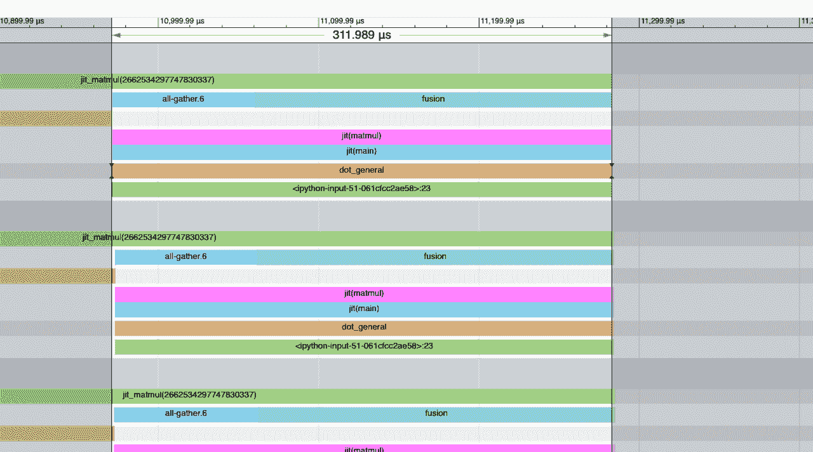
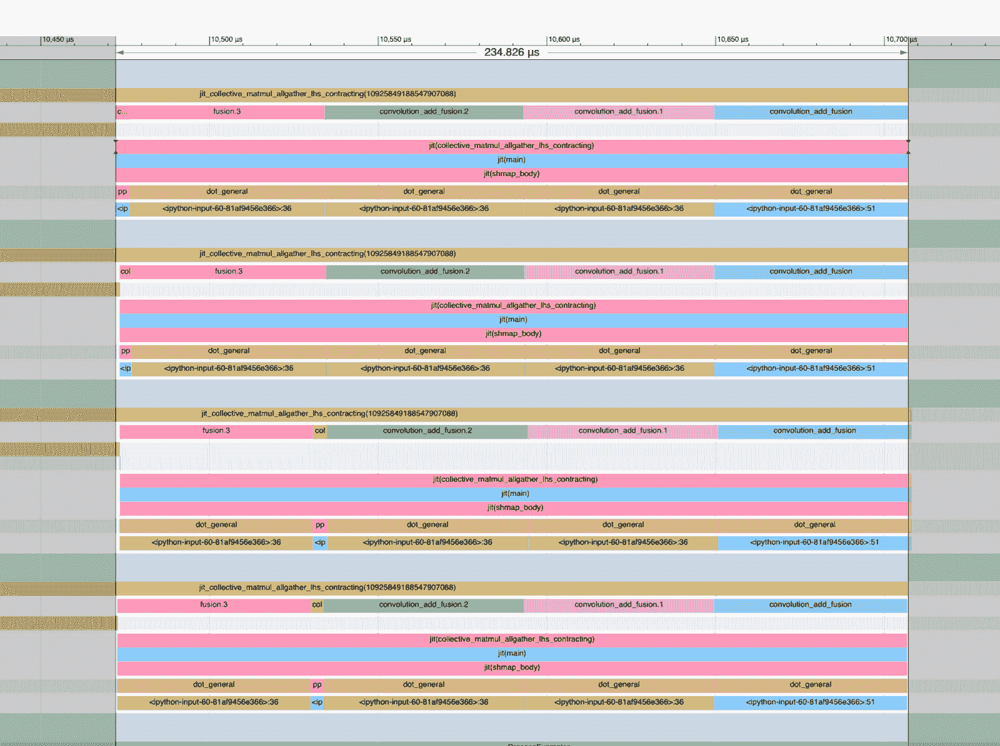

# 在 JAX 中编程 TPUs

> 原文：[`jax-ml.github.io/scaling-book/jax-stuff`](https://jax-ml.github.io/scaling-book/jax-stuff)

《如何扩展你的模型》第十部分如何扩展你的模型 (第九部分：性能分析 | 第十一部分：结论)

如何高效地使用 JAX 来编程 TPUs！本节的大部分内容来自[这里](https://jax.readthedocs.io/en/latest/jep/14273-shard-map.html)。你可以使用免费 TPUs 在[Google Colab](https://colab.sandbox.google.com/)上运行本节中的代码示例。  ### 内容

JAX 中的并行是如何工作的？

+   自动分片模式

+   “显式分片模式”

+   通过 shard_map 手动分片模式

练习题

## JAX 中的并行是如何工作的？

JAX 支持多设备编程的三个流派：

1.  **编译器，接管方向盘！** 让 XLA 编译器自动分区数组并决定添加哪些通信以促进给定程序。这让你可以运行在单个设备上的程序，而无需更改任何内容即可自动在数千个设备上运行。

1.  **JAX，接管方向盘！** 自动并行化很棒，但有时编译器会做一些疯狂的事情。显式分片让你可以像往常一样编写单设备代码，但让 JAX 处理分片传播（而不是编译器）。这意味着数组的分片实际上是 JAX 类型系统的一部分，当 JAX 检测到模糊的通信时，它会出错，并让用户解决它。

1.  **让我写我想写的，见鬼！** 虽然编译器很棒，但它们有时会做错事，添加你不想要的通信。有时我们希望明确指出你打算运行的确切通信。

| 模式 | 查看？ | 显式分片？ | 显式集体？ |
| --- | --- | --- | --- |
| 自动 | 全局 | ❌ | ❌ |
| 显式 | 全局 | ✅ | ❌ |
| 手动 | 每设备 | ✅ | ✅ |

相应地，JAX 为这些模式提供了 API：

1.  `jax.jit`（带有`自动`网格轴）允许你使用分片输入调用任何现有的 JAX 函数。然后 JAX 使用 XLA 的[Shardy](https://openxla.org/shardy)编译器自动并行化程序。当需要时，XLA 会为你添加通信（AllGathers、ReduceScatters、AllReduces 等）以促进现有操作。虽然它并不完美，但它通常能自动将你的程序扩展到任何数量的芯片，而无需代码更改。

1.  `jax.jit`与`显式`网格轴看起来类似于（1），但让 JAX 处理分片传播而不是 XLA。这意味着数组的分片实际上是 JAX 类型系统的一部分，当 JAX 检测到模糊的通信时，它会出错，并让用户解决它。

1.  `jax.shard_map` 是更手动的方法。你将获得程序在设备上的本地视图，并必须明确编写任何你想要的通信。有一个分片数组并想在每个设备上都有整个数组？添加一个 `jax.lax.all_gather`。想要在设备间求和一个数组？添加一个 `jax.lax.psum`（一个 AllReduce）。编程更困难，但几乎不可能做你不希望做的事情。

### 自动分片模式

jax.jit 在 JAX 中扮演两个角色。正如其名所示，它“即时”地将一个 Python 函数编译成字节码（通过 XLA/HLO/LLO），从而使其运行更快。但如果输入被分片或用户指定了 `in_sharding` 或 `out_sharding`，它还允许 XLA 将计算分布到多个设备并在需要时添加通信。例如，以下是使用 jax.jit 编写分片矩阵乘法的方法：

```py
import jax
import jax.numpy as jnp

# Running on an TPU v5e 4x2\. This assigns names to the two physical axes of the hardware. mesh = jax.make_mesh(axis_shapes=(4, 2), axis_names=('X', 'Y'))

# This tells JAX to use this mesh for all operations, so you can just specify the PartitionSpec P. jax.set_mesh(mesh)

# We create a matrix W and input activations In sharded across our devices. In = jnp.zeros((8, 2048), dtype=jnp.bfloat16, device=jax.NamedSharding(mesh, jax.P('X', 'Y')))
W = jnp.zeros((2048, 8192), dtype=jnp.bfloat16, device=jax.NamedSharding(mesh, jax.P('Y', None)))

def matmul_square(In, W):
  return jnp.einsum('bd,df->bf', jnp.square(In), W)

# We can explicitly compile the sharded matmul function here. This adds all the
# necessary comms (e.g. an AllReduce after the matmul). jit_matmul = jax.jit(matmul_square, out_shardings=jax.P('X', None)).lower(In, W).compile()

out = jit_matmul(In, W) 
```

这将在任何分片下自动运行，并将计算分配到我们的设备上。**但在硬件级别实际上发生了什么？**

1.  首先，我们在我们的设备上创建 In 和 W 分片。注意我们是如何做到这一点的。这是创建具有特定分片（即通过将设备参数添加到创建函数中）的数组的一种方法。另一种方法是使用 `jnp.array(....)` 正常创建一个数组，然后进行例如 `jax.device_put(..., P('x', 'y'))` 的操作。还有另一种方法是编写一个创建你想要的数组的函数，并使用 `out_shardings` 作为你想要的值进行 jit 编译。。W 在收缩维度上以 2 方式分片，而 In 以 4 方式分片（沿收缩和输出维度）。这对应于分片 W[D[Y], F] 和 In[B[X], D[Y]]，即一种模型和数据并行。

1.  如果我们在本地运行这个程序（即在单个设备上），`matmul_square` 将简单地平方输入并执行简单的矩阵乘法。但由于我们指定了 `out_shardings` 为 `P('X', None)`，输出将沿着批次分片，但在模型维度上复制，并需要 AllReduce 来计算。

使用我们之前章节中的符号，这可能会做类似的事情

1.  Out[B[X], F] { U[Y] } = In[B[X], D[Y]] *[D] W[D[Y], F]

1.  Out[B[X], F] = **AllReduce**(Out[B[X], F] { U[Y] })

`jax.jit` 会自动为我们添加这个功能！我们实际上可以使用 `jit_matmul.as_text()` 打印 HLO 并看到以下 HLO（大幅简化）：

```py
# This fusion is the actual matmul of the sharded inputs and matrix %fusion = bf16[2,8192]{1,0:T(4,128)(2,1)S(1)} fusion(bf16[2,1024]{1,0:T(4,128)(2,1)} %param, bf16[8192,1024]{1,0:T(8,128)(2,1)S(1)} %copy-done)

# We reduce the partially summed results across devices ROOT %AllReduce = bf16[2,8192]{1,0:T(4,128)(2,1)} AllReduce(bf16[2,8192]{1,0:T(4,128)(2,1)S(1)} %fusion) 
```

我们可以看到上面的矩阵乘法（融合）和 AllReduce。特别注意形状。`bf16[2, 1024]` 是激活的本地视图，因为我们的 `batch_size=8` 被分成 4 个设备，我们的 `d_model=2048` 同样以 2 种方式分割。

**这非常神奇！**无论我们的程序多么复杂，[Shardy](https://openxla.org/shardy) 和 jit 都会尝试为所有中间激活找到分片，并在需要时添加通信。话虽如此，Shardy 有其缺陷。它可能会出错。有时你查看配置文件时，会发现有些地方出了问题。一个巨大的 AllGather 占用了配置文件的 80%，而实际上并不需要。当这种情况发生时，我们可以尝试通过显式注释中间张量来纠正编译器，使用 `jax.lax.with_sharding_constraint`。例如，使用两个 matmuls，我可以强制中间激活在 `y` 维度上进行分片（虽然这并不是一个好主意），如下所示：

```py
import jax
import jax.numpy as jnp

mesh = jax.make_mesh((4, 2), ('X', 'Y'))

def matmul(x, Win, Wout):
  hidden = jnp.einsum('bd,df->bf', x, Win)
  hidden = jax.lax.with_sharding_constraint(hidden, jax.P('x', 'y'))
  return jnp.einsum('bf,df->bd', hidden, Wout) 
```

这在 JAX 自动分区世界中占到了大约 60%，其中你通过 `jax.lax.with_sharding_constraint` 控制中间分片。但“编译器挑逗”是一个著名的不好编程模型。你可能会注释每个中间变量，但仍不知道是否会得到正确的结果。相反，如果 JAX 本身能够处理和控制分片传播，会怎么样？

### 显式分片模式

显式分片（或“类型分片”）看起来很像自动分片，但分片传播发生在 JAX 级别！每个 JAX 操作都有一个分片规则，它接受操作参数的分片并生成操作结果的分片。你可以使用 `jax.typeof` 来查看结果分片：

```py
import jax
import jax.numpy as jnp
import jax.sharding as shd

# Running on an TPU v5e 2x2\. This assigns names to the two physical axes of the hardware. mesh = jax.make_mesh(axis_shapes=(2, 2), axis_names=('X', 'Y'),
                                       axis_types=(shd.AxisType.Explicit, shd.AxisType.Explicit))

# This tells JAX to use this mesh for all operations, so you can just specify the PartitionSpec P. jax.set_mesh(mesh)

x = jax.device_put(np.arange(16).reshape(8, 2), P('X', 'Y'))

@jax.jit
def f(x):
  print(jax.typeof(x))  # bfloat16[8@X,2@Y]
  out = x * 2
  print(jax.typeof(out))  # bfloat16[8@X,2@Y]
  return out

f(x) 
```

如你所见，JAX 从输入（`x`）传播了分片到输出（`x`），这些可以在 trace-time 通过 `jax.typeof` 进行检查。对于大多数操作，这些规则简单明了，因为只有一个合理的选项（例如，逐元素操作保留相同的分片）。但对于某些操作，如何分片结果是不明确的，在这种情况下，JAX 会在 trace-time 抛出一个错误，并要求程序员显式提供 `out_sharding` 参数（例如 jnp.einsum，jnp.reshape 等）。让我们看看另一个有冲突的例子：

```py
# We create a matrix W and input activations In sharded across our devices. In = jnp.zeros((8, 2048), dtype=jnp.bfloat16, out_sharding=jax.P('X', 'Y'))
W = jnp.zeros((2048, 8192), dtype=jnp.bfloat16, out_sharding=jax.P('Y', None))

@jax.jit
def matmul_square(In, W):
  print(jax.typeof(In))  # bfloat16[8@X, 2048@Y]
  print(jax.typeof(W))  # bfloat16[2048@Y, 8192]
  return jnp.einsum('bd,df->bf', jnp.square(In), W)

matmul_square(In, W)  # This will error 
```

这段代码会因 `Contracting dimensions are sharded and it is ambiguous how the output should be sharded. Please specify the output sharding via the `out_sharding` parameter. Got lhs_contracting_spec=('Y',) and rhs_contracting_spec=('Y',)` 而出错

这很棒，因为 einsum 的输出应该如何分片是不明确的。输出分片可以是：

+   P(‘X’，‘Y’)，这将引发一个 reduce-scatter

+   P(‘X’，None)，这将引发一个 all-reduce

与自动模式不同，显式模式在检测到模糊通信时会出错，并要求用户解决它。所以这里你可以做：

```py
@jax.jit
def matmul_square(In, W):
  return jnp.einsum('bd,df->bf', jnp.square(In), W, out_sharding=P('X', 'Y'))

out = matmul_square(In, W)
print(jax.typeof(out))  # bfloat16[8@X,8192@Y] 
```

自动模式和显式模式可以通过 `jax.sharding.auto_axes` 和 `jax.sharding.explicit_axes` API 进行组合。这是一份[非常好的文档](https://docs.jax.dev/en/latest/notebooks/explicit-sharding.html)，可以了解更多信息。

### shard_map：程序上的显式并行控制

当 Shardy 处于“编译器接管方向盘”模式时，jax [shard_map](https://jax.readthedocs.io/en/latest/jep/14273-shard-map.html) 将一切交给你。你指定输入的分片，就像在 jax.jit 中一样，但然后你必须明确写出所有通信。而`jax.jit`让你拥有程序的全球跨设备视图，而`shard_map`则给你每个设备的本地视图。

这里有一个例子。试着推理这个函数的作用：如果你想在 colab 中通过模拟网格自己尝试，可以使用以下单元格`import jax; jax.config.update('jax_num_cpu_devices', 8)`

```py
import jax
import jax.numpy as jnp
import jax.sharding as shd

mesh = jax.make_mesh((2, 4), ('x', 'y'), (shd.AxisType.Explicit, shd.AxisType.Explicit))
jax.set_mesh(mesh)

x = jnp.arange(0, 512, dtype=jnp.int32, out_sharding=P(('x', 'y')))

# This function will operate on 1/8th of the array. @jax.shard_map(in_specs=P(('x', 'y')), out_specs=P())
def slice_and_average(x):
  assert x.shape == (512 // 8,)
  return jax.lax.pmean(x[:4], axis_name=('x', 'y'))

out = slice_and_average(x)
assert out.shape == (4,) 
```

**这做了什么？** `slice_and_average`在每个 TPU 上运行，使用数组 1/8，从中切出前 4 个元素，并在整个网格上平均。这意味着我们实际上在执行`mean(x[:4], x[64:68], x[128:132], …)`。这很酷，因为在 JAX 中表达这个操作并不容易。

**为什么这样做而不是使用 jax.jit？** 如果我们使用了`jax.jit`，`slice_and_average`将看到数组的全局视图（完整的`[512,]`数组）。我们不得不切出这个非均匀的切片，然后执行平均，XLA 必须正确解释。XLA 可能会添加错误的通信或变得困惑。在这里我们看到的是局部视图，并且只写入所需的通信。

**示例 [集体矩阵乘法]**：为了举一个更现实的例子，假设我们要实现模型并行，其中激活最初是模型分片的，即 A[B[X], D[Y]] * W[D, F[Y]] -> Out[B[X], F[Y]]。天真地，我们会这样做：首先通过 AllGathering A，然后进行局部矩阵乘法：

1.  A[B[X], D] = **AllGather**Y

1.  Out[B[X], F[Y]] = A[B[X], D] *[D] W[D, F[Y]]

很遗憾，这不好，因为它不允许我们将通信与计算重叠。可以通过“集体矩阵乘法”来实现重叠，如[王等 2023](https://dl.acm.org/doi/pdf/10.1145/3567955.3567959)中所述。算法基本上如下：

+   对于每个 Y 分片，执行 A 的局部块与 W 的局部块的矩阵乘法，得到形状为`[B / X, F / Y]`的结果。同时，对 A 进行置换，以便你可以在本地获取下一个块，执行矩阵乘法，并求和结果。

我们可以用`jax.shard_map`轻松实现这一点：

```py
import functools

import jax
import jax.numpy as jnp
import jax.sharding as shd
import numpy as np

# This is intended to run on a TPU v5e-8 runtime. If you can't get this,
# try setting jax.config.update('jax_num_cpu_devices', 8).
# mesh = jax.make_mesh(axis_shapes=(2, 4), axis_names=('X', 'Y'),
                                       axis_types=(shd.AxisType.Explicit, shd.AxisType.Explicit))
jax.set_mesh(mesh)

B, D, F = 1024, 2048, 8192
A = jnp.arange(np.prod((B, D))).reshape((B, D))
W = jnp.arange(np.prod((D, F))).reshape((D, F))

A = jax.device_put(A, jax.P('X', 'Y'))
W = jax.device_put(W, jax.P(None, 'Y'))

@functools.partial(jax.jit, out_shardings=jax.P('X', 'Y'))
def matmul(lhs, rhs):
  return lhs @ rhs

def collective_matmul_allgather_lhs_contracting(lhs, rhs):
  # lhs is the looped operand; rhs is the local operand
  axis_size = jax.lax.axis_size('Y')  # axis_size = 4 for this example
  idx = jax.lax.axis_index('Y')

  chunk_size = lhs.shape[1]
  assert rhs.shape[0] % chunk_size == 0

  def f(i, carrys):
    accum, lhs = carrys
    rhs_chunk = jax.lax.dynamic_slice_in_dim(rhs, (idx + i) % axis_size * chunk_size, chunk_size)
    # Matmul for a chunk
    update = lhs @ rhs_chunk
    # Circular shift to the left
    lhs = jax.lax.ppermute(
        lhs,
        axis_name='Y',
        perm=[(j, (j - 1) % axis_size) for j in range(axis_size)]
    )
    return accum + update, lhs

  accum = jnp.zeros((lhs.shape[0], rhs.shape[1]), dtype=lhs.dtype)
  accum = jax.lax.pvary(accum, ('X', 'Y'))
  accum, lhs = jax.lax.fori_loop(0, axis_size - 1, f, (accum, lhs), unroll=True)

  # Compute the last chunk after the final permute to leave lhs in the state we found it
  i = axis_size - 1
  rhs_chunk = jax.lax.dynamic_slice_in_dim(rhs, (idx + i) % axis_size * chunk_size, chunk_size)
  update = lhs @ rhs_chunk
  return accum + update

jit_sharded_f = jax.jit(jax.shard_map(
  collective_matmul_allgather_lhs_contracting,
  in_specs=(jax.P('X', 'Y'), jax.P(None, 'Y')), out_specs=jax.P('X', 'Y')))

shmapped_out = jit_sharded_f(A, W)
expected_out = matmul(A, W)

np.testing.assert_array_equal(shmapped_out, expected_out) 
```

这很酷！我们可以对其进行基准测试并看到它也快得多！[这里](https://imgur.com/a/e9I6SrM)是默认 jit 矩阵乘法的配置文件，它需要 311us，并在开始时有一个大的阻塞 AllGather：

<picture></picture>

而且这里还有[这个版本](https://imgur.com/a/21iy0Sv)，它只需要 244us。你可以看到配置文件中没有 AllGather。这都是有用的工作！我们的 FLOPs 利用率也高得多。

<picture></picture>

值得注意的是，在收缩维度上没有分片时的矩阵乘法时间是 [224us](https://imgur.com/a/i3gNKfq)，所以我们在这里非常接近无分片基线。这是一个很好的例子，说明了你可能为了提高 TPU 利用率而进行的性能工程。更多 `shard_map` 示例，[这个笔记很棒](https://jax.readthedocs.io/en/latest/notebooks/shard_map.html#example-1-all-gather-on-one-side)。

现在有一些有用的工作问题，你可以尝试使用 `jax.jit` 或 `shard_map` 来实现！

## 工作问题

这里有一些随机的 JAX 相关问题。我稍后会添加更多。对于所有这些问题，你需要在 Colab 中有一些 TPUs。你可以使用一个带有 TPUv2-8 的公共 Colab。从现在开始，我们假设你有 N 个设备可用。

**问题 1:** 设 **A** 为形状为 float32[S[X], D[Y]] 的激活数组，其中 `X * Y = N`。执行以下操作：

1.  在 JAX 中编写一个函数，计算每个 `(X, Y)` 片段的平均值，即返回一个大小为 [X, Y] 的数组，其中 `arr[i, j]` 是片段 `(i, j)` 上的平均值。使用 `jax.jit` 和 `shard_map` 都来做这件事。分析每个并查看它们各自花费了多长时间。是否添加了任何通信？*提示：不应该添加，但有时 XLA 仍然会添加它。*

1.  在 JAX 中编写一个函数，返回 roll(x, shift, axis=0) - x，其中 shift 是每个片段 X 内的某个位移。我不是足够痛苦的人来让你在 jax.jit 中做这件事，所以只需使用 `shard_map` 来做。

点击此处查看答案。

第一部分：这里是对第一部分的解决方案。注意，对于 `jax.jit` 解决方案，我们必须进行相当复杂的重塑。

```py
import numpy as np

import jax
import jax.numpy as jnp

P = jax.sharding.PartitionSpec

mesh = jax.make_mesh((4, 2), ('X','Y'))

average_shmap = jax.shard_map(
    lambda x: x.mean(keepdims=True),
    mesh=mesh,
    in_specs=P('X','Y'), out_specs=P('X','Y')
)

def average(x):
  X, Y = mesh.axis_sizes
  return x.reshape(X, x.shape[0] // X, Y, x.shape[1] // Y).mean(axis=(1, 3))

average_jit = jax.jit(average, out_shardings=jax.NamedSharding(mesh, P('X','Y')))

x = jnp.arange(8 * 64 * 8, dtype=jnp.int32).reshape(8 * 64, 8)
x = jax.device_put(x, jax.NamedSharding(mesh, P('X','Y')))

y1 = average_shmap(x)
y2 = average_jit(x)

np.testing.assert_array_equal(y1, y2) 
```

第二部分：这里是对第二部分的一个类似解决方案。

```py
import numpy as np

import jax
import jax.numpy as jnp

import functools

P = jax.sharding.PartitionSpec

mesh = jax.make_mesh((4, 2), ('X','Y'))

def shift_shmap(x, shift: int):
  shmapped = jax.shard_map(
      lambda x: jnp.roll(x, shift, axis=0),
      mesh=mesh,
      in_specs=P('X','Y'), out_specs=P('X','Y')
  )
  return shmapped(x)

@functools.partial(jax.jit, static_argnames=['shift'], out_shardings=jax.NamedSharding(mesh, P('X','Y')))
def shift_jit(x, shift: int):
  X, Y = mesh.axis_sizes
  reshaped = x.reshape(X, x.shape[0] // X, -1)
  return jnp.roll(reshaped, shift, axis=1).reshape(x.shape[0], x.shape[1])

x = jnp.arange(8 * 64 * 8, dtype=jnp.int32).reshape(8 * 64, 8)
x = jax.device_put(x, jax.NamedSharding(mesh, P('X','Y')))

y1 = shift_shmap(x, 5)
y2 = shift_jit(x, 5)

np.testing.assert_array_equal(y1, y2) 
```

**问题 2:** 在这里，我们将一起构建一个基本的“专家混合”模型。设 **W**: float32[E[X], D, F] 为一组 E 个“专家”矩阵。设 **A**: float32[S[X], D]（我们的激活）和设 **B**: int32[S[X]] 为一组“路由分配”，其中 B[i] 是一个在 `[0, E)` 范围内的整数，告诉我们想要处理哪个矩阵的激活。我们想要在 JAX 中编写一个函数，该函数返回 `Out[i] = W[B[i]] @ A[i]`。

1.  让我们先忽略分片。将这些张量的大小调整得足够小，以便它们可以放入一个设备中。编写这个函数的本地实现。*确保你不会创建一个形状为 `[S, D, F]` 的数组！提示：尝试将标记排序到一个形状为 `[E, S, D]` 的新缓冲区中，并注意掩码（为什么第二个维度需要大小为 S？）。*

1.  如果你只是对上述方法使用 `jax.jit`，会发生一些事情。分析这个方法并查看它决定执行什么通信。这需要多长时间？

1.  你会注意到上述问题的一个问题是它可能会在本地收集完整的激活集 **A**，即 AllGatherX。这不仅是在通信方面代价高昂，而且如果我们不能在本地放入完整的激活集，那么在内存方面也会非常昂贵。使用 `shard_map` 和显式通信来实现上述功能。

    1.  在第一次遍历时，可能最容易使用 `jax.lax.all_gather` 并按照 (a) 中的方式进行重新排序。

    1.  在第二次遍历时，尽量避免创建大小为 `[E, S, D]` 的任何数组，即尝试使用 `jax.lax.all_to_all` 在 `jax.lax.while_loop` 内以交错方式执行计算。这样，你可以避免创建完整的激活并浪费在填充上的计算资源。这比你的原始实现快多少？

1.  大多数 MoEs 会将数据路由到多个（k）个专家，然后平均结果。重构上述代码以实现这一点。在这种情况下，让 **B**: int32[S, k] 作为 k 个专家的路由。

点击这里查看（部分）答案。

1/2. 对于部分 (1)，你有许多选择。这里有一个选项，它只是通过掩码迭代专家。

```py
def moe_local(W: jnp.ndarray, A: jnp.ndarray, B: jnp.ndarray) -> jnp.ndarray:
    S, _ = A.shape
    E, _, F = W.shape

    def expert_forward(carry, e):
        output = carry  # [S, F]
        mask = (B == e)[:, None]  # [S, 1]
        expert_result = A @ W[e]  # [S, F] - this expert's transform of ALL tokens
        output = output + expert_result * mask  # Only keep results for assigned tokens
        return output, None

    output = jnp.zeros((S, F))
    output, _ = lax.scan(expert_forward, output, jnp.arange(E))

    return output 
```

你也可以使用 `jax.lax.ragged_dot`，它将执行类似操作但更有效。

1.  我在这里只将伪代码草拟出来（如果你有一个干净的解决方案，请随时添加）：

```py
chunk_size = 128
def matmul(W, x, B):
  i = 0
  x = # sort x according to assignments
  while (chunk := x[i:i+chunk_size].any()):
     chunk = all_to_all(chunk)
     out = matmul_local(W, chunk)
  return concat(out) 
```

基本思想是遍历数组的块，对它们进行排序，然后进行 all_to_all，然后进行本地 FLOPs。

**问题 3**：上面提到的集体矩阵乘法示例实际上对于真实 LLM 非常相关。让我们调整示例以执行完整的 Transformer 堆栈。

1.  作为练习，让我们首先实现一个 AllReduce 集体矩阵乘法，即 A[B[X], D[Y]] *[D] W[D[Y], F] -> Out[B[X], F]。注意输出不会被复制。上述简单算法已在上面讨论，基本上就是一个局部矩阵乘法后跟一个 AllReduce。尝试制作一个通信重叠的“集体”版本的操作。*提示：在输出维度上平铺，并自由使用 `jax.lax.psum`（即 AllReduce）。* *注意：由于 XLA 处理方式的原因，这实际上可能并不比基线快。*

1.  上述 AllReduce 集体矩阵乘法的补充是 ReduceScatter 集体矩阵乘法，如 Tmp[B[X], F[Y]] *[F] W2[F[Y], D] -> Out[B[X], D[Y]]。这在 Transformer 的下投影矩阵中发生。在 JAX 中实现一个集体、重叠版本的此操作。注意只传递所需的最小数据量。*提示：在累加时尝试对结果进行排列。*

1.  将这两个结合成一个端到端 Transformer 块，该块执行 In[B[X], D[Y]] *[D] W[in][D, F[Y]] *[F] W[out][F[Y], D] -> Out[B[X], D[Y]] 并具有重叠通信。与之前一样，我们不能先执行 $W_{in} \cdot W_{out}$，因为我们省略了非线性。这比 `jax.jit` 实现快多少？

**问题 4**：上面实现的全部集体矩阵乘法都是单向的：它们只在一个方向上进行排列。重写集体 AllReduce 矩阵乘法和集体 ReduceScatter 矩阵乘法以使用双向通信。这些比原来的快多少？

### Part 10 的内容到此结束。基本上就是这样！对于最终结论和进一步阅读，请点击这里。  ### 杂项

^*在 Google DeepMind 完成的工作，现在在 MatX。

### 引用

在学术环境中进行归属时，请引用此作品如下：

```py
 Austin et al., "How to Scale Your Model", Google DeepMind, online, 2025. 
```

或者作为一个 BibTeX 条目：

```py
 @article{scaling-book,
      title = {How to Scale Your Model},
      author = {Austin, Jacob and Douglas, Sholto and Frostig, Roy and Levskaya, Anselm and Chen, Charlie and Vikram, Sharad
      and Lebron, Federico and Choy, Peter and Ramasesh, Vinay and Webson, Albert and Pope, Reiner},
      publisher = {Google DeepMind},
      howpublished = {Online},
      note = {Retrieved from https://jax-ml.github.io/scaling-book/},
      year = {2025}
    } 
``` 
