# 如何思考 GPU

> 原文：[`jax-ml.github.io/scaling-book/gpus`](https://jax-ml.github.io/scaling-book/gpus)

第十二部分 如何扩展您的模型 (第十一部分：结论 | 结束)

我们在 Google 爱 TPU，但 GPU 也很好。本章深入探讨 GPU 的世界——每个芯片如何工作，它们如何相互连接，以及这对 LLM 意味着什么，特别是与 TPU 相比。虽然 NVIDIA、AMD、Intel 等公司有众多 GPU 架构，但在这里我们将专注于 NVIDIA GPU。本节基于 [第二章](https://jax-ml.github.io/scaling-book/tpus/) 和 [第五章](https://jax-ml.github.io/scaling-book/training)，因此鼓励您先阅读它们。  ### 内容

什么是 GPU？

+   内存

+   GPU 规格摘要

+   芯片级别的 GPU 与 TPU 对比

+   测验 1：GPU 硬件

网络

+   节点级别

+   测验 2：GPU 节点

+   超越节点级别

+   测验 3：超越节点级别

GPU 上的集体操作如何工作？

+   节点内集体操作

+   跨节点集体操作

+   测验 4：集体操作

GPU 上 LLM 扩展的屋脊线

+   数据并行

+   张量并行

+   专家并行

+   管道并行

+   示例

+   LLM 在 GPU 上的扩展 TLDR

+   测验 5：LLM 屋脊线

致谢和进一步阅读附录

+   附录 A：与 GB200 的变化

+   附录 B：更多网络细节

## 什么是 GPU？

现代机器学习 GPU（例如 H100、B200）基本上是一组专门进行矩阵乘法（称为 **流式多处理器** 或 **SM**）的计算核心，连接到一块快速内存（称为 **HBM**）。以下是示意图：

图片

**图示：** 展示 H100 或 B200 GPU 抽象布局的图。H100 有 132 个 SM，而 B200 有 148 个。我们使用“Warp Scheduler”这个术语比较宽泛，来描述一组 32 个 CUDA SIMD 核心和调度器，它们将工作分配给这些核心。注意这多么像 TPU！

每个 SM，就像 TPU 的 Tensor Core 一样，都有一个专门的矩阵乘法核心（不幸的是也被称为 **Tensor Core**GPU Tensor Core 是 SM 的矩阵乘法子单元，而 TPU TensorCore 是包含 MXU、VPU 和其他组件的伞形单元。），一个向量算术单元（称为 **Warp Scheduler**NVIDIA 对此没有好的名称，所以我们只将其用作几个糟糕选项中最好的一个。Warp Scheduler 主要是指派工作到一组 CUDA 核心的单元，但在这里我们用它来描述控制单元及其控制的核集。），以及一个快速的片上缓存（称为 **SMEM**）。与最多有 2 个独立“Tensor Core”的 TPU 不同，现代 GPU 有超过 100 个 SM（H100 上有 132 个）。这些 SM 中每一个都比 TPU Tensor Core 弱得多，但整体系统更加灵活。每个 SM 大概上是完全独立的，因此 GPU 可以同时执行数百个不同的任务。尽管 SM 是独立的，但它们通常被迫协调以实现峰值性能，因为它们都共享一个容量有限的 L2 缓存。

让我们更详细地看看 H100 SM：

<picture>

**图**：一个 H100 SM 的示意图 ([来源](https://wccftech.com/nvidia-hopper-gh100-gpu-official-5nm-process-worlds-fastest-hpc-chip-80-billion-transistors-hbm3-memory/))，显示了 4 个 *子分区*，每个子分区包含一个 Tensor Core、Warp Scheduler、寄存器文件和不同精度的 CUDA 核心集。底部的 'L1 数据缓存' 是 256kB 的 SMEM 单元。B200 的外观类似，但增加了大量的 Tensor Memory (TMEM) 以供应庞大的 Tensor Core。

每个 SM 被划分为 4 个相同的象限，NVIDIA 称之为 **SM 子分区**，每个子分区包含一个 Tensor Core、16k 32 位寄存器，以及一个 SIMD/SIMT 向量算术单元，称为 Warp Scheduler，其通道（ALU）NVIDIA 称为 **CUDA 核心数**。每个分区的核心组件可以说是 Tensor Core，它执行矩阵乘法并构成了其 FLOPs/s 的绝大多数，但它并不是唯一值得注意的组件。

+   **CUDA Cores:** 每个子分区包含一组称为 CUDA Cores 的 ALU，它们执行 SIMD/SIMT 向量运算。每个 ALU 通常每周期可以执行 1 次算术运算，例如 f32.add。较新的 GPU 支持 FMA（融合乘加）指令，技术上每周期执行两次 FLOPs，这是 NVIDIA 毫不犹豫地将其报告规格翻倍的事实。每个子分区包含 32 个 fp32 核心（以及更少的 int32 和 fp64 核心），它们在每个周期执行相同的指令。像 TPU 的 VPU 一样，CUDA 核心负责 ReLU、逐点向量运算和归约（求和）。在 Tensor Core 引入之前，CUDA 核心是 GPU 的主要组件，用于渲染，包括光线-三角形交点和着色。在今天的游戏 GPU 上，它们仍然承担大量的渲染工作，而 Tensor Core 用于上采样（DLSS），这允许 GPU 以较低的分辨率（更少的像素=更少的工作）渲染，并使用 ML 进行上采样。

+   **Tensor Core (TC):** 每个子分区都有自己的 Tensor Core，这是一个像 TPU MXU 一样的专用矩阵乘法单元。Tensor Core 代表了 GPU FLOPs/s 的大部分（例如，在 H100 上，我们有 990 bf16 TC TFLOP/s，而 CUDA 核心仅为 66 TFLOPs/s）。

    +   [990 bf16 TFLOPs/s](https://www.nvidia.com/en-us/data-center/h100/)，配备 132 个运行在 1.76GHz 的 SM，意味着每个 H100 TC 每周期可以执行`7.5e12 / 1.76e9 / 4 ~ 1024` bf16 FLOPs，大约是一个 8x8x8 的矩阵乘法。NVIDIA 没有分享很多 TC 硬件细节，所以这更多是一个猜测而不是确凿的事实——当然，它并没有说明 TC 是如何实现的。我们知道 V100 每周期可以执行 256 FLOPs/TC。A100 可以做到 512，H100 可以做到 1024，而 B200 的细节尚未公布，但似乎大约是 2048 FLOPs/TC/cycle，因为`2250e12 / (148 * 4 * 1.86e9)`大约是 2048。更多细节已在[这里](https://forums.developer.nvidia.com/t/how-to-calculate-the-tensor-core-fp16-performance-of-h100/244727)确认。

    +   与 TPU 一样，GPU 可以在更高的吞吐量下执行低精度矩阵乘法（例如，H100 有 2x fp8 FLOPs/s，而 fp16 为）。低精度训练或服务可以显著更快。

    +   自 Volta 以来的每一代 GPU 都增加了 TC 的大小，超过了上一代([关于这一点的良好文章](https://semianalysis.com/2025/06/23/nvidia-tensor-core-evolution-from-volta-to-blackwell/))。随着 B200 的 TC 变得如此之大，它无法再将其输入放入 SMEM，因此 B200 引入了一个新的内存空间，称为 TMEM。在 Ampere 中，Tensor Core 可以从单个 warp 中获取数据，而在 Hopper 中则需要一个完整的 SM（warpgroup），在 Blackwell 中则从 2 个 SM 中获取数据。在 Blackwell 中，矩阵乘法变得如此之大，以至于参数（特别是累加器）不再适合寄存器内存/SMEM，因此 Blackwell 添加了 TMEM 来解决这个问题。

**CUDA 核心比 TPU 的 VPU 更灵活：** 自 V100 以来，GPU CUDA 核心使用所谓的 SIMT（单指令多线程）编程模型，与 TPU 的 SIMD（单指令多数据）模型相比。与 TPU 的 VPU 中的 ALU 一样，子分区内的 CUDA 核心必须在每个周期执行相同的操作（例如，如果一个核心正在添加两个浮点数，那么子分区中的每个其他 CUDA 核心也必须这样做）。然而，与 VPU 不同的是，每个 CUDA 核心（或 CUDA 编程模型中的“线程”）都有自己的指令指针，并且可以独立编程。当同一 warp 中的两个线程被指令执行不同的操作时，你实际上会执行*两个*操作，屏蔽掉不需要执行发散操作的内核。

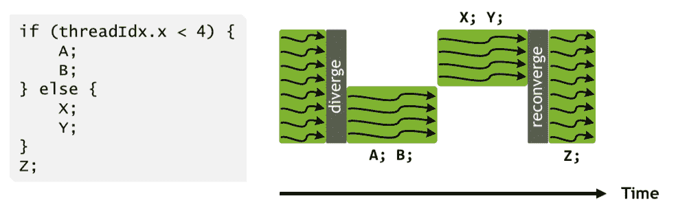

**图：** 线程集中 warp 发散的示例（[来源](https://images.nvidia.com/content/volta-architecture/pdf/volta-architecture-whitepaper.pdf)）。空白区域表示至少部分物理 CUDA 核心的停顿。

这使得在线程级别上进行灵活编程成为可能，但代价是如果 warp 过于频繁地发散，性能会无声地降低。线程还可以更灵活地访问它们可以访问的内存；虽然 VPU 只能操作连续的内存块，但 CUDA 核心可以访问共享寄存器中的单个浮点数并维护每个线程的状态。

**CUDA 核心调度也更加灵活：** SMs 运行方式类似于多线程 CPU，从某种意义上说，它们可以“调度”许多程序（**warp**）并发执行（每个 SM 最多 64 个），但每个*Warp Scheduler*在每个时钟周期中只执行一个程序。在给定 SM 上调度的 warp 被称为“驻留”。 Warp Scheduler 会自动在活动 warp 之间切换，以隐藏 I/O 操作，如内存加载。相比之下，TPU 通常是单线程的。

### 内存

在计算单元之外，GPU 有一系列内存层次结构，最大的内存是 HBM（主 GPU 内存），然后是一系列较小的缓存（L2，L1/SMEM，TMEM，寄存器内存）。

+   **寄存器：** 每个子分区都有自己的寄存器文件，包含 16,384 个 32 位字（在 H100/B200 上，每个 SM 有`4 * 16384 * 4 = 256kiB`），这些寄存器可以通过 CUDA 核心访问。

    +   每个 CUDA 核心一次只能访问最多 256 个寄存器，因此尽管我们可以为每个 SM 调度多达 64 个“驻留 warp”，但如果每个线程使用 256 个寄存器，一次只能适配 8 个（`256 * 1024 / (4 * 32 * 256)`）。

+   **SMEM（L1 缓存）：** 每个 SM 都有自己的 256kB 片上缓存，称为 SMEM，它可以由程序员控制作为“共享内存”，或者由硬件用作片上缓存。SMEM 用于存储激活和输入到 TC 矩阵乘法。

+   **L2 缓存:** 所有 SM 共享<脚注>技术上，L2 缓存分为两部分，因此一半的 SM 可以访问 H100 上的 25MB。两个部分之间有一个连接，但带宽较低。</脚注>一个相对较大的约 50MB L2 缓存，用于减少对主内存的访问。

    +   这与 TPU 的 VMEM 大小相似，但速度**慢得多**，并且不是由程序员控制的。这导致了一种“遥远的幽灵行动”，程序员需要修改内存访问模式以确保 L2 缓存得到充分利用。<脚注>由于 L2 缓存是在所有 SM 之间共享的，这实际上迫使程序员以相当协调的方式运行 SM，尽管在原则上它们是独立的单元。</脚注>

    +   NVIDIA 没有发布其芯片的 L2 带宽，但据[测量](https://chipsandcheese.com/p/nvidias-h100-funny-l2-and-tons-of-bandwidth)约为 5.5TB/s。这大约是 HBM 带宽的 1.6 倍，但它是全双工的，因此有效双向带宽更接近 3 倍。相比之下，TPU 的 VMEM 大两倍，并且具有更多的带宽（大约 40TB/s）。

+   **HBM:** 主要的 GPU 内存，用于存储模型权重、梯度、激活等。

    +   HBM 的大小从 Volta 的 32GB 增加到 Blackwell（B200）的 192GB。

    +   HBM 到 CUDA Tensor Core 的带宽被称为 HBM 带宽或内存带宽，在 H100 上约为 3.35TB/s，在 B200 上约为 9TB/s。

### GPU 规格总结

这里是最近型号 GPU 规格的总结。给定 GPU 的不同版本之间，SM 数量、时钟速度和 FLOPs 有所不同。以下是内存容量数据：

| GPU | Generation | Clock Speed | SMs/chip | SMEM capacity/SM | L2 capacity/chip | HBM capacity/chip |
| --- | --- | --- | --- | --- | --- | --- |
| V100 | Volta | 1.25GHz/1.38GHz | 80 | 96kB | 6MB | 32GB |
| A100 | Ampere | 1.10GHz/1.41GHz | 108 | 192kB | 40MB | 80GB |
| H100 | Hopper | 1.59GHz/1.98GHz | 132 | 256kB | 50MB | 80GB |
| H200 | Hopper | 1.59GHz/1.98GHz | 132 | 256kB | 50MB | 141GB |
| B200 | Blackwell | ? | 148 | 256kB | 126MB | 192GB |

所有代数都有每个 SM 256kB 的寄存器内存。Blackwell 还为每个 SM 增加了 256kB 的 TMEM。以下是每个芯片的 FLOPs 和带宽数据：

| GPU | Generation | HBM BW/chip | FLOPs/s/chip (bf16/fp16) | FLOPs/s/chip (fp8/int8) | FLOPs/s/chip (fp4) |
| --- | --- | --- | --- | --- | --- |
| V100 | Volta | 9.0e11 | — | — | — |
| A100 | Ampere | 2.0e12 | 3.1e14 | 6.2e14 | — |
| H100 | Hopper | 3.4e12 | 9.9e14 | 2.0e15 | — |
| H200 | Hopper | 4.8e12 | 9.9e14 | 2.0e15 | — |
| B200 | Blackwell | 8.0e12 | 2.3e15 | 4.5e15 | 9.0e15 |

我们排除了 B100，因为它没有大规模生产。虽然 NVIDIA 生产了 B100 系列，但它们只短暂销售和生产，据称是由于设计缺陷，导致它们无法接近其声称的规格运行。由于热量和电力问题，它们在达到峰值 FLOPs 时遇到了瓶颈。一些规格略取决于 GPU 的确切版本，因为 NVIDIA 的 GPU 不像 TPU 那样标准化。

这里有一份有用的速查表，比较了 GPU 和 TPU 组件：

| GPU | TPU | 它是什么？ |
| --- | --- | --- |
| 流式多处理器（SM） | 张量核心 | 包含其他单元的核心“单元” |
| Warp 调度器 | VPU | SIMD 向量算术单元 |
| CUDA 核心 | VPU ALU | SIMD ALU |
| SMEM（L1 缓存） | VMEM | 片上高速缓存内存 |
| 张量核心 | MXU | 矩阵乘法单元 |
| HBM（即 GMEM） | HBM | 高带宽高容量内存 |

### 芯片级别的 GPU 与 TPU 比较

GPU 最初用于渲染视频游戏，但自从 2010 年代深度学习兴起以来，它们开始更像专门的矩阵乘法机器——换句话说，更像 TPU。在深度学习热潮之前，GPU（“图形处理单元”）主要做图形处理——主要是视频游戏。视频游戏用数百万个小三角形来表示对象，游戏渲染（或“光栅化”）这些三角形，每秒在屏幕上显示 30-60 次（这个频率称为帧率）。光栅化涉及将这些三角形投影到摄像机的坐标系中，并计算每秒数十亿次哪些三角形重叠哪些像素。正如你可以想象的那样，这是非常昂贵的，这只是开始。然后你必须通过组合可能相交的几个半透明三角形的颜色来为每个像素着色。GPU 被设计成以极高的速度执行这些操作，着眼于多功能性；你需要同时运行许多不同的 GPU 工作负载（称为“着色器”），没有单一操作占主导地位。因此，以图形为重点的消费级 GPU 可以进行矩阵乘法，但这不是它们的主要功能。在一定程度上，这段历史解释了为什么现代 GPU 看起来是这个样子。它们不是为了 LLM 或 ML 模型而设计的，而是作为通用加速器，硬件追求的是“通用性”的水平，这既是祝福也是诅咒。GPU 在应用于新任务时往往“只需工作”，并且比 TPU 更少依赖于良好的编译器。但这也使得它们更难进行推理或从屋顶线性能中获得，因为如此多的编译器功能可能导致瓶颈。

**GPU 更模块化。** TPUs 有 1-2 个大的 Tensor Core，而 GPU 有成百上千个小 SM。同样，每个 Tensor Core 有 4 个大的 VPU，每个 VPU 有 1024 个 ALU，而 H100 有 132 * 4 = 528 个小独立 SIMD 单元。以下是 GPU 与 TPU 的 1:1 比较，突出了这一点：

| GPU | TPU | H100 # | TPU v5p # |
| --- | --- | --- | --- |
| SM（流多处理器） | 张量核心 | 132 | 2 |
| 线程调度器 | VPU | 528 | 8 |
| SMEM（L1 缓存） | VMEM | 32MB | 128MB |
| 寄存器 | 向量寄存器（VRegs） | 32MB | 256kB |
| 张量核心 | MXU | 528 | 8 |

这种模块化的差异一方面使得 TPU 的构建成本更低、理解起来更简单，但同时也给编译器带来了更多的负担，使其能够正确地执行。因为 TPUs 只有一个控制线程，并且只支持向量化的 VPU-wide 指令，编译器需要手动流水线所有内存加载和 MXU/VPU 工作以避免停顿。GPU 程序员可以启动数十个不同的内核，每个内核都在一个完全独立的 SM 上运行。另一方面，这些内核可能会因为 L2 缓存的激烈争用或内存加载未能合并而导致性能极差；因为硬件控制了大部分的运行时，所以很难理解幕后发生了什么。因此，TPUs 通常可以通过更少的工作接近峰值性能。

**历史上，单个 GPU 比同等 TPU 更强大（也更昂贵）：** 单个 H200 的 FLOPs/s 接近 TPU v5p 的两倍，HBM 为 1.5 倍。同时，在 Google Cloud 上，H200 的标价大约为每小时 10 美元，而 TPU v5p 为每小时 4 美元。TPUs 通常比 GPU 更多地依赖于将多个芯片连接在一起。

**TPUs 拥有更多的快速缓存内存。** TPUs 还拥有比 GPU 的 SMEM（+TMEM）更多的 VMEM，并且这种内存可以用于以允许它们以极快的速度加载和使用的方式存储权重和激活。如果你能持续地将模型权重存储或预取到 VMEM 中，这可以使它们在 LLM 推理时更快。

### 测试 1：GPU 硬件

这里有一些问题需要解决，以测试上述内容的一些内容。答案已提供，但在查看答案之前尝试回答问题可能是个好主意，手头拿着笔和纸。

**问题 1 [CUDA 核心]：** H100 和 B200 有多少个 fp32 CUDA 核心（ALU）？这与 TPU v5p 中的独立 ALU 数量相比如何？

点击此处查看答案。

**答案：** H100 有 132 个 SM，每个包含 4 个子分区，每个子分区包含 32 个 fp32 CUDA 核心，所以共有`132 * 4 * 32 = 16896`个 CUDA 核心。B200 有 148 个 SM，所以总共有`18944`个。TPU v5p 有 2 个 TensorCore（通常通过 Megacore 连接），每个 TensorCore 有一个 VPU，具有（8，128）个通道，每个通道有 4 个独立的 ALU，所以`2 * 4 * 8 * 128 = 8192`个 ALU。这大约是 H100 向量通道数的一半，运行在约相同的频率。

**问题 2 [向量 FLOPs 计算]**：单个 H100 有 132 个 SM，并以 1.59GHz（最高 1.98GHz 提升）的时钟速度运行。假设它每个周期每个 ALU 可以执行一个向量操作。每秒可以完成多少个向量 fp32 FLOPs？使用提升后呢？这与矩阵乘法 FLOPs 相比如何？

点击此处查看答案。

**答案：** `132 * 4 * 32 * 1.59e9 = 26.9TFLOPs/s`。使用提升后为 33.5 TFLOPs/s。这比 [规格表](https://www.nvidia.com/en-us/data-center/h100/) 中报告的数值少一半，因为技术上我们可以在一个周期内完成一个 FMA (融合乘加) 操作，这相当于两个 FLOPs，但在大多数情况下这并不实用。我们可以做到 990 bfloat16 矩阵乘法 TFLOPs/s，所以忽略 FMAs，Tensor Cores 的 FLOPs/s 大约是 30 倍。

**问题 3 [GPU 矩阵乘法强度]**：H100 上的峰值 fp16 矩阵乘法强度是多少？B200 呢？fp8 呢？*强度指的是矩阵乘法 FLOPs/s 与内存带宽的比率*。

点击此处查看答案。

**答案：** 对于 H100，我们有一个峰值 990e12 fp16 FLOPs 和 3.35e12 字节/秒的带宽。所以关键强度是 `990e12 / 3.35e12 = 295`，与 TPU 中的 240 相当接近。对于 B200，它是 `2250e12 / 8e12 = 281`，非常接近。这意味着，类似于 TPUs，我们需要一个大约 280 的批处理大小才能在矩阵乘法中达到计算限制。

对于 H100 和 B200，我们都有 2x fp8 FLOPs，所以峰值强度也翻倍到 590 和 562，尽管在某些方面，如果我们考虑到我们的权重可能也会以 fp8 的形式加载，那么它似乎保持不变。

**问题 4 [矩阵乘法运行时]:** 使用问题 3 的答案，你预计在单个 B200 上 `fp16[64, 4096] * fp16[4096, 8192]` 矩阵乘法需要多长时间？`fp16[512, 4096] * fp16[4096, 8192]` 又如何？

点击此处查看答案。

从上述内容中，我们知道在 281 个 token 以下的批处理大小下，我们将受到通信限制。因此，第一个限制完全是带宽限制。我们以 `8e12` 字节/秒的带宽读取或写入 $2BD + 2DF + 2BF$ 字节 (`2*64*4096 + 2*4096*8192 + 2*64*8192=69e6`)，所以大约需要 `69e6 / 8e12 = 8.6us`。在实践中，我们可能只能获得总带宽的一部分，所以可能接近 10-12us。当我们增加批处理大小时，我们将完全受到计算限制，因此我们预计 `T=2*512*4096*8192/2.3e15=15us`。我们同样只期望获得总 FLOPs 的一部分，所以我们可能看到接近 20us。

**问题 5 [L1 缓存容量]:** H100 的总 L1/SMEM 容量是多少？寄存器内存呢？这与 TPU VMEM 容量相比如何？

点击此处查看答案。

**答案:** 我们有 256kB SMEM 和每个 SM 256kB 的寄存器内存，所以大约有 33MB (`132 * 256kB`) 的每种。加在一起，这给我们总共大约 66MB。这大约是现代 TPU 的 VMEM 的 120MB 的一半，尽管 TPU 总共只有 256kB 的寄存器内存！TPU VMEM 的延迟低于 SMEM 的延迟，这是 TPU 上的寄存器内存不是那么关键的原因之一（向 VMEM 的溢出和填充很便宜）。

**问题 6 [计算 B200 时钟频率]:** NVIDIA 在[此处](https://resources.nvidia.com/en-us-blackwell-architecture)报告称，B200 可以以 80TFLOPs/s 的速度执行向量 fp32 计算。鉴于每个 CUDA 核心可以在 FMA（融合乘加）操作中每周期执行 2 FLOPs，估计峰值时钟周期。

点击此处查看答案。

**答案:** 我们知道我们有 148 * 4 * 32 = 18944 个 CUDA 核心，所以我们可以做 `18944 * 2 = 37888 FLOPs / cycle`。因此 `80e12 / 37888 = 2.1GHz`，这是一个高但合理的峰值时钟速度。B200 通常采用液体冷却，所以更高的时钟周期更合理。

**问题 7 [估算 H100 加法运行时间]:** 使用上述数据，计算在单个 H100 上将两个 `fp32[N]` 向量相加所需的时间。计算 $T_\text{math}$ 和 $T_\text{comms}$。此操作的算术强度是多少？如果您可以访问，请尝试在 PyTorch 或 JAX 中运行此操作，对于 `N = 1024` 和 `N=1024 * 1024 * 1024`。这如何比较？

点击此处查看答案。

**答案:** 首先，将两个 `fp32[N]` 向量相加执行 N FLOPs，并需要 `4 * N * 2` 字节来加载，以及 4 * N 字节来写回，总共为 `3 * 4 * N = 12N`。计算它们的比率，我们有 `total FLOPs / total bytes = N / 12N = 1 / 12`，这相当糟糕。

正如我们上面计算的，我们可以忽略 FMA，大约做 33.5 TFLOPs/s 的提升。这只在所有 CUDA 核心都被使用的情况下才成立。对于 `N = 1024`，我们最多只能使用 1024 个 CUDA 核心或 8 个 SM，这将花费更长的时间（假设我们受计算限制，大约是 16 倍更长）。我们还有 3.35e12 字节/秒的内存带宽。因此我们的峰值硬件强度是 `33.5e12 / 3.35e12 = 10`。值得注意的是，这种强度在最近的 GPU 代际中保持不变。对于 H100 是 33.5 / 3.5，对于 B200 是 80 / 8。为什么是这样还不清楚，但这是一个有趣的观察。因此我们将严重受通信限制。因此我们的运行时间是

\[T = \max(T_\text{comms}, T_\text{math}) = \frac{12 \cdot N}{\text{3.35e12}} = \frac{N}{\text{2.8e11}}\]

对于 `N = 65,536`，这大约是 0.23us。在实际中，我们在 JAX 中看到大约 1.5us 的运行时间，这是可以接受的，因为我们预计在这里会受到超低延迟的限制。对于 `N = 1024 * 1024 * 1024`，我们有大约 3.84ms 的屋顶线，我们看到 4.1ms，这是很好的！

## 网络连接

网络是 GPU 和 TPU 差异最大的领域之一。正如我们所见，TPU 以 2D 或 3D 环的形式连接，其中每个 TPU 只与其邻居连接。这意味着在两个 TPU 之间发送消息必须穿过每个中间的 TPU，并迫使我们只能在网格上使用统一的通信模式。虽然这在某些方面不太方便，但这也意味着每个 TPU 的链路数量是恒定的，我们可以扩展到任意大的 TPU“pod”而不会损失带宽。

另一方面，GPU 使用一个更传统的基于树状结构的分层交换网络。由 8 个 GPU 组成的**节点**（GB200 最多 72 个）通过称为 NVLinks 的高带宽互连连接在一起，这些节点通过连接到每个 GPU 的 NICs 使用较低带宽的 InfiniBand（IB）或以太网网络连接成更大的单元（称为**SU**或可扩展单元）。这些单元进而可以通过更高层次的交换机连接成任意大的单元。

<picture>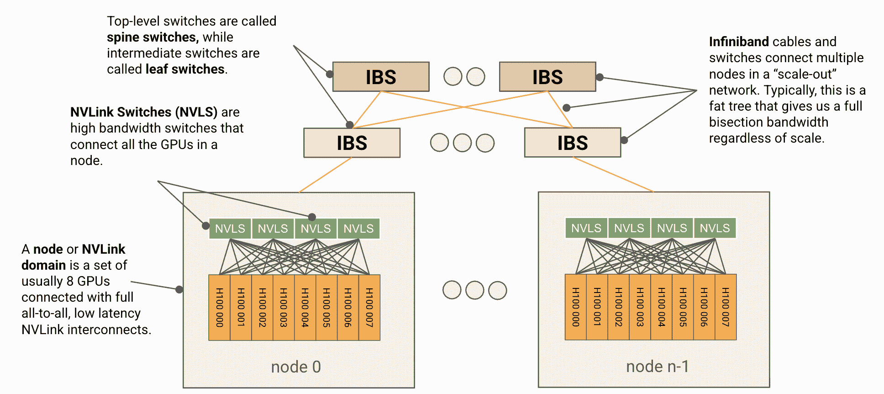</picture>

**图示：**显示典型 H100 网络的图。一组 8 个 GPU 连接成一个节点或 NVLink 域，其中包含 NVSwitches（也称为 NVLink 交换机），这些节点通过交换的 InfiniBand 布线相互连接。H100 在 NVLink 域中每个节点的出带宽约为 450GB/s，每个节点进入 IB 网络的出带宽为 400GB/s。

### 在节点级别

GPU 节点是一个小型单元，通常由 8 个 GPU（GB200 最多 72 个）组成，通过全互连、全带宽、低延迟的 NVLink 互连连接。NVLink 被描述为类似于升级版的 PCIe 连接，具有低延迟和协议开销，但不是为可扩展性/容错性而设计的，而 InfiniBand 则更像以太网，为更大的有损网络而设计。每个节点包含几个高带宽的 NVSwitches，用于在所有本地 GPU 之间切换数据包。实际的节点级拓扑随着时间的推移发生了相当大的变化，包括每个节点开关的数量，但对于 H100，我们每个节点有 4 个 NVSwitches，GPU 通过`5 + 4 + 4 + 5`的链路模式连接到它们，如图所示：

<picture>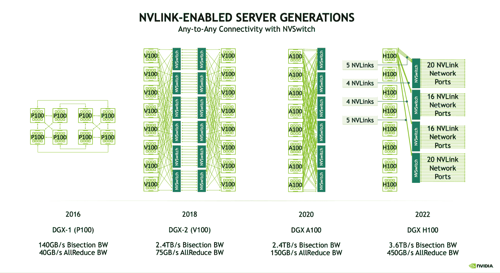</picture>

**图示：**从 Pascall（P100）开始的节点即 NVLink 域图。自从 Volta（V100）以来，我们已经在节点内使用一组交换机实现了全互连。H100 节点有 4 个 NVSwitches 连接到所有 8 个 GPU，每个 GPU 的链路速度为 25GB/s。

对于 Hopper 代（NVLink 4.0），每个 NVLink 链路有 25GB/s 的全双工带宽（B200 为 50GB/s），给我们从每个 GPU 到网络的`18 * 25=450GB/s`的全双工带宽。巨大的 NVSwitches 有高达 64 个 NVLink 端口，这意味着一个 8xH100 节点带有 4 个交换机可以处理高达`64 * 25e9 * 4=6.4TB/s`的带宽。以下是这些数字随着 GPU 代的变化的概述：

| NVLink Gen | NVSwitch Gen | GPU Generation | NVLink Bandwidth (GB/s, full-duplex) | NVLink Ports / GPU | Node GPU to GPU bandwidth (GB/s full-duplex) | Node size (NVLink domain) | NVSwitches per node |
| --- | --- | --- | --- | --- | --- | --- | --- |
| **3.0** | **2.0** | Ampere | 25 | 12 | 300 | 8 | 6 |
| **4.0** | **3.0** | Hopper | 25 | 18 | 450 | 8 | 4 |
| **5.0** | **4.0** | Blackwell | 50 | 18 | 900 | 8/72 | 2/18 |

Blackwell（B200）有 8 个 GPU 的节点。GB200NVL72 支持更大的 NVLink 域，最多 72 个 GPU。我们展示了 8 和 72 个 GPU 系统的详细信息。

### 测验 2：GPU 节点

这里有一些关于网络的其他 Q/A 问题。我发现这些特别有用，因为它们让你实际处理通信模式。

**问题 1 [H100 节点的总带宽]**：在一个带有 4 个交换机的 8xH100 节点中，每个节点有多少总带宽？*提示：考虑 NVLink 和 NVSwitch 的带宽*。

点击此处查看答案。

**答案：** 我们有 Gen4 4xNVSwitches，每个交换机有`64 * 25e9=1.6TB/s`的单向带宽。这将给我们带来交换机级别的`4 * 1.6e12=6.4e12`带宽。然而，请注意，每个 GPU 只能处理 450GB/s 的单向带宽，这意味着我们最多有`450e9 * 8 = 3.6TB/s`带宽。由于这个值较小，峰值带宽为 3.6TB/s。

**问题 2 [分割带宽]**：分割带宽是指网络任何偶数划分之间可用的最小带宽。换句话说，如果将网络分成两个相等的部分，两个部分之间有多少带宽？你能计算出 8x H100 节点的分割带宽吗？*提示：分割带宽通常包括两个方向的流量*。

点击此处查看答案。

**答案：** 任何偶数划分都将使每个半部分有 4 个 GPU，每个 GPU 可以以`4 * 450GB/s`的速度向另一半传输。考虑两个方向的流量，这给我们带来了跨分区的`8 * 450GB/s`字节数，或者说 3.6TB/s 的分割带宽。这正是 NVIDIA 在例如[这里](https://hc34.hotchips.org/assets/program/conference/day2/Network%20and%20Switches/NVSwitch%20HotChips%202022%20r5.pdf)所报告的。

**问题 3 [AllGather 成本]：** 给定一个 B 字节的数组，在 8xH100 节点上，一个（吞吐量限制的）AllGather 需要多长时间？为 bf16[D[X], F]进行数学计算，其中`D=4096`，`F=65,536`。*在回答这个问题之前，值得阅读 TPU 集体[部分](https://jax-ml.github.io/scaling-book/sharding/)。在这里思考这个问题，但我们将在下一部分更多地讨论集体。*

点击此处查看答案。

**答案：** 每个 GPU 可以输出 450GB/s，每个 GPU 有$B / N$字节（其中`N=8`，节点大小）。我们可以想象每个节点依次将字节发送到其他$N - 1$个节点，导致总共(N - 1)次轮换，每次轮换的$T_\text{comms} = (B / (N * W_\text{unidirectional}))$，或$T_\text{comms} = (N - 1) * B / (N * W_\text{unidirectional})$。这大约是$B / (N * W_\text{uni})$或$B / \text{3.6e12}$，即对分带宽。

对于给定的数组，我们有`B=4096 * 65536 * 2=512MB`，所以总时间是`536e6 * (8 - 1) / 3.6e12 = 1.04ms`。这可能是延迟限制的，所以在实际应用中可能需要更长的时间（实际上大约需要 1.5ms）。

## 在节点级别以上

在节点级别以上，GPU 网络的拓扑结构不太标准化。NVIDIA 发布了一个[参考 DGX SuperPod 架构](https://docs.nvidia.com/dgx-superpod/reference-architecture-scalable-infrastructure-h100/latest/network-fabrics.html)，该架构使用 InfiniBand 连接比单个节点更大的 GPU 集合，但客户和数据中心提供商可以自由地根据他们的需求进行定制。例如，Meta 在数据中心网络上训练 LLaMA-3，该网络与这一描述有显著不同，使用以太网、3 层交换机布线 fabric 和顶级层的过载交换机。

这里是一个参考 1024 GPU H100 系统的图表，其中底部每一行中的每个框都是一个单独的 8xH100 节点，配备 8 个 GPU、8 个 400Gbps CX7 NIC（每个 GPU 一个），以及 4 个 NVSwitches。

<picture>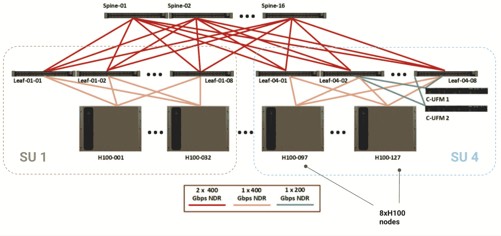</picture>

**图示：** 1024 节点（有时为 127 个节点）的参考 1024 H100 DGX SuperPod 的图表，每个节点配备 8 个 H100 GPU，连接到 InfiniBand 扩展网络。32 节点（256 个 GPU）的集合被称为“可扩展单元”或 SU。叶子和脊 IB 交换机提供了足够的带宽，以实现节点之间的完全对分带宽。

**可扩展单元：** 每组 32 个节点被称为“可扩展单元”（或 SU），位于一组 8 个叶 InfiniBand 交换机之下。这个 SU 有 256 个 GPU，每个节点有 4 个 NVSwitches 和 8 个 Infiniband 叶交换机。所有显示的电缆都是 InfiniBand NDR（50GB/s 全双工）和 64 端口 NDR IB 交换机（每个端口 50GB/s）。*请注意，IB 交换机的带宽是 NVSwitches 的两倍（64 个端口，每个端口 400 Gbps 链路）。*

**SuperPod**：整体 SuperPod 然后通过 16 个顶级“脊柱”IB 交换机连接 4 个这样的 SU，给我们提供了 1024 个 GPU，512 个节点级 NVSwitches，32 个叶子 IB 交换机，和 16 个脊柱 IB 交换机，总共 560 个交换机。叶子交换机以 32 个节点的组连接到节点，因此每个 256 个 GPU 的组有 8 个叶子交换机。所有叶子交换机都连接到所有脊柱交换机。

**我们有多少带宽？** InfiniBand 网络的总体拓扑（称为“扩展网络”）是**胖树**结构，电缆和交换机确保在节点级别以上（此处为 400GB/s）提供完整的分割带宽。这意味着如果我们把节点分成两半，每个节点可以同时向另一个分区的节点输出 400GB/s。更重要的是，这意味着我们在扩展网络中应该有一个大致恒定的 AllReduce 带宽！虽然可能不会以这种方式实现，但你可以想象在扩展网络中的任意多个节点上执行环形归约，因为你可以构建一个包括每一个节点的环形。

| 层级 | GPU 数量 | 每单元交换机数量 | 交换机类型 | 每单元带宽（TB/s，全双工） | GPU 到 GPU 带宽（GB/s，全双工） | 胖树带宽（GB/s，全双工） |
| --- | --- | --- | --- | --- | --- | --- |
| 节点 | 8 | 4 | NVL | 3.6 | 450 | 450 |
| 叶子 | 256 | 8 | IB | 12.8 | 50 | 400 |
| 脊柱 | 1024 | 16 | IB | 51.2 | 50 | 400 |

相比之下，TPU v5p 每个链路大约有 90GB/s 的输出带宽，或者沿着 3D 环面所有轴线的 540GB/s 输出带宽。这不是点对点，因此只能用于受限的均匀通信模式，但它仍然为我们提供了更高的 TPU 到 TPU 带宽，可以扩展到任意大的拓扑（至少高达 8960 个 TPU）。

理论上，GPU 交换网络可以通过添加额外的交换机或间接层来扩展到任意大小，但这会增加额外的延迟和昂贵的网络交换机。

**要点**：在一个 H100 节点内，每个 GPU 都有 450GB/s 的完整胖树带宽，而节点之外，这个带宽会降至 400GB/s，节点到节点。这将对通信原语至关重要。

**GB200 NVL72s**：NVIDIA 最近开始生产新的 GB200 NVL72 GPU 集群，这些集群在一个 NVLink 域内结合了 72 个 GPU，具有完整的 900GB/s GPU 到 GPU 带宽。然后这些域可以链接成更大的 SuperPod，具有成比例更高的（9 倍）IB 胖树带宽。以下是该拓扑的图表：

<picture>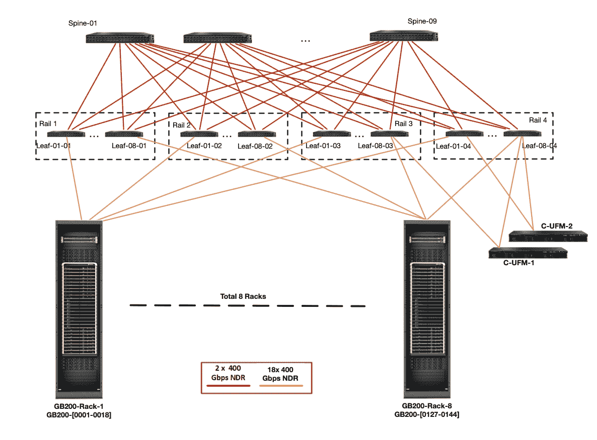</picture>

**图**：一个显示 576 个 GPU 的 GB200 DGX SuperPod 的图表。最底层的每个机架包含 72 个 GB200 GPU。

计算单个节点的出口带宽（上方的橙色线条），我们有`4 * 18 * 400 / 8 = 3.6TB/s`的带宽到叶子级别，这比 H100（节点包含 9 倍的 GPU）多 9 倍。这意味着关键节点的出口带宽要高得多，并且我们的跨节点集体带宽实际上可以比节点内的带宽低。参见附录 A 以获取更多讨论。

| 节点类型 | 每节点 GPU 数 | GPU 出口带宽 | 节点出口带宽 |
| --- | --- | --- | --- |
| H100 | 8 | 450e9 | 400e9 |
| B200 | 8 | 900e9 | 400e9 |
| GB200 NVL72 | 72 | 900e9 | 3600e9 |

**总结**：GB200 NVL72 SuperPods 显著增加了给定节点的节点大小和出口带宽，这显著改变了我们的性能曲线。

### 第三题：超越节点级别

**问题 1 [胖树拓扑]：** 使用上面的 DGX H100 图，计算整个 1024 GPU pod 在节点级别的分叉带宽。证明每个链路的带宽被选择以确保完整的分叉带宽。*提示：确保计算链路带宽和交换机带宽。

点击此处查看答案。

**答案：** 让我们分部分来做：

+   首先，每个节点通过 8x400Gbps NDR IB 电缆连接到叶子交换机，每个节点向叶子交换机提供`8 * 400 / 8 = 400 GB/s`的带宽。我们有 8 个叶子交换机，每个交换机有 3.2TB/s（64 个 400 GBps 链路），但我们只能使用 64 个端口中的 32 个从 SU 进入，因此对于 32 个节点来说，这是`32 * 400 / 8 = 12.8TB/s`，再次正好是 400GB/s。

+   然后在脊级别，我们有`8 * 16 * 2` 400Gbps NDR IB 电缆连接每个 SU 到脊，每个 SU 向叶子提供`8 * 16 * 2 * 400 / 8 = 12.8 TB/s`的带宽。同样，这是每个节点的 400GB/s。我们有 16 个脊交换机，每个交换机有 3.2TB/s，这样我们就有`16 * 3.2 = 51.2 TB/s`，对于 128 个节点来说，这又是 400GB/s。

因此，如果我们以任何方式分割我们的节点，我们将在它们之间有 400GB/s 的每个 GPU。每个组件都有恰好所需的带宽来确保胖树。

**问题 2 [扩展到更大的 DGX pod]：** 如果我们想用 2048 个 GPU 而不是 1024 个 GPU 进行训练，那么修改上述 DGX 拓扑以处理这种情况的最简单/最佳方法是什么？对于 4096 个 GPU 呢？*提示：没有唯一的正确答案，但尽量降低成本。考虑链路容量。[此文档](https://docs.nvidia.com/dgx-superpod-reference-architecture-dgx-h100.pdf)可能有所帮助。

点击此处查看答案。

**答案：** 一个选择是保持 SU 结构完整（8 个交换机下的 32 个节点）并添加更多的它们，使用更多的顶级交换机。我们需要 2 倍的脊交换机，所以我们将有 8 个 SU，每个 SU 有 32 个脊交换机，这样我们就有足够的带宽。

这个问题在于我们每个叶子交换机只有 64 个端口，我们已经在上面的图中用完了它们。但是，我们可以很容易地用 1x 400 Gbps NDR 电缆代替 2x，这给出了相同的总带宽，但节省了一些端口。

对于 4096 个 GPU，我们实际上用完了端口，所以我们需要添加另一个间接层，也就是说，在层次结构中再添加一个层次。NVIDIA 将这些称为“核心交换机”，并构建了一个包含 128 个脊交换机和 64 个核心交换机的 4096 个 GPU 集群。你可以进行数学计算来证明这提供了足够的带宽。

## GPU 上的集体操作是如何工作的？

GPU 可以执行与 TPU 相同的所有集体操作：ReduceScatter、AllGather、AllReduce 和 AllToAll。与 TPU 不同，这些操作的工作方式取决于它们是在节点级别（通过 NVLink）还是更高级别（通过 InfiniBand）执行。这些集体操作由 NVIDIA 在[NVSHMEM](https://developer.nvidia.com/nvshmem)和[NCCL](https://developer.nvidia.com/nccl)（发音为“nickel”）库中实现。NCCL 是开源的[这里](https://github.com/NVIDIA/nccl)。虽然 NCCL 根据延迟要求/拓扑使用各种实现（[详情](https://github.com/NVIDIA/nccl/issues/1415#issuecomment-2310650081)），但从现在开始，我们将讨论在交换树布线上的理论最优模型。

### 节点内集体操作

**AllGather 或 ReduceScatter：**在节点级别进行 AllGather 或 ReduceScatter 时，你可以像 TPU 一样在环中执行它们，使用每个跳的完整 GPU 到 GPU 带宽。任意排序 GPU，并使用完整的 GPU 到 GPU 带宽发送数组的一部分。你还可以这样想，每个 GPU 将其大小为$\text{字节} / N$的数据块发送到其他$N - 1$个 GPU，总共通信$(N - 1) * N * \text{字节} / N$字节，这给我们每个跳的成本是$T_\text{hop} = \text{字节} / (N * \text{GPU 出口带宽})$，所以总成本是

\[T_\text{AG 或 RS 通信} = \frac{\text{字节} \cdot (N - 1)}{N \cdot \text{GPU 出口带宽}} \rightarrow \frac{\text{字节}}{\text{GPU 出口带宽}}\]

你会注意到这与 TPU 上的完全一样。对于 AllReduce，你可以像往常一样结合 RS + AG，成本加倍。

<picture></picture>

**图：**带宽最优的 1D 环 AllGather 算法。对于 B 字节，它会在 X - 1 次通过顶级交换机发送 V / X 字节。

如果你担心延迟（例如，如果你的数组非常小），你可以进行树形缩减，即先在 2 个对中 AllReduce，然后是 4 个，然后是 8 个，总共$\log(N)$跳，而不是$N - 1$跳，尽管总成本仍然是相同的。

**总结:** 在单个节点内对 B 字节的数组进行 AllGather 或 ReduceScatter 的成本大约是$T_\text{comms} = B * (8 - 1) / (8 \cdot W_\text{GPU egress}) \approxeq B / W_\text{GPU egress}$。这在 H100 上理论上大约是$B / \text{450e9}$，在 B200 上大约是$B / \text{900e9}$。除非启用网络内缩减，否则 AllReduce 的成本是 2 倍。

**快速问答 1 [AllGather 时间]:** 使用一个 8xH100 节点，具有 450 GB/s 的全双工带宽，AllGather(bf16[B[X], F])需要多长时间？设$B=1024$，$F=16,384$。

点击此处查看答案。

**答案:** 我们总共有$2 \cdot B \cdot F$字节，450e9 单向带宽。这将大约需要$T_\text{comms} = (2 \cdot B \cdot F) / \text{450e9}$，或者更精确地说，$(2 \cdot B \cdot F \cdot (8 - 1)) / (8 \cdot \text{450e9})$。使用提供的值，这给我们大约$(2 \cdot 1024 \cdot 16384) / \text{450e9} = \text{75us}$，或者更精确地说，$\text{65us}$。

**AllToAlls:** 节点内的 GPU 具有全全连接性，这使得 AllToAlls 变得相当简单。每个 GPU 只需直接发送到目标节点。在节点内，对于 B 字节，每个 GPU 有$B / N$字节，并向$N - 1$个目标节点发送$(B / N²)$字节，总共

\[T_\text{AllToAll comms} = \frac{B \cdot (N - 1)}{W \cdot N²} \approx \frac{B}{W \cdot N}\]

将此与 TPU 的成本进行比较，TPU 的成本是$B / (4W)$。因此，在单个节点内，我们得到 2 倍的理论运行时间加速（$B / 4W$与$B / 8W$）。

对于混合专家（MoE）模型，我们经常想要进行一种*稀疏或交错的全局到全局（AllToAll）*操作，其中我们保证输出维度上的最多$k$个$N$个分片是非零的，也就是说$T_\text{AllToAll} \rightarrow K[B, N]$，其中每个轴上最多$k$个$N$个条目是非零的。这种操作的代价降低了$k/N$，总共大约是$\min(k/N, 1) \cdot B / (W \cdot N)$。对于一个 MoE，我们通常独立随机选择非零值，因此有少于$k$个非零值的可能性，这给我们大约是$(N-1)/N \cdot \min(k/N, 1) \cdot B / (W \cdot N)$的机会。实际成本实际上是$(1 - \left(\frac{Z - 1}{Z}\right)^K) \cdot \frac{Z - 1}{Z}$，这是$K$次骰子投掷中不同结果的期望数量，但它与给出的近似值非常接近。更多细节请见附录。

**快速问答 2 [AllToAll 时间]:** 使用一个 8xH100 节点，具有 450 GB/s 的单向带宽，AllToAllX->N 需要多长时间？如果我们知道只有 8 个条目中的 4 个将是非零的会怎样？

点击此处查看答案。

**答案:** 从上面的内容中，我们知道在密集情况下，成本是$B \cdot (N-1) / (W \cdot N²)$，或者$B / (W \cdot N)$。如果我们知道只有一半的条目是非填充的，我们可以发送$B \cdot k/N / (W \cdot N) = B / (2 \cdot W \cdot N)$，大约是整体成本的一半。

**要点：** 在单个节点内的 GPU 数组上的 AllToAll 的成本大约是 $T_\text{comms} = (B \cdot (8 - 1)) / (8² \cdot W_\text{GPU egress}) \approx B / (8 \cdot W_\text{GPU egress})$。对于稀疏的（top-$k$）AllToAll，这个值进一步降低到 $(B \cdot k) / (64 \cdot W_\text{GPU egress})$。

**经验测量：** 这里是 8xH100 节点上 AllReduce 带宽的经验测量。Algo BW 是测量的带宽（字节/运行时间），Bus BW 计算为 $2 \cdot W \cdot (8 - 1) / 8$，理论上是对实际链路带宽的测量。你会注意到我们确实达到了接近 370GB/s，略低于 450GB/s，但相当接近，尽管只有大约 10GB/设备。这意味着尽管这些估计在理论上是正确的，但需要大消息才能实现。

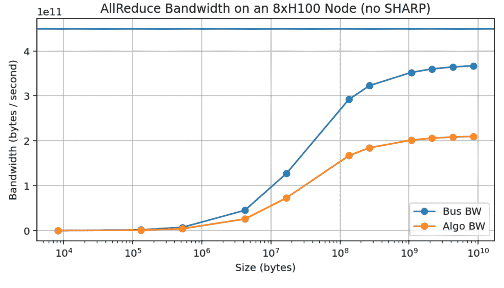

**图示：** 禁用 SHARP 的 8xH100 节点的 AllReduce 吞吐量。蓝色曲线是经验链接带宽，根据经验测量计算为 $2 * \text{bytes} * (N - 1) / (N * \text{runtime})$。请注意，即使使用大量的 10GB 数组，我们也没有接近声称的 450GB/s 带宽。

这是一个真正的问题，因为它在很大程度上复杂化了我们可以做出的任何理论声明，例如，即使是合理大小的数组（如 LLaMA-3 70B 的 MLPs，大小为`bf16[8192, 28672]`，或者 8 路模型分片，`bf16[8192, 3584] = 58MB`）也只能达到大约 150GB/s，与峰值 450GB/s 相比。相比之下，TPUs 在更小的消息大小下就能达到峰值带宽（见附录 B）。

**要点：** 尽管 NVIDIA 声称 H100 NVLink 的带宽约为 450GB/s，但在实际操作中很难超过 370 GB/s，因此相应地调整上述估计。

**网络归约中：** 自 Hopper 一代以来，NVIDIA 交换机支持[“SHARP”（可扩展分层聚合和归约协议）](https://developer.nvidia.com/blog/advancing-performance-with-nvidia-sharp-in-network-computing/)，允许“网络内归约”。这意味着*网络交换机本身*可以执行归约操作并将结果多路复用或“多播”到多个目标 GPU：

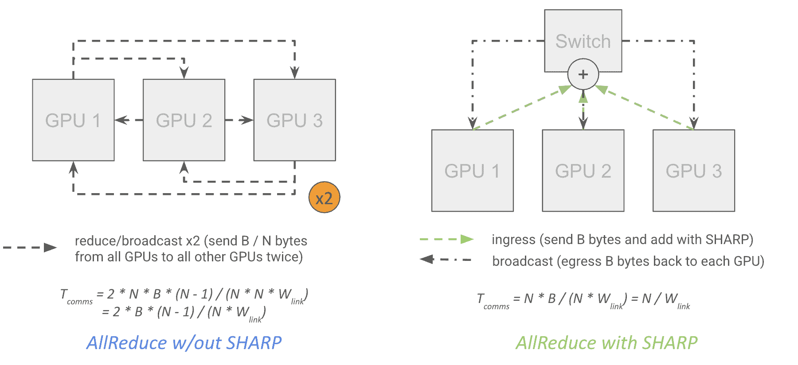

**图示：** 没有 SHARP 的 AllReduce 的理论成本是两倍，因为它必须通过每个 GPU 两次。实际上，加速率只有大约 30%（从 NCCL 2.27.5）。

从理论上讲，这几乎将 AllReduce 的成本减半，因为它意味着每个 GPU 可以将它的数据发送到一个顶级交换机，该交换机本身执行归约操作并将结果广播到每个 GPU，而无需每个 GPU 两次出站，同时还能降低网络延迟。

\[T_\text{SHARP AR comms} = \frac{\text{bytes}}{\text{GPU egress bandwidth}}\]

注意，这是精确的，而不是 $1/N$ 的因子，因为每个 GPU 首先输出 $B \cdot (N - 1) / N$，然后接收其本地分片的部分归约版本（入口为 $B/N$），完成归约，然后再次输出 $B/N$，然后输入完全归约的结果（入口为 $B \cdot (N - 1) / N$），从而正好输入 $B$ 字节。

然而，在实践中，我们观察到启用 SHARP 后带宽大约增加了 30%，而预测值为 75%。这仅使我们的有效集体带宽达到大约 480GB/s，而不是近两倍。

<picture>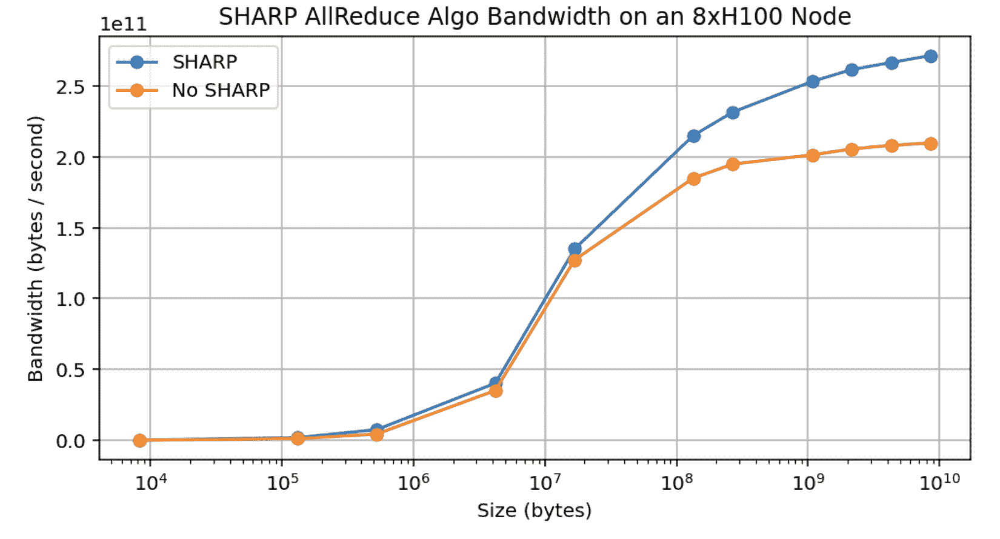</picture>

**图示：** 在节点内启用或未启用 NVIDIA SHARP 的情况下，AllReduce 算法的带宽的实证测量。增益相当于在峰值时大约 30% 的吞吐量提升，尽管从算法上讲，它应该能够实现接近 75% 的增益。

**要点：** 理论上，NVIDIA SHARP（大多数 NVIDIA 交换机上可用）应将 $B$ 字节 AllReduce 的成本从大约 $2 * B / W$ 降低到 $B / W$。然而，在实践中，我们只看到带宽大约提高了 30%。由于在 LLM 中纯 AllReduce 相当罕见，这并不特别有用。

### 跨节点集体

当我们超出节点级别时，成本就更加微妙。在进行树归约时，你可以想象从下往上进行归约，首先在节点内，然后在叶级，最后在主干级，使用每个级别的正常算法。特别是对于 AllReduce，你可以看到这允许我们整体上通信的数据更少，因为我们在节点级别进行 AllReduce 之后，只需要将 $B$ 字节输出到叶级，而不是 $B * N$。

**这有多昂贵？** 首先，由于我们具有完整的对分带宽，AllGather 或 ReduceScatter 的成本大致等于缓冲区大小（以字节为单位）除以节点出口带宽（H100 上的 400GB/s）*无论树归约的任何细节如何*。

\[T_\text{AG or RS comms} = \frac{\text{bytes}}{W_\text{node egress}} \underset{H100}{=} \frac{\text{bytes}}{\text{400e9}}\]

其中 $W_\text{node}$ 出口对于上述 H100 网络通常是 400GB/s（每个节点有 8 个 400Gbps IB 链路出口）。最清晰的方式来想象这一点是想象在集群中的每个节点上执行环形归约。由于胖树拓扑结构，我们可以在任何两个节点之间始终构建一个带有 $W_\text{node}$ 出口的环形，并进行正常归约。节点级别的归约几乎永远不会成为瓶颈，因为它具有更高的整体带宽和更好的延迟，尽管在一般情况下成本

\[T_\text{total} = \max(T_\text{comms at node}, T_\text{comms in scale-out network}) = \max\left[\frac{\text{bytes}}{W_\text{GPU egress}}, \frac{\text{bytes}}{W_\text{node egress}}\right]\] 您可以在这里看到更精确的推导。

我们可以更精确地指出，我们在网络的每一层实际上都在进行环形缩减，这可以大部分重叠，因此我们有：

\[T_\text{AG or RS comms} = \text{bytes} \cdot max_\text{depth i}\left[\frac{D_i - 1}{D_i \cdot W_\text{link i}}\right]\]

其中$D_i$是深度$i$处的度（深度$i$处的子节点数），$W_\text{link i}$是连接每个子节点到节点$i$的链路带宽。

使用这个，我们可以计算给定拓扑结构下的可用 AllGather/AllReduce 带宽为$min_\text{depth i}(D_i * W_\text{link i} / (D_i - 1))$。在上述情况下，我们有：

+   **节点：** $D_\text{node}$ = 8，因为我们有一个节点包含 8 个 GPU，Wlink i = 450GB/s。因此，我们的 AG 带宽为`450e9 * 8 / (8 - 1) = 514GB/s`。

+   **叶子节点：** $D_\text{leaf}$ = 32，因为我们有一个 SU 包含 32 个节点，Wlink i = 400GB/s（8x400Gbps IB 链路）。因此，我们的带宽为`400e9 * 32 / (32 - 1) = 413GB/s`。

+   **脊节点：** $D_\text{spine}$ = 4，因为我们有 4 个 SU，$W_\text{link i}$ = 12.8TB/s（来自上面的`8 * 16 * 2 * 400Gbps`链路）。我们的带宽为`12.8e12 * 4 / (4 - 1) = 17.1TB/s`。

因此，我们的整体 AG 或 RS 带宽在叶子级别为`min(514GB/s, 413GB/s, 17.1TB/s) = 413GB/s`，所以在实践中$T_\text{AG or RS comms} = B / \text{413GB/s}$，即即使在最高级别，我们也有大约 413GB/s 的 AllReduce 带宽。对于启用 SHARP 的 AllReduce，它将略低于这个值（大约 400GB/s），因为我们没有$(N - 1) / N$这个因子。尽管如此，450GB/s 和 400GB/s 足够接近，可以用作近似。

**其他集体操作：** 除非启用 SHARP，否则 AllReduce 的成本仍然是上述成本的 2 倍。NVIDIA 也销售启用 SHARP 的 IB 交换机，尽管并非所有提供商都有。AllToAlls 在跨节点时变化很大，因为它们不像 AllReduce 那样是“分层”的。如果我们想从每个 GPU 向每个其他 GPU 发送数据，我们就无法利用节点级别的完整 bisection 带宽。这意味着如果我们有一个跨越$M = N / 8$个节点的 N 路 AllToAll，成本是

\[T_\text{AllToAll comms} = \frac{B \cdot (M - 1)}{M² \cdot W_\text{node egress}} \approxeq \frac{B}{M \cdot W_\text{node egress}}\]

这实际上有 50GB/s 的带宽而不是 400GB/s。我们从单个 H100 节点内的$B / (8 * \text{450e9})$变为跨越 2 个节点时的$B / (2 \cdot \text{400e9})$，带宽降低了超过 4 倍。

下面是 1024-GPU DGX H100 SuperPod 架构的总结：

| 层级 | GPU 数量 | 度（子节点数） | 交换机带宽（全双工，TB/s） | 电缆带宽（全双工，TB/s） | 集体带宽（GB/s） |
| --- | --- | --- | --- | --- | --- |
| 节点 | 8 | 8 | 6.4 | 3.6 | 450 |
| 叶子节点（SU） | 256 | 32 | 25.6 | 12.8 | 400 |
| 脊节点 | 1024 | 4 | 51.2 | 51.2 | 400 |

我们使用“集体带宽”这个术语来描述我们可以以多高的有效带宽退出 GPU 或节点。它也是$\text{bisection bandwidth} * 2 / N$。

**总结：** 超过节点级别，对 B 字节进行 AllGather 或 ReduceScatter 的成本大致为 $B / W_\text{node egress}$，在 H100 DGX SuperPod 上为 $B / \text{400e9}$，而 AllReduce 成本加倍，除非启用了 SHARP。整体拓扑结构是一个胖树，旨在在任意两个节点对之间提供恒定的带宽。

**当数组在单独的轴上分片时的归约：** 考虑以下归约的成本

\[\text{AllReduce}_X(A[I_Y, J]\ \{ U_X \})\]

其中我们正在对自身沿另一个轴 $Y$ 分片的数组进行 AllReduce 操作。在 TPUs 上，由于我们每个轴发送的数据量减少了 $1 / Y$，与未分片的版本相比，整体操作成本降低了 $1 / Y$。在 GPU 上，成本取决于哪个轴是“内部”轴（节点内与节点间）以及每个分片是否跨越多个节点。假设 $Y$ 是内部轴，并且数组总字节数为 $\text{bytes}$，整体成本有效降低了 $Y$，但仅当 $Y$ 跨越多个节点时：

\[T_\text{comms at node} = \frac{\text{bytes}}{W_\text{GPU egress}} \cdot \frac{1}{\min(Y, D_\text{node})}\] \[T_\text{comms in scale-out network} = \frac{\text{bytes}}{W_\text{node egress}} \cdot \frac{D_\text{node}}{\max(D_\text{node}, Y)}\] \[T_\text{total} = \max(T_\text{comms at node}, T_\text{comms in scale-out network})\]

其中 N 是 GPU 的数量，再次 $D_\text{node}$ 是节点中 GPU 的数量（节点的度）。正如你所见，如果 $Y < D_\text{node}$，我们在节点级别上获得优势，但通常不会看到整体运行时间的减少，而如果 $Y > D_\text{node}$，我们获得的速度提升与跨越的节点数量成比例。

如果我们要精确地计算环形归约，树形 AllGatherX（假设 Y 是内部轴）的一般规则是

\[T_\text{AR or RS comms} = \text{bytes} \cdot \max_{\text{depth } i}\left[\frac{D_i - 1}{D_i \cdot \max(Y, S_{i-1}) \cdot W_{\text{link } i}}\right]\]

其中 $S_i$ 是 M * N * …，表示树中第 i 级以下子节点的尺寸。这大致意味着我们跨越的 GPU 或节点越多，我们的可用带宽就越大，但仅限于该节点内。

**Pop Quiz 3 [沿两个轴进行分片]:** 假设我们想要执行 $\text{AllGather}_X(\text{bf16}[D_X, F_Y])$，其中 $Y$ 是单个 SU（256 片）上的内部轴。这将作为 $D$、$F$ 和 $Y$ 的函数花费多长时间？

点击此处查看答案。

**答案：** 我们可以将这个问题分为两种情况，即 Y <= 8 和 Y > 8。当 $Y <= 8$ 时，我们仍然受限于叶交换机，所以答案通常是 $T_\text{comms} = 2 * D * F * (32 - 1) / (32 * 400e9)$。当 Y > 8 时，从上面我们可以得到，大致上

\[T_\text{comms} = \frac{2 \cdot D \cdot F \cdot 256}{Y \cdot \text{12.8e12}} = \frac{2DF}{Y \cdot \text{50GB/s}}\]

对于 `D = 8192`, `F = 32,768`, 我们有：

<picture>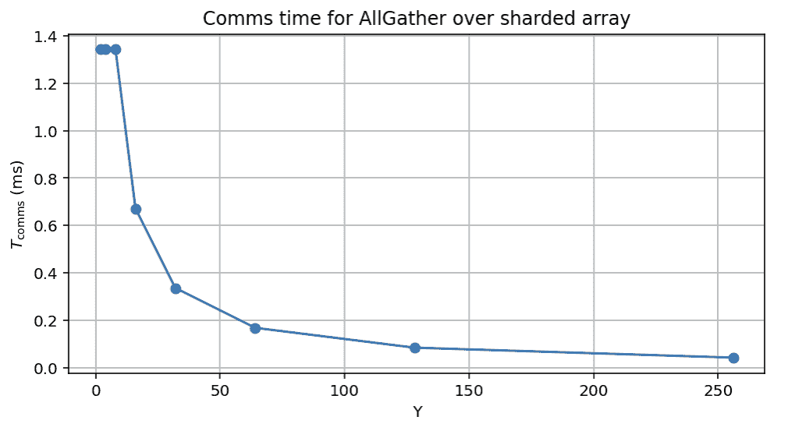</picture>

**图：** 当内层轴跨越更多节点时，碎片化 AllGather 的理论成本。

注意，如果我们进行精确的 8 路模型并行，实际上我们确实减少了节点级归约的成本 8 倍，但整体成本保持不变，所以这是免费的，但并不有助于提高整体带宽。

**要点：** 当我们有多维度的碎片化时，外层归约的成本会减少到内层轴跨越的节点数的倍数。

### 测验 4：集体操作

**问题 1 [SU AllGather]：** 仅考虑具有 M 个节点和每个节点 N 个 GPU 的单个 SU。在 AllGather 操作期间，节点级交换机精确地流入和流出多少字节？顶级交换机呢？

点击此处查看答案。

**答案：** 让我们一步一步来做，通过分析归约的各个部分：

1.  每个 GPU 向交换机发送 $B / MN$ 字节，总流入为 $NB / MN = B / M$ 字节。

1.  我们将完整的 $B / M$ 字节发送到脊交换机。

1.  我们从脊交换机流入 $B * (M - 1) / M$ 字节。

1.  我们流出 $B - B / MN$ 字节 N 次，总共流出 $N * (B - B / MN) = NB - B / M$。

总共是 $B$ 字节流入和 $BN$ 字节流出，因此我们应该在流出处成为瓶颈，总时间将是 $T_\text{AllGather} = BN / W_\text{node} = B / \text{450e9}$。

对于脊交换机，数学实际上更简单。我们必须有 $B / M$ 字节流入 M 次（总共 $B$ 字节），然后 $B (M - 1) / M$ 字节流出 M 次，总共流出 $B * (M - 1)$ 字节。由于这个数值显著更大，因此成本是 $T_\text{AllGather} = B \cdot (M - 1) / (M \cdot W_\text{node}) = B \cdot (M - 1) / (M \cdot \text{400e9})$。

**问题 2 [单节点 SHARP AR]：** 考虑具有每个节点 N 个 GPU 的单节点。在 SHARP（网络内归约）的 AllReduce 操作期间，交换机精确地流入和流出多少字节？

点击此处查看答案。

**答案：** 如前所述，让我们一步一步来做。

1.  每个 GPU 发送 $B * (N - 1) / N$ 字节，因此我们有 $N * B * (N - 1) / N = B * (N - 1)$ 字节流入。

1.  我们累加部分和，并将 $B / N$ 字节发送回每个 GPU，因此 $N * B / N = B$ 字节流出。

1.  我们在本地对残差进行部分求和，然后将这些数据发送回交换机。这总共是 $N * B / N = B$ 字节流入。

1.  我们捕获所有碎片并将它们多播，发送 $B * (N - 1) / N$ 到 N 个目的地，总共流出 $B * (N - 1) / N * N = B * (N - 1)$ 字节。

因此，总字节数为 $B * (N - 1) + B = BN$ 字节流入和流出。这支持整体吞吐量正好为 $B / W_\text{egress}$。

**问题 3 [跨节点 SHARP AR]：** 考虑一个 bf16[D[X], F[Y]]数组在单个节点 N 个 GPU 上碎片化。AllReduce(bf16[D, F[Y]] { U[X] })需要多长时间？你可以假设我们进行网络内归约。如果有多个节点，这将如何不同？

点击此处查看答案。

**答案**：我们可以尝试修改上面问题的答案。基本上，我们首先从每个 GPU 退出 $B * (X - 1) / XY$ 字节，然后发送 $B / XY$ 回到每个 GPU，然后发送相同数量的数据回交换机，然后发送 $B * (X - 1) / XY$ 回到每个 GPU。总数是 $NB / Y$ 入口和出口，所以总时间是 $T_\text{comms} = NB / (Y * N * W_\text{link}) = N * 2DF / (Y * N * W_\text{link}) = 2 * D * F / (Y * W_\text{link})$，所以总时间随着 $Y$ 的增加而减少。

如果我们超出单个节点，我们可以做与上面大致相同的缩减，但当我们离开节点级交换机时，我们需要发送所有 $B$ 字节，而不仅仅是 $B / Y$。这是因为我们需要保持每个分片独立。

**问题 4 [脊柱级 AR 成本]**：考虑与上面相同的设置，但 $Y = 256$（因此 AR 在脊柱级别发生）。AllReduce 需要多长时间？再次，请随意假设网络内缩减。

点击此处查看答案。

**答案**：这让我们可以利用脊柱级别的相当可观的带宽。我们有 4 个节点的 25.6TB/s 带宽，所以 AllReduce 带宽为 6.4TB/s。使用 SHARP，这可以少到 `2 * D * F / 6.4e12` 秒。

**问题 5 [双向 AllGather 成本]**：计算在恰好 2 个节点上执行 $B$ 字节 AllGather 的精确成本。*确保计算精确成本而不是近似值，并考虑节点内和跨节点成本。*

点击此处查看答案。

**答案**：在节点级别，我们有 $T_\text{comms} = B * 7 / (8 * \text{450e9}) = B / \text{514e9}$，而超出节点级别，我们实际上有 $T_\text{comms} = B * (2 - 1) / (2 * \text{400e9}) = B / \text{800e9}$。因此，我们实际上受限于节点级缩减，而不是叶子级！这促使例如 DeepSeek v3，它执行双向数据并行。

## 在 GPU 上进行 LLM 缩放的屋顶线

现在，让我们看看这一切都是为了什么：理解在 GPU 上进行 LLM 缩放的屋顶线。这是为了补充 TPU 训练章节此处。正如我们之前所做的那样，这里的目的是查看不同并行策略的总 $T_\text{math}$ 和 $T_\text{comms}$，并了解在什么点上 $T_\text{comms} > T_\text{math}$。像之前一样，我们只考虑具有操作的 MLP 块

\[\text{MLP}(x) \equiv x[B, D] *_D W_\text{in}[D, F] \cdot_F W_\text{out}[F, D]\]

其中 $B$ 是全局批处理大小 **（以标记为单位**）（即 $B = \text{batch size} \cdot \text{sequence length}$）。

这里我们将重现上面的表格，显示 GPU 和节点级别的有效带宽：

| 节点类型 | 每节点 GPU 数量 | GPU 出口带宽 | 节点出口带宽 |
| --- | --- | --- | --- |
| H100 | 8 | 450e9 | 400e9 |
| B200 | 8 | 900e9 | 400e9 |
| GB200 NVL72 | 72 | 900e9 | 3600e9 |

**注意**：GPU 和节点的出带宽决定了我们 LLMs 的 rooflines。我们将使用术语 $W_\text{collective}$ 来描述 GPU 或节点带宽，具体取决于我们是在节点内部还是节点级别以上操作。

让我们看看我们像为 TPUs 做的那样，对于 **数据并行、张量并行、流水线并行、专家并行** 以及它们的组合来查看计算通信 rooflines。在本节的其余部分，我们将专注于特定计算的 H100 rooflines。GB200-NVL72 有相同的一般 rooflines，但由于我们具有更大的节点出带宽，我们有时会在节点级别上成为瓶颈。

### 数据并行

如前所述，DP 和 ZeRO 分片在反向传播中涉及权重 AllReduce 或 ReduceScatter + AllGather。由于这两者成本相同，对于纯数据并行或 FSDP *没有网络减少*，在反向传播中，每层，具有大小为 X 的轴：

\[T_\text{math} = \frac{2 \cdot 2 \cdot 2 \cdot BDF}{X \cdot C}\] \[T_\text{comms} = \frac{2 \cdot 2 \cdot 2 \cdot DF}{W_\text{collective}}\]

因此，对于 $T_\text{math} > T_\text{comms}$，我们需要 $B / (XC) > 1 / W_\text{collective}$ 或者

\[\frac{B}{X} > \frac{C}{W_\text{collective}}\]

其中 $W_\text{collective}$ 是 GPU 或节点级别的出带宽，具体取决于我们是在节点内部还是节点之间进行分片。因此：

+   **在节点内部**，我们只需要每个 GPU 的 **标记** 批次大小 > $\text{990e12} / \text{450e9} = 2200$。

+   **在 SU 内部或脊级别**，BS > $\text{990e12} / \text{400e9} = 2475$。

这比在 TPU 上要高得多，TPU 上的数字是 850，所有三个轴都是如此。例如，在 16000 个 H100 上训练的 LLaMA-3 需要至少 40M 个标记的批次（作为参考，他们使用了 16M）。在 2048 个 H800 GPU 上训练的 DeepSeek v3，带宽较低为 300GB/s（而不是 H100 上的 450GB/s），需要 $\text{990e12} / \text{300e9} = 3300$ 个标记的 GPU，或者大约 6.7M（实际上他们使用了 4M）。

在启用网络减少并使用纯数据并行的情况下，理论上我们有 2 倍的 AllReduce 带宽，这将将这两个数字减半。然而，在实践中，这种好处更接近 30%，这实际上只是弥补了我们通常难以达到报告的数字的事实。此外，由于纯数据并行很少有用，这在实践中基本上并不重要。

**MoE 模型**：对于一个专家混合（MoE）模型，其中我们拥有 E 个专家和每个标记 k 个专家，这增加到

\[T_\text{math} = \frac{2 \cdot 2 \cdot 2 \cdot k \cdot BDF}{X \cdot C}\] \[T_\text{comms} = \frac{2 \cdot 2 \cdot 2 \cdot EDF}{W_\text{collective}}\]

这将每个 GPU 的标记批次大小增加了 $E/k$ 倍，即

\[\frac{B}{X} > \frac{E}{k} \frac{C}{W_\text{collective}}\]

例如，新的 OpenAI OSS 模型，$k=4$和$E=128$，这增加到节点间的`32 * 2475 = 79,200`，这是一个非常高的数字。

**当 X 很小时会发生什么？** 当我们只进行例如 2 节点数据并行时，我们受益于$(X - 1) / X$的缩放，这给我们

\[T_\text{math} = \frac{2 \cdot 2 \cdot 2 \cdot BDF}{N * C}\] \[T_\text{comms} = \frac{2 \cdot 2 \cdot 2 \cdot DF \cdot (X-1)}{X \cdot W_\text{collective}}\]

其中 X 是节点数，$N = 8 \cdot X$。然后对于密集模型，我们有$B / N > \alpha \cdot (X - 1) / X$，例如$B / N > \text{1237}$，是上述值的一半。你会注意到由于这个原因，2 路数据并行相当常见。

**要点：** 数据并行和 ZeRO 分片需要在 H100 或 B200 上每个 GPU 的批大小约为 2500 个 token，以在计算受限的情况下运行，假设完美的重叠和 FLOPs 利用率。对于 MoE 模型，这增加了一个因子$E / k$，即总参数与激活参数的比例。当进行少量数据并行时，关键的批大小会减小。

### 张量并行

张量并行需要在激活上执行 AllGather 和 ReduceScatter 操作，我们需要将其与 MLP FLOPs 重叠。换句话说，在正向传递中，我们有

\[T_\text{math} = \frac{2\cdot 2 \cdot BDF}{Y \cdot C}\] \[T_\text{comms} = \frac{2\cdot 2 \cdot BD}{W_\text{collective}}\]

这使得计算受限，给我们提供了以下规则

\[Y < \frac{F \cdot W_\text{collective}}{C}\]

在节点内，这给我们大约$F / 2200$或$F / 2475$，超过节点。对于$F=\text{28000}$如 LLaMA-3，这大约是 11 路 TP（或者向下取整，大约是 8 路，这就是节点的大小）。与上面一样，当我们跨越正好 2 个节点时，我们得到额外的 2X 带宽，因此我们可以一般地执行 16 路数据并行（$F > 2475 \cdot (Y - 8)$），理论上最多可以提供 19 路模型并行。

**要点：** 当$Y > F / 2475$时，张量并行在 Y 大小的轴上，前馈维度为 F 时，变为通信限制，这通常限制我们只能进行节点内 TP 或最多 2 节点 TP。

### 专家并行

如我们上面已经提到的，混合专家（MoE）模型具有 E 倍多的模型权重，但只有 k 倍多的 FLOPs，这使得数据并行变得非常困难。我们可以通过在专家维度上分片我们的权重来在一定程度上减轻这一点，即 W[in][E[Z], D, F]。为了执行 MLP 块，我们需要引入 2x AllToAll 来将我们的激活发送到相应的专家。

如上所述，当这个 AllToAllZ->k 跨越多个节点时，其成本大约为$T_\text{AllToAll} = 2 \cdot B \cdot D \cdot (Z-8)/Z \min(8 \cdot k / Z, 1)$，因此对于纯专家并行，我们需要

\[T_\text{math} = \frac{4 \cdot B \cdot k \cdot D \cdot F}{Z \cdot C}\] \[T_\text{comms} = \frac{4 \cdot B \cdot D \cdot (Z-8)}{W \cdot Z} \cdot \min\left(\frac{8 \cdot k}{Z}, 1\right)\]

我们要么需要$K > Z/8$且$F > \alpha \cdot (Z - 8)/k$，要么$Z \gg K$且$F > 8 \cdot \alpha$，其中$\alpha = C/W$。这为你提供了两个专家并行可能存在的领域，一个是有少量专家并行（大约 2 节点）和小$F$，或者是有大$F$和$Z$任意大的领域（多达 E 路专家并行）。

在实践中，你会看到两种情况，要么是少量的专家并行（例如 DeepSeek v3，它具有非常小的 F 和相对较小、受限的跨节点专家并行），要么是具有大 F 的模型，在这种情况下，我们可以进行大量的跨节点 EP，同时进行 TP。

**要点：** 如果 $F < 8 * C / W_\text{node}$，专家并行可以跨越 1-2 个节点，成本与 TP 相似（略低），或者如果 $F > 8 * C / W_\text{node}$，我们可以以相对较低的成本进行大量的专家并行（多达$E$个节点）。

### 流水线并行

管道并行将层分布在节点之间，通信成本极低，因为我们只是在每几层发送一小批激活。历史上，流水线一直受到“流水线气泡”的困扰，但有了新的零气泡流水线方法，通常可以避免这种情况。

流水线的整体通信成本很小：有$N_\text{MB}$个微批次和$N_\text{stages}$，我们有$T_\text{comms per hop} = 2 \cdot B \cdot D / (W \cdot N_\text{MB})$和$N_\text{MB} + N_\text{stages} - 2$个跳数，所以大约

\[T_\text{total PP comms} = \frac{2BD}{W \cdot N_\text{MB}} \cdot (N_\text{MB} + N_\text{stages} - 2)\] \[T_\text{per-layer comms} \approx 1.5 \cdot \frac{2BD}{W \cdot N_\text{layers}}\]

由于我们是除以$N_\text{layers}$，这比其他任何成本都要小得多。换句话说，从通信的角度来看，流水线基本上是免费的。那么为什么我们不直接进行流水线呢？有几个原因：

(1) **代码复杂性：** 流水线不像其他方法那样很好地适应自动并行框架（如 XLA 的 GSPMD）。因为它引入了微批处理来隐藏流水线气泡，它改变了程序的结构，并且自定义零气泡流水线调度通过需要复杂的前向和反向传递交织来加剧这个问题。

(2) **流水线使数据并行和 FSDP 变得困难：** 不进行流水线的主要原因可能是它与 FSDP 和数据并行不兼容。特别是 ZeRO-3 分片工作得不好，因为它要求我们在每个微批次上执行 AllGather 操作，这在只有$B / N_\text{microbatches}$个令牌来分摊 AllGather 成本时是不行的。此外，在反向传递期间，*我们无法在最后一个微批次通过给定阶段之前执行 AllReduce 或 ReduceScatter 梯度，这意味着我们有很大的非重叠通信时间*。

<picture>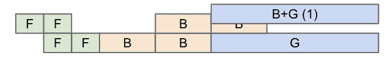</picture>

**图示：**一个示例 2 阶段，2 微批处理流水线。F 表示一个阶段的正向传递，B 是一个阶段的反向传递（成本为 2 倍）。G 表示数据并行 AllReduce，它可以比单个微批处理的时间长得多。

（3）**流水线气泡和步骤不平衡：**正如你在上面（不好的）流水线计划中看到的，在简单的流水线计划中很容易出现显著的气泡（意味着浪费的计算）。在上面的例子中，第二个阶段在步骤 0 时空闲，第一个阶段从步骤 2 到 3 空闲，第二个阶段在最后一个步骤再次空闲。虽然我们可以通过仔细的调度来避免这些问题，但我们仍然经常有一些气泡。我们还需要在关键路径上从一个阶段传递激活到下一个阶段，这可能会增加开销：

<picture>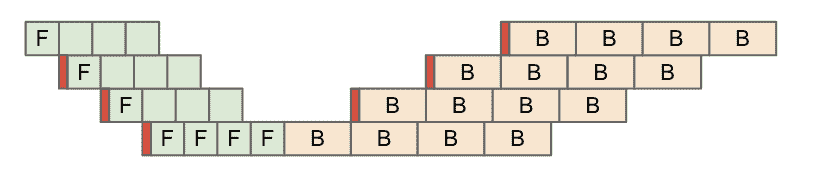</picture>

**图示：**一个示例流水线，用红色表示传输成本。这改变了各个阶段之间的相对位置，并增加了流水线气泡开销。

对于这些问题中的每一个，都有一些解决方案，但它们往往难以实现和维护，但流水线仍然是一种与其他方法相比通信成本较低的技巧。

**关于延迟的注意事项：**如前所述，即使消息相当大，GPU 也难以实现全 AllReduce 带宽。这意味着即使从理论上讲，我们可以跨多个节点扩展例如专家并行 AllToAlls，我们可能也难以实现总带宽的 50%。这意味着我们确实尝试将 TP 或 EP 保持在更少的节点内，以最小化延迟开销。

### 示例

**DeepSeek 做了什么？** 作为参考，[DeepSeek V3](https://arxiv.org/abs/2412.19437)使用 2048 个 H800 GPU 进行训练，

+   涵盖 8 个节点的 64 路专家并行（EP）

+   16 路流水线并行（PP）

+   2 路 ZeRO-1 数据并行（DP）

他们有一个稳定的批处理大小为`4096 * 15360 = 62,914,560`个标记，或者每个 GPU 30k 个标记。你可以看到这已经相当大了，但他们的模型也非常稀疏（k=8，E=256），因此你需要一个相当大的批处理大小。你可以看到，在 64 路 EP 和 16 路 PP 的情况下，我们最终实现了总共 1024 路模型并行，这意味着 AllReduce 是在脊级别完成的，而且因为它只有 2 路，所以在实际中我们得到了$2 / (2 - 1) = 2$倍的带宽。这也帮助减少了最终数据并行 AllReduce 与最终流水线阶段的重叠成本。

**LLaMA-3 做了什么？** LLaMA-3 在 16k 个 GPU 上使用 16M 个标记的批处理大小进行训练，或者大约每个 GPU 1k 个标记。他们做了：

+   节点内的 8 路张量并行（TP）

+   16 路流水线并行（PP）

+   128 路 ZeRO-1 数据并行

这也是一个密集模型，所以一般来说这些事情都很简单。16 路 PP 将数据并行 AllReduce 的成本降低了 16 倍，这有助于我们减少关键批处理大小。

### LLM 在 GPU 上的扩展 TLDR

让我们回顾一下到目前为止我们已经学到的内容：

+   **数据并行性或 FSDP（ZeRO-1/3）需要每个 GPU 大约 2500 个 token 的本地批量大小**，尽管在理论上，网络中的减少+纯 DP 可以减少这一点。

+   **张量并行性在 8 路以上是计算受限的**，但我们缺乏带宽来扩展超过这个范围，否则就会成为通信受限。这主要限制我们只能在一个 NVLink 域内（即单节点或需要使用 GB200NVL72 与 72 个 GPU）。

+   **任何跨越多个节点的模型并行形式都可以进一步降低 FSDP 的成本**，因此我们通常希望混合 PP + EP + TP 以跨越多个节点并降低 FSDP 成本。

+   **如果能够处理零气泡流水线的代码复杂性并保持批量大小相当大以避免数据并行瓶颈，则流水线并行性效果良好。** 流水线通常会使 ZeRO-3 变得不可能（因为需要在每个流水线阶段进行 AllGather），但可以改为使用 ZeRO-1。

**从高层次来看，这为我们提供了在 GPU 上分片大型模型的配方：**

+   对于相对较小的密集模型，如果具有批量大小，则激进的 FSDP 效果很好，如果需要，可能还需要一些流水线或张量并行性。

+   对于较大的密集模型，1-2 节点 TP + 多节点 PP + 纯 DP 的组合效果良好。

+   对于 MoEs，上述规则适用，但我们还可以进行专家并行性，这通常是我们更愿意选择的 TP。如果$F > 8 * C / W_\text{node}$，我们可以进行大量的多节点专家并行性，否则我们限制在约 2 节点 EP。

### 测验 5：LLM 屋顶线

**问题 1 [B200 屋顶线]：** B200 DGX SuperPod（**不是 GB200 NVL72**）在节点内部有 2 倍的带宽（900GB/s 出口），但在扩展网络中的带宽相同（400GB/s）([来源](https://docs.nvidia.com/dgx-superpod/reference-architecture-scalable-infrastructure-b200/latest/network-fabrics.html))。总 FLOPs 已在上面报告。这如何改变模型和数据并行的屋顶线？

点击此处查看答案。

**答案：** 我们在 bfloat16 中的 FLOPs/s 从 990 增加到 2250 TFLOPs，增加了 2.25 倍。带宽增加 2 倍后，在节点内部，我们的屋顶线大致保持不变。例如，对于 TP，关键强度增加到`2250e12 / 900e9 = 2500`，因此我们有一个限制条件$Y < F / 2500$，这仅略高（除非节点大小增加，否则这不会对我们有所帮助）。

然而，节点之外，缺乏额外的带宽实际上使得我们更难以成为计算受限！例如，对于数据并行性，我们的关键批量大小增加到`2250e12 / 400e9 = 5625`，因为我们的 GPU 在相同的带宽下可以执行显著更多的 FLOPs。

GB200 SuperPods 带有 72-GPU 节点的改变是通过增加更多的出口带宽([来源](https://docs.nvidia.com/dgx-superpod/reference-architecture-scalable-infrastructure-gb200/latest/network-fabrics.html#compute-fabric-576))。

**问题 2 [如何分片 LLaMA-3 70B]：** 考虑 LLaMA-3 70B，使用 bfloat16 进行训练，并使用 Adam 优化器状态。

1.  至少，我们需要多少个 H100 来简单地存储权重和优化器？

1.  假设我们想在 4096 个 H100 GPU 上训练 15T 个标记。假设我们实现了 45%的 MFU（模型 FLOPs 利用率）。训练需要多长时间？

1.  LLaMA-3 70B 有`F = 28,672`，并且使用大约 4M 个标记的批大小进行训练。在不被通信限制的情况下，我们最多可以进行多少模型并行？加上纯 DP，我们能否在 4k 芯片上保持计算限制的情况下训练 LLaMA-3？ZeRO-3 呢？8 路流水线呢？*注意：考虑通信成本和 GPU 内存使用。*

点击此处查看答案。

1.  我们需要 2 个字节的权重和 8 个字节的优化器状态，所以至少需要 700GB。有 80GB 的 DRAM，我们至少需要 9 个 GPU，或者（向上取整）至少 2 个 8xH100 节点。这将花费很长时间来训练，而且无法保存梯度检查点，但这是一个下限。

1.  这将需要总共`6 * 70e9 * 15e12 = 6.3e24 bf16 FLOPs`。每个 GPU 可以执行`990e12` FLOPs，所以在 45%的 MFU（模型 FLOPs 利用率）下，我们可以做到 1.8e18 FLOPs/s。因此，整个过程将需要 3.5e6 秒，即 40 天。

1.  在节点内部，我们有 450GB/s 的带宽，所以限制大约是`F / 1995 = 28672 / 1995 = 14.372`。由于这没有跨越 2 个节点，这实际上意味着我们最多会进行 8 路模型并行。

    1.  这将需要我们进行 512 路动态规划（DP）。首先，我们需要看看我们是否有足够的内存。由于我们的模型只分片了 8 路，这意味着`700GB / 8 = 87.5GB / GPU`，这不会合适，所以不行！

    1.  使用 ZeRO-3 和 8 路 TP，我们将进行 512 路 ZeRO-3。由于我们积极分片了所有内容，所以这不会有任何内存问题。我们将有每个 GPU 的批大小为`4e6 / 4096 = 976`。这相当低，甚至低于我们的纯 DP 限制，而且这是两倍的限制，因为我们必须移动我们的权重。所以不行。

    1.  使用 8 路流水线，每个模型并行分片现在跨越 8 个节点。正如我们所看到的，这减少了我们叶子级 AllGathers 的成本 8 倍，因此那里的整体 AllReduce/AllGather 带宽从 400GB/s 增加到`8 * 400GB/s = 3200GB/s`。因此，屋顶线是`990e12 / 3200e9 = 309`，所以我们应该是安全的！我们只需要有效地实现流水线。

**问题 3 [Megatron-LM 超参数]**：考虑来自[Megatron-LM 仓库](https://github.com/NVIDIA/Megatron-LM)的这张图，突出显示他们高 MFU（模型 FLOPs 利用率）数值。

<picture>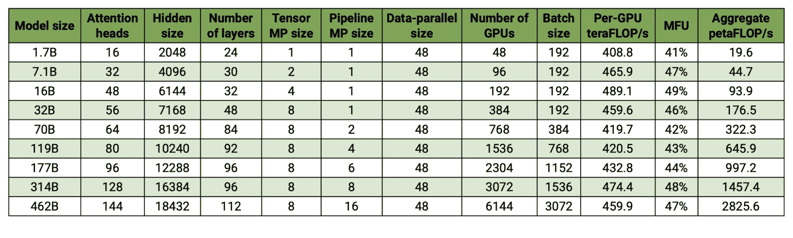</picture>

注意，它们的序列长度在所有地方都是 4096。对于 16B、70B 和 314B 模型，每个 GPU 的标记批大小是多少？假设数据并行是最外层轴，并假设 bfloat16 减少，确定每个都是理论上计算限制还是通信限制，以及是否有更优的配置？

点击此处查看答案。

**答案**：让我们从每个 GPU 的批大小开始。

+   **16B**：`192 * 4096 / 192 = 4096`个标记每个 GPU

+   **70B**：每个 GPU `384 * 4096 / 768 = 2048` 个标记

+   **314B**：每个 GPU `1536 * 4096 / 3072 = 2048` 个标记

这意味着除了第一个之外，这些都在每个批次大约 2k 个标记左右，这明显接近我们为 FSDP 计算的关键阈值。我们根据脊柱级别缩减计算了这个界限，它应该在这里大致发挥作用。然而，对于 70B 和 314B 来说，因为我们有 16 和 64 路模型（PP + TP）分片，我们在脊柱级别获得了 2 倍和 8 倍更好的吞吐量，这意味着我们应该在大约 1k 和 300 个标记/步时分别处于计算瓶颈。

## 致谢和进一步阅读

本章在很大程度上依赖于许多知识渊博的 GPU 专家的帮助，包括：

+   Adam Paszke，他帮助解释了 GPU 上内核编程的现实。

+   Swapnil Patil，他首先解释了 GPU 网络的工作原理。

+   Stas Bekman，他指出 GPU 的实际现实往往与宣称的规格不同。

+   Reiner Pope，他帮助澄清了 GPU 和 TPU 在硬件层面的比较。

+   Frédéric Bastien，他提供了关于芯片级故事的详细反馈。

+   Nouamane Tazi，他在 LLM 在 GPU 上的训练经验帮助改进了屋顶线部分。

+   Sanford Miller，他帮助我理解了 GPU 如何进行网络连接以及 NVIDIA 的规格与现场通常部署的内容相比如何。

关于 GPU 有很多好的阅读材料，但其中一些我最喜欢的包括：

+   [SemiAnalysis 的 NVIDIA Tensor Core 发展史](https://semianalysis.com/2025/06/23/nvidia-tensor-core-evolution-from-volta-to-blackwell/)：一篇出色的文章，描述了 GPU 如何从视频游戏引擎转变为机器学习加速器。

+   [SemiAnalysis 对 Blackwell 性能的分析](https://semianalysis.com/2024/04/10/nvidia-blackwell-perf-tco-analysis/)：阅读此文档以了解 NVIDIA 下一代 GPU。

+   [H100 DGX SuperPod 参考文档](https://docs.nvidia.com/dgx-superpod-reference-architecture-dgx-h100.pdf)：关于如何将更大的 GPU 集群进行网络连接的干燥但实用的阅读材料。[这里](https://docs.nvidia.com/dgx-superpod/reference-architecture-scalable-infrastructure-gb200/latest/network-fabrics.html#compute-fabric-576)是关于 GB200 系统的类似文档。

+   [Hot Chips 关于 NVLink 交换机的讨论](https://hc34.hotchips.org/assets/program/conference/day2/Network%20and%20Switches/NVSwitch%20HotChips%202022%20r5.pdf)：关于 NVLink 和 NCCL 集体操作的有趣阅读，特别是包括网络缩减。

+   [DeepSeek-V3 技术报告](https://arxiv.org/pdf/2412.19437)：一个大型半开放 LLM 训练报告的好例子，描述了他们如何选择他们的分片设置。

+   [如何优化 CUDA 矩阵乘法](https://siboehm.com/articles/22/CUDA-MMM)：一篇优秀的博客，描述了如何使用 CUDA 核心实现高效的矩阵乘法，并关注 GPU 上的缓存一致性。

+   [HuggingFace 超大规模操作手册](https://huggingface.co/spaces/nanotron/ultrascale-playbook)：一个关于 GPU 上 LLM 并行化的指南，部分启发了本章。

+   [从第一性原理让深度学习冷下来](https://horace.io/brrr_intro.html)：一个更侧重于 GPU 和 PyTorch 的教程，关于 LLM rooflines 和性能工程。

+   [康奈尔理解 GPU 架构网站](https://cvw.cac.cornell.edu/gpu-architecture)：与本书类似的指南，更具体地比较了 GPU 和 CPU 的内部结构。

## 附录 A：GB200 如何变化？

Blackwell 介绍了许多主要的网络变更，包括带宽翻倍的整体 NVLink 5（900GB/s）。B200 仍然拥有 8 个 GPU 节点，就像 H100s 一样，但 GB200 系统（将 B200 GPU 与 Grace CPU 结合）引入了更大的 NVLink 域（NVL72 中有 72 个 GPU，理论上最多可达 576 个）。更大的 NVLink 域也有效地增加了节点的出口带宽，从而降低了节点级别以上的集体成本。

<picture>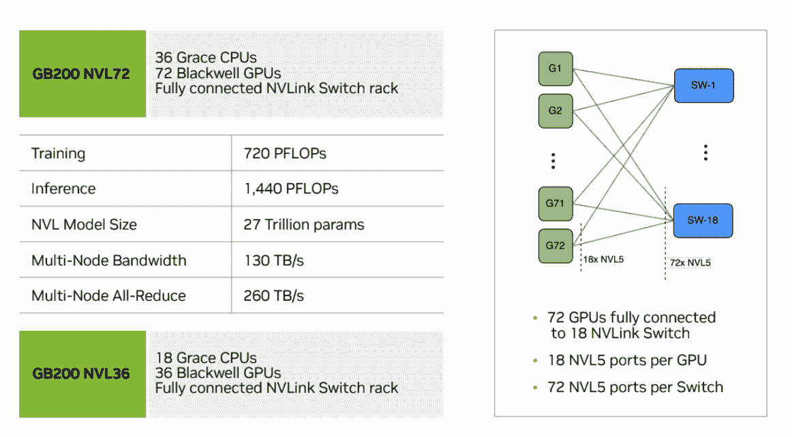</picture>

**图**：展示 GB200 NVL72 单元如何构建的图表，包含 18 个交换机和 72 个 GPU。

在节点内部，这种增加的带宽（从 450GB/s 增加到 900GB/s）并没有带来太大的差异，因为我们还加倍了每个 GPU 的总 FLOPs/s。我们的 rooflines 基本上保持不变，尽管由于 NVLink 具有更好的带宽，专家并行化变得更加容易。

超出节点之外，事情变化更多。这里有一个来自[这里](https://docs.nvidia.com/dgx-superpod/reference-architecture-scalable-infrastructure-gb200/latest/network-fabrics.html#compute-fabric-576)的 SuperPod 图示。

<picture></picture>

**图**：一个展示 576 个 GPU 的 GB200 DGX SuperPod 的图表。

如您所见，每个节点的出口带宽增加到`4 * 18 * 400 / 8 = 3.6TB/s`，从 H100 的 400GB/s 提高到。由于我们的 FLOPs/chip 也翻倍，这大约提高了 4 倍的有效跨节点 rooflines。现在我们可能开始担心我们是否在节点级别而不是扩展级别遇到瓶颈。

**Grace Hopper**：NVIDIA 还销售 GH200 和 GB200 系统，这些系统将一定数量的 GPU 与 Grace CPU 配对。例如，一个 GH200 有 1 个 H200 和 1 个 Grace CPU，而 GB200 系统有 2 个 B200 和 1 个 Grace CPU。这个系统的优点是 CPU 通过全带宽 NVLink 连接（称为 NVLink C2C）连接到 GPU，因此您拥有非常高的 CPU 到 GPU 带宽，这对于将参数卸载到主机 RAM 非常有用。换句话说，对于任何给定的 GPU，到达主机内存的带宽与到达另一个 GPU 的 HBM 的带宽相同。

## 附录 B：更多网络细节

这里是一个 NVLink 4 交换机的图示。总共有 64 个 NVLink4 端口（每个端口使用 2 个物理通道），以及一个处理跨通道切换的大交叉开关。相比之下，TPU 使用带有可动态重新配置的镜子的光交换机。

<picture>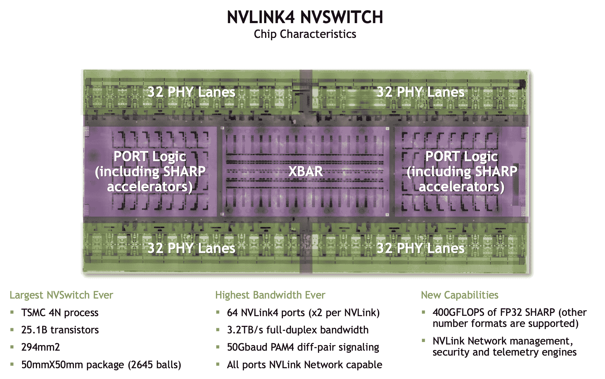</picture>

**图示：** 单个 NVLink4 交换机的低级视图。

在每个级别，我们可能会因为可用的链路带宽或总交换机带宽而成为瓶颈。

+   **节点级别：** 在节点级别，我们有 4 * 1.6TB/s = 6.4TB/s 的 NVSwitch 带宽，但我们的每个 8 个 GPU 只能向交换机输出 450GB/s，这意味着我们在节点内部实际上有一个峰值带宽为 450e9 * 8 = 3.6TB/s（全双工）。

+   **SU/leaf 级别：** 在 SU 级别，我们有 8 个交换机以全对全的方式连接 32 个节点，使用 1x400 Gbps Infiniband。这给我们从节点处提供了 8 * 32 * 400 / 8 = 12.8TB/s 的出带宽，并且在交换机级别我们有 8 * 1.6TB/s = 12.8TB/s 的带宽，因此两者完全一致。

+   **脊级别：** 在脊级别，我们有 16 个交换机通过 2x400 Gbps 链接连接 32 个叶子交换机，因此我们有 32 * 16 * 400 * 2 / 8 = 51.2TB/s 的出带宽。这 16 个交换机给我们 16 * 1.6TB/s = 25.6TB/s 的带宽，因此这是此级别的瓶颈。

每个 GPU，这给我们节点级别的 450GB/s GPU 到 GPU 带宽，SU 级别的 50GB/s，以及脊级别的 25 GB/s。

**GPU 实验性 AR 带宽：**

<picture></picture>

**图示：** 8xH100 集群上的 AllReduce 带宽（节点内部，SHARP 禁用）。

TPU v5p 带宽（1 轴）：

<picture>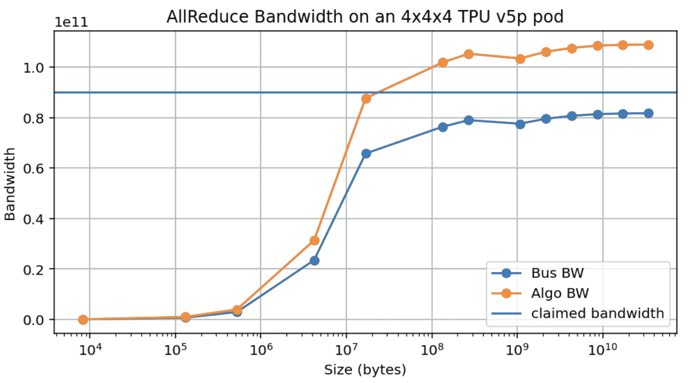</picture>

**图示：** TPU v5p 4x4x4 集群上的 AllReduce 带宽（沿一个轴）。

这里还有 AllGather 带宽：

<picture>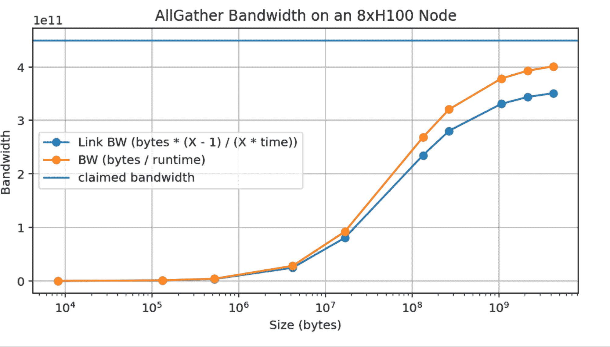</picture>

**图示：** 8xH100 集群上的 AllGather 带宽（节点内部）。

<picture>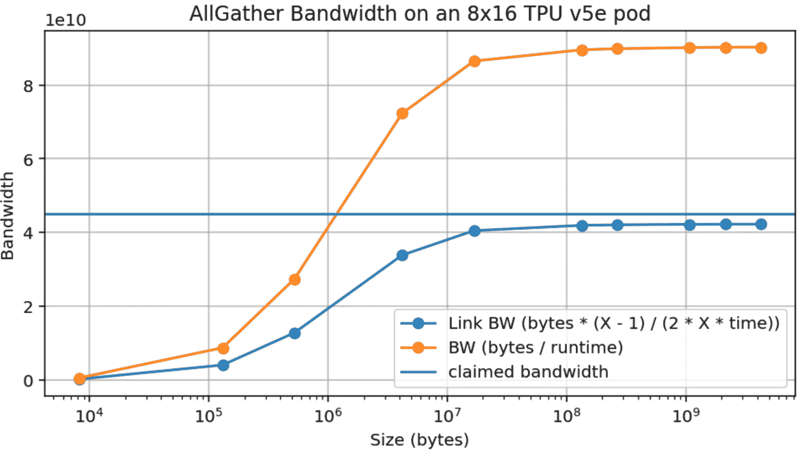</picture>

**图示：** TPU v5e 8x16 集群上的 AllGather 带宽（沿一个轴）。

**关于 AllToAll 成本的更多内容：**

在这里，我们可以将近似值 $\min(K / Z) * (Z - 1) / Z$ 与真实值 $(1 - ((Z - 1) / Z) ** K) * (Z - 1) / Z$ 进行比较。它们很相似，除了 $Z$ 的值较小的情况。

<picture>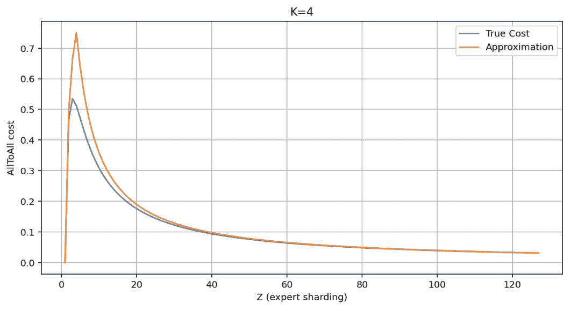</picture>

**图示：** 随着碎片数量增加，粗糙 AllToAll 的近似成本与真实成本的比较。

^*在 Google DeepMind 完成的工作，现在在 MatX。

### 引用

在学术环境中进行归属时，请引用此工作如下：

```py
 Austin et al., "How to Scale Your Model", Google DeepMind, online, 2025. 
```

或者作为一个 BibTeX 条目：

```py
 @article{scaling-book,
      title = {How to Scale Your Model},
      author = {Austin, Jacob and Douglas, Sholto and Frostig, Roy and Levskaya, Anselm and Chen, Charlie and Vikram, Sharad
      and Lebron, Federico and Choy, Peter and Ramasesh, Vinay and Webson, Albert and Pope, Reiner},
      publisher = {Google DeepMind},
      howpublished = {Online},
      note = {Retrieved from https://jax-ml.github.io/scaling-book/},
      year = {2025}
    } 
``` 
