# 通用视觉语言模型

> 原文：[`lilianweng.github.io/posts/2022-06-09-vlm/`](https://lilianweng.github.io/posts/2022-06-09-vlm/)

处理图像以生成文本，如图像字幕和视觉问答，已经研究多年。传统上，这种系统依赖于对象检测网络作为视觉编码器来捕获视觉特征，然后通过文本解码器生成文本。鉴于大量现有文献，在本文中，我只想专注于解决视觉语言任务的一种方法，即*扩展预训练的[通用语言模型](https://lilianweng.github.io/posts/2019-01-31-lm/)以能够接收视觉信号*。

我大致将这种视觉语言模型（VLMs）分为四类：

1.  将图像翻译为嵌入特征，可以与标记嵌入一起进行联合训练。

1.  学习良好的图像嵌入，可以作为冻结的、预训练语言模型的前缀。

1.  使用特殊设计的交叉注意力机制将视觉信息融入语言模型的层中。

1.  将视觉和语言模型结合而无需任何训练。

# 与图像和文本联合训练

将视觉信息融入语言模型的一种直接方法是将图像视为普通文本标记，并在同时表示文本和图像的序列上训练模型。具体来说，图像被划分为多个较小的补丁，每个补丁被视为输入序列中的一个“标记”。

**VisualBERT**（[Li 等，2019](https://arxiv.org/abs/1908.03557)）将文本输入和图像区域输入到[BERT](https://lilianweng.github.io/posts/2019-01-31-lm/#bert)中，以便通过自注意机制发现图像和文本之间的内部对齐。

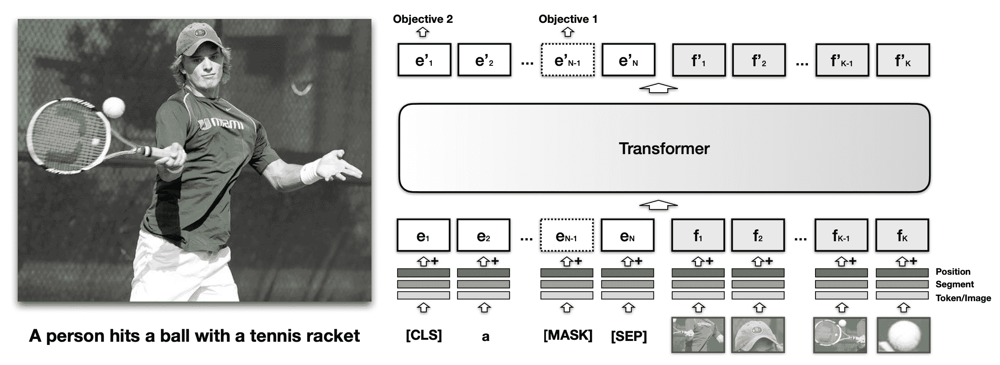

图 1。VisualBERT 在文本和图像嵌入的组合上进行训练。（图片来源：[Li 等，2019](https://arxiv.org/abs/1908.03557)）

类似于[BERT 中的文本嵌入](https://lilianweng.github.io/posts/2019-01-31-lm/#input-embedding)，VisualBERT 中的每个视觉嵌入也总结了三种类型的嵌入，标记化特征 $f_o$，分段嵌入 $f_s$ 和位置嵌入 $f_p$，具体如下：

1.  $f_o$ 是由卷积神经网络计算出的图像边界区域的视觉特征向量；

1.  $f_s$ 是一个段落嵌入，用于指示嵌入是否用于视觉而非文本；

1.  $f_p$ 是用于对齐边界区域顺序的位置嵌入。

该模型在 MS COCO 图像字幕数据集上进行训练，同时将文本和图像作为输入，以预测文本字幕，使用两种视觉基础语言模型目标：

1.  *[MLM](https://lilianweng.github.io/posts/2019-01-31-lm/#pre-training-tasks)与图像*。模型需要预测被屏蔽的文本标记，而图像嵌入始终保持未被屏蔽。

1.  *句子-图像预测*。当提供一张图像和两个相关的字幕时，其中一个字幕可能是一个与之无关的随机字幕，概率为 50%。模型被要求区分这两种情况。

根据消融实验，最重要的配置是将视觉信息早期融入到变压器层中，并在 COCO 字幕数据集上对模型进行预训练。从预训练的 BERT 初始化和采用句子-图像预测训练目标对模型影响较小。


图 2。VisualBERT 在 NLVR 上的消融研究结果。

(图片来源：[李等人，2019](https://arxiv.org/abs/1908.03557))

VisualBERT 在 NLVR 和 Flickr30K 上的表现超越了当时的最先进技术，但在 VQA 上仍存在一些性能差距。

**SimVLM**（简单视觉语言模型；[王等人，2022](https://arxiv.org/abs/2108.10904)）是一个简单的*前缀语言模型*，其中前缀序列像 BERT 一样进行双向注意力处理，但主要输入序列只有像 GPT 那样的因果关注。图像被编码为前缀标记，以便模型可以充分利用视觉信息，然后以自回归方式生成相关文本。

受[ViT](https://arxiv.org/abs/2010.11929)和[CoAtNet](https://arxiv.org/abs/2106.04803)的启发，SimVLM 将图像分割成较小的补丁，在一个扁平的 1D 补丁序列中。他们使用由 ResNet 的前 3 个块组成的卷积阶段来提取具有上下文的补丁，这种设置被发现比天真的线性投影效果更好。


图 3。SimVLM 的训练架构，其中图像补丁由交叉注意力编码器处理，文本解码器具有因果关注。（图片来源：[王等人，2022](https://arxiv.org/abs/2108.10904))

SimVLM 的训练数据包括来自 ALIGN 的大量图像-文本对（[贾等人，2021](https://arxiv.org/abs/2102.05918)）和来自 C4 数据集的仅文本数据（[Raffel 等人，2019](https://arxiv.org/abs/1910.10683)）。他们在每个批次中混合这两个预训练数据集，包含 4,096 个图像-文本对（ALIGN）和 512 个仅文本文档（C4）。

根据消融研究，对于训练来说同时拥有图像-文本和仅文本数据是重要的。PrefixLM 目标优于[span corruption](https://arxiv.org/abs/1910.10683)和天真 LM。

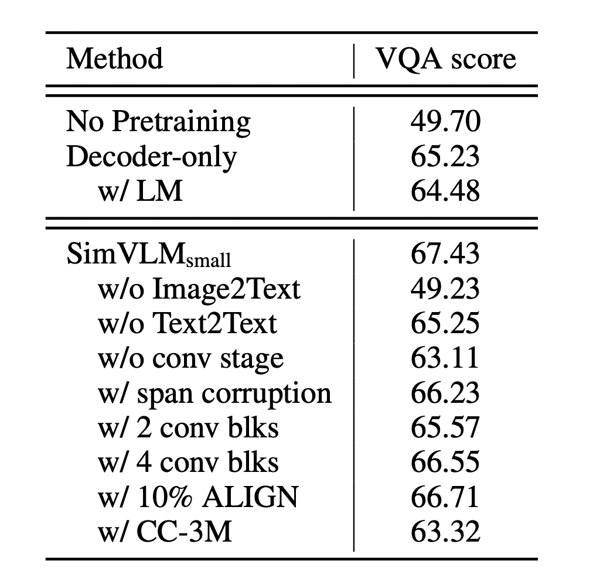

图 4。SimVLM 在 VQA 上的消融研究结果。

(图片来源：[王等人，2022](https://arxiv.org/abs/2108.10904))

**CM3**（因果屏蔽多模态建模；[Aghajanyan 等人，2022](https://arxiv.org/abs/2201.07520)）是一个超文本语言模型，学习生成 CC-NEWS 和维基百科文章的大规模 HTML 网页的内容（超文本标记、超链接和图像）。生成的 CM3 模型可以在任意屏蔽文档上下文的条件下生成丰富结构化的多模态输出。

在架构上，CM3 是一个自回归模型。然而，为了结合因果和屏蔽语言建模，CM3 还会屏蔽一小部分长标记跨度，并尝试在序列的*末尾*生成它们。


图 5. 描述因果屏蔽语言模型的工作原理。

(图片来源：[Aghajanyan 等人，2022](https://arxiv.org/abs/2201.07520))

CM3 的训练数据集包含接近 1T 的 Web 数据。在预处理过程中，首先从`src`下载图像，并将其调整大小为 256 x 256，并进行随机裁剪。然后，它们通过[VQVAE-GAN](https://arxiv.org/abs/2012.09841)进行标记化，每个图像产生 256 个标记。这些标记与空格连接后插入回`src`属性。

CM3 可以通过提示工程完成几种类型的任务：

+   图像填充：

```py
Infilling Prompt: {postfix}"><mask:0> 
```

+   有条件的图像填充：

```py
Conditional Infilling Prompt:
{postfix}"><mask:0> 
```

+   有条件的图像生成：

```py
Conditional Generation Prompt: " src="{image}">

Captioning Causal Prompt #1: 
Memphis</a>

Prompt: Manetho writes that these kings ruled from <a title="<mask:0>">Memphis</a>...<mask:0>

Target: Manetho writes that these kings ruled from <a title="<mask:0>">Memphis</a>...<mask:0> Memphis, Egypt 
```

# 作为（Frozen）LM 前缀的学习图像嵌入

如果我们不想在调整语言模型以处理视觉信号时改变语言模型参数怎么办？相反，我们学习这样一个图像嵌入空间，使其与语言模型兼容。

受到[prefix](https://arxiv.org/abs/2101.00190)或[prompt](https://arxiv.org/abs/2104.08691)[调整](https://lilianweng.github.io/posts/2021-01-02-controllable-text-generation/#prefix-tuning)的启发，**Frozen**（[Tsimpoukelli 等人，2021](https://arxiv.org/abs/2106.13884)）和**ClipCap**（[Mokady, Hertz & Hertz, 2021](https://arxiv.org/abs/2111.09734)）在训练期间仅更新视觉模块的参数，以生成可以与预训练的*冻结*语言模型配合使用的图像嵌入。两者都是使用对齐的图像标题数据集进行训练，以在图像和先前文本标记的条件下生成标题中的下一个文本标记。通过冻结 LM 参数来保留强大的语言能力。此外，即使这种设置是使用有限的图像标题数据进行训练的，它们在测试时也可以依赖语言模型的百科知识。

Frozen 的视觉编码器基于 NF-ResNet-50，并在全局池化层之后使用 NF-Resnet 的最终输出向量。Frozen VLM 可以作为多模型少样本学习器，在测试时用于零样本或少样本转移，使用交错图像和文本序列。

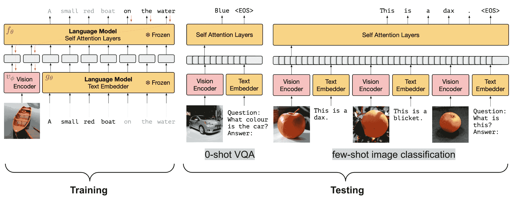

图 6. 冻结模型（左）训练架构和（右）测试流程的示意图。（图片来源：[Tsimpoukelli 等人，2021](https://arxiv.org/abs/2106.13884)）

实验证明，微调预训练的 LM 有趣地导致 VQA 任务表现更差。从预训练版本初始化语言模型非常重要，因为从头开始训练（${Frozen}_\text{scratch}$）没有显示出任何有意义的进展。基线${Frozen}_\text{train-blind}$虽然将图像变黑，但仍然能够取得不错的表现，这是因为预训练 LM 的固有能力。


图 7. 在概念字幕上训练的 Frozen 不同版本在（左）VQAv2 和（右）OKVQA 上的表现。“Frozen scratch”不加载预训练的 LM，而是从头开始训练。“Frozen finetuned”对语言模型进行了微调，而“Frozen”保持 LM 冻结。“Frozen train-blind”将图像变黑。（图片来源：[Tsimpoukelli 等人，2021](https://arxiv.org/abs/2106.13884)）

ClipCap 依赖于[CLIP](https://lilianweng.github.io/posts/2021-05-31-contrastive/#clip)（[Radford 等人，2021](https://arxiv.org/abs/2103.00020)）进行视觉编码，但需要通过一个轻量级映射网络$F$进行处理，使图像嵌入向量转换为与预训练 LM 相同的语义空间。网络$F$将 CLIP 嵌入映射为一系列$k$个嵌入向量，每个向量的维度与 GPT2 中的单词嵌入相同。增加前缀大小$k$有助于提高性能。在训练期间，CLIP 视觉编码器和 LM 都是*冻结*的，只有映射网络$F$是可学习的。他们发现，当 LM 被冻结时，$F$应该是一个 transformer，具有 8 个多头自注意力层，每个层有 8 个头，但当 LM 可以进行微调时，一个 MLP 就足够了。

即使 ClipCap 只训练了一组最少的参数，它仍然在图像字幕任务上取得了不错的表现，与当时的最先进技术（例如[Oscar](https://arxiv.org/abs/2004.06165)，[VLP](https://arxiv.org/abs/1909.11059)，[BUTD](https://arxiv.org/abs/1707.07998)）相媲美。因此，他们假设“CLIP 空间已经包含了所需的信息，并且将其调整到特定风格并不会增加灵活性。”


图 8. ClipCap 训练流程概述，只需训练映射网络以将 CLIP 图像嵌入转换为与预训练 LM 配合的形式。（图片来源：[Mokady，Hertz＆Hertz，2021](https://arxiv.org/abs/2111.09734)）

有趣的事实是 - 因为 ClipCap 将 CLIP 图像嵌入转换为 LM 空间，处理后的前缀甚至可以被解释为单词。

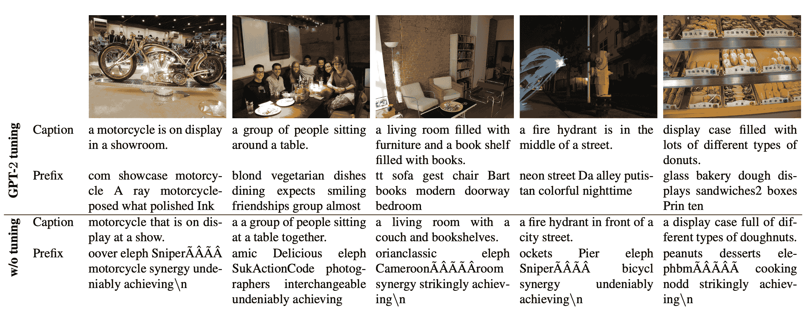

图 9\. 学习到的图像嵌入可以被解释为文本，包含与图像内容相关的词语。（图片来源：[Mokady, Hertz & Hertz, 2021](https://arxiv.org/abs/2111.09734)）

# 文本-图像交叉注意力融合机制

为了更有效地将视觉信息融入语言模型的不同层中，我们可以考虑一种特别设计的交叉注意力融合机制，以平衡文本生成能力和视觉信息的混合。

**VisualGPT**（[Chen et al. 2021](https://arxiv.org/abs/2102.10407)）采用了一种自我复活的编码器-解码器注意力机制，快速适应预训练的 LM 与少量领域内的图像文本数据。

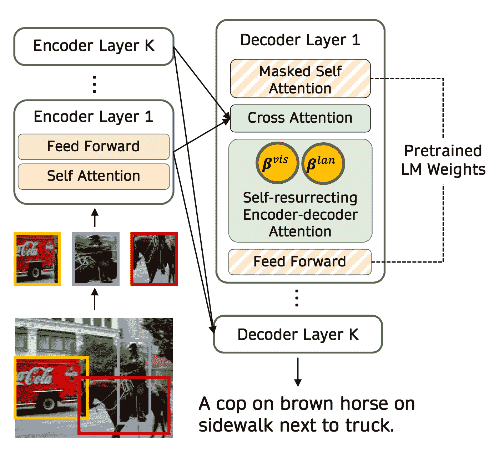

图 10\. VisualGPT 架构示意图。（图片来源：[Chen et al. 2021](https://arxiv.org/abs/2102.10407)）

设 $I$ 为视觉编码器的输出，$H$ 为 LM 解码器的隐藏状态。VisualGPT 引入了一种自我复活激活单元（SRAU），通过两个互补门 $B^\text{vis}$ 和 $B^\text{lan}$ 控制预训练语言信息 $H$ 和视觉组件 $\text{EncDecAttn}(H, I)$ 的权衡：

$$ \begin{aligned} & B^\text{vis} \otimes \text{EncDecAttn}(H, I) + B^\text{lan} \otimes H \\ \text{其中 } & B^\text{vis}[i,j] = \sigma(H[i,j]) \mathbb{1}[\sigma(H[i,j]) > \tau] \\ & B^\text{lan}[i,j] = (1 - \sigma(H[i,j])) \mathbb{1}[1 - \sigma(H[i,j]) > \tau] \\ \end{aligned} $$ 其中 $\otimes$ 是逐元素乘法，$[i,j]$ 表示矩阵中的一个元素。$\tau$ 是预定义的阈值超参数。


图 11\. 在 MS COCO 和 Conceptual Caption 数据集的 0.1% 和 1% 训练的不同模型的比较。（图片来源：[Chen et al. 2021](https://arxiv.org/abs/2102.10407)）

**VC-GPT**（Visual Conditioned GPT；[Luo et al. 2022](https://arxiv.org/abs/2201.12723)）将预训练的视觉变换器（CLIP-ViT）作为视觉编码器，将预训练的 LM 作为语言解码器。

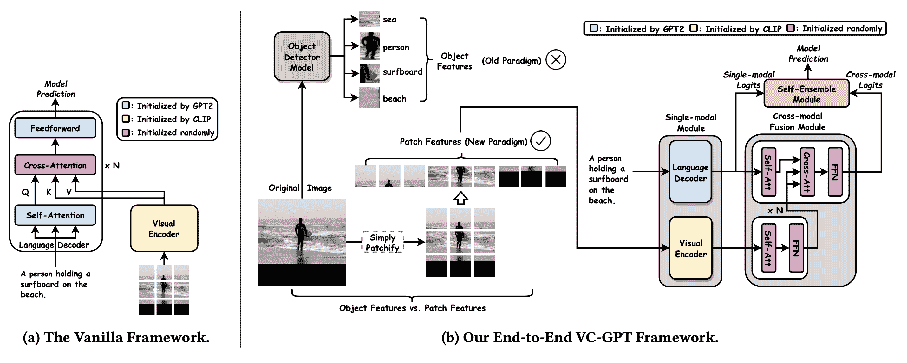

图 12\. VC-GPT 训练框架示意图。

（图片来源：[Luo et al. 2022](https://arxiv.org/abs/2201.12723)）

CLIP-ViT 将一系列图像块作为输入，并为每个块输出表示。为了避免灾难性遗忘，VC-GPT 在视觉编码器和语言解码器的输出之上引入了额外的交叉注意力层。然后，一个 *自我集成* 模块线性组合了单模型语言解码器 logits $h^G$ 和跨模型视觉-语言融合模块 logits $h^\text{fuse}$。自我集成模块（见图 13 中的 “VC-GPT w/o SE”）对性能至关重要。

$$ \text{logits} = W^G h^G + W^\text{fuse}h^\text{fuse} $$

其中 $W^G$ 是语言解码器的线性投影，由 GPT2 的词嵌入矩阵初始化，而 $W^\text{fuse}$ 是融合模块的线性投影，随机初始化。

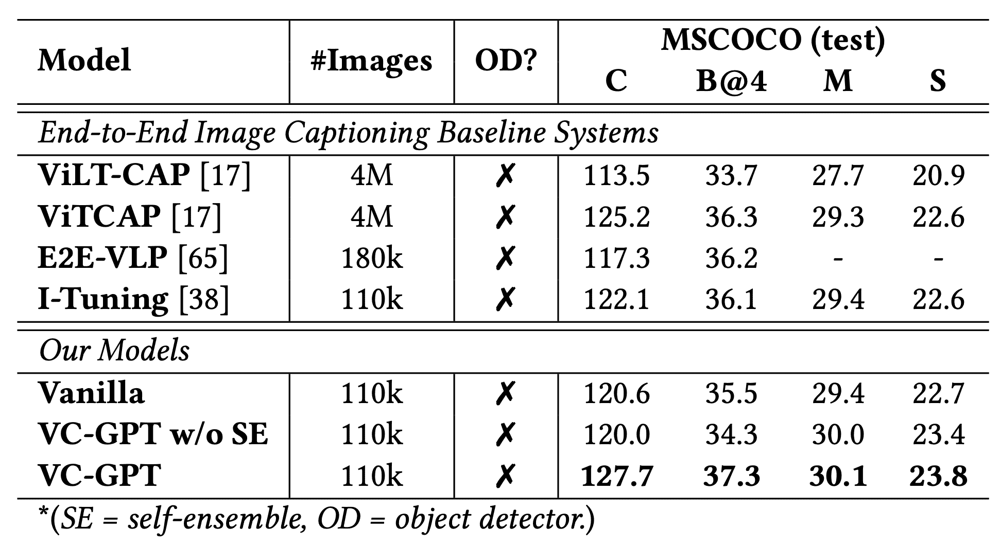

图 13\. VC-GPT 在 MS COCO 测试集上的性能，与其他端到端图像字幕基线模型进行比较。 指标缩写：C = CIDEr；B = BLEU；M = METEOR；S = SPICE。 （图片来源：[Luo et al. 2022](https://arxiv.org/abs/2201.12723))

**MERLOT** ([Zellers, et al. 2021](https://arxiv.org/abs/2106.02636)) 是通过对带有转录语音的 600 万个 YouTube 视频（[YT-Temporal-180M](https://rowanzellers.com/merlot/#data)）进行训练而得到的，以学习空间（帧级）和时间（视频级）目标，并在微调时在 VQA 和视觉推理任务上表现出色。

每个视频 $\mathcal{V}$ 被分割成多个片段 $\{ \boldsymbol{s}_t \}$，每个片段 $\boldsymbol{s}_t$ 包含从中间时间步提取的图像帧 $\mathbf{I}_t$ 和 $L=32$ 个相关的单词标记。 图像由学习的图像编码器编码，单词使用学习的嵌入进行编码。 然后两者在联合视觉-语言变压器中一起进行编码。

MERLOT 有 3 个学习目标：

1.  *掩码语言建模*（MLM）特别有用，因为在视频中，人们往往会啰嗦，导致许多重复的关键词或填充词。

1.  *对比帧-标题匹配* 使用联合视觉-语言变压器中的仅语言部分。 每个帧 $\mathbf{I}_t$ 和标题 $\boldsymbol{w}_t$ 的匹配表示被视为正例，而负例来自小批量中的所有其他帧-标题对。

1.  *时间重新排序* 学习时间推理：打乱随机 $i$ 帧，并用随机和唯一的位置嵌入替换段级位置嵌入。 学习随机位置嵌入，使模型能够在正确排序的帧的条件下对这些“‘打乱’”帧进行整理。 损失是为每个帧-帧对预测 $t_i < t_j$ 或 $t_j < t_i$。


图 14\. MERLOT 训练框架示意图：（左）对比帧-标题匹配训练；（右）联合视觉-语言变压器使用 MLM 损失进行训练，同时进行时间重新排序任务以对打乱的视频帧进行整理。 （图片来源：[Zellers, et al. 2021](https://arxiv.org/abs/2106.02636)）

消融研究表明，重要的是（1）在视频上进行训练而不是在图像上，（2）扩大训练数据集的规模和多样性，以及（3）使用多样的目标来鼓励全栈多模态推理。

**Flamingo** ([Alayrac 等人 2022](https://arxiv.org/abs/2204.14198)) 是一个接受文本交错图像/视频并输出自由文本的视觉语言模型。Flamingo 通过基于 transformer 的映射器连接了一个预训练语言模型和一个预训练视觉编码器（即 CLIP 图像编码器）。为了更有效地整合视觉信号，Flamingo 采用了基于 [Perceiver](https://arxiv.org/abs/2103.03206) 的架构，从大量的视觉输入特征中产生数百个标记，然后使用交错于语言模型层的交叉注意力层将视觉信息融入语言解码过程中。训练目标是自回归的 NLL 损失。

+   Perceiver 重采样器接收来自图像/视频输入的视觉编码器的时空特征，以生成固定大小的视觉标记。

+   冻结的语言模型配备了在预训练语言模型层之间交错初始化的交叉注意力层。因此，语言模型可以生成基于上述视觉标记的文本。

与 ClipCap 类似，训练期间两个预训练模型都是*冻结*的，因此 Flamingo 只是被训练来和谐地连接现有的强大语言和视觉模型。ClipCap 和 Flamingo 的主要区别在于前者将图像嵌入视为语言模型的简单前缀，而后者使用门控交叉注意力密集层来融合图像信息。此外，Flamingo 比 ClipCap 包含更多的训练数据。


图 15\. Flamingo 模型概述。 (图片来源：[Alayrac 等人 2022](https://arxiv.org/abs/2204.14198))

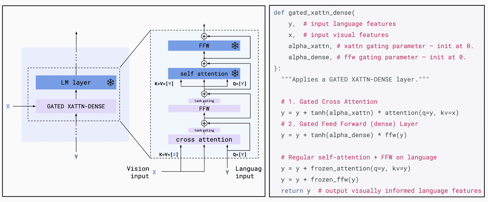

图 16\. Flamingo 中门控交叉注意力密集层的架构示意图和伪代码。 (图片来源：[Alayrac 等人 2022](https://arxiv.org/abs/2204.14198))

为了轻松处理文本与交错图像，Flamingo 中的掩码设计使得文本标记仅与*最后*一个前置图像对应的视觉标记进行交叉注意力，大大减少了某个文本标记可以看到的视觉标记数量。他们发现这比允许文本标记直接参与所有前置图像的效果更好。文本仍然可以参与所有先前的图像，因为文本编码器中存在因果自注意力依赖。这种设计可以处理上下文中任意数量的图像。

他们从互联网上爬取了 4300 万个网页，命名为 MultiModal MassiveWeb (M3W) 数据集，包含交错图像的文本。此外，Flamingo 还在配对的图像/文本和视频/文本数据集上进行训练，包括 ALIGN, LTIP 和 VTP。

互联网数据集的数据处理包括：

+   输入的网页文本通过在视觉输入位置插入`<image>`标签以及特殊标记`<BOS>`（句子开头）和`<EOC>`（块结束；始终在文档末尾，在任何图像标记之前）进行处理。

+   从每个文档中，他们随机抽取一个长度为$L = 256$的子序列，并在抽样序列中包含最多$N = 5$个图像（如果有更多，则仅使用该抽样子序列中的前$N$个，如果较少，则填充为$N$）

+   计算一个函数$\phi: [1,L] \to [0,N]$来跟踪文本和图像的交错顺序，为每个文本位置分配在该位置之前最后出现的图像/视频的索引；如果没有先前的视觉数据，则为 0。

由于 Flamingo 是在三种不同数据集的混合上进行训练的，它优化了数据集特定的 NLL 损失的加权和。调整数据集权重对最终性能非常重要。在实践中，他们实际上不是在数据集之间轮流，而是从每个数据集中抽取一个批次，并在每次更新中应用这些梯度的加权和。跨不同异构数据集的梯度累积可以被视为稳定训练的一种方法，因为它减少了每次更新之间的梯度方差。

在测试时，Flamingo 自然支持少样本学习，因为它可以处理任何交错文本和图像序列。在上下文中的更多示例有助于提高性能。

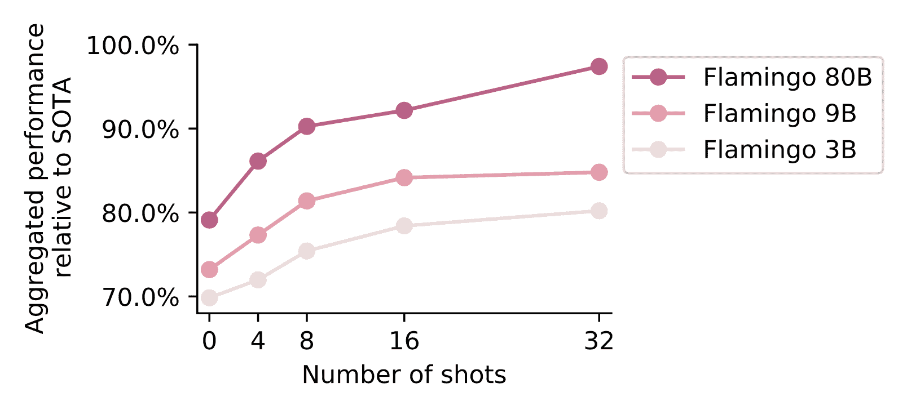

图 17。更大的模型尺寸和更多的少样本示例会带来更好的性能。 (图片来源：[Alayrac 等人，2022](https://arxiv.org/abs/2204.14198))

尽管 Flamingo 在 16 项任务中有 6 项表现优于 SoTA 微调模型，即使在没有使用任何微调而仅使用少量提示的情况下。微调 Flamingo 很昂贵，很难进行超参数调整，但确实会带来更好的结果。

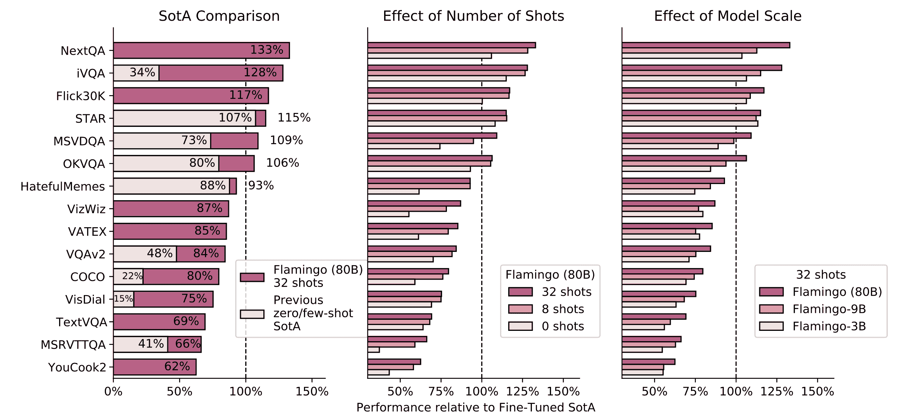

图 18。Flamingo 模型在使用不同数量的提示和不同大小时的性能，与 SoTA 微调基线进行比较。 (图片来源：[Alayrac 等人，2022](https://arxiv.org/abs/2204.14198))

**CoCa**（对比式字幕生成器；[Yu & Wang 等人，2022](https://arxiv.org/abs/2205.01917)）捕捉了对比学习和图像到字幕生成的优点。它是一个模型，同时在 CLIP 风格表示上进行对比损失训练和在图像字幕生成上进行生成损失训练，实现了在各种多模态评估任务上的 SoTA 零样本转移。

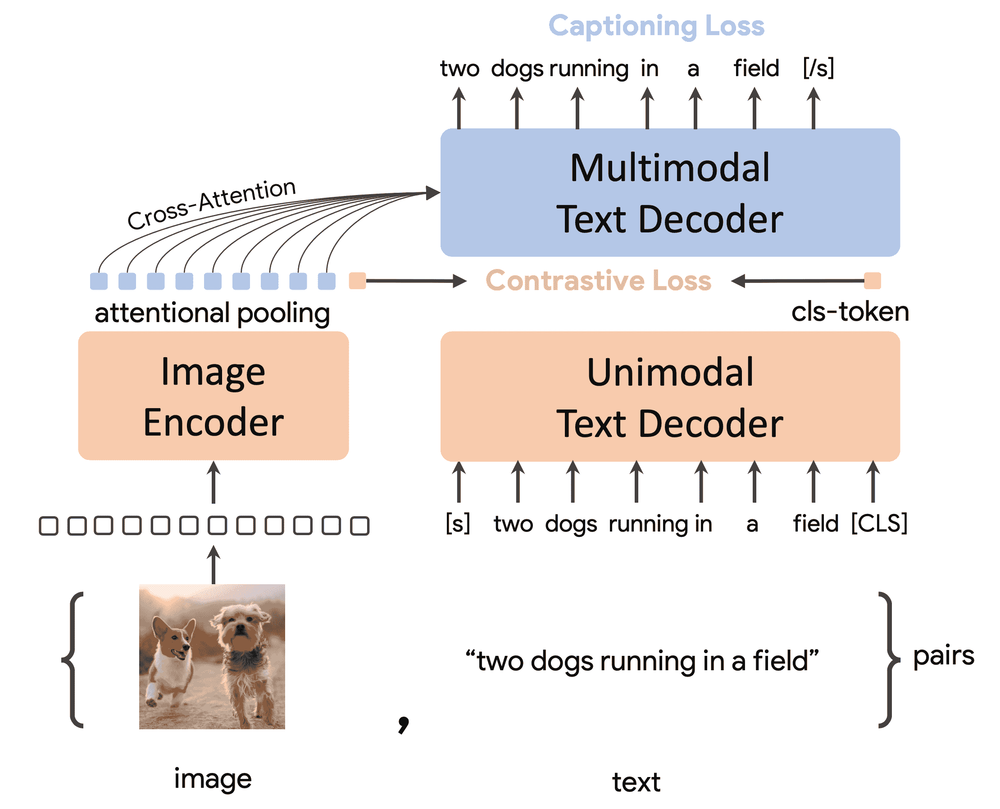

图 19。CoCa 训练框架概述。

(图片来源：[Yu & Wang 等人，2022](https://arxiv.org/abs/2205.01917))

CoCa 是从*头开始*预训练的，使用网络规模的 alt-text 数据 ALIGN 和通过将所有标签视为文本在 JTB-3B 中注释的图像。

CoCa 中有两个主要的训练组件。最终损失是以下两个损失的加权和，权重标量为$\lambda_\text{cap}=2.0, \lambda_\text{con} = 1.0$：

1.  $\mathcal{L}_\text{con}$ - *双编码器对比学习* 优化对称对比学习损失，类似于 CLIP。

1.  $\mathcal{L}_\text{cap}$ - *编码器-解码器字幕生成*使解码器基于图像编码器的潜在编码特征预测字幕，通过优化自回归损失。文本解码器分为两个组件，*单模态*和*多模态*；一个很好的平衡是将解码器一分为二：

    +   底部的单模态组件使用因果屏蔽的自注意力来编码输入文本。

    +   顶部的多模态组件对视觉编码器的输出应用因果屏蔽的自注意力和交叉注意力。

CoCa 在 VQA 上表现优于仅对比模型，并与仅字幕模型持平。发现字幕损失对零样本分类能力也有益处。

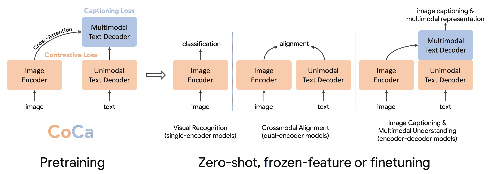

图 20。CoCa 如何在测试时用于解决各种下游任务的示意图。（图片来源：[Yu & Wang 等人，2022](https://arxiv.org/abs/2205.01917)）

他们使用任务特定的注意力池化，或者说注意力池器，作为一种自然的任务适配器，因为他们发现单个池化图像嵌入有助于视觉识别任务（例如 ImageNet 分类），而更精细的嵌入则有助于多模态理解任务（例如 VQA）。一个池化器是一个具有$n_\text{query}$可学习查询的单个多头注意力层（注意$\mathbf{X} \in \mathbb{R}^{L \times d}$，$\mathbf{W}^q \in \mathbb{R}^{d \times d_q}$，$d_k = d_q$），编码器输出作为键和值。CoCa 在预训练中使用注意力池器进行生成损失$n_\text{query} = 256$和对比损失$n_\text{query} = 1$。这使得模型能够在*冻结*编码器的情况下获得强大的性能，我们只学习一个新的池化器来聚合特征。

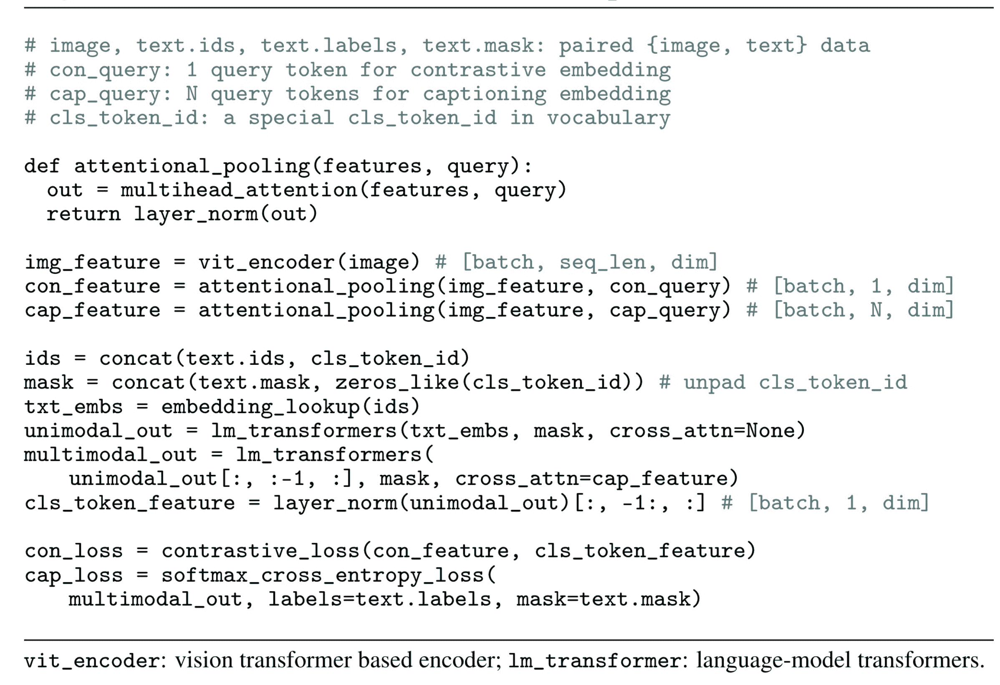

图 21。CoCa 架构和训练的伪代码。

（图片来源：[Yu & Wang 等人，2022](https://arxiv.org/abs/2205.01917)）

# 无需训练

最后，可以通过将预训练的语言和视觉模型拼接在一起来解决视觉语言任务，而无需训练任何额外的参数。

## 使用基于视觉得分的引导解码

**MAGiC**（iMAge-Guided 文本生成与 CLIP；[Su 等人，2022](https://arxiv.org/abs/2205.02655)）根据基于 CLIP 的*魔法分数*进行引导解码，以采样下一个标记，无需微调。生成的文本被鼓励与给定图像相关，同时仍然与先前生成的文本保持连贯。

下一个时间步 $t$ 的下一个标记 $x_t$ 根据以下方程选择。为了避免 LM 生成错误，模型置信度和退化惩罚（[Su et al. 2022](https://arxiv.org/abs/2202.06417)）被添加。

$$ \begin{aligned} & x_t = \arg\max_{v \in \mathcal{V}^{(k)}} \big\{ (1-\alpha) \underbrace{p(v \vert \boldsymbol{x}_{<t})}_\text{模型置信度} - \alpha \underbrace{\max_{1 \leq j \leq t-1} { \text{cosine}(h_v, h_{x_j})}}_\text{退化惩罚} + \beta \underbrace{f_\text{magic}(v \vert \mathcal{I}, \boldsymbol{x}_{<t}, \mathcal{V}^{(k)})}_\text{魔法分数} \big\} \\ \text{其中 } & f_\text{magic} ( v \vert \mathcal{I}, \mathbf{x}_{<t}, \mathcal{V}^{(k)} ) = \frac{ \exp(\text{CLIP}(\mathcal{I}, [\boldsymbol{x}_{<t}:v])) }{ \sum_{z \in \mathcal{V}^{(k)}} \exp(\text{CLIP}(\mathcal{I}, [\boldsymbol{x}_{<t}:z])) } = \frac{ \exp\big({h^\text{image}(\mathcal{I})}^\top h^\text{text}([\boldsymbol{x}_{<t}:v])\big) }{ \sum_{z \in \mathcal{V}^{(k)}} \exp\big({h^\text{image}(\mathcal{I})}^\top h^\text{text}([\boldsymbol{x}_{<t}:z])\big) } \end{aligned} $$

其中 $\mathcal{I}$ 是输入图像；$\mathcal{V}^{(k)}$ 包含语言模型 $p$ 预测的前 $k$ 个可能标记；$\boldsymbol{x}_{<t}$ 指的是时间步 $t$ 之前生成的标记；$h_v$ 是 LM 在 $\boldsymbol{x}_{<t}$ 和 $v$ 的连接上计算的标记 $v$ 的表示；$h^\text{image}(.)$ 和 $h^\text{text}(.)$ 是由 CLIP 图像和文本编码器生成的嵌入。

与监督方法相比，MAGiC 的性能相当不错，但与无监督方法仍存在较大差距。

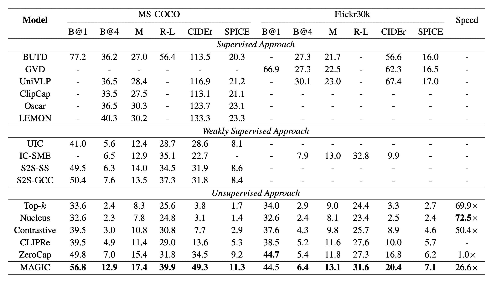

图 22\. COCO 和 Flickr30k 上的图像字幕性能。 (图片来源：[Su et al. 2022](https://arxiv.org/abs/2205.02655))

## 语言作为通信接口

对于基于知识的 VQA 任务，PICa（通过图像字幕提示 GPT-3；[Yang et al. 2021](https://arxiv.org/abs/2109.05014)）首先将图像转换为字幕或标记，然后使用少量示例提示 GPT3 提供答案。 图像字幕或标记是由一些现有模型（例如 [VinVL](https://openaccess.thecvf.com/content/CVPR2021/html/Zhang_VinVL_Revisiting_Visual_Representations_in_Vision-Language_Models_CVPR_2021_paper.html)）或 Azure 标记 API 提取的。 GPT3 被视为一个非结构化的、隐式的知识库。

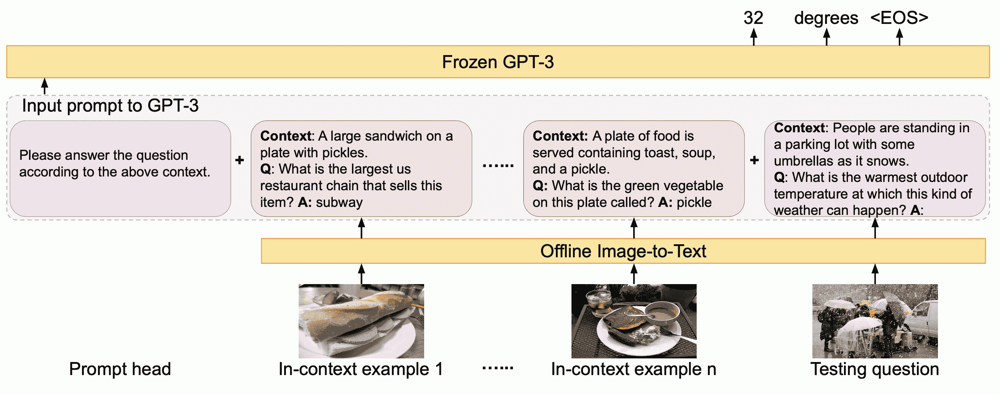

图 23\. 在推理时，PICa 如何处理 $n$-shot VQA。 (图片来源：[Yang et al. 2021](https://arxiv.org/abs/2109.05014))

PICa 探索了两种改进少量示例以获得更好结果的方法：

+   根据 CLIP 嵌入，选择与问题*相似*的上下文示例。

+   *多次查询集成* 是多次提示模型以获得多个答案，并选择具有最高对数概率的答案。

这种简单的方法只用了 16 个例子就在 OK-VQA 上提高了+8.6 分，并在 VQAv2 上表现出色。


图 24。PICa 在 OK-VQA 上的表现。“PICa-Base”具有随机的上下文示例，而“PICa-Full”结合了类似的上下文示例选择和多查询集成。（图片来源：[Yang 等人，2021](https://arxiv.org/abs/2109.05014)）

**苏格拉底模型**（SM）（[曾等人，2022](https://arxiv.org/abs/2204.00598)）是一个框架，用于通过语言（提示）将多个预训练模型组合成一个模型，无需进一步训练。在这里，语言被视为不同模型可以交换信息的中间表示。关键思想是使用*多模型多模态提示*，其中非语言模型的输出被插入到语言提示中，然后用于 LM 进行推理。

让我们看一个具体的例子。给定一个自我中心视频（图像+音频），SM 可以使用文本到文本 LM、图像到文本 VLM 和语音到文本 ALM 生成人物活动的摘要。它们的链接如下：

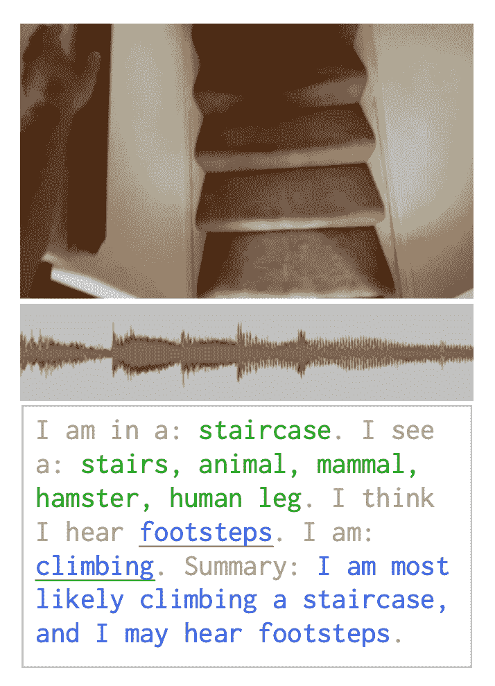

（图片来源：[曾等人，2022](https://arxiv.org/abs/2204.00598)）

1.  VLM 检测视觉实体；

1.  LM 建议可能听到的声音；

1.  ALM 选择最可能的声音；

1.  LM 建议可能的活动；

1.  VLM 对最可能的活动进行排名；

1.  LM 生成苏格拉底互动的摘要。

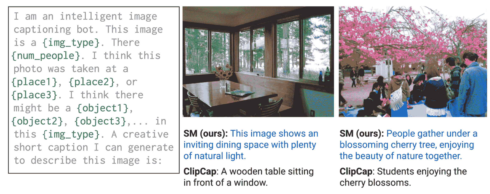

图 25。苏格拉底模型解决图像字幕的示意图。（图片来源：[曾等人，2022](https://arxiv.org/abs/2204.00598)）

SM 可以通过首先使用 VLM 零样本预测不同的地点类别、物体类别、图像类型和人数来生成图像字幕；然后将 VLM 填充的语言提示馈送到因果 LM 中生成字幕候选。苏格拉底方法在图像字幕方面仍然与 ClipCap 存在性能差距，但考虑到它不涉及任何训练，表现相当不错。

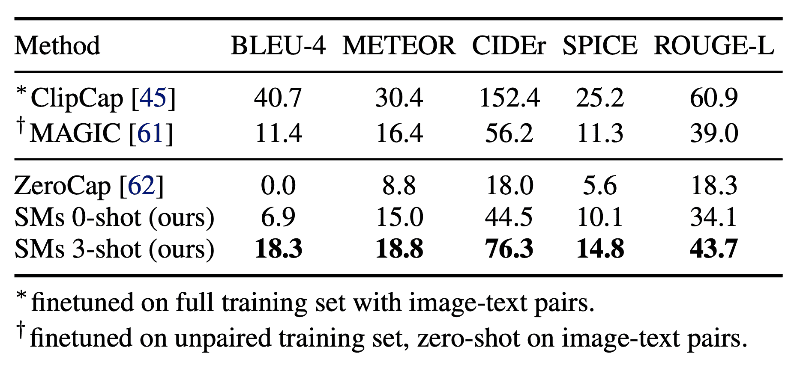

图 26。不同模型在随机 100 个 COCO 文本示例上的图像字幕性能比较。（图片来源：[曾等人，2022](https://arxiv.org/abs/2204.00598)）

SM 框架非常灵活，可以用于除图像字幕之外的更复杂的任务。例如，自我中心感知（用户输入+VLM+LM+ALM）任务是将自我中心视频作为输入，（1）总结内容；（2）回答自由形式的推理问题；（3）进行预测。

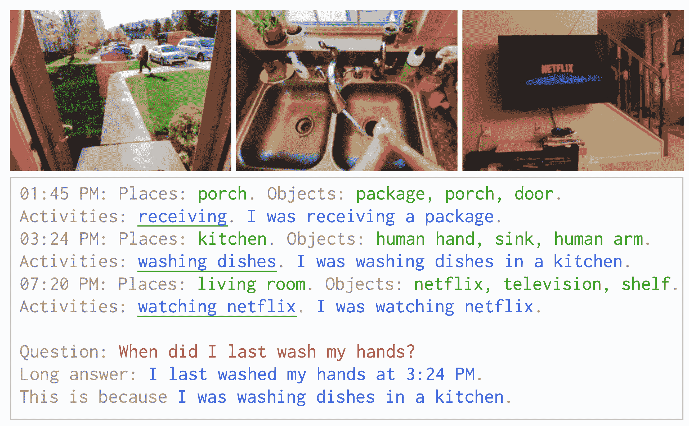

图 27。基于自我中心视频生成字幕和问答的苏格拉底模型方法。（图片来源：[曾等人，2022](https://arxiv.org/abs/2204.00598)）

# 数据集

## 图像字幕数据集

+   *MS COCO*（[Chen 等人，2015](https://arxiv.org/abs/1504.00325)）：包含了 32.8 万张图片，每张图片配有 5 个独立的标题。

+   *NoCaps*（[Agrawal 等人，2019](https://arxiv.org/abs/1812.08658)）旨在衡量对未见类别和概念的泛化能力，其中领域内包含仅展示 COCO 类别的图片，近领域包含 COCO 和新颖类别，领域外包含仅新颖类别。

+   *Conceptual Captions*（[Sharma 等人，2018](https://aclanthology.org/P18-1238/)）包含了 300 万对图片和标题，从网络中挖掘并进行后处理。为了专注于概念，该数据集中的特定实体被替换为一般概念（例如，政治家的名字被替换为“政治家”）。

+   *Crisscrossed Captions（CxC）*（[Parekh 等人，2021](https://arxiv.org/abs/2004.15020)）包含了 247,315 个人工标注的注释，包括图片对、标题对和图片-标题对之间的正面和负面关联。

+   *Concadia*（[Kreiss 等人，2021](https://arxiv.org/abs/2104.08376)）是一个基于维基百科的数据集，包含了 96,918 张图片及其对应的英语描述、标题和周围环境。

## 图像-文本配对数据集

(*) 非公开数据集。

+   *ALIGN*（[Jia 等人，2021](https://arxiv.org/abs/2102.05918)）包含了 18 亿张带有替代文本的图片。该数据集规模庞大，但噪音较大，仅进行了最小程度的基于频率的过滤。

+   (*) *LTIP*（长文本和图像对；[Alayrac 等人，2022](https://arxiv.org/abs/2204.14198)）：3.12 亿张图片，配有描述性标题。

+   (*) *VTP*（视频和文本对；[Alayrac 等人，2022](https://arxiv.org/abs/2204.14198)）：2700 万个短视频（平均约 22 秒），配有描述性标题。

+   (*) *JFT-300M* / *JFT-3B*是 Google 内部数据集，包含了 300M / 3B 张图片，通过半自动化流程进行了大约 30k 标签的类层次标注。因此，数据和相关标签存在噪音。

# 评估任务

## 视觉问答

给定一张图片和一个问题，任务是正确回答这个问题。

+   *VQAv2*（[Goyal 等人，2017](https://arxiv.org/abs/1612.00837)）包含了来自 COCO 的约 200K 张图片的 100 多万个问题。

+   *OK-VQA*（[Marino 等人，2019](https://arxiv.org/abs/1906.00067)）包含了 14K 个需要外部知识（例如来自维基百科）的开放式问题。

    +   *A-OKVQA*：OK-VQA 的增强版本，与 OK-VAQ 没有重叠的问题。

+   *TextVQA*（[Singh 等人，2019](https://arxiv.org/abs/1904.08920)）包含了 28,408 张图片上的 45,336 个需要推理文本才能回答的问题。

+   *VizWiz*（[Gurari 等人，2018](https://arxiv.org/abs/1802.08218)）包含了来自盲人的超过 31,000 个视觉问题，每个问题都是一个使用手机拍摄的图片，并录制了一个关于图片的口头问题，以及每个视觉问题的 10 个众包答案。

## 视觉语言推理

+   *VCR*（视觉常识推理；[Zellers et al. 2018](https://arxiv.org/abs/1811.10830)）包含了从 110k 个电影场景衍生出的 290k 个多项选择问答问题，重点关注视觉常识。

+   *NLVR2*（自然语言视觉推理；[Suhr et al. 2019](https://arxiv.org/abs/1811.00491)）包含了 100k+个句子与网络图像配对的示例，任务是确定自然语言标题是否对一对图像正确，重点关注语义多样性。

+   *Flickr30K*（[Jia et al. 2015](https://arxiv.org/abs/1509.04942)）包含了从 Flickr 收集的 30k 张图片和 250k 个注释，任务是根据句子的跨度选择边界区域。

+   *SNLI-VE*（视觉蕴涵；[Xie et al. 2019](https://arxiv.org/abs/1901.06706)）建立在 SNLI 和 Flickr30K 之上，任务是推理图像前提和文本假设之间的关系。

## 视频问答和理解

+   *MSR-VTT*（MSR 视频到文本；[Xu et al. 2016](https://www.microsoft.com/en-us/research/wp-content/uploads/2016/06/cvpr16.msr-vtt.tmei_-1.pdf)）包含了 10k 个网络视频剪辑，总时长 41.2 小时，共有 200k 个剪辑-句子对；任务是将视频翻译成文本。

+   *ActivityNet-QA*（[Yu et al. 2019](https://arxiv.org/abs/1906.02467)）包含了从流行的[ActivityNet](http://activity-net.org/index.html)数据集中衍生出的 5,800 个视频上的 58,000 个人工注释问答对。

+   *TGIF*（Tumblr GIF；[Li et al. .2016](https://arxiv.org/abs/1604.02748)）包含了 100k 个动画 GIF 和 120k 个描述动画 GIF 视觉内容的句子，随机选择自 Tumblr 2015 年 5 月至 6 月发布的帖子。

    +   *TGIF-QA* 包含了来自 TGIF 数据集的 165K 个动画 GIF 的问答对。

+   *LSMDC*（大规模电影描述挑战赛；[Rohrbach et al. 2015](https://arxiv.org/abs/1501.02530)）包含了从 202 部电影中提取的 118,081 个短视频剪辑。每个视频都有一个标题，可以是从电影剧本中提取的，也可以是为视觉障碍者转录的 DVS（描述性视频服务）中提取的。

+   *TVQA*（[Lei et al. 2018](https://arxiv.org/abs/1809.01696)）/ *TVQA+*（[Lei et al. 2019](https://arxiv.org/abs/1904.11574)）是一个基于 6 个热门电视节目（Friends, The Big Bang Theory, How I Met Your Mother, House M.D., Grey’s Anatomy, Castle）的大规模视频问答数据集。它包含了来自 21.8k 个视频剪辑的 152.5k 个问答对，视频总时长超过 460 小时。

+   *DramaQA*（[Choi et al. 2020](https://arxiv.org/abs/2005.03356)）是一个基于韩国热门电视节目“另一个吴海”的大规模视频问答数据集。该数据集包含了四个难度级别和多级角色中心故事描述的问答。

+   *VLEP*（Video-and-Language Event Prediction；[Lei et al. 2020](https://arxiv.org/abs/2010.07999)）包含了来自 10,234 个不同的电视节目和 YouTube 生活视频剪辑的 28,726 个未来事件预测示例（以及它们的理由）。

# 引用

被引用为：

> 翁，莉莲。 (2022 年 6 月)。广义视觉语言模型。Lil’Log。https://lilianweng.github.io/posts/2022-06-09-vlm/。

或

```py
@article{weng2022vlm,
  title   = "Generalized Visual Language Models",
  author  = "Weng, Lilian",
  journal = "Lil'Log",
  year    = "2022",
  month   = "Jun",
  url     = "https://lilianweng.github.io/posts/2022-06-09-vlm/"
} 
```

# 参考文献

[1] 李等人[“VisualBERT：视觉和语言的简单且高效基线。”](https://arxiv.org/abs/1908.03557) arXiv 预印本:1908.03557 (2019)。

[2] 王等人[“SimVLM: 简单的视觉语言模型预训练与弱监督。”](https://arxiv.org/abs/2108.10904) ICLR 2022。

[3] 阿加加尼扬等人[“CM3：互联网的因果蒙版多模态模型。”](https://arxiv.org/abs/2201.07520) arXiv 预印本 arXiv:2201.07520 (2022)。

[4] Tsimpoukelli 等人[“冻结语言模型的多模态少样本学习。”](https://arxiv.org/abs/2106.13884) NeuriPS 2021。

[5] Mokady，赫兹和赫兹。[“ClipCap: 用于图像字幕的 CLIP 前缀。”](https://arxiv.org/abs/2111.09734) 2021。

[6] 陈等人[“VisualGPT：用于图像字幕的预训练语言模型的数据高效适应。”](https://arxiv.org/abs/2102.10407) arXiv 预印本 arXiv:2111.09734 (2021)。

[7] 罗等人[“端到端图像字幕的一个令人沮丧地简单方法。”](https://arxiv.org/abs/2201.12723) arXiv 预印本 arXiv:2201.12723 (2022)。

[8] Zellers 等人[“MERLOT: 多模态神经脚本知识模型。”](https://arxiv.org/abs/2106.02636) NeuriPS 2021。

[9] Alayrac 等人[“Flamingo: 一种用于少样本学习的视觉语言模型。”](https://arxiv.org/abs/2204.14198) arXiv 预印本 arXiv:2204.14198 (2022)。

[10] 于和王等人[“CoCa：对比字幕生成器是图像文本基础模型。”](https://arxiv.org/abs/2205.01917) arXiv 预印本 arXiv:2205.01917 (2022)。

[11] 杨等人[“GPT-3 在少样本基于知识的 VQA 中的实证研究。”](https://arxiv.org/abs/2109.05014) arXiv 预印本 arXiv:2109.05014 (2021)。

[12] 苏等人[“语言模型可以看到：在文本生成中插入视觉控制。”](https://arxiv.org/abs/2205.02655) arXiv 预印本 arXiv:2205.02655 (2022)。

[13] 曾等人[“苏格拉底模型：用语言组合零样本多模态推理。”](https://arxiv.org/abs/2204.00598) arXiv 预印本 arXiv:2204.00598 (2022)。
