# 对比表示学习

> 原文：[`lilianweng.github.io/posts/2021-05-31-contrastive/`](https://lilianweng.github.io/posts/2021-05-31-contrastive/)

对比表示学习的目标是学习这样一个嵌入空间，其中相似的样本对彼此保持接近，而不相似的样本则相距甚远。对比学习可以应用于监督和无监督设置。在处理无监督数据时，对比学习是自监督学习中最强大的方法之一。

# 对比训练目标

在对比学习的早期损失函数版本中，只涉及一个正样本和一个负样本。最近训练目标的趋势是在一个批次中包含多个正样本和负样本对。

## 对比损失

**对比损失**（[Chopra et al. 2005](http://yann.lecun.com/exdb/publis/pdf/chopra-05.pdf)）是最早用于深度度量学习的对比方式的训练目标之一。

给定一组输入样本$\{ \mathbf{x}_i \}$，每个样本都有对应的标签$y_i \in \{1, \dots, L\}$，其中$L$表示类别数。我们希望学习一个函数$f_\theta(.): \mathcal{X}\to\mathbb{R}^d$，将$x_i$编码为一个嵌入向量，使得同一类别的示例具有相似的嵌入，而不同类别的示例具有非常不同的嵌入。因此，对比损失接受一对输入$(x_i, x_j)$，当它们来自同一类别时最小化嵌入距离，否则最大化距离。

$$ \mathcal{L}_\text{cont}(\mathbf{x}_i, \mathbf{x}_j, \theta) = \mathbb{1}[y_i=y_j] \| f_\theta(\mathbf{x}_i) - f_\theta(\mathbf{x}_j) \|²_2 + \mathbb{1}[y_i\neq y_j]\max(0, \epsilon - \|f_\theta(\mathbf{x}_i) - f_\theta(\mathbf{x}_j)\|_2)² $$

其中$\epsilon$是一个超参数，定义了不同类别样本之间的最小距离。

## 三元组损失

**三元组损失**最初是在 FaceNet（[Schroff et al. 2015](https://arxiv.org/abs/1503.03832)）论文中提出的，用于学习同一人在不同姿势和角度下的人脸识别。


图 1. 给定一个锚点一个正样本和一个负样本的三元组损失示意图。（图片来源：[Schroff et al. 2015](https://arxiv.org/abs/1503.03832)）

给定一个锚点输入$\mathbf{x}$，我们选择一个正样本$\mathbf{x}^+$和一个负样本$\mathbf{x}^-$，意味着$\mathbf{x}^+$和$\mathbf{x}$属于同一类别，而$\mathbf{x}^-$则来自另一个不同的类别。三元组损失学习通过以下方程式同时最小化锚点$\mathbf{x}$和正样本$\mathbf{x}^+$之间的距离，并最大化锚点$\mathbf{x}$和负样本$\mathbf{x}^-$之间的距离：

$$ \mathcal{L}_\text{triplet}(\mathbf{x}, \mathbf{x}^+, \mathbf{x}^-) = \sum_{\mathbf{x} \in \mathcal{X}} \max\big( 0, \|f(\mathbf{x}) - f(\mathbf{x}^+)\|²_2 - \|f(\mathbf{x}) - f(\mathbf{x}^-)\|²_2 + \epsilon \big) $$

其中边界参数 $\epsilon$ 被配置为相似 vs 不相似对之间距离的最小偏移量。

选择具有挑战性的 $\mathbf{x}^-$ 对于真正改进模型至关重要。

## 提升的结构化损失

**提升的结构化损失** ([Song et al. 2015](https://arxiv.org/abs/1511.06452)) 利用一个训练批次内的所有成对边以提高计算效率。

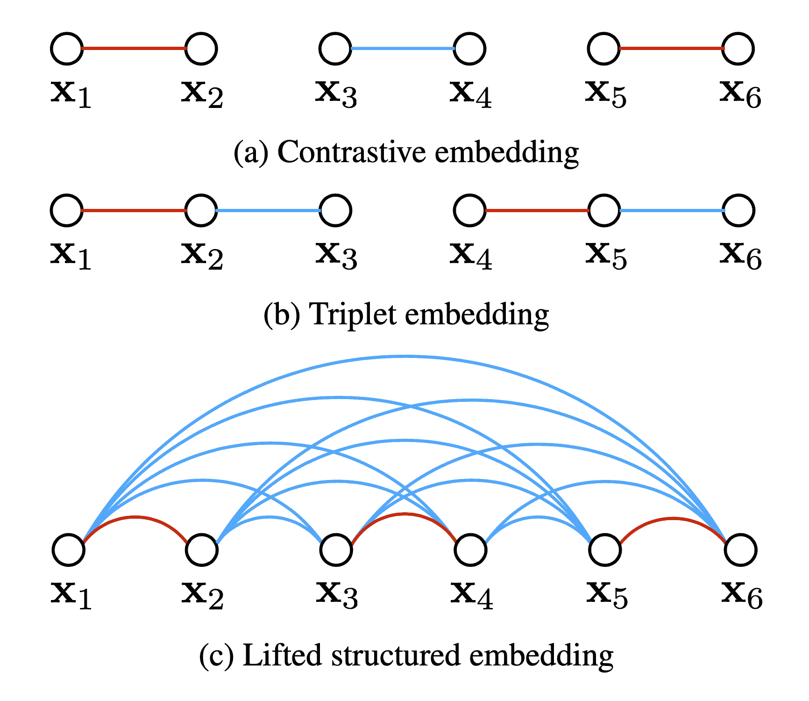

图 2\. 比较对比损失、三元组损失和提升的结构化损失。红色和蓝色边分别连接相似和不相似的样本对。（图片来源：[Song et al. 2015](https://arxiv.org/abs/1511.06452)）

令 $D_{ij} = | f(\mathbf{x}_i) - f(\mathbf{x}_j) |_2$，定义一个结构化损失函数为

$$ \begin{aligned} \mathcal{L}_\text{struct} &= \frac{1}{2\vert \mathcal{P} \vert} \sum_{(i,j) \in \mathcal{P}} \max(0, \mathcal{L}_\text{struct}^{(ij)})² \\ \text{where } \mathcal{L}_\text{struct}^{(ij)} &= D_{ij} + \color{red}{\max \big( \max_{(i,k)\in \mathcal{N}} \epsilon - D_{ik}, \max_{(j,l)\in \mathcal{N}} \epsilon - D_{jl} \big)} \end{aligned} $$

其中 $\mathcal{P}$ 包含正样本对的集合，$\mathcal{N}$ 是负样本对的集合。注意，密集的成对平方距离矩阵可以很容易地在每个训练批次中计算。

$\mathcal{L}_\text{struct}^{(ij)}$ 中的红色部分用于挖掘困难的负样本。然而，在实践中，它并不平滑，可能导致收敛到一个糟糕的局部最优解。因此，它被放宽为：

$$ \mathcal{L}_\text{struct}^{(ij)} = D_{ij} + \log \Big( \sum_{(i,k)\in\mathcal{N}} \exp(\epsilon - D_{ik}) + \sum_{(j,l)\in\mathcal{N}} \exp(\epsilon - D_{jl}) \Big) $$

在论文中，他们还提出通过积极地将一些难以处理的负样本纳入每个批次来增强负样本的质量，给定一些随机的正样本对。

## N-对损失

**多类 N-对损失** ([Sohn 2016](https://papers.nips.cc/paper/2016/hash/6b180037abbebea991d8b1232f8a8ca9-Abstract.html)) 将三元组损失推广到包括与多个负样本的比较。

给定一个 $(N + 1)$-元组的训练样本，$\{ \mathbf{x}, \mathbf{x}^+, \mathbf{x}^-_1, \dots, \mathbf{x}^-_{N-1} \}$，包括一个正样本和 $N-1$ 个负样本，N-对损失定义为：

$$ \begin{aligned} \mathcal{L}_\text{N-pair}(\mathbf{x}, \mathbf{x}^+, \{\mathbf{x}^-_i\}^{N-1}_{i=1}) &= \log\big(1 + \sum_{i=1}^{N-1} \exp(f(\mathbf{x})^\top f(\mathbf{x}^-_i) - f(\mathbf{x})^\top f(\mathbf{x}^+))\big) \\ &= -\log\frac{\exp(f(\mathbf{x})^\top f(\mathbf{x}^+))}{\exp(f(\mathbf{x})^\top f(\mathbf{x}^+)) + \sum_{i=1}^{N-1} \exp(f(\mathbf{x})^\top f(\mathbf{x}^-_i))} \end{aligned} $$

如果每个类别只采样一个负样本，那么它等效于多类分类的 softmax 损失。

## NCE

**噪声对比估计**，简称**NCE**，是一种用于估计统计模型参数的方法，由[Gutmann & Hyvarinen](http://proceedings.mlr.press/v9/gutmann10a.html)于 2010 年提出。其思想是运行逻辑回归来区分目标数据和噪声。了解更多关于 NCE 如何用于学习词嵌入的信息，请点击[这里](https://lilianweng.github.io/posts/2017-10-15-word-embedding/#noise-contrastive-estimation-nce)。

令$\mathbf{x}$为目标样本$\sim P(\mathbf{x} \vert C=1; \theta) = p_\theta(\mathbf{x})$，$\tilde{\mathbf{x}}$为噪声样本$\sim P(\tilde{\mathbf{x}} \vert C=0) = q(\tilde{\mathbf{x}})$。注意，逻辑回归模型了 logit（即 log-odds），在这种情况下，我们希望对来自目标数据分布的样本$u$的 logit 进行建模，而不是噪声分布：

$$ \ell_\theta(\mathbf{u}) = \log \frac{p_\theta(\mathbf{u})}{q(\mathbf{u})} = \log p_\theta(\mathbf{u}) - \log q(\mathbf{u}) $$

将 logits 转换为概率后，我们可以应用交叉熵损失：

$$ \begin{aligned} \mathcal{L}_\text{NCE} &= - \frac{1}{N} \sum_{i=1}^N \big[ \log \sigma (\ell_\theta(\mathbf{x}_i)) + \log (1 - \sigma (\ell_\theta(\tilde{\mathbf{x}}_i))) \big] \\ \text{ where }\sigma(\ell) &= \frac{1}{1 + \exp(-\ell)} = \frac{p_\theta}{p_\theta + q} \end{aligned} $$

这里列出了仅适用于一个正样本和一个噪声样本的 NCE 损失的原始形式。在许多后续作品中，包含多个负样本的对比损失也被广泛称为 NCE。

## InfoNCE

**InfoNCE 损失**在 CPC（[对比预测编码](https://lilianweng.github.io/posts/2019-11-10-self-supervised/#contrastive-predictive-coding); [van den Oord, et al. 2018](https://arxiv.org/abs/1807.03748)）中使用了受 NCE 启发的分类交叉熵损失，以识别一组无关噪声样本中的正样本。

给定上下文向量$\mathbf{c}$，正样本应该从条件分布$p(\mathbf{x} \vert \mathbf{c})$中抽取，而$N-1$个负样本则从与上下文$\mathbf{c}$独立的提议分布$p(\mathbf{x})$中抽取。为简洁起见，让我们将所有样本标记为$X=\{ \mathbf{x}_i \}^N_{i=1}$，其中只有一个$\mathbf{x}_\texttt{pos}$是正样本。我们正确检测到正样本的概率是：

$$ p(C=\texttt{pos} \vert X, \mathbf{c}) = \frac{p(x_\texttt{pos} \vert \mathbf{c}) \prod_{i=1,\dots,N; i \neq \texttt{pos}} p(\mathbf{x}_i)}{\sum_{j=1}^N \big[ p(\mathbf{x}_j \vert \mathbf{c}) \prod_{i=1,\dots,N; i \neq j} p(\mathbf{x}_i) \big]} = \frac{ \frac{p(\mathbf{x}_\texttt{pos}\vert c)}{p(\mathbf{x}_\texttt{pos})} }{ \sum_{j=1}^N \frac{p(\mathbf{x}_j\vert \mathbf{c})}{p(\mathbf{x}_j)} } = \frac{f(\mathbf{x}_\texttt{pos}, \mathbf{c})}{ \sum_{j=1}^N f(\mathbf{x}_j, \mathbf{c}) } $$

其中评分函数为$f(\mathbf{x}, \mathbf{c}) \propto \frac{p(\mathbf{x}\vert\mathbf{c})}{p(\mathbf{x})}$。

InfoNCE 损失优化了正确分类正样本的负对数概率：

$$ \mathcal{L}_\text{InfoNCE} = - \mathbb{E} \Big[\log \frac{f(\mathbf{x}, \mathbf{c})}{\sum_{\mathbf{x}' \in X} f(\mathbf{x}', \mathbf{c})} \Big] $$

$f(x, c)$估计密度比$\frac{p(x\vert c)}{p(x)}$与最大化输入$x$和上下文向量$c$之间的互信息有关，我们有：

$$ I(\mathbf{x}; \mathbf{c}) = \sum_{\mathbf{x}, \mathbf{c}} p(\mathbf{x}, \mathbf{c}) \log\frac{p(\mathbf{x}, \mathbf{c})}{p(\mathbf{x})p(\mathbf{c})} = \sum_{\mathbf{x}, \mathbf{c}} p(\mathbf{x}, \mathbf{c})\log\color{blue}{\frac{p(\mathbf{x}|\mathbf{c})}{p(\mathbf{x})}} $$

其中蓝色中的对数项由$f$估计。

对于序列预测任务，CPC 模型通过建模保持$\mathbf{x}_{t+k}$和$\mathbf{c}_t$之间的互信息的密度函数，而不是直接建模未来观测$p_k(\mathbf{x}_{t+k} \vert \mathbf{c}_t)$（这可能相当昂贵）：

$$ f_k(\mathbf{x}_{t+k}, \mathbf{c}_t) = \exp(\mathbf{z}_{t+k}^\top \mathbf{W}_k \mathbf{c}_t) \propto \frac{p(\mathbf{x}_{t+k}\vert\mathbf{c}_t)}{p(\mathbf{x}_{t+k})} $$

其中$\mathbf{z}_{t+k}$是编码输入，$\mathbf{W}_k$是可训练的权重矩阵。

## 软最近邻损失

**软最近邻损失**（[Salakhutdinov & Hinton 2007](http://proceedings.mlr.press/v2/salakhutdinov07a.html)，[Frosst et al. 2019](https://arxiv.org/abs/1902.01889)）将其扩展为包括多个正样本。

给定一批样本，$\{\mathbf{x}_i, y_i)\}^B_{i=1}$，其中$y_i$是$\mathbf{x}_i$的类标签，以及用于衡量两个输入之间相似性的函数$f(.,.)$，在温度$\tau$下定义软最近邻损失：

$$ \mathcal{L}_\text{snn} = -\frac{1}{B}\sum_{i=1}^B \log \frac{\sum_{i\neq j, y_i = y_j, j=1,\dots,B} \exp(- f(\mathbf{x}_i, \mathbf{x}_j) / \tau)}{\sum_{i\neq k, k=1,\dots,B} \exp(- f(\mathbf{x}_i, \mathbf{x}_k) /\tau)} $$

温度$\tau$用于调整特征在表示空间中的集中程度。例如，在低温下，损失由小距离主导，而广泛分离的表示不能贡献太多并变得无关紧要。

## 常见设置

我们可以放宽软最近邻损失中“类”和“标签”的定义，通过例如应用数据增强来创建原始样本的噪声版本，从无监督数据中创建正负样本对。

最近的研究遵循以下对比学习目标的定义，以整合多个正负样本。根据 ([Wang & Isola 2020](https://arxiv.org/abs/2005.10242)) 中的设置，让 $p_\texttt{data}(.)$ 是 $\mathbb{R}^n$ 上的数据分布，$p_\texttt{pos}(., .)$ 是 $\mathbb{R}^{n \times n}$ 上正样本对的分布。这两个分布应满足：

+   对称性：$\forall \mathbf{x}, \mathbf{x}^+, p_\texttt{pos}(\mathbf{x}, \mathbf{x}^+) = p_\texttt{pos}(\mathbf{x}^+, \mathbf{x})$

+   匹配边际：$\forall \mathbf{x}, \int p_\texttt{pos}(\mathbf{x}, \mathbf{x}^+) d\mathbf{x}^+ = p_\texttt{data}(\mathbf{x})$

为了学习一个编码器 $f(\mathbf{x})$ 来学习一个 *L2-归一化特征向量*，对比学习的目标是：

$$ \begin{aligned} \mathcal{L}_\text{contrastive} &= \mathbb{E}_{(\mathbf{x},\mathbf{x}^+)\sim p_\texttt{pos}, \{\mathbf{x}^-_i\}^M_{i=1} \overset{\text{i.i.d}}{\sim} p_\texttt{data} } \Big[ -\log\frac{\exp(f(\mathbf{x})^\top f(\mathbf{x}^+) / \tau)}{ \exp(f(\mathbf{x})^\top f(\mathbf{x}^+) / \tau) + \sum_{i=1}^M \exp(f(\mathbf{x})^\top f(\mathbf{x}_i^-) / \tau)} \Big] & \\ &\approx \mathbb{E}_{(\mathbf{x},\mathbf{x}^+)\sim p_\texttt{pos}, \{\mathbf{x}^-_i\}^M_{i=1} \overset{\text{i.i.d}}{\sim} p_\texttt{data} }\Big[ - f(\mathbf{x})^\top f(\mathbf{x}^+) / \tau + \log\big(\sum_{i=1}^M \exp(f(\mathbf{x})^\top f(\mathbf{x}_i^-) / \tau)\big) \Big] & \scriptstyle{\text{; 假设无限负样本}} \\ &= -\frac{1}{\tau}\mathbb{E}_{(\mathbf{x},\mathbf{x}^+)\sim p_\texttt{pos}}f(\mathbf{x})^\top f(\mathbf{x}^+) + \mathbb{E}_{ \mathbf{x} \sim p_\texttt{data}} \Big[ \log \mathbb{E}_{\mathbf{x}^- \sim p_\texttt{data}} \big[ \sum_{i=1}^M \exp(f(\mathbf{x})^\top f(\mathbf{x}_i^-) / \tau)\big] \Big] & \end{aligned} $$

# 关键要素

## 大量数据增强

给定一个训练样本，需要使用数据增强技术创建其噪声版本，以将其作为正样本输入损失中。正确的数据增强设置对于学习良好且可泛化的嵌入特征至关重要。它将非必要的变化引入示例中，而不修改语义含义，从而鼓励模型学习表示的基本部分。例如，SimCLR 中的实验表明，随机裁剪和随机颜色失真的组合对于学习图像的视觉表示具有良好的性能至关重要。

## 大批量大小

在训练过程中使用大批量大小是许多对比学习方法成功的另一个关键因素（例如 SimCLR，CLIP），特别是当它依赖于批内负样本时。只有批量大小足够大，损失函数才能覆盖足够多样的负样本集合，对模型学习区分不同示例的有意义表示具有挑战性。

## 艰难负样本挖掘

艰难负样本应该与锚定样本具有不同的标签，但嵌入特征与锚定嵌入非常接近。在监督数据集中访问地面真实标签时，很容易识别任务特定的艰难负样本。例如，在学习句子嵌入时，我们可以将在 NLI 数据集中标记为“矛盾”的句子对视为艰难负对（例如 SimCSE，或使用 BM25 返回的最匹配关键字的前几个错误候选作为艰难负样本（[DPR](https://lilianweng.github.io/posts/2020-10-29-odqa/#DPR); [Karpukhin et al., 2020](https://arxiv.org/abs/2004.04906))）。

然而，当我们希望保持无监督时，进行艰难负样本挖掘变得棘手。增加训练批量大小或内存库大小隐含地引入更多艰难负样本，但这会导致大内存使用量的沉重负担。

[Chuang 等人（2020）](https://arxiv.org/abs/2007.00224)研究了对比学习中的采样偏差，并提出了无偏损失。在无监督设置中，由于我们不知道地面真实标签，我们可能会意外地采样到假负样本。采样偏差可能导致性能显著下降。

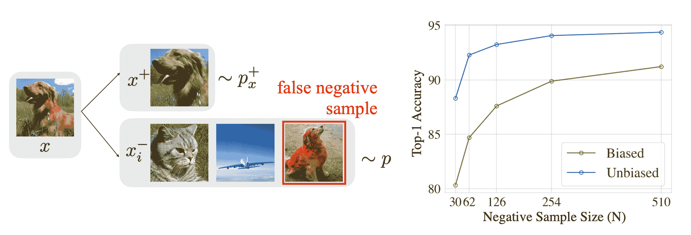

图 3. 对比学习中指的假负样本的采样偏差可能导致性能大幅下降。（图片来源：[Chuang 等人，2020](https://arxiv.org/abs/2007.00224))

让我们假设锚定类$c$的概率是均匀的$\rho(c)=\eta^+$，观察到不同类的概率为$\eta^- = 1-\eta^+$。

+   观察到$\mathbf{x}$的正例的概率为$p^+_x(\mathbf{x}’)=p(\mathbf{x}’\vert \mathbf{h}_{x’}=\mathbf{h}_x)$；

+   获取$\mathbf{x}$的负样本的概率为$p^-_x(\mathbf{x}’)=p(\mathbf{x}’\vert \mathbf{h}_{x’}\neq\mathbf{h}_x)$。

当我们对$\mathbf{x}^-$进行采样时，我们无法访问真实的$p^-_x(\mathbf{x}^-)$，因此$\mathbf{x}^-$可能以概率$\eta^+$从（不希望的）锚定类$c$中采样。实际采样数据分布变为：

$$ p(\mathbf{x}') = \eta^+ p^+_x(\mathbf{x}') + \eta^- p_x^-(\mathbf{x}') $$

因此，我们可以使用 $p^-_x(\mathbf{x}’) = (p(\mathbf{x}’) - \eta^+ p^+_x(\mathbf{x}’))/\eta^-$ 来采样 $\mathbf{x}^-$ 来去偏差损失。通过从 $p$ 中采样 $N$ 个样本 $\{\mathbf{u}_i\}^N_{i=1}$ 和从 $p^+_x$ 中采样 $M$ 个样本 $\{ \mathbf{v}_i \}_{i=1}^M$，我们可以估计对比学习损失中分母中第二项 $\mathbb{E}_{\mathbf{x}^-\sim p^-_x}[\exp(f(\mathbf{x})^\top f(\mathbf{x}^-))]$ 的期望：

$$ g(\mathbf{x}, \{\mathbf{u}_i\}^N_{i=1}, \{\mathbf{v}_i\}_{i=1}^M) = \max\Big\{ \frac{1}{\eta^-}\Big( \frac{1}{N}\sum_{i=1}^N \exp(f(\mathbf{x})^\top f(\mathbf{u}_i)) - \frac{\eta^+}{M}\sum_{i=1}^M \exp(f(\mathbf{x})^\top f(\mathbf{v}_i)) \Big), \exp(-1/\tau) \Big\} $$

其中 $\tau$ 是温度，$\exp(-1/\tau)$ 是 $\mathbb{E}_{\mathbf{x}^-\sim p^-_x}[\exp(f(\mathbf{x})^\top f(\mathbf{x}^-))]$ 的理论下界。

最终的去偏差对比损失如下：

$$ \mathcal{L}^{N,M}_\text{debias}(f) = \mathbb{E}_{\mathbf{x},\{\mathbf{u}_i\}^N_{i=1}\sim p;\;\mathbf{x}^+, \{\mathbf{v}_i\}_{i=1}^M\sim p^+} \Big[ -\log\frac{\exp(f(\mathbf{x})^\top f(\mathbf{x}^+)}{\exp(f(\mathbf{x})^\top f(\mathbf{x}^+) + N g(x,\{\mathbf{u}_i\}^N_{i=1}, \{\mathbf{v}_i\}_{i=1}^M)} \Big] $$

图 4\. 使用去偏差对比学习学习到的表示的 t-SNE 可视化。（图片来源：[Chuang et al., 2020](https://arxiv.org/abs/2007.00224)）

在上述注释之后，[Robinson et al. (2021)](https://arxiv.org/abs/2010.04592) 修改了采样概率，通过增加概率 $p^-_x(x’)$ 的权重，使其与锚定样本的相似性成正比，新的采样概率 $q_\beta(x^-)$ 为：

$$ q_\beta(\mathbf{x}^-) \propto \exp(\beta f(\mathbf{x})^\top f(\mathbf{x}^-)) \cdot p(\mathbf{x}^-) $$

其中 $\beta$ 是一个需要调整的超参数。

我们可以使用重要性采样来估计分母中的第二项 $\mathbb{E}_{\mathbf{x}^- \sim q_\beta} [\exp(f(\mathbf{x})^\top f(\mathbf{x}^-))]$，其中分区函数 $Z_\beta, Z^+_\beta$ 都可以通过经验估计。

$$ \begin{aligned} \mathbb{E}_{\mathbf{u} \sim q_\beta} [\exp(f(\mathbf{x})^\top f(\mathbf{u}))] &= \mathbb{E}_{\mathbf{u} \sim p} [\frac{q_\beta}{p}\exp(f(\mathbf{x})^\top f(\mathbf{u}))] = \mathbb{E}_{\mathbf{u} \sim p} [\frac{1}{Z_\beta}\exp((\beta + 1)f(\mathbf{x})^\top f(\mathbf{u}))] \\ \mathbb{E}_{\mathbf{v} \sim q^+_\beta} [\exp(f(\mathbf{x})^\top f(\mathbf{v}))] &= \mathbb{E}_{\mathbf{v} \sim p^+} [\frac{q^+_\beta}{p}\exp(f(\mathbf{x})^\top f(\mathbf{v}))] = \mathbb{E}_{\mathbf{v} \sim p} [\frac{1}{Z^+_\beta}\exp((\beta + 1)f(\mathbf{x})^\top f(\mathbf{v}))] \end{aligned} $$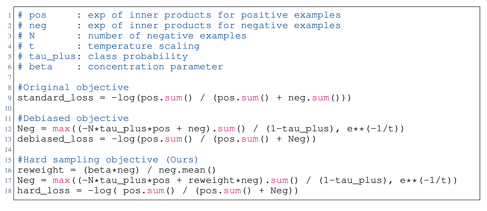

图 5\. 计算 NCE 损失、去偏差对比损失和硬负样本目标的伪代码，当设置 $M=1$ 时。（图片来源：[Robinson et al., 2021](https://arxiv.org/abs/2010.04592)）

# 视觉：图像嵌入

## 图像增强

视觉领域对比表示学习的大多数方法依赖于通过应用一系列数据增强技术来创建样本的噪声版本。增强应该显着改变其视觉外观，但保持语义含义不变。

### 基本图像增强

有许多方法可以修改图像而保留其语义含义。我们可以使用以下任一种增强或多个操作的组合。

+   随机裁剪然后调整回原始大小。

+   随机颜色失真

+   随机高斯模糊

+   随机颜色抖动

+   随机水平翻转

+   随机灰度转换

+   多裁剪增强：使用两个标准分辨率裁剪和采样一组额外的低分辨率裁剪，仅覆盖图像的小部分。使用低分辨率裁剪可以降低计算成本。(SwAV)

+   还有很多...

### 增强策略

许多框架旨在学习良好的数据增强策略（即多个转换的组合）。以下是一些常见的策略。

+   [AutoAugment](https://lilianweng.github.io/posts/2019-05-05-domain-randomization/#AutoAugment)（[Cubuk 等人，2018](https://arxiv.org/abs/1805.09501)）：受[NAS](https://lilianweng.github.io/posts/2020-08-06-nas/)启发，AutoAugment 将学习最佳数据增强操作（即剪切、旋转、反转等）的问题框架为图像分类的 RL 问题，并寻找在评估集上导致最高准确性的组合。

+   RandAugment（[Cubuk 等人，2019](https://arxiv.org/abs/1909.13719)）：RandAugment 通过控制不同转换操作的幅度以单个幅度参数来大大减少 AutoAugment 的搜索空间。

+   PBA（基于种群的增强；[何等人，2019](https://arxiv.org/abs/1905.05393)）：PBA 将 PBT（[Jaderberg 等人，2017](https://arxiv.org/abs/1711.09846)）与 AutoAugment 相结合，使用进化算法并行训练一组子模型，以演化出最佳的增强策略。

+   UDA（无监督数据增强；[谢等人，2019](https://arxiv.org/abs/1904.12848)）：在一组可能的增强策略中，UDA 选择那些最小化未标记示例及其未标记增强版本之间 KL 散度的策略。

### 图像混合

图像混合方法可以从现有数据点构建新的训练示例。

+   Mixup（[张等人，2018](https://arxiv.org/abs/1710.09412)）：通过创建两个现有图像$I_1$和$I_2$的加权像素级组合来运行全局级混合：$I_\text{mixup} \gets \alpha I_1 + (1-\alpha) I_2$，其中$\alpha \in [0, 1]$。

+   Cutmix ([Yun et al., 2019](https://arxiv.org/abs/1905.04899))：Cutmix 通过将一个图像的局部区域与另一个图像的其余部分组合生成一个新示例进行区域级混合。$I_\text{cutmix} \gets \mathbf{M}_b \odot I_1 + (1-\mathbf{M}_b) \odot I_2$，其中$\mathbf{M}_b \in \{0, 1\}^I$是一个二进制掩模，$\odot$是逐元素乘法。它等同于用另一幅图像的相同区域填充 cutout ([DeVries & Taylor 2017](https://arxiv.org/abs/1708.04552)) 区域。

+   MoCHi（“混合对比困难负例”；[Kalantidis et al. 2020](https://arxiv.org/abs/2010.01028)）：给定一个查询$\mathbf{q}$，MoCHi 维护一个包含$K$个负特征$\mathbf{n}_1, \dots, \mathbf{n}_K$的队列，并按照与查询的相似性$\mathbf{q}^\top \mathbf{n}$降序排序这些负特征。队列中的前$N$个项目被视为最困难的负例$Q^N$。然后可以通过$\mathbf{h} = \tilde{\mathbf{h}} / |\tilde{\mathbf{h}}|$生成合成的困难示例，其中$\tilde{\mathbf{h}} = \alpha\mathbf{n}_i + (1-\alpha) \mathbf{n}_j$，$\alpha \in (0, 1)$。通过与查询特征混合，可以创建更难的示例，$\mathbf{h}’ = \tilde{\mathbf{h}’} / |\tilde{\mathbf{h}’}|_2$，其中$\tilde{\mathbf{h}’} = \beta\mathbf{q} + (1-\beta) \mathbf{n}_j$，$\beta \in (0, 0.5)$。

## 并行增强

这类方法生成一个锚定图像的两个噪声版本，并旨在学习表示，使得这两个增强样本共享相同的嵌入。

### SimCLR

**SimCLR** ([Chen et al, 2020](https://arxiv.org/abs/2002.05709)) 提出了一种用于对视觉表示进行对比学习的简单框架。通过在潜在空间中通过对比损失最大化同一样本的不同增强视图之间的一致性来学习视觉输入的表示。

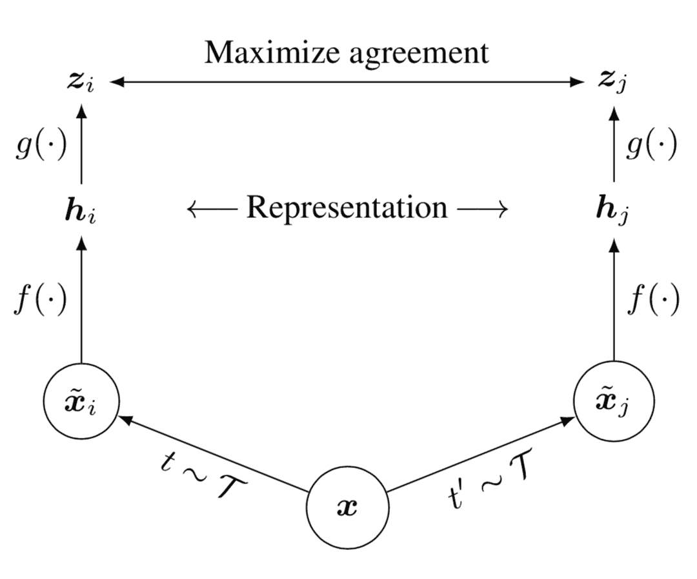

图 6\. 一种用于对视觉表示进行对比学习的简单框架。 (图片来源：[Chen et al, 2020](https://arxiv.org/abs/2002.05709))

1.  随机采样一个包含$N$个样本的小批量，每个样本应用两种不同的数据增强操作，总共产生$2N$个增强样本。

$$ \tilde{\mathbf{x}}_i = t(\mathbf{x}),\quad\tilde{\mathbf{x}}_j = t'(\mathbf{x}),\quad t, t' \sim \mathcal{T} $$

其中，从相同的增强家族$\mathcal{T}$中随机采样两个独立的数据增强操作符$t$和$t'$。数据增强包括随机裁剪、随机翻转调整大小、颜色失真和高斯模糊。

1.  给定一个正对，其他$2(N-1)$个数据点被视为负样本。表示由基础编码器$f(.)$生成：

$$ \mathbf{h}_i = f(\tilde{\mathbf{x}}_i),\quad \mathbf{h}_j = f(\tilde{\mathbf{x}}_j) $$

1.  对比学习损失使用余弦相似度$\text{sim}(.,.)$来定义。请注意，损失作用于表示$g(.)$的额外投影层，而不是直接作用于表示空间。但是，仅表示$\mathbf{h}$用于下游任务。

$$ \begin{aligned} \mathbf{z}_i &= g(\mathbf{h}_i),\quad \mathbf{z}_j = g(\mathbf{h}_j) \\ \mathcal{L}_\text{SimCLR}^{(i,j)} &= - \log\frac{\exp(\text{sim}(\mathbf{z}_i, \mathbf{z}_j) / \tau)}{\sum_{k=1}^{2N} \mathbb{1}_{[k \neq i]} \exp(\text{sim}(\mathbf{z}_i, \mathbf{z}_k) / \tau)} \end{aligned} $$

其中$\mathbb{1}_{[k \neq i]}$是一个指示函数：如果$k\neq i$则为 1，否则为 0。

SimCLR 需要一个大批量大小以包含足够的负样本以实现良好的性能。


图 7. SimCLR 的算法。（图片来源：[Chen 等人，2020](https://arxiv.org/abs/2002.05709)）。

### Barlow Twins

**Barlow Twins**（[Zbontar 等人，2021](https://arxiv.org/abs/2103.03230)）将两个扭曲版本的样本输入相同的网络中，以提取特征并学习使这两组输出特征之间的*交叉相关矩阵*接近于单位矩阵。其目标是保持同一样本的不同扭曲版本的表示向量相似，同时最小化这些向量之间的冗余。

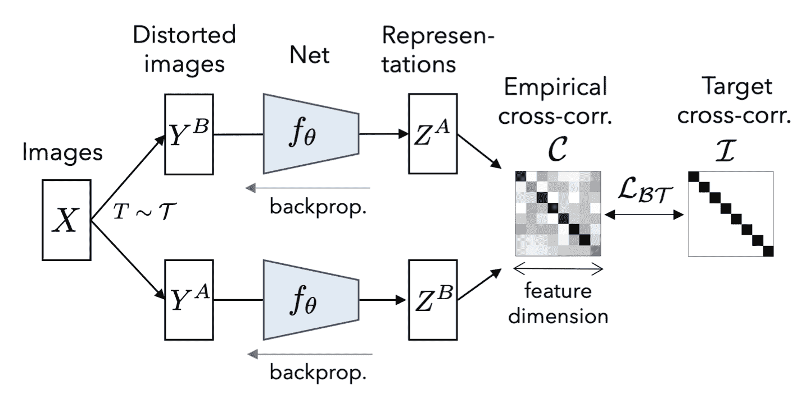

图 8. Barlow Twins 学习流程示意图。（图片来源：[Zbontar 等人，2021](https://arxiv.org/abs/2103.03230)）。

设$\mathcal{C}$是在批处理维度上计算的两个相同网络输出之间的交叉相关矩阵。$\mathcal{C}$是一个方阵，其大小与特征网络的输出维度相同。矩阵$\mathcal{C}$中的每个条目$\mathcal{C}_{ij}$是网络输出向量维度在索引$i, j$和批处理索引$b$处的余弦相似度，$\mathbf{z}_{b,i}^A$和$\mathbf{z}_{b,j}^B$，取值介于-1（即完全反相关）和 1（即完全相关）之间。

$$ \begin{aligned} \mathcal{L}_\text{BT} &= \underbrace{\sum_i (1-\mathcal{C}_{ii})²}_\text{不变性项} + \lambda \underbrace{\sum_i\sum_{i\neq j} \mathcal{C}_{ij}²}_\text{冗余减少项} \\ \text{其中 } \mathcal{C}_{ij} &= \frac{\sum_b \mathbf{z}^A_{b,i} \mathbf{z}^B_{b,j}}{\sqrt{\sum_b (\mathbf{z}^A_{b,i})²}\sqrt{\sum_b (\mathbf{z}^B_{b,j})²}} \end{aligned} $$

Barlow Twins 在自监督学习中与 SOTA 方法竞争力相当。它自然地避免了平凡的常数（即坍缩表示），并且对不同的训练批次大小具有鲁棒性。

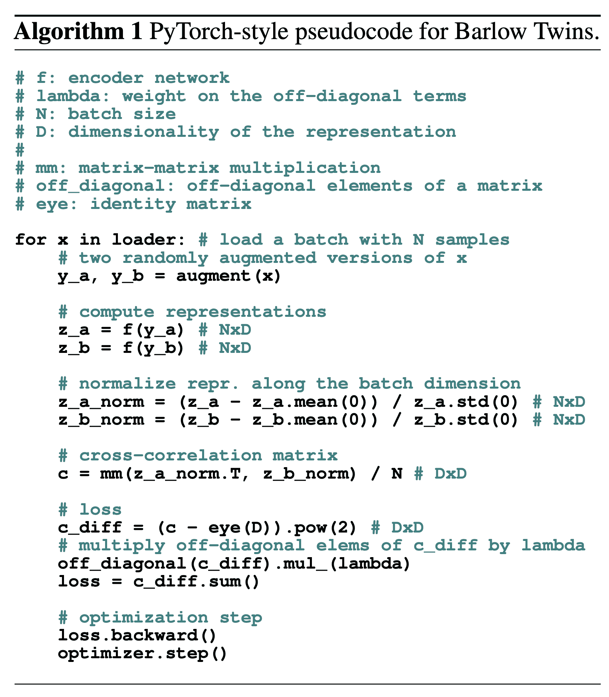

图 9. Barlow Twins 的 Pytorch 风格伪代码算法。（图片来源：[Zbontar 等人，2021](https://arxiv.org/abs/2103.03230)）。

### BYOL

与上述方法不同的是，有趣的是，**BYOL**（Bootstrap Your Own Latent; [Grill, et al 2020](https://arxiv.org/abs/2006.07733)）声称在不使用负样本的情况下取得了新的最先进结果。它依赖于两个神经网络，分别称为*在线*和*目标*网络，彼此交互并相互学习。目标网络（由$\xi$参数化）与在线网络（由$\theta$参数化）具有相同的架构，但具有 Polyak 平均权重，$\xi \leftarrow \tau \xi + (1-\tau) \theta$。

目标是学习一个可用于下游任务的表示$y$。由$\theta$参数化的在线网络包含：

+   一个编码器$f_\theta$；

+   一个投影器$g_\theta$；

+   一个预测器$q_\theta$。

目标网络具有相同的网络架构，但具有不同的参数$\xi$，通过 Polyak 平均$\theta$进行更新：$\xi \leftarrow \tau \xi + (1-\tau) \theta$。

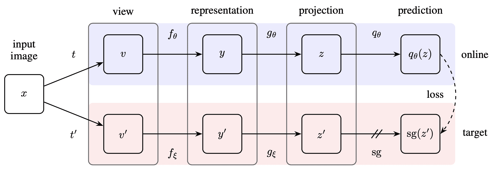

图 10\. BYOL 的模型架构。训练后，我们只关心用于生成表示的$f\_\theta$，$y=f\_\theta(x)$，其他一切都被丢弃。$\text{sg}$表示停止梯度。（图片来源：[Grill, et al 2020](https://arxiv.org/abs/2006.07733)）

给定一幅图像$\mathbf{x}$，BYOL 损失构建如下：

+   创建两个增强视图：$\mathbf{v}=t(\mathbf{x}); \mathbf{v}’=t’(\mathbf{x})$，其中增强采样自$t \sim \mathcal{T}, t’ \sim \mathcal{T}’$；

+   然后它们被编码为表示，$\mathbf{y}_\theta=f_\theta(\mathbf{v}), \mathbf{y}’=f_\xi(\mathbf{v}’)$；

+   然后它们被投影到潜在变量中，$\mathbf{z}_\theta=g_\theta(\mathbf{y}_\theta), \mathbf{z}’=g_\xi(\mathbf{y}’)$；

+   在线网络输出一个预测$q_\theta(\mathbf{z}_\theta)$；

+   $q_\theta(\mathbf{z}_\theta)$和$\mathbf{z}’$都经过 L2 归一化，得到$\bar{q}_\theta(\mathbf{z}_\theta) = q_\theta(\mathbf{z}_\theta) / | q_\theta(\mathbf{z}_\theta) |$和$\bar{\mathbf{z}’} = \mathbf{z}’ / |\mathbf{z}’|$；

+   损失$\mathcal{L}^\text{BYOL}_\theta$是 L2 归一化预测$\bar{q}_\theta(\mathbf{z})$和$\bar{\mathbf{z}’}$之间的均方误差；

+   另一个对称损失$\tilde{\mathcal{L}}^\text{BYOL}_\theta$可以通过交换$\mathbf{v}’$和$\mathbf{v}$生成；即，将$\mathbf{v}’$馈送到在线网络，将$\mathbf{v}$馈送到目标网络。

+   最终损失为$\mathcal{L}^\text{BYOL}_\theta + \tilde{\mathcal{L}}^\text{BYOL}_\theta$，只有参数$\theta$被优化。

与大多数基于对比学习的流行方法不同，BYOL 不使用负对。大多数自举方法依赖于伪标签或聚类索引，但 BYOL 直接自举潜在表示。

令人感兴趣且令人惊讶的是，*没有*负样本的情况下，BYOL 仍然表现良好。后来我看到了 Abe Fetterman & Josh Albrecht 的[帖子](https://untitled-ai.github.io/understanding-self-supervised-contrastive-learning.html)，他们在尝试复现 BYOL 时强调了两个令人惊讶的发现：

1.  当*移除批归一化*时，BYOL 通常表现不比随机好。

1.  批归一化的存在隐式地导致了一种对比学习。他们认为使用负样本对于避免模型崩溃（即如果你为每个数据点使用全零表示会怎样？）是很重要的。批归一化隐式地注入了对负样本的依赖，因为无论一批输入有多相似，数值都会重新分布（扩散到 $\sim \mathcal{N}(0, 1$)，因此批归一化可以防止模型崩溃。如果你在这个领域工作，强烈建议阅读[完整文章](https://untitled-ai.github.io/understanding-self-supervised-contrastive-learning.html)。

## 记忆库

在每个批次中为大量负样本计算嵌入是非常昂贵的。一种常见的方法是将表示存储在内存中，以便在数据陈旧和计算成本之间进行权衡。

### 带有记忆库的实例辨别

**实例对比学习**（[吴等，2018](https://arxiv.org/abs/1805.01978v1)）通过将每个实例视为*独立的类别*，将类别监督推向极端。这意味着“类别”的数量将与训练数据集中的样本数量相同。因此，使用这么多头训练 softmax 层是不可行的，但可以通过 NCE 来近似。


图 11\. 实例级对比学习的训练流程。学习到的嵌入是 L2-归一化的。（图片来源：[吴等，2018](https://arxiv.org/abs/1805.01978v1)）

让 $\mathbf{v} = f_\theta(x)$ 成为一个学习的嵌入函数，且向量被归一化为 $|\mathbf{v}|=1$。一个非参数分类器使用温度参数 $\tau$ 预测样本 $\mathbf{v}$ 属于类别 $i$ 的概率：

$$ P(C=i\vert \mathbf{v}) = \frac{\exp(\mathbf{v}_i^\top \mathbf{v} / \tau)}{\sum_{j=1}^n \exp(\mathbf{v}_j^\top \mathbf{v} / \tau)} $$

他们实现了一个**记忆库**，用于存储过去迭代中数据库中的样本表示，而不是每次都计算所有样本的表示。设 $V=\{ \mathbf{v}_i \}$ 为记忆库，$\mathbf{f}_i = f_\theta(\mathbf{x}_i)$ 为网络前向传播生成的特征。在比较成对相似性时，我们可以使用记忆库中的表示 $\mathbf{v}_i$ 而不是网络前向传播生成的特征 $\mathbf{f}_i$。

分母在理论上需要访问所有样本的表示，但在实践中这太昂贵了。相反，我们可以通过使用随机子集$M$索引$\{j_k\}_{k=1}^M$的蒙特卡洛逼近来估计它。

$$ P(i\vert \mathbf{v}) = \frac{\exp(\mathbf{v}^\top \mathbf{f}_i / \tau)}{\sum_{j=1}^N \exp(\mathbf{v}_j^\top \mathbf{f}_i / \tau)} \simeq \frac{\exp(\mathbf{v}^\top \mathbf{f}_i / \tau)}{\frac{N}{M} \sum_{k=1}^M \exp(\mathbf{v}_{j_k}^\top \mathbf{f}_i / \tau)} $$

因为每个类别只有一个实例，训练不稳定且波动很大。为了提高训练平滑性，他们在基于[近端优化方法](https://web.stanford.edu/~boyd/papers/prox_algs.html)的损失函数中为正样本引入了额外项。最终的 NCE 损失目标如下：

$$ \begin{aligned} \mathcal{L}_\text{instance} &= - \mathbb{E}_{P_d}\big[\log h(i, \mathbf{v}^{(t-1)}_i) - \lambda \|\mathbf{v}^{(t)}_i - \mathbf{v}^{(t-1)}_i\|²_2\big] - M\mathbb{E}_{P_n}\big[\log(1 - h(i, \mathbf{v}'^{(t-1)})\big] \\ h(i, \mathbf{v}) &= \frac{P(i\vert\mathbf{v})}{P(i\vert\mathbf{v}) + MP_n(i)} \text{其中噪声分布是均匀的}P_n = 1/N \end{aligned} $$

其中$\{ \mathbf{v}^{(t-1)} \}$是存储在内存库中的上一次迭代的嵌入。随着学习嵌入的收敛，迭代之间的差异$|\mathbf{v}^{(t)}_i - \mathbf{v}^{(t-1)}_i|²_2$将逐渐消失。

### MoCo & MoCo-V2

**动量对比**（**MoCo**；[He 等，2019](https://arxiv.org/abs/1911.05722)）提供了一个无监督学习视觉表示的框架，作为*动态字典查找*。字典被构造为一个大的 FIFO 队列，其中包含数据样本的编码表示。

给定一个查询样本$\mathbf{x}_q$，我们通过编码器$\mathbf{q} = f_q(\mathbf{x}_q)$获得一个查询表示。字典中的一系列关键表示$\{\mathbf{k}_1, \mathbf{k}_2, \dots \}$由动量编码器$\mathbf{k}_i = f_k (\mathbf{x}^k_i)$编码。假设其中有一个字典中与$\mathbf{q}$匹配的单个*正*关键$\mathbf{k}^+$。在论文中，他们使用$\mathbf{x}_q$的噪声副本创建$\mathbf{k}^+$，并使用温度$\tau$的 InfoNCE 对比损失在一个正样本和$N-1$负样本上进行计算：

$$ \mathcal{L}_\text{MoCo} = - \log \frac{\exp(\mathbf{q} \cdot \mathbf{k}^+ / \tau)}{\sum_{i=1}^N \exp(\mathbf{q} \cdot \mathbf{k}_i / \tau)} $$

与内存库相比，MoCo 中基于队列的字典使我们能够重复使用数据样本的前几个小批次的表示。

MoCo 字典作为队列不可微分，因此我们不能依赖反向传播来更新键编码器$f_k$。一种简单的方法可能是使用相同的编码器$f_q$和$f_k$。不同的是，MoCo 提出使用基于动量的更新，动量系数为$m \in 0, 1)$。比如，$f_q$和$f_k$的参数分别标记为$\theta_q$和$\theta_k$。

$$ \theta_k \leftarrow m \theta_k + (1-m) \theta_q $$）

与 SimCLR 相比，MoCo 的优势在于 MoCo 将批量大小与负样本数量分离，而 SimCLR 需要一个大批量大小以获得足够的负样本，并且在减小批量大小时性能下降。

SimCLR 中的两种设计，即（1）MLP 投影头和（2）更强的数据增强，被证明非常有效。**MoCo V2**（[Chen 等人，2020](https://arxiv.org/abs/2003.04297)）结合了这两种设计，实现了更好的转移性能，而且不依赖于非常大的批量大小。

### CURL

**CURL**（[Srinivas 等人，2020](https://arxiv.org/abs/2004.04136)）将上述思想应用于[强化学习](https://lilianweng.github.io/posts/2018-02-19-rl-overview/)中。它通过匹配原始观察$o$的两个数据增强版本$o_q$和$o_k 的嵌入来学习强化学习任务的视觉表示，通过对比损失。 CURL 主要依赖于随机裁剪数据增强。关键编码器实现为动量编码器，权重为查询编码器权重的 EMA，与 MoCo 中相同。

强化学习（RL）与监督视觉任务之间的一个显著区别是 RL 依赖于连续帧之间的*时间一致性*。因此，CURL 在每个帧堆栈上一致应用增强，以保留关于观察的时间结构的信息。


图 13\. CURL 的架构。（图片来源：[Srinivas 等人，2020](https://arxiv.org/abs/2004.04136)）

## 特征聚类

### DeepCluster

**DeepCluster**（[Caron 等人，2018](https://arxiv.org/abs/1807.05520)）通过 k 均值迭代聚类特征，并使用聚类分配作为伪标签提供监督信号。


图 14\. 深度聚类方法的示意图，通过迭代聚类深度特征并使用聚类分配作为伪标签。（图片来源：[Caron 等人，2018](https://arxiv.org/abs/1807.05520)）

在每次迭代中，DeepCluster 使用先前表示对数据点进行聚类，然后将新的聚类分配作为新表示的分类目标。 然而，这种迭代过程容易产生琐碎的解决方案。 虽然避免使用负对，但它需要昂贵的聚类阶段和特定预防措施以避免崩溃到琐碎的解决方案。

### SwAV

**SwAV**（*多视图之间的交换分配*；[Caron et al. 2020](https://arxiv.org/abs/2006.09882)）是一种在线对比学习算法。 它从图像的增强版本中计算一个编码，并尝试使用同一图像的另一个增强版本来预测此编码。


图 15\. SwAV 和 对比实例学习 的比较。 （图片来源：[Caron et al. 2020](https://arxiv.org/abs/2006.09882)）

给定具有两种不同增强的图像特征，$\mathbf{z}_t$ 和 $\mathbf{z}_s$，SwAV 计算相应的编码 $\mathbf{q}_t$ 和 $\mathbf{q}_s，并且通过使用 $\ell(.)$ 交换两个编码来量化拟合度，以衡量特征和编码之间的拟合度。

$$ \mathcal{L}_\text{SwAV}(\mathbf{z}_t, \mathbf{z}_s) = \ell(\mathbf{z}_t, \mathbf{q}_s) + \ell(\mathbf{z}_s, \mathbf{q}_t) $$

交换的拟合预测取决于预测编码和一组 $K$ 可训练原型向量 $\mathbf{C} = \{\mathbf{c}_1, \dots, \mathbf{c}_K\}$ 之间的交叉熵。 原型向量矩阵在不同批次之间共享，并表示每个实例应该聚类到的 *锚簇*。

$$ \ell(\mathbf{z}_t, \mathbf{q}_s) = - \sum_k \mathbf{q}^{(k)}_s\log\mathbf{p}^{(k)}_t \text{ where } \mathbf{p}^{(k)}_t = \frac{\exp(\mathbf{z}_t^\top\mathbf{c}_k / \tau)}{\sum_{k'}\exp(\mathbf{z}_t^\top \mathbf{c}_{k'} / \tau)} $$

在包含 $B$ 个特征向量 $\mathbf{Z} = [\mathbf{z}_1, \dots, \mathbf{z}_B]$ 的小批量中，特征与原型向量之间的映射矩阵定义为 $\mathbf{Q} = [\mathbf{q}_1, \dots, \mathbf{q}_B] \in \mathbb{R}_+^{K\times B}$。 我们希望最大化特征和原型之间的相似性：

$$ \begin{aligned} \max_{\mathbf{Q}\in\mathcal{Q}} &\text{Tr}(\mathbf{Q}^\top \mathbf{C}^\top \mathbf{Z}) + \varepsilon \mathcal{H}(\mathbf{Q}) \\ \text{where }\mathcal{Q} &= \big\{ \mathbf{Q} \in \mathbb{R}_{+}^{K \times B} \mid \mathbf{Q}\mathbf{1}_B = \frac{1}{K}\mathbf{1}_K, \mathbf{Q}^\top\mathbf{1}_K = \frac{1}{B}\mathbf{1}_B \big\} \end{aligned} $$

其中 $\mathcal{H}$ 是熵，$\mathcal{H}(\mathbf{Q}) = - \sum_{ij} \mathbf{Q}_{ij} \log \mathbf{Q}_{ij}$，控制编码的平滑度。系数 $\epsilon$ 不应太大；否则，所有样本将均匀分配到所有聚类中。$\mathbf{Q}$ 的候选解集要求每个映射矩阵的每行总和为 $1/K$，每列总和为 $1/B$，强制每个原型平均至少被选择 $B/K$ 次。

SwAV 依赖于迭代 Sinkhorn-Knopp 算法（[Cuturi 2013](https://arxiv.org/abs/1306.0895)）来找到 $\mathbf{Q}$ 的解。

## 使用监督数据集

### CLIP

**CLIP**（*对比语言-图像预训练*；[Radford 等人，2021](https://arxiv.org/abs/2103.00020)）共同训练文本编码器和图像特征提取器，以预测哪个标题与哪个图像匹配。

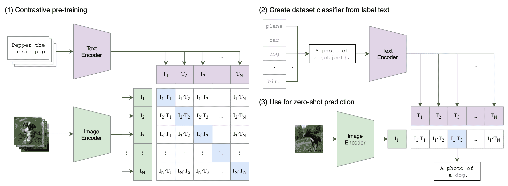

图 16\. CLIP 对文本-图像对进行对比预训练的示意图。（图片来源：[Radford 等人，2021](https://arxiv.org/abs/2103.00020)）

给定一个批次的 $N$ 个（图像，文本）对，CLIP 计算该批次内所有 $N\times N$ 个可能的（图像，文本）候选对之间的密集余弦相似度矩阵。文本和图像编码器共同训练，以最大化 $N$ 个正确的（图像，文本）关联对之间的相似度，同时通过对密集矩阵的对称交叉熵损失，最小化 $N(N-1)$ 个不正确对的相似度。

查看 CLIP 的类似于 NumPy 的伪代码，请参见图 17。


图 17\. 以 NumPy 风格的伪代码展示的 CLIP 算法。（图片来源：[Radford 等人，2021](https://arxiv.org/abs/2103.00020)）

与上述其他学习良好视觉表示的方法相比，使 CLIP 真正特殊的是*“使用自然语言作为训练信号的欣赏”*。它确实需要访问监督数据集，其中我们知道哪个文本与哪个图像匹配。它在互联网上收集了来自 4 亿个（文本，图像）对的训练数据。查询列表包含英文维基百科中至少出现 100 次的所有单词。有趣的是，他们发现基于 Transformer 的语言模型在零样本 ImageNet 分类上比词袋（BoW）文本编码器慢 3 倍。使用对比目标而不是尝试预测与图像相关联的确切单词（即图像标题预测任务通常采用的方法）可以进一步提高数据效率 4 倍。

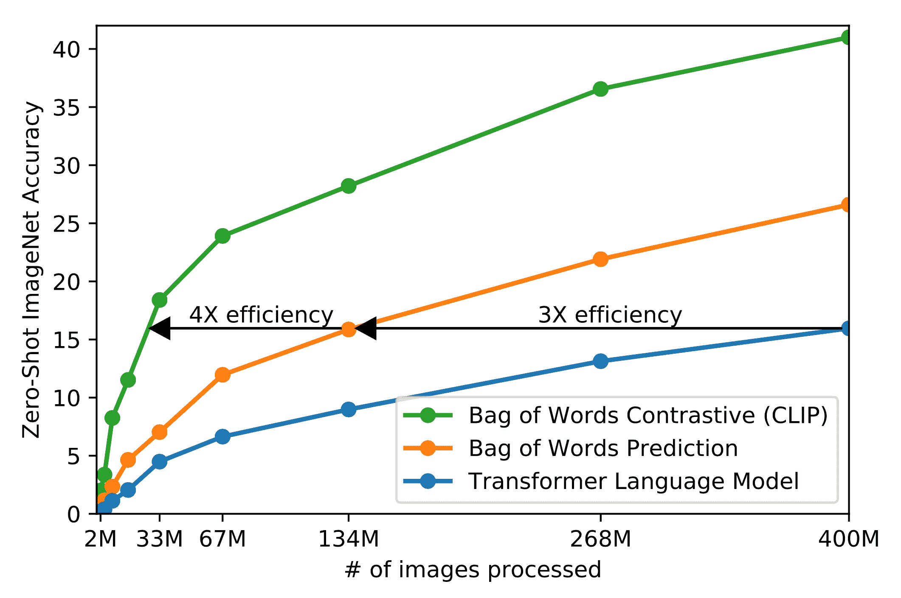

图 18\. 使用词袋文本编码和对比训练目标可以带来多倍的数据效率改进。（图片来源：[Radford 等人，2021](https://arxiv.org/abs/2103.00020)）

CLIP 产生良好的视觉表示，可以非常成功地转移到许多 CV 基准数据集，取得与监督基线竞争的结果。在测试的转移任务中，CLIP 在非常细粒度的分类以及抽象或系统性任务（如计算对象数量）方面表现不佳。CLIP 模型的转移性能与模型计算量呈平滑相关。

### 监督对比学习

交叉熵损失存在一些已知问题，如对嘈杂标签的缺乏鲁棒性和边界不佳的可能性。对交叉熵损失的现有改进涉及更好的训练数据的筛选，如标签平滑和数据增强。**监督对比损失**（[Khosla 等人，2021](https://arxiv.org/abs/2004.11362)）旨在比交叉熵更有效地利用标签信息，要求来自同一类别的归一化嵌入比来自不同类别的嵌入更接近。

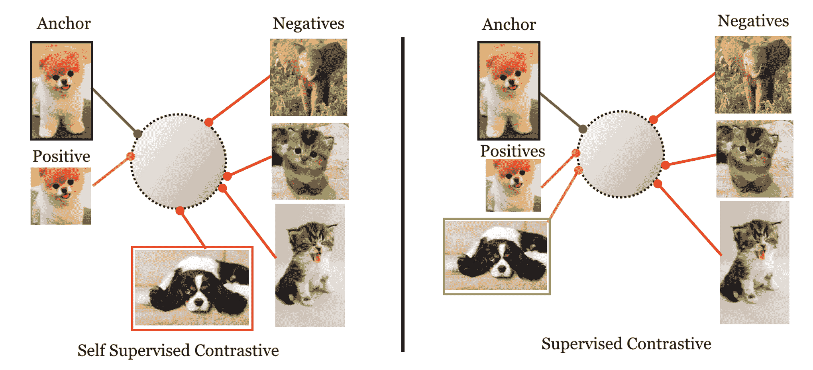

图 19。监督对自监督对比损失。监督对比学习将来自同一类别的不同样本视为正样本，除了增强版本。（图片来源：[Khosla 等人，2021](https://arxiv.org/abs/2004.11362)）

给定一组随机抽样的$n$（图像，标签）对，$\{\mathbf{x}_i, y_i\}_{i=1}^n$，通过对每个样本应用两个随机增强，可以创建$2n$个训练对，$\{\tilde{\mathbf{x}}_i, \tilde{y}_i\}_{i=1}^{2n}$。

监督对比损失$\mathcal{L}_\text{supcon}$利用多个正样本和负样本，与软最近邻损失非常相似：

$$ \mathcal{L}_\text{supcon} = - \sum_{i=1}^{2n} \frac{1}{2 \vert N_i \vert - 1} \sum_{j \in N(y_i), j \neq i} \log \frac{\exp(\mathbf{z}_i \cdot \mathbf{z}_j / \tau)}{\sum_{k \in I, k \neq i}\exp({\mathbf{z}_i \cdot \mathbf{z}_k / \tau})} $$

其中$\mathbf{z}_k=P(E(\tilde{\mathbf{x}_k}))$，其中$E(.)$是一个编码器网络（将增强图像映射到向量）$P(.)$是一个投影网络（一个向量映射到另一个）。$N_i= \{j \in I: \tilde{y}_j = \tilde{y}_i \}$包含具有标签$y_i$的样本的索引集。将更多正样本包含到集合$N_i$中会导致改善结果。

根据他们的实验，监督对比损失：

+   超越基础交叉熵，但仅略有优势。

+   在鲁棒性基准测试（ImageNet-C，对 ImageNet 数据集应用常见的自然扰动，如噪声、模糊和对比度变化）上胜过交叉熵。

+   对超参数变化不太敏感。

# 语言：句子嵌入

在本节中，我们关注如何学习句子嵌入。

## 文本增强

大多数视觉应用中的对比方法依赖于创建每个图像的增强版本。然而，构建不改变句子语义的文本增强更具挑战性。在本节中，我们探讨了三种增强文本序列的方法，包括词汇编辑、回译以及应用截断或丢弃。

### 词汇编辑

**EDA**（*简易数据增强*；[Wei＆Zou 2019](https://arxiv.org/abs/1901.11196)）为文本增强定义了一组简单但强大的操作。给定一个句子，EDA 随机选择并应用四种简单操作中的一种：

1.  同义词替换（SR）：用它们的同义词替换$n$个随机非停用词。

1.  随机插入（RI）：在句子中的随机位置放置一个随机选择的非停用词的随机同义词。

1.  随机交换（RS）：随机交换两个单词并重复$n$次。

1.  随机删除（RD）：以概率$p$随机删除句子中的每个单词。

其中$p=\alpha$且$n=\alpha \times \text{sentence_length}$，直觉是较长的句子可以吸收更多噪声同时保持原始标签。超参数$\alpha$大致表示一个句子中可能被一个增强改变的单词的百分比。

与没有 EDA 的基准相比，EDA 被证明可以提高几个分类基准数据集的分类准确性。在较小的训练集上，性能提升更为显著。EDA 中的四种操作都有助于提高分类准确性，但在不同的$\alpha$下达到最佳。

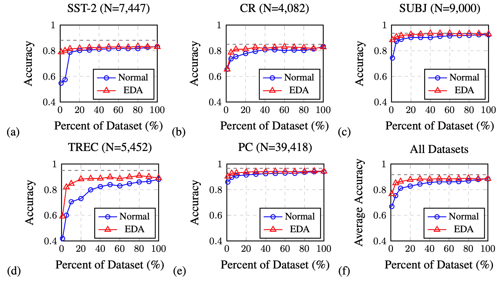

图 20\. EDA 在几个分类基准上导致性能提升。（图片来源：[Wei＆Zou 2019](https://arxiv.org/abs/1901.11196)）

在**上下文增强**（[Sosuke Kobayashi，2018](https://arxiv.org/abs/1805.06201)）中，可以从由 BERT 等双向 LM 预测的给定概率分布$p(.\mid S\setminus\{w_i\})$中平滑地对位置$i$处的单词$w_i$进行新的替代品进行采样。

### 回译

**CERT**（*对比自监督编码器表示来自变压器*；[Fang 等人（2020）](https://arxiv.org/abs/2005.12766); [code](https://github.com/UCSD-AI4H/CERT)）通过**回译**生成增强句子。可以使用不同语言的各种翻译模型来创建不同版本的增强。一旦我们有了文本样本的噪声版本，就可以使用上面介绍的许多对比学习框架，如 MoCo，来学习句子嵌入。

### 丢弃和截断

[Shen 等人（2020）](https://arxiv.org/abs/2009.13818)提出将**截断**应用于文本增强，灵感来自[跨视图训练](https://lilianweng.github.io/posts/2019-01-31-lm/#cross-view-training)。他们提出了三种截断增强策略：

1.  *标记截断*会删除一些选定标记的信息。为了确保没有数据泄漏，输入、位置和其他相关嵌入矩阵中的相应标记都应该被清零。

1.  *特征截断*会删除一些特征列。

1.  *跨度截断*会删除一段连续的文本。

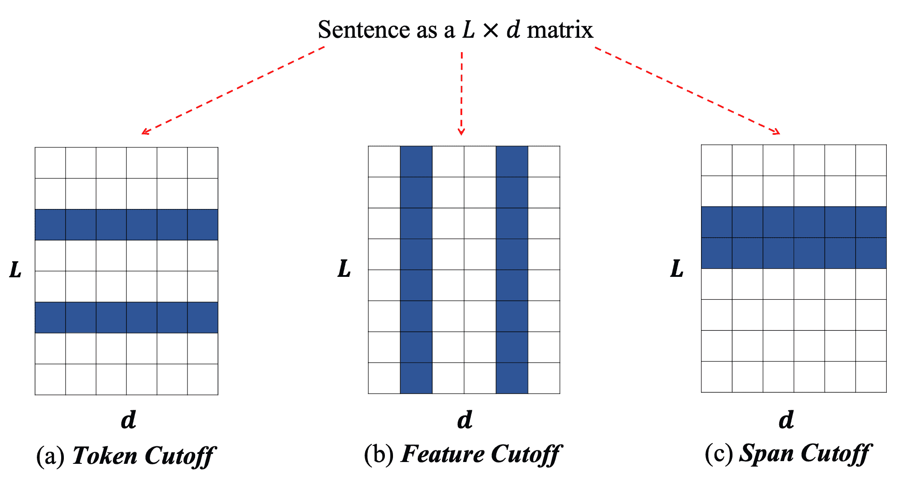

图 21。标记、特征和跨度截断增强策略的示意图。（图片来源：[Shen 等人，2020](https://arxiv.org/abs/2009.13818)）

可以创建一个样本的多个增强版本。在训练时，[Shen 等人（2020）](https://arxiv.org/abs/2009.13818)应用了一个额外的 KL 散度项来衡量不同增强样本的预测之间的一致性。

**SimCSE**（[Gao 等人，2021](https://arxiv.org/abs/2104.08821)；[代码](https://github.com/princeton-nlp/SimCSE)）通过预测一个句子自身并仅使用**dropout**噪声来从无监督数据中学习。换句话说，他们将 dropout 视为文本序列的数据增强。一个样本简单地被两次输入到编码器中，使用不同的 dropout 掩码，这两个版本被视为正样本，而其他批内样本被视为负样本。这感觉与截断增强相似，但 dropout 更加灵活，对可以屏蔽的内容的语义含义定义不那么明确。

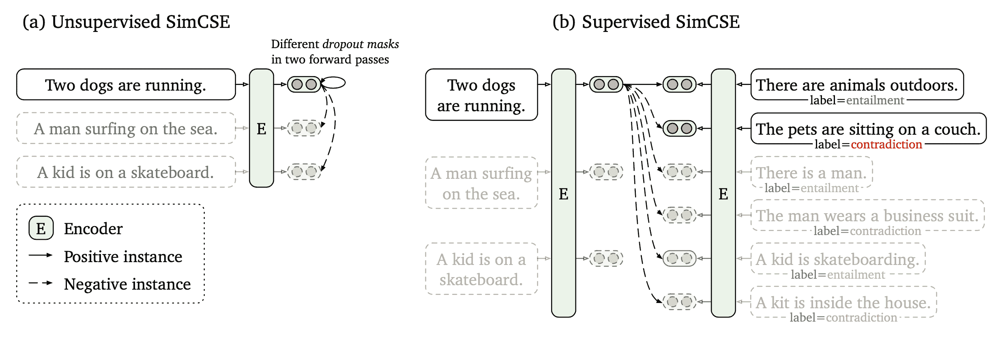

图 22。SimCSE 通过应用不同的 dropout 掩码创建增强样本。监督版本利用 NLI 数据集来预测给定一对句子的正面（蕴涵）或负面（矛盾）。（图片来源：[Gao 等人，2021](https://arxiv.org/abs/2104.08821)）

他们在 7 个 STS（语义文本相似性）数据集上进行了实验，并计算了句子嵌入之间的余弦相似度。他们还尝试了一个可选的 MLM 辅助目标损失，以帮助避免对标记级知识的灾难性遗忘。发现这种辅助损失有助于提高在传输任务上的性能，但在主要 STS 任务上有一致的下降。

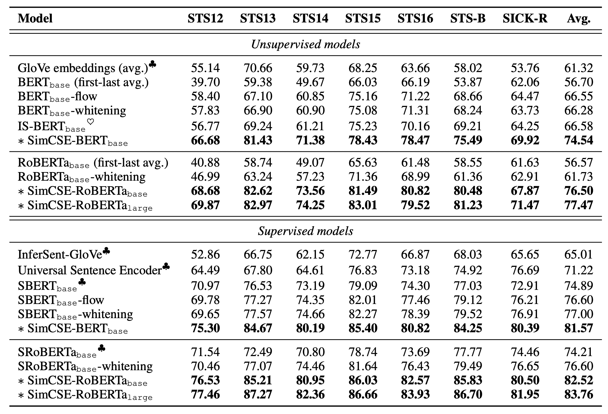

图 23。SimCES 在一系列 STS 基准上的实验结果。（图片来源：[Gao 等人，2021](https://arxiv.org/abs/2104.08821)）

## 从自然语言推理中监督

发现未经微调的预训练 BERT 句子嵌入在语义相似性任务上表现不佳。我们需要通过进一步的微调来完善嵌入，而不是直接使用原始嵌入。

**自然语言推理（NLI）**任务是提供学习句子嵌入的监督信号的主要数据来源；例如[SNLI](https://nlp.stanford.edu/projects/snli/)、[MNLI](https://cims.nyu.edu/~sbowman/multinli/)和[QQP](https://www.kaggle.com/c/quora-question-pairs)。

### 句子-BERT

**SBERT (Sentence-BERT)**（[Reimers & Gurevych, 2019](https://arxiv.org/abs/1908.10084)）依赖于连体和三元组网络架构来学习句子嵌入，从而可以通过嵌入对之间的余弦相似度估计句子相似度。请注意，学习 SBERT 取决于监督数据，因为它在几个 NLI 数据集上进行了微调。

他们尝试了几种不同的预测头在 BERT 模型之上：

+   Softmax 分类目标函数：连体网络的分类头是建立在两个嵌入$f(\mathbf{x}), f(\mathbf{x}’)$和$\vert f(\mathbf{x}) - f(\mathbf{x}’) \vert$的串联上。预测输出为$\hat{y}=\text{softmax}(\mathbf{W}_t [f(\mathbf{x}); f(\mathbf{x}’); \vert f(\mathbf{x}) - f(\mathbf{x}’) \vert])$。他们表明，最重要的组成部分是元素间的差异$\vert f(\mathbf{x}) - f(\mathbf{x}’) \vert$。

+   回归目标函数：这是关于$\cos(f(\mathbf{x}), f(\mathbf{x}’))$的回归损失，其中池化策略有很大影响。在实验中，他们观察到`max`比`mean`和`CLS`-token 表现要差得多。

+   三元组目标函数：$\max(0, |f(\mathbf{x}) - f(\mathbf{x}^+)|- |f(\mathbf{x}) - f(\mathbf{x}^-)| + \epsilon)$，其中$\mathbf{x}, \mathbf{x}^+, \mathbf{x}^-$分别是锚点、正面和负面句子的嵌入。

在实验中，哪种目标函数效果最好取决于数据集，因此没有通用的赢家。

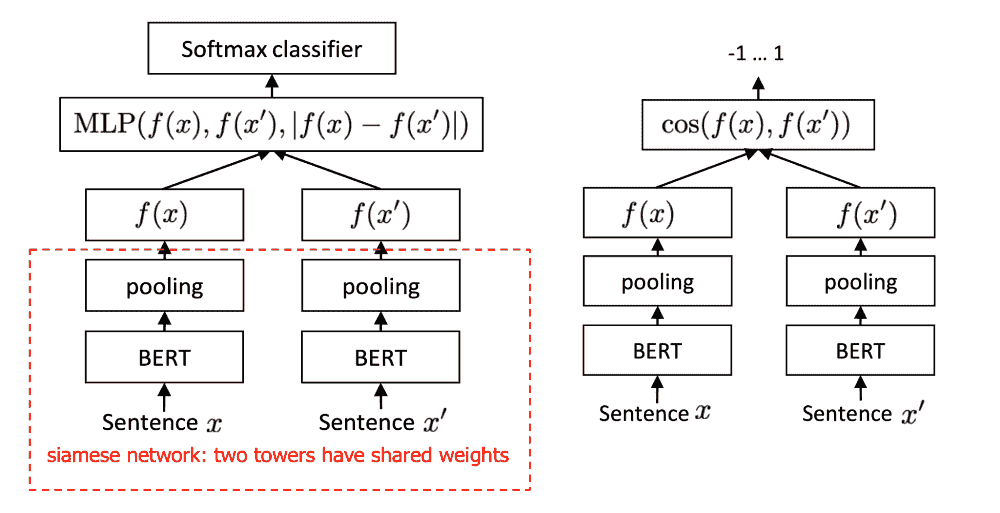

图 24\. 带有 softmax 分类头和回归头的 Sentence-BERT 训练框架的示意图。（图片来源：[Reimers & Gurevych, 2019](https://arxiv.org/abs/1908.10084)）

[SentEval](https://github.com/facebookresearch/SentEval)库（[Conneau and Kiela, 2018](https://arxiv.org/abs/1803.05449)）通常用于评估学习句子嵌入的质量。在那时（2019 年 8 月），SBERT 在 7 项任务中有 5 项超过了其他基线。


图 25\. Sentence-BERT 在 SentEval 基准测试上的表现。（图片来源：[Reimers & Gurevych, 2019](https://arxiv.org/abs/1908.10084)）

### BERT-flow

如果嵌入在每个维度上均匀分布，则嵌入表示空间被视为*各向同性*；否则，它是*各向异性*的。[Li et al, (2020)](https://arxiv.org/abs/2011.05864)表明，预训练的 BERT 学习了一个非平滑的*各向异性*语义空间的句子嵌入，因此在没有微调的情况下导致文本相似性任务性能不佳。从经验上看，他们观察到 BERT 句子嵌入存在两个问题：词频偏置了嵌入空间。高频词接近原点，而低频词远离原点。低频词分散稀疏。低频词的嵌入往往比它们的$k$-NN 邻居更远，而高频词的嵌入更密集。

**BERT-flow**（[Li et al, 2020](https://arxiv.org/abs/2011.05864); [code](https://github.com/bohanli/BERT-flow)）旨在通过[正规化流](https://lilianweng.github.io/posts/2018-10-13-flow-models/#what-is-normalizing-flows)将嵌入转换为平滑且各向同性的高斯分布。

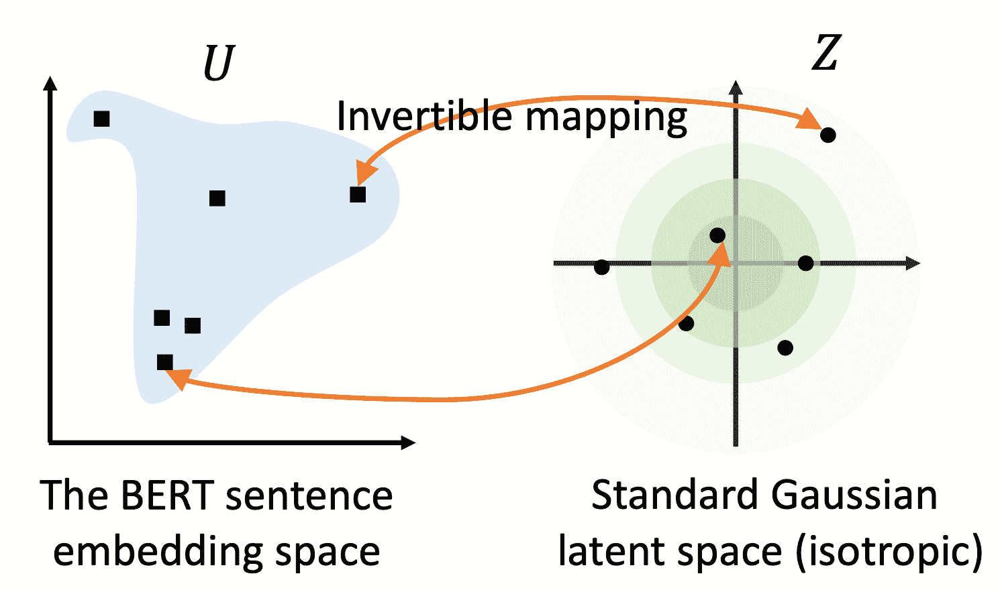

图 26. BERT-flow 中原始句子嵌入空间上的基于流的校准示意图。（图片来源：[Li et al, 2020](https://arxiv.org/abs/2011.05864))

让$\mathcal{U}$为观察到的 BERT 句子嵌入空间，$\mathcal{Z}$为期望的标准高斯潜在空间。因此，$p_\mathcal{Z}$是一个高斯密度函数，$f_\phi: \mathcal{Z}\to\mathcal{U}$是一个可逆变换：

$$ \mathbf{z}\sim p_\mathcal{Z}(\mathbf{z}) \quad \mathbf{u}=f_\phi(\mathbf{z}) \quad \mathbf{z}=f^{-1}_\phi(\mathbf{u}) $$

基于流的生成模型通过最大化$\mathcal{U}$的边际似然来学习可逆映射函数：

$$ \max_\phi\mathbb{E}_{\mathbf{u}=\text{BERT}(s), s\sim\mathcal{D}} \Big[ \log p_\mathcal{Z}(f^{-1}_\phi(\mathbf{u})) + \log\big\vert\det\frac{\partial f^{-1}_\phi(\mathbf{u})}{\partial\mathbf{u}}\big\vert \Big] $$

其中$s$是从文本语料库$\mathcal{D}$中抽样的句子。只有流参数$\phi$被优化，而预训练的 BERT 中的参数保持不变。

BERT-flow 被证明在大多数 STS 任务上提高了性能，无论是否有来自 NLI 数据集的监督。因为学习用于校准的正规化流不需要标签，它可以利用整个数据集，包括验证和测试集。

### 白化操作

[Su et al. (2021)](https://arxiv.org/abs/2103.15316)应用**白化**操作来改善学习表示的各向同性，同时减少句子嵌入的维度。

他们将句子向量的均值转换为 0，协方差矩阵转换为单位矩阵。给定一组样本$\{\mathbf{x}_i\}_{i=1}^N$，让$\tilde{\mathbf{x}}_i$和$\tilde{\Sigma}$是转换后的样本和对应的协方差矩阵：

$$ \begin{aligned} \mu &= \frac{1}{N}\sum_{i=1}^N \mathbf{x}_i \quad \Sigma = \frac{1}{N}\sum_{i=1}^N (\mathbf{x}_i - \mu)^\top (\mathbf{x}_i - \mu) \\ \tilde{\mathbf{x}}_i &= (\mathbf{x}_i - \mu)W \quad \tilde{\Sigma} = W^\top\Sigma W = I \text{ thus } \Sigma = (W^{-1})^\top W^{-1} \end{aligned} $$

如果我们对$\Sigma = U\Lambda U^\top$进行[SVD 分解](https://en.wikipedia.org/wiki/Singular_value_decomposition)，我们将得到$W^{-1}=\sqrt{\Lambda} U^\top$和$W=U\sqrt{\Lambda^{-1}}$。请注意，在 SVD 中，$U$是一个正交矩阵，其列向量是特征向量，$\Lambda$是一个对角矩阵，其所有正元素是排序后的特征值。

可以通过仅取$W$的前$k$列来应用降维策略，称为`白化`-$k$。

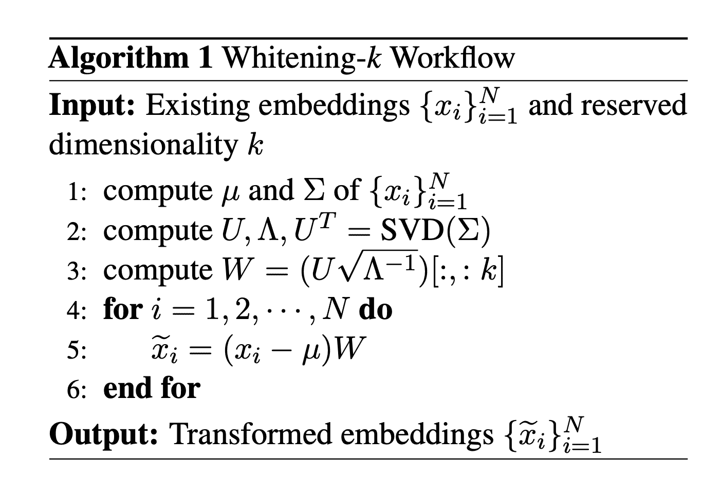

图 27. 白化-$k$操作的伪代码。（图片来源：[Su 等人，2021](https://arxiv.org/abs/2103.15316)）

白化操作已被证明优于 BERT-flow，在许多 STS 基准测试中实现了 256 句子维度的 SOTA，无论是否有 NLI 监督。

## 无监督句子嵌入学习

### 上下文预测

**快速思考（QT）向量**（[Logeswaran & Lee, 2018](https://arxiv.org/abs/1803.02893)）将句子表示学习形式化为一个*分类*问题：给定一个句子及其上下文，一个分类器根据它们的向量表示来区分上下文句子和其他对比句子（基于它们的向量表示）（[“填空测试”](https://lilianweng.github.io/posts/2019-01-31-lm/#MLM)）。这种形式化去除了导致训练减速的 softmax 输出层。


图 28. 展示了如何学习快速思考句子嵌入向量。（图片来源：[Logeswaran & Lee, 2018](https://arxiv.org/abs/1803.02893)）

设$f(.)$和$g(.)$是两个将句子$s$编码为固定长度向量的函数。设$C(s)$是句子$s$上下文中的句子集合，$S(s)$是包含一个句子$s_c \in C(s)$和许多其他非上下文负面句子的候选句子集合。快速思考模型学习优化预测唯一真实上下文句子$s_c \in S(s)$的概率。当考虑句子$(s, s_c)$作为正对时，其他对$(s, s’)$，其中$s’ \in S(s), s’\neq s_c$作为负对时，这本质上是 NCE 损失。

$$ \mathcal{L}_\text{QT} = - \sum_{s \in \mathcal{D}} \sum_{s_c \in C(s)} \log p(s_c \vert s, S(s)) = - \sum_{s \in \mathcal{D}} \sum_{s_c \in C(s)}\frac{\exp(f(s)^\top g(s_c))}{\sum_{s'\in S(s)} \exp(f(s)^\top g(s'))} $$

### 最大化互信息

**IS-BERT（信息句 BERT）**（[Zhang 等人，2020](https://arxiv.org/abs/2009.12061); [代码](https://github.com/yanzhangnlp/IS-BERT)）采用基于*互信息最大化*的自监督学习目标，以*无监督*方式学习良好的句子嵌入。

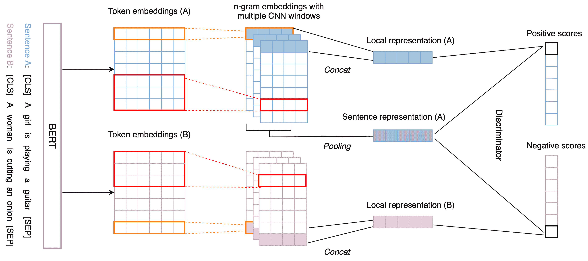

图 29。信息句 BERT 的示意图。（图片来源：[Zhang 等人，2020](https://arxiv.org/abs/2009.12061)）

IS-BERT 的工作方式如下：

1.  使用 BERT 将输入句子$s$编码为长度为$l$的标记嵌入$\mathbf{h}_{1:l}$。

1.  然后应用具有不同核大小（例如 1、3、5）的 1-D 卷积网络来处理标记嵌入序列，以捕获 n-gram 局部上下文依赖关系：$\mathbf{c}_i = \text{ReLU}(\mathbf{w} \cdot \mathbf{h}_{i:i+k-1} + \mathbf{b})$。输出序列被填充以保持与输入相同的大小。

1.  第$i$个标记的最终本地表示$\mathcal{F}_\theta^{(i)} (\mathbf{x})$是不同核大小表示的串联。

1.  全局句子表示$\mathcal{E}_\theta(\mathbf{x})$通过在标记表示$\mathcal{F}_\theta(\mathbf{x}) = \{\mathcal{F}_\theta^{(i)} (\mathbf{x}) \in \mathbb{R}^d\}_{i=1}^l$上应用时间平均池化层来计算。

由于连续和高维随机变量的互信息估计通常是棘手的，IS-BERT 依赖于 Jensen-Shannon 估计器（[Nowozin 等人，2016](https://arxiv.org/abs/1606.00709)，[Hjelm 等人，2019](https://arxiv.org/abs/1808.06670)）来最大化$\mathcal{E}_\theta(\mathbf{x})$和$\mathcal{F}_\theta^{(i)} (\mathbf{x})$之间的互信息。

$$ I^\text{JSD}_\omega(\mathcal{F}_\theta^{(i)} (\mathbf{x}); \mathcal{E}_\theta(\mathbf{x})) = \mathbb{E}_{\mathbf{x}\sim P} [-\text{sp}(-T_\omega(\mathcal{F}_\theta^{(i)} (\mathbf{x}); \mathcal{E}_\theta(\mathbf{x})))] \\ - \mathbb{E}_{\mathbf{x}\sim P, \mathbf{x}' \sim\tilde{P}} [\text{sp}(T_\omega(\mathcal{F}_\theta^{(i)} (\mathbf{x}'); \mathcal{E}_\theta(\mathbf{x})))] $$

其中$T_\omega: \mathcal{F}\times\mathcal{E} \to \mathbb{R}$是具有参数$\omega$的可学习网络，生成鉴别器分数。负样本$\mathbf{x}’$从分布$\tilde{P}=P$中采样。而$\text{sp}(x)=\log(1+e^x)$是 softplus 激活函数。

使用 IS-BERT 在 SentEval 上的无监督数字表现优于大多数无监督基线（2020 年 9 月），但可预见地弱于监督运行。当使用带标签的 NLI 数据集时，IS-BERT 产生的结果与 SBERT 相当（见图 25 和 30）。


图 30。IS-BERT 在 SentEval 基准测试上的性能。（图片来源：[Zhang 等人，2020](https://arxiv.org/abs/2009.12061)）

# 引文

引用为：

> Weng，Lilian。 （2021 年 5 月）。 对比表示学习。 Lil’Log。 https://lilianweng.github.io/posts/2021-05-31-contrastive/。

或

```py
@article{weng2021contrastive,
  title   = "Contrastive Representation Learning",
  author  = "Weng, Lilian",
  journal = "lilianweng.github.io",
  year    = "2021",
  month   = "May",
  url     = "https://lilianweng.github.io/posts/2021-05-31-contrastive/"
} 
```

# 参考文献

[1] Sumit Chopra, Raia Hadsell 和 Yann LeCun. [“以辨别方式学习相似度度量，应用于人脸验证。”](http://yann.lecun.com/exdb/publis/pdf/chopra-05.pdf) CVPR 2005.

[2] Florian Schroff, Dmitry Kalenichenko 和 James Philbin. [“FaceNet：用于人脸识别和聚类的统一嵌入。”](https://arxiv.org/abs/1503.03832) CVPR 2015.

[3] Hyun Oh Song 等人. [“通过提升结构化特征嵌入进行深度度量学习。”](https://arxiv.org/abs/1511.06452) CVPR 2016\. [[代码](https://github.com/rksltnl/Deep-Metric-Learning-CVPR16)]

[4] Ruslan Salakhutdinov 和 Geoff Hinton. [“通过保持类邻域结构学习非线性嵌入”](http://proceedings.mlr.press/v2/salakhutdinov07a.html) AISTATS 2007.

[5] Michael Gutmann 和 Aapo Hyvärinen. [“噪声对比估计：非归一化统计模型的新估计原则。”](http://proceedings.mlr.press/v9/gutmann10a.html) AISTATS 2010.

[6] Kihyuk Sohn 等人. [“使用多类 N 对损失目标改进深度度量学习”](https://papers.nips.cc/paper/2016/hash/6b180037abbebea991d8b1232f8a8ca9-Abstract.html) NIPS 2016.

[7] Nicholas Frosst, Nicolas Papernot 和 Geoffrey Hinton. [“通过软最近邻损失分析和改进表示。”](http://proceedings.mlr.press/v97/frosst19a.html) ICML 2019

[8] 王同舟和 Phillip Isola. [“通过在超球面上的对齐和均匀性理解对比表示学习。”](https://arxiv.org/abs/2005.10242) ICML 2020\. [[代码](https://ssnl.github.io/hypersphere/)]

[9] 吴志荣等人. [“通过非参数实例级别区分学习无监督特征。”](https://arxiv.org/abs/1805.01978) CVPR 2018.

[10] Ekin D. Cubuk 等人. [“AutoAugment：从数据中学习增强策略。”](https://arxiv.org/abs/1805.09501) arXiv 预印本 arXiv:1805.09501 (2018).

[11] Daniel Ho 等人. [“基于人口的增强：高效学习增强策略计划。”](https://arxiv.org/abs/1905.05393) ICML 2019.

[12] Ekin D. Cubuk & Barret Zoph 等人. [“RandAugment：具有减少搜索空间的实用自动数据增强。”](https://arxiv.org/abs/1909.13719) arXiv 预印本 arXiv:1909.13719 (2019).

[13] 张宏毅等人. [“混合：超越经验风险最小化。”](https://arxiv.org/abs/1710.09412) ICLR 2017.

[14] Sangdoo Yun 等人. [“CutMix：用于训练具有可定位特征的强分类器的正则化策略。”](https://arxiv.org/abs/1905.04899) ICCV 2019.

[15] Yannis Kalantidis 等人. [“对比硬负例的混合”](https://arxiv.org/abs/2010.01028) NeuriPS 2020.

[16] Ashish Jaiswal 等人. [“对比自监督学习综述。”](https://arxiv.org/abs/2011.00362) arXiv 预印本 arXiv:2011.00362 (2021)

[17] Jure Zbontar 等人。[“Barlow Twins: 通过冗余减少进行自监督学习。”](https://arxiv.org/abs/2103.03230) arXiv 预印本 arXiv:2103.03230 (2021) [[code](https://github.com/facebookresearch/barlowtwins)]。

[18] Alec Radford 等人。[“从自然语言监督中学习可转移的视觉模型”](https://arxiv.org/abs/2103.00020) arXiv 预印本 arXiv:2103.00020 (2021)。

[19] Mathilde Caron 等人。[“通过对比聚类分配进行视觉特征的无监督学习（SwAV）。](https://arxiv.org/abs/2006.09882) NeuriPS 2020。

[20] Mathilde Caron 等人。[“用于无监督学习视觉特征的深度聚类。”](https://arxiv.org/abs/1807.05520) ECCV 2018。

[21] Prannay Khosla 等人。[“监督对比学习。”](https://arxiv.org/abs/2004.11362) NeurIPS 2020。

[22] Aaron van den Oord，Yazhe Li 和 Oriol Vinyals。[“使用对比预测编码进行表示学习”](https://arxiv.org/abs/1807.03748) arXiv 预印本 arXiv:1807.03748 (2018)。

[23] Jason Wei 和 Kai Zou。[“EDA：用于提升文本分类任务性能的简单数据增强技术。”](https://arxiv.org/abs/1901.11196) EMNLP-IJCNLP 2019。

[24] Sosuke Kobayashi。[“上下文增强：通过具有范例关系的单词进行数据增强。”](https://arxiv.org/abs/1805.06201) NAACL 2018。

[25] Hongchao Fang 等人。[“CERT: 用于语言理解的对比自监督学习。”](https://arxiv.org/abs/2005.12766) arXiv 预印本 arXiv:2005.12766 (2020)。

[26] Dinghan Shen 等人。[“一种简单但难以超越的自然语言理解和生成数据增强方法。”](https://arxiv.org/abs/2009.13818) arXiv 预印本 arXiv:2009.13818 (2020) [[code](https://github.com/dinghanshen/cutoff)]。

[27] Tianyu Gao 等人。[“SimCSE: 句子嵌入的简单对比学习。”](https://arxiv.org/abs/2104.08821) arXiv 预印本 arXiv:2104.08821 (2020) [[code](https://github.com/princeton-nlp/SimCSE)]。

[28] Nils Reimers 和 Iryna Gurevych。[“Sentence-BERT: 使用 Siamese BERT 网络进行句子嵌入。”](https://arxiv.org/abs/1908.10084) EMNLP 2019。

[29] Jianlin Su 等人。[“为了更好的语义和更快的检索而漂白句子表示。”](https://arxiv.org/abs/2103.15316) arXiv 预印本 arXiv:2103.15316 (2021) [[code](https://github.com/bojone/BERT-whitening)]。

[30] Yan Zhang 等人。[“通过最大化互信息的无监督句子嵌入方法。”](https://arxiv.org/abs/2009.12061) EMNLP 2020 [[code](https://github.com/yanzhangnlp/IS-BERT)]。

[31] Bohan Li 等人。[“关于来自预训练语言模型的句子嵌入。”](https://arxiv.org/abs/2011.05864) EMNLP 2020。

[32] Lajanugen Logeswaran 和 Honglak Lee。[“学习句子表示的高效框架。”](https://arxiv.org/abs/1803.02893) ICLR 2018。

[33] Joshua Robinson 等人。[“使用困难负样本进行对比学习。”](https://arxiv.org/abs/2010.04592) ICLR 2021。

[34] Ching-Yao Chuang 等人 [“去偏差的对比学习。”](https://arxiv.org/abs/2007.00224) NeuriPS 2020.
