# 可控神经文本生成

> 原文：[`lilianweng.github.io/posts/2021-01-02-controllable-text-generation/`](https://lilianweng.github.io/posts/2021-01-02-controllable-text-generation/)

[更新于 2021-02-01: 更新为 2.0 版本，添加了一些工作并修复了许多拼写错误。]

更新于 2021-05-26: 在[“提示设计”部分添加了 P-tuning 和 Prompt Tuning。]

更新于 2021-09-19: 添加[“非概然性训练”。]

网络上有大量的免费文本，比标记的基准数据集多几个数量级。最先进的语言模型（LM）是通过大规模的无监督网络数据进行训练的。当通过迭代地抽样下一个标记来从 LM 生成样本时，我们对输出文本的属性（如主题、风格、情感等）没有太多控制。许多应用程序需要对模型输出进行良好的控制。例如，如果我们计划使用 LM 为孩子们生成阅读材料，我们希望引导输出的故事是安全的、教育性的，并且容易被孩子理解。

如何引导一个强大的无条件语言模型？在本文中，我们将深入探讨几种用于受控内容生成的方法，其中包括无条件语言模型。请注意，模型的可操纵性仍然是一个开放的研究问题。每种介绍的方法都有一定的优缺点。

1.  在测试时应用引导式解码策略并选择所需的输出。

1.  通过良好的提示设计来优化最理想的结果。

1.  对基础模型或可操纵层进行微调，以进行有条件的内容生成。

在接下来的讨论中，我们假设我们可以访问一个预训练的生成式语言模型 $p_\theta$。该模型通过优化下一个标记的预测学习了标记序列上的分布：$ \mathcal{L}_\text{ML} = - \sum_t \log p_\theta(x_t \vert x_{<t}) $。

# 解码策略

通过采用不同的解码方法，我们可以对抽样过程施加限制或偏好，以改变生成的样本，而不修改任何模型权重。尽管解码策略不会改变任何可训练参数的值，但它是一个非常重要的组成部分。

## 常见的解码方法

由于模型的最终层预测了词汇空间上的 logits $o$，下一个标记可以通过应用温度 $T$ 的 softmax 进行抽样。抽样第 $i$ 个标记的概率是

$$ p_i \propto \frac{\exp(o_i / T)}{\sum_j \exp(o_j/T)} $$

低温度会使分布更尖锐，而高值会使其更柔和。

**贪婪搜索**：始终选择具有*最高*概率的下一个标记，相当于设置温度 $T=0$。然而，它往往会创建短语的重复，即使对于训练良好的模型也是如此。

**Beam search**：本质上是广度优先搜索，每个树级别一个标记，但带有有限的带宽。在搜索树的每个级别，beam search 跟踪$n$（称为“束宽”）个最佳候选项，并在下一个级别扩展这些候选项的所有后继。如果遇到 EOS（句子结束）标记，beam search 可能停止扩展一个节点。

然而，基于最大化的解码并不能保证高质量的生成。

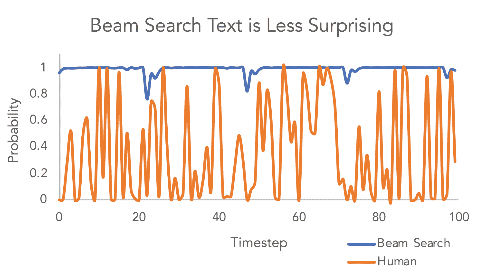

图 1\. 由 beam search 和人类分配给下一个标记的概率。人类选择的标记在预测概率上具有更高的方差，因此更具惊喜性。（图片来源：[Holtzman et al. 2019](https://arxiv.org/abs/1904.09751)）

**Top-k 抽样** ([Fan et al., 2018](https://arxiv.org/abs/1805.04833))：在每个抽样步骤中，只选择前$k$个最有可能的标记，并在它们之间重新分配概率质量。在[Fan et al., 2018](https://arxiv.org/abs/1805.04833)中，作者提出使用*top-k 随机抽样*，其中下一个标记在前$k$个最有可能的候选项中随机选择，他们认为这种方法可以生成比 beam search 更多新颖且不那么重复的内容。

**核抽样** ([Holtzman et al. 2019](https://arxiv.org/abs/1904.09751))：也称为“Top-p 抽样”。top-k 抽样的一个缺点是预定义的数字$k$并没有考虑到概率分布可能有多么*倾斜*。核抽样选择最小的一组累积概率超过阈值（例如 0.95）的顶级候选项，然后在选定的候选项中重新缩放分布。

无论是 top-k 抽样还是核抽样，都具有较少的重复性和适当的一组超参数。

**惩罚抽样** ([Keskar et al. 2019](https://arxiv.org/abs/1909.05858))：为了避免生成重复子字符串的常见失败情况，[CTRL](https://arxiv.org/abs/1909.05858)论文提出了一种新的抽样方法，通过打折先前生成的标记的分数来惩罚重复。带有重复惩罚的下一个标记的概率分布定义如下：

$$ p_i = \frac{\exp(o_i / (T \cdot \mathbb{1}(i \in g)))}{\sum_j \exp(o_j / (T \cdot \mathbb{1}(j \in g)))} \quad \mathbb{1}(c) = \theta \text{ if the condition }c\text{ is True else }1 $$

其中$g$包含一组先前生成的标记，$\mathbb{1}(.)$是一个恒等函数。$\theta=1.2$被发现能在减少重复和生成真实内容之间取得良好平衡。

## 引导解码

所有上述标准解码策略根据预测概率对标记进行采样，没有额外信息。我们对主题或情感的偏好可以通过候选排名函数嵌入到其中，以通过改变候选排名分数来引导样本生成。在每个解码步骤中用于标记选择的排名分数可以设置为 LM 对数似然和一组期望特征鉴别器的组合。这些特征旨在通过启发式（[Ghazvininejad 等人，2017](https://www.aclweb.org/anthology/P17-4008/)）、监督学习（[Holtzman 等人，2018](https://arxiv.org/abs/1805.06087)）或 RL（[Li 等人，2017](https://arxiv.org/abs/1701.06549)）来量化人类偏好。

[Ghazvininejad 等人（2017）](https://www.aclweb.org/anthology/P17-4008/)构建了一个名为“Hafez”的系统，通过在解码步骤中调整波束搜索中的采样权重来生成所需风格的诗歌。在步骤$t$中，下一个标记$x_{t+1}$的采样可能性通过一个评分函数增强：

$$ \text{score}(x_{t+1}, b_t) = \text{score}(b_t) + \log p(x_{t+1}) + \color{green}{\sum_i \alpha_i f_i(x_{t+1})} $$

其中$\log p(x_{t+1})$是 LM 预测的对数似然。$\text{score}(b_t)$是当前波束状态$b_t$中已生成单词的累积分数。绿色部分可以包含许多不同的特征，用于引导输出的风格。一组特征函数$f_i(.)$定义了偏好和相关权重$alpha_i$的工作方式类似于“控制旋钮”，可以在解码时轻松定制。特征可以衡量各种属性，并且可以轻松组合；例如，

+   是否$x_{t+1}$存在于所需或禁止的主题词袋中。

+   是否$x_{t+1}$表示特定情绪。

+   是否$x_{t+1}$是一个重复的标记（因此$f_i$需要将历史作为输入）。

+   如果更长或更短的单词特别受欢迎，$x_{t+1}$的长度。

与 Hafez 类似，[Baheti 等人（2018）](https://arxiv.org/abs/1809.01215)为排名手动设计了特征，并通过附加上下文和完成的主题分布或嵌入之间的相似性分数改变了采样分布。

[Holtzman 等人（2018）](https://arxiv.org/abs/1805.06087)采用了一组学习的鉴别器，每个鉴别器专门针对由[Grice 的格言](https://en.wikipedia.org/wiki/Cooperative_principle)指导的不同沟通原则：质量、数量、关系和方式。鉴别器通过测量重复、蕴涵、相关性和词汇多样性来学习编码这些期望的原则。鉴别器模型都经过训练，以最小化排名对数似然，$\log\sigma(f_i(y_g) - f_i(y))$，因为预期金标准完成$y_g$的得分应高于生成的$y$。这里权重系数$\alpha_i$也被学习，以最小化金标准和生成完成之间的得分差异。鉴别性对抗搜索（DAS；[Scialom 等人，2020](https://arxiv.org/abs/2002.10375)）受到 GAN 的启发，训练鉴别器区分人类创作的文本和机器生成的文本。鉴别器为每个标记预测一个标签，而不是整个序列。鉴别器 logprob 被添加到得分中，以引导采样朝向人类写作风格。

[Meister 等人（2020）](https://arxiv.org/abs/2010.02650)在正则化解码框架中研究了波束搜索：

$$ \mathbf{y}^* = \arg\max_{\mathbf{y}\in\mathcal{Y}} \big( \underbrace{\log p_\theta(\mathbf{y}\vert\mathbf{x})}_\text{MAP} - \underbrace{\lambda\mathcal{R}(\mathbf{y})}_\text{regularizer} \big) $$

由于我们期望最大概率具有最小惊奇度，LM 在时间步$t$的惊奇度可以定义如下：

$$ \begin{aligned} u_0(\texttt{BOS}) &= 0 \text{ ; BOS 是句子开头的占位符。}\\ u_t(y) &= -\log P_\theta(y \vert \mathbf{x}, \mathbf{y}_{

MAP（最大后验）部分要求在给定上下文的情况下具有最大概率的序列，而正则化器引入其他约束。可能需要全局最优策略偶尔进行高惊奇步骤，以便缩短输出长度或在之后产生更多低惊奇步骤。

波束搜索在自然语言处理领域经受住了时间的考验。问题是：*如果我们想将波束搜索建模为正则化解码框架中的精确搜索，应该如何建模 $\mathcal{R}(\mathbf{y})$？* 该论文提出了波束搜索与*均匀信息密度*（UID）假设之间的联系。

> “均匀信息密度假设（UID；Levy 和 Jaeger，2007）指出——在语法的约束下——人类更喜欢将信息（在信息论意义上）均匀分布在语言信号中，例如，一句话。”

换句话说，它假设人类更喜欢具有均匀分布 surprisal 的文本。流行的解码方法如 top-k 采样或核采样实际上会过滤掉高 surprisal 选项，从而在输出序列中隐式地鼓励 UID 属性。

该论文尝试了几种形式的正则化器：

1.  *贪婪*：$\mathcal{R}_\text{greedy}(\mathbf{y}) = \sum_{t=1}^{\vert\mathbf{y}\vert} \big(u_t(y_t) - \min_{y’ \in \mathcal{V}} u_t(y’) \big)²$；如果设$\lambda \to \infty$，我们得到贪婪搜索。请注意，每个步骤贪婪并不保证全局最优性。

1.  *方差正则化器*：$\mathcal{R}_\text{var}(\mathbf{y}) = \frac{1}{\vert\mathbf{y}\vert}\sum_{t=1}^{\vert\mathbf{y}\vert} \big(u_t(y_t) - \bar{u} \big)²$，其中$\bar{u}$是所有时间步的平均 surprisal。它直接编码了 UID 假设。

1.  *局部一致性*：$\mathcal{R}_\text{local}(\mathbf{y}) = \frac{1}{\vert\mathbf{y}\vert}\sum_{t=1}^{\vert\mathbf{y}\vert} \big(u_t(y_t) - u_{t-1}(y_{t-1}) \big)²$；这种解码正则化器鼓励相邻标记具有相似的 surprisal。

1.  *最大正则化器*：$\mathcal{R}_\text{max}(\mathbf{y}) = \max_t u_t(y_t)$惩罚 surprisal 的最大补偿。

1.  *平方正则化器*：$\mathcal{R}_\text{square}(\mathbf{y}) = \sum_{t=1}^{\vert\mathbf{y}\vert} u_t(y_t)²$鼓励所有标记的 surprisal 接近 0。

通过对贪婪正则化器进行实验表明，较大的$\lambda$会导致更好的性能（例如通过 NMT 任务的 BLEU 度量）和更低的 surprisal 标准差。


图 2。BLEU 和 surprisal 标准差作为正则化器$\lambda$强度的函数的绘图。灰色子图显示了 BLEU 和 surprisal 标准差之间的关系。 （图片来源：[Meister et al. 2020](https://arxiv.org/abs/2010.02650)）

默认的波束搜索在波束大小增加时会导致文本生成质量下降。正则化的波束搜索极大地帮助缓解了这个问题。结合正则化器进一步提高了性能。在他们的 NMT 实验中，他们发现贪婪的$\lambda=5$和平方的$\lambda=2$是最佳的组合正则化器。


图 3。BLEU 作为波束大小的函数的绘图（左）和不同正则化解码策略创建的翻译的 BLEU 分数。 （图片来源：[Meister et al. 2020](https://arxiv.org/abs/2010.02650)）

引导解码本质上是运行一个更昂贵的波束搜索，其中采样概率分布受到有关人类偏好的辅助信息的影响。

## 可训练解码

在给定训练好的语言模型的情况下，[顾等人（2017）](https://arxiv.org/abs/1702.02429)提出了一个**可训练的贪婪解码**算法，用于最大化任意目标以对序列进行采样。这个想法基于*嘈杂的、并行的近似解码*（[NPAD](https://arxiv.org/abs/1605.03835)）。NPAD 向模型隐藏状态注入非结构化噪声，并并行多次运行嘈杂解码，以避免潜在的退化。为了更进一步，可训练的贪婪解码用可学习的随机变量替换了非结构化噪声，由一个接受前一个隐藏状态、前一个解码标记和上下文作为输入的 RL 代理预测。换句话说，解码算法学习一个 RL actor 来操纵模型隐藏状态以获得更好的结果。

[Grover 等人（2019）](https://arxiv.org/abs/1906.09531)训练了一个二元分类器来区分来自数据分布的样本和来自生成模型的样本。这个分类器用于估计*重要性权重*以构建一个新的非规范化分布。所提出的策略被称为**无似然重要性加权（LFIW）**。

让$p$表示真实数据分布，$p_\theta$表示学习到的生成模型。使用从$p_\theta$中获取的样本来评估给定函数$f$在$p$下的期望的经典方法是使用重要性抽样。

$$ \mathbb{E}_{\mathbf{x}\sim p} [f(\mathbf{x})] = \mathbb{E}_{\mathbf{x}\sim p_\theta} \Big[\frac{p(\mathbf{x})}{p_\theta(\mathbf{x})} f(\mathbf{x})\Big] \approx \frac{1}{N} \sum_{i=1}^N w(\mathbf{x}_i)f(\mathbf{x}_i) $$

然而，$p(\mathbf{x})$只能通过有限数据集来估计。让$c_\phi: \mathcal{X} \to [0,1]$是一个用于预测样本$\mathbf{x}$是否来自真实数据分布（$y=1$）的概率二元分类器。$\mathcal{X}\times\mathcal{Y}$上的联合分布被表示为$q(\mathbf{x}, y)$。

$$ q(\mathbf{x}\vert y) = \begin{cases} p_\theta(\mathbf{x}) & \text{ 如果 }y=0\text{；预测为生成数据} \\ p(\mathbf{x}) & \text{ 否则；来自真实数据分布} \end{cases} $$

如果$c_\phi$是[贝叶斯最优](https://svivek.com/teaching/lectures/slides/prob-learning/bayes-optimal-classifier.pdf)，那么重要性权重可以通过以下方式估计：

$$ w_\phi(\mathbf{x}) = \frac{p(\mathbf{x})}{p_\theta(\mathbf{x})} = \frac{q(\mathbf{x} \vert y=1)}{q(\mathbf{x} \vert y=0)} = \frac{q(y=0)}{q(y=1)} \frac{q(y=1 \vert \mathbf{x})}{q(y=0 \vert \mathbf{x})} = \gamma \frac{c_\phi(\mathbf{x})}{1 - c_\phi(\mathbf{x})} $$

其中$\gamma = \frac{q(y=0)}{q(y=1)} > 0$是一个固定的奇数比率。

由于我们无法学习到一个完美的最优分类器，重要性权重将是一个估计值$\hat{w}_\phi$。可以应用一些实用技巧来抵消分类器利用生成样本中的人为因素进行非常自信的预测（即非常小的重要性权重）：

1.  自标准化：通过总和 $\hat{w}_\phi(\mathbf{x}_i) / \sum_{j=1}^N \hat{w}_\phi(\mathbf{x}_j)$ 对权重进行归一化。

1.  平坦化：添加一个幂缩放参数 $\alpha > 0$，$\hat{w}_\phi(\mathbf{x}_i)^\alpha$。

1.  剪裁：指定一个下界 $\max(\hat{w}_\phi(\mathbf{x}_i), \beta)$。

要从重要性重采样的生成模型中进行采样，$\mathbf{x}\sim p_{\theta, \phi}(\mathbf{x}) \propto p_\theta(\mathbf{x})\hat{w}_\phi(\mathbf{x})$，他们采用了 SIR（采样-重要性-重采样），


图 4\. 使用 SIR 从生成模型中根据重要性权重 $\hat{w}(\mathbf{x}_i)$ 进行采样的算法。（图片来源：[Grover et al., 2019)](https://arxiv.org/abs/1906.09531)）

[Deng et al., 2020](https://arxiv.org/abs/2004.11714) 提出了学习一个 EBM 来引导 [残差空间](https://arxiv.org/abs/1906.03351) 中的 LM，$P_\theta(x) \propto P_\text{LM}(x)\exp(-E_\theta(x))$，其中 $P_\theta$ 是联合模型；$E_\theta$ 是要学习的残差能量函数。如果我们知道分区函数 $Z$，我们可以对生成模型进行建模以生成序列 $x_{p+1}, \dots, x_T$：

$$ P_\theta(x_{p+1:T}\vert x_{1:p}) = \frac{P_\text{LM}(x_{p+1:T}\vert x_{1:p}) \exp(-E_\theta(x_{1:T}))}{Z_\theta(x_{1:p})} $$

目标是学习能量函数 $E_\theta$ 的参数，使得联合模型 $P_\theta$ 更接近期望的数据分布。残差能量函数通过噪声对比估计（[NCE](https://www.kdnuggets.com/2019/07/introduction-noise-contrastive-estimation.html)）进行训练，考虑 $P_\theta$ 作为模型分布，$P_\text{LM}$ 作为噪声分布：

$$ \theta = \arg\max_{\theta} \mathbb{E}_{x^+ \sim P_\text{data}} \log\frac{1}{1+\exp(E_\theta(x^+))} + \mathbb{E}_{x^- \sim P_\text{LM}} \log\frac{1}{1+\exp(-E_\theta(x^-))} $$

然而，在实践中，分区函数是难以计算的。该论文提出了一个简单的方法，首先从原始 LM 中采样，然后根据能量函数重新采样。这很昂贵。


图 5\. 从基础 LM 中重新采样的前 k 个样本，根据残差能量函数。（图片来源：[Deng et al., 2020](https://arxiv.org/abs/2004.11714))

# 智能提示设计

大型语言模型已经在许多自然语言处理任务上表现出非常强大的能力，即使只有*提示*而没有特定任务的微调（[GPT2](https://lilianweng.github.io/posts/2019-01-31-lm/#gpt-2)，[GPT3](https://lilianweng.github.io/posts/2019-01-31-lm/#gpt-3)）。提示设计对下游任务的性能有很大影响，通常需要耗费大量时间进行手工制作。例如，事实性问题在“闭卷考试”中通过智能提示设计可以获得很大提升（[Shin 等，2020](https://arxiv.org/abs/2010.15980)，[Jiang 等，2020)](https://arxiv.org/abs/1911.12543)）。我期待看到越来越多关于自动智能提示设计的文献。

## 基于梯度的搜索

**AutoPrompt**（[Shin 等，2020](https://arxiv.org/abs/2010.15980)；[code](http://ucinlp.github.io/autoprompt)）是一种通过基于梯度的搜索自动创建各种任务提示的方法。AutoPrompt 通过将原始任务输入$x$与一组触发令牌$x_\text{trig}$根据模板$\lambda$组合来构建提示。这些触发令牌在所有输入中共享，因此*通用*有效。


图 6。AutoPrompt 的概述。触发令牌被检索以优化所有输入的目标输出。（图片来源：[Shin 等，2020](https://arxiv.org/abs/2010.15980)）

通用触发令牌是使用与[Wallace 等，2019](https://arxiv.org/abs/1908.07125)中相同的梯度引导搜索策略来识别的。*通用*设置意味着触发令牌$x_\text{trig}$可以为数据集中所有输入的目标输出$\tilde{y}$进行优化：

$$ x_\text{trig} = \arg\min_{x’_\text{trig}} \mathbb{E}_{x\sim\mathcal{X}} [\mathcal{L}(\tilde{y}, f(x’_\text{trig}; x))] $$

搜索在嵌入空间中进行。每个触发令牌$e_{\text{trig}_i}$的嵌入首先初始化为某个默认值，然后更新以最小化围绕当前令牌嵌入的任务特定损失的一阶泰勒展开：

$$ e^{(t+1)}_\text{trig} = \arg\min_{e\in\mathcal{V}} [e - e^{(t)}_{\text{trig}_i}]^\top \nabla_{e^{(t)}_{\text{trig}_i}} \mathcal{L} $$

其中$\mathcal{V}$是所有令牌的嵌入矩阵。$\nabla_{e^{(t)}_{\text{trig}_i}} \mathcal{L}$是在迭代$t$的批次上任务损失的平均梯度。我们可以通过一个$\vert \mathcal{V} \vert d$维点积来蛮力求解最优$e$，这是廉价的并且可以并行计算。


图 7。我们通过更新每批次的任务损失梯度来搜索触发令牌。（图片来源：[Wallace 等，2019](https://arxiv.org/abs/1908.07125)）

上述的令牌替换方法可以通过束搜索进行增强。在寻找最佳的令牌嵌入$e$时，我们可以选择前$k$个候选项而不是单个，从左到右搜索，并在当前数据批次上通过$\mathcal{L}$对每个束进行评分。

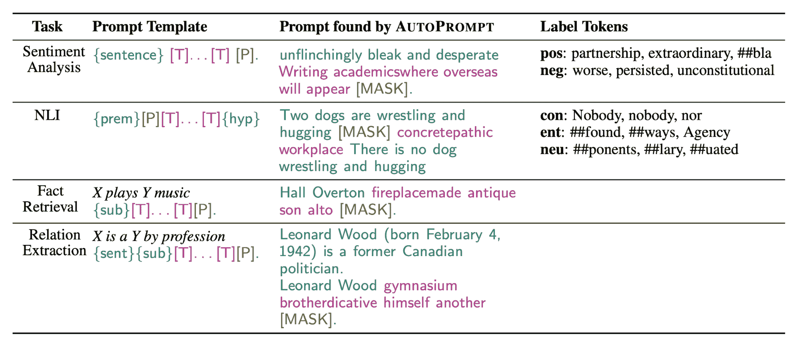

图 8. AutoPrompt 发现的不同任务的示例提示。（图片来源：[Shin et al., 2020](https://arxiv.org/abs/2010.15980)）

聪明的提示设计本质上产生了可以导致期望完成的有效上下文。受到这一观察的启发，[Li & Liang (2021)](https://arxiv.org/abs/2101.00190) 提出了**前缀调整**，它在输入序列的开头分配了少量可训练参数（称为“前缀”）来引导一个语言模型，$[\text{PREFIX}; x; y]$。设$\mathcal{P}_\text{idx}$为前缀索引集合，$\text{dim}(h_i)$为嵌入大小。前缀参数$P_\theta$的维度为$\vert\mathcal{P}_\text{idx}\vert \times \text{dim}(h_i)$，隐藏状态的形式为：

$$ h_i = \begin{cases} P_\theta[i,:], & \text{if }i \in \mathcal{P}_\text{idx}\\ \text{LM}_\phi(z_i, h_{

注意，只有$P_\theta$是可训练的，语言模型参数$\phi$在训练过程中被冻结。

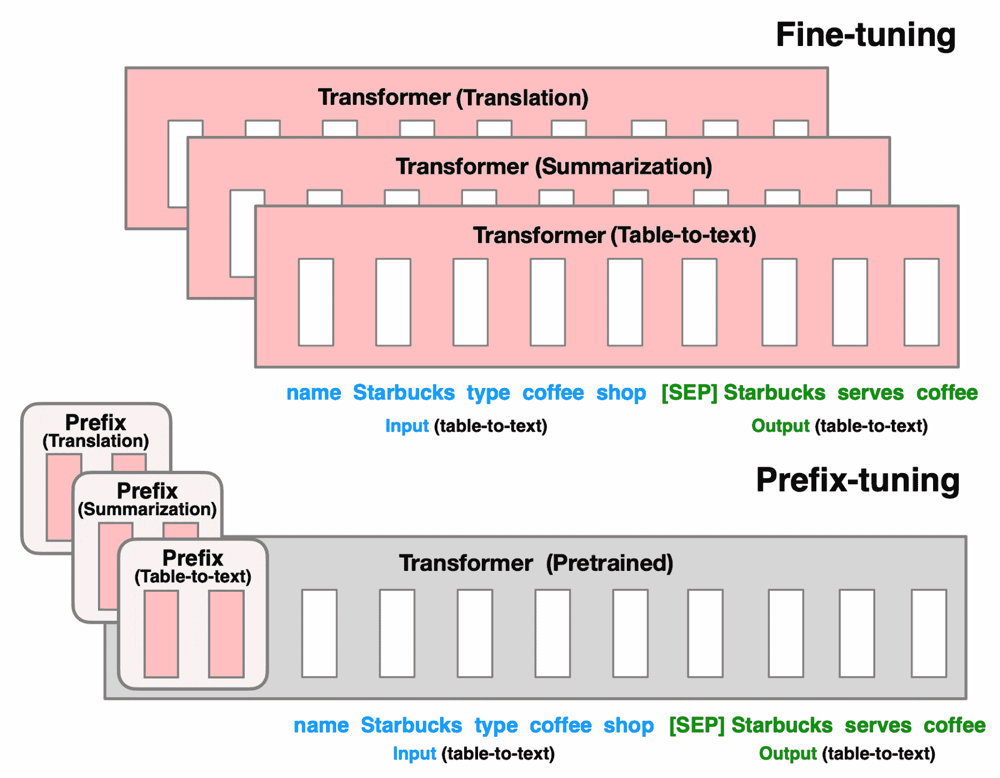

图 9. 微调与前缀调整的示意图。（图片来源：[Li & Liang 2021](https://arxiv.org/abs/2101.00190)）

前缀参数与任何与真实单词相关联的嵌入不相关，因此它们对于引导上下文更具*表现力*。直接优化$P_\theta$不幸地导致性能不佳。为了减少与高维训练相关的困难，矩阵$P_\theta$通过一个较小的矩阵$P’_\theta \in \mathbb{R}^{\vert\mathcal{P}_\text{idx}\vert \times c}$和一个大型前馈网络$\text{MLP}_\theta \in \mathbb{R}^{c\times \text{dim}(h_i)}$重新参数化。

随着前缀长度$\vert\mathcal{P}_\text{idx}\vert$的增加，性能会提高，直到某个值。而这个值会随着任务的不同而变化。

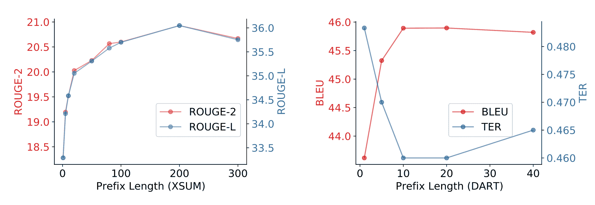

图 10. 任务性能，摘要（左）和表格到文本（右），作为前缀长度的函数。（图片来源：[Li & Liang 2021](https://arxiv.org/abs/2101.00190)）

他们的消融研究中还有一些其他有趣的发现：

+   仅调整嵌入层（没有前缀）的表现不够具有表现力。

+   将可训练参数放置在$x$和$y$之间，$[x; \text{INFIX}; y]$，略微表现不佳于前缀调整，可能是因为它只影响$y$的上下文，而前缀影响两者。

+   $P_\theta$的随机初始化会导致性能低且方差大。相比之下，使用真实单词的激活来初始化$P_\theta$会提高生成效果，即使这些单词与任务无关。

微调模型在任务性能上表现更好，但在数据稀缺的情况下可能会失败。发现 AutoPrompt 和 Prefix-Tuning 在训练数据集较小（即$10²-10³$个样本）的情况下优于微调。作为微调的替代方案，提示设计或学习上下文嵌入成本更低。AutoPrompt 比手动提示大大提高了情感分类的准确性，并实现了与线性探测类似的性能。对于 NLI 任务，AutoPrompt 比线性探测获得更高的准确性。它能够比手动提示更准确地检索事实。在数据稀缺的情况下，Prefix-Tuning 在表格到文本生成和摘要上实现了与微调相媲美的性能。

两个连续的工作，**P-tuning**（[Liu et al. 2021](https://arxiv.org/abs/2103.10385); [code](https://github.com/THUDM/P-tuning)）和**Prompt Tuning**（[Lester et al. 2021](https://arxiv.org/abs/2104.08691)），遵循了显式训练连续提示嵌入的类似思想，但在可训练参数和架构上有一些不同选择。与将连续提示令牌连接在变压器的每个隐藏状态层中的 Prefix-Tuning 不同，P-tuning 和 Prompt Tuning 都是在*输入中*非侵入性地添加连续提示以达到良好效果。

让$[P_i]$表示**P-tuning**（[Liu et al. 2021](https://arxiv.org/abs/2103.10385)）的提示模板中的第$i$个令牌，我们可以将提示表示为序列$T=\{[P_{0:i}], \mathbf{x}, [P_{i+1:m}], \mathbf{y}\}$。每个令牌$[P_i]$不必是模型词汇表中的真实令牌（“伪令牌”），因此编码的模板$T^e$如下所示，伪令牌的隐藏状态可以通过梯度下降进行优化。

$$ T^e = \{ h_0, \dots, h_i, \text{embed}(\mathbf{x}), h_{i+1}, \dots, h_m, \text{embed}(\mathbf{y})\} $$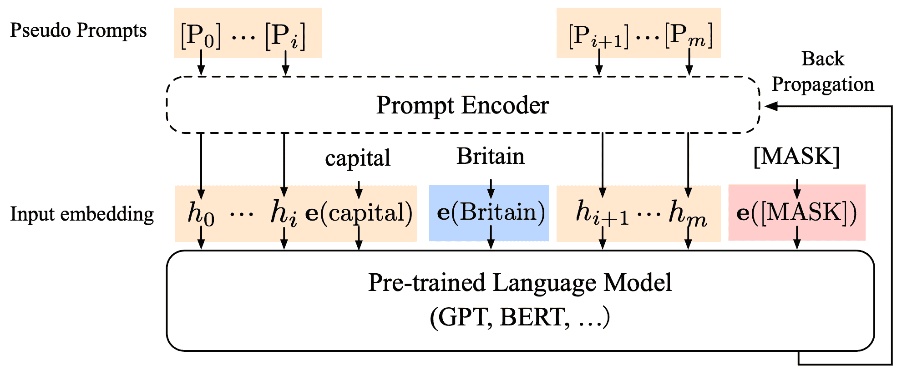

图 11\. P-tuning 的示意图。有时，添加一些与任务相关的锚定令牌，如图中的“capital”，可以带来进一步的改进。（图片来源：[Liu et al. 2021](https://arxiv.org/abs/2103.10385)）

P-tuning 中存在两个主要的优化挑战：

1.  离散性：预训练语言模型的词嵌入是高度离散的。如果它们是随机初始化的，很难优化$h_i$。

1.  关联性：$h_i$应该相互依赖。因此，他们开发了一种机制来通过训练轻量级基于 LSTM 的提示编码器来建模这种依赖关系：

$$ h_i = \text{MLP}([\text{LSTM}(h_{0:i}): \text{LSTM}(h_{i:m})]) $$

P-tuning 比 prefix-tuning 更灵活，因为它不仅在提示开头插入可训练令牌，而且在提示中间插入。使用任务特定的锚定令牌就像将手动提示工程与可训练提示结合在一起。

**提示调整**（[Lester et al. 2021](https://arxiv.org/abs/2104.08691)）大大简化了前缀调整的概念，只允许每个下游任务在输入文本前添加额外的$k$个可调节标记。条件生成是$p_{\theta, \theta_P}(Y \vert [P; X])$，其中$P$是具有可通过反向传播训练的参数$\theta_P$的“伪提示”。$X$和$P$都是嵌入向量，我们有$X \in \mathbb{R}^{n \times d^e}, P \in \mathbb{R}^{k \times d^e}$和$[P;X] \in \mathbb{R}^{(n+k) \times d^e}$，其中$d^e$是嵌入空间的维度。

+   当模型变得*庞大*（数十亿个参数及以上）时，提示调整产生了与模型微调竞争力相当的结果。这一结果尤其有趣，因为大型模型在微调和推理时执行都很昂贵。

+   通过学习的任务特定参数，提示调整在适应新领域时实现更好的迁移学习。在领域转移问题上，它优于微调。

+   他们还表明，对于同一任务的多个提示的提示集成引入了进一步的改进。


图 12\. 提示调整的工作原理示意图。（图片来源：[Lester et al. 2021](https://arxiv.org/abs/2104.08691)）

实验调查了几种提示初始化方案：

1.  随机初始化，从[-0.5, 0.5]均匀采样；

1.  采样前 5000 个常见标记的嵌入；

1.  使用类标签字符串的嵌入值。如果我们没有足够的类标签来初始化软提示，我们将退回到方案 2。随机初始化的表现明显不如其他两个选项。

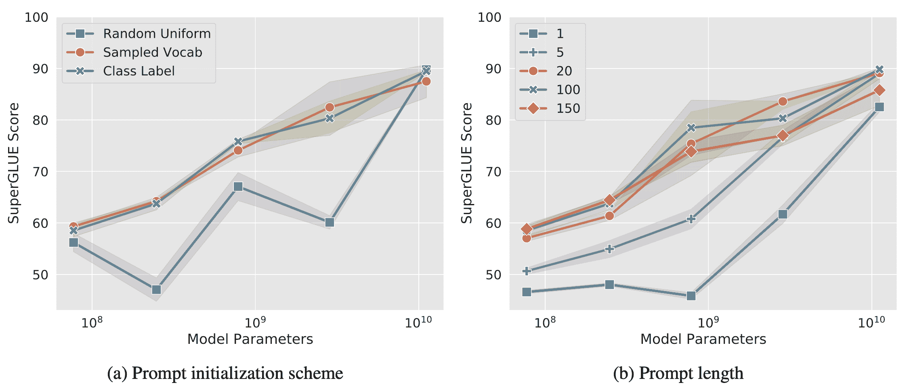

图 13\. (a)不同提示初始化方案和(b)不同提示长度的影响。（图片来源：[Lester et al. 2021](https://arxiv.org/abs/2104.08691)）

预训练目标也对提示调整的质量产生重大影响。T5 的“跨度破坏”在这里不是一个好选择。

发现提示调整不太可能过度拟合特定数据集。为了评估对数据转移问题的鲁棒性，他们在一个任务的一个数据集上训练模型，并在*不同领域*的测试数据集上评估。提示调整更具弹性，能更好地泛化到不同领域。

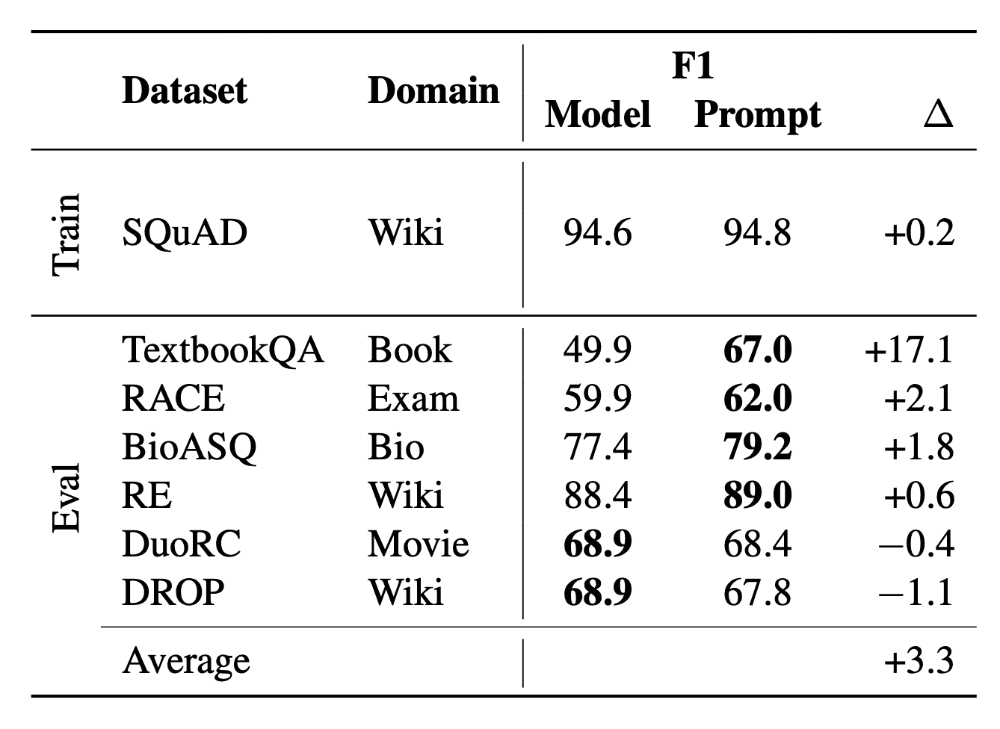

图 14\. 提示调整在训练集和测试集之间的领域转移上更具弹性。（图片来源：[Lester et al. 2021](https://arxiv.org/abs/2104.08691)）

## 基于启发式的搜索

释义是探索更多类似已知版本的提示的快速方法，可以通过*回译*来实现。使用回译，初始提示被翻译成另一种语言中的$B$个候选项，然后每个候选项再被翻译回原始语言中的$B$个候选项。得到的总共$B²$个候选项通过其往返概率进行评分和排名。

[里贝罗等人（2018）](https://www.aclweb.org/anthology/P18-1079/)通过生成输入$x$的各种释义$\{x’\}$来识别*语义等效对手（SEA）*，直到触发目标函数$f$的不同预测：

$$ \begin{aligned} SEA(x, x') &= \mathbb{1}[\text{SemEq}(x, x') \land f(x) \neq f(x')] \\ \text{where SemEq}(x, x') &= \mathbb{1}[\min\Big(1, \frac{p(x'\vert x)}{p(x\vert x)} \Big) \geq \tau] \end{aligned} $$

其中得分$p(x’\vert x)$与将$x$翻译成多种语言，然后再翻译回原始语言成正比。

SEA 规则的示例包括（*What `NOUN`→Which `NOUN`*）、（*`WP` is → `WP`’s’*）、（*was→is*）等。它们被视为模型中的“错误”。在模型训练中将这些规则应用为数据增强有助于使模型更加健壮并修复错误。

[蒋等人（2020）](https://arxiv.org/abs/1911.12543)试图验证训练过的语言模型是否了解某些知识，通过自动发现更好的提示来查询。在知识检索范围内，事实知识以三元组$\langle x, r, y \rangle$（主语，关系，客体）的形式表示。提示可以从训练句子（例如维基百科描述）中挖掘，也可以通过释义进行扩展。

有趣的是，如图 X 所示，提示中的一些小修改可能会带来巨大的收益。

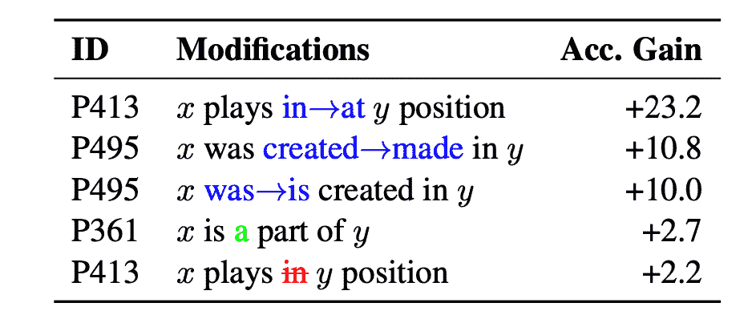

图 15. 在提示模板中进行小的修改可能会导致性能大幅提升：蓝色替换，绿色插入，红色删除。（图片来源：[蒋等人，2020](https://arxiv.org/abs/1911.12543)）

# 微调

微调是引导语言模型输出所需内容的直观方法，通常通过在监督数据集上训练或通过 RL 进行。我们可以微调模型中的所有权重，也可以将微调限制在顶部或额外层。

## 有条件的训练

有条件的训练旨在学习一个以控制变量$z$为条件的生成模型，$p(y \vert x, z)$。

[Fan et al (2018)](https://arxiv.org/abs/1805.04833) 训练了一个用于两步故事生成的条件语言模型。首先，模型输出故事草图，然后一个故事写作模型根据该草图创建故事。在草图上的条件机制是通过*融合*模型架构实现的。融合模型实施了一种*残差学习*形式，允许故事写作模型专注于学习第一个草图生成模型所遗漏的内容。此外，对于故事生成，[Peng et al (2018)](https://www.aclweb.org/anthology/W18-1505/) 尝试了一个以结局情感为条件的故事生成 LM，$p(x_t \vert x_{<t}, z)$，其中 $z$ 是故事结局的标签（悲伤、快乐或中性）。他们的语言模型是一个双向 LSTM，标签被映射到一个学习的嵌入中，然后融入 LSTM 单元中。

**CTRL**（[Keskar et al., 2019](https://arxiv.org/abs/1909.05858); [code](https://github.com/salesforce/ctrl)）旨在训练一个以控制代码 $z$ 为条件的语言模型，使用可控数据集。 CTRL 通过在原始文本序列上训练带有*控制代码前缀*的模型，如 `[horror]`，`[legal]` 等，来学习条件分布 $p(x \vert z)$。然后，学习的模型能够根据提示前缀生成文本。训练数据包括维基百科、OpenWebText、书籍、亚马逊评论、reddit 语料库等，其中每个数据集都分配有一个控制代码，reddit 语料库中的 subreddit 有其自己的主题作为控制代码。

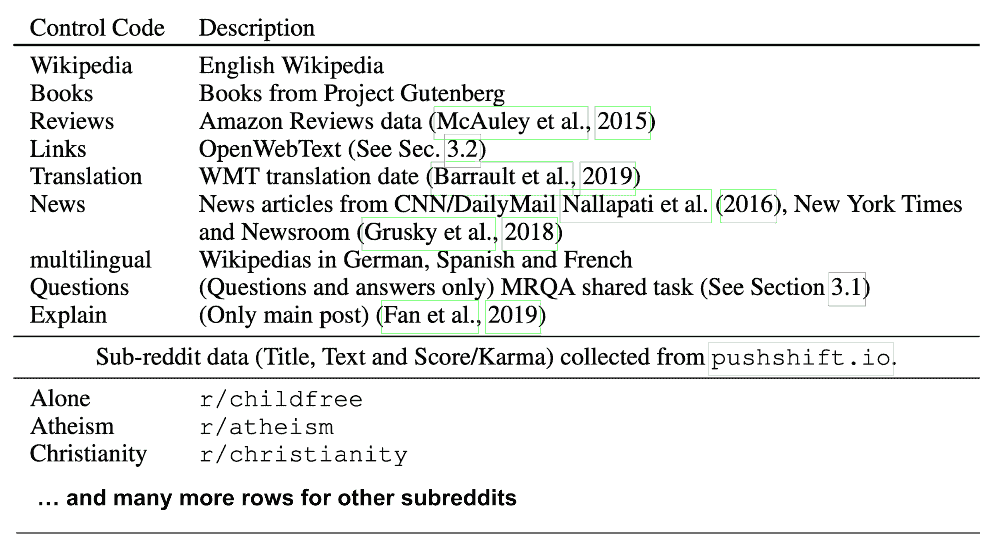

图 16\. 用于训练 CTRL 和相关控制代码的数据集。 (图片来源：[Keskar et al., 2019](https://arxiv.org/abs/1909.05858) 中表 7 的编辑)

控制代码也可以用于给定标记的*领域注释*，因为 $p(z \vert x) \propto p(x \vert z) p(z)$，假设领域的先验分布是均匀的。 CTRL 的一个限制是缺乏对*不生成什么*的控制（例如，避免毒性）。

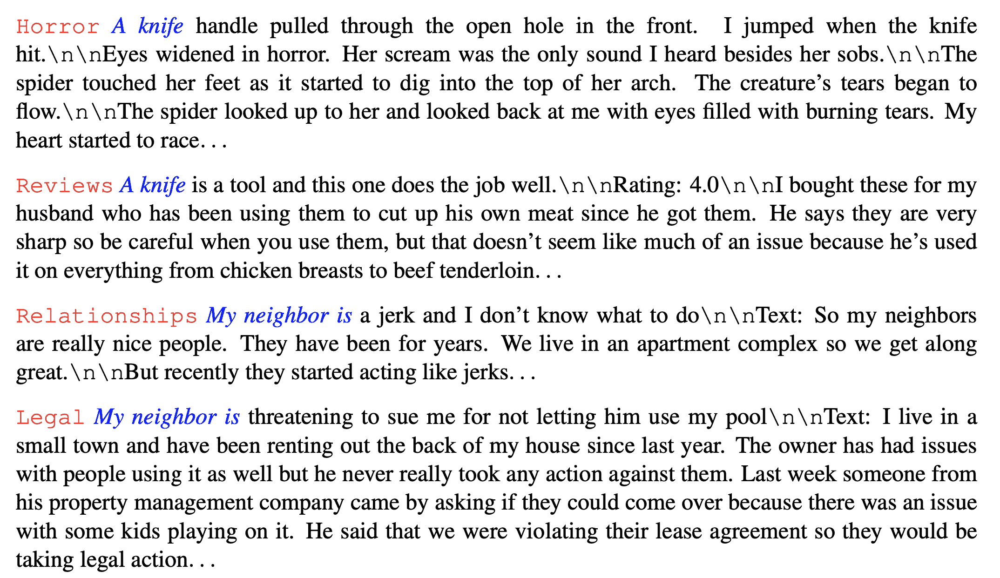

图 17\. CTRL 生成的条件样本示例。 (图片来源：[Keskar et al., 2019](https://arxiv.org/abs/1909.05858))

请注意，CTRL 从头开始训练一个 transformer 模型。然而，将同一数据集中的所有文本标记为相同的控制代码（例如，所有维基百科文章都有“维基百科”作为控制代码）感觉相当受限制。考虑到通常我们需要高度定制的控制代码，但只有有限数量的标记数据，我期望像 CTRL 一样使用小型标记数据集对无条件 LM 进行微调也能取得良好的效果。尽管需要多少数据以及样本质量如何可能需要进行实验。

## 强化学习微调

多年来，使用 RL 针对任意任意可能非可微分奖励函数微调顺序模型已被证明效果良好（[Ranzato et al., 2015](https://arxiv.org/abs/1511.06732)）。RL 微调可以解决*教师强迫*方法的几个问题。使用教师强迫，模型在训练期间仅在每个解码步骤最小化最大似然损失，但在测试时要求从头开始预测整个序列。这种训练和测试之间的差异可能导致曝光偏差和累积误差。相比之下，RL 微调能够直接在序列级别上优化任务特定的度量标准，如翻译中的 BLEU（[Ranzato et al., 2015](https://arxiv.org/abs/1511.06732)、[Wu et al., 2016](https://arxiv.org/abs/1609.08144)、[Nguyen et al., 2017](https://arxiv.org/abs/1707.07402)）、摘要中的 ROUGE（[Ranzato et al., 2015](https://arxiv.org/abs/1511.06732)、[Paulus et al., 2017](https://arxiv.org/abs/1705.04304)、[Wu and Hu, 2018](https://arxiv.org/abs/1804.07036)）以及故事生成中的自定义度量标准（[Tambwekar et al., 2018](https://arxiv.org/abs/1809.10736)）。

[Ranzato et al (2015)](https://arxiv.org/abs/1511.06732)应用 REINFORCE 来训练 RNN 模型进行序列生成任务。该模型首先通过交叉熵损失（ML 损失）训练以预测下一个标记，然后通过 ML 损失和 REINFORCE（RL 损失）交替进行微调。在第二次微调阶段，用于下一个标记预测的训练步骤数量逐渐减少直至为零，最终仅使用 RL 损失。实验证明，这种序列级 RL 微调相对于当时的几个监督学习基线有了很大的改进。

谷歌在他们的神经机器翻译系统中实现了类似的方法（[Wu et al., 2016](https://arxiv.org/abs/1609.08144)），而[Paulus et al (2017)](https://arxiv.org/abs/1705.04304)则采用了这种方法来进行摘要任务。训练目标包含两部分，ML 损失用于下一个标记的预测，$\mathcal{L}_\text{ML} = \sum_{(x, y^*)\sim\mathcal{D}} \log p_\theta(y^* \vert x)$，以及 RL 损失$\mathcal{L}_\text{RL}$用于最大化期望奖励，其中每个序列的奖励由 BLEU 或 ROUGE 来衡量。该模型首先使用$\mathcal{L}_\text{ML}$进行训练直至收敛，然后用两个损失的线性组合进行微调，$\mathcal{L}_\text{mix} = \alpha \mathcal{L}_\text{ML} + (1 - \alpha)\mathcal{L}_\text{RL}$。

谷歌 NMT 的 RL 损失是为了最大化期望的 BLEU 分数：

$$ \mathcal{L}_\text{RL} = - \sum_{(x, y^*)\sim\mathcal{D}} \mathbb{E}_{y\sim p_\theta(.\vert x)} [R(y, y^*)] $$

其中$y$是预测的序列，$y^*$是真实标准。

[Paulus et al (2017)](https://arxiv.org/abs/1705.04304)在基于两个输出序列之间奖励差异的额外加权项上进行了添加，$y$通过根据预测概率采样下一个标记和$\hat{y}$通过贪婪地选择最可能的标记。如果采样序列$y$获得比贪婪基线$\hat{y}$更高的奖励，则这种 RL 损失最大化了采样序列$y$的条件概率：

$$ \mathcal{L}_\text{RL} = \sum_{(x, y^*)\sim\mathcal{D}} (R(\hat{y}, y^*) - R(y, y^*)) \sum_{t=1}^{n'} \log p(y_t \vert y_{

## 使用人类偏好进行 RL 微调

奖励学习对于定义人类偏好至关重要。像 BLEU 或 ROUGE 这样的定量测量计算了序列之间单词和 n-gram 短语的重叠，并不总是与人类评委的更好质量相关。来自人类反馈的奖励学习([Christiano et al., 2017](https://arxiv.org/abs/1706.03741))是将我们测量的内容与我们实际关心的内容对齐的更好方式。人类反馈已被应用于学习应用程序的奖励函数，如故事生成([Yi et al., 2019](https://arxiv.org/abs/1904.13015))和摘要([Böhm et al., 2019](https://arxiv.org/abs/1909.01214), [Ziegler et al., 2019](https://arxiv.org/abs/1909.08593), [Stiennon et al., 2020](https://arxiv.org/abs/2009.01325))。

为了生成更连贯的对话，[Yi et al (2019)](https://arxiv.org/abs/1904.13015)收集了 4 种类型的二进制人类反馈，给定一个对话对（用户话语，系统回应），系统回应是否(1)全面，(2)主题相关，(3)有趣和(4)导致对话继续。评估器被训练以预测人类反馈，然后用于重新排列波束搜索样本，微调模型或两者兼而有之。（实际上，他们没有使用 RL 微调，而是使用评估器在监督微调中提供鉴别器损失。）

让我们定义一个由$\psi$参数化的学习奖励函数$R_\psi(x, y)$，作为给定输入$x$的输出$y$质量的衡量标准。

为了学习由人类判断定义的地面真实奖励$R^*$，[Böhm et al (2019)](https://arxiv.org/abs/1909.01214)比较了两种损失函数：

(1) 回归损失：简单地最小化均方误差。

$$ \mathcal{L}^\text{MSE}_\text{rm} = [R^*(x, y) - R_\psi(x, y)]² $$

(2) 偏好损失：学习与地面真实奖励一致，

$$ \begin{aligned} \mathcal{L}^\text{pref}_\text{rm} =& - \sum_{i,j} \big(\mathbb{1}[R^*(x, y_i) > R^*(x, y_j)] \log P(y_i \succ y_j) + \\ &\mathbb{1}[R^*(x, y_j) > R^*(x, y_i)] \log P(y_j \succ y_i) \big)\\ \text{where }P(y_i \succ y_j) =& \frac{\exp(R_\psi(x, y_i))}{\exp(R_\psi(x, y_i)) + \exp(R_\psi(x, y_j))} \end{aligned} $$

他们的实验表明*偏好损失*取得了最佳性能，其中奖励模型是 BERT 句子嵌入顶部的一层薄 MLP 层。

[Ziegler et al (2019)](https://arxiv.org/abs/1909.08593)通过要求人类从给定输入$x \sim \mathcal{D}$中的几个选项$\{y_i\}$中选择最佳候选$y_b$来收集人类标签。候选项由$y_0, y_1 \sim p(.\vert x), y_2, y_3 \sim \pi(.\vert x)$进行采样。我们应该意识到，当地面真相模糊时，人类标注可能存在很高的分歧。


图 18。使用从人类反馈中学习的奖励微调语言模型策略的训练框架概述。（图片来源：[Ziegler et al., 2019](https://arxiv.org/abs/1909.08593)）

奖励模型由一个预训练语言模型实现，具有额外的最终嵌入输出的随机线性层。它被训练以最小化损失：

$$ \mathcal{L}_\text{rm} = -\mathbb{E}_{(x, \{y_i\}, b) \sim \mathcal{D}} \Big[ \log \frac{\exp(R_\psi(x, y_b))}{\sum_i \exp(R_\psi(x, y_i))} \Big] $$

为了在训练过程中保持尺度一致，奖励模型被归一化为均值为 0，方差为 1。

在强化学习微调期间，由预训练语言模型$p$初始化的策略$\pi$通过[PPO](https://lilianweng.github.io/posts/2018-04-08-policy-gradient/#ppo)与上述学习的奖励模型进行优化。为避免策略偏离其原始行为太多，添加了**KL 惩罚**：

$$ R(x, y) = R_\psi(x, y) - \beta\log\frac{\pi(y \vert x)}{p(y \vert x)} $$

如果进行在线数据收集，人类标签收集过程将在强化学习微调期间继续进行，因此人类标注者可以审查最新策略生成的结果。在训练过程中，人类标签的数量均匀分布。同时，奖励模型也定期重新训练。在线数据收集对摘要任务很重要，但对文本延续任务则不重要。在他们的实验中，共同训练奖励模型和具有共享参数的策略并不奏效，可能会导致由于数据集大小之间的巨大不平衡而过拟合。

在以下工作中（[Stiennon et al., 2020](https://arxiv.org/abs/2009.01325)），人类标签收集进一步简化为在一对摘要中选择最佳选项$y_b \in\{y_0, y_1\}$。奖励模型损失被更新以优化所选摘要的对数几率：

$$ \mathcal{L}_\text{rm} = \mathbb{E}_{(x, y_0, y_1, b)\sim\mathcal{D}} [\log(\sigma(r_\theta(x, y_b) − r_\theta(x, y_{1−b})))] $$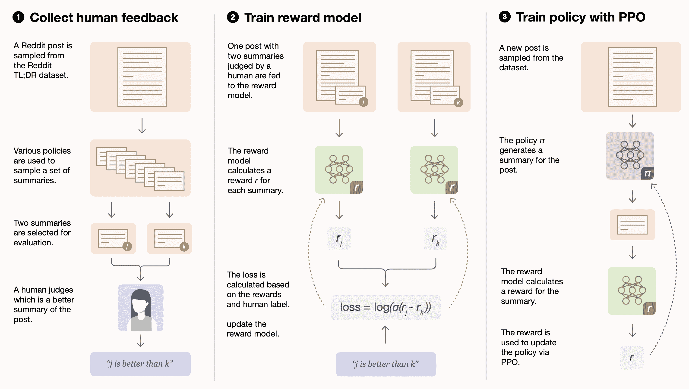

图 19。从人类反馈中微调语言模型策略的概述，包括（1）人类反馈收集，（2）奖励模型训练和（3）策略训练。（图片来源：[Stiennon et al., 2020](https://arxiv.org/abs/2009.01325)）

## 带有可导层的引导微调

而不是微调整个模型，只微调额外的一小组参数，而基本模型保持不变，这在计算上更便宜。

在计算机视觉中，即插即用生成网络（PPGN；[Nguyen 等，2017](https://arxiv.org/abs/1612.00005)）通过将鉴别器$p(a \vert x)$插入基本生成模型$p(x)$来生成具有不同属性的图像。然后，可以从$p(x \vert a) \propto p(a \vert x)p(x)$中采样具有所需属性$a$的样本。受 PPGN 启发，**即插即用语言模型**（**PPLM**；[Dathathri 等，2019](https://arxiv.org/abs/1912.02164)）将一个或多个简单属性模型与预训练语言模型结合起来，用于可控文本生成。

给定属性$a$和生成的样本$x$，让属性模型为$p(a\vert x)$。为了控制内容生成，当前时间$t$的潜在表示$H_t$（每层包含一组键-值对）可以通过$\Delta H_t$向两个梯度的和的方向移动：

+   一种朝着使输出内容获得所需属性$a$在$p(a \vert x)$下更高对数似然的方向——以便输出内容获得所需属性。

+   另一种朝着使未修改的语言模型$p(x)$下更高对数似然的方向——以便生成的文本仍然是流畅和自然的语言。

为了转移输出，在解码时，PPLM 运行一次前向传递→一次后向传递→一次前向传递，总共三次传递：

1.  首先执行前向传递以计算属性$a$的可能性$p(a\vert x)$；

1.  设$\Delta H_t$是隐藏状态$H_t$的逐步更新，使得$(H_t + \Delta H_t)$将生成文本的分布移向具有属性$a$。$\Delta H_t$初始化为零。然后，通过使用属性模型$\nabla_{\Delta H_t} \log p(a \vert H_t + \Delta H_t)$的归一化梯度来更新 LM 隐藏状态的后向传递如下

$$ \Delta H_t \leftarrow \Delta H_t + \alpha \frac{\nabla_{\Delta H_t} \log p(a|H_t + \Delta H_t)}{\| \nabla_{\Delta H_t} \log p(a|H_t + \Delta H_t) \|^\gamma} $$

其中$\gamma$是一个每层设置的归一化缩放系数。$\alpha$是步长。这个更新可以重复$m \in [3, 10]$次。最终的前向传递重新计算从更新的潜在$\tilde{H}_t = H_t + \Delta H_t$生成的词汇分布。下一个标记从更新的分布中采样。

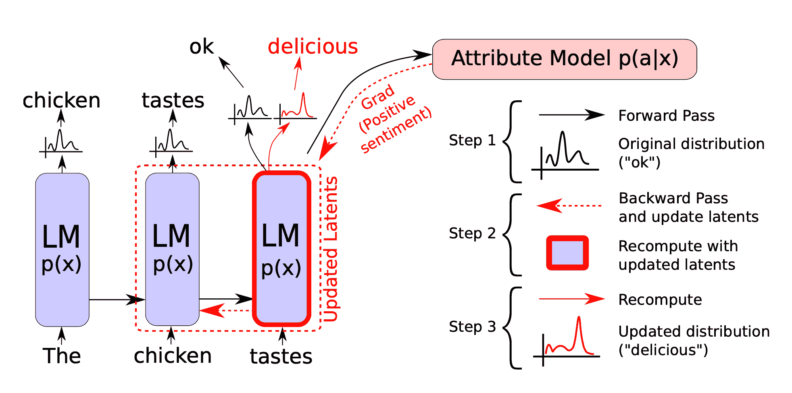

图 20。PPLM 运行三次传递以更新模型输出，增加所需属性的可能性的概述。（图片来源：[Dathathri 等，2019](https://arxiv.org/abs/1912.02164)）

在生成过程中，可以混合匹配多个属性模型，并使用自定义权重，充当一组“控制旋钮”。PPLM 论文探讨了两种属性模型：

1.  最简单的属性模型基于预定义的*词袋*（BoW），$\{w_1, \dots, w_k\}$，指定了感兴趣的主题。

$$ \log p(a \vert x) = \log\big( \sum_{i=1}^k p_{t+1} [w_i] \big) $$

为了鼓励模型至少在某个步骤输出所需的单词，但不是每个步骤都输出，他们通过最大梯度范数对梯度进行归一化。

有趣的是，他们发现增加生成包中单词的概率也会增加生成关于同一主题的*相关*但不完全相同的单词的概率。2\. 判别器属性模型基于学习的分类器，通过分布而不是硬样本定义偏好。

为了确保语言流畅性，PPLM 应用了两个额外的设计：

1.  最小化修改和未修改 LM 之间的 KL 散度，这在其他 RL 微调方法中很常见（见上文）。

1.  它执行[后归一化融合](https://arxiv.org/abs/1809.00125)以始终将生成的文本与无条件 LM $p(x)$ 相关联，$x_{t+1} \sim \frac{1}{\beta}(\tilde{p}_{t+1}^{\gamma_\text{gm}} p_{t+1}^{1-\gamma_\text{gm}})$，其中 $p_{t+1}$ 和 $\tilde{p}_{t+1}$ 分别是未修改和修改后的输出分布。$\beta$ 是一个归一化因子。$\gamma_\text{gm} \in [0.8, 0.95]$ 在前后模型的预测之间取得平衡。

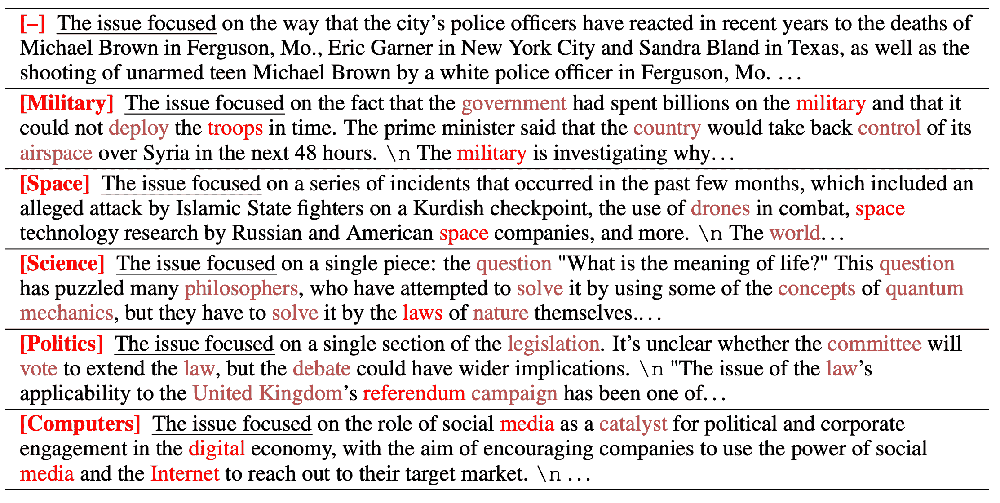

图 21\. PPLM 实现的可控文本生成示例。（图片来源：[Dathathri 等人，2019](https://arxiv.org/abs/1912.02164)）

有趣的是，他们发现在不同主题之间的可控性程度存在很大差异。一些主题（宗教、科学、政治）比其他主题（计算机、空间）更容易控制。

PPLM 的一个明显缺点是由于在每个解码步骤进行多次传递，测试时间计算变得更加昂贵。

与 PPLM 类似，**DELOREAN**（DEcoding for nonmonotonic LOgical REAsoNing；[Qin 等人，2020](https://arxiv.org/abs/2010.05906)）通过反向传播将未来上下文纳入考虑。给定输入文本 $\mathbf{x}$，DELOREAN 旨在生成满足由上下文 $z$ 定义的某些约束的续写完成 $\mathbf{y} = [y_1, \dots, y_N]$。为了保持生成的可微分性，跟踪 $y$ 的软表示，$\tilde{\mathbf{y}}=(\tilde{y}_1, \dots, \tilde{y}_N)$，其中 $\tilde{y}_i \in \mathbb{R}^V$ 是词汇表上的对数。$\tilde{\mathbf{y}}^{(t)}$ 是迭代 $t$ 时的软表示。

给定迭代 $t$ 时的表示 $\tilde{y}^{(t-1)}$，它执行以下过程：

1.  **反向**：约束表示为损失函数 $\mathcal{L}(\mathbf{x}, \tilde{\mathbf{y}}^{(t-1)}, z))$。通过梯度下降更新对数：$\tilde{y}^{(t), b}_n = \tilde{y}_n^{(t-1)} - \lambda \nabla_{\tilde{y}_n} \mathcal{L}(\mathbf{x}, \tilde{\mathbf{y}}^{(t-1)}, z)$。

1.  **正向**：运行正向传递以确保生成的文本流畅。$\tilde{y}^{(t),f}_n = \text{LM}(\mathbf{x}, \tilde{\mathbf{y}}^{(t)}_{1:n-1})$。

1.  然后线性组合两个 logits 以创建一个新的表示$\tilde{y}^{(t)}_n = \gamma \tilde{y}^{(t), f}_n + (1-\gamma) \tilde{y}^{(t), b}_n$。注意，每个$\tilde{y}^{(t)}_n$都需要对下一个$\tilde{y}^{(t),f}_{n+1}$进行采样。

**边缘调整**（[Zhang 等人，2019](https://arxiv.org/abs/1912.13503)）训练一个轻量级的边缘网络，学习在不修改预训练模型权重的情况下在原始模型输出之上学习残差。与 PPLM 不同，隐藏状态上不应用梯度更新。这是一种简单而有效的增量学习方法。基础模型被视为黑盒模型，不一定是神经网络。边缘调整设置假设基础模型和边缘模型接收完全相同的输入，并且边缘模型是独立学习的。


图 22\. 固定权重、微调和边缘调整的比较。（图片来源：[Zhang 等人，2019](https://arxiv.org/abs/1912.13503)）

该论文探讨了融合基础模型和边缘模型预测的不同策略：`product`是最差的，而`sum`（$\alpha$-混合）、MLP 和[FiLM](https://arxiv.org/abs/1709.07871)是可比的。当边缘调整使用中等数量的数据进行训练且基础网络较大时，能够实现更好的性能。

**辅助调整**（[Zeldes 等人，2020](https://arxiv.org/abs/2006.16823)）通过*辅助*模型补充原始预训练模型，根据目标任务调整输出分布。基础模型和辅助模型的输出在 logits 级别上合并。组合模型被训练以最大化目标输出的似然$p(x_t\vert x_{<t}, z)$。

$p(x_t\vert x_{<t}, z)$的条件概率可以分解为两部分：

1.  $p(x_t\vert x_{<t})$为标记流畅序列分配高概率；

1.  将$p(x_t\vert x_{<t})$的偏移转向$p(x_t\vert x_{<t}, z)$。

$$ p(x_t\vert x_{

根据贝叶斯规则，我们有

$$ p(x_t\vert x_{

因此，辅助模型$\text{logits}_\text{aux}(x_t \vert x_{<t}, z))$有效地应该学会预测$p(z \vert x_{\leq t})$。在[Zeldes 等人，2020](https://arxiv.org/abs/2006.16823)的实验中，辅助模型可以重复使用预训练语言模型的中间层进行特征提取。

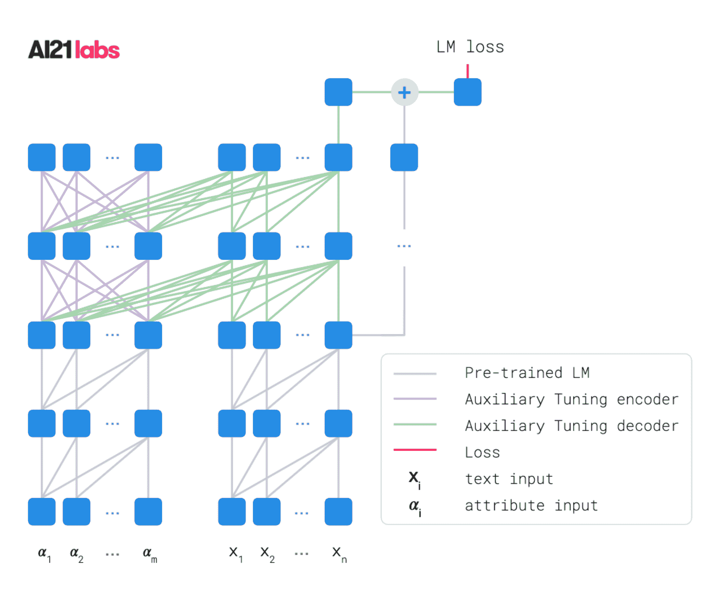

图 23\. 辅助模型通过重用从基础模型的多个层中提取的特征进行训练。（图片来源：[Zeldes 等人，2020](https://arxiv.org/abs/2006.16823)）

**GeDi**（[Kruse et al., 2020](https://arxiv.org/abs/2009.06367)）通过 *生成鉴别器*（Generative Discriminator）指导文本生成。该鉴别器被实现为一个类条件语言模型（CC-LM），$p_\theta(x_{1:t} \vert z)$。鉴别器通过贝叶斯规则计算所有可能的下一个标记的分类概率，通过对 *两个* 对比类条件分布进行归一化来指导每个解码步骤的生成：

1.  一个在所需属性的控制代码 $z$ 上进行条件的。

1.  另一个在反控制代码 $\bar{z}$ 上进行条件的，用于不需要的属性。

GeDi 依赖于 $p_\theta(x_{1:t} \vert z)$ 和 $p_\theta(x_{1:t} \vert \bar{z})$ 之间的对比来计算序列属于所需类别的概率。鉴别器损失是为了最大化所需属性 $z$ 的概率：

$$ \begin{aligned} p_\theta(z \vert x_{1:t}) &= \frac{p(z) p_\theta(x_{1:\tau} \vert z)^{\alpha/\tau}}{\sum_{z' \in \{z, \bar{z}\}} p(z') p_\theta(x_{1:\tau} \vert z')^{\alpha/\tau} } \\ \mathcal{L}_\text{desc} &= -\frac{1}{N} \sum_{i=1}^N \log p_\theta(z^{(i)} \vert x^{(i)}_{1:\tau_i}) \\ &= -\frac{1}{N} \sum_{i=1}^N \log \frac{p(z) p_\theta(x^{(i)}_{1:\tau_i} \vert z^{(i)})^{\alpha/t_i}}{\sum_{z' \in \{z, \bar{z}\} } p(z')p_\theta(x^{(i)}_{1:\tau_i} \vert z')^{\alpha/\tau_i}} \end{aligned} $$

其中 $p(z) = \exp(b_z) / \sum_{z’} \exp(b_{z’})$，$b_z$ 是一个学习到的类先验。概率通过当前序列长度 $\tau$ 进行归一化，以增强可变长度生成序列的鲁棒性。$\tau_i$ 是数据集中第 $i$ 个输入 $x^{(i)}$ 的序列长度。

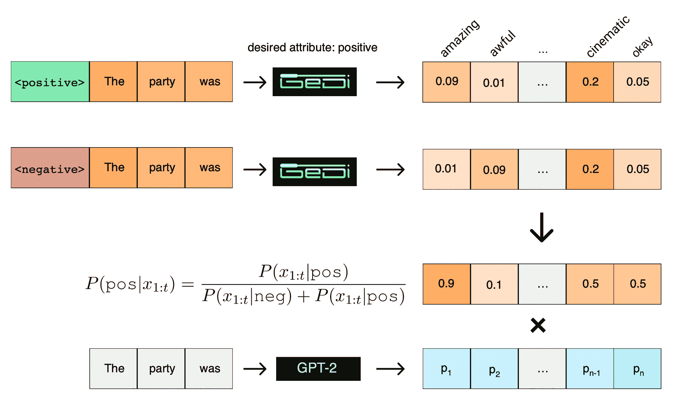

图 24\. 通过贝叶斯规则展示 GeDi 的工作原理。（图片来源：[Kruse et al., 2020](https://arxiv.org/abs/2009.06367)）

他们对一个类似于 CTRL 训练的控制代码进行了微调的 GPT2-medium 模型，以形成一个使用鉴别损失和生成损失的线性组合的类条件语言模型（CC-LM）。然后将这个鉴别器模型用作 GiDe，通过类似于 GPT2-XL 这样的更大语言模型来指导生成。

从 GeDi 解码的一种方式是从加权后验中进行采样 $p^w(x_{t+1}\vert x_{1:t}, z) \propto p(z \vert x_{1:t+1})^w p(x_{t+1} \vert x_{1:t})$，其中 $w>1$ 对所需类别 $z$ 应用额外偏向。在采样过程中，只选择具有大于一定阈值的类别或下一个标记概率的标记。

他们在实验中展示的 GeDi 指导生成表现出很强的可控性，并且比 PPLM 快 30 倍。

## 分布式方法

**分布式控制生成**（GDC；[Khalifa, et al. 2020](https://arxiv.org/abs/2012.11635)）将受控文本生成框架化为带有约束的概率分布的优化。它包括两个主要步骤。

**步骤 1：学习目标模型的 EBM**

让我们将预训练的语言模型标记为$a$，将具有所需特征的目标语言模型标记为$p$。所需特征可以由一组预定义的实值特征函数$\phi_i(x), i=1,\dots,k$定义在$x \in X$上，表示为向量$\boldsymbol{\phi}$。当根据所需模型$p$对序列$x \in X$进行采样时，特征的期望$\mathbb{E}_{x\sim p}\boldsymbol{\phi}(x)$应该接近$\bar{\boldsymbol{\mu}}$，称为“*矩约束*”。特征函数$\phi_i$可以具有不同的值（例如，对于二元分类器的恒等函数）或连续概率。同时，微调模型$p$不应该与$a$相差太远，通过保持较小的 KL 散度度量。

总之，给定一个预训练模型$a$，我们希望找到一个目标模型$p$，使得：

$$ \begin{aligned} \bar{\boldsymbol{\mu}} &= \mathbb{E}_{x\sim p}\boldsymbol{\phi}(x) \\ p &= \arg\min_{c \in \mathcal{C}} D_\text{KL}(c, a) \end{aligned} $$

其中$\mathcal{C}$是满足矩约束的所有分布集合。

根据信息几何学中的定理，$p$可以通过形式为指数函数的 EBM（基于能量的模型；未归一化的概率分布）$P$来近似，使得$p(x) \propto P(x)$和$p(x)=\frac{1}{Z}P(x)$，其中$Z=\sum_x P(x)$。EBM 可以通过以下方式近似：

$$ P(x)=a(x)\exp\big(\sum_i \lambda_i \phi_i(x)\big)=a(x)\exp(\boldsymbol{\lambda}\cdot\boldsymbol{\phi}(x)) $$

让我们定义*重要权重* $w(x, \boldsymbol{\lambda}) = \frac{P(x)}{a(x)} = \exp\langle\boldsymbol{\lambda}\cdot\boldsymbol{\phi}(x)\rangle$。给定从预训练模型中采样的大量序列$x_1, \dots, x_N \sim a(x)$，

$$ \begin{aligned} \mu(\boldsymbol{\lambda}) &= \mathbb{E}_{x\sim p}\boldsymbol{\phi}(x) = \mathbb{E}_{x\sim a} \frac{p(x)}{a(x)}\boldsymbol{\phi}(x) = \frac{1}{Z}\mathbb{E}_{x\sim a} w(x, \boldsymbol{\lambda}) \boldsymbol{\phi}(x) \\ &= \frac{\mathbb{E}_{x\sim a} w(x, \boldsymbol{\lambda}) \boldsymbol{\phi}(x)}{\sum_{x\in X} P(x)} = \frac{\mathbb{E}_{x\sim a} w(x, \boldsymbol{\lambda}) \boldsymbol{\phi}(x)}{\sum_{x\in X} w(x, \boldsymbol{\lambda})a(x)} = \frac{\mathbb{E}_{x\sim a} w(x, \boldsymbol{\lambda}) \boldsymbol{\phi}(x)}{\mathbb{E}_{x\sim a} w(x, \boldsymbol{\lambda})} \\ &\simeq \frac{\sum_{i=1}^N w(x_i,\boldsymbol{\lambda}) \boldsymbol{\phi}(x_i)}{\sum_{i=1}^N w(x_i, \boldsymbol{\lambda})} = \frac{\sum_{i=1}^N \exp\langle\boldsymbol{\lambda}\cdot\boldsymbol{\phi}(x)\rangle \boldsymbol{\phi}(x_i)}{\sum_{i=1}^N \exp\langle\boldsymbol{\lambda}\cdot\boldsymbol{\phi}(x)\rangle} \end{aligned} $$

使用目标函数$|\boldsymbol{\mu}(\boldsymbol{\lambda}) - \bar{\boldsymbol{\mu}}|²_2$上的 SGD，我们可以得到$\boldsymbol{\lambda}$的估计值和$P(x)=a(x)\exp\langle\boldsymbol{\lambda}\cdot\boldsymbol{\phi}(x)\rangle$的表示。$P(x)$是一个序列 EBM，因为$a$是一个自回归模型。

**步骤 2：学习目标概率分布**

EBM $P(x)$ 可以计算两个序列概率的比率，但不能在知道 $Z$ 的情况下从 $p(x)$ 中采样。为了从序列 EBM 中采样，论文提出使用 [分布策略梯度](https://arxiv.org/abs/1912.08517)（DPG；但不是这个 [DPG](https://lilianweng.github.io/posts/2018-04-08-policy-gradient/#dpg)）来获得一个自回归策略 $\pi_\theta$，通过最小化交叉熵 $H(p, \pi_\theta)$ 来逼近目标分布 $p$。DPG 经过一系列迭代。在每次迭代中，提出的分布 $q$ 用于采样，我们也可以用重要性权重来校正交叉熵损失：

$$ \begin{aligned} \nabla_\theta H(p, \pi_\theta) &= - \nabla_\theta \mathbb{E}_{x\sim p} \log \pi_\theta(x) = - \mathbb{E}_{x\sim p} \nabla_\theta \log \pi_\theta(x) \\ &= - \mathbb{E}_{x\sim q} \frac{p(x)}{q(x)} \nabla_\theta \log \pi_\theta(x) = - \frac{1}{Z}\mathbb{E}_{x\sim q} \frac{P(x)}{q(x)} \nabla_\theta \log \pi_\theta(x) \end{aligned} $$

为了学习这样一个 $\pi_\theta$，论文采用了 KL 自适应版本的 DPG：只有在估计的策略 $\pi_\theta$ 接近 $p$ 时才更新 $q$。这种自适应步骤对于快速收敛很重要。


图 25\. 分布策略梯度算法，使得从 EBM $P(x)$ 中采样成为可能，其中 $q$ 初始化为 $a$。（图片来源：[Khalifa, et al. 2020](https://arxiv.org/abs/2012.11635)）

这种方法可以用于建模可控文本生成中的各种约束：

1.  点对点约束：$\phi_i$ 是一个二元特征；例如，约束单词的存在或缺失，或基于分类器的约束。

1.  分布约束：$\phi_i$ 表示一个概率分布；例如，约束性别、主题等的概率。他们的实验显示，在训练于维基百科传记语料库的 GPT-2 模型中，去偏见取得了巨大进展。生成的女性传记的比例从 7.4% 增加到 35.6%。

1.  混合约束：通过简单求和结合多个约束。


图 26\. 使用各种约束进行去偏见实验的 GDC。（图片来源：[Khalifa, et al. 2020](https://arxiv.org/abs/2012.11635)）

与其他基线相比，使用点对点约束的 GDC 与基准模型 $a$ 的偏离较小，并产生更平滑的曲线。


图 27\. 将点对点约束的 GDC 与几个基线进行比较。低 Self-BLEU-5 和高 Dist-1 表示高多样性。（图片来源：[Khalifa, et al. 2020](https://arxiv.org/abs/2012.11635)）

+   直接优化奖励 $\phi$（图 X 中的 $\text{REINFORCE}$）而没有约束的 REINFORCE 收敛速度快，但与原始模型的偏差较大。

+   优化$P(x)$（$\text{REINFORCE}_{P(x)}$在图 X 中）的 REINFORCE 具有较低的样本多样性。

+   与[Ziegler 等人，2019 年](https://arxiv.org/abs/1909.08593)相比，GDC 具有更平滑的学习曲线，并产生更丰富的词汇。

## 不可能性训练

在语言模型训练中，通过最大化对数似然损失的标准方法会导致不正确的标记分布，这不能仅通过智能解码方法来修复。这种模型往往会过于频繁地输出高频词汇，而很少输出低频词汇，特别是在使用确定性解码（例如贪婪、波束搜索）时。换句话说，它们对自己的预测过于自信。

不可能性训练（[Welleck & Kulikov 等人，2019 年](https://arxiv.org/abs/1908.04319)）试图解决这个问题，并将对*不需要的*内容的偏好直接纳入训练目标中。它结合了两种更新：

+   一种常规的最大似然更新，为真实标记分配高概率；

+   一种新型的不可能性更新，以避免高概率的不需要的标记。

给定一系列标记$(x_1, \dots, x_T)$和步骤$t$处的一组负候选标记$\mathcal{C}^t = \{c_1, \dots , c_m\}$，其中每个标记$x_i, c_j \in \mathcal{V}$，步骤$t$的组合损失定义如下：

$$ \mathcal{L}^t_\text{UL}(p_\theta (. \vert x_{

构建$\mathcal{C}^t$的一种方法是从模型生成的序列中随机选择候选项。

不可能性训练可以扩展到*序列*级别，其中负继续由每步负候选集合序列定义。它们应该被设计为惩罚我们不喜欢的属性。例如，我们可以如下惩罚重复的 n-gram：

$$ \mathcal{C}^t_\text{repeat-n} = \{x_t\} \text{ if }(x_{t-i}, \dots, x_{t+j}) \in x_{

他们的实验使用不可能性训练来避免语言模型输出中的重复，并确实显示出与标准 MLE 训练相比，重复较少且唯一标记更多的更好结果。 

# 引用

被引用为：

> Weng，Lilian。 （2021 年 1 月）。可控神经文本生成。Lil’Log。 https://lilianweng.github.io/posts/2021-01-02-controllable-text-generation/。

或

```py
@article{weng2021conditional,
  title   = "Controllable Neural Text Generation.",
  author  = "Weng, Lilian",
  journal = "lilianweng.github.io",
  year    = "2021",
  month   = "Jan",
  url     = "https://lilianweng.github.io/posts/2021-01-02-controllable-text-generation/"
} 
```

# 参考文献

[1] Patrick von Platen。[“如何生成文本：使用不同的解码方法进行变压器语言生成”](https://huggingface.co/blog/how-to-generate) Hugging face 博客，2020 年 3 月 18 日。

[2] Angela Fan 等人。[“分层神经故事生成”](https://arxiv.org/abs/1805.04833) arXiv 预印本 arXiv:1805.04833 (2018)。

[3] Ari Holtzman 等人。[“神经文本退化的好奇案例。”](https://arxiv.org/abs/1904.09751) ICLR 2020。

[4] Marjan Ghazvininejad 等人。[“Hafez：一个交互式诗歌生成系统。”](https://www.aclweb.org/anthology/P17-4008) ACL 2017。

[5] Ari Holtzman 等人。[“学习与合作鉴别器写作。”](https://arxiv.org/abs/1805.06087) ACL 2018。

[6] Ashutosh Baheti 等人 [“通过分布约束在神经对话模型中生成更有趣的回复。”](https://arxiv.org/abs/1809.01215) EMNLP 2018.

[7] 顾家涛等人 [“神经机器翻译的可训练贪婪解码。”](https://arxiv.org/abs/1702.02429) EMNLP 2017.

[8] Kyunghyun Cho. [“用于条件递归语言模型的嘈杂并行近似解码。”](https://arxiv.org/abs/1605.03835) arXiv 预印本 arXiv:1605.03835\. (2016).

[9] Marco Tulio Ribeiro 等人 [“用于调试 NLP 模型的语义等效对抗规则。”](https://www.aclweb.org/anthology/P18-1079/) ACL 2018.

[10] Eric Wallace 等人 [“用于攻击和分析 NLP 的通用对抗触发器。”](https://arxiv.org/abs/1908.07125) EMNLP 2019\. [[code](https://github.com/Eric-Wallace/universal-triggers)]

[11] Taylor Shin 等人 [“AutoPrompt: 通过自动生成提示从语言模型中引出知识。”](https://arxiv.org/abs/2010.15980) EMNLP 2020\. [[code](http://ucinlp.github.io/autoprompt)]

[12] 蒋正宝等人 [“我们如何知道语言模型知道什么？”](https://arxiv.org/abs/1911.12543) TACL 2020.

[13] 彭南云等人 [“可控故事生成的探索。”](https://www.aclweb.org/anthology/W18-1505/) NAACL 2018.

[14] Nitish Shirish Keskar 等人 [“CTRL：用于可控生成的条件变压器语言模型”](https://arxiv.org/abs/1909.05858) arXiv 预印本 arXiv:1909.05858 (2019).[[code](https://github.com/salesforce/ctrl)]

[15] Marc’Aurelio Ranzato 等人 [“使用循环神经网络进行序列级训练。”](https://arxiv.org/abs/1511.06732) ICLR 2016.

[16] Yonghui Wu 等人 [“谷歌的神经机器翻译系统：弥合人类和机器翻译之间的差距。”](https://arxiv.org/abs/1609.08144) CoRR 2016.

[17] Romain Paulus 等人 [“用于抽象摘要的深度强化模型。”](https://arxiv.org/abs/1705.04304) ICLR 2018.

[18] Paul Christiano 等人 [“从人类偏好中进行深度强化学习。”](https://arxiv.org/abs/1706.03741) NIPS 2017.

[19] Sanghyun Yi 等人 [“利用自动对话评估器进行连贯而引人入胜的口语对话响应生成。”](https://arxiv.org/abs/1904.13015) INLG 2019.

[20] Florian Böhm 等人 [“更好的奖励带来更好的摘要：学习在没有参考文献的情况下进行摘要。”](https://arxiv.org/abs/1909.01214) EMNLP 2019\. [[code](https://github.com/yg211/summary-reward-no-reference)]

[21] Daniel M Ziegler 等人 [“从人类偏好中微调语言模型。”](https://arxiv.org/abs/1909.08593) arXiv 预印本 arXiv:1909.08593 (2019). [[code](https://github.com/openai/lm-human-preferences)]

[22] Nisan Stiennon 等人 [“从人类反馈中学习总结。”](https://arxiv.org/abs/2009.01325) arXiv 预印本 arXiv:2009.01325 (2020).

[23] Sumanth Dathathri 等人 [“即插即用语言模型：一种简单的受控文本生成方法。”](https://arxiv.org/abs/1912.02164) ICLR 2020\. [[code](https://github.com/uber-research/PPLM)]

[24] Jeffrey O Zhang 等人 [“侧调整：通过附加侧网络进行网络适应”](https://arxiv.org/abs/1912.13503) ECCV 2020.

[25] Ben Kruse 等人 [“GeDi：生成鉴别器引导的序列生成。”](https://arxiv.org/abs/2009.06367) arXiv 预印本 arXiv:2009.06367.

[26] Yoel Zeldes 等人 [“技术报告：辅助调整及其在条件文本生成中的应用。”](https://arxiv.org/abs/2006.16823) arXiv 预印本 arXiv:2006.16823.

[27] Thomas Scialom 等人 [“用于抽象摘要的判别式对抗搜索”](https://arxiv.org/abs/2002.10375) ICML 2020.

[28] Clara Meister 等人 [“如果束搜索是答案，问题是什么？”](https://arxiv.org/abs/2010.02650) EMNLP 2020.

[29] Xiang Lisa Li 和 Percy Liang. [“前缀调整：优化连续提示以进行生成。”](https://arxiv.org/abs/2101.00190) arXiv 预印本 arXiv:2101.00190 (2021).

[30] Lianhui Qin 等人 [“回到未来：无监督反向传播解码用于反事实和推理常识推理。”](https://arxiv.org/abs/2010.05906) arXiv 预印本 arXiv:2010.05906 (2020).

[31] Muhammad Khalifa 等人 [“一种分布式方法用于受控文本生成”](https://arxiv.org/abs/2012.11635) ICLR 2021 接受.

[32] Aditya Grover 等人 [“使用无似然重要性加权对学习生成模型进行偏差校正。”](https://arxiv.org/abs/1906.09531) NeuriPS 2019.

[33] Yuntian Deng 等人 [“基于残余能量的文本生成模型。”](https://arxiv.org/abs/2004.11714) ICLR 2020.

[34] Brian Lester 等人 [“参数高效提示调整的规模优势。”](https://arxiv.org/abs/2104.08691) arXiv 预印本 arXiv:2104.08691 (2021).

[35] Xiao Liu 等人 [“GPT 也能理解。”](https://arxiv.org/abs/2103.10385) arXiv 预印本 arXiv:2103.10385 (2021).

[36] Welleck & Kulikov 等人 [“使用不可能性训练的神经文本生成”](https://arxiv.org/abs/1908.04319) arXiv:1908.04319 (2019).

+   [nlp](https://lilianweng.github.io/tags/nlp/)

+   [language-model](https://lilianweng.github.io/tags/language-model/)

+   [alignment](https://lilianweng.github.io/tags/alignment/)

+   [steerability](https://lilianweng.github.io/tags/steerability/)

+   [reinforcement-learning](https://lilianweng.github.io/tags/reinforcement-learning/)

+   [long-read](https://lilianweng.github.io/tags/long-read/)

[«

减少语言模型中的毒性](https://lilianweng.github.io/posts/2021-03-21-lm-toxicity/) [»

如何构建一个开放领域问答系统？](https://lilianweng.github.io/posts/2020-10-29-odqa/)[](https://twitter.com/intent/tweet/?text=可控神经文本生成&url=https%3a%2f%2flilianweng.github.io%2fposts%2f2021-01-02-controllable-text-generation%2f&hashtags=nlp%2clanguage-model%2calignment%2csteerability%2creinforcement-learning%22%2clong-read)[](https://www.linkedin.com/shareArticle?mini=true&url=https%3a%2f%2flilianweng.github.io%2fposts%2f2021-01-02-controllable-text-generation%2f&title=可控神经文本生成&summary=可控神经文本生成&source=https%3a%2f%2flilianweng.github.io%2fposts%2f2021-01-02-controllable-text-generation%2f)[](https://reddit.com/submit?url=https%3a%2f%2flilianweng.github.io%2fposts%2f2021-01-02-controllable-text-generation%2f&title=可控神经文本生成)[](https://facebook.com/sharer/sharer.php?u=https%3a%2f%2flilianweng.github.io%2fposts%2f2021-01-02-controllable-text-generation%2f)[](https://api.whatsapp.com/send?text=可控神经文本生成%20-%20https%3a%2f%2flilianweng.github.io%2fposts%2f2021-01-02-controllable-text-generation%2f)[](https://telegram.me/share/url?text=可控神经文本生成&url=https%3a%2f%2flilianweng.github.io%2fposts%2f2021-01-02-controllable-text-generation%2f)© 2024 [Lil'Log](https://lilianweng.github.io/) Powered by [Hugo](https://gohugo.io/) & [PaperMod](https://git.io/hugopapermod)[](#top "返回顶部 (Alt + G)")
