# 神经架构搜索

> 原文：[`lilianweng.github.io/posts/2020-08-06-nas/`](https://lilianweng.github.io/posts/2020-08-06-nas/)

尽管大多数流行和成功的模型架构是由人类专家设计的，但这并不意味着我们已经探索了整个网络架构空间并确定了最佳选项。如果我们采用系统化和自动化的方式学习高性能模型架构，我们将有更好的机会找到最佳解决方案。

自动学习和演化网络拓扑结构并不是一个新的想法（[Stanley & Miikkulainen, 2002](http://nn.cs.utexas.edu/downloads/papers/stanley.ec02.pdf)）。近年来，[Zoph & Le 2017](https://arxiv.org/abs/1611.01578)和[Baker et al. 2017](https://arxiv.org/abs/1611.02167)的开创性工作引起了许多人对神经架构搜索（NAS）领域的关注，提出了许多有趣的想法，以实现更好、更快和更具成本效益的 NAS 方法。

当我开始研究 NAS 时，我发现[Elsken, et al 2019](https://arxiv.org/abs/1808.05377)的这篇很好的调查对我很有帮助。他们将 NAS 描述为一个具有三个主要组成部分的系统，这在其他 NAS 论文中也是常见的。

1.  **搜索空间**：NAS 搜索空间定义了一组操作（例如卷积、全连接、池化）以及如何连接这些操作以构建有效的网络架构。搜索空间的设计通常涉及人类专业知识，同时也不可避免地存在人类偏见。

1.  **搜索算法**：NAS 搜索算法对网络架构候选人群进行采样。它接收子模型性能指标作为奖励（例如高准确性、低延迟），并优化以生成高性能的架构候选人。

1.  **评估策略**：我们需要测量、估计或预测大量提出的子模型的性能，以便为搜索算法提供反馈以学习。候选模型评估的过程可能非常昂贵，因此提出了许多新方法来节省时间或计算资源。

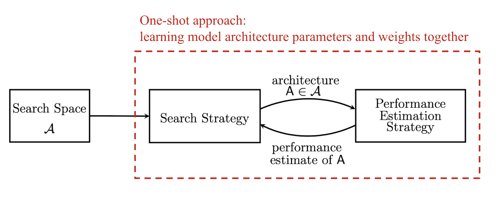

图 1\. 神经架构搜索（NAS）模型的三个主要组成部分。（图片来源：[Elsken, et al. 2019](https://arxiv.org/abs/1808.05377)，标注为红色）

# 搜索空间

NAS 搜索空间定义了一组基本网络操作以及如何连接这些操作以构建有效的网络架构。

## 顺序逐层操作

设计神经网络架构搜索空间最朴素的方法是用一系列*顺序逐层操作*来描述网络拓扑结构，无论是 CNN 还是 RNN，正如[Zoph & Le 2017](https://arxiv.org/abs/1611.01578)和[Baker et al. 2017](https://arxiv.org/abs/1611.02167)的早期工作所示。网络表示的序列化需要相当多的专业知识，因为每个操作都与不同的层特定参数相关联，这些关联需要硬编码。例如，在预测`conv`操作后，模型应输出内核大小、步幅大小等；或者在预测`FC`操作后，我们需要看到下一个预测的单元数。

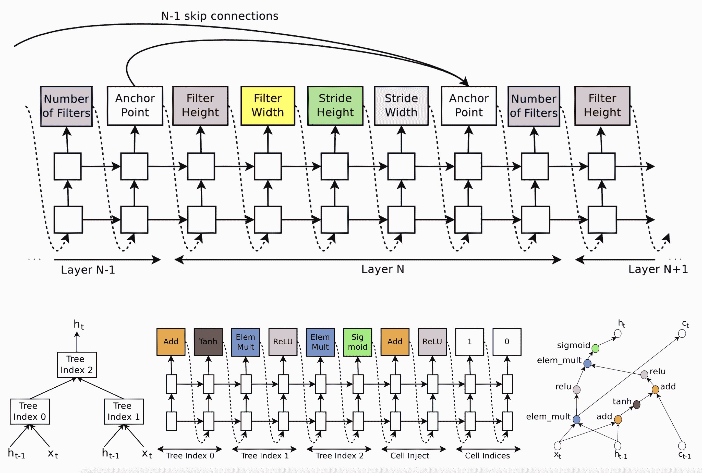

图 2\.（顶部）CNN 的顺序表示。（底部）递归单元树结构的顺序表示。（图片来源：[Zoph & Le 2017](https://arxiv.org/abs/1611.01578)）

为确保生成的架构有效，可能需要额外的规则（[Zoph & Le 2017](https://arxiv.org/abs/1611.01578)）：

+   如果一层没有连接到任何输入层，则将其用作输入层；

+   在最终层，取所有未连接的层输出并连接它们；

+   如果一层有多个输入层，则所有输入层在深度维度上连接；

+   如果要连接的输入层大小不同，我们用零填充小层，以使连接的层具有相同的大小。

跳跃连接也可以被预测，使用类似[注意力](https://lilianweng.github.io/posts/2018-06-24-attention/)的机制。在第$i$层，添加一个锚点和$i−1$个基于内容的 sigmoid，指示要连接的前几层。每个 sigmoid 以当前节点的隐藏状态$h_i$和$i-1$个先前节点$h_j, j=1, \dots, i-1$作为输入。

$$ P(\text{第 j 层是第 i 层的输入}) = \text{sigmoid}(v^\top \tanh(\mathbf{W}_\text{prev} h_j + \mathbf{W}_\text{curr} h_i)) $$

顺序搜索空间具有很强的表示能力，但非常庞大，需要大量计算资源来穷尽搜索空间。在[Zoph & Le 2017](https://arxiv.org/abs/1611.01578)的实验中，他们并行运行了 800 个 GPU，持续 28 天，而[Baker et al. 2017](https://arxiv.org/abs/1611.02167)将搜索空间限制为最多包含 2 个`FC`层。

## 基于单元的表示方式

受到成功视觉模型架构中重复模块设计的启发（例如 Inception，ResNet），*NASNet 搜索空间*（[Zoph 等人 2018](https://arxiv.org/abs/1707.07012)）将卷积网络的架构定义为同一单元多次重复，并且每个单元包含由 NAS 算法预测的多个操作。设计良好的单元模块能够在数据集之间实现可转移性。通过调整单元重复次数，也可以轻松调整模型大小。

精确地说，NASNet 搜索空间学习网络构建的两种类型的单元：

1.  *普通单元*：输入和输出特征图具有相同的维度。

1.  *减少单元*：输出特征图的宽度和高度减半。

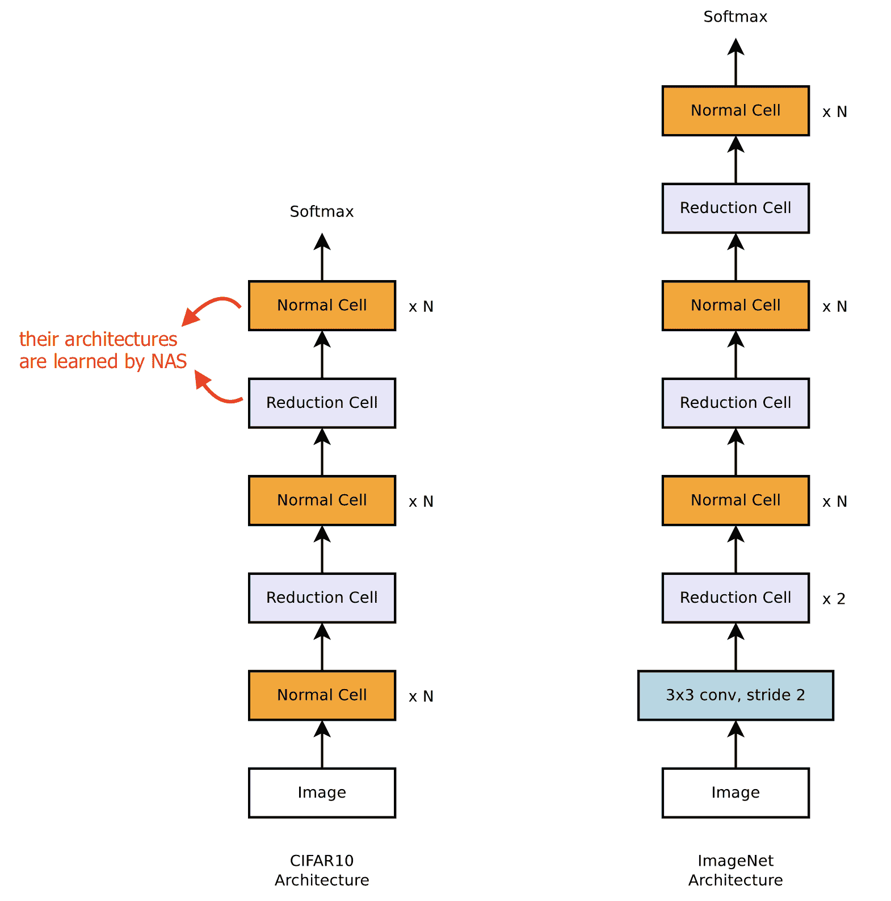

图 3\. NASNet 搜索空间将架构约束为单元的重复堆叠。通过 NAS 算法优化单元架构。（图片来源：[Zoph 等人 2018](https://arxiv.org/abs/1707.07012))

每个单元的预测被分组为$B$个块（在 NASNet 论文中$B=5$），每个块由 5 个预测步骤组成，由 5 个不同的 softmax 分类器进行预测，对应于块中元素的离散选择。请注意，NASNet 搜索空间中的单元之间没有残差连接，模型仅在块内自行学习跳过连接。

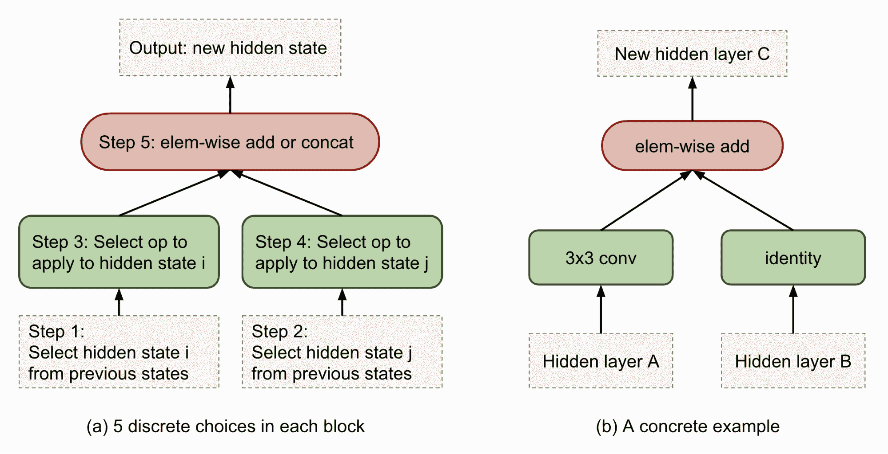

图 4\. (a) 每个单元包含$B$个块，每个块由 5 个离散决策预测。 (b) 每个决策步骤中可以选择哪些操作的具体示例。

在实验中，他们发现[*DropPath*](https://arxiv.org/abs/1605.07648)的修改版本，称为*ScheduledDropPath*，显著提高了 NASNet 实验的最终性能。DropPath 随机丢弃路径（即 NASNet 中附有操作的边缘）的概率固定。ScheduledDropPath 是在训练期间路径丢弃概率线性增加的 DropPath。

[Elsken 等人（2019）](https://arxiv.org/abs/1808.05377)指出 NASNet 搜索空间的三个主要优势：

1.  搜索空间大小大大减小；

1.  基于[motif](https://en.wikipedia.org/wiki/Network_motif)的架构更容易转移到不同的数据集。

1.  它展示了在架构工程中重复堆叠模块的有用设计模式的强有力证据。例如，我们可以通过在 CNN 中堆叠残差块或在 Transformer 中堆叠多头注意力块来构建强大的模型。

## 分层结构

为了利用已发现的良好设计的网络[图案](https://en.wikipedia.org/wiki/Network_motif)，NAS 搜索空间可以被限制为分层结构，就像*Hierarchical NAS*（**HNAS**; ([Liu 等人 2017](https://arxiv.org/abs/1711.00436)））。它从一小组原语开始，包括卷积操作、池化、恒等等单独的操作。然后，由原语操作组成的小子图（或“图案”）被递归地用于形成更高级别的计算图。

在第$\ell=1, \dots, L$级别上，计算图案可以由$(G^{(\ell)}, \mathcal{O}^{(\ell)})$表示，其中：

+   $\mathcal{O}^{(\ell)}$是一组操作，$\mathcal{O}^{(\ell)} = \{ o^{(\ell)}_1, o^{(\ell)}_2, \dots \}$

+   $G^{(\ell)}$是一个邻接矩阵，其中条目$G_{ij}=k$表示操作$o^{(\ell)}_k$放置在节点$i$和$j$之间。节点索引遵循 DAG 中的[拓扑排序](https://en.wikipedia.org/wiki/Topological_sorting)，其中索引$1$是源节点，最大索引是汇节点。


图 5\.（顶部）三个一级原始操作组成一个二级图案。（底部）三个二级图案插入到基础网络结构中，并组装成一个三级图案。（图片来源：[Liu 等人 2017](https://arxiv.org/abs/1711.00436)）

根据分层结构构建网络，我们从最低级别$\ell=1$开始，递归地定义第$m$个图案操作在第$\ell$级别上为

$$ o^{(\ell)}_m = \text{assemble}\Big( G_m^{(\ell)}, \mathcal{O}^{(\ell-1)} \Big) $$

分层表示变为$\Big( \big\{ \{ G_m^{(\ell)} \}_{m=1}^{M_\ell} \big\}_{\ell=2}^L, \mathcal{O}^{(1)} \Big), \forall \ell=2, \dots, L$，其中$\mathcal{O}^{(1)}$包含一组原始操作。

$\text{assemble}()$过程等同于按照拓扑排序顺序逐个计算节点$i$的特征图，通过聚合其前驱节点$j$的所有特征图：

$$ x_i = \text{merge} \big[ \{ o^{(\ell)}_{G^{(\ell)}_{ij}}(x_j) \}_{j < i} \big], i = 2, \dots, \vert G^{(\ell)} \vert $$

其中$\text{merge}[]$在[论文](https://arxiv.org/abs/1711.00436)中实现为深度级联。

与 NASNet 相同，[Liu 等人（2017）](https://arxiv.org/abs/1711.00436)的实验侧重于在预定义的“宏”结构中发现良好的单元结构，其中包含重复模块。他们表明，简单搜索方法（例如随机搜索或进化算法）的效力可以通过精心设计的搜索空间得到显著增强。

[Cai 等人（2018b）](https://arxiv.org/abs/1806.02639)提出了使用路径级网络转换的树结构搜索空间。树结构中的每个节点定义了用于将输入拆分为子节点和用于合并来自子节点结果的*分配*方案和*合并*方案。路径级网络转换允许将单个层替换为多分支图案，如果其对应的合并方案是 add 或 concat。


图 6. 通过路径级转换操作将单个层转换为树状图案的示例。（图片来源：[Cai 等人 2018b](https://arxiv.org/abs/1806.02639)）

## 记忆库表示

[Brock 等人（2017）](https://arxiv.org/abs/1708.05344)提出了前馈网络的记忆库表示，在 SMASH 中。他们将神经网络视为具有多个可读写的内存块的系统，而不是操作图。每个层操作被设计为：（1）从一部分内存块中读取；（2）计算结果；最后（3）将结果写入另一部分内存块。例如，在顺序模型中，一个单独的内存块会被一直读取和覆写。

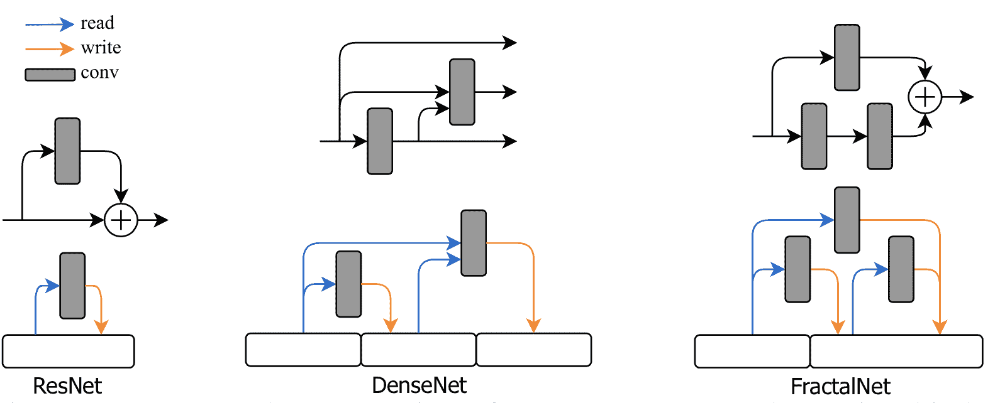

图 7. 几种流行网络架构块的记忆库表示。（图片来源：[Brock 等人 2017](https://arxiv.org/abs/1708.05344)）

# 搜索算法

NAS 搜索算法对子网络的种群进行采样。它接收子模型的性能指标作为奖励，并学习生成高性能架构候选。您可能与超参数搜索领域有很多共同之处。

## 随机搜索

随机搜索是最简单的基准线。它从搜索空间中*随机*采样一个有效的架构候选，不涉及任何学习模型。随机搜索已被证明在超参数搜索中非常有用（[Bergstra＆Bengio 2012](http://www.jmlr.org/papers/volume13/bergstra12a/bergstra12a.pdf)）。在设计良好的搜索空间的情况下，随机搜索可能是一个非常具有挑战性的基准线。

## 强化学习

**NAS**的初始设计（[Zoph＆Le 2017](https://arxiv.org/abs/1611.01578)）涉及一个基于 RL 的控制器，用于提出子模型架构以进行评估。控制器实现为一个 RNN，输出用于配置网络架构的可变长度序列的令牌。

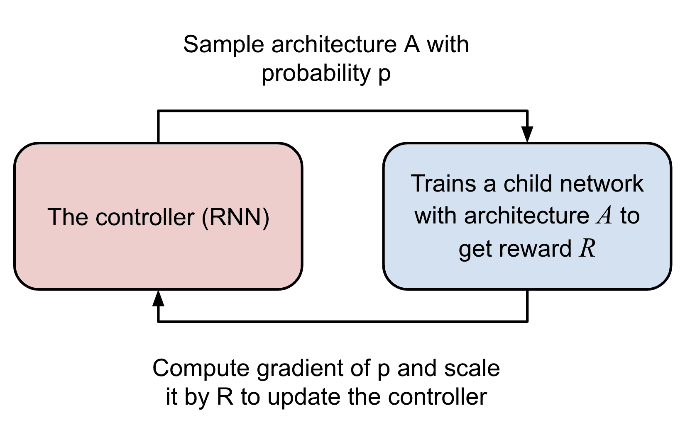

图 8. NAS 的高级概述，包含一个 RNN 控制器和一个用于评估子模型的流水线。（图片来源：[Zoph＆Le 2017](https://arxiv.org/abs/1611.01578)）

控制器通过[REINFORCE](https://lilianweng.github.io/posts/2018-04-08-policy-gradient/#reinforce)作为*RL 任务*进行训练。

+   **动作空间**：动作空间是控制器预测的子网络的标记列表（请参阅上述部分）。控制器输出*动作*，$a_{1:T}$，其中$T$是标记的总数。

+   **奖励**：在收敛时可以实现的子网络准确性是训练控制器的奖励，$R$。

+   **损失**：NAS 通过 REINFORCE 损失优化控制器参数$\theta$。我们希望最大化期望奖励（高准确性），梯度如下。这里策略梯度的好处是即使奖励是不可微的，它也能工作。

$$ \nabla_{\theta} J(\theta) = \sum_{t=1}^T \mathbb{E}[\nabla_{\theta} \log P(a_t \vert a_{1:(t-1)}; \theta) R ] $$

**MetaQNN**（[Baker 等人，2017](https://arxiv.org/abs/1611.02167)）训练一个代理程序，使用[*Q 学习*](https://lilianweng.github.io/posts/2018-02-19-rl-overview/#q-learning-off-policy-td-control)和一个[$\epsilon$-贪心](https://lilianweng.github.io/posts/2018-01-23-multi-armed-bandit/#%CE%B5-greedy-algorithm)探索策略以及经验重放来顺序选择 CNN 层。奖励是验证准确性。

$$ Q^{(t+1)}(s_t, a_t) = (1 - \alpha)Q^{(t)}(s_t, a_t) + \alpha (R_t + \gamma \max_{a \in \mathcal{A}} Q^{(t)}(s_{t+1}, a')) $$

其中状态$s_t$是层操作和相关参数的元组。一个动作$a$决定了操作之间的连接性。Q 值与我们对两个连接操作导致高准确性的信心成正比。


图 9. MetaQNN 概述 - 使用 Q 学习设计 CNN 模型。（图片来源：[Baker 等人，2017](https://arxiv.org/abs/1611.02167)）

## 进化算法

**NEAT**（*NeuroEvolution of Augmenting Topologies*的缩写）是一种使用[遗传算法（GA）](https://en.wikipedia.org/wiki/Genetic_algorithm)进化神经网络拓扑的方法，由[Stanley & Miikkulainen](http://nn.cs.utexas.edu/downloads/papers/stanley.ec02.pdf)于 2002 年提出。NEAT 同时进化连接权重和网络拓扑。每个基因编码了配置网络的完整信息，包括节点权重和边。通过对权重和连接的突变以及两个父基因之间的交叉来使种群增长。有关神经进化的更多信息，请参考 Stanley 等人（2019 年）撰写的深入[调查报告](https://www.nature.com/articles/s42256-018-0006-z)。

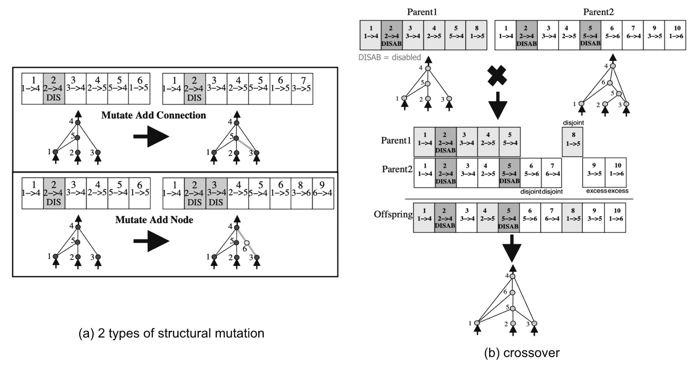

图 10. NEAT 算法中的突变。（图片来源：[Stanley & Miikkulainen, 2002](http://nn.cs.utexas.edu/downloads/papers/stanley.ec02.pdf)中的图 3 和 4）

[Real 等人（2018）](https://arxiv.org/abs/1802.01548)采用进化算法（EA）作为搜索高性能网络架构的方法，命名为**AmoebaNet**。他们应用了[锦标赛选择](https://en.wikipedia.org/wiki/Tournament_selection)方法，每次迭代从一组随机样本中选择最佳候选，并将其变异后代放回种群。当锦标赛大小为$1$时，等效于随机选择。

AmoebaNet 修改了锦标赛选择以偏爱*年轻*的基因型，并始终在每个周期内丢弃最老的模型。这种方法，称为*老化进化*，使 AmoebaNet 能够覆盖和探索更多的搜索空间，而不是过早地缩小到性能良好的模型。

具体来说，在带有老化正则化的锦标赛选择的每个周期中（见图 11）：

1.  从种群中抽取$S$个模型，选择准确率最高的一个作为*父代*。

1.  通过变异*父代*产生一个*子代*模型。

1.  然后对子模型进行训练、评估并将其重新加入种群。

1.  最老的模型从种群中移除。

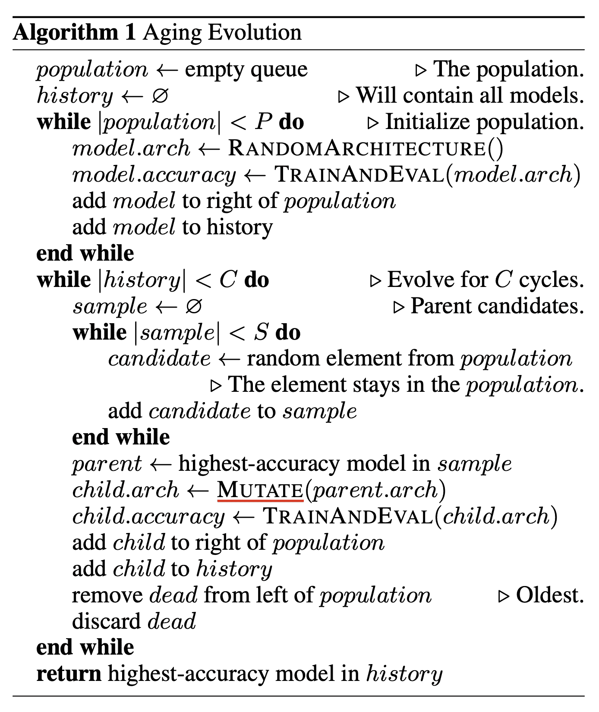

图 11。老化进化算法。（图片来源：[Real 等人 2018](https://arxiv.org/abs/1802.01548)）

应用两种类型的突变：

1.  *隐藏状态突变*：随机选择一对组合，并重新连接一个随机端点，使图中没有循环。

1.  *操作突变*：随机替换现有操作为随机操作。


图 12。AmoebaNet 中的两种突变类型。（图片来源：[Real 等人 2018](https://arxiv.org/abs/1802.01548))

在他们的实验中，EA 和 RL 在最终验证准确性方面表现相同，但 EA 在任何时候的性能更好，并且能够找到更小的模型。在 NAS 中使用 EA 仍然在计算方面昂贵，因为每个实验需要 450 个 GPU 花费 7 天。

**HNAS**（[刘等人 2017](https://arxiv.org/abs/1711.00436)）也采用进化算法（原始锦标赛选择）作为他们的搜索策略。在分层结构搜索空间中，每条边都是一个操作。因此，在他们的实验中，基因型突变是通过用不同操作替换随机边来实现的。替换集包括一个`none`操作，因此可以改变、删除和添加边。初始基因型集是通过在“琐碎”模式（所有恒等映射）上应用大量随机突变来创建的。

## 渐进式决策过程

构建模型架构是一个顺序过程。每增加一个操作符或层都会带来额外的复杂性。如果我们引导搜索模型从简单模型开始调查，并逐渐演变为更复杂的架构，就像将[“课程”](https://lilianweng.github.io/posts/2020-01-29-curriculum-rl/)引入搜索模型的学习过程中一样。

*逐步 NAS*（**PNAS**；[Liu, et al 2018](https://arxiv.org/abs/1712.00559)）将 NAS 的问题框定为一个逐步搜索逐渐增加复杂性模型的过程。PNAS 采用顺序基于模型的贝叶斯优化（SMBO）作为搜索策略，而不是 RL 或 EA。PNAS 类似于 A*搜索，它从简单到困难搜索模型，同时学习一个替代函数来指导搜索。

> [A*搜索算法](https://en.wikipedia.org/wiki/A*_search_algorithm)（“最佳优先搜索”）是一种用于路径查找的流行算法。该问题被构建为在加权图中从特定起始节点到给定目标节点找到最小成本路径。在每次迭代中，A*通过最小化找到要扩展的路径：$f(n)=g(n)+h(n)$，其中$n$是下一个节点，$g(n)$是从起点到$n$的成本，$h(n)$是启发式函数，估计从节点$n$到目标的最小成本。

PNAS 使用 NASNet 搜索空间。每个块被指定为一个 5 元组，PNAS 只考虑逐元素加法作为第 5 步的组合运算符，不考虑连接。与将块数$B$设置为固定数不同，PNAS 从$B=1$开始，即一个单元格中只有一个块的模型，并逐渐增加$B$。

在验证集上的性能用作反馈来训练一个*替代*模型来*预测*新颖架构的性能。有了这个预测器，我们可以决定哪些模型应该优先评估。由于性能预测器应该能够处理各种大小的输入、准确性和样本效率，他们最终使用了一个 RNN 模型。


图 13. 逐步 NAS 算法。（图片来源：[Liu, et al 2018](https://arxiv.org/abs/1712.00559)）

## 梯度下降

使用梯度下降来更新架构搜索模型需要努力使选择离散操作的过程可微分。这些方法通常将架构参数和网络权重的学习结合到一个模型中。在*“一次性”*方法的部分中了解更多。

# 评估策略

我们需要测量、估计或预测每个子模型的性能，以获得优化搜索算法的反馈。候选评估的过程可能非常昂贵，许多新的评估方法已被提出以节省时间或计算资源。在评估子模型时，我们主要关心其在验证集上的准确性等性能。最近的工作开始研究模型的其他因素，如模型大小和延迟，因为某些设备可能对内存有限制或需要快速响应时间。

## 从头开始训练

最简单的方法是独立从头开始训练每个子网络直到*收敛*，然后在验证集上测量其准确性（[Zoph & Le，2017](https://arxiv.org/abs/1611.01578)）。它提供了可靠的性能数据，但一个完整的训练-收敛-评估循环只生成一个用于训练 RL 控制器的数据样本（更不用说 RL 通常在样本效率上是低效的）。因此，从计算消耗的角度来看，这是非常昂贵的。

## 代理任务性能

有几种方法可以使用代理任务性能作为子网络性能估计器，通常更便宜和更快速地计算：

+   在较小的数据集上训练。

+   减少训练周期。

+   在搜索阶段训练和评估一个缩小规模的模型。例如，一旦学习了一个细胞结构，我们可以尝试改变细胞重复的次数或增加滤波器的数量（[Zoph 等人，2018](https://arxiv.org/abs/1707.07012)）。

+   预测学习曲线。[Baker 等人（2018）](https://arxiv.org/abs/1705.10823)将验证准确性的预测建模为时间序列回归问题。回归模型的特征（$\nu$-支持向量机回归；$\nu$-SVR）包括每个时期的准确性的早期序列、架构参数和超参数。

## 参数共享

而不是独立从头开始训练每个子模型。你可能会问，好吧，如果我们制造它们之间的依赖性并找到一种重复使用权重的方法会怎样？一些研究人员成功地使这些方法奏效。

受[Net2net](https://arxiv.org/abs/1511.05641)转换的启发，[Cai 等人（2017）](https://arxiv.org/abs/1707.04873)提出了*高效架构搜索*（**EAS**）。EAS 建立了一个 RL 代理，称为元控制器，来预测保持功能的网络转换，以便增加网络深度或层宽。由于网络是逐步增长的，先前验证过的网络的权重可以被*重复使用*以进行进一步的探索。有了继承的权重，新构建的网络只需要进行一些轻量级的训练。

一个元控制器学习生成*网络转换动作*，给定当前网络架构，该架构由一个可变长度的字符串指定。为了处理可变长度的架构配置，元控制器被实现为一个双向递归网络。多个演员网络输出不同的转换决策：

1.  *Net2WiderNet*操作允许用更宽的层替换一个层，意味着全连接层有更多单元，或者卷积层有更多滤波器，同时保持功能性。

1.  *Net2DeeperNet*操作允许插入一个新层，该层被初始化为在两个层之间添加一个恒等映射，以保持功能性。

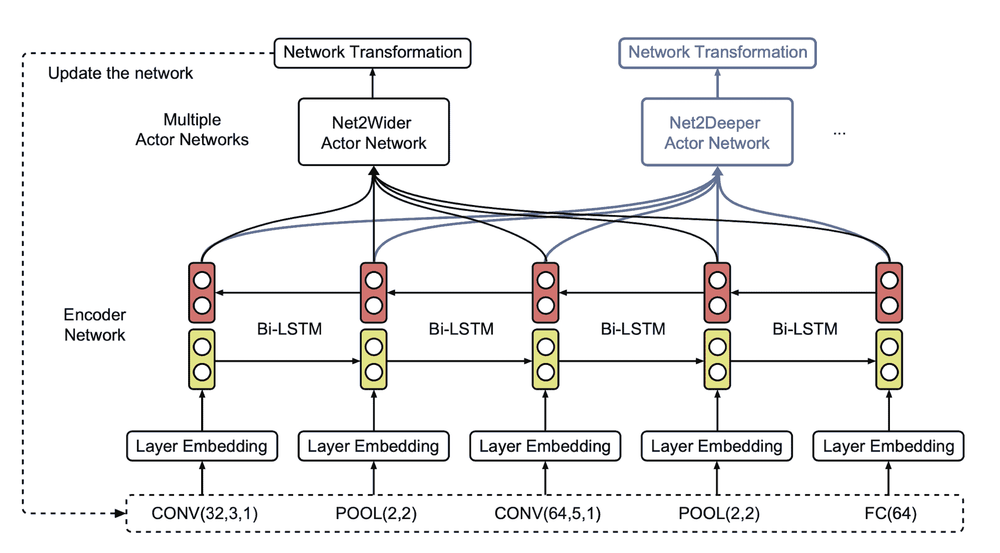

图 14\. Efficient Architecture Search（NAS）中基于 RL 的元控制器概述。在编码架构配置后，通过两个独立的演员网络输出 net2net 转换动作。（图片来源：[Cai et al 2017](https://arxiv.org/abs/1707.04873)）

凭借类似的动机，*Efficient NAS*（**ENAS**；[Pham et al. 2018](https://arxiv.org/abs/1802.03268)）通过在子模型之间积极共享参数来加速 NAS（即减少 1000 倍）。ENAS 背后的核心动机是观察到所有采样的架构图都可以看作是更大*超图*的*子图*。所有子网络都共享这个超图的权重。


图 15\.（左）图表示一个 4 节点循环单元的整个搜索空间，但只有红色连接是活跃的。（中）展示左侧活跃子图如何转换为子模型架构的示例。（右）由 RNN 控制器为中间架构产生的网络参数。（图片来源：[Pham et al. 2018](https://arxiv.org/abs/1802.03268)）

ENAS 在训练共享模型权重$\omega$和训练控制器$\theta$之间交替进行：

1.  控制器 LSTM $\theta$的参数使用[REINFORCE](https://lilianweng.github.io/posts/2018-04-08-policy-gradient/#reinforce)进行训练，其中奖励$R(\mathbf{m}, \omega)$在验证集上计算。

1.  子模型的共享参数$\omega$通过标准监督学习损失进行训练。请注意，与超图中同一节点相关联的不同操作符将具有自己独特的参数。

## 基于预测

一个常规的子模型评估循环是通过标准梯度下降更新模型权重。SMASH（[Brock et al. 2017](https://arxiv.org/abs/1708.05344)）提出了一个不同且有趣的想法：*我们能否直接基于网络架构参数预测模型权重？*

他们使用[HyperNet](https://blog.otoro.net/2016/09/28/hyper-networks/)（[Ha 等人 2016](https://arxiv.org/abs/1609.09106)）直接生成模型的权重，条件是其架构配置的编码。然后，具有 HyperNet 生成的权重的模型直接进行验证。请注意，我们不需要为每个子模型额外训练，但我们确实需要训练 HyperNet。


图 16。SMASH 的算法。（图片来源：[Brock 等人 2017](https://arxiv.org/abs/1708.05344)）

模型性能与 SMASH 生成的权重和真实验证错误之间的相关性表明，预测的权重可以在一定程度上用于模型比较。我们确实需要足够大容量的 HyperNet，因为如果 HyperNet 模型与子模型大小相比太小，相关性将受损。

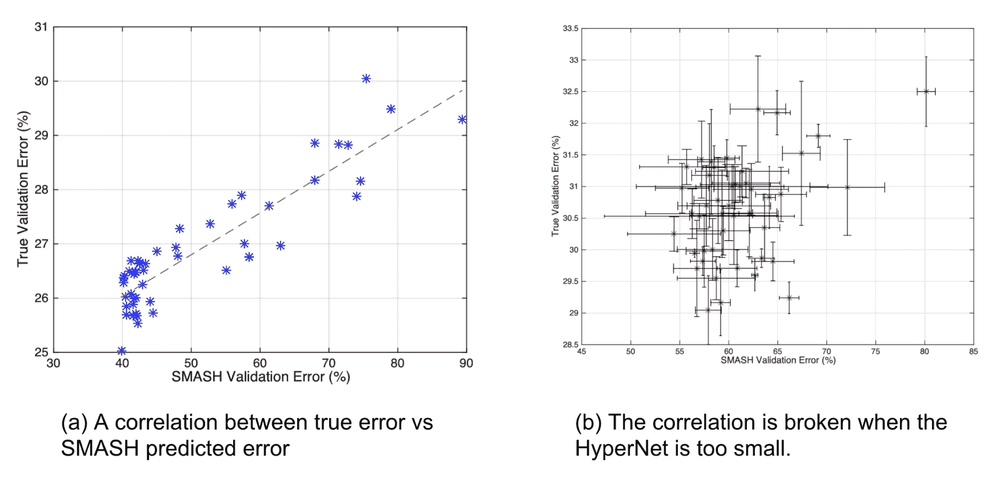

图 17。SMASH 的算法。（图片来源：[Brock 等人 2017](https://arxiv.org/abs/1708.05344)）

SMASH 可以被视为实现参数共享思想的另一种方式。正如[Pham 等人（2018）](https://arxiv.org/abs/1802.03268)指出的那样，SMASH 的一个问题是：HyperNet 的使用限制了 SMASH 子模型的权重到*低秩空间*，因为权重是通过张量积生成的。相比之下，ENAS 没有这样的限制。

# 一次性方法：搜索 + 评估

独立运行搜索和评估对大量子模型的群体是昂贵的。我们已经看到了一些有希望的方法，如[Brock 等人（2017）](https://arxiv.org/abs/1708.05344)或[Pham 等人（2018）](https://arxiv.org/abs/1802.03268)，在这些方法中，训练一个单一模型就足以模拟搜索空间中的任何子模型。

**一次性**架构搜索扩展了权重共享的思想，并进一步将架构生成的学习与权重参数结合在一起。以下方法都将子架构视为超图中共享权重的常见边缘之间的不同子图。

[Bender 等人（2018）](http://proceedings.mlr.press/v80/bender18a/bender18a.pdf)构建了一个单一的大型超参数化网络，被称为**一次性模型**，其中包含搜索空间中的每种可能操作。通过定期 DropPath（辍学率随时间增加，在训练结束时为$r^{1/k}$，其中$0 < r < 1$是一个超参数，$k$是传入路径的数量）和一些精心设计的技巧（例如幽灵批量归一化，仅在活跃架构上进行 L2 正则化），这样一个巨大模型的训练可以足够稳定，并用于评估从超图中采样的任何子模型。


图 18\. [Bender 等人 2018](http://proceedings.mlr.press/v80/bender18a/bender18a.pdf)中一次性模型的架构。每个细胞有$N$个选择块，每个选择块最多可以选择 2 个操作。实线用于每个架构，虚线是可选的。（图片来源：[Bender 等人 2018](http://proceedings.mlr.press/v80/bender18a/bender18a.pdf)）

训练一次性模型后，可以用于评估通过随机采样归零或删除一些操作而得到的许多不同架构的性能。这种采样过程可以被 RL 或进化所取代。

他们观察到，使用一次性模型测量的准确性与在进行微调后相同架构的准确性之间的差异可能非常大。他们的假设是，一次性模型会自动学习专注于网络中*最有用*的操作，并在这些操作可用时*依赖*这些操作。因此，归零有用操作会导致模型准确性大幅降低，而删除不太重要的组件只会造成小影响 — 因此，当使用一次性模型进行评估时，我们看到得分的差异较大。

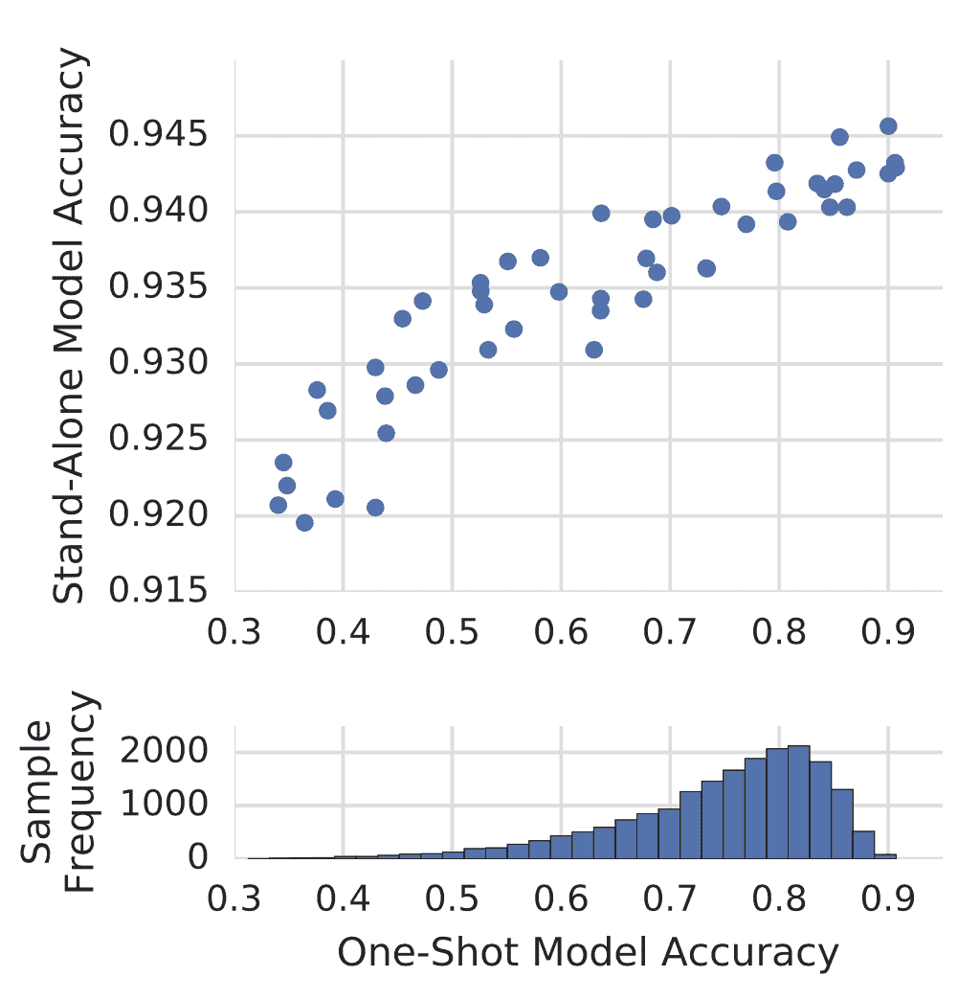

图 19\. 不同一次性模型准确性的分层模型样本与它们作为独立模型的真实验证准确性之间的对比。 （图片来源：[Bender 等人 2018](http://proceedings.mlr.press/v80/bender18a/bender18a.pdf)）

显然设计这样一个搜索图并不是一项简单的任务，但它展示了一次性方法的强大潜力。它仅使用梯度下降，而不需要像 RL 或 EA 这样的额外算法。

一些人认为 NAS 效率低下的一个主要原因是将架构搜索视为*黑盒优化*，因此我们陷入 RL、进化、SMBO 等方法。如果我们转而依赖标准梯度下降，可能会使搜索过程更有效。因此，[Liu 等人（2019）](https://arxiv.org/abs/1806.09055)提出了*可微架构搜索*（**DARTS**）。DARTS 在搜索超图中的每条路径上引入了连续的松弛，使得可以通过梯度下降联合训练架构参数和权重。

让我们在这里使用有向无环图（DAG）表示。一个细胞是由拓扑排序的$N$个节点组成的 DAG。每个节点都有一个待学习的潜在表示$x_i$。每条边$(i, j)$都与一些操作$o^{(i,j)} \in \mathcal{O}$相关联，该操作将$x_j$转换为组成$x_i$：

$$ x_i = \sum_{j < i} o^{(i,j)}(x_j) $$

为了使搜索空间连续，DARTS 将特定操作的分类选择松弛为对所有操作的 softmax，并且架构搜索的任务被简化为学习一组混合概率$\alpha = \{ \alpha^{(i,j)} \}$。

$$ \bar{o}^{(i,j)}(x) = \sum_{o\in\mathcal{O}} \frac{\exp(\alpha_{ij}^o)}{\sum_{o'\in\mathcal{O}} \exp(\alpha^{o'}_{ij})} o(x) $$

其中$\alpha_{ij}$是一个维度为$\vert \mathcal{O} \vert$的向量，包含不同操作之间节点$i$和$j$之间的权重。

双层优化存在是因为我们希望优化网络权重$w$和架构表示$\alpha$：

$$ \begin{aligned} \min_\alpha & \mathcal{L}_\text{validate} (w^*(\alpha), \alpha) \\ \text{s.t.} & w^*(\alpha) = \arg\min_w \mathcal{L}_\text{train} (w, \alpha) \end{aligned} $$

在第$k$步，给定当前架构参数$\alpha_{k−1}$，我们首先通过将$w_{k−1}$朝着最小化训练损失$\mathcal{L}_\text{train}(w_{k−1}, \alpha_{k−1})$的方向移动来优化权重$w_k$，学习率为$\xi$。接下来，在保持新更新的权重$w_k$不变的情况下，我们更新混合概率，以便最小化验证损失*在权重的梯度下降的单步之后*：

$$ J_\alpha = \mathcal{L}_\text{val}(w_k - \xi \nabla_w \mathcal{L}_\text{train}(w_k, \alpha_{k-1}), \alpha_{k-1}) $$

这里的动机是，我们希望找到一种架构，当其权重通过梯度下降进行优化时，具有较低的验证损失，并且一步展开的权重作为$w^∗(\alpha)$的*替代品*。

> 旁注：之前我们在[MAML](https://lilianweng.github.io/posts/2018-11-30-meta-learning/#maml)中看到了类似的公式，其中任务损失和元学习器更新之间发生了两步优化，以及在[Domain Randomization](https://lilianweng.github.io/posts/2019-05-05-domain-randomization/#dr-as-optimization)中将其构建为更好的在真实环境中进行迁移的双层优化。


图 20\. DARTS 如何在 DAG 超图的边缘上应用连续松弛并识别最终模型的示意图。（图片来源：[Liu et al 2019](https://arxiv.org/abs/1806.09055)）

$$ \begin{aligned} \text{设 }w'_k &= w_k - \xi \nabla_w \mathcal{L}_\text{train}(w_k, \alpha_{k-1}) & \\ J_\alpha &= \mathcal{L}_\text{val}(w_k - \xi \nabla_w \mathcal{L}_\text{train}(w_k, \alpha_{k-1}), \alpha_{k-1}) = \mathcal{L}_\text{val}(w'_k, \alpha_{k-1}) & \\ \nabla_\alpha J_\alpha &= \nabla_{\alpha_{k-1}} \mathcal{L}_\text{val}(w'_k, \alpha_{k-1}) \nabla_\alpha \alpha_{k-1} + \nabla_{w'_k} \mathcal{L}_\text{val}(w'_k, \alpha_{k-1})\nabla_\alpha w'_k & \\& \text{；多变量链式法则}\\ &= \nabla_{\alpha_{k-1}} \mathcal{L}_\text{val}(w'_k, \alpha_{k-1}) + \nabla_{w'_k} \mathcal{L}_\text{val}(w'_k, \alpha_{k-1}) \big( - \xi \color{red}{\nabla²_{\alpha, w} \mathcal{L}_\text{train}(w_k, \alpha_{k-1})} \big) & \\ &\approx \nabla_{\alpha_{k-1}} \mathcal{L}_\text{val}(w'_k, \alpha_{k-1}) - \xi \nabla_{w'_k} \mathcal{L}_\text{val}(w'_k, \alpha_{k-1}) \color{red}{\frac{\nabla_\alpha \mathcal{L}_\text{train}(w_k^+, \alpha_{k-1}) - \nabla_\alpha \mathcal{L}_\text{train}(w_k^-, \alpha_{k-1}) }{2\epsilon}} & \\ & \text{；应用数值微分近似} \end{aligned} $$

红色部分使用数值微分近似，其中 $w_k^+ = w_k + \epsilon \nabla_{w’_k} \mathcal{L}_\text{val}(w’_k, \alpha_{k-1})$ 和 $w_k^- = w_k - \epsilon \nabla_{w’_k} \mathcal{L}_\text{val}(w’_k, \alpha_{k-1})$。


图 21. DARTS 的算法概述。（图片来源：[Liu et al 2019](https://arxiv.org/abs/1806.09055)）

作为与 DARTS 类似的另一个想法，随机 NAS（[Xie et al., 2019](https://arxiv.org/abs/1812.09926)）通过采用具体分布（CONCRETE = CONtinuous relaxations of disCRETE random variables；[Maddison et al 2017](https://arxiv.org/abs/1611.00712)）和重新参数化技巧进行连续放松。其目标与 DARTS 相同，即使离散分布可微分，从而通过梯度下降进行优化。

DARTS 能够大大降低 GPU 计算成本。他们用单个 GPU 进行搜索 CNN 单元的实验，$N=7$，只需 1.5 天。然而，由于其对网络架构的连续表示，它存在高 GPU 内存消耗的问题。为了将模型适应单个 GPU 的内存，他们选择了一个较小的 $N$。

为了限制 GPU 内存消耗，**ProxylessNAS**（[Cai et al., 2019](https://arxiv.org/abs/1812.00332)）将 NAS 视为 DAG 中的路径级修剪过程，并将架构参数二值化，以强制在两个节点之间一次只激活一条路径。然后通过对几个二值化架构进行采样并使用*BinaryConnect*（[Courbariaux et al., 2015](https://arxiv.org/abs/1511.00363)）来更新相应的概率，学习边缘被屏蔽或不被屏蔽的概率。ProxylessNAS 展示了 NAS 与模型压缩之间的强连接。通过使用路径级压缩，它能够将内存消耗节省一个数量级。

让我们继续讨论图表示。在 DAG 邻接矩阵$G$中，$G_{ij}$表示节点$i$和$j$之间的边，其值可以从候选原始操作集合$\vert \mathcal{O} \vert$中选择，$\mathcal{O} = \{ o_1, \dots \}$。One-Shot 模型、DARTS 和 ProxylessNAS 都将每条边视为操作混合体$m_\mathcal{O}$，但具有不同的调整。

在 One-Shot 中，$m_\mathcal{O}(x)$是所有操作的总和。在 DARTS 中，它是加权和，其中权重是长度为$\vert \mathcal{O} \vert$的实值架构权重向量$\alpha$上的 softmax。ProxylessNAS 将$\alpha$的 softmax 概率转换为二进制门，并使用二进制门一次只保留一个操作处于活动状态。

$$ \begin{aligned} m^\text{one-shot}_\mathcal{O}(x) &= \sum_{i=1}^{\vert \mathcal{O} \vert} o_i(x) \\ m^\text{DARTS}_\mathcal{O}(x) &= \sum_{i=1}^{\vert \mathcal{O} \vert} p_i o_i(x) = \sum_{i=1}^{\vert \mathcal{O} \vert} \frac{\exp(\alpha_i)}{\sum_j \exp(\alpha_j)} o_i(x) \\ m^\text{binary}_\mathcal{O}(x) &= \sum_{i=1}^{\vert \mathcal{O} \vert} g_i o_i(x) = \begin{cases} o_1(x) & \text{with probability }p_1, \\ \dots &\\ o_{\vert \mathcal{O} \vert}(x) & \text{with probability }p_{\vert \mathcal{O} \vert} \end{cases} \\ \text{ where } g &= \text{binarize}(p_1, \dots, p_N) = \begin{cases} [1, 0, \dots, 0] & \text{with probability }p_1, \\ \dots & \\ [0, 0, \dots, 1] & \text{with probability }p_N. \\ \end{cases} \end{aligned} $$

图 22。ProxylessNAS 有两个交替运行的训练步骤。（图片来源：[Cai et al., 2019](https://arxiv.org/abs/1812.00332)）

ProxylessNAS 交替运行两个训练步骤：

1.  在训练权重参数$w$时，冻结架构参数$\alpha$并根据上述$m^\text{binary}_\mathcal{O}(x)$随机采样二进制门$g$。权重参数可以使用标准梯度下降进行更新。

1.  在训练架构参数$\alpha$时，冻结$w$，重置二进制门，然后在验证集上更新$\alpha$。遵循*BinaryConnect*的思想，可以使用$\partial \mathcal{L} / \partial g_i$来近似估计架构参数的梯度，替代$\partial \mathcal{L} / \partial p_i$：

$$ \begin{aligned} \frac{\partial \mathcal{L}}{\partial \alpha_i} &= \sum_{j=1}^{\vert \mathcal{O} \vert} \frac{\partial \mathcal{L}}{\partial p_j} \frac{\partial p_j}{\partial \alpha_i} \approx \sum_{j=1}^{\vert \mathcal{O} \vert} \frac{\partial \mathcal{L}}{\partial g_j} \frac{\partial p_j}{\partial \alpha_i} = \sum_{j=1}^{\vert \mathcal{O} \vert} \frac{\partial \mathcal{L}}{\partial g_j} \frac{\partial \frac{e^{\alpha_j}}{\sum_k e^{\alpha_k}}}{\partial \alpha_i} \\ &= \sum_{j=1}^{\vert \mathcal{O} \vert} \frac{\partial \mathcal{L}}{\partial g_j} \frac{\sum_k e^{\alpha_k} (\mathbf{1}_{i=j} e^{\alpha_j}) - e^{\alpha_j} e^{\alpha_i} }{(\sum_k e^{\alpha_k})²} = \sum_{j=1}^{\vert \mathcal{O} \vert} \frac{\partial \mathcal{L}}{\partial g_j} p_j (\mathbf{1}_{i=j} -p_i) \end{aligned} $$

除了 BinaryConnect，还可以使用 REINFORCE 来进行参数更新，目标是最大化奖励，而不涉及 RNN 元控制器。

计算$\partial \mathcal{L} / \partial g_i$需要计算并存储$o_i(x)$，这需要$\vert \mathcal{O} \vert$倍的 GPU 内存。为了解决这个问题，他们将从$N$个选择路径中选择一个路径的任务分解为多个二进制选择任务（直觉：“如果一条路径是最佳选择，那么它应该比任何其他路径更好”）。在每次更新步骤中，只有两条路径被采样，而其他路径被屏蔽。这两条选定的路径根据上述方程进行更新，然后适当缩放，以使其他路径权重保持不变。经过这个过程，被采样的路径中的一条被增强（路径权重增加），另一条被削弱（路径权重减少），而所有其他路径保持不变。

除了准确性，ProxylessNAS 还将*延迟*视为优化的重要指标，因为不同设备可能对推理时间延迟有非常不同的要求（例如 GPU、CPU、移动设备）。为了使延迟可微分，他们将延迟建模为网络维度的连续函数。混合操作的预期延迟可以写成$\mathbb{E}[\text{latency}] = \sum_j p_j F(o_j)$，其中$F(.)$是一个延迟预测模型：


图 23. 在 ProxylessNAS 的训练中添加一个可微分的延迟损失。（图片来源：[Cai et al., 2019](https://arxiv.org/abs/1812.00332)）

# 未来展望？

到目前为止，我们已经看到了许多有趣的新想法，通过神经架构搜索自动化网络架构工程，并且许多已经取得了非常令人印象深刻的性能。然而，很难推断为什么某些架构效果好，以及我们如何开发能够跨任务通用而不是非常特定于数据集的模块。

正如[Elsken 等人（2019）](https://arxiv.org/abs/1808.05377)中所指出的：

> “……，到目前为止，它对为什么特定架构效果好提供了很少的见解，以及独立运行中导出的架构有多相似提供了很少的见解。识别共同的主题，理解为什么这些主题对高性能很重要，并研究这些主题是否能够在不同问题上泛化将是可取的。”

与此同时，纯粹专注于验证准确性的改进可能还不够（[Cai 等人，2019](https://arxiv.org/abs/1812.00332)）。像手机这样的设备通常具有有限的内存和计算能力。虽然 AI 应用正在影响我们的日常生活，但不可避免地会更*特定于设备*。

另一个有趣的调查是考虑*无标签数据集*和[自监督学习](https://lilianweng.github.io/posts/2019-11-10-self-supervised/)用于 NAS。有标签数据集的大小总是有限的，很难判断这样的数据集是否存在偏见或与真实世界数据分布有很大偏差。

[Liu 等人（2020）](https://arxiv.org/abs/2003.12056)深入探讨了“我们是否可以在没有人工标注标签的情况下找到高质量的神经架构？”的问题，并提出了一种称为*无监督神经架构搜索*（**UnNAS**）的新设置。在搜索阶段需要以无监督的方式估计架构的质量。该论文对三个无监督的[前提任务](https://lilianweng.github.io/posts/2019-11-10-self-supervised/#images-based)进行了实验：图像旋转预测、着色和解决拼图问题。

他们在一系列 UnNAS 实验中观察到：

1.  在*同一数据集*上，监督准确性和前提准确性之间存在很高的等级相关性。通常，无论数据集、搜索空间和前提任务如何，等级相关性都高于 0.8。

1.  在*跨数据集*上，监督准确性和前提准确性之间存在很高的等级相关性。

1.  更好的前提准确性会转化为更好的监督准确性。

1.  UnNAS 架构的性能与监督对应物相当，尽管还没有更好。

一个假设是架构质量与图像统计数据相关。因为 CIFAR-10 和 ImageNet 都是关于自然图像的，它们是可比较的，结果是可转移的。UnNAS 有可能在搜索阶段吸收更多未标记数据，从而更好地捕捉图像统计数据。

超参数搜索是机器学习社区中长期存在的话题。NAS 自动化了架构工程。我们逐渐尝试自动化机器学习中通常需要大量人力的过程。再进一步，是否可能自动发现机器学习算法？**AutoML-Zero** ([Real 等人 2020](https://arxiv.org/abs/2003.03384)) 探讨了这个想法。使用老化进化算法，AutoML-Zero 自动搜索整个机器学习算法，只使用简单的数学运算作为构建块，形式上几乎没有限制。

它学习三个组件函数。每个函数只采用非常基本的操作。

+   `设置`: 初始化内存变量（权重）。

+   `学习`: 修改内存变量

+   `预测`: 从输入 $x$ 进行预测。

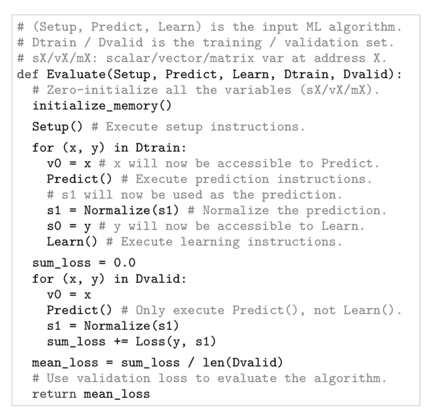

图 24\. 在一个任务上的算法评估 (图片来源: [Real 等人 2020](https://arxiv.org/abs/2003.03384))

当变异父基因型时，考虑三种操作类型：

1.  在一个组件函数中的随机位置插入一个随机指令或删除一个指令;

1.  在一个组件函数中随机化所有指令;

1.  通过用随机选择替换指令的一个参数来修改指令之一（例如“交换输出地址”或“更改常量的值”）


图 25\. 在投影的二进制 CIFAR-10 上的进化进展的示例代码插图 (图片来源: [Real 等人 2020](https://arxiv.org/abs/2003.03384))

# 附录: NAS 论文摘要

| 模型名称 | 搜索空间 | 搜索算法 | 子模型评估 |
| --- | --- | --- | --- |
| [NEAT (2002)](http://nn.cs.utexas.edu/downloads/papers/stanley.ec02.pdf) | - | 进化算法 (遗传算法) | - |
| [NAS (2017)](https://arxiv.org/abs/1611.01578) | 顺序逐层操作 | 强化学习 (REINFORCE) | 从头开始训练直到收敛 |
| [MetaQNN (2017)](https://arxiv.org/abs/1611.02167) | 顺序逐层操作 | 强化学习 (Q-learning with $\epsilon$-greedy) | 训练 20 个时代 |
| [HNAS (2017)](https://arxiv.org/abs/1711.00436) | 分层结构 | 进化算法 (锦标赛选择) | 训练固定次数的迭代 |
| [NASNet (2018)](https://arxiv.org/abs/1707.07012) | 基于单元的 | 强化学习 (PPO) | 训练 20 个时代 |
| [AmoebaNet (2018)](https://arxiv.org/abs/1802.01548) | NASNet 搜索空间 | 进化算法 (带有老化正则化的锦标赛选择) | 训练 25 个时代 |
| [EAS (2018a)](https://arxiv.org/abs/1707.04873) | 网络转换 | 强化学习 (REINFORCE) | 两阶段训练 |
| [PNAS (2018)](https://arxiv.org/abs/1712.00559) | NASNet 搜索空间的简化版本 | SMBO; 逐渐搜索增加复杂性的架构 | 训练 20 个时代 |
| [ENAS (2018)](https://arxiv.org/abs/1802.03268) | 顺序和基于单元的搜索空间 | 强化学习 (REINFORCE) | 使用共享权重训练一个模型 |
| [SMASH (2017)](https://arxiv.org/abs/1708.05344) | 存储器库表示 | 随机搜索 | HyperNet 预测评估架构的权重。 |
| [One-Shot (2018)](http://proceedings.mlr.press/v80/bender18a.html) | 一个过度参数化的一次性模型 | 随机搜索（随机清除一些路径） | 训练一次性模型 |
| [DARTS (2019)](https://arxiv.org/abs/1806.09055) | NASNet 搜索空间 | 梯度下降（Softmax 权重覆盖操作） |
| [ProxylessNAS (2019)](https://arxiv.org/abs/1812.00332) | 树状结构架构 | 梯度下降（BinaryConnect）或 REINFORCE |
| [SNAS (2019)](https://arxiv.org/abs/1812.09926) | NASNet 搜索空间 | 梯度下降（具体分布） |

# 引用

引用：

> Weng, Lilian. (2020 年 8 月). 神经架构搜索. Lil’Log. https://lilianweng.github.io/posts/2020-08-06-nas/.

或

```py
@article{weng2020nas,
  title   = "Neural Architecture Search",
  author  = "Weng, Lilian",
  journal = "lilianweng.github.io",
  year    = "2020",
  month   = "Aug",
  url     = "https://lilianweng.github.io/posts/2020-08-06-nas/"
} 
```

# 参考

[1] Thomas Elsken, Jan Hendrik Metzen, Frank Hutter. [“神经架构搜索：一项调查”](https://arxiv.org/abs/1808.05377) JMLR 20 (2019) 1-21.

[2] Kenneth O. Stanley, 等. [“通过神经进化设计神经网络”](https://www.nature.com/articles/s42256-018-0006-z) Nature Machine Intelligence 卷 1，页码 24-35 (2019).

[3] Kenneth O. Stanley & Risto Miikkulainen. [“通过增加拓扑结构进化神经网络”](http://nn.cs.utexas.edu/downloads/papers/stanley.ec02.pdf) Evolutionary Computation 10(2): 99-127 (2002).

[4] Barret Zoph, Quoc V. Le. [“利用强化学习进行神经架构搜索”](https://arxiv.org/abs/1611.01578) ICLR 2017.

[5] Bowen Baker, 等. [“利用强化学习设计神经网络架构”](https://arxiv.org/abs/1611.02167) ICLR 2017.

[6] Bowen Baker, 等. [“利用性能预测加速神经架构搜索”](https://arxiv.org/abs/1705.10823) ICLR Workshop 2018.

[7] Barret Zoph, 等. [“学习可传递的架构以实现可扩展的图像识别”](https://arxiv.org/abs/1707.07012) CVPR 2018.

[8] Hanxiao Liu, 等. [“用于高效架构搜索的分层表示”](https://arxiv.org/abs/1711.00436) ICLR 2018.

[9] Esteban Real, 等. [“用于图像分类器架构搜索的正则化进化”](https://arxiv.org/abs/1802.01548) arXiv:1802.01548 (2018).

[10] Han Cai, 等. [“通过网络转换实现高效架构搜索”] AAAI 2018a.

[11] Han Cai, 等. [“路径级网络转换用于高效架构搜索”](https://arxiv.org/abs/1806.02639) ICML 2018b.

[12] Han Cai, Ligeng Zhu & Song Han. [“ProxylessNAS: 直接神经架构搜索目标任务和硬件”](https://arxiv.org/abs/1812.00332) ICLR 2019.

[13] Chenxi Liu, 等. [“渐进神经架构搜索”](https://arxiv.org/abs/1712.00559) ECCV 2018.

[14] Hieu Pham, 等. [“通过参数共享实现高效神经架构搜索”](https://arxiv.org/abs/1802.03268) ICML 2018.

[15] Andrew Brock 等人。[“SMASH：通过超网络进行一次性模型架构搜索。”](https://arxiv.org/abs/1708.05344) ICLR 2018。

[16] Gabriel Bender 等人。[“理解和简化一次性架构搜索。”](http://proceedings.mlr.press/v80/bender18a.html) ICML 2018。

[17] 刘汉霄，Karen Simonyan，杨一鸣。[“DARTS：可微架构搜索”](https://arxiv.org/abs/1806.09055) ICLR 2019。

[18] 谢思睿，郑赫辉，刘春晓，林亮。[“SNAS：随机神经架构搜索”](https://arxiv.org/abs/1812.09926) ICLR 2019。

[19] 刘晨曦等人。[“神经架构搜索是否需要标签？”](https://arxiv.org/abs/2003.12056) ECCV 2020。

[20] Esteban Real 等人。[“AutoML-Zero：从零开始演化机器学习算法”](https://arxiv.org/abs/2003.03384) ICML 2020。
