# 自监督表示学习

> 原文：[`lilianweng.github.io/posts/2019-11-10-self-supervised/`](https://lilianweng.github.io/posts/2019-11-10-self-supervised/)

更新于 2020-01-09：添加了一个关于[对比预测编码的新部分]。

~~[更新于 2020-04-13：在 MoCo、SimCLR 和 CURL 上添加了一个“动量对比”部分。]~~

更新于 2020-07-08：在 DeepMDP 和 DBC 上添加了一个[“双模拟”部分。]

~~[更新于 2020-09-12：在“动量对比”部分添加了[MoCo V2](https://lilianweng.github.io/posts/2021-05-31-contrastive/#moco--moco-v2)和[BYOL](https://lilianweng.github.io/posts/2021-05-31-contrastive/#byol)。]~~

[更新于 2021-05-31：删除了“动量对比”部分，并添加了指向[“对比表示学习”](https://lilianweng.github.io/posts/2021-05-31-contrastive/)完整文章的链接]

给定一个任务和足够的标签，监督学习可以很好地解决问题。良好的性能通常需要相当数量的标签，但收集手动标签是昂贵的（例如 ImageNet），而且很难扩展。考虑到未标记数据的数量（例如自由文本，互联网上的所有图像）远远超过有限数量的人工策划的标记数据集，不利用它们有点浪费。然而，无监督学习并不容易，通常效率远低于监督学习。

如果我们可以免费为未标记数据获取标签，并以监督方式训练无监督数据集，会怎样？我们可以通过以特殊形式构建一个监督学习任务来实现这一点，仅使用其余部分来预测信息的子集。通过这种方式，提供了所需的所有信息，包括输入和标签。这被称为*自监督学习*。

这个想法已被广泛应用于语言建模。语言模型的默认任务是在给定过去序列的情况下预测下一个单词。[BERT](https://lilianweng.github.io/posts/2019-01-31-lm/#bert)添加了另外两个辅助任务，两者都依赖于自动生成的标签。

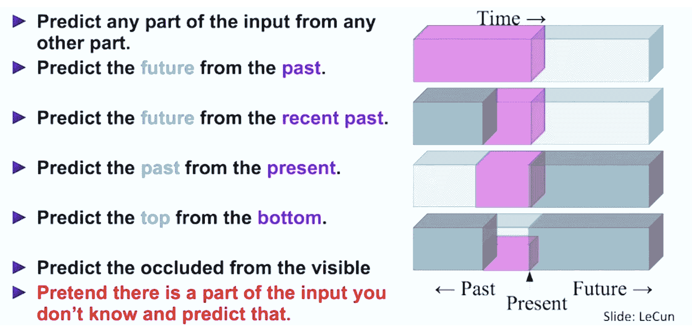

图 1. 一个很好的总结，展示了如何构建自监督学习任务（图片来源：[LeCun 的演讲](https://www.youtube.com/watch?v=7I0Qt7GALVk)）

[这里](https://github.com/jason718/awesome-self-supervised-learning)是一个精心策划的自监督学习论文列表。如果您对深入阅读感兴趣，请查看。

请注意，本文不专注于自然语言处理/NLP 或[语言建模](https://lilianweng.github.io/posts/2019-01-31-lm/)或[生成建模](https://lilianweng.github.io/tags/generative-model/)。

# 为什么要进行自监督学习？

自监督学习使我们能够免费利用数据中附带的各种标签。动机非常直接。生成一个带有清晰标签的数据集是昂贵的，但未标记数据一直在生成。为了利用这个更大量的未标记数据，一个方法是适当设置学习目标，以便从数据本身获得监督。

*自监督任务*，也称为*假任务*，引导我们到一个监督损失函数。然而，我们通常不关心这个虚构任务的最终表现。相反，我们对学到的中间表示感兴趣，期望这个表示能够携带良好的语义或结构含义，并对各种实际下游任务有益。

例如，我们可以随机旋转图像并训练模型来预测每个输入图像的旋转方式。旋转预测任务是虚构的，因此实际准确性并不重要，就像我们对待辅助任务一样。但我们期望模型学习到高质量的潜在变量，以用极少标记样本构建物体识别分类器等真实世界任务。

广义上说，所有生成模型都可以被视为自监督的，但目标不同：生成模型专注于创建多样且逼真的图像，而自监督表示学习关注于生成对许多任务有帮助的良好特征。生成建模不是本文的重点，但欢迎查看我的[之前的文章](https://lilianweng.github.io/tags/generative-model/)。

# 基于图像

对于图像的自监督表示学习已经提出了许多想法。一个常见的工作流程是在未标记的图像上训练一个模型进行一个或多个假任务，然后使用该模型的一个中间特征层来为 ImageNet 分类上的多项式逻辑回归分类器提供输入。最终的分类准确度量化了学习到的表示有多好。

最近，一些研究人员提出同时在标记数据上进行监督学习和在未标记数据上进行自监督假任务学习，共享权重，例如[Zhai 等人，2019](https://arxiv.org/abs/1905.03670)和[Sun 等人，2019](https://arxiv.org/abs/1909.11825)。

## 扭曲

我们期望对图像进行轻微扭曲不会改变其原始语义含义或几何形式。轻微扭曲的图像被视为与原始图像相同，因此学到的特征预期对扭曲具有不变性。

**典范-CNN**（[Dosovitskiy 等人，2015](https://arxiv.org/abs/1406.6909)）使用未标记的图像补丁创建替代训练数据集：

1.  从不同图像中的不同位置和比例中随机采样大小为 32×32 像素的$N$个补丁，仅从包含相当梯度的区域中采样，因为这些区域涵盖边缘并倾向于包含对象或对象的部分。它们是*“典型的”*补丁。

1.  通过应用各种随机变换（即平移、旋转、缩放等）来扭曲每个补丁。所有生成的扭曲补丁都被视为属于*同一代理类*。

1.  假设任务是区分一组代理类。我们可以任意创建任意多个代理类。

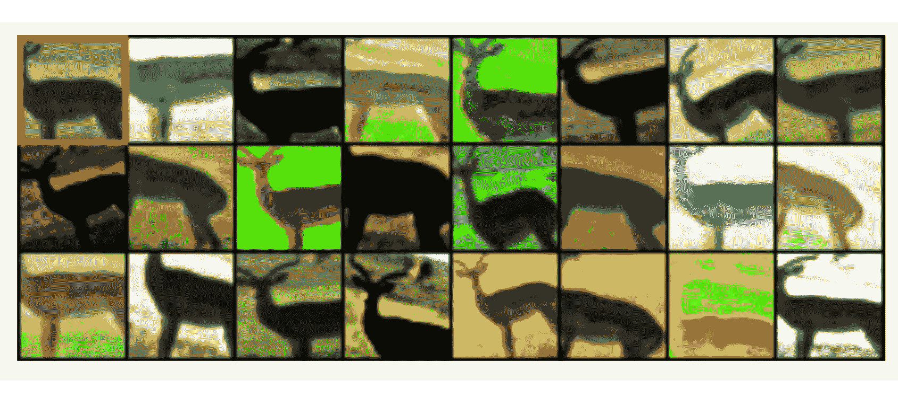

图 2。一只可爱鹿的原始补丁位于左上角。应用随机变换后，产生各种扭曲补丁。所有这些补丁在假设任务中应被分类为同一类。（图片来源：[Dosovitskiy 等人，2015](https://arxiv.org/abs/1406.6909)）

**旋转**整个图像（[Gidaris 等人，2018](https://arxiv.org/abs/1803.07728)是另一种有趣且廉价的修改输入图像的方式，同时语义内容保持不变。每个输入图像首先以随机的$90^\circ$的倍数旋转，对应于$[0^\circ, 90^\circ, 180^\circ, 270^\circ]$。模型被训练以预测应用了哪种旋转，因此是一个 4 类分类问题。

为了识别不同旋转的相同图像，模型必须学会识别高级对象部分，如头部、鼻子和眼睛，以及这些部分的相对位置，而不是局部模式。这个假设任务驱使模型以这种方式学习对象的语义概念。

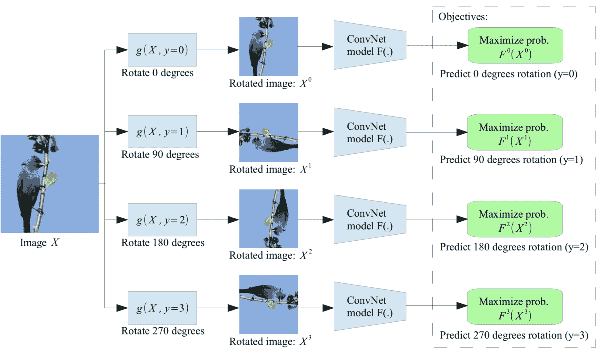

图 3。通过旋转整个输入图像进行自监督学习的示意图。模型学会预测应用了哪种旋转。（图片来源：[Gidaris 等人，2018](https://arxiv.org/abs/1803.07728)）

## 补丁

第二类自监督学习任务从一幅图像中提取多个补丁，并要求模型预测这些补丁之间的关系。

[Doersch 等人（2015）](https://arxiv.org/abs/1505.05192)将假设任务规定为预测一幅图像中两个随机补丁之间的**相对位置**。模型需要理解对象的空间上下文，以便告知部分之间的相对位置。

训练补丁的采样方式如下：

1.  随机采样第一个补丁，不参考图像内容。

1.  考虑第一个补丁放置在 3x3 网格的中间，第二个补丁从其周围 8 个相邻位置中采样。

1.  为了避免模型仅捕捉低级琐碎信号，如穿过边界连接一条直线或匹配局部模式，通过引入额外的噪声来增加：

    +   在补丁之间添加间隙

    +   小的抖动

    +   随机降低一些补丁的分辨率至少为 100 个像素，然后上采样，以增强对像素化的鲁棒性。

    +   将绿色和品红色向灰色移动或随机丢弃 3 种颜色通道中的 2 种（见下文的“色差”）

1.  模型被训练来预测第二个补丁选自 8 个相邻位置中的哪一个，这是一个包含 8 个类别的分类问题。

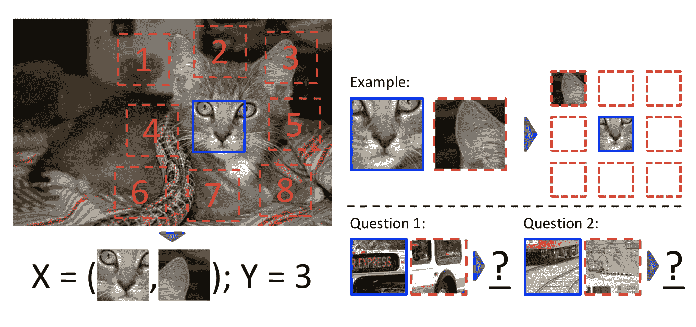

图 4\. 通过预测两个随机补丁的相对位置进行自监督学习的示意图。（图片来源：[Doersch et al., 2015](https://arxiv.org/abs/1505.05192)）

除了像边界模式或纹理等微不足道的信号持续外，另一个有趣且有点令人惊讶的微不足道解决方案被发现，称为[*“色差”*](https://en.wikipedia.org/wiki/Chromatic_aberration)。这是由于不同波长的光在透过镜头时具有不同的焦距而触发的。在这个过程中，颜色通道之间可能存在小的偏移。因此，模型可以通过简单比较两个补丁中绿色和品红的分离方式来学会告诉相对位置。这是一个微不足道的解决方案，与图像内容无关。通过将图像预处理为将绿色和品红向灰色移动或随机丢弃 3 个颜色通道中的 2 个来避免这个微不足道的解决方案。

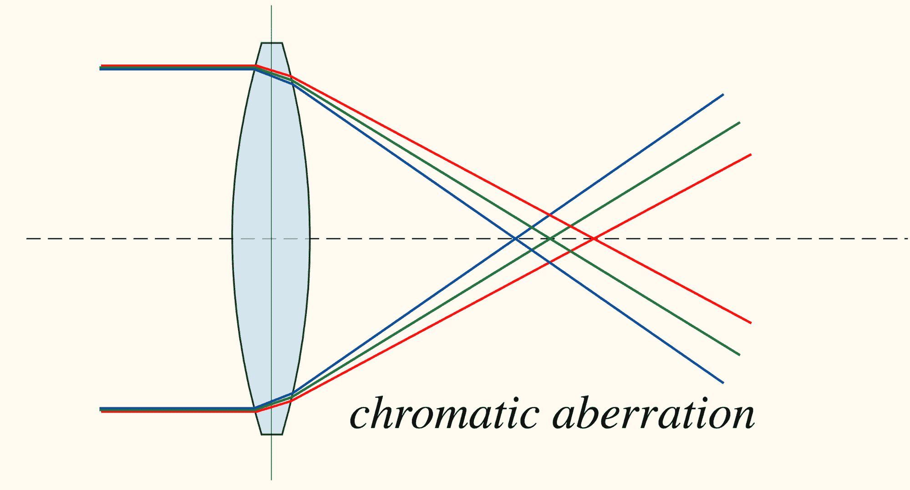

图 5\. 色差发生的示意图。（图片来源：[维基百科](https://upload.wikimedia.org/wikipedia/commons/a/aa/Chromatic_aberration_lens_diagram.svg)）

既然在上述任务中每个图像中已经设置了一个 3x3 的网格，为什么不使用所有 9 个补丁而不仅仅是 2 个来使任务更加困难呢？根据这个想法，[Noroozi & Favaro (2016)](https://arxiv.org/abs/1603.09246)设计了一个**拼图游戏**作为预文本任务：模型被训练将 9 个洗牌后的补丁放回原始位置。

卷积网络独立处理每个补丁，共享权重，并为预定义的排列集合中的每个补丁索引输出一个概率向量。为了控制拼图谜题的难度，该论文建议根据预定义的排列集合对补丁进行洗牌，并配置模型以预测整个集合中所有索引的概率向量。

因为输入补丁的洗牌方式不会改变正确的预测顺序。加快训练的一个潜在改进是使用不变排列图卷积网络（GCN），这样我们就不必多次洗牌相同的补丁集，与这篇[论文](https://arxiv.org/abs/1911.00025)中的想法相同。

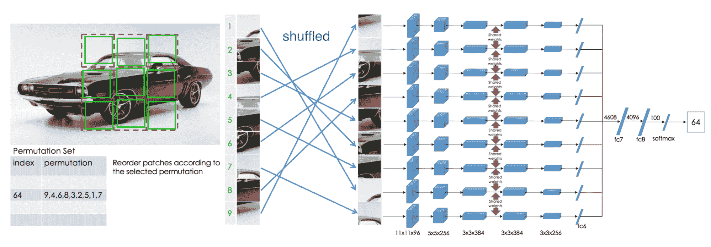

图 6\. 通过解决拼图谜题进行自监督学习的示意图。（图片来源：[Noroozi & Favaro, 2016](https://arxiv.org/abs/1603.09246)）

另一个想法是将“特征”或“视觉基元”视为可以在多个补丁上求和并在不同补丁之间进行比较的标量属性。然后，通过**计数特征**和简单算术来定义补丁之间的关系（[Noroozi, et al, 2017](https://arxiv.org/abs/1708.06734)）。

本文考虑了两种变换：

1.  *缩放*：如果一个图像被放大 2 倍，视觉基元的数量应该保持不变。

1.  *平铺*：如果一个图像被平铺成一个 2x2 的网格，预期视觉基元的数量将是原始特征计数的四倍。

该模型通过上述特征计数关系学习特征编码器 $\phi(.)$。给定一个输入图像 $\mathbf{x} \in \mathbb{R}^{m \times n \times 3}$，考虑两种类型的变换操作：

1.  下采样操作符，$D: \mathbb{R}^{m \times n \times 3} \mapsto \mathbb{R}^{\frac{m}{2} \times \frac{n}{2} \times 3}$：按 2 倍下采样

1.  平铺操作符 $T_i: \mathbb{R}^{m \times n \times 3} \mapsto \mathbb{R}^{\frac{m}{2} \times \frac{n}{2} \times 3}$：从图像的 2x2 网格中提取第 $i$ 个瓦片。

我们期望学习：

$$ \phi(\mathbf{x}) = \phi(D \circ \mathbf{x}) = \sum_{i=1}⁴ \phi(T_i \circ \mathbf{x}) $$

因此，均方误差损失为：$\mathcal{L}_\text{feat} = |\phi(D \circ \mathbf{x}) - \sum_{i=1}⁴ \phi(T_i \circ \mathbf{x})|²_2$。为了避免平凡解 $\phi(\mathbf{x}) = \mathbf{0}, \forall{\mathbf{x}}$，另一个损失项被添加以鼓励两个不同图像特征之间的差异：$\mathcal{L}_\text{diff} = \max(0, c -|\phi(D \circ \mathbf{y}) - \sum_{i=1}⁴ \phi(T_i \circ \mathbf{x})|²_2)$，其中 $\mathbf{y}$ 是与 $\mathbf{x}$ 不同的另一个输入图像，$c$ 是一个标量常数。最终损失为：

$$ \mathcal{L} = \mathcal{L}_\text{feat} + \mathcal{L}_\text{diff} = \|\phi(D \circ \mathbf{x}) - \sum_{i=1}⁴ \phi(T_i \circ \mathbf{x})\|²_2 + \max(0, M -\|\phi(D \circ \mathbf{y}) - \sum_{i=1}⁴ \phi(T_i \circ \mathbf{x})\|²_2) $$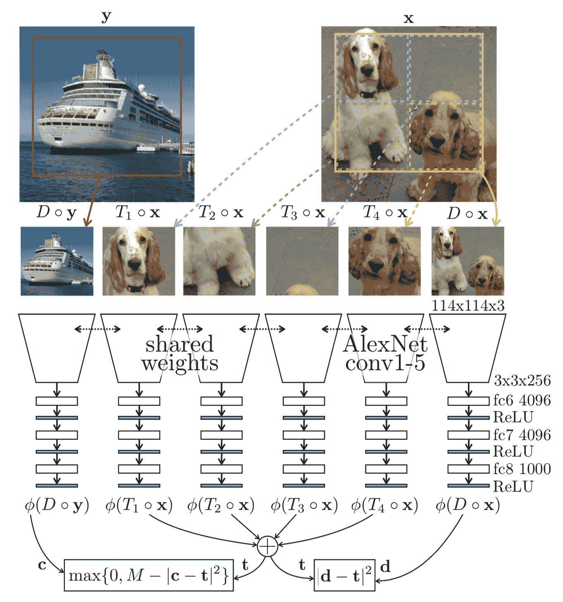

图 7\. 通过计数特征进行自监督表示学习。（图片来源：[Noroozi 等人，2017](https://arxiv.org/abs/1708.06734)）

## 上色

**上色**可以作为一个强大的自监督任务：模型被训练为给灰度输入图像上色；准确地说，任务是将这个图像映射到一个分布上的量化颜色值输出（[Zhang 等人，2016](https://arxiv.org/abs/1603.08511)）。

该模型在[CIE L*a*b*颜色空间](https://en.wikipedia.org/wiki/CIELAB_color_space)中输出颜色。L*a*b*颜色旨在近似人类视觉，而相比之下，RGB 或 CMYK 模型则输出物理设备的颜色。

+   L* 组件匹配了光亮度的人类感知；L* = 0 代表黑色，L* = 100 代表白色。

+   a* 组件代表绿色（负值）/品红色（正值）。

+   b* 组件模拟蓝色（负值）/黄色（正值）。

由于上色问题的多模态性质，预测的颜色值分布的交叉熵损失比原始颜色值的 L2 损失效果更好。a*b* 颜色空间被量化为桶大小为 10。

为了在常见颜色（通常是低 a*b*值，如云、墙壁和泥土等常见背景）和稀有颜色之间取得平衡（这些颜色可能与图像中的关键对象相关），损失函数通过加权项进行重新平衡，增加了罕见颜色桶的损失。这就像我们在信息检索模型中为什么需要[tf 和 idf](https://en.wikipedia.org/wiki/Tf%E2%80%93idf)来评分单词一样。加权项构造如下：(1-λ) * 高斯核平滑的经验概率分布 + λ * 均匀分布，其中两个分布都是在量化的 a*b*颜色空间上。

## 生成建模

生成建模中的预设任务是在学习有意义的潜在表示的同时重建原始输入。

**去噪自动编码器**（[Vincent 等人，2008](https://www.cs.toronto.edu/~larocheh/publications/icml-2008-denoising-autoencoders.pdf)）学习从部分损坏或带有随机噪声的图像中恢复图像。该设计灵感来自于人类即使在有噪声的图片中也能轻松识别物体，表明关键的视觉特征可以从噪声中提取和分离出来。查看我的[旧文章](https://lilianweng.github.io/posts/2018-08-12-vae/#denoising-autoencoder)。

**上下文编码器**（[Pathak 等人，2016](https://arxiv.org/abs/1604.07379)）被训练用于填补图像中的缺失部分。设$\hat{M}$为二进制掩码，0 表示删除的像素，1 表示剩余的输入像素。该模型通过重建（L2）损失和对抗损失的组合进行训练。由掩码定义的移除区域可以是任意形状。

$$ \begin{aligned} \mathcal{L}(\mathbf{x}) &= \mathcal{L}_\text{recon}(\mathbf{x}) + \mathcal{L}_\text{adv}(\mathbf{x})\\ \mathcal{L}_\text{recon}(\mathbf{x}) &= \|(1 - \hat{M}) \odot (\mathbf{x} - E(\hat{M} \odot \mathbf{x})) \|_2² \\ \mathcal{L}_\text{adv}(\mathbf{x}) &= \max_D \mathbb{E}_{\mathbf{x}} [\log D(\mathbf{x}) + \log(1 - D(E(\hat{M} \odot \mathbf{x})))] \end{aligned} $$

其中$E(.)$是编码器，$D(.)$是解码器。

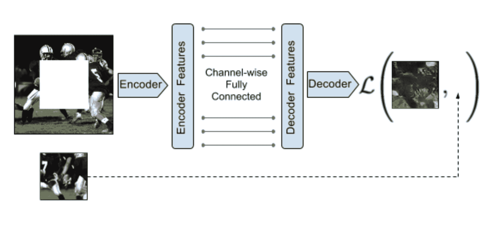

图 8\. 上下文编码器的示意图。（图片来源：[Pathak 等人，2016](https://arxiv.org/abs/1604.07379)）

在图像上应用遮罩时，上下文编码器会删除部分区域中所有颜色通道的信息。 那么只隐藏一部分通道呢？ **分裂脑自动编码器**（[Zhang 等人，2017](https://arxiv.org/abs/1611.09842)）通过从其余通道预测一部分颜色通道来实现这一点。 让数据张量 $\mathbf{x} \in \mathbb{R}^{h \times w \times \vert C \vert }$，其中 $C$ 为颜色通道，成为网络的第 $l$ 层的输入。 它被分成两个不相交的部分，$\mathbf{x}_1 \in \mathbb{R}^{h \times w \times \vert C_1 \vert}$ 和 $\mathbf{x}_2 \in \mathbb{R}^{h \times w \times \vert C_2 \vert}$，其中 $C_1 , C_2 \subseteq C$。 然后训练两个子网络进行两个互补的预测：一个网络 $f_1$ 从 $\mathbf{x}_1$ 预测 $\mathbf{x}_2$，另一个网络 $f_1$ 从 $\mathbf{x}_2$ 预测 $\mathbf{x}_1$。 如果颜色值被量化，则损失可以是 L1 损失或交叉熵损失。

分割可以在 RGB-D 或 L*a*b*颜色空间中进行一次，也可以在 CNN 网络的每一层中进行，其中通道数可以是任意的。

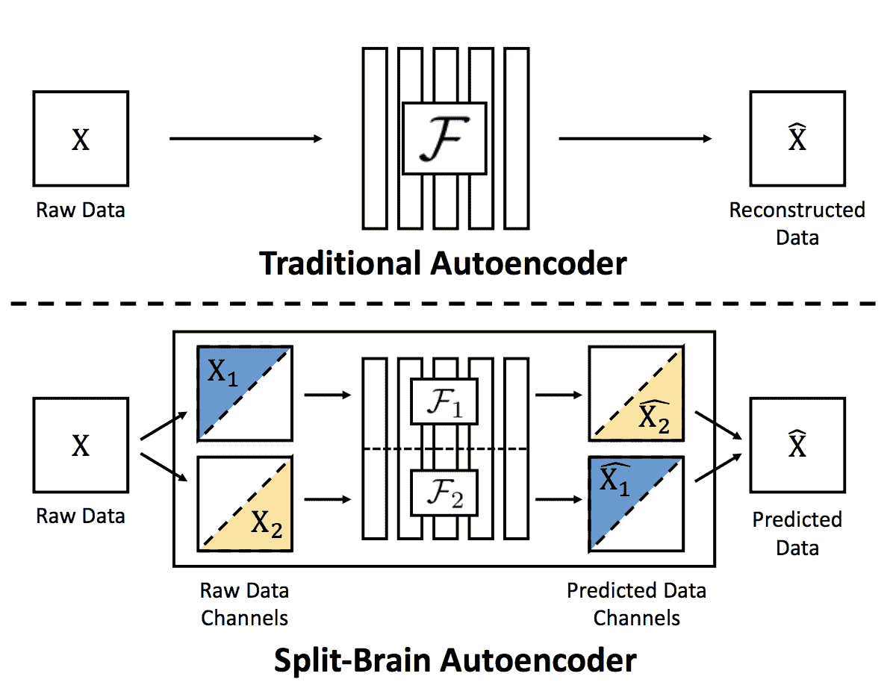

图 9\. 分裂脑自动编码器的示意图。 (图片来源：[Zhang 等人，2017](https://arxiv.org/abs/1611.09842))

生成对抗网络（GANs）能够学习将简单的潜变量映射到任意复杂的数据分布。 研究表明，这种生成模型的潜空间捕捉了数据中的语义变化；例如，在训练 GAN 模型时，一些潜变量与面部表情、眼镜、性别等相关联（[Radford 等人，2016](https://arxiv.org/abs/1511.06434)）。

**双向 GANs**（[Donahue 等人，2017](https://arxiv.org/abs/1605.09782)）引入了额外的编码器 $E(.)$ 来学习从输入到潜变量 $\mathbf{z}$ 的映射。 判别器 $D(.)$ 在输入数据和潜在表示 $(\mathbf{x}, \mathbf{z})$ 的联合空间中进行预测，以区分生成的对 $(\mathbf{x}, E(\mathbf{x}))$ 和真实对 $(G(\mathbf{z}), \mathbf{z})$。 该模型被训练以优化目标：$\min_{G, E} \max_D V(D, E, G)$，其中生成器 $G$ 和编码器 $E$ 学习生成足够逼真的数据和潜变量，以混淆判别器，同时判别器 $D$ 试图区分真实数据和生成数据。

$$ V(D, E, G) = \mathbb{E}_{\mathbf{x} \sim p_\mathbf{x}} [ \underbrace{\mathbb{E}_{\mathbf{z} \sim p_E(.\vert\mathbf{x})}[\log D(\mathbf{x}, \mathbf{z})]}_{\log D(\text{real})} ] + \mathbb{E}_{\mathbf{z} \sim p_\mathbf{z}} [ \underbrace{\mathbb{E}_{\mathbf{x} \sim p_G(.\vert\mathbf{z})}[\log 1 - D(\mathbf{x}, \mathbf{z})]}_{\log(1- D(\text{fake}))}) ] $$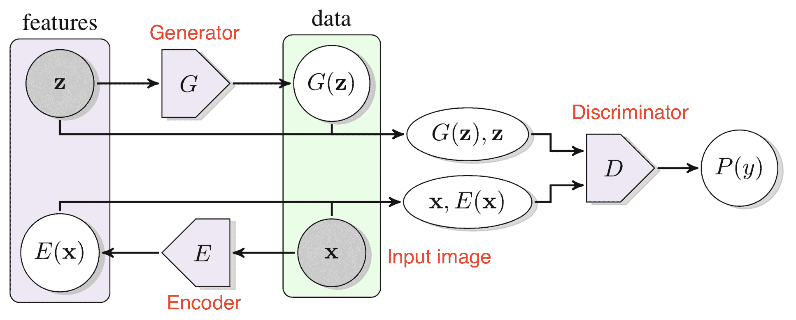

图 10\. 双向 GAN 的工作原理示意图。 (图片来源: [Donahue, et al, 2017](https://arxiv.org/abs/1605.09782))

## 对比学习

**对比预测编码（CPC）** ([van den Oord, et al. 2018](https://arxiv.org/abs/1807.03748)) 是一种从高维数据中无监督学习的方法，通过将生成建模问题转化为分类问题。 CPC 中的*对比损失*或*InfoNCE 损失*，受到[噪声对比估计（NCE）](https://lilianweng.github.io/posts/2017-10-15-word-embedding/#noise-contrastive-estimation-nce)的启发，使用交叉熵损失来衡量模型在一组不相关的“负样本”中对“未来”表示进行分类的能力。这种设计部分受到的启发是，单模损失如 MSE 没有足够的容量，但学习完整的生成模型可能太昂贵。

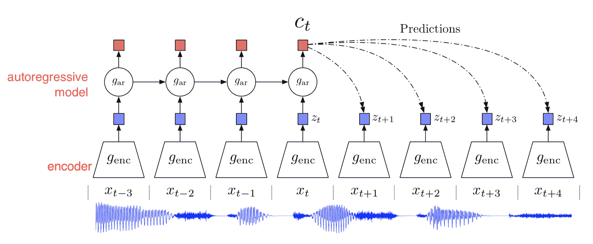

图 11\. 展示了如何在音频输入上应用对比预测编码。 (图片来源: [van den Oord, et al. 2018](https://arxiv.org/abs/1807.03748))

CPC 使用编码器来压缩输入数据 $z_t = g_\text{enc}(x_t)$，并使用*自回归*解码器来学习可能在未来预测中共享的高级上下文，$c_t = g_\text{ar}(z_{\leq t})$。端到端的训练依赖于受 NCE 启发的对比损失。

在预测未来信息时，CPC 被优化以最大化输入 $x$ 和上下文向量 $c$ 之间的互信息：

$$ I(x; c) = \sum_{x, c} p(x, c) \log\frac{p(x, c)}{p(x)p(c)} = \sum_{x, c} p(x, c)\log\frac{p(x|c)}{p(x)} $$

CPC 不直接对未来观察结果 $p_k(x_{t+k} \vert c_t)$ 建模（这可能相当昂贵），而是模拟一个密度函数以保留 $x_{t+k}$ 和 $c_t$ 之间的互信息：

$$ f_k(x_{t+k}, c_t) = \exp(z_{t+k}^\top W_k c_t) \propto \frac{p(x_{t+k}|c_t)}{p(x_{t+k})} $$

其中 $f_k$ 可以是未归一化的，用于预测的是一个线性变换 $W_k^\top c_t$，对于每一步 $k$ 使用不同的 $W_k$ 矩阵。

给定一个包含仅一个正样本 $x_t \sim p(x_{t+k} \vert c_t)$ 和 $N-1$ 个负样本 $x_{i \neq t} \sim p(x_{t+k})$ 的 $N$ 个随机样本集 $X = \{x_1, \dots, x_N\}$，正确分类正样本的交叉熵损失（其中 $\frac{f_k}{\sum f_k}$ 是预测）为：

$$ \mathcal{L}_N = - \mathbb{E}_X \Big[\log \frac{f_k(x_{t+k}, c_t)}{\sum_{i=1}^N f_k (x_i, c_t)}\Big] $$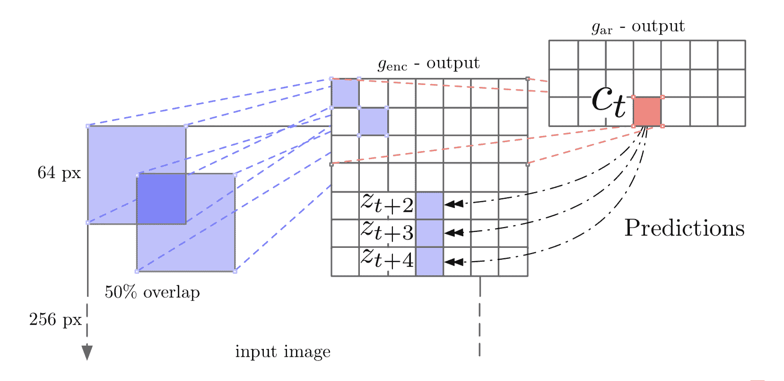

图 12\. 展示了如何在图像上应用对比预测编码。 (图片来源: [van den Oord, et al. 2018](https://arxiv.org/abs/1807.03748))

当在图像上使用 CPC 时 ([Henaff, et al. 2019](https://arxiv.org/abs/1905.09272))，预测网络应该只访问一个屏蔽的特征集，以避免平凡的预测。具体来说：

1.  每个输入图像被划分为一组重叠的补丁，每个补丁由一个 resnet 编码器编码，得到压缩特征向量$z_{i,j}$。

1.  掩蔽卷积网络通过一个掩码进行预测，以使给定输出神经元的感受野只能看到图像中它上方的内容。否则，预测问题将变得平凡。预测可以在两个方向（自上而下和自下而上）进行。

1.  预测是从上下文$c_{i,j}$中对$z_{i+k, j}$进行的：$\hat{z}_{i+k, j} = W_k c_{i,j}$。

对比损失通过一个目标来量化这种预测，即正确识别目标在同一图像中其他补丁和同一批次中其他图像中采样的一组负表示$\{z_l\}$：

$$ \mathcal{L}_\text{CPC} = -\sum_{i,j,k} \log p(z_{i+k, j} \vert \hat{z}_{i+k, j}, \{z_l\}) = -\sum_{i,j,k} \log \frac{\exp(\hat{z}_{i+k, j}^\top z_{i+k, j})}{\exp(\hat{z}_{i+k, j}^\top z_{i+k, j}) + \sum_l \exp(\hat{z}_{i+k, j}^\top z_l)} $$

欲了解更多关于对比学习的内容，请查看[“对比表示学习”](https://lilianweng.github.io/posts/2021-05-31-contrastive/)的文章。

# 基于视频的

一个视频包含一系列语义相关的帧。相邻帧在时间上接近且相关性更高，比远离的帧更相关。帧的顺序描述了某种推理和物理逻辑的规则；比如物体运动应该平滑，重力指向下方。

一个常见的工作流程是在未标记的视频上训练一个模型，然后将该模型的一个中间特征层馈送到一个简单模型上，用于下游任务的动作分类、分割或对象跟踪。

## 跟踪

一个物体的运动是由一系列视频帧跟踪的。同一物体在接近帧中在屏幕上的捕捉方式之间的差异通常不大，通常由物体或相机的微小运动触发。因此，学习同一物体在接近帧中的任何视觉表示应该在潜在特征空间中接近。受到这个想法的启发，[Wang & Gupta, 2015](https://arxiv.org/abs/1505.00687)提出了一种通过在视频中**跟踪移动物体**来无监督学习视觉表示的方法。

精确地跟踪具有运动的补丁在一个小时间窗口内（例如 30 帧）。选择第一个补丁$\mathbf{x}$和最后一个补丁$\mathbf{x}^+$作为训练数据点。如果直接训练模型以最小化两个补丁特征向量之间的差异，模型可能只学会将所有内容映射到相同的值。为避免这样的平凡解，与上文相同，添加一个随机第三个补丁$\mathbf{x}^-$。模型通过强制执行两个跟踪补丁之间的距离比特征空间中第一个补丁和随机补丁之间的距离更近来学习表示，$D(\mathbf{x}, \mathbf{x}^-)) > D(\mathbf{x}, \mathbf{x}^+)$，其中$D(.)$是余弦距离，

$$ D(\mathbf{x}_1, \mathbf{x}_2) = 1 - \frac{f(\mathbf{x}_1) f(\mathbf{x}_2)}{\|f(\mathbf{x}_1)\| \|f(\mathbf{x}_2\|)} $$

损失函数为：

$$ \mathcal{L}(\mathbf{x}, \mathbf{x}^+, \mathbf{x}^-) = \max\big(0, D(\mathbf{x}, \mathbf{x}^+) - D(\mathbf{x}, \mathbf{x}^-) + M\big) + \text{weight decay regularization term} $$

其中$M$是一个标量常数，控制两个距离之间的最小间隙；本文中$M=0.5$。该损失在最佳情况下强制执行$D(\mathbf{x}, \mathbf{x}^-) >= D(\mathbf{x}, \mathbf{x}^+) + M$。

这种形式的损失函数在人脸识别任务中也被称为[三元损失](https://arxiv.org/abs/1503.03832)，其中数据集包含来自多个摄像机角度的多个人的图像。设$\mathbf{x}^a$为特定人员的锚定图像，$\mathbf{x}^p$为该同一人员的不同角度的正图像，$\mathbf{x}^n$为不同人员的负图像。在嵌入空间中，$\mathbf{x}^a$应比$\mathbf{x}^n$更接近$\mathbf{x}^p$：

$$ \mathcal{L}_\text{triplet}(\mathbf{x}^a, \mathbf{x}^p, \mathbf{x}^n) = \max(0, \|\phi(\mathbf{x}^a) - \phi(\mathbf{x}^p) \|_2² - \|\phi(\mathbf{x}^a) - \phi(\mathbf{x}^n) \|_2² + M) $$

一种略有不同的三元损失形式，名为[n-pair loss](https://papers.nips.cc/paper/6200-improved-deep-metric-learning-with-multi-class-n-pair-loss-objective)也常用于机器人任务中学习观测嵌入。更多相关内容请参见后续章节。

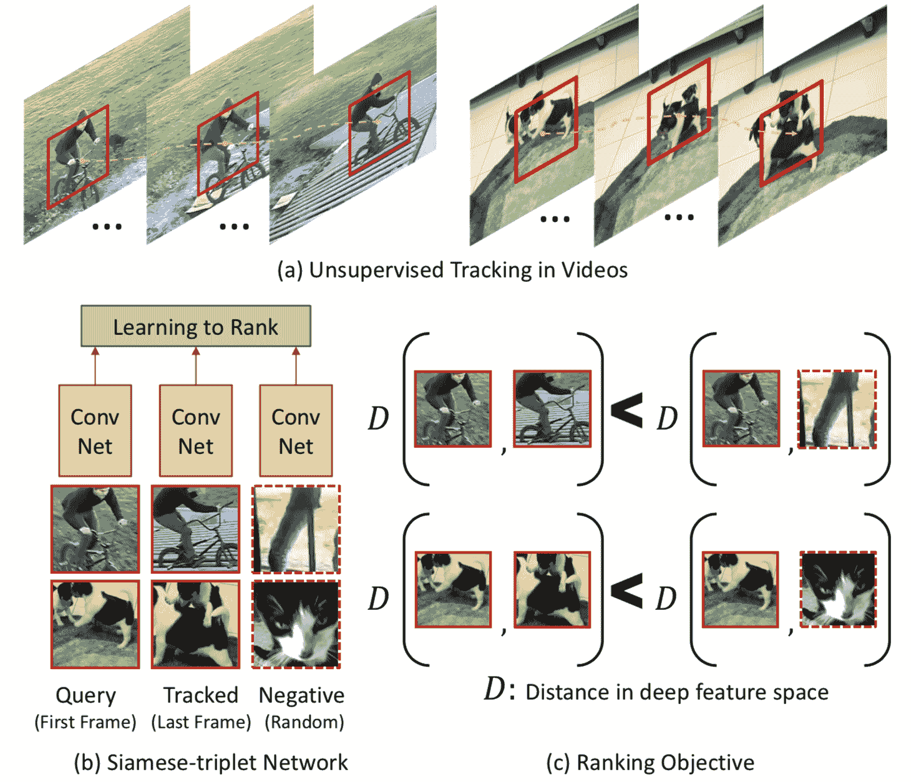

图 13. 视频中通过跟踪物体学习表示的概述。 (a) 在短跟踪中识别移动补丁； (b) 将两个相关补丁和一个随机补丁输入具有共享权重的卷积网络。 (c) 损失函数强制执行相关补丁之间的距离比随机补丁之间的距离更近。 (图片来源：[Wang & Gupta, 2015](https://arxiv.org/abs/1505.00687))

通过两步无监督的[光流](https://en.wikipedia.org/wiki/Optical_flow)方法跟踪和提取相关补丁：

1.  获取[SURF](https://www.vision.ee.ethz.ch/~surf/eccv06.pdf)兴趣点并使用[IDT](https://hal.inria.fr/hal-00873267v2/document)获取每个 SURF 点的运动。

1.  给定 SURF 兴趣点的轨迹，如果流量大小超过 0.5 像素，则将这些点分类为移动点。

在训练期间，给定一对相关的补丁$\mathbf{x}$和$\mathbf{x}^+$，在同一批次中随机采样$K$个补丁$\{\mathbf{x}^-\}$以形成$K$个训练三元组。经过几个时期后，应用*硬负样本挖掘*使训练更加困难和高效，即搜索最大化损失的随机补丁，并使用它们进行梯度更新。

## 帧序列

视频帧自然地按时间顺序排列。研究人员提出了几个自监督任务，这些任务的动机是良好的表示应该学习*正确的帧序列*。

其中一个想法是**验证帧序列**（[Misra 等人，2016](https://arxiv.org/abs/1603.08561)）。预设任务是确定视频中的一系列帧是否按正确的时间顺序排列（“时间有效”）。模型需要跟踪和推理物体在帧之间的微小运动，以完成这样的任务。

训练帧从高运动窗口中采样。每次采样 5 帧$(f_a, f_b, f_c, f_d, f_e)$，时间戳按顺序排列$a < b < c < d < e$。在 5 帧中，创建一个正元组$(f_b, f_c, f_d)$和两个负元组，$(f_b, f_a, f_d)$和$(f_b, f_e, f_d)$。参数$\tau_\max = \vert b-d \vert$控制正训练实例的难度（即越高→越难），参数$\tau_\min = \min(\vert a-b \vert, \vert d-e \vert)$控制负样本的难度（即越低→越难）。

视频帧顺序验证的预设任务被证明在作为预训练步骤时，可以提高动作识别等下游任务的性能。

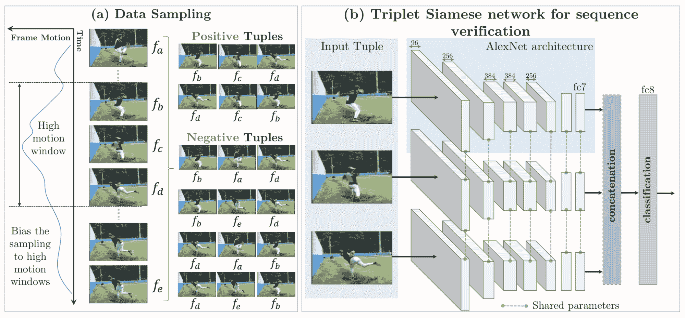

图 14。通过验证视频帧顺序学习表示的概述。 (a) 数据样本处理过程；(b) 模型是一个三元组孪生网络，其中所有输入帧共享权重。 (图片来源：[Misra 等人，2016](https://arxiv.org/abs/1603.08561))

*O3N*（Odd-One-Out Network；[Fernando 等人，2017](https://arxiv.org/abs/1611.06646)）中的任务也是基于视频帧序列验证。比上述进一步，任务是**从多个视频剪辑中选择错误的序列**。

给定$N+1$个输入视频剪辑，其中一个剪辑的帧被打乱，因此顺序错误，其余$N$个剪辑保持正确的时间顺序。O3N 学习预测奇数视频剪辑的位置。在他们的实验中，有 6 个输入剪辑，每个剪辑包含 6 帧。

视频中的**时间箭头**包含非常丰富的信息，既有低级物理（例如重力将物体拉向地面；烟雾上升；水向下流动），也有高级事件推理（例如鱼向前游动；你可以打破一个鸡蛋但不能逆转它）。因此，受此启发，另一个想法是通过预测时间箭头（AoT）来学习潜在表示，即视频是正向播放还是反向播放（[Wei et al., 2018](https://www.robots.ox.ac.uk/~vgg/publications/2018/Wei18/wei18.pdf)）。

一个分类器应该捕捉低级物理和高级语义，以便预测时间的箭头。所提出的*T-CAM*（时间类激活图）网络接受$T$组，每组包含一定数量的光流帧。来自每组的卷积层输出被串联并馈入二元逻辑回归，用于预测时间的箭头。


图 15\. 通过预测时间箭头学习表示的概述。（a）多组帧序列的卷积特征被串联。（b）顶层包含 3 个卷积层和平均池化。（图片来源：[Wei et al, 2018](https://www.robots.ox.ac.uk/~vgg/publications/2018/Wei18/wei18.pdf))

有趣的是，数据集中存在一些人工线索。如果处理不当，可能会导致一个不依赖于实际视频内容的琐碎分类器：

+   由于视频压缩，黑色边框可能不完全是黑色，而是可能包含某些关于时间顺序的信息。因此，在实验中应该去除黑色边框。

+   大的摄像机运动，如垂直平移或缩放，也提供了时间箭头的强烈信号，但与内容无关。处理阶段应稳定摄像机运动。

当作为预训练步骤使用时，AoT 预文本任务被证明可以提高下游任务中的动作分类性能。请注意，仍然需要微调。

## 视频着色

[Vondrick et al. (2018)](https://arxiv.org/abs/1806.09594)提出了**视频着色**作为一个自监督学习问题，产生了一个丰富的表示，可用于视频分割和未标记的视觉区域跟踪，*无需额外微调*。

与基于图像的着色不同，这里的任务是通过利用视频帧之间的自然时间一致性，从一个彩色参考帧中复制颜色到另一个灰度目标帧，因此这两个帧在时间上不应该相隔太远。为了一致地复制颜色，模型被设计为学习跟踪不同帧中相关像素。

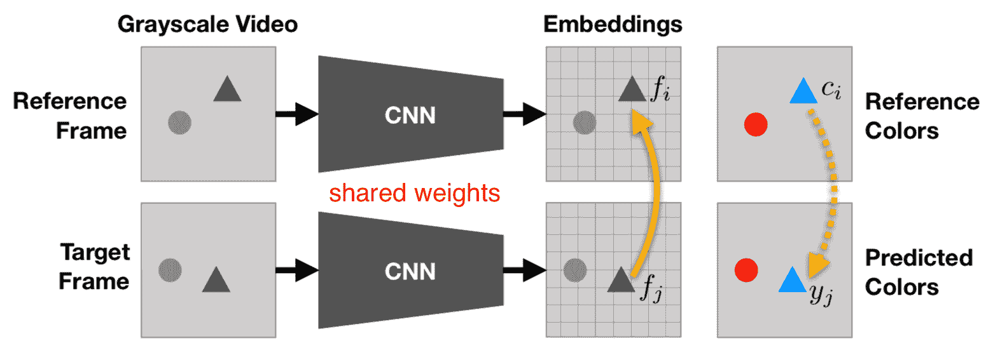

图 16\. 通过从参考帧复制颜色到灰度目标帧进行视频着色。（图片来源：[Vondrick et al. 2018](https://arxiv.org/abs/1806.09594)）

这个想法非常简单而聪明。让$c_i$表示参考帧中第$i$个像素的真实颜色，$c_j$表示目标帧中第$j$个像素的颜色。目标帧中第$j$个像素的预测颜色$\hat{c}_j$是参考帧中所有像素颜色的加权和，其中加权项衡量了相似性：

$$ \hat{c}_j = \sum_i A_{ij} c_i \text{ where } A_{ij} = \frac{\exp(f_i f_j)}{\sum_{i'} \exp(f_{i'} f_j)} $$

其中$f$是对应像素的学习嵌入；$i'$索引参考帧中的所有像素。加权项实现了一种基于注意力的指向机制，类似于[匹配网络](https://lilianweng.github.io/posts/2018-11-30-meta-learning/#matching-networks)和[指针网络](https://lilianweng.github.io/posts/2018-06-24-attention/#pointer-network)。由于完整的相似性矩阵可能非常庞大，因此对两个帧进行了降采样。使用$c_j$和$\hat{c}_j$之间的分类交叉熵损失，使用量化颜色，就像[Zhang 等人 2016 年](https://arxiv.org/abs/1603.08511)中一样。

根据参考帧的标记方式，该模型可用于完成多个基于颜色的下游任务，如时间上的跟踪分割或人体姿势。无需微调。参见图 15。

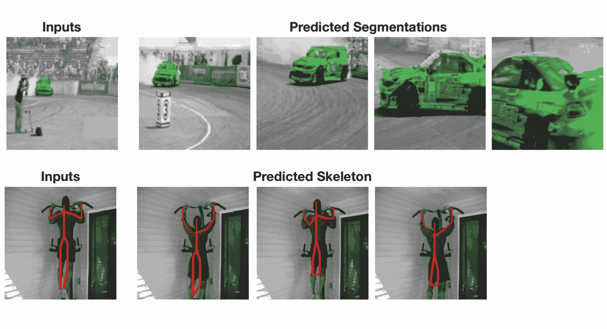

图 17。使用视频着色来跟踪对象分割和人体姿势随时间变化。（图片来源：[Vondrick et al. (2018)](https://arxiv.org/abs/1806.09594)）

> 几个常见观察：
> 
> +   结合多个预训练任务可以提高性能；
> +   
> +   更深的网络提高了表示的质量；
> +   
> +   监督学习基线仍然远远超过所有其他方法。

# 基于控制

在现实世界中运行 RL 策略，比如控制一个基于视觉输入的物理机器人，正确跟踪状态、获取奖励信号或确定是否实现目标并不是一件简单的事情。视觉数据中存在许多与真实状态无关的噪音，因此无法通过像素级比较推断状态的等价性。自监督表示学习在学习可用作控制策略输入的有用状态嵌入方面表现出巨大潜力。

本节讨论的所有案例都是关于机器人学习的，主要是从多个摄像头视图中获取状态表示和目标表示。

## 多视图度量学习

在前面的多个部分中多次提到了度量学习的概念。一个常见的设置是：给定一组样本三元组，（*锚点* $s_a$，*正样本* $s_p$，*负样本* $s_n$），学习到的表示嵌入$\phi(s)$使得在潜在空间中$s_a$与$s_p$保持接近，但与$s_n$保持远离。

**Grasp2Vec**（[Jang & Devin 等人，2018](https://arxiv.org/abs/1811.06964)）旨在从自由、未标记的抓取活动中学习机器人抓取任务中的以物体为中心的视觉表示。所谓以物体为中心，意味着无论环境或机器人的外观如何，如果两幅图像包含相似的物品，它们应该被映射到相似的表示；否则，嵌入应该相距甚远。


图 18. grasp2vec 学习以物体为中心的状态嵌入的概念示意图。（图片来源：[Jang & Devin 等人，2018](https://arxiv.org/abs/1811.06964)）

抓取系统可以告诉它是否移动了一个物体，但无法告诉是哪个物体。摄像头设置为拍摄整个场景和被抓取的物体的图像。在早期训练期间，抓取机器人被执行以随机抓取任何物体$o$，产生一组图像，$(s_\text{pre}, s_\text{post}, o)$：

+   $o$是被抓取的物体的图像，被举到摄像头前；

+   $s_\text{pre}$是抓取前的场景图像，托盘中有物体$o`。

+   $s_\text{post}$是同一场景的一幅图像，在抓取后，托盘中没有物体$o$。

学习以物体为中心的表示，我们期望$s_\text{pre}$和$s_\text{post}$的嵌入之间的差异能够捕捉到被移除的物体$o$。这个想法非常有趣，类似于在[word embedding](https://lilianweng.github.io/posts/2017-10-15-word-embedding/)中观察到的关系，例如距离(“king”, “queen”) ≈ 距离(“man”, “woman”)。

让$\phi_s$和$\phi_o$分别是场景和物体的嵌入函数。模型通过最小化$\phi_s(s_\text{pre}) - \phi_s(s_\text{post})$和$\phi_o(o)$之间的距离来学习表示，使用*n-pair loss*：

$$ \begin{aligned} \mathcal{L}_\text{grasp2vec} &= \text{NPair}(\phi_s(s_\text{pre}) - \phi_s(s_\text{post}), \phi_o(o)) + \text{NPair}(\phi_o(o), \phi_s(s_\text{pre}) - \phi_s(s_\text{post})) \\ \text{where }\text{NPair}(a, p) &= \sum_{i

其中$B$指的是一批（锚点，正样本）样本对。

当将表示学习构建为度量学习时，[**n-pair loss**](https://papers.nips.cc/paper/6200-improved-deep-metric-learning-with-multi-class-n-pair-loss-objective)是一个常见选择。与处理显式的三元组（锚点，正样本，负样本）样本不同，n-pairs loss 将一个小批次中的所有其他正实例视为负实例。

嵌入函数 $\phi_o$ 在展示目标 $g$ 与图像时效果很好。量化实际抓取物体 $o$ 与目标之间接近程度的奖励函数定义为 $r = \phi_o(g) \cdot \phi_o(o)$。请注意，计算奖励仅依赖于学习到的潜在空间，不涉及地面真实位置，因此可用于在真实机器人上进行训练。


图 19\. grasp2vec 嵌入的定位结果。在抓取前场景中定位目标物体的热图定义为 $\phi\_o(o)^\top \phi\_{s, \text{spatial}} (s\_\text{pre})$，其中 $\phi\_{s, \text{spatial}}$ 是经过 ReLU 后的最后一个 resnet 块的输出。第四列是一个失败案例，最后三列使用真实图像作为目标。（图片来源：[Jang & Devin 等人，2018](https://arxiv.org/abs/1811.06964)）

除了基于嵌入相似性的奖励函数外，在 grasp2vec 框架中训练 RL 策略还有一些其他技巧：

+   *事后标记*：通过将随机抓取的物体标记为正确目标来增强数据集，类似于 HER（回顾经验重放；[Andrychowicz, et al., 2017](https://papers.nips.cc/paper/7090-hindsight-experience-replay.pdf)）。

+   *辅助目标增强*：通过使用未实现目标重新标记转换来进一步增强重放缓冲区；准确地说，在每次迭代中，会随机抽取两个目标 $(g, g’)$ 并将两者用于向重放缓冲区添加新的转换。

**TCN**（**时间对比网络**；[Sermanet, et al. 2018](https://arxiv.org/abs/1704.06888)）从多摄像头视角视频中学习，其直觉是同一场景在同一时间步的不同视角应该共享相同的嵌入（类似于 [FaceNet](https://arxiv.org/abs/1503.03832)），而嵌入在时间上应该变化，即使是相同摄像头视角。因此，嵌入捕捉了潜在状态的语义含义，而不是视觉相似性。TCN 嵌入使用 三元组损失 进行训练。

训练数据是通过同时从不同角度拍摄同一场景的视频收集的。所有视频都没有标签。


图 20\. 时间对比学习状态嵌入方法的示意图。在同一时间步从两个摄像头视角选择的蓝色帧是锚点和正样本，而在不同时间步的红色帧是负样本。

TCN 嵌入提取对摄像头配置不变的视觉特征。它可以用于构建基于欧氏距离的模仿学习奖励函数，该距离是演示视频与潜在空间中的观察之间的距离。

对 TCN 的进一步改进是联合学习多帧的嵌入，而不是单帧，从而产生**mfTCN**（**多帧时间对比网络**；[Dwibedi 等人，2019](https://arxiv.org/abs/1808.00928)）。给定来自多个同步摄像机视角的视频集$v_1, v_2, \dots, v_k$，在每个视频中以步长$s$选择时间$t$和前$n-1$帧的帧，将其聚合并映射为一个嵌入向量，从而产生大小为$(n−1) \times s + 1$的回顾窗口。每帧首先经过 CNN 提取低级特征，然后我们使用 3D 时间卷积在时间上聚合帧。该模型使用 n-pairs loss 进行训练。


图 21。训练 mfTCN 的采样过程。（图片来源：[Dwibedi 等人，2019](https://arxiv.org/abs/1808.00928)）

训练数据的采样方式如下：

1.  首先构建两对视频剪辑。每对包含来自不同摄像机视图但具有同步时间步的两个剪辑。这两组视频应该在时间上相隔很远。

1.  同时从同一对视频剪辑中抽取固定数量的帧，步幅相同。

1.  具有相同时间步的帧在 n-pair loss 中被训练为正样本，而跨对的帧则为负样本。

mfTCN 嵌入可以捕捉场景中物体的位置和速度（例如在倒立摆中），也可以用作策略的输入。

## 自主目标生成

**RIG**（**具有想象目标的强化学习**；[Nair 等人，2018](https://arxiv.org/abs/1807.04742)）描述了一种训练带有无监督表示学习的目标条件策略的方法。策略通过首先想象“虚假”目标，然后尝试实现这些目标来从自我监督练习中学习。


图 22。RIG 的工作流程。（图片来源：[Nair 等人，2018](https://arxiv.org/abs/1807.04742)）

任务是控制机器臂将桌子上的小冰球推到所需位置。所需位置或目标在图像中呈现。在训练过程中，通过$\beta$-VAE 编码器学习状态$s$和目标$g$的潜在嵌入，控制策略完全在潜在空间中运行。

假设一个[$\beta$-VAE](https://lilianweng.github.io/posts/2018-08-12-vae/#beta-vae)具有一个编码器$q_\phi$将输入状态映射到由高斯分布建模的潜在变量$z$，并且一个解码器$p_\psi$将$z$映射回状态。RIG 中的状态编码器设置为$\beta$-VAE 编码器的均值。

$$ \begin{aligned} z &\sim q_\phi(z \vert s) = \mathcal{N}(z; \mu_\phi(s), \sigma²_\phi(s)) \\ \mathcal{L}_{\beta\text{-VAE}} &= - \mathbb{E}_{z \sim q_\phi(z \vert s)} [\log p_\psi (s \vert z)] + \beta D_\text{KL}(q_\phi(z \vert s) \| p_\psi(s)) \\ e(s) &\triangleq \mu_\phi(s) \end{aligned} $$

奖励是状态和目标嵌入向量之间的欧氏距离：$r(s, g) = -|e(s) - e(g)|$。类似于 grasp2vec，RIG 通过潜在目标重新标记的数据增强来实现：随机生成一半的目标来自先验，另一半使用 HER 选择。与 grasp2vec 一样，奖励不依赖于任何地面真实状态，而只依赖于学习到的状态编码，因此可以用于在真实机器人上进行训练。


图 23. RIG 的算法。（图片来源：[Nair 等，2018](https://arxiv.org/abs/1807.04742)）

RIG 的问题在于在想象的目标图片中缺乏物体变化。如果$\beta$-VAE 只用黑色的冰球进行训练，它将无法创建具有其他形状和颜色的块等其他物体的目标。后续改进将$\beta$-VAE 替换为**CC-VAE**（上下文条件化 VAE；[Nair 等，2019](https://arxiv.org/abs/1910.11670)），灵感来自**CVAE**（条件化 VAE；[Sohn，Lee 和 Yan，2015](https://papers.nips.cc/paper/5775-learning-structured-output-representation-using-deep-conditional-generative-models)），用于目标生成。


图 24. 上下文条件化 RIG 的工作流程。（图片来源：[Nair 等，2019](https://arxiv.org/abs/1910.11670)）。

CVAE 在上下文变量$c$上进行条件化。它训练一个编码器$q_\phi(z \vert s, c)$和一个解码器$p_\psi (s \vert z, c)$，请注意两者都可以访问$c$。CVAE 损失惩罚从输入状态$s$通过信息瓶颈传递信息，但允许*无限制*地从$c$传递信息到编码器和解码器。

$$ \mathcal{L}_\text{CVAE} = - \mathbb{E}_{z \sim q_\phi(z \vert s,c)} [\log p_\psi (s \vert z, c)] + \beta D_\text{KL}(q_\phi(z \vert s, c) \| p_\psi(s)) $$

为了创建合理的目标，CC-VAE 在起始状态$s_0$上进行条件化，以便生成的目标呈现与$s_0$中相同类型的对象。这种目标一致性是必要的；例如，如果当前场景包含红色冰球，但目标是蓝色块，这将使策略混淆。

除了状态编码器$e(s) \triangleq \mu_\phi(s)$之外，CC-VAE 还训练第二个卷积编码器$e_0(.)$将起始状态$s_0$转换为紧凑的上下文表示$c = e_0(s_0)$。两个编码器$e(.)$和$e_0(.)$有意不共享权重，因为它们预期编码图像变化的不同因素。除了 CVAE 的损失函数外，CC-VAE 还添加了一个额外项来学习将$c$重构回$s_0$，$\hat{s}_0 = d_0(c)$。

$$ \mathcal{L}_\text{CC-VAE} = \mathcal{L}_\text{CVAE} + \log p(s_0\vert c) $$

图 25\. CVAE 生成的想象目标示例，条件是上下文图像（第一行），而 VAE 无法捕捉对象的一致性。（图片来源：[Nair 等人，2019](https://arxiv.org/abs/1910.11670)）。

## 双模拟

任务不可知的表示（例如，一个旨在表示系统中所有动态的模型）可能会分散 RL 算法，因为还会呈现不相关信息。例如，如果我们只是训练一个自动编码器来重构输入图像，那么不能保证整个学习到的表示对 RL 有用。因此，如果我们只想学习与控制相关的信息，那么我们需要摆脱基于重构的表示学习，因为不相关的细节对于重构仍然很重要。

基于双模拟的控制表示学习不依赖于重构，而是旨在根据 MDP 中的行为相似性对状态进行分组。

**双模拟**（[Givan 等人，2003](http://citeseerx.ist.psu.edu/viewdoc/download?doi=10.1.1.61.2493&rep=rep1&type=pdf)）指的是两个具有相似长期行为的状态之间的等价关系。*双模拟度量*量化这种关系，以便我们可以聚合状态以将高维状态空间压缩为更小的空间以进行更有效的计算。两个状态之间的*双模拟距离*对应于这两个状态在行为上有多大不同。

给定一个[MDP](https://lilianweng.github.io/posts/2018-02-19-rl-overview/#markov-decision-processes) $\mathcal{M} = \langle \mathcal{S}, \mathcal{A}, \mathcal{P}, \mathcal{R}, \gamma \rangle$和一个双模拟关系$B$，在关系$B$下相等的两个状态（即$s_i B s_j$）应该对所有动作具有相同的即时奖励和相同的转移概率到下一个双模拟状态：

$$ \begin{aligned} \mathcal{R}(s_i, a) &= \mathcal{R}(s_j, a) \; \forall a \in \mathcal{A} \\ \mathcal{P}(G \vert s_i, a) &= \mathcal{P}(G \vert s_j, a) \; \forall a \in \mathcal{A} \; \forall G \in \mathcal{S}_B \end{aligned} $$

其中$\mathcal{S}_B$是在关系$B$下状态空间的一个分区。

注意$=$始终是一个双模拟关系。最有趣的是最大双模拟关系$\sim$，它定义了一个具有*最少*状态组的分区$\mathcal{S}_\sim$。


图 26\. DeepMDP 通过在奖励模型和动态模型上最小化两个损失来学习潜在空间模型。（图片来源：[Gelada 等人，2019](https://arxiv.org/abs/1906.02736)）

与双模拟度量类似，**DeepMDP**（[Gelada 等人，2019](https://arxiv.org/abs/1906.02736)）简化了 RL 任务中的高维观察，并通过最小化两个损失来学习潜在空间模型：

1.  奖励的预测和

1.  预测下一个潜在状态的分布。

$$ \begin{aligned} \mathcal{L}_{\bar{\mathcal{R}}}(s, a) = \vert \mathcal{R}(s, a) - \bar{\mathcal{R}}(\phi(s), a) \vert \\ \mathcal{L}_{\bar{\mathcal{P}}}(s, a) = D(\phi \mathcal{P}(s, a), \bar{\mathcal{P}}(. \vert \phi(s), a)) \end{aligned} $$

其中 $\phi(s)$ 是状态 $s$ 的嵌入；带有横线的符号是在潜在的低维观察空间中运行的函数（奖励函数 $R$ 和转移函数 $P$）在同一个 MDP 中。这里的嵌入表示 $\phi$ 可以与双模拟度量联系起来，因为双模拟距离被证明上界由潜在空间中的 L2 距离给出。

函数 $D$ 量化了两个概率分布之间的距离，应该谨慎选择。DeepMDP 专注于*Wasserstein-1*度量（也称为[“地球移动者距离”](https://lilianweng.github.io/posts/2017-08-20-gan/#what-is-wasserstein-distance)）。度量空间 $(M, d)$ 上分布 $P$ 和 $Q$ 之间的 Wasserstein-1 距离（即 $d: M \times M \to \mathbb{R}$）是：

$$ W_d (P, Q) = \inf_{\lambda \in \Pi(P, Q)} \int_{M \times M} d(x, y) \lambda(x, y) \; \mathrm{d}x \mathrm{d}y $$

其中 $\Pi(P, Q)$ 是 $P$ 和 $Q$ 的所有[耦合](https://en.wikipedia.org/wiki/Coupling_(probability))的集合。$d(x, y)$ 定义了将粒子从点 $x$ 移动到点 $y$ 的成本。

Wasserstein 度量具有根据蒙日-坎托罗维奇对偶的双重形式：

$$ W_d (P, Q) = \sup_{f \in \mathcal{F}_d} \vert \mathbb{E}_{x \sim P} f(x) - \mathbb{E}_{y \sim Q} f(y) \vert $$

其中 $\mathcal{F}_d$ 是在度量 $d$ 下的 1-利普希茨函数集 - $\mathcal{F}_d = \{ f: \vert f(x) - f(y) \vert \leq d(x, y) \}$。

DeepMDP 将模型推广到规范最大均值差异（Norm-[MMD](https://en.wikipedia.org/wiki/Kernel_embedding_of_distributions#Measuring_distance_between_distributions)）度量，以改善其深度值函数的界限紧密度，并同时节省计算（Wasserstein 在计算上很昂贵）。在他们的实验中，他们发现转移预测模型的模型架构对性能有很大影响。在训练无模型 RL 代理时添加这些 DeepMDP 损失作为辅助损失会在大多数 Atari 游戏中带来很好的改进。

**控制的深度双模拟**（简称**DBC**；[Zhang et al. 2020](https://arxiv.org/abs/2006.10742)）学习了在 RL 任务中对控制有利的观察的潜在表示，无需领域知识或像素级重建。


图 27. 控制的深度双模拟算法通过学习奖励模型和动力学模型学习双模拟度量表示。模型架构是孪生网络。（图片来源：[Zhang et al. 2020](https://arxiv.org/abs/2006.10742)）

与 DeepMDP 类似，DBC 通过学习奖励模型和转移模型来建模动态。这两个模型在潜在空间 $\phi(s)$ 中运行。嵌入 $\phi$ 的优化取决于 [Ferns 等人 2004](https://arxiv.org/abs/1207.4114)（定理 4.5）和 [Ferns 等人 2011](http://citeseerx.ist.psu.edu/viewdoc/download?doi=10.1.1.295.2114&rep=rep1&type=pdf)（定理 2.6）中的一个重要结论：

> 给定 $c \in (0, 1)$ 为折扣因子，$\pi$ 为持续改进的策略，$M$ 为状态空间 $\mathcal{S}$ 上有界[伪度量](https://mathworld.wolfram.com/Pseudometric.html)的空间，我们可以定义 $\mathcal{F}: M \mapsto M$：
> 
> $$ \mathcal{F}(d; \pi)(s_i, s_j) = (1-c) \vert \mathcal{R}_{s_i}^\pi - \mathcal{R}_{s_j}^\pi \vert + c W_d (\mathcal{P}_{s_i}^\pi, \mathcal{P}_{s_j}^\pi) $$
> 
> 然后，$\mathcal{F}$ 有一个唯一的不动点 $\tilde{d}$，它是一个 $\pi^*$-双模拟度量，且 $\tilde{d}(s_i, s_j) = 0 \iff s_i \sim s_j$.

[证明并不是微不足道的。我可能会在将来添加或不添加 _(:3」∠)_ …]

给定观察对的批次，$\phi$ 的训练损失 $J(\phi)$ 最小化策略内的双模拟度量和潜在空间中的欧氏距离之间的均方误差：

$$ J(\phi) = \Big( \|\phi(s_i) - \phi(s_j)\|_1 - \vert \hat{\mathcal{R}}(\bar{\phi}(s_i)) - \hat{\mathcal{R}}(\bar{\phi}(s_j)) \vert - \gamma W_2(\hat{\mathcal{P}}(\cdot \vert \bar{\phi}(s_i), \bar{\pi}(\bar{\phi}(s_i))), \hat{\mathcal{P}}(\cdot \vert \bar{\phi}(s_j), \bar{\pi}(\bar{\phi}(s_j)))) \Big)² $$

其中 $\bar{\phi}(s)$ 表示带有停止梯度的 $\phi(s)$，$\bar{\pi}$ 是平均策略输出。学习的奖励模型 $\hat{\mathcal{R}}$ 是确定性的，学习的前向动力学模型 $\hat{\mathcal{P}}$ 输出一个高斯分布。

DBC 基于 SAC，但在潜在空间中运行：


图 28\. Deep Bisimulation for Control 的算法。（图片来源：[Zhang 等人 2020](https://arxiv.org/abs/2006.10742)）

* * *

引用为：

```py
@article{weng2019selfsup,
  title   = "Self-Supervised Representation Learning",
  author  = "Weng, Lilian",
  journal = "lilianweng.github.io",
  year    = "2019",
  url     = "https://lilianweng.github.io/posts/2019-11-10-self-supervised/"
} 
```

# 参考文献

[1] Alexey Dosovitskiy 等人。[“利用示例卷积神经网络进行有区别的无监督特征学习。”](https://arxiv.org/abs/1406.6909) IEEE transactions on pattern analysis and machine intelligence 38.9 (2015): 1734-1747.

[2] Spyros Gidaris, Praveer Singh & Nikos Komodakis. [“通过预测图像旋转进行无监督表示学习”](https://arxiv.org/abs/1803.07728) ICLR 2018.

[3] Carl Doersch, Abhinav Gupta, 和 Alexei A. Efros. [“通过上下文预测进行无监督视觉表示学习。”](https://arxiv.org/abs/1505.05192) ICCV. 2015.

[4] Mehdi Noroozi & Paolo Favaro. [“通过解决拼图难题进行视觉表示的无监督学习。”](https://arxiv.org/abs/1603.09246) ECCV, 2016.

[5] Mehdi Noroozi, Hamed Pirsiavash, 和 Paolo Favaro. [“通过学习计数进行表示学习。”](https://arxiv.org/abs/1708.06734) ICCV. 2017.

[6] Richard Zhang，Phillip Isola 和 Alexei A. Efros。[“丰富多彩的图像着色。”](https://arxiv.org/abs/1603.08511) ECCV，2016。

[7] Pascal Vincent 等人。[“使用去噪自动编码器提取和组合稳健特征。”](https://www.cs.toronto.edu/~larocheh/publications/icml-2008-denoising-autoencoders.pdf) ICML，2008。

[8] Jeff Donahue，Philipp Krähenbühl 和 Trevor Darrell。[“对抗特征学习。”](https://arxiv.org/abs/1605.09782) ICLR 2017。

[9] Deepak Pathak 等人。[“上下文编码器：通过修补学习特征。”](https://arxiv.org/abs/1604.07379) CVPR。2016。

[10] Richard Zhang，Phillip Isola 和 Alexei A. Efros。[“分裂脑自动编码器：通过跨通道预测进行无监督学习。”](https://arxiv.org/abs/1611.09842) CVPR。2017。

[11] Xiaolong Wang 和 Abhinav Gupta。[“使用视频进行视觉表示的无监督学习。”](https://arxiv.org/abs/1505.00687) ICCV。2015。

[12] Carl Vondrick 等人。[“通过给视频上色来跟踪的出现”](https://arxiv.org/pdf/1806.09594.pdf) ECCV。2018。

[13] Ishan Misra，C. Lawrence Zitnick 和 Martial Hebert。[“洗牌和学习：使用时间顺序验证的无监督学习。”](https://arxiv.org/abs/1603.08561) ECCV。2016。

[14] Basura Fernando 等人。[“使用奇偶网络进行自监督视频表示学习”](https://arxiv.org/abs/1611.06646) CVPR。2017。

[15] Donglai Wei 等人。[“学习并使用时间的箭头”](https://www.robots.ox.ac.uk/~vgg/publications/2018/Wei18/wei18.pdf) CVPR。2018。

[16] Florian Schroff，Dmitry Kalenichenko 和 James Philbin。[“FaceNet：用于人脸识别和聚类的统一嵌入”](https://arxiv.org/abs/1503.03832) CVPR。2015。

[17] Pierre Sermanet 等人。[“时间对比网络：从视频中自监督学习”](https://arxiv.org/abs/1704.06888) CVPR。2018。

[18] Debidatta Dwibedi 等人。[“从视觉观察中学习可操作表示。”](https://arxiv.org/abs/1808.00928) IROS。2018。

[19] Eric Jang 和 Coline Devin 等人。[“Grasp2Vec：从自监督抓取中学习对象表示”](https://arxiv.org/abs/1811.06964) CoRL。2018。

[20] Ashvin Nair 等人。[“具有想象目标的视觉强化学习”](https://arxiv.org/abs/1807.04742) NeuriPS。2018。

[21] Ashvin Nair 等人。[“自监督机器人学习的情境想象目标”](https://arxiv.org/abs/1910.11670) CoRL。2019。

[22] Aaron van den Oord，Yazhe Li 和 Oriol Vinyals。[“对比预测编码的表示学习”](https://arxiv.org/abs/1807.03748) arXiv 预印本 arXiv:1807.03748，2018。

[23] Olivier J. Henaff 等人。[“对比预测编码的数据高效图像识别”](https://arxiv.org/abs/1905.09272) arXiv 预印本 arXiv:1905.09272，2019。

[24] Kaiming He 等人。[“动量对比用于无监督视觉表示学习。”](https://arxiv.org/abs/1911.05722) CVPR 2020。

[25] Zhirong Wu 等人。[“通过非参数实例级别区分进行无监督特征学习。”](https://arxiv.org/abs/1805.01978v1) CVPR 2018。

[26] Ting Chen 等人。[“一种用于对比学习视觉表示的简单框架。”](https://arxiv.org/abs/2002.05709) arXiv 预印本 arXiv:2002.05709，2020 年。

[27] Aravind Srinivas, Michael Laskin & Pieter Abbeel [“CURL: 对比无监督表示用于强化学习。”](https://arxiv.org/abs/2004.04136) arXiv 预印本 arXiv:2004.04136，2020 年。

[28] Carles Gelada 等人。[“DeepMDP: 学习连续潜在空间模型进行表示学习”](https://arxiv.org/abs/1906.02736) ICML 2019。

[29] Amy Zhang 等人。[“学习无需重构的强化学习不变表示”](https://arxiv.org/abs/2006.10742) arXiv 预印本 arXiv:2006.10742，2020 年。

[30] Xinlei Chen 等人。[“通过动量对比学习改进基线”](https://arxiv.org/abs/2003.04297) arXiv 预印本 arXiv:2003.04297，2020 年。

[31] Jean-Bastien Grill 等人。[“Bootstrap Your Own Latent: 一种新的自监督学习方法”](https://arxiv.org/abs/2006.07733) arXiv 预印本 arXiv:2006.07733，2020 年。

[32] Abe Fetterman & Josh Albrecht. [“通过 Bootstrap Your Own Latent (BYOL) 了解自监督和对比学习”](https://untitled-ai.github.io/understanding-self-supervised-contrastive-learning.html) 无标题博客。2020 年 8 月 24 日。

+   [表示学习](https://lilianweng.github.io/tags/representation-learning/)

+   [长文](https://lilianweng.github.io/tags/long-read/)

+   [生成模型](https://lilianweng.github.io/tags/generative-model/)

+   [目标识别](https://lilianweng.github.io/tags/object-recognition/)

+   [强化学习](https://lilianweng.github.io/tags/reinforcement-learning/)

+   [无监督学习](https://lilianweng.github.io/tags/unsupervised-learning/)

[«

强化学习课程](https://lilianweng.github.io/posts/2020-01-29-curriculum-rl/) [»

[进化策略](https://lilianweng.github.io/posts/2019-09-05-evolution-strategies/)© 2024 [Lil'Log](https://lilianweng.github.io/) 由[Hugo](https://gohugo.io/) & [PaperMod](https://git.io/hugopapermod)提供[](#top "返回顶部（Alt + G)")
