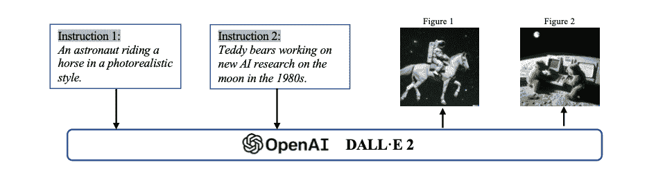

# 1   引言

> 原文：[`mallahyari.github.io/rag-ebook/intro.html`](https://mallahyari.github.io/rag-ebook/intro.html)

在本章中，我们将为使用大型语言模型（LLMs）构建聊天到 PDF 应用奠定基础，重点关注检索增强生成方法。我们将探讨支撑此项目的根本概念和技术。

## 1.1 LLMs 在自然语言处理（NLP）中的作用

大型语言模型（LLMs）在自然语言处理（NLP）中扮演着至关重要的角色。这些模型通过理解和生成类似人类的文本的能力，彻底改变了 NLP 领域。随着深度学习和神经网络的发展，LLMs 已成为各种 NLP 任务中的宝贵资产，包括语言翻译、文本摘要和聊天机器人开发。

LLMs 的一个关键优势在于它们能够从大量的文本数据中学习。通过在大型数据集上进行训练，LLMs 可以捕捉复杂的语言模式，并生成连贯且与上下文相关的响应。这使得它们能够产生高质量输出，其质量与人类生成的文本难以区分。

LLMs 的训练过程分为两步：预训练和微调。在预训练阶段，模型接触到大量的文本数据，并学会预测句子中的下一个单词。这有助于它们发展对语言结构和语义的深刻理解。在微调阶段，模型在特定任务的数据上进行进一步训练，以适应特定领域或任务。

LLMs 的多样性和有效性使它们成为推动 NLP 领域发展的强大工具。它们不仅提高了现有 NLP 系统的性能，还开辟了开发创新应用的新可能性。随着持续的研究和开发，预计 LLMs 将进一步拓展自然语言理解和生成可能性的边界。

大型语言模型（LLMs）是 NLP 领域的一项突破，使机器能够以前所未有的准确性和流畅度理解和生成类似人类的文本。LLMs 在 NLP 中的关键作用包括：

1.  **自然语言理解（NLU）：** LLMs 能够理解人类语言的细微差别，使它们擅长情感分析、实体识别和语言翻译等任务。

1.  **文本生成：** LLMs 在生成连贯且与上下文相关的文本方面表现出色。这种能力对于内容生成、聊天机器人和自动写作来说非常宝贵。

1.  **问答：** LLMs 在问答任务中特别强大。它们可以阅读给定的文本，并以自然语言提供准确的答案。

1.  **总结：** 大型语言模型（LLMs）可以总结长篇文档或文章，将最重要的信息提炼成简洁的形式。

1.  **对话式人工智能：** 它们是对话式人工智能系统的骨架，使聊天机器人和虚拟助手能够进行有意义的、上下文感知的对话。

1.  **信息检索：** 大型语言模型（LLMs）可以用于从大量文本语料库中检索相关信息，这对于搜索引擎和文档检索等应用至关重要。

1.  **定制化：** LLMs 可以根据特定任务或领域进行微调，使其适应广泛的用途。

## 1.2 在 PDF 上进行问答的重要性

*在 PDF 文档上进行问答解决了信息检索和文档处理中的关键需求。在这里，我们将探讨其重要性以及 LLMs 如何发挥关键作用：*

在 PDF 上进行问答的重要性：

1.  **文档可访问性：** PDF 是一种广泛用于存储和共享文档的格式。然而，从 PDF 中提取信息，尤其是针对特定问题的信息，对于用户来说可能具有挑战性。在 PDF 上进行问答增强了文档的可访问性。

1.  **高效信息检索：** 对于研究人员、学生和专业人士来说，在长篇 PDF 文档中寻找答案可能耗时。问答系统简化了这一过程，使用户能够快速找到所需信息。

1.  **增强用户体验：** 在法律、医疗和教育等各个领域，用户通常需要从 PDF 文档中获得精确的答案。实施问答系统通过提供直接和准确的响应来改善用户体验。

1.  **自动化与生产力提升：** 通过自动化从 PDF 中提取答案的过程，组织可以节省时间和资源。这种自动化在需要处理大量文档的场景中尤其有益。

1.  **可扩展性：** 随着数字文档数量的持续增长，可扩展的 PDF 问答解决方案变得越来越重要。LLMs 可以处理大型数据集和多种文档类型。

在各个行业中，从大量的 PDF 文档集中高效检索信息的需求正在不断增长。以一家法律公司或部门为例，它们与联邦贸易委员会（FTC）合作处理有关法律案件和诉讼的更新信息。他们的任务通常涉及处理大量文档，筛选它们，并提取相关案件信息——这是一个劳动密集型的过程。

> *背景：每年，FTC 都会对数百起个人和公司提起诉讼，指控他们违反了该机构执行的消费者保护和竞争法。这些案件可能涉及欺诈、诈骗、身份盗窃、虚假广告、隐私侵犯、反竞争行为等。*

追溯增强生成（RAG）方法的问世标志着问答领域的新纪元，它承诺将彻底改变这些行业的工作流程。

## 1.3 检索增强生成方法

*检索增强生成方法是一种前沿技术，它结合了信息检索和文本生成的优势。让我们详细探讨这种方法：*

检索增强生成方法：

检索增强生成方法结合了两个基本组件，检索和生成，以创建一个强大的问答和内容生成系统。以下是这种方法的一个概述：

1.  **检索组件：** 系统的这一部分负责从文档数据库中搜索和检索相关信息。它使用诸如索引、排名和查询扩展等技术来找到最相关的文档。

1.  **生成组件：** 一旦检索到相关文档，生成组件就会接管。它使用大型语言模型（LLMs）来处理检索到的信息，并生成对用户查询的连贯且语境准确的响应。

1.  **优势：** 这种方法的关键优势在于其能够基于现有知识提供答案（检索）的同时，也能生成语境丰富的响应（生成）。它结合了两者的优势，以提供高质量的答案。

1.  **用例：** 检索增强生成对于在大规模文档集合上进行问答特别有用，在这种情况下，传统的搜索引擎可能无法提供简洁且信息丰富的答案。

1.  **微调：** 这种方法的成功实施通常涉及在特定领域的数据上对 LLMs 进行微调，以提高生成响应的质量。

通过理解 LLMs 在 NLP 中的作用、在 PDF 上进行问答的重要性以及检索增强生成方法背后的原则，你现在已经为使用这些先进技术构建你的聊天到 PDF 应用程序奠定了基础。在接下来的章节中，我们将更深入地探讨这种创新解决方案的技术方面和实际实施。

## 1.4 LLMs 的简要历史

近期，ChatGPT、DALL-E-2 和 Codex 都受到了很多关注。这激发了很多人对它们背后卓越表现的好奇心。ChatGPT 和其他生成式人工智能（GAI）技术属于一个被称为人工智能生成内容（AIGC）的类别。这意味着它们都是关于使用 AI 模型来创建图像、音乐和书面语言等内容的。AIGC 背后的整个想法是使内容创建更快、更简单。

> *AIGC 是通过从人类提供的指令中提取和理解意图信息，并根据其知识和意图信息生成内容来实现的。近年来，大规模模型在 AIGC 中变得越来越重要，因为它们提供了更好的意图提取，从而改善了生成结果。*

随着数据的增多和模型的增大，这些人工智能系统可以创造出看起来和听起来都非常逼真和高质量的物品。以下是一个根据指示生成图像的文本提示示例，利用了 OpenAI 的 DALL-E-2 模型。

图 1.1：图像生成中 AIGC 的示例。[图片来源](https://arxiv.org/pdf/2303.04226.pdf)

在生成人工智能（GAI）领域，模型通常可以分为两类：单模态模型和多模态模型。单模态模型通过接收与它们生成的内容相同类型的数据的指令来操作，而多模态模型能够接收一种类型的数据的指令并在另一种类型的内容中生成内容。以下图展示了这两种类型的模型。

图 1.2：AIGC 模型类型概述。[图片来源](https://arxiv.org/pdf/2303.04226.pdf)

这些模型已在艺术与设计、市场营销和教育等多个行业中得到应用。显然，在可预见的未来，AIGC 将继续是人工智能领域一个突出且不断发展的研究领域。

### 1.4.1 基础模型

提到大型语言模型（LLMs）和通用人工智能（GenAI），我们无法忽视 Transformer 模型所扮演的显著角色。

> *Transformer 是许多最先进模型（如 GPT、DALL-E、Codex 等）的骨干架构。*

Transformer 最初是为了解决传统模型（如 RNNs）在处理可变长度序列和上下文时的局限性而设计的。Transformer 的核心是其自注意力机制，允许模型关注输入序列的不同部分。它由编码器和解码器组成。编码器处理输入序列以创建隐藏表示，而解码器生成输出序列。每个编码器和解码器层都包含多头注意力和前馈神经网络。多头注意力是一个关键组件，根据相关性为标记分配权重，从而增强了模型在各种自然语言处理（NLP）任务中的性能。Transformer 的内在并行化能力最小化了归纳偏差，使其非常适合大规模预训练和适应不同的下游任务。

Transformer 架构在自然语言处理领域占据主导地位，基于训练任务主要有两种预训练语言模型：掩码语言模型（例如 BERT）和自回归语言模型（例如 GPT-3）。掩码语言模型预测句子中的掩码标记，而自回归模型则专注于根据前面的标记预测下一个标记，这使得它们更适合生成任务。RoBERTa 和 XL-Net 是掩码语言模型的经典例子，它们通过额外的训练数据和技巧进一步改进了 BERT 架构。

图 1.3：预训练 LLM 的类别。[图片来源](https://arxiv.org/pdf/2303.04226.pdf)

在这个图表中，你可以看到由线条表示的两种类型的信息流：黑色线条表示双向信息流，而灰色线条表示从左到右的信息流。有三个主要模型类别：

1.  使用上下文感知目标训练的编码器模型，如 BERT。

1.  使用自回归目标训练的解码器模型，如 GPT。

1.  将两种方法结合的编码器-解码器模型，如 T5 和 BART，这些模型使用上下文感知结构作为编码器，并使用从左到右的结构作为解码器。

### 1.4.2 从人类反馈中进行强化学习

为了提高人工智能生成内容（AIGC）与用户意图的匹配度，即考虑*实用性*和*真实性*，强化学习从人类反馈（RLHF）已被应用于 Sparrow、InstructGPT 和 ChatGPT 等模型中。

RLHF 管道包括三个步骤：*预训练*、*奖励学习*和*通过强化学习的微调*。在奖励学习中，使用对各种响应的人类反馈来创建奖励标量。微调是通过使用近端策略优化（PPO）的强化学习来完成的，目的是最大化学习的奖励。

然而，该领域缺乏 RL 的基准和资源，这被视为一个挑战。但这种情况正在一天天改变。例如，一个名为 RL4LMs 的开源库被引入以解决这一差距。Claude，一个对话代理，使用*宪法 AI*，其中奖励模型是通过从 AI 反馈中学习的 RL 来学习的。重点是减少有害输出，并从人类提供的一系列原则中得到指导。更多关于*宪法 AI*主题的信息，请参阅我们的博客文章[这里](https://mlnotes.substack.com/p/ai-supervised-ai)。

### 1.4.3 GAN

生成对抗网络（GANs）被广泛用于图像生成。GANs 由生成器和判别器组成。生成器创建新的数据，而判别器决定输入是否为真实。

生成器和判别器的设计影响 GAN 的训练和性能。已经开发了各种 GAN 变体，包括 LAPGAN、DCGAN、渐进式 GAN、SAGAN、BigGAN、StyleGAN 以及解决模式崩溃的方法，如 D2GAN 和 GMAN。

下面的图表说明了视觉生成模型的一些类别。

图 1.4：视觉生成模型的类别。[图片来源](https://arxiv.org/pdf/2303.04226.pdf)

尽管生成对抗网络（GAN）模型不是我们书籍的重点，但它们对于驱动多模态应用，如扩散模型，是至关重要的。

### 1.4.4 应用

聊天机器人可能是 LLM 最流行的应用之一。

聊天机器人是通过基于文本的界面模拟人类对话的计算机程序。它们使用语言模型来理解和响应用户输入。聊天机器人有多种用途，如客户支持和回答常见问题。我们的“*与你的 PDF 文档聊天*”是一个新兴的用例！

其他值得注意的例子包括微软开发的 Xiaoice，它能够表达同理心，以及谷歌的高级聊天机器人 Meena。微软的 Bing 现在集成了 ChatGPT，为聊天机器人的开发开辟了新的可能性。

图 1.5：应用知识图谱。[图片来源](https://arxiv.org/pdf/2303.04226.pdf)

此图说明了当前研究领域、应用和相关公司之间的关系。研究领域用深蓝色圆圈表示，应用用浅蓝色圆圈表示，公司用绿色圆圈表示。

此外，我们之前已经撰写了关于聊天机器人的文章，现在它们已成为历史的一部分，但仍值得回顾：

+   博文：[聊天机器人内部是什么样的？](https://open.substack.com/pub/mlnotes/p/what-does-a-chatbot-look-like-under?r=164sm1&utm_campaign=post&utm_medium=web)

+   博文：[聊天机器人 NLU 背后的场景是什么？](https://open.substack.com/pub/mlnotes/p/what-is-behind-the-scene-of-a-chatbot?r=164sm1&utm_campaign=post&utm_medium=web)

+   博文：[你还能用聊天机器人做什么？](https://open.substack.com/pub/mlnotes/p/what-more-can-you-do-with-chatbots?r=164sm1&utm_campaign=post&utm_medium=web)

当然，聊天机器人并非唯一的应用。在艺术与设计、音乐生成、教育技术、编码等领域都有广阔的可能性——你的想象力无需止步于此。

### 1.4.5 提示学习

提示学习是语言模型中的一个新概念。它不是在给定 \(x\) 的条件下预测 \(y\)，而是旨在找到一个模板 \(x^\prime\)，该模板可以预测 \(P(y|x^\prime)\)。

> *通常，提示学习会将语言模型冻结，并直接在其上进行少量样本或零样本学习。这使得语言模型可以在大量原始文本数据上预训练，并适应新领域而无需再次调整。因此，提示学习可以帮助节省大量时间和精力*。

传统上，提示学习涉及通过提示来引导模型，这可以分为两个阶段：提示工程和答案工程。

**提示工程**：这涉及到创建提示，这些提示可以是离散的（手动设计）或连续的（添加到输入嵌入中），以传达特定任务的信息。

**答案工程**：在重新定义任务后，生成的答案必须映射到正确的答案空间。

除了单提示之外，*多提示方法*结合多个提示以获得更好的预测，而*提示增强*基本上是增强提示以生成更好的结果。

此外，上下文学习，作为提示学习的一个子集，已经变得流行。它通过结合预训练的语言模型，提供输入-标签对和特定任务的指令，以改善与任务的匹配来提高模型性能。

总体而言，在语言模型和工具应用的动态景观中，下面的图表展示了语言模型工程的演变。随着 x 轴上的灵活性增加和 y 轴上的复杂性上升，此图提供了开发者、研究人员和公司面临的选择和挑战的鸟瞰图。

图 1.6：LLMs 的兴起 RAG 与 Prompt Engineering 架构。[图片来源](https://cobusgreyling.medium.com/updated-emerging-rag-prompt-engineering-architectures-for-llms-17ee62e5cbd9)

在右上角，你可以看到像 OpenAI、Cohere 和 Anthropic（待添加）这样的复杂而强大的工具，它们已经推动了语言模型所能达到的边界。在对角线上，展示了 Prompt Engineering 的演变，从静态提示到模板、提示链、RAG 管道、自主代理和提示调整。在更灵活的一侧，像 Haystack 和 LangChain 这样的选项表现出色，为那些寻求利用语言模型多面性的人提供了更广阔的视野。

此图作为当前语言模型和 Prompt Engineering 领域工具演变的一个快照，为那些探索这一领域激动人心的可能性和复杂性的导航者提供了一个路线图。它很可能会每天都在变化，反映出该领域持续的创新和活力。

在下一章中，我们将转向检索增强生成（RAG）管道的更多细节。我们将分解其关键组件、架构以及构建高效检索系统涉及的关键步骤。
