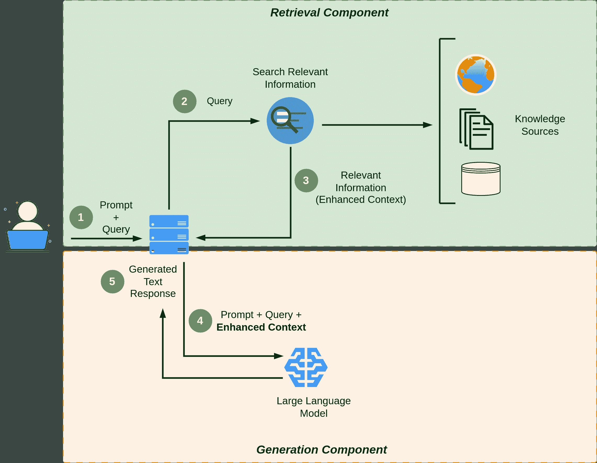

# 2 Retrieval Augmented Generation (RAG)

> 原文：[`mallahyari.github.io/rag-ebook/02_rag.html`](https://mallahyari.github.io/rag-ebook/02_rag.html)

生成式 AI 是人工智能的一个子集，它彻底改变了文本生成的领域。它为机器生成类似人类的文本铺平了道路，在各种应用中提供了众多好处。从内容创作和聊天机器人到语言翻译和自然语言理解，生成式 AI 在自然语言处理的世界中被证明是一个强大的工具。然而，认识到尽管它具有非凡的能力，但生成式 AI 系统仍然存在局限性，其中之一是它们依赖于训练数据来生成响应是至关重要的。

## 2.1 生成式 AI 的局限性

生成式 AI 模型，如 GPT3（生成预训练变换器），是在包含互联网文本的大量数据集上训练的。虽然这一训练过程使它们具备了广泛的语言和上下文理解，但也引入了局限性。这些模型只能生成与它们训练数据中存在的模式和信息的文本。因此，它们的回答可能并不总是准确或上下文相关的，尤其是在处理其训练数据中可能没有得到充分代表的利基主题或最新发展时。

### 2.1.1 示例：利用 RAG 改进客户支持

想象一下，你是一家繁荣的电子商务平台的拥有者，销售从电子产品到时尚的各种产品。你最近集成了一个聊天机器人来帮助客户解答疑问，但你开始看到它的局限性。让我们探讨如何利用检索增强生成（RAG）来克服这些局限性并提升客户支持体验。

**传统大型语言模型（LLM）的局限性**

您现有的聊天机器人是基于传统的大型语言模型（LLM）构建的。虽然它对一般产品信息有所了解，但您的客户越来越需要更具体和实时的帮助。以下是您遇到的一些挑战：

**产品可用性：** 客户经常询问特定产品的可用性，尤其是在促销期间。LLM 可以根据其训练数据提供信息，但它无法访问实时库存数据。

**运输和配送：** 客户经常询问运输时间、跟踪信息和可能的延误。LLM 可以提供标准运输政策，但它无法提供单个订单状态的实时更新。

**产品评论：** 购物者希望了解最新的产品评论和评分，以便做出明智的决定。LLM 无法访问最新的客户评论和情感分析。

**促销和折扣**：客户寻求有关正在进行中的促销、折扣和特别优惠的信息。LLM 只能根据其训练的数据提供详细信息，从而错过了时间敏感的交易。

### 2.1.2 如何 RAG 转换客户支持

现在，让我们将 RAG 引入您的电子商务客户支持系统：

实时数据的检索：使用 RAG，您的聊天机器人可以实时连接到您的电子商务平台的数据库和数据仓库。它可以检索有关产品可用性、库存水平和运输状态的最新信息。

**整合用户评价**：RAG 可以从您的网站、社交媒体和其他来源抓取和分析客户评价和评分。然后，它可以生成包含最新评价的响应，帮助顾客做出明智的选择。

**动态促销**：RAG 可以访问您的促销数据库，并提供有关正在进行中的折扣、闪购和限时优惠的最新详细信息。它甚至可以根据用户的浏览历史建议个性化的促销活动。

**订单跟踪**：RAG 可以查询您的物流系统，为顾客提供其订单的实时跟踪信息。它还可以主动通知顾客任何延误或问题。

## 2.2 介绍检索增强生成（RAG）

为了解决生成式 AI 的限制，研究人员和工程师已经开发了创新的方法，其中之一就是检索增强生成（Retrieval Augmented Generation）方法。RAG 最初在 Facebook AI Research 发布了一篇题为“*Retrieval-Augmented Generation for Knowledge-Intensive NLP Tasks*”的标志性论文（Lewis 等人 2020）后引起了生成式 AI 开发者的兴趣。RAG 结合了生成式 AI 和检索技术的优势，以增强生成文本的质量和相关性。与传统仅依赖其内部知识的生成模型不同，RAG 在生成响应之前，会额外检索来自外部来源的信息，如数据库、文档或网络。这种检索机制的整合使 RAG 能够访问最新信息和上下文，使其在需要准确和最新信息的应用中特别有价值。

在本章中，我们将更深入地探讨检索增强生成（Retrieval Augmented Generation）方法，探索其架构、优势和实际应用。通过这样做，我们将更好地理解 RAG 如何代表生成式 AI 能力提升的重要一步，并克服对静态训练数据依赖的限制。理解这一方法的关键概念和组成部分对于构建有效的聊天到 PDF 应用至关重要。

### 2.2.1 关键概念和组成部分

要掌握检索增强生成（Retrieval-Augmented Generation）的精髓，让我们探索其关键概念和组成部分：

1.  **检索组件**：检索组件负责从数据库或文档集合中搜索和选择相关信息。该组件利用诸如文档索引、查询扩展和排名等技术，根据用户的查询识别最合适的文档。

1.  **生成组件**：一旦检索到相关文档，生成组件便接管工作。它利用大型语言模型（LLMs）如 GPT-3 来处理检索到的信息并生成连贯且上下文准确的响应。该组件负责将检索到的事实转换为人类可读的答案。

1.  **交互循环**：检索增强生成通常涉及检索和生成组件之间的交互循环。初始检索可能不会总是返回完美的答案，因此生成组件可以通过参考检索结果，迭代地优化和增强响应。

1.  **微调**：成功实施此方法通常需要针对特定领域的数据对 LLMs 进行微调。微调使模型能够理解和生成与特定知识领域相关的内容，从而提高响应的质量。

1.  **潜在空间表示法**：检索模型通常将文档和查询转换为潜在空间表示，这使得根据查询的相关性比较和排名文档变得更加容易。这些表示对于高效的检索至关重要。

1.  **注意力机制**：检索和生成组件通常都采用注意力机制。注意力机制有助于模型关注输入文档和查询中最相关的部分，从而提高响应的准确性。

### 2.2.2 如何改进问答

检索增强生成方法在问答方面提供了几个优势：

1.  **访问广泛的知识库**：通过集成检索，系统可以访问庞大的知识库，包括大量的文档集合。这使得模型能够提供其预训练数据中可能不存在的信息，使其信息量非常丰富。

1.  **上下文理解**：生成组件使用检索结果提供的上下文来生成不仅事实准确而且上下文相关的答案。这种上下文理解导致更连贯和精确的响应。

1.  **迭代优化**：检索和生成组件之间的交互循环允许系统迭代优化其响应。如果初始响应不完整或不正确，生成组件可以根据检索结果进行进一步的查询或澄清，从而得到改进的答案。

1.  **适应多样化查询**：检索增强生成可以处理广泛的用户查询，包括复杂和多方面的提问。它在简单基于关键词的搜索引擎可能不足的场合表现出色。

1.  **针对特定领域的微调**：通过在特定领域的数据上微调模型，你可以使其在特定知识领域表现出色。这使得它成为专门问答任务（如法律或医学咨询）的有价值工具。

总结来说，检索增强生成是一种动态方法，它结合了检索和生成的优势，为用户查询提供准确、上下文相关且信息丰富的答案。理解其关键组件和优势对于我们在构建聊天到 PDF 应用的过程中至关重要，该应用将利用这种方法来增强对 PDF 文档的问答功能。

## 2.3 RAG 架构

在其核心，RAG 是一个框架，它协同两个关键组件：

**检索模型**：该组件专门从大量数据集中搜索和检索相关信息，如文档、文章或数据库。它识别包含与用户查询相关信息段落的文档。

**生成模型**：另一方面，生成模型擅长构建对用户查询的连贯且上下文丰富的响应。它通常基于大型语言模型（LLMs）如 GPT-3，可以生成类似人类的文本。图 2.1 展示了 RAG 架构。

图 2.1：RAG 架构

## 2.4 构建检索系统

在本节中，我们将专注于构建检索系统，这是聊天到 PDF 应用的一个关键组件，它能够从 PDF 文档中提取相关信息。本节对于有效地实施检索增强生成方法至关重要。

### 2.4.1 选择检索模型

选择合适的检索模型是在构建你的聊天到 PDF 应用时一个至关重要的决策。检索模型决定了系统在响应用户查询时如何高效和准确地找到并排序相关文档。在选择检索模型时，以下是一些需要考虑的因素：

+   **TF-IDF（词频-逆文档频率）**：TF-IDF 是一个经典的检索模型，它计算了术语在文档相对于语料库的重要性。它易于实现，对于某些任务来说很有效。

+   **BM25**：BM25 是 TF-IDF 的一个改进版本，它考虑了文档长度和词频饱和度。在现代检索任务中，它通常更有效。

+   **向量空间模型**：这些模型将文档和查询表示为高维空间中的向量。使用余弦相似度或其他距离度量来对文档进行排序。可以使用如潜在语义分析（LSA）和词嵌入（例如 Word2Vec）等实现。

+   **神经排名模型**：现代基于 BERT 的神经模型因其捕捉复杂语义关系的能力而越来越受到检索任务的青睐。它们可以根据特定任务和领域进行微调。

+   **混合模型**：结合多个检索模型，例如 TF-IDF 和神经模型的组合，可以提供两种方法的优点。

+   **领域和数据大小**：考虑您的聊天到 PDF 应用的具体需求。某些检索模型可能更适合小型或专业文档集合，而其他模型在处理大型、多样化的语料库方面表现出色。

+   **可扩展性**：确保所选的检索模型可以扩展以满足您应用的需求，尤其是如果您预计要处理大量的 PDF 文档。

## 2.5 RAG 中的检索嵌入和向量数据库

除了选择合适的检索模型外，利用嵌入和向量数据库可以显著提高您聊天到 PDF 应用中检索组件的性能和效率。向量嵌入是现代信息检索和自然语言处理中的一个基本概念。它们将文本数据转换为数值向量，使计算机能够在数学和几何空间中理解和操作文本数据。这些嵌入捕捉了单词、文档或其他文本实体之间的语义和上下文关系，使它们在各种应用中非常有价值，包括检索增强生成（RAG）的检索组件。

### 2.5.1 向量嵌入：概述

向量嵌入将单词、短语、句子甚至整个文档表示为高维向量空间中的点。关键思想是将每个文本元素映射到向量中，使得语义上相似元素在这个空间中彼此靠近，而不同元素则相距较远。这种几何表示有助于相似度计算、聚类和其他操作。

向量嵌入的示例：

1.  **词嵌入（Word2Vec, GloVe）**：词嵌入将单个单词表示为向量。例如，“king”和“queen”可能被表示为在向量空间中彼此靠近的向量，因为它们具有相似的语义属性。

1.  **文档嵌入（Doc2Vec, BERT）**：文档嵌入将整个文档（如 PDF 文件）映射到向量中。讨论相似主题的两个文档将在向量空间中具有接近的嵌入。

有许多教程和资源可以帮助您学习更多关于向量嵌入的知识。以下是一些可以帮助您入门的资源：

+   [向量嵌入解释](https://weaviate.io/blog/vector-embeddings-explained)

+   [Google 向量嵌入](https://cloud.google.com/blog/topics/developers-practitioners/meet-ais-multitool-vector-embeddings)

+   [什么是向量嵌入](https://www.elastic.co/what-is/vector-embedding)

### 2.5.2 向量数据库及其在增强检索中的作用

向量数据库，也称为相似度搜索引擎或向量索引数据库，在 RAG 的检索组件中发挥着至关重要的作用，通过高效地存储和检索这些向量嵌入。它们是专门为基于相似度检索向量而设计的数据库，非常适合需要快速且准确地计算数据点之间相似度的场景。

如何通过向量数据库增强 RAG 的检索：

1.  **快速检索：**向量数据库采用针对相似度搜索优化的索引结构。它们使用近似最近邻（ANN）搜索等算法，即使在包含大量文档的大型数据集中，也能快速定位最相似的向量。

1.  **可扩展性：**随着文档语料库的增长，向量数据库可以有效地进行扩展。这确保了检索性能的一致性，无论数据集的大小如何。

1.  **高级相似度评分：**这些数据库提供了一系列相似度度量，如余弦相似度或 Jaccard 指数，允许您根据具体需求微调检索文档的相关性排名。

1.  **与检索模型的集成：**向量数据库可以无缝集成到您的检索系统中。它们通过提供基于向量相似性的高效候选文档选择方法，补充了 TF-IDF、BM25 或神经排名模型等检索模型。

所有这些因素都导致了众多新的向量数据库的出现。选择并依赖这些数据库之一可能会在您的系统中产生长期的影响和依赖。理想情况下，我们选择一个具有强大可扩展性、同时保持成本效益并最小化延迟的向量数据库。这些向量数据库包括：[Qdrant](https://qdrant.tech/)、[Weaviate](https://weaviate.io/)、[Pinecone](https://www.pinecone.io/)、[pgvector](https://github.com/pgvector/pgvector)、[Milvus](https://milvus.io/)和[Chroma](https://www.trychroma.com/)。

图 2.2：向量数据库比较。[图片来源](https://docs.google.com/spreadsheets/d/1oAeF4Q7ILxxfInGJ8vTsBck3-2U9VV8idDf3hJOozNw/edit#gid=0)

## 2.6 RAG 数据摄取管道

在您的 Chat-to-PDF 应用能够有效地从向量数据库中检索信息之前，预处理 PDF 文档并创建预处理数据的结构化和可搜索索引至关重要。这个可搜索索引是您应用程序的基石，类似于精心组织的图书馆目录。它使您的系统能够迅速且准确地定位 PDF 文档中的相关信息，从而提高检索过程的效率和精度。

图 2.3 展示了 RAG 数据摄取管道。在第三章中，我们将全面讨论如何在向量数据库中准备、索引和存储文档。

图 2.3：RAG 数据摄取管道

## 2.7 检索增强生成面临的挑战

采用检索增强生成（RAG）代表了自然语言处理和信息检索领域的一项重大进步。然而，像任何复杂的 AI 系统一样，RAG 也带来了一系列挑战，必须解决这些问题才能充分发挥其潜力。在本节中，我们探讨了与 RAG 相关的一些关键挑战。

### 2.7.1 数据质量和相关性

RAG 在检索和生成任务中高度依赖于高质量和相关的数据。该领域的挑战包括：

+   **噪声数据**：不完整、过时或不准确的数据源可能导致检索到不相关信息，影响生成响应的质量。

+   **偏差和公平性**：训练数据中存在的偏差可能导致检索和生成的偏差，从而延续刻板印象或错误信息。

### 2.7.2 集成复杂性

无缝集成检索和生成组件并非易事，因为它涉及到连接不同的架构和模型。挑战包括：

+   **模型兼容性**：确保检索和生成模型能够和谐工作，尤其是在将传统方法（例如 TF-IDF）与神经网络模型（例如 GPT-3）结合时。

+   **延迟和效率**：在实时响应需求和检索及生成所需的计算资源之间取得平衡。

### 2.7.3 可扩展性

将 RAG 系统扩展以处理大量数据和用户请求可能具有挑战性：

+   **索引效率**：随着文档语料库的增长，保持高效和最新的索引对于检索速度至关重要。

+   **模型扩展**：为检索和生成部署大规模神经网络模型可能需要大量的计算资源。

### 2.7.4 评估指标

评估 RAG 系统的性能存在困难：

+   **缺乏黄金标准**：在某些情况下，可能没有明确的黄金标准来评估检索文档的相关性和质量。

+   **多样化的用户需求**：用户有不同的信息需求，这使得开发通用的评估指标具有挑战性。

### 2.7.5 领域适应

将 RAG 系统适应特定领域或行业可能很复杂：

+   **领域特定知识**：将领域特定知识和术语纳入检索和生成。

+   **训练数据可用性**：为微调模型提供领域特定训练数据。

解决这些挑战对于释放 RAG 在各种应用中的全部潜力至关重要，从问答到内容生成。随着该领域的研究和开发继续进行，找到解决这些挑战的创新解决方案对于构建稳健且可靠的 RAG 系统至关重要，这些系统能够向用户提供准确、相关和可信的信息。

在本章中，我们结束了对于检索增强生成（RAG）系统的基础和检索组件的探索，现在我们将注意力转向第三章中 RAG 管道的实际实施。在下一章中，我们将深入探讨这些系统如何运作的细节，从 PDF 文档的预处理和数据摄取管道开始。我们还将讨论使 RAG 系统工作的生成组件。此外，第三章探讨了文本分割方法对 RAG 质量的影响以及元数据在提升整体 RAG 体验中的关键作用。

Lewis, Patrick, Ethan Perez, Aleksandra Piktus, Fabio Petroni, Vladimir Karpukhin, Naman Goyal, Heinrich Küttler, 等人. 2020. “检索增强生成在知识密集型自然语言处理任务中的应用。” *神经信息处理系统进展* 33: 9459–74.
