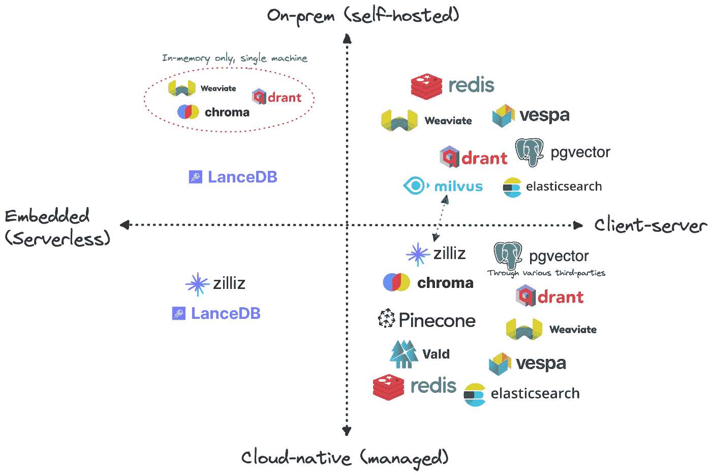
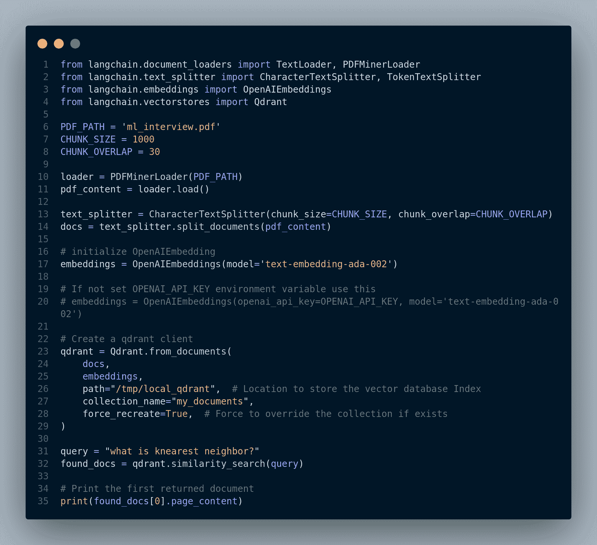

# 3 RAG 管道实现

> 原文：[`mallahyari.github.io/rag-ebook/03_prepare_data.html`](https://mallahyari.github.io/rag-ebook/03_prepare_data.html)

## 3.1 预处理 PDF 文档

在我们能够利用大型语言模型（LLMs）和特别是 RAG 方法对 PDF 文档进行问答之前，准备我们的数据至关重要。虽然 PDF 是文档的常见格式，但在文本提取和分析方面提出了独特的挑战。在本节中，我们将探讨预处理 PDF 文档以使其适合我们的 Chat-to-PDF 应用程序的关键步骤。这些步骤不仅对 PDF 至关重要，而且适用于其他类型的文件。然而，我们的主要焦点是 PDF 文档，因为它们在各个行业和应用中都很普遍。

### 3.1.1 PDF 文本提取

PDF 可能包含文本、图像、表格和其他元素的混合。为了启用基于文本的分析和问答，我们需要从 PDF 中提取文本内容。以下是您如何完成此操作的方法：

+   **文本提取工具：** 探索可用的工具和库，如 PyPDF2、pdf2txt 或 PDFMiner，以编程方式从 PDF 文件中提取文本。

+   **处理扫描文档：** 如果您的 PDF 包含可选择的文本而不是扫描图像，您可能需要光学字符识别（OCR）软件将图像转换为机器可读文本。

+   **质量控制：** 检查提取文本的质量，并执行任何必要的清理，如删除多余的字符或修复格式问题。

### 3.1.2 处理多页文档

PDF 文档可能跨越多页，保持跨页面的上下文对于问答至关重要。以下是您如何应对这一挑战的方法：

+   **页面分割：** 将文档分割成逻辑单元，如段落或部分，以确保上下文得到保留。

+   **元数据提取：** 提取文档标题、作者、页码和创建日期等元数据。这些元数据有助于提高搜索性和回答用户查询。

### 3.1.3 文本清理和规范化

PDF 可能引入影响提取文本质量的伪影或不一致性。为确保问答的准确性，执行文本清理和规范化：

+   **空白符和标点符号：** 移除或替换过多的空白符和特殊字符，以提高文本可读性。

+   **格式去除：** 消除不必要的格式，如字体样式、大小和颜色，这些可能对问答不相关。

+   **拼写检查：** 检查并纠正提取过程中可能出现的拼写错误。

### 3.1.4 语言检测

如果您的 PDF 文档包含多种语言的文本，实施语言检测算法以识别每个部分的所用语言是一个好主意。此信息在选择适当的 LLM 模型进行问答时可能很有用。

## 3.2 数据摄取管道实现

如 图 2.3 所示，数据摄取管道的第一步是 *从 PDF 文档中提取和分割文本*。为此目的有几个包，包括：

+   [PyPDF2](https://pypdf2.readthedocs.io/en/3.0.0/)

+   [pdfminer.six](https://pdfminersix.readthedocs.io/en/latest/)

+   [unstructured](https://github.com/Unstructured-IO/unstructured)

*注意* 如果您已经扫描了 PDF，您可以使用如 **unstructured**、**pdf2image** 和 **pytesseract** 等库。此外，还有数据加载器中心如 [llamahub](https://llamahub.ai/)，其中包含数十个用于读取和将各种数据源连接到大型语言模型（LLM）的数据加载器。

最后，还有一些像 [llamaindex](https://gpt-index.readthedocs.io/en/stable/index.html) 和 [langchain](https://python.langchain.com/docs/get_started/introduction) 这样的包。这些是促进开发由 LLM 驱动的应用程序的框架。因此，它们实现了许多这些数据加载器，包括从 PDF 文件中提取和分割文本。

**步骤 1：安装必要的库**

```py
pip install llama-index
pip install langchain
```

**步骤 2：加载 PDF 文件并从中提取文本**

下面的代码将遍历 PDF 文件的页面，提取文本并将其添加到 `documents` 列表对象中，如图 3.1 所示。


图 3.1：加载 PDF 文件

现在，每一页都已成为一个独立的文档，我们可以在以后将其 *嵌入（向量化）* 并 *存储* 在向量数据库中。然而，一些页面可能非常长，而其他页面可能非常短，因为页面长度各不相同。这可能会显著影响文档搜索和检索的质量。

此外，大型语言模型（LLM）有一个有限的内容窗口（令牌限制），即它们可以处理一定数量的令牌（一个令牌大致等于一个单词）。因此，我们首先将所有页面连接成一个长的文本文档，然后将该文档分割成更小的相对相等大小的块。然后我们将每个文本块嵌入并插入到向量数据库中。

然而，由于我们打算使用 `llamaindex` 和 `langchain` 框架进行 RAG 管道，让我们利用这些框架提供的功能和函数。它们具有数据加载器和分割器，我们可以使用它们来读取和分割 PDF 文件。您可以在 图 3.2 中看到代码。


图 3.2：Langchain 数据加载器

`pdf_content[0]` 包含了整个 PDF 的内容，并具有特殊的结构。它是一个具有一些属性（包括 `page_content` 和 `metadata`）的 `Document` 对象。`page_content` 是文本内容，而 `metadata` 包含有关 PDF 的元数据。以下是我们的 PDF 的 `Document` 对象的部分输出，如图 3.3 所示。


图 3.3：Langchain 数据加载器输出

`Document` 对象是一个用于存储非结构化文本及其相关元数据的通用类。更多信息请参阅 [这里](https://api.python.langchain.com/en/latest/schema/langchain.schema.document.Document.html#langchain.schema.document.Document)。

**步骤 3：将文本分割成更小的块**

有几种不同的文本分割器。更多信息请参阅 [langchain API](https://api.python.langchain.com/en/latest/api_reference.html#module-langchain.text_splitter)，或 [llamaIndex 文档](https://docs.llamaindex.ai/en/stable/examples/low_level/oss_ingestion_retrieval.html#use-a-text-splitter-to-split-documents)。两种常见的是：

1.  `CharacterTextSplitter`：基于一定数量的字符分割文本。

1.  `TokenTextSplitter`：使用模型分词器将文本分割成标记。

图 3.4 中的以下代码将 PDF 内容分割成不大于 1000 个大小的块，并留有一定的重叠，以便保持一些连续的上下文。


图 3.4：Langchain 文本分割方法

这里是分割 PDF 文件所创建的块的数量。

```py
# Print the number of chunks (list of Document objects)
print(len(docs))
# 30
```

***步骤 4：将文档嵌入并存储在向量数据库中***

在这一步，我们需要将文本块转换为嵌入向量。我们可以使用包括 OpenAI 模型、Huggingface 模型和 Cohere 模型在内的许多嵌入模型。您甚至可以定义自己的自定义嵌入模型。选择嵌入模型取决于几个因素：

+   **成本：** 例如 OpenAI 或 Cohere 这样的供应商会收取嵌入费用，尽管价格便宜，但当您扩展到数千个 PDF 文件时，这将成为一个障碍。

+   **延迟和速度：** 在您的服务器上托管嵌入模型可以减少延迟，而使用供应商的 API 会增加延迟。

+   **便利性：** 使用自己的嵌入模型需要更多的计算资源和维护，而使用 OpenAI 等供应商的 API 则可以给您带来无烦恼的体验。

与选择嵌入模型有多个选择类似，选择向量数据库也有许多选项，但这超出了本书的范围。

图 3.5 展示了一些最受欢迎的向量数据库供应商及其托管的一些功能。这篇 [博客](https://thedataquarry.com/posts/vector-db-1/) 从不同角度全面考察了这些向量数据库。



图 3.5：各种向量数据库。[图片来源](https://thedataquarry.com/posts/vector-db-1/)

我们将使用 OpenAI 模型，特别是 `text-embedding-ada-002` 进行嵌入。此外，我们选择 [Qdrant](https://qdrant.tech/) 作为我们的向量数据库。它是开源的，速度快，非常灵活，并提供免费云服务等级。

我们首先安装 `openai` 和 `qdrant` 包。

```py
pip install openai
pip install qdrant-client
```

*我们还需要一个 API 密钥，我们可以从 [这里](https://platform.openai.com/account/api-keys) 获取。

如果我们将 `OPENAI_API_KEY` 环境变量设置为我们的 API 密钥，我们可以轻松调用需要它的函数而不会出现任何错误。否则，我们可以将 API 密钥参数传递给需要它的函数。图 3.6 展示了如何操作。


图 3.6：通过 Langchain 设置 Qdrant 向量数据库

请注意，有几种不同的方法可以实现相同的目标（嵌入和存储在向量数据库中）。您可以直接使用 `Qdrant` 客户端库，而不是使用 langchain 包装器。此外，您可以先单独创建嵌入，然后将它们存储在 Qdrant 向量数据库中。在这里，我们通过调用 `Qdrant.from_documents()` 将文档嵌入并存储。

此外，您可以使用 Qdrant 云向量数据库存储嵌入，并使用其 REST API 与其交互，与这个示例中索引存储在 `/tmp/local_qdrant` 目录本地不同。这种方法适用于测试和 POC（概念验证），但不适用于生产环境。

我们可以尝试查看如何从向量数据库中搜索和检索相关文档。例如，让我们看看问题的答案 *“什么是 knearest neighbor？”*。请参阅 图 3.7 中的输出。


图 3.7：带有输出的问答示例

太棒了！检索到的答案似乎非常相关。

完整的代码显示在 图 3.8 中。



图 3.8：检索组件的完整代码****  ****## 3.3 生成组件实现

图 3.9 展示了我们曾在 第二章 中看到的 RAG 管道的简化版本。到目前为止，我们的 RAG 的 **检索** 组件已实现。在下一节中，我们将实现 **生成** 组件。


图 3.9：RAG 管道

生成用户问题的响应的步骤是：

+   **步骤 1:** 使用与嵌入文档相同的模型嵌入用户的查询

+   **步骤 2:** 将查询嵌入传递到向量数据库，搜索并检索来自向量数据库的前 k 个文档（即上下文）

+   **步骤 3:** 创建一个“提示”，并在其中包含用户的查询和上下文

+   **步骤 4:** 调用 LLM 并传递提示

+   **步骤 5:** 从 LLM 获取生成的响应并将其显示给用户

再次，我们可以逐个步骤进行，或者利用 langchain 或 llamaIndex 提供的功能。在这种情况下，我们将使用 langchain。

Langchain 包含[多种内置问答链](https://api.python.langchain.com/en/latest/api_reference.html#module-langchain.chains)。在 LangChain 中，*链*指的是一系列对组件的调用，这可能包括其他链或外部工具。为了创建一个问答链，我们使用：

1.  **load_qa_chain**：`load_qa_chain()`是 Langchain 中的一个函数，用于加载一个预配置的问答链。它接受一个语言模型，如 OpenAI，一个链类型（例如，用于从文本中提取答案的“stuff”），以及可选的提示模板和内存对象。该函数返回一个`QuestionAnsweringChain`实例，该实例已准备好接受文档和问题以生成答案。

1.  **load_qa_with_sources_chain**：这与`load_qa_chain`非常相似，但它包含源/元数据以及返回的响应。

1.  **RetrievalQA**：`RetrievalQA`是 Langchain 中的一个类，它使用检索创建一个问答链。它将检索器、提示模板和 LLM 组合成一个端到端的 QA 管道。提示模板将问题和检索到的文档格式化为 LLM 的提示。此链从向量数据库中检索与给定查询相关的文档，然后使用这些文档生成答案。

1.  **RetrievalQAWithSourcesChain**：它是 RetrievalQA 的一个变体，返回用于生成答案的相关源文档。此链返回一个包含答案字符串和源 ID 列表的`AnswerWithSources`对象。

这里是代码示例，图 3.10：


图 3.10：使用 Langchain 链进行响应生成

图 3.11 展示了如何使用`load_qa_with_sources_chain`：


图 3.11：使用`load_qa_with_sources_chain`链进行响应生成

类似地，如果我们使用`RetrievalQA`，我们将有图 3.12：


图 3.12：`RetrievalQA`链的用法

当我们使用`RetrievalQAWithSourcesChain`时，这里是相应的代码，图 3.13：


图 3.13：使用 Langchain `RetrievalQAWithSourcesChain`进行响应生成的代码片段

正如你所见，使用 langchain 或 llamaIndex 等框架实现 RAG（或者说是 RAG 的原型应用）相当直接。然而，当涉及到将 RAG 部署到生产环境和扩展系统时，这变得极具挑战性。有许多细微之处会影响 RAG 的质量，我们需要考虑它们。在接下来的几节中，我们将讨论一些主要挑战以及如何解决它们。

## 3.4 文本分割对检索增强生成（RAG）质量的影响

在使用大型语言模型（LLM）构建 Chat-to-PDF 应用时，一个关键方面是显著影响你的检索增强生成（RAG）系统质量的是如何从 PDF 文档中分割文本。文本分割可以在两个级别上进行：*按字符分割*和*按标记分割*。你在这两种方法之间的选择可能会对你的 RAG 系统的有效性产生深远影响。让我们深入探讨每种方法的含义。

### 3.4.1 按字符分割

#### 优点：

**细粒度上下文:** 通过按字符分割文本保留文档中上下文的细粒度。每个字符成为一个输入单元，允许模型捕捉到细微的细节。

#### 挑战：

+   **长序列:** PDF 文档通常包含长段落或句子。按字符分割可能会导致非常长的输入序列，这可能会超过模型的最高标记限制，使其难以处理和生成响应。

+   **标记限制:** 大多数 LLM，如 GPT-3，都有标记限制，通常在 4,000 个标记左右。如果文档超过这个限制，你需要截断或省略部分内容，这可能会丢失有价值的信息。

+   **增加推理时间:** 较长的序列需要更多的推理时间，这可能导致响应时间变慢和计算成本增加。

### 3.4.2 按标记分割

#### 优点：

+   **标记效率:** 通过标记分割文本确保每个输入序列都保持在模型的标记限制内，从而实现高效处理。

+   **平衡的上下文:** 每个标记代表一个有意义的单元，在粒度和可管理性之间取得平衡。

+   **可扩展性:** 通过标记进行分割可以适应不同长度的文档，使系统更具可扩展性和适应性。

#### 挑战：

+   **上下文信息:** 基于标记的分割可能无法捕捉到极其细粒度的上下文，可能会错过字符级分割中存在的细微差别。

### 3.4.3 寻找合适的平衡

在字符级和标记级分割之间的选择并不总是直接的，可能取决于几个因素：

+   **文档类型:** 考虑你收藏中的 PDF 文档类型。具有精确细节的技术手册可能从字符级分割中受益，而一般文档可能适合使用标记级分割。

+   **模型限制**：考虑所选 LLM 的标记限制。如果模型的限制是一个重大约束，标记级别分割就变得必要。

+   **用户体验**：评估详细上下文和响应时间之间的权衡。字符级别分割可能提供更丰富的上下文，但代价是响应速度较慢。

### 3.4.4 混合方法

在实践中，你也可以探索文本分割的混合方法。例如，你可能对大多数文档使用标记级别分割，当特定问题需要细粒度上下文时，切换到字符级别分割。

文本分割对 RAG 质量的影响不容小觑。这是一个关键的设计考虑因素，需要在捕获详细上下文和确保系统效率之间取得平衡。仔细评估你的 PDF 文档的性质、所选 LLM 的能力以及用户期望，以确定适用于你的 Chat-to-PDF 应用的文本分割策略。定期测试和用户反馈可以帮助改进这一选择并优化 RAG 系统的整体质量。

## 3.5 向量数据库中元数据对检索增强生成（RAG）的影响

向量数据库中存储的数据的元数据包括另一个可以显著提高你的检索增强生成（RAG）系统质量和有效性的因素。元数据提供了关于 PDF 文档的有价值上下文信息，使得 RAG 模型更容易检索相关文档并生成准确的响应。在这里，我们探讨了元数据如何增强你的 RAG 系统。

### 3.5.1 上下文线索

元数据作为上下文线索，有助于 RAG 模型更好地理解每个 PDF 文档的内容和上下文。典型的元数据包括如下信息：

+   **文档标题**：标题通常提供了文档内容的概述。

+   **作者**：了解作者可以提供关于文档视角和专长的见解。

+   **关键词和标签**：关键词和标签可以突出文档的主要主题或主题。

+   **发布日期**：发布日期提供了时间上下文，这对于理解文档的相关性至关重要。

+   **文档类型**：区分研究论文、用户手册和其他类型的文档有助于适当定制响应。

### 3.5.2 改进的文档检索

在向量数据库中可用元数据的情况下，你的 RAG 系统的检索组件可以变得更加精确和高效。以下是元数据如何影响文档检索的说明：

+   **相关性排序：**例如，文档标题、关键词和标签等元数据可以用来根据用户查询的相关性对文档进行排序。与查询匹配的文档在检索过程中可以给予更高的优先级。例如，如果用户提出与“机器学习”相关的问题，包含“机器学习”关键词或标签的文档在检索过程中可能会被优先考虑。

+   **过滤：**元数据可以在检索过程的早期阶段用来过滤掉不相关的文档，减少计算负担并提高响应时间。例如，如果用户询问“生物学”，具有表明它们是工程手册的元数据的文档可以被排除在考虑之外。

+   **增强查询理解：**元数据为用户的查询提供了额外的上下文，使得 RAG 模型能够更好地理解用户的意图并检索与该意图一致的文档。例如，如果元数据包括出版日期，RAG 模型可以在检索文档时考虑时间上下文。

### 3.5.3 上下文响应生成

元数据也可以在 RAG 系统的生成组件中发挥关键作用。以下是元数据如何影响响应生成的说明：

+   **上下文整合：**元数据可以被整合到响应生成过程中，以提供更具上下文相关性的答案。例如，在回答历史问题时包括出版日期。

+   **定制：**元数据可以启用响应定制。例如，可以根据作者信息调整响应的语气和风格。

+   **增强摘要功能：**元数据可以帮助检索到的文档的摘要，使得 RAG 模型能够提供简洁且信息丰富的响应。例如，如果元数据包括文档类型为“研究论文”，RAG 系统可以生成一个强调论文关键发现或贡献的摘要。

### 3.5.4 用户体验与信任

在 RAG 系统中包含元数据不仅增强了其技术能力，还改善了整体用户体验。用户更有可能信任并发现系统提供上下文相关响应的价值。元数据可以通过展示系统理解并尊重用户查询的细微差别来帮助建立这种信任。

总体而言，将关于数据的元数据整合到 Chat-to-PDF 应用 RAG 系统的向量数据库中可以显著提升其性能和用户体验。元数据在用户查询与 PDF 文档内容之间充当桥梁，促进更准确的检索和响应生成。

在本章结束对 RAG 管道的细节探索之后，是时候转向更复杂的话题了。在第四章中，我们将深入探讨并尝试解决实施高级 RAG 系统时伴随的一些检索和生成挑战。

我们将讨论高效检索的最佳块大小，考虑上下文与效率之间的平衡，并介绍用于评估 RAG 性能的额外资源。此外，我们将探讨检索块与合成块的区别，以及如何嵌入对文本块的引用以更好地理解。

我们还将研究如何重新思考异构文档语料库的检索方法，深入研究混合文档检索，并检查查询重写对增强 RAG 能力的作用。****
