# 4  从简单到高级的 RAG

> 原文：[`mallahyari.github.io/rag-ebook/04_advanced_rag.html`](https://mallahyari.github.io/rag-ebook/04_advanced_rag.html)

## 4.1 简介

随着我们从开发到生产的转变，检索增强生成（RAG）应用的世界揭示了其改变我们与大量信息互动方式的潜力。在前面的章节中，我们已经为构建能够回答问题、提供见解和提供有价值内容的 RAG 系统奠定了基础。然而，这段旅程还远未结束。

**请注意，[LlamaIndex](https://gpt-index.readthedocs.io/en/stable/index.html)框架已被用于本章中的一些代码实现。此框架还包含大量关于 RAG 的高级教程，这些教程启发了本章的内容。**

从开发环境中的精心设计的 RAG 系统过渡到现实世界的生产应用是一个巨大的步骤，这需要仔细考虑众多因素，并处理现有方法的局限性。这些考虑确保您的 RAG 应用在现实世界的生产环境中无缝运行。构建*生产就绪*的 RAG 有许多挑战和考虑因素。尽管如此，我们仍将讨论其中的一些主要因素。

RAG 管道由两个组件组成：i) 检索和，ii) 响应生成（综合）。每个组件都有其自身的挑战。

### 检索挑战

+   **低精度：** 在检索 top-k 片段时，存在包含不相关内容的风险，可能导致幻觉和生成不准确响应等问题。

+   **低召回率：** 在某些情况下，即使检索到了所有相关的片段，文本片段可能缺乏必要的全局上下文，这些上下文超出了检索到的片段，以生成连贯的响应。

+   **过时信息：** 确保数据保持最新至关重要，以避免依赖过时信息。定期更新对于保持数据的相关性和准确性至关重要。

### 生成挑战

+   **幻觉：** 模型生成的响应中包含上下文中不存在的信息，可能导致不准确或虚构的细节。

+   **不相关性：** 模型生成的答案没有直接回答用户的问题，导致缺乏相关性和连贯性的响应。

+   **偏差：** 模型生成的答案包含有害或冒犯性内容，可能反映了偏见，并损害用户信任和安全。

### 可以做什么

为了有效地解决检索增强生成（RAG）系统中的挑战，可以采用几种关键策略：

1.  **数据增强：** 我们能否通过存储除原始文本片段之外的信息（如元数据或结构化数据）来丰富我们的数据集，为检索和生成过程提供更丰富的上下文？

1.  **优化嵌入**：我们能否改进和增强我们的嵌入表示，以更有效地捕捉上下文，提高检索信息的相关性，并实现更连贯的响应生成？

1.  **高级检索技术**：我们能否超越基本的 top-k 嵌入查找并实现高级检索方法，例如语义搜索或混合搜索（关键词搜索+语义搜索），以增强信息检索的精确度和召回率？

1.  **LLMs 的多用途**：我们能否利用大型语言模型（LLMs）执行文本生成之外的任务，如问答、摘要或知识图谱构建，以增强 RAG 系统的能力，并为用户查询提供更全面的响应？

让我们更深入地探讨上述挑战，并提出如何缓解每一个挑战。

## 4.2 高效检索的最佳块大小

在 RAG 系统中，块大小是从源文本中提取并用于生成检索索引的文本段落的尺寸。块大小以多种方式对系统的效率和性能产生重大影响：

### 4.2.1 上下文与效率之间的平衡

块大小应该在提供足够上下文以生成连贯响应（即相关性及粒度）和确保高效检索和处理（即性能）之间取得平衡。

较小的块大小会产生更细粒度的块，这可以提高检索到的块的相关性。然而，需要注意的是，最相关的信息可能不在检索到的最顶层块中，特别是如果 *similarity_top_k* 设置较低（例如，k=2）。较小的块大小还会导致更多的块，这可能会增加系统的内存和处理需求。

较大的块大小可以通过减少需要处理的块的数量来提高系统的性能。然而，需要注意的是，较大的块大小也可能降低检索到的块的相关性。

对于 RAG 系统的最佳块大小取决于多个因素，包括源文本的大小和复杂性、期望的检索性能以及可用的系统资源。然而，重要的是要尝试不同的块大小，以找到最适合您特定系统的那个。但是，我们如何知道什么有效，什么无效？

**问题**：*我们如何衡量 RAG 的性能？*

**回答**：我们必须定义评估指标，然后使用评估工具来衡量 RAG 的表现，考虑到这些指标。有几个工具可以评估 RAG，包括 LlamaIndex **响应评估** [模块](https://docs.llamaindex.ai/en/stable/optimizing/evaluation/evaluation.html)来测试、评估和选择合适的 *块大小*。它包含一些组件，尤其是：

1.  **忠实度评估器**：此工具评估响应是否包含虚构信息，并确定响应是否与查询引擎的任何源节点对齐。

1.  **相关性评估器**：此工具衡量响应是否有效地解决了查询，并评估响应和源节点结合的信息是否与查询相符。

下面的代码展示了如何使用*评估模块*并确定检索的最佳*块大小*。要阅读完整文章，请参阅[此链接](https://blog.llamaindex.ai/evaluating-the-ideal-chunk-size-for-a-rag-system-using-llamaindex-6207e5d3fec5)。

图 4.1 展示了评估模块的数据准备。

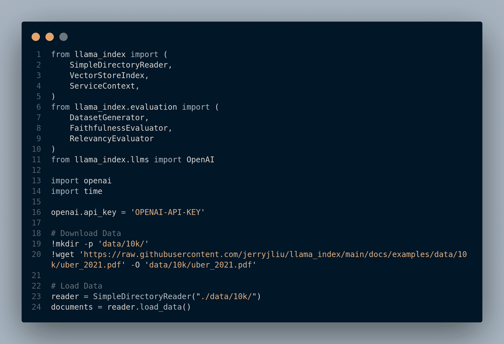

图 4.1：响应评估的数据准备

图 4.2 显示了为评估设置的准则。

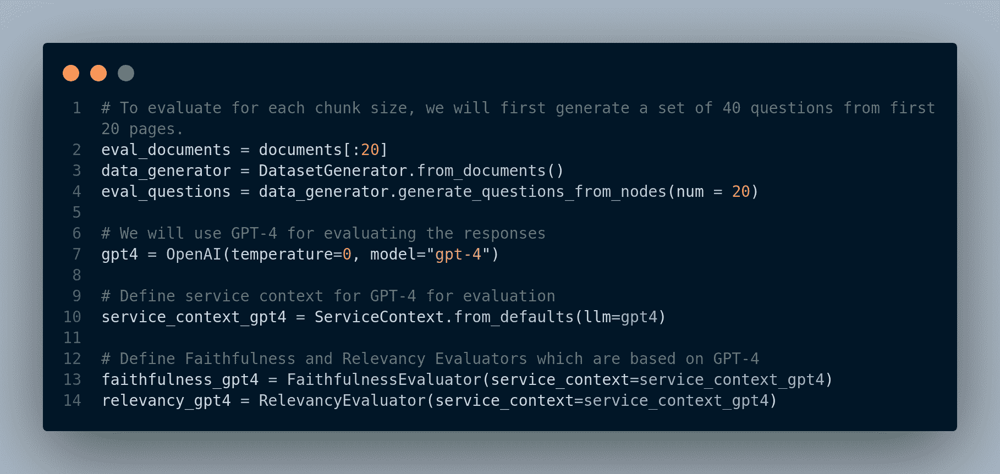

图 4.2：定义评估标准

图 4.3 展示了评估函数的定义。

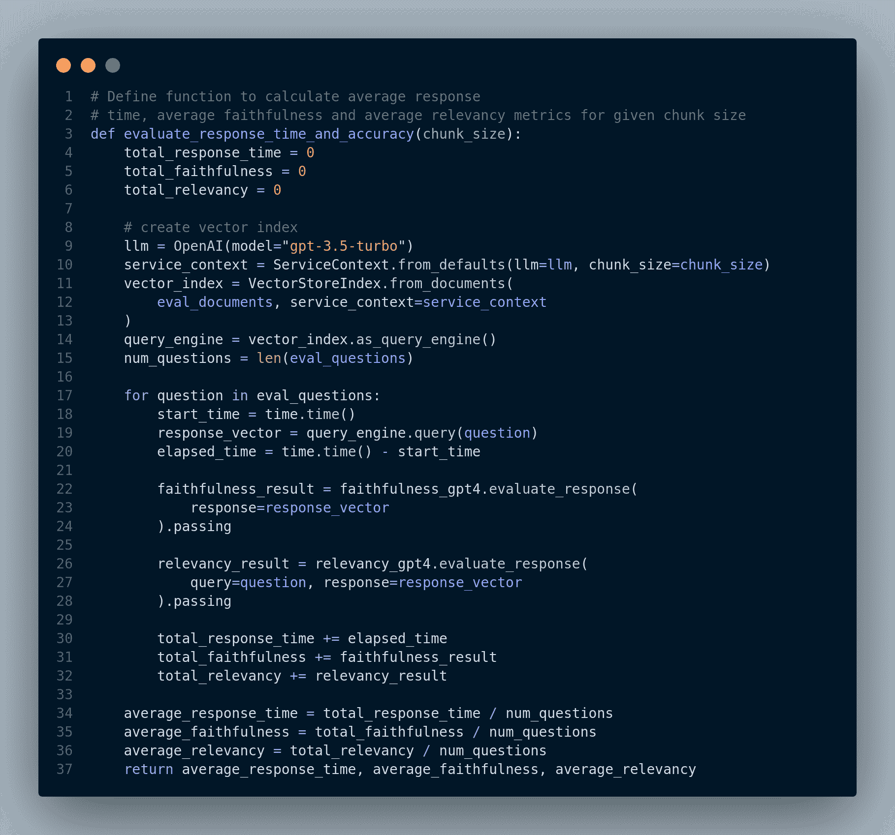

图 4.3：定义一个用于评估的函数

并且图 4.4 演示了使用不同块大小测试评估函数。


图 4.4：使用不同参数运行评估函数

他们测试了不同的块大小，并得出结论（在这个实验中），`chunk_size = 1024`导致*平均忠实度*和*平均相关性*达到峰值。

这里是选择 RAG 系统最佳块大小的技巧总结：

+   考虑源文本的大小和复杂性。更大的文本和更复杂的文本需要更大的块大小以确保捕获所有相关信息。

+   考虑所需的检索性能。如果您需要检索尽可能相关的块，您可能希望使用较小的块大小。然而，如果您需要快速检索块，您可能希望使用较大的块大小。

+   考虑可用的系统资源。如果您系统资源有限，您可能希望使用较小的块大小。然而，如果您有充足的系统资源，您可能希望使用较大的块大小。您可以通过使用各种指标来评估您 RAG 系统的最佳块大小，例如：

+   **相关性**：检索到的块与查询的相关性百分比。

+   **忠实度**：检索到的块忠实于源文本的百分比。

+   **响应时间**：检索查询块所需的时间。一旦你评估了不同块大小的 RAG 系统性能，你可以选择在相关性、忠实度和响应时间之间取得最佳平衡的块大小。

### 4.2.2 RAG 评估的额外资源

RAG 应用的评估至今仍是一个未解决的问题，并且是一个活跃的研究领域。以下是一些关于 RAG 实际评估的参考文献：

1. Databricks 的这篇[博客](https://www.databricks.com/blog/LLM-auto-eval-best-practices-RAG)提供了一些评估 RAG 应用的最佳实践。图 4.5 展示了他们的实验设置。


图 4.5：Databricks 评估实验设置。[图片来源](https://www.databricks.com/blog/LLM-auto-eval-best-practices-RAG)

1.  Zheng 等人(2023)提出使用强大的 LLM 作为评委来评估这些模型在更开放性问题上的表现。

1.  [RAG 评估](https://cobusgreyling.medium.com/rag-evaluation-9813a931b3d4)是另一篇有趣的博客，讨论了如何使用 Langchain 评估 RAG 应用。

## 4.3 检索块与合成块

在检索增强生成（RAG）系统中增强检索的另一个基本技术是将用于检索的块与用于合成的块（即响应生成）*解耦*。主要思想是检索的最佳块表示可能不一定与有效合成的需求相一致。虽然原始文本块可能包含 LLM 生成全面响应所必需的详细信息，但它也可能包含填充词或可能引入嵌入表示偏差的信息。此外，它可能缺乏必要的全局上下文，使得在接收到相关查询时检索块变得具有挑战性。以一个电子邮件问答系统为例，电子邮件通常包含很多*冗余内容*（电子邮件的大部分是“期待”，“很高兴收到你的来信”等），而信息很少。因此，在这个上下文中保留语义以实现更好的和更准确的问答非常重要。

实施此技术有几种方法，包括：

1.  嵌入文本块的引用

1.  扩展句子级上下文窗口

### 4.3.1 嵌入文本块的引用

这里的主要思想是，我们在向量数据库中创建一个索引来存储文档摘要。当查询到来时，我们首先在高级别（即摘要）检索相关的文档，然后再直接检索较小的文本块，因为这样可能会检索到不相关的块。然后我们可以从检索到的文档中检索较小的块。换句话说，我们以分层的方式存储数据：文档的摘要和每个文档的块。我们可以将这种方法视为*密集分层检索*，其中文档级检索器（即摘要索引）首先识别相关的文档，然后段落级检索器找到相关的段落/块。Y. Liu 等人(2021)和 Zhao 等人(2022)为您提供了对这个方法的深入了解。图 4.6 展示了这项技术是如何工作的。

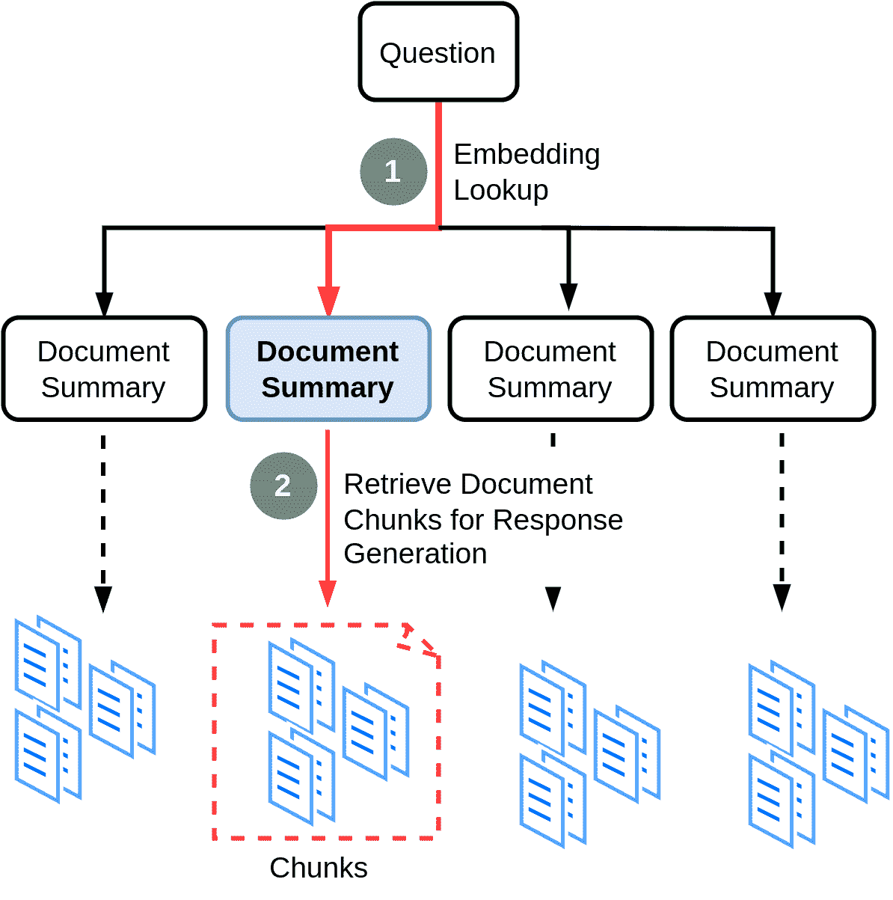

图 4.6：文档摘要索引

我们可以根据我们处理文档的类型选择不同的策略。例如，如果我们有一份网页列表，我们可以考虑每个页面作为一个*文档*进行总结，并且我们还可以将每个文档拆分成一组更小的块作为我们数据存储策略的第二级。当用户提问时，我们首先使用摘要嵌入找到相关的页面，然后我们可以从该特定页面检索相关的块。

如果我们有一个 PDF 文档，我们可以考虑 PDF 的每一页作为一个单独的文档，然后拆分每一页成更小的块。如果我们有一份 PDF 文件列表，我们可以选择每个 PDF 的整个内容作为一个文档，并将其拆分成较小的块。

让我们为我们的 PDF 文件编写代码。

### 第 1 步：读取 PDF 文件

我们读取 PDF 文件，图 4.7，并创建一个页面列表，因为我们稍后会将每一页视为一个单独的文档。

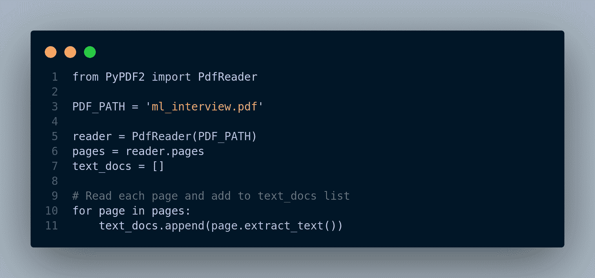

图 4.7：从 PDF 的每一页读取文档列表

### 第 2 步：创建文档摘要索引

为了创建一个*索引*，我们首先必须将一系列文本转换为与 LlamaIndex 兼容的*文档*列表。

**定义**：一个[文档](https://gpt-index.readthedocs.io/en/latest/core_modules/data_modules/documents_and_nodes/root.html)是围绕任何数据源的一个通用容器，例如，PDF、API 输出或从数据库检索的数据。它存储文本以及一些其他属性，如*元数据*和*关系（链接到其他文档/节点）*。

图 4.8 展示了代码。


图 4.8：构建文档摘要索引

我们可以使用摘要索引通过文档`id`获取每页/文档的摘要，例如，图 4.9 展示了文档摘要的输出。


图 4.9：文档摘要示例

### 第 3 步：使用文档摘要索引检索和生成响应

在这个步骤中，当查询到来时，我们从文档摘要索引中进行检索以找到相关的页面。检索到的文档包含指向其对应块（chunks）的链接，这些块用于生成对查询的最终响应。

在 LlamaIndex 中有多种实现方式：

+   高级查询执行

+   基于 LLM 的检索

+   基于嵌入的检索

高级方法在图 4.10 中展示。


图 4.10：高级查询执行方法（默认方法）

**基于 LLM 的检索**：这种方法是低级的，因此我们可以查看和更改参数。图 4.11 下面显示了代码片段：


图 4.11：基于 LLM 的检索方法

**基于嵌入的检索**：在这个技术中，我们首先定义`DocumentSummaryIndexEmbeddingRetriever`检索器，并配置响应生成器使用这个检索器。然后，我们将这两个组件集成到`RetrieverQueryEngine`中并运行它以进行查询。图 4.12 展示了这个方法的代码片段。

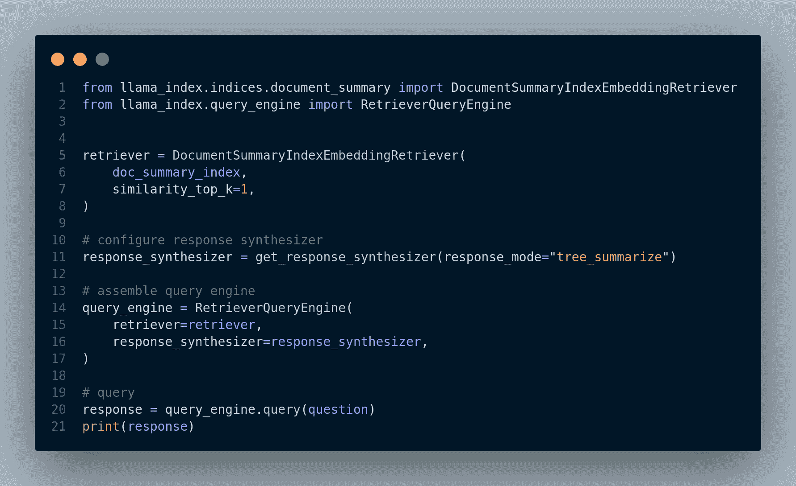

图 4.12：基于嵌入的检索

### 4.3.2 扩展句子级上下文窗口

在这个方法中，我们将文本分割成句子级别的块以执行细粒度检索。然而，在将检索到的句子传递给 LLM 响应生成器之前，我们包括检索句子周围的句子，以扩大上下文窗口以提高准确性。请注意，在非常细粒度地分割大型文本内容时，例如句子级别，可能会出现*中间丢失*的问题。

图 4.13 说明了这个技术。


图 4.13：扩展句子级上下文，以便 LLM 有更大的上下文来生成响应

### 实现

再次，我们依赖 LlamaIndex 来实现这个技术。我们使用`SentenceWindowNodeParser`将文档分割成句子并将每个句子保存到一个节点中。节点包含一个*窗口*属性，我们可以调整。在检索步骤中，每个检索到的句子将通过`MetadataReplacementNodePostProcessor`函数根据窗口大小替换为周围的句子。

图 4.14 展示了基本设置，例如导入必要的模块、读取 PDF 文件以及初始化 LLM 和嵌入模型。

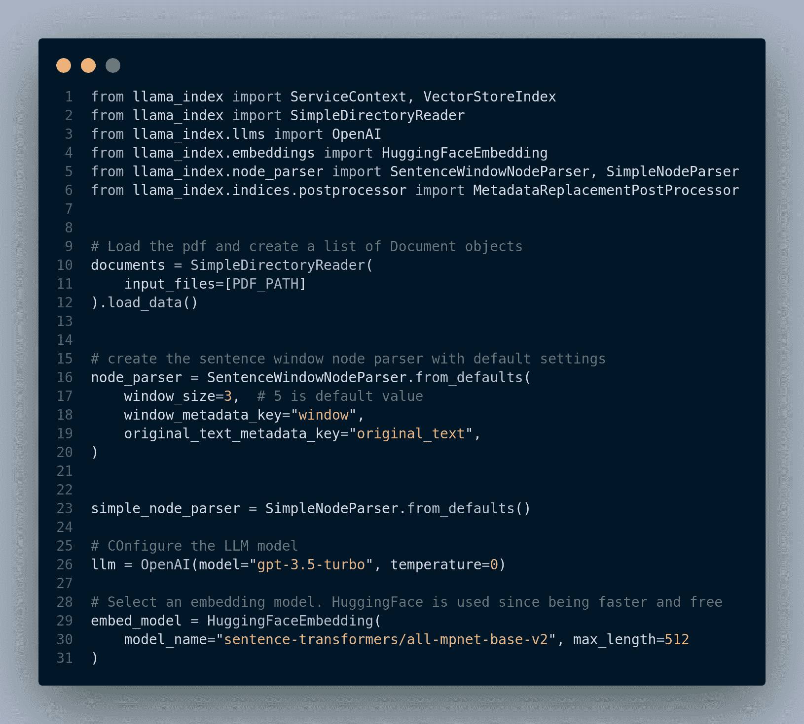

图 4.14：句子窗口实现的初步设置

接下来，我们必须定义将要存储在`VectorIndex`以及句子索引中的节点。然后，我们创建一个查询引擎并运行查询。图 4.15 展示了这些步骤。

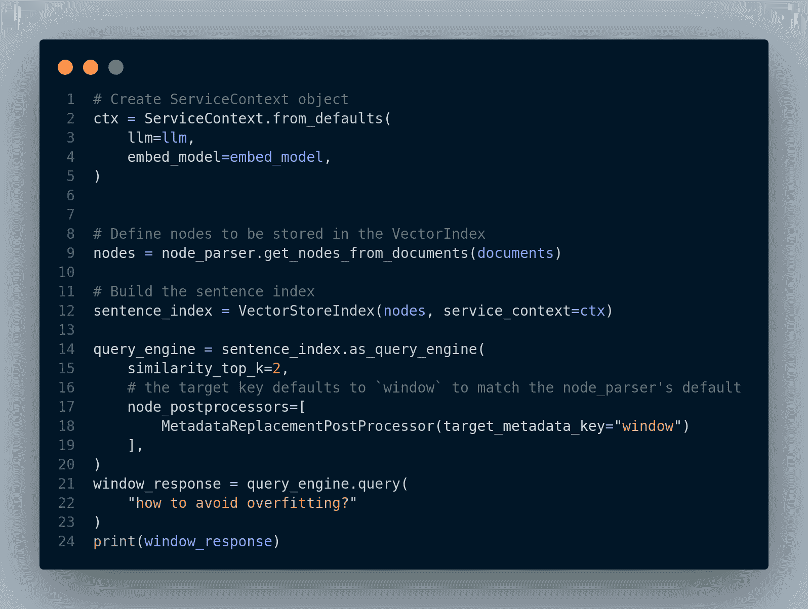

图 4.15：构建句子索引并运行查询

图 4.16 显示了响应输出。

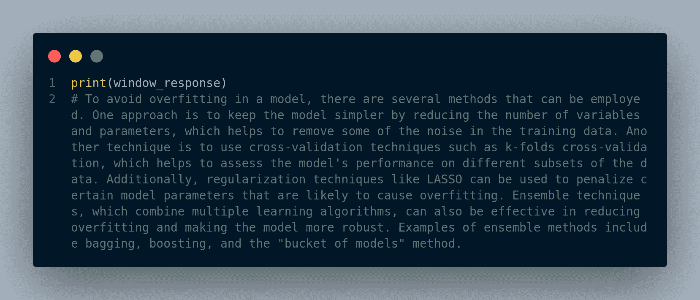

图 4.16：窗口响应的输出

我们可以看到为每个节点检索的原始句子（以下展示第一个节点）以及实际的句子窗口在图 4.17 中。

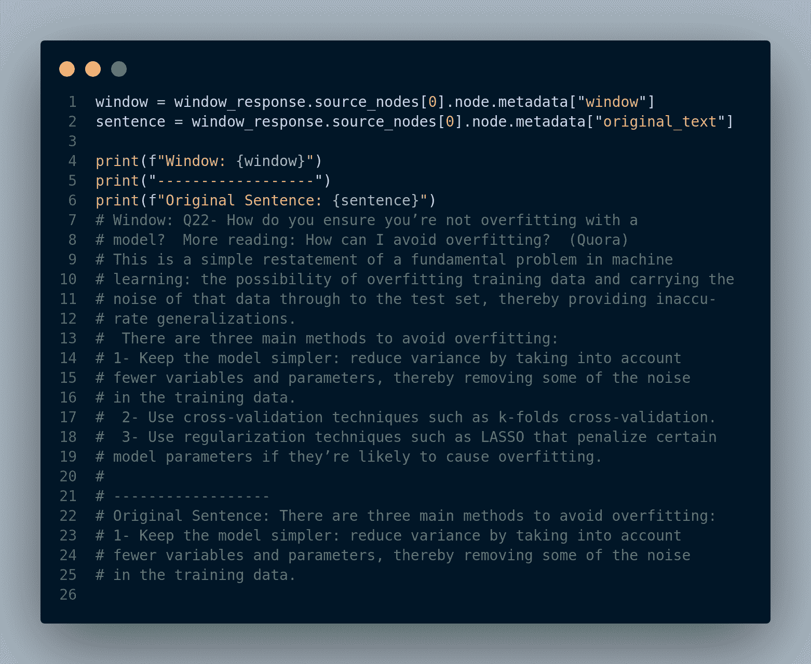

图 4.17：为每个节点检索的原始句子以及实际的句子窗口

### 4.3.3 中间丢失问题

在基于 RAG 的应用程序中，检索过程完全是关于为给定用户的查询检索正确且最相关的文档。我们找到这些文档的方式是检索方法根据文档与查询的相似度为每个文档分配一个相关性分数。然后，按降序排序并返回它们。然而，当我们返回许多文档，例如`top-k >= 10`时，这种方法可能效果不佳。原因是当我们向 LLM 传递一个非常长的上下文时，它往往会忽略或忽视中间的文档。因此，将最不相关的文档放在检索文档的底部并不是最佳策略。更好的方法是将这些最不相关的文档放在中间。

N. F. Liu 等人(2023)在[《中间丢失：语言模型如何使用长上下文》](https://www-cs.stanford.edu/~nfliu/papers/lost-in-the-middle.arxiv2023.pdf)中展示了关于 LLM 行为的有趣发现。他们意识到，当相关信息位于输入上下文的开始或结束时，LLM 的性能通常达到顶峰。然而，当模型需要访问埋藏在长上下文中间的相关信息时，性能会明显下降。图 4.18 展示了这些结果。


图 4.18：基于 RAG 的准确性与检索文档的位置。[图片来源](https://www-cs.stanford.edu/~nfliu/papers/lost-in-the-middle.arxiv2023.pdf)

他们还表明，具有更长上下文窗口的 LLM 仍然面临这个问题，增加上下文窗口并不能解决这个问题。以下演示了这项实验。

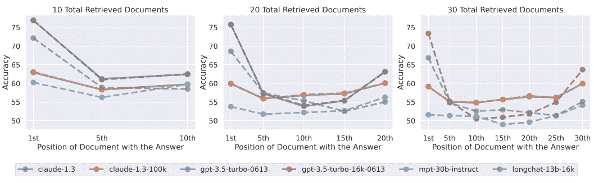

图 4.19：比较不同上下文大小的 LLM 模型和改变相关文档位置的影响

**我们如何减轻这个问题呢？** 答案是将检索到的文档重新排序，以便将查询的最相似文档放在顶部，不太相似的文档放在底部，最不相似的文档放在中间。

对于实现，我们需要一个函数来从 `retriever` 获取检索到的文档并重新排序它们，即放置最相关的文档在开始和末尾。图 4.20 展示了我们的代码。

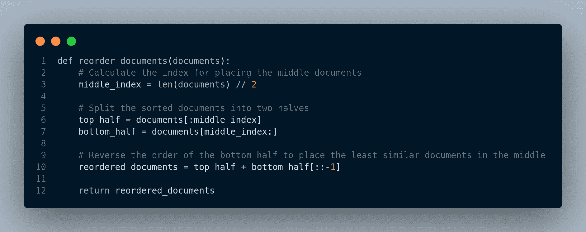

图 4.20：解决中间丢失问题的函数伪代码

我们可以改用 Langchain 解决方案：`LongContextReorder`。它本质上实现了与图 4.20 函数类似的方法。您可以阅读[文档](https://api.python.langchain.com/en/latest/document_transformers/langchain.document_transformers.long_context_reorder.LongContextReorder.html)获取更多详细信息。

图 4.21 展示了如何使用 Langchain 解决方案来处理这个问题。


图 4.21：Langchain 解决方案用于解决中间丢失问题

我们还可以使用 [Haystack](https://haystack.deepset.ai/) 来处理这个问题。Haystack 是一个开源框架，用于以端到端的方式构建使用大型语言模型 (LLM) 的自定义 NLP 应用程序。它提供了一些组件，这些组件是执行各种任务（如文档检索和摘要）的构建块。我们可以连接这些组件并创建一个端到端 *管道*。我们可以利用的两个非常有用的组件是 *DiversityRanker* 和 *LostInTheMiddleRanker*。

> **DiversityRanker** 设计用于最大化给定文档的多样性。它通过选择与查询最语义相似的文档，然后选择最不相似的文档，并继续使用剩余文档进行此过程，直到形成一个多样化的集合。它基于这样一个原则，即多样化的文档集合可以增加 LLM 生成更广泛和深入答案的能力。
> 
> **LostInTheMiddleRanker** 根据中间丢失的顺序对文档进行排序。排序器将最相关的文档放在结果列表的开始和末尾，而将最不相关的文档放在中间。

请查阅它们的[文档](https://docs.haystack.deepset.ai/docs/ranker)以获取更多详细信息。

### 4.3.4 嵌入优化

优化嵌入可以对您用例的结果产生重大影响。有各种嵌入模型的 API 和提供商，每个都针对不同的目标：

+   有些模型最适合编码任务。

+   有些是为英语语言专门设计的。

+   此外，还有一些嵌入模型在处理多语言数据集方面表现出色（例如，多语言 BERT/[mBERT](https://huggingface.co/bert-base-multilingual-cased)）。

然而，确定哪种嵌入模型最适合您的数据集需要有效的评估方法。

**那么我们应该使用哪些嵌入模型呢？**

一种方法是通过依赖现有的学术基准。然而，重要的是要注意，这些基准可能无法完全捕捉到 AI 用例中检索系统在现实世界中的使用。它们通常是专门为信息检索问题设计的合成基准。

例如，有一个名为 MTEB（大规模文本嵌入基准）的基准。MTEB 的[排行榜](https://huggingface.co/spaces/mteb/leaderboard)展示了包括多语言任务在内的 8 个任务中的嵌入模型，目前有 132 个模型。您可以比较这些模型的性能、速度或两者（参考下面的图表：图 4.22）。


图 4.22：平均英语 MTEB 分数（y）与速度（x）与嵌入大小（圆圈大小）的模型。[图片来源](https://huggingface.co/blog/mteb)

为了获得更好的结果，您仍然可以通过将它们应用于您的特定数据和用例来利用开源工具。此外，您可以通过简单地将人类反馈纳入相关性反馈端点来提高相关性。

构建自己的数据集也很重要，因为您对生产数据、相关指标以及真正对您重要的事情有深入的了解。这使您能够根据特定需求定制训练和评估过程。

在评估嵌入模型性能方面，市场上提供了出色的评估工具。这些工具可以帮助您评估不同模型的有效性，并做出明智的决定。

值得注意的是，最近的研究和实验表明，具有相同训练目标和相似数据的嵌入模型往往会学习到非常相似的表现，甚至可以达到仿射线性变换的程度。这意味着可以使用简单的线性变换将一个模型的嵌入空间投影到另一个模型的嵌入空间。

通过理解和利用线性可识别性，您可以探索在嵌入模型之间转移知识的方法，并有可能提高它们在特定任务中的性能。”

这被称为线性可识别性，它是在 2020 年由 Roeder 和 Kingma 在 Google Brain 发表的论文《On Linear Identifiability of Learned Representations》中讨论的。2021 [论文链接](https://arxiv.org/pdf/2007.00810.pdf)。论文中提到，

> *“我们证明，随着模型表示能力和数据集大小的增加，学习到的表示确实趋向于仅通过线性变换即可相等的解决方案。”*

下面是一个示例：


图 4.23：线性可识别性。[图片来源](https://arxiv.org/pdf/2007.00810.pdf)

因此，如果你能够从自己的数据集中发现并实现一个合适的转换，那么选择特定的嵌入模型可能并不那么重要。

## 4.4 重新思考异构文档集合的检索方法

检索增强生成（RAG）应用，尤其是在处理大量文档（例如拥有许多 PDF 文件）时，通常会面临与性能、相关性和延迟相关的问题。

**示例：** 假设一个用户提出一个问题，而用户问题的答案仅涉及两个 PDF 文件，我们更愿意首先获取这两个相关的 PDF 文档，然后从它们的片段中找到实际的答案，而不是在成千上万的文本片段中进行搜索。但如何做到这一点呢？

有多种方法可以实现这一目标：

+   具有多级嵌入，即嵌入文档摘要，其中每个文档摘要都与它的文本片段相关。这种方法在第 4.3.1 节中实现。

+   为每个文档添加元数据并将其与文档一起存储在向量数据库中。

### 4.4.1 元数据如何帮助

在索引过程中包含元数据可以是一种强大的策略，以解决这些挑战并显著提高整体系统的效率。通过使用元数据过滤器缩小搜索范围，系统可以减少需要考虑的文档数量，从而实现更快的检索时间。

图 4.24 展示了元数据过滤如何帮助检索过程。*当用户提出问题时，他们可以明确地提供元数据，例如通过指定下拉列表等过滤器，或者我们可以使用 LLM 从查询中确定元数据过滤器，并使用这些过滤器在向量数据库中进行搜索。向量数据库利用这些过滤器缩小搜索范围，以匹配过滤器的文档，然后从文档中找到最相似的片段并返回前 k 个片段。*


图 4.24：元数据过滤如何改善检索过程

请注意，尽管我们可以在文本块存储在向量数据库之后添加元数据，但我们应该在预处理步骤中这样做，当我们分割和嵌入文档时，因为如果向量数据库索引变得非常大（即，我们已经在向量数据库中有很多嵌入），更新它将非常耗时。

#### 使用 Langchain 进行元数据过滤

图 4.25 展示了如何为文本块定义新的元数据，以及如何使用过滤器进行检索。

在这个例子中，我们加载了两个 PDF 文件，一个文件是关于机器学习面试问题的，另一个文件是一篇研究论文。我们希望为每个文件添加一个主题或分类作为元数据，以便以后我们可以将搜索限制在分类上。因此，我们通过为每个文本块添加一个`分类`属性来更新初始元数据字段，然后将它们存储在向量数据库中。

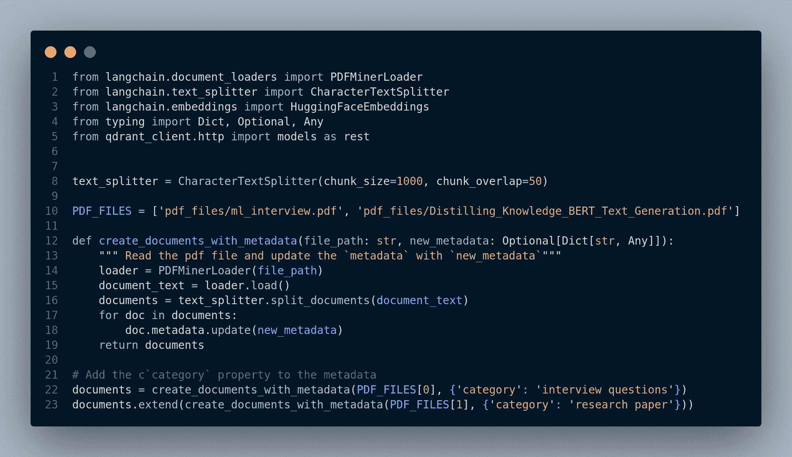

图 4.25：读取文件并更新元数据属性

如果我们打印出文档的`元数据`，我们可以看到`分类`属性已经被添加，如图图 4.26 所示。

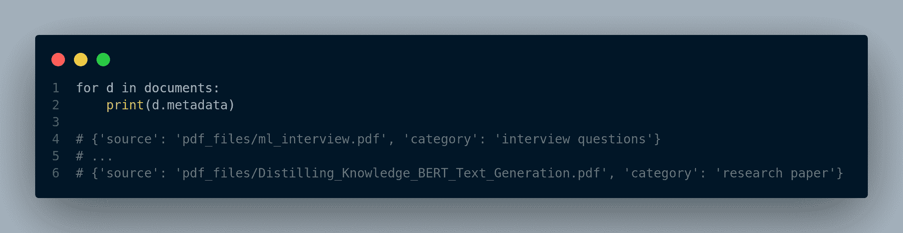

图 4.26：文本块的元数据输出示例

现在，我们定义索引并使用它进行搜索和检索，如图图 4.27 所示。


图 4.27：将文本块插入向量数据库并执行检索

#### 使用 LlamaIndex 进行元数据过滤

图 4.28 展示了如何使用 LlamaIndex 进行元数据过滤。


图 4.28：在 LlamaIndex 中进行文档检索的元数据过滤

#### 如何让 LLM 从用户问题中推断元数据

在这两种之前的技术中，我们在检索时必须明确定义元数据/过滤器。然而，问题是：*我们能否让 LLM 从用户查询中推断元数据？*简短的答案是：*是的*。

因此，一般的方法是我们需要为 LLM 定义一个特定的提示，这样它就可以使用它来从用户查询中提取实体或元数据，将它们映射到与文本块一起存储在向量数据库中的现有元数据，然后执行检索。

话虽如此，LlamaIndex 为我们提供了一个实现版本的这种方法。以下代码来自 LlamaIndex 文档[这里](https://gpt-index.readthedocs.io/en/latest/examples/vector_stores/chroma_auto_retriever.html)。对于这种技术，我们定义了元数据（在这个例子中是 `category` 和 `country`）以及每个文本块。图 4.29 展示了这一步骤的代码片段。

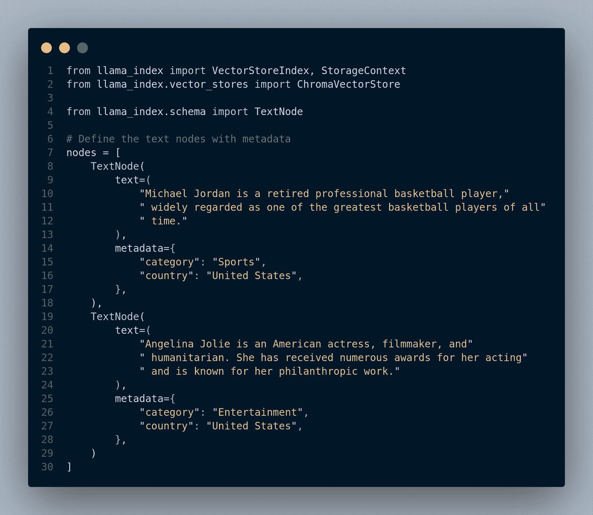

图 4.29：定义文本节点和元数据以实现自动检索

图 4.30 展示了检索过程，包括如何定义向量索引、向量存储和 `VectorIndexAutoRetriever` 对象。


图 4.30：定义 `VectorIndexAutoRetriever` 检索器和 `VectorStoreInfo`，它包含对向量存储集合的结构化描述以及它支持的元数据过滤器。

## 4.5 混合文档检索

混合文档检索是一种结合传统基于关键词的搜索（如 BM25）和语义（密集）搜索（使用嵌入，如 BERT 或 word2vec）的方法。将这种技术集成到检索增强生成（RAG）应用中可以显著提高文档检索的有效性。它解决了基本基于关键词的方法可能优于语义搜索的场景，并展示了如何结合这些方法来改进 RAG 应用中的检索。

此外，对于大多数公司来说，完全迁移到基于 RAG 的语义搜索是具有挑战性的。他们可能已经拥有一个基于关键词的搜索系统，并且已经使用它很长时间了。对公司信息架构进行彻底的改造，并迁移到向量数据库是不切实际的。

**有利于基于关键词搜索的场景**：

1.  **高度特定的查询**：在用户的查询非常具体且专注于精确术语或短语的情况下，基于关键词的方法可能优于语义搜索。关键词匹配在找到文档中的精确匹配方面表现出色。

1.  **利基领域**：在具有行业特定术语或缩写的专业领域，关键词搜索可能更有效，因为它直接匹配术语，而不需要广泛的语义理解。

1.  **短文档**：当处理非常短的文档，如推文或标题时，基于关键词的搜索可能更有效。语义模型通常需要更长的文本来推导出有意义的嵌入。

1.  **资源使用低**：与语义搜索相比，关键词搜索通常需要的计算资源更少。当资源效率是一个关键问题时，这可能是有利的。

**结合关键词和语义方法以改进检索**：

为了有效地利用基于关键词和语义（密集型）检索器的优势，一种实用方法是集成两个检索器到管道中并合并它们的输出。这种双管齐下的策略利用了每个检索器的独特优势，从而在检索增强生成（RAG）应用中实现更全面和准确的检索。

该过程首先在 RAG 管道中同时使用基于**关键词**和**密集型**检索器。然而，挑战在于合并这两个检索器获得的结果，每个检索器都返回带有每个文档相关性的排名列表。图 4.31 展示了混合检索管道。


图 4.31：混合检索管道

根据 RAG 应用的本质，合并基于关键词和语义检索的结果可以采用多种方法：

1.  **连接法**：这种方法涉及简单地将两个检索器（排除重复项）的所有文档附加在一起，以创建最终的列表。当您打算使用所有检索到的文档且结果顺序不是关键时，连接法是合适的。在提取式问答管道中，这种方法非常有价值，您旨在从多个来源提取信息，而不太关注排名。

1.  **相互排名融合（RRF）**：RRF 使用一个公式重新排名来自两个检索器的文档，优先考虑那些出现在两个结果列表中的文档。其目的是将最相关的文档提升到列表的顶部，从而增强结果的总体相关性。当结果顺序很重要或您打算仅将结果子集传递到后续处理阶段时，RRF 特别有用。

1.  **按评分合并**：在此方法中，文档根据各个检索器分配的评分进行排名。当您希望优先考虑来自一个检索器的结果而不是另一个检索器时，这种方法是合适的。如果两个检索器分配的相关性评分可以比较，并且您希望强调来自特定检索器的结果，则可以采用此方法。例如，如果您使用来自不同来源的密集型检索器，这些检索器从不同的文档存储中返回文档，此方法允许您选择一个检索器的输出而不是另一个。

**混合检索的优势**：

+   **增强相关性**：混合检索利用了关键词和语义方法的优势，增加了返回高度相关文档的可能性。

+   **覆盖范围**：它解决了纯关键词或纯语义方法可能失败的场景，提供了更广泛的相关文档范围。

+   **资源效率**：通过初始的基于关键字的过滤来缩小搜索范围，系统可以节省计算资源，使检索过程更加高效。

+   **适应性**：混合检索允许适应不同的用户查询和文档类型，在精确度和召回率之间取得平衡。

有一些框架支持开箱即用的混合检索，例如 [ElasticSearch](https://www.elastic.co/blog/improving-information-retrieval-elastic-stack-hybrid)，[Haystack](https://haystack.deepset.ai/tutorials/26_hybrid_retrieval)，[Weaviate](https://weaviate.io/developers/weaviate/search/hybrid)，和 [Cohere Rerank](https://txt.cohere.com/rerank/)。让我们来看看如何使用 Haystack 实现这种方法。以下代码来自 Haystack 文档，你可以在这里看到所有实现细节[这里](https://haystack.deepset.ai/tutorials/26_hybrid_retrieval)。本例中使用的文档来自 PubMed 的论文摘要。你可以在这里找到并下载数据集[这里](https://huggingface.co/datasets/ywchoi/pubmed_abstract_3/viewer/default/test)。

```py
pip install datasets>=2.6.1
pip install farm-haystack[inference]
```

***步骤 1**：我们加载数据集并初始化文档存储（即向量数据库）。图 4.32 展示了这一步骤。


图 4.32：加载文档并初始化文档存储

**步骤 2**：定义检索器，将文档和嵌入插入到文档存储中，并选择“联合文档”策略。你可以在图 4.33 中看到这一步骤。


图 4.33：定义基于关键字和嵌入的检索器

**步骤 3**：在 Haystack 中创建端到端管道并执行查询的混合检索。这一步骤在图 4.34 中展示。


图 4.34：创建端到端管道并运行检索器

查询重写是一种复杂的技巧，在增强检索增强大型语言模型（RAG）性能方面发挥着关键作用。查询重写背后的基本思想是优化和微调呈现给 RAG 系统检索组件的查询，最终导致更准确和上下文相关的结果。

核心概念是将初始用户查询转换为一种改进形式，这种形式能够有效地捕捉用户的意图并与文档检索阶段保持一致。这通常涉及各种步骤和考虑因素，包括：

1.  **扩展用户查询**：查询重写可能涉及通过添加同义词、相关术语或可能改进相关文档检索的概念来扩展初始用户查询。这种扩展可以基于语言分析或外部知识源。

1.  **清晰重述**：查询通常被重写以提高其清晰度和简洁性。含糊或复杂的表述可以被简化，以便更明确地表达用户的意图。

1.  **情境适应**：重写过程可能考虑可用于检索的文档的具体情境。它可以调整查询以适应文档语料库的特征，这在特定领域应用中尤其有价值。

查询重写与 RAG 系统中的文档检索阶段密切相关。它有助于提高检索排名，进而导致语言模型生成的更丰富、更具有情境相关性的答案。目标是确保检索到的文档与用户的意图紧密一致，并涵盖广泛的相关信息。

### 4.6.1 利用大型语言模型（LLMs）在 RAG 中进行查询重写

**问题**：*随着大型语言模型（LLMs）的出现，这些模型已经彻底改变了自然语言理解和生成任务，我们能否将它们用于查询重写？* 答案是：*是的*。它们可以通过两种主要方式帮助：查询扩展和生成更好的提示。图 4.36 展示了查询重写的工作原理。我们可以使用 LLM 来扩展（增强）查询或为更好的检索过程生成多个（子）查询。

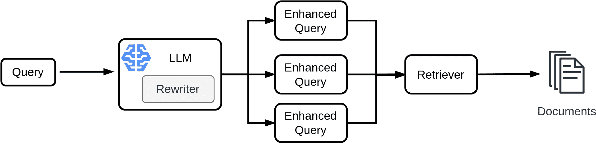

图 4.35：使用 LLMs 进行查询重写。LLM 可以扩展查询或创建多个子查询。

#### 4.6.1.1 使用 LLMs 进行查询扩展

LLMs 拥有对语言的广泛理解和庞大的知识库，这使得它们非常适合查询扩展。以下是 LLMs 如何帮助查询扩展的说明：

**同义词生成**：LLMs 可以识别用户查询中单词的同义词和相关术语。通过使用同义词扩展查询，它增加了检索到可能使用不同术语但情境相关的文档的机会。

**示例**：

*用户查询*：“可再生能源”。

*LLM 查询扩展*：“可再生能源”->“绿色能源”，“可持续能源”，“环保能源”。

通过建议“可再生”的同义词，LLM 扩大了查询的范围，以检索可能使用替代术语的文档。

**概念扩展**：LLMs 可以识别与查询相关的概念和实体。它们可以建议添加相关的概念、实体或短语，以获得更全面的结果。例如，如果用户查询“气候变化”，LLM 可能会建议添加“全球变暖”，以确保更广泛的文档检索。

**示例**：

*用户查询*：“火星探索”。

*LLM 查询扩展*：“火星探索” -> “火星任务”，“红色星球研究”，“火星太空探索”。

**多语言查询扩展**：对于多语言查询，LLMs 可以帮助将查询翻译和扩展成多种语言，扩大搜索范围并检索各种语言的文档。

#### 4.6.1.2 使用 LLM 生成更好的提示

LLM 可以帮助生成更有效的检索提示，尤其是在采用基于提示的检索机制时。以下是 LLM 对提示生成的贡献。

**查询优化**：LLMs 可以通过使其更简洁、明确和上下文相关来优化用户查询。优化后的查询可以作为检索组件的提示，确保更集中的搜索。

**示例**：

*用户查询*：“光合作用是如何工作的？”

*LLM 生成的提示*：“解释光合作用的过程。”

**多步提示**：在复杂查询中，LLM 可以生成多步提示，引导检索组件通过一系列子查询。这有助于将复杂的请求分解成更易于管理的检索任务。

**示例**：

*用户查询*：“2021 年电动汽车的市场趋势”。

*LLM 生成的多步提示*：

+   “检索 2021 年电动汽车的市场趋势。”

+   “将结果过滤以关注 2021 年的趋势。”

LLM 生成一系列提示，引导检索组件找到与 2021 年电动汽车市场趋势相关的文档。

**上下文感知提示**：LLMs 可以考虑到可用文档语料库的上下文，并生成与文档特征一致的提示。它们可以为特定领域或行业调整提示，确保检索阶段检索到上下文相关的文档。

**示例**：

*用户查询*：“医疗行业的法律文件”。

*LLM 生成的特定领域提示*：“检索与医疗行业相关的法律文件。”

理解上下文，LLM 生成针对医疗行业的定制提示，确保检索到的文档与该领域相关。

RAGs 的查询重写是一个活跃的研究领域，并且经常有新的方法被提出。最近的一项研究是 Ma 等人（2023），他们提出了一种新的查询生成框架。请参阅[这里](https://arxiv.org/pdf/2305.14283.pdf)了解更多关于他们方法的信息。

## 4.7 RAG 中的查询路由

RAG 中的查询路由，通常由路由器辅助，是自动选择和调用针对特定用户查询的最合适检索技术或工具的过程。它使系统能够根据每个查询的具体要求动态、自适应地选择如何检索信息。

与依赖于固定的检索方法不同，查询路由赋予系统智能评估用户查询并选择适当检索机制的能力。这种方法在可以采用多种检索技术或工具来回答不同类型查询的场景中特别强大。以下展示了这种方法的生成架构。

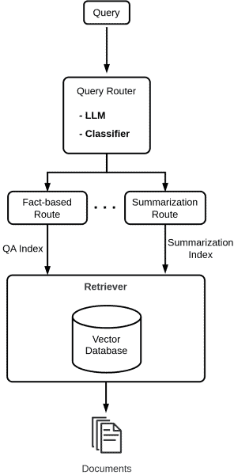

图 4.36：查询路由器架构

**查询路由工作原理**:

1.  **用户查询输入**:

    用户将查询输入到 RAG 系统中。这个查询可能包含各种类型的信息需求，如基于事实的查找、摘要、翻译、问答等。

1.  **查询分析**:

    路由器或查询路由组件首先对用户的查询进行分析。这种分析涉及理解查询的性质、其意图和所需信息类型。

1.  **检索技术需求检测**:

    基于分析，路由器检测与查询需求最匹配的检索技术或工具。这种检测通常由启发式方法、预定义规则、机器学习模型或这些方法的组合驱动。

1.  **检索技术选择**:

    路由器从预定义的集合中选择最合适的检索技术，这可能包括在向量存储中进行基于事实的查找、摘要、文档检索、问答或翻译等方法。

1.  **调用检索组件**:

    然后，路由器调用相关检索组件或“工具”，该组件专门从事所选的检索技术。这个组件可能是一个向量存储接口、一个摘要工具、一个翻译服务或任何其他检索方法。

1.  **信息检索**:

    选定的检索组件根据所选技术执行必要的信息检索或处理。例如，如果需要基于事实的查找，它将从向量存储中检索事实。如果需要摘要，它将生成简洁的摘要。如果目标是翻译，它将翻译内容。

1.  **输出生成**:

    检索或处理后的信息随后被 RAG 系统中的生成组件用于组成响应，并将其呈现给用户。

在检索增强生成（RAG）系统中实现查询路由有多种方式：

1.  **意图分类模型**:

    +   **使用分类器**：使用一个预训练的分类器模型，可以根据用户的意图对查询进行分类。这个分类器可以包含预定义的分类，如基于事实的查找、总结、翻译、问答等。选定的类别将决定要使用的检索方法。

    +   **机器学习**：在标记的查询数据上训练一个定制的意图分类模型，以预测查询的意图。这个模型可以在与 RAG 系统相关的特定意图检测任务上进行微调。

图 4.37 展示了如何使用零样本分类器对用户查询进行分类。


图 4.37：使用零样本分类器对用户查询进行分类和路由

1.  **基于提示的路由**：

    +   **利用 LLM**：利用大型语言模型（LLM），如 GPT-4 或类似模型，进行查询分类。可以设计一个提示来引导 LLM 根据查询的意图进行分类。

    +   **模板提示**：创建一组专门设计用于分类查询的模板提示。这些模板可以包括引导性问题或提示来激发查询的意图。

图 4.38 中的代码展示了如何使用大型语言模型 `text-davinci-002` 进行查询路由。


图 4.38：使用 LLM 对用户查询进行分类和路由

1.  **基于规则的路由**：

    +   **基于规则的系统**：开发一个基于规则的系统，该系统包含预定义的规则或条件来分类查询。例如，如果一个查询以“Translate”开头，它将被路由到翻译检索方法。

    +   **正则表达式**：使用正则表达式匹配查询模式，并根据预定义的模式、关键词或结构自动路由查询。

实现的选择取决于 RAG 系统的复杂性、可用资源以及应用程序的具体要求。实现这些方法的组合可以提供一个强大且自适应的查询路由机制，从而提高 RAG 系统的整体性能。

让我们看看一个示例，其中我们使用 LlamaIndex 框架在*总结路由*和*基于事实的路由*之间路由查询。LlamaIndex 有一个名为`RouterQueryEngine`的概念，它接受一组查询引擎`QueryEngineTool`对象作为输入。`QueryEngineTool`本质上是一个用于从向量数据库检索文档的索引。第一步是加载文档并定义总结索引和基于事实的索引，这在图 4.39 中显示。

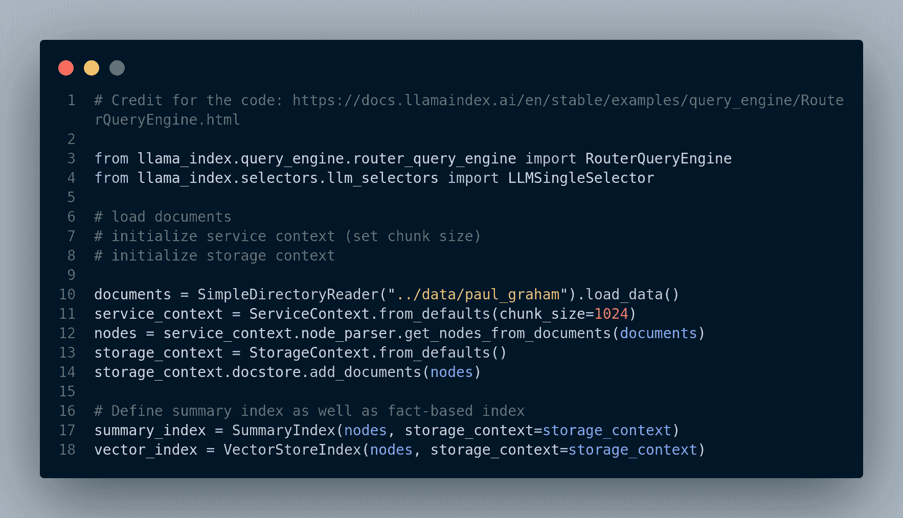

图 4.39：LlamaIndex 中的查询路由示例。首先我们加载文档并创建不同的索引。

然后，我们为每个索引创建`QueryEngine`对象，并将它们添加到`RouterQueryEngine`对象中。图 4.40 展示了这一步骤。


图 4.40：定义`QueryEngine`和`RouterQueryEngine`对象，并运行用户查询的引擎。

通过动态路由查询到最合适的检索技术，查询路由通过确保系统适应每个用户查询的具体要求，提供更准确和上下文感知的响应来增强 RAG。它克服了需要事先知道应用哪种检索技术的挑战，并优化了不同类型信息需求的检索过程。

## 4.8 利用用户历史记录提升 RAG 性能

由于能够结合信息检索和语言生成的优势，检索增强生成（RAG）系统在自然语言处理应用中获得了显著的关注。然而，RAG 应用往往涉及大量的计算和财务成本，这是由于需要嵌入、检索甚至响应生成的必要性。当处理重复的用户查询或类似问题时，可以通过利用先前询问的问题的内存来优化这些成本。

### 4.8.1 挑战

在许多现实世界的应用中，用户往往反复提出相似或几乎相同的问题。例如，在一个客户支持聊天机器人中，用户可能有与产品信息或故障排除程序相关的常见查询。虽然 RAG 框架在基于检索生成相关响应方面表现出色，但每次询问相同问题时重新嵌入和检索信息可能并不高效。这就是利用用户历史记录概念发挥作用的地方。

### 4.8.2 用户历史记录如何提升 RAG 性能

利用用户历史记录来提升 RAG 性能涉及构建一个先前询问的问题及其相应响应的内存或缓存。当收到用户查询时，系统不是立即触发嵌入和检索过程，而是可以检查用户历史记录以查看是否之前遇到过相似或相同的查询。这种方法提供了一些优势：

1.  **更快的响应时间（即减少延迟）**：通过将新查询与用户历史记录进行比较，系统可以识别重复或密切相关的问题。在这种情况下，它可以跳过嵌入和检索步骤，显著减少响应时间。

1.  **成本降低**：跳过重复查询的资源密集型检索过程，导致计算和财务成本显著降低，因为额外的 API 调用或数据处理需求减少。

1.  **一致性和准确性：** 对重复问题的回答可以随着时间的推移保持一致和准确。使用用户历史记录中的缓存响应确保用户接收可靠的信息，而无需依赖新的检索。此外，通过跟踪用户历史记录，RAG 可以更好地理解用户的意图和上下文。这可能导致对问题的更准确回答，即使问题表述并不完美。

### 4.8.3 内存/用户历史如何工作

一个简单的 RAG 内存可以这样实现：我们需要维护用户查询及其对应答案的日志。因此，我们可以将内存定义为键值存储，其中键是问题，值是答案。当用户提问时，RAG 首先检查其内存以查看是否已经回答了类似的问题。如果是，它就简单地从其内存中检索答案并返回给用户。如果没有回答过类似的问题，那么它就按常规执行嵌入和检索过程。

我们需要一个机制来不断更新 RAG 的内存以包含新的问题和答案。随着用户提出更多问题，RAG 的内存增长，它变得能够更准确、更有效地回答未来的问题。

**实现：** 图 4.41 中的代码片段展示了 RAG 内存的一个非常基本的实现。


图 4.41：RAG 内存的基本键值实现。

虽然如前例所示的一个简单的内存字典对于维护最近用户历史可能有效，但它可能不足以处理大规模对话历史或长期记忆。为了解决这些挑战，RAG 系统可以从使用向量数据库作为内存中受益。

在 RAG 系统中实现用于内存的向量数据库涉及几个关键步骤：

1.  **数据摄取：** 将历史问答对及其对应的嵌入存储在向量数据库中。此过程通常涉及批量或增量数据摄取管道。

1.  **检索：** 当用户提出问题时，通过计算问题的嵌入与向量数据库中的嵌入之间的相似度来检索最相关的历史答案。

1.  **更新内存：** 定期用新的问答对及其嵌入更新向量数据库，以保持内存的更新。

1.  **缓存：** 实现一个缓存机制，通过在内存中临时存储频繁访问的数据来提高检索速度。

1.  **查询优化：** 使用高效的索引和搜索算法来优化检索过程，减少查询响应时间。

在 RAG 系统中引入向量数据库作为记忆，通过有效地管理和检索历史信息，增强了其提供上下文相关和连贯响应的能力。这种方法在需要大量对话历史或长期记忆以支持应用成功的情况下尤其有价值。

在本章结束我们对高级 RAG 系统的探索之际，我们正站在一个新的前沿。在第五章——“RAG 的可观察性工具”中，我们将讨论为 RAG 系统量身定制的各种可观察性工具。我们将探讨它们与 LlamaIndex 的集成，包括 Weights & Biases、Phoenix 和 HoneyHive。这些工具不仅可以帮助我们监控和评估我们的 RAG 系统的性能，还能为持续改进提供宝贵的见解。

刘，Nelson F，林，Kevin，休伊特，John，帕兰贾佩，Ashwin，贝维拉卡，Michele，佩特罗尼，Fabio，梁，Percy。2023。“迷失在中间：语言模型如何使用长上下文。”*arXiv 预印本 arXiv:2307.03172*。刘，叶，ハシモト，カズマ，周，英波，亚武兹，Semih，熊，蔡明，于，Philip S。2021。“开放域问答的密集分层检索。”*arXiv 预印本 arXiv:2110.15439*。马，新北，公，叶云，何，彭程，赵，海，端，南。2023。“检索增强大型语言模型的查询重写。”*arXiv 预印本 arXiv:2305.14283*。罗德，Luke Metz，杰弗里，金卡玛，Durk。2021。“学习表示的线性可识别性。”*arXiv 预印本 arXiv:2007.00810*。赵，韦恩，辛，刘，刘，瑞阳，任，文，吉荣。2022。“基于预训练语言模型的密集文本检索：综述。”*arXiv 预印本 arXiv:2211.14876*。郑，连民，江，韦林，生，应，庄，三元，吴，张浩，庄，永豪，林，子。2023。“使用 MT-Bench 和聊天机器人竞技场评估 LLM-as-a-Judge。”*arXiv 预印本 arXiv:2306.05685*。
