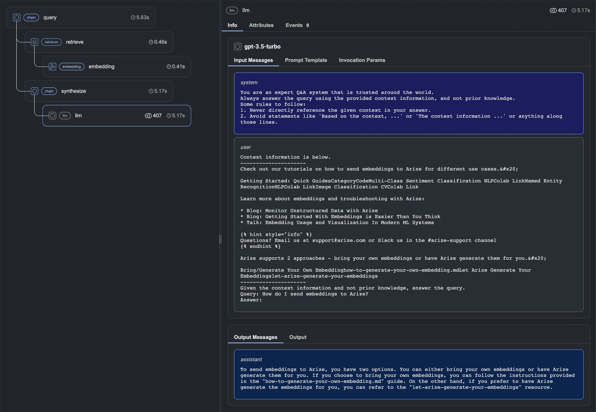
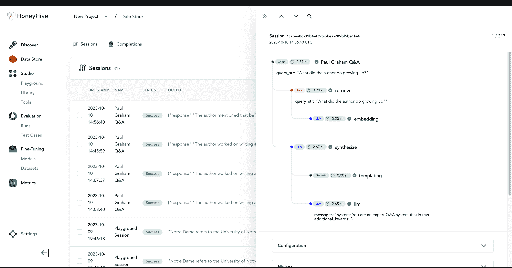

# 5  RAG 可观察性工具

> 原文：[`mallahyari.github.io/rag-ebook/05_observability_tools.html`](https://mallahyari.github.io/rag-ebook/05_observability_tools.html)

可观察性工具是一种软件或平台，旨在帮助监控、分析和深入了解复杂系统（如机器学习模型、RAG 系统或软件应用程序）的性能、行为和健康状况。这些工具提供了对系统各个方面的可见性，使操作员、管理员和开发者能够了解系统的工作方式，并检测和解决故障。

可观察性工具的关键组件和功能通常包括：

1.  **数据收集：** 可观察性工具从系统内的各种来源收集数据。这些数据可以包括指标（例如，CPU 使用率、内存使用率）、日志、追踪、事件等。收集的数据范围越广，可观察性就越全面。

1.  **存储：** 工具收集的数据用于分析和历史参考。存储可以是时序数据库、日志存储库或其他旨在处理大量数据的存储解决方案。

1.  **分析：** 可观察性工具提供分析功能，以处理和解释收集到的数据。这包括查询数据、聚合指标以及识别模式或异常。

1.  **可视化：** 工具提供可视化功能，以创建图表、仪表板和报告，使用户更容易解释数据。可视化有助于发现趋势、问题和性能瓶颈。

1.  **警报：** 许多可观察性工具允许用户定义警报规则。当满足某些条件时，工具会发送通知，使操作员能够及时响应问题。

1.  **追踪：** 对于分布式系统，追踪很重要。可观察性工具通常提供追踪功能，以跟踪请求在系统中的各种服务或组件之间移动。这有助于确定性能瓶颈和问题。

1.  **用户界面：** 交互式可观察性工具生成数据和洞察的用户友好界面是必不可少的。它应允许用户探索数据、设置警报和可视化信息。

1.  **集成：** 可观察性工具应与系统的各种组件（如应用程序、数据库、容器和云服务）集成，以捕获相关数据。

1.  **可扩展性：** 工具应能够与它所监控的系统一起扩展。它需要处理不断增长的数据量，并在不损害性能的情况下提供洞察。

1.  **定制：** 用户应能够根据他们系统的特定需求定制工具。这包括定义自定义仪表板、警报和数据收集方法。

基于 RAG 的系统有几种可观察性工具。LlamaIndex 等框架还提供了一种简单的方法将这些工具集成到 RAG 应用中。这使得我们能够：

+   查看 LLM 的提示输入和输出

+   确保所有组件如嵌入模型、LLM 和向量数据库都按预期工作

+   查看索引和查询跟踪

为了将可观察性工具集成到 LlamaIndex 中，我们只需执行以下操作，图 5.1：

图 5.1：将可观察性工具集成到 LlamaIndex 的一般模式

## 5.1 权重与偏差与 LlamaIndex 的集成

[权重与偏差](https://docs.wandb.ai/) 是一个机器学习平台，它使开发者能够高效地增强他们的模型。它提供了用于实验跟踪、数据集版本控制、模型评估、结果可视化和与同行无缝协作的灵活工具。

图 5.2 中展示的代码显示了如何将 W&B 与 LlamaIndex 集成。对于完整的示例，请参阅[这里](https://gpt-index.readthedocs.io/en/latest/examples/callbacks/WandbCallbackHandler.html)。

图 5.2：W&B 与 LlamaIndex 的集成

我们甚至可以看到如图图 5.3 所示的日志。

图 5.3：不同步骤的 W&B 日志

如果我们访问 W&B 网站并登录，我们可以看到所有详细信息，图 5.4 显示了我们的项目，包括图表、工件、日志和跟踪。

图 5.4：W&B 仪表板

## 5.2 凤凰与 LlamaIndex 的集成

[凤凰](https://github.com/Arize-ai/phoenix) 是为 LLM 应用设计的可观察性工具，可以深入了解其内部工作原理。它提供了查询引擎调用的可视化表示，并根据延迟和令牌计数等因素突出显示问题执行范围，有助于性能评估和优化。

图 5.5 显示了使用凤凰的一般使用模式。

图 5.5：凤凰与 LlamaIndex RAG 应用的集成

当我们运行查询时，我们可以在凤凰 UI 中实时看到跟踪。图 5.6 展示了 RAG 应用的凤凰 UI。

图 5.6：实时显示查询跟踪的凤凰 UI。

使用 Phoenix 跟踪 LlamaIndex RAG 应用程序的完整示例可在以下[链接](https://colab.research.google.com/github/Arize-ai/phoenix/blob/main/tutorials/tracing/llama_index_tracing_tutorial.ipynb)找到。

## 5.3 HoneyHive 与 LlamaIndex 的集成

[HoneyHive](https://honeyhive.ai/) 是一个可以用于测试和评估、监控和调试 LLM 应用程序的框架。它可以无缝集成，如图 5.7 所示，到 LlamaIndex 应用程序中。

图 5.7：HoneyHive 与 LlamaIndex 的集成

HoneyHive 仪表板看起来如下图 5.8：

图 5.8：HoneyHive 仪表板

完整指南请参阅此[教程](https://gpt-index.readthedocs.io/en/latest/examples/callbacks/HoneyHiveLlamaIndexTracer.html)。

我们还可以使用其他可观测性工具，包括 [Truera](https://truera.com/ai-quality-education/generative-ai-and-llms/retrieval-augmented-language-models-need-an-observability-layer/)、[databricks](https://www.databricks.com/blog/mlflow-2-7-llmops-prompt-eng-ai-gateway-updates) 和 [Elastic 可观测性](https://www.elastic.co/blog/transforming-observability-ai-assistant-otel-standardization-continuous-profiling-log-analytics) 等众多其他工具。

# 6 结束语

在结束我们对“**《检索增强生成系统实用方法》**”篇章的旅程之际，我们希望您已经对检索增强生成（RAG）的世界有了宝贵的见解。随着人工智能领域的持续发展，RAG 系统呈现了检索和生成技术的激动人心的交汇点，在众多行业和应用中具有巨大的潜力。随着每一章节的深入，我们探讨了支撑 RAG 系统开发和实施的核心原则、策略和技术。

记住，人工智能领域是动态且不断变化的。虽然本书旨在提供对 RAG 的全面理解，但新的发展和可能性始终在前方。我们鼓励您继续在检索增强生成领域探索、实验和创新。您的旅程并未结束，这只是个开始。

感谢您加入我们，共同踏上探索人工智能未来核心的变革之旅。

## 6.1 致谢

我们想向[LlamaIndex](https://www.llamaindex.ai/)、[LangChain](https://www.langchain.com/)和[Haystack](https://haystack.deepset.ai/)背后的团队表达我们的感激之情，因为他们对检索增强生成（RAG）领域的宝贵贡献。他们的全面文档和教程在我们的旅程中起到了关键作用，使我们能够从他们的专业知识中学习，并利用他们构建的迷人工具。
