## 1

## 大型语言模型的概述

自从 2017 年谷歌大脑团队推出了一种名为 Transformer 的高级人工智能（AI）深度学习模型以来，它已成为学术界和工业界处理各种自然语言处理（NLP）任务的行业标准。很可能你今天已经与 Transformer 模型互动过，甚至没有意识到这一点，因为谷歌使用 BERT 通过更好地理解用户的搜索查询来增强其搜索引擎。OpenAI 的 GPT 系列模型也因其生成类似人类文本和图像的能力而受到关注。

这些 Transformer 现在为 GitHub 的 Copilot（由 OpenAI 与微软合作开发）等应用提供动力，它可以将注释和代码片段转换为功能齐全的源代码，甚至可以调用其他 LLMs（如列表 1.1）来执行 NLP 任务。

**列表 1.1** 使用 Copilot LLM 从 Facebook 的 BART LLM 获取输出

```py
from transformers import pipeline

def classify_text(email):
    """
    Use Facebook's BART model to classify an email into "spam" or "not spam"  

    Args:
        email (str): The email to classify
    Returns:
        str: The classification of the email
    """
    **# COPILOT START. EVERYTHING BEFORE THIS COMMENT WAS INPUT TO BART**
    classifier = pipeline(
        'zero-shot-classification', model='facebook/bart-large-mnli')
    labels = ['spam', 'not spam']
    hypothesis_template = 'This email is {}.'

    results = classifier(
        email, labels, hypothesis_template=hypothesis_template)

    return results['labels'][0]
    **# COPILOT END**
```

在这个列表中，我使用 Copilot 仅接受一个 Python 函数定义和一些我写的注释，并编写了所有代码以使该函数执行我写的内容。这里没有挑选，只是一个完全工作的 Python 函数，我可以像这样调用它：

```py
classify_text('hi I am spam')  # spam
```

看起来我们周围都是 LLMs，但它们在底层到底在做什么呢？让我们来看看吧！

### 什么是大型语言模型（LLMs）？

**大型语言模型**（LLMs）是通常（但不一定）源自 Transformer 架构的 AI 模型，旨在*理解*和*生成*人类语言、代码以及更多内容。这些模型在大量文本数据上进行了训练，使它们能够捕捉人类语言的复杂性和细微差别。LLMs 可以执行各种语言任务，从简单的文本分类到文本生成，具有高精度、流畅性和风格。

在医疗保健行业，LLMs 被用于电子病历（EMR）处理、临床试验匹配和药物发现。在金融领域，LLMs 被用于欺诈检测、金融新闻的情感分析，甚至交易策略。LLMs 还通过聊天机器人和虚拟助手用于客户服务自动化。凭借其多功能性和高性能特性，基于 Transformer 的 LLMs 正在成为各种行业和应用的越来越有价值的资产。

**注意**

我将在本文中使用“理解”这个词很多。我通常指的是“自然语言理解”（NLU），它是 NLP 的一个研究分支，专注于开发能够准确解释人类语言的算法和模型。正如我们将看到的，NLU 模型在分类、情感分析和命名实体识别等任务上表现出色。然而，需要注意的是，尽管这些模型可以执行复杂的语言任务，但它们并不具备人类那样的真正理解能力。

LLMs 和 Transformers 的成功归功于几个想法的结合。其中大多数想法已经存在多年，但也是在同一时间被积极研究的。诸如注意力、迁移学习和扩展神经网络等机制，为 Transformers 提供了支撑，它们在几乎同一时间取得了突破。图 1.1 概述了过去几十年 NLP 的一些最大进步，所有这些都为 Transformer 的发明奠定了基础。

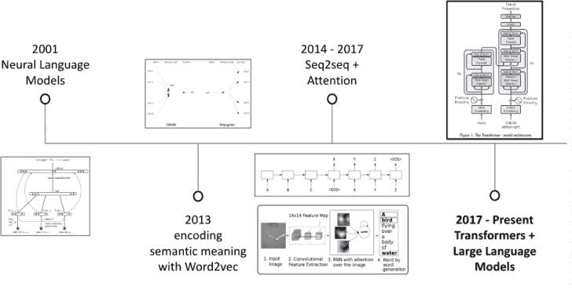

**图 1.1** *现代 NLP 简史强调了使用深度学习来解决语言建模、大规模语义词嵌入（Word2vec）的进步、具有注意力的序列到序列模型（我们将在本章后面更深入地探讨），以及 2017 年的 Transformer。*

Transformer 架构本身相当令人印象深刻。它可以以先前最先进的 NLP 模型无法实现的方式高度并行化和扩展，使其能够扩展到比以前 NLP 模型更大的数据集和训练时间。Transformer 使用一种特殊类型的注意力计算，称为**自注意力**，允许序列中的每个单词“关注”（寻找上下文）序列中的所有其他单词，使其能够捕捉单词之间的长距离依赖关系和上下文关系。当然，没有架构是完美的。Transformers 仍然局限于一个输入上下文窗口，它代表了在任何给定时刻它可以处理的文本的最大长度。

自从 2017 年 Transformer 问世以来，围绕使用和部署 Transformer 的生态系统已经爆炸式增长。恰如其名，“Transformer”库及其支持包使得从业者能够使用、训练和共享模型，极大地加速了其采用，并被成千上万家组织和机构所使用。像 Hugging Face 这样的流行 LLM 存储库也应运而生，为大众提供了访问强大开源模型的机会。简而言之，使用和生产化 Transformer 从未如此简单。

这本书正是为了填补这一空白。

我的目的是指导你如何使用、训练和优化各种 LLM 以应用于实际，同时给你足够的洞察力了解模型的内部工作原理，以便你能够做出关于模型选择、数据格式、微调参数等方面的最佳决策。

我的目的是让软件开发者、数据科学家、分析师和爱好者都能轻松使用 Transformers。要做到这一点，我们应该从同一起跑线开始，并更多地了解 LLMs。

#### LLMs 的定义

为了稍微支持这一点，我们首先应该谈谈 LLMs 和 Transformers 被用来解决的具体 NLP 任务，这为它们解决多种任务的能力提供了基础层。**语言建模**是 NLP 的一个子领域，涉及创建统计/深度学习模型来预测指定**词汇**（一个有限且已知的标记集合）中标记序列的可能性。通常有两种语言建模任务：自编码任务和自回归任务图 1.2。

**注意**

术语**标记**指的是通过将句子或文本分解成更小的单元而创建的最小语义单位，是 LLM 的基本输入。标记可以是单词，也可以是“子词”，正如我们将在本书的后续部分更深入地了解的那样。一些读者可能熟悉“n-gram”这个术语，它指的是 n 个连续标记的序列。

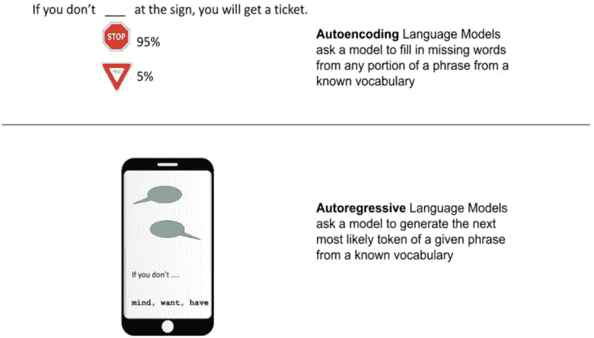

**图 1.2** *自编码和自回归语言建模任务都涉及填充缺失的标记，但只有自编码任务允许在缺失标记的两侧看到上下文。*

**自回归**语言模型被训练根据短语中的前一个标记预测句子中的下一个标记。这些模型对应于 Transformer 模型的解码器部分，并且对整个句子应用掩码，以便注意力头只能看到之前的标记。自回归模型非常适合文本生成，GPT 是这个类型模型的典型例子。

**自编码**语言模型被训练从输入的损坏版本中重建原始句子。这些模型对应于 Transformer 模型的编码器部分，并且可以访问完整的输入而不需要任何掩码。自编码模型创建整个句子的双向表示。它们可以针对各种任务进行微调，如文本生成，但它们的主要应用是句子分类或标记分类。这类模型的典型例子是 BERT。

总结来说，大型语言模型（LLMs）要么是自回归的，要么是自编码的，或者两者兼而有之。现代的 LLMs 通常基于 Transformer 架构，这是我们将会使用的架构，但它们也可以基于其他架构。LLMs 的标志性特征是它们庞大的规模和庞大的训练数据集，这使得它们能够以高精度执行复杂的语言任务，如文本生成和分类，并且几乎不需要微调。

表 1.1 显示了几个流行的 LLMs 的磁盘大小、内存使用量、参数数量以及预训练数据的近似大小。请注意，这些大小是近似的，可能会根据具体的实现和硬件使用而有所不同。

**表 1.1 大型语言模型（LLMs）比较**

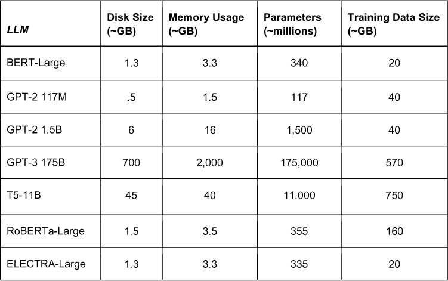

但大小是关键。让我们看看 LLMs 的一些关键特性，然后深入了解 LLMs 是如何学习和读写。

#### LLMs 的关键特性

2017 年设计的原始 Transformer 架构是一个**序列到序列模型**，这意味着它有两个主要组件：

 一个**编码器**，负责接收原始文本，将其拆分成其核心组件（关于这一点稍后讨论），将其转换为向量（类似于 Word2vec 过程），并使用注意力机制来**理解**文本的上下文

 一个**解码器**，擅长通过使用修改后的注意力机制来预测下一个最佳标记来**生成**文本

如图 1.3 所示，Transformer 有许多其他子组件，这些组件促进了更快的训练、泛化能力和更好的性能。今天的 LLMs 大部分是原始 Transformer 的变体。BERT 和 GPT 等模型将 Transformer 分解为仅一个编码器和一个解码器（分别），以构建在理解和生成（也分别）方面表现卓越的模型。

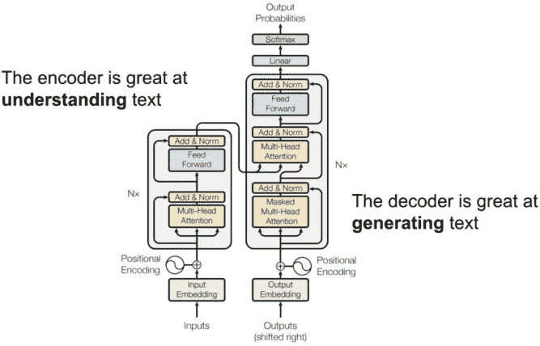

**图 1.3** *原始 Transformer 有两个主要组件：一个擅长理解文本的编码器和一个擅长生成文本的解码器。将它们结合起来，使整个模型成为一个“序列到序列”模型。*

通常，大型语言模型（LLMs）可以分为三个主要类别：

 **自回归模型**，例如 GPT，它根据前一个标记预测句子中的下一个标记。它们在根据给定上下文生成连贯的自由文本方面非常有效

 **自编码模型**，例如 BERT，通过掩盖一些输入标记并尝试从剩余的标记中预测它们来构建句子的双向表示。它们擅长快速且大规模地捕捉标记之间的上下文关系，这使得它们成为文本分类任务等领域的优秀候选者。

 **自回归和自编码的组合**，如 T5，可以使用编码器和解码器来在生成文本时更加灵活和多变。研究表明，这些组合模型能够在不同上下文中生成比纯解码器自回归模型更丰富和更具创造性的文本，因为它们能够通过编码器捕获额外的上下文。

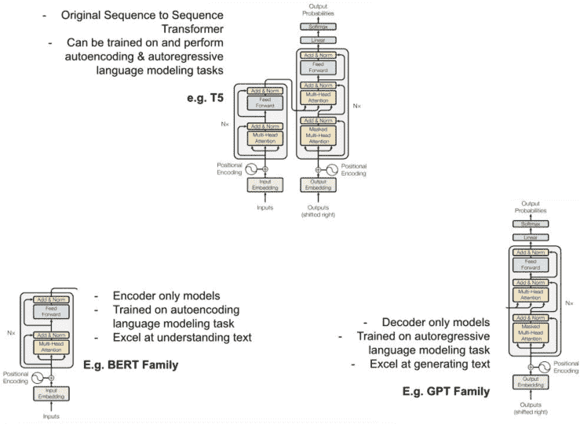

**图 1.4** *基于它们从原始 Transformer 架构中派生出来的方式，对大型语言模型关键特性的分解。*

图 1.4 展示了基于这三个类别的大型语言模型关键特性的分解。

##### 需要更多上下文

无论 LLM 是如何构建的，以及它使用了 Transformer 的哪些部分，它们都关注上下文（图 1.5）。目标是理解每个标记与输入文本中其他标记的关系。从 2013 年 Word2vec 的流行开始，NLP 实践者和研究人员一直好奇于如何将语义意义（基本上是单词定义）和上下文（与周围标记）结合起来，以创建尽可能有意义的标记嵌入。Transformer 依赖于注意力计算来实现这一结合。


**图 1.5** *大型语言模型（LLMs）擅长理解上下文。单词“Python”根据上下文可以有不同的含义。我们可能是在谈论一条蛇，或者是一种非常酷的编程语言。*

选择你想要的 Transformer 衍生版本还不够。仅仅选择编码器并不意味着你的 Transformer 在理解文本方面有魔法般的能力。让我们看看这些 LLMs 实际上是如何学习阅读和写作的。

#### LLMs 的工作原理

一个 LLM 是如何进行预训练和微调的，这决定了模型的表现从一般到最先进和高度准确之间的差异。我们需要快速了解一下 LLMs 是如何进行预训练的，以便了解它们擅长什么，不擅长什么，以及我们是否需要用我们自己的定制数据来更新它们。

##### 预训练

市场上每个 LLM 都已经在大量的文本数据语料库和特定的语言建模相关任务上进行了**预训练**。在预训练期间，LLM 试图学习和理解通用语言和词语之间的关系。每个 LLM 都在不同的语料库和不同的任务上进行了训练。

例如，BERT 最初是在两个公开可用的文本语料库上预训练的（图 1.6）：

 **English Wikipedia** - 来自维基百科英文版的文章集合，一个免费在线百科全书。它包含各种主题和写作风格，使其成为英语语言文本的多样化和代表性样本

• 当时 2.5 亿个单词。

 **BookCorpus** - 一个包含大量小说和非小说书籍的大型集合。它通过从网络抓取书籍文本创建而成，包括从浪漫和悬疑到科幻和历史等多种类型的书籍。语料库中的书籍被选择为至少 2000 个单词，并且由身份验证过的作者用英语撰写

• 8 亿个单词。

并且在两个特定的语言建模特定任务上进行了预训练（图 1.7）：

 掩码语言建模（MLM）任务（也称为自动编码任务）——这有助于 BERT 识别单个句子内的标记交互。

 下一个句子预测任务——这有助于 BERT 理解句子之间标记的交互。

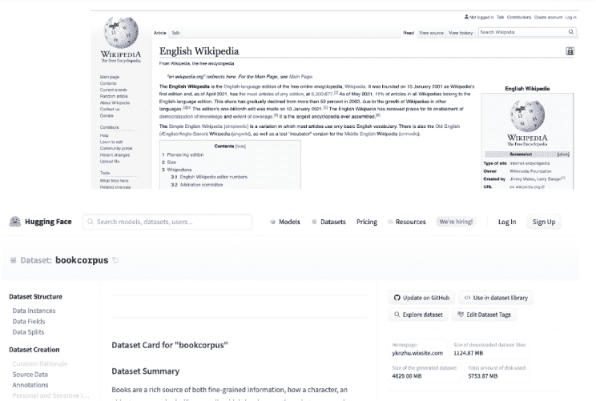

**图 1.6** *BERT 最初是在英语维基百科和 BookCorpus 上预训练的。更现代的 LLM 在数千倍更大的数据集上进行训练。*

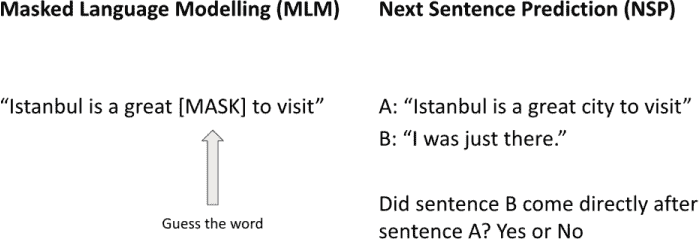

**图 1.7** *BERT 在两个任务上进行了预训练：自动编码语言建模任务（称为“掩码语言建模”任务），以教授它单个词嵌入；以及“下一句预测”任务，以帮助它学习嵌入整个文本序列。*

在这些语料库上的预训练使 BERT（主要通过自注意力机制）学习到丰富的语言特征和上下文关系。使用如此庞大、多样化的语料库已成为 NLP 研究中的常见做法，因为它已被证明可以提高模型在下游任务上的性能。

**注意**

LLM 的预训练过程可能会随着时间的推移而演变，因为研究人员发现更好的训练 LLM 的方法，并淘汰那些帮助不大的方法。例如，在原始 Google BERT 发布一年后，该模型使用了下一句预测（NSP）预训练任务，Facebook AI 的一个 BERT 变种 RoBERTa（是的，这些 LLM 的名字大多数都很有趣）被证明不需要 NSP 任务，甚至在多个领域上超过了原始 BERT 模型的表现。

根据你决定使用哪个 LLM，它可能与其他 LLM 的预训练方式不同。这就是 LLM 之间不同的地方。一些 LLM 在专有数据源上进行训练，包括 OpenAI 的 GPT 系列模型，以便为其母公司提供竞争优势。

在本书中，我们不会经常回顾预训练的概念，因为它并不是“快速入门指南”中的“快速”部分，但了解这些模型是如何进行预训练的仍然很有价值，因为正是由于这种预训练，我们才能应用迁移学习，以实现我们想要的最新技术水平，这是一个很大的进步！

##### 迁移学习

迁移学习是机器学习中的一种技术，用于利用从一个任务中获得的知识来提高另一个相关任务的表现。对于大型语言模型（LLM）的迁移学习涉及从一个文本数据集上预训练的 LLM 中提取知识，然后通过使用特定任务的数据更新模型参数，对特定“下游”任务（如文本分类或文本生成）进行微调。

转移学习的理念在于，预训练模型已经学习到了大量关于语言和词语之间关系的信息，这些信息可以用作新任务性能提升的起点。转移学习允许 LLMs 在比从头开始训练所需的特定任务数据量小得多的情况下进行微调。这大大减少了训练 LLMs 所需的时间和资源。图 1.8 提供了这种关系的视觉表示。

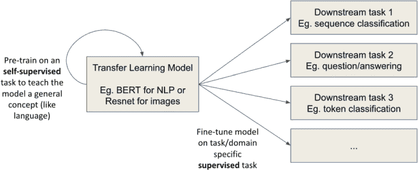

**图 1.8** *一般的转移学习循环涉及在某个通用数据集上对某个通用自监督任务进行模型预训练，然后在该特定任务数据集上微调模型*。

##### 微调

一旦 LLM 完成了预训练，它就可以针对特定任务进行微调。微调涉及在较小的、特定于任务的数据集上训练 LLM，以调整其参数以适应手头的特定任务。这允许 LLM 利用其预训练的语言知识来提高其在特定任务上的准确性。微调已被证明可以显著提高特定领域和特定任务的性能，并使 LLMs 能够快速适应广泛的 NLP 应用。

图 1.9 展示了我们在后续章节中使用的模型的基本微调循环。无论是开源还是闭源，循环基本上是相同的：

1. 我们定义了我们想要微调的模型以及任何微调参数（例如，学习率）

2. 我们将聚合一些训练数据（格式和其他特征取决于我们正在更新的模型）

3. 我们计算损失（误差的度量）和梯度（关于如何改变模型以最小化误差的信息）

4. 我们通过反向传播更新模型——这是一种更新模型参数以最小化误差的机制

如果有些内容您不太理解，不用担心：我们将依赖 Hugging Face 的 Transformers 包（图 1.9）和 OpenAI 的微调 API 预先构建的工具，以抽象出很多这样的内容，这样我们就可以真正专注于我们的数据和模型。

**注意**

您不需要 Hugging Face 账户或密钥来跟随并使用任何这些代码，除非是那些我特别指出需要的高级练习。

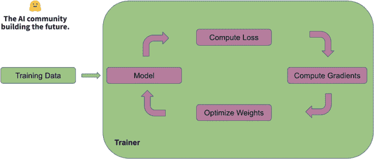

**图 1.9** *Hugging Face 的 Transformers 包提供了一个整洁且清晰的界面，用于训练和微调 LLMs*。

##### 注意

引入 Transformer 的原始论文的名称被称为“Attention is all you need”。**Attention**是一种在深度学习模型（不仅仅是 Transformer）中使用的机制，它为输入的不同部分分配不同的权重，使模型能够在执行翻译或摘要等任务时优先考虑和强调最重要的信息。本质上，attention 允许模型动态地“关注”输入的不同部分，从而提高性能和结果准确性。在 attention 普及之前，大多数神经网络平等处理所有输入，模型依赖于输入的固定表示来做出预测。依赖于 attention 的现代 LLMs 可以动态地关注输入序列的不同部分，使它们在做出预测时能够权衡每个部分的重要性。

总结一下，LLMs 在大语料库上进行预训练，有时在较小的数据集上进行微调以完成特定任务。回想一下，Transformer 作为语言模型有效性的一个因素是它高度可并行化，这允许更快地训练和高效地处理文本。真正使 Transformer 与其他深度学习架构区分开来的是它使用 attention 捕获标记之间的长距离依赖关系和关系的能力。换句话说，attention 是 Transformer-based LLMs 的关键组件，它使它们能够在训练循环和任务（即迁移学习）之间有效地保留信息，同时能够轻松处理大量文本。

Attention 被认为是最有助于 LLMs 学习（或至少识别）内部世界模型和人类可识别规则的因素。2019 年的一项斯坦福大学研究表明，BERT 中的某些 attention 计算与语言学的句法和语法规则概念相对应。例如，他们注意到 BERT 能够以惊人的高精度从其预训练中识别动词的直接宾语、名词的限定词和介词的宾语。这些关系在图 1.10 中进行了视觉呈现。

有研究探讨了 LLMs 通过预训练和微调能够学习哪些其他类型的“规则”。一个例子是由哈佛大学研究人员领导的一系列实验，他们探索了 LLM 学习一组规则的能力，这些规则用于合成任务，如黑白棋游戏(图 1.11)。他们发现证据表明，LLM 仅通过在历史移动数据上训练就能理解游戏规则。

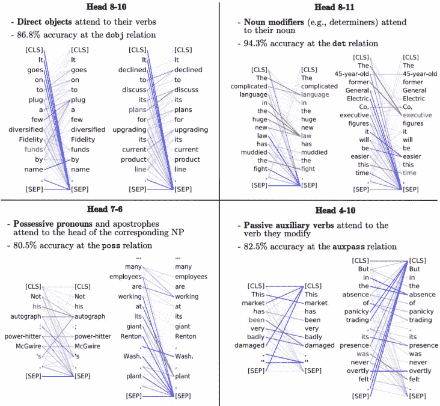

**图 1.10** 研究已经深入探究 LLMs，发现它们似乎在从未明确告知这些规则的情况下也能识别语法规则。

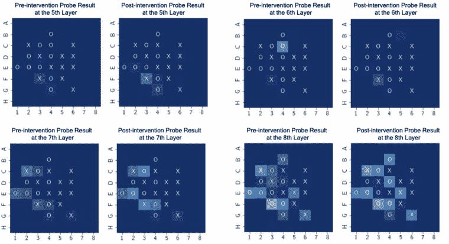

**图 1.11** *LLM 可能能够学习关于世界的各种知识，无论是游戏的规则和策略还是人类语言的规则。*

然而，对于任何 LLM 要学习任何类型的规则，它必须将我们感知为文本的内容转换为机器可读的形式。这是通过一个称为嵌入的过程来完成的。

##### 嵌入

嵌入（Embeddings）是单词、短语或标记在大维度空间中的数学表示。在 NLP（自然语言处理）中，嵌入用于以捕捉其语义意义和与其他单词之间关系的方式表示单词、短语或标记。存在几种嵌入类型，包括位置嵌入，它编码了标记在句子中的位置，以及标记嵌入，它编码了标记的语义意义（图 1.12）。

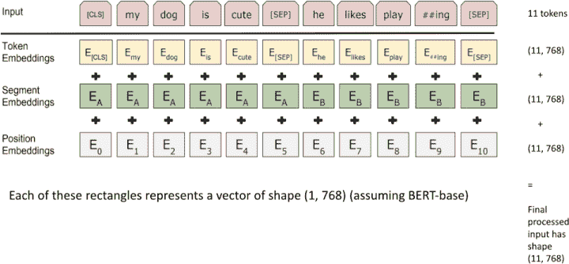

**图 1.12** *BERT 如何使用三层嵌入处理给定文本的一个示例。一旦文本被分词，每个标记都会被赋予一个嵌入，然后这些值相加，因此每个标记在计算任何注意力之前都会有一个初始嵌入。除非它们服务于更实际的目的，否则本文不会过多关注 LLM 嵌入的各个单独层，但了解这些部分及其内部结构是很有帮助的！*

LLM 根据其预训练学习不同标记的嵌入，并在微调期间进一步更新这些嵌入。

##### 分词

如前所述，分词（Tokenization）涉及将文本分解成理解的最小单元——标记（tokens）。这些标记是嵌入到语义意义中的信息片段，它们作为注意力计算的输入，进而导致……好吧，LLM（大型语言模型）实际上学习和工作。标记构成了 LLM 的静态词汇表，并不总是代表完整的单词。标记可以代表标点符号、单个字符，甚至在 LLM 不知道某个单词的情况下，甚至可以代表子词。几乎所有 LLM 都有*特殊标记*，这些标记对模型具有特定的意义。例如，BERT 模型有几个特殊标记，包括**[CLS]**标记，BERT 会自动将其注入每个输入的第一个标记，并旨在代表整个输入序列的编码语义意义。

读者可能熟悉诸如停用词去除、词干提取和截断等技术，这些技术在传统 NLP 中得到了应用。这些技术在 LLM 中既不被使用，也不是必需的。LLM 被设计来处理人类语言的固有复杂性和可变性，包括像“the”和“an”这样的停用词的使用以及词形变化，如时态和拼写错误。使用这些技术修改 LLM 的输入文本可能会通过减少上下文信息和改变文本的原始意义来损害模型的性能。

分词也可能涉及几个预处理步骤，如 **casing**，它指的是标记的资本化。有两种类型的 casing：uncased 和 cased。在 uncased 分词中，所有标记都被转换为小写，并且通常去除字母的重音符号，而在 cased 分词中，标记的资本化被保留。casing 的选择可能会影响模型的表现，因为资本化可以提供关于标记意义的 重要信息。一个例子可以在图 1.13 中找到。

**注意**

值得注意的是，即使是 casing 的概念也因模型而异，存在一些偏见。将文本转换为 uncased（小写并去除重音符号）是一种相当西方化的预处理步骤。我自己会说土耳其语，我知道重音符号（例如我姓氏中的 Ö）很重要，实际上可以帮助 LLM 理解所说话的单词。任何没有在多样化语料库上充分训练的语言模型可能都会在解析和利用这些上下文片段时遇到困难。

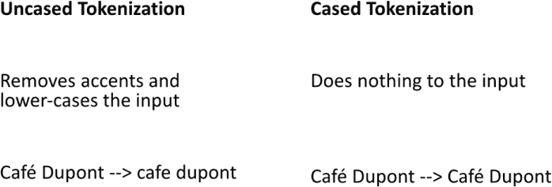

**图 1.13** *是否选择 uncased 或 cased 分词取决于任务。像文本分类这样的简单任务通常更喜欢 uncased 分词，而像命名实体识别这样的任务，由于需要考虑大小写来获取意义，则更喜欢 cased 分词。*

图 1.14 展示了分词的一个例子，特别是 LLM 处理 Out of Vocabulary (OOV) 短语的一个例子。OOV 短语是 LLM 不识别为标记的短语/单词，并必须将其拆分为更小的子词。例如，我的名字（Sinan）在大多数 LLM 中不是一个标记（我的生活故事），所以在 BERT 中，分词方案会将我的名字拆分为两个标记（假设 uncased 分词）：

 sin - 我名字的第一部分

 ##an - 一个特殊的子词标记，与单词“an”不同，仅用作拆分未知单词的手段

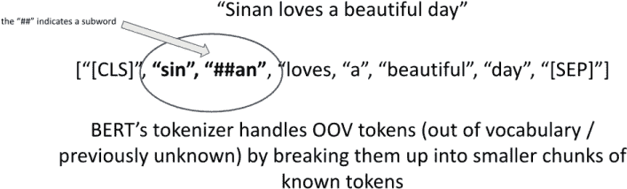

**图 1.14** *任何 LLM 都必须处理他们从未见过的单词。如果我们关心 LLM 的标记限制，LLM 如何分词可能会很重要。*

一些 LLM 限制了我们可以一次性输入的标记数量，因此如果我们试图注意这个限制，LLM 如何分词可能会很重要。

到目前为止，我们已经讨论了很多关于语言建模的内容——预测短语中缺失/下一个标记，但现代 LLM 也可以从其他 AI 领域借鉴，使它们的模型更高效，更重要的是更 **对齐**——这意味着 AI 的表现符合人类的期望。换句话说，一个对齐的 LLM 有一个与人类目标相匹配的目标。

##### 超越语言建模——对齐 + RLHF

在语言模型中，**对齐**指的是模型对输入提示与用户期望匹配的程度。标准语言模型根据先前的上下文预测下一个单词，但这可能会限制它们在特定指令或提示方面的有用性。研究人员正在寻找可扩展且性能良好的方法来将语言模型与用户的意图对齐。对齐语言模型的一种广泛方法是将其强化学习 (RL) 纳入训练循环。

**基于人类反馈的强化学习** (RLHF) 是一种流行的对预训练 LLM 进行对齐的方法，它使用人类反馈来提高其性能。它允许 LLM 从相对较小、高质量的少量人类反馈中学习其输出的反馈，从而克服了传统监督学习的一些局限性。RLHF 在 ChatGPT 等现代 LLM 中显示出显著的改进。RLHF 是通过强化学习 (RL) 接近对齐的一个例子，但还有其他新兴的方法，如基于 AI 反馈的强化学习（例如宪法 AI）。

让我们来看看本书中将使用的一些流行 LLM。

### 流行现代 LLMs

BERT、T5 和 GPT 分别是由 Google、Google 和 OpenAI 分别开发的三个流行的 LLM。尽管它们都共享 Transformer 作为共同祖先，但它们的架构差异很大。Transformer 家族中其他广泛使用的 LLM 变体包括 RoBERTa、BART（我们之前看到它执行了一些文本分类）和 ELECTRA。

#### BERT

BERT (图 1.15) 是一个自动编码模型，它使用注意力机制构建句子的双向表示，这使得它非常适合句子分类和标记分类任务。

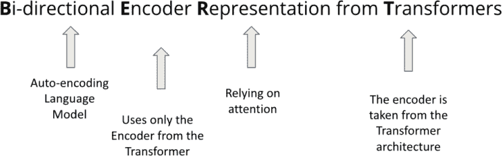

**图 1.15** *BERT 是最早的 LLM 之一，并且继续在涉及快速处理大量文本的许多 NLP 任务中保持流行.*

BERT 使用了 Transformer 的编码器并忽略了解码器，因此在处理/理解大量文本方面非常出色，相对于其他专注于逐个生成文本的较慢的 LLMs 来说，它能够非常快速地完成这些任务。因此，BERT 衍生的架构在不需要编写自由文本的情况下，最适合快速处理和分析大型语料库。

BERT 本身不用于对文本进行分类或总结文档，但它经常被用作下游 NLP 任务的预训练模型。BERT 已经成为 NLP 社区中广泛使用且备受推崇的 LLM，为更高级语言模型的发展铺平了道路。

#### GPT-3 和 ChatGPT

另一方面，GPT (图 1.16) 是一个自回归模型，它使用注意力机制根据前一个序列中的标记来预测下一个标记。GPT 算法系列（包括 ChatGPT 和 GPT-3）主要用于文本生成，并且以其能够生成自然、类似人类文本的能力而闻名。

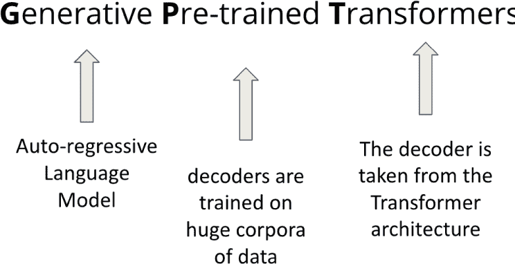

**图 1.16** GPT 系列模型在生成与用户意图一致的自由文本方面表现出色。

GPT 依赖于 Transformer 的解码器部分，忽略了编码器，从而在逐个生成文本方面表现出色。基于 GPT 的模型在给定相当大的上下文窗口的情况下生成文本最佳。它们也可以用于处理/理解文本，正如我们将在下一章中看到的。GPT 派生的架构非常适合需要能够自由编写文本的应用。

#### T5

T5 是一个纯编码器/解码器 Transformer 模型，旨在直接执行多种 NLP 任务，从文本分类到文本摘要和生成。实际上，它是最早能够吹嘘这种成就的流行模型之一。在 T5 之前，像 BERT 和 GPT-2 这样的 LLM 通常需要使用标记数据进行微调，才能被依赖来执行这样的特定任务。

T5 同时使用 Transformer 的编码器和解码器，在处理和生成文本方面都变得非常灵活。基于 T5 的模型可以执行广泛的 NLP 任务，从文本分类到文本生成，这得益于它们能够使用编码器构建输入文本的表示，并使用解码器生成文本(图 1.17)。T5 派生的架构非常适合需要既能处理和理解文本，又能自由生成文本的应用。

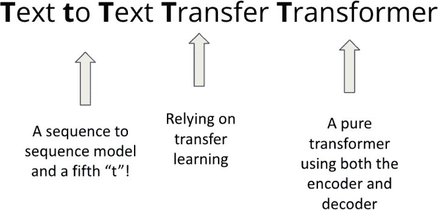

**图 1.17** T5 是第一个在没有微调的情况下同时解决多项任务的 LLM 之一。

T5 无需微调即可执行多项任务的能力，催生了其他多才多艺的 LLM 的开发，这些 LLM 可以以高效和准确的方式执行多项任务，而几乎不需要/不需要微调。与 T5 同时发布的 GPT-3 也声称具有这种能力。

这三个 LLM 非常灵活，被用于各种 NLP 任务，如文本分类、文本生成、机器翻译和情感分析等。这三个 LLM 以及它们的变体将是本书和我们的应用的主要焦点。

### 特定领域 LLM

特定领域 LLM 是在特定学科领域专门训练的 LLM，例如生物学或金融。与通用 LLM 不同，这些模型旨在理解它们所训练的领域中的特定语言和概念。

一个特定领域 LLM 的例子是 BioGPT (图 1.18)；这是一个在大规模生物医学文献上预训练的特定领域 LLM。该模型由 AI 医疗公司 Owkin 与 Hugging Face 合作开发。该模型在超过 200 万篇生物医学研究文章的数据集上进行了训练，使其在广泛的生物医学 NLP 任务中非常有效，例如命名实体识别、关系抽取和问答。


**图 1.18** *BioGPT 是一个在大规模生物医学文献上预训练的特定领域 Transformer 模型。BioGPT 在生物医学领域的成功激发了其他特定领域的 LLM，如 SciBERT 和 BlueBERT。*

BioGPT，其预训练将生物医学知识和特定领域的术语编码到 LLM 中，可以在较小的数据集上进行微调，使其适用于特定的生物医学任务，并减少对大量标记数据的需要。

使用特定领域 LLM 的优势在于它们在特定文本集上的训练。这使得它们能够更好地理解其特定领域内使用的语言和概念，从而提高了该领域内 NLP 任务的准确性和流畅性。相比之下，通用 LLM 可能难以有效地处理特定领域使用的语言和概念。

### LLM 的应用

正如我们之前看到的，LLM 的应用范围很广，研究人员至今仍在寻找 LLM 的新颖应用。在这本书中，我们将以三种方式使用 LLM：

 利用预训练的 LLM 处理和生成文本的能力（无需进一步微调）作为更大架构的一部分。

 例如，使用预训练的 BERT/GPT 创建信息检索系统。

 使用迁移学习将预训练的 LLM 微调以执行非常具体的任务。

 例如，微调 T5 以创建特定领域/行业的文档摘要。

 要求预训练的 LLM 解决其预训练的任务或可以合理推断的任务。

 例如，提示 GPT3 撰写博客文章。

 例如，提示 T5 执行语言翻译。

这些方法以不同的方式使用 LLM，尽管所有选项都利用了 LLM 的预训练，但只有选项 2 需要任何微调。让我们看看 LLM 的一些具体应用。

#### 经典自然语言处理任务

大多数 LLM 的应用都在非常常见的 NLP 任务（如分类和翻译）中提供最先进的结果。这并不是说在 Transformers 和 LLM 出现之前我们没有解决这些任务，只是现在开发者和从业者可以用相对较少的标记数据（由于 Transformer 在大型语料库上的高效预训练）以及更高的准确性来解决这些问题。

##### 文本分类

文本分类任务为给定的文本分配一个标签。这项任务在情感分析中常用，其目标是将文本分类为正面、负面或中性，或在主题分类中，其目标是将文本分类到预定义的一个或多个类别中。像 BERT 这样的模型可以通过少量标记数据进行微调以执行分类，如图 1.19 所示。

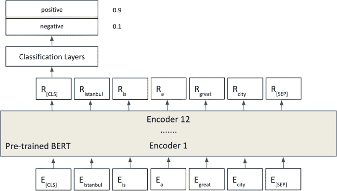

**图 1.19** *一瞥使用 BERT 实现快速准确文本分类结果的架构。分类层通常作用于 BERT 用于编码整个输入序列语义意义的特殊 [CLS] 标记。*

文本分类仍然是全球最公认且可解决的 NLP 任务之一，因为归根结底，有时我们只需要知道这封电子邮件是否是“垃圾邮件”以及继续我们的日常生活！

##### 翻译任务

一个更难但仍然是经典的 NLP 任务是机器翻译，其目标是自动将文本从一种语言翻译成另一种语言，同时保留意义和上下文。传统上，这项任务相当困难，因为它需要足够两种语言的示例和领域知识，以便准确评估模型的表现，但现代 LLMs 由于其预训练和高效的注意力计算，似乎在这个任务上更容易一些。

##### 人类语言 <> 人类语言

注意力机制在 Transformers 之前就已经被用于机器翻译任务，其中 AI 模型被期望将一种人类语言翻译成另一种语言。T5 是最早宣称能够直接执行多项任务的 LLM 之一（图 1.20）。其中一项任务是将英语翻译成几种语言并返回。

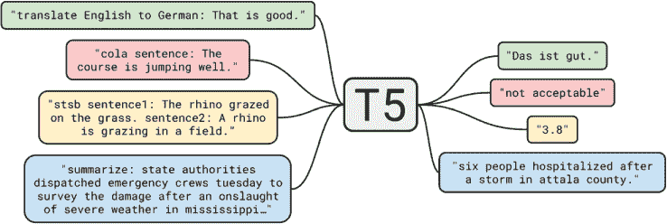

**图 1.20** *T5 可以直接执行许多 NLP 任务，包括语法纠错、摘要和翻译。*

自从 T5 以来，LLMs 中的语言翻译已经变得更好、更多样化。像 GPT-3 和最新的 T5 模型这样的模型可以相对容易地在几十种语言之间进行翻译。当然，这也触及了 LLMs 的一大已知限制，即它们大多数是从英语使用/通常是美国的角度进行训练的，因此大多数 LLMs 在处理英语方面表现良好，而在非英语语言方面，表现则不那么好。

##### SQL 生成

如果我们将 SQL 视为一个语言，那么将英语转换为 SQL 与将英语转换为法语（图 1.21）并没有太大的区别。现代 LLMs 已经能够在基本水平上直接做到这一点，但更高级的 SQL 查询通常需要一些微调。

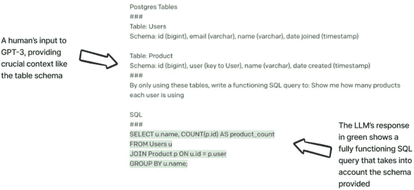

**图 1.21** *使用 GPT-3 从（尽管简单）Postgres 架构生成可用的 SQL 代码*

如果我们扩展对“翻译”的思考，那么前方将出现许多新的机遇。例如，如果我们想要在英语和大脑可能解释并执行为运动功能的一系列波长之间进行“翻译”怎么办。我不是神经科学家或任何东西，但这似乎是一个迷人的研究领域！

#### 自由文本生成

在现代 LLM 如 ChatGPT 方面，首先引起世界关注的是它们自由撰写博客、电子邮件甚至学术论文的能力。这种文本生成的概念是许多 LLM 被亲切地称为“生成式 AI”的原因，尽管这个术语有点过于简化且不够精确。我不会经常使用“生成式 AI”这个术语，因为“生成”这个具体词汇在机器学习中有自己的含义，它是与“判别”模型类似的学习方式。更多关于这一点，请参阅我的第一本书：《数据科学原理》）

例如，我们可以提示（询问）ChatGPT 帮助规划一篇博客文章，就像图 1.22 中所示。即使你不认同结果，这也可以帮助人类解决“白板”问题，并给我们至少编辑和开始的地方，而不是长时间盯着空白页。


**图 1.22** *ChatGPT 可以帮助构思、构建框架，甚至撰写完整的博客文章*

**注意**

如果我不提到像这种 LLM 可能引起的学术界的争议，那将是一个疏忽。仅仅因为一个 LLM 可以写出完整的博客或甚至论文，并不意味着我们应该让它们这样做。就像互联网导致一些人相信我们再也不需要书籍一样，有些人认为 ChatGPT 意味着我们再也不需要写任何东西了。只要机构了解如何使用这项技术，并且制定了适当的法规/规则，学生和教师就可以安全、道德地使用 ChatGPT 和其他以文本生成为重点的 AI。

我们将在本书中使用 ChatGPT 来解决几个任务。我们将依赖 ChatGPT 在其上下文窗口中情境化信息的能力，并自由地（通常）写出准确的回应。我们将主要通过 Playground 和 OpenAI 提供的 API 与 ChatGPT 交互，因为这个模型不是开源的。

#### 信息检索/神经语义搜索

LLMs 通过预训练和微调将信息直接编码到它们的参数中，但保持它们与新的信息同步是困难的。我们要么需要在新的数据上进一步微调模型，要么从头开始再次运行预训练步骤。为了动态地保持信息的新鲜度，我们将构建自己的信息检索系统，使用向量数据库（不用担心，我们将在下一章中详细介绍所有这些）。图 1.23 展示了我们将构建的架构概要。

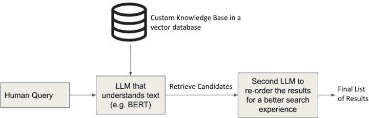

**图 1.23** *我们的神经语义搜索系统将能够动态地接收新信息，并且能够使用 LLMs 根据用户的查询快速准确地检索相关文档。*

接下来，我们将通过构建基于 ChatGPT 的聊天机器人来扩展这个系统，以便能够以对话方式回答用户的提问。

#### 聊天机器人

每个人都喜欢一个优秀的聊天机器人，对吧？好吧，无论你喜欢还是讨厌它们，通过 ChatGPT 和 GPT-3（如图 1.24 所示）这样的系统，LLMs 进行对话的能力是显而易见的。我们使用 LLMs 构建聊天机器人的方式将与传统通过意图、实体和基于树的对话流程设计聊天机器人的方式有很大不同。这些概念将被系统提示、上下文和角色所取代——所有这些内容我们将在接下来的章节中深入探讨。

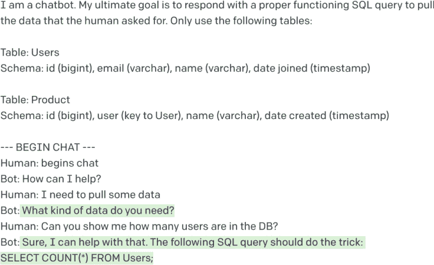

**图 1.24** *ChatGPT 并不是唯一能够进行对话的 LLM。我们可以使用 GPT-3 构建一个简单的对话聊天机器人。绿色高亮的文本代表 GPT-3 的输出。请注意，在聊天开始之前，我向 GPT-3 注入了上下文，这些上下文不会显示给最终用户，但 GPT-3 需要提供准确的回答。*

我们已经做好了准备。我很高兴能与你一起踏上这段旅程，我也很期待开始！

### 摘要

LLMs 是先进的 AI 模型，它们彻底改变了自然语言处理（NLP）领域。LLMs 非常灵活，被用于各种 NLP 任务，包括文本分类、文本生成和机器翻译。它们在大型文本数据语料库上进行了预训练，然后可以针对特定任务进行微调。

以这种方式使用 LLMs 已成为 NLP 模型开发的标准步骤。在我们的第一个案例研究中，我们将探讨使用 GPT-3 和 ChatGPT 等专有模型发布应用程序的过程。我们将亲身体验使用 LLMs 进行实际 NLP 任务的各个方面，从模型选择和微调到部署和维护。
