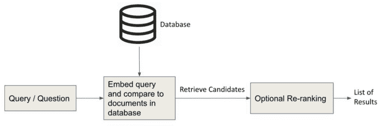
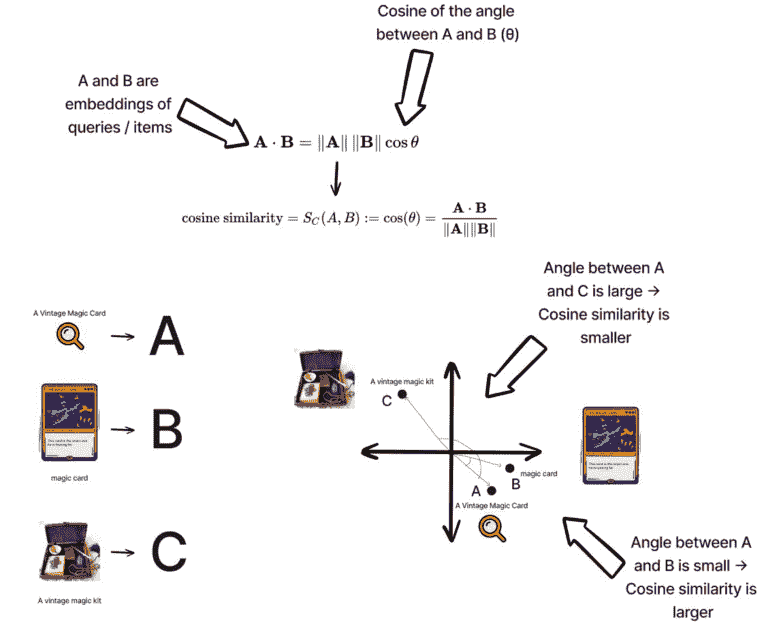
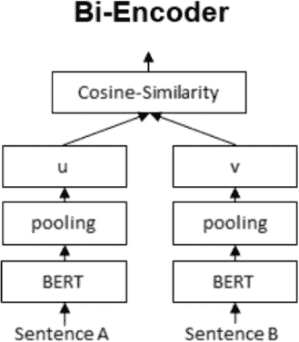
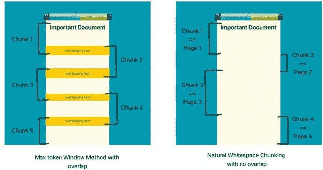
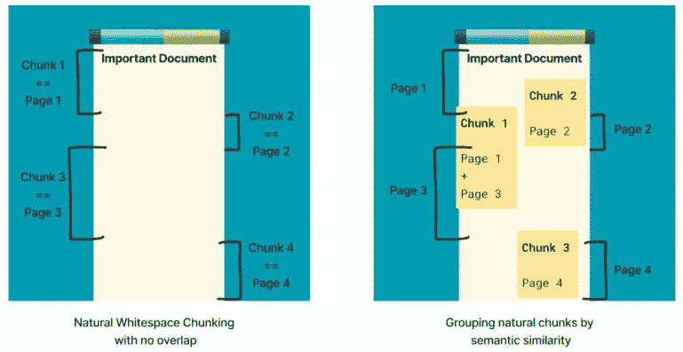
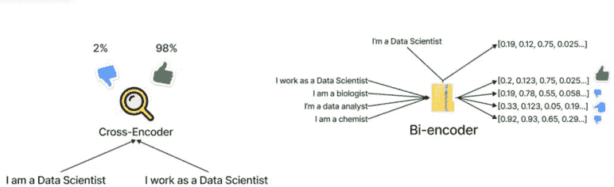
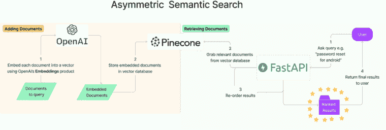
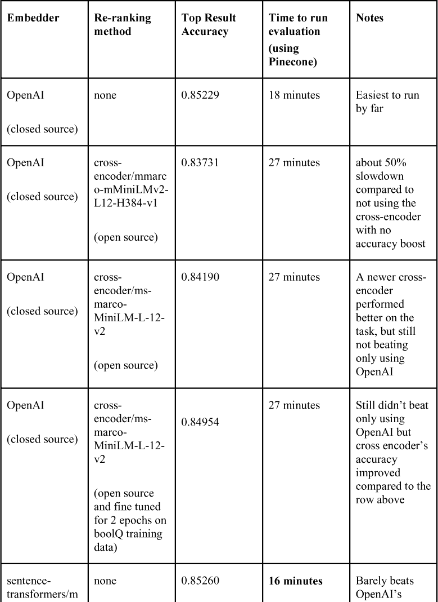
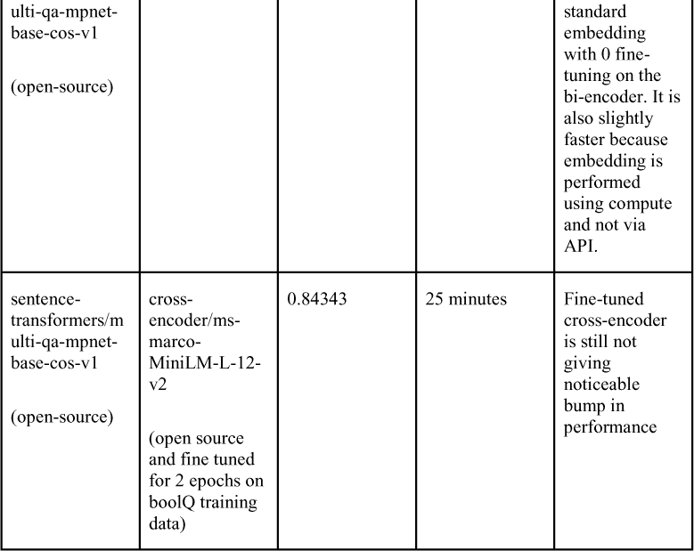

## 第二章：使用 LLM 的语义搜索

### 简介

在上一章中，我们探讨了语言模型的内部工作原理以及现代 LLM 对 NLP 任务如文本分类、生成和机器翻译的影响。近年来，LLM 的另一个强大应用正在获得关注：语义搜索。

现在你可能认为，是时候最终学习与 ChatGPT 和 GPT-4 的最佳沟通方式以获得最佳结果了，我保证我们将在下一章开始这样做。与此同时，我想向你展示我们还可以在这个新颖的 Transformer 架构之上构建什么。虽然像 GPT 这样的文本到文本生成模型本身非常令人印象深刻，但 AI 公司提供的最灵活的解决方案之一是能够基于强大的 LLM 生成文本嵌入。

文本嵌入是一种将单词或短语表示为高维空间中的向量，基于它们在文本数据语料库中的上下文意义。其理念是，如果两个短语相似（我们将在本章后面更详细地探讨这个单词），那么代表这些短语的向量应该彼此靠近，反之亦然。图 2.1 展示了简单搜索算法的一个示例。当用户搜索要购买的商品时——比如说一张魔法集换卡，他们可能会简单地搜索“一张复古魔法卡”。系统应该将查询嵌入，使得如果两个彼此靠近的文本嵌入，应该表明用于生成它们的短语是相似的。


**图 2.1** 表示相似短语的向量应该彼此靠近，而表示不相似短语的向量应该彼此远离。在这种情况下，如果用户想要一张交易卡，他们可能会要求“一张复古魔法卡”。一个合适的语义搜索系统应该将查询嵌入，使其最终靠近相关结果（如“魔法卡”），远离非相关项目（如“一张复古魔法套件”），即使它们共享某些关键词。

这种从文本到向量的映射可以被视为一种具有意义的哈希。我们实际上无法将向量反转回文本，而是它们是文本的表示，具有在编码状态下比较点的附加优势。

LLM 赋能的文本嵌入使我们能够捕捉到单词和短语语义价值，而不仅仅是它们表面层面的句法或拼写。我们可以依赖 LLM 的预训练和微调来构建在它们之上几乎无限的应用程序，通过利用关于语言使用的丰富信息来源。

本章介绍了使用 LLM 探索语义搜索世界的知识，了解它们如何被用来创建强大的信息检索和分析工具。在下一章中，我们将构建一个基于 GPT-4 的聊天机器人，该聊天机器人利用我们在本章中构建的完整语义搜索系统。

不再拖延，让我们直接进入正题，好吗？

### 任务

一个传统的搜索引擎通常会接收你输入的内容，然后给你一串包含那些单词或你输入字符排列的网站或项目链接。所以如果你在市场上输入“复古万智牌卡牌”，你会得到标题/描述中包含这些单词组合的项目。这是一种相当标准的搜索方式，但并不总是最好的方式。例如，我可能会得到一些复古魔法集来帮助我学习如何从帽子里变出兔子。很有趣，但不是我想要的。

你输入搜索引擎的术语可能并不总是与你想看到的物品中使用的**确切**词语一致。可能是查询中的词语过于笼统，导致一系列无关的发现。这个问题通常不仅限于结果中不同的词语；相同的词语可能具有与搜索内容不同的含义。这就是语义搜索发挥作用的地方，正如前面提到的万智牌卡牌场景所展示的。

#### 非对称语义搜索

一个**语义搜索**系统可以理解你的搜索查询的意义和上下文，并将其与可检索文档的意义和上下文相匹配。这种系统可以在数据库中找到相关结果，而无需依赖于精确的关键词或 n-gram 匹配，而是依赖于预训练的 LLM 来理解查询和文档的细微差别（图 2.2）。


**图 2.2** *传统的基于关键词的搜索可能会将复古魔法套件与我们所想要的物品的权重相同，而语义搜索系统可以理解我们实际搜索的概念*

非对称语义搜索中的**非对称**部分指的是输入查询的语义信息（基本上是大小）与搜索系统必须检索的文档/信息之间通常存在不平衡。例如，搜索系统正在尝试将“万智牌卡”与市场上项目描述的段落相匹配。四个单词的搜索查询比段落包含的信息少得多，但无论如何，这是我们比较的内容。

非对称语义搜索系统可以非常精确和相关性地检索搜索结果，即使你搜索时没有使用完全正确的词语。它们依赖于 LLM 的学习，而不是用户能够确切知道在稻草堆中搜索哪根针。

当然，我对传统方法进行了极大的简化。有许多方法可以使它们更高效，而无需切换到更复杂的 LLM 方法，纯语义搜索系统并不总是答案。它们不仅仅是“更好的搜索方式”。语义算法有其自身的缺陷，例如：

 它们可能对文本中的微小变化过于敏感，例如大小写或标点符号的差异。

 它们难以处理细微的概念，如讽刺或讽刺，这些概念依赖于局部的文化知识。

 它们可能比传统方法更昂贵，在实现和维护方面，尤其是在启动包含许多开源组件的自建系统时。

语义搜索系统在某些情境下可以成为一个有价值的工具，所以让我们直接进入如何构建我们的解决方案。

### 解决方案概述

我们非对称语义搜索系统的一般流程将遵循以下步骤：

 第一部分 - 摄入文档（图 2.3）

1. 收集文档以进行嵌入

2. 创建文本嵌入以编码语义信息

3. 将嵌入存储在数据库中，以便在查询时检索


**图 2.3** *聚焦于第一部分，存储文档将包括对我们文档进行一些预处理，嵌入它们，然后将它们存储在某个数据库中*

 第二部分 - 检索文档（图 2.4）

1. 用户有一个查询，可能需要预处理和清理

2. 检索候选文档

3. 如有必要，重新排序候选文档

4. 返回最终搜索结果



**图 2.4** *聚焦于第二部分，在检索文档时，我们将使用与文档相同的嵌入方案嵌入我们的查询，然后与先前存储的文档进行比较，并返回最佳（最接近）的文档*

### 组件

让我们更详细地了解我们的每个组件，以了解我们做出的选择以及我们需要考虑的因素。

#### 文本嵌入器

正如我们所知，任何语义搜索系统的核心是文本嵌入器。这是将文本文档、单个单词或短语作为输入，并将其转换为向量的组件。这个向量是唯一的，应该捕捉到短语的语言环境意义。

文本嵌入器的选择至关重要，因为它决定了文本向量表示的质量。我们在使用 LLMs 进行向量化的方式上有很多选择，既有开源也有闭源。为了更快地上手，我们将使用 OpenAI 的闭源“嵌入”产品。在后面的章节中，我会介绍一些开源选项。

OpenAI 的“嵌入”是一个强大的工具，可以快速提供高质量的向量，但它是一个封闭源产品，这意味着我们对其实施和潜在偏差的控制有限。重要的是要记住，在使用封闭源产品时，我们可能无法访问底层算法，这可能会使解决可能出现的任何问题变得困难。

##### 什么使文本片段“相似”

一旦我们将文本转换为向量，我们就必须找到确定文本片段是否“相似”的数学表示。余弦相似度是一种衡量两个事物相似度的方法。它查看两个向量之间的角度，并根据它们在方向上的接近程度给出分数。如果向量指向完全相同的方向，余弦相似度为 1。如果它们垂直（90 度），则为 0。如果它们指向相反方向，则为-1。向量的尺寸无关紧要，只有它们的取向才重要。

图 2.5 展示了余弦相似度如何帮助我们根据查询检索文档。



**图 2.5** *在理想的语义搜索场景中，余弦相似度（公式见顶部）为我们提供了一个计算效率高的方法来比较大量文本片段，前提是嵌入被调整以将语义相似的文本片段放置在一起（底部）。我们首先嵌入所有项目，包括查询（底部左），然后检查它们之间的角度。角度越小，余弦相似度（底部右）越大*。

我们还可以转向其他相似度度量，如点积或欧几里得距离，但 OpenAI 嵌入有一个特殊属性。它们的向量的模长（长度）被归一化到长度 1，这基本上意味着我们在数学上有两个方面的好处：

 余弦相似度等同于点积

 余弦相似度和欧几里得距离将导致相同的排名

TL;DR：拥有归一化向量（所有向量的模长均为 1）是非常好的，因为我们可以使用廉价的余弦计算来查看两个向量有多接近，因此可以通过余弦相似度来查看两个短语在语义上的接近程度。

##### OpenAI 的嵌入

从 OpenAI 获取嵌入就像几行代码（列表 2.1）那么简单。如前所述，整个系统依赖于一个嵌入机制，该机制将语义相似的项目放置在一起，以便当项目实际上相似时，余弦相似度很大。我们可以使用多种方法来创建这些嵌入，但我们将现在依赖 OpenAI 的嵌入**引擎**为我们完成这项工作。引擎是 OpenAI 提供的不同嵌入机制。我们将使用他们推荐的最新引擎，该引擎适用于大多数用例。

**列表 2.1** *从 OpenAI 获取文本嵌入*

```py
# Importing the necessary modules for the script to run
import openai
from openai.embeddings_utils import get_embeddings, get_embedding

# Setting the OpenAI API key using the value stored in the environment variable 'OPENAI_API_KEY'
openai.api_key = os.environ.get('OPENAI_API_KEY')

# Setting the engine to be used for text embedding
ENGINE = 'text-embedding-ada-002'

# Generating the vector representation of the given text using the specified engine.
embedded_text = get_embedding('I love to be vectorized', engine=ENGINE)

# Checking the length of the resulting vector to ensure it is the expected size (1536)
len(embedded_text) == '1536'
```

值得注意的是，OpenAI 提供了几个可用于文本嵌入的引擎选项。每个引擎可能提供不同级别的准确性，并且可能针对不同类型的文本数据进行优化。在撰写本文时，代码块中使用的引擎是最新的，也是他们推荐的使用的引擎。

此外，还可以一次性将多个文本块传递给“get_embeddings”函数，该函数可以在单个 API 调用中为所有这些文本生成嵌入。这比多次调用“get_embedding”为每个单独的文本更有效率。我们将在稍后看到这个示例。

##### 开源嵌入替代方案

虽然 OpenAI 和其他公司提供了强大的文本嵌入产品，但还有几个开源的文本嵌入替代方案可用。其中一个流行的是使用 BERT 的双编码器，BERT 是一种强大的基于深度学习的算法，已经在各种自然语言处理任务上显示出最先进的结果。我们可以在许多开源仓库中找到预训练的双编码器，包括**Sentence Transformers**库，该库为各种自然语言处理任务提供了现成的模型以供使用。

双编码器涉及训练两个 BERT 模型，一个用于编码输入文本，另一个用于编码输出文本（图 2.6）。这两个模型在大量文本数据集上同时训练，目标是最大化输入和输出文本对应对的相似性。生成的嵌入捕捉了输入和输出文本之间的语义关系。



**图 2.6** *双编码器以一种独特的方式训练，使用单个 LLM 的两个克隆并行训练，以学习文档之间的相似性。例如，双编码器可以学会将问题与段落关联起来，以便它们在向量空间中彼此靠近*

代码列表 2.2 是使用“sentence_transformer”包嵌入文本的示例：

**代码列表 2.2** *从预训练的开源双编码器获取文本嵌入*

```py
# Importing the SentenceTransformer library
from sentence_transformers import SentenceTransformer

# Initializing a SentenceTransformer model with the 'multi-qa-mpnet-base-cos-v1' pre-trained model
model = SentenceTransformer(
  'sentence-transformers/multi-qa-mpnet-base-cos-v1')

# Defining a list of documents to generate embeddings for
docs = [
          "Around 9 Million people live in London",
          "London is known for its financial district"
       ]

# Generate vector embeddings for the documents
doc_emb = model.encode(
    docs,                   # our documents (an iterable of strings)
    batch_size=32,          # batch the embeddings by this size
    show_progress_bar=True  # display a progress bar

)

# The shape of the embeddings is (2, 768), indicating a length of 768 and two embeddings generated
doc_emb.shape  #  == (2, 768)
```

此代码创建了一个“SentenceTransformer”类的实例，该实例使用预训练模型“multi-qa-mpnet-base-cos-v1”进行初始化。该模型旨在进行多任务学习，特别是针对问答和文本分类等任务。这个特定的模型是使用非对称数据进行预训练的，因此我们知道它可以处理短查询和长文档，并且能够很好地比较它们。我们使用“SentenceTransformer”类的“encode”函数生成文档的向量嵌入，并将生成的嵌入存储在“doc_emb”变量中。

不同的算法可能在不同的文本数据类型上表现更好，并且会有不同的向量大小。算法的选择可能会对结果嵌入的质量产生重大影响。此外，开源替代品可能需要比闭源产品更多的定制和微调，但它们也提供了对嵌入过程的更大灵活性和控制。有关使用开源双编码器嵌入文本的更多示例，请参阅本书的代码部分！

#### 文档块分割器

一旦我们设置了文本嵌入引擎，我们需要考虑嵌入大型文档的挑战。通常，将整个文档作为一个单一向量嵌入并不实用，尤其是在处理书籍或研究论文等长文档时。解决这个问题的一个方法就是使用文档块分割，这涉及将大型文档分割成更小、更易于管理的块以进行嵌入。

##### 最大标记窗口分割

文档块分割的一种方法是最大标记窗口分割。这是最容易实现的方法之一，涉及将文档分割成给定最大大小的块。所以如果我们设置标记窗口为 500，那么我们预计每个块将接近 500 个标记。让我们的块大小大致相同也将有助于使我们的系统更加一致。

这种方法的一个常见担忧是我们可能会意外地切断块之间的某些重要文本，从而分割上下文。为了减轻这种情况，我们可以设置重叠窗口，并指定重叠的标记数量，以便块之间共享标记。当然，这会引入一定的冗余，但为了更高的准确性和延迟，这通常是可接受的。

让我们通过一些示例文本（列表 2.3）来看一下重叠窗口块分割的例子。让我们首先摄入一个大型文档。比如我最近写的一本超过 400 页的书？

**列表 2.3** *摄入整本教科书*

```py
# Use the PyPDF2 library to read a PDF file
import PyPDF2

# Open the PDF file in read-binary mode
with open('../data/pds2.pdf', 'rb') as file:

    # Create a PDF reader object
    reader = PyPDF2.PdfReader(file)

    # Initialize an empty string to hold the text
    principles_of_ds = ''

    # Loop through each page in the PDF file
    for page in tqdm(reader.pages):

        # Extract the text from the page
        text = page.extract_text()

        # Find the starting point of the text we want to extract
        # In this case, we are extracting text starting from the string ' ]'
        principles_of_ds += '\n\n' + text[text.find(' ]')+2:]

# Strip any leading or trailing whitespace from the resulting string
principles_of_ds = principles_of_ds.strip()
```

现在让我们通过获取最多一定标记大小的块来分割这个文档（列表 2.4）。

**列表 2.4** *带有和不带有重叠的教科书块分割*

```py
# Function to split the text into chunks of a maximum number of tokens. Inspired by OpenAI
def overlapping_chunks(text, max_tokens = 500, overlapping_factor = 5):
    '''
    max_tokens: tokens we want per chunk
    overlapping_factor: number of sentences to start each chunk with that overlaps with the previous chunk
    '''

    # Split the text using punctuation
    sentences = re.split(r'[.?!]', text)

    # Get the number of tokens for each sentence
    n_tokens = [len(tokenizer.encode(" " + sentence)) for sentence in sentences]

    chunks, tokens_so_far, chunk = [], 0, []

    # Loop through the sentences and tokens joined together in a tuple
    for sentence, token in zip(sentences, n_tokens):

        # If the number of tokens so far plus the number of tokens in the current sentence is greater
        # than the max number of tokens, then add the chunk to the list of chunks and reset
        # the chunk and tokens so far
        if tokens_so_far + token > max_tokens:
            chunks.append(". ".join(chunk) + ".")
            if overlapping_factor > 0:
                chunk = chunk[-overlapping_factor:]
                tokens_so_far = sum([len(tokenizer.encode(c)) for c in chunk])
            else:
                chunk = []
                tokens_so_far = 0

        # If the number of tokens in the current sentence is greater than the max number of
        # tokens, go to the next sentence
        if token > max_tokens:
            continue

        # Otherwise, add the sentence to the chunk and add the number of tokens to the total
        chunk.append(sentence)
        tokens_so_far += token + 1

    return chunks

split = overlapping_chunks(principles_of_ds, overlapping_factor=0)
avg_length = sum([len(tokenizer.encode(t)) for t in split]) / len(split)
print(f'non-overlapping chunking approach has {len(split)} documents with average length {avg_length:.1f} tokens')
**non-overlapping chunking approach has 286 documents with average length 474.1 tokens**

# with 5 overlapping sentences per chunk
split = overlapping_chunks(principles_of_ds, overlapping_factor=5)
avg_length = sum([len(tokenizer.encode(t)) for t in split]) / len(split)
print(f'overlapping chunking approach has {len(split)} documents with average length {avg_length:.1f} tokens')
**overlapping chunking approach has 391 documents with average length 485.4 tokens**
```

当存在重叠时，我们可以看到文档块的数量增加，但大小大致相同。重叠因子越高，我们向系统中引入的冗余就越多。最大标记窗口方法没有考虑到文档的自然结构，可能会导致信息在块之间或重叠信息的块之间被分割，从而混淆检索系统。

###### 寻找自定义分隔符

为了帮助辅助我们的块分割方法，我们可以搜索自定义的自然分隔符。我们会在文本中识别自然空白，并使用它们来创建更有意义的文本单元，这些单元最终将成为文档块，并最终被嵌入（图 2.7）。



**图 2.7** *最大标记分块（左侧）和自然空白分块（右侧）可以重叠或不重叠进行。自然空白分块往往会导致分块大小不均匀*

让我们在教科书中寻找常见的空白（列表 2.5）。

**列表 2.5** *使用自然空白分块教科书*

```py
# Importing the Counter and re libraries
from collections import Counter
import re

# Find all occurrences of one or more spaces in 'principles_of_ds'
matches = re.findall(r'[\s]{1,}', principles_of_ds)

# The 5 most frequent spaces that occur in the document
most_common_spaces = Counter(matches).most_common(5)

# Print the most common spaces and their frequencies
print(most_common_spaces)

[(' ', 82259),
 ('\n', 9220),
 ('  ', 1592),
 ('\n\n', 333),
 ('\n   ', 250)]
```

最常见的双空格是连续的两个换行符，这实际上是我之前区分页面的一种方式，这是有意义的。一本书中最自然的空白是按页码划分。在其他情况下，我们可能在段落之间也发现了自然空白。这种方法非常实际，需要大量熟悉和了解源文档的知识。

我们还可以转向更高级的机器学习，以更巧妙地构建文档分块。

##### 使用聚类创建语义文档

另一种文档分块的方法是使用聚类来创建语义文档。这种方法涉及通过组合语义相似的小块信息来创建新文档（图 2.8）。这种方法需要一些创造性，因为对文档分块的任何修改都会改变结果向量。例如，我们可以使用 scikit-learn 中的层次聚类的一个实例，将相似的句子或段落分组在一起形成新文档。



**图 2.8** *我们可以使用一些独立的语义聚类系统（如图右侧所示）将任何类型的文档分块组合在一起，创建包含相似信息分块的新文档*

让我们尝试将我们在上一节中从教科书中找到的这些分块聚类在一起（列表 2.6）。

**列表 2.6** *通过语义相似性聚类文档页面*

```py
from sklearn.cluster import AgglomerativeClustering
from sklearn.metrics.pairwise import cosine_similarity
import numpy as np

# Assume you have a list of text embeddings called `embeddings`
# First, compute the cosine similarity matrix between all pairs of embeddings
cosine_sim_matrix = cosine_similarity(embeddings)

# Instantiate the AgglomerativeClustering model
agg_clustering = AgglomerativeClustering(
    n_clusters=None,         # the algorithm will determine the optimal number of clusters based on the data
    distance_threshold=0.1,  # clusters will be formed until all pairwise distances between clusters are greater than 0.1
    affinity='precomputed',  # we are providing a precomputed distance matrix (1 - similarity matrix) as input
    linkage='complete'       # form clusters by iteratively merging the smallest clusters based on the maximum distance between their components
)

# Fit the model to the cosine distance matrix (1 - similarity matrix)
agg_clustering.fit(1 - cosine_sim_matrix)

# Get the cluster labels for each embedding
cluster_labels = agg_clustering.labels_

# Print the number of embeddings in each cluster
unique_labels, counts = np.unique(cluster_labels, return_counts=True)
for label, count in zip(unique_labels, counts):
    print(f'Cluster {label}: {count} embeddings')

**Cluster 0: 2 embeddings**
**Cluster 1: 3 embeddings**
**Cluster 2: 4 embeddings**
...
```

这种方法往往会产生语义上更连贯的分块，但内容片段可能与周围文本脱节。当起始分块已知不一定相互关联时，即分块彼此更独立时，这种方法效果良好。

##### 无需分块使用整个文档

或者，也可以不进行分块而使用整个文档。这种方法可能是所有选项中最简单的，但当文档非常长时，我们可能会遇到上下文窗口限制，在嵌入文本时。我们也可能成为那些充满无关分散上下文点的文档的受害者，结果嵌入可能试图编码过多的内容，并且可能质量受损。对于非常大的（多页）文档，这些缺点会叠加。

在选择文档嵌入方法时，考虑分块与使用整个文档之间的权衡很重要（表 2.1）。一旦我们决定如何分块我们的文档，我们需要为创建的嵌入找到一个家。在本地，我们可以依赖矩阵操作进行快速检索，但我们在构建云服务，所以让我们来看看我们的数据库选项。

**表 2.1** *概述不同的文档分块方法及其优缺点*


#### 向量数据库

**向量数据库**是一种专门设计用于快速存储和检索向量的数据存储系统。此类数据库对于存储由 LLM 生成的嵌入很有用，这些嵌入编码并存储了我们文档或文档片段的语义意义。通过在向量数据库中存储嵌入，我们可以高效地执行最近邻搜索，根据其语义意义检索相似文本。

#### Pinecone

Pinecone 是一个为小型到中型数据集（通常理想情况下少于 100 万条记录）设计的向量数据库。使用 Pinecone 开始是免费的，但它也提供了一种定价计划，该计划提供额外功能和更高的可扩展性。Pinecone 针对快速向量搜索和检索进行了优化，使其成为需要低延迟搜索的应用程序（如推荐系统、搜索引擎和聊天机器人）的理想选择。

#### 开源替代方案

对于 Pinecone，存在几种开源替代方案，可用于构建用于 LLM 嵌入的向量数据库。其中一种替代方案是 Pgvector，这是一个 PostgreSQL 扩展，它增加了对向量数据类型的支持，并提供了快速的向量操作。另一个选项是 Weaviate，这是一个专为机器学习应用设计的云原生、开源向量数据库。Weaviate 提供了对语义搜索的支持，可以与其他机器学习工具如 TensorFlow 和 PyTorch 集成。ANNOY 是一个用于近似最近邻搜索的开源库，针对大规模数据集进行了优化。它可以用来构建针对特定用例定制的向量数据库。

#### 重排序检索结果

在使用余弦相似度等相似度度量从向量数据库中检索给定查询的潜在结果后，通常很有用重新排序它们，以确保向用户展示最相关的结果（图 2.9）。重新排序结果的一种方法是通过使用跨编码器，这是一种接受成对输入序列并预测一个分数，表示第二个序列对第一个序列的相关性的 Transformer 模型。通过使用跨编码器重新排序搜索结果，我们可以考虑整个查询上下文，而不仅仅是单个关键词。当然，这会增加一些开销并降低我们的延迟，但它可能在性能方面有所帮助。我将在稍后的部分花时间概述一些结果，以比较和对比使用和不使用跨编码器的情况。



**图 2.9** *一个跨编码器（左）接受两段文本并输出一个相似度分数，而不返回文本的向量格式。另一方面，双编码器（右）首先将大量文本嵌入到向量中，然后在给定查询的情况下实时检索它们（例如，查找“我是一个数据科学家”)*

跨编码器模型的一个流行来源是 Sentence Transformers 库，我们之前就是在这里找到了我们的双编码器。我们还可以在我们的特定任务数据集上微调预训练的跨编码器模型，以提高搜索结果的相关性并提供更准确的推荐。

另一种重新排序搜索结果的方法是使用传统的检索模型，如 BM25，它根据文档中查询词的频率对结果进行排序，并考虑词的邻近性和逆文档频率。虽然 BM25 没有考虑整个查询上下文，但它仍然可以是一种重新排序搜索结果并提高结果整体相关性的有用方法。

#### API

现在我们需要一个地方来放置所有这些组件，以便用户可以快速、安全、方便地访问文档。为此，让我们创建一个 API。

##### FastAPI

**FastAPI**是一个用于使用 Python 快速构建 API 的 Web 框架。它旨在既快速又易于设置，因此是构建语义搜索 API 的一个优秀选择。FastAPI 使用 Pydantic 数据验证库来验证请求和响应数据，并使用高性能的 ASGI 服务器 uvicorn。

设置 FastAPI 项目非常简单，只需要最小配置。FastAPI 使用 OpenAPI 标准自动生成文档，这使得构建 API 文档和客户端库变得容易。列表 2.7 是这个文件的外观骨架。

**列表 2.7** *FastAPI 骨架代码*

```py
import hashlib
import os
from fastapi import FastAPI
from pydantic import BaseModel

app = FastAPI()

openai.api_key = os.environ.get('OPENAI_API_KEY', '')
pinecone_key = os.environ.get('PINECONE_KEY', '')

# Create an index in Pinecone with necessary properties

def my_hash(s):
    # Return the MD5 hash of the input string as a hexadecimal string
    return hashlib.md5(s.encode()).hexdigest()

class DocumentInputRequest(BaseModel):
    # define input to /document/ingest

class DocumentInputResponse(BaseModel):
    # define output from /document/ingest

class DocumentRetrieveRequest(BaseModel):
    # define input to /document/retrieve

class DocumentRetrieveResponse(BaseModel):
    # define output from /document/retrieve

# API route to ingest documents
@app.post("/document/ingest", response_model=DocumentInputResponse)
async def document_ingest(request: DocumentInputRequest):
    # Parse request data and chunk it
    # Create embeddings and metadata for each chunk
    # Upsert embeddings and metadata to Pinecone
    # Return number of upserted chunks
    return DocumentInputResponse(chunks_count=num_chunks)

# API route to retrieve documents
@app.post("/document/retrieve", response_model=DocumentRetrieveResponse)
async def document_retrieve(request: DocumentRetrieveRequest):
    # Parse request data and query Pinecone for matching embeddings
    # Sort results based on re-ranking strategy, if any
    # Return a list of document responses
    return DocumentRetrieveResponse(documents=documents)

if __name__ == "__main__":
    uvicorn.run("api:app", host="0.0.0.0", port=8000, reload=True)
```

对于完整的文件，请务必查看本书的代码仓库！

### 将所有这些组件放在一起

我们现在为所有组件都找到了解决方案。让我们看看我们的解决方案进展如何。加粗的项目是上次我们概述此解决方案时新增的。

 第一部分 - 摄入文档

1. 收集文档进行嵌入 - **分块**

2. 创建文本嵌入以编码语义信息 - **OpenAI 的嵌入**

3. 将嵌入存储在数据库中，以便在给定查询时检索 - **Pinecone**

 第二部分 - 检索文档

1. 用户有一个查询，可能需要预处理和清理 - **FastAPI**

2. 检索候选文档 - **OpenAI 的嵌入 + Pinecone**

3. 如果需要，重新排名候选文档 - **交叉编码器**

4. 返回最终搜索结果 - **FastAPI**

在所有这些组件中，让我们看看我们的最终系统架构在图 2.10 中。



**图 2.10** *我们使用两个闭源系统（OpenAI 和 Pinecone）和一个开源 API 框架（FastAPI）构建的完整语义搜索架构*

我们现在有一个完整的端到端解决方案用于我们的语义搜索。让我们看看系统在验证集上的表现如何。

#### 性能

我概述了解决语义搜索问题的方案，但我也想谈谈如何测试这些不同组件如何协同工作。为此，让我们使用一个知名的数据集来运行：**BoolQ** 数据集 - 一个包含近 16K 个示例的 yes/no 问题问答数据集。此数据集包含（问题，段落）对，表示对于给定问题，该段落将是回答问题的最佳段落。

表 2.2 列出了我在本书代码中运行并编码的一些试验。我使用嵌入器、重新排名解决方案和一点微调的组合来尝试查看系统在两个方面的表现：

1. 性能 - 如**顶部结果准确率**所示。对于我们的 BoolQ 验证集中每个已知的（问题，段落）对 - 3,270 个示例，我们将测试系统的顶部结果是否是预期的段落。这并非我们能够使用的唯一指标。sentence_transformers 库还有其他指标，包括排名评估、相关性评估等。

2. 延迟 - 我想看看使用 Pinecone 运行这些示例需要多长时间，因此对于每个嵌入器，我重置了索引，上传了新的向量，并在笔记本电脑的内存中使用交叉编码器以保持简单和标准化。我将测量运行对 BoolQ 数据集验证集的延迟，以**分钟**为单位。

**表 2.2** *各种组合对 BoolQ 验证集的性能结果*



我没有尝试的一些实验包括以下内容：

1. 为了更多轮次和更多时间寻找最佳学习参数（例如，权重衰减、学习率调度器等）微调交叉编码器

2. 使用其他 OpenAI 嵌入引擎

3. 在训练集上微调开源双编码器

注意，我用于交叉编码器和双编码器的模型都是在类似于非对称语义搜索的数据上专门预训练的。这很重要，因为我们希望嵌入器为短查询和长文档生成向量，并在它们相关时将它们放置在一起。

假设我们想要保持简单，以便让事情起步，只使用 OpenAI 嵌入器，并在我们的应用程序中不进行重新排序（第 1 行）。让我们考虑使用 FastAPI、Pinecone 和 OpenAI 进行文本嵌入的相关成本。

### 封闭源的成本

我们有几个组件在运行，但并非所有都是免费的。幸运的是，FastAPI 是一个开源框架，并且不需要任何许可费用。我们使用 FastAPI 的成本是托管费用，这取决于我们使用的服务，可能是免费层。我喜欢 Render，它有一个免费层，但价格从每月 7 美元开始，保证 100% 的正常运行时间。在撰写本文时，Pinecone 提供了一个免费层，限制为 100,000 个嵌入和最多 3 个索引，但超出这个范围，他们根据使用的嵌入和索引数量收费。他们的标准计划每月收费 49 美元，最多支持 1,000 万个嵌入和 10 个索引。

OpenAI 提供了其文本嵌入服务的免费层，但每月限制为 100,000 个请求。超出这个范围，他们根据我们使用的嵌入引擎 - Ada-002 - 收费 $0.0004 每千个标记。如果我们假设每份文档平均有 500 个标记，那么每份文档的成本将是 $0.0002。例如，如果我们想要嵌入 1,000 万份文档，那么成本大约是 $200。

如果我们想要构建一个包含 1,000 万个嵌入的系统，并且我们预计每月更新一次索引，使用全新的嵌入，那么每月的总成本将是：

Pinecone 成本 = $49

OpenAI 成本 = $200

FastAPI 成本 = $7

总成本 = $49 + $200 + $7 = **$256/month**

一个很好的二进制数 :) 虽然不是故意为之，但仍然很有趣。

随着系统的扩展，这些成本可能会迅速增加，因此探索开源替代方案或其他降低成本的战略可能值得考虑 - 例如，使用开源双编码器进行嵌入或使用 Pgvector 作为您的向量数据库。

### 摘要

考虑到所有这些组件，我们的成本逐渐增加，并且每一步都有可用的替代方案，我将把你们留给它。享受设置您的新语义搜索系统，并确保查看书籍的代码仓库中的完整代码 - 包括一个完全工作的 FastAPI 应用程序以及如何部署它的说明 - 并尽情实验，以尝试使它尽可能适合您的特定领域数据。

请继续关注我们的下一章节，我们将在这个 API 的基础上，使用 GPT-4 构建的聊天机器人和我们的检索系统来进一步开发。
