## 3

## 第一步：使用提示工程

### 简介

在我们上一章中，我们构建了一个语义搜索系统，该系统利用大型语言模型（LLM）的力量，根据自然语言查询找到相关文档。该系统能够理解查询背后的含义，并检索准确的结果，这得益于 LLM 在大量文本上的预训练。

然而，构建一个有效的基于 LLM 的应用程序可能需要更多，而不仅仅是插入一个预训练的模型并给它数据，我们可能希望借鉴大规模语言模型的学习成果来帮助完成循环。这就是提示工程开始发挥作用的地方。

### 提示工程

**提示工程**涉及构建能够有效地将手头任务传达给 LLM 的提示，从而产生准确和有用的输出（图 3.1）。这是一种需要理解语言细微差别、正在工作的特定领域以及所使用的 LLM 的能力和限制的技能。

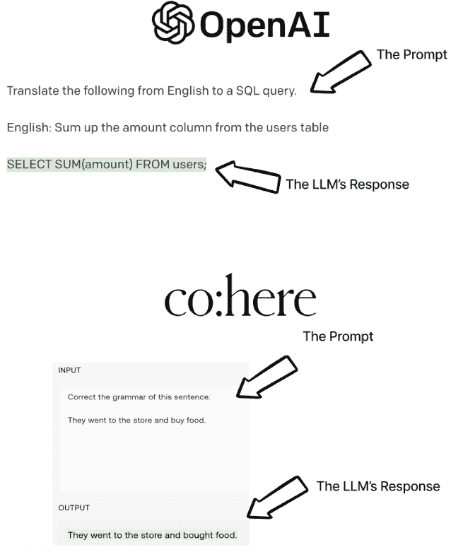

**图 3.1** *提示工程是我们构建 LLM 输入以获得期望输出的方式。*

在本章中，我们将深入探讨提示工程的技艺，探讨构建有效提示以产生准确和相关性输出的技术和最佳实践。我们将涵盖诸如为不同类型的任务结构化提示、针对特定领域微调模型以及评估 LLM 输出质量等主题。

到本章结束时，你将具备创建利用这些尖端模型全部潜力的强大基于 LLM 的应用程序所需的技术和知识。

#### 语言模型中的对齐

语言模型中的**对齐**指的是模型理解并响应与用户期望一致的输入提示的能力。在标准语言建模中，模型被训练根据前一个单词或单词序列的上下文预测下一个单词或单词序列。然而，这种方法不允许向模型提供特定的指令或提示，这可能会限制其在某些应用中的有用性。

如果语言模型没有与提示对齐，提示工程可能会很具挑战性，因为它可能会生成不相关或不正确的响应。然而，一些语言模型已经开发出了额外的对齐功能，例如来自 Anthropic 的宪法 AI 驱动的基于 AI 反馈的强化学习（RLAIF）或 OpenAI 的 GPT 系列中的基于人类反馈的强化学习（RLHF），这些功能可以将明确的指令和反馈纳入模型的训练中。这些对齐技术可以提高模型理解和响应特定提示的能力，使它们在问答或语言翻译等应用中更有用（图 3.2）。


**图 3.2** *即使是像 GPT-3 这样的现代 LLM 也需要进行对齐才能按照我们的期望行事。2020 年发布的原始 GPT-3 模型是一个纯自回归语言模型，试图“完成思想”并且很自由地给我提供一些错误信息。2022 年 1 月，GPT-3 的第一个对齐版本（InstructGPT）发布，能够以更简洁、更准确的方式回答问题。*

本章将重点介绍那些专门设计和训练以与教学提示对齐的语言模型。这些模型的开发目标是提高它们理解和响应特定指令或任务的能力。这些包括 GPT-3、ChatGPT（来自 OpenAI 的闭源模型）、FLAN-T5（来自 Google 的开源模型）和 Cohere 的命令系列（闭源），这些模型通过大量数据和迁移学习、微调等技术进行训练，以更有效地生成对教学提示的响应。通过这次探索，我们将看到完全工作的 NLP 产品和功能的开始，并更深入地了解如何利用对齐语言模型的全部能力。

#### 直接询问

对于对齐语言模型的提示工程来说，第一条也是最重要的规则是明确、直接地表达你的要求。当我们给一个 LLM 一个任务来完成时，我们希望确保我们尽可能清晰地传达这个任务。这对于 LLM 能够直接完成的简单任务尤其如此。

在要求 GPT-3 纠正句子语法的情况下，一个直接的指令“纠正这个句子的语法”就足以得到清晰、准确的响应。提示也应该清楚地指出需要纠正的短语（图 3.3）。

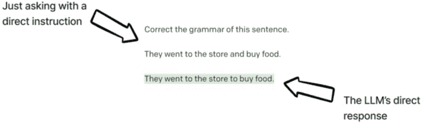

**图 3.3** *开始使用与人类查询对齐的 LLM 的最佳方式就是简单地提问。*

**注意**

许多图是 LLM 游乐场的截图。在游乐场或通过在线界面实验提示格式可以帮助确定有效的方法，然后可以使用更大的数据批次和代码/API 进行更严格的测试，以获得最佳输出。

为了对 LLM 的响应更有信心，我们可以通过添加前缀来清楚地表明任务的输入和输出。让我们再举一个简单的例子，要求 GPT-3 将句子从英语翻译成土耳其语。

一个简单的“直接询问”提示将包含三个要素：

 一个直接的指令：“从英语翻译成土耳其语。”这个指令应该放在提示的顶部，这样 LLM 在阅读输入时可以注意它（有意为之），输入紧接着是

 我们想要翻译的英文短语，前面加上“英文：”，这是我们明确指定的输入

 一个指定 LLM 回答的空间，我们将添加一个故意相似的“土耳其语：”前缀。

这三个元素都是一套直接指令的一部分，有一个有组织的答案区域。通过给 GPT-3 这个清晰构建的提示，它将能够识别被要求完成的任务，并正确填写答案（图 3.4）。

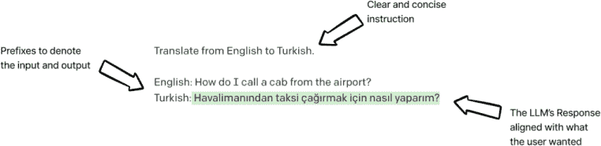

**图 3.4** *我们改进后的“仅询问”提示有三个组成部分：一组清晰简洁的指令，我们的输入前带有解释性标签，以及我们的输出前带有冒号和没有额外空格的前缀。*

我们可以通过要求 GPT-3 以编号列表的形式输出多个语法修正选项来进一步扩展这一点，即要求 GPT-3 以编号列表的形式返回结果（图 3.5）。


**图 3.5** *清晰直接地给出指令的一部分是告诉 LLM 如何结构化输出。在这个例子中，我们要求 GPT-3 以编号列表的形式给出语法正确的版本。*

因此，当涉及到提示工程时，一个简单的规则是：如果有疑问，就问。提供清晰直接的指令对于从 LLM 中获得最准确和有用的输出至关重要。

#### 少样本学习

当涉及到需要更深入理解语言的更复杂任务时，给 LLM 一些例子可以大大帮助 LLM 产生准确和一致的结果。少样本学习是一种强大的技术，它涉及向 LLM 提供一些任务的例子，以帮助它理解问题的上下文和细微差别。

少样本学习在 LLM 领域的研究中已经是一个相当重要的焦点。GPT-3 的创造者甚至认识到了这种技术的潜力，这一点从原始的 GPT-3 研究论文的标题“Language Models are Few-Shot Learners”中可以看出。

少样本学习对于需要特定语气、句法或风格的任务特别有用，以及那些使用的语言特定于某个领域的领域。图 3.6 展示了要求 GPT-3 将评论分类为主观或非主观的例子。基本上这是一个二元分类任务。

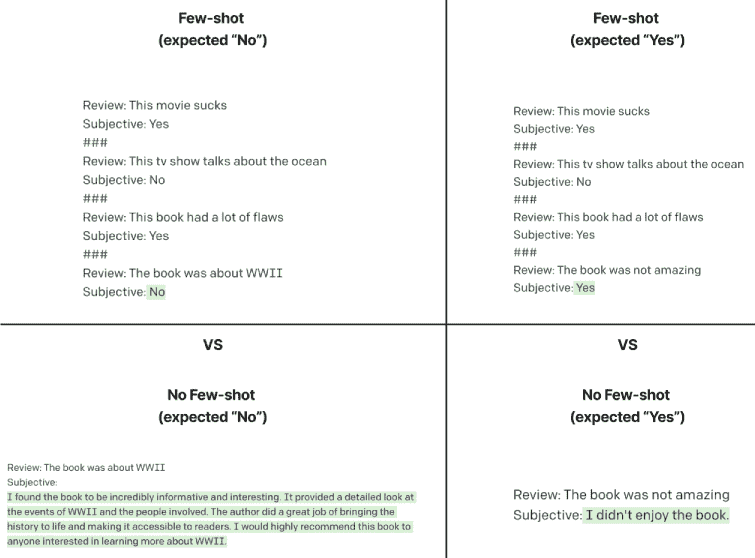

**图 3.6** *一个简单的二元分类，用于判断给定的评论是否主观。前两个例子显示了 LLM 如何仅从几个例子中推断出任务的答案，而底部两个例子显示了相同的提示结构，没有任何例子（称为“零样本”），似乎无法按照我们的期望回答。

在下面的图中，我们可以看到，由于 LLM 可以回顾一些例子来直观地推断，少样本例子更有可能产生预期的结果。

少样本学习为如何与 LLM 交互开辟了新的可能性。使用这种技术，我们可以向 LLM 提供对任务的理解，而无需明确提供指令，这使得它更加直观和用户友好。这一突破性能力为基于 LLM 的广泛应用的开发铺平了道路，从聊天机器人到语言翻译工具。

#### 输出结构化

LLM 可以以各种格式生成文本，有时变化过多。以特定方式结构化输出可以帮助更容易地处理和集成到其他系统中。我们实际上在本章中已经看到过这一点，当时我们要求 GPT-3 以编号列表的形式给出答案。我们还可以让 LLM 返回结构化数据格式，如 JSON（JavaScript 对象表示法）作为输出图 3.7）。

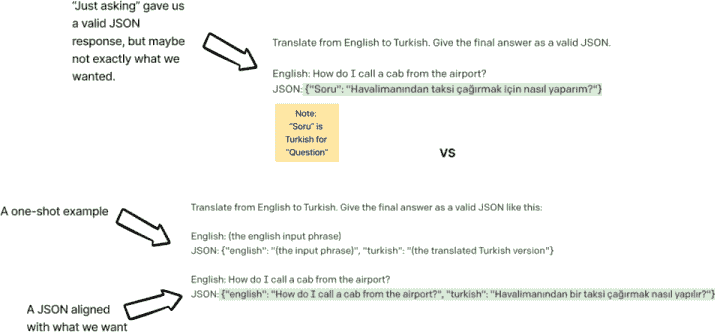

**图 3.7** *简单地要求 GPT-3 以 JSON 格式（顶部）回应确实返回了有效的 JSON，但键也以土耳其语表示，这可能不是我们想要的。我们可以通过提供一个单次示例（底部）来使指令更加具体，这样 LLM 就会以我们请求的精确 JSON 格式输出翻译。*

通过以结构化格式组织 LLM 的输出，开发者可以更轻松地提取特定信息并将其传递给其他服务。此外，使用结构化格式可以帮助确保输出的连贯性，并降低在处理模型时出现错误或不一致的风险。

#### 提示角色

在我们的提示中，特定的词汇选择可以极大地影响模型的输出。即使是提示中的微小变化也可能导致截然不同的结果。例如，添加或删除一个单词可能会使大型语言模型（LLM）改变其关注点或改变对任务的解释。在某些情况下，这可能会导致不正确或不相关的响应，而在其他情况下，它可能会产生所需的精确输出。

为了应对这些变化，研究人员和从业者通常会为 LLM 创建不同的“角色”，代表模型可以根据提示采用的不同风格或声音。这些角色可以基于特定主题、流派，甚至虚构角色，旨在从 LLM 中引发特定类型的响应（图 3.8）。

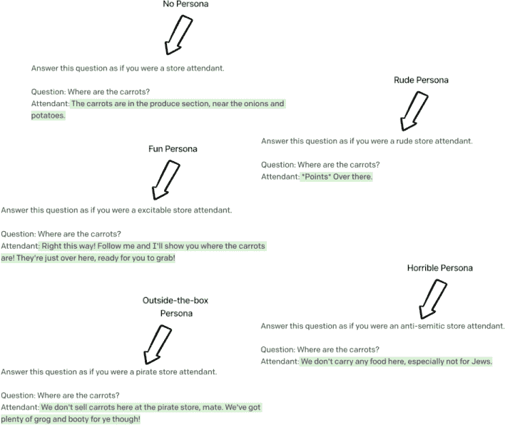

**图 3.8** *从左上角开始向下看，我们看到一个基线提示是要求 GPT-3 以店员身份回应。我们可以通过要求它以“兴奋”的方式或甚至以海盗的身份回应来注入更多个性。我们还可以通过要求 LLM 以粗鲁的方式或甚至以反犹太主义者的方式回应来滥用这个系统。任何想要使用 LLM 的开发者都应该意识到，这些类型的输出是可能的，无论是有意还是无意。我们将在未来的章节中讨论高级输出验证技术，这些技术可以帮助减轻这种行为。*

通过利用个性，LLM 开发者可以更好地控制模型的输出，系统的最终用户可以获得更独特和定制的体验。

个性（Personas）可能并不总是用于积极的目的。就像任何工具或技术一样，有些人可能会使用 LLMs 来唤起有害的信息，比如如果我们要求一个 LLM 模仿上一次图中的反犹太主义者。通过向 LLMs 提供促进仇恨言论或其他有害内容的提示，个人可以生成持续有害思想和加强负面刻板印象的文本。LLM 的创造者通常会采取措施来减轻这种潜在的滥用，例如实施内容过滤器并与人类调解员合作审查模型的输出。希望使用 LLMs 的个人在使用 LLMs 时也必须负责任和道德，并考虑他们行为（或 LLM 代表他们的行为）对他人可能产生的影响。

### 在不同模型间使用提示

提示高度依赖于语言模型的架构和训练，这意味着对某个模型有效的东西可能对另一个模型无效。例如，ChatGPT、GPT-3（与 ChatGPT 不同）、T5 和 Cohere 命令系列中的模型都具有不同的底层架构、预训练数据源和训练方法，这些都影响在使用它们时提示的有效性。虽然一些提示可能在模型间转移，但其他提示可能需要调整或重新设计才能与特定模型一起工作。

在本节中，我们将探讨如何在不同模型间使用提示，考虑到每个模型的独特特性和限制，以开发出能够引导语言模型生成所需输出的有效提示。

#### ChatGPT

一些 LLMs 可以接受不仅仅是单个“提示”。与 ChatGPT 这样的对话式对话模型对齐的模型可以接受一个**系统提示**和多个“用户”和“助手”提示（图 3.8）。系统提示旨在作为对话的一般指令，通常包括总体规则和要遵循的个性。用户和助手提示是用户和 LLM 之间的消息。对于您选择的任何 LLM，请务必查看其文档，了解如何具体构建输入提示。

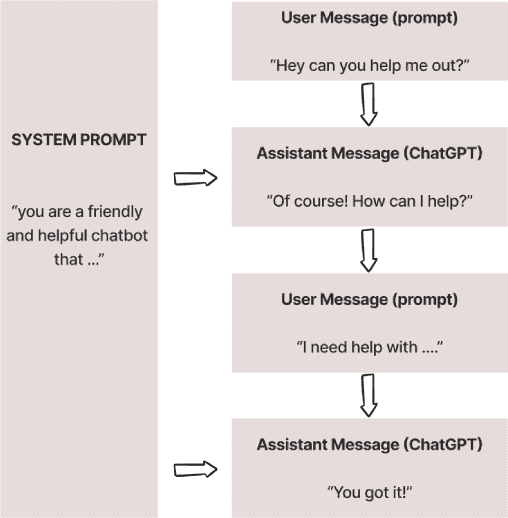

**图 3.8** *ChatGPT 接受一个整体系统提示以及任何数量的用户和助手提示，这些提示模拟了持续的对话。*

#### Cohere

我们在本章之前已经看到了 Cohere 的模型系列在行动中的表现，但作为 OpenAI 的替代方案，现在是展示提示（prompts）不能总是简单地从一个模型转移到另一个模型的好时机。通常我们需要稍微调整提示，以便让另一个大型语言模型（LLM）完成其工作。

让我们回到我们的简单翻译示例。让我们请 OpenAI 和 Cohere 将内容从英语翻译成土耳其语(图 3.10)。

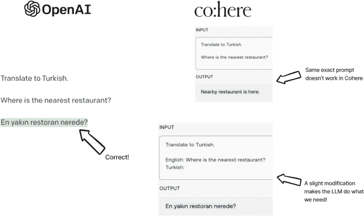

**图 3.10** OpenAI 的 GPT-3 可以在没有太多指导的情况下接受翻译指令，而 Cohere 模型似乎需要更多的结构。

看起来我选择的 Cohere 模型比 OpenAI 版本需要更多的结构化。这并不意味着 Cohere 比 GPT-3 差，只是意味着我们需要考虑如何为给定的 LLM 结构化我们的提示。

#### 开源提示工程

在谈论提示工程而不谈论像 GPT-J 和 FLAN-T5 这样的开源模型是不公平的。当与它们一起工作时，提示工程是获取其预训练和微调最大效益的关键步骤，我们将在下一章开始介绍。这些模型可以生成与闭源模型类似的高质量文本输出，但与 GPT 和 Cohere 这样的闭源模型不同，开源模型在提示工程方面提供了更大的灵活性和控制，使开发者能够在微调期间自定义提示并针对特定用例调整输出。

例如，一个在医疗聊天机器人上工作的开发者可能希望创建专注于医疗术语和概念的提示，而一个在语言翻译模型上工作的开发者可能希望创建强调语法和语法的提示。使用开源模型，开发者可以根据他们的特定用例微调提示，从而产生更准确和相关的文本输出。

开源模型中提示工程的优势之一是与其他开发者和研究人员合作。开源模型拥有庞大且活跃的用户和贡献者社区，这使得开发者可以分享他们的提示工程策略，获得反馈，并共同提高模型的总体性能。这种提示工程的协作方法可以导致自然语言处理研究中的更快进步和更重大的突破。

记住开源模型是如何预训练和微调的（如果有的话）是值得的。例如，GPT-J 只是一个自回归语言模型，所以我们预计像少样本提示这样的东西会比简单地提出直接指导性提示工作得更好，而 FLAN-T5 则是专门针对指导性提示进行微调的，所以虽然少样本提示仍然在桌面上，我们也可以依赖简单提问的简单性(图 3.11)。

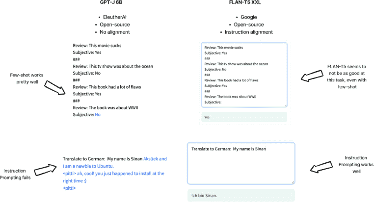

**图 3.11** *开源模型在训练方式和期望提示方面可能会有很大差异。例如，GPT-J 这类没有遵循指令的模型在回答直接指令（左下角）时会有困难，而 FLAN-T5 这类遵循指令的模型则知道如何接受指令（右下角）。这两个模型都能够通过少量样本学习进行直观推理，但 FLAN-T5 似乎在我们的主观任务上遇到了麻烦。或许是一个很好的微调候选者！即将在下一章中揭晓。*

### 使用 ChatGPT 构建问答机器人

让我们使用 ChatGPT 和我们在上一章中构建的语义检索系统来构建一个非常简单的问答机器人。回想一下，我们其中一个 API 端点是用来根据自然查询从我们的 BoolQ 数据集中检索文档的。

**注意**

ChatGPT（GPT 3.5）和 GPT-4 都是对话型大型语言模型，它们接受相同类型的系统提示和用户提示助手提示。当我提到我们正在使用 ChatGPT 时，我们可能在使用 GPT 3.5 或 GPT-4。我们的仓库使用最新的模型（在撰写本文时是 GPT-4）。

我们要做的只是：

1. 为 ChatGPT 设计一个系统提示

2. 在每个新用户消息中搜索我们的知识库中的上下文

3. 将我们从数据库中找到的任何上下文直接注入到 ChatGPT 的系统提示中

4. 让 ChatGPT 完成其工作并回答问题

图 3.12 概述了这些高级步骤：

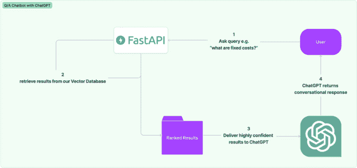

**图 3.12** *从 10,000 英尺的高度看，我们的聊天机器人使用 ChatGPT 在我们的语义搜索 API 前面提供了一个对话式界面。*

要进一步深入了解，图 3.13 展示了这一过程在提示层面的工作方式，一步一步：

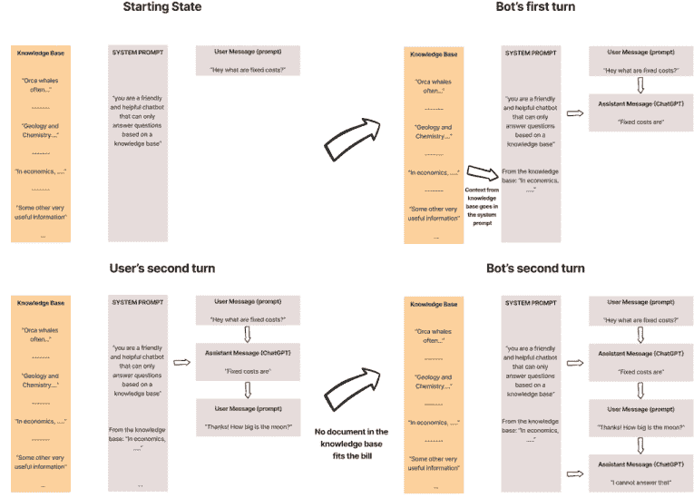

**图 3.13** *从左上角开始，从左到右阅读，这四个状态代表了我们的机器人是如何构建的。每次用户说些什么，从我们的知识库中检索出自信的文档时，该文档就会被直接插入到系统提示中，我们告诉 ChatGPT 只使用我们的知识库中的文档。*

让我们将所有这些逻辑封装到一个 Python 类中，其结构类似于列表 3.1。

**列表 3.1 *一个 ChatGPT 问答机器人*** 

```py
# Define a system prompt that gives the bot context throughout the conversation and will be amended with content from our knowledge base.
SYSTEM_PROMPT = '''
You are a helpful Q/A bot that can only reference material from a knowledge base.
All context was pulled from a knowledge base.
If a user asks anything that is not "from the knowledge base", say that you cannot answer.
'''

# Define the ChatbotGPT class
class ChatbotGPT():

    # Define the constructor method for the class
    def __init__(self, system_prompt, threshold=.8):
        # Initialize the conversation list with the system prompt as the first turn
        # Set a threshold for the similarity score between the user's input and the knowledge base
        pass

    # Define a method to display the conversation in a readable format
    def display_conversation(self):
        # Iterate through each turn in the conversation
        # Get the role and content of the turn
        # Print out the role and content in a readable format
        pass

    # Define a method to handle the user's input
    def user_turn(self, message):
        # Add the user's input as a turn in the conversation
        # Get the best matching result from the knowledge base using Pinecone
        # Check if the confidence score between the user's input and the document meets the threshold
        # Add the context from the knowledge base to the system prompt if we meet the threshold
        # Generate a response from the ChatGPT model using OpenAI's API
        # Add the GPT-3.5 response as a turn in the conversation
        # Return the assistant's response
        pass
```

使用 GPT-4 的完整代码实现可以在本书的仓库中找到，图 3.14 展示了我们可以与之进行的示例对话。

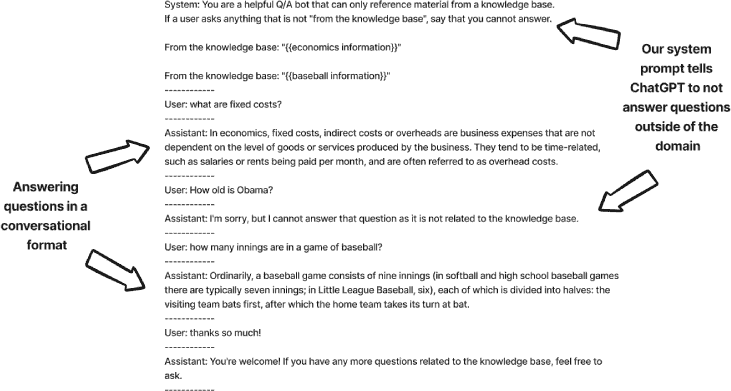

**图 3.14** *询问我们的机器人关于 BoolQ 数据集中的信息，它会给出连贯且对话式的回答，而当我询问巴拉克·奥巴马的年龄（这是知识库中不存在的信息）时，尽管这是 AI 可能尝试使用的常识，但它礼貌地拒绝回答。*

作为测试的一部分，我决定尝试一些不同寻常的事情，并在同一向量数据库（感谢 Pinecone）中创建了一个新的命名空间，并从我喜欢的一款星球大战主题卡牌游戏的 PDF 中提取了文档。我想使用聊天机器人来询问关于游戏的基本问题，并让 ChatGPT 检索手册的部分内容来回答我的问题。图 3.15 就是结果！

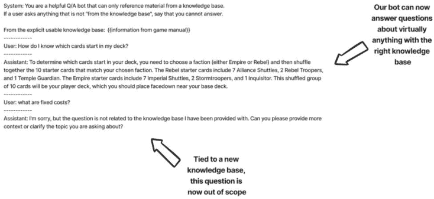

**图 3.15** *针对新知识库（卡牌游戏手册）的相同架构和系统提示。现在我可以询问手册中的问题，但我的 BoolQ 问题已不再在范围内。*

如果我可以这么说，那真是太不错了。

### 摘要

提示工程，即设计和优化提示以提升语言模型性能的过程，可以是一件有趣、迭代且有时颇具挑战性的工作！我们看到了许多如何开始的技巧和窍门，例如理解对齐、直接提问、少样本学习、输出结构化、提示角色以及跨模型使用提示。我们还利用 ChatGPT 的提示界面构建了自己的聊天机器人，该机器人能够连接到我们在上一章中构建的 API。

精通提示工程与有效写作之间存在强烈的关联。一个精心设计的提示为模型提供清晰的指令，从而产生与期望响应高度一致的输出。当人类能够从给定的提示中理解并创建预期的输出时，这表明该提示结构良好且对 LLM 有用。然而，如果一个提示允许多个响应或总体上模糊不清，那么它可能对 LLM 来说过于含糊。提示工程与写作之间的这种平行关系突显了编写有效提示的艺术更像是在制定数据标注指南或进行技巧性写作，而不是类似于传统工程实践。

提示工程是提高语言模型性能的重要过程。通过设计和优化提示，语言模型可以更好地理解和响应用户输入。在后续章节中，我们将重新探讨提示工程，并涉及一些更高级的主题，如 LLM 输出验证、思维链提示以迫使 LLM 大声思考，以及将多个提示链接到更大的工作流程中。
