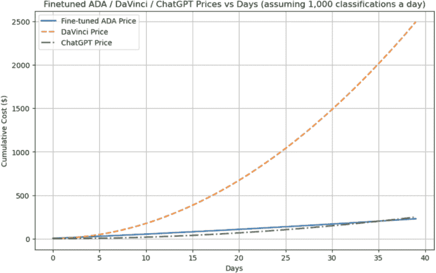
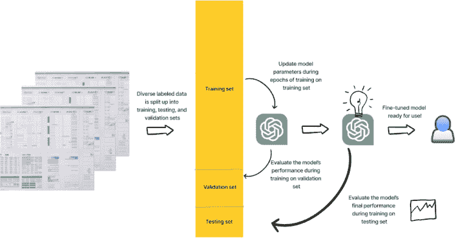
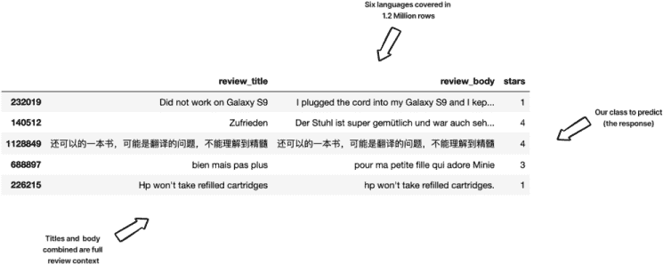
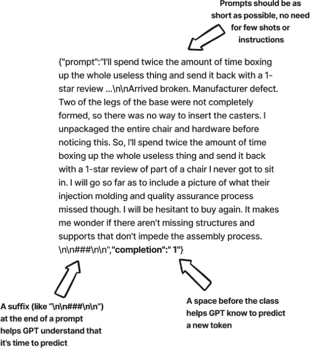
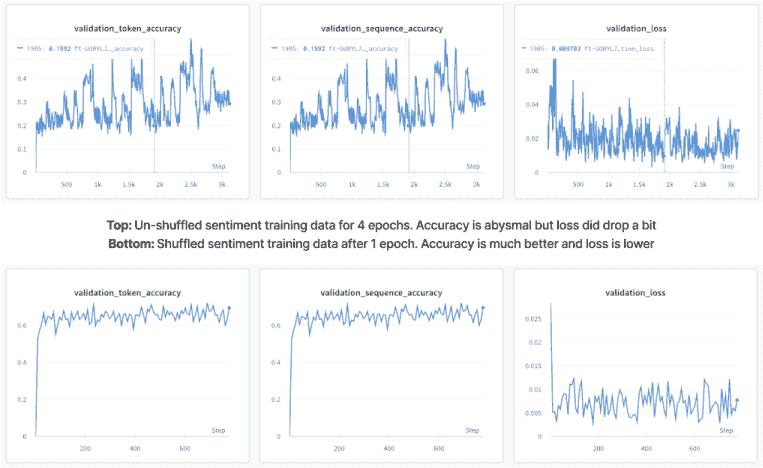
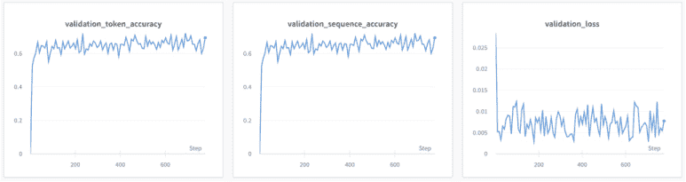
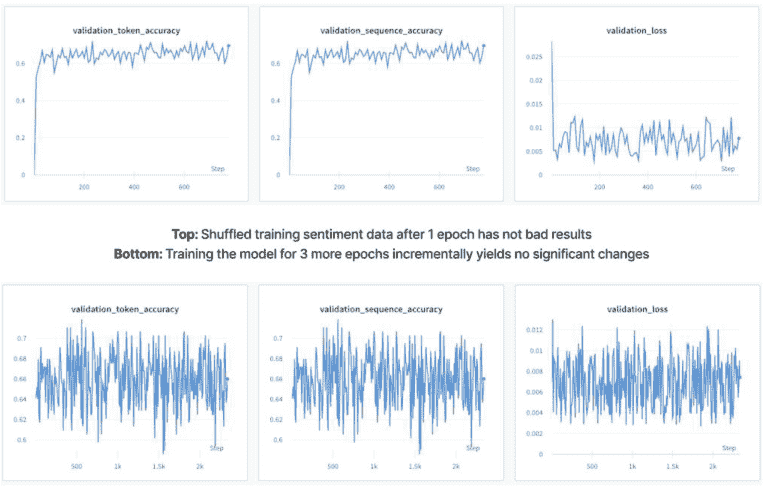
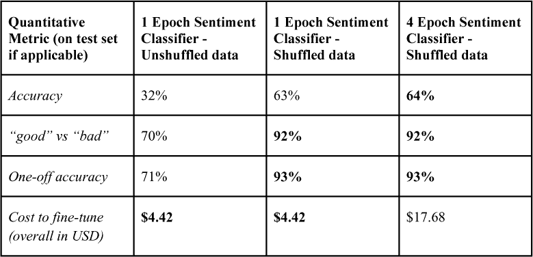
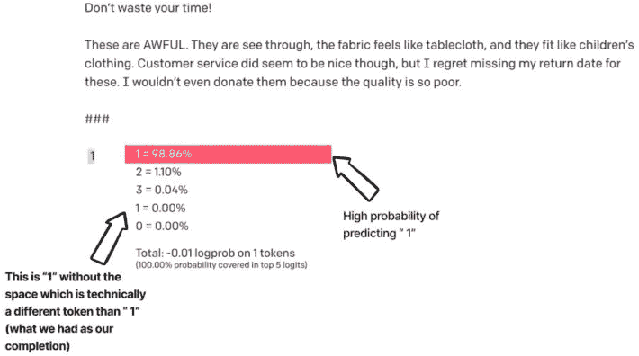

## 4

## 使用定制微调优化 LLMs

### 引言

到目前为止，我们一直仅使用 LLMs，无论是开源的还是闭源的，因为它们是现成的。我们依赖 Transformer 的注意力机制及其计算速度来相对轻松地执行相当复杂的问题。正如你可能猜到的，这并不总是足够的。

在本章中，我们将深入探讨大型语言模型（LLMs）的微调世界，以释放其全部潜力。微调更新现成的模型，并赋予它们实现更高质量结果的能力，导致令牌节省，并且通常降低延迟请求。虽然类似 GPT 的 LLMs 在大量文本数据上的预训练使得令人印象深刻的少样本学习能力成为可能，但微调通过在众多示例上细化模型，进一步提升了在各种任务上的性能。

使用微调模型进行推理在长期来看可以非常经济高效，尤其是在处理较小模型时。例如，来自 OpenAI 的微调 Ada 模型（只有 3.5 亿个参数）每 1k 个令牌的成本仅为 0.0016 美元，而 ChatGPT（15 亿个参数）的成本为 0.002 美元，Davinci（1750 亿个参数）的成本为 0.002 美元。随着时间的推移，使用微调模型的成本将更加吸引人，如图 4.1 所示。



**图 4.1** *假设每天只有 1,000 次分类，并且相对宽松的提示比例（对于 DaVinci 或 ChatGPT，每 40 个令牌有 150 个令牌（用于少样本示例、指令和其他）），即使有前期成本，微调模型的成本在总体成本上几乎总是占上风。请注意，这并不包括微调模型的成本，我们将在本章后面开始探讨这一点。*

我在本章中的目标是指导你通过微调过程，从准备训练数据开始，到训练新或现有微调模型的战略，以及讨论如何将你的微调模型融入实际应用中。这是一个很大的主题，因此我们不得不假设一些大的工作是在幕后完成的，比如数据标注。在许多复杂和特定任务的情况下，数据标注可能是一项巨大的开销，但到目前为止，我们将假设我们大部分可以依赖数据中的标签。有关如何处理此类情况的更多信息，请随时查看我关于特征工程和标签清洗的一些其他内容！

通过理解微调的细微差别并掌握其技术，你将准备好利用 LLMs 的力量，并为你的特定需求创建定制解决方案。

### 转移学习和微调：入门

微调基于迁移学习理念。**迁移学习**是一种利用预训练模型来构建新任务或领域现有知识的技术。在 LLMs 的情况下，这涉及到利用预训练来转移一般语言理解，包括语法和一般知识，到特定领域特定任务。然而，预训练可能不足以理解某些封闭或专业主题的细微差别，例如一家公司的法律结构或指南。

**微调**是迁移学习的一种特定形式，它调整预训练模型的参数以更好地适应“下游”目标任务。通过微调，LLMs 可以从定制示例中学习，并更有效地生成相关且准确的响应。

#### 微调过程解析

微调深度学习模型涉及更新模型的参数，以提高其在特定任务或数据集上的性能。

 **训练集**：用于训练模型的标记示例集合。模型通过根据训练示例调整其参数来学习数据中的模式和关系。

 **验证集**：用于在训练期间评估模型性能的单独标记示例集合。

 **测试集**：一个与训练集和验证集都分开的标记示例集合。它在训练和微调过程完成后评估模型的最终性能。测试集提供了模型泛化到新、未见数据的能力的最终、无偏估计。

 **损失函数**：损失函数量化了模型预测值与实际目标值之间的差异。它作为误差的度量标准，用于评估模型性能并指导优化过程。在训练过程中，目标是最小化损失函数以实现更好的预测。

微调的过程可以分解为几个步骤：

1. **收集标记数据**：微调的第一步是收集与目标任务或领域相关的训练、验证和测试数据集的标记示例。标记数据作为模型学习特定任务模式和关系的指南。例如，如果目标是微调用于情感分类的模型（我们的第一个示例），则数据集应包含文本示例及其相应的情感标签，如正面、负面或中性。

2. **超参数选择：** 微调涉及调整影响学习过程的学习率、批量大小和训练轮数等超参数。学习率决定了模型权重更新的步长，而批量大小指的是单个更新中使用的训练示例数量。训练轮数表示模型将遍历整个训练数据集的次数。正确设置这些超参数可以显著影响模型的表现，并有助于防止过拟合（当模型学习训练数据中的噪声多于信号时）或欠拟合（当模型未能捕捉到数据的潜在结构时）的问题。

3. **模型适应：** 一旦设置了标记数据和超参数，模型可能需要适应目标任务。这包括修改模型的架构，例如添加自定义层或更改输出结构，以更好地适应目标任务。例如，BERT 的架构不能直接执行序列分类，但它们可以非常轻微地进行修改以实现该任务。在我们的案例研究中，我们不需要处理这个问题，因为 OpenAI 会为我们处理。然而，我们将在后面的章节中处理这个问题。

4. **评估和迭代：** 微调过程结束后，我们必须在单独的保留验证集上评估模型的性能，以确保它对未见数据具有良好的泛化能力。根据任务，可以使用性能指标，如准确率、F1 分数或平均绝对误差（MAE）。如果性能不满意，可能需要调整超参数或数据集，然后重新训练模型。

5. **模型实现和进一步训练：** 一旦模型经过微调并且我们对性能感到满意，我们需要以能够处理任何错误并从用户那里收集反馈的方式将其与现有基础设施集成，以便我们可以将数据添加到我们的总数据集中，以便未来再次运行该过程。

此过程在图 4.2 中概述。



**图 4.2** *微调过程可视化。数据集被分成训练集、验证集和测试集。训练集用于更新模型的权重并评估，而验证集用于训练期间的评估。然后，最终模型与测试集进行测试，并针对一系列标准进行评估。如果模型通过我们的测试，它将用于生产并监控进一步的迭代。*

此过程可能需要多次迭代，并仔细考虑超参数、数据质量和模型架构，以达到预期的结果。

#### 作为基础的闭源预训练模型

预训练的 LLM 在迁移学习和微调中扮演着至关重要的角色，为通用的语言理解和知识提供了一个基础。这个基础使得对特定任务和领域的适应变得高效，减少了大量训练资源和数据的需求。

本章重点介绍使用 OpenAI 基础设施微调 LLM，该基础设施专门设计用于简化微调过程。OpenAI 开发了工具和资源，使研究人员和开发者更容易为他们的特定需求微调较小的模型，如 Ada 和 Babbage。该基础设施提供了一种简化的微调方法，使用户能够高效地将预训练模型适应到广泛的任务和领域。

##### 使用 OpenAI 微调基础设施的好处

利用 OpenAI 的基础设施进行微调具有几个优势：

 访问经过广泛和多样化数据集训练的强大预训练模型，如 GPT-3。

 一个相对用户友好的界面，简化了不同技术水平的人进行微调的过程。

 一系列工具和资源，帮助用户优化他们的微调过程，例如选择超参数的指南、准备自定义示例的技巧以及模型评估的建议。

这个简化的流程节省了时间和资源，同时确保开发出高质量的模型，能够在广泛的领域中生成准确和相关的响应。我们将在后面的章节中深入探讨开源微调和它提供的优势/劣势。

### 概览 OpenAI 微调 API

GPT-3 API 为开发者提供了访问最先进的 LLM 之一——GPT-3 的权限。该 API 提供了一系列微调功能，使用户能够将模型适应到特定的任务、语言和领域。本节将讨论 GPT-3 微调 API 的关键特性、支持的方法以及成功微调模型的最佳实践。

#### GPT-3 微调 API

GPT-3 微调 API 就像一个宝库，充满了强大的功能，使得定制模型变得轻而易举。从支持各种微调功能到提供一系列方法，它是一个定制模型到特定任务、语言或领域的全能商店。本节将揭示 GPT-3 微调 API 的秘密，揭示使其成为如此宝贵资源的工具和技术。

#### 案例研究：亚马逊评论情感分类

让我们介绍我们的第一个案例研究。我们将使用**amazon_reviews_multi**数据集（如图 4.3 所示进行预览）。这个数据集是亚马逊产品评论的集合，涵盖了多个产品类别和语言（英语、日语、德语、法语、中文和西班牙语）。数据集中的每个评论都附有一个 1 到 5 星的评分，1 为最低，5 为最高。本案例研究的目的是微调来自 OpenAI 的预训练模型，以对这些评论进行情感分类，使其能够预测评论获得的星级数。借鉴我自己的经验（尽管只是几页之前），让我们先看看数据。



**图 4.3** *亚马逊评论多语言数据集的一个片段显示了我们的输入上下文（评论标题和内容）以及我们的响应——我们试图预测的东西——评论的星级数（1-5）。*

我们将关注本次微调的列是：

 `review_title`: 评论的文本标题。

 `review_body`: 评论的文本内容。

 `stars`: 一个介于 1-5 之间的整数，表示星级的数量。

我们的目标将是使用评论标题和内容的上下文来预测给出的评分。

#### 数据的指南和最佳实践

通常，在选择用于微调的数据时，需要考虑以下几点：

 **数据质量：** 确保用于微调的数据质量高，无噪声，并准确代表目标领域或任务。这将使模型能够有效地从给定示例中学习。

 **数据多样性：** 确保您的数据集具有多样性，涵盖广泛的场景，以帮助模型在不同情况下良好地泛化。

 **数据平衡：** 在不同任务和领域之间保持示例的平衡分布有助于防止模型性能的过拟合和偏差。这可以通过对多数类进行欠采样、对少数类进行过采样或添加合成数据来实现。由于这个数据集是经过精心挑选的，我们的情感数据完全平衡，但请查看我们代码库中的一个更具挑战性的例子，我们在其中尝试对非常不平衡的分类任务进行分类。

 **数据量：** 用于微调模型的总数据量。通常，像 LLM 这样的大型语言模型需要大量数据来有效地捕捉和学习各种模式，但如果 LLM 在足够相似的数据上进行了预训练，则可能需要较少的数据。所需的确切数量可以根据任务的复杂性而变化。任何数据集不仅应该是广泛的，还应该是多样化的，并且能够代表问题空间，以避免潜在的偏差并确保在广泛的输入上具有稳健的性能。虽然大量数据可以帮助提高模型性能，但它也增加了模型训练和微调所需的计算资源。这种权衡需要在特定项目需求和资源的情况下进行考虑。

### 使用 OpenAI CLI 准备自定义示例

在深入微调之前，我们需要根据 API 的要求对数据进行清理和格式化，以便准备数据。这包括以下内容：

 **删除重复项：** 为了确保最高的数据质量，首先从数据集中删除任何重复的评论。这将防止模型对某些示例过度拟合，并提高其对新数据泛化的能力。

 **分割数据：** 将数据集分为训练集、验证集和测试集，在每个集中保持示例的随机分布。如果需要，考虑使用分层抽样以确保每个集包含不同情感标签的代表比例，从而保持数据集的整体分布。

 **打乱训练数据：** 在微调之前打乱训练数据有助于通过确保模型以随机顺序遇到示例来避免学习过程中的偏差。这减少了基于示例顺序学习意外模式的风险。它还通过在训练的每个阶段向模型展示更多样化的实例来提高模型泛化能力，这也有助于防止过拟合，因为模型不太可能记住训练示例，而是专注于学习潜在的模式。图 4.5 展示了打乱训练数据的益处。请注意，理想情况下，在每个单独的周期之前都应该打乱数据，以尽可能减少模型在数据上过拟合的机会。

 **创建 OpenAI JSONL 格式：** OpenAI 的 API 预期训练数据应以 JSONL（换行分隔的 JSON）格式提供。对于训练集和验证集中的每个示例，创建一个包含两个字段的 JSON 对象：“prompt”（输入）和“completion”（目标类别）。“prompt”字段应包含评论文本，而“completion”字段应存储相应的情感标签（星级）。将这些 JSON 对象作为换行分隔的记录保存在单独的文件中，分别用于训练集和验证集。

对于我们数据集中的完成标记，我们应确保类别标签之前有一个前置空格，因为这使模型能够理解它应该生成一个新的标记。此外，在准备微调过程的提示时，无需包含少样本示例，因为模型已经针对特定任务数据进行了微调。相反，提供一个包含评论文本和任何必要上下文的提示，后跟一个后缀（例如，“情感：”后面没有空格或“\n\n###\n\n”如图 4.4 所示），以指示所需的输出格式。图 4.4 展示了我们 JSONL 文件中的一行示例。



**图 4.4** *我们将要提供给 OpenAI 的训练数据的一个 JSONL 示例。每个 JSON 都有一个提示键 - 表示模型输入（无任何少样本、指令等）和一个完成键 - 表示我们希望模型输出的内容，在我们的案例中是一个单一的分类标记。在这个例子中，用户对产品给出了 1 星的评价。*

我应该指出，对于我们的输入数据，我已经将标题和评论正文连接起来作为单一输入。这是一个个人选择，我这样做是因为我相信标题可以具有更直接的语言来表明总体情感，而正文可能具有更细微的语言来精确指出他们将给出的星级数。请随意探索不同的文本字段组合方式！我们将在后续的案例研究中进一步探讨这一点，以及其他为单个文本输入格式化字段的方法。



**图 4.5** *未打乱的数据不适合作为训练数据！它给模型提供了在特定数据批次上过拟合的空间，并且总体上降低了响应的质量。顶部三个图表表示在未打乱的训练数据上训练的模型，与底部三个图表中在打乱数据上训练的模型相比，准确率非常糟糕。*

下面的列表 (列表 4.1) 加载了亚马逊评论数据集，并将 'train' 子集转换为 pandas DataFrame。然后，使用自定义的 `prepare_df_for_openai` 函数对 DataFrame 进行预处理，该函数将评论标题和评论正文合并为一个提示，创建一个新的完成列，并过滤 DataFrame 以仅包含英文评论。最后，根据 'prompt' 列删除重复行，并返回仅包含 'prompt' 和 'completion' 列的 DataFrame。

**列表 4.1** 为我们的情感训练数据生成 JSONL 文件

```py
from datasets import load_dataset
import pandas as pd

# Load the Amazon Reviews Multi-Languages dataset
dataset = load_dataset("amazon_reviews_multi", "all_languages")
# Convert the 'train' subset of the dataset to a pandas DataFrame
training_df = pd.DataFrame(dataset['train'])
def prepare_df_for_openai(df):
    # Combine 'review_title' and 'review_body' columns, and add a custom suffix '\n\n###\n\n' at the end to create the 'prompt' column
    df['prompt'] = df['review_title'] + '\n\n' + df['review_body'] + '\n\n###\n\n'
    # Create a new 'completion' column by adding a space before the 'stars' values
    df['completion'] = ' ' + df[stars]
    # Filter the DataFrame to only include rows with 'language' equal to 'en' (English)
    english_df = df[df['language'] == 'en']
    # Remove duplicate rows based on the 'prompt' column
    english_df.drop_duplicates(subset=['prompt'], inplace=True)
    # Return the shuffled and filtered DataFrame with only the 'prompt' and 'completion' columns
    return english_df[['prompt', 'completion']].sample(len(english_df))

english_training_df = prepare_df_for_openai(training_df)
# export the prompts and completions to a JSONL file
english_training_df.to_json("amazon-english-full-train-sentiment.jsonl", orient='records', lines=True)
```

我们将对数据集的 'validation' 子集和用于最终模型测试的保留 'test' 子集执行类似的过程。快速说明一下，在这种情况下我们仅过滤英文，但您可以在更多语言混合中进行训练。我只是想以高效的价格快速得到一些结果。

##### 设置 OpenAI CLI

OpenAI 命令行界面 (CLI) 简化了微调和与 API 交互的过程。CLI 允许您从命令行提交微调请求、监控训练进度以及管理您的模型。在开始微调过程之前，请确保您已安装并配置了 OpenAI CLI 以及您的 API 密钥。

要安装 OpenAI CLI，您可以使用 pip，Python 软件包管理器。首先，请确保您的系统上已安装 Python 3.6 或更高版本。然后，按照以下步骤操作：

1. 打开终端（在 macOS 或 Linux 上）或命令提示符（在 Windows 上）。

2. 运行以下命令安装 openai 包：`**pip install openai**`

a. 此命令安装了 OpenAI Python 包，其中包含 CLI。

3. 要验证安装是否成功，请运行以下命令：`**openai --version**`

a. 此命令应显示已安装的 OpenAI CLI 的版本号。

在您可以使用 OpenAI CLI 之前，您需要使用您的 API 密钥对其进行配置。为此，将 OPENAI_API_KEY 环境变量设置为您的 API 密钥值。您可以在 OpenAI 账户仪表板中找到您的 API 密钥。

#### 超参数选择和优化

在创建 JSONL 文档并安装 OpenAI CLI 之后，我们准备好选择超参数了！以下是一些关键超参数及其定义：

 **学习率**：学习率决定了模型在优化过程中所采取的步长大小。较小的学习率会导致收敛速度较慢，但可能获得更好的准确性，而较大的学习率会加快训练速度，但可能导致模型超出最佳解。

 **批大小**：批大小指的是在模型更新单次迭代中使用的训练示例数量。较大的批大小可能导致梯度更稳定且训练速度更快，而较小的批大小可能导致模型更准确但收敛速度较慢。

 **训练轮数**：一个轮次是指完整地遍历整个训练数据集。训练轮数的数量决定了模型将迭代数据的次数，从而使其能够学习和优化其参数。

OpenAI 已经为大多数情况找到了最优设置，因此我们将在我们的第一次尝试中依赖他们的建议。我们唯一要改变的是将训练轮数改为 1 轮，而不是默认的 4 轮。我们这样做是因为我们想在投入太多时间和金钱之前看看性能表现如何。尝试不同的值和使用如网格搜索等技术将帮助您找到适合您任务和数据集的最佳超参数设置，但请注意，这个过程可能耗时且成本高昂。

### 我们的第一款微调大型语言模型！

让我们开始我们的第一次微调！列表 4.2 调用 OpenAI 在训练和验证数据上训练一个 ada 模型（最快、最便宜、最弱）进行 1 轮训练。

**列表 4.2** 进行第一次微调调用

```py
# Execute the 'fine_tunes.create' command using the OpenAI API
!openai api fine_tunes.create \
  # Specify the training dataset file in JSONL format
  -t "amazon-english-full-train-sentiment.jsonl" \
  # Specify the validation dataset file in JSONL format
  -v "amazon-english-full-val-sentiment.jsonl" \
  # Enable computation of classification metrics after fine-tuning
  --compute_classification_metrics \
  # Set the number of classes for classification (5 in this case)
  --classification_n_classes 5 \
  # Specify the base model to be fine-tuned (using the smallest model, ada)
  -m ada \
  # Set the number of epochs for training (1 in this case)
  --n_epochs 1
```

#### 使用定量指标评估微调模型

测量微调模型的表现对于理解其有效性和确定改进领域至关重要。利用准确率、F1 分数或困惑度等指标和基准，将为模型的表现提供定量度量。除了定量指标外，定性评估技术，如人工评估或分析示例输出，可以提供有关模型优势和劣势的宝贵见解，帮助确定进一步微调的领域。

经过一轮训练（进一步指标见图 4.6），我们的分类器在保留测试数据集上的准确率已经超过了 63%！请记住，测试子集并没有给 OpenAI，而是我们保留它以进行最终模型比较。



**图 4.6** *我们的模型在去重后的随机训练数据上仅经过一轮训练后表现相当不错*

63%的准确率可能听起来很低，但请听我说：预测**确切**的星星数量是困难的，因为人们并不总是对他们的写作和最终的产品评价保持一致，所以我将提供两个额外的指标：

 将我们的准确率计算放宽为二进制（模型是否预测<=3 颗星星，且评论是否<=3 颗星星）准确率为**92**%，因此模型可以区分“好”和“坏”

 将计算放宽为“一次性”的，例如，对于示例，如果实际评分是 1、2 或 3，则预测 2 的模型将被视为正确，准确率为**93**%

所以你知道吗？还不错。我们的分类器肯定学会了区分好与坏，所以下一个合乎逻辑的想法可能是，“让我们继续训练”！我们只训练了一轮，所以更多的轮数肯定更好，对吧？

这种在训练中采取更小步骤并更新已经微调的模型以进行更多训练步骤/epochs 的过程被称为**增量学习**，也称为持续学习或在线学习。增量学习通常会导致更受控的学习，这在处理较小数据集或希望保留模型的一些通用知识时可能很理想。让我们尝试一些增量学习！让我们用已经微调的 ada 模型，让它在这相同的数据上再运行 3 个 epochs，并查看图 4.7 中的结果。



**图 4.7**：在成功完成一个 epoch 后，模型在进一步 3 个 epochs 的增量学习中的表现似乎几乎没有变化。成本增加 4 倍，性能只提高了 1.02 倍？不，谢谢。

哎呀，更多的 epochs 似乎并没有真正起到什么作用，但直到我们在我们的保留测试数据子集上进行测试并将结果与我们的第一个模型进行比较，一切都没有定论。表 4.1 显示了我们的结果：

**表 4.1** *结果*



所以，以 4 倍的价格，我们只得到了一个百分点的准确率提升？在我的书中，这并不值得，但也许对你来说值得！一些行业对他们的模型要求近乎完美，单个百分点很重要。我将那留给你们，但一般来说，更多的 epochs 并不总是导致更好的结果。增量/在线学习可以帮助你找到正确的停止点，但需要更多的前期努力，但从长远来看将是非常值得的。

#### 定性评估技术

除了定量指标外，定性评估技术为我们微调模型的优点和缺点提供了宝贵的见解。检查生成的输出或使用人工评估者可以帮助确定模型表现优异或不足的领域，指导我们未来的微调工作。

为了帮助，我们可以通过查看在 Playground（如图图 4.8 所示）或通过 API 的`logprobs`值（如图列表 4.3 所示）预测第一个标记的概率来获取我们的分类概率。



**图 4.8** *GPT-3 类模型（包括如图所示的我们微调的 ada 模型）提供的标记概率，我们可以使用这些概率来检查模型对特定分类的置信度。请注意，主要选项是“ 1”，前面有一个空格，就像我们在训练数据中有的那样，但列表顶部的其中一个标记是“1”，没有前导空格。根据许多大型语言模型，这些是两个不同的标记，这就是我经常强调它的原因。很容易忘记并将它们混淆。*

**列表 4.3** 从 OpenAI API 获取标记概率

```py
import math
# Select a random prompt from the test dataset

prompt = english_test_df['prompt'].sample(1).iloc[0]

# Generate a completion using the fine-tuned model
res = openai.Completion.create(
    model='ada:ft-personal-2023-03-31-05-30-46', 
    prompt=prompt,
    max_tokens=1, 
    temperature=0, 
    logprobs=5,
)

# Initialize an empty list to store probabilities
probs = []
# Extract logprobs from the API response
logprobs = res['choices'][0]['logprobs']['top_logprobs']
# Convert logprobs to probabilities and store them in the 'probs' list
for logprob in logprobs:
    _probs = {}
    for key, value in logprob.items():
        _probs[key] = math.exp(value)
    probs.append(_probs)
# Extract the predicted category (star) from the API response
pred = res['choices'][0].text.strip()
# Nicely print the prompt, predicted category, and probabilities
print("Prompt: \n", prompt[:200], "...\n")
print("Predicted Star:", pred)
print("Probabilities:")
for prob in probs:
    for key, value in sorted(prob.items(), key=lambda x: x[1], reverse=True):
        print(f"{key}: {value:.4f}")
    print()
```

**输出**:

```py
Prompt:
 Great pieces of jewelry for the price

Great pieces of jewelry for the price. The 6mm is perfect for my tragus piercing. I gave four stars because I already lost one because it fell out! Other than that I am very happy with the purchase!

###

Predicted Star: 4
Probabilities:
 4: 0.9831
 5: 0.0165
 3: 0.0002
 2: 0.0001
 1: 0.0001
```

在定量和定性指标之间，假设我们相信我们的模型已经准备好投入生产——如果不是至少一个用于进一步测试的开发或预发布环境，那么让我们花一分钟时间讨论如何将我们的新模型集成到我们的应用程序中。

#### 将微调后的 GPT-3 模型集成到应用程序中

将微调后的 GPT-3 模型集成到您的应用程序中与使用 OpenAI 提供的基础模型相同。主要区别在于，您在调用 API 时需要引用您的微调模型的唯一标识符。以下是需要遵循的关键步骤：

1\. **识别您的微调模型**：完成微调过程后，您将收到一个唯一的标识符，例如 `‘ada:ft-personal-2023-03-31-05-30-46’`。请确保记下此标识符，因为它将用于 API 调用。

2\. **正常使用 OpenAI API**：使用您的 OpenAI API 向您的微调模型发送请求。在发送请求时，将基础模型名称替换为您的微调模型的唯一标识符。列表 4.3 提供了如何进行此操作的示例。

3\. **调整任何应用程序逻辑**：由于微调模型可能需要不同的提示结构或生成不同的输出格式，您可能需要更新应用程序的逻辑以处理这些变化。例如，在我们的提示中，我们将评论标题与正文连接起来，并添加了一个自定义后缀 “\n\n###\n\n”。

4\. **监控和评估性能**：持续监控您的微调模型性能并收集用户反馈。您可能需要使用更多数据迭代微调模型以提高其准确性和有效性。

### 案例研究 2：亚马逊评论类别分类

对于一个相对简单的例子，如情感分类，我们成功微调了 ada 模型，现在让我们提高难度，处理一个更具挑战性的任务。在第二个案例研究中，我们将探讨如何通过微调 GPT-3 模型来提高其在亚马逊评论类别分类任务上的性能，该任务基于相同的数据集。这项任务涉及根据评论标题和正文将亚马逊产品评论分类到相应的产品类别——就像我们处理情感分类一样。例如，我们不再有 5 个类别，现在我们有 31 个不平衡的类别（见图 4.9）！


**图 4.9** *类别分类任务有 31 个独特的类别可供选择，并且类别分布非常不平衡，这对于一个困难的分类任务来说是一个完美的风暴*

非常困难的类别分类任务揭示了机器学习中的许多隐藏困难，例如处理不平衡数据以及**定义不明确的数据**——在这些情况下，类别之间的区别可能是微妙的或模糊的。在这些情况下，模型可能难以辨别正确的类别。为了提高性能，考虑细化问题定义，删除冗余或混淆的训练示例，合并相似类别，或通过提示为模型提供额外的上下文。

查看我们代码仓库中的所有工作！

### 摘要

微调 LLM（如 GPT-3）是提高其在特定任务或领域性能的有效方法。通过将微调模型集成到您的应用程序中并遵循最佳部署实践，您可以创建一个更高效、准确且成本效益更高的语言处理解决方案。持续监控和评估您的模型性能，并迭代其微调以确保它满足应用程序和用户不断变化的需求。

我们将在后面的章节中，通过一些更复杂的例子重新审视微调的概念，同时探索开源模型微调策略，以进一步降低成本。
