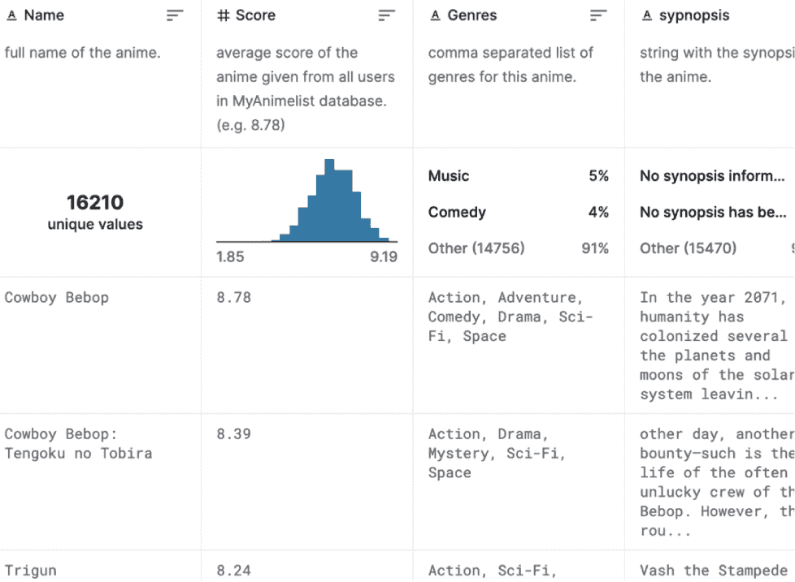
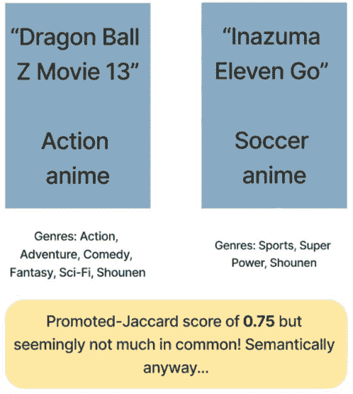
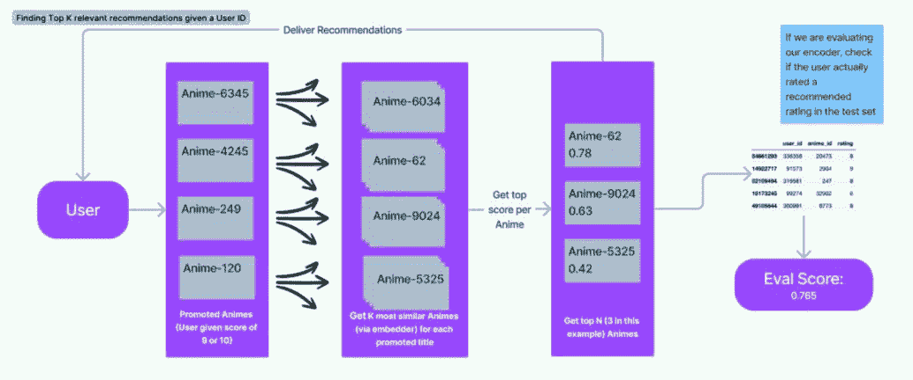
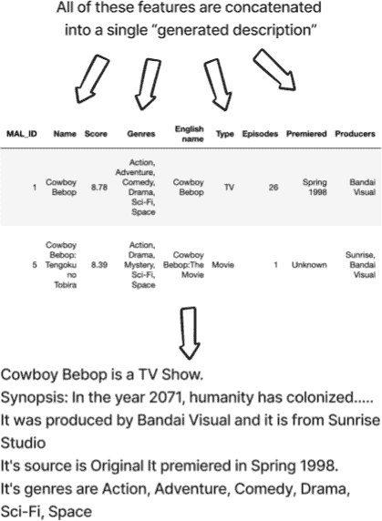
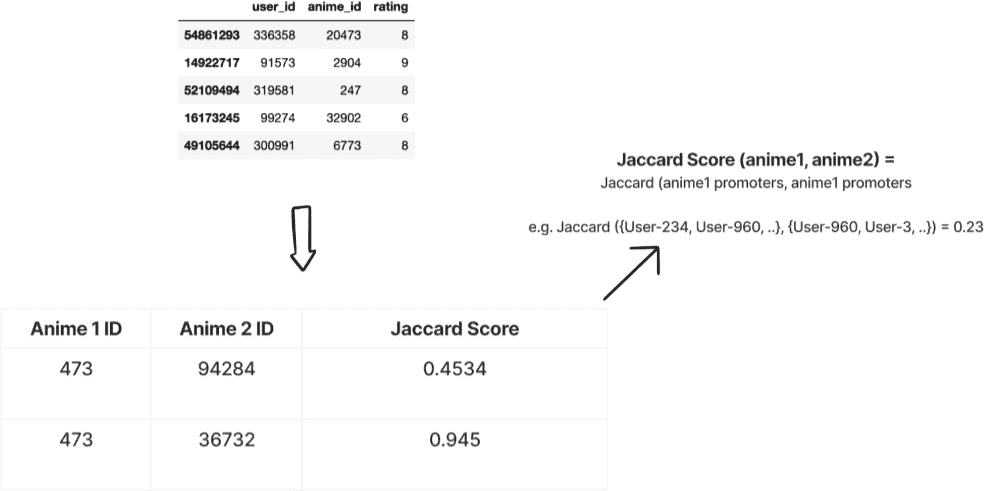
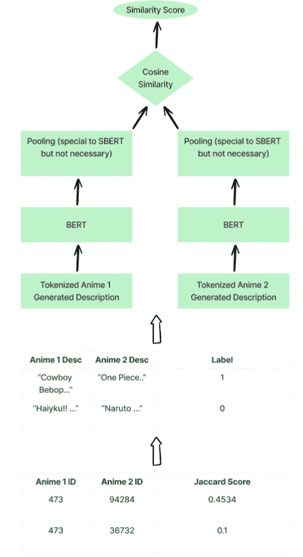
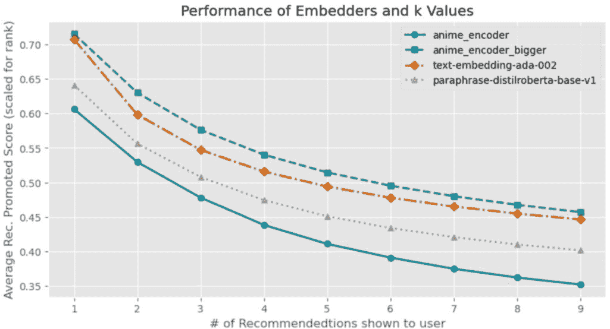
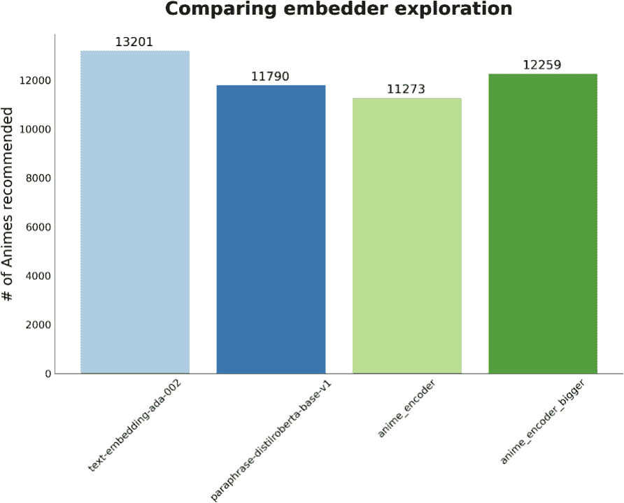

## 6

## 自定义嵌入和模型架构

### 引言

两章完整的提示工程使我们掌握了如何有效地与（提示）LLMs 互动的知识，承认它们巨大的潜力以及它们的局限性和偏见。我们还对开源和闭源模型进行了微调，以扩展 LLM 的预训练，以更好地解决我们自己的特定任务。我们甚至看到了一个完整的案例研究，展示了语义搜索和嵌入空间如何帮助我们快速、轻松地从数据集中检索相关信息。

为了进一步拓宽我们的视野，我们将利用前几章学到的经验，深入到微调嵌入模型和定制预训练 LLM 架构的世界，以在我们的 LLM 实现中解锁更大的潜力。通过完善这些模型的基础，我们可以满足特定的业务用例，并促进性能的改进。

基础模型虽然本身令人印象深刻，但可以通过对其架构进行从微小到重大的调整来适应和优化，以适应各种任务。这种定制化使我们能够应对独特的挑战，并将大型语言模型（LLMs）定制到特定的业务需求中。这些定制的底层嵌入构成了这些定制化的基础，因为它们负责捕捉数据点之间的语义关系，并且可以显著影响各种任务的成功。

回顾我们的语义搜索示例，我们确定 OpenAI 的原始嵌入是为了保留语义相似性而设计的，但双编码器进一步调整以适应非对称语义搜索，将短查询与较长的段落相匹配。在本章中，我们将扩展这一概念，探讨训练双编码器的技术，使其能够有效地捕捉其他商业用例。通过这样做，我们将揭示定制嵌入和模型架构以创建更强大、更通用的 LLM 应用程序的可能性。

### 案例研究 – 构建推荐系统

本章的大部分内容将探讨嵌入和模型架构在利用真实世界数据集作为案例研究来设计推荐引擎中的作用。我们的目标是强调定制嵌入和模型架构在实现更好性能和针对特定用例的结果方面的重要性。

#### 设置问题和数据

为了展示定制嵌入的力量，我们将使用 MyAnimeList 2020 数据集，该数据集可以在 Kaggle 上通过以下链接访问：MyAnimeList 2020 Dataset。该数据集包含有关动漫标题、评分（1-10 分）和用户偏好的信息，为构建推荐引擎提供了丰富的数据来源。图 6.1 显示了 Kaggle 页面上的数据集片段：



**图 6.1** *MyAnimeList 数据库是我们迄今为止工作过的最大数据集之一。它可以在 Kaggle 上找到，包含数千万行的评分和数千个动漫标题，每个动漫标题都有描述其的密集文本特征。*

为了确保对推荐引擎的评估公平，我们将数据集划分为独立的训练集和测试集。这个过程使我们能够在数据的一部分上训练我们的模型，并在另一部分未见过的数据上评估其性能，从而提供对其有效性的无偏评估。列表 6.1 展示了我们加载动漫标题并将它们拆分为训练和测试分割的代码片段。

**列表 6.1** *加载和拆分我们的动漫数据*

```py
# Load the anime titles with genres, synopsis, producers, etc
# there are 16,206 titles
pre_merged_anime = pd.read_csv('../data/anime/pre_merged_anime.csv')

# Load the ratings given by users who have **completed** an anime
# there are 57,633,278 ratings!
rating_complete = pd.read_csv('../data/anime/rating_complete.csv')

import numpy as np

# split the ratings into an 90/10 train/test split
rating_complete_train, rating_complete_test = \
              np.split(rating_complete.sample(frac=1, random_state=42), 
                       [int(.9*len(rating_complete))])
```

在加载数据并拆分后，让我们花些时间更好地定义我们实际上试图解决的问题。

#### 定义推荐问题

开发一个有效的推荐系统，简单地说，是一个复杂的工作。人类的行为和偏好可能很复杂，难以预测（千年之不足）。挑战在于理解和预测用户会发现什么吸引人或有兴趣，这受到众多因素的影响。

推荐系统需要考虑用户特征和项目特征来生成个性化的建议。用户特征可以包括人口统计信息，如年龄、浏览历史和过去的项目互动（这是我们本章工作的重点），而项目特征可以包括如类型、价格或流行度等特征。然而，仅凭这些因素可能无法描绘出完整的画面，因为人类情绪和环境也起着显著的作用，在塑造偏好方面。例如，用户对特定项目的兴趣可能会根据他们当前的情绪状态或一天中的时间而变化。

在推荐系统中，在探索和模式利用之间取得适当的平衡也很重要。通过模式利用，我指的是基于用户过去的偏好或与之前互动过的事物相似，系统有信心推荐用户可能会喜欢的项目，而探索则涉及建议用户之前可能没有考虑过的项目。这种平衡的取得确保用户在继续发现新内容的同时，仍然收到与其兴趣相符的推荐。我们将考虑这两个因素。

定义推荐问题是一个多方面的挑战，需要考虑各种因素，如用户和项目特征、人类情绪、要优化的推荐数量以及探索与利用之间的平衡。考虑到所有这些，让我们深入探讨！

##### 内容推荐与协同推荐

推荐引擎可以大致分为两种主要方法：基于内容和协同过滤。**基于内容的推荐**关注被推荐物品的属性，利用物品特征根据用户的过去互动向用户推荐类似的内容。相比之下，**协同过滤**利用用户的偏好和行为，通过识别具有相似兴趣或品味的用户之间的模式来生成推荐。

在基于内容的推荐中，系统从物品中提取相关特征，如类型、关键词或主题，为每个用户构建一个档案。这个档案有助于系统理解用户的偏好，并推荐具有相似特征的物品。例如，如果一个用户之前喜欢充满动作的动漫标题，基于内容的推荐引擎会建议其他具有类似动作元素的动漫系列。

另一方面，协同过滤可以进一步分为基于用户和基于物品的方法。基于用户的协同过滤寻找具有相似偏好的用户，并推荐那些用户喜欢或与之互动的物品。相反，基于物品的协同过滤则侧重于根据其他用户的互动来寻找与用户之前喜欢的物品相似的物品。在这两种情况下，基本原理是利用大众的智慧来做出个性化推荐。

在我们的案例研究中，我们计划微调一个双编码器（就像我们在第二章中看到的那样）来生成动漫特征的嵌入。我们的目标是最小化余弦相似度损失，使得嵌入之间的相似性反映了用户同时喜欢两个动漫的普遍程度。

在微调双编码器时，我们的目标是创建一个推荐系统，该系统能够根据推广者的偏好有效地识别相似的动漫标题，而不仅仅是它们在语义上相似。图 6.2 展示了这可能是什么样子。生成的嵌入将使我们的模型能够做出更可能与对内容热情的用户口味相符合的推荐。



**图 6.2** *嵌入器通常被预训练，以便在语义相似的情况下将嵌入数据放置在一起。在我们的案例中，我们希望嵌入器在**用户偏好**相似的情况下将嵌入数据放置在一起。*

在推荐技术方面，我们的方法结合了基于内容和协同推荐的两方面元素。我们通过使用每个动漫的特征作为双编码器的输入来利用基于内容方面的优势。同时，我们通过考虑推广者的 Jaccard 分数来结合协同过滤，该分数基于用户的偏好和行为。这种混合方法使我们能够利用两种技术的优势，创建一个更有效的推荐系统。

在这里追踪我们试图做什么时，我感到困惑。也许解释我们将如何构建这个嵌入器，以及它是如何结合协同过滤和语义相似性会有所帮助。我后来意识到，我们正在尝试将这个模型作为标签应用于协同过滤。

总结来说，我们的计划是：

1\. 定义/构建一个文本嵌入模型，要么直接使用，要么在用户偏好数据上微调。

2\. 定义一种混合方法，结合协同过滤（使用 Jaccard 分数定义用户/动漫相似度）和内容过滤（通过描述等手段的动漫标题语义相似度），这将影响我们的用户偏好数据结构以及我们根据管道给出的评分方式。

3\. 在用户偏好数据的训练集上微调开源的 LLM。

4\. 在用户偏好数据的测试集上运行我们的系统，以决定哪个嵌入器负责最佳的动漫标题推荐。

#### 我们推荐系统的 10,000 英尺视角

我们的推荐过程将根据用户的过去评分生成针对特定用户的个性化动漫推荐。以下是我们的推荐引擎步骤的解释：

1\. **输入**: 推荐引擎的输入是一个用户 ID 和一个整数 k（例如 3）。

2\. **识别高评分的动漫**: 对于用户评分 9 或 10（NPS 尺度上的推广评分）的每个动漫标题，通过在动漫嵌入空间中找到最近匹配项来识别 k 个其他相关动漫。在这些动漫中，我们考虑动漫被推荐的频率和在嵌入空间中的余弦分数，以取用户的前 k 个结果。图 6.3 概述了此过程。伪代码看起来可能如下：


**图 6.3** *步骤 2 接收用户信息并找到每个用户推广的动漫（评分 9 或 10）的 k 个动漫。例如，如果用户推广了 4 部动漫（6345, 4245, 249, 120）并且我们设置 k=3，系统将首先检索 12 部语义相似的动漫（每部推广动漫 3 部，允许重复），然后通过略微增加原始余弦分数的权重来去重任何出现多次的动漫。然后，我们考虑余弦分数和原始 12 部列表中出现的频率，取 k 个独特的推荐动漫标题。*

```py
given: user, k=3
promoted_animes = all anime titles that the user gave a score of 9 or a 10

relevant_animes = []
for each promoted_anime in promoted_animes:
    add k animes to relevant_animes with the highest cosine similiarty to promoted_anime along with the cosine score

# relevant_animes should now have k * (however many animes were in promoted_animes)

# Calculate a weighted score of each unique relevant anime given how many times it appears in the list and it’s similarity to promoted animes

final_relevant_animes = the top k animes with the highest weighted cosine/occurrence score
```

GitHub 上有运行此步骤的完整代码示例！例如，给定 k=3 和用户 ID `205282`，第二步的结果将产生以下字典，其中每个键代表一个不同的嵌入模型，值是动漫标题 ID 和对应于用户喜欢的推荐标题的余弦相似度分数：

```py
final_relevant_animes = {
  'text-embedding-ada-002': { '6351': 0.921, '1723': 0.908, '2167': 0.905 },
  'paraphrase-distilroberta-base-v1': { '17835': 0.594, '33970': 0.589,  '1723': 0.586 }
}
```

3. **评分相关动漫**：对于在之前步骤中识别出的每个相关动漫，如果该动漫不在该用户的测试集中，则忽略它。如果我们有用户在测试集中的动漫评分，我们将根据 NPS 启发的规则为推荐的动漫分配一个分数：

 如果用户和推荐的动漫在测试集中的评分是 9 或 10，则动漫被认为是“推广者”，系统获得+1 分。

 如果评分是 7 或 8，则动漫被认为是“被动”的，并获得 0 分。

 如果评分在 1 到 6 之间，则动漫被认为是“负面评论者”，并获得-1 分。

该推荐引擎的最终输出是按排名列出前 N 个（取决于我们希望向用户展示多少）动漫，以及系统在给定测试真实集的情况下表现如何的分数。图 6.4 以高层次展示了整个流程。



**图 6.4** *整体推荐过程涉及使用嵌入器从用户的已推广标题中检索相似动漫。然后，如果这些推荐在评分测试集中存在，则对它们分配一个分数。*

#### 生成用于比较项目的自定义描述字段

为了更有效地比较不同的动漫标题并生成推荐，我们将创建一个自定义生成的描述字段，该字段结合了数据集中的一些相关特征（如图 6.5 所示链接）。这种方法具有多个优点，使我们能够捕捉到每个动漫标题的更全面背景，从而实现内容的更丰富和更细腻的呈现。



**图 6.5** *我们为每个动漫创建的自定义描述结合了许多原始特征，包括标题、类型列表、简介、制作公司等。这种方法可能与许多开发者的想法相反，因为我们不是生成结构化的表格数据集，而是故意创建我们动漫标题的自然文本表示，并将让基于 LLM 的嵌入器以向量（表格）形式捕捉它。*

通过结合多个特征，如剧情摘要、角色描述和类型，我们可以创建每个动漫标题的多维表示，这允许我们的模型在比较标题和识别相似性时考虑更广泛的信息，从而实现更准确和有意义的推荐。

将数据集中的各种特征合并到一个描述字段中也有助于克服数据集中可能存在的潜在限制，如缺失或不完整的数据。通过利用多个特征的集体优势，我们确保我们的模型能够访问到一个更强大和多样化的信息集，并减轻单个标题缺失信息片段的影响。

此外，使用自定义生成的描述字段可以使我们的模型更有效地适应不同的用户偏好。一些用户可能更重视剧情元素，而其他人可能对类型或媒介（电视剧与电影）更感兴趣。通过在我们的描述字段中捕捉广泛的特征，我们可以满足多样化的用户偏好，并提供与个人口味相符合的个性化推荐。

总体而言，从多个个体字段创建我们自己的自定义描述字段的方法最终应该导致一个提供更准确和相关性内容建议的推荐引擎。列表 6.2 提供了生成这些描述所使用的代码片段。

**列表 6.2** *从多个动漫字段生成自定义描述*

```py
def clean_text(text):
    # Remove non-printable characters
    text = ''.join(filter(lambda x: x in string.printable, text))
    # Replace multiple whitespace characters with a single space
    text = re.sub(r'\s{2,}', ' ', text).strip()
    return text.strip()

def get_anime_description(anime_row):
    """
    Generates a custom description for an anime title based on various features from the input data.

    :param anime_row: A row from the MyAnimeList dataset containing relevant anime information.
    :return: A formatted string containing a custom description of the anime.
    """

...
    description = (
        f"{anime_row['Name']} is a {anime_type}.\n"
... #  NOTE I omitting over a dozen other rows here for brevity
        f"Its genres are {anime_row['Genres']}\n"
    )
    return clean_text(description)

# Create a new column in our merged anime dataframe for our new descriptions
pre_merged_anime['generated_description'] = pre_merged_anime.apply(get_anime_description, axis=1)
```

#### 使用基础嵌入器设置基线

在自定义我们的嵌入之前，我们将使用两个基础嵌入器来建立基线性能：OpenAI 强大的 Ada-002 嵌入器和基于蒸馏 RoBERTa 模型的小型开源双编码器。这些预训练模型为我们提供了一个比较的起点，帮助我们量化通过定制所取得的改进。我们将从这两个模型开始，最终逐步比较四个不同的嵌入器——1 个闭源和 3 个开源。

#### 准备我们的微调数据

为了尝试创建一个健壮的推荐引擎，我们将使用 Sentence Transformers 库对开源嵌入器进行微调。我们将首先计算训练集中推广动漫的 Jaccard 相似度。

**Jaccard 相似度**是一种基于两组数据共享元素数量来衡量它们之间相似度的简单方法。Jaccard 相似度是通过将两组共有的元素数量除以两组中所有不同元素的总数来计算的。

假设我们有两个动漫节目，动漫 A 和动漫 B。

假设我们有以下喜欢这些节目的人：

 喜欢动漫 A 的人：Alice、Bob、Carol、David

 喜欢动漫 B 的人：Bob、Carol、Ethan、Frank

要计算 Jaccard 相似度，我们首先找出同时喜欢动漫 A 和动漫 B 的人。在这个例子中，是 Bob 和 Carol。

接下来，我们找出喜欢动漫 A 或动漫 B 的不同人数。这里包括 Alice、Bob、Carol、David、Ethan 和 Frank。

现在，我们可以通过将共同元素的数量（2，因为 Bob 和 Carol 都喜欢这两个节目）除以总的不同元素数量（6，因为总共有 6 个独特的人）来计算 Jaccard 相似度。

Jaccard 相似度 = 2/6 = 1/3 ≈ 0.33

因此，基于喜欢它们的观众，动漫 A 和动漫 B 之间的 Jaccard 相似度约为 0.33 或 33%。这意味着 33%的喜欢任意一个节目的独特观众在动漫口味上有相似之处，因为他们都喜欢动漫 A 和动漫 B。图 6.6 显示了另一个例子。



**图 6.6** *为了将我们的原始评分转换为带有相关分数的动漫对，我们将考虑每个动漫标题的对，并计算促进用户的 Jaccard 分数。*

我们将应用这种逻辑，使用评分 DataFrame 的训练集计算每对动漫的 Jaccard 相似度，并且只保留高于一定阈值的分数作为“正面示例”（标签为 1），其余将被视为“负面”（标签为 0）。

重要提示：我们可以自由地将任何动漫对标记为介于-1 和 1 之间的任何标签，但我只使用 0 和 1，因为我只使用促进分数来创建我的数据，所以不能说如果动漫之间的 Jaccard 分数低，那么用户在动漫上完全不同意。这并不一定正确！如果我要扩展这个案例研究，我只想在用户真正对动漫进行相反评分的情况下，明确地将动漫标记为-1。

一旦我们有了动漫 ID 的 Jaccard 分数，我们需要将它们转换为包含动漫描述和余弦标签（在我们的案例中为 0 或 1）的元组，然后我们就可以更新我们的开源嵌入器并尝试不同的标记窗口（如图 6.7 所示）。



**图 6.7** *将 Jaccard 分数转换为余弦标签，然后输入到我们的双编码器中，以便它可能尝试学习生成的动漫描述和用户共同喜欢的标题之间的模式。*

一旦我们有了动漫对的 Jaccard 相似度，我们可以通过一个简单的规则将这些相似度转换为我们的双编码器的标签。在我们的例子中，如果分数高于 0.3，则将这对标签为正面（标签 1），如果标签小于 0.1，则将其标记为“负面”（标签 0）。

##### 调整模型架构

当使用开源嵌入器工作时，如果我们需要改变某些东西，我们拥有更多的灵活性。例如，我想使用的开源模型是预先训练的，一次只能接受 128 个标记，并且会截断任何超过这个长度的内容。图 6.8 显示了我们的生成动漫描述的标记长度直方图，它清楚地表明我们有很多描述超过 128 个标记，有些甚至达到 600 个标记！


**图 6.8** *我们有一些动漫，在标记化后长度达到数百个标记，其中一些超过 600 个标记。*

在列表 6.3 中，我们将输入序列长度更改为 384 而不是 128。

**列表 6.3** *修改开源双编码器的最大序列长度*

```py
from sentence_transformers import SentenceTransformer

# Load a pre-trained SBERT model
model = SentenceTransformer('paraphrase-distilroberta-base-v1')
model.max_seq_length = 384     # Truncate long documents to 384 tokens
model
```

为什么是 384？好吧：

 标记长度的直方图显示，384 将能够完全捕获我们的大部分动漫，并且会截断其余部分

 384 = 256 + 128，两个二进制数的和，我们喜欢二进制数——现代硬件组件，尤其是 GPU，被设计成以二进制数最优性能运行，这样它们可以平均分配工作负载。

 为什么不使用 512 来捕获更多的训练数据呢？我仍然想保持保守。我增加这个最大标记窗口大小的程度越大，我需要训练系统的数据就越多，因为我们正在向模型添加参数，因此有更多东西需要学习。这也会需要更多的时间和计算资源来加载、运行和更新更大的模型。

• 值得注意的是，我最初尝试使用 512 个嵌入大小进行这个过程，结果更差，同时在我的机器上花费了大约 20%的时间。

要明确的是，无论我们以何种方式修改原始预训练的基础模型，模型都必须从头开始学习。在这种情况下，模型将从头开始学习如何格式化超过 128 个标记的文本以及如何在较长的文本跨度内分配注意力分数。调整这些模型架构可能很困难，但通常在性能方面值得付出努力！在我们的案例中，将最大输入长度更改为 384 只是一个起点，因为现在这个模型必须学习关于超过 128 个标记的文本。

使用修改后的双编码器架构，数据准备就绪，我们可以准备微调了！

#### 使用 Sentence Transformers 微调开源嵌入器

是时候使用 Sentence Transformers 微调我们的开源嵌入器了。Sentence Transformers 作为一个提醒，是建立在 Hugging Face Transformers 库之上的库。

我们使用列表 6.4 中所示的 Sentence Transformers 库创建一个自定义训练循环。我们使用库提供的训练和评估功能，例如使用'fit()'方法进行训练和使用'evaluate()'方法进行验证。

在我们开始微调过程之前，我们需要决定几个超参数，例如学习率、批处理大小和训练轮数。我已经尝试了各种超参数设置，以找到导致最佳模型性能的良好组合。我将把第八章的全部内容用于讨论数十个开源微调超参数，所以如果你想要更深入地了解我是如何得到这些数字的，请参阅第八章。

我们通过检查余弦相似度的变化来衡量模型学习的好坏，相似度跃升至 0.8，0.9！这太棒了。

**列表 6.4** *微调双编码器*

```py
# Create a DataLoader for the examples
train_dataloader = DataLoader(
    train_examples,
    batch_size=16,
    shuffle=True
)

...

# Create a DataLoader for the validation examples
val_dataloader = DataLoader(
    all_examples_val,
    batch_size=16,
    shuffle=True
)

# Use the CosineSimilarityLoss from Sentence Transformers
loss = losses.CosineSimilarityLoss(model=model)

# Set the number of epochs for training
num_epochs = 5

# Calculate warmup steps using 10% of the training data
warmup_steps = int(len(train_dataloader) * num_epochs * 0.1)

# Create the evaluator using validation data
evaluator = evaluation.EmbeddingSimilarityEvaluator(
    val_sentences1,  # List of first anime descriptions in each pair from validation data
    val_sentences2,  # List of second anime descriptions in each pair from validation data
    val_scores       # List of corresponding cosine similarity labels for validation data
)

# get initial metrics
model.evaluate(evaluator)  # initial embedding similarity score: **0.0202**

# Configure the training process
model.fit(
    # Set the training objective with the train dataloader and loss function
    train_objectives=[(train_dataloader, loss)],
    epochs=num_epochs,  # set the number of epochs
    warmup_steps=warmup_steps,  # Set the warmup steps
    evaluator=evaluator,  # Set the evaluator for validation during training
    output_path="anime_encoder"  # Set the output path for saving the fine-tuned model
)

# get final metrics
model.evaluate(evaluator)  # final embedding similarity score:   **0.8628**
```

使用我们的微调双编码器，我们可以为新的动漫描述生成嵌入，并将它们与我们的现有动漫数据库中的嵌入进行比较。通过计算嵌入之间的余弦相似度，我们可以推荐与用户偏好最相似的动漫。

值得注意的是，一旦我们使用用户偏好数据微调了一个定制的嵌入器，我们就可以轻松地用具有相似架构的不同模型替换，并运行相同的代码，快速扩展我们的嵌入器选项集。对于这个案例研究，我还微调了另一个名为`all-mpnet-base-v2`的 LLM，它在撰写本文时被认为是非常好的开源嵌入器，用于语义搜索和聚类目的。它也是一个双编码器，因此我们可以简单地用 mpnet 替换对 Roberta 模型的引用，几乎不需要更改代码（请参阅 github 上的完整案例研究）。

#### 结果摘要

在这个案例研究的过程中，我们：

 使用原始数据集的几个原始字段生成了一个定制的动漫描述字段

 使用 NPS/Jaccard 评分和我们的生成描述的组合为用户动漫评分创建了一个双编码器的训练数据

 修改了开源架构以接受更大的标记窗口，以适应我们较长的描述字段。

 使用我们的训练数据微调了两个双编码器，试图创建一个将我们的描述映射到与用户偏好更一致的嵌入空间的模型

 使用 NPS 评分定义了一个评估系统，以奖励提升推荐（在测试中用户给出 9 或 10 分）并惩罚负面标题（在测试集中用户给出 1-6 分）

我们为嵌入器选定了四个候选者：

 `**text-embedding-002**` - OpenAI 推荐的适用于所有用例的嵌入器，主要优化语义相似度

 `**paraphrase-distilroberta-base-v1**` - 预训练用于总结短文本的开源模型

 `**anime_encoder**` - 经过修改的 384 标记窗口的 distilroberta 模型，并在我们的用户偏好数据上进行了微调

 `**anime_encoder_bigger**` - 一个更大的开源模型（`all-mpnet-base-v2`），它使用 512 个标记窗口大小进行预训练，我进一步在用户偏好数据上进行了微调，与`anime_encoder`相同。

图 6.9 显示了我们四个嵌入器候选人在延长推荐窗口（向用户展示多少个推荐）的最终结果。



**图 6.9** *我们更大的开源模型（anime_encoder_bigger）在根据历史偏好向用户推荐动漫标题方面，始终优于 OpenAI 的嵌入器。*

在这里 x 轴上的每个刻度代表向用户展示包含那么多动漫标题的列表，y 轴是使用之前概述的评分系统计算出的嵌入器的聚合分数，其中如果正确的推荐被放置在列表的前面，我们还会进一步奖励模型；如果它推荐了用户可能不喜欢的标题，我们则会更多地惩罚它。

一些有趣的发现：

 表现最好的模型是我们的更大规模的微调模型，并且它始终优于 OpenAI 的嵌入器！

 微调的 distilroberta 模型（anime_encoder）的表现不如它的预训练版本，后者一次只能处理 128 个 token。这很可能是由于：

 模型在它的注意力层中参数不足，无法很好地捕捉推荐问题，并且它的未微调的版本只是依赖于推荐语义上相似的电影标题。

 模型可能需要超过 384 个 token 来捕捉所有可能的关系。

 所有模型在推荐越来越多的标题时性能开始下降，这是预期的。任何推荐越多，它对列表中后面的推荐就越不自信。

##### 探索探索

我之前提到，推荐系统的“探索”水平可以定义为它推荐用户可能之前没有观看过的内容的频率。我们没有采取任何明确的措施来尝试鼓励探索，但仍然值得看看我们的嵌入器如何排列。图 6.10 显示了测试数据集中所有用户被推荐动漫的原始数量图。



**图 6.10** *比较在测试过程中推荐了多少独特的动漫。*

OpenAI 的 ada 和我们的更大编码器给出的推荐比其他两种选项多，但 OpenAI 在推荐独特动漫的多样性方面显然处于领先地位。这可能是一个迹象（不是证据），表明我们的用户并不那么喜欢探索，倾向于倾向于相同的动漫，并且我们的微调双编码器正在捕捉这一点，并产生较少的独特结果。这也可能仅仅是因为 OpenAI 的 ada 嵌入器在如此多样化的数据集上进行了训练，并且在参数方面如此之大，因此在提供大量受欢迎的动漫方面比我们的微调模型更好。

为了回答这些问题以及更多，我们希望通过以下方式继续我们的研究，例如我们可以：

 尝试新的开源模型和闭源模型

 设计新的质量保证指标，以更全面地测试我们的嵌入器

 计算使用其他指标（如相关系数）而不是贾卡德系数的新训练数据集

 切换推荐系统超参数，如 K。我们之前只考虑了抓取每个推广动漫的前 K=3 部动漫，但如果我们让这个数字也变化会怎样呢？

 在关于动漫推荐和理论的博客和维基上运行一些预训练，以便模型能够获取一些关于如何考虑推荐的信息

实际上，最后一个目标有点不切实际，如果我们还能结合一些不同 LLM 上的思维链提示，那将更加完美。但无论如何，这是一个大问题，有时这意味着我们需要大想法和大答案。所以现在就交给你了；去发挥你的想象力吧！

### 结论

在本章中，我向你展示了为特定用例微调开源嵌入模型的过程，在我们的案例中，是根据用户的以往偏好生成高质量的动漫推荐。通过比较我们定制模型与 OpenAI 的嵌入器的性能，我们发现微调模型能够持续优于 OpenAI 的嵌入器。

为特定任务定制嵌入模型及其架构可以提高性能，并提供一种可行的替代方案，尤其是在可以访问标记数据和实验资源的情况下，尤其是当可以访问标记数据和实验资源时。

我希望我们微调模型在推荐动漫标题方面的成功能够证明开源模型所提供的力量和灵活性，为进一步的探索、实验和应用于你可能会有的任何任务铺平道路。
