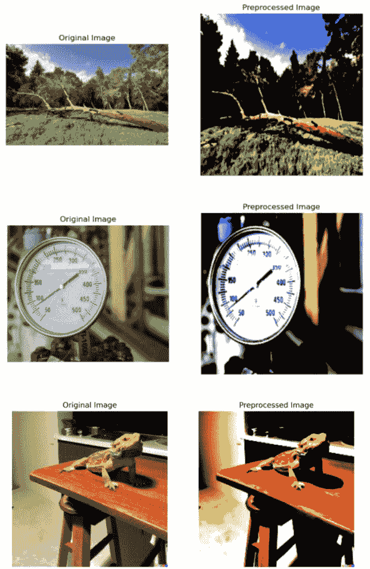
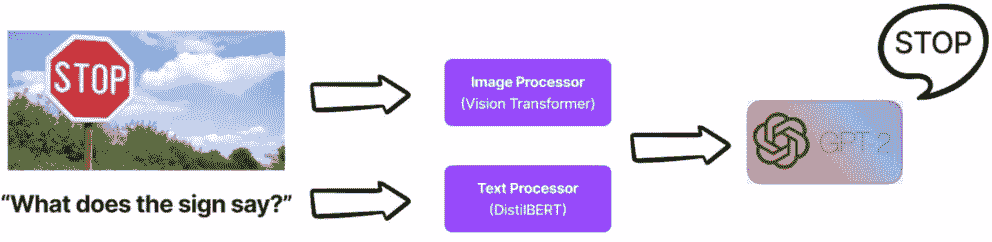
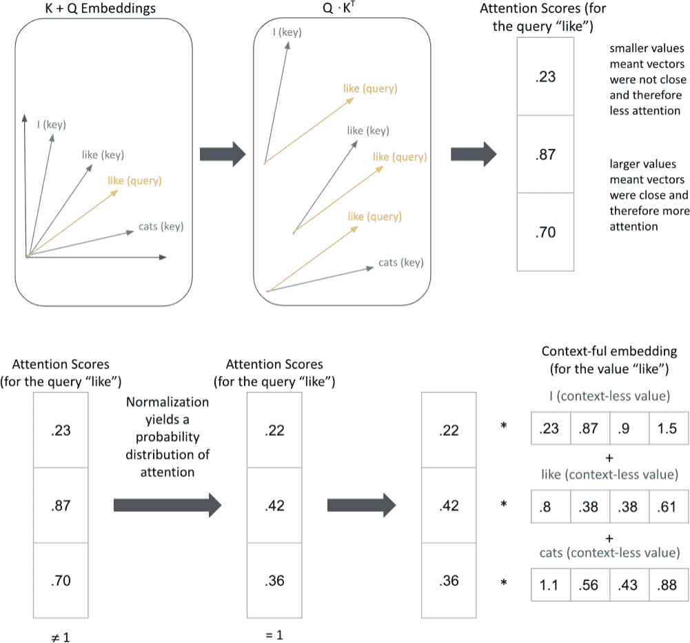
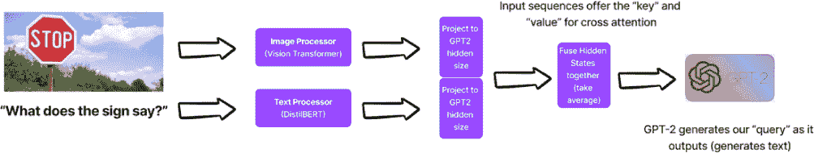
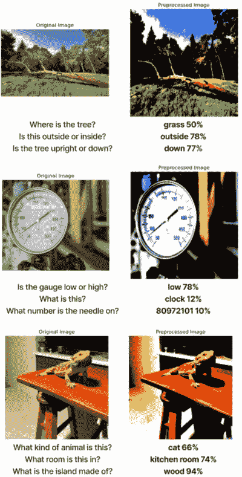
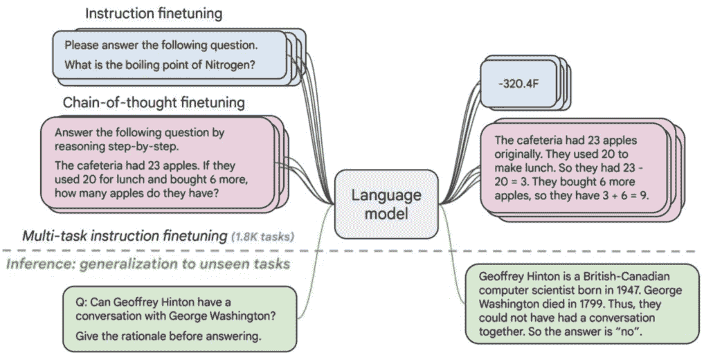
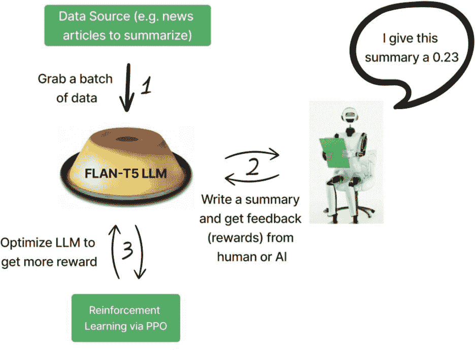
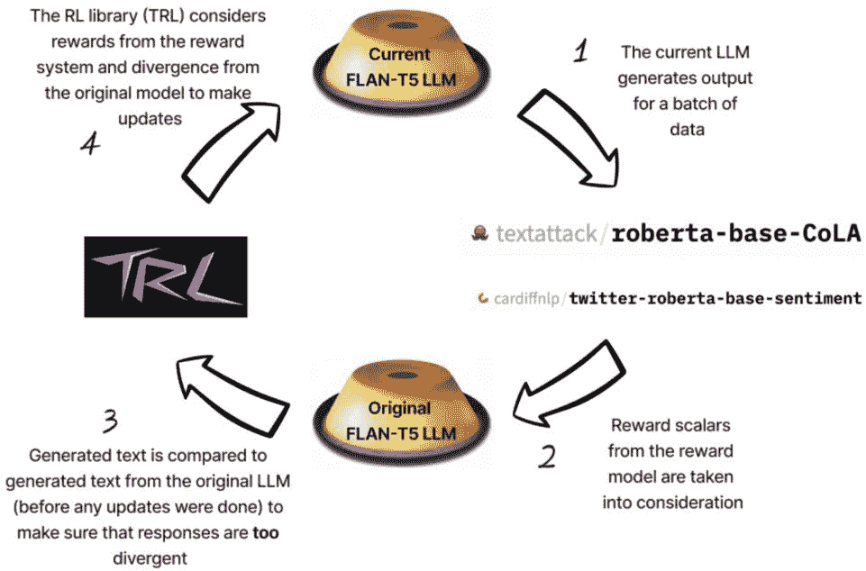
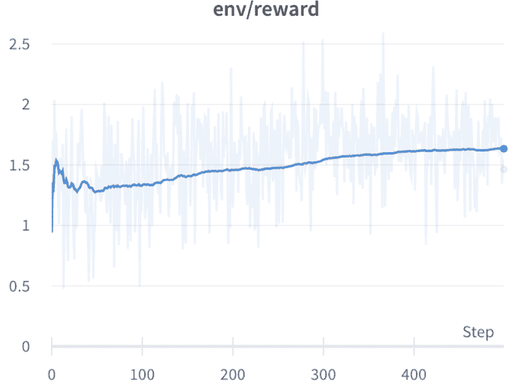
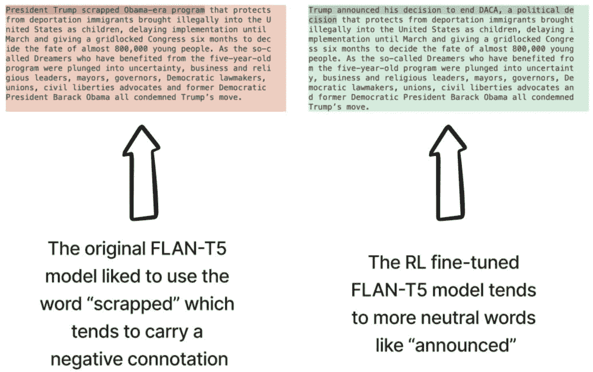

## 7

## 超越基础模型

### 引言

在我们之前的章节中，我们专注于使用或微调现有的预训练模型，如 BERT，来解决各种自然语言处理和计算机视觉任务。虽然这些模型在广泛的基准测试中展示了最先进的性能，但它们可能不足以解决更复杂或特定领域的任务，这些任务需要更深入地理解问题。

在本章中，我们探讨了通过结合现有模型来构建新颖的 LLM 架构的概念。通过结合不同的模型，我们可以利用它们的优势来创建一个混合架构，该架构的性能可能优于单个模型，或者简单地解决以前不可能的任务。

我们将构建一个视觉问答系统（VQA），结合 BERT 的文本处理能力、视觉变换器的图像处理能力（是的，这些确实存在），以及开源的 GPT-2 的文本生成能力，来解决复杂的视觉推理任务。我们还将探索强化学习领域以及它是如何被用来微调预训练的 LLMs 的。让我们深入探讨，怎么样？

### 案例研究——视觉问答

**视觉问答** (VQA) 是一项具有挑战性的任务，需要理解和推理图像和自然语言（如图 7.1 所示）。给定一张图像和与之相关的问题，目标是生成一个文本响应，正确回答问题。我在第五章（ch05.html#ch05）中通过一个提示链示例展示了使用预训练的 VQA 系统的简要示例，但现在我们将要自己动手！


**图 7.1** 一个视觉问答系统（VQA）通常接受两种（类型）数据 - 图像和文本 - 并将返回一个人类可读的答案。这张图概述了处理此问题的一种最基本的方法，其中图像和文本分别由不同的编码器编码，最终层预测一个单词作为答案。

在本节中，我们专注于如何使用现有模型和技术构建 VQA+LLM 系统。我们首先介绍用于此任务的基础模型：BERT、ViT 和 GPT-2。然后我们探索如何结合这些模型来创建一个能够处理文本和视觉输入并生成连贯文本输出的混合架构。

我们还展示了如何使用专门为 VQA 任务设计的特定数据集来微调模型。我们使用了 VQA v2.0 数据集，其中包含大量图像以及关于图像的自然语言问题和相应的答案。我们解释了如何为此数据集准备训练和评估，以及如何使用该数据集来微调模型。

#### 我们模型的介绍 - 视觉变换器和 GPT2，以及 DistilBERT

在本节中，我们介绍了我们将用于构建的多模态系统中的三个基础模型：视觉 Transformer、GPT-2 和 DistilBERT。这些模型虽然目前不是最先进的，但它们无疑是强大的 LLM，并且在各种自然语言处理和计算机视觉任务中得到了广泛应用。还值得注意的是，当我们考虑与 LLM 一起工作时，我们并不总是需要选择顶级的 LLM，因为它们往往更大且使用起来较慢。有了合适的数据和动机，我们可以让较小的 LLM 在我们的特定用例中同样有效。

##### 我们的文本处理器 - DistilBERT

DistilBERT 是 BERT 流行模型的蒸馏版本，经过优化以提高速度和内存效率。它是一个预训练模型，使用知识蒸馏将知识从较大的 BERT 模型转移到较小且更高效的模型。这使得它运行更快，消耗更少的内存，同时仍然保留了较大模型的大部分性能。

由于迁移学习，DistilBERT 在训练期间应该具备语言先验知识，这有助于提高准确理解自然语言文本。

##### 我们的形象处理器——视觉 Transformer

视觉 Transformer 是一种基于 Transformer 的架构，专门设计用于图像理解。它是一个使用自注意力机制从图像中提取相关特征的模型。这是一个近年来获得流行的新模型，并在各种计算机视觉任务中显示出有效性。

视觉 Transformer（ViT）已经在名为 ImageNet 的图像数据集上进行了预训练，就像 BERT 一样，因此应该具备图像结构的先验知识，这有助于训练。这允许它以高精度理解和提取图像中的相关特征。

我们应该注意，当我们使用 ViT 时，我们应该尽量使用它在预训练期间使用的相同图像预处理步骤，以便模型更容易学习新的图像集。这并非绝对必要，并且有其优点和缺点。

重复使用相同预处理步骤的优点：

1. **与预训练的一致性**：使用与预训练期间相同格式和分布的数据可以导致更好的性能和更快的收敛。

2. **利用先验知识**：由于模型已经在大型数据集上进行了预训练，它已经学会了从图像中提取有意义的特征。使用相同的预处理步骤允许模型有效地将这种先验知识应用于新数据集。

3. **改进的泛化能力**：如果预处理步骤与其预训练一致，则模型更有可能很好地泛化到新数据，因为它已经看到了广泛的各种图像结构和特征。

重复使用相同预处理步骤的缺点：

1. **灵活性有限**：重用相同的预处理步骤可能会限制模型适应新的数据分布或新数据集的特定特征的能力，这可能需要不同的预处理技术以实现最佳性能。

2. **与新数据的不兼容性**：在某些情况下，新的数据集可能具有独特的属性或结构，这些属性或结构不适合原始的预处理步骤，如果不相应地调整预处理步骤，可能会导致性能不佳。

3. **过度拟合预训练数据**：过度依赖相同的预处理步骤可能会使模型过度拟合预训练数据的特定特征，从而降低其泛化到新的和多样化的数据集的能力。

我们现在将重用 ViT 图像预处理程序。图 7.2 显示了预处理前后的图像样本。



**图 7.2** *像 Vision Transformer (ViT)这样的图像系统通常必须将图像标准化为具有预定义归一化步骤的特定格式，以便尽可能公平和一致地处理每个图像。对于某些图像（如顶行中的倒下的树）来说，图像预处理实际上是以标准化所有图像为代价来消除上下文的。*

##### 我们的文本解码器 - GPT2

GPT-2 是 OpenAI 的 GPT-3 的前身（可能很明显），但更重要的是，它是一个开源的生成语言模型，在大量的文本数据语料库上进行了预训练。GPT-2 在约 40 GB 的数据上进行了预训练，因此也应该具备在训练期间帮助的词汇先验知识，这再次归功于迁移学习。

这三个模型的组合——DistilBERT 用于文本处理，Vision Transformer 用于图像处理，GPT-2 用于文本解码——将为我们多模态系统的基础，如图 7.3 所示。图 7.3 展示了这些模型都具有先验知识，我们将依赖迁移学习的能力，使它们能够有效地处理和生成针对复杂自然语言和计算机视觉任务的非常准确和相关的输出。



**图 7.3** *一个 VQA 系统可以将其最终的单一标记预测层替换为一个完全独立的语言模型，例如开源的 GPT2。我们将要构建的 VQA 系统有三个基于 transformer 的模型并行工作，以解决一个虽然非常具有挑战性的任务。*

#### 隐藏状态投影和融合

当我们将文本和图像输入分别输入到它们各自的模式（DistilBERT 和 Vision Transformer）中时，它们会产生包含输入有用特征表示的输出张量。然而，这些特征不一定具有相同的格式，并且它们可能具有不同的维度。

为了解决这个问题，我们使用线性投影层将文本和图像模型的输出张量投影到一个共享的维度空间。这使得我们能够有效地融合从文本和图像输入中提取的特征。共享的维度空间使得将文本和图像特征（在我们的情况下是通过平均它们）结合起来，并将它们输入到解码器（GPT-2）以生成一个连贯且相关的文本响应成为可能。

但 GPT-2 将如何接受来自编码模型的这些输入呢？答案是称为交叉注意力的一种注意力机制。

#### 交叉注意力：它是什么，为什么它至关重要？

交叉注意力是允许我们的多模态系统学习我们的文本和图像输入以及我们想要生成的输出文本之间交互的机制。它是基本变换器架构的一个关键组件，允许它有效地将输入信息结合到输出中（这是序列到序列模型的特点）。交叉注意力计算实际上与自注意力相同，但是在两个不同的序列之间而不是单个序列之间。在交叉注意力中，输入序列（或在我们的情况下是结合的序列，因为我们将输入文本和图像）将作为键和值输入（这将是从图像和文本编码器中查询的组合），而输出序列则作为查询输入（我们的文本生成器 GPT-2）

##### 注意力机制中的查询、键和值

注意力的三个内部组件——查询、键和值——在这本书中之前并没有真正出现，因为坦白地说，我们并没有真正需要理解它们为什么存在，我们只是依赖于它们为我们学习数据中的模式的能力，但现在是我们更深入地了解这些组件如何相互作用的时候了，这样我们才能完全理解交叉注意力是如何工作的。

在由变换器使用的自注意力机制中，查询、键和值是三个对于确定序列中每个输入标记相对于其他标记的重要性至关重要的组件。查询代表我们想要计算注意力权重的标记，而键和值代表序列中的其他标记。注意力分数是通过计算查询和键的点积，通过归一化因子进行缩放，然后乘以值来创建一个加权总和。

用更简单的话说，查询被用来从其他标记中提取相关信息，这是由注意力分数确定的。键有助于识别哪些标记与查询相关，而值提供相应的信息。这可以在图 7.4 中可视化。



**图 7.4** *这两张图像显示了输入“我喜欢猫”中单词“喜欢”的缩放点积注意力值。每个输入到基于 Transformer 的 LLM 的标记都有一个相关的“查询”、“键”和“值”表示。缩放点积注意力计算通过将键标记（顶部）的点积与每个查询标记生成注意力分数，然后使用这些分数通过适当的加权（底部）来上下文化值标记，从而为输入中的每个标记生成一个最终向量，该向量现在了解输入中的其他标记以及它应该对它们投入多少注意力。在这种情况下，标记“喜欢”应该将 22%的注意力投入到标记“I”上，42%的注意力投入到自身（是的，标记需要投入注意力——坦白地说，我们所有人都是如此——因为它们是序列的一部分，因此提供上下文），以及 36%的注意力投入到单词“猫”上。*

在交叉注意力中，查询、键和值矩阵服务于稍微不同的目的。在这种情况下，查询代表一个模态的输出（例如，文本），而键和值代表另一个模态的输出（例如，图像）。交叉注意力用于计算注意力分数，以确定在处理另一个模态时给予一个模态输出的重要程度。

在一个多模态系统中，交叉注意力计算表示文本和图像输入之间相关性的注意力权重（请参阅图 7.5）。查询是文本模型的输出，而键和值是图像模型的输出。通过将查询和键之间的点积与归一化因子缩放来计算注意力分数。然后，将得到的注意力权重乘以值以创建加权总和，该总和被用于生成一个连贯且相关的文本响应。列表 7.1 显示了我们的三个模型的隐藏状态大小。



**图 7.5** *我们的 VQA 系统需要融合图像编码器和文本编码器编码的知识，并通过交叉注意力机制将融合传递给 GPT-2 模型，该机制将使用来自图像和文本编码器的融合键和值向量（有关更多信息，请参阅图 7.4）并将其传递给我们的解码器 GPT-2，以用于缩放其自身的注意力计算。*

**列表 7.1** *揭示 LLMs 的隐藏状态*

```py
# Load the text encoder model and print the hidden size (number of hidden units) in its configuration
print(AutoModel.from_pretrained(TEXT_ENCODER_MODEL).config.hidden_size)

# Load the image encoder model (using the Vision Transformer architecture) and print the hidden size in its configuration
print(ViTModel.from_pretrained(IMAGE_ENCODER_MODEL).config.hidden_size)

# Load the decoder model (for causal language modeling) and print the hidden size in its configuration
print(AutoModelForCausalLM.from_pretrained(DECODER_MODEL).config.hidden_size)

# 768
# 768
# 768

```

在我们的案例中，所有模型都具有相同的隐藏状态大小，因此从理论上讲，我们不需要投影任何东西，但仍然是一个好的实践来包含投影层，这样模型就有一个可训练的层，将我们的文本/图像表示转换为对解码器更有意义的表示。

首先，我们的交叉注意力注意力参数将需要初始随机化，并在训练过程中进行学习。在训练过程中，模型学会为相关特征分配更高的注意力权重，同时过滤掉不相关的特征。这样，系统可以更好地理解文本和图像输入之间的关系，并生成更相关、更准确的文本响应。通过为相关特征分配更高的注意力权重并过滤掉不相关的特征，我们的系统可以更好地理解文本和图像输入之间的关系，生成更准确、更相关的文本响应。

在有了交叉注意力、融合以及我们手头的模型的想法之后，让我们继续定义一个多模态架构。

#### 我们的定制多模态模型

在深入代码之前，我应该指出，支撑这个示例的并非所有代码都包含在这些页面中，但所有代码都生活在 github 上的笔记本中。我强烈推荐您使用两种方式来跟随！

当创建一个新的 PyTorch 模块（我们正在做）时，我们需要定义的主要方法是构造函数(__init__)，它将实例化我们的三个 Transformer 模型，并可能冻结层以加快训练速度（更多内容将在下一章中介绍）以及**forward**方法，该方法将接受输入和可能的标签以生成输出和损失值（记住损失与错误相同，越低越好）。forward 方法将以下作为输入：

 **input_ids**：一个包含文本标记输入 ID 的张量。这些 ID 由分词器根据输入文本生成。张量的形状为[batch_size, sequence_length]。

 **attention_mask**：一个与 input_ids 形状相同的张量，指示哪些输入标记应该被关注（值为 1）以及哪些应该被忽略（值为 0）。这主要用于处理输入序列中的填充标记。

 **decoder_input_ids**：一个包含解码器标记输入 ID 的张量。这些 ID 由分词器根据目标文本生成，在训练期间作为解码器的提示使用。训练期间张量的形状为[batch_size, target_sequence_length]，但在推理时间将只是一个起始标记，因此模型将不得不生成其余部分。

 **image_features**：一个包含每个样本预处理图像特征的张量。张量的形状为[batch_size, num_features, feature_dimension]。

 **labels**：一个包含目标文本真实标签的张量。张量的形状为[batch_size, target_sequence_length]。这些标签用于训练期间计算损失，但在推理时间不存在，因为如果我们有标签，那么我们就不需要这个模型了！

列表 7.2 展示了从我们三个基于 Transformer 的模型（BERT、ViT 和 GPT2）创建自定义模型的代码片段。当然，完整的类可以在仓库中找到，供您复制粘贴使用。

**列表 7.2** *我们多模态模型的一个片段*

```py
class MultiModalModel(nn.Module):
    ...

    # Freeze the specified encoders or decoder
    def **freeze**(self, freeze):
        ...
        # Iterate through the specified components and freeze their parameters
        if freeze in ('encoders', 'all') or 'text_encoder' in freeze:
            ...
            for param in self.text_encoder.parameters():
                param.requires_grad = False

        if freeze in ('encoders', 'all') or 'image_encoder' in freeze:
            ...
            for param in self.image_encoder.parameters():
                param.requires_grad = False

        if freeze in ('decoder', 'all'):
            ...
            for name, param in self.decoder.named_parameters():
                if "crossattention" not in name:
                    param.requires_grad = False

    # Encode the input text and project it into the decoder's hidden space
    def **encode_text**(self, input_text, attention_mask):
        # Check input for NaN or infinite values
        self.check_input(input_text, "input_text")

        # Encode the input text and obtain the mean of the last hidden state
        text_encoded = self.text_encoder(input_text, attention_mask=attention_mask).last_hidden_state.mean(dim=1)

        # Project the encoded text into the decoder's hidden space
        return self.text_projection(text_encoded)

    # Encode the input image and project it into the decoder's hidden space
    def **encode_image**(self, input_image):
        # Check input for NaN or infinite values
        self.check_input(input_image, "input_image")

        # Encode the input image and obtain the mean of the last hidden state
        image_encoded = self.image_encoder(input_image).last_hidden_state.mean(dim=1)

        # Project the encoded image into the decoder's hidden space
        return self.image_projection(image_encoded)

    # Forward pass: encode text and image, combine encoded features, and decode with GPT-2
    def **forward**(self, input_text, input_image, decoder_input_ids, attention_mask, labels=None):
        # Check decoder input for NaN or infinite values
        self.check_input(decoder_input_ids, "decoder_input_ids")

        # Encode text and image
        text_projected = self.encode_text(input_text, attention_mask)
        image_projected = self.encode_image(input_image)

        # Combine encoded features
        combined_features = (text_projected + image_projected) / 2

        # Set padding token labels to -100 for the decoder
        if labels is not None:
            labels = torch.where(labels == decoder_tokenizer.pad_token_id, -100, labels)

        # Decode with GPT-2
        decoder_outputs = self.decoder(
            input_ids=decoder_input_ids,
            labels=labels,
            encoder_hidden_states=combined_features.unsqueeze(1)
        )
        return decoder_outputs

    ...
```

在定义并适当调整了交叉注意力模型后，让我们看看将驱动我们引擎的数据。

#### 我们的数据——视觉问答

我们的数据集来自 [`visualqa.org`](https://visualqa.org)，如图 7.6 所示。该数据集包含关于图像的开放式问题对，并附有人工标注的答案。该数据集旨在产生需要理解视觉、语言以及一点点常识知识才能回答的问题。


**图 7.6** *VisualQA.org 网站有一个包含关于图像开放式问题的数据集。*

##### 为我们的模型解析数据集

列表 7.3 展示了我编写的一个函数，用于解析图像文件并创建一个我们可以与 HuggingFace 的 Trainer 对象一起使用的数据集。

**列表 7.3** *解析视觉问答文件*

```py
# Function to load VQA data from the given annotation and question files
def load_vqa_data(annotations_file, questions_file, images_folder, start_at=None, end_at=None, max_images=None, max_questions=None):
    # Load the annotations and questions JSON files
    with open(annotations_file, "r") as f:
        annotations_data = json.load(f)
    with open(questions_file, "r") as f:
        questions_data = json.load(f)

    data = []
    images_used = defaultdict(int)
    # Create a dictionary to map question_id to the annotation data
    annotations_dict = {annotation["question_id"]: annotation for annotation in annotations_data["annotations"]}

    # Iterate through questions in the specified range
    for question in tqdm(questions_data["questions"][start_at:end_at]):
        ...
        # Check if the image file exists and has not reached the max_questions limit
        ...

        # Add the data as a dictionary
        data.append(
            {
                "image_id": image_id,
                "question_id": question_id,
                "question": question["question"],
                "answer": decoder_tokenizer.bos_token + ' ' + annotation["multiple_choice_answer"]+decoder_tokenizer.eos_token,
                "all_answers": all_answers,
                "image": image,
            }
        )
        ...
        # Break the loop if the max_images limit is reached
        ...

    return data

# Load training and validation VQA data
train_data = load_vqa_data(
    "v2_mscoco_train2014_annotations.json", "v2_OpenEnded_mscoco_train2014_questions.json", "train2014",
) 
val_data = load_vqa_data(
    "v2_mscoco_val2014_annotations.json", "v2_OpenEnded_mscoco_val2014_questions.json", "val2014"
)

from datasets import Dataset

train_dataset = Dataset.from_dict({key: [item[key] for item in train_data] for key in train_data[0].keys()})

# Optionally save the dataset to disk for later retrieval
train_dataset.save_to_disk("vqa_train_dataset")

# Create Hugging Face datasets
val_dataset = Dataset.from_dict({key: [item[key] for item in val_data] for key in val_data[0].keys()})

# Optionally save the dataset to disk for later retrieval
val_dataset.save_to_disk("vqa_val_dataset")
```

#### VQA 训练循环

训练不会与之前我们做过的有很大不同。说实话，大部分的艰苦工作是在我们的数据解析中完成的。我们可以使用 HuggingFace Trainer 和 TrainingArguments 对象以及我们的自定义模型，训练将简单归结为期望我们的验证损失下降。完整的代码可以在我们的仓库中找到，其中片段可以在 列表 7.4 中找到。

**列表 7.4** *VQA 训练循环*

```py
# Define the model configurations
DECODER_MODEL = 'gpt2'
TEXT_ENCODER_MODEL = 'distilbert-base-uncased'
IMAGE_ENCODER_MODEL = "facebook/dino-vitb16"  # A version of ViT from Facebook

# Initialize the MultiModalModel with the specified configurations
model = MultiModalModel(
    image_encoder_model=IMAGE_ENCODER_MODEL, 
    text_encoder_model=TEXT_ENCODER_MODEL,
    decoder_model=DECODER_MODEL, 
    freeze='nothing'
)

# Configure training arguments
training_args = TrainingArguments(
    output_dir=OUTPUT_DIR,
    optim='adamw_torch',
    num_train_epochs=1,
    per_device_train_batch_size=16,
    per_device_eval_batch_size=16,
    gradient_accumulation_steps=4,
    evaluation_strategy="epoch",
    logging_dir="./logs",
    logging_steps=10,
    fp16=device.type == 'cuda',  # this saves memory on GPU-enabled machines
    save_strategy='epoch'
)

# Initialize the Trainer with the model, training arguments, and datasets
Trainer(
    model=model,
    args=training_args,
    train_dataset=train_dataset,
    eval_dataset=val_dataset,
    data_collator=data_collator
)
```

这个例子中有很多代码，所以我再次强烈建议您在 GitHub 上的笔记本中跟随，以获取完整的代码和注释！

#### 结果总结

图 7.7 展示了几个问题被问到的图像样本。请注意，一些回答不止一个标记，这是与标准 VQA 系统输出单个标记相比，拥有 LLM 作为解码器的直接好处。



**图 7.7** *尽管我们使用了相当小的模型（就参数数量而言，尤其是与今天被认为是最佳实践相比），但我们的 VQA 系统在回答关于图像的样本问题方面表现并不差。每个百分比都是 GPT-2 在回答给定问题时生成的聚合标记预测概率。显然，它在某些问题上犯了错误，并且随着更多的训练和数据，我们可以进一步减少错误！*

但这只是一个数据样本，并不能全面地展示性能。为了展示我们的模型训练过程，图 7.8 显示了在仅经过一个训练周期后，我们的语言模型损失值发生了剧烈变化。


**图 7.8** *经过仅一个 epoch 后，我们的 VQA 系统在验证损失上出现了大幅下降，这真是太好了！*

我们的模式远非完美，在它真正被认为是行业领先之前，还需要一些更先进的训练策略和大量的数据。但你知道吗？免费的数据，免费的模式，以及（主要是）我自己的笔记本电脑的免费计算能力产生了一个相当不错的 VQA 系统。

让我们暂时放下纯语言建模和图像处理的想法，进入使用其强大的表亲——强化学习来微调语言模型的新颖方式的世界。

### 案例研究——基于反馈的强化学习

我们在这本书中一次又一次地见证了语言模型令人瞩目的能力，通常我们处理的是相对客观的任务，如分类，而当任务更加主观，如语义检索和动漫推荐时，我们不得不花些时间去定义一个客观的定量指标来指导模型的微调和整体系统性能。一般来说，定义什么构成“好的”输出文本可能具有挑战性，因为它往往是主观的，并且与任务/上下文相关。不同的应用可能需要不同的“好的”属性，例如，故事讲述中的创造力，摘要中的可读性，或代码片段中的代码功能。

当我们微调 LLM 时，我们必须设计一个损失函数来指导训练，但设计一个能够捕捉这些更主观属性的损失函数似乎难以实现，而大多数语言模型仍然使用简单的下一个标记预测损失（自回归语言建模）进行训练，例如交叉熵。至于输出评估，有一些指标是为了更好地捕捉人类偏好而设计的，如 BLEU 或 ROUGE；然而，这些指标仍然存在局限性，因为它们仅使用简单的规则和启发式方法将生成的文本与参考文本进行比较。我们可以使用嵌入相似度来比较输出与真实序列，但这只考虑了语义信息，而这并不是我们总是需要比较的唯一事物。我们可能还想考虑文本的风格，例如。

如果我们能够使用实时反馈（人工或自动化）来评估生成的文本作为性能指标，甚至作为优化模型的损失函数，那会怎么样？你可能已经看到了这个趋势，因为这就是**基于反馈的强化学习**（RLHF 用于人类反馈，RLAIF 用于 AI 反馈）发挥作用的地方。通过采用强化学习方法，RLF 可以直接使用实时反馈来优化语言模型，使得在通用文本数据集上训练的模型能够更紧密地与细微的人类价值观对齐。

ChatGPT 是 RLHF（基于人类反馈的强化学习）的第一个显著应用之一，虽然 OpenAI 提供了一个令人印象深刻的 RLHF 解释，但它并没有涵盖所有内容，所以我会填补这些空白。

训练过程基本上可以分为三个核心步骤（如图 7.9 所示）：


**图 7.9** *基于强化学习的 LLM 训练的核心步骤包括预训练 LLM、定义和可能训练奖励模型，并使用该奖励模型从步骤 1 更新 LLM*。

1. **预训练语言模型** - 预训练语言模型涉及在大量文本数据集上训练模型，如文章、书籍和网站，甚至可以是精心挑选的数据集。在这个阶段，模型学习为通用语料库或服务于特定任务生成文本。这个过程有助于模型从文本数据中学习语法、句法和一定程度的语义。预训练期间使用的目标函数通常是交叉熵损失，它衡量预测标记概率与真实标记概率之间的差异。预训练使模型能够获得语言的基础理解，这可以后来针对特定任务进行微调。

2. **定义（可能训练）奖励模型** - 在预训练语言模型之后，下一步是定义一个可以用来评估生成文本质量的奖励模型。这涉及到收集人类反馈，如对不同文本样本的排名或评分，这些可以用来创建一个人类偏好数据集。奖励模型的目的是捕捉这些偏好，并且可以作为一个监督学习问题进行训练，其目标是学习一个将生成文本映射到表示文本质量的奖励信号（一个标量值）的函数。奖励模型作为人类评估的代理，在强化学习阶段用于指导微调过程。

3. **使用强化学习微调 LM** - 在预训练语言模型和奖励模型就绪后，最后一步是使用强化学习技术微调语言模型。在这个阶段，模型生成文本，从奖励模型接收反馈，并根据奖励信号更新其参数。目标是优化语言模型，使生成的文本与人类偏好紧密一致。在此背景下常用的强化学习算法包括近端策略优化（PPO）和信任区域策略优化（TRPO）。使用强化学习进行微调使模型能够适应特定任务，并生成更好地反映人类价值观和偏好的文本。

我们将在下一章中完整地执行这个过程，但为了设置这个相当复杂的过程，我首先将概述一个更简单的版本。在我们的版本中，我们将从货架上取一个预训练的 LLM（FLAN-T5），使用一个已经定义和训练的奖励模型，并真正专注于第 3 步——强化学习循环。

#### 我们的模式 - FLAN-T5

我们之前已经见过并使用过 FLAN-T5（如图 7.10 所示，图片来自 FLAN-T5 原始论文）了，所以这应该是一个复习的机会。FLAN-T5 是一个编码器-解码器模型（实际上是一个纯 Transformer 模型），这意味着它已经内置了训练好的交叉注意力层，并且它有像 GPT3.5、ChatGPT 和 GPT-4 那样进行指令微调的优势。我们将使用该模型的“小型”开源版本。



**图 7.10** *FLAN-T5 是一个经过指令微调并开源的编码器-解码器架构。*

在下一章中，我们将执行我们自己的指令微调版本，但到目前为止，我们将借用 Google AI 中的好人已经指令微调好的 LLM，并继续定义奖励模型。

#### 我们的奖励模型——情感和语法正确性

一个奖励模型必须接受一个 LLM（在我们的案例中是一个文本序列）的输出，并返回一个标量（单个数字）奖励，该奖励应从数值上表示对输出的反馈。这种反馈可以来自实际的人类，这将非常慢，或者可以来自另一个语言模型，甚至是一个更复杂的系统，该系统对潜在模型输出进行排名，并将这些排名转换为奖励。只要我们为每个输出分配一个标量奖励，它就是一个可行的奖励系统。

在下一章中，我们将做一些非常有趣的工作来定义我们自己的奖励模型，但现在我们再次依赖他人的辛勤工作，并使用以下预构建的 LLM：

 来自 `cardiffnlp/twitter-roberta-base-sentiment` LLM 的情感——目的是促进性质中立的摘要，因此这个模型的奖励将被定义为“中性”类的 logit 值

 来自 `textattack/roberta-base-CoLA` LLM 的“语法分数”——我们希望我们的摘要语法正确，因此使用这个模型的分数应该会促进易于阅读的摘要。奖励将被定义为“语法正确”类的 logit 值

我应该指出，通过选择这些分类器作为我们奖励系统的基础，我隐含地信任它们的性能。我查看了 HuggingFace 模型存储库中它们的描述，以了解它们的训练方式和可以找到的性能指标，但一般来说，要注意奖励系统在这个过程中起着重要作用，所以如果它们与您真正奖励文本序列的方式不一致，您可能会遇到一些麻烦。

可以在 列表 7.5 中找到一段代码片段，该代码片段使用我们两个模型的 logit 权重和将生成的文本转换为分数（奖励）。

**列表 7.5** *定义我们的奖励系统*

```py
from transformers import pipeline

# Initialize the CoLA pipeline
tokenizer = AutoTokenizer.from_pretrained("textattack/roberta-base-CoLA")
model = AutoModelForSequenceClassification.from_pretrained("textattack/roberta-base-CoLA")
cola_pipeline = pipeline('text-classification', model=model, tokenizer=tokenizer)

# Initialize the sentiment analysis pipeline
sentiment_pipeline = pipeline('text-classification', 'cardiffnlp/twitter-roberta-base-sentiment')

# Function to get CoLA scores for a list of texts
def get_cola_scores(texts):
    scores = []
    results = cola_pipeline(texts, function_to_apply='none', top_k=None)
    for result in results:
        for label in result:
            if label['label'] == 'LABEL_1':  # Good grammar
                scores.append(label['score'])
    return scores

# Function to get sentiment scores for a list of texts
def get_sentiment_scores(texts):
    scores = []
    results = sentiment_pipeline(texts, function_to_apply='none', top_k=None)
    for result in results:
        for label in result:
            if label['label'] == 'LABEL_1':  # Neutral sentiment
                scores.append(label['score'])
    return scores

texts = [
    'The Eiffel Tower in Paris is the tallest structure in the world, with a height of 1,063 metres',
    'This is a bad book',
    'this is a bad books'
]

# Get CoLA and neutral sentiment scores for the list of texts
cola_scores = get_cola_scores(texts)
neutral_scores = get_sentiment_scores(texts)

# Combine the scores using zip
transposed_lists = zip(cola_scores, neutral_scores)

# Calculate the weighted averages for each index
rewards = [1 * values[0] +  0.5 * values[1] for values in transposed_lists]

# Convert the rewards to a list of tensors
rewards = [torch.tensor([_]) for _ in rewards]

## rewards are [2.52644997, -0.453404724, -1.610627412]
```

在准备好模型和奖励系统后，我们只需要引入一个最终的全新组件，我们的强化学习库：TRL。

#### Transformer 强化学习

Transformer 强化学习（TRL）是一个开源库，我们可以用它来使用强化学习训练 transformer 模型。该库与我们的最爱包：HuggingFace `transformers`集成。

TRL 库支持纯解码器模型，如 GPT-2 和 GPT-Neo（关于这一点将在下一章中详细介绍）以及序列到序列模型，如 FLAN-T5。所有模型都可以使用所谓的**近端策略优化**（PPO）进行优化。说实话，我不会在这本书中深入探讨它是如何工作的，但如果你好奇，这绝对是你应该查找的东西。TRL 在其 GitHub 页面上也有许多示例，如果你想看到更多应用。

图 7.11 展示了我们（目前）简化的 RLF 循环的高级过程。



**图 7.11** *我们的第一个基于反馈的强化学习循环使用预训练的 LLM（FLAN-T5）从预筛选的数据集和预构建的奖励系统中学习。在下一章中，我们将看到这个循环以更多的定制和严谨性执行。*

让我们通过一些代码来定义我们的训练循环，真正看到一些结果。

#### 强化学习训练循环

我们的 RL 微调循环有几个步骤：

1. 实例化**两个**版本的我们的模型：

a. 我们的“参考”模型，这是原始的 FLAN-T5 模型，它将永远不会更新**任何**时刻

b. 我们的“当前”模型，在每批数据更新后都会进行更新

2. 从一个来源（在我们的案例中，我们将使用从 HuggingFace 找到的新闻文章语料库）获取一批数据

3. 从我们的两个奖励模型中计算奖励，并将它们汇总成一个单一的标量（数字），作为两个奖励的加权总和

4. 将奖励传递给 TRL 包，它计算两件事：

a. 如何根据奖励系统稍微更新模型

b. 文本与参考模型生成的文本之间的差异程度（这通过我们两个输出的**KL-Divergence**来衡量。在这篇文章中，我们不会深入探讨这个计算，但简单来说，它衡量的是两个序列（在我们的案例中是两段文本）之间的差异，目的是不让输出偏离原始模型的生成能力太远。

5. TRL 从数据批次中更新“当前”模型，将任何内容记录到报告系统中（我喜欢免费的 Weights & Biases 平台），然后从头开始步骤！

这个训练循环可以在图 7.12 中可视化。



**图 7.12** *我们的强化学习训练循环有 4 个主要步骤：我们的 LLM 将生成输出，我们的奖励系统将分配一个标量奖励（正面表示好，负面表示坏），TRL 库将在进行任何更新之前考虑奖励和发散，然后最终 PPO 策略将更新 LLM。*

这个训练循环的一个片段在列表 7.6 中，整个循环定义在我们的代码仓库中。

**列表 7.6** *使用 TRL 定义我们的 RL 训练循环*

```py
from datasets import load_dataset
from tqdm.auto import tqdm

# Set the configuration
config = PPOConfig(
    model_name="google/flan-t5-small",
    batch_size=4,
    learning_rate=2e-5,
    remove_unused_columns=False,
    log_with="wandb",
    gradient_accumulation_steps=8,
)

# Set random seed for reproducibility
np.random.seed(42)

# Load the model and tokenizer
flan_t5_model = AutoModelForSeq2SeqLMWithValueHead.from_pretrained(config.model_name)
flan_t5_model_ref = create_reference_model(flan_t5_model)
flan_t5_tokenizer = AutoTokenizer.from_pretrained(config.model_name)

# Load the dataset
dataset = load_dataset("argilla/news-summary")

# Preprocess the dataset
dataset = dataset.map(
    lambda x: {"input_ids": flan_t5_tokenizer.encode('summarize: ' + x["text"], return_tensors="pt")},
    batched=False,
)

# Define a collator function
def collator(data):
    return dict((key, [d[key] for d in data]) for key in data[0])

# Start the training loop
for epoch in tqdm(range(2)):
    for batch in tqdm(ppo_trainer.dataloader):
        game_data = dict()
        # Prepend the “summarize: “ instruction that T5 works well with
        game_data["query"] = ['summarize: ' + b for b in batch["text"]]

        # Get response from gpt2
        input_tensors = [_.squeeze() for _ in batch["input_ids"]]
        response_tensors = []
        for query in input_tensors:
            response = ppo_trainer.generate(query.squeeze(), **generation_kwargs)
            response_tensors.append(response.squeeze())

        # Store the generated response
        game_data["response"] = [flan_t5_tokenizer.decode(r.squeeze(), skip_special_tokens=False) for r in response_tensors]

        # Calculate rewards from the cleaned response (no special tokens)
        game_data["clean_response"] = [flan_t5_tokenizer.decode(r.squeeze(), skip_special_tokens=True) for r in response_tensors]
        game_data['cola_scores'] = get_cola_scores(game_data["clean_response"])
        game_data['neutral_scores'] = get_sentiment_scores(game_data["clean_response"])
        rewards = game_data['neutral_scores']
        transposed_lists = zip(game_data['cola_scores'], game_data['neutral_scores'])
        # Calculate the averages for each index
        rewards = [1 * values[0] +  0.5 * values[1] for values in transposed_lists]
        rewards = [torch.tensor([_]) for _ in rewards]

        # Run PPO training
        stats = ppo_trainer.step(input_tensors, response_tensors, rewards)

        # Log the statistics (I use Weights & Biases)
        stats['env/reward'] = np.mean([r.cpu().numpy() for r in rewards])
        ppo_trainer.log_stats(stats, game_data, rewards)

# After the training loop, save the trained model and tokenizer
flan_t5_model.save_pretrained("t5-align")
flan_t5_tokenizer.save_pretrained("t5-align")
```

让我们看看经过 2 个训练轮次后它的表现如何！

#### 结果总结

图 7.13 展示了在 2 个训练轮次中如何分配奖励。我们可以看到，随着系统的进展，我们给予的奖励越来越多，这通常是一个好兆头。我应该指出，奖励一开始就相当高，所以 FLAN-T5 已经能够给出相对中性和易读的响应，因此我不期望总结中会有剧烈的变化。



**图 7.13** *随着训练的进行，我们的系统给予的奖励越来越多（图表已平滑处理以显示整体趋势）。*

但这些调整后的生成内容看起来是什么样子？图 7.14 展示了在强化学习微调前后生成的摘要样本。



**图 7.14** *我们的微调模型在大多数摘要中几乎没有差异，但倾向于使用更多听起来中性和语法正确且易于阅读的词语。*

这是我们的第一个非监督数据微调 LLM 的例子。我们从未给 FLAN-T5 提供（文章，摘要）的示例对来学习**如何**总结文章，这很重要。FLAN-T5 已经看到了关于摘要的监督数据集，因此它应该已经知道如何做这件事。我们想要的只是让响应更符合我们定义的奖励指标。我们下一章将看到一个更深入的例子，其中我们将使用监督数据训练 LLM，训练我们自己的奖励系统，并使用（在我看来）更有趣的结果进行相同的 TRL 循环。

### 结论

像 FLAN-T5、ChatGPT、GPT-4、Cohere 的 Command 系列、GPT-2、BERT 这样的基础模型是解决各种任务的绝佳起点。使用监督标记数据对它们进行微调以优化分类、嵌入可以让我们更进一步，但有些任务需要我们在微调过程、数据以及模型架构上发挥创意。本章只是触及了可能性的表面。接下来的两章将更深入地探讨如何修改模型、更创造性地使用数据，甚至开始回答如何通过高效部署 LLM 将我们的出色工作与世界分享的问题，所以我会在那里等你！
