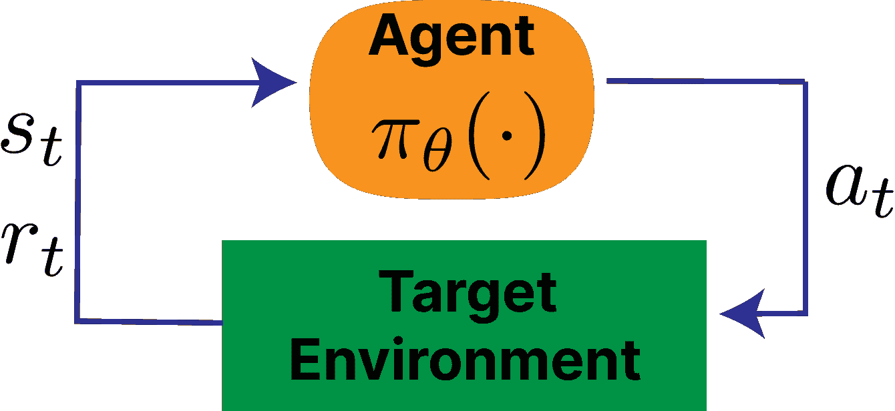
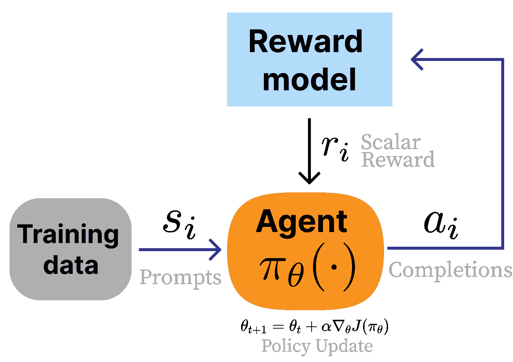
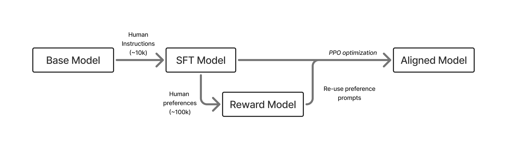

# 训练概述

在本章中，我们提供了 RLHF 训练的简要概述，之后在本书的后续部分将详细介绍。RLHF，虽然优化一个简单的损失函数，但涉及按顺序训练多个不同的 AI 模型，然后在复杂的在线优化中将它们链接在一起。

在这里，我们介绍了 RLHF 的核心目标，即通过基于距离的正则化器（以及展示其如何与经典 RL 问题相关联）来优化人类偏好的奖励代理。然后，我们展示了使用 RLHF 创建领先模型的典型配方，以展示 RLHF 如何与其他后训练方法相结合。这些示例配方将在本书的后续部分作为参考，其中我们将描述在进行 RLHF 时您所拥有的不同优化选择，并且我们将回顾不同关键模型在训练中使用了不同的步骤。

## 问题表述

从人类反馈中强化学习的优化建立在标准 RL 设置之上。在 RL 中，智能体从策略<semantics><mrow><mi>π</mi><mo stretchy="false" form="prefix">(</mo><msub><mi>a</mi><mi>t</mi></msub><mo>∣</mo><msub><mi>s</mi><mi>t</mi></msub><mo stretchy="false" form="postfix">)</mo></mrow><annotation encoding="application/x-tex">\pi(a_t\mid s_t)</annotation></semantics>中采样动作<semantics><msub><mi>a</mi><mi>t</mi></msub><annotation encoding="application/x-tex">a_t</annotation></semantics>，给定环境的状态<semantics><msub><mi>s</mi><mi>t</mi></msub><annotation encoding="application/x-tex">s_t</annotation></semantics>以最大化奖励<semantics><mrow><mi>r</mi><mo stretchy="false" form="prefix">(</mo><msub><mi>s</mi><mi>t</mi></msub><mo>,</mo><msub><mi>a</mi><mi>t</mi></msub><mo stretchy="false" form="postfix">)</mo></mrow><annotation encoding="application/x-tex">r(s_t,a_t)</annotation></semantics> [[55]](ch021.xhtml#ref-sutton2018reinforcement)。传统上，环境根据转换（动力学）<semantics><mrow><mi>p</mi><mo stretchy="false" form="prefix">(</mo><msub><mi>s</mi><mrow><mi>t</mi><mo>+</mo><mn>1</mn></mrow></msub><mo>∣</mo><msub><mi>s</mi><mi>t</mi></msub><mo>,</mo><msub><mi>a</mi><mi>t</mi></msub><mo stretchy="false" form="postfix">)</mo></mrow><annotation encoding="application/x-tex">p(s_{t+1}\mid s_t, a_t)</annotation></semantics>以及初始状态分布<semantics><mrow><msub><mi>ρ</mi><mn>0</mn></msub><mo stretchy="false" form="prefix">(</mo><msub><mi>s</mi><mn>0</mn></msub><mo stretchy="false" form="postfix">)</mo></mrow><annotation encoding="application/x-tex">\rho_0(s_0)</annotation></semantics>演变。共同地，策略和动力学诱导出一个轨迹分布：

<semantics><mrow><msub><mi>p</mi><mi>π</mi></msub><mo stretchy="false" form="prefix">(</mo><mi>τ</mi><mo stretchy="false" form="postfix">)</mo><mo>=</mo><msub><mi>ρ</mi><mn>0</mn></msub><mo stretchy="false" form="prefix">(</mo><msub><mi>s</mi><mn>0</mn></msub><mo stretchy="false" form="postfix">)</mo><munderover><mo>∏</mo><mrow><mi>t</mi><mo>=</mo><mn>0</mn></mrow><mrow><mi>T</mi><mo>−</mo><mn>1</mn></mrow></munderover><mi>π</mi><mo stretchy="false" form="prefix">(</mo><msub><mi>a</mi><mi>t</mi></msub><mo>∣</mo><msub><mi>s</mi><mi>t</mi></msub><mo stretchy="false" form="postfix">)</mo><mi>p</mi><mo stretchy="false" form="prefix">(</mo><msub><mi>s</mi><mrow><mi>t</mi><mo>+</mo><mn>1</mn></mrow></msub><mo>∣</mo><msub><mi>s</mi><mi>t</mi></msub><mo>,</mo><msub><mi>a</mi><mi>t</mi></msub><mo stretchy="false" form="postfix">)</mo><mi>.</mi><mrow><mo stretchy="false" form="prefix">(</mo><mn>7</mn><mo stretchy="false" form="postfix">)</mo></mrow></mrow><annotation encoding="application/x-tex">p_{\pi}(\tau)=\rho_0(s_0)\prod_{t=0}^{T-1}\pi(a_t\mid s_t)\,p(s_{t+1}\mid s_t,a_t).\qquad{(7)}</annotation></semantics>

在一个具有有限范围 <semantics><mi>T</mi><annotation encoding="application/x-tex">T</annotation></semantics> 的回合中，强化学习代理的目标是解决以下优化问题：

<semantics><mrow><mi>J</mi><mo stretchy="false" form="prefix">(</mo><mi>π</mi><mo stretchy="false" form="postfix">)</mo><mo>=</mo><msub><mi>𝔼</mi><mrow><mi>τ</mi><mo>∼</mo><msub><mi>p</mi><mi>π</mi></msub></mrow></msub><mrow><mo stretchy="true" form="prefix">[</mo><munderover><mo>∑</mo><mrow><mi>t</mi><mo>=</mo><mn>0</mn></mrow><mrow><mi>T</mi><mo>−</mo><mn>1</mn></mrow></munderover><msup><mi>γ</mi><mi>t</mi></msup><mi>r</mi><mo stretchy="false" form="prefix">(</mo><msub><mi>s</mi><mi>t</mi></msub><mo>,</mo><msub><mi>a</mi><mi>t</mi></msub><mo stretchy="false" form="postfix">)</mo><mo stretchy="true" form="postfix">]</mo></mrow><mo>,</mo><mrow><mo stretchy="false" form="prefix">(</mo><mn>8</mn><mo stretchy="false" form="postfix">)</mo></mrow></mrow><annotation encoding="application/x-tex">J(\pi) = \mathbb{E}_{\tau \sim p_{\pi}} \left[ \sum_{t=0}^{T-1} \gamma^t r(s_t, a_t) \right],\qquad{(8)}</annotation></semantics>

对于持续任务，通常取 <semantics><mrow><mi>T</mi><mo>→</mo><mi>∞</mi></mrow><annotation encoding="application/x-tex">T\to\infty</annotation></semantics> 并依赖于折现 (<semantics><mrow><mi>γ</mi><mo><</mo><mn>1</mn></mrow><annotation encoding="application/x-tex">\gamma<1</annotation></semantics>) 以保持目标定义良好。 <semantics><mi>γ</mi><annotation encoding="application/x-tex">\gamma</annotation></semantics> 是一个介于 0 到 1 之间的折扣因子，用于平衡近期与未来奖励的吸引力。第十一章讨论了优化此表达式的多种方法。

图 2：标准强化学习循环

强化学习循环的标准示意图如图 2 所示，并与图 3 中的 RLHF 循环进行比较。

### 示例强化学习任务：CartPole

为了使转换函数具体化，考虑经典的*CartPole*（倒立摆）控制任务。

+   **状态 (<semantics><msub><mi>s</mi><mi>t</mi></msub><annotation encoding="application/x-tex">s_t</annotation></semantics>)**: 小车的位置/速度和杆的角度/角速度。

    <semantics><mrow><msub><mi>s</mi><mi>t</mi></msub><mo>=</mo><mo stretchy="false" form="prefix">(</mo><msub><mi>x</mi><mi>t</mi></msub><mo>,</mo><msub><mover><mi>x</mi><mo accent="true">̇</mo></mover><mi>t</mi></msub><mo>,</mo><msub><mi>θ</mi><mi>t</mi></msub><mo>,</mo><msub><mover><mi>θ</mi><mo accent="true">̇</mo></mover><mi>t</mi></msub><mo stretchy="false" form="postfix">)</mo><mi>.</mi></mrow><annotation encoding="application/x-tex">s_t = (x_t,\,\dot{x}_t,\,\theta_t,\,\dot{\theta}_t).</annotation></semantics>

+   **动作 (<semantics><msub><mi>a</mi><mi>t</mi></msub><annotation encoding="application/x-tex">a_t</annotation></semantics>)**: 对小车施加左右水平力，例如 <semantics><mrow><msub><mi>a</mi><mi>t</mi></msub><mo>∈</mo><mo stretchy="false" form="prefix">{</mo><mi>−</mi><mi>F</mi><mo>,</mo><mi>+</mi><mi>F</mi><mo stretchy="false" form="postfix">}</mo></mrow><annotation encoding="application/x-tex">a_t \in \{-F, +F\}</annotation></semantics>.

+   **奖励 (<semantics><mi>r</mi><annotation encoding="application/x-tex">r</annotation></semantics>)**: 简单的奖励是 <semantics><mrow><msub><mi>r</mi><mi>t</mi></msub><mo>=</mo><mn>1</mn></mrow><annotation encoding="application/x-tex">r_t = 1</annotation></semantics>，每次杆保持平衡且小车保持在轨道上（例如，<semantics><mrow><mo stretchy="false" form="prefix">|</mo><msub><mi>x</mi><mi>t</mi></msub><mo stretchy="false" form="prefix">|</mo><mo>≤</mo><mn>2.4</mn></mrow><annotation encoding="application/x-tex">|x_t| \le 2.4</annotation></semantics> 和 <semantics><mrow><mo stretchy="false" form="prefix">|</mo><msub><mi>θ</mi><mi>t</mi></msub><mo stretchy="false" form="prefix">|</mo><mo>≤</mo><msup><mn>12</mn><mo>∘</mo></msup></mrow><annotation encoding="application/x-tex">|\theta_t| \le 12^\circ</annotation></semantics>），当任一边界被违反时，回合结束。

+   **动力学/转换 (<semantics><mrow><mi>p</mi><mo stretchy="false" form="prefix">(</mo><msub><mi>s</mi><mrow><mi>t</mi><mo>+</mo><mn>1</mn></mrow></msub><mo>∣</mo><msub><mi>s</mi><mi>t</mi></msub><mo>,</mo><msub><mi>a</mi><mi>t</mi></msub><mo stretchy="false" form="postfix">)</mo></mrow><annotation encoding="application/x-tex">p(s_{t+1}\mid s_t,a_t)</annotation></semantics>)**: 在许多环境中，动力学是确定性的（因此 <semantics><mi>p</mi><annotation encoding="application/x-tex">p</annotation></semantics> 是一个点质量）并且可以写成 <semantics><mrow><msub><mi>s</mi><mrow><mi>t</mi><mo>+</mo><mn>1</mn></mrow></msub><mo>=</mo><mi>f</mi><mo stretchy="false" form="prefix">(</mo><msub><mi>s</mi><mi>t</mi></msub><mo>,</mo><msub><mi>a</mi><mi>t</mi></msub><mo stretchy="false" form="postfix">)</mo></mrow><annotation encoding="application/x-tex">s_{t+1} = f(s_t,a_t)</annotation></semantics> 通过欧拉积分，步长为 <semantics><mrow><mi mathvariant="normal">Δ</mi><mi>t</mi></mrow><annotation encoding="application/x-tex">\Delta t</annotation></semantics>. 一个标准的简化 CartPole 更新使用常数的车体质量 <semantics><msub><mi>m</mi><mi>c</mi></msub><annotation encoding="application/x-tex">m_c</annotation></semantics>，杆质量 <semantics><msub><mi>m</mi><mi>p</mi></msub><annotation encoding="application/x-tex">m_p</annotation></semantics>，杆半长度 <semantics><mi>l</mi><annotation encoding="application/x-tex">l</annotation></semantics>，和重力 <semantics><mi>g</mi><annotation encoding="application/x-tex">g</annotation></semantics>：

    <semantics><mrow><mtext mathvariant="normal">temp</mtext><mo>=</mo><mfrac><mrow><msub><mi>a</mi><mi>t</mi></msub><mo>+</mo><msub><mi>m</mi><mi>p</mi></msub><mi>l</mi><msubsup><mover><mi>θ</mi><mo accent="true">̇</mo></mover><mi>t</mi><mn>2</mn></msubsup><mrow><mi mathvariant="normal">sin</mi><mo>⁡</mo></mrow><msub><mi>θ</mi><mi>t</mi></msub></mrow><mrow><msub><mi>m</mi><mi>c</mi></msub><mo>+</mo><msub><mi>m</mi><mi>p</mi></msub></mrow></mfrac></mrow><annotation encoding="application/x-tex">\text{temp} = \frac{a_t + m_p l\,\dot{\theta}_t²\sin\theta_t}{m_c + m_p}</annotation></semantics>

    <semantics><mrow><msub><mi>x</mi><mrow><mi>t</mi><mo>+</mo><mn>1</mn></mrow></msub><mo>=</mo><msub><mi>x</mi><mi>t</mi></msub><mo>+</mo><mi mathvariant="normal">Δ</mi><mi>t</mi><msub><mover><mi>x</mi><mo accent="true">̇</mo></mover><mi>t</mi></msub><mo>,</mo><msub><mover><mi>x</mi><mo accent="true">̇</mo></mover><mrow><mi>t</mi><mo>+</mo><mn>1</mn></mrow></msub><mo>=</mo><msub><mover><mi>x</mi><mo accent="true">̇</mo></mover><mi>t</mi></msub><mo>+</mo><mi mathvariant="normal">Δ</mi><mi>t</mi><msub><mover><mi>x</mi><mo accent="true">̈</mo></mover><mi>t</mi></msub><mo>,</mo></mrow><annotation encoding="application/x-tex">x_{t+1}=x_t+\Delta t\,\dot{x}_t,\quad \dot{x}_{t+1}=\dot{x}_t+\Delta t\,\ddot{x}_t,</annotation></semantics> <semantics><mrow><msub><mi>θ</mi><mrow><mi>t</mi><mo>+</mo><mn>1</mn></mrow></msub><mo>=</mo><msub><mi>θ</mi><mi>t</mi></msub><mo>+</mo><mi mathvariant="normal">Δ</mi><mi>t</mi><msub><mover><mi>θ</mi><mo accent="true">̇</mo></mover><mi>t</mi></msub><mo>,</mo><msub><mover><mi>θ</mi><mo accent="true">̇</mo></mover><mrow><mi>t</mi><mo>+</mo><mn>1</mn></mrow></msub><mo>=</mo><msub><mover><mi>θ</mi><mo accent="true">̇</mo></mover><mi>t</mi></msub><mo>+</mo><mi mathvariant="normal">Δ</mi><mi>t</mi><msub><mover><mi>θ</mi><mo accent="true">̈</mo></mover><mi>t</mi></msub><mi>.</mi></mrow><annotation encoding="application/x-tex">\theta_{t+1}=\theta_t+\Delta t\,\dot{\theta}_t,\quad \dot{\theta}_{t+1}=\dot{\theta}_t+\Delta t\,\ddot{\theta}_t.</annotation></semantics>

这是一般设置的一个具体实例：策略选择<semantics><msub><mi>a</mi><mi>t</mi></msub><annotation encoding="application/x-tex">a_t</annotation></semantics>，状态转移函数推进状态，奖励在回合中累积。

### 操作标准强化学习设置

对于 RLHF 的强化学习公式被视为一个更不开放的问题，其中一些关键的强化学习元素被设定为特定的定义，以便适应语言模型。从标准强化学习设置到 RLHF 设置有多个核心变化：表 tbl. 1 总结了标准强化学习和用于语言模型的 RLHF 设置之间的这些差异。

1.  **从奖励函数切换到奖励模型。** 在 RLHF 中，一个学习到的人类偏好的模型，<semantics><mrow><msub><mi>r</mi><mi>θ</mi></msub><mo stretchy="false" form="prefix">(</mo><msub><mi>s</mi><mi>t</mi></msub><mo>,</mo><msub><mi>a</mi><mi>t</mi></msub><mo stretchy="false" form="postfix">)</mo></mrow><annotation encoding="application/x-tex">r_\theta(s_t, a_t)</annotation></semantics>（或任何其他分类模型）被用来代替环境奖励函数。这为设计者提供了方法灵活性和对最终结果的控制的显著提升，但代价是实施复杂性的增加。在标准 RL 中，奖励被视为环境的一个静态部分，设计学习代理的人无法改变或操纵它。

1.  **没有状态转换。** 在 RLHF 中，领域的初始状态是从训练数据集中采样的提示，而“动作”是对该提示的完成。在标准实践中，这个动作不会影响下一个状态，并且只由奖励模型评分。

1.  **响应级别的奖励。** 通常被称为投币机问题，RLHF 的奖励分配是对整个动作序列进行的，由多个生成的标记组成，而不是以细粒度的方式进行。

表 1：标准 RL 和 RLHF（语言模型）之间的关键差异。

| 方面 | 标准 RL | RLHF（语言模型） |
| --- | --- | --- |
| 奖励信号 | 环境奖励函数 <semantics><mrow><mi>r</mi><mo stretchy="false" form="prefix">(</mo><msub><mi>s</mi><mi>t</mi></msub><mo>,</mo><msub><mi>a</mi><mi>t</mi></msub><mo stretchy="false" form="postfix">)</mo></mrow><annotation encoding="application/x-tex">r(s_t,a_t)</annotation></semantics> | 学习到的奖励/偏好模型 <semantics><mrow><msub><mi>r</mi><mi>θ</mi></msub><mo stretchy="false" form="prefix">(</mo><mi>x</mi><mo>,</mo><mi>y</mi><mo stretchy="false" form="postfix">)</mo></mrow><annotation encoding="application/x-tex">r_\theta(x,y)</annotation></semantics>（提示 <semantics><mi>x</mi><annotation encoding="application/x-tex">x</annotation></semantics>，完成 <semantics><mi>y</mi><annotation encoding="application/x-tex">y</annotation></semantics>） |
| 状态转换 | 是：动态 <semantics><mrow><mi>p</mi><mo stretchy="false" form="prefix">(</mo><msub><mi>s</mi><mrow><mi>t</mi><mo>+</mo><mn>1</mn></mrow></msub><mo>∣</mo><msub><mi>s</mi><mi>t</mi></msub><mo>,</mo><msub><mi>a</mi><mi>t</mi></msub><mo stretchy="false" form="postfix">)</mo></mrow><annotation encoding="application/x-tex">p(s_{t+1}\mid s_t,a_t)</annotation></semantics> | 通常没有：从数据集中采样的提示 <semantics><mi>x</mi><annotation encoding="application/x-tex">x</annotation></semantics>；完成不定义下一个提示 |
| 动作 | 单个环境动作 <semantics><msub><mi>a</mi><mi>t</mi></msub><annotation encoding="application/x-tex">a_t</annotation></semantics> | 一个完成项 <semantics><mi>y</mi><annotation encoding="application/x-tex">y</annotation></semantics>（一个标记序列），从 <semantics><mrow><msub><mi>π</mi><mi>θ</mi></msub><mo stretchy="false" form="prefix">(</mo><mi>⋅</mi><mo>∣</mo><mi>x</mi><mo stretchy="false" form="postfix">)</mo></mrow><annotation encoding="application/x-tex">\pi_\theta(\cdot\mid x)</annotation></semantics> |
| 奖励粒度 | 通常每步/细粒度 | 通常在整个完成项上（类似投币机风格） |
| 视野 | 多步剧集（<semantics><mrow><mi>T</mi><mo>></mo><mn>1</mn></mrow><annotation encoding="application/x-tex">T>1</annotation></semantics>） | 通常单步（<semantics><mrow><mi>T</mi><mo>=</mo><mn>1</mn></mrow><annotation encoding="application/x-tex">T=1</annotation></semantics>），尽管多轮可以建模为更长的视野 |

由于问题的单轮性质，优化可以重写，无需时间范围和折扣因子（以及奖励模型）：<semantics><mrow><mi>J</mi><mo stretchy="false" form="prefix">(</mo><mi>π</mi><mo stretchy="false" form="postfix">)</mo><mo>=</mo><msub><mi>𝔼</mi><mrow><mi>τ</mi><mo>∼</mo><mi>π</mi></mrow></msub><mrow><mo stretchy="true" form="prefix">[</mo><msub><mi>r</mi><mi>θ</mi></msub><mo stretchy="false" form="prefix">(</mo><msub><mi>s</mi><mi>t</mi></msub><mo>,</mo><msub><mi>a</mi><mi>t</mi></msub><mo stretchy="false" form="postfix">)</mo><mo stretchy="true" form="postfix">]</mo></mrow><mi>.</mi><mrow><mo stretchy="false" form="prefix">(</mo><mn>9</mn><mo stretchy="false" form="postfix">)</mo></mrow></mrow><annotation encoding="application/x-tex">J(\pi) = \mathbb{E}_{\tau \sim \pi} \left[r_\theta(s_t, a_t) \right].\qquad{(9)}</annotation></semantics>

在许多方面，结果是，虽然 RLHF 在 RL 优化器和问题表述方面受到很大启发，但实际实现与传统 RL 非常不同。

图 3：标准 RLHF 循环

### 微调和正则化

在传统的 RL 问题中，智能体必须从随机初始化的策略中学习，但使用 RLHF，我们从具有许多初始能力的强大预训练基础模型开始。这种 RLHF 的强大先验性导致需要控制优化，以避免从初始策略偏离太远。为了在微调模式下取得成功，RLHF 技术采用多种类型的正则化来控制优化。目标是允许奖励最大化仍然发生，同时模型不会因过度优化而崩溃，正如第十八章所讨论的。对优化函数最常见的变化是在当前 RLHF 策略与优化起点之间的差异上添加距离惩罚：

<semantics><mrow><mi>J</mi><mo stretchy="false" form="prefix">(</mo><mi>π</mi><mo stretchy="false" form="postfix">)</mo><mo>=</mo><msub><mi>𝔼</mi><mrow><mi>τ</mi><mo>∼</mo><mi>π</mi></mrow></msub><mrow><mo stretchy="true" form="prefix">[</mo><msub><mi>r</mi><mi>θ</mi></msub><mo stretchy="false" form="prefix">(</mo><msub><mi>s</mi><mi>t</mi></msub><mo>,</mo><msub><mi>a</mi><mi>t</mi></msub><mo stretchy="false" form="postfix">)</mo><mo stretchy="true" form="postfix">]</mo></mrow><mo>−</mo><mi>β</mi><msub><mi>𝒟</mi><mtext mathvariant="normal">KL</mtext></msub><mo stretchy="false" form="prefix">(</mo><msub><mi>π</mi><mtext mathvariant="normal">RL</mtext></msub><mo stretchy="false" form="prefix">(</mo><mi>⋅</mi><mo stretchy="false" form="prefix">|</mo><msub><mi>s</mi><mi>t</mi></msub><mo stretchy="false" form="postfix">)</mo><mo stretchy="false" form="postfix">∥</mo><msub><mi>π</mi><mtext mathvariant="normal">ref</mtext></msub><mo stretchy="false" form="prefix">(</mo><mi>⋅</mi><mo stretchy="false" form="prefix">|</mo><msub><mi>s</mi><mi>t</mi></msub><mo stretchy="false" form="postfix">)</mo><mo stretchy="false" form="postfix">)</mo><mi>.</mi><mrow><mo stretchy="false" form="prefix">(</mo><mn>10</mn><mo stretchy="false" form="postfix">)</mo></mrow></mrow><annotation encoding="application/x-tex">J(\pi) = \mathbb{E}_{\tau \sim \pi} \left[r_\theta(s_t, a_t)\right] - \beta \mathcal{D}_{\text{KL}}(\pi_{\text{RL}}(\cdot|s_t) \| \pi_{\text{ref}}(\cdot|s_t)).\qquad{(10)}</annotation></semantics>

在这个公式中，对 RLHF 训练的大量研究都集中在理解如何花费一定的“KL 预算”，这是通过初始模型距离来衡量的。更多细节，请参阅第八章关于正则化的内容。

### 优化工具

在本书中，我们详细介绍了许多解决此优化问题的流行技术。包括以下后训练工具：

+   **奖励建模**（第七章）：在此，模型被训练以捕捉收集到的偏好数据中的信号，然后可以输出一个表示未来文本质量的标量奖励。

+   **指令微调**（第九章）：RLHF 的先决条件，通过模仿预选示例，教会模型今天大多数语言建模交互中使用的问答格式。

+   **拒绝采样**（第十章）：最基础的 RLHF 技术，通过模仿人类偏好的奖励模型来过滤指令微调的候选完成。

+   **策略梯度**（第十一章）：在 RLHF 的原始示例中使用的强化学习算法，用于根据奖励模型的信号更新语言模型的参数。

+   **直接对齐算法**（第十二章）：直接从成对偏好数据中优化策略的算法，而不是学习一个中间奖励模型然后再进行优化。

现代 RLHF 训练的模型总是利用指令微调，然后是其他优化选项的混合。

## **标准训练方案**

随着时间的推移，各种模型被确定为 RLHF 特定或训练后一般的标准配方。这些配方反映了当时的数据实践和模型能力。随着配方的老化，具有相同特征的模型训练变得更加容易，所需数据更少。训练后的一般趋势是涉及更多的优化步骤，使用更多的训练算法，在更多样化的训练数据集和评估中进行。

### InstructGPT

大约在 ChatGPT 首次推出时，广泛接受的（标准）训练 LM 的方法有三个主要步骤，RLHF 是核心 [[56]](ch021.xhtml#ref-lambert2022illustrating) [[3]](ch021.xhtml#ref-ouyang2022training) [[5]](ch021.xhtml#ref-bai2022training)。在“基础”语言模型（在大规模网络文本上训练的下一个标记预测模型）之上的三个步骤总结如下图 4。

1.  **在约 10K 个示例上进行指令调整**：这使模型学会遵循问答格式，并从主要由人类编写的数据中学习一些基本技能。

1.  **在约 100K 个成对提示上进行奖励模型训练**：此模型从指令调整检查点训练而来，捕捉了在最终训练中希望模型体现的多样化价值。奖励模型是 RLHF 的优化目标。

1.  **使用 RLHF 在另一个约 100K 个提示上训练指令调整模型**：模型在接收评分之前生成一系列提示，并针对奖励模型进行优化。

一旦完成 RLHF，模型就准备好部署给用户。这个配方是现代 RLHF 的基础，但配方已经大幅演变，包括更多阶段和更多数据。

图 4：早期三个阶段 RLHF 过程的再现，包括 SFT、奖励模型以及随后优化。

### Tülu 3

现代版本的训练后涉及许多许多更多的模型版本和训练阶段（即远超过 Llama 2 文档中记录的 5 个 RLHF 步骤 [[44]](ch021.xhtml#ref-touvron2023llama))。以下图 5 中展示了模型在收敛前进行多次训练迭代的一个示例。

图 5：多轮现代训练后的再现。

在这个时代及以后训练的最复杂模型没有发布其训练过程的全部细节。到 2025 年左右，领先的模型如 ChatGPT 或 Claude 涉及许多迭代训练轮次。这甚至包括训练专门模型的技术，然后将权重合并以获得一个在许多子任务上都有能力的最终模型 [[57]](ch021.xhtml#ref-li2022branch)（例如，Cohere 的 Command A [[58]](ch021.xhtml#ref-cohere2025command))。

图 6：Tülu 3 配方总结，包括目标技能和多步骤训练配方。Lambert 等人，2024 年，许可 CC-BY。

这是一个多阶段后训练的完全开放示例版本，其中 RLHF 扮演着主要角色，即 Tülu 3。Tülu 3 配方包括三个阶段：

1.  **在约 1M 个示例上进行指令调整**：这主要是来自 GPT-4o 和 Llama 3.1 405B 等前沿模型的合成数据，它教会模型遵循一般指令，并成为数学或编码等各种能力的基础。

1.  **约 1M 个偏好对上的按策略偏好数据**：这一阶段显著提高了模型的健谈性（例如 ChatBotArena 或 AlpacaEval 2），同时也改进了指令调整阶段提到的上述技能。

1.  **在约 10K 个提示上的可验证奖励强化学习**：这一阶段是一个小规模的强化学习运行，旨在提高核心技能如数学，同时保持整体性能（现在被视为现代推理模型如 DeepSeek R1 的前驱）。

该配方已成功应用于 Llama 3.1 [[6]](ch021.xhtml#ref-lambert2024t)、OLMo 2 [[59]](ch021.xhtml#ref-olmo20242)和 SmolLM 模型[[60]](ch021.xhtml#ref-alrashed2024smoltulu)。

### DeepSeek R1

随着推理语言模型，如 OpenAI 的 o1 的兴起，后训练的最佳实践再次演变，以重新排序和重新分配训练阶段的计算。推理模型后训练配方最清晰的文档是 DeepSeek R1 [[61]](ch021.xhtml#ref-guo2025deepseek)，它已被阿里巴巴的更大型的 Qwen 3 模型（即仅 32B 和 225B MoE 模型）[[62]](ch021.xhtml#ref-yang2025qwen3)或小米的 MiMo 7B [[63]](ch021.xhtml#ref-xia2025mimo)所镜像。DeepSeek 配方如下：

1.  **“冷启动”100K+的按策略推理样本**：这些数据是从早期的 RL 检查点 R1-Zero 中抽取的，并经过大量过滤，以在模型上灌输特定的推理过程。DeepSeek 使用冷启动这个术语来描述如何从少量监督数据中学习 RL。

1.  **大规模强化学习训练**：这一阶段反复覆盖推理问题，在多个基准上运行 RLVR“直到收敛”。

1.  **拒绝采样**在 3/4 的推理问题和 1/4 的一般查询上开始向通用模型过渡。

1.  **混合强化学习训练**针对推理问题（可验证奖励）使用通用偏好调整奖励模型来完善模型。

如上所述，食谱有演变，尤其是在步骤 3 和 4 中，在将模型展示给用户之前进行最终化。许多模型从定制的指令数据集开始，这些数据集包含经过大量过滤和打磨的 Chain of Thought 序列，来自现有模型，从而通过 SFT 单独提供快速步骤以获得强大的行为，然后再转向 RL [[64]](ch021.xhtml#ref-seed2025seed)。
