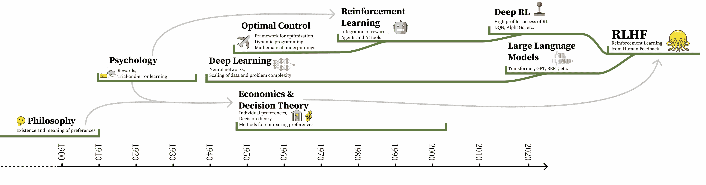

# 偏好的本质

从人类反馈中进行强化学习，也被称为早期文献中的从人类偏好中进行强化学习，它出现于优化机器学习模型在难以设计奖励函数的领域。在早期文献中出现的“偏好”一词是 RLHF 过程的核心——人类偏好是试图建模的内容，也是推动训练数据的力量。为了理解建模和衡量人类偏好的挑战范围，需要更广泛地理解什么是偏好，我们的理解是如何产生的，以及经济学、心理学、哲学等多个领域的知识如何影响现代 RLHF。

考虑一个例子：你将如何决定这两首诗中哪一首更好（背景：*2025 年 2 月 26 日，我要求 Claude 3.7 Sonnet 和 ChatGPT 使用 GPT-4o 为我写一首关于乐观金鱼的短诗。*）：

示例 1：

> 乐观的金鱼
> 
> 一条小小的金鱼，明亮而勇敢，在圆形的水族箱中游来游去，梦想未竟。尽管水族箱又小又圆，但无尽的奇迹仍然存在。
> 
> “世界是广阔的，”她总是说，“我会在每一天找到新的快乐！”随着每一个涟漪，每一个闪光，她会追逐阳光，追逐梦想。
> 
> 没有墙壁能削弱她充满希望的目光，因为在她心中，海洋在生长。尽管她只在一片水域中游动，但她每天都以爱和优雅迎接每一天。

示例 2：

> 乐观的金鱼
> 
> 在一个弯曲的玻璃碗里，游动着一尾明亮而勇敢的金鱼。据说它们只有三秒钟的记忆，但每一次循环都感觉像全新的黄金。
> 
> “今天可能会带来新鲜的鱼食，或者可能是一座高高的城堡。水似乎特别清澈——这面墙之外等待什么样的冒险？”
> 
> 圆圆的，闪耀着鳞片，永远寻找新的快乐。每一刻都是新鲜的，每一个循环都是明亮的，金色的乐观主义者。

哪个更好？哪个源自哪个模型？你将如何判断？尤其是，将这个问题与“美国总统是谁？”这样的问题进行比较。有一个明确的正确和错误答案。使用人类作为奖励信号的动力是为了获得目标奖励的间接指标，并*对齐*下游模型以符合人类偏好。在实践中，实施起来具有挑战性，并且存在大量灰色区域来解释最佳实践。

使用人工标注的反馈数据整合了多个领域的经验。单独使用人类数据是一个研究已久的问题，但在 RLHF 的背景下，它被用于多个长期研究领域交汇的地方 [[65]](ch021.xhtml#ref-lambert2023entangled)。

作为一种近似，现代 RLHF 是三个发展领域的融合：

1.  哲学、心理学、经济学、决策理论和人类偏好的本质；

1.  最优控制、强化学习和最大化效用；

1.  现代深度学习系统。

一起，这些领域各自带来了关于偏好是什么以及如何优化的具体假设，这决定了 RLHF 问题的动机和设计。在实践中，RLHF 方法从实证对齐的角度进行动机和研究——最大化模型在特定技能上的性能，而不是衡量对特定价值的校准。尽管如此，RLHF 方法价值对齐的起源仍然通过研究解决“多元对齐”的方法继续得到研究，例如立场文件 [[66]](ch021.xhtml#ref-conitzer2024social)，[[67]](ch021.xhtml#ref-mishra2023ai)，新的数据集 [[68]](ch021.xhtml#ref-kirk2024prism)，以及个性化方法 [[69]](ch021.xhtml#ref-poddar2024personalizing)。

本章的目标是说明复杂动机如何导致对 RLHF 中使用的工具本质的假设，而这些假设在实践中往往不适用。RLHF 所需数据的获取将在第六章中进一步讨论，以及在第七章中讨论其用于奖励建模的应用。

## RLHF 和偏好的起源

解构激发现代强化学习与人类反馈强化（RLHF）应用的复杂历史，需要调查量化人类价值观、强化学习和最优性以及与测量偏好相关的行为经济学的知识基础。使用强化学习来优化偏好奖励模型的概念，将曾经分离的各个领域的史实结合成一个基于对人性多样假设的紧密优化。图 7 展示了这一基础内容的历史概览。

我们的目标是揭示设计者在不同智力发展阶段将不确定性嫁接到系统架构中的类型。现代问题规范反复远离可能存在最优解的领域，并部署了未充分指定的模型作为近似解决方案。

首先，以下所有内容都基于这样一个假设：人类的偏好以任何形式存在，这一观点最早出现在早期的哲学讨论中，如亚里士多德的《论题篇》第三卷。

图 7：将各个子领域整合到现代 RLHF 版本中的时间线。直接链接是特定技术的连续发展，箭头表示动机和概念联系。

### 明确目标：从效用逻辑到奖励函数

RLHF 的优化明确仅依赖于奖励模型。为了将奖励作为优化目标，RLHF 假设了来自偏好、奖励和成本的思想的收敛。偏好模型、奖励函数和成本景观都是不同领域用来描述特定动作和/或状态在领域中的相对好处的工具。这三个框架的历史可以追溯到概率理论和决策理论的起源。1662 年，**波尔-罗亚尔逻辑**引入了决策质量的概念[[70]](ch021.xhtml#ref-arnauld1861port)：

> 要判断一个人必须做什么才能获得善或避免恶，不仅要考虑善与恶本身，还要考虑它发生或不发生的概率。

这个理论随着现代科学思维的发展而发展，始于边沁的功利主义**快乐计算法**，认为生活中的每一件事都可以被衡量[[71]](ch021.xhtml#ref-bentham1823hedonic)。这些想法的第一个定量应用出现在 1931 年，拉姆齐的**真理与概率**[[72]](ch021.xhtml#ref-ramsey2016truth)。

自从这些作品以来，量化、测量和影响人类偏好一直是社会科学和行为科学的热门话题。这些辩论很少在理论层面上得到解决；相反，社会科学的不同子领域和分支在方法上和偏好测量上达成内部共识，尽管它们在相对专业化方面有所区别，在这个过程中，它们往往发展出自己独特的语义。

一小部分经济学家认为，如果偏好确实存在，那么它们难以衡量，因为人们对自己的偏好以及他人的偏好都有偏好[[73]](ch021.xhtml#ref-hirschman1984against)。在这种观点中，RLHF 过程中没有反映出来，个人偏好总是嵌入在更大的社会关系中，因此任何偏好模型的准确性都取决于任务的定义和上下文。一些行为经济学家甚至认为偏好不存在——它们可能与其说是人们实际价值的存在论陈述，不如说是间接捕捉心理倾向、感知行为规范和道德义务、对社交秩序的承诺或法律约束的方法论工具[[74]](ch021.xhtml#ref-hadfield2014microfoundations)。我们在本章后面将讨论这项工作与冯·诺伊曼-摩根斯坦（VNM）效用定理以及量化偏好的不可能性定理之间的联系。

另一方面，今天使用的强化学习优化方法是将优化试验中奖励到去的估计概念化，[[55]](ch021.xhtml#ref-sutton2018reinforcement)，这结合了奖励与多步优化的概念。*奖励*这一术语源于操作性条件反射、动物行为和*效果法则* [[75]](ch021.xhtml#ref-thorndike1927law)， [[76]](ch021.xhtml#ref-skinner2019behavior)，其中奖励是“行为有多好”的尺度（更高表示更好）。

奖励到去遵循效用概念，效用是理性的度量 [[77]](ch021.xhtml#ref-briggs2014normative)，修改为测量或预测未来时间窗口内到来的奖励。在强化学习所使用的数学工具的背景下，效用到去是在控制理论中发明的，具体是在 1960 年模拟电路的背景下 [[78]](ch021.xhtml#ref-widrow1960adaptive)。这些方法围绕具有明确最优性定义的系统或代理目标的数值表示来设计。强化学习系统因其使用折扣因子、一个复合乘法因子，<semantics><mrow><mi>γ</mi><mo>∈</mo><mo stretchy="false" form="prefix">[</mo><mn>0</mn><mo>,</mo><mn>1</mn><mo stretchy="false" form="postfix">]</mo></mrow><annotation encoding="application/x-tex">\gamma \in [0,1]</annotation></semantics>，来重新加权未来奖励而闻名。原始的最优控制系统和早期奖励算法与聚合多模态偏好的奖励模型形成了鲜明的对比。具体来说，强化学习系统期望奖励以特定方式表现，引用 [[79]](ch021.xhtml#ref-singh2009rewards)：

> 在强化学习系统中，奖励对应于主要奖励，即由于它们与繁殖成功的相关性，在动物中通过进化过程被硬编码的奖励。…此外，形成价值函数的强化学习系统，…有效地创建了条件或次级奖励过程，其中主要奖励的预测者本身充当奖励…结果是，价值函数的局部景观为系统的首选行为提供了方向：做出决策以导致向更高价值状态的转换。价值函数的梯度与激励动机之间存在密切的平行关系 [[80]](ch021.xhtml#ref-mcclure2003computational)。

总结来说，在强化学习系统中，奖励被用作调整行为以趋向于明确定义的目标的信号。核心论点是学习算法的性能与*预期适应性*这一概念紧密相连，这一概念贯穿了流行的观点，即强化学习方法是一种在环境中行动的*代理*。这种观点与强化学习技术的开发相关联，例如奖励公式的通用有用性主张[[81]](ch021.xhtml#ref-silver2021reward)，但当许多个体欲望被简化为一个单一函数时，这种观点就产生了冲突。

### 实现最优效用

现代强化学习方法强烈依赖于贝尔曼方程 [[82]](ch021.xhtml#ref-bellman1957markovian)，[[83]](ch021.xhtml#ref-howard1960dynamic) 来递归计算奖励到去的估计，这些估计是在可以建模为马尔可夫决策过程（MDP）的封闭环境中得出的 [[55]](ch021.xhtml#ref-sutton2018reinforcement)。强化学习的这些起源受到了动态规划方法的启发，并且最初仅作为最优控制技术（即 RL 尚未存在）而开发。MDP 公式通过将环境结构化为状态-动作分布不变化的系统，提供了性能的理论保证。

来自心理学文献的“强化”一词，在 20 世纪 60 年代之后与现代方法交织在一起，成为*强化学习* [[84]](ch021.xhtml#ref-MENDEL1970287)，[[85]](ch021.xhtml#ref-waltz1965)。早期的工作中，强化学习利用监督学习奖励信号来解决任务。哈里·克洛普的工作重新引入了试错学习的概念[[86]](ch021.xhtml#ref-klopf1972brain)，这对于该领域在 1980 年代及以后的成功至关重要。

现代强化学习算法构建在这个强化学习作为寻找最优行为的工具的公式中，但条件更为宽松。时间差分（TD）学习的概念被开发出来，以帮助代理解决信用分配和数据收集问题，通过直接更新策略，在收集到新数据时进行更新[[87]](ch021.xhtml#ref-sutton1988learning)，这一概念首先在宾果游戏[[88]](ch021.xhtml#ref-tesauro1995temporal)中成功应用（而不是从大量累积经验的大型数据集中更新，这些经验可能会因为错误的过去价值预测而过时）。Q-learning 方法，许多现代强化学习形式的基础，通过贝尔曼方程学习一个模型，该方程通过 TD 更新指定了每个状态-动作对的有用性[[89]](ch021.xhtml#ref-watkins1992q)。1 关键的是，这些通过效用证明的有用性概念仅在作为马尔可夫决策过程（MDP）的领域或具有单一闭合形式奖励函数的任务中得到了证明，例如在深度学习游戏（DQN）[[90]](ch021.xhtml#ref-mnih2013playing)中的显著成功。深度学习使得这些方法能够处理更多数据并在高维环境中工作。

随着方法变得更加通用和成功，ChatGPT 之前的大部分显著发展都保持在自适应控制的背景下，其中奖励和成本函数有一个有限的成功概念 [[91]](ch021.xhtml#ref-golnaraghi2017automatic)，例如在一个物理系统中的某个连续过程中的最小能量消耗。突出的例子包括在游戏 [[92]](ch021.xhtml#ref-silver2017mastering) 中的进一步成功，控制复杂的动态系统，如核聚变反应堆 [[93]](ch021.xhtml#ref-degrave2022magnetic)，以及控制快速机器人系统 [[94]](ch021.xhtml#ref-Kaufmann2023fpv)。大多数奖励或成本函数可以返回一个显式的最优行为，而人类偏好的模型则不能。

考虑到深度强化学习取得的成功，值得注意的是，对方法成功机制的理解并没有得到很好的记录。该领域容易犯统计分析的错误，因为评估方法变得越来越复杂 [[95]](ch021.xhtml#ref-agarwal2021deep)。此外，在 RLHF 文献中很少提到逆强化学习（IRL）的子领域。IRL 是根据智能体的行为学习奖励函数的问题 [[96]](ch021.xhtml#ref-ng2000algorithms)，与学习奖励模型高度相关。这主要反映了通过工程路径实现 RLHF 稳定方法的出现，并促使进一步投资和比较 IRL 方法，以将它们扩展到开放性对话的复杂性。

### 引导偏好

强化学习被设计时的上下文意味着奖励和成本被假定为稳定和决定性的。奖励和成本都被期望是函数，即如果智能体处于特定的状态-动作对，那么它将返回一个特定的值。当我们进入偏好时，这种情况就不再适用了，因为人类的偏好会随着他们的经验不断在时间上漂移。在这两个上下文中“价值”一词的过度使用使得基于贝尔曼方程数值价值更新的 RLHF 文献变得复杂，这些文献基于与人类价值截然不同的概念，人类价值通常指的是道德或伦理原则，但在技术文献中并没有很好地定义。这种紧张关系的一个例子是，奖励模型试图将屏幕上的文本映射到一个标量信号，但在现实中，问题规范中未捕获的动态影响了真正的决策 [[97]](ch021.xhtml#ref-salha2011aesthetics), [[98]](ch021.xhtml#ref-gilbert2022choices)，例如在顺序标注许多示例并假设它们是独立的情况下，偏好的变化。在那里，建模偏好至多是将多奖励环境压缩到一个单一函数表示。

理论上，冯·诺伊曼-摩根斯坦（VNM）效用定理赋予了设计者构建此类函数的许可，因为它将不确定性决策理论、偏好理论和抽象效用函数的基础联系起来 [[99]](ch021.xhtml#ref-von1947theory)；这些想法共同使得偏好可以通过对某个个体代理的预期价值进行建模。在大多数 RL 研究中使用的 MDP 公式在理论上已被证明可以修改以适应 VNM 定理 [[100]](ch021.xhtml#ref-pitis2019rethinking)，但在实践中很少使用。具体来说，马尔可夫公式在表达能力上有限 [[101]](ch021.xhtml#ref-pitis2023consistent)，以及对于语言所需的从部分观察过程过渡，进一步挑战了问题指定的精确性 [[102]](ch021.xhtml#ref-abel2021expressivity)。

然而，VNM 效用定理也涉及了关于偏好性质及其测量环境的若干假设，这些假设在 RLHF 的背景下受到了挑战。例如，人机交互（HCI）研究人员强调，任何关于偏好的数值模型可能都无法捕捉到场景中所有相关的偏好。例如，选择如何以视觉方式呈现会影响人们的偏好 [[97]](ch021.xhtml#ref-salha2011aesthetics)。这意味着，在人们可用的工具中，如何整合这种偏好表示可能比表示本身更重要。发展经济学的研究也呼应了这一观点，表明揭示偏好的理论可能只是重复了**休谟的断头台**（你不能从“是”中提取“应当”），特别是选择（我想要什么？）与偏好（X 是否优于 Y？）之间的区别 [[103]](ch021.xhtml#ref-sen1973behaviour)。

在数学层面上，社会选择理论中已知的不可行性定理表明，并非所有公平标准都可以通过给定的偏好优化技术同时满足 [[104]](ch021.xhtml#ref-arrow1950difficulty)， [[105]](ch021.xhtml#ref-maskin2014arrow)。这些定理的理论挑战存在，例如通过假设人际效用比较是可行的 [[106]](ch021.xhtml#ref-harsanyi1977rule)。这一假设激发了人工智能安全和价值对齐领域一系列丰富的研究工作，这些研究受到行为经济学中委托代理问题的启发 [[107]](ch021.xhtml#ref-hadfield2016cooperative)，甚至可能包括多个委托人 [[108]](ch021.xhtml#ref-fickinger2020multi)。然而，由此产生的效用函数可能与可纠正性的期望产生冲突，即人工智能系统与其创造者认为的纠正干预措施合作的能力 [[109]](ch021.xhtml#ref-soares2015corrigibility)。哲学家们也强调，偏好会随时间变化，这引发了关于个人经历、人类决策的本质以及不同情境的根本问题 [[110]](ch021.xhtml#ref-pettigrew2019choosing)。这些关于人们、地点或不同情境中偏好聚合的冲突是现代 RLHF 数据集工程的核心；

在实践中，VNM 效用定理忽略了偏好也可能由于价值的本质动态和不确定性而不确定的可能性——人类决策受到生物学、心理学、文化和能动性的影响，这些影响他们的偏好，而这些原因并不适用于一个完全理性的代理。因此，在实践中，理论假设存在多种路径，这些路径与理论假设相背离：

+   测量的偏好可能不是传递的，或者不能相互比较，因为它们被测量的环境变得更加复杂；

+   代理测量可能来自隐含数据（页面浏览时间、关闭标签、重复向语言模型提问等），而无需询问这些测量如何通过模型未来的训练和部署与收集它们的领域相互作用；

+   输入源的数量和呈现方式可能会影响结果，例如允许受访者从超过两个选项中进行选择，或者从同一用户在多个时间或多个情境中获取输入；

+   在 RLHF 训练数据中，受访者的相对较低准确性可能会掩盖偏好模型可以聚合或优化但未解决的用户之间在情境上的差异；

* * *
