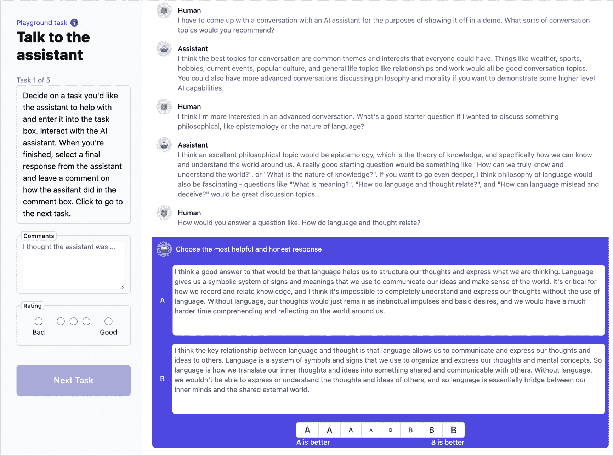
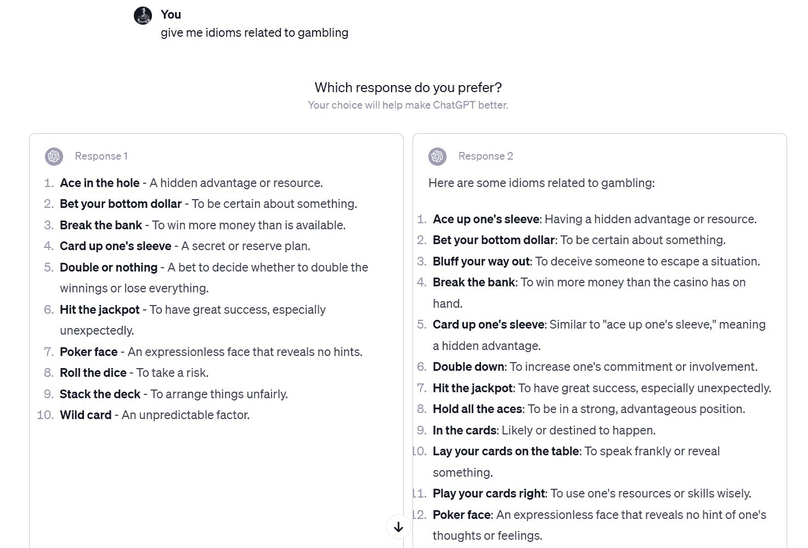
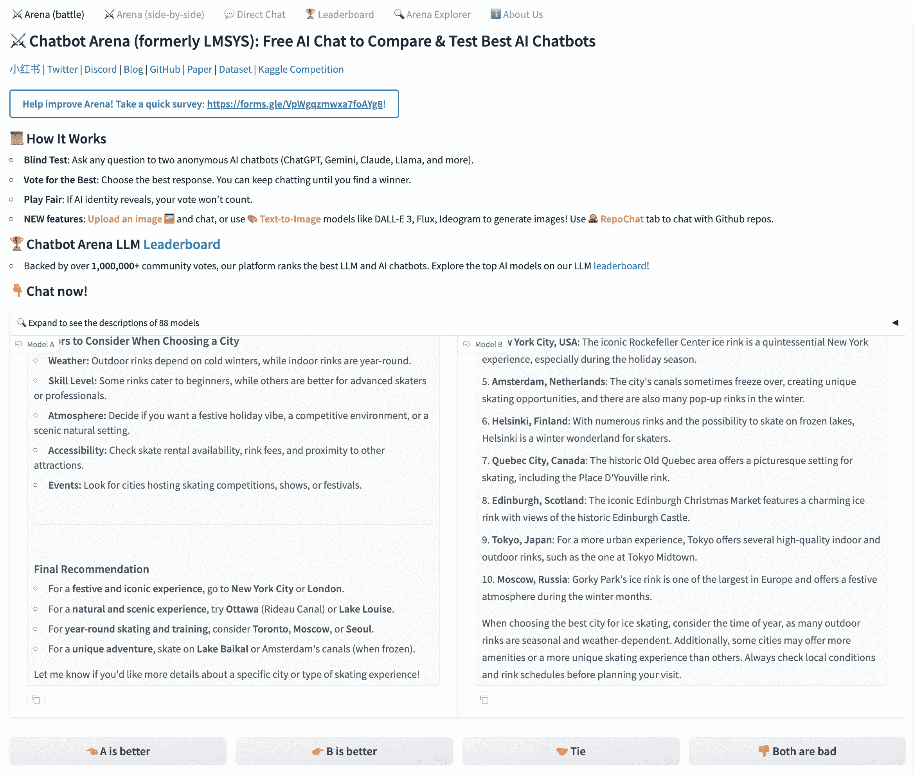
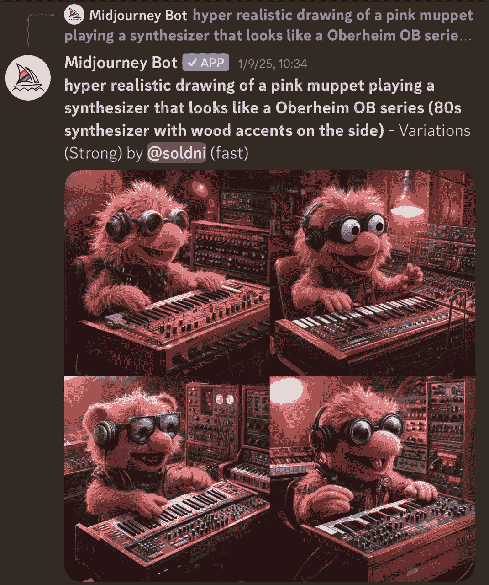
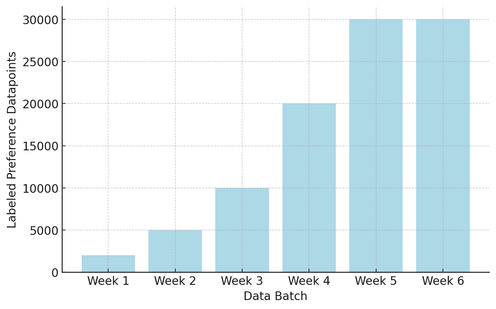

# 偏好数据

偏好数据是偏好微调和从人类反馈中进行强化学习的基础。我们一直在尝试通过强化学习与人类反馈（RLHF）解决的核心问题是，我们无法精确地模拟人类对 AI 模型输出的奖励和偏好——就像编写明确的损失函数来优化一样——因此，偏好数据是我们用来调整模型的中介信号。这些数据使我们能够匹配我们希望的行为并避免我们讨厌的一些失败模式。数据资源如此丰富，以至于很难完全替代这种优化方式。在偏好微调中，已经提出了许多收集和使用此类数据的方法，鉴于人类偏好无法被清晰地纳入奖励函数，未来还将有更多方法来支持在 RLHF 和相关技术中收集标记的偏好数据这一核心过程。今天，围绕偏好数据存在两个主要挑战，这两个挑战与本章内容紧密相关：1）收集操作的复杂性和成本，以及 2）需要从正在训练的模型生成的数据中收集偏好数据（称为“按策略”）；

在本章中，我们详细介绍了数据格式化的技术决策以及收集数据的组织实践。

## 我们为什么需要偏好数据

偏好数据对于 RLHF 来说是必需的，因为像前一章第五章所讨论的那样，直接在单个奖励函数中捕捉复杂的人类价值观实际上是不可行的，因为心理学、经济学和哲学的大量背景表明，准确模拟人类偏好是一个永远无法完全解决的问题。收集这些数据以训练奖励模型是 RLHF 背后的原始想法之一，并且在现代语言模型出现的过程中一直被广泛使用。为什么这些数据如此有效的一个核心直觉是，对于人类和监督数据收集的 AI 模型来说，区分一个好答案和一个坏答案比单独生成一个好答案要容易得多。本章重点介绍获取偏好数据的机制和最佳实践，这些最佳实践取决于具体要解决的问题。

## 收集偏好数据

充分利用人类数据涉及对模型进行迭代训练，花费数十万（或数百万）美元，高度详细的数据指令，通过中介收集（或雇佣大量标注员）的数据铸造业务来翻译想法，以及其他累积的挑战。这不是一个应该被轻视的过程。在所有关于 RLHF 的公共知识中，收集这些数据也是管道中最不透明的一部分。在撰写本文时，没有公开的模型发布了用于收集人类偏好数据的方法（为模型发布的最大和最新的人类偏好数据集是 NVIDIA 的 Nemotron 团队的帮助 Steer 工作线 [[111]](ch021.xhtml#ref-wang2024helpsteer2p))。因此，许多从事 RLHF 的新团队或项目的人省略了人类数据，并使用 AI 反馈数据、现成的奖励模型或其他方法来规避从头开始整理数据的需求。

在偏好数据收集过程中所采用的一个重要假设是，对于您的训练过程来说，最佳数据是相对于训练过程中的先前检查点“按策略”的。回想一下，在训练后，我们从一个基础模型开始，然后执行一系列训练**阶段**来创建一系列**检查点**。在这种情况下，偏好数据可以从经过监督微调的检查点收集，偏好数据将在 RLHF 训练的下一阶段使用。

这里使用“按策略”一词是从强化学习文献中借鉴的，其中“按策略”是一个技术术语，意味着某个梯度更新的数据是从策略的最新形式收集的。在偏好数据中，“按策略”的使用方式稍微温和一些，意味着数据是从当前模型系列中收集的。不同的模型在生成模式上有所不同，这使得来自密切相关模型的偏好数据在优化的关键领域更加稳健。研究表明，使用这种按策略数据，而不是其他流行的数据集，这些数据集从 HuggingFace 等平台上的多个流行模型中汇总完成，对于有效的 RLHF 训练尤为重要 [[112]](ch021.xhtml#ref-malik2025rewardbench)。

这种对按策略数据的需求并没有得到很好的记录，但许多流行的技术报告，如 Claude 或 Llama 2 的早期版本，展示了多个训练阶段，其中 RLHF 对于最终性能是有益的，这很好地反映了这一点。同样的不确定性也适用于流行的 AI 反馈数据领域——用于最新 AI 模型的人类和 AI 偏好数据的精确平衡是未知的。这些数据源被认为是提高性能的有价值途径，但需要仔细调整流程以从数据管道中提取这种潜在的性能。 

一个微妙但重要的观点是，在偏好数据中，*选择的*答案通常不是全局*正确*的答案。相反，它是相对于所展示的替代方案更好的答案（例如，更清晰、更安全、更有帮助或更少错误）。可能存在所有被比较的完成内容与给定提示都是正确或错误的情况，而模型仍然可以从良好标注的数据中学习。

### 接口

收集偏好数据的关键是用户与模型交互的接口，但这更像是一门艺术而不是科学，因为接口的微妙变化如何影响用户与模型的交互并没有得到很好的研究。一个用户体验如何改变模型感觉的例子是*速度*，随着推理模型的出现，如果模型回复得太快，用户可能会认为模型不太智能（尽管用户显然希望更快地得到答案）。

下面展示了 Anthropic 早期和基础 RLHF 工作构建 Claude 的一个示例接口 [[5]](ch021.xhtml#ref-bai2022training)。在下面的图中，图 8，数据标注者与模型进行对话，并必须在两个可能的答案中选择一个偏好，底部用紫色突出显示。此外，标注者还被赋予了在对话中包含更多笔记或对对话质量进行总体评价（可能跨越多个任务，如上图左上角所示）的可能性。

图 8：从 Anthropic 的研究中摘录的一个早期偏好数据收集接口示例。Bai 等人，2022。实际的对话是一个关于什么是好的数据收集对话示例的玩具对话。许可 CC-BY。

这个第一个例子是一个*仅训练数据*的接口，其目标是收集与对话相关的丰富元数据。现在这些模型很受欢迎，应用程序通常在日常使用中向用户直接暴露用于收集偏好的接口，就像其他技术产品会在生产使用的子集中进行 A/B 测试新功能一样。这取决于应用程序，这些偏好数据是否直接用于训练未来的模型，或者只是作为模型之间性能评估的一种方式。下面图 9 展示了这种形式的一个示例交互，是 ChatGPT 的一个早期版本。

图 9：当我从不同的 ChatGPT beta 模型中收到两个完成项时的偏好数据收集界面示例。实际完成项在内容上非常接近，展示了收集偏好数据可能会很嘈杂且难以完全准确。

这种界面风格在行业内被广泛使用，例如用于相同格式的模型**评估**。一种流行的公共选项是与模型以这种方式互动是 ChatBotArena [[113]](ch021.xhtml#ref-chiang2024chatbot)，其中包括模型之间“平局”的选项：

图 10：来自流行的 LMArena 基准早期版本的偏好数据收集界面示例。

对于野外的模型，最常见的技术之一是收集关于特定响应是正面还是负面的反馈。以下是一个来自 Ai2 游乐场的示例，包括向上和向下的点赞指标：

图 11：来自艾伦人工智能研究所研究演示的带有上下箭头的偏好数据收集界面示例。

在语言以外的领域，同样的核心原则适用，尽管这些领域不是本书的重点。对于每次 Midjourney 生成（以及大多数流行的图像生成器）它们向用户展示多个响应。然后，这些公司使用用户选择的响应数据，通过 RLHF 微调他们的模型。以下展示了 Midjourney 的界面：

图 12：文本到图像模型的用户界面示例。

### 排名与评分

收集偏好数据的最大决策是数据应该是排名——即模型完成的相对顺序——还是评分——即分配给每段文本的分数。常见的做法是在排名上训练，但评分通常用作元数据，或者已经在相关文献中进行了探索。

收集评分的一个简单方法是在 1 到 5 的尺度上对单个完成项进行评分：

+   **5** — 优秀：正确、清晰且非常有帮助

+   **4** — 好：正确、清晰且有用

+   **3** — 一般：可接受，但没有什么特别之处

+   **2** — 差：部分正确但令人困惑或不完整

+   **1** — 非常差：不正确或无帮助

对于相同提示的多个完成项，制作偏好数据的一个简单方法是从最高评分的完成项中选择，并将其随机与评分较低的完成项配对（如 UltraFeedback 及其衍生作品[[23]](ch021.xhtml#ref-cui2023ultrafeedback)所做的那样）。

尽管如此，收集偏好的最常见技术是使用李克特量表进行相对排名 [[114]](ch021.xhtml#ref-likert1932technique)，要求用户在一组完成中选择他们更偏好的响应。例如，5 点李克特量表看起来如下（请注意，是的，李克特量表使用单个整数来记录排名，就像评分一样，因此数据结构的不同是两种收集偏好数据方式的核心区别）：

表 2：两个响应 A 和 B 之间的 5 点李克特量表示例。

| A<semantics><mrow><mo>></mo><mo>></mo></mrow><annotation encoding="application/x-tex">>></annotation></semantics>B | A<semantics><mo>></mo><annotation encoding="application/x-tex">></annotation></semantics>B | 平局 | B<semantics><mo>></mo><annotation encoding="application/x-tex">></annotation></semantics>A | B<semantics><mrow><mo>></mo><mo>></mo></mrow><annotation encoding="application/x-tex">>></annotation></semantics>A |
| --- | --- | --- | --- | --- |
| 1 | 2 | 3 | 4 | 5 |

一些早期的语言模型 RLHF 工作使用 8 步李克特量表，其中两个响应之间的偏好级别 [[5]](ch021.xhtml#ref-bai2022training)。一个偶数量表消除了平局的可能性：

表 3：两个响应 A 和 B 之间的 8 点李克特量表示例。

| A<semantics><mrow><mo>></mo><mo>></mo><mo>></mo></mrow><annotation encoding="application/x-tex">>>></annotation></semantics>B |  |  | A<semantics><mo>></mo><annotation encoding="application/x-tex">></annotation></semantics>B | B<semantics><mo>></mo><annotation encoding="application/x-tex">></annotation></semantics>A |  |  | B<semantics><mrow><mo>></mo><mo>></mo><mo>></mo></mrow><annotation encoding="application/x-tex">>>></annotation></semantics>A |
| --- | --- | --- | --- | --- | --- | --- | --- |
| 1 | 2 | 3 | 4 | 5 | 6 | 7 | 8 |

在这种情况下 [[5]](ch021.xhtml#ref-bai2022training)，与其他工作一样，此信息仍被简化为二进制信号以用于奖励模型的训练。

### 多轮数据

在实践中，核心问题通常涉及如何解析和收集多轮数据——简单地说，就是与多个相关提示的对话。在现实世界的交互中，通常只在“最终”提示上收集偏好数据，但在某些情况下，可以在每个响应上给出偏好。当在每个响应上给出偏好时，对话传统上会继续以“所选”答案为结尾。在训练时间，通常将对话的每个轮次的训练数据作为一个“单个提示”包括在内，这样模型可以从完成它中学习。这可以有效地将更长的对话展开成许多训练提示，但需要谨慎操作，以免对训练数据产生偏差。许多研究问题仍在出现，例如，标记生成偏好的人是否应该与创建提示的人相同（以避免谄媚），以及难以在数据收集中控制的变量（问题[受约翰·舒尔曼启发](https://x.com/johnschulman2/status/1917483351436582953)))。如果提示创建者不能标记偏好数据，多轮对话实际上并不实用，因为需要实时继续对话——有时对于偏好数据，提示的编纂可能是一个不同于比较响应的问题（也由于维护模型活跃端点的工作）。对于训练，如前所述，与指令微调讨论的，将对话中的所有先前轮次在损失中屏蔽。

### 结构化偏好数据

在许多 RLHF 和训练后应用中，由于数据的内在结构，偏好数据可以*自动*创建——即，领域使得自动检查正确性或偏好成为可能。例如，在数学推理领域，所选的响应可以是正确答案，而被拒绝的是错误答案。另一个例子是在精确指令遵循中，例如 IFEval [[115]](ch021.xhtml#ref-zhou2023instructionfollowingevaluationlargelanguage)的评估，其中提示的形式如下：

> 为我写一首关于金鱼的短诗。**每个句子以字母 g 开头**。

这个查询的第二部分被称为约束，偏好数据可以通过在满足约束的选定列中的示例来构建。构建这种偏好数据，它将被包括为*合成*偏好数据，涉及到对同一模型（或多个模型）进行两次提示。一次包含约束，一次不包含。

例如，用这两个提示提示 GPT-4.5-Preview，得到以下结果。

> **提示**：为我写一首关于金鱼的短诗。每个句子以字母 g 开头。
> 
> **响应**：金鱼游泳，缓缓环绕，在水中闪耀的鳞片。温柔的鳍轻轻舞动，静静地凝视着。玻璃般的世界，一个简单的球体，平静地滑行，无惧恐惧。优雅的转身在无尽的漫游中，金鱼找到了一个水晶般的家。

而没有约束（实际上，这也导致了较低质量的结果）：

> **提示**：为我写一首关于金鱼的短诗。
> 
> **回应**：在明亮的人群中，金鱼游动，一束阳光轻轻驶过清澈的水面，在无尽的旋转中——金色的低语，鳞片如鳍。
> 
> 它的世界虽受限制，但内部广阔，每个气泡呼吸，一个故事开始。在无声的波浪中，满足于漫游，金鱼梦想着它的鱼缸就是家。

关键的是，对偏好数据的提示需要包含约束条件。在学术研究之外的领域，基于上述归纳偏差（相对于本章主要关注的基于质量的偏好）的偏好数据应用更为广泛。这些数据已被证明能够使偏好微调在相关评估（如指令遵循、数学等）中实现有意义的性能提升。6。

#### 替代方案

有多种其他方式可以收集对 RLHF 有用的反馈数据，但尚未详细探讨。例如，使用带有方向标签的单个数据点，例如上图所示，直接使用为单方向信号设计的算法，如 Kahneman-Tversky 优化（KTO）[[116]](ch021.xhtml#ref-ethayarajh2024kto）。还提出了具有不同类型反馈信号的算法，例如细粒度反馈，例如在标记级别[[117]](ch021.xhtml#ref-wu2024fine)，或自然语言反馈，例如通过撰写回应[[118]](ch021.xhtml#ref-chen2024learning)，以提供更丰富的学习信号，以换取更复杂的数据收集设置。

### 数据来源和合同

获取人类偏好数据是一个复杂且昂贵的流程。以下描述了在领域快速发展的过程中获取偏好数据的经验。随着时间的推移，这些流程将变得更加自动化和高效（尤其是在 AI 反馈被用于更大比例的流程时）。

第一步是寻找供应商提供数据（或自己的标注员）。就像获取访问最前沿的 Nvidia GPU 一样，在 AI 热情高涨的顶峰时期获取数据提供者的访问也是一个“认识谁”的游戏——能够提供数据的人是供应受限的。如果你在 AI 生态系统中拥有信誉，最好的数据公司会希望你在他们的名单上，以提升公众形象和长期增长机会。通常也会在第一批数据上提供折扣，以吸引训练团队。

如果你刚进入这个领域，你可能很难快速获取所需的数据。数据供应商通常优先考虑预算较大的项目和新客户，这些客户拥有有影响力的品牌或未来可能带来大量收入的潜力。这在许多商业方式中是自然的，因为数据铸造公司通常在组织人力进行有效数据标注的能力上受到供应限制。

在多次场合，我听说数据公司没有按照合同交付数据，除非客户威胁要对他们采取法律或财务行动以违约。还有一些公司将我合作的公司列为客户进行公关，尽管我们从未与他们合作，他们在联系时表示“不知道怎么会这样”。在整个过程中，存在许多潜在的官僚或行政障碍。例如，合同中的默认条款通常在收购后的一些细节中禁止开源工件。

一旦合同达成，数据购买方和数据提供方就购买的任务（们）达成指令。存在复杂的文件，其中包含详尽的细节、边缘情况和数据优先级。数据指令的一个流行例子是 [OpenAI 为 InstructGPT 发布的](https://docs.google.com/document/d/1MJCqDNjzD04UbcnVZ-LmeXJ04-TKEICDAepXyMCBUb8/edit#heading=h.21o5xkowgmpj) [[3]](ch021.xhtml#ref-ouyang2022training)。

根据数据中感兴趣领域的不同，数据可以标注或整理的时间表也会有所变化。对于数学推理或编码等需求高的领域，必须提前几周锁定日程。在你收集用于下一个模型的数据集时，如果你意识到稍后收集数据可能更优，简单的数据收集延迟并不总是有效——Scale AI 等公司正在像 AI 研究实验室管理其集群上的计算密集型工作一样管理他们的工作团队（提前几周或几个月规划不同资源将分配到何处）。

一切达成一致后，实际的收集过程对后训练团队来说是一个高风险的时期。所有训练基础设施、评估工具以及如何使用数据和做出下游决策的计划都必须到位。如果数据不能轻松地整合到现有的 RLHF 数据管道中，那么获取数据合作伙伴想要的信息以尝试在过程中改进收集过程将需要很长时间。无法无缝整合到训练管道中的数据往往变得过时，浪费资源。

数据以每周批次的形式交付，合同中规定后续还将有更多数据。例如，当我们为在 HuggingFace 训练的按策略模型购买偏好数据时，我们有 6 周的交付期。前几周用于进一步校准，而后期则是我们希望最能改进模型的时候。

图 13：从供应商处获取人类偏好数据的批量周期概述。爬坡期允许缩小目标和方法的范围，以创建最佳可能的数据。预计早期批次的数据中将有较大比例因质量问题而不得不被丢弃。这是针对较小数据合同（约 500K 美元）的一个时间线示例，而更大的数据合同可能会有很大差异。

目标是在第 4 周或第 5 周时看到数据改善我们的模型。这是某些前沿模型提到的事情，例如 Llama 2 数据收集的 14 个阶段[[44]](ch021.xhtml#ref-touvron2023llama)，但这并不总是顺利进行。在 HuggingFace，我们第一次尝试使用人类偏好来做这件事，我们没有准备好 RLHF 来在我们评估中获得有意义的提升。最后几周过去了，我们被迫继续收集来自我们不太有信心的端点的偏好数据。

数据全部到位后，有足够的时间来学习和改进模型。将这些供应商的数据获取视为实现既定目标的持续过程最为有效。它需要迭代实验、高投入和专注。很可能在这些数据集上花费的数百万美元是“浪费”的，并且没有用于最终模型，但这只是商业活动的成本。很少有组织有足够的带宽和专业知识来充分利用这种风格的人类数据。

与合成数据的简单性相比，这次经历让我想知道这些公司在下一个十年里会做得如何。

注意，本节**不**反映购买人工编写指令数据的经验，其中过程的时间压力较小。早期的训练后过程是围绕训练的第一阶段，这一阶段主要是由对一系列提示精心制作的、人工的回答驱动的。这一阶段的数据不受多项政策限制，原因有很多：指令数据直接用于基础模型之上，因此政策限制实际上不适用；指令微调的损失函数不需要偏好微调的对比数据；以及其他结构性优势。今天，人类数据的主要其他焦点在于生成训练后的提示——这决定了模型的训练主题分布——或者在模型性能前沿的挑战性任务。更多关于这些数据权衡的讨论见第十六章关于合成数据。

## 偏见：数据收集中需要注意的事项

尽管偏好数据至关重要，但它也众所周知容易受到许多微妙的偏见的影响，这些偏见可能导致收集错误。这些偏见如此普遍，例如前缀偏见（一个完成的开始部分不成比例地驱动偏好）[[119]](ch021.xhtml#ref-kumar2025detecting)，它们可以轻易地传递到最终模型[[120]](ch021.xhtml#ref-bharadwaj2025flatteryflufffogdiagnosing)（尤其是我们知道模型的好坏取决于其数据）。这些问题通常很微妙，并且干预措施的有效性各不相同。对于许多人来说，例如拍马屁（过度同意用户的陈述信念或奉承他们，即使这减少了真实性）[[121]](ch021.xhtml#ref-sharma2023towards)，它们反映了人类内部的问题，这些问题通常超出了人们会想到提供给注释合作伙伴或标注者的标签标准。其他，如冗长[[9]](ch021.xhtml#ref-singhal2023long) [[122]](ch021.xhtml#ref-bu2025beyond) 或格式习惯[[123]](ch021.xhtml#ref-zhang2024lists)，由于类似的原因出现，但它们在训练中更容易检测和缓解。减轻这些微妙的偏见是良好或优秀偏好数据，以及因此良好或优秀 RLHF 训练之间的区别。

## RLHF 偏好数据中的开放性问题

用于启用 RLHF 的数据通常由多个利益相关者通过付费工作和消费者使用相结合的方式进行整理。这些数据代表了个别实例中两段文本之间的偏好，通过极其有限的交互捕捉了广泛而多样的功能。鉴于与它所代表的复杂性相比数据量稀疏，关于其整理和影响的问题应该更公开地分享。

目前，最受欢迎的 LLM 的数据集正在由专业工作团队生成。这引发了许多关于谁在创建数据以及他们工作场所的背景如何影响数据的疑问。

尽管 RLHF 作为跨领域核心方法已经成熟，但仍然存在许多核心开放性问题，关乎如何将其实践与其动机最佳对齐。以下是一些列举的问题：

+   **数据收集环境**：在专业环境中收集的涉及偏好的数据能否反映研究人员设计实验的意图，或者为下游用户提供合适的迁移？这与志愿者工作者相比如何？环境如何影响偏好，这些数据如何影响下游模型，如何衡量用户界面在数据中的影响？重复标注偏好数据如何改变一个人的偏好？被指示遵循一系列偏好的专业众包工作者会遵循指示还是他们固有的价值观？ 

+   **反馈类型**：RLHF 的默认操作方法是否能够以预期形式捕捉成对偏好的偏好？能否在相同数据上使用默认比较与高级多轴反馈机制**wu2023fine**进行比较？哪些类型的比较能够反映人类在文本中表达偏好的方式？

+   **人口统计学**：谁在完成数据？是否保持了多元化的群体？缺乏多元化如何作为可衡量的影响出现在模型中？需要多少人才能合适地代表一个特定的群体？如何处理偏好标注员之间的不一致——作为噪声的来源，还是作为信号的来源？

+   **模型中是否表达了偏好？** 在 RLHF 和相关方法成熟的过程中，它们的动机——将模型与人类偏好的抽象概念对齐——已经从实用目的——使模型对用户更有效——偏离。由于工业 RLHF 工作的封闭性质，无法衡量的反馈循环是检查模型行为是否与数据收集过程中数据标注员收到的规格说明相匹配的检验。我们有限的审计工具，如 OpenAI 的模型规范[[124]](ch021.xhtml#ref-openai2024modelspec)，详细说明了*他们希望模型做什么*，但我们不知道这如何具体转化为数据收集。
