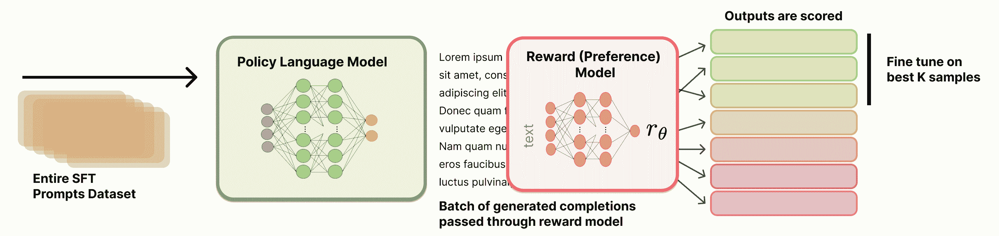

# 拒绝采样

拒绝采样 (RS) 是进行偏好微调的一个流行且简单的基础线。这使得它成为在第一轮指令微调之后用于进一步细化模型以符合人类偏好的少数几种方法之一。拒绝采样通过精心挑选新的候选完成，根据训练好的奖励模型进行过滤，然后仅在顶部完成上进行指令微调（与为学习遵循指令而进行的专用训练阶段相同的损失函数）。

这个名字起源于计算统计学 [[175]](ch021.xhtml#ref-gilks1992adaptive)，在那里，人们希望从一个复杂的分布中进行采样，但没有直接的方法来做这件事。为了缓解这个问题，人们从更简单的分布中进行采样来建模，并使用启发式方法来检查样本是否可接受。在语言模型中，目标分布是对提示的高质量完成，过滤器是一个奖励模型，采样分布是当前模型。

许多著名的 RLHF 和偏好微调论文都使用了拒绝采样作为基线，但并没有一个标准的实现和文档。

WebGPT [[4]](ch021.xhtml#ref-nakano2021webgpt)，Anthropic 的有益无害代理 [[5]](ch021.xhtml#ref-bai2022training)，OpenAI 关于过程奖励模型的流行论文 [[45]](ch021.xhtml#ref-lightman2023let)，Llama 2 Chat 模型 [[44]](ch021.xhtml#ref-touvron2023llama)，以及其他开创性工作都使用了这个基线；更近期的作品直接对其进行了形式化（例如，RAFT [[176]](ch021.xhtml#ref-dong2023raft) 用于将其应用于多模态的对齐，以及统计拒绝采样优化 (RSO) [[177]](ch021.xhtml#ref-liu2023statistical)，它提供了一个关于拒绝采样如何与其他偏好学习目标相关联的原理性概述）。

*在本章中，我们使用 <semantics><mi>x</mi><annotation encoding="application/x-tex">x</annotation></semantics> 来表示提示，使用 <semantics><mi>y</mi><annotation encoding="application/x-tex">y</annotation></semantics> 来表示完成。这种符号在语言模型文献中很常见，其中方法操作的是完整的提示-完成对，而不是单个标记。*

## 训练过程

拒绝采样总体上遵循几个阶段。

1.  **提示和奖励模型选择：** 首先，你必须选择你想要在训练中使用的提示，相对于训练的其他阶段。最简单的方法是重用第一轮 SFT/IFT 阶段的每个提示，但这可能会导致一些过拟合。在进行拒绝采样之前，你还必须已经训练了一个奖励模型（更多信息请参阅第七章）。

1.  **从起始检查点生成完成内容**：接下来，必须使用他们想要优化的模型生成所选提示的完成内容。这可能涉及调整许多设置，例如采样温度、top-p、最大序列长度、每个提示的完成数量等。

1.  **使用奖励模型选择顶级完成**：所有完成内容都通过奖励模型进行排名。这可以包括去重，以便在这一点之后每个完成内容只有一个提示，或者不进行去重，因为许多决策都基于经验消除研究。

1.  **在顶级完成上进行 SFT**：为了完成拒绝采样，一条指令对所选的完成内容上的起始检查点进行微调。

拒绝采样过程的视觉概述如下，见图 14。



图 14：拒绝采样概述。

关于使用哪些提示、如何选择奖励模型、如何进行拒绝采样排序等实际细节，在文献中并没有很好地记录。本章提供了方法概述，并将进一步的实验留给读者。

### 1. 生成完成内容

为了为每个提示生成一组多个候选完成，让我们定义一组<semantics><mi>M</mi><annotation encoding="application/x-tex">M</annotation></semantics>提示作为一个向量：

<semantics><mrow><mi>X</mi><mo>=</mo><mo stretchy="false" form="prefix">[</mo><msub><mi>x</mi><mn>1</mn></msub><mo>,</mo><msub><mi>x</mi><mn>2</mn></msub><mo>,</mo><mi>.</mi><mi>.</mi><mi>.</mi><mo>,</mo><msub><mi>x</mi><mi>M</mi></msub><mo stretchy="false" form="postfix">]</mo></mrow><annotation encoding="application/x-tex">X = [x_1, x_2, ..., x_M]</annotation></semantics>

这些提示可以来自许多来源，但最常见的是来自指令训练集。

对于每个提示<semantics><msub><mi>x</mi><mi>i</mi></msub><annotation encoding="application/x-tex">x_i</annotation></semantics>，我们生成<semantics><mi>N</mi><annotation encoding="application/x-tex">N</annotation></semantics>个完成。我们可以将这表示为一个矩阵：

其中 <semantics><msub><mi>y</mi><mrow><mi>i</mi><mo>,</mo><mi>j</mi></mrow></msub><annotation encoding="application/x-tex">y_{i,j}</annotation></semantics> 代表第 <semantics><mi>j</mi><annotation encoding="application/x-tex">j</annotation></semantics> 个对第 <semantics><mi>i</mi><annotation encoding="application/x-tex">i</annotation></semantics> 个提示的完成。每一行 <semantics><mi>i</mi><annotation encoding="application/x-tex">i</annotation></semantics> 对应一个单独的提示 <semantics><msub><mi>x</mi><mi>i</mi></msub><annotation encoding="application/x-tex">x_i</annotation></semantics>，并包含其 <semantics><mi>N</mi><annotation encoding="application/x-tex">N</annotation></semantics> 个候选完成；每一列 <semantics><mi>j</mi><annotation encoding="application/x-tex">j</annotation></semantics> 对应所有提示中的第 <semantics><mi>j</mi><annotation encoding="application/x-tex">j</annotation></semantics> 个采样完成。

### 2. 评分完成

现在，我们将所有这些提示-完成对通过一个奖励模型，以获得一个奖励矩阵。我们将奖励表示为一个矩阵 <semantics><mi>R</mi><annotation encoding="application/x-tex">R</annotation></semantics>：

<semantics><mrow><mi>R</mi><mo>=</mo><mrow><mo stretchy="true" form="prefix">[</mo><mtable><mtr><mtd columnalign="center" style="text-align: center"><msub><mi>r</mi><mrow><mn>1</mn><mo>,</mo><mn>1</mn></mrow></msub></mtd><mtd columnalign="center" style="text-align: center"><msub><mi>r</mi><mrow><mn>1</mn><mo>,</mo><mn>2</mn></mrow></msub></mtd><mtd columnalign="center" style="text-align: center"><mi>⋯</mi></mtd><mtd columnalign="center" style="text-align: center"><msub><mi>r</mi><mrow><mn>1</mn><mo>,</mo><mi>N</mi></mrow></msub></mtd></mtr><mtr><mtd columnalign="center" style="text-align: center"><msub><mi>r</mi><mrow><mn>2</mn><mo>,</mo><mn>1</mn></mrow></msub></mtd><mtd columnalign="center" style="text-align: center"><msub><mi>r</mi><mrow><mn>2</mn><mo>,</mo><mn>2</mn></mrow></msub></mtd><mtd columnalign="center" style="text-align: center"><mi>⋯</mi></mtd><mtd columnalign="center" style="text-align: center"><msub><mi>r</mi><mrow><mn>2</mn><mo>,</mo><mi>N</mi></mrow></msub></mtd></mtr><mtr><mtd columnalign="center" style="text-align: center"><mi>⋮</mi></mtd><mtd columnalign="center" style="text-align: center"><mi>⋮</mi></mtd><mtd columnalign="center" style="text-align: center"><mo>⋱</mo></mtd><mtd columnalign="center" style="text-align: center"><mi>⋮</mi></mtd></mtr><mtr><mtd columnalign="center" style="text-align: center"><msub><mi>r</mi><mrow><mi>M</mi><mo>,</mo><mn>1</mn></mrow></msub></mtd><mtd columnalign="center" style="text-align: center"><msub><mi>r</mi><mrow><mi>M</mi><mo>,</mo><mn>2</mn></mrow></msub></mtd><mtd columnalign="center" style="text-align: center"><mi>⋯</mi></mtd><mtd columnalign="center" style="text-align: center"><msub><mi>r</mi><mrow><mi>M</mi><mo>,</mo><mi>N</mi></mrow></msub></mtd></mtr></mtable><mo stretchy="true" form="postfix">]</mo></mrow></mrow><annotation encoding="application/x-tex">R = \begin{bmatrix} r_{1,1} & r_{1,2} & \cdots & r_{1,N} \\ r_{2,1} & r_{2,2} & \cdots & r_{2,N} \\ \vdots & \vdots & \ddots & \vdots \\ r_{M,1} & r_{M,2} & \cdots & r_{M,N} \end{bmatrix}</annotation></semantics>

每个奖励 <semantics><msub><mi>r</mi><mrow><mi>i</mi><mo>,</mo><mi>j</mi></mrow></msub><annotation encoding="application/x-tex">r_{i,j}</annotation></semantics> 都是通过将完成 <semantics><msub><mi>y</mi><mrow><mi>i</mi><mo>,</mo><mi>j</mi></mrow></msub><annotation encoding="application/x-tex">y_{i,j}</annotation></semantics> 和其对应的提示 <semantics><msub><mi>x</mi><mi>i</mi></msub><annotation encoding="application/x-tex">x_i</annotation></semantics> 通过一个奖励模型 <semantics><mi>ℛ</mi><annotation encoding="application/x-tex">\mathcal{R}</annotation></semantics> 来计算的：

<semantics><mrow><msub><mi>r</mi><mrow><mi>i</mi><mo>,</mo><mi>j</mi></mrow></msub><mo>=</mo><mi>ℛ</mi><mo stretchy="false" form="prefix">(</mo><msub><mi>y</mi><mrow><mi>i</mi><mo>,</mo><mi>j</mi></mrow></msub><mo>∣</mo><msub><mi>x</mi><mi>i</mi></msub><mo stretchy="false" form="postfix">)</mo></mrow><annotation encoding="application/x-tex">r_{i,j} = \mathcal{R}(y_{i,j} \mid x_i)</annotation></semantics>

有多种方法可以选择用于训练的最高完成项。

为了形式化基于我们的奖励矩阵选择最佳完成项的过程，我们可以定义一个选择函数<semantics><mi>S</mi><annotation encoding="application/x-tex">S</annotation></semantics>，它作用于奖励矩阵<semantics><mi>R</mi><annotation encoding="application/x-tex">R</annotation></semantics>。

#### 最高提示

第一个潜在的选择函数取每个提示的最大奖励。

<semantics><mrow><mi>S</mi><mo stretchy="false" form="prefix">(</mo><mi>R</mi><mo stretchy="false" form="postfix">)</mo><mo>=</mo><mo stretchy="false" form="prefix">[</mo><mrow><mi mathvariant="normal">arg</mi><mo>⁡</mo></mrow><munder><mi mathvariant="normal">max</mi><mi>j</mi></munder><msub><mi>r</mi><mrow><mn>1</mn><mo>,</mo><mi>j</mi></mrow></msub><mo>,</mo><mrow><mi mathvariant="normal">arg</mi><mo>⁡</mo></mrow><munder><mi mathvariant="normal">max</mi><mi>j</mi></munder><msub><mi>r</mi><mrow><mn>2</mn><mo>,</mo><mi>j</mi></mrow></msub><mo>,</mo><mi>.</mi><mi>.</mi><mi>.</mi><mo>,</mo><mrow><mi mathvariant="normal">arg</mi><mo>⁡</mo></mrow><munder><mi mathvariant="normal">max</mi><mi>j</mi></munder><msub><mi>r</mi><mrow><mi>M</mi><mo>,</mo><mi>j</mi></mrow></msub><mo stretchy="false" form="postfix">]</mo></mrow><annotation encoding="application/x-tex">S(R) = [\arg\max_{j} r_{1,j}, \arg\max_{j} r_{2,j}, ..., \arg\max_{j} r_{M,j}]</annotation></semantics>

这个函数<semantics><mi>S</mi><annotation encoding="application/x-tex">S</annotation></semantics>返回一个索引向量，其中每个索引对应于<semantics><mi>R</mi><annotation encoding="application/x-tex">R</annotation></semantics>中每行的最大奖励列。然后我们可以使用这些索引来选择我们的选择完成项：

<semantics><mrow><msub><mi>Y</mi><mrow><mi>c</mi><mi>h</mi><mi>o</mi><mi}s</mi><mi>e</mi><mi>n</mi></mrow></msub><mo>=</mo><mo stretchy="false" form="prefix">[</mo><msub><mi>y</mi><mrow><mn>1</mn><mo>,</mo><mi>S</mi><mo stretchy="false" form="prefix">(</mo><mi>R</mi><msub><mo stretchy="false" form="postfix">)</mo><mn>1</mn></msub></mrow></msub><mo>,</mo><msub><mi>y</mi><mrow><mn>2</mn><mo>,</mo><mi>S</mi><mo stretchy="false" form="prefix">(</mo><mi>R</mi><msub><mo stretchy="false" form="postfix">)</mo><mn>2</mn></msub></mrow></msub><mo>,</mo><mi>.</mi><mi>.</mi><mi>.</mi><mo>,</mo><msub><mi>y</mi><mrow><mi>M</mi><mo>,</mo><mi>S</mi><mo stretchy="false" form="prefix">(</mo><mi>R</mi><msub><mo stretchy="false" form="postfix">)</mo><mi>M</mi></msub></mrow></msub><mo stretchy="false" form="postfix">]</mo></mrow><annotation encoding="application/x-tex">Y_{chosen} = [y_{1,S(R)_1}, y_{2,S(R)_2}, ..., y_{M,S(R)_M}]</annotation></semantics>

#### 总体前 K 对

或者，我们可以从整个集合中选择前 K 个提示-完成对。首先，让我们将奖励矩阵 R 展平成一个单一向量：

<semantics><mrow><msub><mi>R</mi><mrow><mi>f</mi><mi>l</mi><mi>a</mi><mi>t</mi></mrow></msub><mo>=</mo><mo stretchy="false" form="prefix">[</mo><msub><mi>r</mi><mrow><mn>1</mn><mo>,</mo><mn>1</mn></mrow></msub><mo>,</mo><msub><mi>r</mi><mrow><mn>1</mn><mo>,</mo><mn>2</mn></mrow></msub><mo>,</mo><mi>.</mi><mi>.</mi><mi>.</mi><mo>,</mo><msub><mi>r</mi><mrow><mn>1</mn><mo>,</mo><mi>N</mi></mrow></msub><mo>,</mo><msub><mi>r</mi><mrow><mn>2</mn><mo>,</mo><mn>1</mn></mrow></msub><mo>,</mo><msub><mi>r</mi><mrow><mn>2</mn><mo>,</mo><mn>2</mn></mrow></msub><mo>,</mo><mi>.</mi><mi>.</mi><mi>.</mi><mo>,</mo><msub><mi>r</mi><mrow><mn>2</mn><mo>,</mo><mi>N</mi></mrow></msub><mo>,</mo><mi>.</mi><mi>.</mi><mi>.</mi><mo>,</mo><msub><mi>r</mi><mrow><mi>M</mi><mo>,</mo><mn>1</mn></mrow></msub><mo>,</mo><msub><mi>r</mi><mrow><mi>M</mi><mo>,</mo><mn>2</mn></mrow></msub><mo>,</mo><mi>.</mi><mi>.</mi><mi>.</mi><mo>,</mo><msub><mi>r</mi><mrow><mi>M</mi><mo>,</mo><mi>N</mi></mrow></msub><mo stretchy="false" form="postfix">]</mo></mrow><annotation encoding="application/x-tex">R_{flat} = [r_{1,1}, r_{1,2}, ..., r_{1,N}, r_{2,1}, r_{2,2}, ..., r_{2,N}, ..., r_{M,1}, r_{M,2}, ..., r_{M,N}]</annotation></semantics>

这个<semantics><msub><mi>R</mi><mrow><mi>f</mi><mi>l</mi><mi>a</mi><mi>t</mi></mrow></msub><annotation encoding="application/x-tex">R_{flat}</annotation></semantics>向量的长度是<semantics><mrow><mi>M</mi><mo>×</mo><mi>N</mi></mrow><annotation encoding="application/x-tex">M \times N</annotation></semantics>，其中<semantics><mi>M</mi><annotation encoding="application/x-tex">M</annotation></semantics>是提示的数量，<semantics><mi>N</mi><annotation encoding="application/x-tex">N</annotation></semantics>是每个提示的完成数量。

现在，我们可以定义一个选择函数 <semantics><msub><mi>S</mi><mi>K</mi></msub><annotation encoding="application/x-tex">S_K</annotation></semantics>，该函数用于选择 <semantics><msub><mi>R</mi><mrow><mi>f</mi><mi>l</mi><mi>a</mi><mi>t</mi></mrow></msub><annotation encoding="application/x-tex">R_{flat}</annotation></semantics> 中 K 个最高值的索引：

<semantics><mrow><msub><mi>S</mi><mi>K</mi></msub><mo stretchy="false" form="prefix">(</mo><msub><mi>R</mi><mrow><mi>f</mi><mi>l</mi><mi>a</mi><mi>t</mi></mrow></msub><mo stretchy="false" form="postfix">)</mo><mo>=</mo><mtext mathvariant="normal">argsort</mtext><mo stretchy="false" form="prefix">(</mo><msub><mi>R</mi><mrow><mi>f</mi><mi>l</mi><mi>a</mi><mi>t</mi></mrow></msub><mo stretchy="false" form="postfix">)</mo><mo stretchy="false" form="prefix">[</mo><mi>−</mi><mi>K</mi><mo>:</mo><mo stretchy="false" form="postfix">]</mo></mrow><annotation encoding="application/x-tex">S_K(R_{flat}) = \text{argsort}(R_{flat})[-K:]</annotation></semantics>

其中 <semantics><mtext mathvariant="normal">argsort</mtext><annotation encoding="application/x-tex">\text{argsort}</annotation></semantics> 返回将数组按升序排序的索引，我们取最后 K 个索引以获取 K 个最高值。

要获取我们的选择完成项，我们需要将这些展平的索引映射回我们的原始完成矩阵 <semantics><mi>Y</mi><annotation encoding="application/x-tex">Y</annotation></semantics>。要恢复相应的（提示，完成）对，你可以将零索引的展平索引 <semantics><mi>k</mi><annotation encoding="application/x-tex">k</annotation></semantics> 映射到 <semantics><mrow><mo stretchy="false" form="prefix">(</mo><mi>i</mi><mo>,</mo><mi>j</mi><mo stretchy="false" form="postfix">)</mo></mrow><annotation encoding="application/x-tex">(i,j)</annotation></semantics>，通过 <semantics><mrow><mi>i</mi><mo>=</mo><mo stretchy="false" form="prefix">⌊</mo><mi>k</mi><mi>/</mi><mi>N</mi><mo stretchy="false" form="postfix">⌋</mo><mo>+</mo><mn>1</mn></mrow><annotation encoding="application/x-tex">i = \lfloor k / N \rfloor + 1</annotation></semantics> 和 <semantics><mrow><mi>j</mi><mo>=</mo><mo stretchy="false" form="prefix">(</mo><mi>k</mi><mrow><mrow><mi mathvariant="normal">mod</mi><mo>⁡</mo></mrow><mi>N</mi></mrow><mo stretchy="false" form="postfix">)</mo><mo>+</mo><mn>1</mn></mrow><annotation encoding="application/x-tex">j = (k \bmod N) + 1</annotation></semantics>。

#### 选择示例

考虑以下情况，我们有 5 个提示和 4 个完成项。我们将展示两种基于奖励选择完成项的方法。

<semantics><mrow><mi>R</mi><mo>=</mo><mrow><mo stretchy="true" form="prefix">[</mo><mtable><mtr><mtd columnalign="center" style="text-align: center"><mn>0.7</mn></mtd><mtd columnalign="center" style="text-align: center"><mn>0.3</mn></mtd><mtd columnalign="center" style="text-align: center"><mn>0.5</mn></mtd><mtd columnalign="center" style="text-align: center"><mn>0.2</mn></mtd></mtr><mtr><mtd columnalign="center" style="text-align: center"><mn>0.4</mn></mtd><mtd columnalign="center" style="text-align: center"><mn>0.8</mn></mtd><mtd columnalign="center" style="text-align: center"><mn>0.6</mn></mtd><mtd columnalign="center" style="text-align: center"><mn>0.5</mn></mtd></mtr><mtr><mtd columnalign="center" style="text-align: center"><mn>0.9</mn></mtd><mtd columnalign="center" style="text-align: center"><mn>0.3</mn></mtd><mtd columnalign="center" style="text-align: center"><mn>0.4</mn></mtd><mtd columnalign="center" style="text-align: center"><mn>0.7</mn></mtd></mtr><mtr><mtd columnalign="center" style="text-align: center"><mn>0.2</mn></mtd><mtd columnalign="center" style="text-align: center"><mn>0.5</mn></mtd><mtd columnalign="center" style="text-align: center"><mn>0.8</mn></mtd><mtd columnalign="center" style="text-align: center"><mn>0.6</mn></mtd></mtr><mtr><mtd columnalign="center" style="text-align: center"><mn>0.5</mn></mtd><mtd columnalign="center" style="text-align: center"><mn>0.4</mn></mtd><mtd columnalign="center" style="text-align: center"><mn>0.3</mn></mtd><mtd columnalign="center" style="text-align: center"><mn>0.6</mn></mtd></mtr></mtable><mo stretchy="true" form="postfix">]</mo></mrow></mrow><annotation encoding="application/x-tex">R = \begin{bmatrix} 0.7 & 0.3 & 0.5 & 0.2 \\ 0.4 & 0.8 & 0.6 & 0.5 \\ 0.9 & 0.3 & 0.4 & 0.7 \\ 0.2 & 0.5 & 0.8 & 0.6 \\ 0.5 & 0.4 & 0.3 & 0.6 \end{bmatrix}</annotation></semantics>

首先，**根据提示**。直观上，我们可以将奖励矩阵突出显示如下：

<semantics><mrow><mi>S</mi><mo stretchy="false" form="prefix">(</mo><mi>R</mi><mo stretchy="false" form="postfix">)</mo><mo>=</mo><mo stretchy="false" form="prefix">[</mo><mn>1</mn><mo>,</mo><mn>2</mn><mo>,</mo><mn>1</mn><mo>,</mo><mn>3</mn><mo>,</mo><mn>4</mn><mo stretchy="false" form="postfix">]</mo></mrow><annotation encoding="application/x-tex">S(R) = [1, 2, 1, 3, 4]</annotation></semantics>

这意味着我们会选择：

+   对于提示 1：完成 1（奖励 0.7）

+   对于提示 2：完成 2（奖励 0.8）

+   对于提示 3：完成 1（奖励 0.9）

+   对于提示 4：完成 3（奖励 0.8）

+   对于提示 5：完成 4（奖励 0.6）

现在，**最佳整体**。让我们突出显示前 5 个最佳整体完成对。

<semantics><mrow><mi>R</mi><mo>=</mo><mrow><mo stretchy="true" form="prefix">[</mo><mtable><mtr><mtd columnalign="center" style="text-align: center"><mtext mathvariant="bold">𝟎.𝟕</mtext></mtd><mtd columnalign="center" style="text-align: center"><mn>0.3</mn></mtd><mtd columnalign="center" style="text-align: center"><mn>0.5</mn></mtd><mtd columnalign="center" style="text-align: center"><mn>0.2</mn></mtd></mtr><mtr><mtd columnalign="center" style="text-align: center"><mn>0.4</mn></mtd><mtd columnalign="center" style="text-align: center"><mtext mathvariant="bold">𝟎.𝟖</mtext></mtd><mtd columnalign="center" style="text-align: center"><mn>0.6</mn></mtd><mtd columnalign="center" style="text-align: center"><mn>0.5</mn></mtd></mtr><mtr><mtd columnalign="center" style="text-align: center"><mtext mathvariant="bold">𝟎.𝟗</mtext></mtd><mtd columnalign="center" style="text-align: center"><mn>0.3</mn></mtd><mtd columnalign="center" style="text-align: center"><mn>0.4</mn></mtd><mtd columnalign="center" style="text-align: center"><mtext mathvariant="bold">𝟎.𝟕</mtext></mtd></mtr><mtr><mtd columnalign="center" style="text-align: center"><mn>0.2</mn></mtd><mtd columnalign="center" style="text-align: center"><mn>0.5</mn></mtd><mtd columnalign="center" style="text-align: center"><mtext mathvariant="bold">𝟎.𝟖</mtext></mtd><mtd columnalign="center" style="text-align: center"><mn>0.6</mn></mtd></mtr><mtr><mtd columnalign="center" style="text-align: center"><mn>0.5</mn></mtd><mtd columnalign="center" style="text-align: center"><mn>0.4</mn></mtd><mtd columnalign="center" style="text-align: center"><mn>0.3</mn></mtd><mtd columnalign="center" style="text-align: center"><mn>0.6</mn></mtd></mtr></mtable><mo stretchy="true" form="postfix">]</mo></mrow></mrow><annotation encoding="application/x-tex">R = \begin{bmatrix} \textbf{0.7} & 0.3 & 0.5 & 0.2 \\ 0.4 & \textbf{0.8} & 0.6 & 0.5 \\ \textbf{0.9} & 0.3 & 0.4 & \textbf{0.7} \\ 0.2 & 0.5 & \textbf{0.8} & 0.6 \\ 0.5 & 0.4 & 0.3 & 0.6 \end{bmatrix}</annotation></semantics>

首先，我们将奖励矩阵展平：

<semantics><mrow><msub><mi>R</mi><mrow><mi>f</mi><mi>l</mi><mi>a</mi><mi>t</mi></mrow></msub><mo>=</mo><mo stretchy="false" form="prefix">[</mo><mn>0.7</mn><mo>,</mo><mn>0.3</mn><mo>,</mo><mn>0.5</mn><mo>,</mo><mn>0.2</mn><mo>,</mo><mn>0.4</mn><mo>,</mo><mn>0.8</mn><mo>,</mo><mn>0.6</mn><mo>,</mo><mn>0.5</mn><mo>,</mo><mn>0.9</mn><mo>,</mo><mn>0.3</mn><mo>,</mo><mn>0.4</mn><mo>,</mo><mn>0.7</mn><mo>,</mo><mn>0.2</mn><mo>,</mo><mn>0.5</mn><mo>,</mo><mn>0.8</mn><mo>,</mo><mn>0.6</mn><mo>,</mo><mn>0.5</mn><mo>,</mo><mn>0.4</mn><mo>,</mo><mn>0.3</mn><mo>,</mo><mn>0.6</mn><mo stretchy="false" form="postfix">]</mo></mrow><annotation encoding="application/x-tex">R_{flat} = [0.7, 0.3, 0.5, 0.2, 0.4, 0.8, 0.6, 0.5, 0.9, 0.3, 0.4, 0.7, 0.2, 0.5, 0.8, 0.6, 0.5, 0.4, 0.3, 0.6]</annotation></semantics>

现在，我们选择 5 个最高值的索引：<semantics><mrow><msub><mi>S</mi><mn>5</mn></msub><mo stretchy="false" form="prefix">(</mo><msub><mi>R</mi><mrow><mi>f</mi><mi>l</mi><mi>a</mi><mi>t</mi></mrow></msub><mo stretchy="false" form="postfix">)</mo><mo>=</mo><mo stretchy="false" form="prefix">[</mo><mn>8</mn><mo>,</mo><mn>5</mn><mo>,</mo><mn>14</mn><mo>,</mo><mn>0</mn><mo>,</mo><mn>11</mn><mo stretchy="false" form="postfix">]</mo></mrow><annotation encoding="application/x-tex">S_5(R_{flat}) = [8, 5, 14, 0, 11]</annotation></semantics>

将这些映射回我们的原始矩阵：

+   索引 8 → 提示 3，补全 1（奖励 0.9）

+   索引 5 → 提示 2，补全 2（奖励 0.8）

+   索引 14 → 提示 4，补全 3（奖励 0.8）

+   索引 0 → 提示 1，补全 1（奖励 0.7）

+   索引 11 → 提示 3，补全 4（奖励 0.7）

#### 实现示例

这里是一个代码片段，展示了选择方法可以如何实现。

```py
[](#cb1-1)import numpy as np
[](#cb1-2)
[](#cb1-3)x = np.random.randint(10, size=10)
[](#cb1-4)print(f"{x=}")
[](#cb1-5)sorted_indices = np.argsort(x)
[](#cb1-6)x_sorted = x[sorted_indices]
[](#cb1-7)print(f"{x_sorted=}")
[](#cb1-8)
[](#cb1-9)# first way to recover the original array
[](#cb1-10)i_rev = np.zeros(10, dtype=int)
[](#cb1-11)i_rev[sorted_indices] = np.arange(10)
[](#cb1-12)np.allclose(x, x_sorted[i_rev])
[](#cb1-13)
[](#cb1-14)# second way to recover the original array
[](#cb1-15)np.allclose(x, x_sorted[np.argsort(sorted_indices)])
```

### 3. 微调

使用选定的补全后，您接着对当前版本的模型执行标准的指令微调。更多细节可以在[指令调整章节](https://rlhfbook.com/c/instructions)中找到。

## 实现细节

执行此训练的核心超参数非常直观：

+   **采样参数**：拒绝采样直接依赖于从模型收到的补全。拒绝采样的常见设置包括高于零的温度，例如在 0.7 到 1.0 之间，以及其他对参数如 top-p 或 top-k 采样的修改。

+   **每个提示的补全数量**：拒绝采样的成功实现包括每个提示 10 到 30 个或更多的补全。使用过少的补全将使训练结果偏向且/或噪声较大。

+   **指令调整细节**：在拒绝采样期间的指令调整没有发布明确的训练细节。很可能是他们使用了与模型初始指令调整阶段略有不同的设置。

+   **异构模型生成**：一些拒绝采样的实现包括从多个模型生成，而不仅仅是即将训练的当前模型。如何做到这一点还没有建立最佳实践。

+   **奖励模型训练**：所使用的奖励模型将严重影响最终结果。有关奖励模型训练的更多资源，请参阅[相关章节](https://rlhfbook.com/c/07-reward-models)。

在进行批量奖励模型推理时，你可以按长度对分词补全进行排序，以便批次具有相似长度。这消除了对许多填充标记进行推理的需要，并将通过轻微的实现复杂性换取吞吐量的提高。

## 相关：Best-of-N 采样

Best-of-N (BoN) 是拒绝采样的一个近亲，遵循相同的生成和评分过程，但你**不**对选定的补全进行微调。相反，BoN 是一种在推理时计算对静态提示（或提示集）的最佳可能补全的方法，相关技术常用于“Pro”级别的聊天模型，这些模型会投入额外的计算资源来回答你的查询。

Best-of-N 采样通常被包括为与 RLHF 训练方法相对的基线。重要的是要记住，BoN **不**修改底层模型，而是一种采样技术。因此，将 BoN 采样与在线训练方法（如 PPO）进行比较在某些情况下仍然是有效的。例如，当运行 BoN 采样相对于任何其他策略时，你仍然可以测量 KL 距离。

在这里，我们将展示，当使用简单的 BoN 采样对一个提示进行采样时，上述两个选择标准是等价的。

设 R 为我们单个提示的奖励向量，其中包含 N 个补全：

<semantics><mrow><mi>R</mi><mo>=</mo><mo stretchy="false" form="prefix">[</mo><msub><mi>r</mi><mn>1</mn></msub><mo>,</mo><msub><mi>r</mi><mn>2</mn></msub><mo>,</mo><mi>.</mi><mi>.</mi><mi>.</mi><mo>,</mo><msub><mi>r</mi><mi>N</mi></msub><mo stretchy="false" form="postfix">]</mo><mrow><mo stretchy="false" form="prefix">(</mo><mn>31</mn><mo stretchy="false" form="postfix">)</mo></mrow></mrow><annotation encoding="application/x-tex">R = [r_1, r_2, ..., r_N]\qquad{(31)}</annotation></semantics>

其中，<semantics><msub><mi>r</mi><mi>j</mi></msub><annotation encoding="application/x-tex">r_j</annotation></semantics> 代表第 j 个补全的奖励。

使用 argmax 方法，我们选择提示的最佳补全：

<semantics><mrow><mi>S</mi><mo stretchy="false" form="prefix">(</mo><mi>R</mi><mo stretchy="false" form="postfix">)</mo><mo>=</mo><mrow><mi mathvariant="normal">arg</mi><mo>⁡</mo></mrow><munder><mi mathvariant="normal">max</mi><mrow><mi>j</mi><mo>∈</mo><mo stretchy="false" form="prefix">[</mo><mn>1</mn><mo>,</mo><mi>N</mi><mo stretchy="false" form="postfix">]</mo></mrow></munder><msub><mi>r</mi><mi>j</mi></msub><mrow><mo stretchy="false" form="prefix">(</mo><mn>32</mn><mo stretchy="false" form="postfix">)</mo></mrow></mrow><annotation encoding="application/x-tex">S(R) = \arg\max_{j \in [1,N]} r_j\qquad{(32)}</annotation></semantics>

使用 Top-K 方法，其中 <semantics><mrow><mi>K</mi><mo>=</mo><mn>1</mn></mrow><annotation encoding="application/x-tex">K=1</annotation></semantics>，简化为相同的方法，这是常见的做法。
