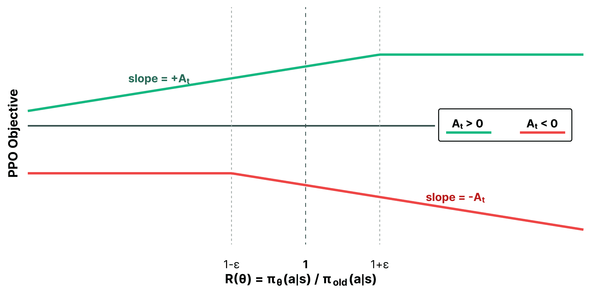
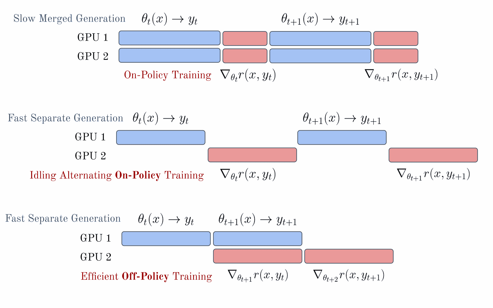
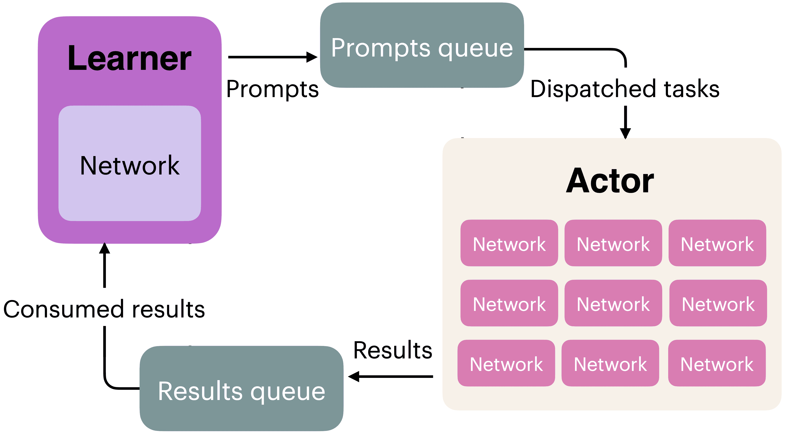

# 强化学习（即策略梯度算法）

在 RLHF 过程中，强化学习算法根据奖励模型的反馈缓慢地更新模型的权重。策略——正在训练的模型——生成训练集中的提示的完成内容，然后奖励模型对其进行评分，然后强化学习优化器根据这些信息进行梯度步骤。本章解释了用于从奖励模型对在线策略数据提供的信号中学习的各种算法的数学和权衡。这些算法在许多个 epoch 期间运行，通常在更大的提示集上跨越数千或数百万个批次，并在它们之间进行梯度更新。

使 RLHF 在语言模型中流行的算法是策略梯度强化学习算法。这些算法，如近端策略优化（Proximal Policy Optimization，PPO）、群相对策略优化（Group Relative Policy Optimization，GRPO）和 REINFORCE，使用最近生成的样本来更新它们的模型（而不是像在 AlphaGo 等流行项目中使用的 Deep Q-Networks，DQN 等算法那样在重放缓冲区中存储分数）。在本节中，我们将介绍策略梯度算法的基本原理以及它们在现代 RLHF 框架中的应用。

在机器学习层面，本节是 RLHF 过程中最复杂的主题。尽管如此，与大多数现代 AI 模型一样，其成功最大的决定因素是提供给过程的输入数据。

当 ChatGPT 引入 RLHF（基于人类反馈的强化学习）时，人们普遍知道它们使用了 PPO（策略梯度优化）的一个变体，并且许多初步工作都是基于这个变体构建的。随着时间的推移，多个研究项目展示了 REINFORCE 风格算法的潜力 [[178]](ch021.xhtml#ref-ahmadian2024back) [[111]](ch021.xhtml#ref-wang2024helpsteer2p)，这种算法因其相对于 PPO 的简单性而受到赞誉（无需奖励模型，节省内存，因此所需的 GPU 数量减少）以及更简单的价值估计（没有广义优势估计 GAE，这是一种用于在策略梯度算法中计算优势以减少方差的方法）。出现了更多算法，包括群相对策略优化（Group Relative Policy Optimization），它在推理任务中特别受欢迎，但总的来说，许多这些算法都可以调整以适应特定任务。在本章中，我们将介绍核心策略梯度设置以及上述提到的三个算法，因为它们在建立标准 RLHF 文献中的核心作用。

关于符号的定义，请参阅问题设置章节。

*本章采用了强化学习文献中的<semantics><mrow><mo stretchy="false" form="prefix">(</mo><mi>s</mi><mo>,</mo><mi>a</mi><mo stretchy="false" form="postfix">)</mo></mrow><annotation encoding="application/x-tex">(s, a)</annotation></semantics>符号，其中<semantics><mi>s</mi><annotation encoding="application/x-tex">s</annotation></semantics>表示状态，<semantics><mi>a</mi><annotation encoding="application/x-tex">a</annotation></semantics>表示动作。在语言模型语境中，你经常会看到<semantics><mrow><mo stretchy="false" form="prefix">(</mo><mi>x</mi><mo>,</mo><mi>y</mi><mo stretchy="false" form="postfix">)</mo></mrow><annotation encoding="application/x-tex">(x, y)</annotation></semantics>，其中<semantics><mi>x</mi><annotation encoding="application/x-tex">x</annotation></semantics>是提示，<semantics><mi>y</mi><annotation encoding="application/x-tex">y</annotation></semantics>是完成。这种<semantics><mrow><mo stretchy="false" form="prefix">(</mo><mi>s</mi><mo>,</mo><mi>a</mi><mo stretchy="false" form="postfix">)</mo></mrow><annotation encoding="application/x-tex">(s, a)</annotation></semantics>的框架更为通用——这些算法是为每个时间步长采取动作的顺序决策问题而设计的。然而，许多 RLHF 实现将整个完成视为单一动作，使得<semantics><mrow><mo stretchy="false" form="prefix">(</mo><mi>x</mi><mo>,</mo><mi>y</mi><mo stretchy="false" form="postfix">)</mo></mrow><annotation encoding="application/x-tex">(x, y)</annotation></semantics>符号同样有效。*

## 政策梯度算法

强化学习算法旨在最大化轨迹上状态和动作的未来折现奖励，其中<semantics><mrow><mi>s</mi><mo>∈</mo><mi>𝒮</mi></mrow><annotation encoding="application/x-tex">s \in \mathcal{S}</annotation></semantics>表示状态，<semantics><mrow><mi>a</mi><mo>∈</mo><mi>𝒜</mi></mrow><annotation encoding="application/x-tex">a \in \mathcal{A}</annotation></semantics>表示动作（更多符号，见第三章，定义）。代理的目标，通常称为*回报*，是在给定时间<semantics><mi>t</mi><annotation encoding="application/x-tex">t</annotation></semantics>的折现未来奖励之和（其中<semantics><mrow><mi>γ</mi><mo>∈</mo><mo stretchy="false" form="prefix">[</mo><mn>0</mn><mo>,</mo><mn>1</mn><mo stretchy="false" form="postfix">]</mo></mrow><annotation encoding="application/x-tex">\gamma\in [0,1]</annotation></semantics>是一个优先考虑近期奖励的因子）:

<semantics><mrow><msub><mi>G</mi><mi>t</mi></msub><mo>=</mo><msub><mi>R</mi><mrow><mi>t</mi><mo>+</mo><mn>1</mn></mrow></msub><mo>+</mo><mi>γ</mi><msub><mi>R</mi><mrow><mi>t</mi><mo>+</mo><mn>2</mn></mrow></msub><mo>+</mo><mi>⋯</mi><mo>=</mo><munderover><mo>∑</mo><mrow><mi>k</mi><mo>=</mo><mn>0</mn></mrow><mo accent="false">∞</mo></munderover><msup><mi>γ</mi><mi>k</mi></msup><msub><mi>R</mi><mrow><mi>t</mi><mo>+</mo><mi>k</mi><mo>+</mo><mn>1</mn></mrow></msub><mi>.</mi><mrow><mo stretchy="false" form="prefix">(</mo><mn>33</mn><mo stretchy="false" form="postfix">)</mo></mrow></mrow><annotation encoding="application/x-tex">G_t = R_{t+1} + \gamma R_{t+2} + \cdots = \sum_{k=0}^\infty \gamma^k R_{t+k+1}.\qquad{(33)}</annotation></semantics>

返回定义也可以估计为：<semantics><mrow><msub><mi>G</mi><mi>t</mi></msub><mo>=</mo><mi>γ</mi><msub><mi>G</mi><mrow><mi>t</mi><mo>+</mo><mn>1</mn></mrow></msub><mo>+</mo><msub><mi>R</mi><mrow><mi>t</mi><mo>+</mo><mn>1</mn></mrow></msub><mi>.</mi><mrow><mo stretchy="false" form="prefix">(</mo><mn>34</mn><mo stretchy="false" form="postfix">)</mo></mrow></mrow><annotation encoding="application/x-tex">G_{t} = \gamma{G_{t+1}} + R_{t+1}.\qquad{(34)}</annotation></semantics>

这个回报是学习价值函数 <semantics><mrow><mi>V</mi><mo stretchy="false" form="prefix">(</mo><mi>s</mi><mo stretchy="false" form="postfix">)</mo></mrow><annotation encoding="application/x-tex">V(s)</annotation></semantics> 的基础，该函数是在给定当前状态下的估计未来回报：

<semantics><mrow><mi>V</mi><mo stretchy="false" form="prefix">(</mo><mi>s</mi><mo stretchy="false" form="postfix">)</mo><mo>=</mo><mi>𝔼</mi><mo minsize="120%" maxsize="120%" stretchy="true" form="prefix">[</mo><msub><mi>G</mi><mi>t</mi></msub><mo stretchy="false" form="prefix">|</mo><msub><mi>S</mi><mi>t</mi></msub><mo>=</mo><mi>s</mi><mo minsize="120%" maxsize="120%" stretchy="true" form="postfix">]</mo><mi>.</mi><mrow><mo stretchy="false" form="prefix">(</mo><mn>35</mn><mo stretchy="false" form="postfix">)</mo></mrow></mrow><annotation encoding="application/x-tex">V(s) = \mathbb{E}\big[G_t | S_t = s \big].\qquad{(35)}</annotation></semantics>

所有策略梯度算法都优化一个策略 <semantics><mrow><msub><mi>π</mi><mi>θ</mi></msub><mo stretchy="false" form="prefix">(</mo><mi>a</mi><mo>∣</mo><mi>s</mi><mo stretchy="false" form="postfix">)</mo></mrow><annotation encoding="application/x-tex">\pi_\theta(a\mid s)</annotation></semantics> 以最大化期望回报；这个目标可以用诱导的价值函数 <semantics><mrow><msup><mi>V</mi><msub><mi>π</mi><mi>θ</mi></msub></msup><mo stretchy="false" form="prefix">(</mo><mi>s</mi><mo stretchy="false" form="postfix">)</mo></mrow><annotation encoding="application/x-tex">V^{\pi_\theta}(s)</annotation></semantics> 来表达。

其中 <semantics><mrow><msup><mi>d</mi><msub><mi>π</mi><mi>θ</mi></msub></msup><mo stretchy="false" form="prefix">(</mo><mi>s</mi><mo stretchy="false" form="postfix">)</mo></mrow><annotation encoding="application/x-tex">d^{\pi_\theta}(s)</annotation></semantics> 是由策略 <semantics><mrow><msub><mi>π</mi><mi>θ</mi></msub><mo stretchy="false" form="prefix">(</mo><mi>a</mi><mo>∣</mo><mi>s</mi><mo stretchy="false" form="postfix">)</mo></mrow><annotation encoding="application/x-tex">\pi_\theta(a \mid s)</annotation></semantics> 诱导的状态访问分布，我们最大化的目标可以表示为：<semantics><mrow><mi>J</mi><mo stretchy="false" form="prefix">(</mo><mi>θ</mi><mo stretchy="false" form="postfix">)</mo><mo>=</mo><munder><mo>∑</mo><mi>s</mi></munder><msup><mi>d</mi><msub><mi>π</mi><mi>θ</mi></msub></msup><mo stretchy="false" form="prefix">(</mo><mi>s</mi><mo stretchy="false" form="postfix">)</mo><msup><mi>V</mi><msub><mi>π</mi><mi>θ</mi></msub></msup><mo stretchy="false" form="postfix">(</mo><mi>s</mi><mo stretchy="false" form="postfix">)</mo><mo>,</mo><mrow><mo stretchy="false" form="prefix">(</mo><mn>36</mn><mo stretchy="false" form="postfix">)</mo></mrow></mrow> <annotation encoding="application/x-tex">J(\theta) \;=\; \sum_{s} d^{\pi_\theta}(s) V^{\pi_\theta}(s), \qquad{(36)}</annotation></semantics>

在有限马尔可夫决策过程（MDP）中，这相当于对所有状态的总和，但在实际操作中我们从未精确地计算它。相反，我们通过从当前策略中采样回滚数据来估计它。在强化学习与人类反馈（RLHF）中，这通常意味着从数据集中采样提示 <semantics><msub><mi>x</mi><mi>i</mi></msub><annotation encoding="application/x-tex">x_i</annotation></semantics> 并生成完成 <semantics><mrow><msub><mi>y</mi><mi>i</mi></msub><mo>∼</mo><msub><mi>π</mi><mi>θ</mi></msub><mo stretchy="false" form="prefix">(</mo><mi>⋅</mi><mo>∣</mo><msub><mi>x</mi><mi>i</mi></msub><mo stretchy="false" form="postfix">)</mo></mrow><annotation encoding="application/x-tex">y_i \sim \pi_\theta(\cdot\mid x_i)</annotation></semantics>，然后取一个经验平均值，例如：

<semantics><mrow><mover><mi>J</mi><mo accent="true">̂</mo></mover><mo stretchy="false" form="prefix">(</mo><mi>θ</mi><mo stretchy="false" form="postfix">)</mo><mo>=</mo><mfrac><mn>1</mn><mi>B</mi></mfrac><munderover><mo>∑</mo><mrow><mi>i</mi><mo>=</mo><mn>1</mn></mrow><mi>B</mi></munderover><mi>R</mi><mo stretchy="false" form="prefix">(</mo><msub><mi>x</mi><mi>i</mi></msub><mo>,</mo><msub><mi>y</mi><mi>i</mi></msub><mo stretchy="false" form="postfix">)</mo><mo>,</mo></mrow> <annotation encoding="application/x-tex">\hat{J}(\theta) = \frac{1}{B}\sum_{i=1}^{B} R(x_i, y_i),</annotation></semantics>

或者，在具有每步奖励的 MDP 视图中，

<semantics><mrow><mover><mi>J</mi><mo accent="true">̂</mo></mover><mo stretchy="false" form="prefix">(</mo><mi>θ</mi><mo stretchy="false" form="postfix">)</mo><mo>=</mo><mfrac><mn>1</mn><mi>B</mi></mfrac><munderover><mo>∑</mo><mrow><mi>i</mi><mo>=</mo><mn>1</mn></mrow><mi>B</mi></munderover><munderover><mo>∑</mo><mrow><mi>t</mi><mo>=</mo><mn>0</mn></mrow><msub><mi>T</mi><mi>i</mi></msub></munderover><munderover><mo>∑</mo><mrow><mi>t</mi><mo>=</mo><mn>0</mn></mrow><msub><mi>T</mi><mi>i</mi></msub></munderover><msup><mi>γ</mi><mi>t</mi></msup><msub><mi>r</mi><mrow><mi>i</mi><mo>,</mo><mi>t</mi></mrow></msub><mi>.</mi></mrow> <annotation encoding="application/x-tex">\hat{J}(\theta) = \frac{1}{B}\sum_{i=1}^{B} \sum_{t=0}^{T_i} \gamma^t r_{i,t}.</annotation></semantics>

策略梯度算法的核心是计算相对于当前策略的有限时间期望回报的梯度。有了这个期望回报，<semantics><mi>J</mi><annotation encoding="application/x-tex">J</annotation></semantics>，参数更新可以按以下方式计算，其中 <semantics><mi>α</mi><annotation encoding="application/x-tex">\alpha</annotation></semantics> 是学习率：

<semantics><mrow><mi>θ</mi><mo>←</mo><mi>θ</mi><mo>+</mo><mi>α</mi><msub><mi>∇</mi><mi>θ</mi></msub><mi>J</mi><mo stretchy="false" form="prefix">(</mo><mi>θ</mi><mo stretchy="false" form="postfix">)</mo><mrow><mo stretchy="false" form="prefix">(</mo><mn>37</mn><mo stretchy="false" form="postfix">)</mo></mrow></mrow><annotation encoding="application/x-tex">\theta \leftarrow \theta + \alpha \nabla_\theta J(\theta)\qquad{(37)}</annotation></semantics>

核心的实现细节是如何计算这个梯度。

另一种表述我们想要最大化的强化学习目标的方法如下：<semantics><mrow><mi>J</mi><mo stretchy="false" form="prefix">(</mo><mi>θ</mi><mo stretchy="false" form="postfix">)</mo><mo>=</mo><msub><mi>𝔼</mi><mrow><mi>τ</mi><mo>∼</mo><msub><mi>π</mi><mi>θ</mi></msub></mrow></msub><mrow><mo stretchy="true" form="prefix">[</mo><mi>R</mi><mo stretchy="false" form="prefix">(</mo><mi>τ</mi><mo stretchy="false" form="postfix">)</mo><mo stretchy="true" form="postfix">]</mo></mrow><mo>,</mo><mrow><mo stretchy="false" form="prefix">(</mo><mn>38</mn><mo stretchy="false" form="postfix">)</mo></mrow></mrow> <annotation encoding="application/x-tex">J(\theta) = \mathbb{E}_{\tau \sim \pi_\theta} \left[ R(\tau) \right], \qquad{(38)}</annotation></semantics>

其中 <semantics><mrow><mi>τ</mi><mo>=</mo><mo stretchy="false" form="prefix">(</mo><msub><mi>s</mi><mn>0</mn></msub><mo>,</mo><msub><mi>a</mi><mn>0</mn></msub><mo>,</mo><msub><mi>s</mi><mn>1</mn></msub><mo>,</mo><msub><mi>a</mi><mn>1</mn></msub><mo>,</mo><mi>…</mi><mo stretchy="false" form="postfix">)</mo></mrow><annotation encoding="application/x-tex">\tau = (s_0, a_0, s_1, a_1, \ldots)</annotation></semantics> 表示一条轨迹，而 <semantics><mrow><mi>R</mi><mo stretchy="false" form="prefix">(</mo><mi>τ</mi><mo stretchy="false" form="postfix">)</mo><mo>=</mo><msubsup><mo>∑</mo><mrow><mi>t</mi><mo>=</mo><mn>0</mn></mrow><mi>∞</mi></msubsup><msub><mi>r</mi><mi>t</mi></msub></mrow><annotation encoding="application/x-tex">R(\tau) = \sum_{t=0}^\infty r_t</annotation></semantics> 是该轨迹的总奖励。或者，我们可以将期望值表示为对所有可能轨迹的积分：<semantics><mrow><mi>J</mi><mo stretchy="false" form="prefix">(</mo><mi>θ</mi><mo stretchy="false" form="postfix">)</mo><mo>=</mo><msub><mo>∫</mo><mi>τ</mi></msub><msub><mi>p</mi><mi>θ</mi></msub><mo stretchy="false" form="prefix">(</mo><mi>τ</mi><mo stretchy="false" form="postfix">)</mo><mi>R</mi><mo stretchy="false" form="prefix">(</mo><mi>τ</mi><mo stretchy="false" form="postfix">)</mo><mi>d</mi><mi>τ</mi><mrow><mo stretchy="false" form="prefix">(</mo><mn>39</mn><mo stretchy="false" form="postfix">)</mo></mrow></mrow> <annotation encoding="application/x-tex">J(\theta) = \int_\tau p_\theta (\tau) R(\tau) d\tau \qquad{(39)}</annotation></semantics>

注意，我们可以将轨迹概率表示如下，其中 <semantics><mrow><msub><mi>π</mi><mi>θ</mi></msub><mo stretchy="false" form="prefix">(</mo><msub><mi>a</mi><mi>t</mi></msub><mo stretchy="false" form="prefix">|</mo><msub><mi>s</mi><mi>t</mi></msub><mo stretchy="false" form="postfix">)</mo><mi>p</mi><mo stretchy="false" form="prefix">(</mo><msub><mi>s</mi><mrow><mi>t</mi><mo>+</mo><mn>1</mn></mrow></msub><mo stretchy="false" form="prefix">|</mo><msub><mi>s</mi><mi>t</mi></msub><mo>,</mo><msub><mi>a</mi><mi>t</mi></msub><mo stretchy="false" form="postfix">)</mo></mrow><annotation encoding="application/x-tex">\pi_\theta(a_t|s_t) p(s_{t+1}|s_t, a_t)</annotation></semantics> 是从一个状态和动作到一组下一个状态的转移概率：<semantics><mrow><msub><mi>p</mi><mi>θ</mi></msub><mo stretchy="false" form="prefix">(</mo><mi>τ</mi><mo stretchy="false" form="postfix">)</mo><mo>=</mo><mi>p</mi><mo stretchy="false" form="prefix">(</mo><msub><mi>s</mi><mn>0</mn></msub><mo stretchy="false" form="postfix">)</mo><munderover><mo>∏</mo><mrow><mi>t</mi><mo>=</mo><mn>0</mn></mrow><mo accent="false">∞</mo></munderover><msub><mi>π</mi><mi>θ</mi></msub><mo stretchy="false" form="prefix">(</mo><msub><mi>a</mi><mi>t</mi></msub><mo stretchy="false" form="prefix">|</mo><msub><mi>s</mi><mi>t</mi></msub><mo stretchy="false" form="postfix">)</mo><mi>p</mi><mo stretchy="false" form="prefix">(</mo><msub><mi>s</mi><mrow><mi>t</mi><mo>+</mo><mn>1</mn></mrow></msub><mo stretchy="false" form="prefix">|</mo><msub><mi>s</mi><mi>t</mi></msub><mo>,</mo><msub><mi>a</mi><mi>t</mi></msub><mo stretchy="false" form="postfix">)</mo><mo>,</mo><mrow><mo stretchy="false" form="prefix">(</mo><mn>40</mn><mo stretchy="false" form="postfix">)</mo></mrow></mrow> <annotation encoding="application/x-tex">p_\theta (\tau) = p(s_0) \prod_{t=0}^\infty \pi_\theta(a_t|s_t) p(s_{t+1}|s_t, a_t), \qquad{(40)}</annotation></semantics>

如果我们对目标函数（方程 38）相对于策略参数 <semantics><mi>θ</mi><annotation encoding="application/x-tex">\theta</annotation></semantics> 求梯度：<semantics><mrow><msub><mi>∇</mi><mi>θ</mi></msub><mi>J</mi><mo stretchy="false" form="prefix">(</mo><mi>θ</mi><mo stretchy="false" form="postfix">)</mo><mo>=</mo><msub><mo>∫</mo><mi>τ</mi></msub><msub><mi>∇</mi><mi>θ</mi></msub><msub><mi>p</mi><mi>θ</mi></msub><mo stretchy="false" form="prefix">(</mo><mi>τ</mi><mo stretchy="false" form="postfix">)</mo><mi>R</mi><mo stretchy="false" form="prefix">(</mo><mi>τ</mi><mo stretchy="false" form="postfix">)</mo><mi>d</mi><mi>τ</mi><mrow><mo stretchy="false" form="prefix">(</mo><mn>41</mn><mo stretchy="false" form="postfix">)</mo></mrow></mrow> <annotation encoding="application/x-tex">\nabla_\theta J(\theta) = \int_\tau \nabla_\theta p_\theta (\tau) R(\tau) d\tau \qquad{(41)}</annotation></semantics>

其中最后一步使用了轨迹分布下期望的定义 <semantics><mrow><msub><mi>p</mi><mi>θ</mi></msub><mo stretchy="false" form="prefix">(</mo><mi>τ</mi><mo stretchy="false" form="postfix">)</mo></mrow><annotation encoding="application/x-tex">p_\theta(\tau)</annotation></semantics>：对于任何函数 <semantics><mi>f</mi><annotation encoding="application/x-tex">f</annotation></semantics>，<semantics><mrow><msub><mi>𝔼</mi><mrow><mi>τ</mi><mo>∼</mo><msub><mi>p</mi><mi>θ</mi></msub></mrow></msub><mo stretchy="false" form="prefix">[</mo><mi>f</mi><mo stretchy="false" form="prefix">(</mo><mi>τ</mi><mo stretchy="false" form="postfix">)</mo><mo>=</mo><msub><mo>∫</mo><mi>τ</mi></msub><mi>f</mi><mo stretchy="false" form="prefix">(</mo><mi>τ</mi><mo stretchy="false" form="postfix">)</mo><msub><mi>p</mi><mi>θ</mi></msub><mo stretchy="false" form="prefix">(</mo><mi>τ</mi><mo stretchy="false" form="postfix">)</mo><mi>d</mi><mi>τ</mi></mrow><annotation encoding="application/x-tex">\mathbb{E}_{\tau \sim p_\theta}[f(\tau)] = \int_\tau f(\tau)\,p_\theta(\tau)\,d\tau</annotation></semantics>（或在离散情况下的和）。将其写作期望是有用的，因为我们可以用蒙特卡洛模拟来近似它，例如 <semantics><mrow><mfrac><mn>1</mn><mi>B</mi></mfrac><msubsup><mo>∑</mo><mrow><mi>i</mi><mo>=</mo><mn>1</mn></mrow><mi>B</mi></msubsup><mi>f</mi><mo stretchy="false" form="prefix">(</mo><msub><mi>τ</mi><mi>i</mi></msub><mo stretchy="false" form="postfix">)</mo></mrow><annotation encoding="application/x-tex">\frac{1}{B}\sum_{i=1}^{B} f(\tau_i)</annotation></semantics> 对于轨迹 <semantics><mrow><msub><mi>τ</mi><mi>i</mi></msub><mo>∼</mo><msub><mi>π</mi><mi>θ</mi></msub></mrow><annotation encoding="application/x-tex">\tau_i \sim \pi_\theta</annotation></semantics>。

回到推导过程，展开轨迹的对数概率：

<semantics><mrow><mrow><mi mathvariant="normal">log</mi><mo>⁡</mo></mrow><msub><mi>p</mi><mi>θ</mi></msub><mo stretchy="false" form="prefix">(</mo><mi>τ</mi><mo stretchy="false" form="postfix">)</mo><mo>=</mo><mrow><mi mathvariant="normal">log</mi><mo>⁡</mo></mrow><mi>p</mi><mo stretchy="false" form="prefix">(</mo><msub><mi>s</mi><mn>0</mn></msub><mo stretchy="false" form="postfix">)</mo><mo>+</mo><munderover><mo>∑</mo><mrow><mi>t</mi><mo>=</mo><mn>0</mn></mrow><mo accent="false">∞</mo></munderover><mrow><mi mathvariant="normal">log</mi><mo>⁡</mo></mrow><msub><mi>π</mi><mi>θ</mi></msub><mo stretchy="false" form="prefix">(</mo><msub><mi>a</mi><mi>t</mi></msub><mo stretchy="false" form="prefix">|</mo><msub><mi>s</mi><mi>t</mi></msub><mo stretchy="false" form="postfix">)</mo><mo>+</mo><munderover><mo>∑</mo><mrow><mi>t</mi><mo>=</mo><mn>0</mn></mrow><mo accent="false">∞</mo></munderover><mrow><mi mathvariant="normal">log</mi><mo>⁡</mo></mrow><mi>p</mi><mo stretchy="false" form="prefix">(</mo><msub><mi>s</mi><mrow><mi>t</mi><mo>+</mo><mn>1</mn></mrow></msub><mo stretchy="false" form="postfix">|</mo><msub><mi>s</mi><mi>t</mi></msub><mo>,</mo><msub><mi>a</mi><mi>t</mi></msub><mo stretchy="false" form="postfix">)</mo></mrow> <annotation encoding="application/x-tex">\log p_\theta (\tau) = \log p(s_0) + \sum_{t=0}^\infty \log \pi_\theta(a_t|s_t) + \sum_{t=0}^\infty \log p(s_{t+1}|s_t, a_t)</annotation></semantics>

现在，如果我们对上述公式求梯度，我们得到：

+   <semantics><mrow><msub><mi>∇</mi><mi>θ</mi></msub><mrow><mi mathvariant="normal">log</mi><mo>⁡</mo></mrow><mi>p</mi><mo stretchy="false" form="prefix">(</mo><msub><mi>s</mi><mn>0</mn></msub><mo stretchy="false" form="postfix">)</mo><mo>=</mo><mn>0</mn></mrow><annotation encoding="application/x-tex">\nabla_\theta \log p(s_0) = 0</annotation></semantics> (初始状态不依赖于 <semantics><mi>θ</mi><annotation encoding="application/x-tex">\theta</annotation></semantics>)

+   <semantics><mrow><msub><mi>∇</mi><mi>θ</mi></msub><mrow><mi mathvariant="normal">log</mi><mo>⁡</mo></mrow><mi>p</mi><mo stretchy="false" form="prefix">(</mo><msub><mi>s</mi><mrow><mi>t</mi><mo>+</mo><mn>1</mn></mrow></msub><mo stretchy="false" form="postfix">|</mo><msub><mi>s</mi><mi>t</mi></msub><mo>,</mo><msub><mi>a</mi><mi>t</mi></msub><mo stretchy="false" form="postfix">)</mo><mo>=</mo><mn>0</mn></mrow><annotation encoding="application/x-tex">\nabla_\theta \log p(s_{t+1}|s_t, a_t) = 0</annotation></semantics> (环境转换动态不依赖于 <semantics><mi>θ</mi><annotation encoding="application/x-tex">\theta</annotation></semantics>)

+   只有 <semantics><mrow><msub><mi>∇</mi><mi>θ</mi></msub><mrow><mi mathvariant="normal">log</mi><mo>⁡</mo></mrow><msub><mi>π</mi><mi>θ</mi></msub><mo stretchy="false" form="prefix">(</mo><msub><mi>a</mi><mi>t</mi></msub><mo stretchy="false" form="prefix">|</mo><msub><mi>s</mi><mi>t</mi></msub><mo stretchy="false" form="postfix">)</mo></mrow><annotation encoding="application/x-tex">\nabla_\theta \log \pi_\theta(a_t|s_t)</annotation></semantics> 保留

因此，轨迹对数概率的梯度简化为：<semantics><mrow><msub><mi>∇</mi><mi>θ</mi></msub><mrow><mi mathvariant="normal">log</mi><mo>⁡</mo></mrow><msub><mi>p</mi><mi>θ</mi></msub><mo stretchy="false" form="prefix">(</mo><mi>τ</mi><mo stretchy="false" form="postfix">)</mo><mo>=</mo><munderover><mo>∑</mo><mrow><mi>t</mi><mo>=</mo><mn>0</mn></mrow><mo accent="false">∞</mo></munderover><msub><mi>∇</mi><mi>θ</mi></msub><mrow><mi mathvariant="normal">log</mi><mo>⁡</mo></mrow><msub><mi>π</mi><mi>θ</mi></msub><mo stretchy="false" form="prefix">(</mo><msub><mi>a</mi><mi>t</mi></msub><mo stretchy="false" form="prefix">|</mo><msub><mi>s</mi><mi>t</mi></msub><mo stretchy="false" form="postfix">)</mo></mrow> <annotation encoding="application/x-tex">\nabla_\theta \log p_\theta (\tau) = \sum_{t=0}^\infty \nabla_\theta \log \pi_\theta(a_t|s_t)</annotation></semantics>

将此代回方程 43，我们得到：<semantics><mrow><msub><mi>∇</mi><mi>θ</mi></msub><mi>J</mi><mo stretchy="false" form="prefix">(</mo><mi>θ</mi><mo stretchy="false" form="postfix">)</mo><mo>=</mo><msub><mi>𝔼</mi><mrow><mi>τ</mi><mo>∼</mo><msub><mi>π</mi><mi>θ</mi></msub></mrow></msub><mrow><mo stretchy="true" form="prefix">[</mo><munderover><mo>∑</mo><mrow><mi>t</mi><mo>=</mo><mn>0</mn></mrow><mo accent="false">∞</mo></munderover><msub><mi>∇</mi><mi>θ</mi></msub><mi mathvariant="normal">log</mi><msub><mi>π</mi><mi>θ</mi></msub><mo stretchy="false" form="prefix">(</mo><msub><mi>a</mi><mi>t</mi></msub><mo stretchy="false" form="prefix">|</mo><msub><mi>s</mi><mi>t</mi></msub><mo stretchy="false" form="postfix">)</mo><mi>R</mi><mo stretchy="false" form="prefix">(</mo><mi>τ</mi><mo stretchy="false" form="postfix">)</mo><mo stretchy="true" form="postfix">]</mo></mrow></mrow> <annotation encoding="application/x-tex">\nabla_\theta J(\theta) = \mathbb{E}_{\tau \sim \pi_\theta} \left[ \sum_{t=0}^\infty \nabla_\theta \log \pi_\theta(a_t|s_t) R(\tau) \right]</annotation></semantics>

很常见，人们使用策略梯度的更一般形式：<semantics><mrow><mi>g</mi><mo>=</mo><msub><mi>∇</mi><mi>θ</mi></msub><mi>J</mi><mo stretchy="false" form="prefix">(</mo><mi>θ</mi><mo stretchy="false" form="postfix">)</mo><mo>=</mo><msub><mi>𝔼</mi><mrow><mi>τ</mi><mo>∼</mo><msub><mi>π</mi><mi>θ</mi></msub></mrow></msub><mrow><mo stretchy="true" form="prefix">[</mo><munderover><mo>∑</mo><mrow><mi>t</mi><mo>=</mo><mn>0</mn></mrow><mo accent="false">∞</mo></munderover><msub><mi>∇</mi><mi>θ</mi></msub><mi mathvariant="normal">log</mi><msub><mi>π</mi><mi>θ</mi></msub><mo stretchy="false" form="prefix">(</mo><msub><mi>a</mi><mi>t</mi></msub><mo stretchy="false" form="prefix">|</mo><msub><mi>s</mi><mi>t</mi></msub><mo stretchy="false" form="postfix">)</mo><msub><mi mathvariant="normal">Ψ</mi><mi>t</mi></msub><mo stretchy="true" form="postfix">]</mo></mrow><mrow><mo stretchy="false" form="prefix">(</mo><mn>44</mn><mo stretchy="false" form="postfix">)</mo></mrow></mrow> <annotation encoding="application/x-tex">g = \nabla_\theta J(\theta) = \mathbb{E}_{\tau \sim \pi_\theta} \left[ \sum_{t=0}^\infty \nabla_\theta \log \pi_\theta(a_t|s_t) \Psi_t \right] \qquad{(44)}</annotation></semantics>

其中 <semantics><msub><mi mathvariant="normal">Ψ</mi><mi>t</mi></msub><annotation encoding="application/x-tex">\Psi_t</annotation></semantics> 可以是以下形式（其中奖励也可以经常通过 <semantics><mi>γ</mi><annotation encoding="application/x-tex">\gamma</annotation></semantics> 进行折现），这是 Schulman 等人于 2015 年采用的一个分类法 [[179]](ch021.xhtml#ref-schulman2015high):

1.  <semantics><mrow><mi>R</mi><mo stretchy="false" form="prefix">(</mo><mi>τ</mi><mo stretchy="false" form="postfix">)</mo><mo>=</mo><msubsup><mo>∑</mo><mrow><mi>t</mi><mo>=</mo><mn>0</mn></mrow><mi>∞</mi></msubsup><msub><mi>r</mi><mi>t</mi></msub></mrow><annotation encoding="application/x-tex">R(\tau) = \sum_{t=0}^{\infty} r_t</annotation></semantics>：轨迹的总奖励。

1.  <semantics><mrow><msubsup><mo>∑</mo><mrow><msup><mi>t</mi><mo>′</mo></msup><mo>=</mo><mi>t</mi></mrow><mi>∞</mi></msubsup><msub><mi>r</mi><msup><mi>t</mi><mo>′</mo></msup></msub></mrow><annotation encoding="application/x-tex">\sum_{t'=t}^{\infty} r_{t'}</annotation></semantics>：跟随动作 <semantics><msub><mi>a</mi><mi>t</mi></msub><annotation encoding="application/x-tex">a_t</annotation></semantics> 的奖励，也称为回报，<semantics><mi>G</mi><annotation encoding="application/x-tex">G</annotation></semantics>。

1.  <semantics><mrow><msubsup><mo>∑</mo><mrow><msup><mi>t</mi><mo>′</mo></msup><mo>=</mo><mi>t</mi></mrow><mi>∞</mi></msubsup><msub><mi>r</mi><msup><mi>t</mi><mo>′</mo></msup></msub><mo>−</mo><mi>b</mi><mo stretchy="false" form="prefix">(</mo><msub><mi>s</mi><mi>t</mi></msub><mo stretchy="false" form="postfix">)</mo></mrow><annotation encoding="application/x-tex">\sum_{t'=t}^{\infty} r_{t'} - b(s_t)</annotation></semantics>: 基准化后的前一个公式。

1.  <semantics><mrow><msup><mi>Q</mi><mi>π</mi></msup><mo stretchy="false" form="prefix">(</mo><msub><mi>s</mi><mi>t</mi></msub><mo>,</mo><msub><mi>a</mi><mi>t</mi></msub><mo stretchy="false" form="postfix">)</mo></mrow><annotation encoding="application/x-tex">Q^{\pi}(s_t, a_t)</annotation></semantics>: 状态-动作值函数。

1.  <semantics><mrow><msup><mi>A</mi><mi>π</mi></msup><mo stretchy="false" form="prefix">(</mo><msub><mi>s</mi><mi>t</mi></msub><mo>,</mo><msub><mi>a</mi><mi>t</mi></msub><mo stretchy="false" form="postfix">)</mo></mrow><annotation encoding="application/x-tex">A^{\pi}(s_t, a_t)</annotation></semantics>: 优势函数，如果能够准确计算，将产生最低可能的理论方差。

1.  <semantics><mrow><msub><mi>r</mi><mi>t</mi></msub><mo>+</mo><msup><mi>V</mi><mi>π</mi></msup><mo stretchy="false" form="prefix">(</mo><msub><mi>s</mi><mrow><mi>t</mi><mo>+</mo><mn>1</mn></mrow></msub><mo stretchy="false" form="postfix">)</mo><mo>−</mo><msup><mi>V</mi><mi>π</mi></msup><mo stretchy="false" form="prefix">(</mo><msub><mi>s</mi><mi>t</mi></msub><mo stretchy="false" form="postfix">)</mo></mrow><annotation encoding="application/x-tex">r_t + V^{\pi}(s_{t+1}) - V^{\pi}(s_t)</annotation></semantics>: 时间差分（TD）残差。

*基准线* 是一个用于减少策略更新方差的值（关于这一点下面会详细说明）。

对于语言模型来说，这些概念中的一些并不那么有意义。例如，对于一个确定性的策略 <semantics><mi>π</mi><annotation encoding="application/x-tex">\pi</annotation></semantics>，状态值是 <semantics><mrow><msup><mi>V</mi><mi>π</mi></msup><mo stretchy="false" form="prefix">(</mo><mi>s</mi><mo stretchy="false" form="postfix">)</mo><mo>=</mo><msup><mi>Q</mi><mi>π</mi></msup><mo stretchy="false" form="prefix">(</mo><mi>s</mi><mo>,</mo><mi>π</mi><mo stretchy="false" form="prefix">(</mo><mi>s</mi><mo stretchy="false" form="postfix">)</mo><mo stretchy="false" form="postfix">)</mo></mrow><annotation encoding="application/x-tex">V^{\pi}(s) = Q^{\pi}(s, \pi(s))</annotation></semantics>（而对于最优值函数，有 <semantics><mrow><msup><mi>V</mi><mo>*</mo></msup><mo stretchy="false" form="prefix">(</mo><mi>s</mi><mo stretchy="false" form="postfix">)</mo><mo>=</mo><msub><mrow><mi mathvariant="normal">max</mi><mo>⁡</mo></mrow><mi>a</mi></msub><msup><mi>Q</mi><mo>*</mo></msup><mo stretchy="false" form="prefix">(</mo><mi>s</mi><mo>,</mo><mi>a</mi><mo stretchy="false" form="postfix">)</mo></mrow><annotation encoding="application/x-tex">V^*(s)=\max_a Q^*(s,a)</annotation></semantics>）。对于随机策略，类似的等式是 <semantics><mrow><msup><mi>V</mi><mi>π</mi></msup><mo stretchy="false" form="prefix">(</mo><mi>s</mi><mo stretchy="false" form="postfix">)</mo><mo>=</mo><msub><mi>𝔼</mi><mrow><mi>a</mi><mo>∼</mo><mi>π</mi><mo stretchy="false" form="prefix">(</mo><mi>⋅</mi><mo>∣</mo><mi>s</mi><mo stretchy="false" form="postfix">)</mo></mrow></msub><mo stretchy="false" form="prefix">[</mo><msup><mi>Q</mi><mi>π</mi></msup><mo stretchy="false" form="prefix">(</mo><mi>s</mi><mo>,</mo><mi>a</mi><mo stretchy="false" form="postfix">)</mo><mo stretchy="false" form="postfix">]</mo></mrow><annotation encoding="application/x-tex">V^{\pi}(s) = \mathbb{E}_{a \sim \pi(\cdot\mid s)}[Q^{\pi}(s,a)]</annotation></semantics>。如果我们定义 <semantics><mrow><mi>s</mi><mo>+</mo><mi>a</mi></mrow><annotation encoding="application/x-tex">s+a</annotation></semantics> 为对提示 <semantics><mi>s</mi><annotation encoding="application/x-tex">s</annotation></semantics> 的延续 <semantics><mi>a</mi><annotation encoding="application/x-tex">a</annotation></semantics>，那么 <semantics><mrow><mi>Q</mi><mo stretchy="false" form="prefix">(</mo><mi>s</mi><mo>,</mo><mi>a</mi><mo stretchy="false" form="postfix">)</mo><mo>=</mo><mi>V</mi><mo stretchy="false" form="prefix">(</mo><mi>s</mi><mo>+</mo><mi>a</mi><mo stretchy="false" form="postfix">)</mo></mrow><annotation encoding="application/x-tex">Q(s, a) = V(s+a)</annotation></semantics>，这给出了一种不同的优势技巧：

<semantics><mrow><mi>A</mi><mo stretchy="false" form="prefix">(</mo><mi>s</mi><mo>,</mo><mi>a</mi><mo stretchy="false" form="postfix">)</mo><mo>=</mo><mi>Q</mi><mo stretchy="false" form="prefix">(</mo><mi>s</mi><mo>,</mo><mi>a</mi><mo stretchy="false" form="postfix">)</mo><mo>−</mo><mi>V</mi><mo stretchy="false" form="prefix">(</mo><mi>s</mi><mo stretchy="false" form="postfix">)</mo><mo>=</mo><mi>V</mi><mo stretchy="false" form="prefix">(</mo><mi>s</mi><mo>+</mo><mi>a</mi><mo stretchy="false" form="postfix">)</mo><mo>−</mo><mi>V</mi><mo stretchy="false" form="prefix">(</mo><mi>s</mi><mo stretchy="false" form="postfix">)</mo><mo>=</mo><mi>r</mi><mo>+</mo><mi>γ</mi><mi>V</mi><mo stretchy="false" form="prefix">(</mo><mi>s</mi><mo>+</mo><mi>a</mi><mo stretchy="false" form="postfix">)</mo><mo>−</mo><mi>V</mi><mo stretchy="false" form="prefix">(</mo><mi>s</mi><mo stretchy="false" form="postfix">)</mo><mrow><mo stretchy="false" form="prefix">(</mo><mn>45</mn><mo stretchy="false" form="postfix">)</mo></mrow></mrow><annotation encoding="application/x-tex">A(s,a) = Q(s,a) - V(s) = V(s + a) - V(s) = r + \gamma V(s + a) - V(s)\qquad{(45)}</annotation></semantics>

这是一种奖励、提示的价值以及整个话语的折现价值的组合。

### 香草策略梯度

香草策略梯度的实现通过相对于策略参数的微分来优化上述表达式 <semantics><mrow><mi>J</mi><mo stretchy="false" form="prefix">(</mo><mi>θ</mi><mo stretchy="false" form="postfix">)</mo></mrow><annotation encoding="application/x-tex">J(\theta)</annotation></semantics>。一个简单的版本，相对于整体回报，是：

<semantics><mrow><msub><mi>∇</mi><mi>θ</mi></msub><mi>J</mi><mo stretchy="false" form="prefix">(</mo><mi>θ</mi><mo stretchy="false" form="postfix">)</mo><mo>=</mo><msub><mi>𝔼</mi><mi>τ</mi></msub><mrow><mo stretchy="true" form="prefix">[</mo><munderover><mo>∑</mo><mrow><mi>t</mi><mo>=</mo><mn>0</mn></mrow><mi>T</mi></munderover><msub><mi>∇</mi><mi>θ</mi></msub><mi mathvariant="normal">log</mi><msub><mi>π</mi><mi>θ</mi></msub><mo stretchy="false" form="prefix">(</mo><msub><mi>a</mi><mi>t</mi></msub><mo stretchy="false" form="prefix">|</mo><msub><mi>s</mi><mi>t</mi></msub><mo stretchy="false" form="postfix">)</mo><msub><mi>R</mi><mi>t</mi></msub><mo stretchy="true" form="postfix">]</mo></mrow><mrow><mo stretchy="false" form="prefix">(</mo><mn>46</mn><mo stretchy="false" form="postfix">)</mo></mrow></mrow><annotation encoding="application/x-tex">\nabla_\theta J(\theta) = \mathbb{E}_\tau \left[ \sum_{t=0}^T \nabla_\theta \log \pi_\theta(a_t|s_t) R_t \right]\qquad{(46)}</annotation></semantics>

范例策略梯度算法的一个常见问题是梯度更新的高方差，这可以通过多种方式来缓解。高方差来源于从环境中通常较小的一组回放中估计回报 <semantics><mi>G</mi><annotation encoding="application/x-tex">G</annotation></semantics>，这些回放往往容易受到噪声的影响（例如，从具有温度 <semantics><mrow><mo>></mo><mn>0</mn></mrow><annotation encoding="application/x-tex">>0</annotation></semantics> 的语言模型生成时的随机性）。在奖励稀疏的领域中，回报估计的方差更高，因为更多的样本是 0 或 1，而不是紧密聚集。为了缓解这一点，使用了各种技术来归一化价值估计，称为 *基线*。基线通过多种方式实现这一点，有效地通过状态相对于下游动作的价值来归一化（例如，在优势的情况下，这是 Q 值和价值的差异）。最简单的基线是奖励批次的平均值或移动平均值。即使这些基线也可以去偏梯度，使得 <semantics><mrow><msub><mi>𝔼</mi><mrow><mi>a</mi><mo>∼</mo><mi>π</mi><mo stretchy="false" form="prefix">(</mo><mi>a</mi><mo stretchy="false" form="prefix">|</mo><mi>s</mi><mo stretchy="false" form="postfix">)</mo></mrow></msub><mo stretchy="false" form="prefix">[</mo><msub><mi>∇</mi><mi>θ</mi></msub><mrow><mi mathvariant="normal">log</mi><mo>⁡</mo></mrow><msub><mi>π</mi><mi>θ</mi></msub><mo stretchy="false" form="prefix">(</mo><mi>a</mi><mo stretchy="false" form="prefix">|</mo><mi>s</mi><mo stretchy="false" form="postfix">)</mo><mo stretchy="false" form="postfix">]</mo><mo>=</mo><mn>0</mn></mrow><annotation encoding="application/x-tex">\mathbb{E}_{a \sim \pi(a|s)}[\nabla_\theta \log \pi_\theta(a|s)] = 0</annotation></semantics>，从而显著提高学习信号。

本章讨论的许多策略梯度算法建立在策略梯度的优势公式之上：

<semantics><mrow><msub><mi mathvariant="normal">∇</mi><mi>θ</mi></msub><mi>J</mi><mo stretchy="false" form="prefix">(</mo><mi>θ</mi><mo stretchy="false" form="postfix">)</mo><mo>=</mo><msub><mi>𝔼</mi><mi>τ</mi></msub><mrow><mo stretchy="true" form="prefix">[</mo><munderover><mo>∑</mo><mrow><mi>t</mi><mo>=</mo><mn>0</mn></mrow><mi>T</mi></munderover><msub><mi>∇</mi><mi>θ</mi></msub><mi mathvariant="normal">log</mi><msub><mi>π</mi><mi>θ</mi></msub><mo stretchy="false" form="prefix">(</mo><msub><mi>a</mi><mi>t</mi></msub><mo stretchy="false" form="prefix">|</mo><msub><mi>s</mi><mi>t</mi></msub><mo stretchy="false" form="postfix">)</mo><msup><mi>A</mi><msub><mi>π</mi><mi>θ</mi></msub></msup><mo stretchy="false" form="prefix">(</mo><msub><mi>s</mi><mi>t</mi></msub><mo>,</mo><msub><mi>a</mi><mi>t</mi></msub><mo stretchy="false" form="postfix">)</mo><mo stretchy="true" form="postfix">]</mo></mrow><mrow><mo stretchy="false" form="prefix">(</mo><mn>47</mn><mo stretchy="false" form="postfix">)</mo></mrow></mrow><annotation encoding="application/x-tex">\nabla_\theta J(\theta) = \mathbb{E}_\tau \left[ \sum_{t=0}^T \nabla_\theta \log \pi_\theta(a_t|s_t) A^{\pi_\theta}(s_t, a_t) \right]\qquad{(47)}</annotation></semantics>

### REINFORCE

算法 REINFORCE 可能是一个缩写，但该算法所代表的组成部分与现代强化学习算法非常相关。在开创性的论文《Simple statistical gradient-following algorithms for connectionist reinforcement learning》[[180]](ch021.xhtml#ref-williams1992simple)中定义：

> 该名称是“奖励增量 = 非负因子 X 偏移强化 X 特征资格”的缩写。

这个过程的三个组成部分是如何进行**奖励增量**，也就是所谓的策略梯度步骤。更新规则有三个部分：

1.  非负因子：这是必须为正数的**学习率（步长）**，例如以下。

1.  偏移强化：这是奖励的**基准** <semantics><mi>b</mi><annotation encoding="application/x-tex">b</annotation></semantics> 或其他归一化因子，以提高稳定性。

1.  特征资格：这是学习如何按标记分配的。它可以是一个一般值，<semantics><mi>e</mi><annotation encoding="application/x-tex">e</annotation></semantics> 每个参数，但通常是现代方程中策略的对数概率。

因此，形式看起来相当熟悉：

<semantics><mrow><msub><mi mathvariant="normal">Δ</mi><mi>θ</mi></msub><mo>=</mo><mi>α</mi><mo stretchy="false" form="prefix">(</mo><mi>r</mi><mo>−</mo><mi>b</mi><mo stretchy="false" form="postfix">)</mo><mi>e</mi><mrow><mo stretchy="false" form="prefix">(</mo><mn>48</mn><mo stretchy="false" form="postfix">)</mo></mrow></mrow> <annotation encoding="application/x-tex">\Delta_\theta = \alpha(r - b)e \qquad{(48)}</annotation></semantics>

使用更现代的符号和广义回报 <semantics><mi>G</mi><annotation encoding="application/x-tex">G</annotation></semantics>，REINFORCE 算子表现为：

<semantics><mrow><msub><mi>∇</mi><mi>θ</mi></msub><mi>J</mi><mo stretchy="false" form="prefix">(</mo><mi>θ</mi><mo stretchy="false" form="postfix">)</mo><mo>=</mo><msub><mi>𝔼</mi><mrow><mi>τ</mi><mo>∼</mo><msub><mi>π</mi><mi>θ</mi></msub></mrow></msub><mo minsize="180%" maxsize="180%" stretchy="true" form="prefix">[</mo><munderover><mo>∑</mo><mrow><mi>t</mi><mo>=</mo><mn>0</mn></mrow><mi>T</mi></munderover><msub><mi>∇</mi><mi>θ</mi></msub><mrow><mi mathvariant="normal">log</mi><mo>⁡</mo></mrow><msub><mi>π</mi><mi>θ</mi></msub><mo stretchy="false" form="prefix">(</mo><msub><mi>a</mi><mi>t</mi></msub><mo>∣</mo><msub><mi>s</mi><mi>t</mi></msub><mo stretchy="false" form="postfix">)</mo><mo stretchy="false" form="prefix">(</mo><msub><mi>G</mi><mi>t</mi></msub><mo>−</mo><mi>b</mi><mo stretchy="false" form="prefix">(</mo><msub><mi>s</mi><mi>t</mi></msub><mo stretchy="false" form="postfix">)</mo><mo stretchy="false" form="postfix">)</mo><mo minsize="180%" maxsize="180%" stretchy="true" form="postfix">]</mo><mo>,</mo><mrow><mo stretchy="false" form="prefix">(</mo><mn>49</mn><mo stretchy="false" form="postfix">)</mo></mrow></mrow> <annotation encoding="application/x-tex">\nabla_{\theta}\,J(\theta) \;=\; \mathbb{E}_{\tau \sim \pi_{\theta}}\!\Big[ \sum_{t=0}^{T} \nabla_{\theta} \log \pi_{\theta}(a_t \mid s_t)\,(G_t - b(s_t)) \Big], \qquad{(49)}</annotation></semantics>

在这里，值 <semantics><mrow><msub><mi>G</mi><mi>t</mi></msub><mo>−</mo><mi>b</mi><mo stretchy="false" form="prefix">(</mo><msub><mi>s</mi><mi>t</mi></msub><mo stretchy="false" form="postfix">)</mo></mrow><annotation encoding="application/x-tex">G_t - b(s_t)</annotation></semantics> 是当前状态的策略优势，因此我们可以将策略梯度重新表述为一种形式，我们稍后会继续使用优势，<semantics><mi>A</mi><annotation encoding="application/x-tex">A</annotation></semantics>:

<semantics><mrow><msub><mi>∇</mi><mi>θ</mi></msub><mi>J</mi><mo stretchy="false" form="prefix">(</mo><mi>θ</mi><mo stretchy="false" form="postfix">)</mo><mo>=</mo><msub><mi>𝔼</mi><mrow><mi>τ</mi><mo>∼</mo><msub><mi>π</mi><mi>θ</mi></msub></mrow></msub><mo minsize="180%" maxsize="180%" stretchy="true" form="prefix">[</mo><munderover><mo>∑</mo><mrow><mi>t</mi><mo>=</mo><mn>0</mn></mrow><mi>T</mi></munderover><msub><mi>∇</mi><mi>θ</mi></msub><mrow><mi mathvariant="normal">log</mi><mo>⁡</mo></mrow><msub><mi>π</mi><mi>θ</mi></msub><mo stretchy="false" form="prefix">(</mo><msub><mi>a</mi><mi>t</mi></msub><mo>∣</mo><msub><mi>s</mi><mi>t</mi></msub><mo stretchy="false" form="postfix">)</mo><msub><mi>A</mi><mi>t</mi></msub><mo minsize="180%" maxsize="180%" stretchy="true" form="postfix">]</mo><mo>,</mo><mrow><mo stretchy="false" form="prefix">(</mo><mn>50</mn><mo stretchy="false" form="postfix">)</mo></mrow></mrow> <annotation encoding="application/x-tex">\nabla_{\theta}\,J(\theta) \;=\; \mathbb{E}_{\tau \sim \pi_{\theta}}\!\Big[ \sum_{t=0}^{T} \nabla_{\theta} \log \pi_{\theta}(a_t \mid s_t)\,A_t \Big], \qquad{(50)}</annotation></semantics>

REINFORCE 是 vanilla 策略梯度的特定实现，它使用梯度蒙特卡洛估计器。

#### REINFORCE Leave One Out (RLOO)

与标准 REINFORCE 相比，REINFORCE Leave One Out 的核心实现细节在于它使用批中*其他*样本的平均奖励来计算基线——而不是平均批中的所有奖励 [[181]](ch021.xhtml#ref-huang2024putting), [[178]](ch021.xhtml#ref-ahmadian2024back), [[182]](ch021.xhtml#ref-kool2019buy).

关键的是，这仅在为每个状态（提示）生成多个轨迹（完成）时才有效，这在使用 RL 微调语言模型的多个领域中是常见做法。

具体来说，对于 REINFORCE Leave-One-Out (RLOO)基线，给定<semantics><mi>K</mi><annotation encoding="application/x-tex">K</annotation></semantics>个采样的轨迹（在提示下采取的动作）<semantics><mrow><msub><mi>a</mi><mn>1</mn></msub><mo>,</mo><mi>…</mi><mo>,</mo><msub><mi>a</mi><mi>K</mi></msub></mrow><annotation encoding="application/x-tex">a_1, \dots, a_K</annotation></semantics>，针对给定的提示<semantics><mi>s</mi><annotation encoding="application/x-tex">s</annotation></semantics>，我们明确地将基线定义为以下*每个提示*：

<semantics><mi>b</mi><mo stretchy="false" form="prefix">(</mo><mi>s</mi><mo>,</mo><msub><mi>a</mi><mi>k</mi></msub><mo stretchy="false" form="postfix">)</mo><mo>=</mo><mfrac><mn>1</mn><mrow><mi>K</mi><mo>−</mo><mn>1</mn></mrow></mfrac><munderover><mo>∑</mo><mrow><mi>i</mi><mo>=</mo><mn>1</mn><mo>,</mo><mi>i</mi><mo>≠</mo><mi>k</mi></mrow><mi>K</mi></munderover><mi>R</mi><mo stretchy="false" form="prefix">(</mo><mi>s</mi><mo>,</mo><msub><mi>a</mi><mi>i</mi></msub><mo stretchy="false" form="postfix">)</mo><mo>,</mo><mrow><mo stretchy="false" form="prefix">(</mo><mn>51</mn><mo stretchy="false" form="postfix">)</mo></mrow></mrow> <annotation encoding="application/x-tex">b(s, a_k) = \frac{1}{K-1}\sum_{i=1, i\neq k}^{K} R(s, a_i), \qquad{(51)}</annotation></semantics>

结果产生优势：

<semantics><mrow><mi>A</mi><mo stretchy="false" form="prefix">(</mo><mi>s</mi><mo>,</mo><msub><mi>a</mi><mi>k</mi></msub><mo stretchy="false" form="postfix">)</mo><mo>=</mo><mi>R</mi><mo stretchy="false" form="prefix">(</mo><mi>s</mi><mo>,</mo><msub><mi>a</mi><mi>k</mi></msub><mo stretchy="false" form="postfix">)</mo><mo>−</mo><mi>b</mi><mo stretchy="false" form="prefix">(</mo><mi>s</mi><mo>,</mo><msub><mi>a</mi><mi>k</mi></msub><mo stretchy="false" form="postfix">)</mo><mi>.</mi><mrow><mo stretchy="false" form="prefix">(</mo><mn>52</mn><mo stretchy="false" form="postfix">)</mo></mrow></mrow> <annotation encoding="application/x-tex">A(s, a_k) = R(s, a_k) - b(s, a_k). \qquad{(52)}</annotation></semantics>

等价地，这可以表示为：

<semantics><mrow><mi>A</mi><mo stretchy="false" form="prefix">(</mo><mi>s</mi><mo>,</mo><msub><mi>a</mi><mi>k</mi></msub><mo stretchy="false" form="postfix">)</mo><mo>=</mo><mfrac><mi>K</mi><mrow><mi>K</mi><mo>−</mo><mn>1</mn></mrow></mfrac><mrow><mo stretchy="true" form="prefix">(</mo><mi>R</mi><mo stretchy="false" form="prefix">(</mo><mi>s</mi><mo>,</mo><msub><mi>a</mi><mi>k</mi></msub><mo stretchy="false" form="postfix">)</mo><mo>−</mo><mfrac><mn>1</mn><mi>K</mi></mfrac><munderover><mo>∑</mo><mrow><mi>i</mi><mo>=</mo><mn>1</mn></mrow><mi>K</mi></munderover><mi>R</mi><mo stretchy="false" form="prefix">(</mo><mi>s</mi><mo>,</mo><msub><mi>a</mi><mi>i</mi></msub><mo stretchy="false" form="postfix">)</mo><mo stretchy="true" form="postfix">)</mo></mrow><mi>.</mi><mrow><mo stretchy="false" form="prefix">(</mo><mn>53</mn><mo stretchy="false" form="postfix">)</mo></mrow></mrow> <annotation encoding="application/x-tex">A(s, a_k) = \frac{K}{K - 1}\left(R(s, a_k) - \frac{1}{K}\sum_{i=1}^{K} R(s, a_i)\right). \qquad{(53)}</annotation></semantics>

这是一个简单、低变差的**每提示**优势估计，它与在组相对策略优化（GRPO）中使用的组相对优势密切相关（在接近策略优化（PPO）之后将简要讨论）。在实践中，GRPO 风格的训练主要区别在于它如何应用 KL 正则化器（作为一个显式的损失项与折叠到奖励中）以及是否使用 PPO 风格的比率剪辑。具体来说，标准的 GRPO 实现将 KL 惩罚应用于损失级别，而 RLOO 或传统的策略梯度在奖励本身上应用 KL 惩罚。随着从 RLHF 到具有可验证奖励的推理和强化学习（RLVR）的转变，KL 惩罚的普遍性总体上有所下降，许多 RLHF 代码的推理适配将其完全关闭。尽管如此，RLOO 的优势可以与 PPO 的剪辑相结合，展示了这些算法的相似性。

RLOO 和其他不使用价值网络（一个额外的模型副本，即评论家，预测每个标记的标量值<semantics><mrow><mi>V</mi><mo stretchy="false" form="prefix">(</mo><msub><mi>s</mi><mi>t</mi></msub><mo stretchy="false" form="postfix">)</mo></mrow><annotation encoding="application/x-tex">V(s_t)</annotation></semantics>）的算法将相同的序列级优势（或奖励）分配给每个标记，当计算损失时。使用学习价值网络（如 PPO）的算法为每个标记分配不同的值，从 EOS 标记最终获得的奖励中进行折扣。具有 KL 距离惩罚的 RLOO 将每个标记的 KL 聚合到完成和折叠中，将该标量折叠到序列奖励中，因此产生的优势广播到所有标记。PPO 在计算<semantics><msub><mi>A</mi><mi>t</mi></msub><annotation encoding="application/x-tex">A_t</annotation></semantics>之前从每个标记的奖励中减去一个每个标记的 KL，从而进行标记级信用分配。GRPO 通常保留序列级优势，但将一个单独的每个标记项添加到损失中，而不是从奖励中减去它。这些细节和权衡将在本章后面讨论。

### 近端策略优化

近端策略优化（PPO）[[183]](ch021.xhtml#ref-schulman2017proximal)是深度强化学习成功背后的基础算法之一（例如，OpenAI 的 Five 掌握了 DOTA 2 [[184]](ch021.xhtml#ref-berner2019dota)以及大量的研究）。PPO 相对于优势和策略概率最大化的目标是以下内容：

<semantics><mrow><mi>J</mi><mo stretchy="false" form="prefix">(</mo><mi>θ</mi><mo stretchy="false" form="postfix">)</mo><mo>=</mo><mrow><mi mathvariant="normal">min</mi><mo>⁡</mo></mrow><mrow><mo stretchy="true" form="prefix">(</mo><mfrac><mrow><msub><mi>π</mi><mi>θ</mi></msub><mo stretchy="false" form="prefix">(</mo><mi>a</mi><mo stretchy="false" form="prefix">|</mo><mi>s</mi><mo stretchy="false" form="postfix">)</mo></mrow><mrow><msub><mi>π</mi><msub><mi>θ</mi><mtext mathvariant="normal">old</mtext></msub></msub><mo stretchy="false" form="prefix">(</mo><mi>a</mi><mo stretchy="false" form="prefix">|</mo><mi>s</mi><mo stretchy="false" form="postfix">)</mo></mrow></mfrac><mi>A</mi><mo>,</mo><mtext mathvariant="normal">clip</mtext><mrow><mo stretchy="true" form="prefix">(</mo><mfrac><mrow><msub><mi>π</mi><mi>θ</mi></msub><mo stretchy="false" form="prefix">(</mo><mi>a</mi><mo stretchy="false" form="prefix">|</mo><mi>s</mi><mo stretchy="false" form="postfix">)</mo></mrow><mrow><msub><mi>π</mi><msub><mi>θ</mi><mtext mathvariant="normal">old</mtext></msub></msub><mo stretchy="false" form="prefix">(</mo><mi>a</mi><mo stretchy="false" form="prefix">|</mo><mi>s</mi><mo stretchy="false" form="postfix">)</mo></mrow></mfrac><mo>,</mo><mn>1</mn><mo>−</mo><mi>ε</mi><mo>,</mo><mn>1</mn><mo>+</mo><mi>ε</mi><mo stretchy="true" form="postfix">)</mo></mrow><mi>A</mi><mo stretchy="true" form="postfix">)</mo></mrow><mi>.</mi><mrow><mo stretchy="false" form="prefix">(</mo><mn>54</mn><mo stretchy="false" form="postfix">)</mo></mrow></mrow><annotation encoding="application/x-tex">J(\theta) = \min\left(\frac{\pi_\theta(a|s)}{\pi_{\theta_{\text{old}}}(a|s)}A, \text{clip} \left( \frac{\pi_\theta(a|s)}{\pi_{\theta_{\text{old}}}(a|s)}, 1-\varepsilon, 1+\varepsilon \right) A \right).\qquad{(54)}</annotation></semantics>

在这里，<semantics><mrow><msub><mi>π</mi><mi>θ</mi></msub><mo stretchy="false" form="prefix">(</mo><mi>a</mi><mo stretchy="false" form="prefix">|</mo><mi>s</mi><mo stretchy="false" form="postfix">)</mo></mrow><annotation encoding="application/x-tex">\pi_\theta(a|s)</annotation></semantics> 是正在优化的当前策略，而 <semantics><mrow><msub><mi>π</mi><msub><mi>θ</mi><mtext mathvariant="normal">old</mtext></msub></msub><mo stretchy="false" form="prefix">(</mo><mi>a</mi><mo stretchy="false" form="prefix">|</mo><mi>s</mi><mo stretchy="false" form="postfix">)</mo></mrow><annotation encoding="application/x-tex">\pi_{\theta_{\text{old}}}(a|s)</annotation></semantics> 是用于收集训练数据的策略（即前一次迭代的策略）。这两个策略之间的比率来自 *重要性采样*，这允许我们重用根据旧策略收集的数据来估计新策略的梯度。

这种期望是从从 <semantics><msub><mi>π</mi><mi>θ</mi></msub><annotation encoding="application/x-tex">\pi_\theta</annotation></semantics> 中采样的轨迹中获得的，但在实践中，我们希望在从固定策略 <semantics><msub><mi>π</mi><msub><mi>θ</mi><mtext mathvariant="normal">old</mtext></msub></msub><annotation encoding="application/x-tex">\pi_{\theta_{\text{old}}}</annotation></semantics> 收集的一批数据上执行多个梯度步骤。为了纠正这种分布不匹配，我们乘以重要性权重 <semantics><mfrac><mrow><msub><mi>π</mi><mi>θ</mi></msub><mo stretchy="false" form="prefix">(</mo><mi>a</mi><mo stretchy="false" form="prefix">|</mo><mi>s</mi><mo stretchy="false" form="postfix">)</mo></mrow><mrow><msub><mi>π</mi><msub><mi>θ</mi><mtext mathvariant="normal">old</mtext></msub></msub><mo stretchy="false" form="prefix">(</mo><mi>a</mi><mo stretchy="false" form="prefix">|</mo><mi>s</mi><mo stretchy="false" form="postfix">)</mo></mrow></mfrac><annotation encoding="application/x-tex">\frac{\pi_\theta(a|s)}{\pi_{\theta_{\text{old}}}(a|s)}</annotation></semantics>，这会重新加权样本，以考虑它们在当前策略与数据收集策略下更有可能或不太可能的情况。如果没有约束，当比率远离 1 时，优化这个重要性加权目标可能导致策略更新过大。PPO 通过将比率剪辑到范围 <semantics><mrow><mo stretchy="false" form="prefix">[</mo><mn>1</mn><mo>−</mo><mi>ε</mi><mo>]</mo><mn>1</mn><mo>+</mo><mi>ε</mi><mo stretchy="false" form="postfix">]</mo></mrow><annotation encoding="application/x-tex">[1-\varepsilon, 1+\varepsilon]</annotation></semantics> 内来解决此问题，确保策略在单个更新中不会发生太大变化。

为了完整性，PPO 通常被写成时间步长上的 *期望* 剪辑代理目标：

<semantics><mrow><mi>J</mi><mo stretchy="false" form="prefix">(</mo><mi>θ</mi><mo stretchy="false" form="postfix">)</mo><mo>=</mo><msub><mi>𝔼</mi><mi>t</mi></msub><mrow><mo stretchy="true" form="prefix">[</mo><mi mathvariant="normal">min</mi><mrow><mo stretchy="true" form="prefix">(</mo><msub><mi>r</mi><mi>t</mi></msub><mo stretchy="false" form="prefix">(</mo><mi>θ</mi><mo stretchy="false" form="postfix">)</mo><msub><mi>A</mi><mi>t</mi></msub><mo>,</mo><mtext mathvariant="normal">clip</mtext><mo stretchy="false" form="prefix">(</mo><msub><mi>r</mi><mi>t</mi></msub><mo stretchy="false" form="prefix">(</mo><mi>θ</mi><mo stretchy="false" form="postfix">)</mo><mo>,</mo><mn>1</mn><mo>−</mo><mi>ε</mi><mo>,</mo><mn>1</mn><mo>+</mo><mi>ε</mi><mo stretchy="false" form="postfix">)</mo><msub><mi>A</mi><mi>t</mi></msub><mo stretchy="true" form="postfix">)</mo></mrow><mo stretchy="true" form="postfix">]</mo></mrow><mo>,</mo><msub><mi>R</mi><mi>t</mi></msub><mo stretchy="false" form="prefix">(</mo><mi>θ</mi><mo stretchy="false" form="postfix">)</mo><mo>=</mo><mfrac><mrow><msub><mi>π</mi><mi>θ</mi></msub><mo stretchy="false" form="prefix">(</mo><msub><mi>a</mi><mi>t</mi></msub><mo>∣</mo><msub><mi>s</mi><mi>t</mi></msub><mo stretchy="false" form="postfix">)</mo></mrow><mrow><msub><mi>π</mi><msub><mi>θ</mi><mtext mathvariant="normal">old</mtext></msub></msub><mo stretchy="false" form="prefix">(</mo><msub><mi>a</mi><mi>t</mi></msub><mo>∣</mo><msub><mi>s</mi><mi>t</mi></msub><mo stretchy="false" form="postfix">)</mo></mrow></mfrac><mi>.</mi><mrow><mo stretchy="false" form="prefix">(</mo><mn>55</mn><mo stretchy="false" form="postfix">)</mo></mrow></mrow> <annotation encoding="application/x-tex">J(\theta) = \mathbb{E}_{t}\left[ \min\left(r_t(\theta)A_t,\ \text{clip}(r_t(\theta),1-\varepsilon,1+\varepsilon)A_t\right) \right], \qquad R_t(\theta)=\frac{\pi_\theta(a_t\mid s_t)}{\pi_{\theta_{\text{old}}}(a_t\mid s_t)}. \qquad{(55)}</annotation></semantics>

目标通常通过简单地添加一个负号转换为损失函数，这使得优化器寻求使其尽可能负。

对于语言模型，目标（或损失）是按每个标记计算的，直观上可以基于如何计算自回归预测整个序列的概率——通过概率的乘积。从这里，常见的实现方式是使用*对数概率*，这使得在现代语言建模框架中执行计算更加简单。

这是 PPO 的按令牌版本，也适用于其他策略梯度方法，但将在本章的实现部分进一步探讨。在这里，平均动作中令牌数量的术语<semantics><mfrac><mn>1</mn><mrow><mo stretchy="false" form="prefix">|</mo><mi>a</mi><mo stretchy="false" form="prefix">|</mo></mrow></mfrac><annotation encoding="application/x-tex">\frac{1}{|a|}</annotation></semantics>来自常见的实现实践，但并不在损失函数的正式推导（见[[185]](ch021.xhtml#ref-liu2025understanding)）中。

在这里，我们将解释这个损失函数根据不同的优势和策略比率触发的情况。在实现层面，PPO 的内部计算涉及两个主要部分：1) 带有学习优势的标准策略梯度；2) 基于最大步长的裁剪策略梯度。

为了理解不同情况的出现，我们可以定义策略比率为：

<semantics><mrow><mi>R</mi><mo stretchy="false" form="prefix">(</mo><mi>θ</mi><mo stretchy="false" form="postfix">)</mo><mo>=</mo><mfrac><mrow><msub><mi>π</mi><mi>θ</mi></msub><mo stretchy="false" form="prefix">(</mo><mi>a</mi><mo stretchy="false" form="prefix">|</mo><mi>s</mi><mo stretchy="false" form="postfix">)</mo></mrow><mrow><msub><mi>π</mi><msub><mi>θ</mi><mtext mathvariant="normal">old</mtext></msub></msub><mo stretchy="false" form="prefix">(</mo><mi>a</mi><mo stretchy="false" form="prefix">|</mo><mi>s</mi><mo stretchy="false" form="postfix">)</mo></mrow></mfrac><mrow><mo stretchy="false" form="prefix">(</mo><mn>57</mn><mo stretchy="false" form="postfix">)</mo></mrow></mrow><annotation encoding="application/x-tex">R(\theta) = \frac{\pi_\theta(a|s)}{\pi_{\theta_{\text{old}}}(a|s)}\qquad{(57)}</annotation></semantics>

策略比率是 PPO 和相关算法的核心。它从计算策略的梯度中产生，并以非常直观的方式控制参数更新。对于任何一批数据，策略比率在第一批次的第一个梯度步骤中从 1 开始，因为在这个点上<semantics><msub><mi>π</mi><mi>θ</mi></msub><annotation encoding="application/x-tex">\pi_{\theta}</annotation></semantics>与<semantics><msub><mi>π</mi><msub><mi>θ</mi><mtext mathvariant="normal">old</mtext></msub></msub><annotation encoding="application/x-tex">\pi_{\theta_{\text{old}}}</annotation></semantics>相同。然后，在下一个梯度步骤中，如果该梯度步骤增加了与相关正优势的某些令牌的可能性，策略比率将大于 1；对于其他情况，策略比率将小于 1。常见的做法是在更新<semantics><msub><mi>π</mi><msub><mi>θ</mi><mtext mathvariant="normal">old</mtext></msub></msub><annotation encoding="application/x-tex">\pi_{\theta_{\text{old}}}</annotation></semantics>之前，使用策略梯度算法对每个批次进行 1-4 个梯度步骤。

#### 理解 PPO 目标

总体而言，PPO 目标函数可以通过目标函数与策略比率图的两条线来可视化，如图 15 所示。通过改变采样动作的概率，PPO 目标函数通过最大化来控制正优势和负优势情况。在数值上，通过巧妙地使用最小操作，目标函数确保更新最多被推离策略比率 1 的ε距离。

在信任区域内，PPO 的操作与其他策略梯度算法相同。这是设计上的要求！信任区域是一个用于限制 PPO 及其同类算法最大步长以保持更新稳定性的概念。PPO 算法的核心，即 clip 和 min/max 函数，是用来定义这个区域的。目标函数在其外部变得平坦。

“信任区域”这一概念源自数值优化文献[[186]](ch021.xhtml#ref-nocedal2006numerical)，但它在深度强化学习领域被广泛推广，始于信任区域策略优化（TRPO）算法，该算法被视为 PPO [[187]](ch021.xhtml#ref-schulman2015trust)的前身。信任区域是应用完整策略梯度步骤的区域，因为更新不会被 PPO 目标函数的最大/最小操作“剪辑”。



图 15：假设优势的 PPO 目标函数不同区域的可视化。信任区域可以描述为对数比率在<semantics><mrow><mn>1</mn><mo>±</mo><mi>ε</mi></mrow><annotation encoding="application/x-tex">1\pm\varepsilon</annotation></semantics>范围内的区域。

政策比率和优势可以以几种不同的配置同时出现。我们将案例分为两组：正优势和负优势。

**正优势 (<semantics><mrow><msub><mi>A</mi><mi>t</mi></msub><mo>></mo><mn>0</mn></mrow><annotation encoding="application/x-tex">A_t > 0</annotation></semantics>)**

这意味着采取的行动根据价值函数是有益的，我们希望增加在未来采取该行动的可能性。现在，让我们看看策略比率<semantics><mrow><mi>R</mi><mo stretchy="false" form="prefix">(</mo><mi>θ</mi><mo stretchy="false" form="postfix">)</mo></mrow><annotation encoding="application/x-tex">R(\theta)</annotation></semantics>的不同情况：

1.  <semantics><mrow><mi>R</mi><mo stretchy="false" form="prefix">(</mo><mi>θ</mi><mo stretchy="false" form="postfix">)</mo><mo><</mo><mn>1</mn><mo>−</mo><mi>ε</mi></mrow><annotation encoding="application/x-tex">R(\theta) < 1 - \varepsilon</annotation></semantics>:

    +   **解释**：与旧政策相比，新政策采取行动的可能性更低。

    +   **未裁剪项**：<semantics><mrow><mi>R</mi><mo stretchy="false" form="prefix">(</mo><mi>θ</mi><mo stretchy="false" form="postfix">)</mo><msub><mi>A</mi><mi>t</mi></msub></mrow><annotation encoding="application/x-tex">R(\theta) A_t</annotation></semantics>

    +   **裁剪项**：<semantics><mrow><mo stretchy="false" form="prefix">(</mo><mn>1</mn><mo>−</mo><mi>ε</mi><mo stretchy="false" form="postfix">)</mo><msub><mi>A</mi><mi>t</mi></msub></mrow><annotation encoding="application/x-tex">(1 - \varepsilon) A_t</annotation></semantics>

    +   **目标**：<semantics><mrow><mi>R</mi><mo stretchy="false" form="prefix">(</mo><mi>θ</mi><mo stretchy="false" form="postfix">)</mo><msub><mi>A</mi><mi>t</mi></msub></mrow><annotation encoding="application/x-tex">R(\theta) A_t</annotation></semantics>

    +   **梯度**：<semantics><mrow><msub><mi>∇</mi><mi>θ</mi></msub><mi>R</mi><mo stretchy="false" form="prefix">(</mo><mi>θ</mi><mo stretchy="false" form="postfix">)</mo><msub><mi>A</mi><mi>t</mi></msub><mo>≠</mo><mn>0</mn></mrow><annotation encoding="application/x-tex">\nabla_\theta R(\theta) A_t \neq 0</annotation></semantics>

    +   **发生的情况**：正常的策略梯度更新 - 增加行动的可能性

1.  <semantics><mrow><mn>1</mn><mo>−</mo><mi>ε</mi><mo>≤</mo><mi>R</mi><mo stretchy="false" form="prefix">(</mo><mi>θ</mi><mo stretchy="false" form="postfix">)</mo><mo>≤</mo><mn>1</mn><mo>+</mo><mi>ε</mi></mrow><annotation encoding="application/x-tex">1 - \varepsilon \leq R(\theta) \leq 1 + \varepsilon</annotation></semantics>:

    +   **解释**：在新的政策和旧的政策下，行动的可能性几乎相等

    +   **未裁剪项**：<semantics><mrow><mi>R</mi><mo stretchy="false" form="prefix">(</mo><mi>θ</mi><mo stretchy="false" form="postfix">)</mo><msub><mi>A</mi><mi>t</mi></msub></mrow><annotation encoding="application/x-tex">R(\theta) A_t</annotation></semantics>

    +   **裁剪项**：<semantics><mrow><mi>R</mi><mo stretchy="false" form="prefix">(</mo><mi>θ</mi><mo stretchy="false" form="postfix">)</mo><msub><mi>A</mi><mi>t</mi></msub></mrow><annotation encoding="application/x-tex">R(\theta) A_t</annotation></semantics>

    +   **目标**：<semantics><mrow><mi>R</mi><mo stretchy="false" form="prefix">(</mo><mi>θ</mi><mo stretchy="false" form="postfix">)</mo><msub><mi>A</mi><mi>t</mi></msub></mrow><annotation encoding="application/x-tex">R(\theta) A_t</annotation></semantics>

    +   **梯度**：<semantics><mrow><msub><mi>∇</mi><mi>θ</mi></msub><mi>R</mi><mo stretchy="false" form="prefix">(</mo><mi>θ</mi><mo stretchy="false" form="postfix">)</mo><msub><mi>A</mi><mi>t</mi></msub><mo>≠</mo><mn>0</mn></mrow><annotation encoding="application/x-tex">\nabla_\theta R(\theta) A_t \neq 0</annotation></semantics>

    +   **发生的情况**：正常的策略梯度更新 - 增加行动的可能性

1.  <semantics><mrow><mn>1</mn><mo>+</mo><mi>ε</mi><mo><</mo><mi>R</mi><mo stretchy="false" form="prefix">(</mo><mi>θ</mi><mo stretchy="false" form="postfix">)</mo></mrow><annotation encoding="application/x-tex">1 + \varepsilon < R(\theta)</annotation></semantics>:

    +   **解释**: 与旧策略相比，新策略下动作的概率更高

    +   **未剪裁项**: <semantics><mrow><mi>R</mi><mo stretchy="false" form="prefix">(</mo><mi>θ</mi><mo stretchy="false" form="postfix">)</mo><msub><mi>A</mi><mi>t</mi></msub></mrow><annotation encoding="application/x-tex">R(\theta) A_t</annotation></semantics>

    +   **剪裁项**: <semantics><mrow><mo stretchy="false" form="prefix">(</mo><mn>1</mn><mo>+</mo><mi>ε</mi><mo stretchy="false" form="postfix">)</mo><msub><mi>A</mi><mi>t</mi></msub></mrow><annotation encoding="application/x-tex">(1 + \varepsilon) A_t</annotation></semantics>

    +   **目标**: <semantics><mrow><mo stretchy="false" form="prefix">(</mo><mn>1</mn><mo>+</mo><mi>ε</mi><mo stretchy="false" form="postfix">)</mo><msub><mi>A</mi><mi>t</mi></msub></mrow><annotation encoding="application/x-tex">(1 + \varepsilon) A_t</annotation></semantics>

    +   **梯度**: <semantics><mrow><msub><mi>∇</mi><mi>θ</mi></msub><mo stretchy="false" form="prefix">(</mo><mn>1</mn><mo>+</mo><mi>ε</mi><mo stretchy="false" form="postfix">)</mo><msub><mi>A</mi><mi>t</mi></msub><mo>=</mo><mn>0</mn></mrow><annotation encoding="application/x-tex">\nabla_\theta (1 + \varepsilon) A_t = 0</annotation></semantics>

    +   **发生情况**: 无更新 - 在新策略下动作的概率已经更高

总结来说，当优势为正（<semantics><mrow><msub><mi>A</mi><mi>t</mi></msub><mo>></mo><mn>0</mn></mrow><annotation encoding="application/x-tex">A_t>0</annotation></semantics>）时，我们希望提高动作的概率。因此：

+   我们只在以下情况下执行梯度步骤：<semantics><mrow><msub><mi>π</mi><mtext mathvariant="normal">new</mtext></msub><mo stretchy="false" form="prefix">(</mo><mi>a</mi><mo stretchy="false" form="postfix">)</mo><mo>≤</mo><mo stretchy="false" form="prefix">(</mo><mn>1</mn><mo>+</mo><mi>ε</mi><mo stretchy="false" form="postfix">)</mo><msub><mi>π</mi><mtext mathvariant="normal">old</mtext></msub><mo stretchy="false" form="postfix">(</mo><mi>a</mi><mo stretchy="false" form="postfix">)</mo></mrow><annotation encoding="application/x-tex">\pi_{\text{new}}(a) \leq (1+\varepsilon) \pi_{\text{old}}(a)</annotation></semantics>. 直观上，我们希望提高动作的概率，因为优势是正的，但我们不希望提高得太多，以至于我们使它变得实质上更可能。

+   关键的是，当<semantics><mrow><msub><mi>π</mi><mtext mathvariant="normal">new</mtext></msub><mo stretchy="false" form="prefix">(</mo><mi>a</mi><mo stretchy="false" form="postfix">)</mo><mo>></mo><mo stretchy="false" form="prefix">(</mo><mn>1</mn><mo>+</mo><mi>ε</mi><mo stretchy="false" form="postfix">)</mo><msub><mi>π</mi><mtext mathvariant="normal">old</mtext></msub><mo stretchy="false" form="prefix">(</mo><mi>a</mi><mo stretchy="false" form="postfix">)</mo></mrow><annotation encoding="application/x-tex">\pi_{\text{new}}(a) > (1+\varepsilon) \pi_{\text{old}}(a)</annotation></semantics>，则我们不执行任何更新，剪裁目标函数的梯度是<semantics><mn>0</mn><annotation encoding="application/x-tex">0</annotation></semantics>。直观上，新策略已经更充分地表达了该行动，所以我们不希望过度强化它。

**负优势(<semantics><mrow><msub><mi>A</mi><mi>t</mi></msub><mo><</mo><mn>0</mn></mrow><annotation encoding="application/x-tex">A_t < 0</annotation></semantics>)**

这意味着根据价值函数，所采取的行动是有害的，我们希望降低未来采取该行动的可能性。现在，让我们看看策略比率<semantics><mrow><mi>R</mi><mo stretchy="false" form="prefix">(</mo><mi>θ</mi><mo stretchy="false" form="postfix">)</mo></mrow><annotation encoding="application/x-tex">R(\theta)</annotation></semantics>的不同情况：

1.  <semantics><mrow><mi>R</mi><mo stretchy="false" form="prefix">(</mo><mi>θ</mi><mo stretchy="false" form="postfix">)</mo><mo><</mo><mn>1</mn><mo>−</mo><mi>ε</mi></mrow><annotation encoding="application/x-tex">R(\theta) < 1 - \varepsilon</annotation></semantics>:

    +   **解释**: 新策略下采取行动的可能性低于旧策略

    +   **未剪裁项**: <semantics><mrow><mi>R</mi><mo stretchy="false" form="prefix">(</mo><mi>θ</mi><mo stretchy="false" form="postfix">)</mo><msub><mi>A</mi><mi>t</mi></msub></mrow><annotation encoding="application/x-tex">R(\theta) A_t</annotation></semantics>

    +   **剪裁项**: <semantics><mrow><mo stretchy="false" form="prefix">(</mo><mn>1</mn><mo>−</mo><mi>ε</mi><mo stretchy="false" form="postfix">)</mo><msub><mi>A</mi><mi>t</mi></msub></mrow><annotation encoding="application/x-tex">(1 - \varepsilon) A_t</annotation></semantics>

    +   **目标**: <semantics><mrow><mo stretchy="false" form="prefix">(</mo><mn>1</mn><mo>−</mo><mi>ε</mi><mo stretchy="false" form="postfix">)</mo><msub><mi>A</mi><mi>t</mi></msub></mrow><annotation encoding="application/x-tex">(1 - \varepsilon) A_t</annotation></semantics>

    +   **梯度**: <semantics><mrow><msub><mi>∇</mi><mi>θ</mi></msub><mo stretchy="false" form="prefix">(</mo><mn>1</mn><mo>−</mo><mi>ε</mi><mo stretchy="false" form="postfix">)</mo><msub><mi>A</mi><mi>t</mi></msub><mo>=</mo><mn>0</mn></mrow><annotation encoding="application/x-tex">\nabla_\theta (1 - \varepsilon) A_t = 0</annotation></semantics>

    +   **发生情况**: 无更新 - 在新策略下动作的可能性已经较低

1.  <semantics><mrow><mn>1</mn><mo>−</mo><mi>ε</mi><mo>≤</mo><mi>R</mi><mo stretchy="false" form="prefix">(</mo><mi>θ</mi><mo stretchy="false" form="postfix">)</mo><mo>≤</mo><mn>1</mn><mo>+</mo><mi>ε</mi></mrow><annotation encoding="application/x-tex">1 - \varepsilon \leq R(\theta) \leq 1 + \varepsilon</annotation></semantics>:

    +   **解释**: 在新策略下，动作的可能性几乎与旧策略相同

    +   **未裁剪项**: <semantics><mrow><mi>R</mi><mo stretchy="false" form="prefix">(</mo><mi>θ</mi><mo stretchy="false" form="postfix">)</mo><msub><mi>A</mi><mi>t</mi></msub></mrow><annotation encoding="application/x-tex">R(\theta) A_t</annotation></semantics>

    +   **裁剪项**: <semantics><mrow><mi>R</mi><mo stretchy="false" form="prefix">(</mo><mi>θ</mi><mo stretchy="false" form="postfix">)</mo><msub><mi>A</mi><mi>t</mi></msub></mrow><annotation encoding="application/x-tex">R(\theta) A_t</annotation></semantics>

    +   **目标**: <semantics><mrow><mi>R</mi><mo stretchy="false" form="prefix">(</mo><mi>θ</mi><mo stretchy="false" form="postfix">)</mo><msub><mi>A</mi><mi>t</mi></msub></mrow><annotation encoding="application/x-tex">R(\theta) A_t</annotation></semantics>

    +   **梯度**: <semantics><mrow><msub><mi>∇</mi><mi>θ</mi></msub><mi>R</mi><mo stretchy="false" form="prefix">(</mo><mi>θ</mi><mo stretchy="false" form="postfix">)</mo><msub><mi>A</mi><mi>t</mi></msub><mo>≠</mo><mn>0</mn></mrow><annotation encoding="application/x-tex">\nabla_\theta R(\theta) A_t \neq 0</annotation></semantics>

    +   **发生情况**: 正常的策略梯度更新 - 减少动作的可能性

1.  <semantics><mrow><mn>1</mn><mo>+</mo><mi>ε</mi><mo><</mo><mi>R</mi><mo stretchy="false" form="prefix">(</mo><mi>θ</mi><mo stretchy="false" form="postfix">)</mo></mrow><annotation encoding="application/x-tex">1 + \varepsilon < R(\theta)</annotation></semantics>:

    +   **解释**: 在新策略下，动作的可能性比旧策略更高

    +   **未裁剪项**: <semantics><mrow><mi>R</mi><mo stretchy="false" form="prefix">(</mo><mi>θ</mi><mo stretchy="false" form="postfix">)</mo><msub><mi>A</mi><mi>t</mi></msub></mrow><annotation encoding="application/x-tex">R(\theta) A_t</annotation></semantics>

    +   **裁剪项**: <semantics><mrow><mo stretchy="false" form="prefix">(</mo><mn>1</mn><mo>+</mo><mi>ε</mi><mo stretchy="false" form="postfix">)</mo><msub><mi>A</mi><mi>t</mi></msub></mrow><annotation encoding="application/x-tex">(1 + \varepsilon) A_t</annotation></semantics>

    +   **目标**: <semantics><mrow><mi>R</mi><mo stretchy="false" form="prefix">(</mo><mi>θ</mi><mo stretchy="false" form="postfix">)</mo><msub><mi>A</mi><mi>t</mi></msub></mrow><annotation encoding="application/x-tex">R(\theta) A_t</annotation></semantics>

    +   **梯度**: <semantics><mrow><msub><mi>∇</mi><mi>θ</mi></msub><mi>R</mi><mo stretchy="false" form="prefix">(</mo><mi>θ</mi><mo stretchy="false" form="postfix">)</mo><msub><mi>A</mi><mi>t</mi></msub><mo>≠</mo><mn>0</mn></mrow><annotation encoding="application/x-tex">\nabla_\theta R(\theta) A_t \neq 0</annotation></semantics>

    +   **发生的情况**：正常的策略梯度更新 - 降低动作的可能性

总结来说，当优势为负（<semantics><mrow><msub><mi>A</mi><mi>t</mi></msub><mo><</mo><mn>0</mn></mrow><annotation encoding="application/x-tex">A_t < 0</annotation></semantics>）时，我们希望降低动作的概率。因此：

+   我们只在以下情况下执行梯度步骤：<semantics><mrow><msub><mi>π</mi><mtext mathvariant="normal">new</mtext></msub><mo stretchy="false" form="prefix">(</mo><mi>a</mi><mo stretchy="false" form="postfix">)</mo><mo>≥</mo><mo stretchy="false" form="prefix">(</mo><mn>1</mn><mo>−</mo><mi>ε</mi><mo stretchy="false" form="postfix">)</mo><msub><mi>π</mi><mtext mathvariant="normal">old</mtext></msub><mo stretchy="false" form="prefix">(</mo><mi>a</mi><mo stretchy="false" form="postfix">)</mo></mrow><annotation encoding="application/x-tex">\pi_{\text{new}}(a) \geq (1-\varepsilon) \pi_{\text{old}}(a)</annotation></semantics>。直观上，我们希望降低动作的概率，因为优势是负的，我们这样做是按优势的比例进行的。

+   关键的是，当 <semantics><mrow><msub><mi>π</mi><mtext mathvariant="normal">new</mtext></msub><mo stretchy="false" form="prefix">(</mo><mi>a</mi><mo stretchy="false" form="postfix">)</mo><mo><</mo><mo stretchy="false" form="prefix">(</mo><mn>1</mn><mo>−</mo><mi>ε</mi><mo stretchy="false" form="postfix">)</mo><msub><mi>π</mi><mtext mathvariant="normal">old</mtext></msub><mo stretchy="false" form="prefix">(</mo><mi>a</mi><mo stretchy="false" form="postfix">)</mo></mrow><annotation encoding="application/x-tex">\pi_{\text{new}}(a) < (1-\varepsilon) \pi_{\text{old}}(a)</annotation></semantics>，则我们不执行任何更新，剪裁目标函数的梯度为 <semantics><mn>0</mn><annotation encoding="application/x-tex">0</annotation></semantics>。直观上，在新的策略下，动作的可能性已经降低，所以我们不想过度抑制它。

记住，PPO 在信任区域内大致等同于标准的策略梯度形式。

#### 价值函数和 PPO

在 PPO 中，值函数是模型的一个额外副本，用于预测每个标记的价值。在传统的强化学习中，标记（或状态）的价值是预测从那一刻起未来的回报，通常带有折扣。在 PPO 中，这个价值被用作一个学习到的基线，代表与 REINFORCE（不需要学习到的值网络）一起使用的简单蒙特卡洛版本的发展。这突出了 PPO 是如何在优化形式、基线等多个方面是 REINFORCE 和 vanilla 策略梯度的演化的。在实践中，使用 PPO 和其他用于语言模型的算法时，这是在扣除 KL 惩罚（每个标记的损失包括传统上从奖励中来的 KL，如前所述）后预测每个标记的回报。

有几种不同的方法（或目标）用于学习值函数。广义优势估计（GAE）被认为是现代系统中的最先进和标准实现，但它通过在多个步骤中计算值预测误差而增加了复杂性——请参阅本章后面的 GAE 部分。值函数也可以通过从用于更新策略的 rollouts 中使用的蒙特卡洛估计来学习。PPO 有两个损失——一个用于学习值函数，另一个用于使用该值函数来更新策略。

下面展示了值网络损失的简单示例实现。

```py
[](#cb1-1)# Basic PPO critic targets & loss (no GAE)
[](#cb1-2)#
[](#cb1-3)# B: Batch Size
[](#cb1-4)# L: Completion Length
[](#cb1-5)# Inputs:
[](#cb1-6)#   rewards: (B, L) post-KL per-token rewards; EOS row includes outcome
[](#cb1-7)#   done_mask: (B, L) 1.0 at terminal token (EOS or truncation if penalized), else 0.0
[](#cb1-8)#   completion_mask: (B, L) 1.0 on response tokens to supervise (ignore the prompt)
[](#cb1-9)#   values: (B, L) current critic predictions V_theta(s_t)
[](#cb1-10)#       because a value network is a running update
[](#cb1-11)#   old_values: (B, L) critic predictions at rollout time V_{theta_old}(s_t)
[](#cb1-12)#   gamma: discount factor, float (often 1.0 for LM RLHF)
[](#cb1-13)#   epsilon_v: float value clip range (e.g., 0.2), similar to PPO Loss Update itself, optional
[](#cb1-14)#
[](#cb1-15)# Returns:
[](#cb1-16)#   value_loss: scalar; advantages: (B, L) detached (for policy loss)
[](#cb1-17)
[](#cb1-18)B, L = rewards.shape
[](#cb1-19)
[](#cb1-20)# 1) Monte Carlo returns per token (reset at terminals)
[](#cb1-21)# Apply discounting, if enabled
[](#cb1-22)returns = torch.zeros_like(rewards)
[](#cb1-23)running = torch.zeros(B, device=rewards.device, dtype=rewards.dtype)
[](#cb1-24)for t in reversed(range(L)):
[](#cb1-25)    running = rewards[:, t] + gamma * (1.0 - done_mask[:, t]) * running
[](#cb1-26)    returns[:, t] = running
[](#cb1-27)
[](#cb1-28)targets = returns  # y_t = G_t (post-KL)
[](#cb1-29)
[](#cb1-30)# 2) PPO-style value clipping (optional)
[](#cb1-31)v_pred = values
[](#cb1-32)v_old  = old_values
[](#cb1-33)v_clip = torch.clamp(v_pred, v_old - epsilon_v, v_old + epsilon_v)
[](#cb1-34)
[](#cb1-35)vf_unclipped = 0.5 * (v_pred - targets) ** 2
[](#cb1-36)vf_clipped   = 0.5 * (v_clip - targets) ** 2
[](#cb1-37)vf_loss_tok  = torch.max(vf_unclipped, vf_clipped)
[](#cb1-38)
[](#cb1-39)# 3) Mask to response tokens and aggregate
[](#cb1-40)denom = completion_mask.sum(dim=1).clamp_min(1)
[](#cb1-41)value_loss = ((vf_loss_tok * completion_mask).sum(dim=1) / denom).mean()
[](#cb1-42)
[](#cb1-43)# 4) Advantages for policy loss (no GAE): A_t = G_t - V(s_t)
[](#cb1-44)advantages = (targets - v_pred).detach()
[](#cb1-45)
[](#cb1-46)# The value loss is applied later, often with the PG loss, e.g.
[](#cb1-47)# total_loss = policy_loss + vf_coef * value_loss
```

### 群组相对策略优化

群组相对策略优化（GRPO）在 DeepSeekMath [[188]](ch021.xhtml#ref-shao2024deepseekmath)中被引入，并在其他 DeepSeek 作品中使用，例如 DeepSeek-V3 [[189]](ch021.xhtml#ref-liu2024deepseek)和 DeepSeek-R1 [[61]](ch021.xhtml#ref-guo2025deepseek)。GRPO 可以被视为一个受 PPO 启发的算法，具有非常相似的代理损失，但它避免了使用原始策略语言模型（或另一个用于初始化的检查点）的另一个副本来学习值函数。这带来了两个假设的好处：

1.  避免从 LM 骨干中学习值函数的挑战，在此领域研究尚未确立最佳实践。

1.  通过不需要在内存中保留额外的模型权重集来节省内存（从需要当前策略、参考策略和值函数，到只需前两个副本）。

GRPO 通过简化价值估计并将同一价值分配给场景中的每个标记（即，在提示的完成中，每个标记被分配相同的价值，而不是标准价值函数中的折扣奖励）来实现这一点，通过估计优势或基线。估计是通过收集来自相同初始状态/提示（<semantics><mi>s</mi><annotation encoding="application/x-tex">s</annotation></semantics>）的多个完成（<semantics><msub><mi>a</mi><mi>i</mi></msub><annotation encoding="application/x-tex">a_i</annotation></semantics>）和奖励（<semantics><msub><mi>r</mi><mi>i</mi></msub><annotation encoding="application/x-tex">r_i</annotation></semantics>），即蒙特卡洛估计来完成的。

为了正式表述，GRPO 的目标与上面提到的 PPO 目标非常相似。对于 GRPO，目标（或损失）是在一组完成<semantics><mrow><mo stretchy="false" form="prefix">{</mo><msub><mi>a</mi><mn>1</mn></msub><mo>,</mo><msub><mi>a</mi><mn>2</mn></msub><mo>,</mo><mi>.</mi><mi>.</mi><mi>.</mi><mo>,</mo><msub><mi>a</mi><mi>G</mi></msub><mo stretchy="false" form="postfix">}</mo></mrow><annotation encoding="application/x-tex">\{a_1, a_2, ..., a_G\}</annotation></semantics>到一个给定的提示<semantics><mi>s</mi><annotation encoding="application/x-tex">s</annotation></semantics>上累积的。在这里，我们展示了 GRPO 的目标：

<semantics><mrow><mi>J</mi><mo stretchy="false" form="prefix">(</mo><mi>θ</mi><mo stretchy="false" form="postfix">)</mo><mo>=</mo><mfrac><mn>1</mn><mi>G</mi></mfrac><munderover><mo>∑</mo><mrow><mi>i</mi><mo>=</mo><mn>1</mn></mrow><mi>G</mi></munderover><mrow><mo stretchy="true" form="prefix">(</mo><mi mathvariant="normal">min</mi><mrow><mo stretchy="true" form="prefix">(</mo><mfrac><mrow><msub><mi>π</mi><mi>θ</mi></msub><mo stretchy="false" form="prefix">(</mo><msub><mi>a</mi><mi>i</mi></msub><mo stretchy="false" form="prefix">|</mo><mi>s</mi><mo stretchy="false" form="postfix">)</mo></mrow><mrow><msub><mi>π</mi><msub><mi>θ</mi><mtext mathvariant="normal">old</mtext></msub></msub><mo stretchy="false" form="prefix">(</mo><msub><mi>a</mi><mi>i</mi></msub><mo stretchy="false" form="prefix">|</mo><mi>s</mi><mo stretchy="false" form="postfix">)</mo></mrow></mfrac><msub><mi>A</mi><mi>i</mi></msub><mo>,</mo><mtext mathvariant="normal">clip</mtext><mrow><mo stretchy="true" form="prefix">(</mo><mfrac><mrow><msub><mi>π</mi><mi>θ</mi></msub><mo stretchy="false" form="prefix">(</mo><msub><mi>a</mi><mi>i</mi></msub><mo stretchy="false" form="prefix">|</mo><mi>s</mi><mo stretchy="false" form="postfix">)</mo></mrow><mrow><msub><mi>π</mi><msub><mi>θ</mi><mtext mathvariant="normal">old</mtext></msub></msub><mo stretchy="false" form="prefix">(</mo><msub><mi>a</mi><mi>i</mi></msub><mo stretchy="false" form="prefix">|</mo><mi>s</mi><mo stretchy="false" form="postfix">)</mo></mrow></mfrac><mo>,</mo><mn>1</mn><mo>−</mo><mi>ε</mi><mo>,</mo><mn>1</mn><mo>+</mo><mi>ε</mi><mo stretchy="true" form="postfix">)</mo></mrow><msub><mi>A</mi><mi>i</mi></msub><mo stretchy="true" form="postfix">)</mo></mrow><mo>−</mo><mi>β</mi><msub><mi>𝒟</mi><mtext mathvariant="normal">KL</mtext></msub><mo stretchy="false" form="prefix">(</mo><msub><mi>π</mi><mi>θ</mi></msub><mo stretchy="false" form="prefix">|</mo><mo stretchy="false" form="prefix">|</mo><msub><mi>π</mi><mtext mathvariant="normal">ref</mtext></msub><mo stretchy="false" form="postfix">)</mo><mo stretchy="true" form="postfix">)</mo></mrow><mi>.</mi><mrow><mo stretchy="false" form="prefix">(</mo><mn>58</mn><mo stretchy="false" form="postfix">)</mo></mrow></mrow><annotation encoding="application/x-tex">J(\theta) = \frac{1}{G}\sum_{i=1}^G \left(\min\left(\frac{\pi_\theta(a_i|s)}{\pi_{\theta_{\text{old}}}(a_i|s)}A_i, \text{clip} \left( \frac{\pi_\theta(a_i|s)}{\pi_{\theta_{\text{old}}}(a_i|s)}, 1-\varepsilon, 1+\varepsilon \right) A_i \right) - \beta \mathcal{D}_{\text{KL}}(\pi_\theta||\pi_{\text{ref}})\right).\qquad{(58)}</annotation></semantics>

注意，与 PPO 相比，GRPO 的标准实现将 KL 距离包含在损失中。如上所述，我们可以将其扩展为每个标记的计算：

对于完成索引<semantics><mi>i</mi><annotation encoding="application/x-tex">i</annotation></semantics>的优势计算：

<semantics><mrow><msub><mi>A</mi><mi>i</mi></msub><mo>=</mo><mfrac><mrow><msub><mi>r</mi><mi>i</mi></msub><mo>−</mo><mtext mathvariant="normal">均值</mtext><mo stretchy="false" form="prefix">(</mo><mrow><msub><mi>r</mi><mn>1</mn></msub><mo>,</mo><msub><mi>r</mi><mn>2</mn></msub><mo>,</mo><mi>⋯</mi><mo>,</mo><msub><mi>r</mi><mi>G</mi></msub></mrow><mo stretchy="false" form="postfix">)</mo></mrow><mrow><mtext mathvariant="normal">标准差</mtext><mo stretchy="false" form="prefix">(</mo><mrow><msub><mi>r</mi><mn>1</mn></msub><mo>,</mo><msub><mi>r</mi><mn>2</mn></msub><mo>,</mo><mi>⋯</mi><mo>,</mo><msub><mi>r</mi><mi>G</mi></msub></mrow><mo stretchy="false" form="postfix">)</mo></mrow></mfrac><mi>.</mi><mrow><mo stretchy="false" form="prefix">(</mo><mn>60</mn><mo stretchy="false" form="postfix">)</mo></mrow></mrow><annotation encoding="application/x-tex">A_i = \frac{r_i - \text{均值}({r_1, r_2, \cdots, r_G})}{\text{标准差}({r_1, r_2, \cdots, r_G})}.\qquad{(60)}</annotation></semantics>

直观上，GRPO 的更新是在一个批次内比较单个问题的多个答案。模型学习变得更加接近标记为正确的答案，而远离其他答案。这是一种计算优势的非常简单的方法，优势是衡量特定动作在给定状态下比平均表现好多少的度量。与 PPO、REINFORCE 以及广泛使用的 RLHF（基于奖励的强化学习与人类反馈）相比，GRPO 通常使用每个提示的样本数量要高得多，因为优势完全关乎于一个完成项相对于同一提示中其他完成项的相对价值。在这里，当前策略为给定的提示生成多个响应，并且组内 GRPO 优势估计提供了有价值的上下文。PPO 和 vanilla 策略梯度算法旨在准确估计每个完成项的奖励（实际上，在某些情况下，更多的完成项对价值估计的改善作用很小）。GRPO 及其变体特别适合于现代语言模型工具，在这些工具中，针对给定提示的多个完成项是非常自然的（尤其是与，例如，在机器人任务中从一组环境状态中获得的多个动作相比）。

GRPO 的优势计算在偏差方面存在权衡。通过标准差进行归一化会奖励那些在答案正确性上变化较小的批次中的问题。对于答案几乎全部正确或全部错误的问题，标准差会较低，优势会较高。185 提出，鉴于这种偏差，可以移除标准差项，但这会以降低所有答案都错误但有几个正确答案的问题的权重为代价，这可能会被视为模型的有价值的学习信号。这些高方差提示可能是最困难的案例，只有少数样本的完成找到了正确答案并提供了强大的训练信号。

等式 60 是当使用结果监督（无论是标准奖励模型还是单个可验证奖励）时 GRPO 的实现，而在过程监督下则需要不同的实现。在这种情况下，GRPO 通过计算后续推理步骤的归一化奖励之和来计算优势。

最后，GRPO 的优势估计也可以应用于没有 PPO 裁剪的更传统的策略梯度版本（例如 REINFORCE），但它不是规范形式。作为这些算法相互交织的一个例子，我们可以表明，GRPO 的一个变体，即 Dr. GRPO（GRPO Done Right）185 的优势估计，在常数缩放因子（通常由于实现细节来归一化优势而不会产生影响）上等同于 RLOO 估计（它使用其他样本的平均奖励作为其基线）。Dr. GRPO 从等式 60 中移除了标准差归一化项——请注意，这也放大了优势，这相当于增加了具有答案分数变化的样本的 GRPO 学习率。这解决了倾向于奖励方差低的问题——即几乎所有答案都是正确或错误的——但可能会带来潜在的代价，即对于只有一个样本正确回答的问题，这些是重要的学习内容。在大小为<semantics><mi>G</mi><annotation encoding="application/x-tex">G</annotation></semantics>的组内，Dr. GRPO 的优势对于完成<semantics><mi>i</mi><annotation encoding="application/x-tex">i</annotation></semantics>被定义为：

<semantics><mrow><msub><mover><mi>A</mi><mo accent="true">̃</mo></mover><mi>i</mi></msub><mo>=</mo><msub><mi>r</mi><mi>i</mi></msub><mo>−</mo><mtext mathvariant="normal">mean</mtext><mo stretchy="false" form="prefix">(</mo><mrow><msub><mi>r</mi><mn>1</mn></msub><mo>,</mo><msub><mi>r</mi><mn>2</mn></msub><mo>,</mo><mi>⋯</mi><mo>,</mo><msub><mi>r</mi><mi>G</mi></msub></mrow><mo stretchy="false" form="postfix">)</mo><mo>=</mo><msub><mi>r</mi><mi>i</mi></msub><mo>−</mo><mfrac><mn>1</mn><mi>G</mi></mfrac><munderover><mo>∑</mo><mrow><mi>j</mi><mo>=</mo><mn>1</mn></mrow><mi>G</mi></munderover><msub><mi>r</mi><mi>j</mi></msub><mrow><mo stretchy="false" form="prefix">(</mo><mn>61</mn><mo stretchy="false" form="postfix">)</mo></mrow></mrow> <annotation encoding="application/x-tex">\tilde{A}_i = r_i - \text{mean}({r_1, r_2, \cdots, r_G}) = r_i - \frac{1}{G}\sum_{j=1}^G r_j \qquad{(61)}</annotation></semantics>

在这里，使用相同的符号，我们可以回忆起 RLOO 优势估计为：

<semantics><mrow><msubsup><mi>A</mi><mi>i</mi><mtext mathvariant="normal">RLOO</mtext></msubsup><mo>=</mo><msub><mi>r</mi><mi>i</mi></msub><mo>−</mo><mfrac><mn>1</mn><mrow><mi>G</mi><mo>−</mo><mn>1</mn></mrow></mfrac><munderover><mo>∑</mo><mrow><mi>j</mi><mo>=</mo><mn>1</mn><mo>,</mo><mi>i</mi><mo>≠</mo><mi>j</mi></mrow><mi>G</mi></munderover><msub><mi>r</mi><mi>j</mi></msub><mrow><mo stretchy="false" form="prefix">(</mo><mn>62</mn><mo stretchy="false" form="postfix">)</mo></mrow></mrow> <annotation encoding="application/x-tex">A_i^\text{RLOO} = r_i - \frac{1}{G-1}\sum_{j=1, i\neq j}^G r_j \qquad{(62)}</annotation></semantics>

因此，如果我们把 Dr. GRPO 优势定义乘以<semantics><mfrac><mi>G</mi><mrow><mi>G</mi><mo>−</mo><mn>1</mn></mrow></mfrac><annotation encoding="application/x-tex">\frac{G}{G-1}</annotation></semantics>，我们可以看到一个缩放等价性：

## 实现

与许多这些算法在原始深度强化学习文献中开发相比，为优化语言模型或其他大型 AI 模型实现 RL 需要许多小的实现细节。在本节中，我们强调了一些区分流行算法实现的关键因素。

在这个训练中还有很多其他的小细节。例如，在进行基于语言模型的 RLHF 时，一个关键步骤是生成将被奖励模型评分的文本。在正常情况下，模型应该生成一个序列结束（EOS）标记来指示它已经完成生成，但常见的做法是设置一个生成长度的上限，以有效地利用基础设施。RLHF 的一个失败模式是模型在回答中经常被截断，导致奖励模型的评分偏离分布并变得不可预测。解决这个问题的方法是*仅*对`eos_token`运行奖励模型评分，否则对生成过长的模型进行惩罚。

适用于 RLHF 的流行开源工具在算法的实现细节上存在很大的差异（见第 10 表[[190]](ch021.xhtml#ref-ivison2024unpacking)）。这里没有涵盖的一些决策包括：

+   **价值网络初始化**：PPO 和其他类似算法使用的内部学习价值网络可以从具有相同架构的不同模型或随机选择的权重开始。这可能会对性能产生重大影响。InstructGPT [[3]](ch021.xhtml#ref-ouyang2022training)（并在 Tülu 3 的 RLVR [[6]](ch021.xhtml#ref-lambert2024t)工作中重用）中建立的标准是从 RLHF 期间使用的奖励模型初始化价值网络。其他人则使用了之前的检查点来 RLHF 训练（通常是一个 SFT 模型），并附加一个随机初始化的价值头，或者完全重新初始化语言模型（较少见，因为 RLHF 收敛需要更长的时间，但可行）。

+   **奖励归一化、奖励白化以及/或优势白化**：归一化将 RM（或环境）中的所有值限制在 0 到 1 之间，这有助于提高学习稳定性。[白化](https://en.wikipedia.org/wiki/Whitening_transformation)通过将奖励或优势估计转换为具有零均值和单位方差来进一步扩展，从而为稳定性提供更强的提升。

+   **不同的 KL 估计器**：对于复杂的语言模型，精确计算模型之间的 KL 散度可能很复杂，因此使用了多个近似来代替精确计算[[164]](ch021.xhtml#ref-schulman2016klapprox)。

+   **KL 控制器**：PPO 和相关算法的原始实现具有针对特定 KL 的动态控制器，并根据最近测量结果改变惩罚。大多数现代 RLHF 实现使用静态 KL 惩罚，但这也可以变化。

更多关于 RLHF 实现细节的信息，请参阅[[191]](ch021.xhtml#ref-huang2024n)。有关算法的更多信息，请参阅[[192]](ch021.xhtml#ref-weng2018PG)。

### 策略梯度基础

策略梯度的简单实现，使用优势来估计梯度，为高级算法如 PPO 和 GRPO 做准备如下：

```py
[](#cb2-1)pg_loss = -advantages * ratio
```

这里的比率是新策略模型概率相对于参考模型概率的（每个标记的）概率比率（通常从 log 概率差计算得出）。

为了理解这个方程，了解可能出现在一批更新中的不同情况是有帮助的。记住，我们希望随着模型在任务上变得更好，损失会*减少*。

情况 1：正优势，因此动作比状态的预期值更好。我们想要加强这一点。在这种情况下，模型将通过负号使这种情况更有可能。为此，它将增加 logratio。正 logratio，或标记的 log 概率之和，意味着模型更有可能生成这些标记。

情况 2：负优势，因此动作比状态的预期值更差。这非常相似。在这里，如果新模型更有可能，损失将是正的，因此模型将尝试使策略参数使这种完成不太可能。

情况 3：零优势，因此不需要更新。损失为零，不要改变策略模型。

### 损失聚合

在实现任何带有语言模型的策略梯度算法时，问题是：你如何将每个标记的损失聚合成一个最终的标量损失？给定样本 <semantics><mi>i</mi><annotation encoding="application/x-tex">i</annotation></semantics> 在标记 <semantics><mi>t</mi><annotation encoding="application/x-tex">t</annotation></semantics> 处的每个标记损失 <semantics><msub><mi>ℓ</mi><mrow><mi>i</mi><mo>,</mo><mi>t</mi></mrow></msub><annotation encoding="application/x-tex">\ell_{i,t}</annotation></semantics>，以及完成长度 <semantics><mrow><mo stretchy="false" form="prefix">|</mo><msub><mi>a</mi><mi>i</mi></msub><mo stretchy="false" form="prefix">|</mo></mrow><annotation encoding="application/x-tex">|a_i|</annotation></semantics> 和批量大小 <semantics><mi>B</mi><annotation encoding="application/x-tex">B</annotation></semantics>，有三种主要策略：

**策略 1：按序列归一化**（标准 GRPO；也用于一些 PPO 实现）

<semantics><mrow><mi>L</mi><mo>=</mo><mfrac><mn>1</mn><mi>B</mi></mfrac><munderover><mo>∑</mo><mrow><mi>i</mi><mo>=</mo><mn>1</mn></mrow><mi>B</mi></munderover><mfrac><mn>1</mn><mrow><mo stretchy="false" form="prefix">|</mo><msub><mi>a</mi><mi>i</mi></msub><mo stretchy="false" form="prefix">|</mo></mrow></mfrac><munderover><mo>∑</mo><mrow><mi>t</mi><mo>=</mo><mn>1</mn></mrow><mrow><mo stretchy="false" form="prefix">|</mo><msub><mi>a</mi><mi>i</mi></msub><mo stretchy="false" form="prefix">|</mo></mrow></munderover><msub><mi>ℓ</mi><mrow><mi>i</mi><mo>,</mo><mi>t</mi></mrow></msub></mrow><annotation encoding="application/x-tex">L = \frac{1}{B} \sum_{i=1}^{B} \frac{1}{|a_i|} \sum_{t=1}^{|a_i|} \ell_{i,t}</annotation></semantics>

每个序列对批损失的贡献是相等的，无论其长度如何。在代码中：

```py
[](#cb3-1)# Strategy 1: Per-sequence normalization
[](#cb3-2)sequence_loss = ((per_token_loss * completion_mask).sum(dim=1) / \
[](#cb3-3)             completion_mask.sum(dim=1)).mean()
```

**策略 2：每个标记归一化**（DAPO [[193]](ch021.xhtml#ref-yu2025dapo))

<semantics><mrow><mi>L</mi><mo>=</mo><mfrac><mrow><munderover><mo>∑</mo><mrow><mi>i</mi><mo>=</mo><mn>1</mn></mrow><mi>B</mi></munderover><munderover><mo>∑</mo><mrow><mi>t</mi><mo>=</mo><mn>1</mn></mrow><mrow><mo stretchy="false" form="prefix">|</mo><msub><mi>a</mi><mi>i</mi></msub><mo stretchy="false" form="prefix">|</mo></mrow></munderover><msub><mi>ℓ</mi><mrow><mi>i</mi><mo>,</mo><mi>t</mi></mrow></msub></mrow><mrow><munderover><mo>∑</mo><mrow><mi>i</mi><mo>=</mo><mn>1</mn></mrow><mi>B</mi></munderover><mo stretchy="false" form="prefix">|</mo><msub><mi>a</mi><mi>i</mi></msub><mo stretchy="false" form="prefix">|</mo></mrow></mfrac></mrow><annotation encoding="application/x-tex">L = \frac{\sum_{i=1}^{B} \sum_{t=1}^{|a_i|} \ell_{i,t}}{\sum_{i=1}^{B} |a_i|}</annotation></semantics>

每个标记的贡献是相等的；较长的序列在梯度上具有成比例更大的影响。在代码中：

```py
[](#cb4-1)# Strategy 2: Per-token normalization
[](#cb4-2)token_loss = ((per_token_loss * completion_mask).sum() / \
[](#cb4-3)            completion_mask.sum())
```

**策略 3：固定长度归一化**（Dr. GRPO [[185]](ch021.xhtml#ref-liu2025understanding))

<semantics><mrow><mi>L</mi><mo>=</mo><mfrac><mn>1</mn><mi>B</mi></mfrac><munderover><mo>∑</mo><mrow><mi>i</mi><mo>=</mo><mn>1</mn></mrow><mi>B</mi></munderover><mfrac><mn>1</mn><msub><mi>L</mi><mi mathvariant="normal">max</mi></msub></mfrac><munderover><mo>∑</mo><mrow><mi>t</mi><mo>=</mo><mn>1</mn></mrow><mrow><mo stretchy="false" form="prefix">|</mo><msub><mi>a</mi><mi>i</mi></msub><mo stretchy="false" form="prefix">|</mo></mrow></munderover><msub><mi>ℓ</mi><mrow><mi>i</mi><mo>,</mo><mi>t</mi></mrow></msub></mrow><annotation encoding="application/x-tex">L = \frac{1}{B} \sum_{i=1}^{B} \frac{1}{L_{\max}} \sum_{t=1}^{|a_i|} \ell_{i,t}</annotation></semantics>

通过最大序列长度进行归一化<semantics><msub><mi>L</mi><mi mathvariant="normal">max</mi></msub><annotation encoding="application/x-tex">L_{\max}</annotation></semantics>，在序列之间均衡每个标记的规模，同时仍然允许较长的序列对总梯度有更大的贡献，因为它们包含更多的活跃标记。

注意，上述代码中的`completion_mask`是一个由 1 和 0 组成的矩阵，其中提示标记被屏蔽（0s），因为我们不希望模型从预测提示标记中学习。

#### 这为什么很重要？

直观来看，按序列归一化（策略 1）似乎最好，因为我们关注的是*结果*，而不是单个标记。然而，这会引入基于序列长度的微妙偏差，可能导致模型过度考虑需要使用更多标记的自然降权策略，这取决于偏差的方向。考虑两个不同长度的序列及其每标记损失：

```py
[](#cb5-1)seq_1_losses = [1, 1, 1, 1, 10]  # 5 tokens, mean = 2.8
[](#cb5-2)seq_2_losses = [1, 1, 1, 1, 1, 1, 1, 1, 1, 10]  # 10 tokens, mean = 1.9
```

使用**策略 1**（按序列）：批损失为<semantics><mrow><mo stretchy="false" form="prefix">(</mo><mn>2.8</mn><mo>+</mo><mn>1.9</mn><mo stretchy="false" form="postfix">)</mo><mi>/</mi><mn>2</mn><mo>=</mo><mn>2.35</mn></mrow><annotation encoding="application/x-tex">(2.8 + 1.9)/2 = 2.35</annotation></semantics>，并且关键的是，短序列中的每个标记比长序列中的标记接收到的梯度更大。

使用**策略 2**（按标记）：批损失为<semantics><mrow><mo stretchy="false" form="prefix">(</mo><mn>14</mn><mo>+</mo><mn>19</mn><mo stretchy="false" form="postfix">)</mo><mi>/</mi><mn>15</mn><mo>=</mo><mn>2.2</mn></mrow><annotation encoding="application/x-tex">(14 + 19)/15 = 2.2</annotation></semantics>，并且所有标记都接收到了相同的梯度幅度。

使用**策略 3**（固定长度，<semantics><mrow><msub><mi>L</mi><mi mathvariant="normal">max</mi></msub><mo>=</mo><mn>10</mn></mrow><annotation encoding="application/x-tex">L_{\max}=10</annotation></semantics>）：短序列贡献了<semantics><mn>1.4</mn><annotation encoding="application/x-tex">1.4</annotation></semantics>，长序列贡献了<semantics><mn>1.9</mn><annotation encoding="application/x-tex">1.9</annotation></semantics>，在平衡每词梯度的同时仍然按序列进行加权。

想要更完整地了解这些策略如何影响梯度，请参阅下面的脚本。

```py
[](#cb6-1)from typing import Optional
[](#cb6-2)import torch
[](#cb6-3)
[](#cb6-4)def masked_mean(values: torch.Tensor, mask: torch.Tensor, axis: Optional[int] = None) -> torch.Tensor:
[](#cb6-5)    """Compute mean of tensor with masked values."""
[](#cb6-6)    if axis is not None:
[](#cb6-7)        return (values * mask).sum(axis=axis) / mask.sum(axis=axis)
[](#cb6-8)    else:
[](#cb6-9)        return (values * mask).sum() / mask.sum()
[](#cb6-10)
[](#cb6-11)def masked_sum(
[](#cb6-12)        values: torch.Tensor,
[](#cb6-13)        mask: torch.Tensor,
[](#cb6-14)        axis: Optional[int] = None,
[](#cb6-15)        constant_normalizer: float = 1.0,
[](#cb6-16)    ) -> torch.Tensor:
[](#cb6-17)    """Compute sum of tensor with masked values. Use a constant to normalize."""
[](#cb6-18)    if axis is not None:
[](#cb6-19)        return (values * mask).sum(axis=axis) / constant_normalizer
[](#cb6-20)    else:
[](#cb6-21)        return (values * mask).sum() / constant_normalizer
[](#cb6-22)
[](#cb6-23)ratio = torch.tensor(
[    [1., 1, 1, 1, 1, 1, 1,],
[](#cb6-25)    [1, 1, 1, 1, 1, 1, 1,],
[](#cb6-26)], requires_grad=True)
[](#cb6-27)
[](#cb6-28)
[](#cb6-29)advs = torch.tensor(
[    [2, 2, 2, 2, 2, 2, 2,],
[](#cb6-31)    [2, 2, 2, 2, 2, 2, 2,],
[](#cb6-32)])
[](#cb6-33)
[](#cb6-34)masks = torch.tensor(
[    # generation 1: 4 tokens
[](#cb6-36)    [1, 1, 1, 1, 0, 0, 0,],
[](#cb6-37)    # generation 2: 7 tokens
[](#cb6-38)    [1, 1, 1, 1, 1, 1, 1,],
[](#cb6-39)])
[](#cb6-40)
[](#cb6-41)max_gen_len = 7
[](#cb6-42)
[](#cb6-43)masked_mean_result = masked_mean(ratio * advs, masks, axis=1)
[](#cb6-44)masked_mean_token_level = masked_mean(ratio, masks, axis=None)
[](#cb6-45)masked_sum_result = masked_sum(ratio * advs, masks, axis=1, constant_normalizer=max_gen_len)
[](#cb6-46)
[](#cb6-47)print("masked_mean", masked_mean_result)
[](#cb6-48)print("masked_sum", masked_sum_result)
[](#cb6-49)print("masked_mean_token_level", masked_mean_token_level)
[](#cb6-50)
[](#cb6-51)# masked_mean tensor([2., 2.], grad_fn=<DivBackward0>)
[](#cb6-52)# masked_sum tensor([1.1429, 2.0000], grad_fn=<DivBackward0>)
[](#cb6-53)# masked_mean_token_level tensor(1., grad_fn=<DivBackward0>)
[](#cb6-54)
[](#cb6-55)masked_mean_result.mean().backward()
[](#cb6-56)print("ratio.grad", ratio.grad)
[](#cb6-57)ratio.grad.zero_()
[](#cb6-58)# ratio.grad tensor([[0.2500, 0.2500, 0.2500, 0.2500, 0.0000, 0.0000, 0.0000],
[](#cb6-59)# [0.1429, 0.1429, 0.1429, 0.1429, 0.1429, 0.1429, 0.1429]])
[](#cb6-60)
[](#cb6-61)masked_sum_result.mean().backward()
[](#cb6-62)print("ratio.grad", ratio.grad)
[](#cb6-63)ratio.grad.zero_()
[](#cb6-64)# ratio.grad tensor([[0.1429, 0.1429, 0.1429, 0.1429, 0.0000, 0.0000, 0.0000],
[](#cb6-65)# [0.1429, 0.1429, 0.1429, 0.1429, 0.1429, 0.1429, 0.1429]])
[](#cb6-66)
[](#cb6-67)masked_mean_token_level.mean().backward()
[](#cb6-68)print("ratio.grad", ratio.grad)
[](#cb6-69)# ratio.grad tensor([[0.0909, 0.0909, 0.0909, 0.0909, 0.0000, 0.0000, 0.0000],
[](#cb6-70)# [0.0909, 0.0909, 0.0909, 0.0909, 0.0909, 0.0909, 0.0909]])
```

输出显示，使用策略 1（`masked_mean`），短序列的每词梯度（0.25）比长序列（0.14）大。策略 2 和 3 在序列间均等化了每词梯度。请注意，如果使用梯度累积，这些结果可能会有很大差异，其中梯度在反向步骤之前跨多个小批量求和——在这种情况下，短序列和长序列之间的平衡可能会翻转。

在实践中，最佳策略取决于具体的训练设置。在 RLHF 中，通常更倾向于具有最佳数值稳定性或损失方差最小的方法。

#### 相关：MDP 与 Bandit 框架

损失聚合的选择与我们对强化学习问题框架的更深层次区别相关。**MDP（标记级）** 视图将每个标记 <semantics><msub><mi>a</mi><mi>t</mi></msub><annotation encoding="application/x-tex">a_t</annotation></semantics> 视为一个动作，状态 <semantics><msub><mi>s</mi><mi>t</mi></msub><annotation encoding="application/x-tex">s_t</annotation></semantics> 是运行的前缀。在实践中，当我们使用学习到的值函数 <semantics><mrow><mi>V</mi><mo stretchy="false" form="prefix">(</mo><msub><mi>s</mi><mi>t</mi></msub><mo stretchy="false" form="postfix">)</mo></mrow><annotation encoding="application/x-tex">V(s_t)</annotation></semantics>（例如，GAE [[179]](ch021.xhtml#ref-schulman2015high)）计算标记级优势并按标记应用 KL 惩罚时，使用的是这种框架。PPO 使用学习到的值网络是典型的例子 [[183]](ch021.xhtml#ref-schulman2017proximal)。

相比之下，**带式（序列级）** 视图将整个完成视为一个单一的动作，具有一个标量奖励 <semantics><mi>R</mi><annotation encoding="application/x-tex">R</annotation></semantics>。在代码中，这意味着计算序列级优势 <semantics><msub><mi>A</mi><mtext mathvariant="normal">seq</mtext></msub><annotation encoding="application/x-tex">A_{\text{seq}}</annotation></semantics> 并将其广播到所有标记。RLOO 和 GRPO 风格的优点通常用于这种带式设置 [[182]](ch021.xhtml#ref-kool2019buy) [[178]](ch021.xhtml#ref-ahmadian2024back) [[188]](ch021.xhtml#ref-shao2024deepseekmath)。直接对齐方法如 DPO 和 A-LoL 也定义序列级目标，尽管它们不是策略梯度估计器 [[194]](ch021.xhtml#ref-baheti2023leftover)。

注意，许多 GRPO 实现使用带式优势 *并且* 在损失中添加一个单独的按标记 KL 项，而许多 PPO/RLOO 实现则在计算优势之前将 KL 折叠到奖励中；这两种惯例在实践中都存在。

### 异步性

政策梯度算法的默认实现被称为**按策略**执行，其中在更新模型之前，对代理（语言模型）采取的动作（生成）进行评分。政策梯度的理论推导依赖于所有动作都完全按策略进行，即模型始终与最新试验/展开的结果保持最新。在实践中，保持完全按策略执行会显著减慢训练 [[195]](ch021.xhtml#ref-noukhovitch2024asynchronous)——而且完美的同步在技术上是不可能的。因此，所有最近关于语言模型的实证结果都略偏离理论证明。在实践中发生的是设计实际工作的算法和系统。



图 16：根据 Noukhovitch 等人 2024 年的研究，同步或异步强化学习训练的生成和更新阶段的比较。

常用的解决方案是在不同的 GPU 节点上不断运行推理和训练，使用软件来高效地运行两者，如图 16 底部所示。在流行的开源强化学习工具中，对于语言模型，常见的做法是使用分布式进程管理库，如 Ray，通过高效的推理引擎（例如 VLLM）在策略梯度学习循环和推理循环之间传递信息。在这些设置中，专门用于执行强化学习步骤的 GPU 被称为“学习者”，而专门用于从语言模型中采样的 GPU 被称为“演员”。在使训练更加异步时面临的主要挑战是保持训练的稳定性并维护学习信号。



图 17：一个示例分布式强化学习系统，其中两个队列被管理以将数据传递给学习者和演员 GPU，它们都可以与分布式计算库（如 Ray）同步。Olmo 团队 2025，许可 CC-BY。

这些系统被设计和实现的前提是，几乎符合策略的数据对于稳定学习来说已经足够好。在这里，生成和更新阶段可以轻松同步，以避免训练系统任一部分的空闲计算，如图 17 中所示，即从学习者向演员传递模型权重。在需要每个答案 10K 到 100K+个 token 的问题中，推理的极长特性使得生成 roll-out 成为一个远更强的瓶颈。在更同步的强化学习基础设施上训练推理模型时遇到的一个常见问题是，批处理中的一个提示的回答可能需要更多的时间来生成（无论是通过更多的 token 还是更多的工具调用），导致大部分分配的计算资源在完成之前都是空闲的。解决这种长度不匹配问题的第二种解决方案，称为序列级打包，是通过巧妙的掩码在批次中堆叠较短的样本，以使模型能够继续生成 roll-out，并在批次内的样本之间更好地分配长度归一化。分布式强化学习基础设施的完整复杂性超出了本书的范围，因为它可能导致许多其他微妙的问题，这些问题会减慢训练速度或导致不稳定。

随着这些推理模型的出现，进一步的兴趣在于使训练和推理循环完全离线，其中策略梯度更新的训练批次填充了多个实例生成答案的最新完成的回滚 [[196]](ch021.xhtml#ref-wu2025llamarl) [[197]](ch021.xhtml#ref-fu2025areal)。完全异步训练还可以通过增加学习节点（执行策略梯度步骤）和演员（试图解决问题）之间权重同步的时间来更容易地扩展 RL 训练运行 [[198]](ch021.xhtml#ref-primeintellectteam2025intellect2reasoningmodeltrained)。

相关方法正在探索完全离线的策略梯度算法 [[199]](ch021.xhtml#ref-roux2025tapered)。

### 近端策略优化

PPO 有许多实现。核心 *损失* 计算如下所示。对于稳定性能至关重要的是 *价值* 计算，其中存在多种选择（包括 *价值模型* 损失的多种选择）。

注意，这里的参考策略（或旧的 logprobs）是从生成样本的时间点来的，并不一定是参考策略。参考策略仅用于 KL 距离约束/惩罚。

```py
[](#cb7-1)# B: Batch Size, L: Sequence Length, G: Num of Generations
[](#cb7-2)# Apply KL penalty to rewards
[](#cb7-3)rewards = rewards - self.beta * per_token_kl  # Shape: (B*G, L)
[](#cb7-4)
[](#cb7-5)# Get value predictions
[](#cb7-6)values = value_net(completions)  # Shape: (B*G, L)
[](#cb7-7)
[](#cb7-8)# Compute simple advantages
[](#cb7-9)advantages = rewards - values.detach()  # Shape: (B*G, L)
[](#cb7-10)# Note: We detach the value network here to not update the parameters of 
[](#cb7-11)# the value function when computing the policy-gradient loss
[](#cb7-12)
[](#cb7-13)# Normalize advantages (optional but stable)
[](#cb7-14)advantages = (advantages - advantages.mean()) / (advantages.std() + 1e-8)
[](#cb7-15)
[](#cb7-16)# Compute probability ratio between new and old policies
[](#cb7-17)ratio = torch.exp(new_per_token_logps - per_token_logps)  # Shape: (B*G, L)
[](#cb7-18)
[](#cb7-19)# PPO clipping objective
[](#cb7-20)eps = self.cliprange  # e.g. 0.2
[](#cb7-21)pg_losses1 = -advantages * ratio  # Shape: (B*G, L)
[](#cb7-22)pg_losses2 = -advantages * torch.clamp(ratio, 1.0 - eps, 1.0 + eps)  # Shape: (B*G, L)
[](#cb7-23)pg_loss_max = torch.max(pg_losses1, pg_losses2)  # Shape: (B*G, L)
[](#cb7-24)
[](#cb7-25)# Simple value function loss
[](#cb7-26)vf_loss = 0.5 * ((rewards - values) ** 2)  # Shape: (B*G, L)
[](#cb7-27)
[](#cb7-28)# Combine policy and value losses
[](#cb7-29)per_token_loss = pg_loss_max + self.vf_coef * vf_loss  # Shape: (B*G, L)
[](#cb7-30)
[](#cb7-31)# Apply completion mask and compute final loss
[](#cb7-32)loss = ((per_token_loss * completion_mask).sum(dim=1) / completion_mask.sum(dim=1)).mean()
[](#cb7-33) # Scalar
[](#cb7-34)
[](#cb7-35)# Compute metrics for logging
[](#cb7-36)with torch.no_grad():
[](#cb7-37)    # Compute clipping fraction
[](#cb7-38)    clip_frac = ((pg_losses2 > pg_losses1).float() * completion_mask).sum() / completion_mask.sum()
[](#cb7-39) 
[](#cb7-40)    # Compute approximate KL
[](#cb7-41)    approx_kl = 0.5 * ((new_per_token_logps - per_token_logps)**2).mean()
[](#cb7-42) 
[](#cb7-43)    # Compute value loss for logging
[](#cb7-44)    value_loss = vf_loss.mean()
```

理解 PPO 的核心是策略梯度损失如何更新。关注以下三行：

```py
[](#cb8-1)pg_losses1 = -advantages * ratio  # Shape: (B*G, L)
[](#cb8-2)pg_losses2 = -advantages * torch.clamp(ratio, 1.0 - eps, 1.0 + eps)  # Shape: (B*G, L)
[](#cb8-3)pg_loss_max = torch.max(pg_losses1, pg_losses2)  # Shape: (B*G, L)
```

`pg_losses1` 是基本的加权策略梯度损失。`pg_losses2` 应用相同的公式，但将概率比限制在 <semantics><mrow><mo stretchy="false" form="prefix">[</mo><mn>1</mn><mo>−</mo><mi>ε</mi><mo>,</mo><mn>1</mn><mo>+</mo><mi>ε</mi><mo stretchy="false" form="postfix">]</mo></mrow><annotation encoding="application/x-tex">[1-\varepsilon, 1+\varepsilon]</annotation></semantics> 范围内，限制策略在单个更新中可以改变的程度。

关键的洞察是取两个损失的 `torch.max`。因为我们最小化的是 *负* 损失（回想一下优势前的负号），取最大值会选择更悲观的梯度——产生较小策略更新的那个。当优势为正（好的动作）时，裁剪可以防止策略过于激进地增加该动作的概率。当优势为负（坏的动作）时，裁剪可以防止过度纠正。

通过裁剪对数概率比，PPO 限制了策略可以从生成训练数据的版本偏离多远，稳定学习而不需要显式地计算信任区域。

上述代码还显示了 PPO 在策略的同时学习价值函数，这增加了实现复杂性，但裁剪的目标是核心机制。

#### 每个样本使用 1 个梯度步骤的 PPO/GRPO 简化（无裁剪）

如果超参数“每个样本的梯度步数”等于 1，那么 PPO（和 GRPO）的实现可以处理得更加优雅。许多典型的值范围从 2-4 或更高。在主要的 PPO 或 GRPO 方程中，参见方程 54，“参考”策略是先前的参数——用于生成补全或动作的参数。因此，如果只进行一步梯度更新，<semantics><mrow><msub><mi>π</mi><mi>θ</mi></msub><mo>=</mo><msub><mi>π</mi><msub><mi>θ</mi><mtext mathvariant="normal">old</mtext></msub></msub></mrow><annotation encoding="application/x-tex">\pi_\theta = \pi_{\theta_{\text{old}}}</annotation></semantics>，更新规则简化为以下内容（符号 <semantics><mrow><mo stretchy="false" form="prefix">[</mo><msub><mo stretchy="false" form="postfix">]</mo><mi>∇</mi></msub></mrow><annotation encoding="application/x-tex">[]_\nabla</annotation></semantics> 表示停止梯度）：

<semantics><mrow><mi>J</mi><mo stretchy="false" form="prefix">(</mo><mi>θ</mi><mo stretchy="false" form="postfix">)</mo><mo>=</mo><mfrac><mn>1</mn><mi>G</mi></mfrac><munderover><mo>∑</mo><mrow><mi>i</mi><mo>=</mo><mn>1</mn></mrow><mi>G</mi></munderover><mrow><mo stretchy="true" form="prefix">(</mo><mfrac><mrow><msub><mi>π</mi><mi>θ</mi></msub><mo stretchy="false" form="prefix">(</mo><msub><mi>a</mi><mi>i</mi></msub><mo stretchy="false" form="prefix">|</mo><mi>s</mi><mo stretchy="false" form="postfix">)</mo></mrow><msub><mrow><mo stretchy="true" form="prefix">[</mo><msub><mi>π</mi><mi>θ</mi></msub><mo stretchy="false" form="prefix">(</mo><msub><mi>a</mi><mi>i</mi></msub><mo stretchy="false" form="prefix">|</mo><mi>s</mi><mo stretchy="false" form="postfix">)</mo><mo stretchy="true" form="postfix">]</mo></mrow><mi>∇</mi></msub></mfrac><msub><mi>A</mi><mi>i</mi></msub><mo>−</mo><mi>β</mi><msub><mi>𝒟</mi><mtext mathvariant="normal">KL</mtext></msub><mo stretchy="false" form="prefix">(</mo><msub><mi>π</mi><mi>θ</mi></msub><mo stretchy="false" form="prefix">|</mo><mo stretchy="false" form="prefix">|</mo><msub><mi>π</mi><mtext mathvariant="normal">ref</mtext></msub><mo stretchy="false" form="postfix">)</mo><mo stretchy="true" form="postfix">)</mo></mrow><mi>.</mi><mrow><mo stretchy="false" form="prefix">(</mo><mn>64</mn><mo stretchy="false" form="postfix">)</mo></mrow></mrow><annotation encoding="application/x-tex">J(\theta) = \frac{1}{G}\sum_{i=1}^G \left(\frac{\pi_\theta(a_i|s)}{\left[\pi_{\theta}(a_i|s)\right]_\nabla}A_i - \beta \mathcal{D}_{\text{KL}}(\pi_\theta||\pi_{\text{ref}})\right). \qquad{(64)}</annotation></semantics>

这导致了 PPO 或 GRPO 的实现，其中可以省略第二个策略梯度和裁剪逻辑，使得优化器更接近标准的策略梯度。

### 群相对策略优化

DeepSeekMath 论文描述了 GRPO 与 PPO 不同的某些实现细节，特别是与 Deep RL 中的标准 PPO 应用相比，而不是与语言模型相比。例如，在 RLHF 优化中的 KL 惩罚（回想一下，当在没有奖励模型的情况下在可验证奖励上训练推理模型时，也使用了 KL 惩罚）直接应用于损失更新，而不是奖励函数。标准 RLHF 的 KL 惩罚应用如下 <semantics><mrow><mi>r</mi><mo>=</mo><msub><mi>r</mi><mi>θ</mi></msub><mo>−</mo><mi>β</mi><msub><mi>𝒟</mi><mtext mathvariant="normal">KL</mtext></msub></mrow><annotation encoding="application/x-tex">r=r_\theta - \beta \mathcal{D}_{\text{KL}}</annotation></semantics>，GRPO 的实现方式如下：

<semantics><mrow><mi>L</mi><mo>=</mo><msub><mi>L</mi><mtext mathvariant="normal">策略梯度</mtext></msub><mo>+</mo><mi>β</mi><mo>*</mo><msub><mi>𝒟</mi><mtext mathvariant="normal">KL</mtext></msub></mrow> <annotation encoding="application/x-tex">L = L_{\text{策略梯度}} + \beta * \mathcal{D}_{\text{KL}}</annotation></semantics>

然而，有多种实现方式。传统上，KL 距离是针对每个提示的完成中的每个标记计算的。对于推理训练，从一个提示中采样多个完成，一个批次中有多个提示，因此 KL 距离的形状将是 [B, L, N]，其中 B 是批次大小，L 是序列长度，N 是每个提示的完成数量。

将其组合，使用第一次损失累积，伪代码可以写成如下。

```py
[](#cb9-1)# B: Batch Size, L: Sequence Length, G: Number of Generations
[](#cb9-2)# Compute grouped-wise rewards # Shape: (B,)
[](#cb9-3)mean_grouped_rewards = rewards.view(-1, self.num_generations).mean(dim=1)
[](#cb9-4)std_grouped_rewards = rewards.view(-1, self.num_generations).std(dim=1) 
[](#cb9-5)
[](#cb9-6)
[](#cb9-7)# Normalize the rewards to compute the advantages
[](#cb9-8)mean_grouped_rewards = mean_grouped_rewards.repeat_interleave(self.num_generations, dim=0)
[](#cb9-9)std_grouped_rewards = std_grouped_rewards.repeat_interleave(self.num_generations, dim=0)
[](#cb9-10)# Shape: (B*G,)
[](#cb9-11)
[](#cb9-12)# Compute advantages
[](#cb9-13)advantages = (rewards - mean_grouped_rewards) / (std_grouped_rewards + 1e-4)
[](#cb9-14)advantages = advantages.unsqueeze(1)
[](#cb9-15)# Shape: (B*G, 1)
[](#cb9-16)
[](#cb9-17)# Compute probability ratio between new and old policies
[](#cb9-18)ratio = torch.exp(new_per_token_logps - per_token_logps)  # Shape: (B*G, L)
[](#cb9-19)
[](#cb9-20)# PPO clipping objective
[](#cb9-21)eps = self.cliprange  # e.g. 0.2
[](#cb9-22)pg_losses1 = -advantages * ratio  # Shape: (B*G, L)
[](#cb9-23)pg_losses2 = -advantages * torch.clamp(ratio, 1.0 - eps, 1.0 + eps)  # Shape: (B*G, L)
[](#cb9-24)pg_loss_max = torch.max(pg_losses1, pg_losses2)  # Shape: (B*G, L)
[](#cb9-25)
[](#cb9-26)# important to GRPO -- PPO applies this in reward traditionally
[](#cb9-27)# Combine with KL penalty
[](#cb9-28)per_token_loss = pg_loss_max + self.beta * per_token_kl  # Shape: (B*G, L)
[](#cb9-29)
[](#cb9-30)# Apply completion mask and compute final loss
[](#cb9-31)loss = ((per_token_loss * completion_mask).sum(dim=1) / completion_mask.sum(dim=1)).mean()
[](#cb9-32) # Scalar
[](#cb9-33)
[](#cb9-34)# Compute core metric for logging (KL, reward, etc. also logged)
[](#cb9-35)with torch.no_grad():
[](#cb9-36)    # Compute clipping fraction
[](#cb9-37)    clip_frac = ((pg_losses2 > pg_losses1).float() * completion_mask).sum() / completion_mask.sum()
[](#cb9-38) 
[](#cb9-39)    # Compute approximate KL
[](#cb9-40)    approx_kl = 0.5 * ((new_per_token_logps - per_token_logps)**2).mean()
```

关于如何解释此代码的更多细节，请参阅上面的 PPO 部分。与 PPO 示例的核心区别是：

+   **计算优势**: GRPO 相对于群体（对于相同提示的跨代均值和标准差）对奖励进行归一化，而不是使用学习到的价值函数作为基线。

+   **无价值网络**: GRPO 完全移除了价值模型，消除了`vf_loss`及其相关复杂性。

+   **KL 惩罚放置**: GRPO 直接将 KL 惩罚添加到损失中，而不是从奖励中减去（这是标准实现，但存在更多关于如何应用 KL 的版本）。

#### RLOO 与 GRPO

RLOO 的优势更新与 GRPO 非常相似，突出了算法在单独考虑时与 PPO 风格的剪辑和 KL 惩罚细节的概念相似性。具体来说，对于 RLOO，优势是相对于一个与 GRPO 极其相似的基础值来计算的——即对于相同问题的完成奖励相对于其他奖励。简而言之，RLOO 的优势估计如下（从 [TRL](https://github.com/huggingface/trl/blob/bfe20756082488350091352d1cdc19c172e42cd8/trl/trainer/rloo_trainer.py#L433) 的实现扩展而来）：

```py
[](#cb10-1)# rloo_k --> number of completions per prompt 
[](#cb10-2)# rlhf_reward --> Initially a flat tensor of total rewards for all completions. Length B = N x k
[](#cb10-3)rlhf_reward = rlhf_reward.reshape(rloo_k, -1) # 
[](#cb10-4)# Now, Shape: (k, N), each column j contains the k rewards for prompt j.
[](#cb10-5)
[](#cb10-6)baseline = (rlhf_reward.sum(0) - rlhf_reward) / (rloo_k - 1)
[](#cb10-7)# baseline --> Leave-one-out baseline rewards. Shape: (k, N)
[](#cb10-8)#  baseline[i, j] is the avg reward of samples i' != i for prompt j.
[](#cb10-9)
[](#cb10-10)advantages = rlhf_reward - baseline
[](#cb10-11)# advantages --> Same Shape: (k, N)
[](#cb10-12)
[](#cb10-13)advantages = advantages.flatten() # Same shape as original tensor
```

RLOO 的其余实现细节遵循策略梯度实现的其它权衡。

## 辅助主题

为了掌握策略梯度算法的应用，还有无数其他的考虑因素。在这里，我们考虑了成功部署策略梯度强化学习算法的一些复杂性长尾。

### 算法比较

这里是对一些讨论材料（以及对直接偏好优化即将到来的材料的预示）的总结，当应用于强化学习与人类反馈（RLHF）时。在这里，在线或离线表示导出的方式（在实践中大多数都是稍微离线应用）。这里的参考策略表示它是否是优化本身所必需的，而不是用于 KL 惩罚。

表 5：比较策略梯度算法（及其相关算法）。

| 方法 | 类型 | 奖励模型 | 价值函数 | 参考策略 | 核心损失 <semantics><mrow><mi>ℒ</mi><mo stretchy="false" form="prefix">(</mo><mi>θ</mi><mo stretchy="false" form="postfix">)</mo></mrow><annotation encoding="application/x-tex">\mathcal{L}(\theta)</annotation></semantics> |
| --- | --- | --- | --- | --- | --- |
| **REINFORCE** | On-policy | 是 | 否 | 否 | <semantics><mrow><mi>−</mi><mfrac><mn>1</mn><mi>T</mi></mfrac><msubsup><mo>∑</mo><mrow><mi>t</mi><mo>=</mo><mn>1</mn></mrow><mi>T</mi></msubsup><mrow><mi mathvariant="normal">log</mi><mo>⁡</mo></mrow><msub><mi>π</mi><mi>θ</mi></msub><mo stretchy="false" form="prefix">(</mo><msub><mi>a</mi><mi>t</mi></msub><mo>∣</mo><msub><mi>s</mi><mi>t</mi></msub><mo stretchy="false" form="postfix">)</mo><mo stretchy="false" form="prefix">(</mo><msub><mi>G</mi><mi>t</mi></msub><mo>−</mo><mi>b</mi><mo stretchy="false" form="prefix">(</mo><msub><mi>s</mi><mi>t</mi></msub><mo stretchy="false" form="postfix">)</mo><mo stretchy="false" form="postfix">)</mo></mrow><annotation encoding="application/x-tex">-\frac{1}{T}\sum_{t=1}^{T}\log \pi_\theta(a_t\mid s_t)\,\big(G_t - b(s_t)\big)</annotation></semantics> |
| **RLOO** | On-policy | 是 | 否 | 否 | <semantics><mrow><mi>−</mi><mfrac><mn>1</mn><mi>K</mi></mfrac><msubsup><mo>∑</mo><mrow><mi>i</mi><mo>=</mo><mn>1</mn></mrow><mi>K</mi></msubsup><msub><mo>∑</mo><mi>t</mi></msub><mrow><mi mathvariant="normal">log</mi><mo>⁡</mo></mrow><msub><mi>π</mi><mi>θ</mi></msub><mo stretchy="false" form="prefix">(</mo><msub><mi>a</mi><mrow><mi>i</mi><mo>,</mo><mi>t</mi></mrow></msub><mo>∣</mo><msub><mi>s</mi><mrow><mi>i</mi><mo>,</mo><mi>t</mi></mrow></msub><mo stretchy="false" form="postfix">)</mo><mrow><mo stretchy="true" form="prefix">(</mo><msub><mi>R</mi><mi>i</mi></msub><mo>−</mo><mfrac><mn>1</mn><mrow><mi>K</mi><mo>−</mo><mn>1</mn></mrow></mfrac><msub><mo>∑</mo><mrow><mi>j</mi><mo>≠</mo><mi>i</mi></mrow></msub><msub><mi>R</mi><mi>j</mi></msub><mo stretchy="true" form="postfix">)</mo></mrow></mrow><annotation encoding="application/x-tex">-\frac{1}{K}\sum_{i=1}^{K}\sum_t \log \pi_\theta(a_{i,t}\mid s_{i,t})\left(R_i-\frac{1}{K-1}\sum_{j\neq i}R_j\right)</annotation></semantics> |
| **PPO** | On-policy | 是 | 是 | 是 | <semantics><mrow><mi>−</mi><mfrac><mn>1</mn><mi>T</mi></mfrac><msubsup><mo>∑</mo><mrow><mi>t</mi><mo>=</mo><mn>1</mn></mrow><mi>T</mi></msubsup><mrow><mi mathvariant="normal">min</mi><mo>⁡</mo></mrow><mo minsize="120%" maxsize="120%" stretchy="true" form="prefix">(</mo><msub><mi>ρ</mi><mi>t</mi></msub><msub><mi>A</mi><mi>t</mi></msub><mo>,</mo><mrow><mi mathvariant="normal">c</mi><mi mathvariant="normal">l</mi><mi mathvariant="normal">i</mi><mi mathvariant="normal">p</mi></mrow><mo stretchy="false" form="prefix">(</mo><msub><mi>ρ</mi><mi>t</mi></msub><mo>,</mo><mn>1</mn><mo>−</mo><mi>ε</mi><mo>,</mo><mn>1</mn><mo>+</mo><mi>ε</mi><mo stretchy="false" form="postfix">)</mo><msub><mi>A</mi><mi>t</mi></msub><mo minsize="120%" maxsize="120%" stretchy="true" form="postfix">)</mo><mo>;</mo><msub><mi>ρ</mi><mi>t</mi></msub><mo>=</mo><mfrac><mrow><msub><mi>π</mi><mi>θ</mi></msub><mo stretchy="false" form="prefix">(</mo><msub><mi>a</mi><mi>t</mi></msub><mo>∣</mo><msub><mi>s</mi><mi>t</mi></msub><mo stretchy="false" form="postfix">)</mo></mrow><mrow><msub><mi>π</mi><msub><mi>θ</mi><mtext mathvariant="normal">old</mtext></msub></msub><mo stretchy="false" form="prefix">(</mo><msub><mi>a</mi><mi>t</mi></msub><mo>∣</mo><msub><mi>s</mi><mi>t</mi></msub><mo stretchy="false" form="postfix">)</mo></mrow></mfrac></mrow><annotation encoding="application/x-tex">-\frac{1}{T}\sum_{t=1}^{T}\min\!\big(\rho_t A_t,\ \mathrm{clip}(\rho_t,1-\varepsilon,1+\varepsilon) A_t\big);\ \rho_t = \frac{\pi_\theta(a_t\mid s_t)}{\pi_{\theta_{\text{old}}}(a_t\mid s_t)}</annotation></semantics> |
| **GRPO** | On-policy | 是 | 否 | 是 | <semantics><mrow><mi>−</mi><mfrac><mn>1</mn><mi>G</mi></mfrac><msubsup><mo>∑</mo><mrow><mi>i</mi><mo>=</mo><mn>1</mn></mrow><mi>G</mi></msubsup><mrow><mi mathvariant="normal">min</mi><mo>⁡</mo></mrow><mo minsize="120%" maxsize="120%" stretchy="true" form="prefix">(</mo><msub><mi>ρ</mi><mi>i</mi></msub><msub><mi>A</mi><mi>i</mi></msub><mo stretchy="false" form="prefix">(</mo><mrow><mi mathvariant="normal">c</mi><mi mathvariant="normal">l</mi><mi mathvariant="normal">i</mi><mi mathvariant="normal">p</mi></mrow><mo stretchy="false" form="prefix">(</mo><msub><mi>ρ</mi><mi>i</mi></msub><mo>−</mo><mn>1</mn><mo>−</mo><mi>ε</mi><mo>+</mo><mn>1</mn><mo>+</mo><mi>ε</mi><mo stretchy="false" form="postfix">)</mo><msub><mi>A</mi><mi>i</mi></msub><mo stretchy="false" form="postfix">)</mo><mo>;</mo><msub><mi>ρ</mi><mi>i</mi></msub><mo>=</mo><mfrac><mrow><msub><mi>π</mi><mi>θ</mi></msub><mo stretchy="false" form="prefix">(</mo><msub><mi>a</mi><mi>i</mi></msub><mo>∣</mo><mi>s</mi><mo stretchy="false" form="postfix">)</mo></mrow><mrow><msub><mi>π</mi><msub><mi>θ</mi><mtext mathvariant="normal">old</mtext></msub></msub><mo stretchy="false" form="prefix">(</mo><msub><mi>a</mi><mi>i</mi></msub><mo>∣</mo><mi>s</mi><mo stretchy="false" form="postfix">)</mo></mrow></mfrac><mo>;</mo><msub><mi>A</mi><mi>i</mi></msub><mo>=</mo><mfrac><mrow><msub><mi>r</mi><mi>i</mi></msub><mo>−</mo><mrow><mi mathvariant="normal">m</mi><mi mathvariant="normal">e</mi><mi mathvariant="normal">a</mi><mi mathvariant="normal">n</mi></mrow><mo stretchy="false" form="prefix">(</mo><msub><mi>r</mi><mrow><mn>1</mn><mo>:</mo><mi>G</mi></mrow></msub><mo stretchy="false" form="postfix">)</mo></mrow><mrow><mrow><mi mathvariant="normal">s</mi><mi mathvariant="normal">t</mi><mi mathvariant="normal">d</mi></mrow><mo stretchy="false" form="prefix">(</mo><msub><mi>r</mi><mrow><mn>1</mn><mo>:</mo><mi>G</mi></mrow></msub><mo stretchy="false" form="postfix">)</mo></mrow></mfrac></mrow><annotation encoding="application/x-tex">-\frac{1}{G}\sum_{i=1}^{G}\min\!\big(\rho_i A_i,\ \mathrm{clip}(\rho_i,1-\varepsilon,1+\varepsilon) A_i\big);\ \rho_i = \frac{\pi_\theta(a_i\mid s)}{\pi_{\theta_{\text{old}}}(a_i\mid s)},\ A_i = \frac{r_i-\mathrm{mean}(r_{1:G})}{\mathrm{std}(r_{1:G})}</annotation></semantics> |
| **DPO** | Off-policy | No | No | Yes | <semantics><mrow><mi>−</mi><msub><mi>𝔼</mi><mrow><mo stretchy="false" form="prefix">(</mo><mi>x</mi><mo>,</mo><msup><mi>y</mi><mi>w</mi></msup><mo>,</mo><msup><mi>y</mi><mi>l</mi></msup><mo stretchy="false" form="postfix">)</mo></mrow></msub><mrow><mo stretchy="true" form="prefix">[</mo><mi mathvariant="normal">log</mi><mi>σ</mi><mo minsize="120%" maxsize="120%" stretchy="true" form="prefix">(</mo><mi>β</mi><mo stretchy="false" form="prefix">[</mo><mi mathvariant="normal">Δ</mi><mi mathvariant="normal">log</mi><msub><mi>π</mi><mi>θ</mi></msub><mo stretchy="false" form="prefix">(</mo><mi>x</mi><mo stretchy="false" form="postfix">)</mo><mo>−</mo><mi mathvariant="normal">Δ</mi><mi mathvariant="normal">log</mi><msub><mi>π</mi><mrow><mi mathvariant="normal">r</mi><mi mathvariant="normal">e</mi><mi mathvariant="normal">f</mi></mrow></msub><mo stretchy="false" form="prefix">(</mo><mi>x</mi><mo stretchy="false" form="postfix">)</mo><mo stretchy="false" form="postfix">]</mo><mo minsize="120%" maxsize="120%" stretchy="true" form="postfix">)</mo><mo stretchy="true" form="postfix">]</mo></mrow></mrow><annotation encoding="application/x-tex">-\mathbb{E}_{(x,y^{w},y^{l})}\!\left[\log \sigma\!\big(\beta[\Delta\log \pi_\theta(x)-\Delta\log \pi_{\mathrm{ref}}(x)]\big)\right]</annotation></semantics> |

### 广义优势估计 (GAE)

广义优势估计 (GAE) 是一种用于策略梯度算法的优势计算替代方法 [[179]](ch021.xhtml#ref-schulman2015high)，它更好地平衡了偏差-方差权衡。传统的单步优势估计可能会引入过多的偏差，而使用完整轨迹可能会遭受高方差。GAE 计算多步优势估计的指数加权平均值，其中 <semantics><mi>λ</mi><annotation encoding="application/x-tex">\lambda</annotation></semantics> 超参数控制偏差-方差权衡——从单步 TD (<semantics><mrow><mi>λ</mi><mo>=</mo><mn>0</mn></mrow><annotation encoding="application/x-tex">\lambda=0</annotation></semantics>) 到完整轨迹回报 (<semantics><mrow><mi>λ</mi><mo>=</mo><mn>1</mn></mrow><annotation encoding="application/x-tex">\lambda=1</annotation></semantics>)。

优势估计可以有多种形式，但我们可以定义一个 <semantics><mi>n</mi><annotation encoding="application/x-tex">n</annotation></semantics> 步优势估计器（类似于本章开头的 TD 剩余），如下所示：

<semantics><mrow><msubsup><mover><mi>A</mi><mo accent="true">̂</mo></mover><mi>t</mi><mrow><mo stretchy="false" form="prefix">(</mo><mi>n</mi><mo stretchy="false" form="postfix">)</mo></mrow></msubsup><mo>=</mo><mrow><mo stretchy="true" form="prefix">{</mo><mtable><mtr><mtd columnalign="left" style="text-align: left"><msub><mi>r</mi><mi>t</mi></msub><mo>+</mo><mi>γ</mi><mi>V</mi><mi>V</mi><mo stretchy="false" form="prefix">(</mo><msub><mi>s</mi><mrow><mi>t</mi><mo>+</mo><mn>1</mn></mrow></msub><mo stretchy="false" form="postfix">)</mo><mo>−</mo><mi>V</mi><mi>V</mi><mo stretchy="false" form="prefix">(</mo><msub><mi>s</mi><mi>t</mi></msub><mo stretchy="false" form="postfix">)</mo><mo>,</mo></mtd><mtd columnalign="left" style="text-align: left"><mi>n</mi><mo>=</mo><mn>1</mn></mtd></mtr><mtr><mtd columnalign="left" style="text-align: left"><msub><mi>r</mi><mi>t</mi></msub><mo>+</mo><mi>γ</mi><msub><mi>r</mi><mrow><mi>t</mi><mo>+</mo><mn>1</mn></mrow></msub><mo>+</mo><msup><mi>γ</mi><mn>2</mn></msup><mi>V</mi><mi>V</mi><mo stretchy="false" form="prefix">(</mo><msub><mi>s</mi><mrow><mi>t</mi><mo>+</mo><mn>2</mn></mrow></msub><mo stretchy="false" form="postfix">)</mo><mo>−</mo><mi>V</mi><mi>V</mi><mo stretchy="false" form="prefix">(</mo><msub><mi>s</mi><mi>t</mi></msub><mo stretchy="false" form="postfix">)</mo><mo>,</mo></mtd><mtd columnalign="left" style="text-align: left"><mi>n</mi><mo>=</mo><mn>2</mn></mtd></mtr><mtr><mtd columnalign="left" style="text-align: left"><mi>⋮</mi></mtd></mtr><mtr><mtd columnalign="left" style="text-align: left"><msub><mi>r</mi><mi>t</mi></msub><mo>+</mo><mi>γ</mi><msub><mi>r</mi><mrow><mi>t</mi><mo>+</mo><mn>1</mn></mrow></msub><mo>+</mo><msup><mi>γ</mi><mn>2</mn></msup><msub><mi>r</mi><mrow><mi>t</mi><mo>+</mo><mn>2</mn></mrow></msub><mo>+</mo><mi>⋯</mi><mo>−</mo><mi>V</mi><mi>V</mi><mo stretchy="false" form="prefix">(</mo><msub><mi>s</mi><mi>t</mi></msub><mo stretchy="false" form="postfix">)</mo><mo>,</mo></mtd><mtd columnalign="left" style="text-align: left"><mi>n</mi><mo>=</mo><mi>∞</mi></mtd></mtr></mtable></mrow><mrow><mo stretchy="false" form="prefix">(</mo><mn>65</mn><mo stretchy="false" form="postfix">)</mo></mrow></mrow> <annotation encoding="application/x-tex">\hat{A}_t^{(n)} = \begin{cases} r_t + \gamma V(s_{t+1}) - V(s_t), & n = 1 \\ r_t + \gamma r_{t+1} + \gamma² V(s_{t+2}) - V(s_t), & n = 2 \\ \vdots \\ r_t + \gamma r_{t+1} + \gamma² r_{t+2} + \cdots - V(s_t), & n = \infty \end{cases} \qquad{(65)}</annotation></semantics>

在这里，较短的 <semantics><mi>n</mi><annotation encoding="application/x-tex">n</annotation></semantics> 将会有更低的方差但更高的偏差，因为我们正在将更多的学习能力分配给每个轨迹——它可能会过拟合。GAE 尝试将这种公式推广到加权多步平均而不是特定的 <semantics><mi>n</mi><annotation encoding="application/x-tex">n</annotation></semantics>。首先，我们必须定义预测值的时差（TD）残差。

<semantics><mrow><msubsup><mi>δ</mi><mi>t</mi><mi>V</mi></msubsup><mo>=</mo><msub><mi>r</mi><mi>t</mi></msub><mo>+</mo><mi>γ</mi><mi>V</mi><mo stretchy="false" form="prefix">(</mo><msub><mi>s</mi><mrow><mi>t</mi><mo>+</mo><mn>1</mn></mrow></msub><mo stretchy="false" form="postfix">)</mo><mo>−</mo><mi>V</mi><mo stretchy="false" form="prefix">(</mo><msub><mi>s</mi><mi>t</mi></msub><mo stretchy="false" form="postfix">)</mo><mrow><mo stretchy="false" form="prefix">(</mo><mn>66</mn><mo stretchy="false" form="postfix">)</mo></mrow></mrow> <annotation encoding="application/x-tex">\delta_t^V = r_t + \gamma V(s_{t+1}) - V(s_t) \qquad{(66)}</annotation></semantics>

为了利用这一点，我们引入另一个变量 <semantics><mi>λ</mi><annotation encoding="application/x-tex">\lambda</annotation></semantics> 作为 GAE 混合参数。这会折叠成我们想要估计的未来优势的指数衰减：

直观地说，这可以优雅地平均多步优势估计。以下是一个示例实现：

```py
[](#cb11-1)# GAE (token-level) for LM RLHF
[](#cb11-2)#
[](#cb11-3)# B: Batch Size
[](#cb11-4)# L: Length
[](#cb11-5)# Inputs:
[](#cb11-6)#   rewards: (B, L) post-KL per-token rewards
[](#cb11-7)#   values:  (B, L) current V_theta(s_t)
[](#cb11-8)#   done_mask: (B, L) 1.0 at terminal token (EOS or penalized trunc), else 0.0
[](#cb11-9)#   gamma: float (often 1.0), lam: float in [0,1]
[](#cb11-10)B, L = rewards.shape
[](#cb11-11)advantages = torch.zeros_like(rewards)
[](#cb11-12)next_v = torch.zeros(B, device=rewards.device, dtype=rewards.dtype)
[](#cb11-13)gae = torch.zeros(B, device=rewards.device, dtype=rewards.dtype)
[](#cb11-14)
[](#cb11-15)for t in reversed(range(L)):
[](#cb11-16)    not_done = 1.0 - done_mask[:, t]
[](#cb11-17)    delta = rewards[:, t] + gamma * not_done * next_v - values[:, t]
[](#cb11-18)    gae = delta + gamma * lam * not_done * gae
[](#cb11-19)    advantages[:, t] = gae
[](#cb11-20)    next_v = values[:, t]
[](#cb11-21)
[](#cb11-22)targets = advantages + values      # y_t for value regression
[](#cb11-23)advantages = advantages.detach()   # for policy loss
```

*有关进一步阅读，请参阅[[200]](ch021.xhtml#ref-seita2017gae)。*

### 双重正则化

在本章中，我们看到了两种类型的正则化。一种是像 PPO 这样的算法中内置的，具有步长约束；另一种是基于 KL 散度的距离惩罚，相对于优化的开始。

许多来自深度强化学习的流行策略梯度算法，包括 PPO 及其前身，都是由于需要控制智能体的学习过程而出现的。在 RLHF 中，正如第八章关于正则化和第四章关于问题表述中广泛讨论的那样，通过相对于原始策略的距离惩罚内置了一个正则化项。从这个角度来看，PPO（具有内部步长正则化）和 REINFORCE（更简单，且在特定超参数下 PPO 会简化为它）之间的很大一部分差异，对于微调语言模型来说，与从头开始训练智能体相比，意义要小得多。

在 PPO 中，处理更新步长封顶的目标被称为[代理目标](https://huggingface.co/blog/deep-rl-ppo#introducing-the-clipped-surrogate-objective)。为了监控 PPO 正则化对 RLHF 中更新的影响，可以查看许多流行实现中的 clip fraction 变量，这是批样本中梯度被此正则化器剪裁的百分比。这些梯度被*降低*到最大值。

在语言模型的实际应用中，像 PPO 和 GRPO 这样的算法每批只运行一个梯度步，这意味着 PPO 原生的正则化从未被应用（因为剪裁只能在策略有显著变化时在批内发生），而 KL 距离惩罚占主导地位。

### 进一步阅读

随着 RLHF 在现代后训练中的地位稳固，其他策略梯度 RL 算法和 RL 算法通常被提出以改进训练过程，但它们在指导最佳实践方面并没有扮演核心角色。进一步阅读的例子包括：

+   **成对近端策略优化（P3O）** [[201]](ch021.xhtml#ref-wu2023pairwise)直接在 PPO 风格的策略更新中使用成对数据，而不学习中间奖励模型。

+   离策略策略梯度算法可以进一步实现异步训练，例如**对比策略梯度（CoPG）** [[202]](ch021.xhtml#ref-flet2024contrastive)（直接对齐算法 IPO 和普通策略梯度的推广），该算法被 Cohere 用于他们的 Command A 模型 [[58]](ch021.xhtml#ref-cohere2025command)。

+   其他实现 REINFORCE 算法的语言模型，例如**ReMax** [[203]](ch021.xhtml#ref-li2023remax)，它实现了一种专门为适应奖励模型推理的不确定性来源而设计的基线归一化。

+   一些基础模型，如苹果智能基础模型 [[204]](ch021.xhtml#ref-gunter2024apple) 或 Kimi k1.5 推理模型 [[205]](ch021.xhtml#ref-team2025kimi)，已经使用了**镜像下降策略优化（MDPO）** [[206]](ch021.xhtml#ref-tomar2020mirror) 的变体。在此基础上的研究仍在进一步发展 [[207]](ch021.xhtml#ref-zhang2025improving)，但镜像下降是一种优化方法，而不是直接的政策梯度算法。这里重要的是，它非常类似于现有的强化学习基础设施中被替换。

+   **解耦剪辑和动态采样策略优化（DAPO）** 提出了对 GRPO 的 4 项修改，以更好地适应需要长序列和增加新、未充分利用的标记概率的推理语言模型 [[193]](ch021.xhtml#ref-yu2025dapo)。这些修改包括：1，有两个不同的剪辑超参数，<semantics><msub><mi>ε</mi><mtext mathvariant="normal">low</mtext></msub><annotation encoding="application/x-tex">\varepsilon_\text{low}</annotation></semantics> 和 <semantics><msub><mi>ε</mi><mtext mathvariant="normal">high</mtext></msub><annotation encoding="application/x-tex">\varepsilon_\text{high}</annotation></semantics>，因此可以在正对数比率的正侧采取更大的步长以进行更好的探索；2，动态采样，移除所有奖励为 0 或奖励为 1 的样本（没有学习信号）；3，使用上述实现中讨论的每个标记损失；4，对过长样本施加软惩罚，以避免尝试从截断答案中学习。

+   **基于价值的增强近端策略优化（VAPO）** [[208]](ch021.xhtml#ref-yuan2025vapo) 结合了 DAPO（包括更高的剪辑、标记级策略梯度以及不同长度的归一化）和来自价值校准 PPO [[209]](ch021.xhtml#ref-yuan2025s) 的见解，以预训练价值函数和长度自适应 GAE，以展示相对于 GRPO 的价值基础方法的前景。
