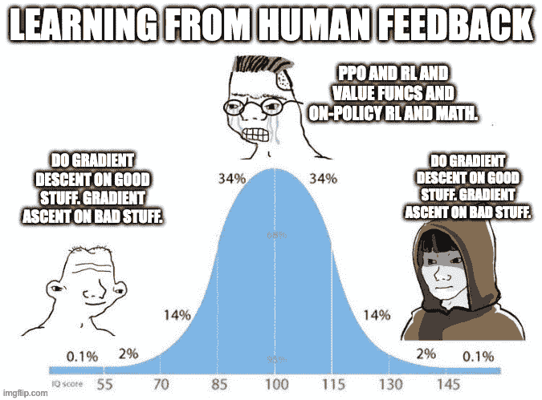
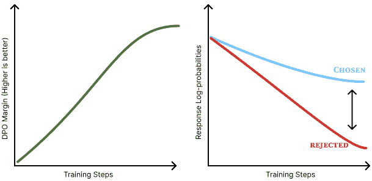

# 直接对齐算法

直接对齐算法（DAAs）允许更新模型以解决相同的 RLHF 目标，如等式 68 所示，而无需训练任何中间奖励模型或使用强化学习优化器。它解决了我们一直在研究（实际上使用的是相同的数据！）的相同偏好学习问题，目的是使语言模型更加对齐、更智能、更易于使用。没有奖励模型和在线优化使得 DAAs 的实现更加简单，减少了训练过程中的计算量，并使实验更容易进行。本章详细介绍了为了推导这些算法所进行的复杂数学，然后展示了有时繁琐的推导最终导致了简单的实现。

最突出的 DAA 之一，也是催化了整个将语言模型对齐的学术运动的是直接偏好优化（DPO）[[20]](ch021.xhtml#ref-rafailov2024direct)。在其核心，DPO 是使用梯度上升来解决相同的约束 RLHF 目标（见第四章）：

<semantics><mrow><munder><mi mathvariant="normal">max</mi><mi>π</mi></munder><msub><mi>𝔼</mi><mrow><mi>x</mi><mo>∼</mo><mi>𝒟</mi></mrow></msub><msub><mi>𝔼</mi><mrow><mi>y</mi><mo>∼</mo><mi>π</mi><mo stretchy="false" form="prefix">(</mo><mi>y</mi><mo stretchy="false" form="prefix">|</mo><mi>x</mi><mo stretchy="false" form="postfix">)</mo></mrow></msub><mrow><mo stretchy="true" form="prefix">[</mo><msub><mi>r</mi><mi>θ</mi></msub><mo stretchy="false" form="prefix">(</mo><mi>x</mi><mo>,</mo><mi>y</mi><mo stretchy="false" form="postfix">)</mo><mo stretchy="true" form="postfix">]</mo></mrow><mo>−</mo><mi>β</mi><msub><mi>𝒟</mi><mtext mathvariant="normal">KL</mtext></msub><mrow><mo stretchy="true" form="prefix">(</mo><mi>π</mi><mo stretchy="false" form="prefix">(</mo><mi>y</mi><mo stretchy="false" form="prefix">|</mo><mi>x</mi><mo stretchy="false" form="postfix">)</mo><mo stretchy="false" form="postfix">∥</mo><msub><mi>π</mi><mtext mathvariant="normal">ref</mtext></msub><mo stretchy="false" form="prefix">(</mo><mi>y</mi><mo stretchy="false" form="prefix">|</mi><mi>x</mi><mo stretchy="false" form="postfix">)</mo><mo stretchy="true" form="postfix">)</mo></mrow><mrow><mo stretchy="false" form="prefix">(</mo><mn>68</mn><mo stretchy="false" form="postfix">)</mo></mrow></mrow> <annotation encoding="application/x-tex">\max_{\pi} \mathbb{E}_{x \sim \mathcal{D}}\mathbb{E}_{y \sim \pi(y|x)} \left[r_\theta(x, y)\right] - \beta \mathcal{D}_{\text{KL}}\left(\pi(y|x) \| \pi_{\text{ref}}(y|x)\right)\qquad{(68)}</annotation></semantics>

自 2023 年 5 月发布以来，经过短暂的延迟（社区找到了使用 DPO 的正确数据和超参数，特别是出人意料地低的学习率），许多流行的模型已经使用了 DPO 或其变体，从 2023 年 10 月启动的 Zephyr-<semantics><mi>β</mi><annotation encoding="application/x-tex">\beta</annotation></semantics> [[21]](ch021.xhtml#ref-tunstall2023zephyr)，Llama 3 Instruct [[24]](ch021.xhtml#ref-dubey2024llama)，Tülu 2 [[22]](ch021.xhtml#ref-ivison2023camels) 和 3 [[6]](ch021.xhtml#ref-lambert2024t)，Nemotron 4 340B [[25]](ch021.xhtml#ref-adler2024nemotron)，以及其他模型。技术上讲，序列似然校准（SLiC-HF）是第一个发布的现代直接对齐算法 [[210]](ch021.xhtml#ref-zhao2023slic)，但由于多种因素（逆转研究方法的采用总是一个棘手的问题）并未流行起来。

DPO 和 DAAs 最具影响力的部分是降低了在训练后尝试语言模型的门槛——它使用的计算资源更少，从头开始实现更容易，并且更容易在玩具和实际生产案例中运行。

*在本章中，我们使用<semantics><mi>x</mi><annotation encoding="application/x-tex">x</annotation></semantics>表示提示，<semantics><mi>y</mi><annotation encoding="application/x-tex">y</annotation></semantics>表示完成。这种符号在语言模型文献中很常见，其中方法操作的是完整的提示-完成对，而不是单个标记。*

## 直接偏好优化（DPO）

在这里，我们解释 DPO 的工作直觉并重新推导核心方程。

### DPO 是如何工作的

在表面层面上，DPO 是直接优化策略以解决 RLHF 目标。这个损失函数，我们将在下面的推导中重新审视，是成对的对数概率关系。从 Bradley-Terry 奖励模型推导出的损失函数如下：

<semantics><mrow><msub><mi>ℒ</mi><mtext mathvariant="normal">DPO</mtext></msub><mo stretchy="false" form="prefix">(</mo><msub><mi>π</mi><mi>θ</mi></msub><mo>;</mo><msub><mi>π</mi><mtext mathvariant="normal">ref</mtext></msub><mo stretchy="false" form="postfix">)</mo><mo>=</mo><mi>−</mi><msub><mi>𝔼</mi><mrow><mo stretchy="false" form="prefix">(</mo><mi>x</mi><mo>,</mo><msub><mi>y</mi><mi>c</mi></msub><mo>,</mo><msub><mi>y</mi><mi>r</mi></msub><mo stretchy="false" form="postfix">)</mo><mo>∼</mo><mi>𝒟</mi></mrow></msub><mrow><mo stretchy="true" form="prefix">[</mo><mi mathvariant="normal">log</mi><mi>σ</mi><mrow><mo stretchy="true" form="prefix">(</mo><mi>β</mi><mi mathvariant="normal">log</mi><mfrac><mrow><msub><mi>π</mi><mi>θ</mi></msub><mo stretchy="false" form="prefix">(</mo><msub><mi>y</mi><mi>c</mi></msub><mo>∣</mo><mi>x</mi><mo stretchy="false" form="postfix">)</mo></mrow><mrow><msub><mi>π</mi><mtext mathvariant="normal">ref</mtext></msub><mo stretchy="false" form="prefix">(</mo><msub><mi>y</mi><mi>c</mi></msub><mo>∣</mo><mi>x</mi><mo stretchy="false" form="postfix">)</mo></mrow></mfrac><mo>−</mo><mi>β</mi><mi mathvariant="normal">log</mi><mfrac><mrow><msub><mi>π</mi><mi>θ</mi></msub><mo stretchy="false" form="prefix">(</mo><msub><mi>y</mi><mi>r</mi></msub><mo>∣</mo><mi>x</mi><mo stretchy="false" form="postfix">)</mo></mrow><mrow><msub><mi>π</mi><mtext mathvariant="normal">ref</mtext></msub><mo stretchy="false" form="prefix">(</mo><msub><mi>y</mi><mi>r</mi></msub><mo>∣</mo><mi>x</mi><mo stretchy="false" form="postfix">)</mo></mrow></mfrac><mo stretchy="true" form="postfix">)</mo></mrow><mo stretchy="true" form="postfix">]</mo></mrow><mrow><mo stretchy="false" form="prefix">(</mo><mn>69</mn><mo stretchy="false" form="postfix">)</mo></mrow></mrow> <annotation encoding="application/x-tex">\mathcal{L}_{\text{DPO}}(\pi_\theta; \pi_{\text{ref}}) = -\mathbb{E}_{(x, y_c, y_r) \sim \mathcal{D}}\left[ \log \sigma\left( \beta \log \frac{\pi_{\theta}(y_c \mid x)}{\pi_{\text{ref}}(y_c \mid x)} - \beta \log \frac{\pi_{\theta}(y_r \mid x)}{\pi_{\text{ref}}(y_r \mid x)} \right) \right] \qquad{(69)}</annotation></semantics>

在整个过程中，<semantics><mi>β</mi><annotation encoding="application/x-tex">\beta</annotation></semantics> 是一个超参数，用于平衡奖励优化与最终模型与初始参考模型之间的 KL 距离（即平衡过度优化，作为使用 DPO 校正的关键超参数）。这依赖于 DPO 训练的隐含奖励，它取代了使用外部奖励模型，后者是概率的对数比率：

<semantics><mrow><mi>r</mi><mo stretchy="false" form="prefix">(</mo><mi>x</mi><mo>,</mo><mi>y</mi><mo stretchy="false" form="postfix">)</mo><mo>=</mo><mi>β</mi><mrow><mi mathvariant="normal">log</mi><mo>⁡</mo></mrow><mfrac><mrow><msub><mi>π</mi><mi>r</mi></msub><mo stretchy="false" form="prefix">(</mo><mi>y</mi><mo>∣</mo><mi>x</mi><mo stretchy="false" form="postfix">)</mo></mrow><mrow><msub><mi>π</mi><mtext mathvariant="normal">ref</mtext></msub><mo stretchy="false" form="prefix">(</mo><mi>y</mi><mo>∣</mo><mi>x</mi><mo stretchy="false" form="postfix">)</mo></mrow></mfrac><mrow><mo stretchy="false" form="prefix">(</mo><mn>70</mn><mo stretchy="false" form="postfix">)</mo></mrow></mrow><annotation encoding="application/x-tex">r(x, y) = \beta \log \frac{\pi_r(y \mid x)}{\pi_{\text{ref}}(y \mid x)}\qquad{(70)}</annotation></semantics>

其中 <semantics><mrow><msub><mi>π</mi><mi>r</mi></msub><mo stretchy="false" form="prefix">(</mo><mi>y</mi><mo>∣</mo><mi>x</mi><mo stretchy="false" form="postfix">)</mo></mrow><annotation encoding="application/x-tex">\pi_r(y \mid x)</annotation></semantics> 是我们正在解决的精确、最优奖励策略。这来自于根据最优策略（如第七章的布拉德利-特里奖励模型部分中所示，见等式 84）推导出的布拉德利-特里奖励，正如第七章的布拉德利-特里模型部分所示。本质上，隐式奖励模型显示了“以最优策略而不是奖励模型来表示人类偏好数据的概率。”

让我们考虑等式 69 中显示的损失，优化器必须减少这个损失。在这里，当所选响应的对数比率大于被拒绝响应的对数比率（按参考模型归一化）时，损失会更低。在实践中，这是模型在数据呈现的标记序列中的对数概率的总和。因此，DPO 正在增加所选和被拒绝响应之间的概率差异。

在等式 70 中的奖励下，我们可以写出损失的梯度以进一步解释正在发生的事情：

<semantics><mrow><msub><mi>∇</mi><mi>θ</mi></msub><msub><mi>ℒ</mi><mtext mathvariant="normal">DPO</mtext></msub><mo stretchy="false" form="prefix">(</mo><msub><mi>π</mi><mi>θ</mi></msub><mo>;</mo><msub><mi>π</mi><mtext mathvariant="normal">ref</mtext></msub><mo stretchy="false" form="postfix">)</mo><mo>=</mo><mi>−</mi><mi>β</mi><msub><mi>𝔼</mi><mrow><mo stretchy="false" form="prefix">(</mo><mi>x</mi><mo>,</mo><msub><mi>y</mi><mi>c</mi></msub><mo>,</mo><msub><mi>y</mi><mi>r</mi></msub><mo stretchy="false" form="postfix">)</mo><mo>∼</mo><mi>𝒟</mi></mrow></msub><mrow><mo stretchy="true" form="prefix">[</mo><mi>σ</mi><mrow><mo stretchy="true" form="prefix">(</mo><msub><mi>r</mi><mi>θ</mi></msub><mo stretchy="false" form="prefix">(</mo><mi>x</mi><mo>,</mo><msub><mi>y</mi><mi>r</mi></msub><mo stretchy="false" form="postfix">)</mo><mo>−</mo><msub><mi>r</mi><mi>θ</mi></msub><mo stretchy="false" form="prefix">(</mo><mi>x</mi><mo>,</mo><msub><mi>y</mi><mi>c</mi></msub><mo stretchy="false" form="postfix">)</mo><mo stretchy="true" form="postfix">)</mo></mrow><mrow><mo stretchy="true" form="prefix">(</mo><msub><mi>∇</mi><mi>θ</mi></msub><mi mathvariant="normal">log</mi><mi>π</mi><mo stretchy="false" form="prefix">(</mo><msub><mi>y</mi><mi>c</mi></msub><mo>∣</mo><mi>x</mi><mo stretchy="false" form="postfix">)</mo><mo>−</mo><msub><mi>∇</mi><mi>θ</mi></msub><mi mathvariant="normal">log</mi><mi>π</mi><mo stretchy="false" form="postfix">(</mo><msub><mi>y</mi><mi>r</mi></msub><mo>∣</mo><mi>x</mi><mo stretchy="false" form="postfix">)</mo><mo stretchy="true" form="postfix">)</mo></mrow><mo stretchy="true" form="postfix">]</mo></mrow><mrow><mo stretchy="false" form="prefix">(</mo><mn>71</mn><mo stretchy="false" form="postfix">)</mo></mrow></mrow><annotation encoding="application/x-tex">\nabla_{\theta}\mathcal{L}_{\text{DPO}}(\pi_{\theta}; \pi_{\text{ref}}) = -\beta \mathbb{E}_{(x, y_c, y_r)\sim \mathcal{D}}\left[ \sigma\left(r_{\theta}(x, y_r) - r_{\theta}(x, y_c)\right) \left(\nabla_{\theta}\log \pi(y_c \mid x) - \nabla_{\theta}\log \pi(y_r \mid x)\right) \right] \qquad{(71)}</annotation></semantics>

这里，梯度通过以下方式解决上述目标：

+   Sigmoid 函数中的第一个项，<semantics><mrow><mi>σ</mi><mo stretchy="false" form="prefix">(</mo><mi>⋅</mi><mo stretchy="false" form="postfix">)</mo></mrow><annotation encoding="application/x-tex">\sigma(\cdot)</annotation></semantics>，创建了一个从 0 到 1 的参数更新权重，当奖励估计不正确时权重更高。当拒绝的样本被优先选择时，权重更新应该更大！

+   其次，内括号中的术语<semantics><mrow><mo stretchy="false" form="prefix">[</mo><mi>⋅</mi><mo stretchy="false" form="postfix">]</mo></mrow><annotation encoding="application/x-tex">[\cdot]</annotation></semantics>增加了所选响应<semantics><msub><mi>y</mi><mi>c</mi></msub><annotation encoding="application/x-tex">y_c</annotation></semantics>的可能性，并减少了被拒绝的<semantics><msub><mi>y</mi><mi>r</mi></msub><annotation encoding="application/x-tex">y_r</annotation></semantics>的可能性。

+   这些术语通过<semantics><mi>β</mi><annotation encoding="application/x-tex">\beta</annotation></semantics>进行加权，它控制了更新如何平衡正确排序完成项与 KL 距离之间的关系。

核心直觉是 DPO 正在拟合一个隐式奖励模型，其相应的最佳策略可以以闭式形式提取（多亏了梯度下降和我们的 ML 工具）。方程的闭式形式意味着实现精确梯度是直接的，而不是需要通过训练奖励模型和采样完成项来评分来间接达到。常被误解的是，DPO 在本质上是在学习一个奖励模型，因此论文的副标题是*Your Language Model is Secretly a Reward Model.* 容易将其与直接训练策略的 DPO 目标混淆，因此研究下面的推导对完整理解很有帮助。

在隐式奖励模型学习的情况下，DPO 根据数据集中的数据和目标中的特定 KL 约束生成 RLHF 目标的最佳解决方案。<semantics><mi>β</mi><annotation encoding="application/x-tex">\beta</annotation></semantics>。在这里，DPO 针对特定的 KL 距离求解精确策略，因为生成不是在线的，就像策略梯度算法那样——这是与偏好调整的 RL 方法的核心区别。在许多方面，这使得与在线 RL 方法相比，使用 DPO 调整<semantics><mi>β</mi><annotation encoding="application/x-tex">\beta</annotation></semantics>值更容易，但关键且直观的是，最佳值取决于正在训练的模型和训练它的数据。

在每个偏好数据批次中，由许多对完成项<semantics><mrow><msub><mi>y</mi><mrow><mi>c</mi><mi>h</mi><mi>o</mi><mi}s</mi><mi>e</mi><mi>n</mi></mrow></msub><mo>≻</mo><msub><mi>y</mi><mrow><mi>r</mi><mi>e</mi><mi>j</mi><mi>e</mi><mi>c</mi><mi>t</mi><mi>e</mi><mi>d</mi></mrow></msub></mrow><annotation encoding="application/x-tex">y_{chosen} \succ y_{rejected}</annotation></semantics>组成，DPO 直接向最佳解决方案采取梯度步骤。这比策略梯度方法简单得多。



图 18：当 DPO 首次发布时，它在研究社区中引发了关于如何最好地进行 RLHF 和偏好学习的激烈辩论。这个梗很好地捕捉了这种情绪，辩论往往感觉是被强加的，过于夸张，但许多刚开始和处于顶级实验室的人们都从 DPO 中获得了巨大的益处。DPO 简化梗，归功于汤姆·戈尔茨坦。

### DPO 推导

DPO 推导分为两个主要部分。首先，作者展示了在整个书中使用的 RLHF 目标最优策略的形式。接下来，他们展示了如何从成对偏好数据（即布拉德利-特里模型）到达那个解决方案。

#### 1. 推导最优 RLHF 解决方案

首先，我们应该再次考虑 RLHF 优化目标，这里表示我们希望最大化这个量：

<semantics><mrow><munder><mi mathvariant="normal">max</mi><mi>π</mi></munder><msub><mi>𝔼</mi><mrow><mi>x</mi><mo>∼</mo><mi>𝒟</mi></mrow></msub><msub><mi>𝔼</mi><mrow><mi>y</mi><mo>∼</mo><mi>π</mi><mo stretchy="false" form="prefix">(</mo><mi>y</mi><mo stretchy="false" form="prefix">|</mo><mi>x</mi><mo stretchy="false" form="postfix">)</mo></mrow></msub><mrow><mo stretchy="true" form="prefix">[</mo><msub><mi>r</mi><mi>θ</mi></msub><mo stretchy="false" form="prefix">(</mo><mi>x</mi><mo>,</mo><mi>y</mi><mo stretchy="false" form="postfix">)</mo><mo stretchy="true" form="postfix">]</mo></mrow><mo>−</mo><mi>β</mi><msub><mi>𝒟</mi><mtext mathvariant="normal">KL</mtext></msub><mrow><mo stretchy="true" form="prefix">(</mo><mi>π</mi><mo stretchy="false" form="prefix">(</mo><mi>y</mi><mo stretchy="false" form="prefix">|</mo><mi>x</mi><mo stretchy="false" form="postfix">)</mo><mo stretchy="false" form="postfix">∥</mo><msub><mi>π</mi><mtext mathvariant="normal">ref</mtext></msub><mo stretchy="false" form="prefix">(</mo><mi>y</mi><mo stretchy="false" form="prefix">|</mi><mi>x</mi><mo stretchy="false" form="postfix">)</mo><mo stretchy="true" form="postfix">)</mo></mrow><mrow><mo stretchy="false" form="prefix">(</mo><mn>72</mn><mo stretchy="false" form="postfix">)</mo></mrow></mrow> <annotation encoding="application/x-tex">\max_{\pi} \mathbb{E}_{x \sim \mathcal{D}}\mathbb{E}_{y \sim \pi(y|x)} \left[r_\theta(x, y)\right] - \beta \mathcal{D}_{\text{KL}}\left(\pi(y|x) \| \pi_{\text{ref}}(y|x)\right)\qquad{(72)}</annotation></semantics>

在这里，双重期望仅适用于用于计算期望奖励的采样，因为 KL 项仍然是一个解析表达式。首先，让我们扩展 KL 散度的定义。回忆一下 <semantics><mrow><msub><mi>𝒟</mi><mtext mathvariant="normal">KL</mtext></msub><mo stretchy="false" form="prefix">(</mo><mi>π</mi><mo stretchy="false" form="postfix">∥</mo><msub><mi>π</mi><mtext mathvariant="normal">ref</mtext></msub><mo stretchy="false" form="postfix">)</mo><mo>=</mo><msub><mi>𝔼</mi><mrow><mi>y</mi><mo>∼</mo><mi>π</mi></mrow></msub><mrow><mo stretchy="true" form="prefix">[</mo><mi mathvariant="normal">log</mi><mfrac><mrow><mi>π</mi><mo stretchy="false" form="prefix">(</mo><mi>y</mi><mo stretchy="false" form="prefix">|</mo><mi>x</mi><mo stretchy="false" form="postfix">)</mo></mrow><mrow><msub><mi>π</mi><mtext mathvariant="normal">ref</mtext></msub><mo stretchy="false" form="prefix">(</mo><mi>y</mi><mo stretchy="false" form="prefix">|</mo><mi>x</mi><mo stretchy="false" form="postfix">)</mo></mrow></mfrac><mo stretchy="true" form="postfix">]</mo></mrow></mrow><annotation encoding="application/x-tex">\mathcal{D}_{\text{KL}}(\pi \| \pi_{\text{ref}}) = \mathbb{E}_{y \sim \pi}\left[\log \frac{\pi(y|x)}{\pi_{\text{ref}}(y|x)}\right]</annotation></semantics>，其中求和中的 <semantics><mrow><mi>π</mi><mo stretchy="false" form="prefix">(</mo><mi>y</mi><mo stretchy="false" form="prefix">|</mo><mi>x</mi><mo stretchy="false" form="postfix">)</mo></mrow><annotation encoding="application/x-tex">\pi(y|x)</annotation></semantics> 权重变成了采样分布。由于现在两个项都对 <semantics><mrow><mi>y</mi><mo>∼</mo><mi>π</mi><mo stretchy="false" form="prefix">(</mo><mi>y</mi><mo stretchy="false" form="prefix">|</mo><mi>x</mi><mo stretchy="false" form="postfix">)</mo></mrow><annotation encoding="application/x-tex">y \sim \pi(y|x)</annotation></semantics> 有相同的期望，我们可以将它们合并：

<semantics><mrow><mo>=</mo><munder><mi mathvariant="normal">max</mi><mi>π</mi></munder><mrow><mo stretchy="true" form="prefix">(</mo><msub><mi>𝔼</mi><mrow><mi>x</mi><mo>∼</mo><mi>𝒟</mi></mrow></msub><msub><mi>𝔼</mi><mrow><mi>y</mi><mo>∼</mo><mi>π</mi><mo stretchy="false" form="prefix">(</mo><mi>y</mi><mo stretchy="false" form="prefix">|</mo><mi>x</mi><mo stretchy="false" form="postfix">)</mo></mrow></msub><mo stretchy="false" form="prefix">[</mo><mi>r</mi><mo stretchy="false" form="prefix">(</mo><mi>x</mi><mo>,</mo><mi>y</mi><mo stretchy="false" form="postfix">)</mo><mo stretchy="false" form="postfix">]</mo><mo>−</mo><mi>β</mi><msub><mi>𝔼</mi><mrow><mi>x</mi><mo>∼</mo><mi>𝒟</mi></mrow></msub><msub><mi>𝔼</mi><mrow><mi>y</mi><mo>∼</mo><mi>π</mi><mo stretchy="false" form="prefix">(</mo><mi>y</mi><mo stretchy="false" form="prefix">|</mo><mi>x</mi><mo stretchy="false" form="postfix">)</mo></mrow></msub><mrow><mo stretchy="true" form="prefix">[</mo><mi mathvariant="normal">log</mi><mfrac><mrow><mi>π</mi><mo stretchy="false" form="prefix">(</mo><mi>y</mi><mo stretchy="false" form="prefix">|</mo><mi>x</mi><mo stretchy="false" form="postfix">)</mo></mrow><mrow><msub><mi>π</mi><mtext mathvariant="normal">ref</mtext></msub><mo stretchy="false" form="prefix">(</mo><mi>y</mi><mo stretchy="false" form="prefix">|</mi><mi>x</mi><mo stretchy="false" form="postfix">)</mo></mrow></mfrac><mo stretchy="true" form="postfix">]</mo></mrow><mo stretchy="true" form="postfix">)</mo></mrow><mrow><mo stretchy="false" form="prefix">(</mo><mn>74</mn><mo stretchy="false" form="postfix">)</mo></mrow></mrow> <annotation encoding="application/x-tex">= \max_{\pi}\left(\mathbb{E}_{x \sim \mathcal{D}}\mathbb{E}_{y \sim \pi(y|x)}[r(x,y)] - \beta\,\mathbb{E}_{x \sim \mathcal{D}}\mathbb{E}_{y \sim \pi(y|x)}\left[\log\frac{\pi(y|x)}{\pi_{\text{ref}}(y|x)}\right]\right) \qquad{(74)}</annotation></semantics>

然后移除因子<semantics><mrow><mi>−</mi><mn>1</mn></mrow><annotation encoding="application/x-tex">-1</annotation></semantics>和<semantics><mi>β</mi><annotation encoding="application/x-tex">\beta</annotation></semantics>，

<semantics><mrow><mo>=</mo><munder><mi mathvariant="normal">min</mi><mi>π</mi></munder><mrow><mo stretchy="true" form="prefix">(</mo><mi>−</mi><msub><mi>𝔼</mi><mrow><mi>x</mi><mo>∼</mo><mi>𝒟</mi></mrow></msub><msub><mi>𝔼</mi><mrow><mi>y</mi><mo>∼</mo><mi>π</mi><mo stretchy="false" form="prefix">(</mo><mi>y</mi><mo stretchy="false" form="prefix">|</mo><mi>x</mi><mo stretchy="false" form="postfix">)</mo></mrow></msub><mo stretchy="false" form="prefix">[</mo><mi>r</mi><mo stretchy="false" form="prefix">(</mo><mi>x</mi><mo>,</mo><mi>y</mi><mo stretchy="false" form="postfix">)</mo><mo stretchy="false" form="postfix">]</mo><mo>+</mo><mi>β</mi><msub><mi>𝔼</mi><mrow><mi>x</mi><mo>∼</mo><mi>𝒟</mi></mrow></msub><msub><mi>𝔼</mi><mrow><mi>y</mi><mo>∼</mo><mi>π</mi><mo stretchy="false" form="prefix">(</mo><mi>y</mi><mo stretchy="false" form="prefix">|</mo><mi>x</mi><mo stretchy="false" form="postfix">)</mo></mrow></msub><mrow><mo stretchy="true" form="prefix">[</mo><mi mathvariant="normal">log</mi><mfrac><mrow><mi>π</mi><mo stretchy="false" form="prefix">(</mo><mi>y</mi><mo stretchy="false" form="prefix">|</mo><mi>x</mi><mo stretchy="false" form="postfix">)</mo></mrow><mrow><msub><mi>π</mi><mrow><mi mathvariant="normal">r</mi><mi mathvariant="normal">e</mi><mi mathvariant="normal">f</mi></mrow></msub><mo stretchy="false" form="prefix">(</mo><mi>y</mi><mo stretchy="false" form="prefix">|</mo><mi>x</mi><mo stretchy="false" form="postfix">)</mo></mrow></mfrac><mo stretchy="true" form="postfix">]</mo></mrow><mo stretchy="true" form="postfix">)</mo></mrow><mrow><mo stretchy="false" form="prefix">(</mo><mn>75</mn><mo stretchy="false" form="postfix">)</mo></mrow></mrow> <annotation encoding="application/x-tex">= \min_{\pi}\left(-\mathbb{E}_{x \sim \mathcal{D}}\mathbb{E}_{y \sim \pi(y|x)}[r(x,y)] + \beta\,\mathbb{E}_{x \sim \mathcal{D}}\mathbb{E}_{y \sim \pi(y|x)}\left[\log\frac{\pi(y|x)}{\pi_{\mathrm{ref}}(y|x)}\right]\right) \qquad{(75)}</annotation></semantics>

将其除以 <semantics><mi>β</mi><annotation encoding="application/x-tex">\beta</annotation></semantics> 并重新组合：

<semantics><mrow><mo>=</mo><munder><mi mathvariant="normal">min</mi><mi>π</mi></munder><mrow><mo stretchy="true" form="prefix">(</mo><msub><mi>𝔼</mi><mrow><mi>x</mi><mo>∼</mo><mi>𝒟</mi></mrow></msub><msub><mi>𝔼</mi><mrow><mi>y</mi><mo>∼</mo><mi>π</mi><mo stretchy="false" form="prefix">(</mo><mi>y</mi><mo stretchy="false" form="prefix">|</mo><mi>x</mi><mo stretchy="false" form="postfix">)</mo></mrow></msub><mrow><mo stretchy="true" form="prefix">[</mo><mi mathvariant="normal">log</mi><mfrac><mrow><mi>π</mi><mo stretchy="false" form="prefix">(</mo><mi>y</mi><mo stretchy="false" form="prefix">|</mo><mi>x</mi><mo stretchy="false" form="postfix">)</mo></mrow><mrow><msub><mi>π</mi><mtext mathvariant="normal">ref</mtext></msub><mo stretchy="false" form="prefix">(</mo><mi>y</mi><mo stretchy="false" form="prefix">|</mo><mi>x</mi><mo stretchy="false" form="postfix">)</mo></mrow></mfrac><mo>−</mo><mfrac><mn>1</mn><mi>β</mi></mfrac><mi>r</mi><mo stretchy="false" form="prefix">(</mo><mi>x</mi><mo>,</mo><mi>y</mi><mo stretchy="false" form="postfix">)</mo><mo stretchy="true" form="postfix">]</mo></mrow><mo stretchy="true" form="postfix">)</mo></mrow><mrow><mo stretchy="false" form="prefix">(</mo><mn>76</mn><mo stretchy="false" form="postfix">)</mo></mrow></mrow> <annotation encoding="application/x-tex">= \min_{\pi}\left(\mathbb{E}_{x \sim \mathcal{D}}\mathbb{E}_{y \sim \pi(y|x)}\left[ \log\frac{\pi(y|x)}{\pi_{\text{ref}}(y|x)} - \frac{1}{\beta}r(x,y) \right]\right) \qquad{(76)}</annotation></semantics>

接下来，我们必须引入一个配分函数，<semantics><mrow><mi>Z</mi><mo stretchy="false" form="prefix">(</mo><mi>x</mi><mo stretchy="false" form="postfix">)</mo></mrow><annotation encoding="application/x-tex">Z(x)</annotation></semantics>：

<semantics><mrow><mi>Z</mi><mo stretchy="false" form="prefix">(</mo><mi>x</mi><mo stretchy="false" form="postfix">)</mo><mo>=</mo><munder><mo>∑</mo><mi>y</mi></munder><msub><mi>π</mi><mtext mathvariant="normal">ref</mtext></msub><mo stretchy="false" form="prefix">(</mo><mi>y</mi><mo stretchy="false" form="prefix">|</mo><mi>x</mi><mo stretchy="false" form="postfix">)</mo><mrow><mi mathvariant="normal">exp</mi><mo>⁡</mo></mrow><mrow><mo stretchy="true" form="prefix">(</mo><mfrac><mn>1</mn><mi>β</mi></mfrac><mi>r</mi><mo stretchy="false" form="prefix">(</mo><mi>x</mi><mo>,</mo><mi>y</mi><mo stretchy="false" form="postfix">)</mo><mo stretchy="true" form="postfix">)</mo></mrow><mrow><mo stretchy="false" form="prefix">(</mo><mn>77</mn><mo stretchy="false" form="postfix">)</mo></mrow></mrow> <annotation encoding="application/x-tex">Z(x) = \sum_y \pi_{\text{ref}}(y|x)\exp\left(\frac{1}{\beta}r(x,y)\right) \qquad{(77)}</annotation></semantics>

配分函数作为参考策略的归一化因子，对所有可能的响应 <semantics><mi>y</mi><annotation encoding="application/x-tex">y</annotation></semantics> 到提示 <semantics><mi>x</mi><annotation encoding="application/x-tex">x</annotation></semantics> 的总和。将此代入后，我们得到我们的中间转换：

<semantics><mrow><munder><mi mathvariant="normal">min</mi><mi>π</mi></munder><msub><mi>𝔼</mi><mrow><mi>x</mi><mo>∼</mo><mi>𝒟</mi></mrow></msub><msub><mi>𝔼</mi><mrow><mi>y</mi><mo>∼</mo><mi>π</mi><mo stretchy="false" form="prefix">(</mo><mi>y</mi><mo stretchy="false" form="prefix">|</mo><mi>x</mi><mo stretchy="false" form="postfix">)</mo></mrow></msub><mrow><mo stretchy="true" form="prefix">[</mo><mi mathvariant="normal">log</mi><mfrac><mrow><mi>π</mi><mo stretchy="false" form="prefix">(</mo><mi>y</mi><mo stretchy="false" form="prefix">|</mo><mi>x</mi><mo stretchy="false" form="postfix">)</mo></mrow><mrow><mfrac><mn>1</mn><mrow><mi>Z</mi><mo stretchy="false" form="prefix">(</mo><mi>x</mi><mo stretchy="false" form="postfix">)</mo></mrow></mfrac><msub><mi>π</mi><mtext mathvariant="normal">ref</mtext></msub><mo stretchy="false" form="prefix">(</mo><mi>y</mi><mo stretchy="false" form="prefix">|</mo><mi>x</mi><mo stretchy="false" form="postfix">)</mo><mrow><mi mathvariant="normal">exp</mi><mo>⁡</mo></mrow><mrow><mo stretchy="true" form="prefix">(</mo><mfrac><mn>1</mn><mi>β</mi></mfrac><mi>r</mi><mo stretchy="false" form="prefix">(</mo><mi>x</mi><mo>,</mo><mi>y</mi><mo stretchy="false" form="postfix">)</mo><mo stretchy="true" form="postfix">)</mo></mrow></mrow></mfrac><mo>−</mo><mi mathvariant="normal">log</mi><mi>Z</mi><mo stretchy="false" form="prefix">(</mo><mi>x</mi><mo stretchy="false" form="postfix">)</mo><mo stretchy="true" form="postfix">]</mo></mrow><mrow><mo stretchy="false" form="prefix">(</mo><mn>78</mn><mo stretchy="false" form="postfix">)</mo></mrow></mrow> <annotation encoding="application/x-tex">\min_{\pi}\mathbb{E}_{x\sim\mathcal{D}}\mathbb{E}_{y\sim\pi(y|x)}\left[\log\frac{\pi(y|x)}{\frac{1}{Z(x)}\pi_{\text{ref}}(y|x)\exp\left(\frac{1}{\beta}r(x,y)\right)} - \log Z(x)\right] \qquad{(78)}</annotation></semantics>

要了解这是如何得到的，考虑方程 76 中括号内的优化内部部分：

<semantics><mrow><mrow><mi mathvariant="normal">log</mi><mo>⁡</mo></mrow><mfrac><mrow><mi>π</mi><mo stretchy="false" form="prefix">(</mo><mi>y</mi><mo stretchy="false" form="prefix">|</mo><mi>x</mi><mo stretchy="false" form="postfix">)</mo></mrow><mrow><msub><mi>π</mi><mtext mathvariant="normal">ref</mtext></msub><mo stretchy="false" form="prefix">(</mo><mi>y</mi><mo stretchy="false" form="prefix">|</mo><mi>x</mi><mo stretchy="false" form="postfix">)</mo></mrow></mfrac><mo>−</mo><mfrac><mn>1</mn><mi>β</mi></mfrac><mi>r</mi><mo stretchy="false" form="prefix">(</mo><mi>x</mi><mo>,</mo><mi>y</mi><mo stretchy="false" form="postfix">)</mo><mrow><mo stretchy="false" form="prefix">(</mo><mn>79</mn><mo stretchy="false" form="postfix">)</mo></mrow></mrow> <annotation encoding="application/x-tex">\log\frac{\pi(y|x)}{\pi_{\text{ref}}(y|x)} - \frac{1}{\beta}r(x,y) \qquad{(79)}</annotation></semantics>

然后，将 <semantics><mrow><mrow><mi mathvariant="normal">log</mi><mo>⁡</mo></mrow><mi>Z</mi><mo stretchy="false" form="prefix">(</mo><mi>x</mi><mo stretchy="false" form="postfix">)</mo><mo>−</mo><mrow><mi mathvariant="normal">log</mi><mo>⁡</mo></mrow><mi>Z</mi><mo stretchy="false" form="prefix">(</mo><mi>x</mi><mo stretchy="false" form="postfix">)</mo></mrow><annotation encoding="application/x-tex">\log Z(x) - \log Z(x)</annotation></semantics> 添加到等式的两边：

<semantics><mrow><mo>=</mo><mrow><mi mathvariant="normal">log</mi><mo>⁡</mo></mrow><mfrac><mrow><mi>π</mi><mo stretchy="false" form="prefix">(</mo><mi>y</mi><mo stretchy="false" form="prefix">|</mo><mi>x</mi><mo stretchy="false" form="postfix">)</mo></mrow><mrow><msub><mi>π</mi><mtext mathvariant="normal">ref</mtext></msub><mo stretchy="false" form="prefix">(</mo><mi>y</mi><mo stretchy="false" form="prefix">|</mo><mi>x</mi><mo stretchy="false" form="postfix">)</mo></mrow></mfrac><mo>−</mo><mfrac><mn>1</mn><mi>β</mi></mfrac><mi>r</mi><mo stretchy="false" form="prefix">(</mo><mi>x</mi><mo>,</mo><mi>y</mi><mo stretchy="false" form="postfix">)</mo><mo>+</mo><mrow><mi mathvariant="normal">log</mi><mo>⁡</mo></mrow><mi>Z</mi><mo stretchy="false" form="prefix">(</mo><mi>x</mi><mo stretchy="false" form="postfix">)</mo><mo>−</mo><mrow><mi mathvariant="normal">log</mi><mo>⁡</mo></mrow><mi>Z</mi><mo stretchy="false" form="prefix">(</mo><mi>x</mi><mo stretchy="false" form="postfix">)</mo><mrow><mo stretchy="false" form="prefix">(</mo><mn>80</mn><mo stretchy="false" form="postfix">)</mo></mrow></mrow> <annotation encoding="application/x-tex">= \log\frac{\pi(y|x)}{\pi_{\text{ref}}(y|x)} - \frac{1}{\beta}r(x,y) + \log Z(x) - \log Z(x) \qquad{(80)}</annotation></semantics>

然后，我们将这些项分组：

`<semantics><mrow><mo>=</mo><mrow><mo stretchy="true" form="prefix">(</mo><mi mathvariant="normal">log</mi><mfrac><mrow><mi>π</mi><mo stretchy="false" form="prefix">(</mo><mi>y</mi><mo stretchy="false" form="prefix">|</mo><mi>x</mi><mo stretchy="false" form="postfix">)</mo></mrow><mrow><msub><mi>π</mi><mtext mathvariant="normal">ref</mtext></msub><mo stretchy="false" form="prefix">(</mo><mi>y</mi><mo stretchy="false" form="prefix">|</mi><mi>x</mi><mo stretchy="false" form="postfix">)</mo></mrow></mfrac><mo>+</mo><mi mathvariant="normal">log</mi><mi>Z</mi><mo stretchy="false" form="prefix">(</mo><mi>x</mi><mo stretchy="false" form="postfix">)</mo><mo stretchy="true" form="postfix">)</mo></mrow><mo>−</mo><mrow><mi mathvariant="normal">log</mi><mo>⁡</mo></mrow><mi>Z</mi><mo stretchy="false" form="prefix">(</mo><mi>x</mi><mo stretchy="false" form="postfix">)</mo><mo>−</mo><mfrac><mn>1</mn><mi>β</mi></mfrac><mi>r</mi><mo stretchy="false" form="prefix">(</mo><mi>x</mi><mo>,</mo><mi>y</mi><mo stretchy="false" form="postfix">)</mo><mrow><mo stretchy="false" form="prefix">(</mo><mn>81</mn><mo stretchy="false" form="postfix">)</mo></mrow></mrow> <annotation encoding="application/x-tex">= \left( \log \frac{\pi(y|x)}{\pi_{\text{ref}}(y|x)} + \log Z(x) \right) - \log Z(x) - \frac{1}{\beta}r(x,y) \qquad{(81)}</annotation></semantics>`

通过 `<semantics><mrow><mrow><mi mathvariant="normal">log</mi><mo>⁡</mo></mrow><mo stretchy="false" form="prefix">(</mo><mi>x</mi><mo stretchy="false" form="postfix">)</mo><mo>+</mo><mrow><mi mathvariant="normal">log</mi><mo>⁡</mo></mrow><mo stretchy="false" form="prefix">(</mo><mi>y</mi><mo stretchy="false" form="postfix">)</mo><mo>=</mo><mrow><mi mathvariant="normal">log</mi><mo>⁡</mo></mrow><mo stretchy="false" form="prefix">(</mo><mi>x</mi><mo>⋅</mo><mi>y</mi><mo stretchy="false" form="postfix">)</mo></mrow><annotation encoding="application/x-tex">\log(x) + \log(y) = \log(x\cdot y)</annotation></semantics>` (并将 `<semantics><mi>Z</mi><annotation encoding="application/x-tex">Z</annotation></semantics>` 移至分母)，我们得到：

<semantics><mrow><mo>=</mo><mrow><mi mathvariant="normal">log</mi><mo>⁡</mo></mrow><mfrac><mrow><mi>π</mi><mo stretchy="false" form="prefix">(</mo><mi>y</mi><mo stretchy="false" form="prefix">|</mo><mi>x</mi><mo stretchy="false" form="postfix">)</mo></mrow><mrow><mfrac><mn>1</mn><mrow><mi>Z</mi><mo stretchy="false" form="prefix">(</mo><mi>x</mi><mo stretchy="false" form="postfix">)</mo></mrow></mfrac><msub><mi>π</mi><mtext mathvariant="normal">ref</mtext></msub><mo stretchy="false" form="prefix">(</mo><mi>y</mi><mo stretchy="false" form="prefix">|</mo><mi>x</mi><mo stretchy="false" form="postfix">)</mo></mrow></mfrac><mo>−</mo><mrow><mi mathvariant="normal">log</mi><mo>⁡</mo></mrow><mi>Z</mi><mo stretchy="false" form="prefix">(</mo><mi>x</mi><mo stretchy="false" form="postfix">)</mo><mo>−</mo><mfrac><mn>1</mn><mi>β</mi></mfrac><mi>r</mi><mo stretchy="false" form="prefix">(</mo><mi>x</mi><mo>,</mo><mi>y</mi><mo stretchy="false" form="postfix">)</mo><mrow><mo stretchy="false" form="prefix">(</mo><mn>82</mn><mo stretchy="false" form="postfix">)</mo></mrow></mrow> <annotation encoding="application/x-tex">= \log \frac{\pi(y|x)}{\frac{1}{Z(x)}\pi_{\text{ref}}(y|x)}- \log Z(x) - \frac{1}{\beta}r(x,y) \qquad{(82)}</annotation></semantics>

接下来，我们将 <semantics><mrow><mfrac><mn>1</mn><mi>β</mi></mfrac><mi>r</mi><mo stretchy="false" form="prefix">(</mo><mi>x</mi><mo>,</mo><mi>y</mi><mo stretchy="false" form="postfix">)</mo></mrow><annotation encoding="application/x-tex">\frac{1}{\beta}r(x,y)</annotation></semantics> 展开为 <semantics><mrow><mrow><mi mathvariant="normal">log</mi><mo>⁡</mo></mrow><mrow><mi mathvariant="normal">exp</mi><mo>⁡</mo></mrow><mfrac><mn>1</mn><mi>β</mi></mfrac><mi>r</mi><mo stretchy="false" form="prefix">(</mo><mi>x</mi><mo>,</mo><mi>y</mi><mo stretchy="false" form="postfix">)</mo></mrow><annotation encoding="application/x-tex">\log \exp \frac{1}{\beta}r(x,y)</annotation></semantics> 并对等式 78 进行相同的操作。采用这种优化形式，我们需要实际求解最优策略 <semantics><msup><mi>π</mi><mo>*</mo></msup><annotation encoding="application/x-tex">\pi^*</annotation></semantics>。为此，让我们将上述优化视为 KL 距离：

<semantics><mrow><munder><mi mathvariant="normal">min</mi><mi>π</mi></munder><msub><mi>𝔼</mi><mrow><mi>x</mi><mo>∼</mo><mi>𝒟</mi></mrow></msub><mrow><mo stretchy="true" form="prefix">[</mo><msub><mi>𝒟</mi><mtext mathvariant="normal">KL</mtext></msub><mrow><mo stretchy="true" form="prefix">(</mo><mi>π</mi><mo stretchy="false" form="prefix">(</mo><mi>y</mi><mo stretchy="false" form="prefix">|</mo><mi>x</mi><mo stretchy="false" form="postfix">)</mo><mo stretchy="false" form="prefix">|</mo><mo stretchy="false" form="prefix">|</mo><mfrac><mn>1</mn><mrow><mi>Z</mi><mo stretchy="false" form="prefix">(</mo><mi>x</mi><mo stretchy="false" form="postfix">)</mo></mrow></mfrac><msub><mi>π</mi><mtext mathvariant="normal">ref</mtext></msub><mo stretchy="false" form="prefix">(</mo><mi>y</mi><mo stretchy="false" form="prefix">|</mo><mi>x</mi><mo stretchy="false" form="postfix">)</mo><mi mathvariant="normal">exp</mi><mrow><mo stretchy="true" form="prefix">(</mo><mfrac><mn>1</mn><mi>β</mi></mfrac><mi>r</mi><mo stretchy="false" form="prefix">(</mo><mi>x</mi><mo>,</mo><mi>y</mi><mo stretchy="false" form="postfix">)</mo><mo stretchy="true" form="postfix">)</mo></mrow><mo stretchy="true" form="postfix">)</mo></mrow><mo>−</mo><mi mathvariant="normal">log</mi><mi>Z</mi><mo stretchy="false" form="prefix">(</mo><mi>x</mi><mo stretchy="false" form="postfix">)</mo><mo stretchy="true" form="postfix">]</mo></mrow><mrow><mo stretchy="false" form="prefix">(</mo><mn>83</mn><mo stretchy="false" form="postfix">)</mo></mrow></mrow> <annotation encoding="application/x-tex">\min_{\pi}\mathbb{E}_{x\sim\mathcal{D}}\left[\mathcal{D}_{\text{KL}} \left(\pi(y|x)||\frac{1}{Z(x)}\pi_{\text{ref}}(y|x)\exp\left(\frac{1}{\beta}r(x,y)\right) \right) - \log Z(x)\right] \qquad{(83)}</annotation></semantics>

由于配分函数 <semantics><mrow><mi>Z</mi><mo stretchy="false" form="prefix">(</mo><mi>x</mi><mo stretchy="false" form="postfix">)</mo></mrow><annotation encoding="application/x-tex">Z(x)</annotation></semantics> 不依赖于最终答案，我们可以忽略它。这使我们只剩下我们正在学习的策略与与配分相关的形式之间的 KL 距离，<semantics><mi>β</mi><annotation encoding="application/x-tex">\beta</annotation></semantics>，奖励和参考策略。吉布斯不等式告诉我们，当这两个量相等时，距离为 0，此时达到最小化！因此，我们得到一个最优策略：

<semantics><mrow><msup><mi>π</mi><mo>*</mo></msup><mo stretchy="false" form="prefix">(</mo><mi>y</mi><mo stretchy="false" form="prefix">|</mo><mi>x</mi><mo stretchy="false" form="postfix">)</mo><mo>=</mo><mi>π</mi><mo stretchy="false" form="prefix">(</mo><mi>y</mi><mo stretchy="false" form="prefix">|</mo><mi>x</mi><mo stretchy="false" form="postfix">)</mo><mo>=</mo><mfrac><mn>1</mn><mrow><mi>Z</mi><mo stretchy="false" form="prefix">(</mo><mi>x</mi><mo stretchy="false" form="postfix">)</mo></mrow></mfrac><msub><mi>π</mi><mtext mathvariant="normal">ref</mtext></msub><mo stretchy="false" form="prefix">(</mo><mi>y</mi><mo stretchy="false" form="prefix">|</mo><mi>x</mi><mo stretchy="false" form="postfix">)</mo><mrow><mi mathvariant="normal">exp</mi><mo>⁡</mo></mrow><mrow><mo stretchy="true" form="prefix">(</mo><mfrac><mn>1</mn><mi>β</mi></mfrac><mi>r</mi><mo stretchy="false" form="prefix">(</mo><mi>x</mi><mo>,</mo><mi>y</mi><mo stretchy="false" form="postfix">)</mo><mo stretchy="true" form="postfix">)</mo></mrow><mrow><mo stretchy="false" form="prefix">(</mo><mn>84</mn><mo stretchy="false" form="postfix">)</mo></mrow></mrow> <annotation encoding="application/x-tex">\pi^*(y|x) = \pi(y|x) = \frac{1}{Z(x)}\pi_{\text{ref}}(y|x)\exp\left(\frac{1}{\beta}r(x,y)\right) \qquad{(84)}</annotation></semantics>

#### 2. 推导布拉德利-特里模型的目标函数

首先，回顾第七章关于奖励建模和第六章关于偏好数据的内容，了解人类偏好的布拉德利-特里模型是如何形成的：

<semantics><mrow><mrow><mi mathvariant="normal">log</mi><mo>⁡</mo></mrow><msup><mi>π</mi><mo>*</mo></msup><mo stretchy="false" form="prefix">(</mo><mi>y</mi><mo stretchy="false" form="prefix">|</mo><mi>x</mi><mo stretchy="false" form="postfix">)</mo><mo>=</mo><mrow><mi mathvariant="normal">log</mi><mo>⁡</mo></mrow><mrow><mo stretchy="true" form="prefix">(</mo><mfrac><mn>1</mn><mrow><mi>Z</mi><mo stretchy="false" form="prefix">(</mo><mi>x</mi><mo stretchy="false" form="postfix">)</mo></mrow></mfrac><msub><mi>π</mi><mtext mathvariant="normal">ref</mtext></msub><mo stretchy="false" form="prefix">(</mo><mi>y</mi><mo stretchy="false" form="prefix">|</mo><mi>x</mi><mo stretchy="false" form="postfix">)</mo><mi mathvariant="normal">exp</mi><mrow><mo stretchy="true" form="prefix">(</mo><mfrac><mn>1</mn><mi>β</mi></mfrac><msup><mi>r</mi><mo>*</mo></msup><mo stretchy="false" form="prefix">(</mo><mi>x</mi><mo>,</mo><mi>y</mi><mo stretchy="false" form="postfix">)</mo><mo stretchy="true" form="postfix">)</mo></mrow><mo stretchy="true" form="postfix">)</mo></mrow><mrow><mo stretchy="false" form="prefix">(</mo><mn>86</mn><mo stretchy="false" form="postfix">)</mo></mrow></mrow><annotation encoding="application/x-tex">\log \pi^*(y|x) = \log \left( \frac{1}{Z(x)}\pi_{\text{ref}}(y|x)\exp\left(\frac{1}{\beta}r^*(x,y)\right) \right)\qquad{(86)}</annotation></semantics>

使用 <semantics><mrow><mrow><mi mathvariant="normal">log</mi><mo>⁡</mo></mrow><mo stretchy="false" form="prefix">(</mo><mi>a</mi><mi>b</mi><mi>c</mi><mo stretchy="false" form="postfix">)</mo><mo>=</mo><mrow><mi mathvariant="normal">log</mi><mo>⁡</mo></mrow><mi>a</mi><mo>+</mo><mrow><mi mathvariant="normal">log</mi><mo>⁡</mo></mrow><mi>b</mi><mo>+</mo><mrow><mi mathvariant="normal">log</mi><mo>⁡</mo></mrow><mi>c</mi></mrow><annotation encoding="application/x-tex">\log(abc) = \log a + \log b + \log c</annotation></semantics> 展开右侧：

<semantics><mrow><mrow><mi mathvariant="normal">log</mi><mo>⁡</mo></mrow><msup><mi>π</mi><mo>*</mo></msup><mo stretchy="false" form="prefix">(</mo><mi>y</mi><mo stretchy="false" form="prefix">|</mo><mi>x</mi><mo stretchy="false" form="postfix">)</mo><mo>=</mo><mi>−</mi><mrow><mi mathvariant="normal">log</mi><mo>⁡</mo></mrow><mi>Z</mi><mo stretchy="false" form="prefix">(</mo><mi>x</mi><mo stretchy="false" form="postfix">)</mo><mo>+</mo><mrow><mi mathvariant="normal">log</mi><mo>⁡</mo></mrow><msub><mi>π</mi><mtext mathvariant="normal">ref</mtext></msub><mo stretchy="false" form="prefix">(</mo><mi>y</mi><mo stretchy="false" form="prefix">|</mo><mi>x</mi><mo stretchy="false" form="postfix">)</mo><mo>+</mo><mfrac><mn>1</mn><mi>β</mi></mfrac><msup><mi>r</mi><mo>*</mo></msup><mo stretchy="false" form="prefix">(</mo><mi>x</mi><mo>,</mo><mi>y</mi><mo stretchy="false" form="postfix">)</mo><mrow><mo stretchy="false" form="prefix">(</mo><mn>87</mn><mo stretchy="false" form="postfix">)</mo></mrow></mrow><annotation encoding="application/x-tex">\log \pi^*(y|x) = -\log Z(x) + \log \pi_{\text{ref}}(y|x) + \frac{1}{\beta}r^*(x,y)\qquad{(87)}</annotation></semantics>

对 <semantics><mrow><msup><mi>r</mi><mo>*</mo></msup><mo stretchy="false" form="prefix">(</mo><mi>x</mi><mo>,</mo><mi>y</mi><mo stretchy="false" form="postfix">)</mo></mrow><annotation encoding="application/x-tex">r^*(x,y)</annotation></semantics> 进行重新排列以求解:

<semantics><mrow><mfrac><mn>1</mn><mi>β</mi></mfrac><msup><mi>r</mi><mo>*</mo></msup><mo stretchy="false" form="prefix">(</mo><mi>x</mi><mo>,</mo><mi>y</mi><mo stretchy="false" form="postfix">)</mo><mo>=</mo><mrow><mi mathvariant="normal">log</mi><mo>⁡</mo></mrow><msup><mi>π</mi><mo>*</mo></msup><mo stretchy="false" form="prefix">(</mo><mi>y</mi><mo stretchy="false" form="prefix">|</mo><mi>x</mi><mo stretchy="false" form="postfix">)</mo><mo>−</mo><mrow><mi mathvariant="normal">log</mi><mo>⁡</mo></mrow><msub><mi>π</mi><mtext mathvariant="normal">ref</mtext></msub><mo stretchy="false" form="prefix">(</mo><mi>y</mi><mo stretchy="false" form="prefix">|</mo><mi>x</mi><mo stretchy="false" form="postfix">)</mo><mo>+</mo><mrow><mi mathvariant="normal">log</mi><mo>⁡</mo></mrow><mi>Z</mi><mo stretchy="false" form="prefix">(</mo><mi>x</mi><mo stretchy="false" form="postfix">)</mo><mrow><mo stretchy="false" form="prefix">(</mo><mn>88</mn><mo stretchy="false" form="postfix">)</mo></mrow></mrow><annotation encoding="application/x-tex">\frac{1}{\beta}r^*(x,y) = \log \pi^*(y|x) - \log \pi_{\text{ref}}(y|x) + \log Z(x)\qquad{(88)}</annotation></semantics>

两边同时乘以 <semantics><mi>β</mi><annotation encoding="application/x-tex">\beta</annotation></semantics>:

<semantics><mrow><msup><mi>r</mi><mo>*</mo></msup><mo stretchy="false" form="prefix">(</mo><mi>x</mi><mo>,</mo><mi>y</mi><mo stretchy="false" form="postfix">)</mo><mo>=</mo><mi>β</mi><mrow><mi mathvariant="normal">log</mi><mo>⁡</mo></mrow><mfrac><mrow><msup><mi>π</mi><mo>*</mo></msup><mo stretchy="false" form="prefix">(</mo><mi>y</mi><mo>∣</mo><mi>x</mi><mo stretchy="false" form="postfix">)</mo></mrow><mrow><msub><mi>π</mi><mtext mathvariant="normal">ref</mtext></msub><mo stretchy="false" form="prefix">(</mo><mi>y</mi><mo>∣</mo><mi>x</mi><mo stretchy="false" form="postfix">)</mo></mrow></mfrac><mo>+</mo><mi>β</mi><mrow><mi mathvariant="normal">log</mi><mo>⁡</mo></mrow><mi>Z</mi><mo stretchy="false" form="prefix">(</mo><mi>x</mi><mo stretchy="false" form="postfix">)</mo><mrow><mo stretchy="false" form="prefix">(</mo><mn>89</mn><mo stretchy="false" form="postfix">)</mo></mrow></mrow><annotation encoding="application/x-tex">r^*(x, y) = \beta \log \frac{\pi^*(y \mid x)}{\pi_{\text{ref}}(y \mid x)} + \beta \log Z(x)\qquad{(89)}</annotation></semantics>

我们可以将奖励代入到方程式 85 中所示的 Bradley-Terry 方程，以获得：

通过将指数表达式从 <semantics><msup><mi>e</mi><mrow><mi>a</mi><mo>+</mo><mi>b</mi></mrow></msup><annotation encoding="application/x-tex">e^{a+b}</annotation></semantics> 分解为 <semantics><mrow><msup><mi>e</mi><mi>a</mi></msup><msup><mi>e</mi><mi>b</mi></msup></mrow><annotation encoding="application/x-tex">e^a e^b</annotation></semantics>，然后消去项 <semantics><msup><mi>e</mi><mrow><mrow><mi mathvariant="normal">log</mi><mo>⁡</mo></mrow><mo stretchy="false" form="prefix">(</mo><mi>Z</mi><mo stretchy="false" form="prefix">(</mo><mi>x</mi><mo stretchy="false" form="postfix">)</mo><mo stretchy="false" form="postfix">)</mo></mrow></msup><annotation encoding="application/x-tex">e^{\log(Z(x))}</annotation></semantics>，这简化为：

然后，将分子和分母乘以 `<semantics><mrow><mrow><mi mathvariant="normal">exp</mi><mo>⁡</mo></mrow><mrow><mo stretchy="true" form="prefix">(</mo><mi>−</mi><mi>β</mi><mi mathvariant="normal">log</mi><mfrac><mrow><msup><mi>π</mi><mo>*</mo></msup><mo stretchy="false" form="prefix">(</mo><msub><mi>y</mi><mn>1</mn></msub><mo>∣</mo><mi>x</mi><mo stretchy="false" form="postfix">)</mo></mrow><mrow><msub><mi>π</mi><mtext mathvariant="normal">ref</mtext></msub><mo stretchy="false" form="prefix">(</mo><msub><mi>y</mi><mn>1</mn></msub><mo>∣</mo><mi>x</mi><mo stretchy="false" form="postfix">)</mo></mrow></mfrac><mo stretchy="true" form="postfix">)</mo></mrow></mrow><annotation encoding="application/x-tex">\exp\left(-\beta \log \frac{\pi^*(y_1 \mid x)}{\pi_{\text{ref}}(y_1 \mid x)}\right)</annotation></semantics>` 以获得：

`<semantics><mrow><msup><mi>p</mi><mo>*</mo></msup><mo stretchy="false" form="prefix">(</mo><msub><mi>y</mi><mn>1</mn></msub><mo>≻</mo><msub><mi>y</mi><mn>2</mn></msub><mo>∣</mo><mi>x</mi><mo stretchy="false" form="postfix">)</mo><mo>=</mo><mfrac><mn>1</mn><mrow><mn>1</mn><mo>+</mo><mrow><mi mathvariant="normal">exp</mi><mo>⁡</mo></mrow><mrow><mo stretchy="true" form="prefix">(</mo><mi>β</mi><mi mathvariant="normal">log</mi><mfrac><mrow><msup><mi>π</mi><mo>*</mo></msup><mo stretchy="false" form="prefix">(</mo><msub><mi>y</mi><mn>2</mn></msub><mo>∣</mo><mi>x</mi><mo stretchy="false" form="postfix">)</mo></mrow><mrow><msub><mi>π</mi><mtext mathvariant="normal">ref</mtext></msub><mo stretchy="false" form="prefix">(</mo><msub><mi>y</mi><mn>2</mn></msub><mo>∣</mo><mi>x</mi><mo stretchy="false" form="postfix">)</mo></mrow></mfrac><mo>−</mo><mi>β</mi><mi mathvariant="normal">log</mi><mfrac><mrow><msup><mi>π</mi><mo>*</mo></msup><mo stretchy="false" form="prefix">(</mo><msub><mi>y</mi><mn>1</mn></msub><mo>∣</mo><mi>x</mi><mo stretchy="false" form="postfix">)</mo></mrow><mrow><msub><mi>π</mi><mtext mathvariant="normal">ref</mtext></msub><mo stretchy="false" form="prefix">(</mo><msub><mi>y</mi><mn>1</mn></msub><mo>∣</mo><mi>x</mi><mo stretchy="false" form="postfix">)</mo></mrow></mfrac><mo>−</mo><mi>β</mi><mi mathvariant="normal">log</mi><mfrac><mrow><msup><mi>π</mi><mo>*</mo></msup><mo stretchy="false" form="prefix">(</mo><msub><mi>y</mi><mn>1</mn></msub><mo>∣</mo><mi>x</mi><mo stretchy="false" form="postfix">)</mo></mrow><mrow><msub><mi>π</mi><mtext mathvariant="normal">ref</mtext></msub><mo stretchy="false" form="prefix">(</mo><msub><mi>y</mi><mn>1</mn></msub><mo>∣</mo><mi>x</mi><mo stretchy="false" form="postfix">)</mo></mrow></mfrac><mo>−</mo><mi>β</mi><mi mathvariant="normal">log</mi><mfrac><mrow><msup><mi>π</mi><mo>*</mo></msup><mo stretchy="false" form="prefix">(</mo><msub><mi>y</mi><mn>1</mn></msub><mo>∣</mo><mi>x</mi><mo stretchy="false" form="postfix">)</mo></mrow><mrow><msub><mi>π</mi><mtext mathvariant="normal">ref</mtext></msub><mo stretchy="false" form="prefix">(</mo><msub><mi>y</mi><mn>1</mn></msub><mo>∣</mo><mi>x</mi><mo stretchy="false" form="postfix">)</mo></mrow></mfrac><mo>−</mo><mi>β</mi><mi mathvariant="normal">log</mi><mfrac><mrow><msup><mi>π</mi><mo>*</mo></msup><mo stretchy="false" form="prefix">(</mo><msub><mi>y</mi><mn>1</mn></msub><mo>∣</mo><mi>x</mi><mo stretchy="false" form="postfix">)</mo></mrow><mrow><msub><mi>π</mi><mtext mathvariant="normal">ref</mtext></msub><mo stretchy="false" form="prefix">(</mo><msub><mi>y</mi><mn>1</mn></msub><mo>∣</mo><mi>x</mi><mo stretchy="false" form="postfix">)</mo></mrow></mfrac><mo>−</mo><mi>β</mi><mi mathvariant="normal">log</mi><mfrac><mrow><msup><mi>π</mi><mo>*</mo></msup><mo stretchy="false" form="prefix">(</mo><msub><mi>y</mi><mn>1</mn></msub><mo>∣</mo><mi>x</mi><mo stretchy="false" form="postfix">)</mo></mrow><mrow><msub><mi>π</mi><mtext mathvariant="normal">ref</mtext></msub><mo stretchy="false" form="prefix">(</mo><msub><mi>y</mi><mn>1</mn></msub><mo>∣</mo><mi>x</mi><mo stretchy="false" form="postfix">)</mo></mrow></mfrac><mo>−</mo><mi>β</mi><mi mathvariant="normal">log</mi><mfrac><mrow><msup><mi>π</mi><mo>*</mo></msup><mo stretchy="false" form="prefix">(</mo><msub><mi>y</mi><mn>1</mn></msub><mo>∣</mo><mi>x</mi><mo stretchy="false" form="postfix">)</mo></mrow><mrow><msub><mi>π</mi><mtext mathvariant="normal">ref</mtext></msub><mo stretchy="false" form="prefix">(</mo><msub><mi>y</mi><mn>1</mn></msub><mo>∣</mo><mi>x</mi><mo stretchy="false" form="postfix">)</mo></mrow></mfrac><mo>−</mo><mi>β</mi><mi mathvariant="normal">log</mi><mfrac><mrow><msup><mi>π</mi><mo>*</mo></msup><mo stretchy="false" form="prefix">(</mo><msub><mi>y</mi><mn>1</mn></msub><mo>∣</mo><mi>x</mi><mo stretchy="false" form="postfix">)</mo></mrow><mrow><msub><mi>π</mi><mtext mathvariant="normal">ref</mtext></msub><mo stretchy="false" form="prefix">(</mo><msub><mi>y</mi><mn>1</mn></msub><mo>∣</mo><mi>x</mi><mo stretchy="false" form="postfix">)</mo></mrow></mfrac><mo>−</mo><mi>β</mi><mi mathvariant="normal">log</mi><mfrac><mrow><msup><mi>π</mi><mo>*</mo></msup><mo stretchy="false" form="prefix">(</mo><msub><mi>y</mi><mn>1</mn></msub><mo>∣</mo><mi>x</mi><mo stretchy="false" form="postfix">)</mo></mrow><mrow><msub><mi>π</mi><mtext mathvariant="normal">ref</mtext></msub><mo stretchy="false" form="prefix">(</mo><msub><mi>y</mi><mn>1</mn></msub><mo>∣</mo><mi>x</mi><mo stretchy="false" form="postfix">)</mo></mrow></mfrac><mo>−</mo><mi>β</mi><mi mathvariant="normal">log</mi><mfrac><mrow><msup><mi>π</mi><mo>*</mo></msup><mo stretchy="false" form="prefix">(</mo><msub><mi>y</mi><mn>1</mn></msub><mo>∣</mo><mi>x</mi><mo stretchy="false" form="postfix">)</mo></mrow><mrow><msub><mi>π</mi><mtext mathvariant="normal">ref</mtext></msub><mo stretchy="false" form="prefix">(</mo><msub><mi>y</mi><mn>1</mn></msub><mo>∣</mo><mi>x</mi><mo stretchy="false" form="postfix">)</mo></mrow></mfrac><mo>−</mo><mi>β</mi><mi mathvariant="normal">log</mi><mfrac><mrow><msup><mi>π</mi><mo>*</mo></msup><mo stretchy="false" form="prefix">(</mo><msub><mi>y</mi><mn>1</mn></msub><mo>∣</mo><mi>x</mi><mo stretchy="false" form="postfix">)</mo></mrow><mrow><msub><mi>π</mi><mtext mathvariant="normal">ref</mtext></msub><mo stretchy="false" form="prefix">(</mo><msub><mi>y</mi><mn>1</mn></msub><mo>∣</mo><mi>x</mi><mo stretchy="false" form="postfix">)</mo></mrow></mfrac><mo>−</mo><mi>β</mi><mi mathvariant="normal">log</mi><mfrac><mrow><msup><mi>π</mi><mo>*</mo></msup><mo stretchy="false" form="prefix">(</mo><msub><mi>y</mi><mn>1</mn></msub><mo>∣</mo><mi>x</mi><mo stretchy="false" form="postfix">)</mo></mrow><mrow><msub><mi>π</mi><mtext mathvariant="normal">ref</mtext></msub><mo stretchy="false" form="prefix">(</mo><msub><mi>y</mi><mn>1</mn></msub><mo>∣</mo><mi>x</mi><mo stretchy="false" form="postfix">)</mo></mrow></mfrac><mo>−</mo><mi>β</mi><mi mathvariant="normal">log</mi><mfrac><mrow><msup><mi>π</mi><mo>*</mo></msup><mo stretchy="false" form="prefix">(</mo><msub><mi>y</mi><mn>1</mn></msub><mo>∣</mo><mi>x</mi><mo stretchy="false" form="postfix">)</mo></mrow><mrow><msub><mi>π</mi><mtext mathvariant="normal">ref</mtext></msub><mo stretchy="false" form="prefix">(</mo><msub><mi>y</mi><mn>1</mn></msub><mo>∣</mo><mi>x</mi><mo stretchy="false" form="postfix">)</mo></mrow></mfrac><mo>−</mo><mi>β</mi><mi mathvariant="normal">log</mi><mfrac><mrow><msup><mi>π</mi><mo>*</mo></msup><mo stretchy="false" form="prefix">(</mo><msub><mi>y</mi><mn>1</mn></msub><mo>∣</mo><mi>x</mi><mo stretchy="false" form="postfix">)</mo></mrow><mrow><msub><mi>π</mi><mtext mathvariant="normal">ref</mtext></msub><mo stretchy="false" form="prefix">(</mo><msub><mi>y</mi><mn>1</mn></msub><mo>∣</mo><mi>x</mi><mo stretchy="false" form="postfix">)</mo></mrow></mfrac><mo>−</mo><mi>β</mi><mi mathvariant="normal">log</mi><mfrac><mrow><msup><mi>π</mi><mo>*</mo></msup><mo stretchy="false" form="prefix">(</mo><msub><mi>y

最后，根据 sigmoid 函数的定义 <semantics><mrow><mi>σ</mi><mo stretchy="false" form="prefix">(</mo><mi>x</mi><mo stretchy="false" form="postfix">)</mo><mo>=</mo><mfrac><mn>1</mn><mrow><mn>1</mn><mo>+</mo><msup><mi>e</mi><mrow><mi>−</mi><mi>x</mi></mrow></msup></mrow></mfrac></mrow><annotation encoding="application/x-tex">\sigma(x) = \frac{1}{1+e^{-x}}</annotation></semantics>，我们得到：

<semantics><mrow><msup><mi>p</mi><mo>*</mo></msup><mo stretchy="false" form="prefix">(</mo><msub><mi>y</mi><mn>1</mn></msub><mo>≻</mo><msub><mi>y</mi><mn>2</mn></msub><mo>∣</mo><mi>x</mi><mo stretchy="false" form="postfix">)</mo><mo>=</mo><mi>σ</mi><mrow><mo stretchy="true" form="prefix">(</mo><mi>β</mi><mi mathvariant="normal">log</mi><mfrac><mrow><msup><mi>π</mi><mo>*</mo></msup><mo stretchy="false" form="prefix">(</mo><msub><mi>y</mi><mn>1</mn></msub><mo>∣</mo><mi>x</mi><mo stretchy="false" form="postfix">)</mo></mrow><mrow><msub><mi>π</mi><mtext mathvariant="normal">ref</mtext></msub><mo stretchy="false" form="prefix">(</mo><msub><mi>y</mi><mn>1</mn></msub><mo>∣</mo><mi>x</mi><mo stretchy="false" form="postfix">)</mo></mrow></mfrac><mo>−</mo><mi>β</mi><mi mathvariant="normal">log</mi><mfrac><mrow><msup><mi>π</mi><mo>*</mo></msup><mo stretchy="false" form="prefix">(</mo><msub><mi>y</mi><mn>2</mn></msub><mo>∣</mo><mi>x</mi><mo stretchy="false" form="postfix">)</mo></mrow><mrow><msub><mi>π</mi><mtext mathvariant="normal">ref</mtext></msub><mo stretchy="false" form="prefix">(</mo><msub><mi>y</mi><mn>2</mn></msub><mo>∣</mo><mi>x</mi><mo stretchy="false" form="postfix">)</mo></mrow></mfrac><mo stretchy="true" form="postfix">)</mo></mrow><mrow><mo stretchy="false" form="prefix">(</mo><mn>93</mn><mo stretchy="false" form="postfix">)</mo></mrow></mrow><annotation encoding="application/x-tex">p^*(y_1 \succ y_2 \mid x) = \sigma\left(\beta \log \frac{\pi^*(y_1 \mid x)}{\pi_{\text{ref}}(y_1 \mid x)} - \beta \log \frac{\pi^*(y_2 \mid x)}{\pi_{\text{ref}}(y_2 \mid x)}\right) \qquad{(93)}</annotation></semantics>

这就是 DPO 的损失函数，如方程 69 所示。DPO 论文在 Plackett-Luce 模型下对目标函数的推导有额外的说明，这在实践中远不如其他方法常用 [[20]](ch021.xhtml#ref-rafailov2024direct)。

#### 3. 推导 Bradley-Terry DPO 梯度

我们使用了方程 71 中显示的 DPO 梯度来解释模型学习时的直觉。为了推导这个梯度，我们必须对方程 93 关于模型参数求导。

首先，我们可以重新编写。我们知道 sigmoid 函数的导数 <semantics><mrow><mfrac><mi>d</mi><mrow><mi>d</mi><mi>x</mi></mrow></mfrac><mi>σ</mi><mo stretchy="false" form="prefix">(</mo><mi>x</mi><mo stretchy="false" form="postfix">)</mo><mo>=</mo><mi>σ</mi><mo stretchy="false" form="prefix">(</mo><mi>x</mi><mo stretchy="false" form="postfix">)</mo><mo stretchy="false" form="prefix">(</mo><mn>1</mn><mo>−</mo><mi>σ</mi><mo stretchy="false" form="prefix">(</mo><mi>x</mi><mo stretchy="false" form="postfix">)</mo><mo stretchy="false" form="postfix">)</mo></mrow><annotation encoding="application/x-tex">\frac{d}{dx} \sigma(x) = \sigma(x)(1-\sigma(x))</annotation></semantics>，对数函数的导数 <semantics><mrow><mfrac><mi>d</mi><mrow><mi>d</mi><mi>x</mi></mrow></mfrac><mrow><mi mathvariant="normal">log</mi><mo>⁡</mo></mrow><mi>x</mi><mo>=</mo><mfrac><mn>1</mn><mi>x</mi></mfrac></mrow><annotation encoding="application/x-tex">\frac{d}{dx} \log x = \frac{1}{x}</annotation></semantics>，以及 sigmoid 函数的性质 <semantics><mrow><mi>σ</mi><mo stretchy="false" form="prefix">(</mo><mi>−</mi><mi>x</mi><mo stretchy="false" form="postfix">)</mo><mo>=</mo><mn>1</mn><mo>−</mo><mi>σ</mi><mo stretchy="false" form="prefix">(</mo><mi>x</mi><mo stretchy="false" form="postfix">)</mo></mrow><annotation encoding="application/x-tex">\sigma(-x)=1-\sigma(x)</annotation></semantics>，因此我们可以重新格式化上述方程。

首先，设 <semantics><mrow><mi>u</mi><mo>=</mo><mi>β</mi><mrow><mi mathvariant="normal">log</mi><mo>⁡</mo></mrow><mfrac><mrow><msub><mi>π</mi><mi>θ</mi></msub><mo stretchy="false" form="prefix">(</mo><msub><mi>y</mi><mi>c</mi></msub><mo stretchy="false" form="prefix">|</mo><mi>x</mi><mo stretchy="false" form="postfix">)</mo></mrow><mrow><msub><mi>π</mi><mtext mathvariant="normal">ref</mtext></msub><mo stretchy="false" form="prefix">(</mo><msub><mi>y</mi><mi>c</mi></msub><mo stretchy="false" form="prefix">|</mo><mi>x</mi><mo stretchy="false" form="postfix">)</mo></mrow></mfrac><mo>−</mo><mi>β</mi><mrow><mi mathvariant="normal">log</mi><mo>⁡</mo></mrow><mfrac><mrow><msub><mi>π</mi><mi>θ</mi></msub><mo stretchy="false" form="prefix">(</mo><msub><mi>y</mi><mi>r</mi></msub><mo stretchy="false" form="prefix">|</mo><mi>x</mi><mo stretchy="false" form="postfix">)</mo></mrow><mrow><msub><mi>π</mi><mtext mathvariant="normal">ref</mtext></msub><mo stretchy="false" form="prefix">(</mo><msub><mi>y</mi><mi>r</mi></msub><mo stretchy="false" form="prefix">|</mo><mi>x</mi><mo stretchy="false" form="postfix">)</mo></mrow></mfrac></mrow><annotation encoding="application/x-tex">u=\beta \log \frac{\pi_{\theta}(y_c|x)}{\pi_{\text{ref}}(y_c|x)} - \beta \log \frac{\pi_{\theta}(y_r|x)}{\pi_{\text{ref}}(y_r|x)}</annotation></semantics>（sigmoid 函数内的表达式）。然后，我们有

<semantics><mrow><mi>−</mi><msub><mi>𝔼</mi><mrow><mo stretchy="false" form="prefix">(</mo><mi>x</mi><mo>,</mo><msub><mi>y</mi><mi>c</mi></msub><mo>,</mo><msub><mi>y</mi><mi>r</mi></msub><mo stretchy="false" form="postfix">)</mo><mo>∼</mo><mi>𝒟</mi></mrow></msub><mrow><mo stretchy="true" form="prefix">[</mo><mi>β</mi><mi>σ</mi><mrow><mo stretchy="true" form="prefix">(</mo><mi>β</mi><mi mathvariant="normal">log</mi><mfrac><mrow><msub><mi>π</mi><mi>θ</mi></msub><mo stretchy="false" form="prefix">(</mo><msub><mi>y</mi><mi>r</mi></msub><mo stretchy="false" form="prefix">|</mo><mi>x</mi><mo stretchy="false" form="postfix">)</mo></mrow><mrow><msub><mi>π</mi><mtext mathvariant="normal">ref</mtext></msub><mo stretchy="false" form="prefix">(</mo><msub><mi>y</mi><mi>r</mi></msub><mo stretchy="false" form="prefix">|</mo><mi>x</mi><mo stretchy="false" form="postfix">)</mo></mrow></mfrac><mo>−</mo><mi>β</mi><mi mathvariant="normal">log</mi><mfrac><mrow><msub><mi>π</mi><mi>θ</mi></msub><mo stretchy="false" form="prefix">(</mo><msub><mi>y</mi><mi>c</mi></msub><mo stretchy="false" form="prefix">|</mo><mi>x</mi><mo stretchy="false" form="postfix">)</mo></mrow><mrow><msub><mi>π</mi><mtext mathvariant="normal">ref</mtext></msub><mo stretchy="false" form="prefix">(</mo><msub><mi>y</mi><mi>c</mi></msub><mo stretchy="false" form="prefix">|</mo><mi>x</mi><mo stretchy="false" form="postfix">)</mo></mrow></mfrac><mo stretchy="true" form="postfix">)</mo></mrow><mrow><mo stretchy="true" form="prefix">[</mo><msub><mi>∇</mi><mi>θ</mi></msub><mi mathvariant="normal">log</mi><mi>π</mi><mo stretchy="false" form="prefix">(</mo><msub><mi>y</mi><mi>c</mi></msub><mo stretchy="false" form="prefix">|</mo><mi>x</mi><mo stretchy="false" form="postfix">)</mo><mo>−</mo><msub><mi>∇</mi><mi>θ</mi></msub><mi mathvariant="normal">log</mi><mi>π</mi><mo stretchy="false" form="prefix">(</mo><msub><mi>y</mi><mi>r</mi></msub><mo stretchy="false" form="prefix">|</mo><mi>x</mi><mo stretchy="false" form="postfix">)</mo><mo stretchy="true" form="postfix">]</mo></mrow><mo stretchy="true" form="postfix">]</mo></mrow><mrow><mo stretchy="false" form="prefix">(</mo><mn>96</mn><mo stretchy="false" form="postfix">)</mo></mrow></mrow> <annotation encoding="application/x-tex">-\mathbb{E}_{(x,y_c,y_r)\sim\mathcal{D}}\left[\beta\sigma\left(\beta\log\frac{\pi_{\theta}(y_r|x)}{\pi_{\text{ref}}(y_r|x)} - \beta\log\frac{\pi_{\theta}(y_c|x)}{\pi_{\text{ref}}(y_c|x)}\right)\left[\nabla_{\theta}\log\pi(y_c|x)-\nabla_{\theta}\log\pi(y_r|x)\right]\right] \qquad{(96)}</annotation></semantics>

## 数值问题、弱点及替代方案

已经提出了许多 DPO 算法的变体来解决 DPO 的弱点。例如，在没有奖励模型可以评估生成的 rollouts 的情况下，DPO 以平等权重处理每对偏好数据。在现实中，正如第六章中关于偏好数据的讨论所示，有许多方法可以捕获比二元标签更丰富的偏好数据。已经提出了多个算法来重新平衡优化，使其不再平等对待每一对。

+   **回归到相对奖励的强化学习（REBEL）** 通过将奖励模型的信号作为所选和被拒绝响应之间的边缘添加，而不是仅使用成对偏好数据，以更精确地解决 RLHF 问题 [[166]](ch021.xhtml#ref-gao2024rebel)。

+   **保守 DPO（cDPO）和身份偏好优化（IPO）** 通过假设偏好数据中的噪声来解决过拟合问题。cDPO 假设 N%的数据被错误标记 [[20]](ch021.xhtml#ref-rafailov2024direct)，而 IPO 通过将偏好概率的优化改为软化概率而不是直接从标签优化，来改变优化方式 [[211]](ch021.xhtml#ref-azar2024general)。实际上，IPO 将偏好概率转换为非线性函数，远离 Bradley-Terry 假设，其中 <semantics><mrow><mi mathvariant="normal">Ψ</mi><mo stretchy="false" form="prefix">(</mo><mi>q</mi><mo stretchy="false" form="postfix">)</mo><mo>=</mo><mrow><mi mathvariant="normal">log</mi><mo>⁡</mo></mrow><mrow><mo stretchy="true" form="prefix">(</mo><mfrac><mi>q</mi><mrow><mn>1</mn><mo>−</mo><mi>q</mi></mrow></mfrac><mo stretchy="true" form="postfix">)</mo></mrow></mrow><annotation encoding="application/x-tex">\Psi(q) = \log\left(\frac{q}{1-q}\right)</annotation></semantics>。

+   **带偏移的 DPO（ODPO）** “要求首选和次选响应之间的似然差异大于偏移值” [[212]](ch021.xhtml#ref-amini2024direct) – 不要平等对待每个数据对，但这可能会以更困难的标记环境为代价。

一些 DPO 的变体试图通过微小地改变损失或通过减少内存使用来提高应用效率，以改善学习信号。

+   **奇偶比策略优化（ORPO）** 直接通过向所选响应的拉力来更新策略模型，类似于指令微调损失，对所选响应施加小惩罚 [[213]](ch021.xhtml#ref-hong2024reference)。这种损失函数的改变消除了对参考模型的需求，简化了设置。ORPO 的最佳看法是受 DPO 启发，而不是 DPO 的衍生物。

+   **简单偏好优化 SimPO** 对 DPO 优化进行了微小调整，通过平均对数概率而不是求和（SimPO）或添加长度归一化，以提高性能 [[214]](ch021.xhtml#ref-meng2025simpo)。



图 19：DPO 中偏好位移的草图。

DPO 的一个核心问题*明显*在于，优化过程仅驱动增加所选和拒绝响应之间的概率差距。从数值上看，模型降低了所选和拒绝响应的概率，但如图 19 所示，*拒绝响应的降低程度更大*。直观上，不清楚这如何泛化，但已有研究提出，这增加了未解决行为（即语言模型可以生成但不在训练后数据集分布中的标记）的概率 [[215]](ch021.xhtml#ref-razin2024unintentional) [[216]](ch021.xhtml#ref-ren2024learning)。简单的方法——如 Cal-DPO [[217]](ch021.xhtml#ref-xiao2024cal)，它调整优化过程，以及 AlphaPO [[218]](ch021.xhtml#ref-gupta2025alphapo)，它修改奖励形状——可以减轻这种**偏好位移**。在实践中，这种影响的精确程度尚不清楚，但指向了在线方法可能优于传统 DPO 的一个潜在原因。

最大的其他原因是，与基于在线（基于强化学习）的 RLHF 方法相比，DPO-like 方法在性能上存在较低的上限，这是因为训练信号来自先前或其他模型的完成。DPO 的在线变体通过生成新的完成并在训练时引入偏好信号来缓解这些限制。**在线 DPO** [[219]](ch021.xhtml#ref-guo2024direct) 从当前模型中采样生成，而**判别器引导的 DPO** (D2PO) [[220]](ch021.xhtml#ref-singhal2024d2po) 通过奖励模型重标记实时创建新的偏好数据，并且存在许多其他变体。

还有其他许多 DAA 变体，如直接纳什优化（DNO） [[221]](ch021.xhtml#ref-rosset2024direct) 或二分类器优化（BCO） [[222]](ch021.xhtml#ref-jung2024binary)，但算法的选择远不如初始模型和所使用的数据重要 [[6]](ch021.xhtml#ref-lambert2024t) [[223]](ch021.xhtml#ref-zhao2024rainbowpo) [[224]](ch021.xhtml#ref-gorbatovski2025differences)。

## 实现考虑

与策略梯度优化器相比，DAA（如 DPO）的实现方式大相径庭。DPO 损失，从原始实现中提取，大致可以总结如下 [[20]](ch021.xhtml#ref-rafailov2024direct)：

```py
[](#cb1-1)pi_logratios = policy_chosen_logps - policy_rejected_logps
[](#cb1-2)ref_logratios = reference_chosen_logps - reference_rejected_logps
[](#cb1-3)
[](#cb1-4)logits = pi_logratios - ref_logratios  # also known as h_{\pi_\theta}^{y_w,y_l}
[](#cb1-5)
[](#cb1-6)losses = -F.logsigmoid(beta * logits)
[](#cb1-7)
[](#cb1-8)chosen_rewards = beta * (policy_chosen_logps - reference_chosen_logps).detach()
[](#cb1-9)rejected_rewards = beta * (policy_rejected_logps - reference_rejected_logps).detach()
```

这可以在标准的语言模型训练堆栈中使用，因为这种信息已经在模型的正向传递过程中收集（添加一个参考模型）。

在大多数方面，这更简单，也是生活质量的提升，但同时也带来了一组不同的考虑因素。

1.  **KL 距离是静态的**：在 DPO 和其他算法中，KL 距离是通过<semantics><mi>β</mi><annotation encoding="application/x-tex">\beta</annotation></semantics>参数显式设置的，该参数平衡了距离惩罚对优化的影响。这是因为 DPO 根据数据向 RLHF 目标的最优解进行梯度步骤——它精确地走向由<semantics><mi>β</mi><annotation encoding="application/x-tex">\beta</annotation></semantics>项设定的解集。另一方面，基于 RL 的优化器根据批量和最近的数据进行步骤。

1.  **缓存对数概率**：DPO 的简单实现同时进行策略模型和参考模型的正向传递，以方便损失函数。尽管如此，这加倍了内存的使用，并导致 GPU 使用增加。为了避免这种情况，可以先计算参考模型在训练数据集上的对数概率，然后在计算损失和按批更新参数时引用它，从而将峰值内存使用量减少 50%。

## DAAs 与 RL：在线数据与离线数据

广义上，这个论点归结为一个问题：我们需要强化学习的内部工作原理，包括价值函数、策略梯度等，来使语言模型与 RLHF 对齐吗？这个问题，就像大多数以这种方式表述的问题一样，过于简单化。当然，这两种方法都是成熟的，但重要的是要说明它们之间的基本差异和性能差异在哪里。

多份报告得出结论，基于策略梯度和 RL 的方法优于 DPO 及其变体。这些论点采取了不同的形式，从使用不同算法但受控的数据训练模型[[190]](ch021.xhtml#ref-ivison2024unpacking) [[225]](ch021.xhtml#ref-xu2024dpo) 或研究 RL 优化循环中在线策略数据的作用[[226]](ch021.xhtml#ref-tajwar2024preference)。在这些所有情况下，DPO 算法都略逊一筹。

即使有这种性能差异，DAA 仍然在领先模型中广泛使用，因为其简单性。DAAs 提供了一个受控的环境，其中可以快速对训练数据和其他配置进行迭代，鉴于数据通常比算法更重要，使用 DPO 是可以接受的。

随着以 RL 为主要训练目标的推理模型的兴起，进一步的投入将回归到使用 RL 进行偏好调整，从长远来看，这将提高 RL 基础设施的鲁棒性并巩固 DAAs 和 RL 在从人类反馈中进行优化之间的差距。
